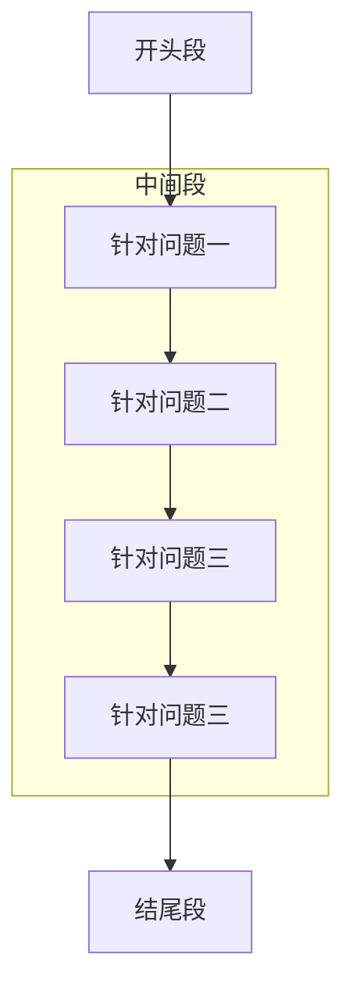

```ad-note
title:思考
  在某个领域发表论文前，首先分析下这个领域的论文形式风格是怎样的

```


	
	引言：从一篇论文的组成出发进行学习，而一篇论文的组成结构如下
	
	首页：论文标题 + 摘要 + 关键词
	
	一、问题重述
	
	二、问题分析
	
	三、模型假设
	
	四、符号说明
	
	五、模型的建立与求解
	
	六、模型的分析与检验
	
	七、模型的评价、改进与推广
	
	八、参考文献
	
	附录


				图：示例图片

>PS:课件前面部分适用于国内的数模比赛，例如国赛、各地区赛事、校赛、五一赛、MathorCup杯、华为杯研赛等，这个论文框架是通用的；课件后面部分将针对美赛(MCM/ICM)讲解，也适用于国内其他用英文写作的数模比赛，例如亚太赛和小美赛

## 1. 首页三要素


### 1. 标题

#### 1. 优秀样例

**2020年国赛优秀论文的标题**

1. 基于一维热传导方程的回焊炉炉温模型
2. 基于一维热传导方程的炉温曲线机理模型研究
3. 基于动态规划、统计分析、静态博弈的穿越沙漠游戏策略设计
4. “穿越沙漠”游戏下玩家的最优策略模型
5. 基于梯度下降的决策树算法与非线性规划的信贷风险评估与信贷策略
6. 针对中小微企业最优信贷决策研究
7. 接触式轮廓仪的自动标注数学模型研究
8. 基于接触式轮廓仪测量数据的工件形状自动标注方法
9. 校园供水系统智能管理

**2019年国赛优秀论文的标题**

1. 基于数值模拟的高压油管压力控制模型
2. 同心鼓“同心协力”策略探究
3. 基于系统模拟的机场出租车决策与安排模型
4. 空气质量数据的校准
5. 基于数据挖掘对“薄利多销”进行分析


#### 2. 格式总结

1. **基于XX方法的XX模型或XXX问题（推荐）**
	Ø 基于利润最大化的奥运商业网点分布微观经济模型（04）
	Ø 基于回归分析的长江水质预测与控制（05）
	Ø 基于Leslie模型的中国人口预测及模特卡罗仿真（07）
	Ø 基于蒙特卡洛模拟的眼科病床安排排队模型（09）
	Ø 基于0-1规划的交巡警平台设置与调度模型（11）
	Ø 基于自适应模拟退火遗传算法的月球软着陆轨道优化（14）
	Ø 基于聚类分析的双目标优化定价模型（17）
	Ø 基于非稳态导热的高温作业专用服装设计（18）
	Ø 基于RFMS 指标的大型百货商场会员画像数据挖掘（18）
2. **直接使用赛题所给的题目或者要研究的问题作为标题**
	空气质量数据的校准
	同心鼓“同心协力”策略探究
	接触式轮廓仪的自动标注数学模型研究


#### 3. 题目要求

对论文题目的要求是：**简短精炼、高度概括、准确得体、恰如其分**
	
既要准确表达论文内容，恰当反映所研究的范围和深度；又要尽可能概括、精炼，力求题目的字数少。==论文题目的字数一般不要超过20个字==。不过，当希望题目字数少与恰当反映论文内容两者发生矛盾时，宁可多用几个字也要力求表达准确。


### 2. 摘要(最重要)


	引言：一切的写作都是为了让别人读懂，至少得让其他人知道你发现了什么问题，做了什么样的工作，取得了什么成效。因为一篇论文的内容很多所以需要提供一个类似于导引一样的东西的存在这是为了让其他人更高效的检索你这篇文章

#### 1. 摘要定义

摘要是对论文内容的一份简短陈述，==不能超过一页==。

#### 2. 摘要作用

使读者或评委在不阅读论文全文的情况下就能获得必要的信息。


#### 3. 摘要组成




##### 1. 开头段

**开头段**：需要充分概括论文内容，一般两到三句话即可，长度控制在三至五行。

第一句话可以简单交代下题目的背景（可选）
第二句话交代你们所做的事情（必须）
第三句话可以说下解决这个问题的实际意义（少部分有）

>（重要性：第二句话> 第一句话> 第三句话）

**例1（19b）**：
	“同心鼓”游戏是一项团队协作能力拓展项目，队员通过拉绳使鼓抬高，达到使球在鼓面上跳动的目的。本文通过建立三维物理模型，利用数学物理方法，分析了“同心鼓”游戏中的物理过程。该问题的研究能为游戏参与者提供指导性意见，帮助参与者取得更好成绩。

**例2 （19c）** ：
	本文针对送客到机场后出租车司机的决策问题，|==背景==|基于排队论、收益与成本博弈，建立了数学模型，为出租车司机提供了选择决策，给出了总乘车效率高时的乘车点安排以及有“优先权”的出租车安排方案。|==所做==|

**例3 （19e）** ：
	“薄利多销”原则被广泛运用于现代商场的促销中，研究商品的折扣力度与销量的关系对扩大商品的销量与提高商场的获益有实际意义。|==背景==|本文围绕薄利多销的分析问题，基于对附件中数据挖掘分析并借助于SPSS 等软件，给出了商场每天的营业额、利润率以及打折力度，并运用回归分析建立了打折力度与商品销售额以及利润率的统计模型。|==所做==|

**例4 （19a）** ：
	本文针对燃油进入和喷出高压油管的过程，以高压油管内压力波动最小为目标建立目标规划模型，对单向阀开启时长、凸轮角速度以及减压阀开启条件等系统参数进行搜索求解，最终稳定管内压力。|==所做==|

**例5 （20c）** ：
	本文主要研究了银行针对中小微企业的信贷决策问题。|==所做==|信贷决策需要银行利用各企业的相关资料与信息，在对企业进行综合评价之后做出是否放贷、放贷多少、期限多久和利率多少等决策的问题。|==背景==|该问题的研究可以使银行在不影响自身收益的条件下，让我国的中小微企业的信贷问题得到改善，同时也提高了银行信贷决策的效率和质量。|==意义==|

>PS:第一个描述和第二个描述有些时候是相反的


##### 2. 中间段


**中间段**：需要对每个问题分别进行叙述，一般需要包含下面三要素：
	1. 解决了什么问题
	2. 应用了什么方法
	3. 得到了什么结果


---

（1）==**解决了什么问题？**==：
	Ø 直接用一句话概括题目要我们求解的问题。（较少见到）
	Ø 不单独提出我们要解决的是什么问题，因为在后面的两个要素中也会提到。（最常见到）
	Ø 可以指出题目中问我们的是什么类型的问题，例如常见的有：预测类、评价类、规划优化类。（极少见到）


**例1 (20c)** ：针对问题一，主要解决两个问题：一是需要量化各企业的信贷风险，二是需要给出银行的最优信贷决策。（方式一）
**例2 (20b)**：针对问题二，本文利用马尔可夫链，建立马尔可夫链天气预测模型，根据第一关的天气转换情况预测其余关卡的天气情况，再根据问题一的模型得出在不同天气状况下的最佳决策。（方式二）
**例3 (20a)**：针对问题二，在大温区温度已知、制程界限给定的前提下确定元件最大过炉速度，实质上是非线性约束条件下的单目标单变量规划求解问题。（方式三）


---
（2）**==应用了什么方法？==**
	这里写出你对于这个问题的求解思路，并说明你应用的模型。==这里写作时一定要紧扣题目本身，不能脱离题目本身来描述模型==。


**例1 (19e)** ：针对问题三，根据问题一和问题二对商场每天的销售额和利润率与打折力度，利用迭代加权最小二乘法，建立了打折力度为自变量、销售额利润率为因变量的线性回归模型。
**例2 (19c)** ：针对上车点的设置问题，需要我们合理安排上车点数量，使得机场乘车效率最高。于是，我们以乘车效率为优化目标，安全因素为约束条件，上车点数量为决策变量，建立单目标优化模型。其中，我们通过合理制定机场出租车乘车区运行规则，利用计算机模拟的方法，计算得到各方案对应的乘车效率。
**例3 (18c)** ：针对问题二，本题选用K-均值聚类法，以消费金额和消费次数作为衡量会员购买力的特征数据，运用SPSS 软件对提取好的数据（见附录2）对会员进行聚类，K 值以公式（1）进行确定。

>PS:类比链式推导法，描述其实就是用链式推导法则对其求解思路进行描述的过程


---
（3）**得到了什么结果？**
	在介绍完使用的建模方法后，一定要加上通过这个方法或者模型得到的结果。一般有下面两种情况
		(i) **需要计算出数值答案**，例如物理题、规划优化类、预测类直接回答该答案即可。（如果模型中有重要参数时，我们可以做灵敏度分析（课件后面会介绍什么是灵敏度分析）；如果涉及概率统计，可以考虑加上置信区间；如果是预测类或者数值计算类，可以考虑加上误差分析）
		(ii) **开放的问题**，例如评价类、提建议类、设计方案策略类对于较为开放的问题，我们在摘要中只需要写出主要的结论，在下结论时一定要有明确支持的观点，不要模棱两可。如果有数值描述的结果更好，例如：采取某种建议或者方案后提高了多少、降低了多少

此外，有时候问题的完整答案很长，这时候只需要在摘要中说出最主要的一部分结果，然后加一句话来引导读者在正文或者附录中查看完整的结果。


**例1 （20a）** ：
利用模拟退火算法迭代20000次进行求解，得到的最优方案为184.2181°C(小温区1~5）、189.8133°C(小温区6）、227.5226°C(小温区7)、264.0700°C(小温区8~9)，传送带过炉速度为90.0982cm/min.
**例2 （20b）** ：
使用Matlab和C++编程求解，最终得到：在最佳策略下，第一关、第二关的剩余资金分别为10470、12730元，并将相应结果填入了Result.xlsx文件;随后，我们对该模型进行了灵敏度分析。
**例3（20c）**：
最终获得基于新冠肺炎突发事件下的信贷调整政策，并将其与第二问的结果进行对比，文章发现新冠疫情的爆发导致银行的信贷策略更加倾向于高新技术产业，这可能和此类产业在疫情间的快速发展有关。
**例4（16b）**：
求解得到小区开放后，周边一级主路的通行力得分提高了为11.32%，二级主路的通行力得分提高了为12.89%，三级主路的通行力得分提高了为0.26%。调整指标之间的直接影响矩阵，发现道路通行力对各指标间相互影响关系的强弱变化比较敏感。


>归纳：XX过程得到了XX结果+(XXX发现)


##### 3. 结尾段(可选)


**结尾段**：可以总结下全文，也可以介绍下你的论文的亮点，也可以对类似的问题进行适当的推广。（如果写不出来的话可以不写，我统计发现只有30%的优秀论文有最后这段）


**例1 (19d)**：文中所建立的模型简便易行，便于推广，可利用国控点
的数据对近邻自建点的数据进行校准。
**例2 (18b)** ：本文的亮点在于：首先，利用一般化的公式对系统调度进行了较为细致的机理分析，使得模型具有普适性；其次，给出了多个调度原则相互比较，从而有利于结果更优；最后，将蒙特卡洛模拟与机器学习的思想相结合，对上述调度原则的有效性进行验证，增强了模型的说服力。
**例3 (20c)** ：最后，本文对模型进行了优、缺点评价与模型推广，得出该模型还可以向银行面对的其他对象和生活的其它方面进行推广的结论。
**例4 (20b)** ：综上所述，本文依据各题所给的条件较全面地分析了相关因素对玩家决策的影响，并给出了不同条件下玩家的最佳策略，实现了在终点的最大收益。经过分析验证，本文的模型具有合理性和一定的现实意义。


#### 4. 摘要要素

1. 解决了什么问题；
2. 应用了什么方法；
3. 得到了什么结果。

>PS:刚开始由于模型没有求解完成该三步比较难写，摘要应该最后来写，结合写作手的具体的理解来写

#### 5. 摘要特点

- 摘要需充分概括论文内容，文字必须十分简练。
- 书写时应注意突出论文的新见解、新方法和特色。
- 陈述要客观，不能带有主观性。

#### 6. 摘要意义

==摘要是数模论文写作中最重要的一部分==，因为评阅老师的时间有限（每篇15分钟），拿到一篇论文后不会完整的从头读到尾，所以评阅老师往往会重点阅读摘要部分，并结合官方的评阅要点来对你的论文进行初步评定。因此，大家一定要好好打磨论文的摘要，==摘要一般是其他部分都完成后再来书写，写完后需要反复阅读反复修改。==


#### 7. 优秀案例

>**注意**：摘要占据的篇幅平均字数在大概1000字左右

| 样例一                                                                           | 样例二                                                                           |
| ----------------------------------------------------------------------------- | ----------------------------------------------------------------------------- |
|  |  |
| **分析学习**<br>1. 总分式描述<br>2. 小标题加粗                                              | **分析学习**<br>1. 总分式描述<br>2. 适当加粗相关字体                                           |
| **样例三**                                                                       | **样例四**                                                                       |
|  |  |

#### 8. 反面案例

| 废话                     | 改进后的说法                                                                 |
|--------------------------|------------------------------------------------------------------------------|
| 本文模型的结果较优       | 模型的××结果是××，相较于××论文中的××结果，在××方面提升了××%               |
| 本文用了比较好的方法     | 模型使用的方法是××，相较于××的××方法，在××方面有显著提升，具体表现为××，提升了××% |
| 本文的模型灵敏性较好     | 当模型中的××参数变化××%时，××结果提升了××%，模型表现较为稳健               |

>Ps:将模糊性的语言转化为确定性的语言，量化的语言;避免空洞，一定要紧密结合题目本身论述
>


### 3. 关键词


| 论文来源 | 关键词                                      |
| ---- | ---------------------------------------- |
| A147 | 热传导方程、牛顿冷却定律、差分法、优化模型、爬山算法、A*算法          |
| A195 | 一维热传导方程、Genetic Algorithm、多变量非线性规划、分层序列法 |
| A212 | 传热模型、炉温曲线、多重搜索算法、模拟退火算法、多目标优化            |
| B078 | 最优化模型、贪心法、回溯法、决策模型、蒙特卡洛方法、博弈论            |
| B108 | 动态规划、统计分析、随机模拟、静态博弈                      |
| B125 | 动态规划、马尔可夫链、人工势能场、博弈论                     |
| B175 | 动态规划、多阶段决策模型、马尔可夫决策过程、马尔可夫预测、博弈思想        |
| C109 | 信贷风险评估、梯度下降法改进的决策树模型、非线性规划、集成学习          |
| C142 | 信贷策略、主成分分析、BP神经网络、遗传算法、突发因素              |
| C170 | 量化分析、信贷风险、信贷决策、违约金字塔理论、突发事件因子            |
| C227 | 特征工程、集成学习算法、多目标规划、XGBoost、系统聚类           |
| C305 | 中小微企业的信贷决策问题、Logistic模型、多目标规划模型、欧氏距离     |

									表：优秀关键词

>Ps:==关键词一般放4-6个==，可以放论文中使用的主要模型，也可以放论文里面
出现次数较多，能体现论文的主要内容的词。


## 2. 问题重述

	引言：前面是起到一个快速总览全文的作用，从此处开始则是正式的分析求解了

数学建模比赛论文是要我们解决一道给定的问题，所以正文部分一般应从问题重述开始，**一般确定选题后就可以开始写这一部分了**。这部分的内容是将原问题进行整理，将问题背景和题目分开陈述
即可，所以基本没啥难度。**本部分的目的是要吸引读者读下去，所以文字不可冗长，内容选**
**择不要过于分散、琐碎，措辞要精练**。

>**注意**：**==在写这部分的内容时，绝对不可照抄原题==**！（论文会查重）应为：**==在仔细理解了问题的基础上，用自己的语言重新将问题描述一遍。语言需要简明扼要，没有必要像原题一样面面俱到==**。


<center><b>图1：2022年C题原题</b></center>

#### 1. 删除替换法


											图2：C227论文重述

>**常规做法**：在原题基础上使用删除、替换等方式来重新组织语言


										图3：实操例子


#### 2. 理解丰富法(高级)


<center><b>图2：C227论文重述</b></center>
<center><b></b></center>

>进阶做法：丰富题目背景，结合自己的分析思路来重新描述问题


<center><b>图4：实操案例</b></center>

```ad-note
title:思想归纳
**“背景的背景”+“一句话分析”**
```


## 3. 问题分析

	引言：在描述完成问题后，理所应当得对其进行分析了，要不然你发现问题不去解决=没有用

从实际问题到模型建立是一种从具体到抽象的思维过程，**问题分析这一部分就是沟通这一过程的桥梁，因为它反映了建模者对于问题的认识程度如何，也体现了解决问题的雏形，起着承上启下的作用，也很能反应出建模者的综合水平**。

这部分的内容应包括：==题目中包含的信息和条件，利用信息和条件对题目做整体分析，确定用什么方法建立模型，一般是每个问题单独分析一小节，分析过程要简明扼要， 不需要放结论==。

==建议在文字说明的同时用图形或图表（例如流程图）列出思维过程==，这会使你的思维显得很清晰，让人觉得一目了然。


>**Ps**:**注意事项**
>>1. 一般占据正文不超过一页，题目问题较多时不超过两页
>>2. **问题分析这一部分放置的位置比较灵活**，可以放在问题重述后面作为单独的一节(见到的频率最高)，也可以放在模型假设和符号说明后面作为单独的一节，还可以针对每个问题将其写在模型建立中。


#### 1. 位置的摆放


<center><b>表：三种不同的摆放位置</b></center>

| 方法一                                                                           | 方法二                                                                           | 方法三                                                                           |
| ----------------------------------------------------------------------------- | ----------------------------------------------------------------------------- | ----------------------------------------------------------------------------- |
|  |  |  |
| 问题分析放在问题重述后面(简单写)                                                             | 问题分析放在模型假设和符号说明后面(复杂写)                                                        | 问题分析分散插入各个模型的求解过程中                                                            |

>Ps:前两个方法是单独把问题分析提出来写，而第三个则是把问题插入到其他小节中来进行描写

```ad-note
title:注意
问题分析不要求一下子写完，整个论文有能一下子写完的片段，也有一下子不能写完的片段，也有最后才能写的片段。得自己归类总结
```

#### 2. 分析的逻辑


| 2019年A023                                                                     |
| ----------------------------------------------------------------------------- |
|  |
| **2019年B047**                                                                 |
|  |
| **2019年C044**                                                                 |
|  |

>Ps:第一个样例、第三个例子都属于总分式写法，第二个样例属于直接开门见山式写法

#### 3. 图形化复述

>**引言**：文字的描述能够表达的信息有限，在你理解文字的基础上你应该进一步将文字阐述的逻辑和关系用图像进行描述和表示，这也是你对自己理解问题能力的表现

| 2020年C170                                                                     |
| ----------------------------------------------------------------------------- |
|  |
| **2020年B078**                                                                 |
|  |
| **2019年C308**                                                                 |
|  |
>Ps:样例一是基于文件视角进行流程描述的，这个方案在概率分析类题目的时候比较合适


## 4. 模型假设

	引言：想要使用数学的语言去解决问题，首先我们得把他抽象成一个基本的数学模型然后去对他进行求解


在对问题进行分析后，发现有些因素或条件，还无法进行考虑或估算；或是针对问题的主要因素，舍弃次要因素的影响，采用假设的方式，使我们解决的问题简化，模型更合理化。

>Ps:之所以要这么做，是因为我们考虑的能力是有限的，如果不加以限制，我们要考虑的因素就没完没了了

模型假设是建立数学模型中非常关键的一步，关系到模型的成败和优劣。所以，应该细致地分析实际问题，从大量的变量中筛选出最能表现问题本质的变量，并简化它们的关系。由于假设一般不是实际问题直接提供的，它们因建模人而异，所以在撰写这部分内容时要注意以下几方面：

(1) 论文中的假设要以严格、确切的语言来表达，使读者不致产生任何曲解。
(2) 所提出的假设确实是建立数学模型所必需的，包括求解模型所必需的假设和简化模型而做的假设。最终结果与假设之间会有很强的因果关系，与建立模型无关的假设只会扰乱读者的思考。
(3) 假设应验证其合理性。假设的合理性可以从分析问题的过程中得出，例如从问题的性质出发作出合乎常识的假设；或者由观察所给数据的图像，得到变量的函数形式；也可以参考其他资料类推得到，对于后者应指出参考文献的相关内容。


---

### 1. 常见情况


1. **题目明确给出的假设条件**
    
    - 直接使用题目中提供的假设条件。
    - 例子：在2020B题第1问中，假设玩家知道每天的天气状况。
2. **排除生活中的小概率事件**
    
    - 排除不太可能发生或非正常的事件。
    - 例子：
        - 交通运输问题：排除地质灾难、交通事故等。
        - 经济金融问题：排除经济危机、系统风险等。
        - 生产制造问题：排除设备故障、生产事故等。
3. **仅考虑问题中的核心因素**
    
    - 专注于问题的主要因素，忽略次要因素。
    - 注意：过于简化的模型可能缺乏优势和亮点。
    - 例子：
        - 传染病传播：忽略性别、年龄等因素的影响。
        - 交通拥堵：只考虑机动车，忽略非机动车和行人。
        - 人口预测：不考虑移民、大规模人口迁移等因素的影响
4. **使用的模型中要求的假设**
    
    - 博弈论模型：假设参与者都是理性的。
    - Markov模型：假设系统或状态具有无后效性。
    - 回归模型：假设扰动项服从独立的正态分布。
5. **对模型中的参数形式（或者分布）进行假设**
    
    - 人口增长：假设服从阻滞增长模型（Logistic模型）。
    - 鱼群自然死亡率：在不考虑环境变动时，假设为常数。
    - 产品寿命或旅客进机场的时间间隔：假设服从指数分布。
    - 排队人数或机器故障数：假设服从泊松分布。
    - 产品参数（如重量、大小）：假设服从正态分布 $N(μ,σ^2)$，且各产品独立。
6. **和题目联系紧密的一些假设，主要是为了简化模型**
	- 这类假设与题目以及建立的模型结合的很紧密，需要我们深入挖掘。


### 2. 应用举例


|          |                                                |
| -------- | ---------------------------------------------- |
| 编号       | 假设条件                                           |
| **A195** |                                                |
| 1        | 仅考虑热传导和热对流对元件焊接区域中心温度的影响；                      |
| 2        | 假设元件在回焊炉中运动过程不影响炉腔内温度分布；                       |
| 3        | 假设各个小温区中心保持恒温，回焊炉达到稳定工作状态后温度分布不再改变；            |
| 4        | 假设元件为材质处处均匀的带厚度无限大平板，内部不含热源。                   |
| **A212** |                                                |
| 1        | 假设观测误差、随机误差和连续问题离散化所产生的误差对本题的计算是没有影响的；         |
| 2        | 在回焊炉中传热方式仅考虑热传导、热对流，假设热辐射对本题结果的计算没有影响；         |
| 3        | 假设回焊炉温度高于室内温度的区域（即加热区域）的温度能够保持不变，每个温区内的温度均匀分布； |
| 4        | 假设在温度变化不大的情况下热时间常数和热空气和电路板间的热对流系数均保持不变。        |

										表：2020年A题论文中的例子


| 编号 | 假设条件 |
|------|----------|
| **B108** | |
| 1 | 对于天气不确定情况，各种情况的出现概率固定。在处理天气不确定的策略时，我们认为应当有对于天气概率的一些预期信息。为了简化我们处理为各种情况按固定概率出现。 |
| 2 | 确定天气下的最优方案包含了随机天气下优秀方案的共性。除了确定的天气情况下我们可以得出确定的最优解外，含有博弈和随机天气的情况均不能得到严格最优解。我们认为单人确定性天气下得到的最优方案包含了方案优化中的特征，据此我们可以通过数据分析提取这些优化策略。 |
| 3 | 多人游戏时，每个玩家都是理性人。多人游戏中，玩家总希望自己能存活并获得尽可能多的收益。由于玩家在沙漠中行走没有合作机制，因此合作博弈的基本条件不成立，因此所有玩家都进行不合作博弈，即完全为自己的利益考虑。 |
| 4 | 这是一个纯粹的游戏，不涉及生命伦理问题，即我们可以对游戏者在沙漠中“死亡”的可能性进行分数量化。本模型允许给出对游戏者在沙漠中因缺乏食物而失败的方案，并对此进行量化评分。这对于实际人穿越沙漠问题这样的解应当排除，因为生命无价。 |

										表：2020年B题论文中的例子


| 编号       | 假设条件                                                                                                 |
| -------- | ---------------------------------------------------------------------------------------------------- |
| **C109** |                                                                                                      |
| 1        | 假设贷款利率仅与客户流失率有关，不考虑其他影响因素；                                                                           |
| 2        | 银行针对各企业的信贷评估仅考虑企业实力、企业信誉两方面；                                                                         |
| 3        | 银行通过综合评估企业的信贷风险来确定具体的信贷策略，不考虑其他因素。                                                                   |
| **C305** |                                                                                                      |
| 1        | 市场的风险与信誉风险之间没有关系，即在该小问中只考虑企业信誉风险对银行决策的影响，将市场风险看作不存在；                                                 |
| 2        | 信用等级是离散的，且在同一等级中的企业违约的概率相同。在利用Excel表格对数据进行筛选之后，我们发现违约企业大多为信誉评级为C、D两个等级的企业，A、B两个等级的企业很少违约；            |
| 3        | 总体风险用银行所放贷的金额中最大的一个风险来衡量。当对所有企业发放贷款的最大的风险都是最小的时候的总体风险也是较小的；                                          |
| 4        | 在做决策的这段时间内，平均收益率、交易费率、风险损失率以及同期银行的存款利率都可以看作常数。若平均收益率、交易率、风险损失率以及同期银行存款利率是变化的，那么此时建立的模型是不具有说服力的；      |
| 5        | 净收益和总体的风险只会受到平均收益率、交易费率、风险损失率的影响，而与其他因素无关。平均收益率、交易费率、风险损失率是目前已知的较为重要的数据，若考虑其他未知因素和影响甚小的因素不利于数学模型的建立。 |

										表：2020年C题论文中的例子


| 编号 | 假设条件 |
|------|----------|
| **E029** | |
| 1 | 供水系统整体运行稳定； |
| 2 | 只要用水，水表就如实记录数据； |
| 3 | 数据较为全面地反映了学校的用水情况，没有遗漏。（和第2点没太大区别？） |
| **E040** | |
| 1 | 假设一级水表采用测量精度较高的电磁水表； |
| 2 | 假设二级至四级采用均已广泛使用机械速度式水表，并有2%-5%的相对误差； |
| 3 | 无人蓄意破坏供水管道；（下面这三点可以合并到一起） |
| 4 | 各水表工作在理想状态下，不受强磁等外界因素干扰； |
| 5 | 水质良好，无明显杂质，不对机械速度式水表产生过大影响。 |

									表：2020年E题论文中的例子


```ad-note
title:思考
**有些时候你所习以为常的因素就是假设，要善于全面发现这些所谓习以为常的因素**
```


### 3. 问题整理

**（1）模型假设的合理性怎么保证？**
	事实上，**很少见到有论文来对模型中假设的合理性进行论证**，如果需要论证的话可以考虑下面两个角度：第一：可以引用别人的文献或者资料，这样最有说服力；第二：如果要对模型中的参数形式(或者分布)进行假设，**可以在正文中使用实际数据进行绘图或者进行假设检验来支持你的假设。**


**（2）模型假设设置的太强怎么办？**
	有同学为了简化问题，往往会给定过强的假设，事实上这样是有一定风险的，模型过于简单会显得你的论文没有深度和亮点。如果你建立的模型比别人考虑的 因素更多的话，可以在某种程度上看成一种创新。但大多数时候，我们想考虑的 因素或条件也很难进行估算或者考量，这时候你可以在论文后面的模型评价与改进部分加上你的想法，这样可以在一定程度上弥补这个问题。


## 5. 符号说明

	引言：你所使用的变量名要统一进行登记，这相当于是翻译你后文推导过程中的加密密码表，如果没有这张表那么你大部分的推导都会变成个人独秀。记住，论文是写给人看的，不是你的个人秀！

本部分是对模型中使用的重要变量进行说明，一般排版时要放到一张表格中。

**注意：**
	第一：不需要把所有变量都放到这个表里面，模型中用到的临时变量可以不放。
	第二：下文中首次出现这些变量时也要进行解释，不然会降低文章的可读性。


### 1. 三线表表示

这里的表格形式叫做“三线表”，一般在科技论文中被推荐使用，感兴趣的同学可以看我讲
的专门的排版视频。**（注意：最好是再加一列，各符号的单位）**


											图：三线表样例1


										图：三线表样例2


									图：三线表样例3