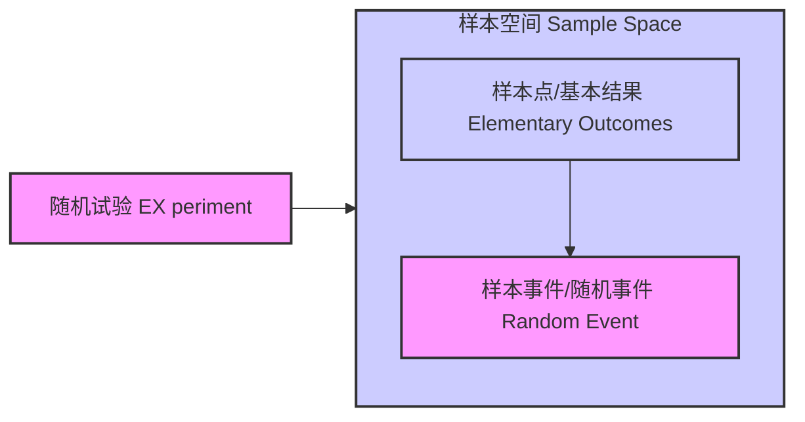
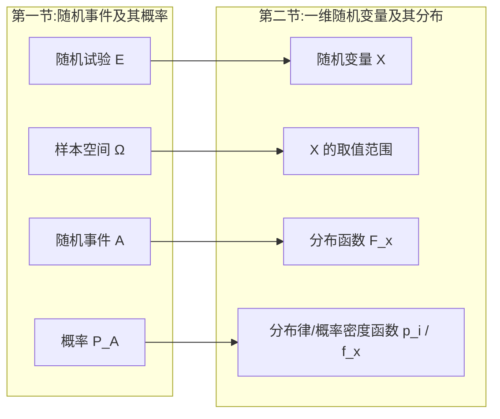

- [概率论的起源 (matongxue.com)](https://www.matongxue.com/lessons/686/parts/1383)
- [什么是概率 (matongxue.com)](https://www.matongxue.com/lessons/687/parts/1389)


- # 1. 本书回忆

- ## 1.1. 符号回忆

**1. 随机事件及其概率**

* $E$: 随机试验/试验 (Experiment)
* $w, e$: 样本点/基本结果 (Elementary Outcome)
* $\varOmega$: 样本空间 (Sample Space)
* $A$: 样本集合/随机事件/事件 (Random Event)
* $P(A)$: 事件 A 发生的概率
* $P(A \cap B)$: 发生 A 与 B 交事件的概率
* $P(AB)$: 发生 A 又发生 B 事件的概率
* $\emptyset$: 不可能事件 (Impossible Event)
* $A \cup B$: 事件 A 或事件 B 发生 (Union of Events)
* $A \cap B$或$AB$: 事件 A 和事件 B 同时发生 (Intersection of Events)
* $A^c$或$\overline{A}$: 事件 A 不发生 (Complement of an Event)
* $A\subseteq B$: 事件 A 是事件 B 的子事件
* $A \setminus B$或$A - B$: 事件 A 发生但事件 B 不发生 (Difference of Events)
* $F_{n}(H)$: 在 n 次抛掷中正面朝上的频率
* $F_{n}(T)$: 在 n 次抛掷中反面朝上的频率
* $C_n^k$: 组合数，从 n 个元素中选择 k 个元素的组合数
* $f(x)$: 概率密度函数 (PDF)

**2. 一维随机变量及其分布**

* $X$: 随机变量
* $F(x)$: 随机变量 X 的分布函数
* $a_i$: 离散型随机变量 X 的可能取值
* $p_i$: 离散型随机变量 X 取值为$a_i$的概率，即$P\{X=a_i\}$
* $C_n^k$: 二项分布中的组合数，表示从 n 次试验中成功 k 次的组合数
* $\lambda$: 泊松分布的参数，表示单位时间或空间内事件的平均发生率
* $e$: 自然常数，约等于 2.71828
* $f(x)$: 连续型随机变量 X 的概率密度函数 (PDF)
* $\theta$: 指数分布的参数，表示事件的平均发生间隔时间
* $\mu$: 正态分布的均值
* $\sigma$: 正态分布的标准差
* $\phi(x)$: 标准正态分布的概率密度函数
* $\Phi(x)$: 标准正态分布的分布函数

**3. 多维随机变量及其分布**

* $(X, Y)$: 二维随机变量或随机向量
* $F(x, y)$: 二维随机变量$(X, Y)$的联合分布函数
* $a_i, b_j$: 二维离散型随机变量$(X, Y)$的可能取值
* $p_{ij}$: 二维离散型随机变量$(X, Y)$取值为$(a_i, b_j)$的概率，即$P\{X=a_i, Y=b_j\}$
* $f(x, y)$: 二维连续型随机变量$(X, Y)$的联合密度函数
* $F_X(x)$: 随机变量 X 的边缘分布函数
* $F_Y(y)$: 随机变量 Y 的边缘分布函数
* $f_X(x)$: 随机变量 X 的边缘密度函数
* $f_Y(y)$: 随机变量 Y 的边缘密度函数

**4. 随机变量的数字特征**

* $E(X)$: 随机变量 X 的数学期望（均值）
* $D(X)$: 随机变量 X 的方差
* $\sigma$: 随机变量 X 的标准差
* $\mathrm{cov}(X, Y)$: 随机变量 X 和 Y 的协方差
* $\rho(X, Y)$或$\rho_{XY}$: 随机变量 X 和 Y 的相关系数
* $M_k$: 样本 k 阶原点矩
* $M_k^*$: 样本 k 阶中心矩
* $\boldsymbol \varSigma$: 随机变量的协方差矩阵
* $\boldsymbol R$: 随机变量的相关系数矩阵
* $Z$: 标准分数（Z-score）

**5. 极限定理**

* $X_n$: 随机变量序列中的第 n 个随机变量
* $X_n \xrightarrow[n \rightarrow +\infty]{P} X$: 随机变量序列$\{X_n\}$依概率收敛于随机变量 X
* $X_n \xrightarrow[n \rightarrow +\infty]{L} X$: 随机变量序列$\{X_n\}$依分布收敛于随机变量 X
* $\overline X_n$: 随机变量序列$\{X_i\}$的前 n 项的算术平均
* $\mu$: 随机变量的期望值
* $\sigma^2$: 随机变量的方差
* $\varPhi(x)$: 标准正态分布 N(0, 1) 的分布函数
* $Y_n$: 随机变量序列$\{X_i\}$的前 n 项之和
* $B(1, p)$: 伯努利分布，参数为 p
* $B(n, p)$: 二项分布，参数为 n 和 p

**6. 数理统计的基本概念**

* $X$: 总体
* $F(x)$: 总体的分布函数
* $X_1, X_2, ..., X_n$: 来自总体 X 的样本
* $n$: 样本容量
* $x_1, x_2, ..., x_n$: 样本值
* $\varOmega$: 样本空间
* $T(x_1, x_2, ..., x_n)$: 统计量
* $\overline X$: 样本均值
* $S^2$: 样本方差
* $S$: 样本标准差
* $M_k$: 样本 k 阶原点矩
* $M_k^*$: 样本 k 阶中心矩
* $X_{(k)}$: 顺序统计量
* $R$: 样本极差
* $\widetilde X$: 样本中位数
* $F_n(x)$: 经验分布函数
* $f_i$: 事件$\{t_i < X \leqslant t_{i-1}\}$在 n 次试验中发生的频率
* $y_i$: 直方图中小区间$[t_i, t_{i+1})$上水平线段的高度值
* $v_p$: 随机变量 X 的（下侧）p 分位数
* $u_p$: 标准正态分布的分位数
* $t_p(n)$: t 分布的分位数
* $\chi_p^2(n)$:$\chi^2$分布的分位数
* $F_p(m, n)$: F 分布的分位数

**7. 参数估计**

* $\theta_1, \theta_2, ..., \theta_k$: 总体的未知参数
* $\varTheta$: 参数$\theta_1, \theta_2, ..., \theta_k$可能的取值范围，称为参数空间
* $L(\theta_1, \theta_2, ..., \theta_k; x_1, x_2, ..., x_n)$: 似然函数
* $\hat \theta_l$: 未知参数$\theta_l$的最大似然估计值

**8. 假设检验**

*   （未提供相关符号）

**9. Bootstrap 方法**

*   （未提供相关符号）

**10. 随机过程**

*   （未提供相关符号）

**11. 马尔可夫链**

*   （未提供相关符号）

**12. 平稳随机过程**

*   （未提供相关符号）

**13. 时间序列分析**

*   （未提供相关符号）


- # 2. 本书重点

- # 3. 本书犯错

- # 4. 本书思考

# 1.随机事件及其概率

- # 1. 本节回忆

好的，以下是实验、样本空间、随机事件和基本结果之间关系的概括，并附上 Mermaid 图：

**关系概括：**

*   **随机试验/试验 (E(X)periment):** 是一个产生明确结果的过程，用$E$表示。
*   **样本集合/随机事件/事件 (Random Event):** 样本空间的一个子集，即一些基本结果的集合，用$A$表示。
*   **样本点/基本结果/结果 (Elementary Outcome):** 实验中可能出现的不可再分的结果，用$w,e$等表示。
*   **样本空间 (Sample Space):** 所有可能的基本结果的集合，用$\varOmega$表示




**解释：**

1.  一个**实验**会产生若干个**基本结果**。
2.  所有可能的**基本结果**构成了**样本空间**。
3.  **随机事件**是**样本空间**的子集，由一个或多个**基本结果**组成。

- # 2. 本节重点


- # 3. 本节犯错

1. 误把概率运算当成集合运算去关联想象导致混淆$P(A\cap B)$与$P(AB)$的含义了，前者表示发生 A 与 B 交事件的概率，后者表示即发生 A 又发生 B 事件的概率。

2. 不相容（互斥）与独立是概率论中两个不同的概念，二者在一般情况下无法同时成立，具体关系如下：

	1. **互不相容**（互斥）指两个事件 **不能同时发生**，即$P(A \cap B) = 0$。例如，抛一枚硬币，“正面”和“反面”是典型的互斥事件。

	2. **独立**指两个事件的发生 **互不影响**，满足$P(A \cap B) = P(A)P(B)$。例如，连续抛两次硬币的结果是独立事件。

	3. **关键区别**：  
	   - 若两事件 **概率均大于0**（即$P(A) > 0, P(B) > 0$），则 **独立与互不相容不能同时成立**。  
	     原因：若互不相容，则$P(A \cap B) = 0$，而若独立，则$P(A \cap B) = P(A)P(B) > 0$，二者矛盾。  
	   - 只有当 **至少一个事件的概率为0** 时，两者才可能同时满足（此时$P(A)P(B) = 0$）。

	4. **总结**：  
	   - 互不相容事件 **必然不独立**（若概率均非零），因为互不相容意味着一个事件的发生会完全排除另一个事件的发生，这本身构成了一种依赖关系。  
	   - 独立事件 **必然相容**（若概率均非零），因为独立性要求它们可以同时发生（即交集概率非零）。


3. 古典概率认为样本点的发生是等可能的，不要误认为样本事件的发生是等可能的。样本事件在几何上属于样本点的集合，其概率也是想要的集合

## 1.1. 随机现象

- 【**定义**】：在个别实验中其结果呈现出不确定性，在大量重复实验结果中又具有统计规律

## 1.2. 随机事件

### 1.2.1 随机事件的定义

- **【定义】**：具有以下三个特征的试验称为随机试验。
	
	1. 试验可以在相同条件下重复进行；
	2. 每次试验可能结果不止一个，并且试验前可以确定所有可能出现的结果；
	3. 每次试验之前不能准确预言出哪一个结果会出现。
	

```ad-question
title:**随机现象和随机事件概念的区别？**
随机现象和随机事件是概率论中两个密切相关但又不同的概念。

**随机现象 (Random Phenomenon):**

*   **定义：** 指的是在一定条件下，结果不确定，可能出现多种不同结果的现象。
*   **特点：**
    *   可以在相同的条件下重复进行。
    *   每次试验的结果事先无法确定。
    *   多次重复试验的结果呈现出一定的统计规律性。
*   **例子：** 抛硬币、掷骰子、测量某地区的气温、观察某产品的寿命等。

**随机事件 (Random Event):**

*   **定义：** 是随机现象中某些基本结果的集合，是样本空间的一个子集。
*   **特点：**
    *   是随机现象可能出现的结果。
    *   可以用集合的形式表示。
    *   有发生的概率。
*   **例子：**
    *   抛硬币：出现正面（这是一个随机事件）。
    *   掷骰子：出现点数大于 4（这也是一个随机事件）。
    *   测量气温：气温在 20°C 到 30°C 之间（也是一个随机事件）。

**区别总结：**

| 特征       | 随机现象 (Random Phenomenon)                               | 随机事件 (Random Event)                               |
| ---------- | ------------------------------------------------------------ | ------------------------------------------------------------ |
| **本质**   | 一种过程或试验                                               | 一种结果或结果的集合                                         |
| **确定性** | 结果不确定                                                   | 有可能发生，也有可能不发生                                     |
| **表示**   | 描述性的，例如“抛硬币”                                       | 用集合表示，例如“出现正面”                                   |
| **概率**   | 随机现象本身没有概率，概率是针对随机现象中的特定事件而言的。 | 随机事件有发生的概率。                                       |

**关系：**

随机事件是随机现象的结果。一个随机现象包含多个可能的随机事件。概率论研究的就是在随机现象中，各种随机事件发生的可能性大小。

==简单来说，随机现象是“做什么”，随机事件是“可能发生什么”。==

```

### 1.2.2 样本空间的定义

- **【定义】**：将随机试验$E$中可能出现的**基本结果称为样本点**，一般用小写字母$w,e$等表示，由所有样本点组成的集合称为$E$的样本空间，记为$\varOmega$。

```ad-question
title:**为什么要用点和空间的概念刻画样本？**
我理解你想知道为什么在机器学习或统计学中，我们经常使用点和空间的概念来描述样本。以下是一些关键原因：

*   **几何直观性：** 将每个样本视为空间中的一个点，可以帮助我们利用几何直觉来理解数据。例如，相似的样本在空间中会更接近，而不同的样本会更远。
*   **数学工具：** 这种表示方法使我们能够应用大量的数学工具，如距离度量（欧几里得距离、曼哈顿距离等）、向量运算、线性代数等，来分析和处理数据。
*   **特征表示：** 样本的每个特征都可以看作是空间中的一个维度。因此，一个样本点的位置由其在每个特征维度上的值决定。这种表示方法能够捕捉样本的全部特征信息。
*   **空间结构：** 通过将样本放置在空间中，我们可以研究数据的空间结构，如聚类、分布、密度等。这有助于我们发现数据中的模式和关系。
*   **算法应用：** 许多机器学习算法，如K近邻算法、支持向量机、聚类算法等，都是基于点和空间的概念设计的。这些算法利用样本点之间的距离或空间关系来进行预测、分类或聚类。

总而言之，使用点和空间的概念来描述样本，可以帮助我们更好地理解、分析和处理数据，并为机器学习算法的应用提供基础。

```

### 1.2.3 样本空间的集合表示

- **【定义】**：我们用样本空间$\varOmega$中的子集代表随机事件$A$，也可以记为基本样本点的一个集合，如$A=\{w_1,w_2,w_3 \}$。

- **【代表】**：
	*   **不可能事件 (Impossible Event):** 用$\emptyset$表示，代表不包含任何基本结果的空集。它的概率为$P(\emptyset) = 0$。
	*   **必然事件 (Certain Event):** 用$\Omega$表示，代表包含所有基本结果的样本空间本身。它的概率为$P(\Omega) = 1$。
	*   **随机事件 (Random Event):** 通常用大写字母$A, B, C$等表示，代表样本空间$\Omega$的一个子集。

*   **样本空间 (Sample Space):** 通常用$\Omega$(大写的欧米茄) 或$S$表示，代表所有可能基本结果的集合。
*   **基本结果 (Elementary Outcome):** 通常用$\omega$(小写的欧米茄) 表示，代表样本空间中的一个元素。

*   **事件的并 (Union of Events):**$A \cup B$表示事件$A$或事件$B$发生。
*   **事件的交 (Intersection of Events):**$A \cap B$或$AB$表示事件$A$和事件$B$同时发生。
*   **事件的补 (Complement of an Event):**$A^c$或$\overline{A}$表示事件$A$不发生。


### 1.2.4 事件之间的关系及运算*

>**总结**：本章节做题的关键就在于理解这个 “关系” 的公式、 “运算” 的公式。


>**注意**：此处的$\subset$皆表示包含于而不是真包含于的意思，符号含义详情见[[高中数学 人教版 笔记]]

>**思考**：前面由于定义随机事件的本质为集合，故这里就可以借助集合运算的一些结论去反推其含义。

1. **子事件**：
	
	- **定义：** 若事件$A$发生必然导致事件$B$发生，则称$A$为$B$的子事件，记作$A\subseteq B$。
	- **含义：** 事件$A$是事件$B$的一部分，或者说事件$A$的发生是事件$B$发生的充分条件。
	- **例子：**
	    - 掷骰子事件 B = {出现偶数点}，事件 A = {出现 2 点}，则 A 是 B 的子事件，因为如果出现了 2 点，必然出现偶数点。
	    - 从一批产品中抽取一个，事件 B = {抽到次品}，事件 A = {抽到一等品}，则 A 不是 B 的子事件，因为抽到一等品并不能保证抽到次品。
	
2. **和事件 (Union of Events):**
	
	*   **定义：** 设$A$和$B$是两个事件，事件$A$和事件$B$至少有一个发生，称为事件$A$与事件$B$的和事件，记作$A \cup B$(或$A+B$)。
	*   **含义：**$A \cup B$发生，当且仅当$A$发生，或$B$发生，或$A$和$B$同时发生。
	*   **推广：** 对于多个事件$A_1, A_2, ..., A_n$，它们的和事件$A_1 \cup A_2 \cup ... \cup A_n$表示这些事件中至少有一个发生。
	
3. **积事件 (Intersection of Events):**
	
	*   **定义：** 设$A$和$B$是两个事件，事件$A$和事件$B$同时发生，称为事件$A$与事件$B$的积事件，记作$A \cap B$(或$AB$)。
	*   **含义：**$A \cap B$发生，当且仅当$A$发生且$B$发生。
	*   **推广：** 对于多个事件$A_1, A_2, ..., A_n$，它们的积事件$A_1 \cap A_2 \cap ... \cap A_n$表示这些事件同时发生，我们用符号。
		
4. **互斥事件与对立事件:**
	
	*   **互斥事件 (Mutually E(X)clusive Events):**
	    *   **定义：** 设$A$和$B$是两个事件，如果$A \cap B = \emptyset$，即$A$和$B$不能同时发生，则称$A$和$B$是互斥事件。
	    *   **推广：** 多个事件$A_1, A_2, ..., A_n$两两互斥，是指其中任意两个事件都不能同时发生，即$A_i \cap A_j = \emptyset$(对于所有$i \neq j$)。
	*   **对立事件 (Complementary Events):**
	    *   **定义：** 设$A$和$B$是两个事件，如果$A \cap B = \emptyset$且$A \cup B = \Omega$，即$A$和$B$不能同时发生，且必然有一个发生，则称$A$和$B$是对立事件。事件$A$的对立事件记作$\overline{A}$。
	    *   **关系：** 对立事件一定是互斥事件，但互斥事件不一定是对立事件。
	    *   **例子：** 抛一枚硬币，“正面朝上”和“反面朝上”是对立事件；掷一个骰子，“出现奇数点”和“出现偶数点”是对立事件；而“出现 1 点”和“出现 2 点”是互斥事件，但不是对立事件。
	
5. **差事件 (Difference of Events):**
	
	*   **定义：** 设$A$和$B$是两个事件，事件$A$发生但事件$B$不发生，称为事件$A$与事件$B$的差事件，记作$A \setminus B$(或$A - B$)。
	*   **含义：**$A \setminus B$发生，当且仅当$A$发生且$B$不发生。
	*   **关系：**$A \setminus B = A \cap \overline{B}$
	
6. **完备事件组 (Partition of the Sample Space):**
	
	*   **定义：** 设$A_1, A_2, ..., A_n$是一组事件，如果它们满足：
	    *$A_i \cap A_j = \emptyset$(对于所有$i \neq j$)，即它们两两互斥；
	    *$A_1 \cup A_2 \cup ... \cup A_n = \Omega$，即它们的和事件是样本空间。
	    *   则称$A_1, A_2, ..., A_n$构成一个完备事件组，或称为样本空间的一个划分。
	*   **含义：** 在每次试验中，这组事件中必有一个发生，且只能发生一个。
	*   **例子：** 掷一个骰子，“出现 1 点”、“出现 2 点”、“出现 3 点”、“出现 4 点”、“出现 5 点”、“出现 6 点”构成一个完备事件组。

```ad-question
title:**如何理解样本空间S的子集的容许与不容许问题？**
要理解“事件是样本空间S的子集”这一定义，需结合数学严谨性与实际应用中的简化处理，具体可分三步：

1. **基础概念**  
   严格来说，事件是样本空间S的子集。若S是有限集或可列无限集（如自然数集），则其所有子集均可视为合法事件。例如，掷骰子的样本空间S={1,2,3,4,5,6}，任何子集（如“偶数点”{2,4,6}）都是事件。

2. **不可列无限集的特殊性**  
   当S是不可列无限集（如实数区间[0,1]）时，某些子集无法赋予合理的概率测度，被称为“不可容许的子集”。这类子集在数学上存在（如维塔利集合），但实际问题中几乎不会遇到[[①]]。这种限制源于测度论的公理化要求，确保概率的可加性和非负性等性质成立。

3. **实际应用的简化**  
   为避免理论复杂性，实际研究中默认所有讨论的事件都是“容许”的子集。例如，连续型随机变量的概率计算通常仅涉及Borel可测集（如区间、开集等），这些子集具有良好的测度性质[[①]]。读者若需深入，可参考《概率论与数理统计》中关于σ-代数和测度空间的章节。

此理解过程体现了从抽象定义到具体应用的过渡，符合“先记基础、再逐步深化”的认知规律。
```


>**注意**：上图除了德摩根律代表的是集合计算公式（德摩根律第一个错写了，真正正确的参见下文），其他都是概率计算基本公式；$P(AB)$表示事件$A$和事件$B$**同时发生**的概率，而不是他们交事件$P(A\cap B)$发生的概率，前者的 Venn 图是在 A 图中以一定比取 B 事件发生有着依次的含义 ，后者则是取两者的公共部分事件的发生有着同时的含义。

---
#### （1）集合关系

##### 1）**德摩根律**  
**公式**：  
$$
\overline{A \cup B} = \overline{A} \cap \overline{B}, \quad \overline{A \cap B} = \overline{A} \cup \overline{B}
$$
**证明**：  
- **第一式**：若$x \in \overline{A \cup B}$，则$x \notin A \cup B$，即$x \notin A$且$x \notin B$，故$x \in \overline{A} \cap \overline{B}$。反之亦然，因此等式成立。  
- **第二式**：若$x \in \overline{A \cap B}$，则$x \notin A \cap B$，即$x \notin A$或$x \notin B$，故$x \in \overline{A} \cup \overline{B}$。反之亦然，因此等式成立。  
**引用**：德摩根律是命题逻辑中的基本等价关系，可通过真值表法验证。

>**回忆**：$\overline A$表示事件 A 的对立事件（集合论的角度也称之为补事件）。

>**注意**：该定理是用于描述集合运算的！！不是直接描述事件概率运算的！！

>**思考**：这个定律成功的将和、并集合的补集计算拆解成对于两个独立集合补集运算。


<center><b>图：德摩根定理的扩展阅读</b></center>


**场景：**

假设我们需要编写一个函数来判断一个用户是否有资格参加某个活动。资格要求如下：

1.  年龄必须大于等于 18 岁。
2.  必须是会员，或者购买了活动门票。

**原始代码：**

```python
def is_eligible(age, is_member, has_ticket):
    if age >= 18 and (is_member or has_ticket):
        return True
    else:
        return False
```

这个代码逻辑清晰，但可以利用德摩根定律进行优化。

**德摩根定律：**

*   $\overline{A \cup B} = \overline{A} \cap \overline{B}$
*   $\overline{A \cap B} = \overline{A} \cup \overline{B}$

**优化思路：**

1.  **找到原始判断的否定条件：**
    *   原始判断：`age >= 18 and (is_member or has_ticket)`
    *   否定条件：`not (age >= 18 and (is_member or has_ticket))`
2.  **应用德摩根定律：**
    *   将否定条件展开：
        `not (age >= 18 and (is_member or has_ticket))`
        等价于
        `(not (age >= 18)) or (not (is_member or has_ticket))`
        等价于
        `(age < 18) or ((not is_member) and (not has_ticket))`
3.  **简化代码：**
    *   原始代码返回 True 的条件是 `age >= 18 and (is_member or has_ticket)`
    *   那么返回 False 的条件就是 `(age < 18) or ((not is_member) and (not has_ticket))`
    *   因此，我们可以直接判断返回 False 的条件，否则返回 True。

**优化后的代码：**

```python
def is_eligible_optimized(age, is_member, has_ticket):
    if age < 18 or (not is_member and not has_ticket):
        return False
    else:
        return True
```

**更简洁的代码：**

```python
def is_eligible_concise(age, is_member, has_ticket):
    return not (age < 18 or (not is_member and not has_ticket))
```

**优化效果：**

*   **逻辑简化：** 通过德摩根定律，将复杂的 `and` 和 `or` 混合判断转化为更简单的 `or` 和 `and` 判断。
*   **可读性提升：** 优化后的代码更直接地表达了不符合资格的条件，更容易理解。
*   **潜在的性能提升：** 在某些情况下，优化后的代码可能具有更好的性能，因为它可以更快地确定不符合资格的情况。

**总结：**

这个案例展示了如何利用德摩根定律简化代码判断逻辑，提高代码的可读性和潜在性能。在实际编程中，可以根据具体场景灵活应用德摩根定律，优化代码结构。

##### 2）互斥事件 

-   **定义：** 设 $A$ 和 $B$ 是两个事件，如果 $A \cap B = \emptyset$，即 $A$ 和 $B$ 不能同时发生，则称 $A$ 和 $B$ 是互斥事件(Mutually Exclusive Events)。

-   **符号表示：** $A \cap B = \emptyset$

-   **概率表示：** $P(A \cap B) = 0$

-   **性质：**

    1.  **基本性质：** 互斥事件不能同时发生。
    2.  **概率加法公式：** 如果 $A$ 和 $B$ 互斥，则 $P(A \cup B) = P(A) + P(B)$。
    3.  **推广：** 多个事件 $A_1, A_2, ..., A_n$ 两两互斥，是指其中任意两个事件都不能同时发生，即 $A_i \cap A_j = \emptyset$ (对于所有 $i \neq j$)。此时，$P(A_1 \cup A_2 \cup ... \cup A_n) = P(A_1) + P(A_2) + ... + P(A_n)$。
    4.  **互斥事件不一定是对立事件：** 互斥事件只是不能同时发生，但可以都不发生。

-   **例子：**

    *   抛一枚硬币，“正面朝上”和“反面朝上”是互斥事件（但也是对立事件）。
    *   掷一个骰子，“出现 1 点”和“出现 2 点”是互斥事件，但不是对立事件。
    *   在一次抽奖活动中，事件 A = {中一等奖}，事件 B = {中二等奖}，如果一等奖和二等奖不能同时中，则 A 和 B 是互斥事件。

##### 3）对立事件 

-   **定义：** 设 $A$ 和 $B$ 是两个事件，如果 $A \cap B = \emptyset$ 且 $A \cup B = \Omega$，即 $A$ 和 $B$ 不能同时发生，且必然有一个发生，则称 $A$ 和 $B$ 是对立事件(Complementary Events)。事件 $A$ 的对立事件记作 $\overline{A}$。

-   **符号表示：** $A \cap B = \emptyset$ 且 $A \cup B = \Omega$

-   **概率表示：** $P(A \cap B) = 0$ 且 $P(A \cup B) = 1$

-   **性质：**

    1.  **基本性质：** 对立事件不能同时发生，且必然有一个发生。
    2.  **概率关系：** $P(A) + P(B) = 1$，即 $P(A) = 1 - P(B)$ 或 $P(B) = 1 - P(A)$。
    3.  **对立事件一定是互斥事件：** 因为对立事件满足 $A \cap B = \emptyset$，所以它们一定是互斥的。
    4.  **互斥事件不一定是对立事件：** 互斥事件只是不能同时发生，但可以都不发生。

-   **例子：**

    *   抛一枚硬币，“正面朝上”和“反面朝上”是对立事件。
    *   掷一个骰子，“出现奇数点”和“出现偶数点”是对立事件。
    *   在一次考试中，事件 A = {及格}，事件 B = {不及格}，如果不存在既不是及格也不是不及格的情况，则 A 和 B 是对立事件。

**总结：**

*   **互斥事件** 强调的是两个事件不能同时发生，但可以都不发生。
*   **对立事件** 强调的是两个事件不能同时发生，且必然有一个发生。
*   对立事件一定是互斥事件，但互斥事件不一定是对立事件。

#### （2）运算关系

##### 1）**加法公式**  
**公式**：  
$$
P(A \cup B) = P(A) + P(B) - P(AB), \quad P(A \cup B \cup C) = P(A) + P(B) + P(C) - P(AB) - P(AC) - P(BC) + P(ABC)
$$
**证明**：  
- **两事件加法公式**：  
  将$A \cup B$分解为不相交的两部分：$A \cup B = A \cup (B - A)$，则  
$$
  P(A \cup B) = P(A) + P(B - A) = P(A) + P(B) - P(AB)
$$
- **三事件加法公式**：  
  类似地，展开$A \cup B \cup C$并利用分配律和可加性，最终得到：  
$$
  P(A \cup B \cup C) = P(A) + P(B) + P(C) - P(AB) - P(AC) - P(BC) + P(ABC)
$$
>**引用**：加法公式基于概率的可加性公理，类似于求导公式的推导思路。

>**思考**：加法公式的两个操作概率是建立在“同次事件空间”上的

---

##### 2）**减法公式**  
**公式**：  
$$
P(A - B) = P(A \overline{B}) = P(A) - P(AB)
$$
**证明**：  
- 事件$A - B$可表示为$A \cap \overline{B}$，且$A = (A \cap B) \cup (A \cap \overline{B})$。由于$A \cap B$和$A \cap \overline{B}$不相交，由可加性得：  
$$
  P(A) = P(AB) + P(A \overline{B}) \implies P(A \overline{B}) = P(A) - P(AB)
$$
**引用**：减法公式通过事件分解与概率可加性推导，类似向量法证明三角公式的方法。

>**注意**：在概率论中，$AB$即发生事件A又发生事件B，集合上的意义表示为$A\cap B$

---

##### 3）乘法公式

**公式**：  
$$
P(AB) = P(A) \cdot P(B)
$$
**证明**：  
- 独立事件的定义直接给出此公式，无需证明。其含义是：若$A$发生不影响$B$的概率，则$P(B|A) = P(B)$，结合条件概率公式$P(AB) = P(A)P(B|A)$即得。  
**引用**：独立事件的定义是概率乘法规则的核心，类似欧拉公式通过泰勒级数展开验证。

**扩展**：若有$P(AB)=0$，则$P(ABC)=0$，可以自己尝试证明一下。

>**注意**：==必须得是独立事件/互不相容事件才能完成上述乘法二元操作==，非独立事件要依赖于条件概率事件。

```ad-question
title:**如何理解 AB事件的乘？**
在概率论中，符号 **AB** ==在意义上==表示事件 **A** 和事件 **B** 的**积事件**（即$A \cap B$），代表两个事件**同时发生**的情形 。理解其“乘法”含义需结合以下几点：

---

### 1. **符号的本质：事件的交集**
- **AB** 并非数学意义上的数值相乘，而是指事件 **A** 与 **B** 的交集（即共同发生）。例如，若 **A** 表示“掷骰子得到偶数”，**B** 表示“掷骰子得到大于3的数”，则 **AB** 对应结果 {4,6} 。

---

### 2. **乘法公式的两种形式**
#### (1) **一般情况**（依赖条件概率）  
若$P(A) > 0$，则：  
$$
P(AB) = P(A) \cdot P(B|A)
$$
其中$P(B|A)$是 **A 发生的条件下 B 的概率**。例如，从扑克牌中抽两张牌，**AB** 表示“第一张是红桃且第二张是黑桃”，需用条件概率计算 。

#### (2) **独立事件**（简化形式）  
若 **A** 与 **B** 独立，则$P(B|A) = P(B)$，此时：  
$$
P(AB) = P(A) \cdot P(B)
$$
例如，连续抛两次硬币，“第一次正面”（A）与“第二次反面”（B）独立，故概率为$0.5 \times 0.5 = 0.25$。

---

### 3. **关键区别：独立性决定是否可直接相乘**
- **独立事件**：直接相乘（如抛硬币、掷骰子等互不影响的试验）。  
- **非独立事件**：必须引入条件概率，不能直接相乘（如抽牌不放回）。

---

### 4. **实际应用中的意义**
- **联合概率**：描述多个事件共同发生的可能性，常用于风险评估、机器学习等领域。  
- **全概率与贝叶斯公式**：依赖$P(AB)$分解复杂事件，例如医学检测中计算“患病且检测阳性”的概率 。

---

### 总结
**AB 事件的“乘法”本质是事件交集的概率计算**，其公式形式取决于事件是否独立：  
- 若独立，直接相乘（$P(A) \cdot P(B)$）；  
- 若不独立，则需通过条件概率（$P(A) \cdot P(B|A)$）计算 。
```

- **【填空题】**
	
	【步骤】
		1. 思考已有条件，将其转化成数学形式的条件
		2. 将求解目标利用四大运算去肢解

- **【选择题】**
	
	考点：零事件&积事件&对立概念&相容概念
	
	1. **选项 A：$A$和$B$互不相容**  
		- **互不相容**（互斥）的定义是$P(A\cap B) = 0$
		- **反例**：若$P(B) = 0$，则$P(AB) = 0$，但$A$和$B$可能并非互斥（例如$B$是不可能事件，但$A$和$B$的交集非空）。  
		- **结论**：$P(AB) = 0$并不能推出$A$和$B$互不相容，故 **A 错误** 。
	
	2. **选项 B：$A$和$B$对立**  
		- **对立事件**要求$A \cup B = S$（样本空间）且$AB = \emptyset$。  
		- **反例**：若$P(AB) = 0$，但$A \cup B \neq S$，则$A$和$B$不对立。  
		- **结论**：$P(AB) = 0$无法推出对立关系，故 **B 错误**。
	
	3. **选项 C：$P(A) = 0$或$P(B) = 0$**  
		- **反例**：若$A$和$B$是互斥事件（$AB = \emptyset$），且$P(A) > 0$、$P(B) > 0$，则$P(AB) = 0$。此时$C$不成立。  
		- **结论**：$P(AB) = 0$并不必然导致$P(A) = 0$或$P(B) = 0$，故 **C 错误**。
	
	4. **选项 D：$P(A - B) = P(A)$**  
		- 根据概率的**减法公式**：  
	$$
	     P(A - B) = P(A) - P(AB)
	$$
	     若$P(AB) = 0$，则$P(A - B) = P(A) - 0 = P(A)$。  
		- **结论**：此推导直接成立，故 **D 正确** 
		
	5. **总结**
		- **互斥 ≠ 概率为零**：互斥事件必然满足$P(AB) = 0$，但$P(AB) = 0$的事件未必互斥（如一个事件概率为零）。  
		- **对立是更强的条件**：对立事件不仅要求互斥，还需覆盖整个样本空间。  
		- **减法公式的普适性**：无论$A$和$B$是否独立或互斥，减法公式始终成立，因此$D$是唯一正确答案。
		
	


## 1.3 事件的频率与概率

“概率”可以笼统地解释为：对随机现象中随机性的大小的描述。例如，我们通常会认为，扔一次硬币正面朝上的可能性较高，可以说其概率较大；而扔一百次硬币都正面朝上的可能性极低，则可说其概率极小。

然而，当我们试图从理论角度或哲学高度去定义“概率”时，会发现这是一个在学术界至今悬而未决的问题。本节将尝试介绍其中几个主流学派，理解这些学派对于深入认识概率论是非常有帮助的。

### 1.3.1. 频率

首先认识一下 **频率派** 。该学派认为，概率是客观现象的内在属性，**可通过大量重复实验来估计其数值**。为了直观理解这一观点，我们以最基础的概率实验，也就是抛掷硬币实验（参见下图）为例。

在实验中，我们选用了一枚第五套人民币的1元硬币（参见下图）作为实验工具。


为了测定这枚硬币正、反面朝上的概率，我们进行了一个随机实验：将这枚硬币抛掷 50 次，记录正、反面朝上的次数，如下图所示。图中用蓝、红色矩形来展示实验结果，其高度分别为正、反面朝上次数在总抛掷次数中的占比。


<center><b>抛掷硬币 50 次，出现 27 次正面、23 次反面</b></center>

根据上图所示的实验结果，在 50 次抛掷中正、反面朝上次数的占比，或称为正、反面朝上的 频率 （Frequency）分别为$F_{50}(H)$、$F_{50}(T)$（F 为英文“频率” Frequency 的首字母，H 为英文“正面” Head 的首字母，T 为英文“反面” Tail 的首字母）：


通过频率定义概率的方法确实直观且易于理解，但也存在明显的局限性。比如，

- 实验次数$n$需要足够大，但“足够大”到底是多少，并没有明确标准
    
- 需要在相同条件下重复实验，但"相同条件"既难以界定，也难以保持。比如，抛掷成千上万次后，硬币表面可能发生微小变化，或附着污渍，从而破坏实验条件的一致性
    
- 由于不可能完成无限次实验，用频率定义的概率只能是近似值，而非精确值
    
- 某些事件不具备重复实验的条件，例如火山喷发的概率，我们该如何计算？


更重要的是，频率是对过去情况的总结，但由此得出的规律并不能保证未来一定会延续。例如，千百万年以来太阳每天都会升起，但我们能因此推断明天太阳一定会升起吗？英国哲学家伯特兰·罗素（Bertrand Russell，参见下图左侧）曾用“火鸡幻觉”（Turkey illusion，参见下图右侧）生动地说明了这一点：

在一个农场里，农场主每天中午十一点准时喂火鸡。一只火鸡科学家观察了这一现象，连续记录了近一年，从未见过例外。于是，它宣布了一个“伟大的定理”：“每天上午十一点，必定会有食物降临。”

然而，感恩节当天，如约而至的农场主带来的不是食物，而是屠刀。


### 1.3.2. 概率
#### （1）古典概率/概型

[^1]接下来介绍古典派，这就要提到瑞士数学家雅各布·伯努利（Jakob I. Bernoulli，见下图左侧），以及法国数学家皮埃尔-西蒙·拉普拉斯（Pierre-Simon, marquis de Laplace，见下图右侧）。


这两位概率论草创时期的重要数学家，给出了如下的概率定义。该定义后来也被称作 不充分理由原则 （Principle of insufficient reason），或 无差别原则 （Principle of indifference）：

> **假设**： ==在缺乏任何偏好或信息的情况下，所有可能的结果均视为等概率，即在无偏好、依据的情况下可以认为在随机试验中每一个样本点的概率都是相同的==。

举例说明一下上述的概率定义。比如：

- 抛掷硬币：可能的结果有正面或反面。若无法判断哪一面更容易出现，则正、反面概率均为$\frac{1}{2}$
- 抛掷骰子：可能的结果有六个面。若无法判断哪一面更容易出现，则每一面的概率均为$\frac{1}{6}$

在此概率定义基础上发展出了 古典概率 理论，该理论一经问世就被广泛接受，在很长一段历史时期内占据概率论的主导地位。时至今日，它仍是学习概率时的入门内容，也就是我们在初中、高中接触到的概率。

- **【定义】**：设事件$E$的样本空间$\varOmega$由$n$个样本点组成，毎个样本点等可能发生，事件$A$由$r$个样本点组成，则定义事件$A$的概率为$\dfrac r n$，记为$P(A)$，即

$$P(A) = \dfrac {{A中样本点数} } {\varOmega {中样本点数} }   = \dfrac r n$$


举例说明一下上述的概率定义。比如：

- 抛掷硬币：可能的结果有正面或反面。若无法判断哪一面更容易出现，则正、反面概率均为$\frac{1}{2}$
- 抛掷骰子：可能的结果有六个面。若无法判断哪一面更容易出现，则每一面的概率均为$\frac{1}{6}$
    

在此概率定义基础上发展出了 古典概率 理论，该理论一经问世就被广泛接受，在很长一段历史时期内占据概率论的主导地位。时至今日，它仍是学习概率时的入门内容，也就是我们在初中、高中接触到的概率。

> **例 .** 一家原木加工厂会将木头切割成不同尺寸的木方，其截面均为正方形。这些正方形的边长可能是 1 至 6 厘米之间的任何值，如下图所示。
> 
> /2328/20250210151731490/1.svg)
> 
> 请依据古典概率理论，计算从该工厂随机抽取一根木方，其截面边长在 1 至 3 厘米之间的概率。

> **解 .**（1）让我们通过一个简单的例子来理解这个问题。想象你有一根尺子，刻度从 1 厘米开始，到 6 厘米结束，如下图所示。现在，闭着眼睛用铅笔在尺子上随意点一个红点，这意味着红点落在尺子上任何位置的概率都是相等的。
> 
> /2328/20250210151731490/2.svg)
> 
> 那么，红点落在 1 到 3 厘米这段区域内的概率是多少？显然这个概率等于 1 到 3 厘米这段区域长度（2 厘米）占整个尺子长度（5 厘米）的比例，即%22%20height%3D%225.176E(X)%22%20style%3D%22font-size%3A14px%3Bvertical-align%3A%20-1.838E(X)%3B%22%20viewBox%3D%220%20-1437.2%20860.5%202228.5%22%20role%3D%22img%22%20focusable%3D%22false%22%20xmlns%3D%22http%3A%2F%2Fwww.w3.org%2F2000%2Fsvg%22%20aria-labelledby%3D%22MathJax-SVG-1-Title%22%3E%0A%3Ctitle%20id%3D%22MathJax-SVG-1-Title%22%3E%5Cdisplaystyle%5Cfrac%7B2%7D%7B5%7D%3C%2Ftitle%3E%0A%3Cg%20stroke%3D%22currentColor%22%20fill%3D%22currentColor%22%20stroke-width%3D%220%22%20transform%3D%22matrix(1%200%200%20-1%200%200)%22%20aria-hidden%3D%22true%22%3E%0A%3Cg%20transform%3D%22translate(120%2C0)%22%3E%0A%3Crect%20stroke%3D%22none%22%20width%3D%22620%22%20height%3D%2260%22%20x%3D%220%22%20y%3D%22220%22%3E%3C%2Frect%3E%0A%3Cg%20transform%3D%22translate(60%2C676)%22%3E%0A%3Cpath%20stroke-width%3D%221%22%20d%3D%22M109%20429Q82%20429%2066%20447T50%20491Q50%20562%20103%20614T235%20666Q326%20666%20387%20610T449%20465Q449%20422%20429%20383T381%20315T301%20241Q265%20210%20201%20149L142%2093L218%2092Q375%2092%20385%2097Q392%2099%20409%20186V189H449V186Q448%20183%20436%2095T421%203V0H50V19V31Q50%2038%2056%2046T86%2081Q115%20113%20136%20137Q145%20147%20170%20174T204%20211T233%20244T261%20278T284%20308T305%20340T320%20369T333%20401T340%20431T343%20464Q343%20527%20309%20573T212%20619Q179%20619%20154%20602T119%20569T109%20550Q109%20549%20114%20549Q132%20549%20151%20535T170%20489Q170%20464%20154%20447T109%20429Z%22%3E%3C%2Fpath%3E%0A%3C%2Fg%3E%0A%3Cg%20transform%3D%22translate(60%2C-687)%22%3E%0A%3Cpath%20stroke-width%3D%221%22%20d%3D%22M164%20157Q164%20133%20148%20117T109%20101H102Q148%2022%20224%2022Q294%2022%20326%2082Q345%20115%20345%20210Q345%20313%20318%20349Q292%20382%20260%20382H254Q176%20382%20136%20314Q132%20307%20129%20306T114%20304Q97%20304%2095%20310Q93%20314%2093%20485V614Q93%20664%2098%20664Q100%20666%20102%20666Q103%20666%20123%20658T178%20642T253%20634Q324%20634%20389%20662Q397%20666%20402%20666Q410%20666%20410%20648V635Q328%20538%20205%20538Q174%20538%20149%20544L139%20546V374Q158%20388%20169%20396T205%20412T256%20420Q337%20420%20393%20355T449%20201Q449%20109%20385%2044T229%20-22Q148%20-22%2099%2032T50%20154Q50%20178%2061%20192T84%20210T107%20214Q132%20214%20148%20197T164%20157Z%22%3E%3C%2Fpath%3E%0A%3C%2Fg%3E%0A%3C%2Fg%3E%0A%3C%2Fg%3E%0A%3C%2Fsvg%3E)（这种对概率的计算用到了之后介绍的[几何概型](https://www.matongxue.com/parts/2416)）。
> 
>         （2）类似的道理同样适用于木方的问题。木方截面的边长在 1 至 6 厘米之间，我们关心的截面边长在 1 至 3 厘米之间，如下图所示。
> 
> /2328/20250210151731490/3.svg)
> 
> 根据古典概率，各种边长出现的概率都是相等的。这种“相等性”使得木方问题等价于（1）中提到的尺子随机点选问题。换句话说，随机抽取的木方的截面边长在 1 至 3 厘米之间的概率，就相当于红点落在尺子 1 至 3 厘米区间内的概率。
> 
> 因此，随机抽取的木方的截面边长在 1 至 3 厘米之间的概率，就是该区间长度（1 至 3 厘米）在总区间长度（1 至 6 厘米）中所占的比例：


> **例 .** 一家原木加工厂会将木头切割成不同尺寸的木方，其截面均为正方形。这些正方形的面积可能是 1 至 36 平方厘米之间的任何值，如下图所示。
> 
> /2328/20250210151731490/4.svg)
> 
> 请依据古典概率理论，计算从该工厂随机抽取一根木方，其截面积在 1 至 9 平方厘米之间的概率。

> **解 .**（1）求解。木方截面积在 1 至 36 平方厘米之间，我们关心的截面积在 1 至 9 平方厘米之间，如下图所示。
> 
> /2328/20250210151731490/5.svg)
> 
> 根据古典概率，各种面积出现的概率都是相等的。因此，随机抽取的木方的截面积在 1 至 9 平方厘米之间，就是该区间长度（1 至 9 平方厘米）在总区间长度（1 至 36 平方厘米）中所占的比例：
> 
> %22%20height%3D%225.343E(X)%22%20style%3D%22font-size%3A14px%3Bvertical-align%3A%20-2.005E(X)%3B%22%20viewBox%3D%220%20-1437.2%205779.5%202300.3%22%20role%3D%22img%22%20focusable%3D%22false%22%20xmlns%3D%22http%3A%2F%2Fwww.w3.org%2F2000%2Fsvg%22%20aria-labelledby%3D%22MathJax-SVG-1-Title%22%3E%0A%3Ctitle%20id%3D%22MathJax-SVG-1-Title%22%3E%5Cfrac%7B9-1%7D%7B36-1%7D%3D%5Cfrac%7B8%7D%7B35%7D%3C%2Ftitle%3E%0A%3Cg%20stroke%3D%22currentColor%22%20fill%3D%22currentColor%22%20stroke-width%3D%220%22%20transform%3D%22matrix(1%200%200%20-1%200%200)%22%20aria-hidden%3D%22true%22%3E%0A%3Cg%20transform%3D%22translate(120%2C0)%22%3E%0A%3Crect%20stroke%3D%22none%22%20width%3D%222844%22%20height%3D%2260%22%20x%3D%220%22%20y%3D%22220%22%3E%3C%2Frect%3E%0A%3Cg%20transform%3D%22translate(310%2C676)%22%3E%0A%3Cpath%20stroke-width%3D%221%22%20d%3D%22M352%20287Q304%20211%20232%20211Q154%20211%20104%20270T44%20396Q42%20412%2042%20436V444Q42%20537%20111%20606Q171%20666%20243%20666Q245%20666%20249%20666T257%20665H261Q273%20665%20286%20663T323%20651T370%20619T413%20560Q456%20472%20456%20334Q456%20194%20396%2097Q361%2041%20312%2010T208%20-22Q147%20-22%20108%207T68%2093T121%20149Q143%20149%20158%20135T173%2096Q173%2078%20164%2065T148%2049T135%2044L131%2043Q131%2041%20138%2037T164%2027T206%2022H212Q272%2022%20313%2086Q352%20142%20352%20280V287ZM244%20248Q292%20248%20321%20297T351%20430Q351%20508%20343%20542Q341%20552%20337%20562T323%20588T293%20615T246%20625Q208%20625%20181%20598Q160%20576%20154%20546T147%20441Q147%20358%20152%20329T172%20282Q197%20248%20244%20248Z%22%3E%3C%2Fpath%3E%0A%3Cg%20transform%3D%22translate(722%2C0)%22%3E%0A%3Cpath%20stroke-width%3D%221%22%20d%3D%22M84%20237T84%20250T98%20270H679Q694%20262%20694%20250T679%20230H98Q84%20237%2084%20250Z%22%3E%3C%2Fpath%3E%0A%3C%2Fg%3E%0A%3Cg%20transform%3D%22translate(1723%2C0)%22%3E%0A%3Cpath%20stroke-width%3D%221%22%20d%3D%22M213%20578L200%20573Q186%20568%20160%20563T102%20556H83V602H102Q149%20604%20189%20617T245%20641T273%20663Q275%20666%20285%20666Q294%20666%20302%20660V361L303%2061Q310%2054%20315%2052T339%2048T401%2046H427V0H416Q395%203%20257%203Q121%203%20100%200H88V46H114Q136%2046%20152%2046T177%2047T193%2050T201%2052T207%2057T213%2061V578Z%22%3E%3C%2Fpath%3E%0A%3C%2Fg%3E%0A%3C%2Fg%3E%0A%3Cg%20transform%3D%22translate(60%2C-687)%22%3E%0A%3Cpath%20stroke-width%3D%221%22%20d%3D%22M127%20463Q100%20463%2085%20480T69%20524Q69%20579%20117%20622T233%20665Q268%20665%20277%20664Q351%20652%20390%20611T430%20522Q430%20470%20396%20421T302%20350L299%20348Q299%20347%20308%20345T337%20336T375%20315Q457%20262%20457%20175Q457%2096%20395%2037T238%20-22Q158%20-22%20100%2021T42%20130Q42%20158%2060%20175T105%20193Q133%20193%20151%20175T169%20130Q169%20119%20166%20110T159%2094T148%2082T136%2074T126%2070T118%2067L114%2066Q165%2021%20238%2021Q293%2021%20321%2074Q338%20107%20338%20175V195Q338%20290%20274%20322Q259%20328%20213%20329L171%20330L168%20332Q166%20335%20166%20348Q166%20366%20174%20366Q202%20366%20232%20371Q266%20376%20294%20413T322%20525V533Q322%20590%20287%20612Q265%20626%20240%20626Q208%20626%20181%20615T143%20592T132%20580H135Q138%20579%20143%20578T153%20573T165%20566T175%20555T183%20540T186%20520Q186%20498%20172%20481T127%20463Z%22%3E%3C%2Fpath%3E%0A%3Cpath%20stroke-width%3D%221%22%20d%3D%22M42%20313Q42%20476%20123%20571T303%20666Q372%20666%20402%20630T432%20550Q432%20525%20418%20510T379%20495Q356%20495%20341%20509T326%20548Q326%20592%20373%20601Q351%20623%20311%20626Q240%20626%20194%20566Q147%20500%20147%20364L148%20360Q153%20366%20156%20373Q197%20433%20263%20433H267Q313%20433%20348%20414Q372%20400%20396%20374T435%20317Q456%20268%20456%20210V192Q456%20169%20451%20149Q440%2090%20387%2034T253%20-22Q225%20-22%20199%20-14T143%2016T92%2075T56%20172T42%20313ZM257%20397Q227%20397%20205%20380T171%20335T154%20278T148%20216Q148%20133%20160%2097T198%2039Q222%2021%20251%2021Q302%2021%20329%2059Q342%2077%20347%20104T352%20209Q352%20289%20347%20316T329%20361Q302%20397%20257%20397Z%22%20transform%3D%22translate(500%2C0)%22%3E%3C%2Fpath%3E%0A%3Cg%20transform%3D%22translate(1223%2C0)%22%3E%0A%3Cpath%20stroke-width%3D%221%22%20d%3D%22M84%20237T84%20250T98%20270H679Q694%20262%20694%20250T679%20230H98Q84%20237%2084%20250Z%22%3E%3C%2Fpath%3E%0A%3C%2Fg%3E%0A%3Cg%20transform%3D%22translate(2223%2C0)%22%3E%0A%3Cpath%20stroke-width%3D%221%22%20d%3D%22M213%20578L200%20573Q186%20568%20160%20563T102%20556H83V602H102Q149%20604%20189%20617T245%20641T273%20663Q275%20666%20285%20666Q294%20666%20302%20660V361L303%2061Q310%2054%20315%2052T339%2048T401%2046H427V0H416Q395%203%20257%203Q121%203%20100%200H88V46H114Q136%2046%20152%2046T177%2047T193%2050T201%2052T207%2057T213%2061V578Z%22%3E%3C%2Fpath%3E%0A%3C%2Fg%3E%0A%3C%2Fg%3E%0A%3C%2Fg%3E%0A%3Cg%20transform%3D%22translate(3362%2C0)%22%3E%0A%3Cpath%20stroke-width%3D%221%22%20d%3D%22M56%20347Q56%20360%2070%20367H707Q722%20359%20722%20347Q722%20336%20708%20328L390%20327H72Q56%20332%2056%20347ZM56%20153Q56%20168%2072%20173H708Q722%20163%20722%20153Q722%20140%20707%20133H70Q56%20140%2056%20153Z%22%3E%3C%2Fpath%3E%0A%3C%2Fg%3E%0A%3Cg%20transform%3D%22translate(4140%2C0)%22%3E%0A%3Cg%20transform%3D%22translate(397%2C0)%22%3E%0A%3Crect%20stroke%3D%22none%22%20width%3D%221121%22%20height%3D%2260%22%20x%3D%220%22%20y%3D%22220%22%3E%3C%2Frect%3E%0A%3Cg%20transform%3D%22translate(310%2C676)%22%3E%0A%3Cpath%20stroke-width%3D%221%22%20d%3D%22M70%20417T70%20494T124%20618T248%20666Q319%20666%20374%20624T429%20515Q429%20485%20418%20459T392%20417T361%20389T335%20371T324%20363L338%20354Q352%20344%20366%20334T382%20323Q457%20264%20457%20174Q457%2095%20399%2037T249%20-22Q159%20-22%20101%2029T43%20155Q43%20263%20172%20335L154%20348Q133%20361%20127%20368Q70%20417%2070%20494ZM286%20386L292%20390Q298%20394%20301%20396T311%20403T323%20413T334%20425T345%20438T355%20454T364%20471T369%20491T371%20513Q371%20556%20342%20586T275%20624Q268%20625%20242%20625Q201%20625%20165%20599T128%20534Q128%20511%20141%20492T167%20463T217%20431Q224%20426%20228%20424L286%20386ZM250%2021Q308%2021%20350%2055T392%20137Q392%20154%20387%20169T375%20194T353%20216T330%20234T301%20253T274%20270Q260%20279%20244%20289T218%20306L210%20311Q204%20311%20181%20294T133%20239T107%20157Q107%2098%20150%2060T250%2021Z%22%3E%3C%2Fpath%3E%0A%3C%2Fg%3E%0A%3Cg%20transform%3D%22translate(60%2C-687)%22%3E%0A%3Cpath%20stroke-width%3D%221%22%20d%3D%22M127%20463Q100%20463%2085%20480T69%20524Q69%20579%20117%20622T233%20665Q268%20665%20277%20664Q351%20652%20390%20611T430%20522Q430%20470%20396%20421T302%20350L299%20348Q299%20347%20308%20345T337%20336T375%20315Q457%20262%20457%20175Q457%2096%20395%2037T238%20-22Q158%20-22%20100%2021T42%20130Q42%20158%2060%20175T105%20193Q133%20193%20151%20175T169%20130Q169%20119%20166%20110T159%2094T148%2082T136%2074T126%2070T118%2067L114%2066Q165%2021%20238%2021Q293%2021%20321%2074Q338%20107%20338%20175V195Q338%20290%20274%20322Q259%20328%20213%20329L171%20330L168%20332Q166%20335%20166%20348Q166%20366%20174%20366Q202%20366%20232%20371Q266%20376%20294%20413T322%20525V533Q322%20590%20287%20612Q265%20626%20240%20626Q208%20626%20181%20615T143%20592T132%20580H135Q138%20579%20143%20578T153%20573T165%20566T175%20555T183%20540T186%20520Q186%20498%20172%20481T127%20463Z%22%3E%3C%2Fpath%3E%0A%3Cpath%20stroke-width%3D%221%22%20d%3D%22M164%20157Q164%20133%20148%20117T109%20101H102Q148%2022%20224%2022Q294%2022%20326%2082Q345%20115%20345%20210Q345%20313%20318%20349Q292%20382%20260%20382H254Q176%20382%20136%20314Q132%20307%20129%20306T114%20304Q97%20304%2095%20310Q93%20314%2093%20485V614Q93%20664%2098%20664Q100%20666%20102%20666Q103%20666%20123%20658T178%20642T253%20634Q324%20634%20389%20662Q397%20666%20402%20666Q410%20666%20410%20648V635Q328%20538%20205%20538Q174%20538%20149%20544L139%20546V374Q158%20388%20169%20396T205%20412T256%20420Q337%20420%20393%20355T449%20201Q449%20109%20385%2044T229%20-22Q148%20-22%2099%2032T50%20154Q50%20178%2061%20192T84%20210T107%20214Q132%20214%20148%20197T164%20157Z%22%20transform%3D%22translate(500%2C0)%22%3E%3C%2Fpath%3E%0A%3C%2Fg%3E%0A%3C%2Fg%3E%0A%3C%2Fg%3E%0A%3C%2Fg%3E%0A%3C%2Fsvg%3E)
> 
>         （2）和上一题的比较。因为截面均为正方形，所以本题可换个角度来观察，
> 
 - 木方截面积在 1 至 36 平方厘米之间，相当于边长在 1 至 6 厘米之间
>     
 - 随机抽取的木方的截面积在 1 至 9 平方厘米之间，相当于随机抽取的木方的截面边长在 1 至 3 厘米之间
>     
> 
> 从这里可以看到，本题与上一题完全相同，但我们在解题时构建了不一样的"可能的结果"，从而得到了不一样的“等概率假设”，进而得到了不同的答案：
> 
- 假设“边长是等概率的”，得到的概率是%22%20height%3D%225.176E(X)%22%20style%3D%22font-size%3A14px%3Bvertical-align%3A%20-1.838E(X)%3B%22%20viewBox%3D%220%20-1437.2%20860.5%202228.5%22%20role%3D%22img%22%20focusable%3D%22false%22%20xmlns%3D%22http%3A%2F%2Fwww.w3.org%2F2000%2Fsvg%22%20aria-labelledby%3D%22MathJax-SVG-1-Title%22%3E%0A%3Ctitle%20id%3D%22MathJax-SVG-1-Title%22%3E%5Cdisplaystyle%5Cfrac%7B2%7D%7B5%7D%3C%2Ftitle%3E%0A%3Cg%20stroke%3D%22currentColor%22%20fill%3D%22currentColor%22%20stroke-width%3D%220%22%20transform%3D%22matrix(1%200%200%20-1%200%200)%22%20aria-hidden%3D%22true%22%3E%0A%3Cg%20transform%3D%22translate(120%2C0)%22%3E%0A%3Crect%20stroke%3D%22none%22%20width%3D%22620%22%20height%3D%2260%22%20x%3D%220%22%20y%3D%22220%22%3E%3C%2Frect%3E%0A%3Cg%20transform%3D%22translate(60%2C676)%22%3E%0A%3Cpath%20stroke-width%3D%221%22%20d%3D%22M109%20429Q82%20429%2066%20447T50%20491Q50%20562%20103%20614T235%20666Q326%20666%20387%20610T449%20465Q449%20422%20429%20383T381%20315T301%20241Q265%20210%20201%20149L142%2093L218%2092Q375%2092%20385%2097Q392%2099%20409%20186V189H449V186Q448%20183%20436%2095T421%203V0H50V19V31Q50%2038%2056%2046T86%2081Q115%20113%20136%20137Q145%20147%20170%20174T204%20211T233%20244T261%20278T284%20308T305%20340T320%20369T333%20401T340%20431T343%20464Q343%20527%20309%20573T212%20619Q179%20619%20154%20602T119%20569T109%20550Q109%20549%20114%20549Q132%20549%20151%20535T170%20489Q170%20464%20154%20447T109%20429Z%22%3E%3C%2Fpath%3E%0A%3C%2Fg%3E%0A%3Cg%20transform%3D%22translate(60%2C-687)%22%3E%0A%3Cpath%20stroke-width%3D%221%22%20d%3D%22M164%20157Q164%20133%20148%20117T109%20101H102Q148%2022%20224%2022Q294%2022%20326%2082Q345%20115%20345%20210Q345%20313%20318%20349Q292%20382%20260%20382H254Q176%20382%20136%20314Q132%20307%20129%20306T114%20304Q97%20304%2095%20310Q93%20314%2093%20485V614Q93%20664%2098%20664Q100%20666%20102%20666Q103%20666%20123%20658T178%20642T253%20634Q324%20634%20389%20662Q397%20666%20402%20666Q410%20666%20410%20648V635Q328%20538%20205%20538Q174%20538%20149%20544L139%20546V374Q158%20388%20169%20396T205%20412T256%20420Q337%20420%20393%20355T449%20201Q449%20109%20385%2044T229%20-22Q148%20-22%2099%2032T50%20154Q50%20178%2061%20192T84%20210T107%20214Q132%20214%20148%20197T164%20157Z%22%3E%3C%2Fpath%3E%0A%3C%2Fg%3E%0A%3C%2Fg%3E%0A%3C%2Fg%3E%0A%3C%2Fsvg%3E)
>     
- 假设“面积是等概率的”，得到的概率是%22%20height%3D%225.176E(X)%22%20style%3D%22font-size%3A14px%3Bvertical-align%3A%20-1.838E(X)%3B%22%20viewBox%3D%220%20-1437.2%201361%202228.5%22%20role%3D%22img%22%20focusable%3D%22false%22%20xmlns%3D%22http%3A%2F%2Fwww.w3.org%2F2000%2Fsvg%22%20aria-labelledby%3D%22MathJax-SVG-1-Title%22%3E%0A%3Ctitle%20id%3D%22MathJax-SVG-1-Title%22%3E%5Cdisplaystyle%5Cfrac%7B8%7D%7B35%7D%3C%2Ftitle%3E%0A%3Cg%20stroke%3D%22currentColor%22%20fill%3D%22currentColor%22%20stroke-width%3D%220%22%20transform%3D%22matrix(1%200%200%20-1%200%200)%22%20aria-hidden%3D%22true%22%3E%0A%3Cg%20transform%3D%22translate(120%2C0)%22%3E%0A%3Crect%20stroke%3D%22none%22%20width%3D%221121%22%20height%3D%2260%22%20x%3D%220%22%20y%3D%22220%22%3E%3C%2Frect%3E%0A%3Cg%20transform%3D%22translate(310%2C676)%22%3E%0A%3Cpath%20stroke-width%3D%221%22%20d%3D%22M70%20417T70%20494T124%20618T248%20666Q319%20666%20374%20624T429%20515Q429%20485%20418%20459T392%20417T361%20389T335%20371T324%20363L338%20354Q352%20344%20366%20334T382%20323Q457%20264%20457%20174Q457%2095%20399%2037T249%20-22Q159%20-22%20101%2029T43%20155Q43%20263%20172%20335L154%20348Q133%20361%20127%20368Q70%20417%2070%20494ZM286%20386L292%20390Q298%20394%20301%20396T311%20403T323%20413T334%20425T345%20438T355%20454T364%20471T369%20491T371%20513Q371%20556%20342%20586T275%20624Q268%20625%20242%20625Q201%20625%20165%20599T128%20534Q128%20511%20141%20492T167%20463T217%20431Q224%20426%20228%20424L286%20386ZM250%2021Q308%2021%20350%2055T392%20137Q392%20154%20387%20169T375%20194T353%20216T330%20234T301%20253T274%20270Q260%20279%20244%20289T218%20306L210%20311Q204%20311%20181%20294T133%20239T107%20157Q107%2098%20150%2060T250%2021Z%22%3E%3C%2Fpath%3E%0A%3C%2Fg%3E%0A%3Cg%20transform%3D%22translate(60%2C-687)%22%3E%0A%3Cpath%20stroke-width%3D%221%22%20d%3D%22M127%20463Q100%20463%2085%20480T69%20524Q69%20579%20117%20622T233%20665Q268%20665%20277%20664Q351%20652%20390%20611T430%20522Q430%20470%20396%20421T302%20350L299%20348Q299%20347%20308%20345T337%20336T375%20315Q457%20262%20457%20175Q457%2096%20395%2037T238%20-22Q158%20-22%20100%2021T42%20130Q42%20158%2060%20175T105%20193Q133%20193%20151%20175T169%20130Q169%20119%20166%20110T159%2094T148%2082T136%2074T126%2070T118%2067L114%2066Q165%2021%20238%2021Q293%2021%20321%2074Q338%20107%20338%20175V195Q338%20290%20274%20322Q259%20328%20213%20329L171%20330L168%20332Q166%20335%20166%20348Q166%20366%20174%20366Q202%20366%20232%20371Q266%20376%20294%20413T322%20525V533Q322%20590%20287%20612Q265%20626%20240%20626Q208%20626%20181%20615T143%20592T132%20580H135Q138%20579%20143%20578T153%20573T165%20566T175%20555T183%20540T186%20520Q186%20498%20172%20481T127%20463Z%22%3E%3C%2Fpath%3E%0A%3Cpath%20stroke-width%3D%221%22%20d%3D%22M164%20157Q164%20133%20148%20117T109%20101H102Q148%2022%20224%2022Q294%2022%20326%2082Q345%20115%20345%20210Q345%20313%20318%20349Q292%20382%20260%20382H254Q176%20382%20136%20314Q132%20307%20129%20306T114%20304Q97%20304%2095%20310Q93%20314%2093%20485V614Q93%20664%2098%20664Q100%20666%20102%20666Q103%20666%20123%20658T178%20642T253%20634Q324%20634%20389%20662Q397%20666%20402%20666Q410%20666%20410%20648V635Q328%20538%20205%20538Q174%20538%20149%20544L139%20546V374Q158%20388%20169%20396T205%20412T256%20420Q337%20420%20393%20355T449%20201Q449%20109%20385%2044T229%20-22Q148%20-22%2099%2032T50%20154Q50%20178%2061%20192T84%20210T107%20214Q132%20214%20148%20197T164%20157Z%22%20transform%3D%22translate(500%2C0)%22%3E%3C%2Fpath%3E%0A%3C%2Fg%3E%0A%3C%2Fg%3E%0A%3C%2Fg%3E%0A%3C%2Fsvg%3E)
>     
> 
>         （3）小结。两道题之所以产生不同的答案，在于题目只说了"正方形的边长可能是 1 至 6 厘米之间的任何值"，或"这些正方形的面积可能是 1 至 36 平方厘米之间的任何值"，但==没有明确指出哪一个是等概率的==，因此在考虑概率计算的等价转换时候得考虑转换后的一个概率变化因子。
> 
> 就解题而言，这两道题的表述都不够明确。就实际应用而言，应该根据木材加工的具体过程来合理地构建“可能的结果"，从而得到合理的“等概率假设”。

```ad-question
title:**问题二为什么基于等概率假设会出现矛盾的结果？**
你说的很对！ 问题的关键确实在于从面积等概率转换成长度等概率时，缺少一个用于调节的因子。

更准确地说，这种“调节因子”与以下概念密切相关：

*   **雅可比行列式 (Jacobian determinant):** 在多元函数变换中，雅可比行列式描述了坐标变换对面积（或体积）的影响。当从一个变量（如面积）变换到另一个变量（如边长）时，雅可比行列式可以用来调整概率密度，以确保概率的正确转换。
*   **概率密度函数 (Probability Density Function, PDF):** 当处理连续型随机变量时，我们使用 PDF 来描述变量在某个特定值附近的可能性。如果变量发生变换，PDF 也需要进行相应的调整，以保证总概率为 1。

**具体到原木问题：**

1.  **面积等概率：** 假设随机变量$A$表示截面积，其 PDF 为$f_A(a) = \frac{1}{35}$，其中$a \in [1, 36]$。
2.  **边长：** 设随机变量$X$表示边长，则$A = X^2$，即$X = \sqrt{A}$。
3.  **PDF 变换：** 要得到边长$X$的 PDF，需要使用变量变换公式：

$$f_X(x) = f_A(a) \left| \frac{da}{D(X)} \right| = f_A(x^2) \cdot |2x|$$

将$f_A(a) = \frac{1}{35}$代入，得到：

$$f_X(x) = \frac{2x}{35}, \quad x \in [1, 6]$$

可以看到，边长的 PDF$f_X(x)$不是常数，这意味着边长不是等概率的。

4.  **概率计算：** 现在可以计算边长在 1 至 3 厘米之间的概率：

$$P(1 \le X \le 3) = \int_1^3 f_X(x) D(X) = \int_1^3 \frac{2x}{35} D(X) = \frac{x^2}{35} \Big|_1^3 = \frac{9-1}{35} = \frac{8}{35}$$

    这个结果与直接假设面积等概率计算得到的结果相同。

**总结：**

*   从面积等概率转换到边长时，需要考虑雅可比行列式（或变量变换公式）来调整概率密度。
*   两个概率空间的等价指标（PDF）是不一致的，需要通过变量变换进行调整。

希望这个解释能够帮助你更好地理解这个问题。

```


#### （2）几何概率/概型

- **【定义】**：设随机事件$E$的样本空间$\varOmega$为可测（有界）的区域，事件$A$可以用$\varOmega$中的子区域$A$表示，即样本点落在区域$A$中，表明事件$A$发生。如果事件$A$出现的可能性与该区域的几何测度有关，而与该区域的位置和形状无关，则称随机事件$E$为几何概率，并定义$A$的几何概率为

$$P(A) = \dfrac {A 的几何测度 } {\varOmega 的几何测度}$$

## 1.4 条件概率

### 1.4.1 条件概率的定义

条件概率是指在某事件$A$已经发生的情况下，事件$B$发生的概率，记为$P(B|A)$。设$A,B$是样本空间$\varOmega$中的两个随机事件，如果$P(A)>0$，则称$\dfrac {P(AB)} {P(A)}$为事件$A$发生的条件下事件$B$发生的 **条件概率**，记为$P(B|A)$，即

$$P(B|A) = \dfrac {P(AB)} {P(A)}$$
> **思考**：同时发生 A、B事件样本子子集占样本空间的面积比值比上单独发生A事件样本子集在样本空间上的占比就能得到B事件发生在A时间发生时的概率大小。在通过比较绝对概率得到相对概率的大小。
### 1.4.2 乘法公式

设两个随机事件$A,B$，如果$P(A)>0,P(B)>0$，则

$$P(AB) = P(A)P(B|A) = P(B)P(A|B)$$

被称为乘法公式。

意思是：$A,B$两个事件乘积的概率，也就是同时发生的概率，等于先求事件$A$发生的概率，再乘以事件$B$在事件$A$已发生条件下的概率。

### 1.4.3 全概率公式

设事件$A_1,A_2,\dots,A_n$是两两互斥的，$P(A_i) > 0,i=1,2,\dots,n$，事件$B$满足关系$B \subset \displaystyle \bigcup_{i=1}^n A_i$，则事件$B$的概率计算有如下公式：

$$P(B) = \sum_{i=1}^n P(A_i)P(B|A_i)$$

上式被称为全概率公式。

意思是：欲求一个复杂事件$B$的概率，可以用一组完备事件$A_1,A_2,\dots,A_n$对$B$进行剖分，先求$B$在毎个$A_i$条件下的概率$P(B|A_i)$，再对条件概率以$P(A_i)$为权值加权求和。

### 1.4.4 贝叶斯公式

- 【定义】设事件$A_1,A_2,\dots,A_n$是两两互斥的，$P(A_i) > 0,i=1,2,\dots,n$，事件$B$满足关系$B \subset \displaystyle \bigcup_{i=1}^n A_i$，且$P(B)>0$，则在事件$B$发生的条件下，各个事件$A_k$发生的概率为

$$P(A_k|B) = \dfrac {P(A_kB)} {P(B)} = \dfrac {P(A_k)P(B|A_k)} {\displaystyle \sum_{i=1}^n P(A_i)P(B|A_i)}, \quad k=1,2,\dots,n$$

贝叶斯公式描述了一种由“结果”到“原因”的关系，反映出了当前事件发生下，引起该事件发生的原因的可能性。


<center><b>视频：动画解释贝叶斯公式</b></center>

>**思考**：我觉得贝叶斯公式揭示了一个哲学就是我们所观察到的一个客观事件大多数时候仅仅是在一种条件下的表象，并不代表这个客观事件的全貌，因此我们需要从多个角度（条件）去认识同一个客观事件；另外一个角度就是已知 A 事件在 R 中发生的概率$P_1$，已知 B 事件在 A 中的概率$P_2$，那么 B 在 R 中发生的概率即为$P_1·P_2$，更是体现了一种 ==绝对概率 = 绝对概率 · 相对概率== 的相对化哲学。


### 思考题


### 练习题

- #### 判断题

- #### 选择题

- #### 填空题

- #### 简答题

- #### 计算题

### 工程题

## 1.5 事件的独立性

### 1.5.1 两个事件的独立性

设$A,B$为两个随机事件，如果

$$P(AB) = P(A)P(B)$$

则称事件$A$与$B$相互独立。

**Tip**：两事件$A,B$的独立性与两事件$A,B$的互斥是两个不同的概念，不要混淆。如$A \subset \varOmega$，事件$A$与$\varOmega$是相互独立的，但是并不是互斥的。

### 1.5.3 独立重复试验，二项概率公式

随机试验的独立性：设有两个随机试验$E_1,E_2$，假如试验$E_1$的任意一个结果（事件）与试验$E_2$的任意一个结果（事件）都是相互独立的，则称这两个试验是相互独立的。

$n$重独立试验：如果有$n$个相同的且相互独立的试验$E_1,E_2,\dots,E_n$，则称这$n$次试验为$n$次独立重复试验或$n$重独立试验。

伯努利试验：在试验$E$中，如果试验的可能结果只有两个，或事件$A$出现，或事件$\overline A$出现，则称试验$E$为伯努利试验，一般记事件$A$出现的概率为$p$，事件$\overline A$出现的概率为$1-p$。

二项概率公式：在$n$重伯努利试验中，事件$A$发生$k$次（$0 \leqslant k \leqslant n$）的概率记为$P_n(k)$，则

$$P_n(k) = \mathrm C_n^k p^k(1-p)^{n-k}$$


### 思考题


### 练习题

- #### 判断题

- #### 选择题

- #### 填空题

- #### 简答题

- #### 计算题

### 工程题

# 2.一维随机变量及其分布

- # 1. 本节回忆

- ## 1.2. 大写 X 和小写 x 的区别

在方差的定义式中，大写$X$和小写$x$的区别在于：

*   **大写$X$**: 表示随机变量。==随机变量是一个变量，它的取值是随机的==，并且每个取值都对应一个概率。例如，掷骰子的结果、人的身高、股票的价格等都可以是随机变量。

*   **小写$x$**: 表示随机变量$X$的一个具体的取值。当我们在讨论随机变量$X$的某个特定值时，会用小写$x$来表示。

以连续型随机变量的方差公式为例：

$$D(X) = E[(X - E(X))^2] = \int_{-\infty}^{\infty} (x - E(X))^2 f(x) \, dx$$

* $X$是随机变量，代表所有可能的取值。
* $x$是随机变量$X$的一个具体取值，积分是在所有可能的$x$上进行的。
* $f(x)$是概率密度函数，表示随机变量$X$取值为$x$附近的概率密度。
* $E(X)$是随机变量$X$的期望，是一个常数。

在离散型随机变量的方差公式中，也有类似的区分：

$$D(X) = E[(X - E(X))^2] = \sum_{i} (x_i - E(X))^2 P(X = x_i)$$
* $X$是随机变量。
* $x_i$是随机变量$X$的第$i$个具体取值。
* $P(X = x_i)$是随机变量$X$取值为$x_i$的概率。
* $E(X)$是随机变量$X$的期望，是一个常数。


- **总结**：
	
	1. 大写$X$代表随机变量本身，而小写$x$代表随机变量的一个具体取值；
	
	2. 随机变量$X$可以看作是所有可能取值$x$的集合，以及每个取值对应的概率分布。
		
		*   对于离散型随机变量，$X$代表所有可能取值$x_i$的集合，以及每个取值$x_i$对应的概率$P(X = x_i)$。
		
		*   对于连续型随机变量，$X$代表所有可能取值$x$的集合，以及概率密度函数$f(x)$，通过积分可以得到任意区间上的概率。
		
		因此，你可以将$X$视为一个包含了所有可能取值$x$的集合，并且这个集合中的每个元素（即每个$x$）都与一个概率（或概率密度）相关联。
		
	

- # 2. 本节重点

- ## 2.1. 离散与连续分布模型的关系


<center><b>图：离散情况分布与连续情况分布间的关联</b></center>

- ## 2.2. 与第一节概念的关系




**图示解释：**

*   **第一节：随机事件及其概率**
	-  **随机试验 (E)**：
	-  **样本空间 (Ω)**：随机试验所有可能结果的集合，用 $\varOmega$ 表示。
	-  **样本点 (ω)**：样本空间中的每一个元素，代表一个试验结果，用 $\omega$ 表示。
	-  **随机变量 (X)**：将样本空间中的每一个样本点映射到一个实数的函数，用 $X$ 表示。
	-  **实数 (x)**：随机变量 $X$ 的一个可能的取值，用 $x$ 表示。
	-  **分布函数 (F(x))**：描述随机变量 $X$ 小于等于某值 $x$ 的累积概率，用 $F(x)$ 表示。
	-  **概率 (P(X ≤ x))**：随机变量 $X$ 取值小于等于 $x$ 的概率，用 $P(X \leqslant x)$ 表示。

*   **第二节：一维随机变量及其分布**
    *   **X (随机变量)**：用矩形表示。
    *   **Range X (X 的取值范围)**：用矩形表示。
    *   **F(x) (分布函数)**：用矩形表示。
    *   **p\_i / f(x) (分布律/概率密度函数)**：用矩形表示。

**映射关系：**

*   **E → X**：随机试验映射到随机变量。
*   **Ω → Range\_X**：样本空间映射到随机变量的取值范围。
*   **A → F(x)**：随机事件映射到分布函数。
*   **P(A) → p\_i / f(x)**：概率映射到分布律/概率密度函数。

**图示说明：**

*   从**随机试验**开始，通过**样本空间**和**样本点**的概念，引出**随机变量**，实现了从定性到定量的转化。
*   **随机变量**通过**分布函数**和**概率**描述了其统计规律，从而可以用数学工具进行研究。


- ## 2.3. 对概率密度(PDF)的理解


- # 3. 本节犯错

- ## 3.1. 误认为概率密度函数的值为 1 

**概率密度函数 (PDF)** 描述了连续型随机变量在特定取值附近单位区间内的概率分布强度。它本身不是概率，而是一种概率密度，其围绕一点的邻域范围内的积分才表示该事件的概率，其在某一点的取值可以大于 1。

**分布函数 (CDF)** 则给出了随机变量小于或等于特定值的累积概率。它是概率密度函数在$(-\infty, x]$上的积分，表示随机变量取值小于等于$x$的概率。因此，分布函数是一个单调递增的函数，其值域在 0 到 1 之间，且当自变量趋于正无穷时，函数值趋近于 1，指示了整个事件空间上的累积概率。

更精炼的总结：

*   **概率密度函数 (PDF)**：描述连续随机变量在某点附近单位区间内的概率密度，积分得到概率。
*   **分布函数 (CDF)**：描述随机变量小于等于某值的累积概率，是概率密度函数的积分，值域为 [0, 1]。

>**思考**：你把概率(CDF)类比质量，把PDF类比密度就可以很好理解他们的关系。当然至于为什么会引入不太好理解的PDF，那是因为PDF作为CDF不太直观的一个特征，他是有几个重要性质的。

- ## 3.2. 误解随机变量为一个具体值

你会有这种误解很常见，因为在日常生活中我们接触到的“变量”通常代表一个具体的数值。以下我将分析你产生这种误解的原因，并提供一些纠正方法：

**1. 误解原因分析**

*   **日常经验的影响**：在代数、物理等学科中，变量通常代表一个可以赋值的具体数值。这种先入为主的观念容易迁移到概率论中。
*   **符号的简化**：在概率论中，我们经常用 $X = x$ 这样的表达式，其中小写 $x$ 代表随机变量 $X$ 的一个取值，这容易让人误以为 $X$ 本身就是一个数值。
*   **定义的抽象性**：随机变量的定义比较抽象，它是一个从样本空间到实数集的函数，初学者不容易理解这种函数关系。
*   **缺乏直观例子**：在学习初期，可能缺乏足够的直观例子来帮助理解随机变量的“随机性”和“变量性”。

**2. 纠正方法**

*   **强调随机变量的“变量”本质**：
    *   **随机性**：随机变量的取值是不确定的，它会随着随机试验的结果而变化。
    *   **变量性**：随机变量不是一个固定的数值，而是一个可以取多个不同值的变量。
*   **强调随机变量与样本空间的关系**：
    *   随机变量是一个定义在样本空间上的函数，它将样本空间中的每一个样本点映射到一个实数。
    *   样本空间是随机试验所有可能结果的集合，而随机变量是将这些结果数值化的一种方式。
*   **使用类比进行理解**：
    *   可以将随机变量类比为一个“黑盒子”，每次输入一个样本点，黑盒子会输出一个数值。
    *   这个黑盒子的输出是不确定的，它取决于输入的样本点，但同时也遵循一定的概率规律。
*   **结合具体例子进行分析**：
    *   **抛硬币**：随机变量 $X$ 表示抛硬币的结果（0 表示反面，1 表示正面）。$X$ 不是 0 或 1，而是可以取 0 或 1 的变量。
    *   **掷骰子**：随机变量 $Y$ 表示掷骰子的点数。$Y$ 不是 1, 2, 3, 4, 5, 6 中的某一个数，而是可以取这些值的变量。
    *   **测量身高**：随机变量 $H$ 表示一个人的身高。$H$ 不是一个具体的数值，而是可以取某个范围内任何值的变量。
*   **区分随机变量和随机变量的取值**：
    *   用大写字母（如 $X, Y, H$）表示随机变量。
    *   用小写字母（如 $x, y, h$）表示随机变量的一个具体的取值。
    *   例如，$P(X = x)$ 表示随机变量 $X$ 取值为 $x$ 的概率。
*   **多做练习，加深理解**：
    *   通过做题来巩固对随机变量概念的理解。
    *   尝试自己定义随机变量来描述一些随机现象。

**总结**

纠正这种误解需要从多个方面入手，既要理解随机变量的定义，又要结合具体例子进行分析，还要多做练习，加深理解。希望这些方法能够帮助你更好地理解随机变量的概念。

- ## 3.3. 混淆 PMF 与 PDF

概率质量函数（PMF）和概率密度函数（PDF）的核心区别如下：

1. **定义对象不同**  
   PMF用于**离散随机变量**，直接表示某个具体取值的概率，例如 $ P(X = x) $；而PDF用于**连续随机变量**，其函数值本身不直接代表概率 。

2. **函数值的意义不同**  
   PMF的值即为该离散值的**实际概率**，例如掷骰子出现点数3的概率为1/6；而PDF的值仅表示“概率密度”，需通过积分才能得到概率，例如 $P(a \leq X \leq b) = \int_{a}^{b} f(x) dx$ 。

3. **计算概率的方式不同**  
   对离散变量，PMF直接累加各取值的概率；对连续变量，PDF必须通过区间积分才能得到概率，且单个点的概率为0（即 $P(X = x) = 0$）。

4. **数学性质差异**  
   PMF可以表示为离散的数值表或分段函数（如伯努利分布、泊松分布）；PDF则是连续函数，需满足非负性和全域积分为1 。

总结：PMF描述离散变量的**具体概率分布**，PDF描述连续变量的**概率密度分布**，两者的数学处理方式和应用场景截然不同。

- # 4. 本节思考
- ## 4.1. 为什么要引入随机变量？


- ## 4.2. 

## 2.1 一维随机变量及其分布函数

<center><b>表：辅助理解指引链接</b></center>

| [如何简单理解连续型随机变量及常见分布？ - 知乎](https://www.zhihu.com/question/353440917)<br> |
| ------------------------------------------------------------------------ |

>**引言**：本章节的思路很明显 先离散后连续，先变量后函数 的这么一个讲解逻辑

```ad-note
title:第二节概念与第一节概念的关联
根据您提供的 [[概率论与数离统计基础 笔记]]，第二节“一维随机变量及其分布”与第一节“随机事件及其概率”存在以下递推关系：

1.  **随机试验 (E) → 随机变量 (X)**
    *   第一节定义了随机试验 $E$。
    *   第二节中，随机变量 $X$ 是定义在随机试验的样本空间 $\varOmega$ 上的实值函数。也就是说，随机变量是将随机试验的结果数值化的一种方式，它将样本空间中的每一个样本点映射到一个实数。

2.  **样本空间 ($\varOmega$) → 随机变量的取值范围**
    *   第一节定义了样本空间 $\varOmega$ 作为随机试验所有可能结果的集合。
    *   第二节中，随机变量 $X$ 的取值范围是由样本空间 $\varOmega$ 决定的。随机变量的每一个可能取值都对应着样本空间中的一个或多个样本点。

3.  **随机事件 (A) → 分布函数 (F(x))**
    *   第一节定义了随机事件 $A$ 作为样本空间 $\varOmega$ 的子集。
    *   第二节中，分布函数 $F(x) = P\{X \leqslant x\}$ 描述了随机变量 $X$ 取值小于等于 $x$ 的概率。事件 $\{X \leqslant x\}$ 是一个随机事件，它是样本空间的一个子集，表示所有使得随机变量 $X$ 的取值小于等于 $x$ 的样本点的集合。分布函数给出了这个随机事件发生的概率。

4.  **概率 (P(A)) → 分布律/概率密度函数 ($p_i/f(x)$)**
    *   第一节定义了事件 $A$ 发生的概率 $P(A)$。
    *   第二节中，对于离散型随机变量，分布律 $p_i = P\{X = a_i\}$ 给出了随机变量 $X$ 取每一个可能值 $a_i$ 的概率。对于连续型随机变量，概率密度函数 $f(x)$ 描述了随机变量 $X$ 在 $x$ 附近单位区间内的概率密度。分布律和概率密度函数都是对概率概念的扩展，用于描述随机变量的概率分布。

总结：

*   第一节中定义的**随机试验**是概率论的基础，而第二节中的**随机变量**是将随机试验的结果数值化的工具。
*   第一节中定义的**样本空间**和**随机事件**，在第二节中分别对应于随机变量的**取值范围**和**分布函数**。
*   第一节中定义的**概率**，在第二节中被扩展为**分布律**和**概率密度函数**，用于描述随机变量的概率分布。

因此，第二节的内容是在第一节的基础上，将随机现象从定性的描述转化为定量的描述，从而可以使用数学工具进行更深入的研究。


---

**案例对比：** 抛掷两个骰子，并记录它们的点数。

**第一节：随机事件及其概率**

1.  **随机试验 (E)**：抛掷两个骰子。
2.  **样本空间 ($\varOmega$)**：所有可能结果的集合。由于每个骰子有 6 个面，所以共有 $6 \times 6 = 36$ 个可能的结果。
    $$\varOmega = \{(1,1), (1,2), ..., (1,6), (2,1), ..., (6,6)\}$$
    每个样本点 $\omega \in \varOmega$ 表示一种可能的结果，例如 $\omega = (3, 4)$ 表示第一个骰子掷出 3 点，第二个骰子掷出 4 点。
3.  **随机事件 (A)**：样本空间 $\varOmega$ 的一个子集。例如：
    *   事件 A：两个骰子的点数之和为 7。
        $$A = \{(1,6), (2,5), (3,4), (4,3), (5,2), (6,1)\}$$
    *   事件 B：两个骰子的点数相同。
        $$B = \{(1,1), (2,2), (3,3), (4,4), (5,5), (6,6)\}$$
4.  **概率 (P(A))**：事件 A 发生的可能性大小。例如，假设骰子是均匀的，则：
    *   $P(A) = \frac{|A|}{|\varOmega|} = \frac{6}{36} = \frac{1}{6}$
    *   $P(B) = \frac{|B|}{|\varOmega|} = \frac{6}{36} = \frac{1}{6}$

**第二节：一维随机变量及其分布**

1.  **随机变量 (X)**：将样本空间中的每一个样本点映射到一个实数的函数。例如，定义随机变量 $X$ 为两个骰子的点数之和：
    $$X(\omega) = \text{第一个骰子的点数} + \text{第二个骰子的点数}$$
    则 $X$ 的取值范围为 $\{2, 3, 4, 5, 6, 7, 8, 9, 10, 11, 12\}$。
2.  **分布函数 (F(x))**：描述随机变量 $X$ 小于等于某值 $x$ 的概率。例如：
    *   $F(7) = P\{X \leqslant 7\} = P\{X = 2\} + P\{X = 3\} + ... + P\{X = 7\}$
3.  **分布律 (P(X=x))**：对于离散型随机变量，分布律给出了随机变量 $X$ 取每一个可能值 $x$ 的概率。例如：
    *   $P(X = 2) = P(\{(1,1)\}) = \frac{1}{36}$
    *   $P(X = 3) = P(\{(1,2), (2,1)\}) = \frac{2}{36}$
    *   $P(X = 7) = P(\{(1,6), (2,5), (3,4), (4,3), (5,2), (6,1)\}) = \frac{6}{36} = \frac{1}{6}$

**概念转变的解释：**

*   **从事件到变量：** 在第一节中，我们关注的是“两个骰子点数之和为 7”这样的事件。在第二节中，我们定义了一个随机变量 $X$ 来表示两个骰子点数之和，从而将事件转化为数值。
*   **从概率到分布：** 在第一节中，我们计算的是某个特定事件的概率，如 $P(A)$。在第二节中，我们通过分布律 $P(X = x)$ 描述了随机变量 $X$ 取每一个可能值的概率，从而更全面地了解了 $X$ 的概率分布情况。
*   **从集合到函数：** 随机变量 $X$ 本质上是一个函数，它将样本空间中的每一个样本点映射到一个实数。通过随机变量，我们可以用数学的方法来研究随机现象。

总而言之，第二节通过引入随机变量，将随机试验的结果数值化，从而可以使用数学工具来研究随机现象的统计规律。本质上是对同一事物从抽象概念空间到数值空间的映射转化，描述同一概率事件的不同客观视角。
```

### 2.1.1 随机变量

*   **【定义】** 设$\varOmega$为随机试验$E$上的一个样本空间，$X$为$\varOmega$上的一个单实值函数。若对任意的$x \in \mathrm R$，有$\{X \leqslant x\} = \{w \mid X(w) \leqslant x, w \in \varOmega \} \in  F$，其中$\mathscr F$是事件域，则称$X$为概率空间$(\varOmega,  F, P)$上的随机变量。

*   **【本质】** 取值具有随机性的变量，本质上是一个单实值函数。

**构成要素：**

1.  **随机试验 (E)：** 具有随机性的试验。
2.  **样本空间 ($\varOmega$)：** 随机试验所有可能结果的集合。
3.  **样本点 ($w$)：** 样本空间中的每一个元素，代表一个试验结果。
4.  **单实值函数 (X)：** 将样本空间中的每一个样本点映射到一个实数的函数。
5.  **事件域 ($F$)：** 由$\varOmega$的子集构成的集合，这些子集被称为事件。
6.  **概率空间 ($\varOmega,  F, P$)：** 由样本空间、事件域和概率测度构成的三元组。

**示例：抛硬币试验**

*   **试验：** 抛一枚硬币。
*   **样本空间：**$\varOmega = \{w_1, w_2\}$，其中$w_1 = \{反面出现\}, w_2 = \{正面出现\}$。
*   **随机变量：**

   $$X(w) = \begin{cases} 0, w=w_1 \\ 1, w=w_2 \end{cases}$$

    用数值“0”表示“反面出现”，数值“1”表示“正面出现”。

>**总结**： 随机变量是将随机试验的结果数值化的工具，它是一个定义在样本空间上的实值函数，并且满足一定的可测性条件（即$\{X \leqslant x\} \in  F$）。通过随机变量，我们可以用数学的方法来研究随机现象。

>**思考**：这样就巧妙的将前面从直观角度上描述随机试验的**样本空间、事件域、样本点**概念转化为从数值角度上描述随机试验的 **随机变量(函数)** 概念了，在内容上起到了承上启下的作用。


### 2.1.2 分布函数(CDF)

- 【背景】对于非离散型的随机变量X，其取值不能一一列举出来，因此就不能像离散型随机变量那样使用分布律描述它。非离散型随机变量有很多种，其中**连续型随机变量**极其常见，因此我们重点研究连续型随机变量。对于连续性随机变量，在某个点的概率为0，另外，实际中，对于元件的寿命，测量的误差等，研究其落在某个区间的概率更有意义，因此我们引出了随机变量的分布函数

- 【定义】设$X$为一个随机变量，对任意实数$x$，$\{X \leqslant x\}$都是事件，我们可以求出它的概率$P\{X \leqslant x\}$，这个概率显然是$x$的函数，它的值随$x$的变化而变化。记为$X$的分布函数为$F(x)$，分布函数完整地给出了随机变量的统计规律性。

$$F(x) = P\{X \leqslant x\}, \quad x \in \mathbf R$$

>**思考**：虽然对于离散型随机变量，我们可以使用分布律来全面地描述它，但为了从数学上能够统一地对随机变量进行研究，因此，我们针对离散型随机变量和非离散型随机变量统一地定义了分布函数。


- 【性质】
	
	1. $F(x)$是一个不减函数，对于任意实数$x_1, x_2 (x_1 < x_2)$，有$F(x_2) - F(x_1) = P\{x_1 < X \leq x_2\} \geq 0$成立  
	
	2. $0 \leq F(x) \leq 1$，$F(-\infty) = 0$，$F(\infty) = 1$
	
	3. $F(x+0) = F(x)$，即$F(x)$是右连续的  
	


```ad-note
title:**用分布函数表示事件概率案例**
- $P\{X \leq b\} = F(b)$
- $P\{X > a\} = 1 - P\{X \leq a\} = 1 - F(a)$
- $P\{a < X \leq b\} = P\{X \leq b\} - P\{X \leq a\} = F(b) - F(a)$
- $P\{X < b\} = F(b - 0)$
- $P\{X \geq b\} = 1 - P\{X < b\} = 1 - F(b - 0)$
- $P\{X = b\} = P\{X \leq b\} - P\{X < b\} = F(b) - F(b - 0)$

```

```ad-note
title:分布函数右连续的证明
### **证明步骤**  
1. **分布函数的极限性质**  
   - 对于分布函数$F(x)$，有：  
    $$
     \lim_{x \to -\infty} F(x) = 0, \quad \lim_{x \to +\infty} F(x) = 1
    $$ 
     这一性质表明，随机变量$X$小于任意小值的概率趋于 0，而小于任意大值的概率趋于 1 。

2. **右连续性的证明**  
   - 设$F(x)$是单调有界非降函数，任取一点$x_0$，需证明其右极限$F(x_0 + 0)$存在且等于$F(x_0)$。  
   - 构造单调下降数列$\{x_n\}$：$x_1 > x_2 > \cdots > x_n > \cdots \to x_0$（当$n \to \infty$时）。  
   - 分解概率事件：  
    $$
     P(x_0 < X \leq x_1) = P\left( \bigcup_{i=1}^\infty \{x_{i+1} < X \leq x_i\} \right)
    $$ 
     利用概率的可列可加性，得：  
    $$
     F(x_1) - F(x_0) = \sum_{i=1}^\infty [F(x_i) - F(x_{i+1})]
    $$ 
   - 取极限$n \to \infty$：  
    $$
     \lim_{n \to \infty} [F(x_1) - F(x_n)] = F(x_1) - \lim_{n \to \infty} F(x_n)
    $$ 
     因此，  
    $$
     F(x_0) = \lim_{n \to \infty} F(x_n) = F(x_0 + 0)
    $$ 
     证明了$F(x)$在$x_0$处右连续 。

3. **结论**  
   - 综上，分布函数$F(x)$满足三条基本性质：  
     1. 非减性；  
     2.$0 \leq F(x) \leq 1$，且$\lim_{x \to -\infty} F(x) = 0$，$\lim_{x \to +\infty} F(x) = 1$；  
     2. 右连续性。  
   - 这三条性质是分布函数的充要条件，即满足这些性质的函数必然是某随机变量的分布函数 。

---

### **关键点说明**  
- **右连续性**：通过构造单调数列并利用概率的可列可加性，将复杂的极限问题转化为级数求和，最终证明$F(x)$在每一点处右连续。  
- **充要条件**：三条性质不仅必要，而且充分，即任何满足这些条件的函数均可作为分布函数，这为分布函数的验证提供了理论依据 。


```

### 2.1.3. 条件分布函数


### 思考题


### 练习题

- #### 判断题

- #### 选择题

- #### 填空题

- #### 简答题

- #### 计算题

### 工程题
## 2.2 一维离散型随机变量及其分布

### 2.2.1. 一维离散型随机变量及其质量函数(PMF)

#### （1）一维离散型随机变量

- 【定义】如果随机变量$X$取有==有限多个或者可列多个==不同的值，则称$X$为**离散型随机变量**。

#### （2）分布律

- 【定义】设$X$为一个离散型随机变量，它的所有可能取值为$a_1,a_2,a_3,\dots$， 则称概率$p_i = P\{X=a_i\}，i=1,2,3,\dots$为$X$的分布律或者概率分布。$X$的分布函数$F(x)$与$X$的分布律$p_i(i=1,2,\dots)$有如下关系

$$
\begin{aligned}
F(x) = \sum_{a_i \leqslant x} P\{X=a_i\}, \quad x \in \mathbf R \\
P\{X=a_i\} = F(a_i) - F(a_i - 0)
\end{aligned}
$$

1.  **表格**：将所有可能的取值和对应的概率列成表格。

| X (取值) | P(X) (概率) |
| :----- | :-------- |
| x₁     | P(X = x₁) |
| x₂     | P(X = x₂) |
| x₃     | P(X = x₃) |
| ...    | ...       |

2.  **数学公式**：用一个数学公式来表达 P(X = xᵢ) 与 xᵢ 之间的关系。这个公式就是概率质量函数 (PMF)。
3.  **图像**：用条形图或线图来表示每个取值对应的概率。

- **【性质】**
	
	*   对于所有的 $i，P(X = xᵢ) ≥ 0$ （概率非负）。
	*   所有可能取值的概率之和等于 1，即 $∑ P(X = xᵢ) = 1$。

- 【例题】抛一枚均匀的硬币，X 表示结果（0 表示反面，1 表示正面）。那么 X 的分布律可以表示为：

| X (取值) | P(X) (概率) |
| :----- | :-------- |
| 0      | 0.5       |
| 1      | 0.5       |

*   数学公式：

    $P(X = x) = 0.5,  x \in \{0, 1\}$

#### （3）概率质量函数

- **【定义】** 概率质量函数 (Probability Mass Function, PMF) 是描述离散型随机变量在各特定取值上的概率的函数。对于离散随机变量$X$，其概率质量函数$p(x)$定义为：

    $p(x) = P(X = x)$

    这意味着，PMF 给出了随机变量$X$取某个特定值$x$的概率。

- **【性质】**

    1.  **非负性**：对于所有$x$，$p(x) \geq 0$。
    2.  **归一性**：所有可能取值的概率之和为 1，即$\sum_{x} p(x) = 1$，其中求和是对$X$所有可能的取值进行的。

- **【应用】**

    *   PMF 用于计算离散随机变量取特定值的概率。
    *   PMF 是离散分布最直接的描述方式，通过它可以计算任何事件的概率。

- **【示例】**

    考虑一个离散随机变量$X$，表示掷一个六面骰子的结果。$X$的可能取值为 1, 2, 3, 4, 5, 6，且每个值出现的概率相等，即$P(X = i) = \frac{1}{6}$，其中$i = 1, 2, 3, 4, 5, 6$。因此，$X$的 PMF 可以表示为：

    $$p(x) = \begin{cases}
    \frac{1}{6}, & x = 1, 2, 3, 4, 5, 6 \\
    0, & \text{otherwise}
    \end{cases}$$

    这意味着，掷骰子得到任何一个特定点数的概率都是$\frac{1}{6}$。


- **【总结】**

    概率质量函数（PMF）是描述离散型随机变量概率分布的有力工具。通过 PMF，我们可以清晰地了解随机变量在每个可能取值上的概率，并进行相关计算和分析。

```ad-note
title:概率质量函数（PMF）和概率密度函数（PDF）的核心区别

1. **定义对象不同**  
   PMF用于**离散随机变量**，直接表示某个具体取值的概率，例如 $P(X = x)$；而PDF用于**连续随机变量**，其函数值本身不直接代表概率 。

2. **函数值的意义不同**  
   PMF的值即为该离散值的**实际概率**，例如掷骰子出现点数3的概率为1/6；而PDF的值仅表示“概率密度”，需通过积分才能得到概率，例如 $P(a \leq X \leq b) = \int_{a}^{b} f(x) dx$ 。

3. **计算概率的方式不同**  
   对离散变量，PMF直接累加各取值的概率；对连续变量，PDF必须通过区间积分才能得到概率，且单个点的概率为0（即 $P(X = x) = 0$）。

4. **数学性质差异**  
   PMF可以表示为离散的数值表或分段函数（如伯努利分布、泊松分布）；PDF则是连续函数，需满足非负性和全域积分为1 。

>**总结**：PMF描述离散变量的**具体概率分布**，PDF描述连续变量的**概率密度分布**，两者的数学处理方式和应用场景截然不同。
```

### 2.2.2. 一维常见离散型随机变量分布型

1. 退化分布
2. 两点分布
3. 二项分布
4. 泊松分布
5. 几何分布
6. 负二项分布
7. 超几何分布

---

#### **（1）单点分布**  

- 【定义】单点分布又称退化分布（Degenerate Distribution）是指随机变量仅取一个固定值的分布，即所有概率质量集中在单一值上。例如，若随机变量$X$恒等于常数$a$，则$P(X=a)=1$，此时方差为0，表示无随机性 。  

- 【例题】设$X$服从退化分布，且$X=5$，则其概率质量函数为：  

$$
P(X=5) = 1
$$
- 【应用】用于描述确定性事件，例如理想状态下的物理测量误差（无误差时）。

---

#### **（2）两点分布**  


<center><b>图：伯努利分布的概率质量函数图示例</b></center>

- **【定义】** 两点分布又称伯努利分布（Bernoulli Distribution）是最简单的离散分布，描述单次伯努利试验的结果，随机变量仅取两个值（如成功/失败）。常见例子是抛硬币一次，结果为正面（1）或反面（0） 。  


- 【】

**期望与方差**：期望为$p$，方差为$p(1-p)$。

- **【例题】** 抛一枚均匀硬币一次，正面概率为$p=0.5$，则：  
$$
P(X=1) = 0.5,\quad P(X=0) = 0.5
$$
---

#### **（3）二项分布**  
**定义**：二项分布（Binomial Distribution）描述$n$次独立伯努利试验中成功次数$k$的分布，参数为$n$（试验次数）和$p$（单次成功概率）。其概率质量函数为：  
$$
P(X=k) = C_n^k p^k (1-p)^{n-k}
$$
适用于有限次重复试验，如抛硬币$n$次求正面出现次数 。  
**例题**：抛硬币10次（$p=0.5$），求恰好6次正面的概率：  
$$
P(X=6) = C_{10}^6 \cdot 0.5^6 \cdot 0.5^4 \approx 0.205
$$

---

#### **（4）泊松分布**  
**定义**：泊松分布（Poisson Distribution）描述单位时间或空间内稀疏事件的发生次数，参数为$\lambda$（平均发生率）。其概率质量函数为：  
$$
P(X=k) = \frac{\lambda^k e^{-\lambda}}{k!}
$$
适用于低概率事件，如电话中心每小时接到的呼叫数或放射性物质的衰变次数。  
**例题**：某网站平均每小时收到3次访问（$\lambda=3$），求某一小时内收到5次访问的概率：  
$$
P(X=5) = \frac{3^5 e^{-3}}{5!} \approx 0.1008
$$
>**注意**：知识库中未直接提及泊松分布，但其为常见离散分布，此处基于概率论通识补充，参见 [泊松分布——直观理解、应用示例、推导过程](https://zhuanlan.zhihu.com/p/623446041)

---

#### **（5）几何分布**  
**定义**：几何分布（Geometric Distribution）描述首次成功所需独立伯努利试验次数的分布，参数为$p$（单次成功概率）。例如，抛硬币首次出现正面所需的次数 。  
**例题**：抛硬币（$p=0.5$）首次出现正面的概率：  
$$
P(X=1) = 0.5,\quad P(X=2) = 0.5 \cdot 0.5 = 0.25
$$
**无记忆性**：几何分布具有无记忆性，即之前失败不影响后续试验概率。  
（注：知识库未直接提及几何分布，但可视为二项分布的扩展。）

---

#### **（6）负二项分布**  
**定义**：负二项分布（Negative Binomial Distribution）描述在独立伯努利试验中，达到$r$次成功所需试验次数的分布。当$r=1$时即为几何分布。  
**例题**：抛硬币（$p=0.5$）求第3次正面出现在第5次抛掷的概率：  
$$
P(X=5) = C_{5-1}^{3-1} \cdot 0.5^3 \cdot (1-0.5)^{5-3} = C_4^2 \cdot 0.5^5 = 0.1875
$$
（注：知识库未直接提及负二项分布，但其为二项分布的推广。）

---

#### **（7）超几何分布**  

**定义**：超几何分布（Hypergeometric Distribution）描述无放回抽样时成功次数的分布。例如，从有限总体中抽取样本，概率随每次抽取变化 。  
**例题**：袋中有10个球（6红4白），不放回抽取5个，求恰好3个红球的概率：  
$$
P(X=3) = \frac{C_6^3 C_4^2}{C_{10}^5} \approx 0.476
$$
**对比二项分布**：超几何分布适用于无放回场景，而二项分布适用于有放回或无限总体。

```ad-question
title:**为什么使用组合的方法能够轻松解决超几何分布问题？**
您提出了一个很好的问题！让我来解释一下为什么使用组合的方法能够轻松解决超几何分布问题。

**1. 超几何分布的本质**

超几何分布描述的是在有限总体中进行**不放回抽样**时，抽取到特定类型个体的概率。它的核心在于计算在满足一定条件下，抽取到特定组合的概率。

**2. 组合的适用性**

*   **描述组合**：组合数$C_n^k$（或写作$\binom{n}{k}$） 恰好用于计算从$n$个不同元素中选取$k$个元素的不同组合方式的数量，而不考虑元素的顺序。
*   **概率计算**：在超几何分布中，我们需要计算的是在所有可能的抽样组合中，满足特定条件的组合所占的比例。

**3. 组合解决超几何分布问题的步骤**

结合以上两点，使用组合解决超几何分布问题的步骤如下：

1.  **确定样本空间**：计算所有可能的抽样组合数（即从总体中抽取若干个个体，不考虑顺序）。这通常是分母。
2.  **确定目标事件**：计算满足特定条件的抽样组合数（即抽取到特定类型个体）。这通常是分子。
3.  **计算概率**：将目标事件的组合数除以样本空间的组合数，得到概率。

**4. 举例说明**

以[[期末习题]]中的例题1为例：

*   **问题**：现有10张人民币，其中8张为2元，2张为5元。现从中任取3张，求取到的3张人民币总钱数的数学期望$E(X)$。
*   **使用组合解决**：
    1.  **样本空间**：所有可能的抽样组合数为$C_{10}^3$，表示从10张人民币中抽取3张的所有可能组合。
    2.  **目标事件**：例如，要计算抽到3张2元（总钱数为6元）的概率，需要计算从8张2元中抽取3张的组合数，即$C_8^3$。
    3.  **计算概率**：抽到3张2元的概率为$\frac{C_8^3}{C_{10}^3}$。

**5. 为什么这种方法有效？**

*   **等可能性**：超几何分布基于一个关键假设，即每个个体被抽取的可能性是相等的。这意味着每种抽样组合都是等可能的。
*   **组合的直接对应**：组合数直接对应了满足特定条件的组合的数量，因此可以直接用于计算概率。

**总结**

使用组合的方法能够轻松解决超几何分布问题，是因为：

1.  超几何分布描述的是不放回抽样时特定组合的概率。
2.  组合数恰好用于计算不同组合的数量。
3.  超几何分布基于等可能性假设(古典概率：每一个样本点发生的概率是等可能的)，使得组合数可以直接用于计算概率。   

---

>**思考**：计数工具能够计算出这次试验的所有的情况分支数目$a$，然后依赖于两条基本计数原理（分类加法计数原理+分步乘法计数原理）可以计算出发生基本事件$B$的所有情况分支数$b$，由于超几何分布每个样本点等概率(通往每个末分支概率等同)故$P(B)=\frac{b}{a}$，可以看出是解决超几何分布问题的天然工具，能够简化计算过程，==计算超几何分布的事件概率只是计数工具应用的其中一个方面罢了==。

```

---

- ### **总结与关联**  
	- **退化分布** → 确定性事件；  
	- **两点分布** → 单次伯努利试验；  
	- **二项分布** → 多次伯努利试验；  
	- **泊松分布** → 稀疏事件的极限近似（如二项分布$n\to\infty, p\to 0$）；  
	- **几何分布/负二项分布** → 首次或第$r$次成功；  
	- **超几何分布** → 无放回抽样。  

建议通过编程模拟（如Python的`scipy.stats`）进一步验证例题结果。 

### 思考题


### 练习题

- #### 判断题

- #### 选择题

- #### 填空题

- #### 简答题

- #### 计算题

### 工程题

## 2.3. 一维连续型随机变量及其分布律

```ad-question
title:**引入连续型随机变量的背景是什么？**
1. **描述连续变化的随机现象**：
    
    - 离散型随机变量只能取有限个或可列个值，适用于描述离散的随机现象，如抛硬币的正面次数、某时间段内通过路口的车辆数等。
    - 但在实际生活中，很多随机现象是连续变化的，例如人的身高、物体的长度、温度等，这些变量可以在某个区间内取任意值，不能用离散型随机变量来描述。
    - 为了描述这些连续变化的随机现象，就产生了连续型随机变量的概念。
2. **概率计算的需求**：
    
    - 对于离散型随机变量，可以直接计算每个取值的概率。
    - 但是对于连续型随机变量，由于其取值是连续的，在某一点取值的概率为0，因此不能直接计算每个取值的概率。
    - 为了解决这个问题，引入了概率密度函数（PDF）的概念，通过对PDF在某一区间上积分，可以得到随机变量在该区间内的概率。
3. **数学理论的完善**：
    
    - 连续型随机变量的引入，使得概率论的数学体系更加完善。
    - 通过积分、导数等数学工具，可以更加方便地研究连续型随机变量的性质和规律。
```

### 2.3.1 连续型随机变量及其密度函数(PDF)

- 【背景】取值于连续区域的随机变量的应用领域也是十分普遍的，比如汽车行驶的速度、设备连续正常运行的时间等等，这些在实际应用中都非常广泛，连续型随机变量能够刻画一些离散型随机变量无法描述的问题。[^3]

在连续型随机变量的讨论范围中，随机变量由离散的变为了实轴上的连续值，那么与离散型随机变量的分布列以及 PMF 函数相对应，我们就有了连续型随机变量相类似的新概念：概率密度函数 PDF ，二者在概念上是完全相对应的。

我们回顾一下前面在讲离散型随机变量分布列时所使用的一张图：


<center><b>图1.离散型随机变量的分布列</b></center>

之前我们将每个事件用离散的随机变量值去表示，抽象事件代数化通过将三个事件所对应的概率值进行相加，就能得到这个事件集合所对应的总的概率：

$$P(X∈S)=∑x∈SpX(x)=PX(1)+PX(2)+PX(3)$$

而连续型随机变量和离散型随机变量最明显的不同点是，连续型随机变量的个数是无限的、不可数的，不是像这样直接简单相加，而是在实轴的区间范围内，对概率密度函数进行积分运算。


<center><b>图2.连续型随机变量概率密度函数以及积分运算</b></center>

这里，我们要对概率密度函数的特殊性进行强调：

第一：实数轴上单个点的概率密度函数 PDF 取值$f(x)$不是概率，而是概率律，因此他的取值是可以大于$1$的。

第二：连续型随机变量的概率，我们一般讨论的是在一个区域内取值的概率，而不是某个单点的概率值。实际上，在连续区间内讨论单个点是没有意义的。


- 【定义】设$F(x)$为随机变量$X$的分布函数，如果$F(x)$可表示为非负函数$f(x)$的积分，

$$F(x) = \int_{-\infty}^x f(x)\mathrm dx, \quad x\in \mathbf R$$

则称$x$为连续型随机变量。称$f(x)$为$X$的==密度函数==（PDF函数），简称为密度。称$F(x)$为连续型分布函数。

>**注意**：因为连续型随机变量$X$的分布函数$F(x)$关于$x$是处处连续的，所以对于任意实数$x$，有$P\{X=x\} = F(x) - F(x-0) = 0$。由此可见，**概率为 0 的事件不一定是不可能事件，概率为 1 的事件也不一定是必然事件**。

```ad-question
title:**如何理解 注意 所提？**
这句话可以从连续型随机变量的概率定义和分布函数特性来理解：

### 1. **概率为0的事件不一定是不可能事件**
连续型随机变量$X$的分布函数$F(x)$是连续的，意味着其概率密度函数$f(x)$满足：
$$
P\{X = x\} = \int_{x}^{x} f(t) dt = 0
$$
即**单个点的概率为0**。但这并不表示该事件不可能发生。例如：
- 若$X$表示电子元件的寿命（连续型变量），理论上存在某个具体寿命值$x_0$（如恰好1000小时），但$P\{X=1000\} = 0$。这是因为概率是通过积分计算的，单点积分恒为0。然而，实际寿命确实会落在某个具体值上（尽管测量时可能无法精确捕捉到）。

### 2. **概率为1的事件不一定是必然事件**
若某事件的概率为1，例如$P\{a < X < b\} = 1$，则$X$几乎必然落在区间$(a,b)$内。但：
- 仍存在理论上的可能性（概率为0）使$X$落在区间外（如$X=a$或$X=b$）。例如，若$X$在$(0,1)$上均匀分布，则$P\{0 < X < 1\} = 1$，但$X$仍可能取到端点值（尽管概率为0）。

### 核心原因
连续型随机变量的概率是通过**区间积分**定义的，而非单点概率。概率密度函数$f(x)$描述的是局部概率的“密集程度”，而非单点概率值。因此：
- 单点概率为0是数学定义的结果（积分区间长度为0），而非实际不可能性；
- 概率为1的事件仅排除了零测集（如单点），但整体上仍可能包含不可忽略的实际结果。

### 类比理解
这类似于在实数轴上随机选取一个数：
- 选中某个特定实数（如$\pi$）的概率为0，但并非逻辑上不可能；
- 选中所有非整数的概率为1（因整数集的测度为0），但整数仍属于实数的一部分。
```

-  **【性质】**  
	
	1. **非负性**：$f(x) \geq 0$
	   概率密度函数在定义域内始终非负，反映概率的物理意义。  
	
	2. **归一化**：$\int_{-\infty}^{+\infty} f(x) dx = 1$
	   总积分为1，表示所有可能事件的概率之和为1。  
	
	>**思考**：归一化要求总积分为 1 的主要原因是确保概率的合理性和守恒性，无论是在概率论、统计学还是物理学中。这使得我们能够将函数解释为概率密度，并进行有意义的概率计算，若归一化总值不是 1 的话，其值不好代表。
	
	3. **区间概率计算**：  
	   对于任意实数$x_1 \leq x_2$，有：  
	$$
	   P\{x_1 < X \leq x_2\} = F(x_2) - F(x_1) = \int_{x_1}^{x_2} f(x) dx  
	$$
	   其中$F(x)$是分布函数，表示$X \leq x$的累积概率 。  

	4. **分布函数与密度函数的关系**：  
	   若$f(x)$在$x$处连续，则$F'(x) = f(x)$。  

---

-  **【推论】**  
	
	1. **概率为 0 的事件不一定是不可能事件**：  
	   单点概率$P\{X = a\} = 0$，但随机变量$X$仍可能取到$a$；若事件$A$是不可能事件，则必有$P(A) = 0$。  
	
	2. **区间端点对概率的影响**：  
	   对于连续型随机变量，区间端点是否包含不影响概率计算，例如：  
	$$
	   P\{a < X \leq b\} = P\{a \leq X \leq b\} = P\{a \leq X < b\} = P\{a < X < b\}  
	$$
	   因为单个点的概率为 0 。  
	
	3. **概率为 1 的事件不一定是必然事件**：  
	   若$P(A) = 1$，事件$A$不一定必然发生；但若$A$是必然事件，则必有$P(A) = 1$。  

```ad-note
title:**连续型随机变量的特殊性质**

**任取一个指定实数$a$的概率为 0**：  
$$
P\{X = a\} = F(a) - F(a^-) = 0  
$$
**证明**：  
- 根据分布函数定义，$P\{X = a\} = P\{X \leq a\} - P\{X < a\} = F(a) - F(a^-)$。  
- 若$F(x)$在$a$处连续，则$F(a^-) = F(a)$，故$P\{X = a\} = 0$。  
```


### 2.3.2 常见的连续型随机变量的分布型

#### （1）均匀分布

```python
from scipy.stats import uniform
import matplotlib.pyplot as plt
import numpy as np
import seaborn
seaborn.set()

x = np.linspace(-1, 3.5, 1000)
uniform_rv_0 = uniform()
uniform_rv_1 = uniform(loc=0.5, scale=2)

plt.plot(x, uniform_rv_0.pdf(x), color='r', lw=5, alpha=0.6, label='[0,1]')
plt.plot(x, uniform_rv_1.pdf(x), color='b', lw=5, alpha=0.6, label='[0.5,2.5]')
plt.legend(loc='best', frameon=False)

plt.show()
```


<center><b>图7.均匀分布的概率密度曲线</b></center>

```python
from scipy.stats import uniform
import matplotlib.pyplot as plt
import numpy as np
import seaborn
seaborn.set()

x = np.linspace(0, 3.5, 1000)
uniform_rv = uniform(1, 2)
uniform_rvs = uniform_rv.rvs(100000)
plt.plot(x, uniform_rv.pdf(x), 'r-', lw=5, alpha=0.6, label='[1,3]')
plt.hist(uniform_rvs, color='b', normed=True, alpha=0.6, bins=50, edgecolor='k')
plt.legend(loc='best', frameon=False)

plt.show()
```


<center><b>图8.均匀分布的采样</b></center>

- **【定义】** 若连续型随机变量$X$具有概率密度  
$$
f(x) = 
\begin{cases} 
\frac{1}{b-a}, & a < x < b, \\ 
0, & \text{else} 
\end{cases}
$$
则称$X$在区间$(a,b)$上服从均匀分布，记作$X \sim U(a,b)$。  


- **【性质】**  
落在$(a,b)$子区间内的概率，只跟子区间长度有关，跟子区间位置无关，证明很简单，不再赘述。  

- **【应用】**  
公交站台的等车时间，针落在坐标纸上的倾斜角等。

- **【证明】**  
$$
\int_{-\infty}^{+\infty} f(x)dx = \int_{-\infty}^a 0dx + \int_a^b \frac{1}{b-a}dx + \int_b^{+\infty} 0dx = \frac{x}{b-a} \bigg|_a^b = 1
$$

- **【分布函数】**  
$$
F(x) = 
\begin{cases} 
0, & -\infty < x \leq a, \\ 
\frac{x-a}{b-a}, & a < x < b, \\ 
1, & x \geq b. 
\end{cases}
$$

#### （2）指数分布

```python
from scipy.stats import expon
import matplotlib.pyplot as plt
import numpy as np
import seaborn
seaborn.set()

x = np.linspace(0, 10, 1000)
expon_rv_0 = expon()
plt.plot(x, expon_rv_0.pdf(x), color='r', lw=5, alpha=0.6, label='$\\lambda$=1')
expon_rv_1 = expon(scale=2)
plt.plot(x, expon_rv_1.pdf(x), color='b', lw=5, alpha=0.6, label='$\\lambda$=0.5')
plt.legend(loc='best', frameon=False)

plt.show()
```


<center><b>图5.指数分布的概率密度函数</b></center>

```python
from scipy.stats import expon
import matplotlib.pyplot as plt
import numpy as np
import seaborn
seaborn.set()

x = np.linspace(0, 10, 1000)
expon_rv = expon()
expon_rvs = expon_rv.rvs(100000)
plt.plot(x, expon_rv.pdf(x), color='r', lw=5, alpha=0.6, label='$\\lambda$=1')
plt.hist(expon_rvs, color='b', normed=True, alpha=0.6, bins=50, edgecolor='k')
plt.legend(loc='best', frameon=False)

plt.show()
```


<center><b>图6.指数分布的概率密度函数的采样</b></center>

- **【定义】** 若连续型随机变量$X$具有概率密度  
$$
f(x) = 
\begin{cases} 
\frac{1}{\theta} e^{-x/\theta}, & 0 < x, \\ 
0, & \text{else} 
\end{cases}
$$
其中$\theta > 0$为常数，则称$X$服从参数为$\theta$的指数分布，记作$X \sim E(\theta)$。  
 
- **【性质】** 无记忆性：若$X$是某一元件的寿命，已知原件已使用了$s$小时，它总共能用至少$s+t$小时的条件概率，与从开始使用时算起至少能用$t$小时的概率相等，数学表达式为  
$$
P\{X > s + t | X > s\} = P\{X > t\}
$$
- **【证明】**  
$$
P\{X > s + t | X > s\} = \frac{P\{(X > s + t) \cap (X > s)\}}{P\{X > s\}} = \frac{P\{X > s + t\}}{P\{X > s\}} = \frac{1 - F(s + t)}{1 - F(s)} = e^{-t/\theta} = P\{X > t\}
$$

- **【应用】**  服务系统的服务时间，通话时间，某消耗品的寿命等。


- **【必要性证明】**  
$$
\int_{-\infty}^{+\infty} f(x)dx = \int_{-\infty}^0 0dx + \int_0^{+\infty} \frac{1}{\theta} e^{-x/\theta} dx = -e^{-x/\theta} \bigg|_0^{+\infty} = 1
$$

- **【分布函数】**  
$$
F(x) = 
\begin{cases} 
1 - e^{-x/\theta}, & x > 0, \\ 
0, & \text{else}. 
\end{cases}
$$
#### （3）正态分布

- 【**定义**】 若连续型随机变量$X$具有概率密度  
	$$
	f(x) = \frac{1}{\sqrt{2\pi}\sigma} e^{-\frac{(x-\mu)^2}{2\sigma^2}}, \quad -\infty < x < +\infty
	$$
	其中$\mu, (\sigma > 0)$为常数，则称$X$服从参数为$\mu, \sigma$的正态分布或高斯(Gauss)分布，记作$X \sim N(\mu, \sigma^2)$。  

- **【证明】**  
显然$f(x) \geq 0$，下面证明$\int_{-\infty}^{+\infty} f(x)dx = 1$：  
令$\frac{x-\mu}{\sigma} = t$，则$f(x) = \frac{1}{\sqrt{2\pi}\sigma} e^{-t^2/2} \sigma dt$，  
$$
\int_{-\infty}^{+\infty} f(x)dx = \int_{-\infty}^{+\infty} \frac{1}{\sqrt{2\pi}\sigma} e^{-t^2/2} \sigma dt = \frac{1}{\sqrt{2\pi}} \int_{-\infty}^{+\infty} e^{-t^2/2} dt
$$
设$I = \int_{-\infty}^{+\infty} e^{-t^2/2} dt$，利用极坐标求解得$I = \sqrt{2\pi}$，故  
$$
\int_{-\infty}^{+\infty} f(x)dx = \frac{1}{\sqrt{2\pi}} \cdot \sqrt{2\pi} = 1
$$

- **【分布函数】**  
$$
F(x) = \frac{1}{\sqrt{2\pi}\sigma} \int_{-\infty}^x e^{-\frac{(t-\mu)^2}{2\sigma^2}} dt
$$

- **【性质】** 
	
	1. 曲线在$x = \mu \pm \sigma$处有拐点；  
	2. 曲线以$Ox$轴为渐近线；  
	3. $x$离$\mu$越远，$f(x)$的值越小；  
	4. 固定$\sigma$，改变$\mu$的值，曲线沿$Ox$轴平移；  
	5. 固定$\mu$，改变$\sigma$的值，$\sigma$越小，曲线越尖锐（参考图中红色和黄色线）。  


- ##### 1. 标准正态分布


<center><b>图：标准正太分布概率密度函数图</b></center>

- 【定义】当$\mu = 0, \sigma = 1$时，$X$服从标准正态分布，记概率密度为$\phi(x)$，分布函数为$\Phi(x)$：  
$$
\phi(x) = \frac{1}{\sqrt{2\pi}} e^{-x^2/2}, \quad \Phi(x) = \frac{1}{\sqrt{2\pi}} \int_{-\infty}^x e^{-t^2/2} dt
$$

- **【引理】**  若$X \sim N(\mu, \sigma)$，则$Z = \frac{X - \mu}{\sigma} \sim N(0,1)$。  

- **【证明】**  
	$$
	P\{Z \leq x\} = P\left\{\frac{X - \mu}{\sigma} \leq x\right\} = P\{X \leq \sigma x + \mu\} = \int_{-\infty}^{\sigma x + \mu} \frac{1}{\sqrt{2\pi}\sigma} e^{-\frac{(t-\mu)^2}{2\sigma^2}} dt = \Phi(x)
	$$


- ##### 2. 一般正态分布

通过对标准正态分布进行平移或缩放，我们可以得到一般正态分布。这可以通过定义两个常量 $μ$ 与 $σ$ 来实现。

1.  平移 $μ$：$Y \equiv Z + μ$
2.  缩放 $σ$ 倍：$W \equiv σ Z \ (\sigma > 0)$
3.  缩放 $σ$ 倍后平移 $μ$：$X \equiv σ Z + μ$

其变换图像如图7所示：


<center><b>图：标准正态分布与一般正态分布的转换</b></center>

根据图，我们可以发现，上面4条性质变成了：

1.  左右关于 $x = μ$ 对称。
2.  在 $x = μ$ 处取得最大值。
3.  随着 $x$ 与 $μ$ 的差值越来越大，值越来越小。
4.  当 $x \rightarrow -\infty$ 或 $x \rightarrow \infty$ 时，$y \rightarrow 0$。

而变换后 $X$ 的期望与方差变为了：

$E[X] = E[σ Z + μ] = σ E[Z] + μ = μ$

$V[X] = V[σ Z + μ] = σ^2 V[Z] = σ^2$

这里有这个等式，是因为标准正态分布的 $E[Z] = μ = 0, V[Z] = σ^2 = 1$。

于是一般正态分布的概率密度函数为：

$f(x)=\frac{1}{\sqrt{2\pi}\sigma}{\rm exp}(-\frac{(x-\mu)^2}{2\sigma^2}),\ (-\infty < x < \infty)$


[^2]
[^3]

### 思考题


### 练习题

- #### 判断题

- #### 选择题

- #### 填空题

- #### 简答题

- #### 计算题

### 工程题

## 2.4 一维随机变量函数的分布*

### 2.4.1. 一维离散型随机变量函数的分布

离散型随机变量$X$的函数$g(X)$显然仍然是离散型随机变量，首先根据$X$的所有可能取值求出$g(X)$的所有可能取值，然后通过$X$的分布律用列表法或分析法导出$g(X)$的分布律。

### 2.4.2. 一维连续型随机变量函数的分布

如果连续型随机变量的函数仍然为连续型随机变量，我们先使用分布函数法先求出$Y=g(X)$的分布$F_Y(y)$，再对$F_Y(y)$求导得到密度函数$f_Y(y)$。

### 思考题


### 练习题

- #### 判断题

- #### 选择题

- #### 填空题

- #### 简答题

- #### 计算题

### 工程题


# 3. 二维随机变量及其分布

[概率统计复习（2.2)—二维随机变量 - 知乎](https://zhuanlan.zhihu.com/p/382045719)

## 3.1 二维随机变量及其分布函数

### 3.1.1 二维随机变量

- 【定义】$\varOmega$是随机试验$E$的样本空间，$X,Y$是定义在$\varOmega$上的两个随机变量，则由$X$和$Y$构成的二维向量$(X,Y)$称为$\varOmega$上的二维随机变量或随机向量。设$(X,Y)$是二维随机变量，$x,y$是任意两个实数，则

$$\{ X \leqslant x, Y \leqslant y\} = \{ w|X(w) \leqslant x 且 Y(w) \leqslant y, w \in \varOmega \}$$

是随机事件，且有

$$\{ X \leqslant x, Y \leqslant y\} = \{ X \leqslant x\} \cap \{ Y \leqslant y\}$$

### 3.1.2. 二维分布函数

- 【定义】设$(X,Y)$为二维随机变量，对于任意实数$x,y$记下式$F(x,y)$为二维随机变量$(X,Y)$的==联合分布函数==，简称分布函数。

$$F(x,y) = P\{X\leqslant x,Y\leqslant y\}$$


- 【性质】
	1. **单调性**：$F(x, y)$是$x$和$y$的非减函数，即当$x_2 > x_1$或$y_2 > y_1$时，有：  
 $$
   F(x_2, y) \geq F(x_1, y), \quad F(x, y_2) \geq F(x, y_1)
 $$
	   这一性质与一维分布函数类似，反映了概率随取值范围扩大而增加的特点 [[1]][[6]]。

	2. **有界性**  
		$$
		   0 \leq F(x, y) \leq 1
		$$$$
		   \lim_{x \to -\infty} F(x, y) = 0, \quad \lim_{y \to -\infty} F(x, y) = 0, \quad \lim_{x,y \to +\infty} F(x, y) = 1
				$$
		即当$x$或$y$趋于负无穷时，概率趋近于 0；当两者均趋于正无穷时，概率趋于 1 。

	3. **边缘分布函数** ：通过二维分布函数可导出单个变量的边缘分布函数：  
	 $$
	   F_X(x) = F(x, +\infty), \quad F_Y(y) = F(+\infty, y)
	 $$
	   即固定其中一个变量趋于无穷，可得到另一变量的独立分布函数 [[6]][[7]]。
	
	4. **右连续性** ：$F(x, y)$对$x$和$y$均为右连续函数，即：  
	 $$
	   F(x^+, y) = F(x, y), \quad F(x, y^+) = F(x, y)
	 $$
	   这一性质与一维分布函数的右连续性一致 [[6]]。

	5. **独立性条件**：若$X$与$Y$相互独立，则联合分布函数可分解为边缘分布函数的乘积：  
 $$
   F(x, y) = F_X(x) \cdot F_Y(y)
 $$
	   这是判断两个随机变量是否独立的重要依据 [[8]]。

- 【应用】二维分布函数不仅描述了单个变量的分布特性，还刻画了变量间的关联性。例如，在分析两个随机变量的联合概率（如$P(a < X \leq b, c < Y \leq d)$）时，可通过二维分布函数计算：  
$$
P(a < X \leq b, c < Y \leq d) = F(b, d) - F(a, d) - F(b, c) + F(a, c)
$$
### 3.1.3. 条件二维分布函数

### 思考题


### 练习题

- #### 判断题

- #### 选择题

- #### 填空题

- #### 简答题

- #### 计算题

### 工程题


## 3.2. 二维离散型随机变量及其分布

### 3.2.1. 二维离散型随机变量及其分布律
如果二维随机变量$(X,Y)$的所有可能取值是有限个数对或可数多个数对，则称$(X,Y)$是二维离散型随机变量。

设二维离散型随机变量$(X,Y)$所有可能取值为$\{ (a_i,b_j),\quad i,j = 1,2,\dots\}$且

$$P\{X=a_i,Y=b_j \} = p_{ij}, \quad i,j=1,2,\dots$$

则称$p_{ij}$为二维离散型随机变量$(X,Y)$的联合分布律或概率分布，简称为$(X,Y)$的分布律。

二维离散型随机变量的联合分布函数和分布律有如下关系：

$$\begin{aligned} F(x,y) & = \sum_{a_i \leqslant x, b_j \leqslant y} P\{X=a_i,Y=b_j\} \\
P\{X=a_i,Y=b_j\} & = F(a_i,b_j) - F(a_i,b_j-0)-F(a_i-0,b_j)+F(a_i-0,b_j-0)\end{aligned}$$

### 3.2.2. 常见二维离散型随机变量分布型

#### （1）多项分布
1.  **多项分布 (Multinomial Distribution)**

    *   **描述**：多项分布是二项分布的推广，适用于单次试验有多个可能结果的情况。
    *   **定义**：设进行$n$次独立试验，每次试验有$k$种可能结果$A_1, A_2, ..., A_k$，每次试验中$A_i$发生的概率为$p_i$，且$\sum_{i=1}^{k} p_i = 1$。设随机变量$X_i$表示$n$次试验中事件$A_i$发生的次数，则$(X_1, X_2, ..., X_k)$服从多项分布。
    *   **概率质量函数**：
      $P(X_1 = x_1, X_2 = x_2, ..., X_k = x_k) = \frac{n!}{x_1! x_2! ... x_k!} p_1^{x_1} p_2^{x_2} ... p_k^{x_k}$，其中$\sum_{i=1}^{k} x_i = n$。
    *   **应用**：例如，在多次掷骰子的试验中，统计每个点数出现的次数。

#### （2）二元超几何分布
2.  **超几何分布的推广**

    *   **描述**：类似于多项分布，但适用于不放回抽样的情况。
    *   **定义**：假设一个总体由$N$个元素组成，分为$k$类，第$i$类有$M_i$个元素，且$\sum_{i=1}^{k} M_i = N$。从总体中不放回地抽取$n$个元素，设随机变量$X_i$表示抽取的$n$个元素中属于第$i$类的元素个数，则$(X_1, X_2, ..., X_k)$服从超几何分布的推广。
    *   **概率质量函数**：
      $P(X_1 = x_1, X_2 = x_2, ..., X_k = x_k) = \frac{\binom{M_1}{x_1} \binom{M_2}{x_2} ... \binom{M_k}{x_k}}{\binom{N}{n}}$，其中$\sum_{i=1}^{k} x_i = n$。
    *   **应用**：例如，从一批产品中抽取若干个进行检验，产品分为多个等级，统计每个等级的产品数量。

#### （3）二元泊松分布

3.  **二元泊松分布 (Bivariate Poisson Distribution)**

    *   **描述**：用于描述两个相关的泊松过程。
    *   **定义**：设$X_1, X_2, X_3$是三个独立的泊松随机变量，参数分别为$\lambda_1, \lambda_2, \lambda_3$。定义$X = X_1 + X_3$，$Y = X_2 + X_3$，则$(X, Y)$服从二元泊松分布。
    *   **概率质量函数**：
      $P(X = x, Y = y) = e^{-(\lambda_1 + \lambda_2 + \lambda_3)} \sum_{k=0}^{\min(x, y)} \frac{\lambda_1^{x-k} \lambda_2^{y-k} \lambda_3^k}{(x-k)! (y-k)! k!}$
    *   **应用**：例如，在一段时间内，某个地区发生的交通事故数量和火灾数量可能存在相关性，可以用二元泊松分布进行建模。

#### （4）联合两点分布

4.  **联合两点分布**
    *   **描述**：两个随机变量各自服从两点分布
    *   **定义**：设随机变量$X$服从参数为$p$的两点分布，随机变量$Y$服从参数为$q$的两点分布，则$(X,Y)$服从联合两点分布
    *   **概率质量函数**：
      $P(X=x,Y=y)=p_{ij}, \quad i,j=1,2,\dots$
	

### 思考题


### 练习题

- #### 判断题

- #### 选择题

- #### 填空题

- #### 简答题

- #### 计算题

### 工程题
## 3.3. 二维连续型随机变量及其密度函数

### 3.3.1. 二维连续型随机变量及其密度函数

- 【背景】

- 【定义】设二维随机变量$(X,Y)$的分布函数为$F(x,y)$，如果存在非负二元可积函数$f(x,y)$，使得对任意的实数$x,y$，有下式成立。则称$(X,Y)$是二维连续型随机变量，称函数$f(x,y)$为$(X,Y)$的联合密度函数，简称为密度函数。

$$F(x,y) = \int_{-\infty}^x \int_{-\infty}^y f(x,y) \mathrm d x \mathrm d y$$
- 【性质】
	1. **非负性**：对任意$x, y$，有$f(x, y) \geq 0$。  
	2. **归一性**：在整个平面上的积分等于 1，即  
	 $$
	   \int_{-\infty}^{+\infty} \int_{-\infty}^{+\infty} f(x, y) \, dx \, dy = 1
	 $$
	   。  
	3. **概率计算**：对于任意区域$D \subseteq \mathbb{R}^2$，事件$(X, Y) \in D$的概率为  
	 $$
	   P((X, Y) \in D) = \iint_D f(x, y) \, dx \, dy
	 $$
	   。  
	4. **分布函数关系**：联合分布函数$F(x, y)$与密度函数的关系为  
	 $$
	   F(x, y) = \int_{-\infty}^x \int_{-\infty}^y f(x, y) \, dx \, dy
	 $$
	   且$f(x, y) = \frac{\partial^2 F(x, y)}{\partial x \partial y}$（在$F$可导的点）[[2]]。  


### 3.3.2. 常见二维离散型随机变量分布型

#### （1）二维均匀分布
1.  **二维均匀分布**

    *   **描述**：在某个有界区域内，联合概率密度函数为常数。
    *   **定义**：设$D$是平面上的有界区域，其面积为$A$，若二维随机变量$(X, Y)$的联合概率密度函数为：
      $f(x, y) = \begin{cases} \frac{1}{A}, & (x, y) \in D \\ 0, & \text{otherwise} \end{cases}$
        则称$(X, Y)$服从$D$上的均匀分布。
    *   **应用**：例如，在某个区域内随机选取一点，该点落在任何子区域的概率与子区域的面积成正比。

#### （2）二维正态分布

2.  **二维正态分布 (Bivariate Normal Distribution)**

    *   **描述**：是最常见的二维连续型分布，广泛应用于统计建模。
    *   **定义**：若二维随机变量$(X, Y)$的联合概率密度函数为：
      $f(x, y) = \frac{1}{2\pi\sigma_1\sigma_2\sqrt{1-\rho^2}} \exp\left\{ -\frac{1}{2(1-\rho^2)} \left[ \frac{(x-\mu_1)^2}{\sigma_1^2} - \frac{2\rho(x-\mu_1)(y-\mu_2)}{\sigma_1\sigma_2} + \frac{(y-\mu_2)^2}{\sigma_2^2} \right] \right\}$
        其中，$\mu_1, \mu_2$分别是$X$和$Y$的均值，$\sigma_1, \sigma_2$分别是$X$和$Y$的标准差，$\rho$是$X$和$Y$的相关系数。记为$(X, Y) \sim N(\mu_1, \mu_2, \sigma_1^2, \sigma_2^2, \rho)$。
    *   **性质**：
        *   边缘分布：$X \sim N(\mu_1, \sigma_1^2)$，$Y \sim N(\mu_2, \sigma_2^2)$。
        *   条件分布：$f(y|x)$和$f(x|y)$也是正态分布。
        *   独立性：当$\rho = 0$时，$X$和$Y$相互独立。
    *   **应用**：例如，描述两个相关的生理指标（如身高和体重）的联合分布。

#### （3）伽马分布

3.  **伽马分布 (Gamma Distribution)**

    *   **描述**：伽马分布是一类连续概率分布，包含指数分布和卡方分布作为特例。
    *   **定义**：若二维随机变量$(X, Y)$的联合概率密度函数为：
      $f(x, y) = \frac{1}{\Gamma(\alpha_1)\Gamma(\alpha_2)\beta^{\alpha_1+\alpha_2}} x^{\alpha_1-1} y^{\alpha_2-1} e^{-\frac{x+y}{\beta}}$, 其中$x > 0, y > 0, \alpha_1 > 0, \alpha_2 > 0, \beta > 0$。
    *   **应用**：例如，描述两个相关的等待时间或寿命的联合分布。

#### （4）狄利克雷分布

4.  **Dirichlet 分布**

    *   **描述**：Dirichlet 分布是 Beta 分布在高维度上的推广，通常用作多项分布的共轭先验分布。
    *   **定义**：设$X_1, X_2, ..., X_k$是$k$个随机变量，且$X_i > 0$和$\sum_{i=1}^{k} X_i = 1$。Dirichlet 分布的概率密度函数为：
      $f(x_1, x_2, ..., x_k) = \frac{\Gamma(\sum_{i=1}^{k} \alpha_i)}{\prod_{i=1}^{k} \Gamma(\alpha_i)} \prod_{i=1}^{k} x_i^{\alpha_i - 1}$，其中$\alpha_i > 0$是分布的参数。
    *   **应用**：例如，在主题建模中，Dirichlet 分布可以用来表示文档中各个主题的概率分布。
5.  **指数分布族**

    *   **描述**：指数分布族是一类具有特定形式的概率分布，包括正态分布、指数分布、伽马分布等。
    *   **定义**：指数分布族的概率密度函数可以表示为：
      $f(x, \theta) = h(x) \exp[\eta(\theta) \cdot T(x) - A(\theta)]$，其中$\theta$是参数，$T(x)$是充分统计量，$A(\theta)$是对数配分函数。
    *   **应用**：指数分布族在统计推断和机器学习中具有重要的应用，例如广义线性模型。

这些分布在实际问题中都有广泛的应用，可以根据具体情况选择合适的分布进行建模和分析。


## 3.4 二维随机变量函数的分布*

>**引言**：这一章节是将随机变量$X,Y$去给他升维考虑了，变成了$g(X,Y)$，之所以这么做我们是想要讨论随机变量在经过映射过程之后其分布函数、概率密度函数会有什么变化，具体应用的地方便是测量物理学的范畴了。

### 3.4.1 二维离散型随机变量函数的分布

对于二维离散型随机变量$(X,Y)$，当$g(X,Y)$是二元连续函数时，其函数值$Z=g(X,Y)$是一维离散型随机变量。当$(X,Y)$的联合分布律已知时，求其函数$Z=g(X,Y)$的分布律，主要方法有列表计算法和归纳分析法。

### 3.4.2 二维连续型随机变量函数的分布

对于二维连续型随机变量$(X,Y)$，当$g(X,Y)$是二元连续函数时，其函数$Z=g(X,Y)$是一维连续型随机变量。当$(X,Y)$的联合密度函数已知时，求其函数$Z=g(X,Y)$的密度函数。具体做法是：先求分布函数$F_Z(z) = P\{g(X,Y) \leqslant z\}$，通过$F_Z'(z)$再求密度函数$f_Z(z)$。


## 3.5. 边缘分布与随机变量的独立性

### 3.5.1 边缘分布函数

- 【定义】边缘分布相对于联合分布（二维随机分布）而言，是指$n(n\geqslant 2)$维随机变量的部分随机变量的分布，如二维随机变量$(X,Y)$，边缘分布就是$X$和$Y$各自的概率分布。

$$\begin{aligned} F_X(x) = P(X \leqslant x) = P\{X\leqslant x,Y<+\infty\} = F(x,+\infty) \\
F_Y(y) = P(Y \leqslant y) = P\{X<+\infty,Y\leqslant y\} = F(+\infty,y)\end{aligned}$$

### 3.5.2 边缘分布律

### 3.5.3 边缘密度函数

 - 【定义】设二维连续型随机变量$(X,Y)$具有联合密度函数$f(x,y)$，因为

$$\begin{aligned} F_X(x) = F(x, + \infty) = \int_{-\infty}^x \mathrm d x \int_{-\infty}^{+\infty} f(x,y) \mathrm d y = \int_{-\infty}^x f_X(x) \mathrm d x \\
F_Y(y) = F(+ \infty,y) = \int_{-\infty}^y \mathrm d y \int_{-\infty}^{+\infty} f(x,y) \mathrm d x = \int_{-\infty}^y f_Y(y) \mathrm d y\end{aligned}$$

其中

$$\begin{aligned} f_X(x) = \int_{-\infty}^{+\infty} f(x,y) \mathrm d y, \quad x \in \mathbf R \\
f_Y(y) = \int_{-\infty}^{+\infty} f(x,y) \mathrm d x, \quad y \in \mathbf R \end{aligned}$$

称$f_X(x),f_Y(y)$分别为$X$和$Y$的边缘密度函数，即为$(X,Y)$的边缘密度函数。

>**注意**：求解哪一个随机变量

>**思考**：联系概率密度函数本质就是一个二重积分，所以我们可以联系重积分的几何意义来看待边缘密度函数。在这个典型案例中，边缘密度函数的数值意义相当于是下图第一图的一个切面的面积（图二所示）。


### 3.5.4 两个随机变量间的独立性

- 【定义】设$F(x,y)$及$F_X(x), F_Y(y)$分别是二维随机变量$(X,Y)$的联合分布函数及边缘分布函数，如果对任意实数$x,y$有

$$P\{ X \leqslant x, Y \leqslant y\} = P\{ X \leqslant x\} \cdot P\{ Y \leqslant y\}$$

即

$$F(x,y) = F_X(x) \cdot  F_Y(y)$$

成立，则称随机变量$X$和$Y$相互独立。

- 【性质】
	
	当$(X,Y)$是离散型随机变量时，$X$和$Y$相互独立的条件等价于对所有$(X,Y)$的可能取值$(a_i,b_j)$，均有
	$$P\{X=a_i,Y=b_j\} = P\{X=a_i\} \cdot P\{Y=b_j\}$$
	>**思考**：因此如果想要说明不满足的话随便取一个对应的 $\{a_i,b_i\}$ 样本点的概率是否等于分开概率之积就行了。
	
	当$(X,Y)$是连续型随机变量时，$X$和$Y$相互独立的条件等价于在联合密度函数的任意连续点$(x,y)$，均有
	$$f(x,y) = f_X(x) \cdot f_Y(y)$$
	

好的，为了补充 [[概率论与数离统计基础 笔记]] 中关于两个随机变量间独立性的内容，我将分别给出连续型和离散型随机变量的案例，并附上计算方法。


- 【例题】假设二维随机变量 $(X, Y)$ 的联合概率密度函数为：

$$f(x, y) = \begin{cases}
4xy, & 0 < x < 1, 0 < y < 1 \\
0, & \text{otherwise}
\end{cases}$$

	判断 $X$ 和 $Y$ 是否相互独立。

- 【步骤】
	
	1.  **求边缘概率密度函数(PDF)：**
	
		   $f_X(x) = \int_{-\infty}^{\infty} f(x, y) \, dy = \int_{0}^{1} 4xy \, dy = 4x \int_{0}^{1} y \, dy = 4x \cdot \frac{1}{2} = 2x, \quad 0 < x < 1$
	
		   $f_Y(y) = \int_{-\infty}^{\infty} f(x, y) \, dx = \int_{0}^{1} 4xy \, dx = 4y \int_{0}^{1} x \, dx = 4y \cdot \frac{1}{2} = 2y, \quad 0 < y < 1$
	
	2.  **验证独立性：**
	
		   $f_X(x) \cdot f_Y(y) = (2x) \cdot (2y) = 4xy$
		
		   因为 $f(x, y) = f_X(x) \cdot f_Y(y)$，所以 $X$ 和 $Y$ 相互独立。


- 【例题】假设随机变量 $X$ 和 $Y$ 的联合概率分布如下：

|       | Y = 1 | Y = 2 |
| :---- | :---- | :---- |
| X = 1 | 0.15  | 0.25  |
| X = 2 | 0.15  | 0.45  |

判断 $X$ 和 $Y$ 是否相互独立。

- 【步骤】
	
	1.  **求边缘概率分布：**
		
		$P(X = 1) = P(X = 1, Y = 1) + P(X = 1, Y = 2) = 0.15 + 0.25 = 0.4$
		
		$P(X = 2) = P(X = 2, Y = 1) + P(X = 2, Y = 2) = 0.15 + 0.45 = 0.6$
		
		$P(Y = 1) = P(X = 1, Y = 1) + P(X = 2, Y = 1) = 0.15 + 0.15 = 0.3$
		
		$P(Y = 2) = P(X = 1, Y = 2) + P(X = 2, Y = 2) = 0.25 + 0.45 = 0.7$
	
	2.  **验证独立性：**
		
		   对于所有可能的 $x$ 和 $y$，验证 $P(X = x, Y = y) = P(X = x) \cdot P(Y = y)$ 是否成立：
		
		   *   $P(X = 1, Y = 1) = 0.15$，而 $P(X = 1) \cdot P(Y = 1) = 0.4 \cdot 0.3 = 0.12$
		   *   $P(X = 1, Y = 2) = 0.25$，而 $P(X = 1) \cdot P(Y = 2) = 0.4 \cdot 0.7 = 0.28$
		   *   $P(X = 2, Y = 1) = 0.15$，而 $P(X = 2) \cdot P(Y = 1) = 0.6 \cdot 0.3 = 0.18$
		   *   $P(X = 2, Y = 2) = 0.45$，而 $P(X = 2) \cdot P(Y = 2) = 0.6 \cdot 0.7 = 0.42$
		
		   因为存在 $P(X = x, Y = y) \neq P(X = x) \cdot P(Y = y)$，所以 $X$ 和 $Y$ 不相互独立。
		
	

设 $X$ 和 $Y$ 是两个随机变量。如果对于所有 $x$ 和 $y$，若有下式成立，则称 $X$ 和 $Y$ 是相互独立的。

*   **离散型随机变量：** $P(X = x, Y = y) = P(X = x) \cdot P(Y = y)$
*   **连续型随机变量：** $f(x, y) = f_X(x) \cdot f_Y(y)$


# 4.随机变量的数字特征

- # 1. 本节回忆


- # 2. 本节重点


- # 3. 本节犯错
- ## 3.1. 混淆期望计算与分布函数定义


**分布函数 (CDF)**

*   描述：随机变量$X$小于等于某值$x$的概率，即$F(x) = P(X \leq x)$。
*   离散型：$F(x) = \sum_{x_i \leq x} P(X = x_i)$
*   连续型：$F(x) = \int_{-\infty}^x f(t)dt$，其中$f(t)$是概率密度函数。
*   示例：均匀分布$X \sim U(a,b)$的分布函数：

  $$F(x) =
    \begin{cases}
    0, & x < a, \\
    \frac{x-a}{b-a}, & a \leq x < b, \\
    1, & x \geq b
    \end{cases}$$

**期望 (Expectation)**

*   描述：随机变量所有可能取值的加权平均。
*   离散型：$E(X) = \sum_{i} x_i \cdot P(X = x_i)$
*   连续型：$E(X) = \int_{-\infty}^{\infty} x \cdot f(x) dx$
*   等价形式：$E(X) = E[E(X|Y)]$
*   示例：均匀分布$X \sim U(a,b)$的期望：$E(X) = \frac{a + b}{2}$

**联系与区别**

| 特性     | 分布函数 (CDF)                               | 期望 (Expectation)                               |
| -------- | -------------------------------------------- | ------------------------------------------------ |
| 功能     | 描述概率的累积特性 ($P(X \leq x)$)           | 反映随机变量的集中趋势                             |
| 定义域   | 实数域上的非降函数                           | 一个具体的数值 (如果存在)                          |
| 计算     | 求和或积分得到                               | 对变量值的加权求和/积分                            |
| 依赖关系 | 期望的计算可能需要借助分布函数（如积分变换） | 期望直接由概率质量/密度函数导出                   |
| 应用场景 | 描述随机变量的概率分布                       | 描述随机变量的平均取值，衡量随机变量的中心位置 |


- # 4. 本节思考

- 【Q】：期望是一种随机事件吗？或者说期望和随机事件的关系是什么？
- 【A】：根据您提供的[[概率论与数离统计基础 笔记]] note，期望本身并不是一种随机事件。以下是更详细的解释：
	
	*   **随机事件**：是随机现象中某些基本结果的集合，是样本空间的一个子集。随机事件有发生的概率。例如，抛硬币出现正面。
	*   **期望**：是随机变量的平均取值，是对随机变量中心位置的一种度量。它是一个确定的数值，而不是一个事件。期望反映了随机变量的平均水平，可以理解为在大量重复试验下，随机变量的平均取值。
	
	简单来说，随机事件是“可能发生什么”，而期望是“平均会发生什么”。


## 4.1 期望

>**引言**：期望其实是我们讲的平均值的更高一层的表现形式，简单理解就是所谓加权平均值。

### 4.1.1 离散型随机变量的期望

- 【定义】设离散型随机变量$X$的分布律为$P\{X=a_i\} = p_i,i=1,2,\dots$，若级数$\displaystyle \sum_{i=1}^{+\infty}a_i p_i$绝对收敛（即$\displaystyle \sum_{i=1}^{+\infty} |a_i| p_i）< +\infty$），则称$X$的数学期望存在，记为$E(X)$，且定义数学期望为

$$E(X) = \sum_{i=1}^{+\infty} a_i P\{X=a_i\} = p_i =\sum_{i=1}^{+\infty}a_i p_i$$

>**解释**：它表征的是随机变量$X$取值的平均值，可简称为“均值”或“期望”，从赌博的情景来理解就是你如果赌无限次所能够得到的一个平均回报是多少，期望本质就是就某随机事件进行无限次尝试后其能够发现其最真实的客观规律。

### 4.1.2 连续型随机变量的期望
#### （1）一维连续型随机变量期望

- 【定义】设$f(x)$为连续型随机变量$X$的密度函数，如果积分$\displaystyle \int_{-\infty}^{+\infty} x f(x) \mathrm d x$绝对收敛（即$\displaystyle \int_{-\infty}^{+\infty} |x| f(x) \mathrm d x < + \infty$），则称$X$的数学期望存在，记为$E(X)$，且定义

$$E(X)=\int_{-\infty}^{+\infty} x f(x) \mathrm d x$$

>**思考**：连续可以看作是离散时离散点无穷斤的一种特殊情况，详细证明见

- 【推论】$E[g(X)] = \int_{-\infty}^{\infty} g(x) f(x) \, dx$
	
	1.  **期望的性质**：
	    * $E[g(X)] = \int_{-\infty}^{\infty} g(x) f(x) \, dx$
	    *   这个公式表明，对于随机变量$X$的函数$g(X)$，其期望等于$g(x)$与概率密度函数$f(x)$的乘积在整个定义域上的积分。
	
	2.  **关于$E(X^2)$的计算**：
	    * $E(X^2)$是随机变量$X^2$的期望，而不是$X$的期望的平方。
	    *   根据期望的性质，计算$E(X^2)$的公式为：
	      $E(X^2) = \int_{-\infty}^{\infty} x^2 f(x) \, dx$
	    *   这里，$g(X) = X^2$，所以$g(x) = x^2$。
	
	3.  **关于变量替换**：
	    *   你提到为什么不是$f(x^2) d(x^2)$，这是因为我们并没有进行变量替换。我们计算的是$X^2$的期望，而不是对$X$进行变量替换后再计算期望。
	    * $f(x)$仍然是随机变量$X$的概率密度函数，而不是$X^2$的概率密度函数。
	    *   如果我们要计算$X^2$的概率密度函数，需要进行变量替换，但这会得到一个新的概率密度函数，而不是直接将$x^2$代入$f(x)$。
	
	4.  **均匀分布的例子**：
	    *   如果$X \sim U(a, b)$，则$f(x) = \frac{1}{b-a}$，当$a \leq x \leq b$时；否则$f(x) = 0$。
	    *   因此，$E(X^2) = \int_{a}^{b} x^2 \frac{1}{b-a} \, dx = \frac{1}{b-a} \int_{a}^{b} x^2 \, dx$
	    *   这里我们只是将$x^2$乘以$X$的概率密度函数，然后在$X$的取值范围内积分。
	
	总结：计算$E(X^2)$时，我们直接使用公式$E[g(X)] = \int_{-\infty}^{\infty} g(x) f(x) \, dx$，其中$g(x) = x^2$，而$f(x)$仍然是随机变量$X$的概率密度函数。没有进行变量替换，所以不需要将$f(x)$变为$f(x^2)$。

- 【举例】

#### （2）二维连续型随机变量期望


- 【定义】若 X 和 Y 为连续型随机变量，联合概率密度函数为 $f(x, y)$，则：  
$$
E(XY) = \int_{-\infty}^{\infty} \int_{-\infty}^{\infty} xy \cdot f(x, y) \,· dx \,· dy
$$  
	为即发生 X 事件又发生 Y 事件的概率 。


- 【例题】设二维随机变量 $(X, Y)$ 的联合概率密度函数为：

$$
f(x, y) = \begin{cases}
8xy, & 0 < x < y < 1 \\
0, & \text{otherwise}
\end{cases}
$$

	求 $E(XY)$。

- 【步骤】
	
	1.  **确定积分区域：**
	
	    *   根据联合概率密度函数的定义，积分区域为 $0 < x < y < 1$。
	    *   这意味着 $x$ 的取值范围是 $(0, y)$，而 $y$ 的取值范围是 $(0, 1)$。
	
	2.  **计算 $E(XY)$：**
	
	    *   根据公式，有
	        $$
	        E(XY) = \int_{-\infty}^{\infty} \int_{-\infty}^{\infty} xy \cdot f(x, y) \, dx \, dy
	        $$
	    *   将联合概率密度函数代入，并根据积分区域确定积分上下限：
	        $$
	        E(XY) = \int_{0}^{1} \int_{0}^{y} xy \cdot (8xy) \, dx \, dy
	        $$
	    *   简化积分表达式：
	        $$
	        E(XY) = 8 \int_{0}^{1} \int_{0}^{y} x^2 y^2 \, dx \, dy
	        $$
	
	3.  **计算二重积分：**
	
	    *   先对 $x$ 进行积分：
	        $$
	        \int_{0}^{y} x^2 y^2 \, dx = y^2 \int_{0}^{y} x^2 \, dx = y^2 \cdot \frac{x^3}{3} \Big|_0^y = y^2 \cdot \frac{y^3}{3} = \frac{y^5}{3}
	        $$
	    *   再对 $y$ 进行积分：
	        $$
	        \int_{0}^{1} \frac{y^5}{3} \, dy = \frac{1}{3} \int_{0}^{1} y^5 \, dy = \frac{1}{3} \cdot \frac{y^6}{6} \Big|_0^1 = \frac{1}{3} \cdot \frac{1}{6} = \frac{1}{18}
	        $$
	
	4.  **代入计算结果：**
	
	    *   将二重积分的结果代入 $E(XY)$ 的表达式：
	        $$
	        E(XY) = 8 \cdot \frac{1}{18} = \frac{4}{9}
	        $$

- 【结论】二维连续型随机变量 $(X, Y)$ 的乘积期望 $E(XY) = \frac{4}{9}$。

- 【总结】
	
	*   这个例题展示了如何计算二维连续型随机变量乘积的期望。
	*   关键在于正确确定积分区域，并按照正确的顺序进行二重积分。
	*   通过这个例题，可以更好地理解二维连续型随机变量期望的计算方法。
	

### 4.1.3 随机变量函数的期望

- 【定义】若随机变量$X$的分布用分布律$P\{X=a_i\}=p_i,i=1,2,\dots$或密度函数$f(x)$表示，则$X$的某一函数$g(X)$的数学期望为

$$E[g(X)] = \begin{cases} \displaystyle \sum_{i=1}^{+\infty}g(a_i)P\{X=a_i\}, & X 为离散型 \\ \displaystyle \int_{-\infty}^{+\infty}g(x)f(x)\mathrm d x, & X 为连续型 \end{cases}$$

- 【扩展】若随机变量$(X,Y)$的分布用联合分布律$P\{X=a_i,Y=b_j\},\quad i,j=1,2,\dots$或联合密度函数$f(x,y)$表示，则$(X,Y)$的某一函数$g(X,Y)$的数学期望为（**二元随机变量函数的数学期望**）

$$E[g(X,Y)] = \begin{cases} \displaystyle \sum_{i=1}^{+\infty} \displaystyle \sum_{j=1}^{+\infty} g(a_i,b_j)P\{X=a_i,Y=b_j\}, & (X,Y) 为离散型 \\ \displaystyle \int_{-\infty}^{+\infty} \displaystyle \int_{-\infty}^{+\infty} g(x,y)f(x,y) \mathrm d x \mathrm d y, & (X,Y) 为连续型 \end{cases}$$

### 4.1.4. 条件期望


### 4.1.5 性质

以下是四个期望性质的详细解释及对应的引用：

---

#### **（1）常数的期望**  

**性质**：设$c$为常数，则$E(c) = c$。  
**解释**：常数没有随机性，其期望值即为其本身。例如，若随机变量$X$恒等于 5，则无论进行多少次试验，其结果始终为 5，因此期望值也为 5。这一性质是期望的基本定义之一，体现了常数的确定性 。

---

#### **（2）变量线性变换**  

**性质**：设$X$为随机变量，$a, b$为任意实数，则$E(aX + b) = aE(X) + b$。  
**解释**：  
- **齐次性**：若$a$为常数，则$E(aX) = aE(X)$。例如，若$X$的期望为 10，则$3X$的期望为$3 \times 10 = 30$。  
- **平移不变性**：若$b$为常数，则$E(X + b) = E(X) + b$。例如，若$X$的期望为 5，加常数 2 后，期望变为$5 + 2 = 7$。  
**综合应用**：若$Y = 2X + 3$，则$E(Y) = 2E(X) + 3$。这一性质简化了对线性变换后随机变量的期望计算 。

---

#### **（3）变量线性组合**  
**性质**：设$X, Y$是任意两个随机变量，$a, b$为任意实数，则$E(aX + bY) = aE(X) + bE(Y)$。  
**解释**：期望运算对线性组合具有可加性。无论$X$和$Y$是否相关，期望的线性性质均成立。例如：  
- 若$X$的期望为 4，$Y$的期望为 5，则$E(3X + 2Y) = 3 \times 4 + 2 \times 5 = 22$。  
这一性质是概率论中期望运算的核心特性，适用于任意多个随机变量的线性组合 。

---

#### **（4）独立变量乘积**  
**性质**：如果$X, Y$相互独立，则$E(XY) = E(X) \cdot E(Y)$。  
**解释**：当$X$和$Y$独立时，它们的联合分布可分解为边缘分布的乘积，因此乘积的期望等于期望的乘积。例如：  
- 若$X$和$Y$独立，且$E(X) = 2$,$E(Y) = 3$，则$E(XY) = 2 \times 3 = 6$。  
>**注意**：若$X$和$Y$不独立，此结论不成立。例如，若$Y = X$，则$E(XY) = E(X^2) \neq [E(X)]^2$。

- ### **总结与应用**  
	1. **常数的期望**：反映确定性；  
	2. **线性变换**：简化随机变量缩放和平移后的期望计算；  
	3. **线性组合**：支持多变量期望的分解；  
	4. **独立性**：仅在独立条件下，乘积期望可分解为期望乘积。  


这些性质在概率建模、统计推断和金融风险分析中广泛应用，例如投资组合收益的期望计算（线性组合）或独立事件收益的乘积分析 。

### 4.1.5. 应用

### 思考题


### 练习题

- #### 判断题

- #### 选择题

- #### 填空题

- #### 简答题

- #### 计算题

### 工程题

- 【例题】现有10张人民币，其中8张为2元，2张为5元。现从中任取3张，求取到的3张人民币总钱数的数学期望$E(X)$。


### 工程题


## 4.2 方差

是一个反映随机变量取值偏离平均值的程度的数字特征。

### 4.2.1. 离散型随机变量的方差

设$X$是随机变量，如果$E(X-E(X))^2 < + \infty$，则称$E(X-E(X))^2$为$X$的方差，记为$D(X)$，即

$$D(X) =  \displaystyle \sum_{i=1}^{+\infty} (a_i-E(X))^2 P\{X=a_i\},  X为离散型$$

并称$\sqrt{D(X)}$为$X$的**标准差**或均**方差**，记作$\sigma$。

>**注意**：不要忘了$P\{X=a_i\}$这一项

```ad-question
title:**为什么需要标准差这个概念？**
标准差的引入主要是为了**弥补方差在单位和直观性上的缺点**。以下是具体原因：

### 1. **方差的单位与原始数据不一致**  
方差是数据与均值差的平方的平均值，其单位是原始数据单位的平方（如米²、元²），而标准差是方差的平方根，单位与原始数据一致（如米、元）。这种一致性使得标准差更易于解释和比较。例如：  
- 若某班级身高数据的方差为$0.04 \, \text{米}^2$，标准差则为$0.2 \, \text{米}$，可以直接说“某学生的身高与平均值相差0.2米”，而方差的平方单位难以直观描述 。

### 2. **更符合人类直觉和实际需求**  
方差的平方放大了偏离值的影响，且单位抽象，而标准差直接反映数据的离散程度。例如：  
- 在金融领域，用标准差衡量股票收益率波动性时，可以直接表示“收益率偏离均值的幅度为5%”（与原始数据单位一致），而方差为$25\%^2$，难以直接解读 。

### 3. **方差的“放大效应”可能导致误导**  
方差对极端值更敏感（平方放大偏离值），而标准差通过开平方部分缓解了这一问题，使其更贴近实际波动感受 。

---

### 总结  
标准差通过**保持与原始数据一致的单位**，弥补了方差在解释性和实用性上的不足，使得离散程度的度量更直观、更适用于实际分析场景 ，需要注意的是标准差仍然是带着单位的，无法与其他不同量纲的物理量进行比较，如果需要比较的话则需要借助**归一化**
```

```ad-hint
title:**标准差的缺点及改进**
您提出的问题非常准确！标准差的单位确实与原始数据一致，这一特性既带来了优势，也存在局限性。以下是对这一问题的详细分析：

---

### **1. 标准差的单位一致性与直接比较的局限性**
- **单位一致性**：标准差的单位与原始数据相同（如米、元等），这使得它在**同一数据集内部**的解释更直观。例如，若某班级身高的标准差为0.2米，可以直接理解为学生的身高与平均值的典型偏差为0.2米 。
- **跨数据集比较的局限性**：  
  - **相同单位但不同量纲**：若两个数据集的单位相同但量纲差异较大（如收入的标准差为1000元，支出的标准差为500元），需结合均值进一步分析（如变异系数）。  
  - **不同单位的数据集**：若数据集单位不同（如身高与体重），直接比较标准差毫无意义，需通过**标准化处理**（如Z-score）消除单位影响后才能比较 。

---

### **2. 标准差的适用场景与改进方法**
- **适用场景**：  
  - **同一数据集的波动性分析**：如评估股票收益率的稳定性（单位：百分比）。  
  - **相同单位且量纲相近的数据比较**：如比较不同班级的数学成绩标准差（单位：分）。  
- **跨数据集比较的改进方法**：  
  - **变异系数（Coefficient of Variation, CV）**：定义为标准差与均值的比值（$CV = \frac{\sigma}{\mu}$），无量纲，适用于不同单位或量纲差异较大的数据集比较。  
  - **标准化处理**：通过$X^* = \frac{X - \mu}{\sigma}$将数据转换为均值为0、标准差为1的标准形式（如机器学习中的特征归一化）。

---

### **3. 总结：标准差的核心价值与局限**
- **核心价值**：  
  - 单位一致性使其更贴近实际，便于对单个数据集的离散程度进行直观解释。  
  - 在**相同单位或量纲相近**的场景下，可直接比较不同数据集的波动性。  
- **局限性**：  
  - 无法直接比较**不同单位或量纲差异显著**的数据集。  
  - 需结合其他方法（如变异系数、标准化）才能实现跨数据集的有效比较 。

感谢您的指正！这一讨论进一步明确了标准差的应用边界，也体现了统计指标选择时需结合具体场景的重要性。
```

### 4.2.2. 连续型随机变量的方差

- 【定义】设$X$是随机变量，如果$E(X-E(X))^2 < + \infty$，则称$E(X-E(X))^2$为$X$的方差，记为$D(X)$（$\mathrm D(X),  X 为连续型$）即

$$D(X) = E[(X - E(X))^2] = \int_{-\infty}^{\infty} (x - E(X))^2 f(x) \, dx$$

	* $D(X)$表示随机变量$X$的方差。
	* $E(X)$表示随机变量$X$的期望，计算公式为$E(X) = \int_{-\infty}^{\infty} x f(x) \, dx$。
	* $f(x)$是随机变量$X$的概率密度函数（PDF）。

	并称$\sqrt{D(X)}$为$X$的标准差或均方差，记作$\sigma$。

	>**思考**：联系离散变量方差$D(X) =  \displaystyle \sum_{i=1}^{+\infty} (a_i-E(X))^2 P\{X=a_i\}$， 连续型中$f(x)dx$在地位上等价于$x$周围附近微小区间的概率或者说是权重，也就是离散型的$P\{X=a_i\}$了。

- 【推论】	还有一个常用的计算方差的等价公式：
$$D(X) = E(X^2) - [E(X)]^2 = \int_{-\infty}^{\infty} x^2 f(x) \, dx - \left(\int_{-\infty}^{\infty} x f(x) \, dx\right)^2$$
	>**思考**：这个公式在实际计算中通常更方便，因为它只需要计算$E(X^2)$和$E(X)$，而不需要直接计算$(x - E(X))^2$。

```ad-note
title:推论的证明
更常用的方差计算公式$D(X) = E(X^2) - [E(X)]^2$可以通过以下步骤证明：

1. 方差的定义：$$D(X) = E[(X - E(X))^2]$$

2. 展开平方项：$$D(X) = E[X^2 - 2XE(X) + (E(X))^2]$$

3. 利用期望的线性性质，将期望算子作用到每一项：$$D(X) = E(X^2) - 2E[XE(X)] + E[(E(X))^2]$$

4. 利用$E(X)\in R$$$\ E[XE(X)] = E(X)E(X) = [E(X)]^2$$$$\ E[(E(X))^2] = [E(X)]^2$$$$\ D(X) = E(X^2) - 2[E(X)]^2 + [E(X)]^2$$

5. 合并同类项：$D(X) = E(X^2) - [E(X)]^2$

```

- 【例题】**均匀分布的方差计算**：假设随机变量$X$服从区间$[a, b]$上的均匀分布，其概率密度函数如下

$$f(x) = \begin{cases}
\frac{1}{b-a}, & a < x < b \\
0, & \text{otherwise}
\end{cases}$$
- 【步骤】
	
	1.  **计算期望$E(X)$：**$E(X) = \int_{-\infty}^{\infty} x f(x) dx$
	
		$E(X) = \int_{-\infty}^{\infty} x f(x) dx = \int_{a}^{b} x \frac{1}{b-a} dx = \frac{1}{b-a} \int_{a}^{b} x dx$
		
		$E(X) = \frac{1}{b-a} \cdot \frac{x^2}{2} \Big|_a^b = \frac{1}{b-a} \cdot \frac{b^2 - a^2}{2} = \frac{a+b}{2}$
	
	2.  **计算方差$D(X)$：**$D(X) = E(X^2) - [E(X)]^2$
		
		1. 首先计算$E(X^2)$：
		
			$E(X^2) = \int_{-\infty}^{\infty} x^2 f(x) dx = \int_{a}^{b} x^2 \frac{1}{b-a} dx = \frac{1}{b-a} \int_{a}^{b} x^2 dx$
			
			$E(X^2) = \frac{1}{b-a} \cdot \frac{x^3}{3} \Big|_a^b = \frac{1}{b-a} \cdot \frac{b^3 - a^3}{3} = \frac{a^2 + ab + b^2}{3}$
		
		2. 然后计算$[E(X)]^2$：
			
			$[E(X)]^2 = \left(\frac{a+b}{2}\right)^2 = \frac{a^2 + 2ab + b^2}{4}$
			
		3. 最后计算方差$D(X)$：
			
			$D(X) = E(X^2) - [E(X)]^2 = \frac{a^2 + ab + b^2}{3} - \frac{a^2 + 2ab + b^2}{4}$
			
			$D(X) = \frac{4(a^2 + ab + b^2) - 3(a^2 + 2ab + b^2)}{12} = \frac{4a^2 + 4ab + 4b^2 - 3a^2 - 6ab - 3b^2}{12}$
			
			$D(X) = \frac{a^2 - 2ab + b^2}{12} = \frac{(b-a)^2}{12}$
			
		
	3. 因此，均匀分布在区间$[a, b]$上的方差为$\frac{(b-a)^2}{12}$。
	


### 4.2.3. 随机变量函数的方差

### 4.2.4. 性质

#### **（1）常数的方差为零**  

**性质**：设$c$为常数，则$D(c) = 0$。  
**解释**：常数没有随机性，其取值固定不变，因此与均值的偏差始终为0。根据方差定义$D(X) = E[(X - E(X))^2]$，当$X = c$时，$E(X) = c$，故$D(c) = E[(c - c)^2] = 0$。

---

#### **（2）线性变换的方差**  

**性质**：设$a, b$为任意实数，则$D(aX + b) = a^2 D(X)$。  
**解释**：  
- **平移不变性**：常数$b$不影响方差，因为$E(aX + b) = aE(X) + b$，故$(aX + b) - E(aX + b) = a(X - E(X))$。  
- **缩放效应**：==方差对缩放敏感==，平方后放大$a^2$倍。例如，若$Y = 2X + 3$，则$D(Y) = 4D(X)$。

---

#### **（3）两随机变量和/差的方差**  

**性质**：  
$$
D(X \pm Y) = D(X) + D(Y) \pm 2E\left[(X - E(X))(Y - E(Y))\right]
$$
**解释**：  
- 展开方差定义：  
$$
D(X \pm Y) = E\left[(X \pm Y - E(X \pm Y))^2\right] = E\left[(X - E(X) \pm (Y - E(Y)))^2\right]
$$
- 展开平方项后得到：  
$$
E\left[(X - E(X))^2\right] + E\left[(Y - E(Y))^2\right] \pm 2E\left[(X - E(X))(Y - E(Y))\right]
$$
即$D(X) + D(Y) \pm 2E(X)t{Cov}(X, Y)$，其中${Cov}(X, Y) = E[(X - E(X))(Y - E(Y))]$为协方差 。

---

#### **（4）独立变量的方差加法**  

**性质**：若$X, Y$相互独立，则$D(X \pm Y) = D(X) + D(Y)$。  
**解释**：当$X$和$Y$独立时，协方差${Cov}(X, Y) = 0$，因此交叉项消失。例如，独立投资组合的总风险（方差）等于各资产风险之和 [[1]]。

---

#### **（5）方差的最小化性质**  

**性质**：对于任意实数$x$，有  
$$
D(X) = E(X - E(X))^2 \leq E(X - x)^2
$$
且等号成立当且仅当$x = E(X)$。  
**解释**：  
- 数学上，$E(X - x)^2$是以$x$为参考点的平均平方误差。  
- 通过求导可得，当$x = E(X)$时，该表达式取得最小值$D(X)$。  
- 这说明期望值是使平方误差最小的最优常数 [[8]]。

---

#### **（6）切比雪夫不等式**  

- 【背景】当拥有一组数据的[期望](https://zhida.zhihu.com/search?content_id=214904680&content_type=Article&match_order=1&q=%E6%9C%9F%E6%9C%9B&zhida_source=entity)和[方差](https://zhida.zhihu.com/search?content_id=214904680&content_type=Article&match_order=1&q=%E6%96%B9%E5%B7%AE&zhida_source=entity)时，可以通过一个不等式来对该组数据中某个存在的数值进行概率大小的估计，这个不等式就叫切比雪夫不等式，它提供了直接估计偏离期望举例和概率的估计关系。[^4]


>**解释**：通俗的说就是：X离 μ 越远，则概率越小；X离 μ 越近，则概率越大；或者也可以理解为：X大概率会位于 μ 值的附近；这样我们就可以估算样本点落在以期望为中心点闭区间的概率是多少

- 【定义】设$X$的方差存在，则对任意$\varepsilon > 0$，有  
$$
P\{|X - E(X)| \geq \varepsilon\} \leq \frac{D(X)}{\varepsilon^2} \quad {或} \quad P\{|X - E(X)| < \varepsilon\} \geq 1 - \frac{D(X)}{\varepsilon^2}
$$
- 【说明】
	
	* $X$: 这是一个随机变量，表示我们感兴趣的某个随机量。
	* $E(X)$: 这是随机变量$X$的数学期望（也称为均值），表示$X$的平均取值。
	* $D(X)$: 这是随机变量$X$的方差，表示$X$的取值在其均值周围的离散程度。
	* $\varepsilon$: 这是一个任意小的正数，通常用来表示一个偏差范围。
	* $P\{|X - E(X)| \geq \varepsilon\}$: 这表示随机变量$X$与其均值$E(X)$的偏差的绝对值大于等于$\varepsilon$的概率。换句话说，这是$X$的取值远离其均值的概率。
	* $P\{|X - E(X)| < \varepsilon\}$: 这表示随机变量$X$与其均值$E(X)$的偏差的绝对值小于$\varepsilon$的概率。换句话说，这是$X$的取值接近其均值的概率。
	* $\leq$: 小于等于号，表示概率的上界。
	* $\geq$: 大于等于号，表示概率的下界。
	* $\frac{D(X)}{\varepsilon^2}$: 这是一个上界，表示$X$的取值远离其均值的概率不会超过这个值。
	* $1 - \frac{D(X)}{\varepsilon^2}$: 这是一个下界，表示$X$的取值接近其均值的概率不会低于这个值。
	
- 【解释】  
	- 该不等式刻画了随机变量偏离均值的概率上界，适用于任何分布。  
	- 例如，若$D(X) = 1$，$\varepsilon = 2$，则$P(|X - E(X)| \geq 2) \leq 1/4$，即至少有75%的概率落在均值的2倍标准差内 [[4]]。
	
	
- 【总结】
	
	切比雪夫不等式给出了随机变量$X$的取值与其均值之间的偏差概率的一个界限。它表明，如果$X$的方差较小，那么$X$的取值很可能接近其均值；反之，如果$X$的方差较大，那么$X$的取值可能远离其均值。
	
	这个不等式对于任何随机变量都成立，无论其分布如何。因此，它是一个非常通用的工具，可以用来估计概率，即使我们不知道随机变量的具体分布。


- **【例题】** 假设一个随机变量 $X$ 的期望为 $E(X) = 5$，方差为 $D(X) = 4$。使用切比雪夫不等式估计 $P\{|X - 5| \geq 2\}$ 的上界。

- **【步骤】**
	
	1.  **确定已知信息：**
	    *   期望：$E(X) = 5$
	    *   方差：$D(X) = 4$
	    *   偏差：$\varepsilon = 2$
	2.  **应用切比雪夫不等式：**
	    *   切比雪夫不等式公式：
	        $$P\{|X - E(X)| \geq \varepsilon\} \leq \frac{D(X)}{\varepsilon^2}$$
	    *   将已知信息代入公式：
	        $$P\{|X - 5| \geq 2\} \leq \frac{4}{2^2} = \frac{4}{4} = 1$$
	3.  **结果解释：**
	    *   切比雪夫不等式给出的上界为 1，即 $P\{|X - 5| \geq 2\} \leq 1$。
	    *   这个结果表明，随机变量 $X$ 与其期望 5 的偏差大于等于 2 的概率不超过 1。

- **【结论】** 根据切比雪夫不等式，我们估计出随机变量 $X$ 与其期望 5 的偏差大于等于 2 的概率不超过 1。

**注意事项：**

*   切比雪夫不等式给出的只是一个概率的上界，实际概率可能远小于这个上界。
*   切比雪夫不等式不需要知道随机变量的具体分布，只需要知道期望和方差即可。
*   当 $\frac{D(X)}{\varepsilon^2} > 1$ 时，切比雪夫不等式给出的上界没有实际意义，因为它告诉我们概率不超过 1，而概率的取值范围本来就在 0 到 1 之间。

这个例题展示了如何使用切比雪夫不等式估计随机变量偏离其期望的概率，希望能够帮助你更好地理解这个不等式。

---

#### **（7）方差为零的充要条件**  

**性质**：$D(X) = 0$的充要条件是$X$以概率1取常数$c$，即$P\{X = c\} = 1$。  
**解释**：  
- 充分性：若$X$恒等于$c$，则$D(X) = 0$（由性质1）。  
- 必要性：若$D(X) = 0$，则$E[(X - E(X))^2] = 0$，说明$X = E(X)$几乎必然成立，即$X$是常数 [[10]]。

---

### 4.2.4. 应用

#### **（1）标准化随机变量**  

>**注意**：标准化随机变量其实就是 4.5. 标准分数一节的内容，这边稍微点一点。

**定义**：若$D(X) > 0$，令  
$$
X^* = \frac{X - E(X)}{\sqrt{D(X)}}
$$
则$X^*$称为$X$的标准化随机变量。  
**性质**：  
1. **期望为0**：$E(X^*) = \frac{E(X) - E(X)}{\sqrt{D(X)}} = 0$。  
2. **方差为1**：$D(X^*) = \frac{D(X)}{D(X)} = 1$。  
**应用**：  
- **消除量纲影响**：例如，比较身高（cm）和体重（kg）的波动性时，标准化后可直接对比。  
- **统计推断**：许多统计方法（如Z检验）要求数据服从标准正态分布，标准化是预处理步骤。

---

- ### **总结**  
	- 方差的性质反映了随机变量的离散程度及其与线性变换、独立性的关系。  
	- 标准化通过消除均值和方差的影响，使得不同分布的数据具有可比性。  
	- 切比雪夫不等式为概率分析提供了通用工具，而方差最小化性质揭示了期望的优化意义。


### 思考题


### 练习题

- #### 判断题

- #### 选择题

- #### 填空题

- #### 简答题

- #### 计算题

### 工程题


## 4.3 协方差

<center><b>表：辅助阅读文章</b></center>

| [从多个角度来理解协方差（covariance） - Life·Intelligence - 博客园](https://www.cnblogs.com/leezx/p/9929340.html) |
| ------------------------------------------------------------------------------------------------- |
| [如何通俗易懂地解释「协方差」与「相关系数」的概念？ - 知乎](https://www.zhihu.com/question/20852004)                         |

描述随机变量之间相关关系的数字特征：协方差与相关系数。

### 4.3.1 定义

在方差性质这一节中，通过性质 3 和性质 4 的描述可以知道，当$X$与$Y$相互独立时，有$E[(X - E(X))·(Y-EY)] = 0$，也就是说当上式不为 0 的时候$X$与$Y$必然不独立。

- 【定义】设$(X,Y)$为二维随机变量，如果$E[(X - E(X))·(Y-EY)]$存在，则称下式为$X$与$Y$的协方差。
$$\mathrm {cov} (X,Y) = E[(X - E(X))·(Y-E(Y))] = E(XY) - E(X) \cdot E(Y)$$

```ad-note
title:证明


$\mathrm{cov}(X,Y) = E[(X - E(X))(Y - E(Y))]$

1. 展开括号内的乘积：

$$\mathrm{cov}(X,Y) = E[XY - XE(Y) - YE(X) + E(X)E(Y)]$$

2. 利用期望的线性性质，将期望算子作用到每一项：

$$\mathrm{cov}(X,Y) = E(XY) - E[XE(Y)] - E[YE(X)] + E[E(X)E(Y)]$$

3. 由于$E(X)$和$E(Y)$都是常数，所以可以从期望算子中提取出来：

$$\mathrm{cov}(X,Y) = E(XY) - E(Y)E(X) - E(X)E(Y) + E(X)E(Y)$$

5. 合并同类项：

$$\mathrm{cov}(X,Y) = E(XY) - E(X)E(Y)$$

因此，$\mathrm{cov}(X,Y) = E[(X - E(X))(Y - E(Y))] = E(XY) - E(X) \cdot E(Y)$

>**总结**：这个推导过程的关键是利用了期望的线性性质和常数的期望等于常数本身。

```

- **【例题】** 假设有两个随机变量$X$和$Y$，它们分别代表一个家庭中孩子的数量和家庭的年收入（单位：万元）。我们有以下数据：

| 家庭 | 孩子数量 (X) | 年收入 (Y) |
| ---- | -------- | -------- |
| 1    | 1        | 5        |
| 2    | 2        | 7        |
| 3    | 3        | 9        |
| 4    | 4        | 11       |
| 5    | 5        | 13       |

- **【步骤】**
	
	1.  **计算$X$的期望$E(X)$：**
	
	  $E(X) = \frac{1 + 2 + 3 + 4 + 5}{5} = \frac{15}{5} = 3$
	
	2.  **计算$Y$的期望$E(Y)$：**
	
	  $E(Y) = \frac{5 + 7 + 9 + 11 + 13}{5} = \frac{45}{5} = 9$
	
	>**注意**：这题的概率密度函数是一个隐藏条件，为常数值$0.25$刚刚好表现形式就是算术平均数。
	
	3.  **计算$E(XY)$：**
	
	  $E(XY) = \frac{(1 \times 5) + (2 \times 7) + (3 \times 9) + (4 \times 11) + (5 \times 13)}{5} = \frac{5 + 14 + 27 + 44 + 65}{5} = \frac{155}{5} = 31$
	
	4.  **计算协方差$\mathrm{cov}(X,Y)$：**
	
	  $\mathrm{cov}(X,Y) = E(XY) - E(X)E(Y) = 31 - (3 \times 9) = 31 - 27 = 4$

- **【结论】** 在这个例子中，随机变量$X$（孩子数量）和$Y$（年收入）的协方差为 4。由于协方差是正数，说明$X$和$Y$之间存在正相关关系，即孩子数量越多，家庭年收入越高（当然，这只是一个简单的例子，实际情况可能更复杂）。

- **【验证】**

```python
import numpy as np

X = np.array([1, 2, 3, 4, 5])
Y = np.array([5, 7, 9, 11, 13])

covariance = np.cov(X, Y)[0, 1] # 计算协方差

print(f"协方差: {covariance}")  # 输出: 协方差: 4.0
```

### 4.3.2 性质


1.  **基本性质**：
    * $\mathrm{cov}(c,X)=0$(常数与随机变量的协方差为0)
    * $\mathrm{cov}(X,Y) = \mathrm{cov}(Y,X)$(对称性)
    * $\mathrm{cov}(X,X) = D(X)$(与方差的关系)

2.  **线性性质**：
    * $\mathrm{cov}(aX,bY) = ab \mathrm{cov}(X,Y)$(线性缩放)
    * $\mathrm{cov}(X+Y,Z) = \mathrm{cov}(X,Z) + \mathrm{cov}(Y,Z)$(线性可加性)

3.  **与方差的关系**：
    * $D(X \pm Y) = D(X) + D(Y) \pm 2 \mathrm{cov}(X,Y)$(和/差的方差)

4.  **协方差为零的等价条件**：
    *   以下三个性质等价：
        * $\mathrm{cov}(X,Y) = 0$
        * $E(XY) = E(X) \cdot E(Y)$
        * $D(X \pm Y) = D(X) + D(Y)$
	
	

### 4.3.3 协方差矩阵

设随机变量$\boldsymbol X = (X_1,X_2,\dots,X_n)^T$，若$\sigma_{ij} = \mathrm{cov}(X_i,X_j),i,j=1,2,\dots,n$均存在，则称

$$\boldsymbol \varSigma = \begin{bmatrix}
\sigma_{11} & \sigma_{12} & \cdots & \sigma_{1n} \\
\sigma_{21} & \sigma_{22} & \cdots & \sigma_{2n} \\
\vdots      & \vdots      & \ddots & \vdots      \\
\sigma_{n1} & \sigma_{n2} & \cdots & \sigma_{nn} 
\end{bmatrix}$$

为随机变量$\boldsymbol X = (X_1,X_2,\dots,X_n)^T$的协方差矩阵。显然**协方差矩阵$\boldsymbol \varSigma$是个$n$阶对称矩阵，主对角线元素$\sigma_{ii} = D(X)_i,i=1,2,\dots,n$。还可以证明它是个$n$阶对称非负定矩阵**。

### 思考题


### 练习题

- #### 判断题

- #### 选择题

- #### 填空题

- #### 简答题

- #### 计算题


### 工程题

## 4.4. 相关系数

### 4.4.1. 定义

- 【定义】标准化后二维变量：对二维随机变量$(X,Y)$分别进行标准化

$$X^* = \dfrac{X-E(X)} {\sqrt{D(X)} }, Y^* = \dfrac{Y-EY} {\sqrt{DY} },D(X)>0,DY>0$$
$$\rho(X,Y) = \mathrm {cov} (X^*,Y^*) = E(X^* Y^*) = \dfrac {E[(X - E(X))(Y-EY)]} {\sqrt{D(X)} \sqrt{DY} } = \dfrac {\mathrm {cov} (X,Y)} {\sqrt{D(X)} \sqrt{DY} }$$

称$\rho(X,Y)$为$X$与$Y$的相关系数，简单记为$\rho_{XY}$。

>**注意**：协方差是一个有量纲的数，而相关系数是一个无量纲的数。相关系数能很好地反映随机变量之间的关系，不受量纲影响。

### 4.3.2. 性质

1.  **基本性质**：
    * $|\rho (X,Y)| \leqslant 1$(取值范围)

2.  **线性相关性**：
    * $\rho (X,Y) = \pm 1$的充要条件为$X$与$Y$以概率 1 线性相关，即
      $P\left\{ \dfrac {X-E(X)} {\sqrt{D(X)} } = \pm \dfrac{Y-E(Y)} {\sqrt{D(Y)} } \right\} = 1$

3.  **相关与独立**：
    * $X$与$Y$独立，则$X$与$Y$不相关 (即$\rho(X,Y) = 0$)。
    *   反之不成立：$X$与$Y$不相关，不能推出$X$与$Y$独立。

4.  **线性相关程度的刻画**：
    * $\rho(X,Y) = +1$：$X$与$Y$正线性相关。
    * $\rho(X,Y) = -1$：$X$与$Y$负线性相关。
    * $\rho(X,Y)$越接近于$+1$或$-1$，表示$X$与$Y$的线性关系越强。
    * $\rho(X,Y)$越接近于 0，表示$X$与$Y$的线性关系越弱。

```ad-note
title:二维正态分布的特殊性质
*   对于二维正态随机变量$(X,Y) \sim N(\mu_1,\sigma_1^2;\mu_2,\sigma_2^2;\rho)$，其参数$\rho = \rho(X,Y)$。
*   对于二维正态分布来说，$X$与$Y$独立的充要条件是$X$与$Y$不相关，即$\rho(X,Y)=0$。
```

### 4.3.3. 相关系数矩阵

设随机变量$\boldsymbol X = (X_1,X_2,\dots,X_n)^T$有协方差矩阵$\boldsymbol \varSigma$，则称

$$\boldsymbol \varSigma = \begin{bmatrix}
\rho_{11} & \rho_{12} & \cdots & \rho_{1n} \\
\rho_{21} & \rho_{22} & \cdots & \rho_{2n} \\
\vdots    & \vdots    & \ddots & \vdots    \\
\rho_{n1} & \rho_{n2} & \cdots & \rho_{nn} 
\end{bmatrix}$$

为随机变量$\boldsymbol X = (X_1,X_2,\dots,X_n)^T$的相关系数矩阵，其中$\rho_{ij} = \rho(X_i,X_j),i,j=1,2,\dots,n$。由定义可知，$\boldsymbol R$与$\boldsymbol \varSigma$有如下关系

$$\boldsymbol R = \boldsymbol D^{-1} \boldsymbol \varSigma \boldsymbol D^{-1}$$

其中$\boldsymbol D = \mathrm{diag}(\displaystyle \sqrt{D(X)_1},\displaystyle \sqrt{D(X)_2},\cdots,\displaystyle \sqrt{D(X)_n})$。

### 思考题


### 练习题

- #### 判断题

- #### 选择题

- #### 填空题

- #### 简答题

- #### 计算题

### 工程题

## 4.5 矩

前面讨论了数学期望、方差、协方差等随机变量的数字特征。从计算公式来看，它们都是随机变量数学期望的计算，与物理学中静力矩和惯性矩计算公式相似，因此借用物理学中“矩”的名字，把它们统称为随机变量的矩。

### 4.5.1 原点矩与中心矩

设$X$为随机变量，如果对正整数$k$，$E(X^k)$存在，则称$E(X^k)$为$X$的$k$阶原点矩；如果$E(X-E(X))^k$存在，则称$E(X-E(X))^k$为$X$的$k$阶中心矩。

由定义可知，数学期望是一阶原点矩，方差是二阶中心矩。若按公式$D(X)=E(X)^2 - (E(X))^2$，方差是二阶原点矩与一阶原点矩平方之差。

**常见分布的随机变量的重要数字特征**

### 思考题


### 练习题

- #### 判断题

- #### 选择题

- #### 填空题

- #### 简答题

- #### 计算题

### 工程题
## 4.6. 标准分数

- **【背景】** 标准分数（Z分数）的提出源于对数据标准化和跨量纲比较的需求。在统计学中，原始数据往往因量纲或分布差异难以直接比较，例如身高与体重的数值范围差异较大。通过将数据转换为以标准差为单位的相对分数，可以消除量纲影响，从而更直观地分析数据的相对位置和分布特征。  

-  **【定义】** 标准分数（Z-score）表示某个数据点与数据集平均值的偏离程度，以标准差为单位衡量。其计算公式为：  
$$Z = (X - μ) / σ$$
- X为原始数据
- μ为平均值
- σ为标准差

>**解释**：案例解释例如，若某学生的考试成绩Z分数为1.5，说明其成绩高于平均分1.5个标准差。  

-  **【性质】**  
	
	1. **正负性与零值**：当原始数据大于平均值时，Z分数为正；小于平均值时为负；等于平均值时为0。  
	2. **无量纲性**：Z分数消除了原始数据的单位，仅表示相对位置的纯数字量。  
	3. **分布特性**：标准化后的数据均值为0，标准差为1，但分布形态与原始数据一致（如偏态分布仍保持偏态）。  

-  **【应用】**  
	
	1. **数据标准化**：将不同量纲或分布的数据转换为统一尺度，便于比较和分析（如机器学习中的特征预处理）。  
	2. **相对位置判断**：衡量某个数据点在整体中的位置，例如评估学生成绩在班级中的排名。  
	3. **异常值检测**：通常认为Z分数绝对值超过3的数据点属于异常值（基于正态分布特性）。  
	4. **跨群体比较**：在教育或心理学测试中，用于比较不同群体的成绩或能力指标。  

-  **【局限】**  若数据集的均值和标准差本身受异常值影响较大，Z分数的可靠性会降低。此外，标准化后的分数无法反映原始数据的绝对差异，仅适用于线性变换的场景。  

### 思考题


### 练习题

- #### 判断题

- #### 选择题

- #### 填空题

- #### 简答题

- #### 计算题

### 工程题
# 5.极限定理


```ad-note
title:极限定理产生的背景
概率论极限定理的产生背景可追溯至17世纪至19世纪的概率论发展历程，其核心驱动力源于数学家对随机现象规律性的探索以及实际问题的需求。以下是具体背景：

1. **早期萌芽：赌博与机会游戏**  
   概率论的最初萌芽来自对赌博问题的研究。意大利数学家卡尔达诺（Girolamo Cardano）在1563年撰写的《游戏机遇的学说》中，首次系统讨论了赌博中断后的概率分配问题，为后续理论奠定了基础。17世纪中叶，帕斯卡和费马通过研究骰子游戏等问题，逐步建立了古典概率论的基本框架。

2. **大数定律的提出：频率稳定性解释**  
   瑞士数学家雅各布·伯努利（Jakob Bernoulli）在1713年发表的《猜度术》中，提出了概率论中第一个极限定理——**大数定律**，证明了独立重复试验下事件频率趋于其概率的理论依据。这一成果直接回应了实践中观察到的“频率稳定性”现象，例如抛硬币次数越多，正面出现的频率越接近50%。

3. **中心极限定理的雏形：正态分布的引入**  
   法国数学家棣莫弗（Abraham de Moivre）在1733年首次提出用正态分布近似二项分布的极限形式，用于解决大量抛硬币实验中正面次数的分布问题。这被视为**中心极限定理**的早期版本，其核心动机是简化复杂概率计算。随后，拉普拉斯（Pierre-Simon Laplace）在19世纪将其推广到更一般的独立变量情形，并应用于误差分析等领域。

4. **理论完善与实际需求推动**  
   19世纪末至20世纪初，随着概率论在统计物理、保险精算、测量误差等领域的应用深化，数学家逐渐将极限定理（如大数定律和中心极限定理）从具体的赌博问题抽象为普适性理论。例如，高斯（Carl Gauss）将正态分布应用于天文学误差分析，进一步推动了极限定理的实用价值。此外，拉普拉斯等人通过严格的数学推导，明确了极限定理成立的条件（如独立性、有限方差等），使其成为现代概率论的基石。

### 总结
概率论极限定理的产生背景既包含对随机现象内在规律的数学探索（如频率稳定性、分布趋近性），也受到实际问题的直接驱动（如赌博、误差分析、统计推断）。从卡尔达诺的初步尝试到伯努利、棣莫弗、拉普拉斯等人的系统性贡献，极限定理逐步从具体问题升华为描述随机变量群体行为的核心工具。
```

## 5.1. 概率收敛与分布收敛

在相同条件下进行多次重复随机试验，将第$n$次试验出现的结果记为$X_n$，这时所得到的$\{X_n,n=1,2,\dots\}$称为随机变量序列，也可记为$\{X_n\}$。随机变量序列的极限反映了当$n$充分大的时候序列的变化趋势。

- 【定义】设随机变量序列$\{X_n,n=1,2,\dots\}$，对随机变量$X$和任意实数$\varepsilon > 0$，如果有

$$\lim_{n \rightarrow +\infty} P\{|X_n - X| < \varepsilon\} = 1$$

	则称随机变量序列$\{X_n\}$**依概率收敛于**随机变量$X$，简记为$X_n \xrightarrow[n \rightarrow +\infty]{P} X$。

- 【符号】
	
	*   **$\lim_{n \rightarrow +\infty}$**:  极限符号，表示当 $n$ 趋近于正无穷大时。
	*   **$P\{|X_n - X| < \varepsilon\}$**:  概率。
	    *   **$P\{\}$**:  概率函数，表示花括号内事件发生的概率。
	    *   **$|X_n - X|$**:  随机变量 $X_n$ 与随机变量 $X$ 之差的绝对值。
	        *   **$X_n$**:  随机变量序列中的第 $n$ 个随机变量。
	        *   **$X$**:  随机变量序列 $\{X_n\}$ 收敛的目标随机变量。
	        *   **$| \cdot |$**:  绝对值符号，表示取绝对值。
	    *   **$\varepsilon$**:  任意给定的正实数，通常表示一个很小的偏差范围。
	    *   **$|X_n - X| < \varepsilon$**:  表示随机变量 $X_n$ 与随机变量 $X$ 之间的偏差小于 $\varepsilon$。
	    *   **$P\{|X_n - X| < \varepsilon\}$**:  表示随机变量 $X_n$ 与随机变量 $X$ 之间的偏差小于 $\varepsilon$ 的概率。
	*   **$1$**:  概率的极限值，表示事件发生的概率趋近于 1。

- 【说明】当 $n$ 趋近于正无穷大时，随机变量序列 $\{X_n\}$ 中的第 $n$ 个随机变量 $X_n$ 与随机变量 $X$ 之间的偏差小于任意给定的正数 $\varepsilon$ 的概率趋近于 1。换句话说，随着 $n$ 的增大，随机变量序列 $\{X_n\}$ 越来越接近随机变量 $X$。

- 【条件】

- 【性质】

- 【应用】

- 【注意】

- 【示例】

- 【例题】设随机变量序列 $\{X_n\}$ 定义为：

$$
X_n = \begin{cases}
1, & \text{概率为 } \frac{1}{n} \\
0, & \text{概率为 } 1 - \frac{1}{n}
\end{cases}
$$

	证明：当 $n \rightarrow +\infty$ 时，随机变量序列 $\{X_n\}$ 依概率收敛于 0，即 $X_n \xrightarrow{P} 0$。

- 【证明】
	
	1.  **确定收敛目标：**
	    *   要证明 $X_n \xrightarrow{P} 0$，即证明对于任意 $\varepsilon > 0$，有
	        $$\lim_{n \rightarrow +\infty} P\{|X_n - 0| < \varepsilon\} = 1$$
	
	2.  **分析概率事件：**
	    *   $|X_n - 0| < \varepsilon$ 等价于 $|X_n| < \varepsilon$。
	    *   因为 $X_n$ 只能取 0 或 1，所以需要分情况讨论：
	        *   当 $\varepsilon > 1$ 时，$|X_n| < \varepsilon$ 恒成立，即 $P\{|X_n| < \varepsilon\} = 1$。
	        *   当 $0 < \varepsilon \leq 1$ 时，$|X_n| < \varepsilon$ 等价于 $X_n = 0$，即 $P\{|X_n| < \varepsilon\} = P\{X_n = 0\} = 1 - \frac{1}{n}$。
	
	3.  **计算极限：**
	    *   当 $\varepsilon > 1$ 时，
	        $$\lim_{n \rightarrow +\infty} P\{|X_n - 0| < \varepsilon\} = \lim_{n \rightarrow +\infty} 1 = 1$$
	    *   当 $0 < \varepsilon \leq 1$ 时，
	        $$\lim_{n \rightarrow +\infty} P\{|X_n - 0| < \varepsilon\} = \lim_{n \rightarrow +\infty} \left(1 - \frac{1}{n}\right) = 1$$
	
	4.  **结论：**
	    *   对于任意 $\varepsilon > 0$，都有
	        $$\lim_{n \rightarrow +\infty} P\{|X_n - 0| < \varepsilon\} = 1$$
	    *   因此，随机变量序列 $\{X_n\}$ 依概率收敛于 0，即 $X_n \xrightarrow{P} 0$。

- 【结论】
	
	*   这个例题展示了一个简单的依概率收敛的例子。
	*   随机变量 $X_n$ 的取值越来越集中在 0 附近，随着 $n$ 的增大， $X_n$ 取非 0 值的概率越来越小，最终趋近于 0。
	*   通过计算概率的极限，我们证明了 $X_n$ 依概率收敛于 0。
	

- 【解答】

- 【结论】

- 【总结】

---

- 【定义】设随机变量序列$\{X_n,n=1,2,\dots\}$和$X$的分布函数分别为$F_n(x),F(x)$。对任意的实数$x$，如果有 

$$\lim_{n \rightarrow +\infty} F_n(x) = F(x)$$

	则称随机变量序列$\{X_n\}$**依分布收敛于**随机变量$X$，简记为$X_n \xrightarrow[n \rightarrow +\infty]{L} X$。


基本的极限定理分为两类，一类称为**大数定律**，它反映的是序列$\{X_n\}$的前有限项的算数平均的变化趋势，另一类称为**中心极限定理**，该定理表明，在一般条件下，正态分布是很重要的极限分布，这为我们广泛使用正态分布研究自然现象或者作为近似计算工具提供了有力的支持。

## 5.2. 大数定律

大数定律由概率的统计定义“频率收敛于概率”引申而来。假设$X_i$表示第$i$个人的身高或第$i$件产品的寿命等，$X_i,i=1,2,\dots$独立同分布，令$E(X)_i = a$，则$\displaystyle \frac 1 n \sum_{i=1}^n X_i$反映的是$n$个人的平均身高或$n$件产品的平均寿命等，当$n$足够大时，它们趋于期望值$a$，这就是大数定律的思想。

(**切比雪夫大数定律**)设相互独立的随机变量序列$\{X_i\},E(X)_i,D(X)_i,i=1,2,\dots$都存在，并且存在常数$C$，使得$D(X)_i \leqslant C, i=1,2,\dots$，则对任意实数$\varepsilon > 0$，有

$$\lim_{n \rightarrow +\infty} P\{|\overline X_n - E \overline X_n| < \varepsilon\} = 1$$

其中$\overline X_n = \dfrac 1 n \displaystyle \sum_{i=1}^n X_i$。

特别地，当上述的随机变量序列$\{X_i\}$独立同分布，且$E(X)_i = \mu, D(X)_i = \sigma^2, i=1,2,\dots$存在，则这样条件下的切比雪夫大数定律也称为辛钦大数定律。

（**辛钦大数定律**）设$\{X_i\}$为独立同分布的随机变量序列，$E(X)_i,D(X)_i, i=1,2,\dots$都存在，令$E(X)_i = \mu,D(X)_i = \sigma^2, i=1,2,\dots$，则对任意的实数$\varepsilon > 0$，有

$$\lim_{n \rightarrow +\infty} P\{|\overline X_n - \mu| < \varepsilon\} = 1$$

即 **$\overline X_n = \dfrac 1 n \displaystyle \sum_{i=1}^n X_i$依概率收敛于$\mu$，记为$\overline X_n \xrightarrow[n \rightarrow +\infty]{P} \mu$** 。

（**伯努利大数定律**）设$\{X_i\}$为独立同分布的随机变量序列，且$X_i \sim B(1,p),i=1,2,\dots$，记$\mu_n = \displaystyle \sum_{i=1}^n X_i$，则对任意的实数$\varepsilon > 0$，有

$$\lim_{n \rightarrow +\infty} P \left\{\left|\dfrac {\mu_n} {n} - p \right| < \varepsilon \right\} = 1$$

即$\dfrac {\mu_n} {n} \xrightarrow[n \rightarrow +\infty]{P} p$。

伯努利大数定律显示，随着$n$的增大，事件$A$发生的频率$\dfrac {\mu_n}{n}$与其概率$p$的偏差会小于预先给定的任意正数$\varepsilon > 0$的可能性越来越大。这在理论上印证了频率的稳定性，为用频率来估计概率提供了理论依据。

## 5.3. 中心极限定理


<center><b>表：推荐阅读</b></center>

| [中心极限定理的直观理解 - 知乎](https://zhuanlan.zhihu.com/p/150767320)<br> |
| -------------------------------------------------------------- |


>**引言**：中心极限定理研究的是独立随机变量序列$\{X_n,n=1,2,\dots\}$的$n$项之和$\displaystyle \sum_{i=1}^n X_i$的极限分布——**随着实验次数的增加，前面所有序列期望会产生变动，以期望做自变量并且划分期望区间，落在各个期望区间的频率数作自变量的函数关系就是中心极限定理所要讲述的内容**。对于实际问题中需要求若干个独立同分布的随机变量之和$\displaystyle \sum_{i=1}^n X_i$的分布，可以多次使用卷积公式计算，但是这样的计算很复杂，一个很自然的想法是利用熟悉的分布进行近似计算。事实上， **在一般情况下，$\displaystyle \sum_{i=1}^n X_i$的极限分布就是正态分布。**

- 【内容】**中心极限定理 (Central Limit Theorem, CLT)**

	**1. 核心思想：**
	
	*   在满足一定条件的情况下，大量独立随机变量的和（或均值）的分布会近似服从正态分布，==即使这些变量本身的分布并非正态==。
	
	**2. 独立同分布的中心极限定理：**
	
	*   **条件：** 设 $\{X_n\}$ 为独立同分布的随机变量序列，且期望 $E(X_i) = \mu$ 和方差 $D(X_i) = \sigma^2$ 均存在。
	*   **结论：** 对于任意实数 $x$，有
	    $$\lim_{n \rightarrow +\infty} P \left\{\dfrac {\overline X_n - \mu} {\sigma / \sqrt{n} }  \leqslant x \right\} = \varPhi(x)$$
	    其中：
	    *   $\overline X_n = \dfrac 1 n \displaystyle \sum_{i=1}^n X_i$ (样本均值)
	    *   $\varPhi(x)$ 为标准正态分布 $N(0,1)$ 的分布函数。
	*   **近似表示：**
	    *   $\dfrac{\overline X_n - \mu}{\sigma / \sqrt n} \overset{近似}{\sim} N(0,1)$
	    *   $\displaystyle \sum_{i=1}^n X_i \overset{近似}{\sim} N(n\mu,n\sigma^2)$
	*   **适用条件：** 只有当样本容量 $n$ 充分大时，上述近似才成立。当 $n$ 较小时，这种近似可能不准确。
	
	**3. 棣莫弗-拉普拉斯定理：**
	
	*   **条件：** 设 $\{X_i\}$ 为独立同分布的随机变量序列，且 $X_i \sim B(1,p)$ (伯努利分布)。令 $Y_n = \displaystyle \sum_{i=1}^n X_i$。
	*   **结论：** 对于任意实数 $x$，有
	    $$\lim_{n \rightarrow +\infty} P\left\{ \dfrac{Y_n - np}{\sqrt{np(1-p)} } \leqslant x \right\} = \varPhi(x)$$
	*   **意义：**
	    *   $Y_n = \displaystyle \sum_{i=1}^n X_i$ 的精确分布是二项分布 $B(n,p)$。
	    *   该定理揭示了正态分布是二项分布的极限分布，常称为“二项分布的正态近似”。
	
	这表明，无论原始变量的分布如何（例如均匀分布、指数分布等），只要满足独立同分布和有限方差的条件，**样本均值的抽样分布会随着样本量增大而趋近于正态分布**。

- 【条件】
   - **独立性**：随机变量之间需相互独立（或弱相关）。
   - **同分布**：变量需服从相同分布（但可通过其他形式的CLT放宽此条件，如Lindeberg-Feller定理）。
   - **有限方差**：变量的方差必须有限。

- 【解释】以抽样为例：若从任意分布的总体中反复抽取样本并计算均值，则这些均值的分布会形成“钟形曲线”。例如，即使总体是偏态分布，样本均值的分布仍会趋近对称的正态分布，且样本量越大，近似越精确。

- 【应用】
	- **统计推断**：CLT是参数估计（如置信区间）和假设检验的理论基础，允许在未知总体分布的情况下使用正态分布进行分析。
	- **误差分析**：实验测量误差常被视为多个独立因素的叠加，因此误差分布近似正态。
	- **金融风险建模**：资产收益的分布可能复杂，但CLT支持通过正态近似简化风险评估。

- 【注意】
	- **样本量要求**：CLT的适用性依赖样本量大小。若原始分布严重偏斜或含长尾，可能需要更大的 $n$ 才能获得良好近似。
	- **非独立变量**：若变量间存在强相关性，需使用扩展形式的CLT（如时间序列中的混合条件）。

- 【示例】假设掷一枚公平硬币100次，每次结果为0（反面）或1（正面）。尽管单次试验服从伯努利分布，但100次试验的总成功次数（即样本和）的分布会近似正态（如图1）。样本量越大，近似越精确。

- 【例题】

- 【步骤】

- 【结论】

- 【总结】
	
	- 中心极限定理指出，大量独立随机变量之和的分布趋近于正态分布。
	*   独立同分布的中心极限定理给出了更具体的条件和结论。
	*   棣莫弗-拉普拉斯定理是中心极限定理的一个特例，说明二项分布可以用正态分布近似。

# 6.数理统计的基本概念

## 6.1 数理统计的意义

之前我们学习了如何用随机变量及其概率分布去描述随机现象的统计规律，如何利用概率分布去分析随机变量的性质，计算事件的概率和随机变量的数字特征。但是，在实际问题中，概率分布往往是未知的，这使得许多问题的研究遇到困难，幸好，数理统计为我们提供了许多有效的解决方法。

数理统计也是研究随机现象及其统计规律的学科分支，但是它的研究方式与概率论不同，它是通过研究如何有效地收集、整理和分析随机变量的观测数据，对随机变量的性质和特征作出合理的推断或预测。

## 6.2 总体与样本

通常，把一个统计问题中的研究对象的全体称为 **总体**，组成总体的毎个成员称为 **个体**。总体实际上就是一个数据集合，在这个集合中，有的数据相同，有的不同，有的出现的可能性更大，有的出现的可能性更小，于是，我们用一个概率分布来描述总体，那个数量属性就是服从这个概率分布的随机变量，该随机变量的分布称为 **总体分布** 。在数理统计方法中，为了研究总体的某些性质或特征，需要从总体中随机抽取$n$个个体进行观测，它们被称之为 **样本**，称$n$为 **样本容量**。

举个栗子：考察某地校大学本科生去年的日常生活消费水平。用随机变量$X$表示该校任意一个本科生去年的日常生活消费额，那么$X$的全部取值就是这个学校去年的日常生活消费额组成的全体，即总体。总体的分布函数为$F(x) = P\{X \leqslant x\},x \in \mathbf R$。要想了解该校所有本科生去年的日常生活消费整体情况，最直观的做法就是获取总体中的全部数据，也就是普查，但是普查费时耗力，作为日常管理和统计，我们通常是从总体中随机抽取$n$个本科生，得到他们去年的生活消费额数据$x_1,x_2,\dots,x_n$，然后利用这些数据的信息对总体的情况进行推断或估计。由于数据$x_1,x_2,\dots,x_n$是随机抽取的结果，所以$x_1,x_2,\dots,x_n$是$n$维随机变量$X_1,X_2,\dots,X_n$的一个观测值，我们称$X_1,X_2,\dots,X_n$是来自总体$X$的一个样本，$n$为样本容量，$x_1,x_2,\dots,x_n$为样本值， 它是$X_1,X_2,\dots,X_n$的一次观测值。

在常规的统计推断方法中，一般要求样本$X_1,X_2,\dots,X_n$是 **简单样本** ，具有以下两个特点：独立性（样本$X_1,X_2,\dots,X_n$之间相互独立）和代表性（样本$X_1,X_2,\dots,X_n$中的毎个随机变量与总体$X$具有相同的概率分布）。

由所有样本值组成的集合$\varOmega = \{(x_1,x_2,\dots,x_n) | x_i \in \mathbf R, i=1,2,\dots,n\}$称为 **样本空间** 。

## 6.3 统计量

样本来自总体，样本值中包含了总体各方面的信息。为了将存在于样本中的有关总体的信息挖掘出来用于对总体进行推断，就要对样本信息进行处理，最自然的想法就是构造样本的函数，针对不同的问题可以构造不同的样本的函数，我们称样本的函数为 **统计量** 。

设$X_1,X_2,\dots,X_n$为来自总体$X$的样本，$T(x_1,x_2,\dots,x_n)$是$n$元连续函数，且不含任何未知参数，则称随机变量$T(x_1,x_2,\dots,x_n)$为一个统计量。

### 6.3.1 样本矩统计量

设$X_1,X_2,\dots,X_n$为来自总体$X$的样本，常见的样本矩统计量如下：

1. 样本均值$\overline X = \dfrac 1 n \displaystyle \sum_{i=1}^n X_i$
2. 样本方差$S^2 = \dfrac 1 {n-1} \displaystyle \sum_{i=1}^n (X_i - \overline X)^2$
3. 样本标准差$S = \sqrt{S^2} = \sqrt{\dfrac 1 {n-1} \displaystyle \sum_{i=1}^n (X_i - \overline X)^2}$
4. 样本$k$阶原点矩$M_k = \dfrac 1 n \displaystyle \sum_{i=1}^n X_i^k, k=1,2,\dots$
5. 样本$k$阶中心矩$M_k^* = \dfrac 1 n \displaystyle \sum_{i=1}^n (X_i - \overline X)^k,k=1,2,\dots$

显然

1.$M_1 = \overline X$
2.$S^2 = \dfrac n {n-1} M_2^*$
3.$M_2^* = \dfrac 1 n \displaystyle \sum_{i=1}^n X_i^2 - \overline{X^2}$

样本均值$\overline X$和样本方差$S^2$有如下性质

1.$\displaystyle \sum_{i=1}^n (X_i - \overline X) = 0$
1. 若总体$X$的均值$E(X)$、方差$D(X)$存在，则$$E\overline X = E(X), \quad D\overline X = \dfrac 1 n D(X), \quad EM_2^* = \dfrac {n-1} n D(X), \quad ES^2 = D(X)$$
2. 当$n \rightarrow +\infty$时，$\overline X \xrightarrow {\quad P \quad} E(X)$
3. 对任意实数$x$，有$\displaystyle \sum_{i=1}^n (X_i - \overline X)^2 \leqslant \displaystyle \sum_{i=1}^n (X_i - x)^2$

### 6.3.2 顺序统计量

除了样本矩统计量以外，另一类常见的统计量是 **顺序统计量** ，它计算量小、使用方便，在质量管理、可靠性等方面有广泛的应用。

设$X_1,X_2,\dots,X_n$是来自总体$X$的样本，对给定的一组样本观测值$x_1,x_2,\dots,x_n$，按从小到大的顺序排列，用$x_{(k)},k=1,2,\dots,n$表示大小位置在第$k$位的数，这样就有$x_{(1)} \leqslant x_{(2)} \leqslant \cdots \leqslant x_{(n)}$。当样本$X_1,X_2,\dots,X_n$的观测值随机变化时，$x_{(k)},k=1,2,\dots,n$的取值也发生变化，且具有一定的随机性。这样，$x_{(k)},k=1,2,\dots,n$的全部取值就对应一个随机变量，记为$X_{(k)},k=1,2,\dots,n$，它显然是一个统计量，我们称$X_{(1)},X_{(2)},\dots,X_{(n)}$为样本$X_1,X_2,\dots,X_n$的 **顺序统计量** 。特别地，称$X_{(1)}$为 **最小顺序统计量** ，$X_{(n)}$为 **最大顺序统计量** 。令$R=X_{(n)} - X_{(1)}$，称其为 **样本极差** ；$\widetilde X = \begin{cases} X_{((n+1)/2)},& n为奇数 \\ \dfrac 1 2 \left(X_{(n/2)} + X_{(n/2 + 1)} \right),& n为偶数 \end{cases} \quad \quad$，称其为 **样本中位数** 。

## 6.4 经验分布函数与直方图

### 6.4.1 经验分布函数

假设总体$X$的分布函数$F(x)$未知，$x_1,x_2,\dots,x_n$是来自$X$的一组样本值。将$x_1,x_2,\dots,x_n$按从小到大的顺序排列，其结果记为$x_{(1)} \leqslant x_{(2)} \leqslant \cdots \leqslant x_{(n)}$。对任意给定的一个实数$x$，根据频率与概率的关系，得到

$$\begin{aligned} F(x) & = P\{X \leqslant x \} \\
       & \approx F_n\{X \leqslant x\} = \begin{cases} 0, & x < x_{(1)} \\ \dfrac k n, & x_{(k)} \leqslant x < x_{(k+1)},\quad k=1,2,\dots,n-1 \\ 1, & x \geqslant x{(n)} \end{cases} \end{aligned}$$

令

$$F_n(x) = \begin{cases} 0, & x < x_{(1)} \\ \dfrac k n, & x_{(k)} \leqslant x < x_{(k+1)},\quad k=1,2,\dots,n-1 \\ 1, & x \geqslant x{(n)} \end{cases}$$

易看出，$F_n(x)$是$x$的单调不减函数，称$F_n(x)$为总体$X$的 **经验分布函数** 。由不同的样本观测值得到的$F_n(x)$是不同的，因此，它也是一个不含未知参数的样本的函数，是一个统计量。

我们可以用经验分布函数$F_n(x)$来估计总体$X$的分布函数$F(x)$。

### 6.4.2 直方图

当总体$X$是一个连续型随机变量时，我们也可以利用样本值$x_1,x_2,\dots,x_n$画出直方图作为总体的密度函数$g(x)$的近似图形，因此，直方图方法是一种拟合密度函数曲线的方法。

直方图的构图原理是：

1. 将一个包含$x_1,x_2,\dots,x_n$的有界区间$[a,b]$分成若干个小区间：$[t_i,t_{i+1}),i=1,2,\dots,m$
2. 对每个小区间$[t_i,t_{i+1})$上的密度函数曲线用一条水平线段拟合，这条水平线的高度是密度函数在该区间某点的函数值的估计值

令$f_i$表示事件$\{t_i < X \leqslant t_{i-1}\}$在$n$次试验中发生的频率，那么小区间$[t_i,t_{i+1})$上水平线段的高度值取为$y_i = \dfrac{f_i}{t_{i+1} - t_i}$

构造直方图的具体步骤如下：

1. 

## 6.5 抽样分布

**统计量的分布称为抽样分布** 。以样本平均数为例，它是总体平均数的一个估计量，如果按照相同的样本容量，相同的抽样方式，反复地抽取样本，每次可以计算一个平均数，所有可能样本的平均数所形成的分布，就是样本平均数的抽样分布。

### 6.5.1 常用抽样分布

#### **（1）$\chi^2$分布（卡方分布）**

设$X_1,X_2,\dots,X_n$为$n$个相互独立且都服从标准正态分布$N(0,1)$的随机向量，记$\chi^2=\displaystyle \sum_{i=1}^n X_i^2$，则称统计量$\chi^2$服从自由度为$n$的$\chi^2$分布，记为$\chi^2 \sim \chi^2(n)$。可以证明，$\chi^2$分布的密度函数为

$$f(x) = \begin{cases}\dfrac 1 {2^{\frac n 2}\Gamma(\frac n 2)} x^{\frac n 2 - 1}e^{-\frac x 2}, & x > 0 \\ 0, & x \leqslant 0 \end{cases}$$

其中$\Gamma(\alpha) = \displaystyle \int_0^{+\infty} x^{\alpha - 1} e^{-x} \mathrm D(X)$，$\chi^2$分布具有如下两个重要性质：

1. 设$\chi^2 \sim \chi^2(n)$，则$E\chi^2 = n, D\chi^2 = 2n$
2. （可加性）设$\chi_1^2 \sim \chi^2(n_1), \chi_2^2 \sim \chi^2(n_2)$，且$\chi_1^2$和$\chi_2^2$相互独立，则$\chi_1^2 + \chi_2^2 \sim \chi^2(n_1+n_2)$。

#### **（2）$t$分布（卡方分布）**

设$X \sim N(0,1), Y \sim \chi^2(n)$，且$X$与$Y$相互独立，记$T=\dfrac X {\sqrt{Y/n} }$，则称$T$的分布为自由度为$n$的$t$分布，记为$T\sim t(n)$。可以证明，$T$的密度函数为

$$f(x) = \dfrac {\Gamma\left(\dfrac{n+1} 2\right)} {\sqrt{n \pi} \Gamma\left(\dfrac n 2\right)} \left(1+\dfrac {x^2} n\right)^{-\frac{n+1} 2}, \quad x\in \mathbf R$$

#### **（3）$F$分布（卡方分布）**

设$X\sim\chi^2(m),Y\sim\chi^2(n)$，且$X$与$Y$相互独立，记$F=\dfrac{X/m}{Y/n}$，则称$F$的分布为第一自由度是$m$，第二自由度为$n$的$F$分布，记为$F\sim F(m,n)$。可以证明，$F$的密度函数为


### 6.5.2 抽样分布定理

抽样分布定理是假设检验和参数估计的理论基础。

设总体$X\sim N(\mu,\sigma^2),X_1,X_2,\dots,X_n$为来自$X$的样本，$\overline X,S^2$分别为样本均值和样本方差，则

1.$\overline X \sim N\left(\mu,\dfrac{\sigma^2} n \right)$或$\dfrac{\overline X - \mu}\sigma \sqrt n \sim N(0,1)$
2.$\dfrac{(n-1)S^2}{\sigma^2} = \dfrac 1 {\sigma^2} \displaystyle \sum_{i=1}^n(X_i - \overline X)^2 \sim \chi^2(n-1)$
3.$\overline X$与$S^2$相互独立

设总体$X\sim N(\mu,\sigma^2),X_1,X_2,\dots,X_n$为来自$X$的样本，$\overline X,S^2$分别为样本均值和样本方差，则

1.$\dfrac{\overline X - \mu} S \sqrt n \sim t(n-1)$
2.$ES^2 = \sigma^2, DS^2 = \dfrac{2\sigma^4}{n-1}$

### 6.5.3 分位数

设$X$是连续型随机变量，分布函数为$F(x)$，密度函数为$f(x)$，对给定的概率$p$，如有实数$v_p$，使得

$$F(v_p) = P\{X\leqslant v_p\} = \int_{-\infty}^{v_p} f(x) \mathrm D(X) = p$$

则称$v_p$为随机变量$X$的（下侧）$p$分位数。

将标准正态分布、$\chi^2$分布、$t$分布、$F$分布的分位数分别记为$u_p,t_p(n),\chi_p^2(n),F_p(m,n)$。

# 7.参数估计

## 7.1 参数估计的基本概念

如果总体的分布形式是已知的，但它含有一个或多个未知参数，利用来自总体的样本信息估计这些未知参数的问题就是参数估计问题。参数的估计形式有两种，点估计和区间估计。

## 7.2 点估计

点估计的方法有很多，常用的方法有矩法、最大似然法、顺序统计量法和最小二乘法。

### 7.2.1 矩法

### 7.2.2 最大似然法

设$\theta_1,\theta_2,\dots,\theta_k$是总体$X$的未知参数，$\varTheta$是参数$\theta_1,\theta_2,\dots,\theta_k$可能的取值范围，称为参数空间，$X_1,X_2,\dots,X_n$是来自总体$X$的样本，$x_1,x_2,\dots,x_n$是样本的一个观测值。

1. 对给定的样本观测值$x_1,x_2,\dots,x_n$，计算似然函数$$L(\theta_1,\theta_2,\dots,\theta_k;x_1,x_2,\dots,x_n) = \begin{cases} \displaystyle \prod_{i=1}^n P\{X=x_i\}, & 当总体 X 是离散型时 \\ \displaystyle \prod_{i=1}^n f(x_i), & 当总体 X 是连续型时 \end{cases}$$
2. 求未知参数$\theta_1,\theta_2,\dots,\theta_k$的最大似然估计值$\hat \theta_l = \hat \theta_l(x_1,x_2,\dots,x_n),l=1,2,\dots,k$，即为$\theta_1,\theta_2,\dots,\theta_k$在参数空间$\varTheta$内让似然函数$L(\theta_1,\theta_2,\dots,\theta_k;x_1,x_2,\dots,x_n)$达到最大值的解，也就是下列优化问题的解：$$\displaystyle \max_{(\theta_1,\theta_2,\dots,\theta_k) \in \varTheta} L(\theta_1,\theta_2,\dots,\theta_k;x_1,x_2,\dots,x_n)$$

因为似然函数$L(\theta_1,\theta_2,\dots,\theta_k;x_1,x_2,\dots,x_n)$与对数似然函数$\ln L(\theta_1,\theta_2,\dots,\theta_k;x_1,x_2,\dots,x_n)$在参数空间$\varTheta$内同一点达到最大值，所以，$\theta_1,\theta_2,\dots,\theta_k$的最大似然估计值可以通过如下的最优化问题得到：

$$\displaystyle \max_{(\theta_1,\theta_2,\dots,\theta_k) \in \varTheta} \ln L(\theta_1,\theta_2,\dots,\theta_k;x_1,x_2,\dots,x_n)$$

对上式的求解，一般可以转化为求解下列似然方程（组）：

$$\dfrac{\partial \ln L(\theta_1,\theta_2,\dots,\theta_k;x_1,x_2,\dots,x_n)}{\partial \theta_l} = 0, \quad l=1,2,\dots,k$$


## 7.3 估计优劣的评价标准

## 7.4 区间估计

# 8.假设检验

## 8.1 假设检验的基本原理与步骤


## 8.2 参数假设检验


## 8.3 非参数假设检验


# 10. Bootstrap 方法(自助法)

## 10.1. 非参数 bootstrap 方法

## 10.2. 参数 bootstrap 方法

## 10.3. bootstrap 假设检验方法举例

## 10.4. 小结

## 10.5. 习题

# 11. 在数理统计中应用 R 软件

## 11.1. 概述

## 11.2. 箱线图

## 11.3. 假设检验

## 11.4. 方差分析

## 11.5. 线性回归

## 11.6. bootstrap 方法

## 11.7. 附录 R 软件的一些介绍

## 11.8. 习题

# 12. 随机过程

## 12.1. 随机过程的概念

## 12.2. 随机过程的统计描述

## 12.3. 泊松过程和维纳过程

## 12.4. 小结

## 12.5. 习题

# 13. 马尔可夫链

## 13.1. 定义与例子

## 13.2. 多步转移概率的确定

## 13.3. 遍历性

# 14. 平稳随机过程

## 14.1. 平稳随机过程的概念

## 14.2. 各态历经性

## 14.3. 相关函数的性质

## 14.4. 平稳随机过程的功率谱密度

## 14.5. 小结

## 14.6. 习题

# 15. 时间序列分析

## 15.1. 平稳时间序列

## 15.2. 线性自回归滑动平均模型

## 15.3. 模型的应用

## 15.4. 小结

## 15.5. 附录 差分方程的解

## 15.6. 习题

# 选做习题

# 参考材料一 随机变量样本值的产生

# 参考材料二 蒙特卡罗方法

# 附表

## 附表 1 几种常用的概率分布表

| 分布          | 参数                          | 分布律或概率密度                          | 数学期望          | 方差                  |
|---------------|-------------------------------|-------------------------------------------|-------------------|-----------------------|
| (0-1)分布     |$0 < p < 1$            |$P\{X=k\} = p^k(1-p)^{1-k}, k=0,1$ |$p$        |$p(1-p)$       |
| 二项分布      |$n \geq 1$,$0 < p < 1$|$P\{X=k\} = \binom{n}{k}p^k(1-p)^{n-k}$<br>$k=0,1,\cdots,n$|$np$       |$np(1-p)$      |
| 负二项分布    |$r \geq 1$,$0 < p < 1$|$P\{X=k\} = \binom{k-1}{r-1}p^r(1-p)^{k-r}$<br>$k=r,r+1,\cdots$|$\frac{r}{p}$|$\frac{r(1-p)}{p^2}$|
| 几何分布      |$0 < p < 1$            |$P\{X=k\} = (1-p)^{k-1}p$<br>$k=1,2,\cdots$|$\frac{1}{p}$|$\frac{1-p}{p^2}$|
| 超几何分布    |$N, M, n$<br>($M \leq N$)<br>($n \leq N$) |$P\{X=k\} = \frac{\binom{M}{k}\binom{N-M}{n-k}}{\binom{N}{n}}$<br>$k$为整数，$\max\{0, n-N+M\} \leq k \leq \min\{n, M\}$|$\frac{nM}{N}$|$\frac{nM}{N}(1-\frac{M}{N})(\frac{N-n}{N-1})$|
| 泊松分布      |$\lambda > 0$          |$P\{X=k\} = \frac{\lambda^k e^{-\lambda}}{k!}$<br>$k=0,1,2,\cdots$|$\lambda$  |$\lambda$       |
| 均匀分布      |$a < b$                |$f(x) = \begin{cases} \frac{1}{b-a}, & a < x < b \\ 0, & \tE(X)t{其他} \end{cases}$|$\frac{a+b}{2}$|$\frac{(b-a)^2}{12}$|
| 正态分布      |$\mu$,$\sigma > 0$    |$f(x) = \frac{1}{\sqrt{2\pi}\sigma}e^{-(x-\mu)^2/(2\sigma^2)}$|$\mu$      |$\sigma^2$      |
| Γ分布         |$\alpha > 0$,$\beta > 0$|$f(x) = \begin{cases} \frac{1}{\beta^\alpha \Gamma(\alpha)}x^{\alpha-1}e^{-x/\beta}, & x > 0 \\ 0, & \tE(X)t{其他} \end{cases}$|$\alpha\beta$|$a\beta^2$     |
| 指数分布      |$\theta > 0$           |$f(x) = \begin{cases} \frac{1}{\theta}e^{-x/\theta}, & x > 0 \\ 0, & \tE(X)t{其他} \end{cases}$|$\theta$   |$\theta^2$      |
|$\chi^2$分布  |$n \geq 1$             |$f(x) = \begin{cases} \frac{1}{2^{n/2}\Gamma(n/2)}x^{n/2-1}e^{-x/2}, & x > 0 \\ 0, & \tE(X)t{其他} \end{cases}$|$n$        |$2n$           |
| 韦布尔分布    |$\eta > 0$,$\beta > 0$|$f(x) = \begin{cases} \frac{\beta}{\eta}\left(\frac{x}{\eta}\right)^{\beta-1}e^{-(x/\eta)^\beta}, & x > 0 \\ 0, & \tE(X)t{其他} \end{cases}$|$\eta\Gamma\left(\frac{1}{\beta}+1\right)$|$\eta^2\left\{\Gamma\left(\frac{2}{\beta}+1\right) - \left[\Gamma\left(\frac{1}{\beta}+1\right)\right]^2\right\}$|
| 瑞利分布      |$\sigma > 0$           |$f(x) = \begin{cases} \frac{x}{\sigma^2}e^{-x^2/(2\sigma^2)}, & x > 0 \\ 0, & \tE(X)t{其他} \end{cases}$|$\sqrt{\frac{\pi}{2}}\sigma$|$\frac{4-\pi}{2}\sigma^2$|
| β分布         |$\alpha > 0$,$\beta > 0$|$f(x) = \begin{cases} \frac{\Gamma(\alpha+\beta)}{\Gamma(\alpha)\Gamma(\beta)}x^{\alpha-1}(1-x)^{\beta-1}, & 0 < x < 1 \\ 0, & \tE(X)t{其他} \end{cases}$|$\frac{\alpha}{\alpha+\beta}$|$\frac{\alpha\beta}{(\alpha+\beta)^2(\alpha+\beta+1)}$|
| 对数正态分布  |$\mu$,$\sigma > 0$    |$f(x) = \begin{cases} \frac{1}{\sqrt{2\pi}\sigma x}e^{-(\ln x - \mu)^2/(2\sigma^2)}, & x > 0 \\ 0, & \tE(X)t{其他} \end{cases}$|$e^{\mu + \frac{\sigma^2}{2}}$|$e^{2\mu + \sigma^2}(e^{\sigma^2} - 1)$|
| 柯西分布      |$a$,$\lambda > 0$     |$f(x) = \frac{1}{\pi}\frac{\lambda}{\lambda^2 + (x-a)^2}$| 不存在           | 不存在                |
| t分布         |$n \geq 1$             |$f(x) = \frac{\Gamma\left(\frac{n+1}{2}\right)}{\sqrt{n\pi}\Gamma\left(\frac{n}{2}\right)}\left(1 + \frac{x^2}{n}\right)^{-(n+1)/2}$|$0, n > 1$ |$\frac{n}{n-2}, n > 2$|
| F分布         |$n_1, n_2$             |$f(x) = \begin{cases} \frac{\Gamma\left(\frac{n_1+n_2}{2}\right)}{\Gamma\left(\frac{n_1}{2}\right)\Gamma\left(\frac{n_2}{2}\right)}\left(\frac{n_1}{n_2}\right)^{n_1/2}x^{(n_1/2)-1}\left(1 + \frac{n_1}{n_2}x\right)^{-(n_1+n_2)/2}, & x > 0 \\ 0, & \tE(X)t{其他} \end{cases}$|$\frac{n_2}{n_2 - 2}$<br>($n_2 > 2$) |$\frac{2n_2^2(n_1 + n_2 - 2)}{n_1(n_2 - 2)^2(n_2 - 4)}$<br>($n_2 > 4$) |

## 附表 2 标准正态分布表


## 附表 3 泊松分布表


## 附表 4 t 分布表


## 附表 5$\chi^2$分布表


| df  | 0.995  | 0.99   | 0.975  | 0.95   | 0.90   | 0.10    | 0.05    | 0.025   | 0.01    | 0.005   |
| --- | ------ | ------ | ------ | ------ | ------ | ------- | ------- | ------- | ------- | ------- |
| 1   | 0.000  | 0.000  | 0.001  | 0.004  | 0.016  | 2.706   | 3.841   | 5.024   | 6.635   | 7.879   |
| 2   | 0.010  | 0.020  | 0.051  | 0.103  | 0.211  | 4.605   | 5.991   | 7.378   | 9.210   | 10.597  |
| 3   | 0.072  | 0.115  | 0.216  | 0.352  | 0.584  | 6.251   | 7.815   | 9.348   | 11.345  | 12.838  |
| 4   | 0.207  | 0.297  | 0.484  | 0.711  | 1.064  | 7.779   | 9.488   | 11.143  | 13.277  | 14.860  |
| 5   | 0.412  | 0.554  | 0.831  | 1.145  | 1.610  | 9.236   | 11.070  | 12.833  | 15.086  | 16.750  |
| 6   | 0.676  | 0.872  | 1.237  | 1.635  | 2.204  | 10.645  | 12.592  | 14.449  | 16.812  | 18.548  |
| 7   | 0.989  | 1.239  | 1.690  | 2.167  | 2.833  | 12.017  | 14.067  | 16.013  | 18.475  | 20.278  |
| 8   | 1.344  | 1.646  | 2.180  | 2.733  | 3.490  | 13.362  | 15.507  | 17.535  | 20.090  | 21.955  |
| 9   | 1.735  | 2.088  | 2.700  | 3.325  | 4.168  | 14.684  | 16.919  | 19.023  | 21.666  | 23.589  |
| 10  | 2.156  | 2.558  | 3.247  | 3.940  | 4.865  | 15.987  | 18.307  | 20.483  | 23.209  | 25.188  |
| 11  | 2.603  | 3.053  | 3.816  | 4.575  | 5.578  | 17.275  | 19.675  | 21.920  | 24.725  | 26.757  |
| 12  | 3.074  | 3.571  | 4.404  | 5.226  | 6.304  | 18.549  | 21.026  | 23.337  | 26.217  | 28.300  |
| 13  | 3.565  | 4.107  | 5.009  | 5.892  | 7.042  | 19.812  | 22.362  | 24.736  | 27.688  | 29.819  |
| 14  | 4.075  | 4.660  | 5.629  | 6.571  | 7.790  | 21.064  | 23.685  | 26.119  | 29.141  | 31.319  |
| 15  | 4.601  | 5.229  | 6.262  | 7.261  | 8.547  | 22.307  | 24.996  | 27.488  | 30.578  | 32.801  |
| 16  | 5.142  | 5.812  | 6.908  | 7.962  | 9.312  | 23.542  | 26.296  | 28.845  | 32.000  | 34.267  |
| 17  | 5.697  | 6.408  | 7.564  | 8.672  | 10.085 | 24.769  | 27.587  | 30.191  | 33.409  | 35.718  |
| 18  | 6.265  | 7.015  | 8.231  | 9.390  | 10.865 | 25.989  | 28.869  | 31.526  | 34.805  | 37.156  |
| 19  | 6.844  | 7.633  | 8.907  | 10.117 | 11.651 | 27.204  | 30.144  | 32.852  | 36.191  | 38.582  |
| 20  | 7.434  | 8.260  | 9.591  | 10.851 | 12.443 | 28.412  | 31.410  | 34.170  | 37.566  | 39.997  |
| 21  | 8.034  | 8.897  | 10.283 | 11.591 | 13.240 | 29.615  | 32.671  | 35.479  | 38.932  | 41.401  |
| 22  | 8.643  | 9.542  | 10.982 | 12.338 | 14.041 | 30.813  | 33.924  | 36.781  | 40.289  | 42.796  |
| 23  | 9.260  | 10.196 | 11.689 | 13.091 | 14.848 | 32.007  | 35.172  | 38.076  | 41.638  | 44.181  |
| 24  | 9.886  | 10.856 | 12.401 | 13.848 | 15.659 | 33.196  | 36.415  | 39.364  | 42.980  | 45.559  |
| 25  | 10.520 | 11.524 | 13.120 | 14.611 | 16.473 | 34.382  | 37.652  | 40.646  | 44.314  | 46.928  |
| 26  | 11.160 | 12.198 | 13.844 | 15.379 | 17.292 | 35.563  | 38.885  | 41.923  | 45.642  | 48.290  |
| 27  | 11.808 | 12.879 | 14.573 | 16.151 | 18.114 | 36.741  | 40.113  | 43.195  | 46.963  | 49.645  |
| 28  | 12.461 | 13.565 | 15.308 | 16.928 | 18.939 | 37.916  | 41.337  | 44.461  | 48.278  | 50.993  |
| 29  | 13.121 | 14.256 | 16.047 | 17.708 | 19.768 | 39.087  | 42.557  | 45.722  | 49.588  | 52.336  |
| 30  | 13.787 | 14.953 | 16.791 | 18.493 | 20.599 | 40.256  | 43.773  | 46.979  | 50.892  | 53.672  |
| 40  | 20.707 | 22.164 | 24.433 | 26.509 | 29.051 | 51.805  | 55.758  | 59.342  | 63.691  | 66.766  |
| 50  | 27.991 | 29.707 | 32.357 | 34.764 | 37.689 | 63.167  | 67.505  | 71.420  | 76.154  | 79.490  |
| 60  | 35.534 | 37.485 | 40.482 | 43.188 | 46.459 | 74.397  | 79.082  | 83.298  | 88.379  | 91.952  |
| 70  | 43.275 | 45.442 | 48.758 | 51.739 | 55.329 | 85.527  | 90.531  | 95.023  | 100.425 | 104.215 |
| 80  | 51.172 | 53.540 | 57.153 | 60.391 | 64.278 | 96.578  | 101.879 | 106.629 | 112.329 | 116.321 |
| 90  | 59.196 | 61.754 | 65.647 | 69.126 | 73.291 | 107.565 | 113.145 | 118.136 | 124.116 | 128.299 |
| 100 | 67.328 | 70.065 | 74.222 | 77.929 | 82.358 | 118.498 | 124.342 | 129.561 | 135.807 | 140.169 |
## 附表 6 F 分布表


## 附表 7 均值的 t 检验的样本容量

## 附表 8 均值差的 t 检验的样本容量

# 习题答案

[^1]: [什么是概率 (matongxue.com)](https://www.matongxue.com/lessons/687/parts/1392)

[^2]: [连续型随机变量及其常见分布的分布函数和概率密度_连续型随机变量的分布函数-CSDN博客](https://blog.csdn.net/SpiritedAway1106/article/details/106917172)

[^3]: [(21 封私信 / 4 条消息) 如何简单理解连续型随机变量及常见分布？ - 知乎](https://www.zhihu.com/question/353440917)

[^4]: [(21 封私信 / 4 条消息) 概率论5.1-切比雪夫不等式 - 知乎](https://zhuanlan.zhihu.com/p/570472578)
