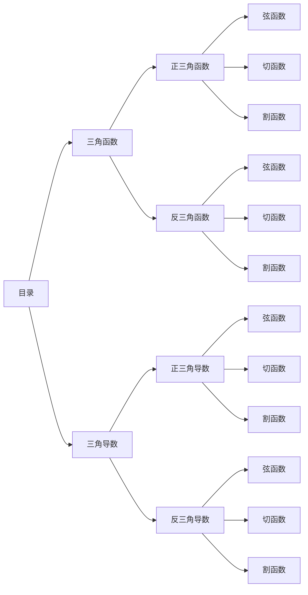

# 三角函数

>引言：三角函数作为贯穿中学大学的重要知识，其重要性不可估量，但是相信各位读者和我一样，经常忘记三角函数的相关定义以及图像相貌，现在我单独对这一知识点进行整理，并且附上我自己的思考以及解读，希望能够帮助各位理解这个经常看见但是却不经意间被忽视的知识。

图：本篇内容目录

正式介绍内容前，我们来思考如下两个问题：**为什么会出现三角函数、为什么正三角函数是六项？**

- 为什么会出现三角函数？

- 为什么正三角函数是六项？

## 正三角函数

>记忆方法：“弦切割”口令记忆
- 弦函数
	1. **正弦函数 (Sine)**: $\sin(x)$
	2. **余弦函数 (Cosine)**: $\cos(x)$
- 切函数
	1. **正切函数 (Tangent)**: $\tan(x) = \frac{\sin(x)}{\cos(x)}$
	2. **余切函数 (Cotangent)**: $\cot(x) = \frac{\cos(x)}{\sin(x)}$
- 割函数
	1. **正割函数 (Secant)**: $\sec(x) = \frac{1}{\cos(x)}$
	2. **余割函数 (Cosecant)**: $\csc(x) = \frac{1}{\sin(x)}$

<b>图：正三角函数与反三角函数图像</b>

## 反三角函数

- 弦函数
	1. **反正弦函数 (Sine)**: $arc \sin(x)$
	2. **反余弦函数 (Cosine)**: $arc\cos(x)$
- 切函数
	1. **反正切函数 (Tangent)**: $arc\tan(x) = arc\frac{\sin(x)}{\cos(x)}$
	2. **反余切函数 (Cotangent)**: $arc\cot(x) = arc\frac{\cos(x)}{\sin(x)}$
- 割函数
	1. **反正割函数 (Secant)**: $arc\sec(x) =arc \frac{1}{\cos(x)}$
	2. **反余割函数 (Cosecant)**: $arc\csc(x) = arc\frac{1}{\sin(x)}$

<b>图：正三角函数与反三角函数图像</b>

# 三角导数

### 正三角导数

- 弦函数
	1. **正弦函数的导数**: $\frac{d}{dx} \sin(x) = \cos(x)$
	2. **余弦函数的导数**: $\frac{d}{dx} \cos(x) = -\sin(x)$
- 切函数
	1. **正切函数的导数**: $\frac{d}{dx} \tan(x) = \sec^2(x)$
	2. **余切函数的导数**: $\frac{d}{dx} \cot(x) = -\csc^2(x)$
- 割函数
	1. **正割函数的导数**: $\frac{d}{dx} \sec(x) = \sec(x) \tan(x)$
	2. **余割函数的导数**: $\frac{d}{dx} \csc(x) = -\csc(x) \cot(x)$

>**发现**：只需要记忆正三项在记忆一个**余X函数**导数得换三角函数名原则即可，这样可以减少记忆压力

### 反三角导数

- 弦函数
	1. **反正弦函数 (Arcsine)**: $\arcsin(x)$, $\frac{d}{dx} \arcsin(x) = \frac{1}{\sqrt{1-x^2}}$
	2. **反余弦函数 (Arccosine)**: $\arccos(x)$, $\frac{d}{dx} \arccos(x) = -\frac{1}{\sqrt{1-x^2}}$
- 切函数
	1. **反正切函数 (Arctangent)**: $\arctan(x)$, $\frac{d}{dx} \arctan(x) = \frac{1}{1+x^2}$
	2. **反余切函数 (Arccotangent)**: $\text{arccot}(x)$, $\frac{d}{dx} \text{arccot}(x) = -\frac{1}{1+x^2}$
- 割函数
	1. **反正割函数 (Arcsecant)**: $\text{arcsec}(x)$, $\frac{d}{dx} \text{arcsec}(x) = \frac{1}{|x|\sqrt{x^2-1}}$
	2. **反余割函数 (Arccosecant)**: $\text{arccsc}(x)$, $\frac{d}{dx} \text{arccsc}(x) = -\frac{1}{|x|\sqrt{x^2-1}}$

>**发现**：反三角导数其实只需要记忆**反正系列**的导数即可，**反余系列**加一个负号就行了。这样算下来记忆成本仅三项公式了。

# 运用提示

- 在物理运算中三角运算的二元操作数能以乘法的形式出现就尽量以乘法的形式出现，$\frac{\text{对边a}}{\tan \theta}$**常常被写成**$\text{对边a}\cot \theta$，按照多项式简化原则，能用乘法二元操作符表示绝不用除法二元操作符表示，因为这样会显的公式很吓人