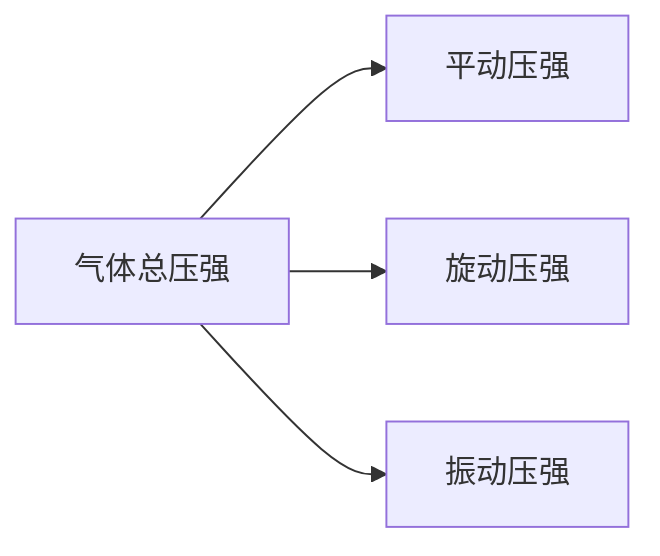
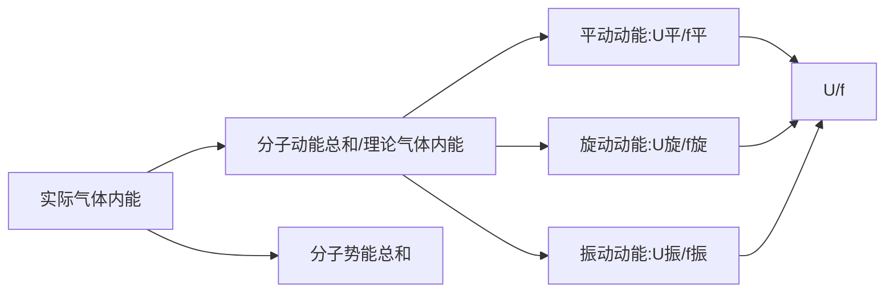

	引言:微观角度下的粒子行为都是概率时间,我们只能使用统计的力量来判断某事件发生的概率


## §4.1 热运动与热现象的微观理论

### 1. 物质由大数分子组成
   - **观点**：宏观物体是由大量不连续的分子（或原子、离子）组成的。
   - **实验**：
     1. 气体易被压缩；
     2. 水在 $40,000 \text{ atm}$ 的压强下，体积减为原来的 $1/3$；
     3. 以 $20,000 \text{ atm}$ 压缩钢筒中的油，油可透过筒壁渗出。

| 石墨的表面原子结构   | 硅单晶的表面原子结构   |
| ----------- | ------------ |
| （插入石墨STM图像） | （插入硅单晶STM图像） |

图4-1-1: 石墨和硅单晶材料表面的**STM**图像

   - **量化方法**：
     - 阿伏伽德罗常数：$N_A = 6.0221367(36) \times 10^{-23} \text{ mol}^{-1}$，1 mol 物质所含的分子（或原子）的数目均相同。
     - 分子数密度（n）：单位体积内的分子数目 $n = \frac{N}{V} \rho \mu$
   - **例**：常温常压下
     - 氮：$n = 2.47 \times 10^{25} \text{ /m}^3$, $\rho = 1.15 \text{ kg/m}^3$, $\mu = 28 \times 10^{-3} \text{ kg/mol}$
     - 水：$n = 3.30 \times 10^{26} \text{ /m}^3$, $\rho = 1.00 \times 10^3 \text{ kg/m}^3$, $\mu = 18 \times 10^{-3} \text{ kg/mol}$

### 2. 分子热运动
   - **实例**：墨水在水中的扩散；两物质粘贴时间较长时的相互渗透
   - **观点**：分子（或原子）总是处于永不停止的无规运动中，温度越高，运动越剧烈。
   - **实验证据**:
	   - 扩散:
		   - 实例:
		    
				图4-1-2:
	   - 布朗运动：**悬浮粒子**不停地作无规则的杂乱运动。
	     - 代表人物：布朗，英国植物学家。
	     - 研究对象：花粉在液体中的表现（1827年）。
	     - 研究材料：鲜花粉、300年前的花粉、无机物微粒。
	     - 研究结论：温度越高，布朗运动越剧烈；微粒越小，布朗运动越明显。
   - 这是每隔30秒布朗粒子所处的平面位置的点依次联结后得到的图，它并不是布朗粒子的运动轨迹（插入XX配图）

### 3、分子间的吸引力与排斥力

固体、液体保持一定的体积或形状说明分子之间存在某种力的作用。

#### (1) 吸引力

能说明分子间存在吸引力的现象：
1. 汽化热；
2. 锯断的铅柱加压可黏合；
3. 玻璃熔化可接合；
4. 胶水、浆糊的黏合作用；

**结论**：分子间存在吸引力，而且只有当分子质心相互接近到某一距离内，分子间相互吸引力才较显著，把这一距离称为分子吸引力作用半径。

- 很多物质的分子引力作用半径约为分子直径的2-4倍左右，超过这一距离，分子间相互作用力已很小，可予忽略。
#### (2) 排斥力

**存在证据**：对固体、液体的压缩较困难，说明分子之间不仅存在引力，还存在排斥力。

**作用距离**：只有两分子相互“接触”、“挤压”时才呈现出排斥力。可简单认为排斥力作用半径就是两分子刚好“接触”时两质心间的距离。

**特征**：
1. 因为吸引力出现在两分子相互分离时，故排斥力作用半径比吸引力半径小。
2. 从液体、固体很难压缩这一点可说明排斥力随分子质心间距的减小而剧烈地增大。
3. 分子力是本质上是分子和原子内的电荷之间相互作用的电磁力，故它是一种保守力，有分子作用力势能。


#### (3) 分子作用力曲线

两分子相互“接触并且被压缩”时排斥力占优势，相互分离时分子间吸引力占优势。两分子质心间应存在某一平衡距离 $r_0$，在该距离处分子间相互作用力将达平衡。
			
- 当 $r = r_0$ 时分子力为零，斥力=引力，$F = 0$，分子受力平衡，$r_0$称为平衡位置；

- 当 $r < r_0$ 时，两分子受到“挤压”过程中产生强斥力，斥力>引力，分子力表现为斥力，$F(r) > 0$，且随 $r$ 的减少而剧烈增大；

- 当 $r > r_0$ 时，斥力<引力，分子力表现为吸引力，$F(r) < 0$，且随 $r$ 的增大而先减小后增大。


- **分子力半经验公式**

分子之间相互作用的关系很复杂，严格的分析还无法做到，只能给出半经验公式：

$$F(r) = \frac{\lambda}{r^s} - \frac{\mu}{r^t} \quad (s > t)$$

其中 $r$为两个分子的中心距离，$\lambda$、$\mu$为正常数，$s$、$t$为正指数，一般地 $s \approx 12$，$t \approx 6$，其值由实验确定。

-  **常见的简化的分子相互作用模型**：
	1. **钢球模型**:
					
  $$

   F =

   \begin{cases}

   \infty, & \text{if } r < r_0 \\

   0, & \text{if } r > r_0

   \end{cases}

  $$
	2. **苏则朗 (Sutherland) 分子力模型**:
					
  $$

   F =

   \begin{cases}

   -A \left(\frac{r_0}{r}\right)^6, & \text{if } r \geq r_0 \\

   \infty, & \text{if } r < r_0

   \end{cases}

  $$

### 4. 热运动的混乱无序性

混乱与无序是大量分子热运动的基本特征。一个孤立系统，其内部大量分子热运动的状态，总是趋向于最无序最混乱的状态。

气体分子在运动中常与其他分子碰撞。气体动理论中常用**平均自由程** $\bar{\lambda}$ 和**平均碰撞频率** $\bar{Z}$ 两个概念来描述。
					
$$\bar{\lambda} = \frac{\bar{v}}{\bar{Z}}$$

$$\bar{\lambda} = \frac{1}{\sqrt{2}\pi d^2 n}$$

**推导**（如图）：
			

设想一个分子 A 以平均速率 $\bar{v}$ 运动，其他气体分子静止不动。

单位时间内分子 A 走过的曲折圆柱体体积为 $\bar{v}\sigma$，圆柱体的横截面积 $\sigma$ 叫碰撞截面 $\sigma = \pi d^2$，则一个分子单位时间内与其他分子平均碰撞次数为

$$\bar{Z} = n\bar{v}\sigma$$ 统计理论计算

$$\bar{Z} = \sqrt{2} \sigma \bar{v} n = \sqrt{2} \pi d^2 \bar{v} n$$

每个分子在任意两次碰撞之间所行自由路程的长短

$$\bar{\lambda} = \frac{\bar{v}}{\bar{Z}} = \frac{1}{\sqrt{2} \pi d^2 n} = \frac{k T}{\sqrt{2} \pi d^2 p}$$

$$对空气分子： d \sim 3.5 \times 10^{-10} \, m $$

$$标准状态下： \bar{Z} \sim 6.5 \times 10^9 \, s^{-1} ,\bar{\lambda} \sim 6.9 \times 10^{-8} \, m$$


## §4.2 统计规律与统计平均

分子运动论在研究大量分子组成的系统的热运动性质时发现，每一个分子的运动一般都是无规则的，有很大的偶然性。但从整体上却有确定的规律性。物理学上把这种支配大量粒子综合性质和集体行为的规律称为统计规律性。即统计规律是对大量偶然事件整体起作用的稳定的规律。

### 1. **伽尔顿板实验和统计规律**

   - 伽尔顿板实验展示了粒子按空间位置分布的规律性。
   - 粒子落入其中一格是一个随机事件，大量粒子在空间的分布服从统计规律。
   - 粒子数按空间位置分布曲线显示了粒子在不同高度的分布情况。

- **概率**：在相同条件下重复进行同一试验，在总次数 $N$ 足够多的情况下，出现某一事件的次数为 $N_i$，则这一事件占总次数的百分比称为该事件的概率，即

$$P_i = \lim_{N \to \infty} \left( \frac{N_i}{N} \right) \longrightarrow \sum_i P_i = 1$$

- **统计平均值**：

$$\bar{u} = \frac{N_1 u_1 + N_2 u_2 + \cdots}{\sum_i N_i} = \frac{\sum_i N_i u_i}{N} = \sum_i P_i u_i$$


**图示说明**：
   - 图中展示了粒子如何通过一系列障碍物（类似钉板）下落，最终形成特定的分布模式。
   - 粒子数按空间位置分布曲线图显示了粒子在不同位置的分布数量，通常呈现正态分布。

**结论**：
   - 粒子落入其中一格是一个随机事件，大量粒子在空间的分布服从统计规律。


### 2. 分布函数与平均值

研究人口统计规律的一个方法：

#### （1）分间隔

- 身高分布：$h \rightarrow h + \Delta h$，$\Delta N_h$

- 工龄分布：$t \rightarrow t + \Delta t$，$\Delta N_t$

- 资产分布：$m \rightarrow m + \Delta m$，$\Delta N_m$

#### （2）定义相应物理量的分布函数

以身高分布函数为例：


- 概率 $\frac{\Delta N_h}{N}$ 与 $h$ 和 $\Delta h$ 有关，用 $\Delta h$ 去除 $\frac{\Delta N_h}{N}$ 得到一个新的关系：

  $$\frac{\Delta N_h}{N \Delta h}$$


# 公式总结
>**发现**：整个等式关于理想气体常数与玻尔兹曼常数之间进行转换，因为$R=N_Ak_b$，且$M=N_Am$(**玻尔兹曼常数往往从微观的视角刻画个体，而理想气体常数则是从宏观的群体角度去刻画系统，但是两者可以发生转化，揭示了整体与个体紧密的关系**)


```ad-note
title:自由程定义式及推导式

1. 平均自由程公式：
   $$\bar{\lambda} = \frac{\bar{v}}{\bar{Z}}= \frac{1}{\sqrt{2\pi}d^2n}$$
   - $\bar{\lambda}$ 是平均自由程。
   - $\bar{v}$ 是分子的平均速度。
   - $\bar{Z}$ 是碰撞频率，即单位时间内分子与介质中的其他粒子发生碰撞的平均次数。
   - $d$ 是分子的直径或粒子的大小。
   - $n$ 是介质中分子或粒子的数密度，即单位体积内的分子或粒子数量。


```


---
	引言：这里的公式充分的说明了能改变$PV$值的在$n$定下的时候只有温度$T$，而温度的决定因素是气体动能，气体动能取决于平动动能、转动动能、振动动能——但在题目中时常常忽略后两者，这个时候气体动能就等于平动动能，这样决定气体温度的就只有平动动能了





```ad-note
title:压强公式

1. **理想气体物态方程**：
	$$PV=[nRT=\frac{N}{N_A}RT=\frac{m}{M}RT ]=[Nk_bT](不转化与气体动能有关)$$
	$$PV= \frac{2UN}{fnN_A}= \frac{2E_kN}{fnN_A}=\frac{2}{f}nN_A\bar{\varepsilon}_k=\frac{2}{f}N\bar{\varepsilon}_k(转化成与气体动能挂钩)$$

- $P_m$ 是平动压强。
- $N$ 是分子数。
- $k_b$ 是玻尔兹曼常数。
- $T$ 是绝对温度。
- $V$ 是气体的体积。
- $N_A$ 是阿伏伽德罗常数。
- $R$ 是理想气体常数
- $m$ 是该粒子集合体的质量
- $M$ 是该气体单个粒子的摩尔质量
- $f$ 是气体分子的自由度(包括平动、旋动、振动自由度)
- $U$ 是气体的内能
- $E_k$ 是气体的总动能(包括平动、旋动、振动动能)
- $\varepsilon_m$ 是该气体分子的平均动能(包括平动、旋动、振动动能)

>**解释**：之所以能把$T$换成以$\varepsilon_k$，是因为$PV$值取决于温度，温度与气体分子的总动能相关，而总动能由平动动能、旋动动能、振动动能组成


>**注意**：仅考虑气体平动而不考虑其他两个因素产生的压强，即：当分子仅具有平动自由度，且动压强$P_m$为总压强$P$时，取$f=3$即可


2. 变形定量分析：
	- 密度-压强-相对分子质量：
	- 气体粒子物质量-压强：$n=\frac{N}{V}=\frac{pN_A}{RT}$

```


---


```ad-note
title:运动学公式
1. **各向分子速度**：
   - 平均速度在每个方向上的分量为零：
$$\overline{V_x} = \overline{V_y} = \overline{V_z} = 0$$
   - 平均速度的平方在每个方向上的分量相等，并且是总平均速度平方的三分之一：
$$\overline{V_x^2} = \overline{V_y^2} = \overline{V_z^2} = \frac{1}{3} \overline{V^2}$$

2. **分子最概然速率**

$$v_p= \sqrt{\frac{2 R T}{M}} = \sqrt{\frac{2 k_B T}{m}}$$
- $R$：理想气体常数 ($8.314 \, \text{J/(mol·K)}$)。
- $M$：气体的摩尔质量（单位：kg/mol）。
- $T$：温度（单位：K）。

>**思考**：几何意义上是麦克斯韦速率分布函数的最大值对应的速率；物理意义上看，是一定温度下，就相同的速率间隔而言，分子速率处在$v_p$的间隔里的概率最大.($f(v)表示概率,v表示速率$)

3. **分子的平均速率**：
$$\bar{v}=\sqrt{\frac{8RT}{\pi M}}=\sqrt{\frac{8k_b T}{\pi m}}$$
- $k_b$：玻尔兹曼常数，数值为 $1.38 \times 10^{-23} \, \text{J/K}$，用于将温度和能量联系起来。
- $T$：气体的绝对温度（单位：K），描述系统的热运动程度。
- $m$：单个气体分子的质量（单位：kg），表示单个分子的微观质量。
- $R$：理想气体常数，数值为 $8.314 \, \text{J/(mol·K)}$。它是玻尔兹曼常数和阿伏伽德罗常数的乘积。
- $M$：气体的摩尔质量（单位：kg/mol），表示一摩尔气体的质量。
- $\pi$：数学常数，约为 3.14159。

>**提示**：单原子分子仅拥有三个平动自由度；刚性双原子分子拥有三个平动自由度+两个转动自由度;双分子以上的分子除了平动自由度和转动自由度以外还有振动自由度


4. **分子方均根速率**：
$$\sqrt{\bar{v}^2} = \sqrt{\frac{3 R T}{M}} = \sqrt{\frac{3 k_b T}{m}}(N_A=\frac{m}{M})$$
   - $\sqrt{\bar{v}^2}$ 是分子的方均根速率。
   - $k_b$ 是玻尔兹曼常数。
   - $T$ 是绝对温度。
   - $m$ 是单个分子的质量。
   - $R$ 是理想气体常数。
   - $M$ 是气体摩尔质量。

>**思考**：将动能与热挂钩，充分阐述了运动与热不可分割


```


---




<p style="text-align: center;">图：气体内能的组成</p>
>**解释**：
>1. **理想气体**：分子内能仅由分子动能组成。
   $$U_{动} = \frac{f}{2} nRT$$
   $$U_{动}=U_{平}+U_{旋}+U_{振}，f_{动}=f_{平}+f_{旋}+f_{振}$$
>2. **实际气体**：分子内能由分子动能和分子势能两部分组成。

$$U=U_{势}+U_{动}$$


>**总结**：理想气体模型下，**内能和分子动能完全等价**，取决于温度和分子的自由度。


```ad-note
title:能量公式
1. **单气体子的动能公式**：
1.1 **平动动能公式**
$$\bar{\varepsilon}_k = \frac{1}{2} m \bar{v}^2 =\frac{3RT}{2N_A}= \frac{3}{2} k_B T$$
- $\bar{\varepsilon}_k$ 是分子的平均平动能。
- $m$ 是单个分子的质量。
- $\bar{v}$ 是分子的平均速度。
- $k_B$ 是玻尔兹曼常数。
- $T$ 是绝对温度。
- $T$ 是阿伏伽德罗常数。
1.2 **旋动动能公式**


1.3 **振动动能公式**

>**联系**：下面的内能公式如果只考虑平动动能的话，上式乘以一个$n$与下式取$f=3$相等，在不考虑其他三个内能组成因素下就表示气体所具有的内能

2. **单气体分子的内能公式**
$$\bar{E}_{ki} =\frac{fRT}{2N_A}= \frac{f}{2} k_B T$$

>**联系**：此式在1式的基础上考虑了旋动动能以及振动动能，泛化了内能的来源，也可以说是完全体的内能公式
>**解释**：

3. **理想气体的内能公式(重点)**
	$$U =E_k=NE_{ki}= [\frac{f}{2} nRT/\frac{f}{2}PV=\frac{f}{2} N k_B T= \frac{f}{2}n N_A k_B T](理想气体内能不考虑分子势能固有E_k=U)$$
	- $U$: 理想气体内能。
	- $n$：气体的摩尔数。
	- $R$：理想气体常数。
	- $f$：自由度（单原子气体 $f = 3$，双原子气体 $f = 5$）。
	- $k_B$：玻尔兹曼常数。
	- $T$：温度。

> **内能 = 所有分子动能之和(无势能)=各个自由度的动能的线性叠加和**

>**解释**：对于**理想气体**，分子之间不考虑相互作用力（势能为零），所以分子的**内能**完全等于其**动能**之和。

>**误区**：不能够通过直接叠加单气体的平均平动动能得到理想气体内能(不考虑势能)，因为除了平动动能还有旋动动能


```


---

>附：常见气体分子的自由度

1. **单原子分子**：如氦(He)、氖(Ne)、氩(Ar)等，它们可以看作自由质点，因此只有3个平动自由度，即沿着x、y、z三个坐标轴的直线运动。
    
2. **刚性双原子分子**：如氢(H2)、氧(O2)、氮(N2)、一氧化碳(CO)等，它们除了3个平动自由度外，还有2个旋转自由度，总共5个自由度。这2个旋转自由度是由于分子可以在垂直于分子轴线的平面内自由旋转。
    
3. **刚性三原子或多原子分子**：如果原子不是直线排列的，如水(H2O)、氨(NH3)等，它们有3个平动自由度和3个旋转自由度，总共6个自由度。如果分子是直线型的，如二氧化碳(CO2)，则只有5个自由度。
    
4. **非刚性分子**：在原子之间存在相互作用力的情况下，分子内部还有原子的振动，因此还应考虑振动自由度。例如，非刚性双原子分子有1个振动自由度
