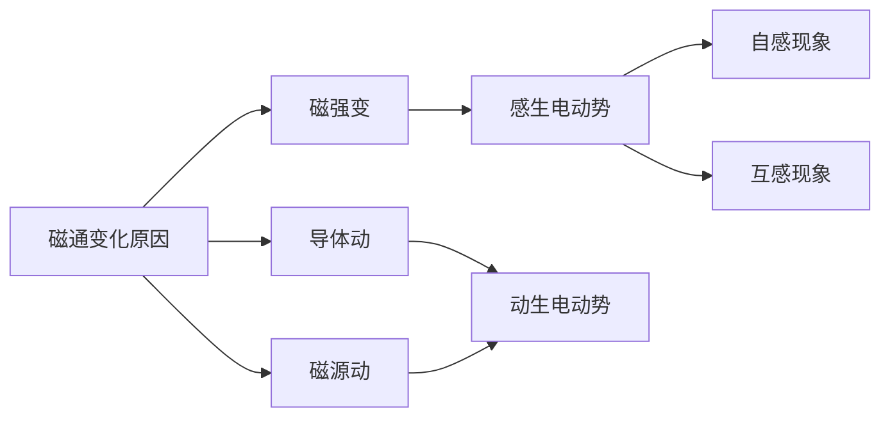

	引言：前面我们学习了静电场和静磁场。那么你可能会想有没有动电场和动磁场呢？有的，不过动电场一般伴随动磁场的产生，为此产生了电磁学理论下的一个新分支——电磁场理论。

# 1. 基本概念


## 1. 电磁感应现象


### 1. 电磁感应

**探究1**：导体在磁场中运动会产生电流吗

如图5-23所示，将导轨、可移动导体棒 AB 放置在磁场中，并和电流计组成闭合回路。注意观察在下列情况下电路中是否有电流产生。


<center>图5-23 导体棒在磁场中运动的示意图</center>

（1）让导体棒与磁场保持相对静止；

（2）让导体棒平行于磁感线运动（与导轨不分离）；

（3）让导体棒做切割磁感线运动（与导轨不分离）。


**探究2**：条形磁铁插入或拔出螺线管会产生电流吗

如图5-24所示，将螺线管与电流计组成闭合回路。把条形磁铁插入或拔出螺线管，注意观察电路中是否有电流产生。


<center>图5-24 将磁铁插入或拔出螺线管的示意图</center>


```ad-note
title:实验解释
在探究l中，当导体 AB 在磁场中静止或平行于磁感线运动时，无论磁场多强，闭合回路中都没有电流；当导体 AB 做切割磁感线运动时，闭合回路中有电流产生。

在探究2中，当条形磁铁静止在螺线管中时，无论磁铁的磁场多强，回路中都没有电流产生；将磁铁插入或拔出螺线管时，组成螺线管的导线切割磁感线，闭合回路中有电流产生。

在图5-25中，当导体棒做切割磁感线运动时，穿过闭合回路的磁通量也发生变化。请你分析磁通量是如何变化的。在探究 2 中，当磁铁和螺线管相对静止时，穿过螺线管的磁通量不变，螺线管中没有电流。将磁铁插入螺线管时[图5-26 （a）]，穿过螺线管的磁通量增大，将磁铁拔出螺线管时[图5-26 （b）]，磁通量减小，在这两种情况下，闭合回路中都有电流产生。


<center>图5-25 导体棒切割磁感线的示意图
</center>


<center>图5-26 磁铁插入或拔出螺线管的示意图</center>

```

>**发现**：实验一和实验二的不同在于一个使导体动，一个使磁场动。但是统一的角度来讲，都是发生相对运动。是某种特定的相对运动激发了这种现象

>**思考**：是否只有导体和磁场发生相对运动使闭合回路中的磁通量发生变化时，才能产生电流呢？接下来我们来验证猜想


**探究3**：磁场和导体无相对运动会产生电流吗

如图5-27所示，螺线管么与滑动变阻器、电源、开关组成一个回路：螺线管4放在螺线管 B 内，螺线管B与电流计组成一个闭合回路。分别在开关闭合瞬间、开关闭合后保持滑动变阻器滑片不动、开关闭合后快速移动滑动变阻器滑片、开关断开瞬间这四种情况下观察螺线管B所在回路中是否有电流产生。


<center>图5-27 实验装置示意图</center>

---

在探究3中，导体和磁场之间并没有发生相对运动。当螺线管A的电流不变时，螺线管B所在回路中没有电流产生；当螺线管A的电流变化时，螺线管B所在回路中就产生了电流。

在开关闭合的瞬间，螺线管A中的磁场由零开始增强，由于螺线管A插在螺线管B内，穿过螺线管B的磁通量增大；同样道理，在开关断开的瞬间，穿过螺线管B的磁通量减小；开关闭合后移动滑动变阻器的滑片，螺线管A的电流变化使它产生的磁场发生变化，穿过螺线管B的磁通量相应地发生变化。闭合开关后保持滑动变阻器滑片不动时，穿过螺线管B的磁通量不变。

综合探究1~3可以看出，尽管通过磁场产生电流的方式各不相同，但穿过闭合回路的磁通量都发生了变化——如果磁通量稳定不变，就不能使闭合回路产生电流。大量的实验研究表明，通过磁场产生电流的条件可以归纳为：只要穿过闭合回路的磁通量发生变化，闭合回路中就会产生电流。




<center>图：影响磁通的变化原因</center>


因闭合回路的磁通量变化而产生电流的现象称为**电磁感应**（electromagnetic induction），所产生的电流称为**感应电流**（induction current）。


### 2. 自感

>**定义**：当一个线圈中的电流变化时，它所产生的变化的磁场在线圈本身激发出感应电动势。这种现象称为**自感**（self-induction），由于自感而产生的感应电动势叫作自感电动势。


```ad-note
title:演示
**观察两个灯泡的发光情况**

在图 2.4-1 的电路中，两个灯泡 A1 和 A2 的规格相同，A1 与线圈 _L_ 串联后接到电源上，A2 与可调电阻 _R_ 串联后接到电源上。


图2.4-1 开关闭合时观察灯泡的发光情况

先闭合开关 S，调节电阻 _R_，使两个灯泡的亮度相同，再调节可调电阻 _R_1，使它们都正常发光，然后断开开关 S。

重新接通电路。注意观察，在开关闭合的时候两个灯泡的发光情况。


图2.4-2 感应电动势阻碍电流的增加

---

在图 2.4-1 的电路中，闭合开关的瞬间，电流从无到有，线圈 L 中产生感应电动势。根据楞次定律，感应电动势会阻碍电流的增加（图 2.4-2），所以灯泡 A1 较慢地亮起来。
```


>**解释**：自感现象是符合电磁感应现象关于磁通的描述的，不过自感的磁场比较特殊，是由电流引起的磁场，在前文的现象探究中我们使用的磁场源大多是永磁体，两者产生的磁场在通过同一线圈时，其磁场变化引起线圈的现象是不一样的。
>对于永磁体，减少磁通量的方法就是原理，这会激发线圈内的电流，而激发电流在永磁体磁场作用下对线圈产生朝着永磁体方向的力，进而产生朝着永磁体方向的速度，以抵抗这种磁场变化
>对于通电螺线管，首先自身产生磁场，也就是说这个线圈不单单只是线圈，而且是磁源！那么我们通电，作为磁源，这个线圈产生了磁场，但是原本这个线圈没有磁通量，**那么怎么减少磁通量的增加呢？还能像永磁体那样跟着产生一个朝着永磁体方向的力减少磁通量变化么**？——不能，因为磁源是自己，自己朝着自己走，岂不很荒诞了？但是你可以这样想，这个"力"可以是阻碍电流增加的“阻力”啊，这样在描述上就稍微统一了起来，事实上确实是如此，线圈会通过增加自身电抗(感抗)的方式减少电流变大。从做功的角度分析，阻抗是将电能转化为安培热的媒介，那么感抗则是将电能转换为磁能的媒介。


```ad-note


>**总结**：所以你可以发现，虽然形式不一样，但是达成的根本效果是一样的，减少磁通的改变，这过程中有电能向磁能的转化，也有磁能向电能的转化，甚至磁场向电能、动能两者间的转化。从这个角度上来看，电抗做工是电能向着其他能量转化的一个通用途径，但是具体看电抗是什么性质的电抗，这样你才能分析出该电抗是把电能转化成了什么能量


### 3. 互感


### 3. 例题

如图5-28所示，当线圈在匀强磁场中绕OO'轴转动时，线圈中是否有感应电流？为什么？


图5-28 线圈在匀强磁场绕轴转动示意图

**分析**

只要穿过闭合线圈的磁通量发生变化，线圈中就会产生感应电流。而磁通量是否发生变化，可由穿过线圈的磁感线条数是否变化来判断。

**解**

在图5-28（a）申，线圈绕平行于磁感线的轴转动，无论转到什么位置，线圈平面都没有磁感线穿过，即线圈的磁通量始终为零，所以线圈中没有感应电流。

在图5-28（b）中，线圈绕垂直于磁感线的轴转动时，穿过线圈的磁感线条数不断发生变化，即磁通量发生了变化，所以线圈中有感应电流。

**讨论**

本题还可依据 _Ф_ ＝ _BS_cos_α_ 判断磁通量是否改变，请试试。

**策略提炼**

判断闭合回路能否产生感应电流，首先要确定研究的回路，再判断穿过该回路的磁通量是否变化。磁通量是否发生变化，一般可由穿过回路的磁感线条数是否变化来判断；若磁场为匀强磁场，还可以用 _Ф_ ＝ _BS_cos_α_ 来判断。


判断穿过闭合回路的磁通量是否变化，还需明确回路所在处磁场的磁感线分布特点。如图 5-29 所示，通电长直导线 MN 与闭合的矩形金属线圈 abcd 彼此绝缘，可视为在同一水平面内，直导线与线圈的对称轴线重合。当直导线 MN 中电流增大时，穿过线圈 abcd 的磁通量是否变化？线圈中是否有感应电流？请判断并说出理由。


<cente>图5-29 通电长直导线与闭合线圈示意图</center>


1．如图所示，矩形导线框abcd位于竖直放置的通电长直导线附近，导线框和长直导线在同一竖直平面内，线柜的ab和cd两边与长直导线平行。在下面的四种情况中，框内有无感应电流？为什么？


第1题

（1）导线框竖直下落；

（2）导线框沿垂直于纸面方向向纸内平移；

（3）导线框以ab边为轴向纸外转动；

（4）导线框以长直导线为轴，整个框面向纸外转动。

**参考解答**：（1）（4）两种情况无感应电流。原因：框内磁通量未改变。（2）（3）两种情况有感应电流。原因：框内磁通量有变化。

2．在有磁铁矿的地方，地磁场会出现异常。地质工作者常利用这一现象探矿、找矿。用一个灵敏电流计、一个多匝大线圈，你能进行简单的模拟测试吗？说说你的测试方法及可能遇到的问题。

**参考解答**：将灵敏电流计和多匝大线圈组成闭合回路，将线圈沿水平面移动，若灵敏电流计的指针摆动，说明地磁场异常。

3．如图所示，电吉他的弦是磁性物质。当弦振动时，线圈产生感应电流，感应电流输送到放大器、喇叭，把声音播放出来。请解释电吉他是如何产生感应电流的。弦能否改用尼龙材料？


第3题

**参考解答**：电吉他的弦是磁性物质，当弦振动时，穿过该线圈的磁通量会发生改变，从而产生感应电流。不能改为尼龙材料。

4．如图所示，条形磁铁以速度_v_向螺线管靠近。下列说法正确的是


第4题

A．螺线管会产生感应电流

B．螺线管不会产生感应电流

C．只有磁铁速度足够大，螺线管才会产生感应电流

D．只有磁铁磁性足够强，螺线管才会产生感应电流

**参考解答**：A

5．把矩形线圈abcd放在如图所示的匀强磁场中，已知线圈面积为0.05 m2，磁感应强度为0.06 T。


第5题

（1）当线圈平面与磁场垂直时，穿过线圈的磁通量是多少？

（2）线圈平面从图示位置绕OOʹ轴转过60°时，穿过线圈的磁通量又是多少？

**参考解答**：（1）0.003 Wb （2）0.001 5 Wb

6．把两个线圈绕在同一个铁环上，如图所示，一个线圈A连接电池与开关，另一个线圈B闭合并在其中一段直导线附近放置小磁针。开关闭合瞬间，磁针偏转了一下，随即复原；开关断开瞬间，磁针反向偏转，随即复原。磁针偏转的原因是什么？请作出解释。


第6题

**参考解答**：在开关闭合瞬间有电流经过线圈 A，线圈 A 产生的磁场使穿过闭合线圈 B 的磁通量增加，线圈 B 中产生感应电流，通电直导线周围有磁场使磁针发生偏转。但这只是一瞬间，因为线圈 A 中的电流会很快达到稳定状态，产生的磁场也会很快达到稳定状态，线圈 B 的磁通量将不会发生变化，所以线圈 B 只在短时间内产生感应电流，因此磁针偏转一下后复原；当开关断开时穿过线圈 B 的磁通量减少，所以线圈 B 中有感应电流产生，而且感应电流的方向与开关闭合瞬间的感应电流的方向相反。所以磁针反向偏转。


## 2. 电动势
### 1. 动生电动势


### 2. 感生电动势


## 3. 磁场能量


## 4. 位移电流


# 2. 基本类型
## 1. 静电场


## 2. 磁场

## 3. 电磁场


## 4. 辐射场


## 5. 感应场

## 6. 束缚场

## 7. 均匀场


## 8. 非匀场


# 3. 基本性质

## 1. 定理

## 2. 定律


### 1. 电磁感应定律
#### 1. 介绍

#### 2. 证明

#### 3. 应用
### 2. 楞次定律
#### 1. 介绍

#### 2. 证明

#### 3. 应用

## 3. 定则
# 4. 问题模型


## 自感互感
### 1. 自感线圈

### 2. 互感线圈


## 漩涡电流


## 电子感应加速器


## RL电路

