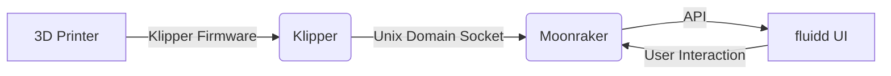

# 一、Klipper固件
[参考教程](https://www.cnblogs.com/sjqlwy/p/)


# 二、Klipper扩展


## 2.1 Fluidd前端&Moonraker后端
	引言：很多人搞不清这三个组件的关系，导致无法进行后续开发等工作，下面用一幅图形象说明三者之间的作用关系

```ad-note

**解释：**

- **3D Printer**：这是实际的3D打印机硬件。
- **Klipper Firmware**：Klipper固件直接与3D打印机的硬件交互。
- **Klipper**：Klipper组件，负责控制打印机的物理动作。
- **Moonraker**：Moonraker组件，作为服务器（后端），通过Unix域套接字与Klipper通信，提供API接口。
- **fluidd UI**：fluidd用户界面，作为客户端（前端）通过网络与Moonraker通信，从而间接控制Klipper和3D打印机。
- **User Interaction**：用户通过fluidd UI与系统交互。
### 2.1.1 Fluidd
#### 2.1.3.1 项目概述

fluidd是一个为3D打印机设计的Web用户界面（UI），它允许用户通过一个直观的图形界面来管理和监控3D打印过程。它通常与Moonraker和Klipper协同工作，以提供一个完整的3D打印解决方案。

#### 2.1.3.2 项目目录结构及介绍

fluidd的项目结构如下，清晰地组织了源代码和资源文件：

markdown

```markdown
fluidd/
├── src             # 源代码文件夹，包含了前端和后端的核心逻辑
│   ├── assets      # 静态资源，如图片、样式表等
│   ├── components  # 前端组件
│   ├── services    # 后端服务，处理与Moonraker的API交互
│   └── ...
├── public         # 公共文件夹，存放可以直接访问的资源，如图标、robots.txt等
├── build          # 构建输出文件夹，存放编译后的前端资源
├── package.json   # Node.js项目的配置文件，定义了项目依赖
├── webpack.config.js # Webpack配置文件，用于构建前端资源
├── .gitignore     # Git忽略文件配置
├── README.md      # 项目说明文档
└── docker-compose.yml # Docker容器编排配置文件，用于部署fluidd服务
```

#### 2.1.3.3 项目的启动文件介绍

fluidd的启动可以通过Docker容器化部署，或者直接运行Node.js应用程序。以下是两种常见的启动方式：

##### 2.1.2.3.1 Docker部署

使用`docker-compose.yml`文件来定义服务并启动fluidd：

yaml

```yaml
version: '3'
services:
  fluidd:
    image: fluidd/fluidd:latest
    ports:
      - "80:80"
    volumes:
      - ./config:/app/config
    depends_on:
      - moonraker
```

##### 2.1.2.3.2 Node.js应用程序

如果是直接运行Node.js应用程序，可以通过`package.json`中的脚本命令来启动：

json

```json
"scripts": {
  "start": "node server.js"
}
```

#### 2.1.3.4 项目的配置文件介绍

fluidd的配置通常较为简单，因为它主要依赖于与Moonraker的API交互。配置文件可能包括：

##### `config.js`

javascript

```javascript
module.exports = {
  moonrakerUrl: 'http://localhost:7125',
  // 其他配置项...
};
```

这个配置文件定义了fluidd与Moonraker服务器的连接信息，以及其他可能的自定义设置。


### 2.1.2 Moonraker
#### 2.1.2.1 项目概述

Moonraker是一款专为[3D打印机](https://so.csdn.net/so/search?q=3D%E6%89%93%E5%8D%B0%E6%9C%BA&spm=1001.2101.3001.7020)设计的控制服务器软件，它允许通过网络接口对3D打印过程进行管理和控制。本指南旨在帮助用户理解Moonraker的内部结构，启动方法以及关键的配置环节。

#### 2.1.2.2 项目目录结构及介绍

Moonraker的项目结构清晰地组织了源代码和资源文件，以下是其主要组成部分：

```markdown
moonraker/
├── moonrakerlib     # 核心库文件夹，包含了处理3D打印任务的核心逻辑
│   ├── ...
├── webui            # Web界面相关的代码，提供图形化操作界面
│   └── ...
├── moonraker.bin    # 可执行文件（取决于编译后的产物，此路径可能变化）
├── config           # 配置文件夹，存储应用的配置文件
│   ├── moonraker.conf       # 主配置文件
│   └── printer                 # 打印机特定配置
├── scripts          # 启动脚本和其他辅助脚本
│   └── start_moonraker.sh     # 示例启动脚本
└── README.md        # 项目说明文档
```

#### 2.1.2.3 项目的启动文件介绍

Moonraker的启动通常依赖于特定的启动脚本或者直接运行编译好的可执行文件。一个典型的启动脚本示例位于`scripts/start_moonraker.sh`，该脚本可能包括环境变量设置、依赖检查以及调用可执行文件的命令序列。例如，

```bash
#!/bin/bashpython3 -m moonraker
```

或对于已经编译的二进制版本，则可能是：

```bash
./moonraker.bin
```

确保在启动前配置好环境和必要的依赖项。

#### 2.1.2.4 项目的配置文件介绍

##### 2.1.2.4.1 主配置文件 `moonraker.conf`

主配置文件`moonraker.conf`是Moonraker行为的关键，它包含了一系列设置来定制软件的行为，如网络端口、日志级别、连接到的硬件信息等。部分重要配置项示例：

```ini
[server]host = 0.0.0.0port = 7125 [kinematics]type = corexy [webhooks]...
```

##### 2.1.2.4.2 打印机特定配置

在`config/printer`目录下，可以根据需要创建特定于打印机的配置文件。这些配置细化了与特定打印机硬件的交互，比如步进电机的微步进、热床温度曲线等。

---

以上就是Moonraker项目的基本结构、启动方式和配置概览。正确理解和配置这些部分是成功部署和运行Moonraker的基础。建议详细阅读官方文档以获取更全面的信息和高级用法。


# 三、Klipper开发


## 3.1 固件开发


## 3.2 扩展开发


