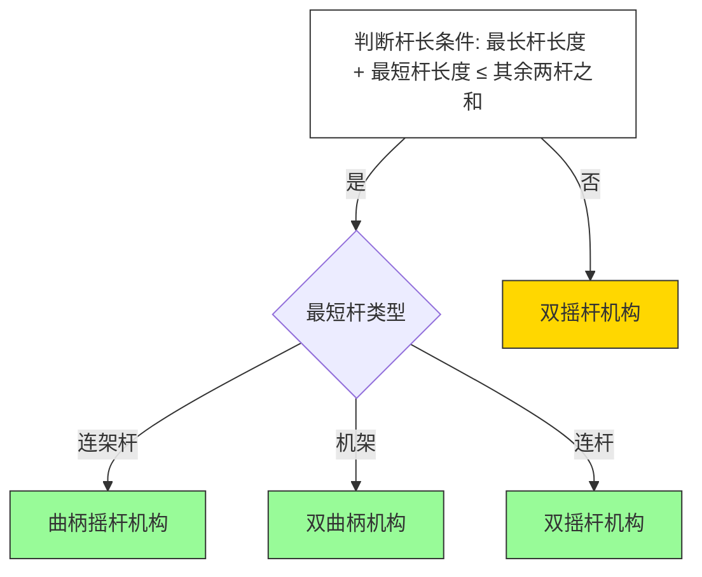

<center><b>图：本期老婆</b></center>


<center><b>表：推荐UP</b></center>

| [发呆的考拉猫的个人空间-发呆的考拉猫个人主页-哔哩哔哩视频 (bilibili.com)](https://space.bilibili.com/3546651939572243)                                                                                        | <center><b>动画区UP</b></center>      |
| ---------------------------------------------------------------------------------------------------------------------------------------------------------------------------------- | ---------------------------------- |
| <br>[帆雨动画的个人空间-帆雨动画个人主页-哔哩哔哩视频 (bilibili.com)](https://space.bilibili.com/22084320/lists/1085338?type=season)<br>                                                                  | <center><b>动画区UP</b></center>      |
| [【机械原理】孙桓第九版 课后习题讲解，考研必看！_哔哩哔哩_bilibili](https://www.bilibili.com/video/BV1YKeTeQELC/?spm_id_from=333.337.search-card.all.click)                                                   | <center><b><br>习题讲解UP</b></center> |
| [【完整版】《机械原理》3小时快速突击\|期末不挂科必备【蜂考】_哔哩哔哩_bilibili](https://www.bilibili.com/video/BV1LBNgexEJi/?spm_id_from=333.337.search-card.all.click&vd_source=4c095a1bfb5e2a56290ec68b55b5d467) | <center><b>复习冲刺UP</b></center><br> |
| [机械原理复习冲刺，期末不挂科！_哔哩哔哩_bilibili](https://www.bilibili.com/video/BV1Qi421S7Bj/?spm_id_from=333.337.search-card.all.click&vd_source=4c095a1bfb5e2a56290ec68b55b5d467)                 | <center><b>复习冲刺UP</b></center><br> |

<center><b>表：推荐网站</b></center>

| [机械原理展示室 - 机械基础虚拟实验室](https://xy.xauat.edu.cn/jxjcsyzx/xnsy/main1.asp) | 动画演示网站 |
| ---------------------------------------------------------------------- | ------ |
|                                                                        |        |


<center><b>图：预览该笔记需要安装的 Obsidian 插件</b></center>

- # 1. 本书回忆


- # 2. 本书重点


- # 3. 本书犯错


- # 4. 本书思考


- # 5. 本书思想

- ## 5.1. 曲直杆等效性

在全转动副四杆机构中，经常能看到一种名为曲杆等效化直杆的现象，这种现象利用的抓住运动本质的思想进行等价处理。


- ## 5.2. 主从动互换性

在观察了很多机构后，我发现对于同一套机构，理想情况下你给定一个构件施加某种确定运动后往往其他机构的运动是唯一的，但是不同点的地方就是不同构件达到立下运动情况的难度是不一样的。

# 第1章 绪论

## §1-1 本书研究的对象及内容

## §1-2 学习机械原理课程的目的

## §1-3 如何进行机械原理课程的学习

## §1-4 机械原理学科发展现状简介
## 思考题

## 练习题

- 【填空题】


## 参考资料
# 第2章 机构的结构分析

## §2-1 机构结构分析的内容及目的

- **(1) 研究机构的组成及机构运动简图的画法**
    - **说明:** 即研究机构是怎样组成的，以及为了解机构，并对机构进行分析与综合，研究如何用简单的图形，即机构运动简图，把机构的结构状况表示出来。
- **(2) 了解机构具有确定运动的条件**
    - **说明:** 机构要能正常工作，一般必须具有确定的运动，因而必须知道机构的自由度及其具有确定运动的条件。
- **(3) 研究机构的组成原理及结构分类与设计**
    - **说明:** 研究机构的组成原理，有利于新机构的创造，而根据组成原理，将各种机构进行结构分类，有利于对机构进行运动及动力分析和结构的合理设计。

```ad-note
title:**对于上述三句话的理解**
- **“(1) 研究机构的组成及机构运动简图的画法”**  
    
    - **解释:** 这就像是学习认识一个机器的“骨架”和“关节”。“组成”是指了解一个机构由哪些零件（比如连杆、齿轮、凸轮、滑块等）构成，这些零件之间又是如何连接的（比如用转轴连接形成转动副，或者像滑块在导轨里滑动形成移动副）。  
        
    - **实际背景:** 比如，汽车的发动机里有活塞、连杆和曲轴 。学习机构组成就是要认清这几个零件以及它们之间的连接方式。==而“机构运动简图”就是一种“火柴人”式的简笔画，用简单的符号代替实际复杂的零件外形，只画出它的骨架和关节，这样就能清晰地看出运动是如何传递的，方便后续的运动和受力分析 。==画出发动机活塞-连杆-曲轴机构的运动简图，就能一眼看出活塞的直线往复运动是如何转换成曲轴的旋转运动的。这对于理解、分析甚至改进这个机构至关重要。  
        
- **“(2) 了解机构具有确定运动的条件”**  
    
    - **解释:** 这指的是要确保机器的运动是“可预测、不乱套”的。一个设计良好的机器，当你给它一个输入（比如转动一个轮子），它的其他部分应该有唯一确定的、按照设计意图进行的运动 。  
        
    - **实际背景:** 想象一下你的汽车方向盘，你转动方向盘，车轮就应该相应地偏转一个确定的角度。如果转动方向盘，车轮时而偏转、时而摆动、时而卡住，那这个转向机构的运动就是不确定的，非常危险。==学习这个条件，就是要学会计算一个机构的“自由度”，判断它是不是能在给定输入下，产生确定的输出运动==。如果自由度不对，机构可能根本动不了（自由度太小），或者运动混乱、不可控（自由度太大）。工程师必须确保设计的机构自由度恰好等于所需的输入数量，通常是1，这样才能保证一个输入对应一个确定的输出运动。  
        
- **“(3) 研究机构的组成原理及结构分类与设计”**  
    
    - **解释:** 这部分更深入，是关于如何“创造”和“选择”机构。“组成原理”就像是搭积木的规则，告诉你基本的单元（如杆组）以及如何将它们组合起来，构成更复杂的、能实现预期功能的机构。理解了这些原理，你就能举一反三，甚至发明出全新的机构 。  
        
    - **实际背景:** 比如，你知道了最基本的“铰链四杆机构”（由四个杆件通过转轴连接成的环）是构成很多复杂机构的基础，你就可以通过改变杆长、增加杆件等方式，设计出各种各样的机构，比如飞机的起落架收放机构、挖掘机的铲斗机构等。“结构分类”则是将形形色色的机构按照它们的组成方式或运动特点进行归类，比如分为连杆机构、凸轮机构、齿轮机构等 。这有助于工程师在面对一个具体的设计任务时（比如需要将旋转运动变为直线运动），能快速地从合适的类别中选用或改进已有的机构。这对于进行运动分析（研究速度、加速度）、动力分析（研究受力）以及最终做出合理的结构设计都非常有帮助
```

## §2-2 机构的组成及分类

- # 1. 本节回忆

- # 2. 本节重点

- # 3. 本节犯错

- ## 3.1. 数错运动副自由度


```handwritten-ink
{
	"versionAtEmbed": "0.3.4",
	"filepath": "个人仓库/谢承旭/Ink/Writing/2025.6.13 - 20.48pm.writing"
}
```


### 2.2.1. 机构的组成

#### （1）构件

>**注意**：组成构件的零件数目是可以不唯一的。

<center><b>表：考点汇总</b></center>

|     |
| --- |

- 【填空题】
	
	>**解释**：构件与零件区分就是，前者是从运动属性角度划分最小单元。后者是从制造与装配角度划分的最小单元，并且分为通用零件和专用零件（标准设计、非标设计）
	
- 【选择题】
	
	
- 【判断题】
	

#### （2）运动副*

>**注意**：很多人判别不出来运动副和构件的关系，运动副是从运动构件与运动构件间接触的几何形式（点、线、面接触）来去划分不同类型的。从这句话中可得运动副需要两个及以上的构件去参与组成的。（再次提醒一个移动副有两个构件——一个为固定构件一个为运动构件。）

<center><b>表2-1常用运动副的模型及代号</b></center>


- # 1. 本节回忆


>**注意**：运动副通常要有两个发生相对运动的构件组成，单个构件是难以组成运动副的；约束称谓的“**高**”和“**低**”是针对其相互接触面的压力高低来讲的；约束数=3个的话那就直接是固定基座了，类型比较单一没必要单独分类出来描述。


<center><b>表：考点矩阵</b></center>

```ad-question
title:**力约束和几何约束是从保持约束的形式上去区分约束的么？**
是的，从保持约束的形式来区分“力封闭”和“几何封闭”是正确的。

*   **几何封闭**：依靠**机构自身的几何结构**来维持构件间的约束关系，不需要额外的力。
*   **力封闭**：需要**施加额外的力**（如弹簧力、重力、磁力等）才能维持构件间的约束关系。

这种区分的关键在于，如果没有外力，力封闭的机构将无法保持其约束状态，而几何封闭的机构仍然可以。
```

 ```ad-question
title:**力约束和几何约束的区别在哪里？**
 在[[西北工业大学 机械原理 第八版 笔记]]中，虽然没有直接提到“力封闭”和“几何封闭”的概念，但根据机械原理的一般知识，我可以解释它们的区别：

*   **几何封闭**：
    *   指的是机构的运动副（如转动副、移动副）能够保证构件之间保持连接，而**不需要外力**来维持这种连接。
    *   例如，一个由连杆和铰链组成的四杆机构，其构件之间的连接是固定的，无论机构如何运动，构件都不会分离，这就是几何封闭。

*   **力封闭**：
    *   指的是机构的构件之间的连接**需要依靠外力**（如弹簧力、重力、磁力等）来维持。
    *   如果没有这些外力，构件之间就可能分离，机构就无法正常工作。
    *   例如，一个靠弹簧压紧的离合器，弹簧力保证了摩擦片之间的接触，从而传递动力。如果失去弹簧力，离合器就无法传递动力，这就是力封闭。


总的来说，几何封闭依靠机构自身的结构来保证连接，而力封闭则需要额外的力来实现。
 ```

| 高副低副定义及区别 |     |
| --------- | --- |


- 【填空题】
	
	> **总结**：确定分析平面视角-->分析能够发生的相对运动数目-->判断副的属性
	
- 【选择题】


- 【判断题】

#### （3）运动链


#### （4）机构


### 2.2.2. 机构的分类

1. **按机构中运动副的组成情况分类**：
    
    - 低副机构
    - 高副机构
2. **按机构的运动情况分类**：
    
    - 平面机构
    - 空间机构
3. **按组成机构的构件的情况和机构工作原理的不同分类**：
    
    - 连杆机构
    - 凸轮机构
    - 齿轮机构
    - 棘轮机构
    - 槽轮机构
    - 螺旋机构
    - 摩擦传动机构
4. **按组成机构的构件性质的不同分类**：
    
    - 刚性机构
    - 柔性机构
    - 挠性传动机构
    - 气动机构
    - 液压机构
    - 其他广义机构
	
## §2-3 机构运动简图*


绘制机构简图的步骤

（1）确定原动件：

（2）确定输出件：输出件的运动学规律

（3）确定传动件：构造一个什么样子的运动链完成从原动件到输出件的运动特征的传递。

（4）确定构件数量及各构件间的运动副；

（5）选择投影面；

（6）选择比例尺；

（7）以线条和运动副规定符号表示构件和运动副。

> **思考**：这个步骤很重要，实际设计一个用以实现某种期望目的的机构时，这个步骤也是实际可用的最小步骤

## §2-4 机构具有确定运动的条件及最小阻力定律*

- # 1. 本节回忆


- # 2. 本节重点


- # 3. 本节犯错


- # 4. 本节思考

Q：为什么机构自由度=原动件数就一定具有确定性运动条件？


Q：自由度相同的机构其运动是否一定相同？还受到哪些其他因素的影响？

---

### **一、机构运动确定性的条件**
1. **基本要求**  
   - 当机构的原动件按给定运动规律运动时，其余构件的运动需完全确定。  
   - 问题核心：**机构在什么条件下才能实现确定的运动？**

2. **铰链五杆机构示例**  
   - **图2-8**：若仅给定构件1的角位移规律$\varphi_1(t)$，则构件2、3、4的运动无法唯一确定。  
     - 例如：构件1位于位置AB时，构件2、3、4可占据BCDE、BC'D'E或其他位置。  
   - **结论**：需补充另一个独立运动参数（如构件4的角位移$\varphi_4(t)$），才能完全确定机构各构件的运动。
	
3. **自由度（Degree of Freedom）**  
   - 定义：机构具有确定运动时必须给定的独立运动参数数目，即**广义坐标的数目**，记为$F$。  （若机构自由度为 0 ，则整个机构不能动！）
   - 原动件与自由度的关系：  
     - 若原动件数目$= F$→ 机构运动完全确定。  
     - 若原动件数目$< F$→ 运动不确定（存在随机扰动）。  
     - 若原动件数目$> F$→ 导致机构中最薄弱环节的损坏。

---

### **二、最小阻力定律的应用**

1. **送料机构示例（图2-9）**  
   - **机构自由度**：$F = 2$。  
   - **原动件设置**：仅曲柄1作为原动件（数目$< F$），运动不完全确定。  
   - **运动过程**：  
     - **推程阶段**：摇杆3逆时针转动（因转动副摩擦力小于移动副），直到推爪壁$3'$碰上挡销$a'$为止，这一过程使推爪向下插入工件凹槽。  此后摇杆3与滑块4成为一体，一道向左推送工件。
     - **回程阶段**：摇杆3顺时针转动，摇杆3要先沿着顺时针方向转动，直到推爪臂$3'$碰上挡销$a''$为止，这一过程，使推抓向上抬起脱离工作。此后又和
   - **规律**：机构沿**阻力最小的方向**运动，优先选择摩擦力较小的路径完成循环。
	

>**思考**：可以看到在最终目标运动构件3与工件的移动间互相切换。原因在于最小阻力的运动方向是会随着运动的变化而进行变化的。

---

### **三、关键概念总结**

1. **自由度（$F$）**：决定机构运动所需的独立参数数目。  
2. **原动件数目**：需等于$F$才能保证运动确定性。  
3. **最小阻力定律**：当原动件数目不足时，机构自发选择阻力最小的运动路径。  

---

```ad-note
title:**欠驱机构与冗驱机构**
以下是原文的分点提取与核心内容总结：

---

### **一、欠驱机构（Underactuated Mechanism）**
1. **定义**  
   原动件数少于机构自由度的系统称为**欠驱机构**（underactuated mechanism）。  
2. **特性**  
   - 运动遵循**最小阻力定律**（优先沿阻力最小的方向运动）。  
3. **应用优势**  
   - 简化机构设计，提升灵巧性和自适应性。  
4. **典型应用**  
   - 欠驱机械手指、欠驱制动器、欠驱抓斗等。

---

### **二、冗驱机构（Redundant Actuation System）**
1. **定义**  
   原动件数多于机构自由度的系统称为**冗驱机构**（mechanism with actuation redundancy）。  
2. **特性**  
   - **风险**：若各原动件运动互不协调，可能导致机构最薄弱环节损坏。  
   - **优势**：若各原动件运动协调，则可：  
     - 提高传动可靠性；  
     - 减小装置尺寸和重量；  
     - 克服机构处于奇异位形（特殊位置/状态）时的运动障碍。  
3. **典型案例**  
   - **多点柔性传动装置**：  
     - 自由度$F = 1$，却采用4个电动机通过4个小齿轮驱动中央大齿轮。  
     - 利用电动机的**自调性**及传动装置的**柔性设计**，实现四驱动协同工作，避免损坏。  
4. **应用场景**  
   - 重型机械领域：水泥窑传动、炼钢转炉倾倒装置、轮斗式挖掘机、大型船舶主传动等。

---

### **三、关键对比**
| **类型**         | 原动件数与自由度关系 | 核心特点                     | 典型应用               |
|------------------|----------------------|------------------------------|------------------------|
| 欠驱机构         | 原动件数 < 自由度    | 最小阻力定律驱动，简化设计   | 机械手、制动器、抓斗   |
| 冗驱机构         | 原动件数 > 自由度    | 协同驱动提升可靠性与适应性  | 重型机械传动系统       |

```

## §2-5 机构自由度的计算*

>**注意**：本章节的自由度计算公式需要手动处理特例代表的运动副数和性质（复合铰链数目的处理、复合约束的等效、复合高副的等效、局部自由度的去除、虚约束的去除），把处理后的运动副数目带入到公式去算。

- # 1. 本节回忆

```ad-note
title:**不同领域平面自由度计算公式的对比**

---

### **1. 机构学中的通用标准公式**
   **公式1**：需要手动将局部自由度两构件（凸轮推杆、凸轮齿轮）合一计算、去除引起虚约束的杆件占用的活动构件数量+虚约束副数合一化计算
$$
   F = 3n - 2P_L - P_H
$$
   **变量定义**：  
   - **$F$**：机构的自由度（独立运动数目）。  
   - **$n$**：活动构件数量（机架/固定构件不计、虚约束构件不计、类凸轮推杆两构件合一）。  
   - **$P_L$**：低副数（面接触，如转动副、移动副）。  
   - **$P_H$**：高副数（点/线接触，如齿轮副、凸轮副）。  
   **应用场景**：  
   用于分析平面机构的运动确定性，例如四杆机构、齿轮-连杆复合机构。  
   **注意点**：需处理复合铰链（多个构件在一处共用铰链）、虚约束（重复约束不影响实际自由度）、局部自由度（某构件独立运动不影响整体）等特殊情况。

>**注意**：公式1需要对局部自由度和虚约束情况进行在简化图上进行再简化处理，后再进行计算

---
 **公式2**：不需要手动将局部自由度两构件合一计算、去除引起虚约束的杆件占用的活动杆件数量+虚约束副数合一化计算
$$
F=3n-(2p_{1}+p_{\mathrm{h}}-p')-F^{\prime}
$$

   **变量定义**：  
   - **$F$**：机构的自由度（独立运动数目）。  
   - **$n$**：活动构件数量（机架/固定构件不计）。  
   - **$P_L$**：低副数（面接触，如转动副、移动副）。  
   - **$P_H$**：高副数（点/线接触，如齿轮副、凸轮副）。  
   - **$F'$**：虚约束运动副数目+局部自由度
   - **$p'$**:虚约束数


---

### **2. 结构力学中的静定体系公式**
   **公式**：  
$$
   W = 3m - (2h + r)
$$
   **变量定义**：  
   - **$W$**：体系的计算自由度（主动力下的可变性）。  
   - **$m$**：刚片数（可视为可独立运动的整体构件）。  
   - **$h$**：单铰个数（每个单铰约束两个自由度）。  
   - **$r$**：支座链杆数（每个链杆约束一个平动自由度）。  
   **应用场景**：  
   判断平面结构是否为静定（W=0）或超静定（W<0），例如桥梁桁架、建筑框架等稳定结构分析。

---

### **3. 铰接链杆体系简化公式**
   **公式**：  
$$
   W = 2j - (b + r)
$$
   **变量定义**：  
   - **$W$**：体系自由度。  
   - **$j$**：结点数（铰链连接的节点）。  
   - **$b$**：链杆数（两端铰接的刚性杆件）。  
   - **$r$**：支座链杆数。  
   **应用场景**：  
   分析铰接桁架、网格结构等完全由链杆和铰链构成的体系。每个结点有两个平移自由度，每个链杆提供一个约束。

---

### **4. 公式的统一性与转换关系**
   - **核心思想一致**：所有公式的本质均是通过计算“总自由度”减去“约束数”推导实际自由度。  
   - **变量对应关系**：  
     - 机构学的**低副($P_L$)** 对应结构力学的**铰接(h)**，均引入2个约束。  
     - 机构学的**高副($P_H$)** 对应结构力学的**部分特殊约束**（如滑动副）。  
   - **应用差异**：  
     - 机构学侧重运动可能性（F≥1），结构力学侧重几何可变性（W≥0不稳定，W=0静定，W<0超静定）。

---

### **总结**
不同公式的本质是同一原理在不同领域的延伸表述：  
1. **机构学问题**：采用 **$F=3n-2P_L-P_H$**，关注运动传递的确定性。  
2. **结构静定分析**：使用 **$W=3m-2h-r$**（刚片）、**$W=2j-b-r$**（铰链体系），侧重几何稳定性。  
3. **通用原则**：  
   - 平面中每个独立刚体有3自由度（二维平移+绕点旋转），约束由运动副类型决定。  
   - 需注意体系中的**冗余约束**（虚约束）、**局部自由度**（不影响整体运动的独立自由度）及**复合铰链**（一点连接多个构件）的处理。  

**示例**：四杆机构（$n=3，P_L=4，P_H=0$）：  
$$
F=3×3 - 2×4 -0= 9-8=1
$$
表明机构需1个驱动即可确定运动。

```

- # 2. 本节重点

- ## 2.1. 假设构件不会脱离其约束副

在标准的机械原理分析中，通常**假设构件不会脱离其约束副**。

原因如下：

1.  **理想模型：** 机械原理的分析，通常是建立在理想模型的基础上。这意味着忽略间隙、摩擦、材料变形等因素，以简化分析。假设构件始终保持在约束副中，是这种理想化的一部分。
2.  **机构功能：** 机构的设计目的是实现特定的运动传递或转换。如果构件脱离约束副，机构将无法正常工作，失去其预定功能。
3.  **失效模式：** 构件脱离约束副通常被认为是机构的一种失效模式。在设计时，会采取措施（如增加限位装置、优化结构等）来避免这种情况发生。

当然，在某些特殊情况下，**允许构件在一定程度上脱离约束副**也是可能的，但这通常需要进行更复杂的分析，例如：

*   **柔性机构：** 柔性机构利用构件的弹性变形来实现运动，可能涉及构件与约束副之间的短暂分离。
*   **冲击机构：** 冲击机构利用构件之间的碰撞来传递能量，构件在碰撞瞬间会脱离约束。
*   **特殊应用：** 在某些特殊应用中，例如需要快速释放或分离的机构，可能会故意设计成允许构件脱离约束副。

但总的来说，在一般的机械原理分析中，**构件不脱离约束副是一个基本假设**。


- ## 2.2. 通过计算自由度来判断一个机构是否有确定自由度检验设计合理性


- ## 2.3. 同自由度机构改变动力输入构件运动表现形式不一样


- ### ✳️ 一、拆解这句话的意思：

| 关键词           | 含义                                          |
| ------------- | ------------------------------------------- |
| **同自由度机构**    | 拥有相同运动自由度的机构（例如都是1个自由度的）                    |
| **改变动力输入构件**  | 把原本驱动某一构件的动力，改为作用到机构中的另一个构件上                |
| **运动表现形式不一样** | 虽然自由度没变，但整个机构的“运动方式”、“输出轨迹”、“速度加速度特性”等会发生变化 |

---

- ### ✳️ 二、例子说明

- #### 🧩 示例1：普通四杆机构（1自由度）

我们来看一个平面四杆机构：

```text
A——B
|    \
|     \
D———C
```

它有1个自由度，假设原来：

- **输入构件是 AB（摇杆）**  
    输出构件为 CD（摆动）
    

换一种输入方式：

- **改为输入构件是 BC（曲柄）**
    

虽然机构整体还是1自由度，但：

- 连杆的位置、路径轨迹、速度快慢都变了
    
- 有可能原来输出是“往复摆动”，现在是“旋转输出”或“更复杂轨迹”
    

也就是说：**同一个机构结构+同样的自由度，只要改变输入位置，整个运动表现都会不同。**

---

- ### ✳️ 三、核心理解总结：

> 改变机构中**哪根杆子受驱动**（哪根是主动件），虽然机构的**自由度没有变化**，但其**运动的路径、规律、速度、加速度、输出构件的行为**都会随之改变。

---

- ### ✳️ 四、延伸理解：

- #### ✔️ 机械设计中的启示：

- 在设计中，不能仅凭“自由度”判断一个机构的“运动形式”
    
- 动力输入点选得不好，即便自由度满足，也可能不能实现目标运动
    

---

- ### ✅ 口诀记忆：

> **自由度一样，驱动不同，机构走向千差万别。**

---


- # 3. 本节犯错

- ## 3.1. 计算时忽略机架提供的约束度

我们讲计算平面机构的自由度时候不考虑机架构件算入运动构件中，但是其机架提供的运动副要算入约束度的计算当中

### 2.5.1. 平面机构自由度计算

- 【选择题】
	

- # 4. 本节思考


- ## 4.1. 高副不一定就会减少两个自由度

你说的很对。在高副中，减少的自由度不一定是两个。半圆面副的情况就是一个很好的例子，可以分两种情况讨论：

1.  **构件不脱离半圆面：** 在这种情况下，构件只能在半圆面上滑动或滚动，其运动受到限制，因此减少两个自由度。
2.  **构件允许脱离半圆面：** 在这种情况下，构件除了在半圆面上滑动或滚动外，还可以离开半圆面，因此其受到的约束较少，减少的自由度可能小于两个。具体减少多少取决于构件脱离半圆面的方式和程度。

所以，高副减少的自由度数量取决于具体的约束情况。

- ## 4.2. 自由度与力泄压

我们很少思考对于同一构件，当其自由度为一和自由度为零的时候其会发生什么？而这可以从与力作用于物体的产生的运动效果的角度去考虑。一个力作用于物体，会同时产生运动状态改变和物体形变的效果，自由度不为零时，力的作用效果更倾向于运动状态的改变，但是当自由度为零时，力的作用效果更倾向于物体发生形变。


### 2.5.2. 空间机构自由度计算

## §2-6 计算平面机构自由度的注意事项

- # 1. 本节回忆


1. 除去复合运动副，简化简图：
2. 除去局部自由度，简化简图：
3. 除去虚约束，简化简图：
4. 统计活动杆件数：
5. 统计运动副个数：
	1. 高副数：
	2. 低副数：移动副+转动副
6. 带入计算其公式1：
7. 分析计算其结论：

- # 2. 本节重点

自由度公式一除去各种各样的XX的依据就是有他和没他都一样所以就可以被忽略也就是被减去。

### 2.6.1. 除去复合运动副

#### （1）注意复合铰链

如果两个以上的构件在同一处连接构成了复合铰链，如表2-1所示为3个构件组成的复合铰链，由表中不难看出它实际上是2个转动副。

>**注意**：由$m$个构件组成的复合铰链，共有$(m-1)$个转动副。在计算机构的自由度时，应注意机构中是否存在复合铰链。


<center><b>表：现实中属于复合铰链的实际物品</b></center>

| 品类  | 图片                                                                                                          | 介绍                                                                                            |
| --- | ----------------------------------------------------------------------------------------------------------- | --------------------------------------------------------------------------------------------- |
| 合页  |  | [铰链都不懂，还瞎选啥家具！铰链与合页啥区别？3种分类详解，自选铰链的5大原则和7个细节！_家具五金_什么值得买](https://post.smzdm.com/p/a83dm9l0/) |
|     |                                                                                                             |                                                                                               |

<center><b>表：复合铰链的常见判别误区</b></center>

|                                                  图示                                                  |                                                         说明                                                         |
| :--------------------------------------------------------------------------------------------------: | :----------------------------------------------------------------------------------------------------------------: |
| <br> | A处：存在两个高副，但是很容易判断错误为两个复合铰链副、实际上是一个铰链副+一个平移负。因为圆柱销钉仅连接了两个；B处：存在三个高副，但是很容易判断为一个副，原因在于没有把移动副考虑进去以及滑块、两杆构成的双铰链副的情况考虑进去 |

>**思考**：对于变体复合铰链到底提供了多少个复合铰链约束，可以从中心圆柱销对几个构件提供了约束力的方向去考虑，在表第二个情况中，圆柱销对两杆以及一滑块三个构件提供约束力，所以复合铰链副数=3-1=2。由此我们可以总结，复合铰链数=圆柱销上连接构件数-1

- 【选择题】
	


- 【计算题】
	


> **思考**：这个其实是两个四杆机构+平行四边形机构组成的直线绘制装置


#### （2）注意复合约束

- **复合转动低副约束**：两构件在多处接触而构成转动副，且转动轴线重合（图2-16）
- **复合移动低副约束**：两构件在多处接触而构成移动副，且移动方向彼此平行（图2-17）
- **复合移动高副约束**：两构件构成为平面高副，且各接触点处的公法线彼此重合（图2-18）


>**注意**：均只能算作一个运动副（一个转动副2-16、一个移动副2-17、一个平面高副2-18)

|                                             **视为一个运动副前**                                             |                                             **视为一个运动副后**                                             |
| :--------------------------------------------------------------------------------------------------: | :--------------------------------------------------------------------------------------------------: |
| <br> | <br> |


- 【例题】计算行星轮自由度


#### （3）注意复合高副

如果两构件在多处相接触构成平面高副，而在各接触点处的[公法线](https://www.baike.com/wikiid/1336729358306659276?anchor=5)方向彼此不重合（图2-19），就构成了复合高副，它相当于一个低副（图a为转动副，图b为移动副）。


### 2.6.2. 除去局部自由度*


- **定义**：在有些机构中，某些构件所产生的局部运动并不影响其他构件的运动，则称这种局部运动的自由度为局部自由度(passive degree of freedom)。

例如，在图2-20所示的滚子推杆凸轮机构（有时凸轮也可能是一种齿轮）中，为了减少高副元素的磨损，在推杆3和凸轮1之间装了一个滚子2。滚子2绕其自身轴线的转动并不影响其他构件的运动，因而它只是一种局部自由度。在计算机构的自由度时，机构自由度的计算公式中将局部自由度减去。


$$
F=3n-(2p_{1}+p_{\mathrm{h}}-p')-F^{\prime}(F':局部自由度数,p':虚约束数)
$$
$$F=3×3−(2×3+1-0)−1=1$$
$$故,该三构件机构的自由度为1$$

>**注意**：除去需约束可以像上述一样在计算的时候减去，也可以在将2、3构件视为一个构件去处理（如下表），检验一下$F=3\times2-(1\times2+1)=1$同样是正确的。

Q：为什么会存在两种计算方式（试从数学结合律角度回答）

Q：为什么滚子的自由度会被视为虚约束？什么时候棍子不会被视为虚约束？

### 2.6.3. 除去虚约束*

>**注意**：虚约束与复合约束最大的不同就在于虚约束往往都是由构件引起的，且复合约束在计算的时候按照公式1不会把活动件给去掉的且，但是虚约束在公式1的计算会把引起虚约束的杆件连运动副符号本身也去掉。

- **定义**：虚约束一般是去掉后对机构的运动特征或轨迹不产生影响的约束，是**重复的约束，一般只是起到增加强度或稳定性等的作用**，去掉它对系构的运动原理不构成影响。其计算公式为$p'=2p_l'+p_h'-3n'$其中（$p_l'$:重复构件低副数,$p_h'$:重复构件高副数,$n'$:机构中重复构件数）


$$
F=3n-(2p_{1}+p_{\mathrm{h}}-p')-F^{\prime}=3n-(2p_{1}+p_{\mathrm{h}}-(2p_l'+p_h'-3n'))-F^{\prime}(F':局部自由度数,p':虚约束数)
$$
$$F=3×4−(2×6+0-(2×2+0-3×1))−0=3×4−(2×6+0-1)−0=1$$

> **思考**：可以看到这样就等价于转动副会带来一个虚约束自由度。

>**注意**：基座构件不参与活动构件的计算，但是基座的低副约束得参与；除去需约束可以像上述一样在计算的时候减去，也可以直接去除引起虚约束的杆件，也就是说用机构自由度计算公式1的方法去计算而不用公式2去计算，检验一下$F=3\times3-(2\times4+0)=1$，结果仍然是正确的。

|                                                **去除构件前**                                                 |                                                **去除构件后**                                                 |
| :------------------------------------------------------------------------------------------------------: | :------------------------------------------------------------------------------------------------------: |
| <br><br> | <br><br> |

- **种类**：
	1. **转动副连接的是两构件上运动轨迹相重合的点**：如果用转动副连接的是两构件上运动轨迹相重合的点（**即转动副上C3点相对于该杆的运动轨迹等于该滑块的绝对运动轨迹时**），则该连接将==带入1个虚约束数==。
	
	>**解释**：在图2-22所示的椭圆机构中，$∠CAD=90°，BC=BD$,构件CD线上各点的运动轨迹均为椭圆。该机构中转动副C所连接的$C_2$与$C_3$两点的轨迹就是重合的，均沿y轴作直线运动，故将带入1个虚约束。若分析转动副D,也可得出类似结论。
	
	2. **双转动副杆连接的是两运动构件上某两点**：机构中，如果用双转动副杆连接的是两运动构件上某两点，A、B两点（该两点之间的距离始终不变）相连而带入的，则该连接将==带入1个约束数==。
	
	>**解释**：图2-21所示的情况也可以说是属于此种情况，也将带入1个虚约束。如上例机构中所存在的1个虚约束，也可看作是由双转动副的杆1将A、B两点（该两点之间的距离始终不变）相连而带入的。


Q：增加虚约束的好处？

Q：为什么会存在两种计算方式（从数学结合律角度回答）


- 【选择题】
	
	
- 【计算题】
	
	>**注意**：以下计算题全部按照自由度计算公式1去计算，虽然教材上是用公式2来说明但是公式1比起2来讲更加直观，故采用公式1。
	
	
	
	
	
	

## §2-7 平面机构的组成原理、结构分类及结构分析*


- # 1. 本节回忆

- # 2. 本节重点

- # 3. 本节犯错

- # 4. 本节思考

- ## 4.1. 自由度相同的机构其运动表现相同么？


### 2.7.1. 平面机构的组成原理


- 【定义】基本杆组（Assur group）：不可再分的最简自由度为零的构件组，是机构拆分的最终单元

- 【性质】自由度为零，并且静定的。这意味着它们在结构上是稳定的，不会产生额外的运动。

- 【条件】机构具有确定运动的充要条件：原动件数等于机构自由度数

- 【拆分逻辑】机构的机架及相连原动件被移除后，剩余构件必然构成自由度为零的构件组，该构件组可逐级拆分为更简单的自由度零单元

- 【组成原理】任何机构均由若干基本杆组通过原动件与机架依次连接组合而成，体现"基本杆组+原动件+机架"的层级结构

- 【逻辑链条】运动条件→构件拆分→基本单元→组合结论的完整推理过程保持不变

- 【案例解释】
	
	- 【分解方法】对现有机构进行运动/动力分析时，需将其分解为机架、原动件及若干基本杆组  
	
	- 【分析步骤】对分离出的基本杆组采用相同方法进行逐级分析  
	
	- 【示例机构】图2-26a所示破碎机具有自由度F=1，因此仅需1个原动件  
	
		1. 活动构件有1、 2、3、4、5，利用 **平面自由度公式1** 进行计算得到 15 个原始自由度
		
		2. 低副有 F、C、B、D、E、A、O ，则计算得到的约束自由度为 14（注：别在拆解的时候把表示约束的圆圈画没了）
		
		3. 两者依照 **公式 1** 一减便剩下 1 可用自由度 
	
	- 【拆解操作】将原动件1与机架6从破碎机中拆离，其余构件构成自由度为零的构件组  
	
		1. 拆下来的活动构件有 2、3、4、5，利用 **平面自由度公式1** 进行计算得到 12 个原始自由度
		
		2. 低副有 F、C、B、A、D、E ，则计算得到的约束自由度为 12（注：别在拆解的时候把表示约束的圆圈画没了）
		
		3. 两者依照 **公式 1** 一减便是 0
	
	- 【逻辑关联】通过"整体分解→单元分析→组合还原"的流程实现复杂机构的运动学/动力学求解  

| <br> | <br> |
| ------------------------------------------------------------------------------------------- | ------------------------------------------------------------------------------------------------ |

```ad-question
title:如何从数学角度理解拆分逻辑？

## 基础公式

平面机构自由度计算公式：
$F = 3n - 2P_L - P_H$

其中：

*   $n$ = 活动构件数
*   $P_L$ = 低副数（转动副/移动副）
*   $P_H$ = 高副数（点接触/曲线接触）

## 推导过程

### 1. 移除前的机构状态

*   设总自由度为 $F = W$（原动件数）
*   满足确定运动条件：$W = F = 3n - 2P_L - P_H$

### 2. 移除操作后的自由度计算

*   移除对象：机架（固定构件）+ $W$个原动件
*   新活动构件数：$n' = n - W$
*   运动副变化：
    *   移除的低副数：$a = W$（每个原动件与机架的连接副）
    *   高副数变化：$b ≈ 0$（假设：通常原动件无高副）

新自由度公式：
$F' = 3(n-W) - 2(P_L - W) - (P_H - 0)$
$= 3n - 3W - 2P_L + 2W - P_H$
$= (3n - 2P_L - P_H) - W$
$= F - W$
$= W - W$
$= 0$

### 3. 逐级拆分的数学依据

*   基本杆组定义：满足 $3n_i - 2P_{Li} - P_{Hi} = 0$ 的最简构件组
*   整体构件组可分解为 $k$ 个基本杆组：
    $Σ(3n_i - 2P_{Li} - P_{Hi}) = 3n' - 2P'_L - P'_H = 0$

## 核心结论

*   **自由度守恒**：移除操作后总自由度始终为零（$F'=0$）
*   **模块化分解**：任意自由度零构件组均可分解为基本杆组（数学上的子集划分）
*   **拓扑约束**：基本杆组必须满足 $3n_i = 2P_{Li} + P_{Hi}$ 的刚性条件

## 证明反思

1. **思路反思**：从移除原动件会造成的影响出发，一是会影响活动构件的数目，二是会影响低副的数目。那么利用原来的自由度公式条件，以及新构造的两个原始条件，我们可以带入到新的自由度公式中进行换元检验。核心就是 **换元+重整** 等式

```

```ad-question
title:Assur 杆组在机构分析中的作用


1.  **简化机构分析**：复杂的机构可以分解为若干个 Assur 杆组和主动件（原动件）。由==于 Assur 杆组的自由度为零，它们在运动学和动力学分析中可以被视为一个整体==，从而大大简化了分析过程。

2.  **确定机构的自由度**：通过识别机构中的 Assur 杆组，可以更容易地确定机构的自由度。机构的总自由度等于主动件的数量。

3.  **分析机构的运动特性**：Assur 杆组的结构决定了其运动特性。通过分析 Assur 杆组的结构，可以了解机构的运动范围、运动轨迹以及运动的平稳性。

4.  **分析机构的受力情况**：Assur 杆组的静定性使得其内部的力和力矩分布是确定的。通过分析 Assur 杆组的受力情况，可以了解机构的承载能力、应力分布以及结构的强度。

5.  **机构的综合与设计**：Assur 杆组是机构综合与设计的基本 building block。通过组合不同的 Assur 杆组，可以构建出具有特定运动和力学性能的机构。

6.  **优化机构的结构**：通过调整 Assur 杆组的结构参数，可以优化机构的运动特性、受力情况以及结构的刚度。

举例说明：

*   在分析一个复杂的连杆机构时，可以将其分解为若干个 Assur 杆组（例如，二自由度杆组、三自由度杆组等）和一个或多个主动件。然后，可以分别分析每个 Assur 杆组的运动和受力情况，最后将结果组合起来，得到整个机构的运动和受力情况。
*   在设计一个新型的机器人时，可以首先确定机器人的运动范围和承载能力，然后选择合适的 Assur 杆组作为机器人的基本结构单元，最后通过组合这些 Assur 杆组，构建出满足设计要求的机器人。

总而言之，Assur 杆组是机构分析和设计的重要工具，它可以帮助工程师们更好地理解机构的运动特性、受力情况以及结构的刚度，从而设计出更加高效、可靠的机构。

```
### 2.7.2. 平面机构的结构分类

- 【分类依据】机构结构分类基于基本杆组的组成形态  

-  【I级组】
	
	- 【定义】仅含机架和原动件（如杠杆、斜面机构）  
	
	
	- 【类型】

- 【II级组】
	
	-  【定义】  
		
		  - **数学条件**：当运动副全为低副时，满足 $3n - 2p_l = 0$ 或 $n/2 = p_l/3$  
		  - **整数约束**：  
			- 构件数 $n$ 必须是2的倍数  
			- 低副数 $p_l$ 必须是3的倍数  
			- 最简组合：$n=2$ 构件 + $p_l=3$ 低副  
		  - **应用特征**：Ⅱ级组（binary-group）是实际中最常用的基本杆组  
	
	- 【类型】  
		(a) 双摇杆机构      （3个转动副）
		(b) 曲柄滑块机构  （2个转动副+1个移动副）（转、转、移）
		(c) 曲柄摇块机构  （2个转动副+1个移动副）（转、移、转）
		(d) 定块机构         （1个转动副+2个移动副）（移、转、移）
		(e) 转动导杆机构  （1个转动副+2个移动副）（移、移、转）
		
		
		
	> **思考**：这五种机构是从 三个低副的类型+低副依运动链的摆放 两个角度作用下去分类的。
	
	- 【判定】最高级别杆组为Ⅱ级组  

- 【III级组】

	-  【定义】  
		  - **构成特征**：由4个构件和6个低副组成，包含一个具有3个低副的构件  
		  - **示例结构**：图2-29所示3种类型（a/b/c） 
		
		
	
	- 【判定】最高级别杆组为Ⅲ级组  
	
	


- 【特殊说明】  
  - 较Ⅲ级更高的杆组极少实际应用  
  - 机构级别取决于最高级杆组类型  


### 2.7.3. 平面机构的结构分析

- 【目的】结构分析旨在明确机构组成并确定其级别  

-  【核心步骤】
	
	  1. **自由度计算**：需正确计算机构自由度（排除虚约束和局部自由度）  
	  
	  2. **原动件确定**：明确原动件数量及位置  
	  
	  3. **杆组拆解规则**：  
		
	     - 从远离原动件的构件开始拆解  
	     - 优先尝试拆解Ⅱ级杆组，若不可行则拆Ⅲ级杆组  
	     - 每次拆解后剩余部分仍需保持与原机构相同的自由度  
	     - 直至完全拆出所有杆组，仅剩原动件和机架  
		  
	  5. **级别判定**：根据最高级拆出杆组的级别确定机构整体级别  
	
-  【示例解析】
	
	  - **案例1**：取构件1为原动件时，可依次拆出构件5与4、构件2与3两个Ⅱ级杆组，最终剩余原动件1和机架6，判定为Ⅱ级机构  
	
	  - **案例2**：若改取构件5为原动件，则仅能拆出由构件1、2、3、4组成的Ⅲ级杆组，最终剩余原动件5和机架6，机构变为Ⅲ级  

-  【关键发现】
	
	  - **原动件选择影响级别**：同一机构因原动件选取不同可能导致级别差异  
	
	  - **唯一性定理**：当原动件确定后，杆组拆解方式与机构级别均被唯一确定  

-  【高副处理方法】
	
	  - **预处理要求**：若机构含高副，需先采用"高副低代"方法将其转换为低副  
	
	  - **后续流程**：转换后按标准结构分析方法进行拆解与分类  

### 2.7.4. 平面机构中的高副低代

-  【定义】高副低代：通过虚拟构件将高副转换为低副，保持机构自由度与运动特性不变的替代方法

-  【核心条件】替代需满足：自由度守恒（替代前后自由度相同）+ 运动特性守恒（瞬时速度/加速度一致）

-  【替代原理】在高副接触点曲率中心处引入虚拟构件，用转动副连接两高副构件

-  【具体实现】  
	
	  - 圆弧高副：虚拟构件连接两圆弧曲率中心$K_1K_2$，保持连心线长度不变  
	  - 非圆曲线高副：虚拟构件在$K_1$、$K_2$处与构件1、2以转动副连接，尺寸动态调整  
	  - 直线高副：曲率中心在无穷远时，虚拟构件末端转动副转为移动副（如凸轮平底推杆）

-  【方法论】  
	
	  - 约束等效：高副（1约束）→ 虚拟构件+低副（2约束）  
	  - 后续处理：转换为全低副机构后按标准方法分析  

-  【特殊说明】替代机构尺寸可能随运动状态动态变化，但始终严格满足自由度与运动特性守恒


## §2-8 机构结构的型综合及其设计*

### 2.8.1. 机械结构的型综合

### 2.8.2. 机械结构的设计


## 思考题

## 练习题


- ### 判断题


- ### 选择题


- ### 计算题

- 【问题】请计算下图中 a 、b 所示的自由度
	
- 【做题】

## 工程题


- # 四杆机构设计案例

---

- ## 1. 设计需求确认

假设你需要设计一个平面四杆机构，实现如下目标：

* 输入连杆绕固定点 A 转动360°（即曲柄）
* 输出连杆绕固定点 D 摆动，摆角范围大于60°
* 结构尺寸限制：固定连杆 AD 长度为 100 mm
* 机构工作稳定无死点

---

- ## 2. 机构自由度计算（格鲁伯公式）

四杆机构自由度计算公式：

$F = 3(n - 1) - 2j = 3 \times (4 - 1) - 2 \times 4 = 1$

* $n=4$：四个杆件
* $j=4$：四个铰链转动副

自由度为1，说明输入一个独立参数（曲柄角度）即可驱动机构运动。

---

- ## 3. 确定连杆符号及长度

* 固定连杆：$L_0 = AD = 100 \text{ mm}$
* 输入连杆（曲柄）：$L_1 = AB$
* 连杆（连杆）：$L_2 = BC$
* 输出连杆（摇杆）：$L_3 = CD$

需要确定$L_1, L_2, L_3$满足运动需求。

---

- ## 4. 连杆长比限制（Grashof 定理）

判断机构能否实现全转动或摆动：

$S = \min(L_i), \quad L = \max(L_i), \quad P, Q = 其他两根长度$

满足：

$S + L \leq P + Q$

* 如果成立，机构至少有一根连杆可以360°转动（曲柄）
* 否则，机构只能往复摆动

假设$L_0=100$ mm是固定连杆，给定：

* $L_1=40$ mm
* $L_2=120$ mm
* $L_3=80$ mm

排序：

* $S=40$, $L=120$, $P=100$, $Q=80$

检查：

$40 + 120 = 160 \leq 100 + 80 = 180$

满足Grashof条件，机构有曲柄。

---

- ## 5. 运动学方程建立（向量法）

用矢量法表示机构：

$\vec{r}_0 = \vec{r}_1 + \vec{r}_2 + \vec{r}_3 = 0$

其中：

* $\vec{r}_0$：固定连杆矢量（已知）
* $\vec{r}_1$：输入连杆，长度$L_1$，角度$\theta_1$（输入变量）
* $\vec{r}_2$：连杆，长度$L_2$，角度$\theta_2$（未知）
* $\vec{r}_3$：输出连杆，长度$L_3$，角度$\theta_3$（未知）

将矢量分解成x、y分量：

$$\begin{cases}
L_1 \cos\theta_1 + L_2 \cos\theta_2 = L_0 + L_3 \cos\theta_3 \\
L_1 \sin\theta_1 + L_2 \sin\theta_2 = L_3 \sin\theta_3
\end{cases}$$

给定输入角$\theta_1$，解方程组求$\theta_2$和$\theta_3$。

---

- ## 6. 数值求解及绘图

* 选取输入角$\theta_1$从0°到360°取样
* 利用计算工具（Excel、MATLAB、Python）数值解方程，得到对应的$\theta_3$轨迹
* 绘制输出角度随输入角度变化曲线，确认输出摆角范围

```python
import numpy as np
from scipy.optimize import fsolve
import matplotlib.pyplot as plt

L0 = 100
L1 = 40
L2 = 120
L3 = 80

def equations(p, theta1):
    theta2, theta3 = p
    eq1 = L1*np.cos(theta1) + L2*np.cos(theta2) - L0 - L3*np.cos(theta3)
    eq2 = L1*np.sin(theta1) + L2*np.sin(theta2) - L3*np.sin(theta3)
    return (eq1, eq2)

theta1_vals = np.radians(np.linspace(0, 360, 361))
theta3_vals = []

for t1 in theta1_vals:
    sol = fsolve(equations, (np.pi/2, np.pi/2), args=(t1))
    theta3_vals.append(sol[1])

plt.plot(np.degrees(theta1_vals), np.degrees(theta3_vals))
plt.xlabel("输入角 θ1 (度)")
plt.ylabel("输出角 θ3 (度)")
plt.title("四杆机构输入-输出角度关系")
plt.grid(True)
plt.show()
```

---

- ## 7. 速度与加速度分析（可选）

* 计算杆件的角速度、线速度
* 通过一阶、二阶导数分析机构动态性能
* 保证机构运行稳定

---

- ## 8. 确认设计满足需求后，绘制 3维 模型

---

- ### 1. 新建零件文件

- 打开SolidWorks → `文件` → `新建` → 选择`零件（Part）`
    

---

- ### 2. 绘制固定连杆草图（地杆）

- 选择一个平面（例如前视平面 Front Plane）→点击`草图（Sketch）`
    
- 根据设计参数绘制**固定连杆AD**：
    
    - 用`线段工具`画一条长度为理论计算中固定连杆长度（如100 mm）的直线
        
    - 用`智能标注（Smart Dimension）`标注长度100 mm
        
- 退出草图 → 用`拉伸基体（Extruded Boss/Base）`设置合适厚度（例如10 mm）
    

---

- ### 3. 绘制输入连杆（曲柄）零件

- 新建零件文件 → 进入草图
    
- 以点A为起点画长度为理论曲柄长度的线段（如40 mm），方向可垂直或任意（旋转驱动点）
    
- 标注尺寸
    
- 退出草图拉伸，设置厚度
    

---

- ### 4. 绘制连杆和输出连杆

- 按照计算长度，分别新建连杆、输出连杆零件，绘制草图（线段表示杆长）并拉伸为3D零件
    
- 可以加圆孔模拟铰链连接点（孔径根据铰链轴尺寸）
    

---

- ### 5. 新建装配体（Assembly）

- `文件` → `新建` → 选择`装配体（Assembly）`
    
- 插入已建好的4个杆件零件（地杆、曲柄、连杆、摇杆）
    

---

- ### 6. 配合铰链关系

- 选择相邻杆连接处的孔或边缘，添加配合：
    
    - `同轴配合（Concentric Mate）`：实现转轴中心对齐
        
    - `重合配合（Coincident Mate）`：限制位置
        
- 固定地杆（右键选择地杆 → `固定（Fix）`）
    

---

- ### 7. 设置运动驱动

- 进入`运动分析器（Motion Study）`
    
- 选择输入杆（曲柄）旋转轴，添加`电机（Motor）`
    
- 设置角速度（如30 rpm），启动仿真
    

---

- ### 8. 观察运动效果

- 播放运动仿真，观察输出连杆运动范围和轨迹
    
- 根据需要调整连杆长度和配合关系，反复验证
    

---

- ### 9. 额外建议

- **添加材料属性**，计算重量和重心
    
- **画出运动轨迹**，用`路径追踪器`功能记录输出点轨迹
    
- **装配体图层分组**，方便不同机构分开控制
    
- **生成工程图**，标注尺寸和配合细节
    


## 参考资料
# 第3章 平面机构的运动分析

## §3-1 机构运动分析的任务、目的和方法

### 3.1.1. 速度影像原理

1. **定义**  
    速度影像原理指出，同一构件上各点的速度矢量构成的图形（速度多边形）与构件的位置图形（位置多边形）相似，且对应边相互垂直（旋转90°）
    
    。例如，在四杆机构中，若构件的位置图形为三角形，则其速度图形也为相似三角形，但方向旋转了90°。
    
2. **应用特点**
    
    - **几何相似性** ：速度多边形与位置多边形的形状相同，但需按比例缩放（比例尺由角速度决定）。
    - **极点特性** ：速度多边形中存在一个极点（如点 ( p )），代表机构中速度为零的点
        
    - **简化计算** ：通过绘制速度多边形，可快速求解机构中任意点的绝对速度或相对速度，避免复杂解析计算。
3. **理论基础**  
    该原理基于速度瞬心法和“三心定理”，利用几何关系推导构件运动特性，常用于平面连杆机构、齿轮机构等分析。
---

### 3.1.2. 加速度影像原理

1. **定义与假设**  
    加速度影像原理与速度影像类似，但需考虑加速度的方向和大小变化。理论上，加速度多边形与位置图形也存在相似性，但需满足以下条件：
    
    - 构件的角加速度为零（即匀速转动或静止）
    - 若角加速度不为零，则需引入附加加速度分量（如科氏加速度），此时影像关系可能不成立。
2. **实际应用限制**
    
    - **局限性** ：实际机构中，构件常存在角加速度，导致加速度影像的相似性被破坏。因此，该原理的应用场景比速度影像更有限。
    - **替代方法** ：工程中更常用矢量方程解析法或加速度传感器直接测量，如通过MEMS加速度计检测惯性力引起的微小形变

3. **理论扩展**  
    在特殊情况下（如匀速转动），加速度影像可简化分析。例如，行星轮系中，若齿轮匀速转动，其加速度分布可能呈现与位置图形相似的特性。
    

---

### 3.1.3. 总结对比

|**特性**|**速度影像原理**|**加速度影像原理**|
|---|---|---|
|**核心关系**|速度多边形 ∝ 位置多边形（旋转90°）|加速度多边形 ∝ 位置多边形（需角加速度为零）|
|**适用场景**|广泛应用于平面机构速度分析|仅适用于特定条件（如匀速转动）|
|**工程应用**|手动绘图分析、教学演示|辅助理论推导，实际多依赖传感器技术|

## §3-2 用图解法作机构的运动分析
### 3.2.1. 机构速度及加速度分析图解法

#### （1）利用同构件上两点求解


#### （2）利用两构件重合点求解

### 3.2.2. 机构速度分析的便捷图解法
#### （1）速度瞬心法

- 【定义】如图所示，当两构件 i、j 作平⾯相对运动时，在任⼀瞬时，其相对运动可以看作是绕某⼀重合点 P 的转动（也就是两速度垂线的交点，对象是构件上的每⼀个点），该重合点称为速度瞬⼼，简称瞬⼼，⽤ $P_{ij}$ 表示。

	>**注意**：速度瞬心是两构件上瞬时绝对速度相同的重合点，在该重合点上两构件的相对速度为零，绝对速度相同。

- 【分类】若重合点上的绝对速度为零，则为绝对瞬⼼，若不为零，则为相对瞬⼼。即如果两构件之⼀是静⽌的，则其瞬⼼便称为绝对速度瞬⼼，简称绝对瞬⼼；如果两构件都是运动的，则其瞬⼼称为相对速度瞬⼼，简称相对瞬⼼


#### （2）综合法


## §3-3 用解析法作机构的运动分析
## 思考题

## 练习题

- 【填空题】

## 工程题

## 参考资料
# 第4章 平面机构的力分析

## §4-1 机构力分析的任务、目的和方法

## §4-2 构件惯性力的确定

## §4-3 运动副中摩擦力的确定

## §4-4 考虑摩擦时机构的受力分析

## §4-5 不考虑摩擦时机构的动态静力
## 思考题

## 练习题

## 参考资料
# 第5章 机械的效率和自锁*

- # 1. 本章回忆


**1. 机械效率如何计算？它反映了什么？如何提高机械效率？**

机械效率定义为输出功与输入功的比值：

$\eta = \frac{W_{输出}}{W_{输入}}$

它反映了输入功在机械中有效利用的程度。

提高机械效率的方法：

*   尽量简化机械传动系统，减少运动副的数量。
*   减少运动副中的摩擦。

**2. 串联机组的总效率和并联机组的总效率分别如何计算？**

串联机组的总效率等于组成该机组的各个机器的效率的连乘积。串联的级数越多，系统的总效率越低。

$$\eta_{总} = \eta_1 \cdot \eta_2 \cdot \eta_3 \cdot ... \cdot \eta_n$$


对于串并联混联系统：


**3. 什么是自锁？自锁是否应该避免？**

由于摩擦力的存在，无论驱动力如何增大也无法使机械运动的现象叫做自锁。

设计机械时，为了使机械实现预期的运动，通常需要避免机械在所需的运动方向发生自锁。但是，某些机械的工作需要其具有自锁特性，例如手摇螺旋千斤顶。

**4. 移动副和转动副发生自锁的条件分别是什么？**

*   移动副自锁条件：在移动副中，如果作用于滑块上的驱动力作用在其摩擦角之内（即$\beta \le \phi$），则发生自锁。

    
*   转动副自锁条件：作用于轴径上的驱动力为单力$F$，且作用于摩擦圆之内，即$a \le \rho$，则发生自锁。

    

**5. 如何判断机械处于自锁状态？**

可以通过以下条件来确定：

*   生产阻力$G \le 0$
*   效率$\eta \le 0$


## §5-1 机械的效率


## §5-2 机械的自锁

[力学中的“自锁”现象探秘](https://enjoyphysics.cn/Article442)


- # 1. 本节回忆

- # 2. 本节思考

实现自锁条件的根本就是最大静摩擦力大于外力合力沿静摩擦力的投影分力，或者说是最大静力矩大于外力合力矩。


- 【自锁现象】：某些机械，就其受力而言是能够运动的，但由于 摩擦的存在，却会出现无论驱动力如何增大，也无法 使机械运动的现象。 

- 【自锁意义】：设计机械时，为使机械能实现预期的运动，必须 避免机械在所需的运动方向发生自锁；有些机械的工 作需要具有自锁的特性，如手摇螺旋千斤顶。 

- 【自锁条件】：机械发生自锁实质上是机械的运动副发生了自锁。


- 【实际举例】
	
	- 【移动副自锁】[^2]
	
	
	- 【转动副自锁】
	
	>**摩擦圆**：一个半径为$\rho$的圆，其值等于摩擦力（分布力）产生的力矩$M_F(N·m)$除以摩擦力的合力$F(N)$
	 	
	- [^1]【螺旋副自锁】
	
	>**思考**：螺旋副自锁可以看成是平移副自锁的一种特殊情况

## 思考题

## 练习题

- ### 判断题

- ### 选择题

- ### 简答题

- ### 计算题

- 【例题】
	
- 【求解】

	>**总结**：解出这道题的关键就在于明确摩擦角与摩擦系数的关系 $\mu = \tan \phi$，知道这一个信息之后就可以很好得到解决（解题就是一个利用已有信息去得到目标信息的这么个过程）

- 【例题】
	


## 工程题

## 参考资料
# 第6章 机械的平衡

## §6-1 机械平衡的目的及内容

## §6-2 刚性转子的平衡计算

## §6-3 刚性转子的平衡实验

## §6-4 转子的许用不平衡量和许用不平衡度

## §6-5 平面机构的平衡
## 思考题

## 练习题

## 参考资料
# 第7章 机械的运转及其速度波动的调节

## §7-1 概述

## §7-2 机械的运动方程式

## §7-3 机械运动方程式的求解

## §7-4 稳定运转状态下机械的周期性速度波动及其调节

## §7-5 机械的非周期性速度波动及其调节

## §7-6 考虑构件弹性时的机械运转简介
## 思考题

## 练习题


- ### 判断题


- ### 选择题


- ### 简答题


- ### 计算题

## 参考资料
# 第8章 连杆机构及其设计

参考此人进行内容补充[平面四杆机构的运动特性和力学特性 - 知乎](https://zhuanlan.zhihu.com/p/662963046)


- # 1. 本节回忆

- ## 1.1. 动画示例

- ### 简单级别

| 序号  | 机构名称   | 动画示意图                                                                                         | 杆组  |
| --- | ------ | --------------------------------------------------------------------------------------------- | --- |
| 1   | 曲柄滑块机构 |  |     |
| 2   | 曲柄滑块机构 |  |     |
| 3   | 曲柄滑块机构 |  |     |
| 4   | 曲柄滑块机构 |  |     |
| 5   | 曲柄滑块机构 |  |     |
| 6   | 曲柄滑块机构 |  |     |
| 7   | 曲柄滑块机构 |  |     |
| 8   | 曲柄滑块机构 |  |     |
| 9   | 曲柄滑块机构 |  |     |
| 10  | 曲柄滑块机构 |  |     |
| 11  | 曲柄滑块机构 |  |     |
| 12  | 曲柄摇杆机构 |  |     |
| 13  | 曲柄滑块机构 |  |     |
| 14  | 曲柄滑块机构 |  |     |

---

- ### 中等级别

| 序号 | 机构名称             | 动画示意图                                                                 |
|------|----------------------|----------------------------------------------------------------------------|
| 1    | 球面四连杆机构       |  |
| 2    | 球面六连杆机构       |  |
| 3    | 球面4R机构一         |  |
| 4    | 球面4R机构二         |  |
| 5    | 空间4连杆机构        |  |
| 6    | 斜曲柄摇杆机构一     |  |
| 7    | 斜曲柄摇杆机构二     |  |

---

- ### 高等级别

| 序号 | 机构名称             | 动画示意图                                                                 |
|------|----------------------|----------------------------------------------------------------------------|
| 1    | 平行四边形四杆机构   |  |
| 2    | 平行四边形四杆机构   |  |
| 3    | 平行四边形四杆机构   |  |
| 4    | 切比雪夫连杆机构     |  |
| 5    | 切比雪夫连杆机构     |  |
| 6    | 切比雪夫连杆机构     |  |
| 7    | 克兰连杆机构         |  |
| 8    | 4腿行走机构          |  |
| 9    | 4腿行走机构          |  |
| 10   | 6腿行走机构          |  |
| 11   | 4腿Jansen行走机构    |  |
| 12   | 6腿Jansen行走机构    |  |
| 13   | 4腿Ghassaei行走机构  |  |
| 14   | 6腿Ghassaei行走机构  |  |
| 15   | Plantigrade腿机构    |  |
| 16   | Trotbot腿机构        |  |
| 17   | 8杆腿                |  |
| 18   | 缩放腿               |  |
| 19   | Tokyo Institute of Technology支腿 |  |
| 20   | RPRPR支腿            |  |


- # 2. 本节重点

- ## 2.1. 四杆机构分类与杆长的关系


>**注意**：我们习惯上的认知为机架是固结于大地上，但是这是一种偏见认知。因为你想下飞机与汽车，他们与大地相连了么？所以机架往往是对于其他部件来讲不发生主动相对运动的部件。

- ## 2.2. 设计四杆机构的最简步骤

四杆机构的最简设计步骤可概括如下：

1. **明确设计需求**  
   根据任务要求确定机构需实现的功能，如连架杆对应位置关系、预期运动轨迹或工作性能（如急回特性）。

2. **选择机构类型**  
   基于功能需求选择基本型式，例如铰链四杆机构（含曲柄摇杆、双曲柄等），并判断是否存在整转副以满足运动特性。

3. **尺寸综合与参数确定**  
   - 通过图谱法匹配所需运动轨迹或连杆位置，初步确定构件长度（如曲柄、连杆、摇杆尺寸）。  
   - 根据几何条件（如曲柄存在条件：最短杆与最长杆长度之和小于等于其余两杆之和）验证尺寸合理性。

4. **运动学分析与优化**  
   分析机构的传动特性（如压力角、行程速度变化系数），调整参数以优化性能（如平衡位置的稳定性）。

5. **仿真验证**  
   利用ADAMS等软件建立参数化模型，通过运动仿真验证轨迹精度及动态性能，并修正设计偏差。

以上步骤结合了理论分析与工程实践，兼顾效率与可行性，适用于挖掘装置、平衡机构等典型场景。


- # 3. 本节犯错


---

## §8-1 连杆机构及其传动特点


### 1·平面连杆机构基本概念

- 【定义】：由若⼲个刚性杆件通过==低副连接（转动副、移动副）==⽽组成的机构称为连杆机构，所以，平⾯连杆机构⼜可称为低副机构。

- 【特征】：主动件的运动和动力通过连杆==传递给后续从动件==。

- 【优点】：
	- 1）平⾯连杆机构中构件运动形式多样，可以实现给定的运动规律或柜机；低副以平⾯或圆柱⾯接触，承载⼒强、耐磨、易制造
	- 2）在连杆机构中，在原动件的运动规律不变的条件下，可用改变各构件的相对长度来使从动件得到不同的运动规律。
	- 3）在连杆机构中，连杆上各点的轨迹是各种不同形状的曲线（称为连杆曲线，coupler-point curve),其形状随着各构件相对长度的改变而改变，故连杆曲线的形式多样，可用来满足一些特定工作的需要
	
- 【缺点】：不易精确实现复杂的运动规律；设计复杂；构件数量多时，效率降低。

- 【种类】：
	- 【按照维度分】
		- 平面连杆机构
		- 空间连杆机构
		
	- 【按杆数划分】
		-  平面四杆机构：四个构件通过四个平面低副连接而成的平面机构
	
	- 【按移动副数划分】
		-   铰链四杆机构
		-   含一个移动副的四杆机构
		-   含两个移动副的四杆机构


<center><b>图：不同种类的四杆机构</b></center>

### 2·平面四杆机构的基本形式

- 【定义】：全部运动副为转动副的平⾯四杆机构称为平⾯铰链四杆机构，简称铰链四杆机构。它是平⾯四杆机构的最基本型式。


<center><b>图：铰链四杆机构的基本形式</b></center>

- 【结构】
	- 连架杆：与机架直接相连的杆件，AB、CD 两杆
		- 曲柄：能做整周回转的连架杆
		- 摇杆：与机架相联并且在⼀定范围内摆动的连架杆
	- 连杆：不与机架直接相连的杆件，BC 杆
	- 机架：作为参照物⽽相对固定不动的构件；

- 【运动副】
	- 周转副：组成转动副的两构件能相对整周转动，称为周转副
    - 摆动副：组成转动副的两构件不能做相对整周转动，称为摆动副


<center><b>图：标注好后的四杆机构</b></center>

>**提示**：当你判断不了铰链四杆的曲柄以及摇杆具体是哪一个连接的杆时，你可以直接以连架杆去代称。

>**注意**：这说了机架是相对固定不动的构件，提到了“相对固定不动”，形如下图就是一个相对固定不动的例子。副是从运动结构上划分这么一个四杆机构的，而杆、架则是从组成结构上去划分的，两者的划分维度不一样。

![[西北工业大学 机械原理 第八版 绘图#^group=oWmEi2wbEIJpUHGD4I31o]]

<center><b>图：在小车上运动的曲柄摇杆机构</b></center>

## §8-2 平面四杆机构的类型及应用

- # 1. 本节回忆

- ## 1.1. 铰链四杆机构的基本类型


>****


- ## 1.2. 铰链四杆机构的杆长条件




>**提示**：选中两个连杆架会造成曲柄摇杆，但是选中一个机架会造成双曲柄，选中一个连杆会造成双摇杆。另外不满足杆长条件也会造成双摇杆。


- ## 1.3. 铰链四杆机构演化形式


>**思考**：对于正弦机构，滑块构件的作用相当一个速度正交分解器的作用，将曲柄的正弦运动转化为两个分运动了。

- # 2. 本节重点

- # 3. 本节犯错


- # 4. 本节思考


### 一、全转动副/铰链 四杆机构

- 【定义】：全部运动副为转动副的平⾯四杆机构称为平⾯铰链四杆机构，简称铰链四杆机构。它是平⾯四杆机构的最基本型式

#### 1·曲柄摇杆机构

| 种类                                     | 简介  | 组成  | 简图                                                                        | 动画                                                                         | 实物  |
| -------------------------------------- | --- | --- | ------------------------------------------------------------------------- | -------------------------------------------------------------------------- | --- |
| <br><center><b>曲柄摇杆机构</b></center><br> |     |     |  | <br> |     |

我们把能够完成整个圆周运动的杆叫做曲柄，把不能完成圆周运动的杆叫做摇杆。

#### 2·双曲柄机构（平行四边形机构）

| 种类                                      | 简介  | 组成  | 简图                                                                                                   | 动画                                                                                                       | 实物  |
| --------------------------------------- | --- | --- | ---------------------------------------------------------------------------------------------------- | -------------------------------------------------------------------------------------------------------- | --- |
| <br><center><b>双曲柄机构</b></center><br>   |     |     |                             |                             |     |
| <br><center><b>平行双曲柄机构</b></center><br> |     |     | <br><br>                    |  |     |
| <center><b>反平行双曲柄机构</b></center><br>    |     |     | <br> |                             |     |

>**思考**：平行四边形机构实现了转动的平行传递。

#### 3·双摇杆机构

| 种类                            | 简介                                     | 组成                                                                                                        | 简图                                                                                                        | 动画                                                                                                                                                                                                                                                              | 实物                                                                                                   |
| ----------------------------- | -------------------------------------- | --------------------------------------------------------------------------------------------------------- | --------------------------------------------------------------------------------------------------------- | --------------------------------------------------------------------------------------------------------------------------------------------------------------------------------------------------------------------------------------------------------------- | ---------------------------------------------------------------------------------------------------- |
| <center><b>双摇杆机构</b></center> | 双摇杆机构就是两连架杆均是摇杆的铰链四杆机构，称为双摇杆机构<br><br> | 双摇杆机构是由机架、摇杆、连杆、摇杆[组成](https://baike.baidu.com/item/%E7%BB%84%E6%88%90/10881662?fromModule=lemma_inlink)。 | <br>                             |  |                         |
| 等腰双摇杆                         |                                        |                                                                                                           | <br> |                                                                                                                                                                                                                                                                 | <br> |
>**提示**：当铰链四杆机构不满足 Grashof 定理的杆长条件、满足杆长条件但是其最短杆是时候会变成双摇杆机构，


### 二、含有一个移动副的四杆机构

#### 1·曲柄滑块机构

| 种类                                   | 简介                       | 组成  | 简图                                                                                | 动画                                                                                                                                                                                                                                                                                       | 实物  |
| ------------------------------------ | ------------------------ | --- | --------------------------------------------------------------------------------- | ---------------------------------------------------------------------------------------------------------------------------------------------------------------------------------------------------------------------------------------------------------------------------------------- | --- |
| <center><b>对心曲柄滑块机构</b></center><br> | 铰链中心-主动轮运动中心连线与曲柄运动位移平行  |     | <br><br> | <br><br> |     |
| <center><b>偏置曲柄滑块机构</b></center><br> | 铰链中心-主动轮运动中心连线与曲柄运动位移不平行 |     | <br>     |                             |     |

- 【对比】
	- 【急回特性】
		- 对心曲柄滑块：无
		- 偏执曲柄滑块：有

#### 2·导杆机构

| 种类                                     | 简介  | 简图                                                                                | 动画                                                                                                                                                                                                                                                                       | 实物  |
| -------------------------------------- | --- | --------------------------------------------------------------------------------- | ------------------------------------------------------------------------------------------------------------------------------------------------------------------------------------------------------------------------------------------------------------------------ | --- |
| <br><center><b>转动导杆机构</b></center><br> |     |          |  |     |
| <br><center><b>摆动导杆机构</b></center><br> |     | <br><br> |                                                                                                                                                                                             |     |

#### 3·曲柄摇块机构

| 种类                                     | 简介  | 简图                                                                            | 动画                                                                                                                                                                                                                                                          | 实物  |
| -------------------------------------- | --- | ----------------------------------------------------------------------------- | ----------------------------------------------------------------------------------------------------------------------------------------------------------------------------------------------------------------------------------------------------------- | --- |
| <br><center><b>曲柄摇块机构</b></center><br> |     | <br> | <br> |     |

#### 4·定块机构（移动导杆机构）

| 种类                                   | 简介  | 简图                                                                        | 动画                                                                                                                                                                                                                                                                                   | 实物  |
| ------------------------------------ | --- | ------------------------------------------------------------------------- | ------------------------------------------------------------------------------------------------------------------------------------------------------------------------------------------------------------------------------------------------------------------------------------ | --- |
| <br><center><b>定块机构</b></center><br> |     |  | <br> |     |

### 三、含有两个移动副的四杆机构

#### 1·双滑块机构


<center><b>双滑块机构</b></center>

#### 2·双转块机构


双转块机构

#### 3·正弦机构


正弦机构

#### 4·正切机构


正切机构

### 四、Grashof定理*


- 【**杆长条件**】：铰链四杆机构各边杆长$a, b, c, d$中的最短杆长度 + 最长杆长度 ≤ 其余两杆长度之和  
$$
l_{\text{max}} + l_{\text{min}} \leq l_{\text{else}}
$$
**当满足杆长条件时**：  
- 若最短杆为**连架杆**，则为**曲柄摇杆机构**，且最短杆为曲柄；  
- 若最短杆为**机架**，则为**双曲柄机构**；  
- 若最短杆为**连杆**，则为**双摇杆机构**。  

**当不满足杆长条件时**，不论以哪一个杆作为机架，机构都为**双摇杆机构**。  


- 【机构倒置】：对于同一套四杆铰链机构，我们可以通过改变机架对应的杆件去得到不同的四杆机构，这称之为==机构倒置==。

- 【实际举例】
	
	1. 杆 1 和杆 3 之间能作整周转动的条件：
		（1）杆⻓条件：最短杆与最⻓杆的⻓度之和⼩于或等于其它两杆⻓度之和
		（2）组成整转副的两杆中必有⼀杆为最短杆（其中⼀个能做整周转）。
	
	2. 四杆机构中有曲柄存在的条件：
		（1）杆⻓条件：最短杆与最⻓杆的⻓度之和⼩于或等于其它两杆⻓度之和
		（2）最短杆为连架杆（曲柄摇杆）或机架（双曲柄）。
	
	3. 铰链四杆机构类型的判别（已满⾜杆⻓条件）
		（1）最短杆为连架杆——曲柄摇杆机构：a、b
		（2）最短杆为机架——双曲柄机构：c
		（3）最短杆为连杆——双摇杆机构：d
	
	4. 铰链四杆机构类型的判别（未⾜杆⻓条件）
		当最短杆与最⻓杆的⻓度之和⼤于其它两杆⻓度之和时——双摇杆机构
	

Q：Grashof 定理是怎么来的？

## §8-3 平面四杆机构的基本知识
[平面四杆机构的运动特性和力学特性 - 知乎](https://zhuanlan.zhihu.com/p/662963046)

### 一、运动特性

#### 1·极位夹角


>**注意**：$BC = B_1C_1 = B_2C_2$，$AB = AB_2 = AB_1$，可得到关键数学关系$B_1C_1 = BC - AB$以及$AC_2 = AB + BC$


<center><b>行程速比系数K与极位夹角的关系</b></center>

Q：试着从几何角度证明两个极限位置为什么是下图所示的模样

| <br> | <br> |
| ------------------------------------------------------------------------------------------- | ------------------------------------------------------------------------------------------- |

#### 2·急回特性


##### （1）曲柄摇杆机构的急回特性


<center><b>急回特性</b></center>


<center><b>急回特性的度量</b></center>

>**结论**：$\theta = 0$$\Rightarrow$无急回运动；$\theta \neq 0$$\Rightarrow$有急回运动，且$\theta$越大，其行程变化系数越大，急回特性越明显。

>**思考**：此处是建立在主动件等角速度转动的前提下才推导出来的结论，上图思路是摇杆快慢行程一致，变化的只有身为主动件的曲柄来回的角度。这样其快慢行程速度的比位等于快慢行程转过角度的反比。

##### （2）其他机构的急回特性


对心曲柄滑块机构


偏置曲柄滑块机构


摆动导杆机构

---

### 二、力学特性

#### 1·压力角与传动角


压力角与传动角

---

#### 2·压力角与传动角的力学分析


压力角与传动角的力学分析

---

#### 3·最小传动角的求解

##### （1）曲柄摇杆机构的最小传动角的求解


最小传动角出现的位置


最小传动角的求解

---

##### （2）其他机构的最小传动角的求解


偏置导杆机构的最小传动角

  


摆动导杆机构传动角恒为90度

---

#### 4·机构的死点位置

##### （1）死点位置的定义与实例


死点位置的定义


曲柄摇杆机构死点位置


曲柄滑块机构死点位置


摆动导杆机构死点位置

---

##### （2）克服机构的死点位置


错位排列


利用系统惯性

---

（3）利用机构的死点位置

1）飞机起落架机构

2）连杆式快速夹具

## §8-4 平面四杆机构的设计*

### 一、按已知连杆的一系列位置

#### （1）给定连杆的位置求机架的转动副（利用[中垂线定理](https://zhida.zhihu.com/search?content_id=235481991&content_type=Article&match_order=1&q=%E4%B8%AD%E5%9E%82%E7%BA%BF%E5%AE%9A%E7%90%86&zhida_source=entity)找圆心）


解题思路


情况1


情况二

#### （2）给定连杆的位置以及机架的转动副求**连杆的转动副**（利用刚化反转法原理）


已知如右图所示（转为左图求解）


刚化反转法原理

#### （3）给定机架及一连杆架求连杆及另一连杆架


- 【作图法步骤】


- 【解析法步骤】


### 二、按已知连架杆的对应位置

#### （1）设计要求


设计要求

#### （2）设计思路


刚化反转


机构倒置

### 三、按已知行程速比系数

>**引言**：之所以要介绍这么一章节，要参阅四杆机构的设计步骤


#### （1）曲柄摇杆机构

1、设计要求


2、设计过程


3、解题概要


#### （2）曲柄滑块机构

1、设计要求


设计要求

---

2、设计过程


设计过程

---

3、解题要点


解题要点

---

#### （3）导杆机构

1、设计要求


设计要求

---

2、设计过程


设计过程

---

3、设计要点


解题要点

## §8-5 平面多杆机构


## §8-6 空间连杆机构简介
## 思考题

```ad-note
title:**平面多连杆机构是否能够绘制任意数学曲线？**


根据已有知识，平面连杆机构**无法直接绘制所有数学意义上的任意曲线**，但通过特定设计可以在一定范围内逼近或生成复杂曲线。以下是关键分析：

---

### 1. **原理限制**
   - 平面连杆机构的核心是通过低副（转动副、移动副）连接多个刚性杆件，其运动轨迹由机构的几何参数（杆长、铰接位置等）和驱动条件决定。
   - 连杆曲线的特点：
     - **封闭性**：典型四杆机构的连杆曲线是封闭的（如椭圆、环形等），但无法直接生成开放的或不连续的曲线。
     - **轨迹复杂度**：理论上，平面连杆机构的轨迹由多项式方程描述，其阶数取决于机构自由度和杆件数量，因此**可以生成高阶曲线**，但受限于机构类型。

---

### 2. **可行方法与近似实现**
   - **特定机构类型**：
     - **Peaucellier连杆机构**：能精确实现直线运动（如将X/Y方向的点约束在垂直直线上），但只能生成直线。
     - **椭圆规机构**：通过调整杆长可绘制标准椭圆（如知乎回答中以A为中心构造椭圆）。
   


- **通用曲线逼近**：
     - 根据**连杆曲线图谱法**（知乎提到的升级方法），可以通过匹配工程实例中的已有曲线类型，调整杆件尺寸参数来逼近目标曲线。
     - 如需生成任意曲线，通常需要将曲线分解为连杆机构可实现的**基本操作**（如坐标平移、缩放、叠加），并通过迭代优化杆件参数（需参考《机械原理》中的机构综合理论）。

---


### 3. **技术门槛与计算辅助**
   - **误差累积**：连杆机构的低副面接触特点降低了磨损，但制造误差会导致运动轨迹偏离理论曲线。
   - **软件辅助**：现代方法利用MATLAB、ADAMS等工具进行仿真与优化（如百度学术提到的微机图形绘制方法），通过数值分析动态调整机构的结构参数，逐步逼近复杂曲线。
   - **自由度控制**：机构的自由度（如六杆机构比四杆机构更灵活）直接影响轨迹复杂度，但设计难度也更高。

---

### 结论
平面连杆机构**无法凭空绘制任意复杂曲线**，但通过合理选择机构类型（如四杆、六杆）、调整几何参数，并借助计算工具优化，可以**生成或近似满足特定工程需求的曲线**。例如，在机械设计中，若目标轨迹与现有连杆曲线图谱中的某条曲线相似，则可通过尺寸匹配直接实现；若需任意曲线，则需组合多个机构或结合传感器反馈进行动态修正。

```


## 练习题

### 判断题


### 选择题


### 简答题


### 计算题


## 参考资料


# 第9章 凸轮机构及其设计


- # 1.本节回忆

- # 2.本节重点

- ## 2.1. 凸轮的命名

凸轮机构的命名通常遵循一定的规则，完整命名和简易命名的区别在于是否包含所有关键特征。以下是具体说明：

---

- ### **1. 完整命名规则**
	完整命名一般按照以下顺序组合：
	- **布置形式**（对心/偏置）：指从动件导路与凸轮转动中心的位置关系。若导路通过凸轮中心为“对心”，否则为“偏置”。
	- **运动形式**（直动/摆动）：从动件的运动方式，直动表示直线往复运动，摆动表示绕某点摆动。
	- **从动件形状**（尖底/滚子/平底）：从动件与凸轮接触的端部形状。
	- **凸轮形式**（盘形/移动）：凸轮的结构类型，盘形指绕固定轴旋转的盘状凸轮，移动指直线移动的凸轮。

**示例**：  
“**偏心直动滚子(从动件)盘型凸轮机构**”中，“偏心”表示偏置布置，“直动”表示从动件直线运动，“滚子”表示从动件端部为滚子，“盘型”表示凸轮为盘状结构 。

>**提示**：可以省略“从动件”三个字

---

- ### **2. 简易命名规则**
	简易命名通常省略部分次要特征，仅保留核心信息：
	- **简化布置形式**：若无特殊需求，可能省略“对心”或“偏置”。
	- **简化从动件形状**：若从动件形状显而易见，可省略。
	- **仅保留关键特征**：如“盘形凸轮机构”“滚子从动件凸轮机构”等。

**示例**：  
“盘形凸轮机构”仅强调凸轮形式为盘形，“滚子从动件凸轮机构”仅强调从动件为滚子形式 。

---

- ### **3. 命名逻辑总结**
	- **完整命名**：适用于需要精确描述的场合（如学术研究或工程设计），需包含所有四类特征。
	- **简易命名**：适用于一般交流或无需强调细节的场景，保留关键特征即可。
	
	**补充说明**：  
	- 基圆半径、压力角等参数可能进一步补充描述凸轮特性，但通常不包含在常规命名中 。  
	- 凸轮的转向（如合理转向以减小压力角）也可能影响设计，但属于命名外的附加要求 。


- ## 2.2. 凸轮转向

圆盘凸轮转向往往遵循一个左顺右逆的原则，即几何中心在旋转中心右便是逆时针转动，在左侧便是顺时针转动，原因参见下方思考处。


- ## 2.3. 确定瞬心

- ### 1. **确定瞬心位置的基本原则**
   - **转动副**：瞬心位于转动副的几何中心（如凸轮绕固定轴旋转时，瞬心在旋转中心$O$）。
   - **移动副**：瞬心位于与导路垂直的无穷远处（如直动推杆的瞬心在垂直于导路的无限远处）。
   - **高副接触**（如凸轮与滚子）：瞬心位于接触点的公法线上。

- ### 2. **应用三心定理**


<center><b>图：偏置直动滚子盘型凸轮机构</b></center>

   三心定理指出：**三个彼此作平面运动的构件共有三个瞬心，且这三个瞬心必位于同一条直线上**。  
   以直动滚子从动件凸轮机构为例：
   - **步骤**：
	 1. 确定已知瞬心：
		- 凸轮（构件1）与机架（构件0）的瞬心$P_{13}$在凸轮旋转中心$O$。
		- 推杆（构件2）与机架（构件0）的瞬心$P_{23}$在垂直于导路（凸轮运动的直线行程）的无穷远处。
	 2. 通过三心定理确定凸轮（构件1）与推杆（构件2）的瞬心$P_{12}$：
		-$P_{12}$必须位于过$P_{13}$垂直于推杆导路连线上（因$P_{10}$和$P_{12}$在一条直线上），且位于接触点的公法线$n-n$上。
		- 因此，$P_{12}$是$O$点与公法线$n-n$的交点（如图1所示）。
	
>**思考**：为什么瞬心$P_{12}$可以这么被确定？

- ### 3. **速度计算**
   - 在瞬心$P_{12}$处，凸轮与推杆的速度相等。设凸轮角速度为$\omega_1$，则推杆速度$v_2$为：
$$
     v_2 = \omega_1 \cdot l_{OP_{12}}
$$
     其中$l_{OP_{12}}$为旋转中心$O$到瞬心$P_{12}$的距离。

- ### 4. **特殊情况处理**
   - **滚子局部自由度**：滚子与推杆的转动不影响瞬心分析，可忽略其局部自由度。
   - **压力角验证**：瞬心位置还与压力角相关。若瞬心位于凸轮旋转中心同侧，则压力角较小，有利于传动效率。

- ### 示例分析
	以直动推杆凸轮机构为例，若凸轮角速度$\omega_1$已知，瞬心$P_{12}$的位置可通过以下步骤确定[[3]][[4]]：
	1. 绘制接触点处的公法线$n-n$；
	2. 连接旋转中心$O$与公法线$n-n$的交点，得到瞬心$P_{12}$；
	3. 计算推杆速度$v_2 = \omega_1 \cdot l_{OP_{12}}$。

- ### 总结
	凸轮机构的瞬心确定需结合**瞬心法**、**三心定理**和**几何约束**，尤其注意移动副和高副的瞬心特性。解析法（如坐标变换）可提高精度，尤其适用于复杂廓线设计[[5]][[8]]。


- ## 2.4. 凸轮作图


<center><b>视频：不同类基圆作图讲解UP</b></center>

[^3]凸轮作图题一般挑选盘型要有以下几个考点：

- ###  标出基圆(包括基圆半径)、理论廓线、偏距圆

1. **确定旋转中心与偏心距**：凸轮的旋转中心$O$通常位于偏心圆的几何中心之外，偏心距$e$为旋转中心到几何中心的距离（如图1所示）。需根据机构需求预先确定偏心距$e$的值。

2. **标注基圆半径**：在图中标注基圆半径$r_b$，即从旋转中心$O$到理论廓线的最小距离。例如，在偏心圆盘凸轮中，基圆半径可表示为$r_b = d/2 - e$（其中$d$为偏心圆直径，$e$为偏心距）。

3. **绘制理论廓线**：以旋转中心$O$为圆心，以基圆半径$r_b$为半径作圆，该圆即为基圆。基圆半径$r_b$是从动件在最低位置时，凸轮理论轮廓的最小半径，需满足压力角约束条件（如$\alpha \leq [\alpha]$）。

>	**思考**：其实绘制理论凸轮轮廓线这一部分工作使用解析法去做是最好的，作图法则的缺陷在于对于非圆盘型凸轮，其就难以去通过作图的方式去描绘。

4. **验证压力角与运动特性**：基圆半径的选择需保证推程压力角不超过许用值。若压力角过大，需调整基圆半径或偏心距以优化设计。

**示例**：若偏心距$e=15 \, \text{mm}$、偏心圆直径$d=60 \, \text{mm}$，则基圆半径$r_b = 60/2 - 15 = 15 \, \text{mm}$，并需通过图解法验证压力角是否符合要求。在几何直观上，其半径就等于轮廓线上离旋转中心最近的一点。

- ### 画出对应位置的从动件、确定从动件的位移

- **从动件位置绘制**：  
  根据凸轮当前转角，找到理论廓线上的对应点，过该点作从动件轴线的垂线（滚子推杆需过滚子中心），即可确定从动件位置。  


- **从动件位移绘制**：  
	  直动 +偏心/非偏心+滚子/非滚子 型凸轮机构：从动件位移$s$为延长从动件杆线两端，相交于理论凸轮线于 A 点，基圆于 B 点，其长$l_{AB}$即为从动件位移。

![[西北工业大学 机械原理 第八版 绘图#^group=LlU7QTyFvVuz5IfOy8qqV]]

- ### 标出机构压力角(位移一定时的压力角)、行程（转角）

1. **压力角标注**：  
   在指定位置（如位移$s$对应的廓线点），压力角$\alpha$为从动件运动方向与凸轮轮廓法线方向的夹角。对于滚子推杆，可直接由几何关系确定[[4]]。  
   - **验证要求**：需确保$\alpha \leq [\alpha]$（通常推程取$[\alpha]=30^\circ\sim40^\circ$）[[2]]。  

2. **行程标注**：  
   行程$h$是从动件的最大位移，对应推程终点。例如，若理论廓线最大向径为$r_{\text{max}}$，则行程为：  
$$
   h = r_{\text{max}} - r_b
$$
   行程对应的凸轮转角为推程运动角$\delta_0$[[1.理学类/170地科类/书籍总结/1]]。

- ### 找到最大行程（转角）、最大（小）压力角对应的从动件位置


**一、直动从动件**

（1）对心尖顶/滚子从动件

**最大压力角**：从动件导路与凸轮几何中心和凸轮旋转中心连线相垂直时。

**最小压力角**：从动件导路与凸轮几何中心和凸轮旋转中心连线相重合时。

  


  

（2）偏置尖顶/滚子从动件

最大压力角：**从动件导路**与**凸轮几何中心和凸轮旋转中心连线**相**垂直**时。

注：**从动件导路垂直于凸轮几何中心和旋转中心连线的情况有两种，分别对应凸轮机构旋转过程中推程和回程阶段各自不同的最大压力角。** 对于**对心凸轮机构**来说，其**推程最大压力角与回程最大压力角的大小是相同的**，因此无需区分，但对于**偏心凸轮机构**来说，**推程最大压力角与回程最大压力角的大小不同**，因此如果题目要求作出凸轮整个运动过程的最大压力角，就需要分别找出推程和回程的最大压力后，在**比较后选出最大的压力角**。

  


（3）平底从动件

**平底与导路垂直：** 压力角恒为零。

**平底与导路不垂直：** 压力角恒为平底与导路夹角的锐角的余角。

  


**二、摆动从动件**

（2）偏置尖顶

最大压力角：**从动件导路**与**凸轮几何中心和凸轮旋转中心连线**相**垂直**时。

注：与直动偏置尖顶/滚子从动件凸轮机构类似，**摆动滚子从动件凸轮机构的最大压力角也可能因推程和回程位置的不同而有不同的最大压力角**，因此也需要将两个运动阶段的最大压力角都找出来后比较找出最大的那一个。


  

（2）平底从动件

压力角大小恒为零

**以上结论均可以通过高副低代，将凸轮机构转化为四杆机构，进行最大压力角的分析。**比如**直动偏心滚子从动件凸轮机构**可以转化为**偏心曲柄滑块机构**进行分析，偏心曲柄滑块机构的最大压力角出现在在**曲柄垂直于滑块导路**的时候，这就对应直动偏心滚子从动件凸轮机构的**凸轮几何中心与旋转中心的连线垂直于从动件导路**的时候，曲柄滑块有**两种曲柄垂直于滑块导路的情况**，对应直动偏心滚子从动件凸轮机构**推程和回程各自对应阶段的最大压力角**。剩余凸轮机构转化为四杆机构后的分析就留给读者自己研究了。


**第一个考点很简单**，直接就可以在原图上观察出来，这里就不详细讲了，唯一需要注意的点就是对于有**滚子从动件**的凸轮机构来说要**注意区分理论廓线和实际廓线**。**后面三点的解题都要基于理论廓线进行。**

第二个考点主要有两种方式，第一种是**已知旋转角度**，第二种是**已知从动件与凸轮的接触点。需要注意题目给定的凸轮转动方向，反转法求不同位置的从动件时旋转方向要与凸轮转动方向相反。**

第三个考点的压力角可以根据画出的从动件的直接标出来，而**行程（转角）大小需要将旋转后的从动件还原到初始位置，再与初始状态的从动件所在位置进行比较，标出行程（转角）大小，**

**第四考点可以看作是第三考点的延申，也是凸轮作图题中较难的部分**，接下来我将分别通过**直动从动件**和**摆动从动件**进行具体分析介绍。


- ## 2.3. 求解瞬心


<center><b>视频：推荐讲解UP</b></center>


## §9-1 凸轮机构的应用及分类

- 【定义】凸轮机构是含有凸轮的⼀种⾼副机构，特点是结构简单，易于实现各种复杂的运动规律。在⾃动和半⾃动机械中得到了⼴泛的应⽤。

- 【特点】凸轮是具有曲⾯轮廓的构件，⼀般多为原动件（有时也为机架）

- 【优点】只要设计出适当的凸轮轮廓尺⼨，便可使从动件按各种预定的规律运动，并且结构简单紧凑。

- 【缺点】凸轮与从动件之间为⾼副接触，压强较⼤，易于磨损，故凸轮机构⼀般⽤于传递动⼒不⼤的场合。


>**注意**：当凸轮为原动件时，通常作等速连续转动或移动，⽽从动件则按预期输出特性要求作连续或间歇的往复摆动、移动或平⾯复杂运动


<center><b>图：凸轮机构推子的变化情况</b></center>


### 9.1.1. 应用

- 【内燃机配气凸轮机构】 当凸轮 1 匀速转动时，其轮廓迫使从动件 2（⽓⻔）按照预期运动规律往复运动，适时地开启或关闭进、排⽓阀⻔，以控制可燃⽓体进⼊⽓缸或废⽓排出⽓缸，在设计过程中，对进、排⽓阀⻔开启的严格控制是靠凸轮轮廓曲线来实现的。

- 【绕线机排线凸轮机构】在绕线轴 3 快速转动的同时，经蜗杆传动带动凸轮 1 缓慢转动，通过凸轮⾼副驱动从动件 2 往复摆动，使线均匀地缠绕在绕线轴上。

- 【录⾳机卷带凸轮机构】移动凸轮 1 的上下运动位置由放⾳按键控制，放⾳时，凸轮处于图示最低位置，在弹簧 6 的作⽤下，安装在主动带轮上的摩擦轮 3 压靠在卷带轮 5 上，从⽽驱动磁带运动⽽放⾳。停⽌放⾳时，凸轮 1 随按键上移，其轮廓驱动从动件 2 顺时针摆动，使摩擦轮与卷带轮分离，从⽽停⽌卷带。

- 【物料输送凸轮机构】当带有凹槽的圆柱凸轮 1 连续等速转动时，通过嵌⼊凹槽中的滚⼦驱动从动件 2 往复移动。凸轮 1 每旋转⼀周，从动件 2 即从供料器中推出⼀块物料送⼊指定位置。


### 9.1.2. 分类

在凸轮机构中，凸轮可为原动件也可为机架；但多数情况下，凸轮为原动件

- 【按凸轮形状分类】
	- 盘形凸轮：它是凸轮的基本型式。是⼀个相对机架作定轴转动或为机架且具有变化向径的盘形构件。
	 
	- 移动凸轮：它可视为盘形凸轮的演化型式。是⼀个相对机架作直线移动或为机架且具有变化轮廓的构件。
	
	- 圆柱凸轮：凸轮的轮廓曲线做在圆柱体上，它可看成是将移动凸轮卷成⼀圆柱体⽽得到的。从动件的运动平⾯与凸轮廓线平⾏，故凸轮与从动件之间的相对运动是空间运动，因此，圆柱凸轮机构是空间凸轮机构。
	
	
	
	<center><b>图：按凸轮形分示意图</b></center>

- 【按从动件的形式】
	
	- 【按从动件形状】
		
		-  尖顶从动件：
			• 尖顶能与任意复杂凸轮轮廓保持接触，因⽽能实现任意预期的运动规律。
			• 尖顶与凸轮呈点接触，易磨损，故只宜⽤于受⼒不⼤的场合。
			
		滚⼦从动件：
			• 为克服尖顶从动件的缺点，在尖顶处安装⼀个滚⼦，即成为滚⼦从动件。
			• 它改善了从动件与凸轮轮廓间的接触条件，耐磨损，可承受较⼤载荷，故在⼯程实际中应⽤最为⼴泛
			
		平底从动件：
			• 平底从动件与凸轮轮廓接触为⼀平⾯，显然它只能与全部外凸的凸轮轮廓作⽤。
			• 其优点是：压⼒⻆⼩，效率⾼，润滑好，故常⽤于⾼速运动场合。
			
		
	<center><b>图：按从动件形状分示意图总结</b></center>
	
	 - 【按从动件运动形式】
		直动从动件凸轮机构：从动件的运动是直线往复运动。
		 
		摆动从动件凸轮机构：从动件作往复摆动。
		
		作平⾯复杂运动从动件凸轮机构：从动件作平⾯复杂运动。

- 【按凸轮⾼副的锁合⽅式分类】
	
	- 【力锁合】利⽤重⼒、弹簧⼒或其他外⼒使组成凸轮⾼副的两构件始终保持接触。
	
	- 【形锁合】利⽤特殊⼏何形状（虚约束）使组成凸轮⾼副的两构件始终保持接触。
	
	<center><b>表：不同凸轮机构间的对比</b></center>
	
- 【按是否偏心分】
	
    - 【偏心凸轮】**圆盘的中心轴线与旋转轴线（或参考轴线）平行但不重合** 的圆盘结构，两者之间的距离称为偏心距
	
    - 【非偏心凸轮】**圆盘的中心轴线与旋转轴线（或参考轴线）平行但不重合** 的圆盘结构，两者之间的距离称为偏心距
	

| 凸轮类型     | 优点           | 缺点            | 实际应用举例        | 动画                                                                                                                                                                                                                                                       |
| -------- | ------------ | ------------- | ------------- | -------------------------------------------------------------------------------------------------------------------------------------------------------------------------------------------------------------------------------------------------------- |
| **盘形凸轮** | 结构紧凑，适合短行程场景 | 轮廓磨损较快，需高精度加工 | 发动机配气机构、自动包装机 |  |
| **移动凸轮** | 实现直线运动，设计灵活  | 制造复杂，成本较高     | 自动机床进给机构、送料装置 |                                                                                                                                                                             |
| **圆柱凸轮** | 可实现复杂空间运动    | 结构复杂，制造成本高    | 机械手、纺织机械      |                                                                                                                                                                        |
| **尖顶推杆** | 构造简单，响应快     | 易磨损，寿命较短      | 低速轻载设备、玩具机械   |                                                                                                                                                                             |
| **滚子推杆** | 摩擦小，可传递大动力   | 结构复杂，成本高      | 重型机械、印刷设备     |  |
| **平底推杆** | 润滑性好，适合高速传动  | 接触面易积尘，需定期维护  | 高速内燃机、自动化生产线  |                                                                                                                                                                                                                                                          |

>**总结**：凸轮轮廓直接决定从动件的运动规律，因此凸轮轮廓的加⼯要求⽐较⾼，费⽤昂贵


## §9-2 推杆的运动特性


### 9.2.1. 基本术语


*   **基圆：** 以凸轮回转中心$O$为圆心，以其轮廓最小向径$r_0$为半径所作的圆称为凸轮的基圆，基圆半径用$r_0$表示，它是设计凸轮轮廓曲线的基准。

*   **实际轮廓曲线：** 凸轮的轮廓由 AB、BC、CD 及 DA 四段曲线组成，该轮廓称为凸轮的实际轮廓曲线；特别地，当从动件为滚子从动件时，从实际轮廓曲线向外作一个过滚子中心的等距线，该等距线称为凸轮理论轮廓曲线。

*   **推程与推程运动角：** 当凸轮以等角速度$\omega$逆时针转动时，推杆在凸轮轮廓线 AB 段的推动下，将由最低位置 A 被推到最高位置 B'，推杆的这一运动过程称为推程，而凸轮相应的转角$\Phi_0$称为推程运动角。

*   **回程与回程运动角：** 当推杆与凸轮廓线的 CD 段接触时，它又由最高位置回到最低位置 D，推杆运动的这一过程称为回程，而凸轮相应的转角$\Phi_0'$称为回程运动角。

*   **远休止与远休止角：** 当推杆与凸轮廓线的 BC 段接触时，由于 BC 段为以凸轮轴心$O$为圆心，OB（或 OC）为半径的圆弧，==所以推杆将处于最高位置而静止不动==，此过程称为远休止，而此过程中凸轮相应的转角$\Phi_S$称为远休止角。

*   **近休止与近休止角：** 当推杆与凸轮廓线 DA 段接触时，由于 DA 段为以凸轮轴心$O$为圆心，OD（或 OA）为半径的圆弧，==所以推杆将在最低位置静止不动，此过程为近休止==，而凸轮相应的转角$\Phi_s'$称为近休止角。

*   **从动件运动规律：** 是指从动件在推程或回程时，其位移、速度、加速度随时间$t$的变化规律。因在绝大多数情况下凸轮作等速转动，其转角$\varphi$与时间$t$成正比，所以从动件运动规律常表示为从动件的位移、速度、加速度随转角$\varphi$的变化规律。


### 9.2.2. 多项式运动规律

- 【导言】推杆的位移 s、速度 v 和加速度 a 随凸轮转⻆ δ 变化的规律，常⽤的主要有多项式运动规律和三⻆函数运动规律两⼤类。


推杆的多项式运动规律的一般表达式如下：
$$s = C_0 + C_1\delta^1 + C_2\delta^2 + \cdots + C_n\delta^n \tag{9-1}$$
-$\delta$：凸轮转角
-$s$：推杆基于基圆的位移
-$C_0, C_1, C_2, \cdots, C_n$：待定系数，可利用边界条件等来确定。

*Q：多项式逼近曲线，这涉及到了那些知识？*

*Q：为什么需要多项式去逼近曲线？有没有其他方法？*

#### （1）等速运动规律


<center><b>图：推杆的位移变化规律</b></center>

1. **一次多项式运动规律设定**  
   - 凸轮以等角速度$\omega$转动，推程时凸轮转角为$\delta_0$，推杆完成行程$h$。  
   - 运动方程为：  
$$
     \begin{cases}
     s = C_0 + C_1 \delta \\
     v = \frac{ds}{dt} = C_1 \omega \\
     a = \frac{dv}{dt} = 0
     \end{cases}
     \tag{9-2}
$$

>	**注意**：这些个物理量是推杆的物理量，不是凸轮的物理量！

2. **边界条件与系数求解**  
   - **始点条件**：$\delta = 0$时，$s = 0$；  
   - **终点条件**：$\delta = \delta_0$时，$s = h$；  
   - 解得：$C_0 = 0$，$C_1 = \frac{h}{\delta_0}$，故推杆推程运动方程为：  
$$
     \begin{cases}
     s = \frac{h \delta}{\delta_0} \\
     v = \frac{h \omega}{\delta_0} \\
     a = 0
     \end{cases}
     \tag{9-3a}
$$

>	**思考**：有两个变量，故需要找到两个临界条件去解决这个问题。

3. **回程运动方程**  
   - 规定推杆位移从最低位置算起，位移$s$逐渐减小，运动方程为：  
$$
     \begin{cases}
     s = h \left(1 - \frac{\delta}{\delta'_0}\right) \\
     v = -\frac{h \omega}{\delta'_0} \\
     a = 0
     \end{cases}
     \tag{9-3b}
$$
   - 式中，$\delta'_0$为凸轮回程转角，$\delta$始终从该段运动规律的起始位置计量 。  

4. **等速运动规律特性**  
   - 推杆速度恒定（$v = \text{constant}$），故称等速运动规律（constant velocity curve）。  
   - 运动线图（图9-10）显示：推杆在运动开始和终止时速度突变，理论上将产生无穷大的加速度和惯性力，导致凸轮机构受到极大冲击（rigid impact）。  


#### （2）等加速度等减速度运动规律

1. **运动方程与边界条件**    
	
  - **推杆运动方程**：
$$
     \begin{cases}
	 s = C_0 + C_1 \delta + C_2 \delta^2 \tag{9-4} \\
     v = \frac{ds}{dt} = C_1 \omega + 2 C_2 \omega \delta \\
     a = \frac{dv}{dt} = 2 C_2 \omega^2
     \end{cases}
$$
   - **边界条件**：  
     - 加速段起点（$\delta=0$）：$s=0$，$v=0$；  
     - 加速段终点（$\delta=\delta_0/2$）：$s=h/2$；  
     - 减速段起点（$\delta=\delta_0/2$）：$s=h/2$，$v=0$；  
     - 减速段终点（$\delta=\delta_0$）：$s=h$，$v=0$。  

2. **加速段运动方程**  
   - 解得系数：$C_0=0$，$C_1=0$，$C_2=2h/\delta_0^2$；  
   - 运动方程（$\delta \in [0, \frac{\delta_0}{2}$）：  
$$
     \begin{cases}
     s = \dfrac{2h\delta^2}{\delta_0^2} \\
     v = \dfrac{4h\omega\delta}{\delta_0^2} \\
     a = \dfrac{4h\omega^2}{\delta_0^2}
     \end{cases} \tag{9-5a}
$$
   - 特性：位移与$\delta^2$成正比，曲线为向上弯的抛物线（图9-11a）。  
	
3. **减速段运动方程**  
   - 解得系数：$C_0=-h$，$C_1=4h/\delta_0$，$C_2=-2h/\delta_0^2$；  
   - 运动方程（$\delta \in [\frac{\delta_0}{2}, \delta_0]$）：  
$$
     \begin{cases}
     s = h - \dfrac{2h(\delta_0 - \delta)^2}{\delta_0^2} \\
     v = \dfrac{4h\omega(\delta_0 - \delta)}{\delta_0^2} \\
     a = -\dfrac{4h\omega^2}{\delta_0^2}
     \end{cases} \tag{9-5b}
$$
   - 特性：位移曲线为向下弯的抛物线（图9-11a）。  

4. **等加速等减速运动规律**  
   - **组合特性**：  
     - 推程由加速段（9-5a）和减速段（9-5b）组成，加速度在A、B、C三点有突变（图9-11c）；  
     - 突变值有限，冲击较小，称为**柔性冲击**（soft impact）。  
   - **回程方程**（类似推程对称设计）：  
$$
     \begin{aligned}
     &\text{等加速回程（}\delta \in [0, \delta'_0/2]\text{）}: \\
     &\quad \begin{cases}
     s = h - \dfrac{2h\delta^2}{\delta_0'^2} \\
     v = - \dfrac{4h\omega\delta}{\delta_0'^2} \\ 
     a = - \dfrac{4h\omega^2}{\delta_0^2}
     \end{cases} \\
     &\text{等减速回程（}\delta \in [\delta_0'/2, \delta_0']\text{）}: \\
     &\quad \begin{cases}
     s =  - \dfrac{2h(\delta_0' - \delta)^2}{\delta_0'^2} \\
     v = - \dfrac{4h\omega(\delta_0' - \delta)}{\delta_0'^2} \\
     a = \dfrac{4h\omega^2}{\delta_0'^2}
     \end{cases}
     \end{aligned}
$$


#### （3）五次多项式


1. **运动方程与边界条件**  
   - 推杆运动方程：  
$$
     \begin{cases}
      s = C_0 + C_1 \delta + C_2 \delta^2 + C_3 \delta^3 + C_4 \delta^4 + C_5 \delta^5 \tag{9-7}  \\
     v = \frac{ds}{dt} = C_1 \omega + 2 C_2 \omega \delta + 3 C_3 \omega \delta^2 + 4 C_4 \omega \delta^3 + 5 C_5 \omega \delta^4 \\
     a = \frac{dv}{dt} = 2 C_2 \omega^2 + 6 C_3 \omega^2 \delta + 12 C_4 \omega^2 \delta^2 + 20 C_5 \omega^2 \delta^3
     \end{cases}
$$
   - **边界条件**（共6个）：  
     - 始点（$\delta=0$）：$s=0$，$v=0$，$a=0$；  
     - 终点（$\delta=\delta_0$）：$s=h$，$v=0$，$a=0$。  
	
	>**思考**：之所以起点和终点的的边界条件定为这个是要从实际情况考虑的，也就是说在凸轮转动时候，你视凸轮静止推杆移动，那么转动一周你应该期望其开始和结束时运动状态一致，以防出现速度间断点造成加速度无穷大的情况发生。而数值上选 0 是因为推杆是从静止开始运动的

2. **系数求解与位移方程**  
   - 代入边界条件解得：  
$$
     C_0 = C_1 = C_2 = 0, \quad 
     C_3 = \frac{10h}{\delta_0^3}, \quad 
     C_4 = -\frac{15h}{\delta_0^4}, \quad 
     C_5 = \frac{6h}{\delta_0^5}
$$
   - 最终位移方程（$\delta \in [0, \delta_0]$）：  
$$
     s = \frac{10h\delta^3}{\delta_0^3} - \frac{15h\delta^4}{\delta_0^4} + \frac{6h\delta^5}{\delta_0^5} \tag{9-8}
$$
   - 特性：此运动规律称为**五次多项式**（或3-4-5多项式），其运动线图（图9-12）显示既无刚性冲击也无柔性冲击 .  

3. **适用性分析**  
   - **优点**：通过增加多项式次数和边界条件，可满足复杂运动需求；  
   - **缺点**：设计计算复杂度显著提高，且加工精度难以保证 .  
   - **建议**：通常避免采用过高次数的多项式，除非特殊需求 .  

>**回忆**：如果你忘记了可以参考[[同济大学 高等数学 第七版 笔记]]中泰勒展开那一个章节，这属于利用泰勒展开去逼近曲线性质的利用。

### 9.2.3. 三角函数运动规律

#### （1）余弦加速度运动规律

1. **推程运动方程**  
$$
   \begin{cases}
   s = h \left[ 1 - \cos\left(\dfrac{\pi \delta}{\delta_0}\right) \right] / 2 \\
   v = \dfrac{\pi h \omega \sin\left(\dfrac{\pi \delta}{\delta_0}\right)}{2 \delta_0} \\
   a = \dfrac{\pi^2 h \omega^2 \cos\left(\dfrac{\pi \delta}{\delta_0}\right)}{2 \delta_0^2}
   \end{cases} \tag{9-9a}
$$

2. **回程运动方程**  
$$
   \begin{cases}
   s = h \left[ 1 + \cos\left(\dfrac{\pi \delta}{\delta'_0}\right) \right] / 2 \\
   v = -\dfrac{\pi h \omega \sin\left(\dfrac{\pi \delta}{\delta'_0}\right)}{2 \delta'_0} \\
   a = -\dfrac{\pi^2 h \omega^2 \cos\left(\dfrac{\pi \delta}{\delta'_0}\right)}{2 \delta'^2_0}
   \end{cases} \tag{9-9b}
$$

3. **运动特性**  
   - 运动线图（图9-13）显示：推程开始和结束时加速度存在突变，但突变值有限，属于**柔性冲击**（soft impact）；  
   - 无刚性冲击（rigid impact），适用于对冲击敏感的机械系统。  


#### （2）正弦加速度运动规律

1. **推程运动方程**  
$$
   \begin{cases}
   s = h \left[ \dfrac{\delta}{\delta_0} - \dfrac{\sin(2\pi\delta/\delta_0)}{2\pi} \right] \\
   v = \dfrac{h\omega}{\delta_0} \left[ 1 - \cos(2\pi\delta/\delta_0) \right] \\
   a = \dfrac{2\pi h\omega^2}{\delta_0^2} \sin(2\pi\delta/\delta_0)
   \end{cases} \tag{9-10a}
$$

2. **回程运动方程**  
$$
   \begin{cases}
   s = h \left[ 1 - \dfrac{\delta}{\delta'_0} + \dfrac{\sin(2\pi\delta/\delta'_0)}{2\pi} \right] \\
   v = \dfrac{h\omega}{\delta'_0} \left[ \cos(2\pi\delta/\delta'_0) - 1 \right] \\
   a = -\dfrac{2\pi h\omega^2}{\delta'^2_0} \sin(2\pi\delta/\delta'_0)
   \end{cases} \tag{9-10b}
$$

3. **运动特性**  
   - 运动线图（图9-14）显示：推程开始和结束时加速度为零，既**无刚性冲击**也**无柔性冲击**，适用于高精度凸轮机构；  
   - 特点类似于摆线运动，通过正弦函数控制加速度变化，实现平滑过渡。  


### 9.2.4. 组合运动规律
#### （1）改进型等速运动规律

#### （2）改进型正弦加速度运动规律

#### （3）改进型梯形加速度运动规律

### 9.2.5. 推杆运动规律的选择

1.  **无严格运动规律要求：** 机器的工作过程只要求凸轮转过某一角度$\delta_0$时，推杆完成一行程$h$，对推杆的运动规律无严格要求。例如，电话开关。当通话完毕，将电话听筒挂在钩子上时，杠杆 1 作逆时针旋转，其上的凸轮 a 将通话触点 3 断开，将振铃触点 4 闭合，做好接收新来电话的准备。在此情况下，可考虑采用圆弧、直线等简单的曲线作为凸轮的轮廓曲线。

    

2.  **完全确定的运动规律要求：** 机器的工作过程对推杆的运动规律有完全确定的要求。如某些模拟计算机中用以实现一些特定函数关系的凸轮机构就是如此，此时推杆的运动规律已无选择余地。

3.  **高速凸轮机构的运动规律选择：** 对于速度较高的凸轮机构，即使机器工作过程对推杆的运动规律并无具体要求，但应考虑到机构的运动速度较高，如推杆的运动规律选择不当，则会产生很大的惯性力、冲击和振动，从而影响到机器的强度、寿命和正常工作。所以，为了改善其动力性能，在选择推杆的运动规律时，应考虑该种运动规律的一些特性值，如速度最大值$v_{max}$、加速度最大值$a_{max}$和跃度的最大值$j_{max}$等。如用于高速分度的凸轮机构，若分度工作台的惯量较大，就不宜选用$v_{max}$较大的运动规律。


## §9-3 推杆的运动特性*

### 9.3.1. 压力角

- 【定义】凸轮机构的压⼒⻆是指在==不计摩擦==的情况下，==凸轮对从动件作⽤⼒的⽅向(接触点处凸轮轮廓的法线⽅向)与从动件上⼒作⽤点的速度⽅向所夹的锐⻆==，⽤ α 表示。


<center><b>图：尖顶盘型凸轮机构存在的压力角</b></center>


<center><b>图：在其他机构中存在的压力角现象</b></center>

>**思考**：压力角这样定义是基于凸轮机构接触面上对凸轮产生的作用返力方向与推杆机构的速度方向是一定能被确定好的，你也找不出其他的矢量能比以此两物理矢量夹角作为压力角的衡量指标更合适的。

- 【与受力关系】凸轮对从动件的作⽤⼒ F 可以分解成两个分⼒，即沿着从动件运动⽅向的分⼒ F'和垂直于运动⽅向的分⼒F''。前者是推动从动件克服载荷的有效分⼒，后者将增⼤从动件与导路之间的滑动摩擦，它是⼀种有害分⼒。==从减⼩推⼒，避免⾃锁，改善机构的受⼒状况来看，压⼒⻆应越⼩越好==。


- 【与尺寸关系】
	
	- 【公式】法线$n-n$与过$O$点的⽔平线的交点$P$为凸轮与推杆的相对速度瞬⼼ 。则有：

$$
l_{o p}=\frac{v}{\omega}=\frac{d s}{d \delta}\\
$$
$$\tan \alpha=\frac{\frac{d s}{d \delta} \pm e}{\sqrt{r_{0}^{2}-e^{2}}+s}$$
	
	- 【分析】
		
		1. 当运动规律确定后，$s$和$\frac{ds}{dδ}$均为定值，因此，基圆半径$r_0$愈⼤，则$α$愈⼩，机构的受⼒状态愈好，但整个机构的尺⼨也随之增⼤，所以，⼆者必须兼顾
		
		2. 当其它条件不变时，改变推杆偏置⽅向使$e$前为减号，可使压⼒⻆减⼩，从⽽改善其受⼒情况。
		
	
- 【偏置原则】应使偏置与推程时的相对瞬⼼$P_{12}$位于凸轮轴⼼的同⼀侧（正偏置）
	
	1. 若凸轮顺时针转动，从动件应偏于凸轮轴⼼的左侧；
	
	2. 若凸轮逆时针转动，应使从动件轴线偏于凸轮轴⼼的右侧。
	
	>**记忆**：“左顺右逆”去记忆这个规律
	
- 【许⽤压力角】在凸轮设计中，通常要求在压⼒⻆ α 不超过许⽤值`[α]`的原则下尽可能采⽤最⼩的基圆半径。
	
	- 推程许⽤压⼒⻆`[α]`推荐：
		
		1. 直动从动杆，推程许⽤压⼒⻆`[α]`=30º
		
		2. 摆动从动杆，推程许⽤压⼒⻆`[α]`=35º～45º

	- 回程许⽤压⼒⻆`[α']`推荐：不论直动杆还是摆动杆，通常取=70º～80º
	
	>**注意**：机构在回程时发⽣⾃锁的可能性很⼩，所以可以取的稍微大一些。

- 【减小压力角】主要有以下三种方案去减少压力角
	
	1. **增大基圆半径：** 前面已经讨论过，增大基圆半径可以减小压力角。
	    
	2. **增大凸轮推程运动角：** 即在推杆行程不变的情况下加大推程运动角，则可使推杆的推程运动曲线变缓，从而减小  的值，可以减小推程时机构的压力角。
	    
	3. **改变直动推杆的偏置方向和偏距大小：**
	    
	    - 通过改变偏距  可以调整压力角的大小，但究竟是减小还是增大，取决于凸轮的转向和从动件的偏置方向。
	    - 需要指出的是，若推程的压力角减小，则回程的压力角将增大，即通过增加偏距来减小压力角是以增大回程压力角为代价的。但回程的许用压力角一般比推程的许用压力角要大。
	    - 所以在设计凸轮机构时，如果压力角超过了许用值，而机械的结构空间又不允许增大基圆半径，则可以通过选取从动件适当偏置的方法来获得较小的推程压力角。
	    - 当根据工作要求和结构条件选定凸轮机构型式、从动件运动规律和凸轮转角，并确定凸轮基圆半径等基本尺寸之后，就可以进行凸轮轮廓设计了。
	    - 凸轮轮廓设计的方法有图解法和解析法，其基本原理都是相同的。
		
	

### 9.3.2. 自锁


## §9-3 凸轮轮廓曲线的设计

## §9-5 凸轮机构基本尺寸的确定

### 9.5.1. 凸轮中的作用力


### 9.5.2. 凸轮基圆半径的确定


## §9-6 凸轮机构的分析与反求设计

## §9-7 高速凸轮机构简介
## 思考题

## 练习题

- ### 判断题


- ### 选择题


- ### 简答题


- ### 计算题


## 工程题


## 参考资料
# 第10章 齿轮机构及其设计


- # 1. 本节回忆

- ## 1.1. 相关定义

- ### 各种曲线

```ad-note
title:
在齿轮设计中，各种“线”是描述其几何形状、啮合特性和运动规律的核心要素。以下是齿轮上常见线的分类、定义及其性质的详细说明：

---

### **一、齿廓曲线**

齿轮的齿廓形状决定了其啮合特性和传动性能，常见的齿廓曲线包括：

#### 1. **渐开线（Involute）**

- **定义**：当一条直线（发生线）沿基圆作纯滚动时，直线上任一点的轨迹即为渐开线。
- **性质**：
    - **恒定传动比**：渐开线齿廓在任何位置啮合时，传动比恒定。
    - **啮合线固定**：啮合线（两齿廓接触点的轨迹）为一直线，且与两齿轮的基圆内公切线重合。
    - **压力角可变**：渐开线上各点的压力角（法线方向与速度方向的夹角）不同，基圆上的压力角为0°，远离基圆压力角增大。
- **应用**：绝大多数渐开线直齿轮、斜齿轮均采用渐开线齿廓。

#### 2. **摆线（Cycloid）**

- **定义**：当一个圆（滚圆）沿另一固定圆（基圆）作纯滚动时，滚圆上一点的轨迹称为摆线。
- **性质**：
    - **低冲击**：摆线齿廓在啮合时冲击和噪声较小，适合高速传动。
    - **重合度高**：多齿同时啮合，传动平稳。
- **应用**：摆线针轮减速器、钟表齿轮等。

#### 3. **圆弧齿廓（Arc Tooth Profile）**

- **定义**：齿廓为一段圆弧，常见于圆弧齿轮。
- **性质**：
    - **承载能力强**：圆弧齿廓在接触点处线接触，抗弯强度高。
    - **制造简单**：无需复杂刀具，适合大模数齿轮。
- **应用**：重载机械（如矿山设备）、航空发动机。

---

### **二、关键几何圆与线**

齿轮的几何特性通过以下关键圆和线定义：

#### 1. **分度圆（Pitch Circle）**

- **定义**：齿轮设计时的基准圆，模数和压力角均以此圆为基准。
- **性质**：
    - 分度圆直径 $d = m \cdot z$（$m$ 为模数，$z$ 为齿数）。
    - 分度圆上的齿厚 $s$ 与齿槽宽 $e$ 相等（标准齿轮：$s = e = \frac{\pi m}{2}$）。

#### 2. **齿顶圆（Addendum Circle）**

- **定义**：齿轮齿顶的圆周，半径为 $r_a = r + h_a$（$h_a$ 为齿顶高）。
- **性质**：
    - 齿顶圆直径 $d_a = d + 2h_a$。
    - 齿顶高系数 $h_a^*$ 决定齿顶高（标准值 $h_a^* = 1$）。

#### 3. **齿根圆（Dedendum Circle）**

- **定义**：齿轮齿根的圆周，半径为 $r_f = r - h_f$（$h_f$ 为齿根高）。
- **性质**：
    - 齿根圆直径 $d_f = d - 2h_f$。
    - 顶隙系数 $c^*$ 决定齿根间隙（标准值 $c^* = 0.25$）。

#### 4. **基圆（Base Circle）**

- **定义**：生成渐开线齿廓的原始圆，半径为 $r_b = r \cos\alpha$（$\alpha$ 为压力角）。
- **性质**：
    - 基圆内无渐开线，齿廓曲线从基圆开始向外展开。
    - 基圆大小决定渐开线的弯曲程度（基圆越小，齿廓越弯曲）。

#### 5. **齿距线（Circular Pitch Line）**

- **定义**：分度圆上相邻两齿同侧齿廓之间的弧长，称为齿距 $p = \pi m$。
- **性质**：
    - 齿距与模数直接相关，是计算齿轮尺寸的基础。

---

### **三、啮合相关线**

描述齿轮啮合过程的几何特征：

#### 1. **啮合线（Line of Action）**

- **定义**：两齿轮啮合过程中，齿廓接触点的轨迹。
- **性质**：
    - 对于渐开线齿轮，啮合线为一直线，且与两基圆的内公切线重合。
    - 啮合线长度影响齿轮的重合度（同时啮合的齿数）。

#### 2. **节圆（Pitch Circle in Mesh）**

- **定义**：两齿轮啮合时，假设的等效滚动圆（啮合时的“虚拟”分度圆）。
- **性质**：
    - 标准齿轮的节圆与分度圆重合。
    - 变位齿轮的节圆与分度圆分离。

#### 3. **齿廓接触线（Contact Line）**

- **定义**：啮合过程中，两齿廓接触点的连线。
- **性质**：
    - 接触线长度影响齿轮的承载能力和噪声（长接触线更平稳）。

---

### **四、其他重要线**

#### 1. **齿厚线（Tooth Thickness Line）**

- **定义**：分度圆上齿厚的弧长（标准齿轮为 $\frac{\pi m}{2}$）。
- **性质**：
    - 齿厚与齿槽宽之和等于齿距（$s + e = p$）。

#### 2. **齿根过渡曲线**

- **定义**：齿根圆角与渐开线齿廓的过渡部分。
- **性质**：
    - 避免应力集中，提高齿轮疲劳寿命。

#### 3. **螺旋线（Helix Line，斜齿轮/蜗杆）**

- **定义**：斜齿轮或蜗杆的螺旋齿廓线。
- **性质**：
    - 螺旋角 $\beta$ 决定齿轮的轴向力方向和重合度。

---

### **五、实际应用中的关键参数**

1. **测量参数**：
    
    - **齿顶圆直径**：用于验证模数和齿数是否匹配。
    - **齿根圆直径**：确保足够的齿根强度。
    - **基圆直径**：分析齿廓形状和压力角。
2. **设计参数**：
    
    - **模数（$m$）**：决定齿轮尺寸和承载能力。
    - **压力角（$\alpha$）**：影响传动平稳性和啮合效率。
    - **变位系数（$x$）**：修正齿轮啮合特性（如避免根切）。

---

### **六、总结**

齿轮的各类线共同定义了其几何形状、啮合特性和运动规律。理解这些线的定义和性质，是进行齿轮设计、制造和故障分析的基础。实际应用中需结合 **GB/T 10095（齿轮精度标准）** 或 **AGMA 2000（美国齿轮制造商协会标准）** 进行参数校核。
```


- ### 渐开线


*   $R_b = R_k \cos\alpha_k$
*   $\theta_k = (\tan\alpha_k - \frac{\alpha_k}{180}) \times \frac{180}{\pi}$
*   $\rho_k = \sqrt{r_k^2 - r_b^2}$


- ### 标准齿轮  
	
	**定义**：标准齿轮是指各项参数（如模数$m$、压力角$\alpha$、齿顶高系数$h_a^*$、顶隙系数$c^*$等）均符合国家标准规定的齿轮。其分度圆上的齿厚与齿槽宽相等，且齿顶高和齿根高均为标准值。  
	**特点**：  
	1. 几何参数标准化，确保互换性与通用性；  
	2. 常用于作为测量齿轮的参考样件，或用于矫正测量仪器；  
	3. 应用领域广泛，如机械传动系统的基础设计与制造。  
	
	>**注意**：一般题目中不说的话齿顶高系数$h_a^*$= 1 、齿根系数$h_f^*$= 1.25

- ### 标准安装  
	**定义**：标准安装是指两齿轮传动的中心距刚好等于两齿轮节圆半径之和（即$a = r_1' + r_2'$），此时分度圆与节圆重合，且齿轮啮合时无齿侧间隙。  
	**特点**：  
	1. **中心距标准化**：标准安装中心距$a$满足$a = r_1 + r_2$（$r_1, r_2$为分度圆半径），同时保证标准顶隙（即齿根与另一齿轮齿顶的间隙为标准值）；  
	2. **传动平稳性**：因无齿侧间隙，齿轮啮合更紧密，减少振动与噪声；  
	3. **啮合角特性**：啮合角$\alpha'$等于标准压力角$\alpha$，确保传动效率与受力合理性。  

- ### 区别对比
	- **标准齿轮**是参数标准化的齿轮个体，而**标准安装**是齿轮传动系统的装配要求；  
	- 标准齿轮按标准安装时，分度圆与节圆重合，且中心距为标准值，从而实现最优传动性能。  


- ### 啮合线


<center><b>理论啮合线与实际啮合线的图示</b></center>

理论啮合线：根据定义，即基圆的公切线。 实际啮合线：根据定义，即理论啮合线与齿顶圆的两交点的连线。

绘图步骤：

1.  确定中心距，绘制直线长度为中心距距离，并确定节点。
2.  确定两齿轮的基圆半径绘制基圆。
3.  找过节点且与水平直线呈压力角的基圆公切线，切点即为N1和N2，即可绘制N1N2。
4.  找到理论啮合线N1N2与两齿顶圆的交点，连接交点B1与B2得到实际啮合线B1B2。

- ## 1.2. 重要关系

- ### 齿数、齿根圆、基圆关系

*   齿数等于41或42时，齿根圆等于基圆。
*   齿数大于42时，齿根圆大于基圆。
*   齿数小于41时，齿根圆小于基圆。

- ## 1.3. 齿轮参数


在渐开线直齿轮的设计和测绘中，参数的划分需要结合 **设计需求** 和 **几何特性**。以下是清晰的分类，帮助你快速区分 **必备参数** 和 **几何参数**：

---

- ### **一、必备参数（Design Parameters）**

这些参数是定义齿轮功能和啮合特性的核心参数，**必须明确指定**，否则齿轮无法正确设计和制造。

| 参数符号     | 名称    | 作用                                          | 是否需直接测量  |
| -------- | ----- | ------------------------------------------- | -------- |
| $z$      | 齿数    | 决定齿轮大小和传动比，直接影响齿轮强度和尺寸。                     | ✔️（必须测量） |
| $m$      | 模数    | 决定齿轮尺寸和承载能力，是齿轮设计的核心参数。                     | ✔️（必须测量） |
| $\alpha$ | 压力角   | 影响齿轮啮合的平稳性和承载能力，标准值通常为 **20°**（AGMA/ISO标准）。 | ✔️（必须测量） |
| $h_a^*$  | 齿顶高系数 | 决定齿顶高，标准值通常为 **1**（标准齿轮）。                   | ✔️（需确认）  |
| $c^*$    | 顶隙系数  | 决定齿根间隙，标准值通常为 **0.25**（标准齿轮）。               | ✔️（需确认）  |
| $b$      | 齿宽    | 齿轮轴向宽度，影响齿轮承载能力和散热。                         | ✔️（必须测量  |

**注**：

- 标准齿轮的 $h_a^*$ 和 $c^*$ 按行业标准取值，无需单独测量。
- 若为非标齿轮（如变位齿轮），需额外测量变位系数 $x$。

---

- ### **二、几何参数（Geometric Parameters）**

这些参数可通过测量或计算得出，用于描述齿轮的具体几何形状和尺寸。

| 参数符号     | 名称       | 计算公式/测量方法                                                  | 是否需直接测量   |
| -------- | -------- | ---------------------------------------------------------- | --------- |
| $d$      | 分度圆直径    | $d = m \cdot z$                                            | ❌（计算得出）   |
| $d_a$    | 齿顶圆直径    | $d_a = d + 2h_a = m(z + 2h_a^*)$                           | ✔️（需测量）   |
| $d_f$    | 齿根圆直径    | $d_f = d - 2h_f = m(z - 2(h_a^* + c^*))$                   | ✔️（需测量）   |
| $p$      | 齿距       | $p = \pi m$                                                | ✔️（需测量）   |
| $h_a$    | 齿顶高      | $h_a = h_a^* \cdot m$                                      | ❌（计算得出）   |
| $h_f$    | 齿根高      | $h_f = (h_a^* + c^*) \cdot m$                              | ❌（计算得出）   |
| $s$      | 齿厚（分度圆）  | $s = \frac{\pi m}{2}$                                      | ✔️（需测量）   |
| $e$      | 齿槽宽（分度圆） | $e = \frac{\pi m}{2}$                                      | ✔️（需测量）   |
| $\beta$  | 螺旋角（斜齿轮） | $\beta = \arctan\left(\frac{p_t}{p_n}\right)$（需测量螺旋线方向和导程） | ❌（斜齿轮需测量） |
| $\rho_f$ | 齿根圆角半径   | 通过齿根圆弧测量或查标准                                               | ✔️（需测量）   |

---

- ### **三、其他关键参数（需结合场景）**

1. **变位系数 $x$**
    
    - 用于非标齿轮设计，需通过测量齿厚或齿顶圆直径与标准值对比确定。
2. **中心距 $a$**
    
    - 实际安装时需测量两齿轮轴心距，验证是否匹配设计值：  
        $$a = \frac{m(z_1 + z_2)}{2}$$
3. **齿宽 $b$**
    
    - 测量齿轮轴向宽度，影响齿轮承载能力和散热。

---

- ### **四、测量优先级建议**

1. **必须优先测量**：
    
    - $z$, $m$, $\alpha$, $d_a$, $d_f$, $p$, $s$, $e$。
    - 斜齿轮需额外测量 $\beta$。
2. **根据需求测量**：
    
    - 若为标准齿轮：无需测量 $h_a^*, c^*$。
    - 若为非标齿轮：需测量 $h_a^*, c^*, x$。
3. **校验参数**：
    
    - 通过 $d = m \cdot z$ 验证模数和齿数是否匹配。
    - 通过 $d_a = d + 2m h_a^*$ 验证齿顶高系数是否合理。

---

- ### **五、常见误区**

1. **混淆分度圆与齿顶圆**
    
    - 分度圆是设计基准，齿顶圆是实际加工尺寸，需严格区分。
2. **忽略压力角的影响**
    
    - 压力角错误会导致齿轮啮合异常，必须精确测量。
3. **非标齿轮的复杂性**
    
    - 若齿轮为变位齿轮或特殊齿形，需额外测量变位系数和齿形参数。

---

通过以上分类，你可以系统性地梳理齿轮参数，避免遗漏关键信息。实际测绘时，建议结合 **GB/T 10095-2008（渐开线圆柱齿轮精度标准）** 或 **AGMA 2000（美国齿轮制造商协会标准）** 进行参数校核。


- ## 1.3. 主要公式


**知识点2：蜗杆传动中，传动比 i12 的计算公式**

$i_{12} = \frac{\omega_1}{\omega_2} = \frac{z_2}{z_1} = \frac{n_1}{n_2}$

**知识点3：渐开线直齿圆柱齿轮与直齿齿条正确啮合传动的条件**

两者法向齿距相等，即 $p_n = p \cos\alpha$， $p_{n1} = p_1 \cos\alpha_1 = p_{n2} = p_2 \cos\alpha_2$


<center><b>表：计算模数的主要五种公式路径</b></center>

| **公式路径**   | **公式**                       | **适用场景**                        |
| ---------- | ---------------------------- | ------------------------------- |
| 基于分度圆直径与齿数 | $m = \frac{d}{z}$            | 已知分度圆直径（d）和齿数（z）时直接计算模数         |
| 基于齿距（周节）   | $m = \frac{p}{\pi}$          | 已知齿距（p）时，通过分度圆周长关系推导模数          |
| 非直齿齿轮的模数分类 | $m_n = \frac{p_n}{\pi}$      | 斜齿轮或锥齿轮中需区分法向、端面、轴向模数           |
| 基于齿顶圆直径    | $m = \frac{d_a}{z + 2}$      | 标准直齿轮中，通过齿顶圆直径（$d_a$）和齿数（z）计算模数 |
| 间接参数推导     | $a = \frac{m(z_1 + z_2)}{2}$ | 已知传动中心距（a）和齿数比（i）时，联立求解模数       |


## §10-1 齿轮机构的特点及类型


### 10.1.1. 用于平行轴间传动


a：外啮合齿轮机构
b：内啮合齿轮机构
c：齿轮与齿条机构

d：斜齿轮
e：人字齿轮

### 10.1.2. 用于相交轴间传动


a：直齿锥齿轮机构
b：曲线齿锥齿轮机构

### 10.1.3. 用于交错轴间传动


a：交错轴斜齿轮机构
b：蜗杆机构
c：准双曲面齿轮机构

## §10-2 齿轮的齿廓曲线


<center><b>视频：渐开线介绍</b></center>

### 10.2.1. 齿廓啮合基本定律


### 10.2.2. 共轭齿廓


### 10.2.3. 共轭齿廓的选择


## §10-3 渐开线齿廓及其啮合特点


### 10.3.1. 渐开线的形成、特性、方程


### 10.3.2. 渐开线齿廓的啮合特点


## §10-4 渐开线标准齿轮的基本参数和几何尺寸


<center><b>
视频：渐开线齿轮应用广泛的原因</b></center>


### 10.4.1. 齿轮各部分的名称和符号


### 10.4.2. 渐开线齿轮的基本参数


### 10.4.3. 渐开线标准齿轮各部分的几何尺寸


### 10.4.4. 齿条和内齿轮的尺寸


## §10-5 渐开线直齿圆柱齿轮的啮合传动*

### 10.5.1·一对渐开线齿轮正确啮合的条件


### 10.5.2·齿轮传动的中心距和啮合角


### 10.5.3. 齿轮的连续传动条件与重合度


连续传动条件及重合度计算公式


## §10-6 渐开线齿廓的切制原理与根切现象*


## §10-7 渐开线变位齿轮简介


## §10-8 斜齿圆柱齿轮传动


## §10-9 直齿锥齿轮传动


## §10-10 蜗轮蜗杆传动


## §10-11 其他齿轮传动简介


## §10-12 齿轮机构动力学简介


## 思考题


## 练习题

[渐开线齿轮是用的最多的一种齿轮，了解一下什么是渐开线吧#机械设计 #机械原理 #机械传动 非标设计_哔哩哔哩_bilibili](https://www.bilibili.com/video/BV1NUVwzvEkc/?spm_id_from=333.788.recommend_more_video.-1&vd_source=4c095a1bfb5e2a56290ec68b55b5d467)


- ### 判断题

- ### 选择题

- ### 简答题

- ### 计算题

| 齿轮绝对参数的计算 | 齿轮是否发生根切的计算 | 齿轮是否正确配合的判断 |
| --------- | ----------- | ----------- |
<center><b>考点矩阵</b></center>


- 【题目】请根据如下参数回答后续问题：
	- 模数$m = 4\,\text{mm}$
	- 齿轮1的齿数$z_1 = 25$
	- 齿轮2的齿数$z_2 = 50$
	- 齿轮1的转速$n_1 = 960\,\text{r/min}$

	1. **阐述何为标准齿轮和标准安装**；
	2. **求齿轮2的转速$n_2$**；
	3. **求两轮的标准中心距$a$**；
	4. **分别求齿轮1的齿顶圆直径$d_{a1}$和齿根圆直径$d_{f1}$**。

---

- 【 **解答**】

	 1. **标准齿轮和标准安装的定义**
		- **标准齿轮**：是指按照国家标准设计的齿轮，其主要参数（如模数$m$、压力角$\alpha$等）符合国家标准。标准齿轮具有互换性，便于生产和使用。
		- **标准安装**：指两齿轮的分度圆相切，且中心距等于两齿轮分度圆半径之和，即：
		$$
		  a = r_1 + r_2 = \frac{d_1}{2} + \frac{d_2}{2}
		$$
		  其中$d_1$和$d_2$分别是两齿轮的分度圆直径。
		
	 2. **求齿轮2的转速$n_2$**：根据齿轮传动的基本原理，两齿轮的转速与齿数成反比：
		$$
			\frac{n_1}{n_2} = \frac{z_2}{z_1}

		$$
	3. **带参求值**：$n_1 = 960\,\text{r/min}$；$z_1 = 25$；$z_2 = 50$，代入公式：
$$
n_2 = n_1 \cdot \frac{z_1}{z_2} = 960 \cdot \frac{25}{50} = 960 \cdot 0.5 = 480\,\text{r/min}
$$
	 4. **求两轮的标准中心距$a$**
		标准中心距$a$的计算公式为：
		$$
		a = \frac{d_1 + d_2}{2}
		$$
		其中，分度圆直径$d$的计算公式为：
		$$
		d = m \cdot z
		$$
		带参求分度圆直径：$m = 4\,\text{mm}$；$z_1 = 25$；$z_2 = 50$
		$$
		d_1 = m \cdot z_1 = 4 \cdot 25 = 100\,\text{mm}\text(齿轮1分度圆直径)
		$$
		$$
		d_2 = m \cdot z_2 = 4 \cdot 50 = 200\,\text{mm}\text(齿轮2分度圆直径)
		$$
		再计算标准中心距：
		$$
		a = \frac{d_1 + d_2}{2} = \frac{100 + 200}{2} = \frac{300}{2} = 150\,\text{mm}
		$$

	5. **求齿轮1的齿顶圆直径$d_{a1}$和齿根圆直径$d_{f1}$**
		-  **(1) 齿顶圆直径$d_{a1}$**
			齿顶圆直径的计算公式为：
			$$
			d_{a1} = d_1 + 2h_a
			$$

			-$d_1$是分度圆直径，已知$d_1 = 100\,\text{mm}$
			-$h_a$是齿顶高，对于标准齿轮，齿顶高系数$h_a^* = 1$，因此：
			$$
		  h_a = m \cdot h_a^* = 4 \cdot 1 = 4\,\text{mm}
			$$
			代入公式求得齿顶圆直径：
			$$
			d_{a1} = d_1 + 2h_a = 100 + 2 \cdot 4 = 100 + 8 = 108\,\text{mm}
			$$

		-  **(2) 齿根圆直径$d_{f1}$**
			齿根圆直径的计算公式为：
			$$
			d_{f1} = d_1 - 2h_f
			$$
			其中：
			-$d_1$是分度圆直径，已知$d_1 = 100\,\text{mm}$
			-$h_f$是齿根高，对于标准齿轮，齿根高系数$h_f^* = 1.25$，因此：
			$$
			  h_f = m \cdot h_f^* = 4 \cdot 1.25 = 5\,\text{mm}
			$$
			
			代入公式：
			$$
			d_{f1} = d_1 - 2h_f = 100 - 2 \cdot 5 = 100 - 10 = 90\,\text{mm}
			$$
			

>**总结**：通过这个例子你可以知道，知道齿数、模数、压力角、齿高系数、齿根系数这么五个相对刻画指标，其他的绝对刻画指标很容易基于上述去推导而得到。

```ad-question
title:**两个渐开线齿轮能够正确配合并且完成传动的条件？**
好的，我已将您提供的齿轮正确配合传动所需的核心条件进行了整理和格式化，如下所示：

### **两齿轮正确配合传动需满足的核心条件**

---

#### **1. 模数相等（$m_1 = m_2$）**

*   **定义**：模数是齿轮齿距与圆周率的比值（$m = p / \pi$），决定了齿轮齿的大小和强度。
*   **必要性**：模数不匹配会导致齿形不兼容，无法正确啮合。

---

#### **2. 压力角相等（$\alpha_1 = \alpha_2$）**

*   **定义**：压力角是齿廓曲线在分度圆上的切线与径向线的夹角（通常为$20^\circ$）。
*   **必要性**：压力角不同会导致齿面接触不良，产生滑动摩擦和振动，降低传动效率。

---

#### **3. 正确的中心距（$a = r_1 + r_2$）**

*   **标准中心距**：两齿轮分度圆相切时的中心距：
$a = \frac{d_1 + d_2}{2} = \frac{m(z_1 + z_2)}{2}$
*   **必要性**：中心距过大会导致齿侧间隙过大，产生冲击；中心距过小会导致卡死或过度磨损。

---

#### **4. 齿数匹配（避免根切）**

*   **最少齿数限制**：标准齿轮的最少齿数为$z_{\min} = 17$（压力角$20^\circ$时），否则需采用变位修正。
*   **必要性**：齿数过少会导致根切，削弱齿根强度。

---

#### **5. 齿轮类型匹配**

*   **直齿/斜齿/锥齿**：直齿轮与直齿轮配合，斜齿轮与斜齿轮配合（旋向需相反），锥齿轮与锥齿轮配合。
*   **螺旋角匹配**（仅斜齿轮）：斜齿轮的螺旋角需大小相等、方向相反（如左旋配右旋）。

---

#### **6. 啮合重合度（$\varepsilon \geq 1$）**

*   **定义**：同时啮合的齿对数，反映传动平稳性。
*   **必要性**：重合度不足会导致传动不连续，产生振动和噪声。

---

#### **补充说明**

*   **变位齿轮**：若中心距非标准，可通过变位修正（正变位/负变位）调整齿厚和齿槽宽，使齿轮仍能正确啮合。
*   **制造精度**：齿形误差、齿距偏差等需控制在允许范围内，否则影响啮合性能。

---

#### **示例验证**

以原题参数为例：

*   齿轮1：$m = 4 \, \text{mm}, z_1 = 25, \alpha = 20^\circ$
*   齿轮2：$m = 4 \, \text{mm}, z_2 = 50, \alpha = 20^\circ$

**结论**：两齿轮模数、压力角均相同，且中心距$a = 150 \, \text{mm}$符合标准要求，因此可正确配合传动。

---

以上条件确保齿轮传动的**正确啮合、平稳运行和长寿命**。

```

---

- 【题目】用齿条刀具加工一标准渐开线直齿圆柱齿轮。设已知被加工齿轮轮坯的角速度$\omega_1 = 5\,\text{rad/s}$，刀具移动速度为$0.375\,\text{m/s}$，刀具的模数$m = 10\,\text{mm}$，压力角$\alpha = 20^\circ$。  

	1. 求被加工齿轮的分度圆直径$d$、齿数$z$、齿距$P$、齿顶圆直径$d_a$、齿根圆直径$d_f$；  
	2. 问该齿轮是否发生根切？为什么？

- 【解答】
	
	1. **被加工齿轮的参数计算**
		
		*   **分度圆直径$d$**：
		    根据线速度与角速度的关系$v = \omega \cdot \frac{d}{2}$，可得：
		$d = \frac{2v}{\omega} = \frac{2 \times 0.375\,\text{m/s}}{5\,\text{rad/s}} = 0.15\,\text{m} = 150\,\text{mm}$
		
		>**发现**：刀具移动速度等同于分度圆线速度，原因见后面的思考
		
		*   **齿数$z$**：
		    分度圆直径与模数的关系为$d = m \cdot z$，故：
		$z = \frac{d}{m} = \frac{150\,\text{mm}}{10\,\text{mm}} = 15$
		
		*   **齿距$P$**：
		    齿距$P = \pi \cdot m = \pi \times 10\,\text{mm} \approx 31.42\,\text{mm}$。
		
		*   **齿顶圆直径$d_a$**：
		    标准齿轮的齿顶高系数$h_a = 1$，故：
		$d_a = d + 2h_a \cdot m = 150\,\text{mm} + 2 \times 1 \times 10\,\text{mm} = 170\,\text{mm}$
		
		*   **齿根圆直径$d_f$**：
		    顶隙系数$c = 0.25$，故：
		$d_f = d - 2(h_a + c) \cdot m = 150\,\text{mm} - 2 \times (1 + 0.25) \times 10\,\text{mm} = 125\,\text{mm}$
	
	2. **是否发生根切？**
		
		根切判断依据：若刀具的齿顶高$h_{a\text{刀}} \leq$被加工齿轮的基圆半径$r_b$，则不发生根切。
		
		*   刀具的齿顶高：
		$h_{a\text{刀}} = h_a \cdot m = 1 \times 10\,\text{mm} = 10\,\text{mm}$
		
		*   齿轮的基圆半径：
		$r_b = r \cdot \cos\alpha = \frac{d}{2} \cdot \cos\alpha = \frac{150}{2}\,\text{mm} \cdot \cos20^\circ \approx 75 \times 0.9397 \approx 70.48\,\text{mm}$
		
		由于$h_{a\text{刀}} = 10\,\text{mm} < r_b \approx 70.48\,\text{mm}$，因此**不会发生根切**。
	
```ad-question
title:**刀具移动速度等于分度圆线速度的原因**
在齿轮加工中，刀具移动速度与齿轮分度圆的线速度保持一致是为了确保切削过程的同步性和齿形精度。具体原因如下：

1. **同步运动关系**  
   齿轮加工过程中，刀具的直线运动与轮坯的旋转运动需要严格匹配。刀具的线速度$v$必须等于轮坯分度圆的线速度$\omega r$（其中$\omega$为轮坯角速度，$r$为分度圆半径），即：  
$$
   v = \omega r
$$
   这一关系确保了刀具在移动过程中与轮坯的旋转保持同步，从而切削出正确的齿距和齿形 。

2. **齿数与模数的确定**  
   刀具的移动速度与轮坯角速度的比值直接决定了被加工齿轮的齿数$z$。根据公式$z = \frac{v}{m\omega}$（其中$m$为模数），若刀具速度与轮坯角速度不匹配，则会导致齿数偏差或齿形错误 。

3. **避免根切与保证啮合质量**  
   若刀具速度与轮坯线速度不一致，可能导致切削深度异常，进而引发根切现象（刀具过度切削齿根部分），削弱齿轮强度。保持速度同步可避免此类问题 。

4. **物理原理的必然性**  
   在齿轮啮合原理中，线速度的一致性是保证传动平稳性和几何精度的基础。例如，齿轮的线速度公式$v = \omega r$本身即体现了旋转运动与线性运动的对应关系 。

综上，刀具移动速度等同于齿轮分度圆线速度是齿轮加工中实现几何精度、传动性能和结构强度的关键条件。
```

---

- 【题目】技术革新需一对传动比$i=3$的齿轮，从旧品库找到两个渐开线标准直齿轮，压力角都是$20^\circ$，$z_1=20$，齿顶圆直径$d_{a1}=44 \, \text{mm}$，$z_2=60$，齿顶圆直径$d_{a2}=139.5 \, \text{mm}$。
	
	1.  这对齿轮能否正确啮合传动？为什么？
	2.  若保留小齿轮，重新加工大齿轮，求大齿轮分度圆直径$d_2$、齿根圆直径$d_{f2}$、基圆直径$d_{b2}$、传动中心距$a$。
	
- 【解答】
	
	1. **这对齿轮不能正确啮合。**
		
		*   标准直齿轮正确啮合的必要条件是**模数相等**且**压力角相等**。
		*   小齿轮模数计算：$m = \frac{d_{a1}}{z_1 + 2} = \frac{44}{20 + 2} = 2 \, \text{mm}$。
		*   若大齿轮模数为 2 mm，则其齿顶圆直径应为$d_{a2} = m(z_2 + 2) = 2 \times (60 + 2) = 124 \, \text{mm}$，但实际测量值为 139.5 mm，说明模数不匹配。
		
	2. **若保留小齿轮（模数$m = 2 \, \text{mm}$），重新加工大齿轮：**
		
		*   **分度圆直径**：$d_2 = m z_2 = 2 \times 60 = 120 \, \text{mm}$。
		*   **齿根圆直径**：$d_{f2} = d_{2} - 2(h_{a}^* + c^*)m = 120 - 2 \times (1 + 0.25) \times 2 = 115 \, \text{mm}$（标准齿轮$h_{a}^* = 1$,$c^*=0.25$）。
		*   **基圆直径**：$d_{b2} = d_2 \cos \alpha = 120 \cos 20^\circ \approx 112.76 \, \text{mm}$。
		*   **传动中心距**：$a = \frac{d_1 + d_2}{2} = \frac{40 + 120}{2} = 80 \, \text{mm}$（小齿轮分度圆直径$d_1 = m z_1 = 40 \, \text{mm}$）。
		
	3. **结论**：需将大齿轮的模数调整为 2 mm，并按上述参数重新加工以实现正确啮合。
	
	>**思考**：为什么基圆的的直径等于分度圆乘以压力角的余弦？

<center><b>表：计算模数的主要五种公式路径</b></center>

| **公式路径**   | **公式**                       | **适用场景**                          |
| ---------- | ---------------------------- | --------------------------------- |
| 基于分度圆直径与齿数 |$m = \frac{d}{z}$       | 已知分度圆直径（d）和齿数（z）时直接计算模数           |
| 基于齿距（周节）   |$m = \frac{p}{\pi}$     | 已知齿距（p）时，通过分度圆周长关系推导模数            |
| 非直齿齿轮的模数分类 |$m_n = \frac{p_n}{\pi}$ | 斜齿轮或锥齿轮中需区分法向、端面、轴向模数             |
| 基于齿顶圆直径    |$m = \frac{d_a}{z + 2}$ | 标准直齿轮中，通过齿顶圆直径（$d_a$）和齿数（z）计算模数 |
| 间接参数推导     |$a = \frac{m(z_1 + z_2)}{2}$| 已知传动中心距（a）和齿数比（i）时，联立求解模数         |


## 工程题

- 【测绘齿轮&复刻齿轮】

```ad-note
title:主要步骤

---

### **一、基础参数测量**

1. **齿数（$z$）**
    
    - **测量方法**：直接数齿轮的轮齿总数。
    - **作用**：确定齿轮的齿数，影响传动比和模数计算。
2. **模数（$m$）**
    
    - **测量方法**：
        - **标准齿轮**：通过公式 $m = \frac{d_a}{z+2}$ 计算（$d_a$ 为齿顶圆直径）。
        - **非标准齿轮**：测量齿距 $p = \frac{\pi m}{1}$，再计算模数 $m = \frac{p}{\pi}$。
    - **作用**：模数是齿轮设计的核心参数，决定齿轮尺寸和强度。

	>**思考**：不用 $\frac{d}{z}$ 去算模数是因为测分度圆很难直接测量

3. **压力角（$\alpha$）**
    
    - **测量方法**：
        - 使用量角器测量齿廓曲线上某点的压力角（标准齿轮通常为20°）。
        - 或通过渐开线齿形分析软件计算。
    - **作用**：压力角影响齿轮啮合的平稳性和承载能力。
4. **齿顶高系数（$h_a^*$）和顶隙系数（$c^*$）**
    
    - **测量方法**：
        - 齿顶高 $h_a = h_a^* \cdot m$，顶隙 $c = c^* \cdot m$。
        - 通过测量齿顶圆直径 $d_a$ 和齿根圆直径 $d_f$ 反推：  
            $$d_a = d + 2h_a = m(z + 2h_a^*)$$ $$d_f = d - 2h_f = m(z - 2(h_a^* + c^*))$$
    - **作用**：确定齿顶和齿根的尺寸，保证齿轮啮合间隙。

---

### **二、几何尺寸测量**

1. **分度圆直径（$d$）**
    
    - **测量方法**：
        - 用游标卡尺测量齿轮外径，减去两倍齿顶高：  
            $$d = d_a - 2h_a = m(z + 2h_a^* - 2h_a^*) = m z$$
        - 或直接测量齿槽中心距（需多次测量取平均）。
2. **齿根圆直径（$d_f$）**
    
    - **测量方法**：用游标卡尺测量齿根圆直径，或通过公式计算：  
        $$d_f = d - 2(h_a^* + c^*)m$$
3. **齿宽（$b$）**
    
    - **测量方法**：用游标卡尺测量齿轮的轴向宽度。

---

### **三、特殊齿轮的额外参数**

1. **斜齿轮**
    
    - **螺旋角（$\beta$）**：
        - 用齿向仪或万能角度尺测量螺旋角。
        - 或通过端面模数 $m_t$ 和法面模数 $m_n$ 换算：  
            $$m_n = m_t \cos\beta$$
2. **锥齿轮**
    
    - **分锥角（$\delta$）**：测量锥齿轮的锥顶角。
    - **大端模数**：按大端尺寸计算模数。
3. **蜗轮/蜗杆**
    
    - **导程角（$\gamma$）**：蜗杆的螺旋升角，需与蜗轮螺旋角匹配。

---

### **四、SolidWorks建模步骤**

1. **新建零件**：选择“齿轮”模板或从草图开始建模。
2. **输入参数**：
    - 在SolidWorks的“齿轮工具”中输入模数、齿数、压力角等参数。
    - 对于斜齿轮，还需输入螺旋角和螺旋方向。
3. **生成齿形**：
    - 使用“插齿”或“铣齿”功能生成齿廓。
    - 检查齿形与实测数据的一致性。
4. **验证装配**：
    - 将齿轮与配对齿轮装配，检查啮合间隙和运动轨迹是否符合预期。

---

### **五、注意事项**

1. **测量误差处理**：
    - 对磨损齿轮，需多次测量取平均值。
    - 使用高精度量具（如数显卡尺、齿轮测量中心）。
2. **非标齿轮处理**：
    - 若压力角或模数非标准，需通过齿形拟合或逆向工程确定参数。
3. **材料与热处理**：
    - 测绘时记录齿轮材料和热处理状态，影响SolidWorks中的材料属性设置。

---

通过以上步骤，可以系统测绘齿轮并准确复刻其几何特性，确保在SolidWorks中的虚拟模型与实物功能一致。
```

## 参考资料


# 第11章 齿轮系及其设计

- # 1. 本节回忆

- ## 1.1. 上下标含义

- ### **1. 基本符号与上下标含义**

	- **$z$（齿数）**
	    
	    - **$z_1, z_2$**: 分别表示主动轮和从动轮的齿数。
	    - **$z_p$**: 行星轮（Planet gear）的齿数。
	    - **$z_s$**: 太阳轮（Sun gear）的齿数。
	    - **$z_r$**: 内齿圈（Ring gear）的齿数。
	- **$n$（转速，r/min）**
	    
	    - **$n_1, n_2$**: 主动轮和从动轮的转速。
	    - **$n_H$**: 行星架（系杆，Carrier）的转速。
	    - **$n_s, n_r$**: 太阳轮和内齿圈的转速（行星轮系中）。
	- **$i$（传动比）**
	    
	    - **$i_{12} = \frac{n_1}{n_2} = \frac{z_2}{z_1}$。
	    - **$i_{1H}$**: 太阳轮相对行星架的传动比（行星轮系中）。
	    - **$i_{13}^H$**: 转化轮系中齿轮1对齿轮3的传动比（行星轮系分析时使用）。
	- **$\omega$（角速度，rad/s）**
	    
	    - 上下标规则与转速$n$相同，如$\omega_1, \omega_H$。

---

- ### **2. 行星轮系中的特殊符号**

	- **转化轮系（Relative motion）**  
	    行星轮系中，通过给整个系统叠加一个反向的系杆转速$-\omega_H$，将行星轮系转化为定轴轮系分析。此时：
	    
	    - **$\omega_1^H = \omega_1 - \omega_H$**: 太阳轮在转化轮系中的自转角速度。
	    - **$\omega_3^H = \omega_3 - \omega_H$**: 内齿圈在转化轮系中的公转角速度（若存在）。
	- **传动比公式**  
	    行星轮系的传动比通过转化轮系计算，例如：  
	 $$i_{13}^H = \frac{\omega_1^H}{\omega_3^H} = \frac{\omega_1 - \omega_H}{\omega_3 - \omega_H} = -\frac{z_3}{z_1}$$
	    负号表示外啮合时转向相反。
	
	>**注意**：上标 H 表示基于行星轮支架参考系计算得到的。

---

- ### **3. 复合轮系（组合轮系）**

	- **定轴轮系部分**：直接用$i_{12} = \frac{z_2}{z_1}$计算。
	- **行星轮系部分**：需用转化轮系法，区分固定件（如内齿圈固定时$\omega_r = 0$）。
	- **联立方程**：将各部分的传动比方程联立求解。

---

- ### **4. 其他符号**

	- **$m$（模数）**$m = \frac{d}{z}$（分度圆直径/齿数）。
	- **$a$（中心距）**$a = \frac{m(z_1 + z_2)}{2}$。
	- **$\alpha$（压力角）**: 标准齿轮通常为20°。

---

- ### **示例分析**

	若行星轮系中：
	
	- 太阳轮$z_s = 20$，内齿圈$z_r = 60$，行星架$H$为输出。
	- 传动比计算：  
	 $$i_{sr}^H = \frac{\omega_s - \omega_H}{\omega_r - \omega_H} = -\frac{z_r}{z_s} = -3$$
	    若内齿圈固定（$\omega_r = 0$），解得$\omega_H = \frac{\omega_s}{4}$。
	

- ## 1.2. 齿轮机构的编号[^5]

1. 对于一般的机构采用阿拉伯数字编号, 并且通常将主动件标 1
2. 对于齿轮系中的轴采用罗马数字编号 (非必要)
3. 对于行星齿轮系中的非固定轴 / 摇臂采用$H_n$​ 编号
4. 对于同一根轴上的多个传动机构, 输入机构正常编号$n$, 其他机构编号为$n'$, 根据机构数量增加上标$'$

- ## 1.3. 周转轮系识别


1. 在齿轮运转时, 其中至少有一个齿轮的几何轴线绕另一齿轮的几何轴线运动的齿轮系称为周转齿轮系
2. 最简单的周转轮系即行星齿轮系, 由行星轮, 中心轮, 转臂和机架组成
3. 注意对于如图的机构属于对称机构, 因此三个行星轮仅需保留一个分析即可

- ## 1.4. 惰轮现象

1. **传递动力与改变转向**  
   惰轮位于两不直接啮合的齿轮之间，通过同时与两者啮合传递动力，使被动齿轮的转向与主动齿轮相同。例如，在齿轮传动链中，若主动轮顺时针旋转，通过惰轮后，从动轮也会顺时针旋转，仅改变运动路径而不影响传动比。  

2. **辅助同步带张力调节**  
   在同步带系统中，惰轮可调节带的张力，防止因松弛或过度拉伸导致的失效。例如，米思米指出惰轮通过辅助传送优化带的受力分布。  

3. **潜在运行问题**  
   - **卡滞与磨损**：若惰轮轴承或防尘结构设计不合理（如未设置防尘盖），灰尘进入可能导致转动不畅或加速磨损。  
   - **诱发其他部件损坏**：高张力下的陶瓷包胶惰轮可能对皮带底盖造成过早损伤，需优化材料或结构以减少摩擦。  

4. **特殊应用中的隐喻**  
   惰轮的概念也被扩展至非机械领域，如麦克斯韦电磁理论中，用惰轮机构类比涡旋电场与磁场的相互作用，体现其“中介传递”的特性。  

综上，惰轮的核心功能是传递动力并调整转向，但在实际应用中需关注其设计合理性及维护，以避免引发系统故障。


判断一个齿轮是否为惰轮，可通过以下特征进行识别：

1. **同时与两个齿轮啮合**  
   惰轮必须同时与两个齿轮啮合（即作为中间齿轮连接两个齿轮），起到传递动力或调整轴间距的作用 。例如，在乐高齿轮传动中，中间的24齿齿轮若仅用于连接8齿和40齿齿轮，则属于惰轮 。

2. **不影响传动比**  
   惰轮的齿数不会改变整个轮系的传动比大小。例如，定轴轮系中，惰轮仅作为过渡传动件，其齿数在传动比计算中会被抵消 。

3. **改变齿轮转向**  
   惰轮的主要功能之一是调整从动齿轮的转向。例如，在齿轮换向机构中，惰轮可使主动轮与从动轮转向相同（如图11-8所示） 。

4. **非输入/输出驱动件**  
   惰轮通常不直接与动力输入轴或输出轴连接，仅作为中间传动元件存在。例如，在同步带系统中，惰轮仅用于调节皮带张力而非驱动负载 。

若齿轮满足上述特征（尤其是前两条），即可判定为惰轮。

>**思考**：传动如果仅仅在平面上发生，则传动比只受到第一个齿轮和最后一个齿轮齿数的影响。但是一旦传动是在空间中发生的，其效果就很不一样了。


- ## 1.3. 传动方向的变换


>	**注意**：最后这么一句话是有前提成立的条件的，就是输入齿轮/螺杆轴线与输出齿轮/螺杆轴线是平行的。

- # 2. 本节重点

- ## 2.1. 轮系旋转速度方向的判断


<center><b>图：综合判断示例</b></center>

1. **外啮合直齿轮**
	- **转向关系**：两齿轮旋转方向**相反**。  
	  - **箭头标注**：用**反向箭头**表示（如一个箭头向右，另一个箭头向左）。  
	  - **传动比符号**：若用正负号表示方向，外啮合传动比取“－”号（表示方向相反）。  
	
	**示例**：齿轮A顺时针旋转（→），与其外啮合的齿轮B逆时针旋转（←）。
	

---

2.  **内啮合直齿轮**
	- **转向关系**：两齿轮旋转方向**相同**。  
	  - **箭头标注**：用**同向箭头**表示（如两个箭头均向右或向左）。  
	  - **传动比符号**：内啮合传动比取“+”号（表示方向相同）。  
	
	**示例**：齿轮A顺时针旋转（→），与其内啮合的齿轮B同样顺时针旋转（→）。
	

---

3. **锥齿轮（直齿锥齿轮）**
	- **转向关系**：  
	  - 锥齿轮啮合时，两齿轮的轴线通常呈相交状态，其转向需通过**节点速度方向**判断。  
	  - 在啮合点处，两齿轮的线速度方向**相同**，但旋转方向（箭头方向）需根据轴线夹角确定。  
	- **箭头标注**：  
	  - 若两锥齿轮轴线垂直，箭头方向需满足啮合点处速度方向一致（要么速度矢量矢头先相碰，要么速度矢量尾相碰）。
		
	
	  - 一般不通过箭头直接判断同向/反向，而是通过几何关系分析。  
	
	**注意**：锥齿轮传动比不涉及正负号，仅通过箭头方向描述相对转向。

<center><b>表：常见的直齿锥齿轮的箭头标注</b></center>

|                                                                                         |                                                                                  |                                                                                         |
| --------------------------------------------------------------------------------------- | -------------------------------------------------------------------------------- | --------------------------------------------------------------------------------------- |
|  |  |  |

---

5. **蜗轮蜗杆传动**
	- **转向关系**：  
	  - 蜗杆与蜗轮的旋转方向取决于蜗杆的螺旋方向（左旋或右旋）及转动方向。  
		
		<center><b>图：左右旋蜗轮</b></center>
		    <center><b>图：左右旋蜗杆</b></center>
		
		>**注意**：判断左旋右旋螺旋蜗杆，把右手的拇指与杆平行，然后按照四指的绕行方向假设一个质点在按着该方向绕行螺纹去运动，看螺纹上的质点是在竖直方向上否在顺着大拇指所示的方向运动，若是则为右旋方式，若不是则为左旋方式；”右旋“表示工作时蜗杆绕着右手四指所指示方向旋动。
		
	  - **速度判断**：  
		
	    1. **右手法则**：若蜗杆为右旋，用右手四指指向蜗杆旋转方向，拇指指向即为蜗轮的啮合方向（相应蜗轮的切线速度方向）[^4]。 
	    2. **左手法则**：若蜗杆为左旋，用左手四指指向蜗杆旋转方向，拇指指向即为蜗轮的啮合方向（相应蜗轮的切线速度方向）。 
	    3. 蜗轮的实际旋转方向与啮合方向相反（因啮合点速度方向相反）。  
	

---

6. **空间轮系（如交错轴斜齿轮）**
	- **转向关系**：  
	  - 齿轮轴线既不平行也不相交，需通过**螺旋方向**（左旋/右旋）及啮合条件判断。  
	  - **轴向力方向**：与旋转方向及螺旋方向相关（如右旋蜗杆驱动时，轴向力方向与蜗轮旋转方向有关）。  

---

 - ## 2.2. 主从动件判断


- ## 2.3. 轮系的命名和拆分


- ## 2.4. 差分齿轮系的传动计算


- ## 2.5. 行星齿轮系的传计算

行星轮系中**系杆的转速**（即行星架的转速）可通过**行星轮系运动学公式**（也称周转轮系公式）计算，其核心是基于各构件的转速关系。以下是具体方法和步骤：

---

- #### **1. 基本公式：行星轮系转速关系**  
	设：  
	-$\omega_S$：太阳轮角速度  
	-$\omega_R$：齿圈角速度  
	-$\omega_C$：系杆（行星架）角速度  
	-$N_S$：太阳轮齿数  
	-$N_R$：齿圈齿数  

	**行星轮系通用公式**：  
$$
\omega_S - \omega_C = -\frac{N_R}{N_S} (\omega_R - \omega_C)
$$
	**推导说明**：  
	该公式基于行星轮与太阳轮、齿圈的啮合条件，结合相对运动原理推导得出。公式中负号表示太阳轮与齿圈旋转方向相反。

---

- #### **2. 具体计算步骤**  
	- ##### **步骤1：确定已知参数**  
		- 固定构件（如太阳轮、齿圈或系杆固定）。  
		- 输入构件的转速（如太阳轮或齿圈的转速）。  
		- 各齿轮齿数（$N_S$、$N_R$）。  

	- ##### **步骤2：代入公式求解**  
		根据固定构件的不同，分三种典型情况：
		
		- ###### **(1) 固定太阳轮（$\omega_S = 0$）**  
			**场景**：太阳轮固定，齿圈驱动，系杆输出。  
			**公式简化**：  
			$$
			0 - \omega_C = -\frac{N_R}{N_S} (\omega_R - \omega_C) \quad \Rightarrow \quad \omega_C = \frac{N_R}{N_S + N_R} \cdot \omega_R
			$$
			**传动比**：  
			$$
			i_{R \to C} = \frac{\omega_R}{\omega_C} = \frac{N_S + N_R}{N_R}
			$$
			**示例**：  若$N_S = 20$、$N_R = 60$、$\omega_R = 100 \, \text{rpm}$，则：  
			$$
			\omega_C = \frac{60}{20 + 60} \cdot 100 = 75 \, \text{rpm}
			$$
		- ###### **(2) 固定齿圈（$\omega_R = 0$）**  
			**场景**：齿圈固定，太阳轮驱动，系杆输出。  
			**公式简化**：  
			$$
			\omega_S - \omega_C = -\frac{N_R}{N_S} (0 - \omega_C) \quad \Rightarrow \quad \omega_C = \frac{N_S}{N_S + N_R} \cdot \omega_S
			$$
			**传动比**：  
			$$
			i_{S \to C} = \frac{\omega_S}{\omega_C} = \frac{N_S + N_R}{N_S}
			$$
			**示例**：若$N_S = 20$、$N_R = 60$、$\omega_S = 300 \, \text{rpm}$，则：  
			$$
			\omega_C = \frac{20}{20 + 60} \cdot 300 = 75 \, \text{rpm}
			$$

		- ###### **(3) 固定系杆（$\omega_C = 0$）**  
			**场景**：系杆固定，太阳轮驱动，齿圈输出。  
			**公式简化**：  
			$$
			\omega_S - 0 = -\frac{N_R}{N_S} (\omega_R - 0) \quad \Rightarrow \quad \omega_R = -\frac{N_S}{N_R} \cdot \omega_S
			$$
			**传动比**：  
			$$
			i_{S \to R} = \frac{\omega_S}{\omega_R} = -\frac{N_R}{N_S}
			$$
			**示例**：若$N_S = 20$、$N_R = 60$、$\omega_S = 100 \, \text{rpm}$，则：  
			$$
			\omega_R = -\frac{20}{60} \cdot 100 = -33.33 \, \text{rpm} \quad \text{（反向）}
			$$

- #### **3. 多级行星轮系的转速计算**  
		对于多级串联的行星轮系（如两级减速），需逐级应用公式，并注意：  
	1. **前级输出作为后级输入**；  
	2. **方向传递**（正负号需保留）。  
	
	**示例**：  
	- 第一级：固定太阳轮，齿圈输入$\omega_{R1} = 100 \, \text{rpm}$，系杆输出$\omega_{C1} = 75 \, \text{rpm}$。  
	- 第二级：固定齿圈，太阳轮输入$\omega_{S2} = \omega_{C1} = 75 \, \text{rpm}$，系杆输出$\omega_{C2} = \frac{N_{S2}}{(N_{S2} + N_{R2})} \cdot \omega_{S2}$。  

---

- #### **4. 实际应用中的注意事项**  
	1. **方向判定**：  
	   - 公式中负号表示反向（如固定系杆时齿圈与太阳轮反向）。  
	   - 实际机械中需结合齿轮啮合方向判断（如外啮合齿轮反向，内啮合同向）。  
	
	1. **单位统一**：  
	   - 转速单位需一致（如 rpm 或 rad/s）。  
	
	1. **齿数匹配**：  
	   - 行星轮齿数需满足安装条件（如$N_S + N_R$为行星轮数的整数倍）。  
	
	1. **效率修正**：  
	   - 实际转速可能因摩擦损失略低于理论值（效率$\eta \approx 95\%$）。  

---

- #### **5. 典型应用场景**  
	- **汽车自动变速器**：通过切换固定构件（如制动器锁止齿圈）改变系杆转速，实现档位切换。  
	- **工业减速机**：固定齿圈，太阳轮高速输入，系杆低速输出（如$i = 4 \sim 5$）。  
	- **混合动力系统**：丰田THS通过调节系杆转速实现发动机与电动机的动力分配。  


- #### **总结**：系杆转速的计算核心是 **行星轮系公式**，需根据固定构件选择对应的简化形式，并结合齿数和输入转速代入求解。实际应用中还需考虑方向、效率及多级传动的叠加效应。


- # 3. 本节犯错

- # 4. 本节思考

- ## 4.1. 从数学角度行星轮自转的作用

从数学角度分析，行星轮的自转在周转轮系中起着以下关键作用：

- ### 1. **复合运动的矢量合成**
   - 行星轮的自转角速度（$\omega_{\text{自转}}$）与公转角速度（$\omega_{\text{公转}}$）共同构成其总运动状态，数学上表示为：
  $$
     \omega_{\text{行星轮}} = \omega_{\text{自转}} + \omega_{\text{公转}}
  $$
     这种复合运动类似于地球自转与公转的叠加，需通过矢量合成描述其动态特性 。

- ### 2. **传动比计算的核心变量**
   - 在周转轮系中，行星轮的自转直接影响太阳轮、齿圈与行星架之间的传动比。例如，若行星轮自转角速度为$\omega_p$，其与太阳轮（齿数$z_s$）和齿圈（齿数$z_r$）的啮合关系需满足：
  $$
     \frac{\omega_s - \omega_c}{\omega_r - \omega_c} = -\frac{z_r}{z_s}
  $$
     其中$\omega_c$为行星架角速度。自转的存在使得传动比无法直接用定轴轮系公式求解，需引入转化轮系法（如附加公共角速度$-\omega_c$） 。

- ### 3. **几何约束的参数化**
   - 行星轮的自转半径（$r$）与公转半径（$R$）决定了系统的几何结构，例如公转半径$R = \frac{z_r + z_s}{2m}$（$m$为模数），而自转半径$r = \frac{z_p}{2m}$（$z_p$为行星轮齿数）。这些参数共同约束了齿轮的啮合条件和传动效率 。

- ### 4. **惰轮效应的数学解释**
   - 当行星轮仅作为惰轮（如星型机构中固定行星架）时，==其自转不改变传动比大小，仅影响转向，其公转才影响传动比的大小==。此时传动比仅由太阳轮与齿圈的齿数比决定：
  $$
     i = \frac{z_r}{z_s}
  $$
     自转在此场景下仅作为中间传递媒介，对数值结果无贡献 。

- ### 5. **多自由度系统的解耦**
   - 在差动轮系（自由度$F=2$）中，行星轮的自转允许太阳轮、齿圈与行星架的独立运动。例如，汽车差速器中，行星轮的自转使左右半轴齿轮（太阳轮和齿圈）可产生速度差，其数学关系为：
  $$
     \omega_{\text{左}} + \omega_{\text{右}} = 2\omega_{\text{行星架}}
  $$
     自转在此起到解耦输入输出的作用 。

- ### 6. **历史数学模型的类比**
   - 托勒密的“本轮-均轮”模型（描述行星运动）与行星轮自转-公转的数学形式相似，均通过复合周期运动近似复杂轨迹。例如，行星位置可表示为：
  $$
     \theta(t) = \omega_{\text{公转}} t + A \sin(\omega_{\text{自转}} t)
  $$
     其中$A$为自转扰动幅值，体现小周期波动对整体轨迹的影响 。

- ### **总结**
	行星轮的自转在数学上通过**矢量合成**、**参数约束**和**自由度解耦**，成为周转轮系传动比计算、结构优化及功能实现的核心变量。其作用不仅体现在几何与运动学分析中，还延伸至历史数学模型的类比，凸显了多学科交叉的深层逻辑。

- ## 4.1. 齿轮系如果只能呈平面分布会发生什么？


## §11-1 齿轮系及其分类

>**注意**：以下划分依据是根据轮系运转时各个齿轮的轴线相对于机架的位置是否固定去划分的。


- # 1. 


- # 4. 本节思考


### 11.1.1. 基本概念

#### （1）基本构件分类  

- **太阳轮（sun gear）**：  
  - 定义：固定不动的中心齿轮（一般用符号 K 来表示），围绕固定轴线OO回转，有时==又称中心轮==（还有对于较大的太阳轮也可叫做齿圈）
  - 功能：作为周转轮系的输入或输出构件之一。  

- **行星架（planet carrier）**：  
  - 定义：连接行星轮的支架（一般用符号 H 表示），可视为周转轮系的中间传动件，==又称之为系杆、行星轮支架==
  - 功能：传递行星轮的复合运动（自转+公转）。  

- **行星轮（planetary gear）**：  
  - 定义：齿轮2通过回转副与构件H相连（一般用符号 G 表示），既绕自身轴线$O_1O_1$自转，又随构件H绕固定轴线OO公转。  
  - 特征：运动类似行星绕太阳的轨迹，故称“行星轮”。  

- **齿圈（gear loop）**

---

#### （2）基本构件的运动特性
- **共同约束**：所有基本构件（太阳轮、行星轮、行星架）均围绕**同一固定轴线OO**回转。  
- **输入/输出关系**：通常以太阳轮和行星架作为输入或输出构件，构成周转轮系的核心传动路径。  

---

#### （3）关键术语解释  
- **回转副**：指齿轮2与构件H之间的连接方式，允许相对转动。  
- **公转**：行星轮随行星架H绕固定轴线OO的旋转运动。  

---

### 11.1.2. 定轴轮系


- **定义**：若轮系运转时，所有齿轮的轴线相对于机架的位置均固定不变，则称为**定轴轮系**（fixed-axis gear train）。  
- **特点**：通过一系列固定轴线的齿轮传递运动或动力，适用于速度与扭矩的简单变换。  
- **示例**：图11-1所示的快速反向装置，当电磁离合器A或B接通时，不同齿轮组联动实现方向切换。


---

### 11.1.3. 周转轮系  


<center><b>图：差动轮系与行星轮系传动链</b></center>

- **定义**：若轮系运转时，至少有一个齿轮的轴线绕其他齿轮的固定轴线回转（自转+公转），则称为**周转轮系**（epicyclic gear train）。  
- **分类**：  
	
	- 根据自由度数
			
		- **差动轮系**：自由度为2，如图11-2a所示，太阳轮1与行星轮2均可独立转动，==行星架3被固定==。
		
			
		  - **行星轮系**：自由度为1，如图11-2b所示，太阳轮1、齿圈固定，行星轮2仅随行星架H公转。
			
	- **根据构件组成**：若轮系中的太阳轮以 K 表示，行星轮 G 表示，行星架以 H 表示，则一般有以下种类。（按照太阳轮和行星架数量划分）
		
		- **K-H**：基本构件为一个中心轮、一个行星架，行星轮
		
		>**思考**：其实也可以叫做 K-H-G 型，不过一般 G 比较难数且数了的意义也不大不常全写。
		
		- **2K-H**：两个太阳轮、一个行星架，行星轮数不定的组合结构
		
		>**思考**：“双排外啮合”这个名词公式为 “排数”+“啮合方式” 组成；而周转动轮系的命名是看哪个作为输入构件，其就写在最前面，哪个作为输出就写在最后面，比如 a 图的 1-2-3-H 表面运动从 1 构件输入 经过 2-3 最后由 H 输出。同理 b 图1-2-2'-3-H 也是这样的。 
		
		- **3K-H**：三个太阳轮、一个行星架，行星轮数不定的组合结构
		
		>**思考**：
	
	

- **基本构件**：  
  - **太阳轮**（sun gear）：固定不动的中心齿轮（如图11-2中的齿轮1、齿轮3）。  
  - **行星轮**（planet gear）：绕自身轴线自转并随行星架公转的齿轮（如图11-2中的齿轮2）。  
  - **行星架**（carrier）：连接行星轮的支架（如图11-2中的构件H）。  


<center><b>表：差速轮系和行星轮系传动对比</b></center>

| **对比维度**   | **差速轮系**                   | **行星轮系**              |
| ---------- | -------------------------- | --------------------- |
| **定义**     | 自由度为2的周转轮系，需两个原动件驱动        | 自由度为1的周转轮系，通常有一个太阳轮固定 |
| **核心组件**   | 同周转轮系，但允许输出部件独立变化<br>      | 太阳轮、行星轮、行星架及内齿圈       |
| **自由度（F）** | F=2，需两个输入确定运动              | F=1，仅需一个输入确定运动        |
| **运动特性**   | 允许同一轴线上不同部件以不同速度旋转（如汽车差速器） | 输出与输入有固定关系，常用于减速      |
| **结构特点**   | 通常无固定轮，输出可独立变化             | 采用共轴式设计，多行星轮分担载荷      |
| **典型应用**   | 汽车差速器、船舶推进系统               | 减速器、精密传动装置            |

---

### 11.1.4. 复合轮系  
- **定义**：由定轴轮系与周转轮系组合而成的复杂传动系统称为**复合轮系**（compound gear train）。  
- **形式**：  
  - **混合型**：包含定轴与周转部分，如图11-4所示，太阳轮1、行星轮2及行星架H构成周转轮系，而齿轮3、4、5构成定轴轮系。  
	
  - **嵌套型**：由多个周转轮系==串联==，如图11-5所示，两个行星轮系（H₁和H₂）级联传动。  
	
- **特点**：可实现大传动比、紧凑布局，广泛应用于汽车变速箱、减速器等场景。  
	
	


## §11-2 定轴轮系的传动比


### 11.2.1. 传动比大小的计算*


- ### **1. 定轴轮系的组成与传动比定义**  
	- **轮系结构**：由齿轮对1-2、2-3、3′-4、4′-5依次啮合组成，主动轮为齿轮1，末轮为齿轮5 。  
	- **传动比公式**：总传动比$i_{15} = \frac{\omega_1}{\omega_5}$，表示主动轮1与末轮5的角速度比值 。  

---

- ### **2. 单对齿轮传动比的计算**  
	- **基本公式**：任意相邻齿轮对（如齿轮$j$与$j+1$）的传动比为：  
	$$
	  i_{j,j+1} = \frac{\omega_j}{\omega_{j+1}} = \frac{z_{j+1}}{z_j}
	$$
	  其中，$z_j$和$z_{j+1}$分别为齿轮$j$和$j+1$的齿数 。  

---

- ### **3. 总传动比的推导**  
	- **分步计算**：总传动比为各对齿轮传动比的连乘积：  
$$
  i_{15} = i_{12} \cdot i_{23} \cdot i_{34} \cdot i_{45} = \frac{\omega_1}{\omega_2} \cdot \frac{\omega_2}{\omega_3} \cdot \frac{\omega_3}{\omega_4} \cdot \frac{\omega_4}{\omega_5} = \frac{\omega_1}{\omega_5}
$$
	  此过程体现了定轴轮系传动比的传递特性 。  

---

- ### **4. 总传动比的简化表达式**  
	- **齿数比形式**：总传动比可进一步简化为：  
	$$
	  i_{15} = \frac{z_2 z_3 z_4 z_5}{z_1 z_2' z_3' z_4'}
	$$
	  其中，分子为所有从动轮齿数的连乘积，分母为主动轮齿数的连乘积 。  
	
	>**说明**：从动齿轮与主动齿轮是相对的，在每一个齿轮副面上从动齿轮与主动齿轮会发生改变，需要沿着从动力的输入到输出这么一条单向的动力线去判断出每一次动力传递时候的从动与主动齿轮，再根据判断结果把它放到等式右侧的分子位置还是分母位置；一个构件可能拥有两幅齿。
	
	>**发现**：分子分母连续乘项数目为动力传递起始到末尾经过构件数目减去一个；分母最左端为起始主动齿轮齿数，分子最右边为输出齿轮齿数；分子上从最左到从右边往左数第二个的下标排序和分母上从左往右数第二个到最右侧下标排序一致。

### 11.2.2. 首末转向关系的确定*

- ### **1. 轮系转向关系的判定方法**  
	- **箭头标注法**：  
	  - 用箭头表示齿轮可见侧的圆周速度方向（即齿轮转动时边缘的切向速度）。  
	  - **关键规则**：啮合齿轮在接触节点处的圆周速度必须相同，因此两齿轮的箭头方向同时指向或背离节点（否则速度不匹配）。  
	  - **示例**：若已知首轮1的转向，按上述规则依次标注其余齿轮的转向，最终首、末两轮的转向必然相反（如图11-6所示）。  
	
	>**提示**：箭头表示站在齿轮（直齿或者锥齿）的侧面，其旋转时候齿轮上一点运动投影到侧面就只有朝上和朝下之分了。

---

- ### **2. 首末两轮轴线平行时的转向关系**  
	- **平行轴线条件**：  
	  - 若首、末两轮的轴线彼此平行，则其转向关系仅有两种可能性：**相同**或**相反**。  
	  - **符号规定**：  
	    - 若转向相同，传动比取“+”；  
	    - 若转向相反，传动比取“−”。  

---

- ### **3. 传动比的计算与符号意义**  
	- **传动比公式**：  
$$
  i_{15} = \frac{\omega_1}{\omega_5} = -\frac{z_3 z_4 z_5}{z_1 z_3' z_4'}
$$
	  - 公式中负号表示首、末两轮转向相反（符合图11-6的观察结果）。  
	  - 分子为从动轮齿数连乘，分母为主动轮齿数连乘，体现定轴轮系传动比的计算规律。  


---

- ### **4. 中间齿轮（过轮/中介轮）的作用**  
	- **功能特性**：  
	  - 中间齿轮（如轮3）既可作为从动轮（轮2→轮3），又可作为主动轮（轮3→轮4），但其齿数多少**不影响传动比大小**。  
	  - **核心作用**：仅起过渡传递运动和改变转向的作用，类似“桥梁”角色。  
	  - **实例说明**：轮3在图11-6中改变轮2到轮4的转向，但未参与传动比数值的决定。  


---

- ### **5. 非平行轴线的转向关系**  
	- **特殊处理**：  
	  - 若首、末两轮的轴线不平行，无法通过符号（“+”或“−”）直接表示转向关系，必须用箭头在图中标注具体方向。  
	  - 此时需结合齿轮类型（如锥齿轮、蜗轮蜗杆）的转向规则进行分析。  
---

- ### **总结**  
	- 定轴轮系的转向关系可通过箭头标注法系统确定，首末两轮转向相反时传动比为负；  
	- 中间齿轮仅改变转向而不影响传动比大小，是轮系设计中的关键过渡元件；  
	- 非平行轴线情况需单独处理，避免符号误判。  


## §11-3 周转轮系的传动比

- # 1. 本节回忆

- ## 1.1.$i_{nm}^H$的上标 H 的含义 

在机械原理中，符号$i_{nm}^H$的上标 **H** 表示该传动比是基于**行星架（Planet Carrier）作为参考系**计算的，具体含义如下：

1. **物理意义**：  
 $i_{nm}^H$表示在**转化轮系**（即以行星架为参考系）中，构件$n$与构件$m$的传动比。通过给整个周转轮系附加一个公共角速度$-\omega_H$（与行星架角速度相反），使行星架在转化轮系中“静止”，从而将周转轮系转化为定轴轮系进行分析 。

2. **数学表达式**：  
 $$
   i_{nm}^H = \frac{\omega_n^H}{\omega_m^H} = \frac{\omega_n - \omega_H}{\omega_m - \omega_H}
 $$
   其中：  
   -$\omega_n^H$、$\omega_m^H$：构件$n$、$m$相对于行星架的角速度；  
   -$\omega_H$：行星架本身的角速度 。

3. **应用场景**：  
   - 用于简化周转轮系的传动比计算，通过将动态问题转化为静态问题（定轴轮系）求解；  
   - 在行星齿轮箱、汽车差速器等复杂传动系统中广泛使用。

例如，在太阳轮-行星轮-齿圈构成的周转轮系中，若固定齿圈（$\omega_3 = 0$），则太阳轮与行星架的传动比为：  
$$
i_{1H} = 1 + \frac{z_3}{z_1}
$$
其中$z_3$、$z_1$分别为齿圈和太阳轮的齿数 。


- # 4. 本节思考

- ## 4.1. 行星轮传动公式无论固定的是太阳轮、齿圈、行星架是否都一样？

行星轮传动公式在不同固定元件（太阳轮、齿圈、行星架）的情况下**并不完全通用** ，其成立性需根据固定对象调整计算方式和符号规则。以下是具体分析：

- ### **1. 通用公式框架**
	行星轮系的传动比计算通常基于**转化轮系法**，其核心公式为：
	$$
	i_{mn}^H = \frac{\omega_n - \omega_H}{\omega_m - \omega_H} = \pm \frac{\text{从动齿数连乘}}{\text{主动齿数连乘}}
	$$
	该公式适用于所有情况，但具体应用时需根据固定元件调整参数 。

- ### **2. 不同固定对象的传动比公式**
	- #### **(1) 固定齿圈（R）**
		- **输入**：太阳轮（S），输出：行星架（H）。  
		- **传动比公式**：  
		$$
		  i_{SH} = 1 + \frac{z_R}{z_S}
		$$
		  其中$z_R$、$z_S$为齿圈和太阳轮齿数。  
		- **示例**：若$z_S=16$,$z_R=48$，则$i_{SH}=1 + 48/16=4$。
	
	- #### **(2) 固定太阳轮（S）**
		- **输入**：齿圈（R），输出：行星架（H）。  
		- **传动比公式**：  
		$$
		  i_{RH} = \frac{1}{1 + \frac{z_S}{z_R}}
		$$
		  需注意方向关系（符号由啮合类型决定）。
	
	- #### **(3) 固定行星架（H）**
		- **传动比退化为定轴轮系**：  
		$$
		  i_{SR} = -\frac{z_R}{z_S}
		$$
		  此时行星轮仅传递运动，无公转效应 。

- ### **3. 关键结论**
	1. **通用性**：  
	   转化轮系法（$i_{mn}^H$公式）是通用框架，适用于所有固定对象，但需根据固定元件调整输入/输出参数 。
	   
	2. **特异性**：  
	   - 固定不同元件时，传动比的具体表达式不同（如$i_{SH} = 1 + z_R/z_S$vs.$i_{SR} = -z_R/z_S$）。  
	   - 符号规则（正负号）需结合啮合类型（外啮合取负，内啮合取正）和固定对象确定 。
	
	1. **工程应用**：  
	   设计时需明确固定元件，并选择对应的公式形式。例如，汽车差速器中固定行星架可实现差速功能，而固定齿圈可获得高传动比 。

- ### **总结**
	行星轮传动公式在**形式上统一**（转化轮系法），但**具体应用需结合固定对象调整参数和符号**。不同固定方式下，传动比的数值和方向可能显著不同，需严格遵循啮合规则与参考系转换逻辑。

- ## 4.2. 基于齿数不同固定对象的传动比公式是如何推导出来的？

行星齿轮传动比的推导基于**转化轮系法**（将动态周转轮系转化为定轴轮系进行分析），其核心公式为：  
$$
i_{mn}^H = \frac{\omega_n - \omega_H}{\omega_m - \omega_H} = \pm \frac{\text{从动齿数连乘}}{\text{主动齿数连乘}}
$$ 
不同固定对象的传动比公式通过调整固定元件（如太阳轮、齿圈、行星架）的角速度条件推导得出，具体如下：

---

- ### **1. 固定齿圈（R）**
	- **输入**：太阳轮（S），输出：行星架（H）。  
	- **推导步骤**：  
	  - 设齿圈角速度$\omega_R = 0$，行星架角速度为$\omega_H$。  
	  - 代入转化轮系公式：  
	   $$
	    i_{SH} = \frac{\omega_S - \omega_H}{0 - \omega_H} = 1 - \frac{\omega_S}{\omega_H}
	   $$ 
	  - 结合齿数关系（太阳轮与齿圈的齿数比$\alpha = z_R/z_S$），得：  
	   $$
	    i_{SH} = 1 + \alpha = 1 + \frac{z_R}{z_S}
	   $$ 
	- **特点**：降速传动，传动比范围通常为$2.5 \sim 5$，转向相同 。
	
- ### **2. 固定太阳轮（S）**
	- **输入**：齿圈（R），输出：行星架（H）。  
	- **推导步骤**：  
	  - 设太阳轮角速度$\omega_S = 0$，行星架角速度为$\omega_H$。  
	  - 代入转化轮系公式：  
	   $$
	    i_{RH} = \frac{\omega_R - \omega_H}{0 - \omega_H} = 1 - \frac{\omega_R}{\omega_H}
	   $$ 
	  - 结合齿数关系，得：  
	   $$
	    i_{RH} = \frac{1}{1 + \frac{z_S}{z_R}}
	   $$ 
	- **特点**：增速传动，转向相反 。
	
- ### **3. 固定行星架（H）**
	- **输入**：太阳轮（S），输出：齿圈（R）。  
	- **推导步骤**：  
	  - 设行星架角速度$\omega_H = 0$，转化为定轴轮系。  
	  - 传动比直接由太阳轮与齿圈齿数比决定：  
	   $$
	    i_{SR} = -\frac{z_R}{z_S}
	   $$ 
	  - 符号“−”表示外啮合导致转向相反 。  
	- **特点**：传动比为负值，转向相反 。
	
- ### **4. 公式统一性与符号规则**
	- **符号逻辑**：  
	  - 外啮合（如太阳轮与行星轮）取“−”，内啮合（如行星轮与齿圈）取“+” 。  
	  - 不同固定对象下，符号规则保持一致，但需结合具体啮合类型调整 。  
	- **齿数连乘积**：  
	  无论固定哪个元件，传动比数值均基于从动轮与主动轮齿数的连乘积，例如：  
	 $$
	  i_{mn}^H = \pm \frac{z_{\text{从动1}} \cdot z_{\text{从动2}} \cdots}{z_{\text{主动1}} \cdot z_{\text{主动2}} \cdots}
	 $$ 
	  这种形式适用于所有固定场景 。
	
- ### **5. 工程应用**
	- **汽车差速器**：固定行星架（H），实现差速功能 。  
	- **减速器**：固定齿圈（R），获得高传动比（$i_{SH} = 1 + z_R/z_S$）。  
	- **变速器**：通过切换固定元件（如太阳轮或齿圈），实现多档位传动 。

- ### **总结**
	不同固定对象的传动比公式通过**转化轮系法**统一推导，其核心差异在于固定元件的角速度条件和齿数比关系。尽管公式形式随固定对象变化，但符号规则（外啮合“−”，内啮合“+”）和齿数连乘积逻辑保持一致，因此不存在冲突 。


### 11.3.1. 差速轮系的传动比

### 11.3.2. 行星轮系的传动比*

- # **1. 根本差别：行星架的运动特性**
	- **定轴轮系**：所有齿轮的轴线相对于机架固定不动，传动比可通过各对齿轮传动比连乘直接计算。  
	- **周转轮系**：至少有一个齿轮（行星轮）的轴线绕其他齿轮的固定轴线回转，其传动比无法直接用定轴轮系方法计算，需引入**转化轮系**的概念。

>**思考**：这里使用了数学中的归一思想，尽量往已有的结论上去靠，进而产生了转化轮系的概念

- # **2. 转化轮系的构建原理**
	- **核心思想**：给整个周转轮系附加一个公共角速度$-\omega_H$（与行星架角速度$\omega_H$相反），使行星架在转化轮系中“静止”（$\omega_H^{II} = 0$）。  
	- **效果**：  
	  - 行星架成为固定构件，周转轮系转化为定轴轮系（转化轮系）。  
	  - 各构件的角速度变为相对于行星架的角速度（$\omega_j^{II} = \omega_j - \omega_H$）。

- # **3. 转化轮系的传动比计算**
	- **传动比公式**：  
	$$
	  i_{mn}^H = \frac{\omega_m^H}{\omega_n^H} = \frac{\omega_m - \omega_H}{\omega_n - \omega_H}
	$$
	  其中，$m$和$n$分别为转化轮系中的主动轮和从动轮。  
	- **符号规则**：  
	  - 若$\omega_m^H$与$\omega_n^H$方向相反，传动比取“−”；  
	  - 若方向相同，传动比取“+”。

- # **4. 具体应用示例**

- ## 4.1. 固定行星架（H）

| <br> | <br> |
| ------------------------------------------------------------------------------------------------ | ------------------------------------------------------------------------------------------------ |


- **原始轮系**：包含太阳轮1、行星轮2、固定轮3及行星架H。  
- **转化后轮系**：行星架H静止，太阳轮1与行星轮2外啮合，行星轮2与固定轮3外啮合。  
- **传动比推导**：  
$$
  i_{13}^H = \frac{\omega_1^H}{\omega_3^H} = \frac{\omega_1 - \omega_H}{\omega_3 - \omega_H} = -\frac{z_2 z_3}{z_1 z_2} = -\frac{z_3}{z_1}
$$
  其中，负号表示太阳轮1与固定轮3转向相反。

>	**注意**：这里齿轮2的角速度指的是其公转角速度而非自转角速度，要不然两个角速度的旋转中心不一样没办法完成相对化计算；此时既可以是齿圈做运动的输入太阳轮做运动的输出，也可以是太阳轮做运动的输入，齿圈做运动的输出。


<center><b>图：太阳轮和齿圈转动示意</b></center>

- ## 4.2. 固定太阳轮（S）


- ## 4.3. 固定齿圈（R）

从构件 m 传动到构件 n 的传动比计算公式如下。

$$
i_{mn}^H = \frac{\omega_m^H}{\omega_n^H} = \frac{\omega_m - \omega_H}{\omega_n - \omega_H} = \pm \frac{\text{在转化轮系中由m至n各从动轮齿数的乘积}}{\text{在转化轮系中由m至n各主动轮齿数的乘积}} \quad 
$$
   -$i_{mn}^H$：转化轮系中构件$m$与$n$的传动比；  
   -$\omega_m^H$、$\omega_n^H$：构件$m$、$n$相对于行星架H的角速度；  
   - 正负号“±”由齿轮啮合方向决定（外啮合取“−”，内啮合取“+”）。  


<center><b>表：定轴传动轮系传动比计算与行星轮系传动比计算的对比</b></center>

| **对比项**   | **定轴轮系传动比计算**                                                                                  | **行星轮系传动比计算**                                                                                                            |
| --------- | ---------------------------------------------------------------------------------------------- | ------------------------------------------------------------------------------------------------------------------------ |
| **定义**    | 所有齿轮轴线固定，传动比直接通过齿轮啮合关系计算                                                                       | 至少一个齿轮（行星轮）绕其他齿轮轴线回转，需通过转化轮系法计算                                                                                          |
| **传动比公式** |$i_{nm} =\frac{\omega_m}{\omega_n} =\prod \frac{z_{\text{从动}}}{z_{\text{主动}}}$（外啮合偶数次为正，奇数次为负） |$i_{nm}^H = \frac{\omega_m - \omega_H}{\omega_n - \omega_H} = \pm \frac{\text{从动轮齿数连乘}}{\text{主动轮齿数连乘}}$（外啮合偶数次为正，奇数次为负） |
| **符号规则**  | 转化轮系后，外啮合取“-”，内啮合取“+”；最终符号由首末轮转向关系决定                                                           | 转化轮系后，外啮合取“-”，内啮合取“+”；最终符号由首末轮转向关系决定                                                                                     |
| **适用场景**  | 结构简单、传动比固定、轴线平行的传动系统                                                                           | 需要大传动比、空间紧凑或实现复杂运动合成的系统（如汽车变速箱、减速器）                                                                                      |
| **关键步骤**  | 1. 确定各对齿轮齿数；<br>2. 连乘传动比；<br>3. 判断转向                                                           | 1. 选择固定构件（如行星架）；<br>2. 计算相对角速度；<br>3. 转化为定轴轮系求解                                                                          |
| **注意事项**  | 输入/输出轴线必须平行，否则无法用符号表示转向                                                                        | 需明确固定构件，转化轮系后仍需验证实际运动方向                                                                                                  |

## §11-4 复合轮系的传动比*


## §11-5 轮系的功用

### 11.5.1. 实现分路传动

### 11.5.2. 实现大传动比

### 11.5.3. 实现变速传动

### 11.5.4. 实现换向传动

### 11.5.5. 实现运动合成

### 11.5.6. 实现运动分解

## §11-6 行星轮系的效率

## §11-7 行星轮系的类型选择及设计的基本知识

### 11.7.1. 行星轮系的选择

### 11.7.2. 行星轮系中各轮齿数的确定

### 11.7.3. 行星轮系的均载装置

## §11-8 其他新型行星齿轮传动简介

### 11.8.1. 渐开线少齿差行星轮传动

### 11.8.2. 摆线针轮传动

### 11.8.3. 谐波齿轮传动

### 11.8.4. 活齿传动

## 思考题

## 练习题

- ### 判断题

- ### 选择题

- ### 简答题

- ### 计算题

<center><b>表：考察矩阵</b></center>

| 定轴轮系传动比计算 | 行星轮系传动比计算 | 复合轮系传动比计算 |
| --------- | --------- | --------- |


- 【例题】行星轮系传动比计算；固定太阳轮；
	

- 【求解】
	
	1. 初步分析轮系：这是一个双联齿轮，2-2' 为行星轮，1 为活动太阳轮，3 为固定太阳轮。
	
	2. 列传动比公式：$i^H_{AB}=\frac{n_A-n_H}{n_B-n_H}$（表示从 A 传动到 B 的传动比计算公式）
	
	3. 数外切齿副数：2
	
	4. 确定传动齿件：齿 1 、齿 2’
	
	5. 确定从动齿件：齿 2、齿 3
	
	6. 带入公式计算：$i_{H1}=\frac{1}{i_{1H}}=\frac{1}{i^H_{13}}=\frac{1}{(-1)^2·\frac{n_1-n_H}{n_3-n_H}}=\frac{1}{(-1)^2·\frac{z_2z_3}{z_1z_2}}=\frac{1}{(-1)^2·\frac{101·99}{100·100}}$
	
	
	>**思考**：为什么计算输入件 H 对输出件 1 的传动比会需要用到齿轮 2' 以及齿轮 3 呢？
	


- 【例题】复合轮系传动比计算；
	
	>**解释**：有些人看到齿轮 5 上标识了 H 符号，这说明这一个构件有两个可用的符号以表示它。
	
- 【求解】
	
	1. **初步分析轮系**：沿着动力输入路径 1 到动力输出 H 处，我们发现轮 1、2-2’、3、H 构成周转轮系；轮 3‘、4、5 构成定轴轮系。
	
	2. **列传动比公式**：$i^H_{AB}=(-1)^n·\frac{n_A-n_H}{n_B-n_H}$（表示从在行星架 H 下 A 传动到 B 的行星传动比计算公式）；$i_{AB}=\frac{\omega_{A}}{\omega_{B}}=(-1)^{n} \frac{\prod_{i=1}^{n} z_{b i}}{\prod_{i=1}^{n} z_{a i}}$（表示从 A 传动到 B 的定轴轮系传动比计算公式）
	
	3. **数外切齿副数**：行星齿系中外切齿副数为 1 ；定轴轮系中外切齿副数为 1
	
	4. **确定主动齿件**：行星齿系中主动齿为 1 、2‘ ；定轴轮系中主动齿为 3'、4
	
	5. **确定从动齿件**：行星齿系中从动齿为 2、3 ；定轴轮系中从动齿为 4、5
	
	6. **带入公式计算**：
		
		1. **周转轮系（轮1、2-2'、3、H）的传动比计算**
			根据转化轮系法，给整个周转轮系附加公共角速度$-\omega_H$，使行星架H静止（$\omega_H^{II} = 0$），转化为定轴轮系。此时传动比为：
$$
i_{13}^H = \frac{\omega_1^H}{\omega_3^H} = \frac{\omega_1 - \omega_H}{\omega_3 - \omega_H} = -\frac{Z_2 Z_3}{Z_1 Z_{2'}} \quad \text{}
$$
			**已知参数**：  
			-$Z_1 = 24$，$Z_2 = 48$，$Z_{2'} = 30$，$Z_3 = 90$
			**代入计算**：  
$$
i_{13}^H = -\frac{48 \times 90}{24 \times 30} = -\frac{4320}{720} = -6
$$
		
		2. **定轴轮系（轮3'、4、5）的传动比计算**
			定轴轮系传动比为各对齿轮传动比的连乘积：
		$$
		i_{3'5} = \frac{\omega_{3'}}{\omega_5} = -\frac{Z_4 Z_5}{Z_{3'} Z_4} = -\frac{Z_5}{Z_{3'}} \quad \text{}
		$$
			**已知参数**：  
			-$Z_{3'} = 20$，$Z_4 = 30$，$Z_5 = 80$
			**代入计算**：  
			$$
			i_{3'5} = -\frac{80}{20} = -4
			$$
		 3. **联立求解行星架角速度$\omega_H$**
			设输入轮1的角速度$\omega_1 = n_1$，输出轮5的角速度$\omega_5 = n_5$，行星架角速度$\omega_H = n_H$。  
			根据传动比定义：  
			- 周转轮系：$i_{13}^H = \frac{n_1 - n_H}{n_3 - n_H} = -6$
			- 定轴轮系：$i_{3'5} = \frac{n_{3'} - n_H}{n_5 - n_H} = -4$

			**联立方程**：  
$$
\begin{cases}
\frac{n_1 - n_H}{n_3 - n_H} = -6 \\
\frac{n_{3'} - n_H}{n_5 - n_H} = -4
\end{cases}
$$
			假设$n_1 = 1$（主动轮输入角速度），并设$n_3 = n_{3'}$（因轮3与3'可能为同一齿轮或关联传动），联立解得：  
$$
i_{1H} = 31
$$
		

	


## 工程题

- ### 设计题

- 【例题】在 Solidworks 中手动画出以下题所示的齿轮传动链
	

- ### 仿真题

## 参考资料

# 第12章 其他常用机构


## §12-1 棘轮机构


## §12-2 槽轮机构


## §12-3 擒纵机构


## §12-4 凸轮式间歇运动机构


## §12-5 不完全齿轮机构


## §12-6 星轮机构


## §12-7 非圆齿轮机构

## §12-8 螺旋机构

## §12-9 带有挠性元件的传动机构

## §12-10 组合机构

## §12-11 含有某些特殊元器件的广义机构
## 思考题

## 练习题

## 参考资料
# 第13章 机器人机构及其设计

## §13-1 概述

## §13-2 机器人的分类及主要技术指标

## §13-3 机器人机构的运动分析

## §13-4 机器人机构的静力和动力分析

## §13-5 机器人机构的设计
## 思考题

## 练习题


### 判断题


### 选择题


### 简答题


### 计算题

## 参考资料
# 第14章 机械系统的方案设计

## §14-1 概述

## §14-2 机械工作原理的拟定

## §14-3 执行构件的运动设计和原动机的选择

## §14-4 机构的选型和变异

## §14-5 机构的组合

## §14-6 机械系统方案的拟定

## §14-7 机械系统方案拟定举例

## §14-8 现代机械系统发展情况简介

## 思考题

## 练习题


### 判断题


### 选择题


### 简答题


### 计算题

## 参考资料

[^1]: [第6章6-2螺旋副的受力分析、效率和自锁课件 - 百度文库](https://wenku.baidu.com/view/327c28935cbfc77da26925c52cc58bd6318693b6.html?_wkts_=1750039849298)

[^2]: [5-2.pdf](http://cdnvideo.chengjiao.stdu.edu.cn/cemsvideo/wl065/ziyuan/5-2.pdf)

[^3]: [(20 封私信 / 2 条消息) 凸轮难理解？一篇文章帮你搞定他！ - 知乎](https://zhuanlan.zhihu.com/p/573508311)

[^4]: [斜齿轮、圆锥齿轮、蜗轮蜗杆的旋向（螺旋线方向）、转向、圆周力、径向力、轴向力等的方向判断【小记】_轴向力和径向力方向-CSDN博客](https://blog.csdn.net/Enderman_xiaohei/article/details/103871791)

[^5]: [齿轮系 | Tonyddg's Noteverse](https://tonyddg.github.io/noteverse/course/machine/machine_theory/gear_train.html#%E8%9C%97%E8%BD%AE%E8%9C%97%E6%9D%86%E4%BC%A0%E5%8A%A8%E7%89%B9%E7%82%B9)
