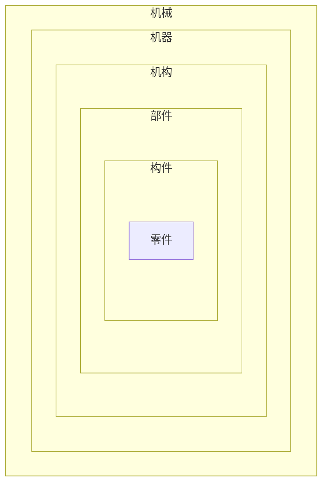

- **结构维度**：
    
    - **零件**：机器中每一个最基本的==制造==单元体。
        
    - **构件**：由一个或几个零件组成的==运动==单元体。
        
    - **部件**：由若干零件组成的==装配==单元体。
        
    - **机构**：由多个构件组成的多构件组合体，具有确定的相对运动。
        
    - **机器**：由多个机构和部件组成的装置，具有==转换机械能或完成机械功==的功能。
        
    - **机械**：机器和机构的总称，涵盖了所有由人工组合的多构件组合体。


1. **零件（Part）**
   - 定义：机器中每一个最基本的制造单元体。
   - 关系：是构成机器、构件和部件的基本单元。

2. **构件（Link）**
   - 定义：在机器中，由==一个==或==几个零件==所构成的==运动单元体==。
   - 关系：由零件构成，是机器的一个组成部分，可以包含一个或多个零件。

3. **部件（Component）**
   - 定义：机器中由若干零件所组成的==装配单元体==。
   - 关系：由多个零件组成，是机器的一个组成部分，可以包含一个或多个构件。

4. **机构（Mechanism）**
   - 定义：具有机器前两个特征的多构件组合体，即由许多构件经人工组合而成，构件之间具有确定的相对运动。
   - 关系：是机器的一个组成部分，由多个构件组成，但不包括机器的第三个特征（转换机械能或完成机械功）。

5. **机器（Machine）**
   - 定义：具有以下特征的装置：
     - 由许多构件经人工组合而成；
     - 构件之间具有确定的相对运动；
     - 用来代替人的劳动去转换产生机械能或完成有用的机械功。
   - 关系：由多个机构和部件组成，是机械的一种具体形式。



<center>图：概念关系图</center>


- **运动维度**：
	
	- **构件**：
	
    - **运动副**：两个零件之间的相对运动关系，如转动副、滑动副等。
        
    - **运动链**：由多个构件和运动副组成的系统，用于实现特定的运动或力的传递。
	
	- **机构** ：
	
    - **机器**：由多个机构和部件组成的装置，具有确定的相对运动和功能。

- **装配维度**：
	
	- **零件**：
	
	- **部件**：


```ad-note
title:注意
 **运动副 (Kinematic Pair)**
  - **定义**：运动副是指两个零件之间的==相对运动关系==，通常通过接触面或连接方式来实现。运动副决定了零件之间的运动方式和约束条件。
  - **包含关系**：运动副是机构的一部分，由两个零件组成。
  - **例子**：铰链（转动副）、滑动副（直线运动副）、齿轮副（啮合副）、凸轮副等。


>总结：运动副是一种运动关系对的叫法，不属于上述从结构视角的划分体系当中
```


