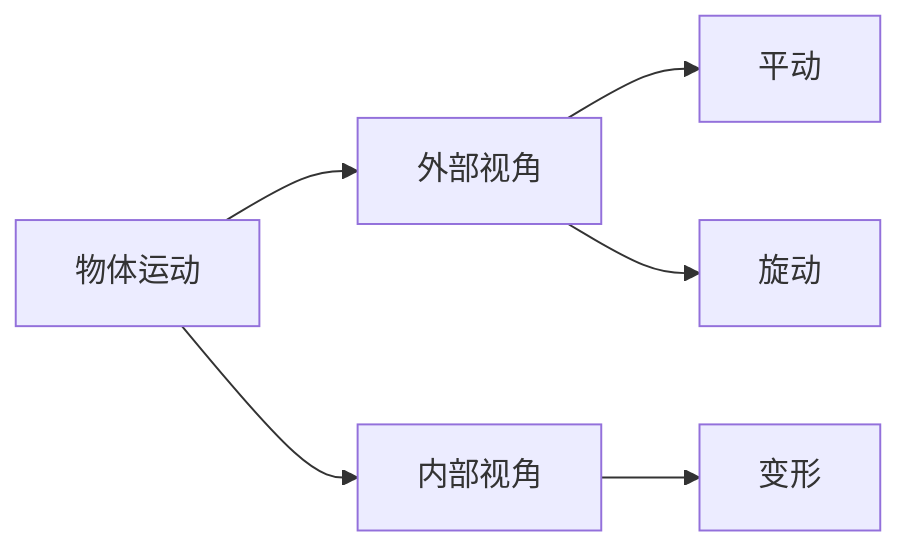

# 引言

# 符号

#### 一、基本力学量

|符号|含义|
|---|---|
|$F$|力，表示作用在物体上的外力|
|$F_s$|剪力，构件在某一截面上受到的剪切力|
|$M$|弯矩，构件在某一截面上受到的弯曲力矩|
|$F_N$|轴力，构件在轴向受到的拉力或压力|
|$F_b$|挤压力，连接件和被连接构件之间的挤压力|
|$F_r$|反力，支撑构件对受力构件的反作用力|

#### 二、应力和应变

|符号|含义|
|---|---|
|$\sigma$|正应力，垂直于截面的应力分量|
|$\tau$|切应力，平行于截面的应力分量|
|$\varepsilon$|线应变，物体在某一方向上的线变形程度|
|$\gamma$|切应变，物体在某一平面内的角变形程度|
|$\sigma_{max}$|最大正应力，构件在某一截面上可能达到的最大正应力|
|$\tau_{max}$|最大切应力，构件在某一截面上可能达到的最大切应力|
|$\sigma_b$|强度极限，材料在拉伸试验中能承受的最大应力|
|$\sigma_s$|屈服极限，材料在拉伸试验中开始发生屈服现象时的应力|
|$E$|弹性模量，材料的弹性性质，单位为帕斯卡（Pa）|
|$\nu$|泊松比，材料在轴向拉伸或压缩时横向应变与轴向应变的比值|

#### 三、几何量

| 符号  | 含义             |
| --- | -------------- |
|$A$| 截面面积，构件某一截面的面积 |
|$l$| 长度，构件的长度       |
|$d$| 直径，圆形截面的直径     |
|$r$| 半径，圆形截面的半径     |
|$h$| 高度，构件的垂直高度     |
|$b$| 宽度，构件的水平宽度     |
|$I$| 惯性矩，截面抵抗弯曲的能力  |
|$W$| 截面模量，截面抵抗弯曲的能力 |

#### 四、载荷和约束

|符号|含义|
|---|---|
|$P$|集中载荷，作用在构件某一特定点上的力|
|$q$|分布载荷，连续作用在构件表面上的力|
|$M_e$|外力偶矩，作用在构件上的力偶矩|
|$F_R$|约束反力，支撑构件对受力构件的反作用力|
|$F_A$|支座反力，支座对构件的反作用力|

#### 五、其他符号

| 符号         | 含义                       |
| ---------- | ------------------------ |
|$\Delta l$| 伸长量，构件在轴向拉伸或压缩时的长度变化     |
|$\delta$  | 伸长率，构件在轴向拉伸或压缩时的相对长度变化   |
|$\psi$    | 断面收缩率，构件在轴向拉伸或压缩时的断面收缩程度 |
|$k$       | 刚度系数，弹簧或其他弹性元件产生单位变形所需的力 |
|$G$       | 剪切模量，材料抵抗剪切变形的能力         |
|$\rho$    | 密度，材料的密度                 |
|$\alpha$  | 角度，构件变形前后的角度变化           |
|$\theta$  | 夹角，构件之间的夹角               |


<center><b>
视频：系统自学/复习参考视频</b></center>

- # 1. 本书回忆

1. 材料力学中力分为载荷(N)和应力(Pa)，载荷是对高中你认知的那个力的延申。而应力则是对压强概念的延申，其有正应力和切应力两个正交力描述。


- # 2. 本书重点

- ## 2.0. 目的

- ## 2.1. 拉伸

- ## 2.2. 压缩

- ## 2.3. 扭转

- ## 2.4. 弯曲

	- 弯曲变形中弯矩的规定
	
	- **弯曲变形中力矩规定**：若力偶位于截面左侧，顺时针方向为正；若位于右侧，逆时针方向为正。（==平面非弯曲变形时的理论力学静力学分析按照顺反逆正去规定==）[[理论力学 哈教研 第八版 笔记]]


- # 3. 本书犯错


# 1. 绪论

## 1.1. 材料力学的任务

**一、 构件的定义与基本要求**

- 工程结构或机械的各个组成部分，如建筑物的梁和柱、机床的轴等，统称为构件。
- 当工程结构或机械工作时，构件将受到载荷的作用。
- 例如，车床主轴受齿轮啮合力和切削力的作用，建筑物的梁受到自身重力和其他物体重力的作用。
- 构件一般由固体体制成。
- 在外力作用下，固体有抵抗破坏的能力，但这神能力又是有限度的。而且，在外力作用下，固体的尺寸和形状还将发生变化，称为变形。
- 为保证工程结构或机械的正常工作，构件应有足够的能力负担起应当承受的载荷。
- 因此，它应当满足以下要求：
	


**二、 构件需要满足的要求**

- **1. 强度要求**（Mpa）
    
    - 在规定载荷作用下的构件不应破坏。
    - 例如，冲床曲轴不可折断，储气罐不应爆裂。
    - 强度要求就是指构件应有足够的抵抗破坏的能力。
- **2. 刚度要求**（E）
    
    - 在载荷作用下，构件即使有足够的强度，但若变形过大，仍不能正常工作。
    - 例如，齿轮轴变形过大，将造成齿轮和轴承的不均匀磨损，引起噪声；机床主轴变形过大，将影响加工精度。
    - 刚度要求就是指构件应有足够的抵抗变形的能力。
- **3. 稳定性要求**
    
    - 有些受压力作用的细长杆，如千斤顶的螺杆、内燃机的挺杆等，应始终维持原有的直线平衡形态，保证不被压弯。
    - 稳定性要求就是指构件应有足够的保持原有平衡形态的能力。
	


**三、 不满足要求的后果与材料力学的任务**

- 若构件横截面尺寸不足、形状不合理，或材料选用不当，将不能满足上述要求，从而不能保证工程结构或机械的安全工作。
- 相反，也不应不恰当地加大横截面尺寸或选用优质材料，这样虽满足了上述要求，却多使用了材料和增加了成本，造成浪费。
- 材料力学的任务就是在满足强度、刚度和稳定性的要求下，为设计既经济又安全的构件，提供必要的理论基础和计算方法。

**四、 工程问题分析与材料力学的研究方法**

- 在工程问题中一般说，构件都应有足够的强度、刚度和稳定性，但对具体构件又往往有所侧重。
- 例如，储气罐主要是要保证强度，车床主轴主要是要具备一定的刚度，而受压的细长杆则应保持稳定性。
- 此外，对某些特殊构件还可能有相符的反应。
- 例如为防止超载，当载荷超出某一极限时，安全销应立即破坏。又如为发挥缓冲作用，车辆的缓冲弹簧应有较大的变形。
- 研究构件的强度、刚度和稳定性时，应了解材料在外力作用下表现出的变形和破坏等方面的性能，即材料的力学性能，而力学性能需由实验来测定。
- 此外，经过简化得出的理论是否可信，也需由实验来验证。
- 还有一些尚无理论结果的问题，则须借助实验方法来解决。
- 所以，实验分析和理论研究同是材料力学解决问题的方法。

## 1.2. 变形固体定义假设

**一、 变形固体的定义**

- 固体因外力作用而变形，故称为变形固体或可变性固体。
- 固体有很多方面的属性，研究的角度不同，侧重面各不相同。
- 研究构件的强度、刚度和稳定性时，为抽象出受力模型，把握与问题有关的主要属性，略去一些次要属性，对变形固体作下列假设：


**二、 变形固体的基本假设**

- **1. 连续性假设**
    
    - 认为组成固体的物质不留空隙地充满了固体的体积。
    - 实际上，组成固体的粒子之间存在着空隙，并不连续，但这种空隙的大小与构件的尺寸相比极其微小，可以不计。
    - 于是就认为固体在其整个体积内是连续的。
    - 这样，当把某些力学量看作是固体的点的坐标的函数时，对这些量就可以进行坐标增量为无限小的极限分析。
		
- **2. 均匀性假设**
    
    - 认为在固体体内到处有相同的力学性能。
    - 就常用的金属来说，组成金属的各晶粒的力学性能并不完全相同。
    - 但构件或构件的任一部分中都包含为数极多的晶粒，而且无规则地排列，固体的力学性能是各晶粒的力学性能的统计平均值，所以可以认为各部分的力学性能是均匀的。
    - 这样，如从固体中取出一部分，不论大小，不论从何处取出，力学性能总是相同的。
    - 材料力学研究构件受力后的强度、刚度和稳定性，把它抽象为均匀连续的模型，可以得出满足工程要求的理论。
    - 对发生于晶粒那样大小的范围内的现象，就不宜再用均匀连续假设。
		
- **3. 各向同性假设**
    
    - 认为无论沿哪个方向，固体的力学性能都是相同的。
    - 就金属的单一晶粒来说，沿不同的方向，力学性能并不一样。
    - 但金属构件包含数量众多的晶粒，且又杂乱无章地排列，这样，沿各个方向的力学性能就接近相同了。
    - 具有这种属性的材料称为各向同性材料，如钢、铜、玻璃以及塑料等。
    - 沿不同方向力学性能不同的材料，称为各向异性材料，如木材、胶合板、纤维增强复合材料和某些人工合成材料等。
		
## 1.3. 外力及载荷

- # 2. 本节重点

载荷是一种特殊的外力，他更多的是指除梁、杆系统之外的外力。

### 1.3.1. 外力

- 当研究某一构件时，可以设想把这一构件从周围物体中单独取出，并用力代替周围各物体对构件的作用。这些来自构件外部的力就是外力。
    
- 按外力的作用方式可分为**表面力**和**体积力**。
    
    - **表面力**是作用于物体表面的力，又可分为**分布力**和**集中力**。
        - 分布力是连续作用于物体表面的力，如作用于油缸内壁上的油压力、作用于船体上的水压力、作用于机翼上的空气压力等。
        - 有些分布力是沿杆件的轴线作用的，如楼板对梁的作用力。
        - 若外力分布面积远小于物体的表面尺寸，或沿杆件轴线分布范围远小于杆线长度，就可看作是作用于一点的集中力，如火车轮对钢轨的压力，滚珠轴承对轴的反作用力等。
    - **体积力**是连续分布于物体内部各点的力，例如物体的自重和惯性力等。
		

### 1.3.2. 载荷

- 按外力与时间变化的关系，又可分成**静载荷**和**动载荷**。
    
    - 静载荷缓慢地由零增加到某一确定值，以后保持不变，或变动很不显著（惯性效应可忽略不计），即为静载荷。例如把机器缓慢放置在基础上时，机器的重量对基础的作用便是静载荷。
    - 若载荷随时间而变化，则为动载荷。
        - 随时间作周期性变化的动载荷称为**变载荷**，例如齿轮转动时，作用于每一个齿上的力都是随时间作周期性变化的。
        - **冲击载荷**则是物体在运动的瞬时产生突然变化所引起的动载荷，例如急刹车时飞轮的轮辋、锻造时汽锤的锤杆等都受到冲击载荷的作用。
		
	
**三、 不同载荷的影响与研究顺序**

- 材料在静载荷下和在动载荷下的性能颇不相同，分析方法也颇有差异。
- 因为静载荷问题比较简单，所建立的理论和分析方法又可作为解决动载荷问题的基础，所以首先研究静载荷问题。

```ad-question
title:**外力和载荷的区别？**
在材料力学中，**外力**和**载荷**的区别主要体现在概念范围和作用性质上：

1. **外力**  
   外力是广义的外部作用力，包括所有直接施加于构件的力或力矩，以及约束反力。例如，集中力、分布力、力偶矩和支座反力均属于外力范畴。外力作用会导致构件发生变形，同时引发内力（材料内部因变形产生的相互作用力）。

2. **载荷**  
   载荷是外力的子集，特指主动施加于构件的外部力或力矩，通常表现为拉力、压力、剪切力或扭矩等具体形式。例如，轴向载荷是沿材料轴线施加的拉伸或压缩力，而材料在载荷作用下的力学响应（如变形、断裂）直接决定了其工程应用性能。

简言之，**外力**是包含载荷和约束反力的总称，而**载荷**仅指主动施加的外部作用力。这一区别类似于“家族”与“成员”的关系。
```

## 1.4. 内力、截面法和应力的概念*

- # 1. 本节回忆

- ## 1.1. 应变与应力的关系

- ### 1.1.1. 正应变与正应力

在材料力学中，**正应力（法向应力）确实是产生正应变（法向应变）的主要原因**，但需结合具体条件和材料特性进行分析。以下是详细解释：

- #### 1. 基本关系：胡克定律
   - **单向应力状态**下，正应力（σ）与正应变（ε）的关系由**胡克定律**描述：
    $$
     \sigma = E \cdot \varepsilon
    $$
     其中$E$是材料的弹性模量（杨氏模量）。这表明正应力直接导致同一方向的正应变。

   - **横向应变（泊松效应）**：当材料在某一方向受拉时，纵向伸长（正应变），横向会缩短（横向正应变），其关系为：
    $$
     \varepsilon_{\text{横向}} = -\nu \cdot \varepsilon_{\text{纵向}}
    $$
     其中$\nu$是泊松比。此时横向正应变由纵向正应力间接引起，但本质仍是正应力的作用。

>	**注意**：应变值为正表示伸长或变粗；应变值为负表示缩短或变细

- #### 2. 多向应力状态（广义胡克定律）
在三维复杂应力状态下，正应力与正应变的关系需通过**广义胡克定律**描述：
$$
\varepsilon_x = \frac{1}{E} \left[ \sigma_x - \nu (\sigma_y + \sigma_z) \right] \\
\varepsilon_y = \frac{1}{E} \left[ \sigma_y - \nu (\sigma_x + \sigma_z) \right] \\
\varepsilon_z = \frac{1}{E} \left[ \sigma_z - \nu (\sigma_x + \sigma_y) \right]
$$
- 每个方向的正应变（如$\varepsilon_x$）由该方向的正应力（$\sigma_x$）主导，同时受其他方向正应力（$\sigma_y, \sigma_z$）通过泊松效应的影响。
- **结论**：正应力是正应变的直接来源，但多向应力下需综合考虑各方向应力的耦合效应。

- #### 3. 正应力与剪应力的分工
- **正应力（σ）**：仅引起正应变（ε），与剪应变（γ）无关。
- **剪应力（τ）**：仅引起剪应变（γ），与正应变无关。
- 这是材料力学的基本假设之一，符合**应力-应变解耦原则**。

- #### 4. 特殊情况与注意事项
- **各向同性材料**：正应力与正应变的关系由$E$和$\nu$完全描述。
- **各向异性材料**（如复合材料）：正应力可能引起更复杂的应变响应，需用更复杂的本构方程描述。
- **非线性材料**（如超弹性材料）：正应力与正应变可能不再满足线性关系，但本质仍是正应力主导正应变。

- #### 总结
**正应力是产生正应变的直接原因**，这一结论适用于线弹性、各向同性材料的常规工况。在单向应力下，两者呈线性关系；在多向应力下，需通过广义胡克定律综合考虑各方向应力的影响，但核心仍是正应力主导正应变。剪应力则单独负责剪应变，两者互不干扰。

---

- ### 1.1.2. 切应变与切应力

在材料力学中，**切应变（剪应变）确实主要由切应力（剪应力）产生**，这一关系是材料力学的基本原理之一。以下是详细分析：

- #### 1. 切应力与切应变的基本关系：剪切胡克定律
   - 在**线弹性范围内**，切应力（$\tau$）与切应变（$\gamma$）的关系由**剪切胡克定律**描述：
    $$
     \tau = G \cdot \gamma
    $$
     其中$G$是材料的**剪切模量**（刚度模量）。这表明切应力是切应变的直接原因，两者呈线性关系。

   - **物理意义**：当材料受到切应力作用时，会发生形状改变（如立方体变为平行六面体），这种**形状变化**由切应变量化。

- #### 2. 切应力与切应变的独立性
   - **正应力与正应变**和**切应力与切应变**之间是**相互独立**的：
     - 正应力（$\sigma$）仅引起正应变（$\varepsilon$），与切应变无关。
     - 切应力（$\tau$）仅引起切应变（$\gamma$），与正应变无关。
   - 这种独立性是材料力学的基本假设之一，符合**应力-应变解耦原则**。

- #### 3. 多向应力状态下的切应力与切应变
   - 在三维复杂应力状态下，不同平面上的切应力与切应变仍遵循剪切胡克定律，但需注意方向性：
    $$
     \gamma_{xy} = \frac{\tau_{xy}}{G}, \quad \gamma_{yz} = \frac{\tau_{yz}}{G}, \quad \gamma_{zx} = \frac{\tau_{zx}}{G}
    $$
     每个平面的切应变仅由对应平面的切应力决定，与其他方向的应力无关。

- #### 4. 剪切模量$G$的物理意义
   - 剪切模量$G$是材料抵抗剪切变形能力的度量，其值由材料的弹性模量$E$和泊松比$\nu$决定：
    $$
     G = \frac{E}{2(1 + \nu)}
    $$
   - 例如，钢材的$G$约为 80 GPa，橡胶的$G$则显著更低，说明不同材料对剪切变形的抵抗能力差异显著。

- #### 5. 特殊情况与注意事项
   - **各向同性材料**：切应力与切应变的关系由单一剪切模量$G$描述，符合上述规律。
   - **各向异性材料**（如复合材料）：不同方向的剪切模量可能不同，需用更复杂的本构方程描述。
   - **非线性材料**（如塑料、橡胶）：切应力与切应变可能不满足线性关系，但仍以切应力为切应变的主要驱动因素。

- #### 总结
**切应力是切应变的直接原因**，这一结论适用于线弹性、各向同性材料的常规工况。剪切胡克定律（$\tau = G \gamma$）明确表明，切应力与切应变之间存在一一对应的线性关系，且与其他类型的应力/应变无关。在工程实践中，这一关系是分析剪切变形（如轴扭转、梁剪切弯曲）的基础。

---

- # 1.2. 应力的方向

在材料力学中，**正应力（法向应力）和切应力（剪切应力）的方向定义是明确的**，且与截面的几何关系密切相关：

- ### 1. 正应力的方向
   - **定义**：正应力（σ）是**垂直于截面**的应力分量，即其作用方向与截面的法线方向一致。
   - **物理意义**：正应力由轴向力、弯矩等引起，导致材料发生**拉伸或压缩**（正应变）。
   - **示例**：
     - 轴向拉伸的杆件：横截面上的正应力方向垂直于截面。
     - 弯曲梁的横截面：正应力沿高度方向呈线性分布，方向垂直于截面。

- ### 2. 切应力的方向
   - **定义**：切应力（τ）是**平行于截面**的应力分量，即其作用方向与截面相切。
   - **物理意义**：切应力由==剪力、扭矩==等引起，导致材料发生**剪切变形**（切应变）。
   - **示例**：
     - 扭转圆轴：切应力方向与横截面相切，沿半径方向线性分布。
     - 剪切梁的横截面：切应力方向平行于截面，分布可能复杂（如矩形截面的抛物线分布）。

- ### 3. 方向关系的直观理解
   - **正应力 → 垂直于截面**：想象一刀切开物体，正应力像是“推开”或“压紧”两个截面之间的力。
   - **切应力 → 平行于截面**：同一截面上，切应力像是“错动”两个截面之间的力。

- ### 4. 数学表达与符号约定
   - 在应力单元体（微元）上：
     - **正应力**用下标表示方向，如$\sigma_x$表示垂直于$x$-轴截面的正应力。
     - **切应力**用双下标表示作用面和方向，如$\tau_{xy}$表示作用在垂直于$x$-轴截面上、沿$y$-方向的切应力。

- ### 5. 特殊情况的补充
   - **斜截面上的应力分解**：当截面倾斜时，总应力可分解为正应力和切应力分量，但它们的定义仍遵循“垂直于截面”和“平行于截面”原则。
   - **三维应力状态**：无论空间如何变化，正应力和切应力始终按其与当前截面的相对方向定义。

- ### 总结
**正应力垂直于截面，切应力平行于截面**这一结论是材料力学中应力定义的核心规则，适用于所有线弹性、各向同性材料的应力分析。理解这一点有助于正确分析结构受力时的变形与破坏机制。


>**注意**：还有一项没提，就是这个干合外力矩为零。


A：很明显，其作为集中载荷直接通过轴线，属于拉压杆。
B：
	角度一：其作为集中载荷未直接通过轴线，不属于拉压杆
	角度二：利用[[理论力学 哈教研 第八版 笔记]]中平面力系简化原理的知识，将$\vec F$简化到过轴线处，会多出一项力矩。不符合合外力矩为零的原则，故不属于拉压杆。
C：虽然有分布载荷，但是上下两侧的集度$q$是相等的，因此分布力集中化后，发现得到的上下两侧的集中力是对称的。将其简化到过轴线一点时候，产生的力矩互相抵消。故其为拉压杆。
D：将分布载荷进行集中化、简化处理后，发现其会给这段轴体产生一个附加力矩。

### 1.4.1. 内力

- **定义**：是指由外力作用所引起的、物体内相邻部分之间相互作用力（附加内力）。杆件所受到外界施加的力称为外力。
[](http://www.ecorr.org.cn/d/file/news/science/2022-04-07/3dbe03f628fc24875d007ae30bda9d41.jpg)
   如图所示为任意一个物体，它是由无穷多的微粒组成的，构件内任意相邻两个微粒之间存在着相互作用力，作用力的大小与微粒之间的相对位置有关系。当物体受到外力作用后，物体发生变形，其内部微粒之间的相对位置发生改变，它们之间的相互作用力随之发生改变。**我们把这个由外力作用而产生的作用力的改变量称为附加内力，简称为内力**。

>**注意**：一定是附加的改变量，但是这不是说明附加内力为0，内部分子作用力就不为0了。


可以看到，弯曲变形中外力、外力矩的方向通常内力（剪力、切应力方向相反）

>**思考**：不能把截面之前的其他截面的力也考虑分析进来，因为截面之前的截面是已经完成了平衡的，不对当前分析的截面有力的贡献作用，从下图的说明来看，相当于**前面的截面只是一个力的传导作用**。（红色箭头表示正在分析截面的内力）

![[材料力学 第六版 刘鸿文 绘图#^group=Q2wJzkCXoDPQ_QABztHy_]]


### 1.4.2. 截面法


```ad-note
title:**注意事项**
1. 截面从左到右移动时：分析的力一定是处于截面经过路径的左闭右开区间，也就是说如果截面移动到右侧端点，右侧端点上的力不考虑到内力中去。
2. 截面从右到左移动时：分析的力一定是处于截面经过路径的右闭左开区间，也就是说如果截面移动到左侧端点，左侧端点上的力不考虑到内力中去。

3. 应力如剪力的正负，得先用
```

### 1.4.3. 应力


```ad-question
title:**应力与内力的区分？**
应力与内力的区别主要体现在以下方面：

### 1. **定义与物理意义**  
- **内力**：指构件在外力作用下，其内部相邻部分之间产生的相互作用力，用于抵抗外力引起的变形或破坏。例如，轴力、剪力、弯矩等是内力的具体表现形式 。  
- **应力**：表示内力在构件截面上的分布密度，即单位面积上的内力强度。它描述了某一点处内力的集中程度，分为正应力（垂直于截面）和剪应力（平行于截面） 。

### 2. **范围与分布特性**  
- **内力**：是构件某一截面所有应力的合力，反映整体受力情况。例如，梁的弯曲内力（弯矩）由截面上各点的应力积分得到 。  
- **应力**：是局部概念，关注截面上某一点的内力分布状态。例如，同一截面不同位置的应力可能不同（如弯曲梁的上下表面应力差异） 。

### 3. **单位与表达形式**  
- **内力**：单位为牛顿（N）或千牛顿（kN），通常用集中力或力矩表示（如轴力$N$、弯矩$M$） 。  
- **应力**：单位为帕斯卡（Pa，即$\text{N/m}^2$），通过公式$\sigma = \lim_{\Delta A \to 0} \frac{\Delta F}{\Delta A}$定义，其中$\Delta F$是微面积$\Delta A$上的内力 。

### 4. **应用场景**  
- **内力**：用于结构力学分析，如计算梁的弯矩图、剪力图，确定构件的整体承载能力 。  
- **应力**：用于材料强度校核，如判断材料是否因局部应力超过屈服极限而失效 。

### 5. **联系与数学关系**  
- 应力是内力的“分布密度”，而内力是应力的积分结果。例如，轴向拉伸时，截面内力$F = \int \sigma \, dA$，其中$\sigma$为正应力，$dA$为微面积 。

### 总结  
内力是构件整体抵抗外力的“总量”，而应力是内力在局部点的分布强度。两者通过积分与微分关系相互关联，共同构成材料力学分析的基础。
```

## 1.5. 变形与应变*

>**引言**：材料力学研究固体的变形，除了为研究构件的刚度外，还因固体由外力引起的变形与内力的分布相关。

### 1.5.1. 变形

>**引言**：在[[理论力学 哈教研 第八版 笔记]]中我们学习了刚体的平动和旋动，这两种运动都是从外部的视角去研究的，现在研究对象从刚体变成了可变形体我们要从内部的视角去研究其特征，这就是和我们在理论力学学习的最大的不同。



<center><b>图：迄今位置对于物体运动框架的认知</b></center>


1. **位移与变形**  
   - M点因变形位移到M'，位移矢量$\overrightarrow{MM'}$由变形引起。  
   - 若固体受约束，需扣除刚性/刚体自身位移（如平动或转动）后，才能确定纯变形引起的位移。  

2. **微小六面体模型**  
   - 在M点附近取棱长分别为$\Delta x, \Delta y, \Delta z$的微小正六面体（边长趋近于零时称为单元体）。  
   - 变形后，六面体的边长和夹角均发生变化（图1.4a）。  

3. **线段长度变化与应变**  
   - 原线段MN投影于x-y平面，变形前长度为$\Delta x$，变形后变为$\Delta x + \Delta s$（图1.4b）。  
   - 平均应变$\varepsilon_m = \frac{\Delta s}{\Delta x} = \frac{M'N' - MN}{MN}$。  
   - 当$\Delta x \to 0$时，极限值即为应变$\varepsilon = \lim_{\Delta x \to 0} \frac{\Delta s}{\Delta x}$（公式1.3）。  

4. **内力与应力**  
   - 文中提到，当面积$\Delta A \to 0$时，$\Delta A$上的内力极限为一个力而非力偶，暗示内力对区域内任一点的力矩为零。  

>**注意**：实际一个刚体受力发生位移时对于内部点来讲位移的来源分为宏观位移和微观位移两个部分。此处讨论的位移单单是指内部的微观位移。

---

 **核心概念关联**  
- **应变的物理意义**：应变$\varepsilon$是线段单位长度的伸长或缩短量，反映局部变形的剧烈程度。  
- **微分定义**：通过缩小$\Delta x$至无穷小，应变从平均值过渡到瞬时值，体现连续介质力学的微分特性。  
- **刚性位移的扣除**：实际工程中需区分整体运动与局部变形，避免将刚性运动误判为应变。  

---

 **图示解析**  
- **图1.4a**：三维视角下，六面体因变形发生形状改变，M点位移至M'，体现宏观变形。  
- **图1.4b**：一维简化模型，突出线段MN的伸长量$\Delta s$，便于应变计算。  

---

 **总结**  
该段内容通过微小六面体模型和极限分析，严谨地定义了应变，强调了应变作为**局部相对变形量**的本质，并区分了变形与刚性位移对位移的贡献。公式（1.3）是应变的微分定义式，是后续应力-应变关系分析的基础。

### 1.5.2. 应变


1. **线应变/正应变（ε）**  
   - 定义：若线段$MN$内各点沿$x$方向的变形均匀，则平均应变即为$M$点的应变；若变形不均匀，则需通过极限形式$\varepsilon = \lim_{\Delta x \to 0} \frac{\Delta s}{\Delta x}$（==公式1.3==）定义局部应变。  
   - 物理意义：表示M$点沿x$方向单位长度的伸长或缩短量。  

2. **切应变/角应变（γ）**  
   - 定义：由正交线段夹角变化的极限值确定。例如，图1.4b中，变形前后夹角变化为$\left( \frac{\pi}{2} - \angle L'M'N' \right)$，当$N$和$L$趋近于$M$时，极限值$\gamma = \lim_{MN, ML \to 0} \left( \frac{\pi}{2} - \angle L'M'N' \right)$（公式1.4）。  
   - 物理意义：反映$M$点处微小正六面体相邻边夹角的改变量，度量剪切变形程度。  

3. **应变的基本特性**  
   - 线应变$\varepsilon$和切应变$\gamma$是==描述一点变形==的两个基本量，均为无量纲量（量纲为一）。  
   - 应用范围：仅适用于小变形情况（变形量远小于构件尺寸），此时可忽略高阶微量（如位移平方或乘积项）。  

4. **小变形假设**  
   - 工程意义：实际构件变形极微小，需用精密仪器测量。材料力学中默认忽略变形对几何形状的影响（如图1.5中支架变形被简化为原始尺寸计算）。  
   - 必要性：若考虑变形对内力方向的影响，需先求解变形再列平衡方程，导致复杂迭代问题。  

---

 **核心概念关联**  
- **应变的局部性**：通过极限过程从宏观变形过渡到微观应变，体现连续介质力学的微分特性。  
- **小变形简化**：假设变形远小于构件尺寸，允许忽略高阶项，大幅简化平衡方程的建立（如图1.5中支架受力分析）。  


- **应变与应力的关系**：后续可通过本构方程（如胡克定律）将应变与应力联系起来，完成力学分析闭环。  

---

 **图示解析**  
- **图1.4b**：通过线段MN$的伸长量\Delta s$和夹角变化$\angle L'M'N'$，直观展示线应变和切应变的几何意义。  
- **图1.5**：以支架为例，说明小变形假设下可直接使用原始尺寸计算内力，避免因变形导致的复杂迭代。  

---

**总结**  
该段内容系统阐述了线应变和切应变的定义及其物理意义，并强调小变形假设在工程分析中的必要性。通过忽略高阶微量，材料力学得以简化计算，聚焦于线性化后的力学行为分析。公式（1.3）和（1.4）是应变分析的核心工具，为后续应力计算和本构关系建立奠定基础。

```ad-question
title:**变形与应变的区别？**

### 1. **定义差异**  
- **变形**（或形变）：指物体在受到外力作用时，其**整体或局部的外部形状和尺寸的变化**，例如拉伸、弯曲、扭转等现象 。  
- **应变**（Strain）：描述物体内部某一点或单元体因外力作用产生的**相对变形量**，是无量纲的物理量，通常表示为单位长度的伸长量或角度变化 。  

### 2. **关系解析**  
- **应变是变形的量化表达**：变形描述的是宏观的形状或尺寸变化（如长度增加ΔL），而应变则是通过局部变形量与原始尺寸的比值来表征变形的剧烈程度。例如，轴向应变$ε=ΔL/L₀$（$L₀$为原长）。  
- **变形包含位移与应变**：物体的变形可能由刚体位移（平动或转动）和应变共同组成。若物体仅发生刚体运动而无形状改变，则应变为零；反之，若存在形状或尺寸的局部变化，则必然伴随应变 。  

### 3. **应用场景**  
- **工程分析**中，应变直接关联材料的力学响应（如应力-应变曲线），而变形则用于评估结构的整体稳定性或功能需求（如桥梁的挠度、机械部件的形变极限）。  
- 在**小变形假设**下（如材料力学常见情况），应变可通过线性化公式简化计算，从而建立几何方程与物理方程 。  

### 总结  
变形是物体形状或尺寸变化的广义描述，而应变是其局部相对变形的精确度量，二者通过数学关系（如$ε=ΔL/L₀$）紧密联系，共同构成材料力学分析的基础 。
```

---

 **判断题**  
1. **线应变（ε）是通过极限过程定义的，当Δx趋近于0时，Δs/Δx的极限值即为ε**  
   **答案**：正确   

2. **切应变（γ）反映了微小正六面体相邻边夹角的变化量**  
   **答案**：正确   

3. **在小变形假设下，可以忽略位移的平方或乘积项，简化计算**  
   **答案**：正确   

4. **应变是有量纲的物理量，其单位为米**  
   **答案**：错误（应变为无量纲量）   

5. **微小六面体模型在边长趋近于零时称为单元体，用于分析局部变形**  
   **答案**：正确   

6. **刚性位移包括平动和转动，需从总位移中扣除后才能确定变形引起的位移**  
   **答案**：正确   

7. **图1.5中支架的变形被忽略，直接使用原始尺寸计算内力，符合小变形假设**  
   **答案**：正确   

8. **应变ε和切应变γ是描述一点变形的两个基本量，均无量纲**  
   **答案**：正确   

9. **变形后的线段长度变化Δs等于M'N' - MN，平均应变ε<sub>m</sub> = Δs / Δx**  
   **答案**：正确   

10. **材料力学中，无论变形是否均匀，都可用公式（1.3）定义应变**  
    **答案**：正确   

---

 **设计说明**  
1. **考点覆盖**：题目涵盖应变定义（1-2）、小变形假设（3-7）、模型应用（5-6）及公式适用性（9-10）等核心内容。  
2. **易错点强化**：第4题针对“应变无量纲”这一常见误区设计，第10题强调公式（1.3）的普适性。  
3. **引用依据**：所有答案均基于图片中提供的理论推导和示例（来源）。  

---

 **选择题**  
1. **线应变（ε）的物理意义是（ ）**  
   A. 单位体积的变化量  
   B. 单位长度的伸长或缩短量  
   C. 角度变化的弧度值  
   D. 内力的分布密度  
   **答案**：B（引用线应变定义）  

2. **切应变（γ）反映的是（ ）**  
   A. 线段长度的绝对变化  
   B. 正交线段夹角的改变量  
   C. 材料的刚度特性  
   D. 应力与应变的比值  
   **答案**：B（引用切应变定义）  

3. **应变的量纲是（ ）**  
   A. 长度（米）  
   B. 力（牛顿）  
   C. 无量纲  
   D. 应力（帕斯卡）  
   **答案**：C（引用应变无量纲特性）  

4. **小变形假设下，可忽略（ ）**  
   A. 刚性位移的影响  
   B. 位移的平方或乘积项  
   C. 内力的分布  
   D. 应力的非线性变化  
   **答案**：B（引用小变形简化条件）  

5. **图1.5中支架的内力计算采用原始尺寸，这是因为（ ）**  
   A. 变形完全可逆  
   B. 小变形假设忽略几何变化  
   C. 材料处于弹性阶段  
   D. 支架无任何位移  
   **答案**：B（引用小变形假设的应用）  

6. **单元体模型用于分析（ ）**  
   A. 宏观整体变形  
   B. 局部点的变形特征  
   C. 刚性位移的合成  
   D. 温度引起的膨胀  
   **答案**：B（引用微小六面体模型）  

7. **刚性位移需扣除的原因是（ ）**  
   A. 仅反映整体运动，非局部变形  
   B. 导致应力集中  
   C. 改变材料力学性质  
   D. 引起非线性应变  
   **答案**：A（引用刚性位移与变形位移区分）  

8. **公式（1.3）中应变ε的极限形式适用于（ ）**  
   A. 大变形情况  
   B. 任意变形均匀与否  
   C. 小变形且连续介质  
   D. 突变的不连续变形  
   **答案**：C（引用极限定义的适用条件）  

9. **图1.4b中平均应变ε<sub>m</sub>的计算式为（ ）**  
   A. Δx / Δs  
   B. Δs / Δx  
   C. (Δx + Δs) / Δx  
   D. (Δs - Δx) / Δs  
   **答案**：B（引用平均应变公式）  

10. **切应变γ的单位是（ ）**  
    A. 度（°）  
    B. 弧度（rad）  
    C. 无量纲  
    D. 帕斯卡（Pa）  
    **答案**：C（引用切应变无量纲特性）  

---

 **设计说明**  
1. **考点覆盖**：题目涵盖应变定义（1-3）、小变形假设（4-5）、模型应用（6-7）、公式推导（8-9）及单位辨析（10）。  
2. **干扰项设计**：选项结合相似概念（如应力、刚性位移）或易混淆知识点（如量纲、角度单位）强化理解。  
3. **引用依据**：所有答案均基于图片内容中的理论推导和示例。  


## 1.6. 杆件变形的基本形式*

- # 2. 本节重点


<center><b>
图：变形特征总结</b></center>

>**注意1**：说一个力是压力或者是拉力，一定要==明确是对于哪段轴，哪个分析截面==来讲的。因为同一个力对于不同段轴或者截面来讲其会在“拉”或“压”（如下图,$\vec F$对于截面1-1是拉力，对于截面2-2是压力）

![[材料力学 第六版 刘鸿文 绘图#^group=ZKoQv3MgiLEKOExGlg6nB]]

<center><b>
图：注意 1 描述图
</b></center>

>**注意2**：说一个力是压力或拉力，一般==不能将他去位移描述==。如果你允许这个力按照理论力学的平移定理去说的话，==让这个力沿着力的方向从截面左侧到右侧其拉压性质会改变==，那么很难界定其是拉力或者压力，所以我们一般不允许其随便平移（如下图，若截面1-1与2-2间的$\vec F$平移到了截面2-2右侧处，则$\vec F$对截面2-2的作用**性质从压力变成了拉力**）

![[材料力学 第六版 刘鸿文 绘图#^group=ekCblG6cs-E7AHqQTCco-]]

<center><b>
图：注意 2 描述图</b></center>

- # 3. 本节犯错


**一、 构件与变形**

- 构件有各种不同的形状。
- 材料力学主要研究长度远大于横截面尺寸的构件，称为杆件，或简称为杆。
- 杆件的轴线是杆件各横截面形的心的连线。
- 轴线为直线的杆件称为直杆。
- 横截面大小和形状不变的直杆称为**等直杆**。
- 轴线为曲线的杆件称为**曲杆**。
- 工程上常见的很多构件都可以简化为杆件，如连杆、传动轴、立柱、丝杆、吊钩等。
- 某些构件，如齿轮的轮齿、曲轴的轴颈等，并不是典型的杆件，但在近似计算或定性分析中也可简化为杆。
- 所以杆是工程中最基本的构件。
- 除杆件外，工程中常用的构件还有平板和壳体等。
- 杆件受力有多种情况，相应的变形也有多种形式。
- 就杆件一点周围的一个微小单元体来说，它的变形由前面指出的线应变和切应变来描述。
- 所有单元体的变形的积聚就形成杆件的整体变形。
- 杆件变形的基本形式有以下四种：

**二、 杆件的基本变形形式**

- **1. 拉伸或压缩**
    
    - 图 1.7a 表示一简易吊车，在载荷 F 作用下，AC 杆受到拉伸（图 1.7b），而 BC 杆受到压缩（图 1.7e）。
		
    - **特征**：这类变形形式是由==大小相等、方向相反、作用线与杆件轴线重合==的一对力引起的，表现为杆件的长度发生伸长或缩短。
    - **案例**：起重货物的钢索、桁架的杆件、液压缸的活塞杆等的变形，都属于拉伸或压缩变形。
	
- **2. 剪切**
    
    - 图 1.8a 表示一铆钉连接，在力 F 作用下，铆钉即受到剪切。
		
	- **特征**：这类变形形式是由==大小相等、方向相反、相互平行、但是通常不全部共线==的一对力（集中载荷或者分布载荷）引起的，表现为受剪杆件的两部分沿外力作用方向发生相对错动（图 1.8b）。
    - **案例**：机械中常用的连接件，如键、销钉和螺栓等在工作中都产生剪切变形。
	
>**Tips**：引起剪切的力，我们通常称其为剪切应力
	
- **3. 扭转**
    
    - 图 1.9a 所示的汽车转向轴 AB，在工作时发生扭转变形。
		
	- **特征**：这类变形形式是==由作用面垂直于杆轴的两个力偶==引起的（图 1.9b），表现为杆件的任意两个横截面发生绕轴线的相对转动。
	- **案例**：汽车的传动轴、电机和水轮机的主轴等，都是受扭杆件。
	
- **4. 弯曲**
    
    - 图 1.10a 所示的火车轮轴的变形，即为弯曲变形。
		
	- 下图插销处容易发生弯曲变形
		
		
	- **特征**：这类变形形式是==由垂直于杆件轴线的横向力，或由作用于包含杆轴的纵向平面内的一对大小相等、方向相反的力偶==引起的，表现为杆件轴线由直线变为曲线（图 1.10b）。
	- **案例**： 在工程中，受弯杆件是最常遇到的。桥式起重机的大梁、各种传动轴以及车刀等的变形，都属于弯曲变形。

**三、 组合变形**

- 还有一些杆件同时发生几种基本变形，例如车床主轴工作时发生弯曲、扭转和压缩三种基本变形；钻床立柱同时发生拉伸和弯曲两种基本变形。
- 这种情况称为组合变形。
- 在本书中，首先将依次讨论四种基本变形的强度和刚度计算，然后再讨论组合变形。


## 1.7. 习题

- # 1. 概念题


**问题 1详细解释：** 这个问题的答案是材料力学中关于构件设计和安全性的核心概念。为了确保工程结构或机械设备能够正常、安全地运行，其组成构件必须具备抵抗外力作用的能力。这能力体现在三个方面：

1. **强度条件：** 指构件在外力作用下不发生断裂或屈服等破坏的能力。这是最基本的安全要求，保证构件不会因受力过大而解体。
2. **刚度条件：** 指构件在外力作用下抵抗变形的能力。虽然构件没有破坏，但如果变形过大，可能会影响机械的精度、结构的正常功能，甚至导致其他问题。因此，变形必须控制在允许的范围内。
3. **稳定性条件：** 主要针对受压的细长杆等构件，指其在载荷作用下保持原有平衡形态不发生突然改变（如压杆失稳弯曲）的能力。失稳是一种突然发生的破坏形式，后果严重，因此对于这类构件，稳定性是重要的设计考量。

**问题 2详细解释：** 这个问题要求识别出在给定的四个选项中，哪一项不是工程构件正常安全工作“必须”满足的基本条件。根据对问题1的解释，强度、刚度和稳定性是确保构件正常安全运行的三个基本且必须满足的条件。选项 A、B、C 分别对应这三个条件。选项 D **硬度条件**是材料抵抗局部压入、划痕或磨损的能力。虽然硬度是材料的重要属性，对构件的耐用性和表面性能有影响，但在材料力学中，强度、刚度和稳定性是更 fundamental 的，它们直接关系到构件整体结构的完整性和功能性。硬度通常不是所有构件都必须满足的核心安全条件。因此，除了硬度条件外，强度、刚度和稳定性是工程构件必须满足的基本条件。

**问题 3详细解释：** 这个问题是对“强度”概念的准确定义。材料力学中，构件的强度特指其抵抗破坏的能力。破坏的形式多种多样，包括断裂、屈服、疲劳破坏等。

- 选项 A “在外力作用下构件抵抗破坏的能力”直接、准确地描述了强度的含义，即构件能够承受多大的外力而不失效。
- 选项 B “在外力作用下构件保持原有平衡的能力”描述的是构件的**稳定性**，特指受压构件抵抗失稳的能力。
- 选项 C “在外力作用下构件抵抗变形的能力”描述的是构件的**刚度**，即构件在外力作用下产生弹性变形的大小。

**问题 4详细解释：** 为了简化复杂的实际材料属性并进行理论分析，材料力学通常会做出关于材料性质的理想化假设。这三个基本假设是：

1. **连续性假设：** 假定材料是连续的，没有微观的空隙或裂纹，充满整个体积。这使得可以使用微积分等数学工具来描述材料内部的应力和应变。
2. **均匀性假设：** 假定材料在各个点的力学性能是相同的。这意味着材料的性质不会随位置变化。虽然实际材料可能在微观上不完全均匀，但在宏观上可以近似认为是均匀的。
3. **各向同性假设：** 假定材料在各个方向上的力学性能是相同的。这意味着材料的性质与受力方向无关。有些材料（如木材、某些复合材料）是各向异性的，但在基本理论中常常先研究各向同性材料。

**问题 5详细解释：** 这个问题旨在区分材料力学中关于“材料本身性质”的基本假设与在进行分析时可能采用的“变形程度”的假设。根据对问题4的解释，变形固体的三个基本假设是连续性、均匀性和各向同性，它们描述的是材料内在的属性。

- 选项 A、B、C 都属于变形固体的基本假设。
- 选项 D **小变形假设**是材料力学在进行许多具体问题分析时为了简化计算而引入的一个重要假设，它假定构件受力后的变形相对于其原始尺寸非常小，从而可以忽略变形对力学行为的影响（例如，认为力臂、作用面积等在变形前后不变）。小变形假设是分析中的简化手段，而不是对材料本身性质的基本假设。变形固体的基本假设是关于材料如何填充空间、其性质在不同点和不同方向上是否一致的描述。

- # 2. 计算题


# 2. 拉伸、压缩与剪切

## 2.1. 轴向拉伸与压缩的概念和实例

## 2.2. 轴向拉伸或压缩时横截面上的内力和应力

## 2.3. 直杆轴向拉伸或压缩时斜截面上的应力

## 2.4. 材料拉伸时的力学性能*

### 2.4.1. 塑性材料的拉伸性能
#### （1）低碳钢拉伸


  
[^5]曲线的横坐标是应变，纵坐标是外加的应力。曲线的形状反应材料在外力作用下发生的脆性、塑性、屈服、断裂等各种形变过程。这种应力-应变曲线通常称为[工程应力-应变曲线](https://zhida.zhihu.com/search?content_id=105769422&content_type=Article&match_order=1&q=%E5%B7%A5%E7%A8%8B%E5%BA%94%E5%8A%9B-%E5%BA%94%E5%8F%98%E6%9B%B2%E7%BA%BF&zhida_source=entity)，它与载荷-变形曲线外形相似，但是坐标不同。  

原理上，聚合物材料具有粘弹性，当应力被移除后，一部分功被用于摩擦效应而被转化成热能，这一过程可用应力应变曲线表示。金属材料具有弹性变形性，若在超过其[屈服强度](https://zhida.zhihu.com/search?content_id=105769422&content_type=Article&match_order=1&q=%E5%B1%88%E6%9C%8D%E5%BC%BA%E5%BA%A6&zhida_source=entity)之后 继续加载，材料发生塑性变形直至破坏。这一过程也可用应力应变曲线表示。

该过程一般分为：弹性阶段、屈服阶段、强化阶段、局部变形四个阶段。  
  
- **阶段1：弹性阶段**


- **主要特征：** 当应力低于**σe** 时，应力与试样的应变成正比，应力去除，变形消失，即试样处于弹性变形阶段（==注意，弹性变形中包括线弹性变形和非线弹性变形==）
  
- **重要概念：** 
	$\sigma_p$：材料的比例极限，是应力应变之间服从胡克定律的应力的最大值  
	**$\sigma_e$** ：材料的弹性极限，表示材料保持完全弹性变形的最大应力。   
	$E$：称为材料的弹性模量，一般钢材**E**=200**GPa。**  
	
	**线弹性阶段**：在弹性阶段有一特殊直线段，在该段内$\sigma$（应力）与$\varepsilon$（应变）之间呈线性关系，称为比例阶段，也称为线弹性阶段。满足[胡克定律](https://zhida.zhihu.com/search?content_id=105769422&content_type=Article&match_order=1&q=%E8%83%A1%E5%85%8B%E5%AE%9A%E5%BE%8B&zhida_source=entity)：$\sigma=E\varepsilon
	
	**非线弹性阶段**：在弹性阶段有一特殊曲线段，在该段内即发生线性弹性变形也发生非线性弹性变形（主要以非线性弹性变形为主）。但是其在撤去载荷后，其马上恢复原长。

**注意事项：**
	1. 只有工作应力$\frac{F}{A}<\sigma_p$时，$\sigma$与$\varepsilon$才服从胡克定律。
	2.$σ_p<σ<σ_e$时， **ab**段 内胡克定律不再成立，但仍为弹性变形
	2. 由于$σ_p、σ_e$相差不大，工程上并不区分


**阶段2：屈服阶段**


  
**主要特征：** 当应力超过$σ_e$达到某一数值 后，应力与应变之间的**近直线**关系被破坏，**应变显著增加，而应力先是下降，然后微小波动，在曲线上出现接近水平线的小锯齿线段**。如果卸载，试样的变形只能部分恢复，而保留一部分残余变形，即塑性变形。这说明钢的变形进入弹塑性变形阶段。  

**重要概念：**
	$\sigma_s$：称为材料的屈服强度或屈服点，是塑性材料一个重要指标，一般我们取下屈服极限点作为取值指标。
	$\sigma_{0.2}$：对于无明显屈服的金属材料，规定以产生0.2%残余变形的应力值为其屈服极限。  


**阶段3：强化阶段**


  
**主要特征：** 当应力超过**σs**后，试样发生明显而均匀的塑性变形，若使试样的应变增大，则必须增加应力值，这种随着塑性变形的增大，塑性变形抗力不断增加的现象称为[加工硬化](https://zhida.zhihu.com/search?content_id=105769422&content_type=Article&match_order=1&q=%E5%8A%A0%E5%B7%A5%E7%A1%AC%E5%8C%96&zhida_source=entity)或形变强化。  
  
**重要概念：** 当应力达到**σb**时试样的均匀变形阶段即告终止，此最大应力**σb**称为材料的强度极限或抗拉强度，它表示材料对最大均匀塑性变形的抗力。材料在拉伸破坏之前能承受的最大应力。


**阶段4：局部变形**


  
  
**主要特征：** 在$\sigma_b$值之后，试样开始发生不均匀塑性变形并形成缩颈，应力下降，最后应力达到σf时试样断裂。  

**重要概念：**
	$\sigma_f$：材料的条件断裂强度，它表示材料对塑性的极限抗力。

<center><b>
表：各阶段特点总结</b></center>

| 阶段     | 特点                                      | 关键参数                                     | 实验现象                         | 工程用途                                                                         | 误区注意                                                                 | 相应图片                                                                                                 |
| ------ | --------------------------------------- | ---------------------------------------- | ---------------------------- | ---------------------------------------------------------------------------- | -------------------------------------------------------------------- | ---------------------------------------------------------------------------------------------------- |
| 弹性变形阶段 | 应力与应变呈线性关系，变形可逆                         | 比例极限（$σ_p$）、弹性极限($\sigma_e$)、弹性模量（$E$）   | 荷载与伸长量呈正比，去除外力后恢复原状          |                                                                              | 这个阶段的变形可逆是**包括线弹性**和**非线弹性**两部分的可逆变形。比例极限前皆为线弹性变形，比例极限到弹性极限间存在非线弹性变形 | <br> |
| 屈服阶段   | 应力基本不变，应变显著增加，**出现塑性变形，仍有部分弹性变形**       | 屈服强度（$σₛ$）、条件屈服极限强度（$\sigma_{0.2}$）      | 荷载读数出现平台或波动，试样表面出现45°**滑移线** | 塑形材料的极限应力$\sigma_u$即为屈服强度$\sigma_s$。因为这个阶段后发生塑形变形屈服失效。                       | 一般取材料的下屈服极限作为材料的屈服强度，因为上屈服极限的波动性太大，不便测量                              | <br> |
| 强化阶段   | 材料内部晶格重组，抗变形能力增强。**其发生塑形变形的程度远超于弹性变形。** | 抗拉强度\强度极限（$σ_b$）                         | 荷载持续上升，试样均匀伸长，横截面积逐渐减小       | 在该阶段的材料进行退火处理，使其发生冷作硬化提高材料的比例极限或者弹性极限；脆性材料的极限应力$\sigma_u$，因为脆性材料在此之后发生脆性断裂失效 |                                                                      | <br> |
| 局部变形阶段 | 试样局部颈缩，承载能力下降，最终断裂                      | 条件断裂强度($\sigma_f$)、断后伸长率（$δ$）、截面收缩率（$ψ$） | 荷载读数下降，**颈缩区域迅速扩大**，断口呈杯锥状   |$\delta>0.005$为塑形、$\delta<0.005$为脆性材料                                        |                                                                      | <br> |
- 【表格注意事项】
	1. 实际工程中不会去刻意区分$\sigma_e$与$\sigma_p$的区别，因为两者的差别真的很小。
- 【材料性能分析】
	1. 看强度：曲线的纵坐标越高，其强度越高，载荷承受能力越强
	2. 看塑形：曲线的横坐标越长，其塑性越好
	3. 看刚度：曲线的斜率越来陡，其刚度越好，变形抵抗能力越强

  
上述应力-应变曲线中的应力和应变是以试样的初始尺寸进行计算的，事实上，在拉伸过程中试样的尺寸是在不断变化的，此时的真实应力**σ**应该是瞬时载荷 **（P）** 除以试样的瞬时截面积 **（A）**，即：**σ=P/A**；  
同样，真实应变 **ε**应该是瞬时伸长量除以瞬时长度 **$d_ε=dL/L$**。下图是[真应力-真应变曲线](https://zhida.zhihu.com/search?content_id=105769422&content_type=Article&match_order=1&q=%E7%9C%9F%E5%BA%94%E5%8A%9B-%E7%9C%9F%E5%BA%94%E5%8F%98%E6%9B%B2%E7%BA%BF&zhida_source=entity)


它不像应力-应变曲线那样在载荷达到最大值后转而下降，而是继续上升直至断裂，这说明金属在塑性变形过程中不断地发生加工硬化，从而外加应力必须不断增高，才能使变形继续进行，即使在出现缩颈之后，缩颈处的真实应力仍在升高，这就排除了应力-应变曲线中应力下降的假象。


以下是基于低碳钢拉伸实验四个阶段的10道判断题，结合不同角度（阶段特征、参数定义、实验现象等）设计：

---

 - 【**判断题**】  
	1. **弹性变形阶段**的应力与应变呈线性关系，且变形完全可逆 。  
	   **答案**：错误；弹性变形阶段包括线弹性变形和非线弹性变形两部分，非线弹性变形出现在比例极限强度$\sigma_p$之后。  
	
	2. **屈服阶段**中，低碳钢试样表面会出现45°滑移线，这是塑性变形的典型特征 。  
	   **答案**：正确  
	
	3. **强化阶段**的最高应力点称为弹性极限，标志着材料开始发生不可逆变形 。  
	   **答案**：错误（应为“抗拉强度”）  
	
	4. **颈缩阶段**发生时，试样的横截面积会均匀减小，导致应力持续上升 。  
	   **答案**：错误（颈缩阶段应力下降，局部截面急剧缩小）  
	
	5. 低碳钢拉伸实验的四个阶段依次为：弹性阶段、屈服阶段、强化阶段、断裂阶段 。  
	   **答案**：错误（应为“颈缩阶段”而非“断裂阶段”）  
	
	6. 屈服强度（σₛ）通常以**下屈服点**（FeL）对应的应力值为准，而非上屈服点 。  
	   **答案**：正确  
	
	7. **强化阶段**的应力-应变曲线呈上升趋势，表明材料因晶格重组而增强抗变形能力 。  
	   **答案**：正确  
	
	8. 断后伸长率（δ）和截面收缩率（ψ）是**强化阶段**评估材料塑性的关键指标 。  
	   **答案**：错误（属于“颈缩阶段”）  
	
	9. 低碳钢拉伸实验中，**弹性模量**（E）是通过弹性阶段的应力-应变斜率计算得到的 。  
	   **答案**：正确  
	
	10. 铸铁试样拉伸时也会经历与低碳钢相同的四个阶段，但其颈缩现象更明显 。  
	    **答案**：错误（铸铁无明显屈服和颈缩阶段）  

---

1. **考点覆盖**：题目涵盖阶段特征（如1、2、4）、参数定义（如3、6、9）、实验现象（如2、4、10）及材料特性对比（如10） 。  
2. **常见误区**：通过混淆阶段名称（如5）、参数定义（如3）、现象归属（如8）强化理解 。  
3. **引用依据**：所有题目均基于文献中低碳钢拉伸实验的核心描述，确保科学性 。

---
- 【选择题】
	1. **低碳钢拉伸实验中，弹性变形阶段的应力-应变关系符合以下哪一定律？**  
	   A. 胡克定律  
	   B. 库仑定律  
	   C. 帕斯卡定律  
	   D. 斯托克斯定律  
	   **答案**：A   
	
	2. **屈服阶段的关键现象是（ ）**  
	   A. 应力与应变成正比  
	   B. 试样表面出现45°滑移线  
	   C. 横截面积均匀减小  
	   D. 承载能力急剧下降  
	   **答案**：B   
	
	3. **抗拉强度（σᵦ）对应的是（ ）**  
	   A. 弹性阶段的最高应力  
	   B. 屈服阶段的最低应力  
	   C. 强化阶段的最大应力  
	   D. 颈缩阶段的断裂应力  
	   **答案**：C   
	
	4. **颈缩阶段中，试样的断裂特征通常表现为（ ）**  
	   A. 脆性断裂（平整断口）  
	   B. 韧性断裂（杯锥状断口）  
	   C. 沿晶断裂  
	   D. 解理断裂  
	   **答案**：B   
	
	5. **下列参数中，用于衡量材料塑性的是（ ）**  
	   A. 弹性模量（E）  
	   B. 屈服强度（σₛ）  
	   C. 断后伸长率（δ）  
	   D. 抗拉强度（σᵦ）  
	   **答案**：C   
	
	6. **低碳钢拉伸过程中，下屈服点（FeL）对应的应力称为（ ）**  
	   A. 比例极限  
	   B. 弹性极限  
	   C. 屈服强度  
	   D. 断裂韧性  
	   **答案**：C   
	
	7. **强化阶段的应力-应变曲线呈上升趋势，其原因是（ ）**  
	   A. 材料发生晶格重组（加工硬化）  
	   B. 外力持续增加  
	   C. 试样温度升高  
	   D. 测量仪器误差  
	   **答案**：A   
	
	8. **颈缩阶段开始时，试样的（ ）**  
	   A. 应力达到最大值  
	   B. 应变趋于零  
	   C. 横截面积突然增大  
	   D. 承载能力显著提高  
	   **答案**：A   
	
	9. **低碳钢拉伸实验中，四个阶段的正确顺序是（ ）**  
	   A. 弹性→强化→屈服→颈缩  
	   B. 弹性→屈服→强化→颈缩  
	   C. 屈服→弹性→强化→颈缩  
	   D. 强化→弹性→屈服→颈缩  
	   **答案**：B   
	
	10. **以下哪种现象仅在颈缩阶段出现？**  
	    A. 应力下降但应变增加  
	    B. 滑移线形成  
	    C. 指针停止转动  
	    D. 横截面积均匀减小  
	    **答案**：A   

---
1. **考点覆盖**：题目涵盖阶段特征（如2、9）、参数定义（如3、5、6）、实验现象（如4、7、10）及力学原理（如1、8） 。  
2. **干扰项设计**：错误选项结合其他阶段特征或相似概念（如1混淆力学定律，4对比脆性断裂） 。  
3. **引用依据**：所有答案均基于文献中低碳钢拉伸实验的标准描述  。


#### （2）其他材料拉伸

### 2.4.2. 脆性材料的拉伸性能

#### （1）铸铁拉伸
#### （2）其他材料拉伸

## 2.5. 材料压缩时的力学性能


## 2.6. 温度和时间对材料力学性能的影响

## 2.7. 失效、安全因数和强度计算*

## 2.8. 轴向拉伸或压缩时的变形

## 2.9. 轴向拉伸或压缩的应变能

## 2.10. 拉伸、压缩超静定问题

## 2.11. 温度应力和装配应力*
### 2.11.1. 温度应力

### 2.11.1. 装配应力


## 2.12. 应力集中

- ## ✅ 一、什么是“应力集中”？

**应力集中**指的是在材料内部由于几何不连续（如孔洞、缺口、急剧转角、螺纹等）导致应力在局部区域显著高于平均应力的现象。

举个例子：  
一根拉伸杆上若开了一个小孔，孔边缘的局部应力会远大于杆其他部分的平均应力，即使外力是均匀的。

---

- ## ✅ 二、应力集中系数

应力集中的强度常用 **应力集中系数**  $K_t$  表示：

$$
K_t = \frac{\sigma_{\text{max}}}{\sigma_{\text{nom}}}
$$

-  $\sigma_{\text{max}}$ ：几何不连续处的最大应力（局部）
-  $\sigma_{\text{nom}}$ ：名义应力（不考虑几何缺陷时的平均应力）

> 示例：对于一块有圆孔的拉伸板，$K_t$ 一般在 2~3 范围，表示最大应力是平均应力的 2~3 倍。

```ad-note
title:📘 PLA & PETG 常见应力集中现象及系数说明


## ✅ 材料说明

- **PLA（聚乳酸）**：硬度高，脆性大，易受应力集中影响导致脆断；
- **PETG（聚对苯二甲酸乙二醇酯）**：韧性好，抗冲击能力强，受应力集中的影响相对较小但仍需关注。

> 📌 应力集中系数 \(K_t\) 主要由**几何形状决定**，与材料无关；但材料的失效形式（脆断 or 屈服）与其韧性和应力集中抗敏感性密切相关。

---

## 📊 常见结构与应力集中系数 \(K_t\)

| 结构类型                     | 应力集中位置        | 几何参数例子                      | \(K_t\) 典型值 | 材料敏感性比较 |
|------------------------------|---------------------|----------------------------------|----------------|----------------|
| 圆孔（拉伸板）              | 孔边缘              | \(d/h = 1/3\)                    | 2.5 ~ 3.0      | PLA更敏感       |
| 圆角台阶（肩部过渡）        | 转角内侧            | \(r/d = 0.1\)                    | 1.8 ~ 2.7      | PLA更敏感       |
| 窄槽（缺口/裂纹）            | 缺口根部            | \(r/w = 0.05\)                   | 2.5 ~ 4.0+     | PLA非常敏感     |
| 方孔                        | 孔角                | 锐角、直角                       | 3.0 ~ 5.0      | PLA极敏感       |
| 螺纹根部（3D 打印螺纹）     | 螺纹底部            | ISO 螺纹（理想）                 | 2.0 ~ 3.5      | PETG略好        |
| 90° 弯曲连接（无圆角）       | 内侧弯角            | 没有过渡圆角                     | 3.5 ~ 5.0      | PLA容易断裂     |
| 孔边螺栓加载（拉伸剪切）     | 孔边缘              | 螺栓孔周围                       | 2.7 ~ 3.5      | PETG更耐用       |
| 支撑结构突变（如悬臂根部）   | 固定端/连接过渡     | 横截面急变                       | 2.0 ~ 3.0      | PLA常断在此处    |

---

## 📌 材料对比总结

| 特性              | PLA                        | PETG                        |
|-------------------|-----------------------------|------------------------------|
| 抗应力集中能力     | 差（易脆裂）                | 中（较耐裂）                  |
| 韧性               | 较低                        | 较高                         |
| 断裂特征           | 明显脆断，裂口尖锐           | 延展破坏，裂口圆钝            |
| 应用建议           | 建议过渡圆角 > 1mm，避免尖角 | 可接受小半径，但仍应过渡      |

---

## ✅ 设计建议（3D 打印结构）

1. **避免锐角和直角孔**：使用圆孔 + 圆角过渡；
2. **适当增加过渡半径**：例如肩部或台阶连接处至少 $r > 0.3t$；
3. **保持墙体厚度一致性**：减小突变；
4. **填充方式选择**：应力集中敏感部位建议用实心（100% infill）或高密度填充；
5. **疲劳件用 PETG 更合适**：特别是受力结构件或连接部件。

---

## 🔍 注：
应力集中系数 \(K_t\) 可用于估算最大应力：
$$
\sigma_{\text{max}} = K_t \cdot \sigma_{\text{nom}}
$$

其中：
- $\sigma_{\text{nom}}$：名义应力（基于外力 / 截面积）
- $\sigma_{\text{max}}$：结构薄弱处的实际应力（用以判断是否会断裂）

---

```

---

- ## ✅ 三、常见导致应力集中的几何形式

| 结构特征         | 应力集中特点                     |
|------------------|----------------------------------|
| 突变截面（台阶） | 应力集中在转角根部              |
| 圆孔、槽口       | 应力集中在边缘或槽角            |
| 螺纹             | 应力集中在螺纹根部              |
| 焊缝             | 尖角或不均匀过渡产生应力集中    |
| 锐角转弯         | 曲率急剧变化导致应力集中        |

---

- ## ✅ 四、工程设计中的处理建议

- ### ✳️ 1. 使用圆角过渡
- 尽可能避免锐角，改为圆角，减缓应力流线突变。

- ### ✳️ 2. 减小 $K_t$
- 增大圆角半径；
- 渐变过渡几何；
- 增设“卸载孔”或过渡曲面。

- ### ✳️ 3. 合理选材
- 若无法避免应力集中，应选择疲劳强度高、韧性好的材料。

- ### ✳️ 4. 局部强化
- 如滚压螺纹根部、喷丸处理等强化局部区域。

---

- ## ✅ 五、应力集中系数计算

- ### 方法一：查阅图册/手册
- 机械设计手册、Roark’s Formulas 等提供大量 $K_t$ 值的图表

- ### 方法二：有限元仿真（FEA）
- 使用 SolidWorks Simulation、ANSYS 等软件分析局部应力分布，得到 $\sigma_{\text{max}}$

---

- ## ✅ 六、应力集中造成的后果

| 问题类型       | 说明                                                 |
|----------------|------------------------------------------------------|
| 断裂           | 局部应力远超平均，容易形成裂纹起点                   |
| 疲劳破坏       | 局部应力循环大，裂纹从集中点开始扩展                 |
| 屈服失稳       | 整体未屈服，但局部超屈服应力发生塑性变形              |
| 蠕变损伤       | 高温下局部应力使得蠕变加剧，材料性能快速退化          |

---

- ## ✅ 七、工程案例分析

- ### 📌 飞机窗户设计
- 方窗：四角应力集中 → 裂纹 → 空难
- 圆窗：缓解应力集中，提高安全性

- ### 📌 螺纹根部失效
- 锐角根部应力集中；
- 工程中采用滚压形成圆滑底部增强疲劳强度

---

- ## ✅ 八、应力集中计算流程建议

| 步骤       | 内容                                                         |
|------------|--------------------------------------------------------------|
| 1. 识别     | 查找孔、槽、转角、台阶等应力集中区域                         |
| 2. 查表或仿真 | 获取对应几何的 $K_t$                                      |
| 3. 计算     | 最大应力 $\sigma_{\text{max}} = K_t \cdot \sigma_{\text{nom}}$ |
| 4. 材料校核 | 判断是否超出材料屈服强度或疲劳极限                          |
| 5. 结构优化 | 圆角处理、过渡设计、强化加工、选材等                        |

---

- ## ✅ 总结

应力集中虽是局部现象，但对疲劳强度和断裂寿命影响巨大。  
在设计早期识别并控制 $K_t$ 是安全可靠设计的关键。

如需具体几何的 $K_t$ 查表或仿真指导，可继续向我提问 👍


## 2.13. 剪切和挤压的实用计算

- # 1. 本节回忆

- ## 1.1. 剪切挤压力的区分

剪切力和挤压力在工程力学中是两种常见的受力形式，它们在材料变形和连接件设计中密切相关。以下是两者的关联性分析：

 1. **力学定义与方向关系**

- **剪切力**：平行于受力面，使材料沿截面发生相对滑移（如铆钉、螺栓的横向剪切）。
- **挤压力**：垂直于接触面，导致局部压缩变形（如铆钉与孔壁的压紧）。
- **关联性**：两者常同时出现于连接件中，例如铆钉受剪切时，孔壁同时承受挤压。

 2. **工程实例中的共存**

- **铆钉连接**：剪切力作用于铆钉横截面，挤压力作用于铆钉与钢板的接触面。
- **榫卯结构**：燕尾榫的斜面将部分剪切力转化为挤压力，通过摩擦和几何自锁抵抗滑移。

 3. **应力计算与强度条件**

- **剪切应力**：$\tau = \frac{F_s}{A}$（$F_s$为剪力，$A$为剪切面积）。
- **挤压应力**：$\sigma_{bs} = \frac{F_{bs}}{A_{bs}}$（$A_{bs}$为投影面积）。
- **关联性**：同一外力可能同时引发剪切和挤压，需分别校核强度（如例2.16中的平键）。

 4. **变形机制的相互作用**

- **剪切诱发挤压**：材料剪切滑移时可能伴随接触面压溃（如钢板冲孔）。
- **挤压影响剪切**：过大的挤压变形会改变剪切面几何形状，削弱抗剪能力。

 5. **实用计算中的简化假设**

- 工程中常假设应力均匀分布，但实际分布复杂（如铆钉挤压面为半圆柱，简化用直径平面计算）。

---

剪切力和挤压力在连接件中互为因果，共同影响构件强度。设计时需联合分析，确保满足：

- **剪切强度**：$\tau \leq [\tau]$
- **挤压强度**：$\sigma_{bs} \leq [\sigma_{bs}]$

例如，铆钉设计中需同时计算剪切面剪应力和孔壁挤压应力。


- ## 1.2. 剪切和挤压计算中的异同


- # 2. 本节重点


- # 3. 本节犯错


演示动画：[仿真动画形式表现柳钉固定两块铁板后受到的剪切力和挤压力](https://www.douyin.com/video/6793196466023206152)
### 2.13.1. 剪切的实用计算

 **一、剪切概念介绍**

现以钢杆受剪为例（图2.40a）来介绍剪切的概念：

1.  上、下两个刀刃以大小相等、方向相反、垂直于轴线且作用线相距很近的力$F$作用于钢杆上，迫使将钢杆沿$n - n$截面发生错动。


2. 作为第二个例子，考察连接轴与轮的键（图2.41a）。作用于轮和轴上的传动力偶矩和轴力的合力偶矩使轴与轮沿键的$n - n$面发生相对错动；**作用于轮的左右两个侧面上的力，大小相等、方向相反、作用线相距很近，使轮沿$n - n$面发生相对错动（特点）**。


>**分析**：以上两例中的$n - n$截面称为剪切面，可作剪切面处的截面称为剪切面。==构件的受剪变形是作用于构件一截面上的力的合力大小相等、方向相反、作用线相距很近，使构件两部分沿这一截面发生相对错动的变形==。工程中的连接件，如螺栓、铆钉、销钉、键等都是承受剪切的构件。

 **二、剪切内力和应力分析**

- **内力分析**：讨论剪切的内力和应力时，以剪切面$n - n$将受剪构件分成两部分，并以其中一部分为研究对象。如2.40b、c所示，$n - n$截面上的内力$F_{s}$与截面相切，称为剪力，它与截面上的外力大小相等、方向相反。


- **应力分析**：在实用计算中，假设剪切面上剪切应力是均匀分布的。若以$A$表示剪切面面积，则应力是$\tau=\frac{F_{s}}{A}$（2.22）。其中$\tau$与剪切面相切，故为切应力。

 **三、名义切应力及强度条件**

- **名义切应力**：在一些连接件的剪切面上，应力的实际情况比较复杂，切应力并非均匀分布，且还有正应力。所以，==由式（2.22）算出的只是剪切面上的“平均切应力”，是一个名义切应力==。为了弥补这一缺陷，在用实验的方式建立强度条件时，使试件受力尽可能地接近实际连接件的情况，由实验确定试件发生破坏时的极限载荷。同样，==用式（2.22）由极限载荷求出相应的名义极限应力，再除以安全因数$n_{\tau}$，得许用切应力$[\tau]$==。
- **强度条件**：根据以上强度条件，可进行强度计算，其公式为$\frac{F_{s}}{A}\leq[\tau]$（2.23）。 其中$F_{s}$为剪切面上的剪力，$A$为剪切面面积，$[\tau]$为许用切应力。


- 【例题】
	
	


<center><b>图：剪切实用计算总结</b></center>


### 2.13.2. 挤压的实用计算

 **一、挤压现象的基本描述**

1. **定义**：在外力作用下，连接件和被连接的构件之间，必将在接触面上相互压紧，这种现象称为挤压。例如在铆钉连接中，铆钉与钢板就相互压紧。

2. **可能产生的后果**：这种相互压紧可能把铆钉或钢板的铆钉孔压致局部塑性变形。比如铆钉孔被压成长圆孔的情况，铆钉也可能被压成扁圆柱（如图2.44）。


 **二、挤压强度计算的必要性**

由于挤压可能带来上述不良后果，所以应该进行挤压强度计算。

 **三、挤压应力的计算**

1. **基本假设**：在挤压面上，应力分布一般比较复杂，==但实用计算中，假设在挤压面上应力均匀分布==。
2. **计算公式**：以F表示挤压面上传递的力，即挤压力，$A_{bs}$表示挤压面积，则挤压应力$\sigma_{bs}=\frac{F}{A_{bs}}$。

 **四、挤压强度条件**

相应的强度条件是$\sigma_{bs}=\frac{F}{A_{bs}}\leq[\sigma_{bs}]$，其中$[\sigma_{bs}]$为材料的许用挤压应力。

 **五、不同接触面情况下的挤压面积确定**

1. **平面接触面**：当连接件与被连接构件的接触面为平面时，如图2.41中的键连接，上述公式中的$A_{bs}$就是接触面的面积（参看例2.16）。


2. **圆柱面接触面**：当接触面为圆柱面时（如销钉、铆钉等与钉孔间的接触面），挤压应力的分布大致如图2.45所示，最大应力在圆柱面的中点。实用计算中，以圆孔或圆钉的直径平面面积$\delta d$（即图2.45b中画阴影线的面积）除挤压力F，==则所得应力大致上与实际最大应力接近== 。其中图2.45（a）展示了挤压应力在圆柱面接触处的分布示意，图2.45（b）标注了计算所用直径平面面积的示意（阴影部分）。


<center><b>表：两种接触面形式对比</b></center>

| 区别项目   | 平面接触面            | 圆柱面接触面                                          |
| ------ | ---------------- | ----------------------------------------------- |
| 接触形态   | 连接件与被连接构件接触为平面形式 | 连接件（如销钉、铆钉等）与被连接构件（钉孔等）接触为圆柱面形式                 |
| 应力分布特点 | -                | 应力分布较复杂，最大应力在圆柱面的中点                             |
| 挤压面积计算 |$A_{bs}$就是接触面的面积 | 以圆孔或圆钉的直径平面面积$\delta d$（图2.45b中画阴影线的面积）作为计算挤压面积 |
| 示例     | 如图2.41中的键连接      | 如图2.44中的铆钉与钢板的接触、图2.45中的销钉或铆钉与钉孔的接触             |


<center><b>图：挤压实用计算总结</b></center>

### 2.13.3. 习题


## 2.14. 习题


- # 1. 本节回忆


**轴内应力的初始假设方向规定如下，但是有一点需要说明，就是定义的拉力方向如果是在截面的外力合绝对值较多一侧，需要引入一个负号修正，即+（-N），而在合力绝对值较少一侧则不需要**


总结来说：
- **外力的正负、放在方程中位置的判断**：先判断该外力初始左右点在截面的左右，然后根据外力的方向对该段轴造成的变形性质去加正负号。若外力造成压缩，则给其加负号，在根据在截面的左侧还是右侧放在等式的左侧或者右侧。若外力造成拉伸，则给其加正号，在根据其在截面的左侧还是右侧决定其放在等式的左侧还是右侧。
	
- **假设内力变量N的变号及最终正负解读**：按照一般约定，假设内力变量N是造成拉力的，但是如果你假设其在方程左右绝对值较多一方的话需要加入负号修正，假设在左右绝对值较少的一方加入正号修正。但其解出变量后最终变量值若为正，则杆处于拉伸状态，若变量值为负，则该杆段处于压缩状态


一般假设轴力的方向时候会遇上以下三种假设情况，此时我们假设轴力在等式左侧还是在等式右侧需要注意负号的修正，要不然假设在做和假设在右会发现解出的$-N_左=N_右$

| ![[材料力学 第六版 刘鸿文 绘图#^group=XoZiqxOcRhpz5OLh07wul]] | ![[材料力学 第六版 刘鸿文 绘图#^group=QFaohJovMmmhoIi1chg94]] | ![[材料力学 第六版 刘鸿文 绘图#^group=Yra-3e3A37nk8iebD8N0X]] |
| -------------------------------------------------------------------- | -------------------------------------------------------------------- | -------------------------------------------------------------------- |
| **仅左侧有外力**                                                           | **左右都有外力**                                                           | **仅右侧有外力**                                                           |
<center><b>图：轴力假设的三种情况</b></center>

每一个分析截面的轴内应力结果只代表该截面所在段的一个压缩和拉伸的描述，但是其基于其带有正负的应力计算出的每一段变形量的叠加和是能够描述这总的一段材料的拉伸和压缩情况的。


- # 2. 本节重点

- # 3. 本节犯错

轴力图中，每一段的轴力，只代表对于该段轴来讲内力是起到压缩还是拉伸的作用，与其他轴没有关系。

对于截面，其力的平衡方程形式是$F_{左侧力}=F_{右侧力}$，且你假设的内力在左在右最终会影响其解出的符号的正负性，需要根据前面本节回忆的内容引入负号进行修真。

- # 4. 本节思考


- # 5. 本节疑问

```ad-note
title:**轴力图计算中为什么有些时候算出来的完全和答案相反呢？**
1.  **平衡方程的写法**：你可能错误地使用了$F_{一侧外力} + F_{另一侧力} = 0$这样的平衡方程。
2.  **正确的写法**：正确的平衡方程应该是$F_{一侧外力} = F_{另一侧力}$。这样可以保证当外力为拉力（正值）时，内力也为正值。
3.  **符号的含义**：错误的写法会导致内力计算结果的负号不是表示内力方向背离截面，而是表示与另一侧外力方向相反。

**总结与建议**：

为了避免内力计算结果符号错误，请始终使用$F_{一侧外力} = F_{另一侧力}$这种形式的平衡方程。这样可以确保内力的正负号与拉压方向一致，即拉力为正，压力为负。

```

```ad-note
title:**为什么两种表达式会呈现如此不一样的意义？**
这两种表达式的差异源于它们对内力方向的参考系不同，以及如何理解平衡的含义。

1.  **表达式一：$F_{一侧外力} + F_{另一侧力} = 0$**

    *   **参考系**：这个表达式将外力和内力放在同一个参考系下，通常是全局坐标系。
    *   **平衡的含义**：它表达的是“合力为零”的概念。也就是说，所有外力和内力的矢量和必须为零，以保证截断部分处于平衡状态。
    *   **内力的含义**：在这种表达方式下，内力被视为与外力方向相反的力，以维持平衡。因此，内力的正负号仅仅表示它与所选取的“一侧外力”的方向关系。如果你假设内力方向与外力方向相同，那么计算出的内力值会带负号，表示实际方向与假设相反。
    *   **问题**：这种写法的问题在于，它没有直接体现内力本身的性质（拉伸或压缩）。内力的正负号仅仅是相对于外力的，而不是相对于杆件本身的变形趋势。

2.  **表达式二：$F_{一侧外力} = F_{另一侧力}$**

    *   **参考系**：这个表达式实际上是将内力转换到了与外力不同的参考系。它不再强调全局的合力为零，而是强调内力是“抵抗变形的力”。
    *   **平衡的含义**：它表达的是“内力与外力平衡”的概念。也就是说，内力的大小等于外力的大小，方向相反，从而阻止了杆件的进一步变形。
    *   **内力的含义**：在这种表达方式下，内力的正负号直接表示杆件的受力状态。拉伸为正，压缩为负。这是因为我们已经默认内力是抵抗变形的力，所以它的方向与变形趋势一致。
    *   **优点**：这种写法更直观地反映了内力的物理意义，即内力是抵抗变形的力，其正负号直接对应拉伸或压缩状态。

**总结**：

*$F_{一侧外力} + F_{另一侧力} = 0$强调合力为零，内力的正负号仅表示与外力的方向关系。
*$F_{一侧外力} = F_{另一侧内力}$强调内力是抵抗变形的力，内力的正负号直接表示拉伸或压缩状态。

第二种表达式更符合材料力学中对内力的定义和理解，因此更推荐使用。

```

```ad-note
title:**轴力分析时，其内力假设在分析截面的左面或者右面是会影响其内应力是拉伸还是压缩的一个性质描述,不统一的左右假设描述会造成很大的困扰，为什么？**


```


# 3. 扭转

## 3.1. 扭转的概念和实例

## 3.2. 外力偶矩、扭矩、扭矩图

### 3.2.1. 外力偶矩

[^8]工程实际中，往往并不直接给出作用于轴上的外力偶矩，而是给出轴所传递的功率和轴的转速。设外力偶矩Me（单位为N⋅m）作用于轴上，输入到轴上的功率为P（单位为kW=103 N⋅m/s），轴的转速为n（单位为r/min），则由功率与力偶做功的关系：


得


作用于轴上的所有外力偶矩都确定后，即可利用截面法来研究横截面上的内力——扭矩。

### 3.2.2. 扭矩

截面法求内力——扭矩

以图3-2（a）所示受一对外力偶作用的圆轴AB为例，用截面法求任一截面n-n上的内力：


<center><b>图3-2 截面法求任意截面的扭矩</b></center>

（1） 假想将圆轴沿横截面n-n截开分成两部分I和II，如图3-2（b）所示。

（2） 取任一部分研究其受力平衡，如取图 3-2（b）所示左侧部分 I，为满足平衡条件，**横截面n-n上的分布合力应合成为一力偶矩，称为扭矩**（torque），用T表示，**单位为N·m或kN·m**。可见杆件受到外力偶作用而发生扭转变形时，在杆的横截面上产生的内力为扭矩。由平衡方程

$$∑M_x=0， T−M_eA=0$$

得

$$T=M_eA$$

若取右侧部分II为研究对象，仍然可以得到截面上的扭矩$T=M_eB=M_eA$，但其方向刚好与左侧部分截面上的扭矩相反，如图3-2（b）所示。

扭矩的符号规定

为了使同一截面左右两部分杆件上的扭矩不但数值相等，而且符号相同，通常将扭矩的符号进行统一规定：按右手螺旋法则将T表示为矢量，当矢量方向与截面外法线方向相同时为正，反之为负，如图3-3所示。根据这一规定，图3-3中同一截面左右两部分上的扭矩大小相等，符号一致，都是正的。


<center><b>图3-3 扭矩的符号规定</b></center>


 ### 3.2.3. 扭矩图

当作用于轴上的外力偶多于两个时，不同横截面上的扭矩不尽相同，于是可将扭矩写成横截面位置的函数（称为扭矩方程）。此时往往用图线表示各横截面上扭矩沿轴线的变化情况。图中以沿轴线的横坐标x表示横截面的位置，取扭矩为纵坐标，这样绘出的图称为扭矩图（torque diagram）。下面通过例题说明扭矩图的绘制。


例题图3-1（a）所示传动轴的转速n=300 r/min，主动轮A的功率PA=400 kW，3个从动轮的输出功率分别为PC=120kW, PB=120kW, PD=160kW，试作该轴的扭矩图。

分析：除了轴的两端外，还在中间作用有集中力偶矩，所以整个轴的扭矩不同，应分为三段分别利用截面法求解。另外，在确定外力偶矩的转向时，应注意主动轮上外力偶矩的转向与轴的转向相同，而从动轮上外力偶矩的转向则与轴的转向相反，这是因为从动轮上的外力偶矩是阻力偶矩。

解：

（1） 利用式（3-1）计算主动轮和从动轮上的外力偶矩，即


（2） 应用截面法，分别用假想的任意截面1-1、2-2、3-3将轴截断，并假设所截开横截面上的扭矩符号均为正，依次取如例题图3-1（b）、（c）、（d）所示的研究对象分析。

对于如例题图3-1（b）所示的研究对象，由平衡方程


<center><b>例题图3-1</b></center>

$$ΣMx=0， T1+MeB=0$$

得

$$T1=−MeB=−3.82 kN⋅m$$

对如例题图3-1（c）所示的研究对象，应用平衡方程

$$ΣMx=0， T2+MeB+MeC=0$$

得

$$T2=−MeB−MeC=−7.64 kN⋅m$$

同理，由如例题图3-1（d）所示研究对象的平衡，得


（3） 根据上述计算结果，以横坐标x轴表示截面位置，以纵坐标表示对应截面的扭矩，作扭矩图，如例题图3-1（e）所示。

**讨论**：

（1） 从例题图3-1（e）不难看出，在中间作用有集中外力偶矩处的横截面两侧，扭矩有突然的间断，间断值恰好等于集中力偶矩。该结论具有普遍意义，可以仿照杆件受轴向拉压的情况证明：凡是集中力偶矩作用的截面上，扭矩有跳跃，截面右侧与左侧扭矩的差等于集中力偶矩。

（2） 请读者计算绘制主动轮置于轴一端时的内力图，并比较主动轮置于端部和置于中间时的扭矩最大值，思考哪种布局更合理。

扭矩与外力偶矩的微分关系

当外力偶矩沿轴线以任意函数m（x）连续变化时，仍然成立与式（2-1）类似的关系：


式（3-2）表示了扭矩与分布外力偶矩之间的导数关系，它其实就是扭转杆件内力（扭矩）的平衡微分方程，其证明同轴向拉压杆件的情况。可以通过对上述关系积分，并结合前面提到的集中外力偶矩作用处的扭矩变化特征，来直接计算任一截面的扭矩。


## 3.3. 纯剪切
### 3.3.1. 薄壁圆筒扭转时的应力

### 3.3.2. 切应力互等定理

### 3.3.3. 切应变 剪切胡克定律

### 3.3.4. 剪切应变能

## 3.4. 圆轴扭转时的应力

## 3.5. 圆轴扭转时的变形

## 3.6. 圆柱形密圈螺旋弹簧的应力和变形

## 3.7. 非圆截面杆扭转的概念

## 3.8. 薄壁杆件的自由扭转

## 3.9. 习题

# 4. 弯曲内力

- # 1. 本节回忆

- ## 1.1. 绘图时内力与外力正负规定

- ### 1.1.1. 绘图时内力的正负规定

<center><b> 表：弯矩与剪力正负规定总结
</b></center>

| **内力类型**      | **正负号规则**                                        | **关联变形特征**    | **领域**    |
| ------------- | ------------------------------------------------ | ------------- | --------- |
| **剪力（$F_S$）** | 截面左段对右段向上相对错动时为正，反之为负（图4.8a）<br>使隔离体顺时针旋转为正      | 左段向上错动，右段向下错动 | 土木工程通用    |
| **弯矩（$M$）**   | 截面处弯曲变形凸向下时为正，反之为负（图4.8c）<br>使杆件下侧受拉为正<br>内侧受拉为正 | 下侧受拉，截面凸向下变形  | 材料力学/结构力学 |


<center><b>图：剪力与弯矩正负判断示意图</b></center>

>**注意**：因为剪力与弯矩构成为积分关系，而弯矩的正负在数学上可以直接依赖于不定积分结果，它可以保证剪力正负与弯矩正负的对应关系。

>**记忆**：对于剪力正负，联想 `-_ _-` -->- __ - 进行记忆，预计产生左边变形为正，右变形为负；对于弯矩正负联想 `~` 进行记忆。

---

- ### 1.1.2. 绘图时外力的正负规定

<center><b>
表：外力偶\外力矩正负规定</b></center>

| <center><b>简化原则</b></center> | <center><b>描述</b></center>                                                         |
| ---------------------------- | ---------------------------------------------------------------------------------- |
| **正负简化**                     | 若力偶\力矩==位于假想分析截面左侧，顺时针方向为正==；==若位于右侧，逆时针方向为正==（如下图 C 处的力偶，在分析截面过了该点使其位于左侧时候则其弯矩为正） |
| **弯矩突变简化**                   | 顺时针==力偶\力矩==使弯矩图向下突变，逆时针==力偶/力矩==使弯矩图向上突变（“上逆下顺”）                                  |


<center><b>图：绘图正负案例</b></center>

>**注意**：不要把绘图时的正负和一开始做题时规定的正负给他搞混淆了，两个的正负是不一样的。建议是先按照静力学规定的正负去分析，然后在画图的时候转化为上述规定的正负去画图。

---

- # 2. 本节重点

弯曲内力的产生是为了与外力相平衡，但是你如果从整个杆的视角来看的话其一直都维系着力的平衡。为了研究到底内部会产生什么样的内力，我们引入截面法，故意的或者说人为的破坏平衡方程的一半去看被平衡方程忽略的内部因素是什么。


---

- # 3. 本节犯错


---

- # 4. 本节思考

- ## 4.1. 外力矩正负规定与理论力学相反原因

材料力学中绘图时外力矩力偶的正负规定与理论力学相反，即逆时针为负，顺时针为正，这是因为材料力学中弯矩的正负是以下侧受拉为正来规定的。根据[[材料力学 第六版 刘宏文 笔记]]中的描述：

*   **弯曲变形中力矩规定**：若力偶位于截面左侧，顺时针方向为正；若位于右侧，逆时针方向为正。（==平面非弯曲变形时的理论力学静力学分析按照顺反逆正去规定==）[[理论力学 哈教研 第八版 笔记]]
*   **弯矩（$M$）**：截面处弯曲变形凸向下时为正，反之为负；使杆件下侧受拉为正；内侧受拉为正。

这种规定方式与弯曲变形的特点相对应，能够更直观地反映构件的受力状态和变形趋势。

>**注意**：如果是按照土木力学的话正负规定就和理论力学一样了，在进行静力学分析的时候按照理论力学方向规定来，按照材力分析的时候在按照材料力学规定的正负来就行了。

---


## 4.1. 弯曲的概念和实例
### 4.1.1. 弯曲及种类

1. **弯曲变形的定义**  
   工程中常见的杆件（如a图所示桥式起重机大梁、b图所示火车轮轴）在外力垂直于轴线的作用下，原为直线的轴线会变为曲线，这种变形称为**弯曲变形**。  


2.  **弯曲变形的种类**
	1. **纯弯曲（Pure Bending）**  
	   [^1]==指梁或杆件仅受弯矩作用，横截面上无需提供剪力以平衡外力的弯曲形式==。例如，简支梁在两端受集中力偶作用时，中间段的弯曲即为纯弯曲。其特点是变形均匀，正应力分布符合线性规律 。
	
	2. **横向弯曲（Transverse Bending）**  
	   [^2]==弯矩与剪力共同作用的弯曲形式，常见于实际工程中的受弯构件==（如桥式起重机大梁）。此时梁的变形不仅包含弯曲效应，还伴随剪切变形 。
	
	3. **对称弯曲（Symmetric Bending）**  
	   当外力作用于杆件横截面的纵向对称面内时，弯曲后的轴线仍位于该对称面内，属于最常见的弯曲形式。例如火车轮轴的变形 。
	
	4. **非对称弯曲（Unsymmetric Bending）**  
	   ==外力未作用于对称面或杆件横截面无纵向对称轴==时，弯曲变形会偏离单一平面，导致复杂的空间变形 。例如在简支梁的一端施加力。
	
	5. **组合弯曲（Combined Bending）**  
	   [^3]==弯曲与其他基本变形（如拉伸/压缩、扭转）共同作用==。例如弯拉组合（如吊钩受力）、弯扭组合（如齿轮轴受力），需采用叠加原理分析 。
	
	6. **结构形式分类**  
	   根据构件几何形态，弯曲可分为：  
	   - **杆的弯曲**（如机械中的细长杆件）  
	   - **梁的弯曲**（如建筑中的简支梁、悬臂梁）  
	   - **平板弯曲**（如薄板结构）  
	   - [^4]**壳层弯曲**（如压力容器曲面壁） 。

 **补充说明**
- **计算方法差异**：不同弯曲类型对应不同的分析方法，例如纯弯曲可通过正应力公式直接求解，而组合弯曲需叠加各分量的影响 。
- **变形指标**：衡量弯曲变形的主要指标包括挠度（横向位移）和转角（截面旋转角度） 。

---
### 4.1.2. 梁及其种类
2. **梁的定义及简化原则**  
   - ==以弯曲变形为主==的杆件通常被称为**梁**，例如图c所示的镗刀杆。  


   - 即使某些杆件（如镗刀杆）在载荷下同时存在弯曲和扭转等复合变形，但在分析弯曲问题时仍将其简化为**梁**进行处理。  


3. **梁的常见类型**


4. **对称性与变形方向的关系**  
   如图4.2，大多数受弯杆件的横截面具有包含轴线的纵向对称面，==当所有外力作用于该对称面内时，弯曲后的轴线将位于同一对称面内==，这是工程中最常见的弯曲情形。  


## 4.2. 受弯杆件的简化

>**引言**：想要得到计算简图，进行后续的弯曲强度、稳定性、刚度分析，必须对现实的杆进行一定的简化。围绕着杆问题的简化主要包括**支座简化**和**载荷简化**两部分。

- # 1. 本节回忆


- # 2. 本节重点

- ## 2.1. 支座简化步骤

- 【**简化**】：
	1. **确定分析杆**
		- 需要进行分析的杆是哪个？
	2. **确定杆运动**
		- 能否位移？能怎样位移？
		- 能否转动？能怎样转动？
	3. **确定约束点**
		- 约束点在首末？
	4. **画其简化图**

- **例题**：


- ## 2.2. 载荷简化步骤


### 4.2.1. 支座简化

- 【**定义**】：

- 【**种类**】：
	1. **滚动/可动/滑动铰支座（Roller Support）**  
	   - 仅限制支承处的竖向位移，允许结构绕铰轴转动及沿支承平面滑动。  
	   - 常用于模拟桥梁、滚轴支承等场景，提供单向反力约束 。
		
		
	2. **固定铰支座（Fixed Hinge Support）**  
	   - 限制支承处的竖向和水平位移，但**允许绕铰轴转动**。  
	   - 常见于框架结构或机械装置中，提供两个方向的反力约束 。
		
		
	3. **固定端支座（Fixed End Support）**  
	   - 完全限制支承处的平动和转动，形成反力偶和反力。  
	   - 适用于悬臂梁（如图4.5a的车床割刀）等完全固结的结构 。
		
	4. **其他特殊简化形式**  
	   - **弹性支座**：考虑支座沿约束方向的有限变形，适用于需要模拟实际支承刚度的场景 。  
	   - **隔震支座**：采用柔性材料（如工程塑料）制成，用于减震设计，需特殊力学公式计算 。

<center><b>
表：三种简化支座的对比</b></center>

| 种类          | 特点                                          | 简图                                                                        |
| ----------- | ------------------------------------------- | ------------------------------------------------------------------------- |
| 滚动/可动/滑动铰支座 | 仅限制支承处的竖向位移（**竖向的两个方向**），允许结构绕铰轴转动及沿支承平面滑动。 |  |
| 固定铰支座       | 限制支承处的竖向和水平位移，但允许绕铰轴转动。                     |  |
| 固定端支座       | 完全限制支承处的平动和转动，形成反力偶和反力。                     |  |

>**总结**：三种支座提供的约束力的自由度越来越高，从一个方向的约束力，到两个方向的约束力，在到三个方向的约束力。

- 【**案例**】：
	1. **传动轴的短滑动轴承简化**  
	   - 在传动力作用下，轴发生弯曲变形，导致两端横截面微小偏转。 
	   - 由于支承处间隙等因素，[滑动轴承](https://baike.baidu.com/item/%E6%BB%91%E5%8A%A8%E8%BD%B4%E6%89%BF/2606769)无法约束轴沿着x轴滑移。  
	   - 因此可将短滑动轴承简化为**铰支座**（图4.3b）。  
		
		
	2. **车床主轴的滚动轴承简化**  
	   - 左端向心推力轴承约束轴向位移，简化为固定铰支座（图4.4b）。  
	   - 中部滚柱轴承不约束轴向位移，简化为可动铰支座。  
		
	
	3. **桥式起重机与火车轮轴的钢轨约束**  
	   - 钢轨不限制车轮平面的微小偏转，但车轮凸缘与钢轨接触约束轴线方向位移。  
	   - 可将两条钢轨分别视为固定铰支座和可动铰支座。  
	
	4. **车床割刀的固定端支座**  
	   - 割刀一端用螺钉压紧于刀架，既无相对移动也无相对转动。  
	   - 此种支座称为**固定端支座**（图4.5a），同理适用于图4.1c的镗刀杆左端。  
	
	
	5. **梁的典型简化模型**  
	   - **简支梁**：两端分别为固定铰支座和可动铰支座（如图4.3b的传动轴简化）。  
	   - **悬臂梁**：一端为固定端支座，另一端自由（如车床割刀或镗刀杆）。  
		
	
	


### 4.2.2. 载荷简化

### 4.2.3. 静定梁&超静定梁

>**引言**：我们前面学习了几种基本的支座简化形式，那么围绕一个杆加上不同的简化支座，能够变成不同的梁模型，正所谓一环扣一环。

- **静定梁定义**：一个梁**具有一个固定端**，或者在梁的**两个截面处分别有一个固定铰支座和一个可动铰支座**，就可以保证梁不产生刚性位移。

- **静定梁分类**：
	1. **简支梁**：两端分别为**固定铰支座**和**可动铰支座**，常见于桥梁和机械传动轴简化模型 。  
		
	2. **悬臂梁**：一端为**固定端支座**，**另一端自由**，如车床割刀或镗刀杆 。  
		
	3. **伸臂梁（外伸梁）**：简支梁两端或一端带有外伸部分，常见于建筑结构和机械装置 。  
		
	

---

- **超静定梁定义**：


- **超静定梁种类**：
	1. **连续梁**：多跨连续支撑，具有多余约束（如图4.3b的传动轴简化模型），属于典型超静定结构 。  
	
	2. **超静定刚架（刚结梁）**：梁与柱刚性连接，多余约束来源于节点刚性连接 。  
	
	3. **超静定组合梁**：由梁与其他构件（如桁架、拱等）组合而成，存在内部或外部多余约束 。  


<center><b>表： 静定梁 vs 超静定梁对比</b></center>


| **比较维度**   | **静定梁**                            | **超静定梁**                               |
| ---------- | ---------------------------------- | -------------------------------------- |
| **定义**     | 无多余约束的几何不变体系，内力仅通过静力平衡方程唯一确定       | 具有多余约束的几何不变体系，需补充变形协调条件求解内力            |
| **约束数量**   | 未知数数量等于独立平衡方程数（$un = eq$）          | 未知数数量大于独立平衡方程数（$un > eq$），多余约束数量即超静定次数 |
| **内力分析方法** | 直接通过静力平衡方程（$ΣFx=0, ΣFy=0, ΣM=0$）求解 | 需结合静力平衡方程和变形协调方程（如力法、位移法）求解            |
| **变形特性**   | 内力分布仅由外力决定，无多余约束影响                 | 多余约束使弯矩分布更均匀，最大弯矩显著降低，但杆件两侧可能产生弯矩      |
| **工程应用示例** | 简单桥梁、车床割刀、悬臂起重机                    | 连续梁桥、高层建筑框架、重型机械传动轴                    |

1. **冗余约束**：静定梁无多余约束，超静定梁存在1个或多个多余约束 。  
2. **内力分布**：静定梁内力仅由外力决定，超静定梁内力受多余约束影响，需通过变形协调条件求解 。  
3. **稳定性**：超静定梁因多余约束具有更高的结构冗余度，但计算复杂度也更高 。


## 4.3. 剪力和弯矩

- # 1. 本节回忆


---
- # 2. 本节重点

- ## 2.1. 正负的规定

<center><b> 表：弯矩与剪力正负规定总结
</b></center>

| **内力类型**      | **正负号规则**                                        | **关联变形特征**    | **领域**    |
| ------------- | ------------------------------------------------ | ------------- | --------- |
| **剪力（$F_S$）** | 截面左段对右段向上相对错动时为正，反之为负（图4.8a）<br>使隔离体顺时针旋转为正      | 左段向上错动，右段向下错动 | 土木工程通用    |
| **弯矩（$M$）**   | 截面处弯曲变形凸向下时为正，反之为负（图4.8c）<br>使杆件下侧受拉为正<br>内侧受拉为正 | 下侧受拉，截面凸向下变形  | 材料力学/结构力学 |


1. **剪力正负**  
   - **理论力学**：剪力以顺时针转动为正。  
   - **材料力学**：剪力方向与坐标轴一致为正，需结合截面法判断。  
   - **统一原则**：土木工程中通常以“使隔离体顺时针旋转”为正，与变形方向直接关联。

2. **弯矩正负**  
   - **材料力学**：下侧受拉为正，内侧受拉也为正。  
   - **结构力学**：多跨静定梁中，弯矩正负与杆件受拉侧一致。  
   - **关键区别**：若截面变形凸向下，则下侧受拉，弯矩为正；反之为负。

3. **特殊规定**  
   - 扭矩正负：右手螺旋法则，大拇指指向外法线方向为正。  
   - 转角与位移：顺时针方向为正，需与坐标系一致。

>**注意**：因为剪力与弯矩构成为积分关系，而弯矩的正负在数学上可以直接依赖于不定积分结果，它可以保证剪力正负与弯矩正负的对应关系。


>**记忆**：对于剪力正负，联想 `-_ _-` -->- __ - 进行记忆，预计产生左边变形为正，右变形为负；对于弯矩正负联想 `~` 进行记忆。

<center><b>
表：外力偶正负规定</b></center>

| <center><b>简化原则</b></center> | <center><b>描述</b></center>                                                    |
| ---------------------------- | ----------------------------------------------------------------------------- |
| **正负简化**                     | 若力偶==位于分析截面左侧，顺时针方向为正==；==若位于右侧，逆时针方向为正==（如下图 C 处的力偶，在分析截面过了该点使其位于左侧时候则其弯矩为正） |
| **弯矩突变简化**                   | 顺时针力偶使弯矩图向下突变，逆时针力偶使弯矩图向上突变（“上逆下顺”                                            |

<center><b>
表：外力矩正负规定</b></center>

| 简化原则       | 描述                                                                            |
| ---------- | ----------------------------------------------------------------------------- |
| **正负简化**   | 若力偶==位于分析截面左侧，顺时针方向为正==；==若位于右侧，逆时针方向为正==（如下图 C 处的力偶，在分析截面过了该点使其位于左侧时候则其弯矩为正） |
| **弯矩突变简化** | 顺时针力偶使弯矩图向下突变，逆时针力偶使弯矩图向上突变（“上逆下顺”）                                           |


---

- # 3. 本节犯错

剪力和弯矩都是内力的形式之一，千万不要狭义的认为内力只有力没有矩。


---


- # 4. 本节思考

- ## 4.1. 弯矩的导数为何为剪力？


---

>**引言**：梁在受力后会产生一个怎样的内力，是切应力+法/正应力吗？不，是切应力+弯矩，你可以不用看书，先看下面这个科普视频的前半段了解这是为什么？简单来讲，剪力弯矩的导数，而弯矩是剪力对杆或梁一端取积分的结果。


解释剪力和弯矩，关键就在于视频中以下的两个个截图中。


如上图加集中力载荷，梁内会产生内力抵抗以维持自身的静力学平衡。


取一截面分析，一个是如上图所示的剪力，**此处是一个假设朝向，其真实朝向会随着是取左段还是右段分析改变**，而该剪力对一端会形成矩，该矩就是我们梁的弯矩。


- 【 **步骤**】
	1. **平衡方程求解支座反力**（参见[[理论力学 哈教研 第八版 笔记]] 静力学平面力系平衡原理，此时方向按照静力学求解，解完后把实际方向画在图上，避免从数学角度上转换方向）
	   通过静定梁的平衡方程（$ΣF=0, ΣM=0$），可确定支座约束力（如图4.7a所示的$F_{RA}$和$F_{RB}$）。  
	   *依据：静定结构未知数数量等于独立平衡方程数（# un = # eq）  
	
	2. **截面法分析内力**  
	   - 沿截面$m-m$将梁分为两部分，以左段为研究对象。  
	   - 外力包括支座反力$F_{RA}$和外载荷$F_1$，内力为截面上的分布内力合力。  
	   - 根据平衡条件$\sum F_y = 0$，推导出剪力公式：$F_S = F_{RA} - F_1$（式(a））  
	   *依据：静定梁内力可通过静力平衡方程唯一确定*  
	
	3. **截面法分析弯矩**  
	   - 对**截面形心$O$取矩**，满足$\sum M_O = 0$，得弯矩公式：$M = F_{RA}x - F_1(x-a)$（式(b））  
	   - 弯矩是垂直于横截面的内力偶合力矩。  
	   *依据：弯矩由截面内外力对形心的力矩平衡得出*  
	
	4. **内力的物理意义**  
	   - 剪力$F_S$是与横截面相切的内力系合力，反映截面抵抗剪切变形的能力。  
	   - 弯矩$M$是与截面垂直的内力偶，反映截面抵抗弯曲变形的能力。  
	   *依据：内力分析需结合静力平衡与几何约束条件*  
	
>	**思考**：可以看到，分析是基于已有整体平衡必须处处平衡。

- 【**结论**】：
	1. 剪力和弯矩同为梁截面上的内力，都可由梁段的平衡方程来确定。
	2. 使用截面法时，无论是选取左端还是选择右端其计算出来的**内力和弯矩大小相等的方向相反**（前提是还没有用到下方的绝对方向规定）
	3. 截面上**切力的方向**与外合力作用在该截面的**方向保持一致**
	4. 截面上弯矩的方向通常与外力矩的方向相反。


- **例题**：
	
	1. 图4.6b中所示薄板轧机的下轧辊的尺寸为$l_0=800mm,l=1660mm$,轧制力约为$F=10kN$。试求轧辊中央截面上的弯矩及截面C上的剪力
		
		- **【步骤】**
			1. **简化载荷**：很容易知道这是一个长度为$l_0$的分布载荷
			2. **简化杆件**：
				- 分析杆能发生几种刚体运动：很容易知道杆在轴向/纵向上能发生小幅度的位移；并且轴颈能够绕轴瓦发生转动。
				- 判定杆件模型：由于其固定铰链+滑动铰链特征，所以其为简支杆模型
			3. **计算特征**：
				
		- **【注意】**
			1. 计算弯矩时候只能取一边分析，要不然你取整段梁分析会得到弯矩为0的错误结论。（原因见下方）
		

```ad-question
title:**为什么非得取一边进行分析？**
在计算弯矩时，**必须采用截面法（仅分析一侧）**，而非直接分析整段梁，这是因为弯矩是截面内部的**内力偶**，其存在与否取决于局部受力平衡，而非整体受力状态。以下是具体分析：

---

### **1. 为什么分析整段梁会导致弯矩为0？**
- **整体平衡条件**：当分析整段梁时，所有外力（包括支座反力）对任意点的合力矩必须为零（$\sum M = 0$），否则梁会整体转动。例如，简支梁的支座反力与外载荷形成的力矩会相互抵消，导致整体弯矩为零 。
- **物理意义**：整体弯矩为零仅表明梁处于静力平衡状态，但无法反映局部截面的弯曲效应。例如，简支梁跨中截面的弯矩最大，但整体分析时支座反力与外力的力矩相互抵消，导致总和为零 。

---

### **2. 为什么必须用截面法分析弯矩？**
- **内力偶的定义**：弯矩是截面内部抵抗弯曲变形的力偶，需通过截面法求解。例如，在简支梁跨中截取左段（图1），弯矩$M = F_{RA}x - F_1(x-a)$，仅由左侧外力对截面形心的力矩平衡决定 。
- **局部平衡需求**：截面法将梁分为两部分，每部分需独立满足静力平衡条件（$\sum F = 0$,$\sum M = 0$）。若分析整段梁，则无法体现截面处的内力偶作用 。

---

### **3. 错误结论的根源：混淆整体与局部**
- **整体视角**：梁整体受力平衡（弯矩总和为零），但局部截面仍存在弯矩。例如，简支梁跨中弯矩最大（$M = \frac{FL}{4}$），但支座处弯矩为零 。
- **局部视角**：截面法揭示了不同位置的弯矩分布。例如，悬臂梁自由端弯矩为零，固定端弯矩最大（$M = FL$） 。

---

### **4. 数学推导验证**
以简支梁为例（图2）：
- **整体分析**：  
$\sum M_A = 0 \Rightarrow F_{RB} \cdot L - F \cdot a = 0 \Rightarrow F_{RB} = \frac{Fa}{L}
  此时，所有外力对A点的力矩之和为零，但跨中截面弯矩$M = F_{RA}x - F(x-a)$仍存在。
- **截面法分析**：  
  在跨中截取左段，弯矩$M = F_{RA}x - F(x-a)$，直接反映局部内力偶的大小 。

---

### **5. 工程实践中的意义**
- **强度设计**：弯矩分布直接影响梁的正应力（$\sigma = \frac{My}{I}$），需通过截面法确定最大弯矩位置 。
- **错误后果**：若直接分析整段梁，会导致弯矩为零的错误结论，进而低估梁的弯曲应力，引发结构失效风险 。

---

### **结论**
弯矩的局部性决定了必须通过截面法分析，而整体分析仅能验证支座反力是否正确。这一现象的本质是**内力偶的局部作用**，而非整体受力状态的体现。文献中多次强调截面法的重要性（如文献[4]、[5]、[8]），证明了这一原则的普适性。
```

## 4.4. 剪力/弯矩方程 剪力/弯矩图

>**引言**：从前面的讨论中我们可以看到，由于分析内力是取用梁或者杆一端到截面之间的载荷情况进行分析的，所以会随着分析截面的变化而发生内力变化。由于弯曲内力主要分为剪力和弯矩，由此就会产生剪力图和弯矩图。而且剪力和弯矩也是具有一定的特别的关系的。

- **回忆**：
	1. [[理论力学 哈教研 第八版 笔记]]中告诉我们一个平衡的平面力系其各个力对任何点的主矩代数和皆为0。
	
	
- **内容**：
	1. **剪力与弯矩的函数关系**  
	   - 梁横截面上的剪力$F_S$和弯矩$M$随截面位置$x$（沿梁轴线的坐标）变化，可表示为$F_S = F_S(x)$和$M = M(x)$。  
	   - 这两个函数方程反映了梁内力沿轴线的分布规律，是后续绘制内力图的基础。
	
	2. **内力图的绘制方法**  
	   - **坐标设定**：以平行于梁轴线的横坐标$x$表示截面位置，纵坐标表示对应截面的剪力或弯矩值。  
	   - **图线类型**：通过绘制$F_S(x)$和$M(x)$的曲线，分别得到剪力图和弯矩图，直观展示内力沿梁长的变化趋势 。  

- **结论**：
	1. **数学关系**：剪力是弯矩的导数，弯矩是剪力的积分。  
	2. **工程意义**：通过剪力图可推导弯矩图，反之亦然，这对结构设计至关重要 。  
	3. **符号一致性**：需遵循统一的符号规定（如剪力顺时针为正、弯矩下侧受拉为正）以避免计算错误 。
	

```ad-note
title:**结论说明**

### **1. 微分关系**  
- **剪力是弯矩的导数**：  
  梁的任一截面处，剪力$F_S(x)$等于弯矩函数$M(x)$对坐标$x$的导数的负值，即：  
$$
  F_S(x) = -\frac{dM(x)}{dx}
$
  这表明弯矩曲线的斜率（切线斜率）的负值即为该截面的剪力大小 。  

- **分布载荷与剪力的关系**：  
  若梁上作用有分布载荷$q(x)$，则剪力的导数（斜率）与分布载荷的关系为：  
$$
  \frac{dF_S(x)}{dx} = -q(x)
$
  即剪力图的斜率由分布载荷的强度决定 。

---

### **2. 积分关系**  
- **弯矩是剪力的积分**：  
  梁任一截面的弯矩$M(x)$等于该截面左侧（或右侧）剪力图的面积（积分）加上集中力矩的影响。例如：  
$$
  M(x) = \int_0^x F_S(x) \, dx + M_0
$
  其中$M_0$为初始弯矩（如支座处的弯矩）。

- **物理意义**：  
  剪力的变化直接影响弯矩的分布。例如，在无分布载荷的梁段（$q(x)=0$），剪力图为水平直线，弯矩图为斜直线；在有均布载荷的梁段，剪力图为斜直线，弯矩图为抛物线 。

---

### **3. 实际应用中的表现**  
- **极值弯矩的位置**：  
  当剪力$F_S=0$时，弯矩达到极值（最大或最小值）。例如，简支梁跨中受集中力时，剪力为零处（跨中）弯矩最大 。  
- **突变点的影响**：  
  若梁上作用有集中力，则剪力图会出现突变（大小等于集中力），而弯矩图会在该点出现转折；若作用有集中力矩，则弯矩图会突变（大小等于集中力矩），剪力图保持不变 。

---

### **4. 示例说明**  
以简支梁为例：  
- **均布载荷**：剪力图从支座处的最大值线性递减至零，弯矩图呈抛物线形状，跨中弯矩最大（$M_{\text{max}} = \frac{qL^2}{8}$）。  
- **集中力**：剪力图在集中力作用点发生突变（如$F$大小），弯矩图在该点形成尖角，最大弯矩通常出现在集中力作用处 。

---


```

- **例题**：
	
	1. 例4.2图4.9a所示简支梁是齿轮传动轴的计算简图。试列出它的剪力方程和弯矩方程，并作剪力图和弯矩图。
		
		- **【步骤】**
		1. **判断支座类型**：左边是一个固定铰支座，右边是一个可动支座
		2. **规定有关力的方向**：将上、做设定为正方向、逆时针力偶、力矩设定为正方向。
		3. **假设**
		4. **由静力平衡方程求支座约束力**：此处直接取两个力矩平衡方程得下式（力矩方向朝内为负，朝外为正）
		
			说明：$F_{RA}$的方向是与图中假设方向相同的，对于$F_{RB}$也是同理
		5. **求杆内剪力表达方程式**：
		6. **求杆内弯矩表达方程式**：
		7. **绘制剪力、弯矩图像**：
	
	


<center><b>
视频：如何快速画弯矩图</b></center>


## 4.5. 载荷集度、剪力和弯矩间的关系


## 4.6. 平面曲杆的弯曲内力


## 4.7. 习题

# 5. 弯曲应力
[Microsoft PowerPoint - chap8-弯曲强度问题 (nju.edu.cn)](https://es.nju.edu.cn/_upload/article/files/74/ea/7b8befee44a19cc1b5a1ad7de622/9715d433-73d1-41ab-bfcb-55827f6b4524.pdf)

## 5.1. 概述

## 5.2. 纯弯曲时的正应力

## 5.3. 横力弯曲时的正应力

## 5.4. 弯曲切应力

## 5.5. 关于弯曲理论的基本假设

## 5.6. 提高弯曲强度的措施

## 5.7. 习题

# 6. 弯曲变形

>**引言**：我们前一章节研究了弯曲应力的产生以及大小受哪些因素影响，由于杆的弯曲现象一般都是比较明显的，所以我们需要对其进行讨论，前面三种变形没有做大文章去讨论是因为其一般变形不明显，但是弯曲变形往往是相对比较明显的，故有必要单独设一章节进行讨论。

- # 1. 本章回忆

[^7]**一、挠曲线**

**1．基本概念**

（1）**挠度：**

横截面形心 C（即轴线上的点）在垂直于 x 轴方向的线位移，称为该截面的挠度，用 w 表示，如图所示。

**（2）转角：**

横截面对其原来位置的角位移，称为该截面的转角，用  表示。

**（3）挠曲线：**

梁变形后的轴线称为挠曲线，是一条光滑连续曲线。

①一般弯曲：梁的轴线变形后是一条空间曲线；

②平面弯曲：梁的轴线变形后是一条平面曲线；

③对称弯曲：梁的轴线变形后是一条平面曲线，此曲线在纵向对称面内。

**（4）** 小变形情况下，挠度与转角的关系：$θ≈tanθ＝w'(x)$。

**（5）** 挠度和转角的符号规定挠度向上为正，向下为负；

转角自 x 转至挠曲线的切线方向，逆时针转为正，顺时针转为负。


**2．挠曲线微分方程**

（1）由纯弯曲变形和横力弯曲变形忽略剪切应力的情况下，弯矩与曲率间的关系式


并根据数学计算得挠曲线的微分方程


**（2）挠曲线的近似微分方程**

小变形情况下，由于挠曲线极其平坦，即 dw/dx 很小，挠曲线微分方程中（dw/dx）2 与 1 相比可以忽略不计，所以可得挠曲线的近似微分方程


**二、积分法求弯曲变形**

**1．基本方程**

**（1）转角方程：**


（2）挠度方程：


**2．积分常数的确定**

**（1）边界条件**

梁在其支承处的挠度或转角是已知的，这样的已知条件称为边界条件。

①悬臂梁如图（a）所示，固定端挠度和转角都等于零，即 x＝0：wA＝0，θA＝0。

②简支梁如图（b）所示，铰支座处约束条件为挠度等于零，即 x＝0：wA＝0；x＝l：wB＝0。


**（2）连续条件**

梁的挠曲线是一条连续、光滑、平坦的曲线。因此，在梁的同一截面上不可能有两个不同的挠度值或转角值，这样的已知条件称为连续条件。

①若中间存在铰支座，则在中间铰处，挠度连续，转角不连续；

②在集中力、集中力偶以及分布载荷间断处，两侧的挠度、转角应相等w1＝w2，θ1＝θ2

**3．积分法的原则**

以图所示简支梁为例说明积分法的原则：


（1）对各段梁，都是由坐标原点到所研究截面之间的梁段上的外力来写弯矩方程的，所以后一段梁的弯矩方程包含前一段梁的弯矩方程，只增加了（x－a）的项；

（2）对（x－a）的项作积分时，应该将（x－a）项作为积分变量，从而简化了确定积分常数的工作；

（3）凡载荷有突变处（包括中间支座），应作为分段点；

（4）凡截面有变化处，或材料有变化处，应作为分段点；

（5）中间铰视为两个梁段间的联系，此种联系体现为两部分之间的相互作用力，故应作为分段点；

（6）凡分段点处应列出连续条件，根据梁的变形的连续性，对同一截面只可能有唯一确定的挠度和转角，在中间铰两侧虽然转角不同，但挠度却是唯一的。

**三、用叠加法求弯曲变形**

**1．叠加原理**

梁的变形微小，且梁在线弹性范围内工作时，梁在几项载荷（可以是集中力，集中力偶或分布力）同时作用下的挠度和转角，就分别等于每一载荷单独作用下该截面的挠度和转角的叠加。当每一项载荷所引起的挠度为同一方向（如均沿 y 轴方向），其转角是在同一平面内（如均在 xy 平面内）时，则叠加就是代数和，即


**2．叠加方法**

**（1）载荷叠加**

①多个载荷作用的情形

如图所示，以在均布载荷 q 和集中力 F 共同作用下的简支梁为例说明。将其分解为集中力 F 和均布载荷 q 单独作用的情形，由挠度表查得二者单独作用下产生的挠度和转角，将所得结果以代数和的形式叠加，即可得到两载荷同时作用的结果。


②间断性分布载荷作用的情形

以图所示为例，根据受力与约束等效的要求，将间断性分布载荷 q 变为梁全长上连续分布的载荷 q/2，然后在原来没有分布载荷的梁段上，加上集度相同但方向相反的分布载荷 q/2，最后应用叠加法。


**（2）变形叠加**

逐段分析法：将梁的挠曲线分成几段，首先分别计算各段梁的变形在某特定截面引起的位移（挠度和转角），然后计算其总和（代数和或矢量和），即该处位移。在分析各段梁的变形在某一特定截面引起的位移时，除所研究的梁段发生变形外，其余各段梁均视为刚体。求解过程如图所示。


3．梁在简单载荷作用下的变形


**4．叠加原理的适用条件**

叠加原理只适用于线性函数，要求挠度、转角是载荷的线性函数。

（1）弯矩与载荷成线性关系梁发生小变形，忽略各载荷引起梁的水平位移。

（2）曲率 1/ρ 与弯矩成线性关系梁处于线弹性范围内，满足胡克定律。

（3）挠曲线二阶导数 w″与 1/ρ 成线性关系


1＋w′2≈1.0，即梁的变形为小变形。

**5．刚度条件**

$|w|_{max}≤[w],|θ|_{max}≤[θ]$式中，$|w|_{max}$和$|θ|_{max}$为梁挠度和转角的最大值；

$[w]$和$[θ]$为规定的许可挠度和转角。

**四、简单超静定梁**

**1．基本概念**

（1）超静定梁：未知支反力数目大于静力平衡方程数目的梁。

（2）多余约束：从维持平衡角度而言，多于维持其静力平衡所必需的约束。

（3）多余反力：与多余约束相对应的支座反力。

（4）超静定次数：多余约束或多余支反力的数目。

（5）静定基：将静不定系统中的多余约束解除后，得到的“静定基本系统”。 

（6）相当系统：在静定基上加上外载荷以及多余约束力，便得到受力和变形与静不定系统完全相同的“相当系统”。

 **2．超静定梁的求解步骤**

（1）确定超静定次数

（2）选择基本静定基如图所示，以一端固定，一端铰支的梁 AB 为例。该梁有四个未知反力，为一次静不定系统。不同基本静定基的选择如下：


a．解除 B 支座的约束，以约束反力代替，即选择一端固定一端自由的悬臂梁作为基本静定基，相应的相当系统如图（a）所示。

b．解除 A 端阻止转动的约束，以约束反力代替，即选择两端简支的梁作为基本静定基，相应的相当系统如图（b）所示。 


基本静定基选取遵循的原则：

a．基本静定基必须能维持静力平衡，且为几何不变系统。

b．基本静定基要便于计算，即要有利于建立变形协调条件。

一般来说，求解变形时，悬臂梁最为简单，其次是简支梁，最后为外伸梁。

（3）列出变形协调条件比较原静不定梁和静定基在解除约束处的变形，根据基本静定基的一切情况要与原超静定梁完全相同的要求，得到变形协调条件。如图所示，为不同基本静定基下的变形协调条件。


（4）用积分法或叠加法求变形，并求出多余未知力。

（5）根据静力平衡条件在基本静定梁上求出其余的约束反力。

（6）在基本静定梁上按照静定梁的方法求解内力、应力和变形。

**五、提高弯曲刚度的措施**

梁的变形除了和载荷与梁的约束有关外，还取决于材料、截面和跨度，表现为梁的变形与弹性模量 E 成反比，与截面的惯性矩 Iz成反比，与跨度 l 的 n 次幂成正比。

**1．改善结构形式，减小弯矩的数值**

**（1）改变载荷类型**

把集中力分散成分布力（如图所示，弯矩有效减小），或者使力的作用点尽量靠近支座，可以取得减小弯矩降低弯曲变形的效果。


**（2）改变支座形式**

缩小支座跨度是减小弯曲变形的有效方法，若长度不能缩短可采取增加支承的方法提高梁的刚度，如图所示。


**2．选择合理的截面形状**

增大截面惯性矩的数值，可以提高弯曲刚度，工字型、槽形、T 形截面都比面积相等的矩形截面有更大的惯性矩。

**3．合理选择材料**

弯曲变形与材料的弹性模量 E 有关，E 值越大弯曲变形越小。

- # 2. 本章重点


## 6.1. 工程中的弯曲变形问题

### 6.1.1. 限制弯曲


### 6.1.2. 利用弯曲


## 6.2. 挠曲线的微分方程

### 6.2.1. 简支梁挠曲线


### 6.2.2. 悬臂梁挠曲线


### 6.2.3. 伸臂梁挠曲线


## 6.3. 用积分法求弯曲变形

## 6.4. 用叠加法求弯曲变形

## 6.5. 简单超静定梁

## 6.6. 提高弯曲刚度的一些措施

## 6.7. 习题

# 7. 应力和应变分析 强度理论

## 7.1. 应力状态概述


## 7.2. 二向和三向应力状态的实例

## 7.3. 二向应力状态分析——解析法

## 7.4. 二向应力状态分析——图解法

## 7.5. 三向应力状态

## 7.6. 位移与应变分量

## 7.7. 平面应变状态分析

## 7.8. 广义胡克定律

### 7.8.1. 各向同性材料

### 7.8.2. 各向异性材料


### 7.8.3. 正交各向异性材料

## 7.9. 复杂应力状态的应变能密度

## 7.10. 强度理论概述*

- # 1. 本节回忆

- ## 1.1. 强度理论对应的失效形式

1. **第一强度理论——最大拉应力理论**
	
	- **理论内容**：认为材料的破坏是由最大拉应力引起的。即无论材料处于何种应力状态，只要构件内一点处的最大拉应力$\sigma_{1}$达到材料单向拉伸时的强度极限$\sigma_b$，材料就会发生破坏。其强度条件表达式为$\sigma_{1} \leq [\sigma]$，其中$[\sigma]$为材料的许用应力，在单向拉伸试验中，$[\sigma]=\frac{\sigma_b}{n}$（$n$为安全系数）。
	- **对应的失效形式**：主要适用于==塑性材料在脆性状态下的脆性断裂破坏==，例如铸铁在拉伸试验时，沿横截面断裂，此时最大拉应力出现在横截面上，导致材料破坏。
	
2. **第二强度理论——最大伸长线应变理论**
	
	- **理论内容**：该理论认为材料的破坏是由最大伸长线应变引起的。即无论材料处于何种应力状态，只要构件内一点处的最大伸长线应变$\varepsilon_{1}$达到材料单向拉伸时的极限伸长线应变$\varepsilon_u$（可由单向拉伸试验确定），材料就会发生破坏。在复杂应力状态下，根据广义胡克定律可建立强度条件。对于三向应力状态，当$\varepsilon_{1}$达到$\varepsilon_u$时材料破坏。在一些简化情况下，其强度条件可表示为$\sigma_{1}-\mu(\sigma_{2}+\sigma_{3})\leq [\sigma]$，其中$\mu$为材料的泊松比。
	- **对应的失效形式**：适用于==脆性材料的脆性断裂破坏==，比如混凝土、岩石等材料在某些受力情况下，会出现沿一定方向的断裂，这与最大伸长线应变达到极限值有关。同时也对一些塑性材料的屈服破坏有一定的解释能力，但不如第三强度理论准确。
	
3. **第三强度理论——最大切应力理论**
	
	- **理论内容**：此理论认为材料的破坏是由最大切应力引起的。即无论材料处于何种应力状态，只要构件内一点处的最大切应力$\tau_{max}$达到材料单向拉伸屈服时的最大切应力$\tau_s$（在单向拉伸时，$\tau_s=\frac{\sigma_s}{2}$，$\sigma_s$为屈服极限），材料就会发生屈服破坏。其强度条件表达式为$\sigma_{1}-\sigma_{3}\leq [\sigma]$。
	- **对应的失效形式**：广泛应用于==塑性材料的屈服失效分析==。例如，低碳钢等塑性材料在拉伸、压缩及扭转等受力情况下，在发生明显塑性变形直至屈服时，往往是最大切应力达到了材料的屈服极限，像低碳钢试件在扭转试验中，沿与轴线成$45^{\circ}$方向的螺旋面发生滑移，就是因为该方向上的最大切应力达到了屈服值。
	
4. **第四强度理论——形状改变比能理论**
	
	- **理论内容**：该理论认为材料的破坏是由形状改变比能引起的。即无论材料处于何种应力状态，只要构件内一点处的形状改变比能$u_f$达到材料单向拉伸屈服时的形状改变比能$u_{fs}$，材料就会发生屈服破坏。对于各向同性材料，在复杂应力状态下，其强度条件可表示为$\sqrt{\frac{1}{2}[(\sigma_{1}-\sigma_{2})^2 + (\sigma_{2}-\sigma_{3})^2 + (\sigma_{3}-\sigma_{1})^2]}\leq [\sigma]$。
	- **对应的失效形式**：适用于==塑性材料的屈服破坏，比第三强度理论更符合实际情况==，能较好地解释一些复杂应力状态下塑性材料的屈服现象。例如，在承受复杂内力的机械零件中，形状改变比能理论可以更准确地判断零件是否会发生屈服失效。

以下是基于图片信息和材料力学原理整理的 **四种强度理论对比表**，结合剪切应力计算公式（如公式2.22）和工程应用场景：

---

<center><b>表：材料强度理论对比表
</b></center>

| **理论名称**                    | **核心思想**                     | **应力状态判断条件**                                                                                                       | **适用场景**              | **关键公式/参数**                                                            | **工程应用示例**         |
| --------------------------- | ---------------------------- | ------------------------------------------------------------------------------------------------------------------ | --------------------- | ---------------------------------------------------------------------- | ------------------ |
| **第一强度理论**  <br>（最大拉应力理论）   | 材料破坏由最大拉应力引起，与加载路径无关。        |$\sigma_1 \leq [\sigma]$（$\sigma_1$为最大主应力，$[\sigma]$为许用应力）                                                        | 脆性材料（如铸铁）拉伸或受拉为主的脆性断裂 |$\sigma_1 = \frac{F}{A}$（单向拉伸）$\sigma_1, \sigma_2, \sigma_3$需通过应力分析确定 | 铸铁拉杆、混凝土柱轴向受拉      |
| **第二强度理论**  <br>（最大伸长线应变理论） | 材料破坏由最大伸长线应变决定，考虑材料硬化特性。     |$\sigma_1 - \mu(\sigma_2 + \sigma_3) \leq [\sigma]$（$\mu$为泊松比）                                                    | 脆性材料复杂应力状态下的脆性断裂      | 需结合广义胡克定律计算主应变                                                         | 混凝土构件在三向不等拉压应力下的开裂 |
| **第三强度理论**  <br>（最大剪应力理论）   | 材料屈服由最大剪应力引起，适用于塑性材料。        | <br>$\tau_{\text{max}} = \frac{\sigma_1 - \sigma_3}{2} \leq [\tau]$<br><br>$\sigma_1 - \sigma_3 \leq [\sigma]$<br> | 塑性材料（如钢、铝）的塑性变形与屈服    |$\tau_{\text{max}}$见于纯剪切、梁的横截面等                                        | 钢梁受剪、螺栓连接、铆钉剪切     |
| **第四强度理论**  <br>（形状改变比能理论）  | 材料屈服由畸变能密度达到极限值引起，更符合塑性材料实际。 |$\sqrt{\frac{1}{2}[(\sigma_1-\sigma_2)^2 + (\sigma_2-\sigma_3)^2 + (\sigma_3-\sigma_1)^2]} \leq [\sigma]$         | 塑性材料复杂应力状态下的屈服        | 需计算三个主应力差值的平方和开方                                                       | 薄壁圆筒受内压、齿轮轮齿接触应力   |

1. **理论适用范围**

- 脆性材料（如铸铁）多采用第一、第二强度理论；
- 塑性材料（如钢）主要使用第三、第四强度理论。

2. **剪切与强度理论的联系**

- 剪切应力是最大剪应力理论（第三强度理论）的核心参数；
- 在复杂应力状态中，需结合强度理论判断主应力方向及大小。

3. **设计优化方向**

- 通过调整截面尺寸（增大$A$）或选用高强材料降低$\tau$；
- 对承受复杂载荷的构件，需综合多个强度理论验证安全性。


<center><b>图：材料强度理论简图</b></center>

## 7.11. 四种常用强度理论

## 7.12. 莫尔强度理论

## 7.13. 构件含裂纹时的断裂准则

## 7.14. 习题

# 8. 组合变形


- # 1. 本节回忆


- # 2. 本节重点

- ## 2.1. 组合变形的判断


- ## 2.2. 组合变形的分析

- # 3. 本节犯错


- # 4. 本节思考

- ## 4.1. 组合式 L 型杆与整体式 L 型杆区别

| 组合式                                                                                  | 整体式                                                                                               |
| ------------------------------------------------------------------------------------ | ------------------------------------------------------------------------------------------------- |
|  |  |

- 【AI解释】
	L型杆与两个直杆组成的L型杆的主要区别体现在结构形式、应用场景及力学特性上：  
	
	1. **结构形式**  
	   L型杆通常为整体成型的“L”形结构（如铸造或焊接），具有固定的直角弯折；而两个直杆组成的L型杆是通过连接件（如铰链、固定夹）将两根直杆拼接成L形，属于可拆卸或组合式结构。前者更稳固，后者灵活性更高 。  
	
	2. **应用场景**  
	   整体L型杆多用于对稳定性要求高的场景，如汽车悬挂系统、工业设备支架（如高尔夫推杆的L型设计）；组合式L型杆则常见于需要调整或临时搭建的场合，例如实验装置（如横纵波演示仪中的L型杆可调节指示球位置）或简易支撑结构 。  
	
	3. **力学特性**  
	   整体L型杆因无拼接缝隙，抗弯折和抗扭转性能更强；而组合式L型杆的连接部位可能存在应力集中或微动磨损，需通过加强固定（如法兰盘、梯形固定装置）来提升稳定性 。  
	
	4. **制造工艺**  
	   整体L型杆通常采用一体化加工工艺（如淬火、铸造），而组合式结构可能采用分体制造后装配的方式，例如米思米的直推杆EPY-L和EPH-L在热处理工艺上的差异（整体淬火与局部退火）。  
	
	综上，两者的区别核心在于**结构整体性**与**功能适配性**，具体选择需结合使用需求（如强度、可调节性等）。

- 【仿真验证】


## 8.1. 组合变形和叠加原理

### 8.1.1. 组合变形

- # 1. 概述


- 【定义】：构件在载荷作用下发生两种或两种以上的基本变形，称之为==组合变形==

---

- # 2. 实例


### 8.1.2. 叠加原理

- # 1. 简介


- # 2. 分析


>**注意**：实际情况上作用于同一个机构或者杆件组的力对不同杆件会造成不同的基本变形情况，不能一改而论。

---

- # 3. 强度校核

- ## 3.1. 基本步骤


- ## 3.2. 计算类型


## 8.2. 拉伸或压缩与弯曲的组合

## 8.3. 偏压缩和截面核心

## 8.4. 扭转与弯曲的组合

## 8.5. 组合变形的普遍情况

## 8.6. 习题


# 9. 压杆稳定

>**引言**：不知道你们还记不记得在第一章节的时候我们提到过材料力学主要研究杆件材料的强度条件、刚度条件、稳定性条件。前面的章节我们主要是探讨了各个变形的强度条件，现在我们来研究稳定性条件。因为稳定性条件是建立在满足强度条件基础上的。


- # 1. 本节回忆

- ## 重要不等式

$$
\because h>b  \therefore \frac{bh^3}{12}>\frac{hb^3}{12}
$$
证明：
$$上述结论两侧各除以 h^4(h>0),左式得\frac{b}{12h},右式得\frac{b^3}{12h^3}$$
$$\because \frac{h}{b}<0,\therefore \frac{b}{12h}>\frac{b^3}{12h^3}(幂指函数单调性) \Rightarrow \frac{bh^3}{12}>\frac{hb^3}{12}$$

- # 2. 本节重点

- ## 惯性半径和柔度系数概念

惯性半径和柔度系数是材料力学中与压杆稳定性密切相关的两个概念：

1. **惯性半径**  
   惯性半径（又称回转半径）是描述截面几何形状对惯性矩影响的参数，定义为：  
$$
   i = \sqrt{\frac{I}{A}}
$$
   其中，$I$为截面对某轴的惯性矩，$A$为截面面积。其物理意义是将截面所有微分质量集中于距离转动轴某一位置（惯性半径$i$）处，使该位置与实际分布的惯性矩等效。惯性半径越大，材料分布越远离截面形心（如圆环截面相较于实心圆截面），从而惯性矩越大，抗弯能力越强 。

2. **柔度（Slenderness Ratio）**  
   柔度是衡量压杆稳定性的重要参数，计算公式为：  
$$
   \lambda = \frac{\mu l}{i}
$$
   其中，$\mu$为长度系数（与支座条件相关，如两端铰支时$\mu = 1$），$l$为杆长，$i$为截面最小惯性半径。柔度与压杆的临界应力直接相关：柔度越大（杆越细长或惯性半径越小），临界应力越低，越容易发生失稳 。

**两者的关系及应用**：  
惯性半径$i$是柔度$\lambda$的核心影响因素之一，增大$i$可有效降低柔度，从而提高压杆的稳定性。例如，在设计型钢压杆时，通常通过优化截面形状（如采用工字钢、槽钢等远离形心的结构）来增大$i$，以改善抗屈曲性能 。

---

- ## 临界压力计算公式
材料力学中，细长压杆的临界压力（临界力）由欧拉公式计算，其通用形式为：

$$
F_{cr} = \frac{\pi^2 EI}{(\mu l)^2}
$$

其中：
-$E$：材料的弹性模量；
-$I$：截面的最小惯性矩；
-$l$：压杆的长度；
-$\mu$：长度系数，与支座条件相关。

**不同支座条件下的长度系数$\mu$**：

2. **一端固定，另一端自由**：$\mu = 2$。
3. **两端铰支**：$\mu = 1$，公式简化为$F_{cr} = \frac{\pi^2 EI}{l^2}$。
4. **一端固定，另一端铰支**：$\mu = 0.7$。
5. **两端固定**：$\mu = 0.5$。

**核心思想**：欧拉公式通过将压杆视为理想弹性体，结合微分方程推导得出临界力，适用于细长压杆且材料处于弹性范围的情况。不同支座条件通过调整长度系数$\mu$反映对压杆屈曲形态的影响。

|                                                                               类型                                                                               |                                              图示                                              |                     特点                      | 条件        |
| :------------------------------------------------------------------------------------------------------------------------------------------------------------: | :------------------------------------------------------------------------------------------: | :-----------------------------------------: | --------- |
|                                                                              固定支座                                                                              |  |              限制所有位移（限制H、V、θ）——              | 一端固定、一端自由 |
|                                                                             固定铰支座                                                                              |  |      同时限制水平和竖向位移，允许转动（限制H、V \| θ自由）——       |           |
|                                                                             活动铰支座                                                                              |  |      仅限制竖向位移，允许水平位移和转动（限制V \| H、θ自由）——      |           |
| [定向支座](https://zhida.zhihu.com/search?content_id=216128135&content_type=Answer&match_order=1&q=%E5%AE%9A%E5%90%91%E6%94%AF%E5%BA%A7&zhida_source=entity)（滑动支座） |  | 仅限制沿垂直支承面方向移动和转动，一般是竖向位移和转角（限制V、θ \| V自由）—— |           |

<center><b>图：不同支座约束类型</b></center>

---

- ## 判断压杆（受压杆件）失稳时的屈曲方向（绕哪个轴转动）以及挠曲线所在的平面

>**联系**：前面那一节是定量的取写发生屈曲现象时候的临界压力，是属于定量化的描述。但是本节却是属于定性化的判别和描述。

在判断压杆（受压杆件）失稳时的屈曲方向（绕哪个轴转动）以及挠曲线所在的平面时，需结合**约束条件**、**截面形状**和**惯性矩**进行综合分析。以下是具体判断方法：

 **1. 屈曲方向的判断**
压杆失稳时，通常会绕其**惯性矩最小的轴**发生弯曲（即“最弱轴”）。这是因为：
- ==惯性矩$I$越小，截面抵抗弯曲的能力越弱==；且整杆会以取惯性矩较小的那个轴作为绕轴发生屈曲现象。
- 临界载荷$P_{cr} = \frac{\pi^2 EI}{(KL)^2}$与惯性矩$I$成正比，因此惯性矩小的轴更容易失稳。

**步骤：**
1. **确定截面的主轴**：通常取杆件的形心主轴（如矩形截面的$y$轴和$z$轴）。
2. **计算惯性矩**：计算==杆截面==对各主轴的惯性矩$I_y$和$I_z$。
3. **判断最小惯性矩**：若$I_y < I_z$，则杆件绕$y$轴屈曲；反之绕$z$轴屈曲。

**示例**：
- **矩形截面杆**：若高度$h > b$（$h$为竖直方向），则$I_z > I_y$，因此绕$y$轴屈曲。
- **圆形截面杆**：对任意轴的惯性矩均相同（$I_y = I_z$），因此屈曲方向不确定，需结合约束条件判断。

---

 **2. 挠曲线所在的平面**
挠曲线（屈曲后的变形曲线）位于**包含杆轴线和屈曲方向的平面内**。具体规则如下：
- 若杆绕$y$轴屈曲，则挠曲线在**含$x$轴和$z$轴的平面**内（即$xOz$平面）；
- 若杆绕$z$轴屈曲，则挠曲线在**含$x$轴和$y$轴的平面**内（即$xOy$平面）。

**示例**：
- 对于矩形截面杆（==高$h > b$，且$h$与$y$轴垂直,$b$与$y$轴平行==），因绕$y$轴屈曲，挠曲线在$xOz$平面内（如图中虚线所示）。
- 

---

 **3. 约束条件的影响**
约束条件（如两端铰支、固定等）会影响临界载荷，但**不改变屈曲方向**。屈曲方向仅由惯性矩和截面形状决定。

---

 **4. 判断流程总结**
1. **确定截面主轴** → 2. **计算惯性矩$I_y$和$I_z$** → 3. **找到最小惯性矩对应的轴** → 4. **确定屈曲方向和挠曲线平面**。

---

 **示意图说明**
以矩形截面杆为例（图中箭头表示压力方向）：
```
          压力 P
            ↓
    [-----------]
    |           |
    |   y       |   （惯性矩 I_y 较小）
    |           |
    [-----------]
        z轴方向（惯性矩 I_z 较大）

→ 屈曲方向：绕 y 轴  
→ 挠曲线平面：xOz 平面（垂直纸面方向）
```

---

 **特殊情况**
- **圆形截面杆**：因对称性，绕任意轴屈曲的概率相同，需结合初始微小扰动方向判断。
- **非对称截面杆**（如槽钢）：需明确主轴方向后计算惯性矩。

通过以上方法，可快速判断压杆失稳时的屈曲方向及挠曲线所在的平面。


## 9.1. 压杆稳定的概念

一、概念

1、稳定的概念：事物具有保持常态的能力；若事物无法保持常态，则叫失稳/屈曲。


2、压杆稳定的力学模型，理想中心压杆：

1）压力无偏心

2）直杆（无初曲率）

3）无残余应力

二、与压杆稳定性有关的现象：

1、当压杆两端压力较小时，杆件能保持稳定的直线平衡状态；即左边的图，压杆受到Q的作用后变弯曲，但Q撤销后，杆件还是会恢复到直线状态。

2、轴向压力增大到某一特殊值时，直线不再是杆件稳定的平衡状态。即右边的图，压杆在受到Q的作用是弯曲，当Q撤销后，由于F的特殊值，使压杆在弯曲时也能保持平衡态，那么这个压杆的平衡态就不是唯一的，即直线状态不是其唯一的稳态，我们也称其为失稳。


与压杆稳定性有关的概念

3、压杆稳定（Stable）的定义：理想中心压杆能够保持稳定的**（唯一的）**直线平衡状态；

4、失稳（Unstable）：理想中心压杆丧失稳定的（唯一的）直线平衡状态；

5、临界力（Critical force）：压杆失稳时，两端轴向压力的特殊值


与压杆稳定性有关的现象

6、研究压杆稳定性的任务：

1）验证压杆失稳的现象是否存在？

2）压杆失稳时的临界力如何计算？

## 9.2. 细长中心受压直杆临界力的欧拉公式

- # 3. 本节犯错

一个杆的临界应力


一、思路：

1、压杆失稳的概念：压杆受到轴向压力时，能够在曲线状态下保持平衡。

2、假设：假设压杆在某个压力Fcr作用下在曲线状态下平衡，然后设法求挠曲函数。若：

1）求得的挠曲函数≡0，说明只有直线平衡状态；

2）求得不为零的挠曲函数，说明压杆的确能够在曲线状态下平衡，即失稳状态存在；

3、验证压杆失稳的现象是否存在？


4、若坐标系不同，或弯矩规定的符号不同时结果也相同


若坐标系不同，或弯矩规定的符号不同时结果也相同

5、压杆失稳时的临界力如何计算？


压杆失稳时的临界力计算

## 9.3. 不同杆端约束下细长压杆临界力的欧拉公式

一、欧拉临界力的定性分析：

1、当压杆两端的约束确定的情况下，

1）欧拉临界力Fcr与那些因素有关？**材料、长度、横截面尺寸**

2）反映了压杆在稳定性方面的承载能力，Fcr越高，稳定性越好，承载能力越强

3）Fcr与轴向外力的大小无关，是压杆本身的性质；


欧拉临界力

二、例题：根据杆的稳定性要求，确定横梁上均布载荷集度q的许可值


求BC杆的轴力


BC杆临界力

三、对于欧拉临界力的两点说明：

1、从（1）和（2）可得

1）压杆失稳时的挠曲函数：w=Asinkx

2）位移条件：Asinkl=0；

3）所以，失稳时，压杆可以在任意位置上保持平衡。但实际情况不是这样的，因为我们采用的挠曲函数是近似的方程。


2、从欧拉临界力Fcr来看

欧拉临界力有很多个，从n=1,2...。最小的n=1时，称为李箱中心压杆的欧拉临界力

这也是因为采用了挠曲函数的近似方程的结果，若采用精确方程不会这样


一、通用计算式

1、欧拉公式：

μ：长度因素，大小与压杆的约束情况有关


欧拉公式

2、不同约束下μ的取值


不同约束下μ的取值

3、μ系数所反映的力学概念：

约束越强，μ系数越小，临界力Fcr越高，稳定性越好

约束越弱，μ系数越大，临界力Fcr越低，稳定性越差


## 9.4. 欧拉公式的适用范围 经验公式

一、欧拉公式的应用范围

1、欧拉临界力


欧拉临界力

2、欧拉临界应力σcr


欧拉临界应力σcr

3、λ，柔度，无量纲

1）柔度λ中包含了处材料之外压杆的所有信息，是压杆本身的一个力学性能指标；

2）压杆越长，横截面越细，柔度就越大；

3）柔度越大，临界应力σcr越低，稳定性越差；

4）欧拉公式求出来的σcr（临界应力）不得超过材料的σp（比例极限），只能用于线弹性阶段


欧拉公式求出来的σcr（临界应力）不得超过材料的σp（比例极限）

5）欧拉公式可用门槛值λP：若要欧拉公式算出来的σcr不超过材料的σp，则压杆的柔度不得大于以下公式中右边的结果。


欧拉公式可用门槛值λP

4、可以使用欧拉公式计算压杆临界力的条件是：λ≥λP

越是细柔的压杆，柔度λ越大，月可以使用欧拉公式计算压杆的临界力

二、例题：两端为球形铰支的压杆，求该压杆的临界力？若改用70X50mm的矩形截面，问此压杆的临界力等于多少？


判断是否可以使用欧拉公式


计算柔度

故失稳主要发生在横截面上的弱轴


- **【计算题】**


一、例题：试求此压杆的临界力？又问b与h的比值等于多少才是合理的？


计算临界应力


求柔度λ

故压杆失稳还应注意临界应力

注意：

1）若要使用欧拉公式，必须体现λy＞λP，否则算错误！

2）若题目中所测对象为细长杆，则写明，**因对象为细长杆，故欧拉公式可用**


计算临界应力

**当压杆在两个失稳平面内的稳定性相同时最合理**


计算b/h的合理值

二、解决几个小问题

1、压杆的局部微小削弱不影响压杆的稳定性。因为欧拉公式反应的是压杆整体性的性能，而不是局部的性能；所以在压杆上打个小孔是不影响欧拉临界力的

2、三铰压杆的临界力时，欧拉临界力是原先的4倍，所以可以通过增加约束，来降低压杆的计算长度，从而提高压杆的稳定性。例如高压架或塔吊的塔架，中间加了很多横向的杆件，主要是增加竖杆的约束，减小竖杆的计算长度，提高竖杆的稳定性。


通过增加约束提高构件稳定性

3、稳定安全系数ns

4、总结压杆在不同平面内可能存在的失稳问题：**柔度λ！**

1）注意压杆在不同平面内失稳时约束的不同。

·若是球形铰支，那么在各个方向上都是铰支，都一样；还有固定端，在各个方向上都是固定端，也都一样，这是只需要找横截面上的弱轴。

·除此之外，需要具体情况具体分析，比如弱轴方向上约束强，就不一定了，需要看柔度λ的大小。

2）注意压杆在不同平面内失稳时惯性矩的不同，横截面绕不同的中性轴转动时，两个惯性矩是不同的，或说两个惯性半径不同。

3）注意压杆在不同平面内失稳时计算长度的不同。

·比如下图，考虑左右鼓时，应该按三铰压杆计算，计算长度为l/2；

·而考虑前后鼓时，只能按两铰压杆来计算，计算长度为l


## 9.5. 压杆的稳定性校核

## 9.6. 提高压杆稳定性的措施

## 9.7. 纵横弯曲的概念

## 9.8. 习题


<center><b>
表：矩形截面压杆失稳规则表</b></center>

| **项目**          | **内容**                               |
| --------------- | ------------------------------------ |
| **弯曲平面**        | 在截面惯性矩较小的平面内发生弯曲（如宽度方向惯性矩小时，在xz平面弯曲） |
| **转动轴**         | 绕惯性矩较小的形心主轴转动（如绕z轴转动，若$I_z < I_y$）   |
| **影响因素 - 截面尺寸** | 截面高度与宽度比例决定惯性矩大小，影响失稳方向              |
| **影响因素 - 端部约束** | 不同约束条件（铰支、固定等）通过长度系数μ改变有效长度，影响稳定性    |
| **影响因素 - 材料性质** | 弹性模量E直接影响临界压力，但不改变失稳方向               |

1. **弯曲平面与转动轴**：失稳方向由截面惯性矩最小的方向决定，需结合具体尺寸分析。
2. **截面尺寸与惯性矩**：惯性矩公式$I = \frac{bh^3}{12}$或$I = \frac{hb^3}{12}$，取决于截面取向。
3. **端部约束**：通过长度系数$\mu$调整有效长度（如两端铰支$\mu=1$，两端固定$\mu=0.5$），影响临界压力计算。
4. **材料弹性模量**：临界压力与$E$成正比（欧拉公式$F_{cr} = \frac{\pi^2 EI}{(\mu l)^2}$），但失稳方向仅由几何特性决定。


根据题目中的坐标系定义和惯性矩公式，判断过程如下：

---

 **1. 惯性矩公式**
矩形截面对形心轴的惯性矩为：
- 对$y$轴（竖直方向）：  
$$
  I_y = \frac{b z^3}{12}
$$
- 对$z$轴（水平方向）：  
$$
  I_z = \frac{h z^3}{12}
$$
  其中，$h$：沿$y$轴的长度，$b$：沿$z$轴的长度，$z$：沿$x$轴的长度。

---

 **2. 比较$I_y$和$I_z$**
当$h > b$时：-$h^3 > b^3$，因此$I_y = \frac{b h^3}{12} > I_z = \frac{h b^3}{12}$。  即 **$I_y > I_z$**，表明截面对$z$轴的抗弯刚度更弱。

---

 **3. 失稳方向判断**
压杆失稳时，优先在**惯性矩较小的平面内弯曲**，并绕对应的轴转动：
- 由于$I_z < I_y$，压杆将在 **$xoz$平面内弯曲**（绕$z$轴转动），对应选项 **C**。

---

 **4. 关键依据**
- **惯性矩与失稳关系**：柔度$\lambda = \frac{\mu l}{i}$与惯性半径$i = \sqrt{\frac{I}{A}}$成反比，惯性矩越小，柔度越大，越易失稳。
- **坐标系影响**：题目中$z$轴为水平方向，因此$I_z$更小，导致绕$z$轴失稳。

---

 **结论**
当$h > b$时，$I_y > I_z$，压杆优先在 **$xoz$平面内弯曲**（绕$z$轴），故正确答案为 **C**。

# 附录

## I. 平面图形的几何性质
[^6]**截面几何属性的物理意义**不是特别清晰，不容易理解。以惯性矩为例，若认为先有惯性矩，再找意义或使用场景，那很难理解；若知道计算受弯梁截面正应力时把某个参数定义为惯性矩，那理解起来就容易多了。先记住来源和使用场景，再来看计算公式就容易很多。

<center><b>表：静矩、惯性矩、极惯性矩、惯性积和惯性半径对比</b></center>

| **概念**   | **定义与公式**                                            | **单位**  | **应用场景**                                            | **与其他概念的关系**                                |
| -------- | ---------------------------------------------------- | ------- | --------------------------------------------------- | ------------------------------------------- |
| **静矩**   | 截面对某轴的静矩$S = \int_A y \, dA$（对$x$轴），用于计算截面形心。     | 长度³（m³） | 计算截面形心位置、剪应力分布。                                     | 对形心轴的静矩为零；与惯性矩无关。                           |
| **惯性矩**  | 截面对某轴的惯性矩$I = \int_A y^2 \, dA$（对$x$轴），反映抵抗弯曲的能力。 | 长度⁴（m⁴） | 计算纯弯曲变形杆的正应力$\sigma = \frac{M}{I} y$；梁的强度设计。       | 极惯性矩是惯性矩的组合（$J = I_y + I_z$）；惯性积为零时，惯性矩取极值。 |
| **极惯性矩** | 截面极惯性矩$J = \int_A r^2 \, dA = I_y + I_z$，反映抵抗扭转的能力。 | 长度⁴（m⁴） | 计算圆轴扭转变形的切应力$\tau = \frac{T r}{J}$。                | 由惯性矩组合而成，仅适用于圆形截面的扭转问题。                     |
| **惯性积**  | 截面对两坐标轴的惯性积$I_{xy} = \int_A xy \, dA$，反映截面形状的对称性。   | 长度⁴（m⁴） | 确定主坐标系（当$I_{xy} = 0$时，坐标系为主坐标系）。                  | 通过坐标旋转可使惯性积为零，此时惯性矩取得最大或最小值（主惯性矩）。          |
| **惯性半径** | 截面惯性半径$i = \sqrt{\frac{I}{A}}$，表示截面面积相对形心的分布情况。     | 长度（m）   | 计算压杆稳定性（如欧拉公式$P_{cr} = \frac{\pi^2 E I}{(KL)^2}$）。 | 由惯性矩和面积$A$计算，用于评估截面抵抗压缩失稳的能力。             |

1. **静矩 vs 惯性矩**：
   - 静矩与形心位置相关，惯性矩与抗弯能力相关；
   - 静矩对形心轴为零，惯性矩对形心轴不一定为零。

2. **惯性矩 vs 极惯性矩**：
   - 极惯性矩是惯性矩的组合（仅适用于圆形截面扭转）；
   - 惯性矩用于弯曲，极惯性矩用于扭转。

3. **惯性积 vs 主坐标系**：
   - 当惯性积为零时，坐标系为主坐标系，此时惯性矩取得极值（最大或最小）；
   - 通过旋转坐标系可消除惯性积。

4. **惯性半径 vs 压杆稳定**：
   - 惯性半径是惯性矩与面积的归一化指标，直接影响压杆的临界载荷；
   - 惯性半径越大，压杆越稳定。


### 1.1. 静矩和形心

```ad-note
title:**形心概念提出的背景**
形心概念的提出与几何学和力学的发展密切相关，其核心背景可归纳为以下几点：

1. **几何中心的抽象需求**  
   形心最初源于对几何图形平衡点的探索。在数学中，形心被定义为几何形状的“中心点”，即通过该点可以将图形分割为面积相等的部分，且满足所有点的平均位置特性 。这种抽象概念帮助人们简化复杂形状的分析，例如在计算不规则截面的力学特性时，形心提供了几何对称性的参考基准。

2. **与质心的区分及力学应用**  
   形心的提出也与质心（重心）概念的区分有关。在密度均匀的物体中，形心与质心重合；但若密度分布不均，则两者分离 。这一区分最早由14世纪的日耳曼科学家阿尔贝特（Albert Of Saxony）系统提出，标志着对质量分布与几何特性的独立研究 。在材料力学中，形心的计算仅依赖几何形状和尺寸（与材质无关），使其成为分析截面力学性能（如弯矩、稳定性）的基础参数 。

3. **工程实践的推动**  
   在结构力学和机械设计中，形心的确定直接影响受力分析。例如，梁的弯曲应力计算需以形心轴为基准，而压杆稳定性分析（如欧拉公式）也需通过形心确定截面惯性矩 。这种工程需求促使形心理论从纯数学概念扩展到实际应用领域。

综上，形心概念既是几何学中简化复杂形状的理论工具，也是力学分析中连接几何特性与力学行为的关键桥梁，其发展体现了数学与工程需求的相互促进 。
```

**静矩定义**：first moment of area，截面上所有点坐标值的代数和；截面对Z轴的静矩为$S_z=∫_AydA$，截面对Y轴的静矩为$S_y=∫_AzdA$。静矩大小可能为正，也可能为负，其大小与坐标系位置有关。静矩的量纲是长度的三次方。


<center><b>静矩示意图</b></center>

**静矩作用**：可用于计算截面形心。截面对某轴的静矩为零，则该轴必过形心，截面对一个坐标系的两个轴的静矩都为零，则该坐标系原点为形心。形心坐标计算公式$\bar z=\frac{∫_AzdA}{A}=\frac{S_z}{A}$，$\bar y=\frac{∫_AydA}{A}=\frac{S_y}{A}$。


>**总结**：关键在于你能否想到如何把$dA$的$A$转化成有关于$z$的微分变量关系。同时还需要关注由于被积分变量的改变造成的被积分变量的定义域范围发生改变。

### 1.2. 惯性矩和惯性半径

```ad-note
title:**公式总结**
### 1. **惯性矩的定义**
- 截面对$Y$轴的惯性矩：
$$
  I_y = \int_A z^2 \, dA
$$
- 截面对$Z$轴的惯性矩：
$$
  I_z = \int_A y^2 \, dA
$$

### 2. **惯性矩的作用**
- 惯性矩用于计算纯弯曲变形杆截面上的正应力：
$$
  \sigma = \frac{M_e y}{I_z}
$$
  其中：
  -$M_e$：截面所受弯矩；
  -$y$：距离点与坐标轴$Z$的距离；
  -$I_z$：截面对$Z$轴的惯性矩。

### 3. **其他相关信息**
- 惯性矩始终大于 0，其大小与坐标系位置有关。
- 惯性矩的量纲是长度的四次方。

### 总结
提取的公式如下：
$$
\boxed{
\begin{aligned}
1. & \quad I_y = \int_A z^2 \, dA \\
2. & \quad I_z = \int_A y^2 \, dA \\
3. & \quad \sigma = \frac{M_e y}{I_z}
\end{aligned}
}
$$

```


**惯性矩定义**：area moment of inertia，截面上所有点至坐标轴距离平方的和，可反映截面上的点相对于轴的分布情况。截面对Y轴的惯性矩为$I_y = \int_A z^2 \, dA$，截面对Z轴的惯性矩为$I_y = \int_A z^2 \, dA$。惯性矩始终大于0，其大小与坐标系位置有关。**惯性矩的量纲是长度的四次方**。


<center><b>惯性矩示意图</b></center>

**惯性矩作用**：**惯性矩可用于计算纯弯曲变形杆截面上的正应力**$\sigma = \frac{M_e y}{I_z}$，其中$Me$为截面所受弯矩，$y$为距离点与坐标轴Z的距离，$Iz$为截面对Z轴的惯性矩。**截面上的点离Z轴越远，截面对Z轴的惯性矩越大，截面抵抗弯曲变形的能力越强**。


<center><b>纯弯曲杆截面受力示意图</b></center>


>**注意**：$b$代表与分析轴平行的那一边的长度，而$h$代表与分析轴垂直那一边的长度。 

>**总结**：其实微分思路和前面差不多，关键在于$dA$如何转变成可以用其他微分量去表达，以及在转化微分量的时候注意定积分的上下界转换。

```ad-question
title:**静矩和惯性矩的区别？**
惯性矩和静矩是材料力学中描述截面几何性质的两个关键参数，但它们的定义、物理意义和应用有显著区别：

---

 **1. 定义与计算公式**
- **静矩**（又称面积矩）  
  定义：截面面积$A$与其形心到某一坐标轴的距离的乘积，反映面积分布相对于某轴的“一阶矩”。  
  公式：对$z$轴的静矩为$S_z = \int_A y \, dA$，对$y$轴的静矩为$S_y = \int_A z \, dA$，其中$y$、$z$为微面积$dA$到对应轴的距离 。  
  特点：静矩可能为正、负或零，单位为长度的三次方（如$\text{m}^3$）。

- **惯性矩**（又称面积二次轴矩）  
  定义：截面面积对某轴的“二阶矩”，反映面积分布对弯曲或扭转的抵抗能力。  
  公式：对$z$轴的惯性矩为$I_z = \int_A y^2 \, dA$，对$y$轴为$I_y = \int_A z^2 \, dA$，单位为长度的四次方（如$\text{m}^4$）。

---

 **2. 物理意义**
- **静矩**  
  用于确定截面的形心位置。若某轴为对称轴，则截面对该轴的静矩为零。例如，计算组合截面的形心坐标时需用到静矩 。

- **惯性矩**  
  反映截面抵抗弯曲变形的能力。惯性矩越大，梁的抗弯刚度越高（如工字钢的惯性矩远大于实心矩形截面）。

---

 **3. 应用场景**
- **静矩**  
  主要用于计算截面的形心位置、剪切应力分布（如梁的横截面剪应力公式$\tau = \frac{F_S S_z}{I_z b}$中的$S_z$）。

- **惯性矩**  
  用于计算弯曲正应力（$\sigma = \frac{M y}{I_z}$）、梁的挠度和临界屈曲压力（欧拉公式$F_{cr} = \frac{\pi^2 E I}{(\mu l)^2}$）。

---

 **4. 核心差异总结**
 
| **特性**       | **静矩**                | **惯性矩**                |
|----------------|-------------------------|---------------------------|
| **数学形式**   | 一阶矩（距离一次方）    | 二阶矩（距离二次方）      |
| **单位**       | 长度³                   | 长度⁴                     |
| **物理意义**   | 确定形心位置            | 抗弯/抗扭能力              |
| **应用**       | 形心计算、剪应力分析    | 弯曲应力、屈曲稳定性分析  |
| **符号影响**   | 可正、负或零            | 恒为正值                  |

---

 **5. 关联性**
两者均通过积分定义，且惯性矩的计算可能需要结合静矩（如平行移轴公式$I = I_c + a^2 A$，其中$I_c$为形心轴惯性矩，$a$为轴间距离）。

通过上述对比可以看出，**静矩是惯性矩的基础，而惯性矩是材料力学中更直接反映结构刚度和稳定性的参数**。
```

### 1.3. 惯性积


### 1.4. 平行移轴公式

### 1.5. 转轴公式 主惯性轴

## 1.6.  习题

## II. 常用截面的平面几何性质

## III. 型钢表

# 习题答案

# 参考文献

# 参考文章

[^1]: [Microsoft PowerPoint - chap8-弯曲强度问题 (nju.edu.cn)](https://es.nju.edu.cn/_upload/article/files/74/ea/7b8befee44a19cc1b5a1ad7de622/9715d433-73d1-41ab-bfcb-55827f6b4524.pdf)

[^2]: [弯曲变形_百度百科 (baidu.com)](https://baike.baidu.com/item/%E5%BC%AF%E6%9B%B2%E5%8F%98%E5%BD%A2)

[^3]: [《材料力学》弯曲变形_材料力学纯弯曲挠曲微分方程式-CSDN博客](https://blog.csdn.net/qq_53043199/article/details/144692446)

[^4]: https://zh.wikipedia.org/zh-cn/%E5%BD%8E%E6%9B%B2_(%E5%8A%9B%E5%AD%B8)

[^5]: [一张图理解应力应变曲线 - 知乎 (zhihu.com)](https://zhuanlan.zhihu.com/p/79379813)

[^6]: [材料力学：截面几何属性——惯性矩、极惯性矩、静矩、惯性积、惯性半径 - 知乎 (zhihu.com)](https://zhuanlan.zhihu.com/p/492836604)

[^7]: [材料力学弯曲变形 - 哔哩哔哩 (bilibili.com)](https://www.bilibili.com/opus/773200856333942835/?from=readlist)

[^8]: [3.2 外力偶矩、扭矩与扭矩图_材料力学 1-云起书院官网 (qq.com)](https://yunqi.qq.com/read/654525/30)
