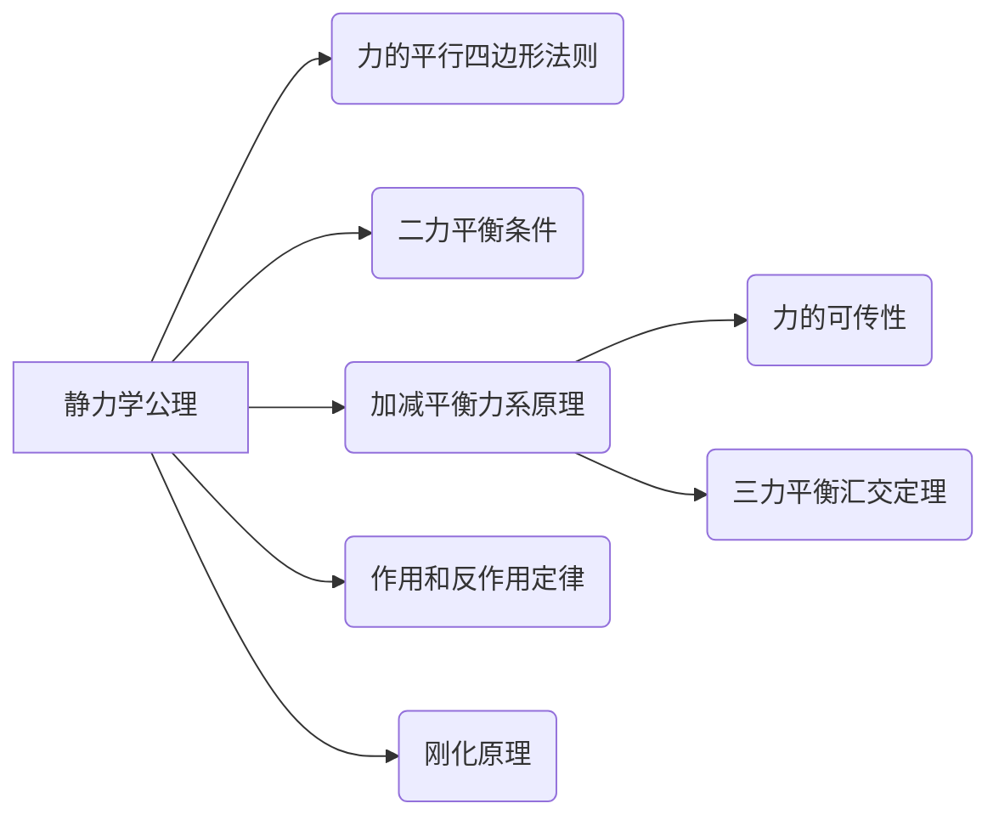

<center><b>
视频：系统自学参考视频</b></center>


- 阅读背景：对[[理论力学I]]学习后的简化笔记
- 阅读目的：
	- **知识目标：**
	    - 理解机器学习的核心概念，例如监督学习、非监督学习、强化学习等，并能够区分它们的应用场景。
	    - 掌握常用的机器学习算法，例如线性回归、逻辑回归、决策树、支持向量机、神经网络等，并了解它们的原理和优缺点。
	    - 熟悉Scikit-Learn、Keras和TensorFlow等机器学习库的基本用法，能够使用它们构建简单的机器学习模型。
	    - 了解模型评估和选择的方法，例如交叉验证、准确率、精确率、召回率、F1值等，并能够根据实际问题选择合适的评估指标。
	    - 掌握模型调参的基本技巧，例如网格搜索、随机搜索等，并能够优化模型的性能。
	- **技能目标：**
	    - 能够独立完成简单的机器学习项目，例如分类、回归、聚类等。
	    - 能够根据实际问题选择合适的机器学习算法和模型。
	    - 能够使用Scikit-Learn、Keras和TensorFlow等机器学习库进行模型训练和评估。
	    - 能够对模型进行调参，提高模型的性能。
	- **行动目标：**
	    - 阅读完每一章节后，完成相应的练习题和项目。
	    - 将学到的知识应用到实际项目中，例如构建一个图像分类器或一个房价预测模型。
	    - 积极参与机器学习社区的讨论，与其他学习者交流经验
- 阅读技巧：
	- **阅读前：**
		- **思考问题：**
		    - 这一小节的主题是什么？它与我设定的阅读目标有什么关系？
		    - 根据小节标题和目录，我能对这一小节的内容做出哪些假设？
		    - 在开始阅读之前，我已经掌握了哪些与本节内容相关的知识？
		    - 我希望通过阅读这一小节解决哪些疑问或学习哪些新技能？
		- **要做的工作：**
		    - 快速浏览本小节的标题、副标题、图表和代码示例，对内容有一个大致的了解。
		    - 明确本小节的学习目标，例如理解某个概念、掌握某个算法或学会使用某个函数。
		    - 记录下你对本小节内容的初步假设和疑问。
	- **阅读中：**
		- **思考问题：**
		    - 作者是如何解释这个概念或算法的？我是否理解了其中的原理？
		    - 代码示例是如何工作的？我是否能够理解每一行代码的含义？
		    - 作者提到了哪些我之前没有了解过的知识点？
		    - 这些知识点与我已有的知识体系有什么联系？
		    - 我是否能够将本小节的内容应用到实际项目中？
		- **要做的工作：**
		    - 仔细阅读本小节的内容，重点关注关键概念、算法原理和代码示例。
		    - 对重要的知识点进行标记、划线或做笔记。
		    - 尝试运行代码示例，并修改参数或输入，观察结果的变化。
		    - 查阅相关的资料，例如官方文档、博客文章或论坛帖子，以加深对知识点的理解。
		    - 记录下你的疑问和思考，以便在阅读后进行回顾和总结。
	- **阅读后：**
		- **思考问题：**
		    - 我是否达到了本小节的学习目标？
		    - 我是否解决了阅读前提出的疑问？
		    - 我是否掌握了本小节的关键概念和算法？
		    - 我是否能够用自己的话解释本小节的内容？
		    - 我是否能够将本小节的内容应用到实际项目中？
		    - 本小节的内容与其他章节有什么联系？
		    - 我还需要学习哪些相关的知识？
		- **要做的工作：**
		    - 回顾本小节的内容，整理笔记，并对知识点进行归纳和总结。
		    - 尝试回答阅读前提出的问题，并记录下你的答案。
		    - 完成本小节的练习题或项目，以检验你的学习效果。
		    - 将本小节的内容与其他章节的内容联系起来，构建完整的知识体系。
		    - 制定下一步的学习计划，例如阅读相关的书籍或文章，或尝试解决更复杂的实际问题。
			
		
	


- # 1. 本书回忆

- # 2. 本书重点

- # 3. 本书犯错

- # 4. 本书思考

- ## 4.1. 分析视角

学习本书后，看待物理现象都可以从静力学、运动学、动力学三个角度去看待和分析问题。相比之前，对了三个视角之间的切换与联系有了更深的理解。


## 引言

静力学是研究物体在力系作用下平衡规律的科学。

在静力学中所指的物体通常都是刚体, 所谓刚体是指在力的作用下, 其内部任意两点之间的距离始终保持不变的物体, 这是一个理想化的力学模型。在力的作用下, 称变形不能忽略不计的物体为变形体。

力,是物体间相互的机械作用,这种作用效果使物体的机械运动状态发生变化。

力对物体的作用效果由三个要素一力的大小、方向、作用点来确定, 习惯称之为力的三要素。故力应以矢量表示,本书中用黑斜体字母$F$表示力矢量, 而用普通字母$F$表示力的大小。在国际单位制中,力的单位是$\mathrm{N}$或$\mathrm{{kN}}$。

力系,是指作用于物体上的一群力。

如果一个力系作用于物体的效果与另一个力系作用于该物体的效果相同, 称这两个力系互为等效力系。

不受外力作用的物体可称其为受零力系作用。一个力系如果与零力系等效, 称该力系为平衡力系。

在静力学中, 主要研究以下三个问题:

 1. 物体的受力分析

分析某个物体共受几个力作用, 以及每个力的作用位置和方向。

2. 力系的等效替换 (或简化)

将作用在物体上的一个力系用与它等效的另一个力系来替换, 称为力系的等效替换。用一个简单力系等效替换一个复杂力系,称为力系的简化。某力系与一个力等效, 则称此力为该力系的合力, 而该力系的各力为此力的分力。

研究力系等效替换并不限于分析静力学问题,也是为动力学提供基础。

3. 建立各种力系的平衡条件

研究作用在物体上的各种力系所需满足的平衡条件。

物体的受力分析、力系的平衡条件在解决工程实际问题中有着非常重要的意义, 是设计各种结构与机构静力计算的基础, 静力学的概念和知识在工程中有着广泛的应用。


# 符号


```ad-note
title:**矢量及其矢量的模长表示**
### 矢量符号的常见表示方法

1.  **带箭头的粗体字母**：$\mathbf{\vec{A}}$

    *   这是最规范和清晰的表示方法。箭头表示矢量具有方向，粗体表示它是一个矢量而不是标量。
2.  **粗体字母**：$\mathbf{A}$

    *   在印刷材料中，通常使用粗体字母表示矢量。这是一种常见的简化表示，但有时可能与表示矩阵的符号混淆。
3.  **带箭头的斜体字母**：$\vec{A}$

    *   这种表示方法也很常见，尤其是在手写或使用不支持粗体的文本编辑器中。
4.  **斜体字母**：$A$

    *   在某些上下文中，斜体字母可能表示矢量，但这通常是不推荐的做法，因为它容易与表示标量混淆。
5.  **不带箭头的普通字母**：$A$

    *   这通常表示矢量的大小（模），即标量。

### 国际标准

国际标准（如 ISO 80000）推荐使用以下方法：

*   **矢量**：使用粗体字母，例如 $\mathbf{A}$。
*   **矢量的大小（模）**：使用相应的斜体字母，例如 $A$。

### 混乱的原因

1.  **手写习惯**：在手写时，很难区分粗体和非粗体字母，因此通常使用带箭头的符号。
2.  **软件限制**：某些软件或文本编辑器可能不支持粗体字母或矢量符号。
3.  **作者习惯**：不同的作者或领域可能有不同的习惯。
4.  **上下文**：有时，矢量和标量的含义可以从上下文中推断出来，但这并不总是可靠的。

### 如何避免混乱

1.  **明确定义**：在文档或书籍的开头，明确说明矢量和标量的符号表示方法。
2.  **一致性**：在整个文档中保持一致的符号表示。
3.  **使用规范符号**：尽可能使用国际标准推荐的符号，即粗体字母表示矢量，斜体字母表示标量。
4.  **避免歧义**：如果可能引起歧义，尽量使用更明确的符号，例如 $\mathbf{\vec{A}}$ 表示矢量，$\left| \mathbf{A} \right|$ 或 $A$ 表示矢量的大小。

### 总结

虽然存在多种表示矢量的方法，但为了避免混乱，建议遵循以下原则：

*   **矢量**：使用粗体字母 ($\mathbf{A}$) 或带箭头的粗体字母 ($\mathbf{\vec{A}}$)。
*   **矢量的大小（模）**：使用相应的斜体字母 ($A$) 或 $\left| \mathbf{A} \right|$。

在[[理论力学 哈教研 第八版 笔记]]中，为了保持清晰和一致性，建议在主要符号表中明确指出矢量和标量的表示方法。例如：


## 主要符号表

| 符号           | 含义         |
| ------------ | ---------- |
| $\mathbf{v}$ | 速度矢量       |
| $v$          | 速度的大小（标量）  |
| $\mathbf{a}$ | 加速度矢量      |
| $a$          | 加速度的大小（标量） |
| $\mathbf{F}$ | 力矢量        |
| $F$          | 力的大小（标量）   |


通过这种方式，可以帮助读者更好地理解和区分矢量和标量，减少歧义。
```


#### 1. 运动
| 符号    | 含义    |
| ----- | ----- |
|$v$| 速度    |
|$v_a$| 绝对速度  |
|$v_r$| 相对速度  |
|$v_e$| 牵连速度  |
|$v_c$| 质心速度  |
|$a$| 加速度   |
|$a_n$| 法向加速度 |
|$a_t$| 切向加速度 |
|$a_n$| 绝对加速度 |
|$a_r$| 相对加速度 |
|$a_e$| 牵连加速度 |
|$a_c$| 科氏加速度 |


### 2. 力学

| 符号                         | 含义                       |
| -------------------------- | ------------------------ |
|$A$                     | 面积，自由振动振幅                |
|$e$                     | 恢复因数                     |
|$f$                     | 动摩擦因数                    |
|$f_s$                   | 静摩擦因数                    |
|$F$                     | 力                        |
|$\mathbf{F}_R'$         | 主矢                       |
|$\mathbf{F}_s$          | 静摩擦力                     |
|$\mathbf{F}_N$          | 法向约束力                    |
|$\mathbf{F}_{\text{le}}$| 牵连惯性力                    |
|$\mathbf{F}_{\text{IC}}$| 科氏惯性力                    |
|$F_1$                   | 惯性力                      |
|$g$                     | 重力加速度                    |
|$h$                     | 高度                       |
|$i$                     |$x$轴的基矢量                |
|$I$                     | 冲量                       |
|$j_y$                   |$y$轴的基矢量                |
|$J_z$                   | 刚体对$z$轴的转动惯量           |
|$J_{xy}$                | 刚体对$x, y$轴的惯性积         |
|$J_c$                   | 刚体对质心的转动惯量               |
|$k$                     | 弹簧刚度系数                   |
|$k$                     |$z$轴的基矢量                |
|$l$                     | 长度                       |
|$L$                     | 拉格朗日函数                   |
|$\mathbf{L}_0$          | 刚体对点$O$的动量矩            |
|$\mathbf{L}_c$          | 刚体对质心的动量矩                |
|$m$                     | 质量                       |
|$M_z$                   | 对$z$轴的矩                |
|$M$                     | 力偶矩，主矩                   |
|$\mathbf{M}_o(\mathbf{F})$| 力$\mathbf{F}$对点$O$的矩 |
|$M_1$                   | 惯性力的主矩                   |
|$n$                     | 质点数目                     |
|$O$                     | 参考坐标系的原点                 |
|$p$                     | 动量                       |
|$P$                     | 重量，功率                    |
|$q$                     | 载荷集度，广义坐标                |
|$Q$                     | 广义力                      |
|$r$                     | 半径，矢径的模                  |
|$\mathbf{r}$            | 矢径                       |
|$\mathbf{r}_o$          | 点$O$的矢径                |
|$\mathbf{r}_c$          | 质心的矢径                    |
|$R$                     | 半径                       |
|$S$                     | 弧坐标，频率比                  |
|$t$                     | 时间                       |
|$T$                     | 动能                       |


### 3. 能量和势能
| 符号 | 含义 |
|------|------|
|$V$| 势能，体积 |
|$\Lambda$| 对数减缩 |
|$W$| 力的功 |
|$\rho$| 密度，曲率半径 |

### 4. 坐标和角度
| 符号          | 含义        |
| ----------- | --------- |
|$x, y, z$| 直角坐标      |
|$\varphi$| 角度坐标      |
|$\alpha$ | 角加速度      |
|$\varphi_f$| 摩擦角       |
|$\beta$  | 角度坐标      |
|$\psi$   | 角度坐标      |
|$\delta$ | 滚阻系数，阻尼系数 |
|$\omega_0$| 固有角频率     |
|$\delta$ | 变分符号      |
|$\omega$ | 角速度       |
|$\zeta$  | 阻尼比       |
|$\omega_a$| 绝对角速度     |
|$\eta$   | 减缩因数      |
|$\omega_r$| 相对角速度     |
|$\lambda$| 本征值       |
|$\omega_e$| 牵连角速度     |


# 静力学


## 第一章 静力学公理和物体的受力分析

- # 1.【中学回顾】
1. **牛顿第一定律（惯性定律）**：
    
    - **适用性**：适用于所有**惯性参照系**。惯性参照系是指没有加速度的参照系，或者加速度可以忽略不计的参照系。在非惯性参照系中，需要引入额外的力（如惯性力）来解释物体的运动。
2. **牛顿第二定律（加速度定律）**：
    
    - **适用性**：严格来说，牛顿第二定律**只适用于惯性参照系**。在非惯性参照系中，物体会表现出“**伪力**”或“**惯性力**”，这些力不是由物体间的相互作用产生的，而是由参照系的加速度引起的。因此，在非惯性参照系中，牛顿第二定律需要修改以包含这些额外的力。
3. **牛顿第三定律（作用与反作用定律）**：
    
    - **适用性**：牛顿第三定律适用于**所有参照系**，无论是惯性的还是非惯性的。这个定律说明，对于任何两个相互作用的物体，它们之间的力总是大小相等、方向相反。这一定律在任何参照系中观察都是成立的，因为它描述的是作用力和反作用力之间的关系，这种关系与参照系的选择无关。

- # 2.【本章梳理】


### §1-1 静力学公理

*   **公理 1：力的平行四边形法则**
    *   **核心观点**：作用于同一点的两个力可以合成为一个合力，合力矢等于这两个力矢的几何和。
    *   **关键信息**：${\mathbf{F}}_{\mathrm{R}} = {\mathbf{F}}_{1} + {\mathbf{F}}_{2}$
    *   **作用**：复杂力系简化的基础。
*   **公理 2：二力平衡条件**
    *   **核心观点**：作用于同一刚体的两个力平衡的充要条件是：大小相等、方向相反、作用在同一直线上。
    *   **关键信息**：等值、反向、共线
    *   **作用**：刚体上最简单力系平衡的条件。
*   **公理 3：加减平衡力系原理**
    *   **核心观点**：在任一原有力系上加上或减去任意的平衡力系，与原力系对刚体的作用效果等效。
    *   **作用**：力系等效替换的重要依据。
    *   **推理 1：力的可传性**
        *   **核心观点**：作用于刚体上某点的力，可以沿着它的作用线移到刚体内任意一点，并不改变该力对刚体的作用。
        *   **关键信息**：力的三要素：大小、方向、作用线。
        *   **相关概念**：滑动矢量
    *   **推理 2：三力平衡汇交定理**
        *   **核心观点**：刚体在三个力作用下平衡，若其中两个力的作用线交于一点，则第三个力的作用线必通过此汇交点，且三个力位于同一平面内。
*   **公理 4：作用和反作用定律**
    *   **核心观点**：作用力和反作用力总是同时存在，两力的大小相等、方向相反，沿着同一条直线，分别作用在两个相互作用的物体上。
    *   **易混淆点**：==与二力平衡的区别在于作用对象不同==。
*   **公理 5：刚化原理**
    *   **核心观点**：变形体在某一力系作用下处于平衡，如将此变形体刚化为刚体，其平衡状态保持不变。
    *   **关键信息**：==刚体的平衡条件是变形体平衡的必要条件，而非充分条件==。

**思维导图**：




```ad-abstract
title:**公理总结**
从单个物体的平衡出发导出二力平衡条件，而作用物体的$F_A$与$F_B$，每一个都可以各自分解为$F_{A1}$与$F_{A2}$、$F_{B1}$与$F_{B2}$，这体现了平行四边形法则。移掉这一对分解后的平衡力系，发现原来的平衡仍然没有被打破，这体现了加减平衡力系原理（**一句话联系定理2、定理1、定理3**）

而在实际现实世界中，力通常成对出现，但是确是作用在两个物体上，这样一来就有了作用和反作用力的说法，他们与二力平衡唯一的区别就在于，**两个力的作用点不同**。

继续，在现实世界中，不存在不会变形的东西，我们理论力学不考虑物体的变形，如果加上物体的变形还需要计算材料形变产生的内应力，这样不利于理论分析。而在平衡状态下的实际物体，其基本不在发生形变，我们可以把处于平衡状态的实际物体变成刚体去分析，**这就是刚化原理提出的依据**
```

```ad-note
title:**公理对比**
- 公理 1、2、3 及其推理主要关注**单个刚体**在力系作用下的**平衡和等效**问题，描述了力的合成、平衡和替换规律。
- 公理 4 关注的是**两个物体之间的相互作用**，描述了作用力和反作用力的关系。
- 公理 5 关注的是**物体模型的简化**，描述了将变形体简化为刚体的条件，有利于工程简化分析
```


#### 公理 1 力的平行四边形法则

>**内容**：作用在物体上同一点的两个力, 可以合成为一个合力, 合力的作用点也在该点, 合力的大小和方向, 由这两个力为边构成的平行四边形的对角线确定, 如图 1-1 所示。或者说, 合力矢等于这两个力矢的几何和, 即

$$
{\mathbf{F}}_{\mathrm{R}} = {\mathbf{F}}_{1} + {\mathbf{F}}_{2}
$$


<center>图 1-1</center>

==这条公理是复杂力系简化的基础。==

#### 公理 2 二力平衡条件

作用在同一刚体上的两个力,使刚体保持平衡的必要和充分条件是:这两个力的大小相等,方向相反,且作用在**同一直线**（==易错：非必须要求作用在同一个点上==）上。


>**总结**：这条公理表明了作用于刚体上最简单力系平衡时所必须满足的条件。


```ad-note
title:**对三项说明的理解**

```


#### 公理 3 加减平衡力系原理

```ad-note
title:**误区注意**

- 平衡力系是基于二力平衡推理出来的，所以平衡力系，是==不要求必须共点的==，这是一个容易记错的误区
```

>**内容**：在任一原有力系上加上或减去任意的平衡力系, 与原力系对刚体的作用效果等效，**这条公理是研究力系等效替换的重要依据**。

###### 推理 1 力的可传性

>**内容**：作用于刚体上某点的力,可以沿着它的作用线移到刚体内任意一点,并不改变该力对刚体的作用。


>**联系**：由此可见, 对于刚体来说, 力的作用点已由作用线所代替。因此, 作用于刚体上的力的三要素是：力的大小、方向和作用线。

滑动矢量：作用于刚体上的力可以沿着其作用线移动的矢量


```ad-hint
title:**推理证明**
- **证明目的**：证明下图中，图 c 与图 a 的效果是等效的


<center>图 1-2</center>


- **证明思路**：联系下前面所想的平衡力系原理，从图 c 变动到图 a 看起来 c 点原先的力消失的？但并不是真的消失了，他只是在引入一对新的力系之后被平衡了造成了消失的假象。从代数式上来看，我们要证明的东西很简单，就是$\vec{F} = \vec F_{2}$
- **正式证明**：
	1. **引入平衡力系构造等式**：根据加减平衡力系原理，我们引入一对作用点不供点，但是力的方向在$ab$直线上的$\vec F_1$和$\vec F$，他们有物理关系式$\vec F_1=-\vec F$成立
	2. **定引入平衡力系作用点**：因为加减平衡力系原理只是要求这对力共线，你可以随意调整作用点。那么我取$\vec F_1$的作用点落在$B$上，$\vec F_2$的作用点落在$A$上。
	3. **几何分析初步得其结论**：看图 b，先设定一个条件，我们取$\vert \vec F_1 \vert=\vert \vec F_2 \vert$（这是合理的，平衡力系原理只强调等大、反反向共线，没有要求大到什么程度）。从几何图像上看，$\vec F_1与\vec F_2$构成了一对等大反向的作用力，成为了一对平衡力系，根据平衡力系原理，这时候我们是可以把他们拿掉的，然后你就会惊喜的发现得到了图 a。
	4. **数学分析落证实其结论**：
		1.$\because \vec F=-\vec F_1$，$\vec F_2 =-\vec F_1$
		2.$\therefore \vec F_2 = \vec F_2 + 0=\vec F_2 + (\vec F_1+\vec F  )=(\vec F_2 + \vec F_1) +\vec F =\vec F$


- **证明核心**：
本次证明是平衡力系原理的一个巧妙应用，利用了其平衡力系可以不共点，可以自由调整平衡力系双方大小的特点去完成证明的，在一个就是利用了数学上的0代换方法取巧
```

###### 推理 2 三力平衡汇交定理

>**内容**：刚体在三个力作用下平衡,若其中两个力的作用线交于一点,则第三个力的作用线必通过此汇交点,且三个力位于同一平面内。

>**联系**：三力平衡汇交定理是建立在 推理1 力的可传性+力的平行四边形法则+二力平衡条件去推导出来的。

```ad-hint
title:**推理证明**


<center>图 1-3</center>


证明: 如图 1-3 所示,在刚体的$A,B,C$三点上,分别作用三个力${\mathbf{F}}_{1},{\mathbf{F}}_{2},{\mathbf{F}}_{3}$,且刚体平衡,其中${\mathbf{F}}_{1},{\mathbf{F}}_{2}$两力的作用线交于点$O$,根据力的可传性, 把力${\mathbf{F}}_{1},{\mathbf{F}}_{2}$移到汇交点$O$,再根据力的平行四边形公理,得合力${\mathbf{F}}_{12}$。由二力平衡公理可知，如果一个物体上作用了两个力，那么这两个力${\mathbf{F}}_{3},{\mathbf{F}}_{12}$必须平衡。则力${\mathbf{F}}_{3},{\mathbf{F}}_{12}$必共线,即力${\mathbf{F}}_{3}$必通过汇交点$O$, 且力${\mathbf{F}}_{3}$必位于力${\mathbf{F}}_{1},{\mathbf{F}}_{2}$所在的平面内,三力共面。 推理 2 得证。


```

>**思考**：你可以看到定理的证明就像是搭积木一样，一个一个搭出高级结论

#### 公理 4 作用和反作用定律

>**内容**：作用力和反作用力总是同时存在,两力的大小相等、方向相反,沿着同一条直线,分别作用在两个相互作用的物体上。

>**联系**：作用和反作用定律与二力平衡条件的描述有相同之处, 两力均是等值、反向、共线, 但区别是, 作用和反作用力作用在相互作用的两个物体上, 二力平衡公理中的二力作用于同一个刚体上。

#### 公理 5 刚化原理

变形体在某一力系作用下处于平衡,如将此变形体刚化为刚体,其平衡状态保持不变。

这个公理提供了把变形体看作为刚体模型的条件。如图 1-4 所示,绳索在等值、反向、共线的两个拉力作用下处于平衡,如将绳索刚化成刚体,其平衡状态保持不变。反之就不一定成立, 如刚体在两个等值反向的压力作用下平衡, 若将它换成绳索就不能平衡了。


由此可见, 刚体的平衡条件是变形体平衡的必要条件, 而非充分条件。在刚体静力学的基础上, 考虑变形体的特性, 可进一步研究变形体的平衡问题。

静力学全部理论都可以由上述五个公理推证而得到, 这既能保证理论体系的完整和严密性, 又可以培养读者的逻辑思维能力。

```ad-note
title:**思考：不处于平衡状态的变形体为何不能使用刚体平衡的理论？**


```

### $§1 - 2$约束和约束力*

- # 1. 本节回忆

- ## 1.1. 约束分类与特性

- ### 单方向约束
| 约束类型        | 定义与特点                             | 约束反力表示 | 方向特性                     | 图示                                                                                               |
| ----------- | --------------------------------- | ------ | ------------------------ | ------------------------------------------------------------------------------------------------ |
| **柔体约束**    | 由绳索、链条等柔软体构成，仅限制沿中心线伸长方向的运动。      | `Fₜ`   | 作用在接触点，沿中心线背离被约束物体（拉力）。  |                             |
| **光滑接触面约束** | 接触面无摩擦，限制沿公法线方向指向物体的运动。           | `Fₙ`   | 通过接触点，沿接触面公法线方向指向物体（压力）。 |                             |
| **链杆约束**    | 两端铰接的直杆，不计自重，仅限制沿轴线方向的运动。         | `F`    | 沿链杆中心线方向，指向待定。           |  |
| **可动铰支座**   | 底座带辊轴，限制垂直支承面方向的运动，允许沿支承面移动和绕轴转动。 | `Fₐ`   | 通过铰链中心，垂直于支承面方向。         |                 |

---

- ### 双方向约束
| 约束类型          | 定义与特点                                | 约束反力表示       | 方向特性                        | 图示                                                                                                                                                                                                                                                                                |
| ------------- | ------------------------------------ | ------------ | --------------------------- | --------------------------------------------------------------------------------------------------------------------------------------------------------------------------------------------------------------------------------------------------------------------------------- |
| **光滑圆柱形铰链约束** | 销钉连接两物体，限制垂直于销钉轴线平面内的任意方向移动，允许绕轴转动。  | `Fₐₓ`, `Fₐᵧ` | 作用在垂直于销钉轴线的平面内，通过销钉中心，方向待定。 |                                                                                                                                                                                                              |
| **固定铰支座**     | 结构物与支承物通过铰链固定，限制垂直于铰链轴线的任何移动，允许绕轴转动。 | `Fₐₓ`, `Fₐᵧ` | 通过铰链中心，在垂直于轴线的平面内，方向待定。     |                                                                                                                                                                                                  |
| **向心轴承**      | 类似固定铰支座，限制径向移动，允许轴向移动和旋转。            | `Fₐₓ`, `Fₐᵧ` | 通过轴心，在垂直于轴的平面内，方向待定。        |  |

>**注意**：此处介绍的双方向都是在同一个平面内的双方向

---

- ### 三方向约束
| 约束类型     | 定义与特点                      | 约束反力表示              | 方向特性                  | 图示                                                                    |
| -------- | -------------------------- | ------------------- | --------------------- | --------------------------------------------------------------------- |
| **止推轴承** | 封闭式向心轴承，限制径向和轴向移动。         | `Fₐₓ`, `Fₐᵧ`, `Fₐz` | 垂直轴向的平面内两个分力 + 沿轴向分力。 |      |
| **球铰链**  | 球体嵌入球窝，限制沿任何方向的移动，允许绕球心转动。 | `Fₐₓ`, `Fₐᵧ`, `Fₐz` | 通过球心，三个相互垂直的分力表示方向待定。 |  |

>**注意**：三方向约束就得考虑从空间力系的方向去解读了，且三方向非三自由度，这个得注意。

---

>**引言**：约束和约束力是从力对物体效果的方向去将其分类的，这是基于客观事物、事实抽象化的方法论而得到的概念。

**一、物体运动状态分类**

1.  **自由体**：
    *   定义：在空间中的位移不受任何限制的物体。
    *   示例：飞行的飞机、炮弹、火箭等。
2.  **非自由体**：
    *   定义：在空间中的位移受到一定限制的物体。
    *   示例：机车（受铁轨限制）、电机转子（受轴承限制）、重物（受钢索限制）等。

**二、约束与约束力**

1.  **约束**：
    *   定义：对非自由体的某些位移起限制作用的周围物体。
    *   示例：铁轨（对于机车）、轴承（对于电机转子）、钢索（对于重物）等。
2.  **约束力**：
    *   定义：约束对物体的作用力。
    *   方向：与约束所能阻碍的位移方向相反。
    *   大小：未知，需通过平衡条件求解。
    *   性质：被动的，随主动力改变而改变。

**三、约束力求解**

1.  **求解方法**：
    *   在静力学问题中，约束力与物体受到的其他已知力（主动力）组成平衡力系。
    *   利用平衡条件（如力的平衡和力矩的平衡）求解未知的约束力。
2.  **约束力与主动力**：
    *   主动力：物体受到的已知力，使物体运动或有运动趋势。
    *   约束力：物体受到的限制力，是被动的，随主动力改变而改变。

**总结**

*   物体根据位移是否受限分为自由体和非自由体。
*   约束是对非自由体位移起限制作用的周围物体。
*   约束力是约束对物体的作用力，方向与被阻碍的位移方向相反，大小未知，需通过平衡条件求解。
*   约束力与主动力共同作用，使物体处于平衡状态。
*   约束力是被动的，其大小和方向随主动力的变化而变化。

#### 1. 光滑表面约束

例如,支持物体的固定面 (图 1-5a,b) 、 啮合齿轮的齿面 (图 1-6) 、机床中的导轨等,当摩擦忽略不计时,都属于这类约束。

这类约束不能限制物体沿约束表面切线的位移, 只能阻碍物体沿接触表面法线并向约束内部的位移。因此, 光滑支承面对物体的约束力, 作用在接触点处, 方向沿接触表面的公法线, 并指向被约束的物体。这种约束力称为法向约束力,通常用${\mathbf{F}}_{\mathrm{N}}$表示,如图 1-5 中的${\mathbf{F}}_{\mathrm{N}A},{\mathbf{F}}_{\mathrm{N}C}$和图 1-6 中的${\mathbf{F}}_{\mathrm{N}B}$等。


<center>图 1-5</center>


<center>图 1-6</center>

#### 2. 理想柔索约束

细绳吊住重物,如图 1-7a 所示。由于柔软的绳索本身**只能承受拉力**, 所以它给物体的约束力也只可能是拉力 (图 1-7b)。因此,绳索对物体的约束力,作用在接触点,方向沿着绳索背离物体。通常用$\mathbf{F}$或${\mathbf{F}}_{\mathrm{T}}$表示这类约束力。

链条或胶带也都**只能承受拉力**。当它们绕在轮子上, 对轮子的约束力沿轮缘的切线方向 (图 1-8)。


<center><b>图 1-7</b></center>


<center>图 1-8</center>

#### 3. 光滑铰链约束

这类约束有向心轴承、圆柱形铰链和固定铰链支座等。

##### （1）向心轴承 (径向轴承)

图 1-9a,b 所示为轴承装置,可画成如图 1-9c 所示的简图。轴可在孔内任意转动,也可沿孔的中心线移动；但是,轴承阻碍着轴沿径向向外的位移。当轴和轴承在某点$A$光滑接触时,轴承对轴的约束力${\mathbf{F}}_{A}$作用在接触点$A$,且沿公法线指向轴心 (图 1-9a)。


<center>图 1-9</center>

但是, 随着轴所受的主动力不同, 轴和孔的接触点的位置也随之不同。所以, 当主动力尚未确定时, 约束力的方向预先不能确定。然而, 无论约束力朝向何方,它的作用线必垂直于轴线并通过轴心。这样一个方向不能预先确定的约束力,通常可用通过轴心的两个大小未知的正交分力${\mathbf{F}}_{Ax},{\mathbf{F}}_{Ay}$来表示,如图 1-9b 或$\mathrm{c}$所示,${\mathbf{F}}_{Ax},{\mathbf{F}}_{Ay}$的指向暂可任意假定。

在平面问题中,此类约束一般用图 1-9d 所示的符号表示。

##### （2）圆柱铰链/固定铰链支座

图 1-10a 所示为一拱形桥示意图,它是由两个拱形构件通过圆柱铰链$C$以及固定铰链支座$A$和$B$连接而成。圆柱铰链是由销钉$C$将两个钻有同样大小孔的构件连接在一起而成的 (图 1-10b),其简图如图 1-10a 的铰链$C$所示。如果铰链连接中有一个固定在地面或机架上作为支座, 则称这种约束为固定铰链支座,简称固定铰支,如图 1-10b 中所示的支座$B$,其简图如图 1-10a 所示的固定铰链支座$A$和$B$。

在分析铰链$C$处的约束力时,通常把销钉$C$固连在其中任意一个构件上, 如构件 II 上, 则构件 I, II 互为约束。显然, 当忽略摩擦时, 构件 II 上的销钉与构件 1 的结合,实际上是轴与光滑孔的配合问题。因此,它与轴承具有同样的约束性质, 即约束力的作用线不能预先定出, 但约束力垂直轴线并通过铰链中心, 故也可用两个未知的正交分力${\mathbf{F}}_{Cx},{\mathbf{F}}_{Cy}$和${\mathbf{F}}_{Cx}^{\prime },{\mathbf{F}}_{Cy}^{\prime }$来表示,如图 1-10c 所示。其中


<center>图 1-10</center>


${\mathbf{F}}_{Cx}$和${\mathbf{F}}_{Cx}^{\prime },{\mathbf{F}}_{Cy}$和${\mathbf{F}}_{Cy}^{\prime }$,互为作用力与反作用力。

同理,把销钉固连在$A,B$支座上,则固定铰支$A,B$对构件$\mathrm{I},\mathrm{{II}}$的约束力分别为${\mathbf{F}}_{Ax},{\mathbf{F}}_{Ay}$与${\mathbf{F}}_{Bx},{\mathbf{F}}_{By}$,如图 1-10c 所示。

当需要分析销钉$C$的受力时,才把销钉分离出来单独研究。这时,销钉$C$将同时受到构件$\mathrm{I},\mathrm{{II}}$上的孔对它的反作用力。其中${\mathbf{F}}_{C1x}$与${\mathbf{F}}_{C1x}^{\prime },{\mathbf{F}}_{C1y}$与${\mathbf{F}}_{C1y}^{\prime }$,为构件 I 与销钉$C$的作用与反作用力;${\mathbf{F}}_{C2x}$与${\mathbf{F}}^{\prime }{}_{C2x},{\mathbf{F}}_{C2y}$与${\mathbf{F}}_{C2y}^{\prime }$,为构件 II 与销钉$C$的作用与反作用力。销钉$C$所受到的约束力如图 1-10d 所示。

当将销钉$C$与构件 II 固连为一体时,${\mathbf{F}}_{C2x}$与${\mathbf{F}}_{C2x}^{\prime },{\mathbf{F}}_{C2y}$与${\mathbf{F}}_{C2y}^{\prime }$为作用在同一刚体上的成对的平衡力,可以消去不画。此时,力的下角不必再区分为${C1}$和${C2}$,铰链$C$处的约束力仍如图 1-10c 所示。

请读者思考,若将销钉$C$与构件$\mathrm{I}$固连为一体时,铰链$C$处的约束力将如何表达?

上述三种约束 (向心轴承、铰链和固定铰链支座), 它们的具体结构虽然不同,但是构成约束的性质是相同的,一般通称为铰链约束,通常用图 1-9d 所示的符号表示。此类约束的特点是只限制两物体径向的相对移动, 而不限制两物体绕铰链中心的相对转动与沿轴向的位移。此类约束的约束力一般用两个正交分力来表示,如图 1-9d 所示。

#### 4. 其他约束分类
##### （1）平面约束类

- # 1. 滚动铰支座

在桥梁、屋架等结构中经常采用滚动支座约束。这种支座是在固定铰链支座与光滑支承面之间,装有几个辊轴而构成,又称为辊轴支座,如图 1-11a 所示,其简图如图 1-11b 所示。它可以沿支承面移动,允许由于温度变化而引起结构跨度的自由伸长或缩短。显然, 滚动支座的约束性质与光滑面约束相同, 其约束力必垂直于支承面,且通过铰链中心。通常用${\mathbf{F}}_{\mathrm{N}}$表示其法向约束力,如图 1-11c 所示。


<center>图 1-11</center> 

 - # 2. 固定铰支座


- # 3. 固定端支座

固定端约束在同一个点限制三个自由度的，其画法如图5a，以及约束反力如下图所示。


写出数学符号描述为：即在该点处不能产生x、y方向的位移，不能产生转动，dv/dx表示固定端处梁的转角为0，即不能发生转动。


##### （2）空间约束类

- # 1. 球铰链

通过圆球和球壳将两个构件连接在一起的约束称为球铰链, 如图 1-12a所示。它使构件的球心不能有任何位移, 但构件可绕球心任意转动。若忽略摩擦, 其约束力应是通过接触点与球心, 但方向不能预先确定的一个空间法向约束力,一般用三个正交分力${\mathbf{F}}_{x},{\mathbf{F}}_{y},{\mathbf{F}}_{z}$表示,其简图及约束力如图 1-12b 所示。


<center><b>图 1-12</b></center>

- # 2. 止推轴承

**特点**：止推轴承（thrust bearing）与径向轴承不同, 它除了能限制轴的径向位移以外, 还能限制轴沿轴向的位移。因此, 它比径向轴承多一个沿轴向的约束力, 即其约束力有三个正交分量${\mathbf{F}}_{Ax},{\mathbf{F}}_{Ay},{\mathbf{F}}_{Az}$。止推轴承的简图及其约束力如图 1-13 所示。


<center>图 1-13</center>

止推轴承在平面上通常会减少两个自由度。它会约束一个点的平动（沿两个轴方向的移动），但允许该点绕垂直于平面的轴旋转。


### §1-3 物体的受力分析和受力图

---

- # 1. 受力分析的目的与方法
   - **目标**：在工程实际中，为求解未知约束力，需根据已知力应用平衡条件。
   - **核心步骤**：
     1. 确定构件受到的**力数量**；
     2. 明确每个力的**作用位置**和**作用方向**；
     3. 该分析过程称为**物体的受力分析**。

---

- #  2. 力的分类
   - **主动力**：
     - 定义：直接作用于物体并使其运动或有运动趋势的力。
     - 例子：重力、风力、气体压力等。
     - 特点：通常为已知力。
   - **约束力（被动力）**：
     - 定义：周围物体对研究对象的限制作用力。
     - 例子：支撑力、摩擦力等。
     - 特点：方向和大小通常未知，需通过平衡条件求解。

---

- # 3. 受力图的绘制方法
   - **步骤**：
     1. **隔离体法**：
        - 将需要研究的物体（**受力体**）从周围物体（**施力体**）中分离出来。
        - 单独画出其受力简图，此步骤称为**取分离体**或**取研究对象**。
     2. **受力图绘制**：
        - 在分离体上画出所有外力，包括：
          - **主动力**（已知方向和大小）；
          - **约束力**（未知方向或大小）。
        - 这种简明图形称为**受力图**。
   - **作用**：受力图是解决静力学问题的关键步骤，为后续平衡方程的建立提供依据。

---
- # 总结
- 受力分析的核心是明确力的类型、作用位置及方向。
- 通过隔离体法绘制受力图，可系统化整理力系，为静力学计算奠定基础。


### §1-4 力学模型与力学简图
### 思考题
### 习题

```ad-note
title:**习题分类**
```

```ad-note
title:**做题步骤**

```


## 第二章 平面力系

>**引言**：前面第一章我们学习的主要就是力怎么在刚体中传播以及一些等效处理的手段还有基于常见力产生的不同种约束类型的一个特征，但是你发现没有，我们没有讨论力对这些东西造成什么效果的影响。其实任何一个力作用在一个物体上会产生三种效果：平动、旋动、变形，但是由于理论力学只把研究对象看成刚体，所以变形这一个不考虑。接下来我们分别考虑如何分析力作用在物体上产生的平动效果和力作用在物体上产生的旋动效果。

### §2-1 平面汇交力系
### §2-2 平面力偶系(特殊平行力系)*

* 力对刚体的作用效应使刚体的运动状态发生改变，包括移动与转动。
* 力对刚体的移动效应可用力矢量度量，而力对刚体的转动效应可用力对点的矩（简称力矩）来度量，即力矩是度量力对刚体转动效应的物理量。

#### **2.2.1. 力对点之矩**

* **1. 力对点之矩 (力矩)**
    * 如图 2-6 所示，力$\text{F}$与点$\text{O}$位于同一平面内，称点$\text{O}$为矩心，点$\text{O}$到力$\text{F}$作用线的垂直距离$\text{h}$为力臂，在此平面中，力$\text{F}$使物体绕点$\text{O}$转动的效果，取决于两个要素：
        * (1) 力的大小$\text{F}$与力臂$\text{h}$(矩心到力作用线的距离)的乘积；
        * (2) 力使物体绕矩心转动的方向
    * 在平面问题中力对点的矩的定义如下：
        * 力对点之矩是一个代数偶，其绝对值等于力的大小与力臂的乘积，其转向用正负号确定，按下法规定：力使物体绕矩心逆时针方向转动时为正，反之为负。
    * 力$\text{F}$对点$\text{O}$的矩以$\text{M}_O(\text{F})$表示，即$\text{M}_O(\text{F}) = \pm \text{Fh}$(2-9)

* 显然，当力的作用线通过矩心，即力臂等于零时，它对矩心的力矩等于零。
* 力矩的常用单位为$\text{N} \cdot \text{m}$或$\text{kN} \cdot \text{m}$。
* 为和后面空间力对点的矩相对应，以$\text{r}$表示由点$\text{O}$到$\text{A}$的矢径（图 2-6），平面力$\text{F}$对点$\text{O}$的矩，由矢量矩定义，可以表示为$\text{r} \times \text{F}$，此矢积的模就是力矩的大小$\text{Fh}$，此矢积的方向，即力矩的转向符合矢量叉乘的右手则。

#### **2.2.2. 平面汇交力系的合力与合力矩**

* **2. 合力矩定理与力矩的解析表达式**
    * **合力矩定理**：平面汇交力系的合力对平面内任一点之矩等于所有分力对于该点之矩的代数和，以公式表示，为$\text{M}_O(\text{F}_R) = \Sigma \text{M}_O(\text{F}_i)$(2-10)
    * 式中，$\text{F}_R$为平面汇交力系的合力，$\text{F}_i$为各分力。按力系等效概念，上式必然成立，且式 (2-10) 适用于任何有合力的力系。
    * 由合力矩定理，在直角坐标系中，如图 2-7 所示，已知力$\text{F}$，作用点的坐标$\text{A}(x, y)$与夹角$\alpha$。力$\text{F}$对坐标原点$\text{O}$之矩，可按式 (2-10)，通过其分力$\text{F}_x$与$\text{F}_y$对点$\text{O}$之矩而得到，即$\text{M}_O(\text{F}) = \text{M}_O(\text{F}_x) + \text{M}_O(\text{F}_y) = -\text{F} \sin \alpha \cdot x - \text{F} \cos \alpha \cdot y$或$\text{M}_O(\text{F}) = x\text{F}_y - y\text{F}_x$(2-11)
    * 称此式为平面内力对点之矩的解析表达式。式中，$x, y$为力$\text{F}$作用点的坐标，$\text{F}_x, \text{F}_y$为力$\text{F}$在$x, y$轴的投影。计算时用它们的代数偶。
    * 将式 (2-11) 代入式 (2-10)，可得合力$\text{F}_R$对坐标原点之矩的解析表达式，即$\text{M}_O(\text{F}_R) = \Sigma \text{M}_O(\text{F}_i) = \Sigma (x_i\text{F}_{yi} - y_i\text{F}_{xi})$(2-12)
    * 例 2-3 如图 2-8a 所示圆柱直齿轮，受到另一齿轮对其啮合力$\text{F}$的作用，大小为$\text{F} = 1 400 \text{ N}$，方向角$\alpha = 20^\circ$，齿轮的节圆（啮合圆）的半径$r = 60 \text{ mm}$。求力$\text{F}$对于轴心$\text{O}$的力矩。解：计算力$\text{F}$对点$\text{O}$的矩，可直接按力矩的定义求得（图 2-8a），即$\text{M}_O(\text{F}) = -\text{F} \cdot \text{h} = -\text{F} \cdot \text{r} \cos \alpha = -1400 \times 0.06 \times \cos 20^\circ = -78.93 \text{ N} \cdot \text{m}$。
    * 也可以根据合力矩定理，将力$\text{F}$分解为圆周力$\text{F}_t$和径向力$\text{F}_r$(图 2-8b)，由于径向力$\text{F}_r$通过矩心$\text{O}$，则$\text{M}_O(\text{F}_r) = 0$。圆周力$\text{F}_t$对点$\text{O}$的力矩为$\text{M}_O(\text{F}_t) = -\text{F}_t \cdot \text{r} = -\text{F} \sin \alpha \cdot \text{r} = -1400 \times \sin 20^\circ \times 0.06 = -28.73 \text{ N} \cdot \text{m}$。根据合力矩定理，力$\text{F}$对点$\text{O}$的矩为$\text{M}_O(\text{F}) = \text{M}_O(\text{F}_r) + \text{M}_O(\text{F}_t) = 0 + (-28.73) = -28.73 \text{ N} \cdot \text{m}$。
    * 两种方法的计算结果相同。

* 在理论力学教材和实际问题中，有时要遇到图 2-9 所示的三角形分布载荷。
* 一般已知其分布长度$\text{l}$，单位一般为$\text{m}$，单位长度载荷的最大值为$\text{q}$，单位一般为$\text{N}/\text{m}$或$\text{kN}/\text{m}$。
* 实际计算时，为方便计算，往往要用其合力来代替此分布力。
* 为求出其合力大小和作用线位置，可以用积分的方法求出其合力大小和合力矩定理求出其合力作用线位置。现推出如下。
* 设矩心$\text{O}$端为$x$的微段处的载荷为$\text{q}(x)$，由相似三角形的关系，有$\frac{q(x)}{x} = \frac{q}{l}$，则$\text{q}(x) = \frac{q}{l}x$。
* 微段$\text{dx}$上的合力为$\text{q}(x) \cdot \text{dx}$。因此，三角形分布载荷的合力大小$\text{F}$为$\text{F} = \int_0^l q(x) dx = \int_0^l \frac{q}{l}x dx = \frac{1}{2}ql$。
* 设合力作用线距$\text{O}$端的距离为$\text{h}$，微段$\text{dx}$上的微小力对点$\text{O}$的力矩为$\text{q}(x) \cdot \text{dx} \cdot x$。由合力矩定理，有$\text{F} \cdot \text{h} = \int_0^l q(x) \cdot x dx = \int_0^l \frac{q}{l}x^2 dx = \frac{1}{3} q l^2$。
* 解得$\text{h} = \frac{2}{3}l$。
* 所以，三角形分布载荷的合力大小为$\frac{1}{2}ql$，合力作用线距点$\text{O}$的距离为$\frac{2}{3}l$，即合力的方向和分布力的方向相同。以后在实际计算时，此结论可作为公式使用。
* 在理论力学教材和实际问题中，还会遇到图 2-10 所示的均布载荷作用，显然其合力大小为$\text{ql}$，合力作用线位置在均布载荷的正中间，方向和各分力方向相同。此结论也可以直接使用。

#### **2.2.3.力偶及其性质**

>**总结**：力偶是一种特殊的力矩，所以针对于力矩的分析方法和策略几乎都可以用在力偶上，唯一的区别就是力偶不会因为矩心位置的改变而改变，但力矩会。

#####  **（1）力偶与力矩**
* 在日常生活与工程实际中，常常见到汽车司机用双手转动方向盘（图 2-11a），电动机的定子磁场对转子作用电磁力使之旋转（图 2-11b），钳工用丝锥攻螺纹等。
* 在方向盘、电机转子、丝锥等物体上，都作用了成对的等值、反向且不共线的平行力。
* 等值、反向平行的力矢和等于零。但是由于它们不共线而不能相互平衡，它们能使物体改变转动状态。
* 这种由两个大小相等、方向相反且不共线的平行力组成的力系，称为力偶，如图 2-12 所示，记作$(\text{F}, \text{F}')$。
* 称力偶的两个力之间的垂直距离$\text{d}$为力偶臂。
* 力偶所在的平面称为力偶作用平面。
* 由于力偶中的两个力等值、反向、平行且不共线，所以力偶不能合成为一个力，或用一个力等效替换。
* 因此，力偶也不能用一个力来平衡。
* 力和力偶是静力学的两个基本要素。
* 力偶是由两个力组成的特殊力系，它的作用只改变物体的转动状态。
* 与平面力对点的矩类似，在力偶作用面内，力偶使物体转动的效果，也取决于两个要素：
	* (1) 力偶中力的大小$\text{F}$与力偶臂$\text{d}$的乘积；
	* (2) 力偶在作用面内转动的方向。
* 为此，在平面中，有力偶矩的定义：在力偶作用面内，力偶矩是一个代数偶，其绝对值等于力偶中力的大小与力偶臂的乘积，其转向用正负号确定，按下法规定，力偶使物体绕矩心逆时针方向转动时为正，反之为负。以公式表示，为$\text{M} = \pm \text{Fd}$(2-13)。
* 力偶矩的单位和力矩的单位相同。
* 力偶矩也可用三角形$\text{ABC}$的面积$\text{A}_{\text{ABC}}$表示，如图 2-12 所示。

##### **（2）力偶的性质**
	
* (1) ==力偶对任意点取矩都等于力偶矩，不因矩心的改变而改变==。
	* 如图 2-13 所示，该力偶的力偶矩为$\text{Fd}$，在力偶所在平面内任取一点$\text{O}_1$，把力偶中两力对此点取矩，有$\text{M}_{\text{O}_1}(\text{F}) + \text{M}_{\text{O}_1}(\text{F}') = \text{F} \cdot (\text{d} + x_1) - \text{F}' \cdot x_1 = \text{Fd}$。
	* 对点$\text{O}_2$取矩，有$\text{M}_{\text{O}_2}(\text{F}) + \text{M}_{\text{O}_2}(\text{F}') = -\text{F} \cdot x_2 + \text{F}' \cdot (x_2 + \text{d}) = \text{Fd}$。
	* 可见力偶对任意点取矩都等于力偶矩，不因矩心的改变而改变。这就证明了力偶的这一性质。
* (2) ==只要保持力偶矩不变，力偶可在其作用面内任意移==，且可以同时改变力偶中力的大小与力偶臂的长短，对物体的作用效果不变（得保力偶矩不变的前提下，去调整力的大小与力偶臂的长短）。
	* 如图 2-14a 所示，物体上有一力偶$(\text{F}, \text{F}')$作用，其力偶矩为$\text{Fd}$。
	* 现加减平衡力系合理，在$\text{A}, \text{B}$两点各加一平衡力系$\text{F}_2, = -\text{F}_2'$，如图 2-14b 所示，再据平行四边形公理，把$\text{A}, \text{B}$两点的合力合成得力$\text{F}_1, \text{F}_1'$，显然此两力构成一力偶$(\text{F}_1, \text{F}_1')$，其力偶矩为$\text{F}_1\text{d}_1$。
	* 再据力偶的特性，把力偶$(\text{F}', \text{F}_2)$传递如图 2-14c 所示。
	* 很明显，力偶$(\text{F}, \text{F}')$和$(\text{F}_1, \text{F}_1')$中力的大小、力偶臂的长短、力的作用点、力的方向均已改变，但两力偶等效。
	* 而力偶$(\text{F}, \text{F}')$的力偶矩为$\text{Fd} = 2\text{A}_{\text{ABC}}$。
	* 力偶$(\text{F}_1, \text{F}_1')$的力偶矩为$\text{F}_1\text{d}_1 = 2\text{A}_{\text{ABD}}$。
	* 显然，直角三角形$\text{ABC}$与斜三角形$\text{ABD}$的面积相等，所以两力偶的力偶矩相等，此性质也得证。
	* 由于力偶具有这样的性质，同时也为画方便计，以后常用图 2-15 所示符号表示力偶与力偶矩。
	* 图 2-16 所示为驾驶员给方向盘的三种施力方式。图中$\text{F}_1 = \text{F}_1'$,$\text{F}_2 = \text{F}_2'$,$\text{F}_3 = \text{F}_3'$，即是说明此性质的一个实例。

>**思考**：力矩和力偶矩都是对物体转动效果的度量，但显然有所不同。力偶对任意点取矩都等于力偶矩，不因矩心的改变而改变；而力矩就不同，一般矩心若改变，其力矩就改变；这是力矩与力偶的一个重要区别。

#### **2.2.4. 平面力偶系的合成与平衡**

* **5. 平面力偶系的合成和平衡条件**
    * 设在同一平面内有$\text{n}$个力偶作用，形成一平面力偶系，如图 2-17a 所示，其力偶矩分别为$\text{M}_1, \text{M}_2, \dots, \text{M}_n$，其中，$\text{M}_2$为顺时针方向（为负）。
    * 在此平面内任选一段距离$\text{AB} = \text{d}$，令$\text{M}_1 = \text{F}_1 \text{d}$,$\text{M}_2 = \text{F}_2 \text{d}$,$\dots, \text{M}_i = \text{F}_i \text{d}, \dots, \text{M}_n = \text{F}_n \text{d}$。
    * 则图 2-17a 所示平面力偶系与图 2-17b 所示力系等效，把作用在点$\text{B}$的共线力系的合力以$\text{F}_R''$表示，图 2-17c，有$\text{F}_R'' = \text{F}_1 - \text{F}_2 + \dots + \text{F}_i + \dots + \text{F}_n$。
    * 把作用在点$\text{A}$的共线力系的合力以$\text{F}_R'$表示，显然有$\text{F}_R' = -\text{F}_R''$，即此两力形成一力偶，以$\text{M}$表示，图 2-17d，$\text{M} = \text{F}_R'' \text{d}$。
    * 把上式两边同乘以$\text{d}$，有$\text{F}_R'' \text{d} = \text{F}_1 \text{d} - \text{F}_2 \text{d} + \dots + \text{F}_i \text{d} + \dots + \text{F}_n \text{d}$。
    * 即$\text{M} = \text{M}_1 + \text{M}_2 + \dots + \text{M}_i + \dots + \text{M}_n$(2-14)。
    * 即在同一平面内的任意个力偶，可用一个力偶$\text{M}$与之等效，称之为合力偶。
    * 因此，在同一平面内的任意个力偶可合成为一个合力偶，合力偶矩等于各个力偶矩的代数和。
    * 由合成结果知，平面力偶系平衡时，其合力偶矩应等于零。
    * 因此，**平面力偶系平衡的必要和充分条件是：所有力偶矩的代数和等于零**。以公式表示，为$\Sigma \text{M} = 0$(2-15)。
    * 此即为平面力偶系的平衡条件。

### §2-3 平面任意力系的简化*
- # 1. 本节回忆

- 模型求解逻辑
	1. 取研究对象
	2. 选取分析点
	3. 平面力系简化-->汇交力系+平行力系
		注：如有分布载荷则把分布载荷点化后处理
	4. 列力系平衡方程

- # 2. 本节重点

- # 3. 本节犯错


S：
Q：求杆 C 受力、以及固定铰链 A 的受力


图中有一水平杆件，杆件左端$A$点下方连接一竖向直线到固定物体表面，$B$点作用有一竖向，向下力$P$，$C$、$D$位置通过球铰连接另一竖杆。以下是详细步骤：

【方法一：以A点为矩心分析】
1. **确定研究对象**：选取水平杆$AB$作为研究对象。
2. **受力分析**
	1. **主动力**：已知在$B$点 作用有主动力$\vec{P}$，其大小$|\vec{F}_P| = 25kN$，方向竖直向下。
    2. **约束力**：
	    -$A$端为固定铰支座，其约束反力可用水平分力$\vec{F}_{Ax}$和竖直分力$\vec{F}_{Ay}$表示（方向可先假设）
	    -$C$点受到来自竖杆$CD$的约束反力$\vec{F}_C$（由于$CD$杆若不计自重，为二力杆，因此$\vec{F}_C$沿$CD$杆方向，由$C$指向$D$或相反，需根据平衡方程确定，此处先假设方向 ）。
3. **建立平衡方程**
    1. **取矩平衡方程**：根据平面任意力系的平衡条件$\sum M = 0$（取$A$点为矩心 ）：
		设$CD$杆长度为$l$（图中未 标注具体长度数值，若$CD$竖直，则$\vec{F}_C$力臂为$2a$），$\vec{P}$对$A$点的力臂为$3a$。
		$\sum M_A(\vec{F}) = 0$，即$F_C\times2a - P\times3a = 0$（假设$\vec{F}_C$竖直向上 ），可先求出$F_C=\frac{3}{2}P$。
    2. **$x$方向投影平衡方程**：$\sum F_x = 0$，由于作用在水平杆$AB$上的力在$x$方向只有$\vec{F}_{Ax}$（假设$CD$竖直，$\vec{F}_C$和$\vec{P}$在$x$方向无分力 ），所以$F_{Ax} = 0$。
    3. **$y$方向投影平衡方程**：$\sum F_y = 0，假设向上为正方向，$$F_{Ay}+F_C - P=0$，将$F_C=\frac{3}{2}P$代入，可得$F_{Ay}=P - F_C= P-\frac{3}{2}P = -\frac{1}{2}P$，负号表示$\vec{F}_{Ay}$的实际方向与假设方向相反。

通过上述平衡方程，即可求出$A$端的约束反力$\vec{F}_{Ax}$和$\vec{F}_{Ay}$。若$CD$杆非竖直，需根据实际几何关系确定力臂和力的投影关系，再代入平衡方程求解 。 


【方法二：以 C 点为矩心分析】


**1. 确定杆件几何关系**：假设杆件$AB$为水平方向，且满足：
- $AC = 2a$（C点距离A点2a，方向水平），
- $CB = a$（B点距离C点a，方向水平），
- CD杆竖直（此时约束力$\vec{F}_C$沿竖直方向，由C指向D或相反）。


 **2. 受力分析**：对杆件$AB$进行受力分析：
- **主动力**：B点作用竖直向下力$P = 25 \, \text{kN}$。
- **约束力**：
  - A点为固定铰支座，约束反力为水平分量$F_{Ax}$和竖直分量$F_{Ay}$（方向可先假设）；
  - C点受竖杆$CD$的约束反力$F_C$（若CD杆为二力杆，则$F_C$沿CD方向，即竖直方向向上或向下）。

**3. 以C点为矩心建立力矩平衡方程**
 **力矩平衡方程（$ΣM_C = 0$）**
以C点为矩心时，所有力对C点的力臂需重新计算：
- **A点约束反力$F_{Ax}$**：若为竖直方向，到C点的力臂为0（因为力的作用线过C点）；
- **A点约束反力$F_{Ay}$**：若为水平方向，对C点的力臂为$AC = 2a$（需根据方向判断正负）；
- **主动力$P$**：到C点的力臂为$CB = a$（方向竖直向下）；
- **C点约束反力$F_C$**：因其作用在C点，力臂为0，不直接出现在力矩方程中。

**方程推导**：
- 若以C为矩心，假设$F_{Ay}$向右为正（方向可任选），则力矩方程为：
$$
  \sum M_C = F_{Ay} \cdot 2a + P \cdot a = 0
$$


---

 **4. 建立其他分量力平衡方程**
 **水平方向投影方程（$ΣF_x = 0$）**
$$
F_{Ax} = 0 \quad (\text{因为其他力在水平方向无分力})
$$
（此结论与以A为矩心的结果一致）

 **竖直方向投影方程（$ΣF_y = 0$）**
$$
F_{Ay} + F_C - P = 0
$$

---

 **5. 解题步骤**
1. **解力矩平衡方程**：  
$$
   \sum M_C = F_{Ay} \cdot 2a + P \cdot a = 0
$$
   代入已知条件和$F_{Ay} = - \frac{P}{2}$，可得：  
$$
   0 \cdot 2a - P \cdot a = 0 \quad \Rightarrow \quad P \cdot a = 0
$$
   **矛盾！** 若$P \ne 0$且$a \ne 0$，方程无法成立。


---

**6. 如何正确使用C点作为矩心？**
若CD杆不竖直（例如倾斜角为$\theta$），则：
- **约束力$F_C$** 沿CD杆方向分解为：  
$$
  F_C \cos\theta \ (\text{水平方向}), \quad F_C \sin\theta \ (\text{竖直方向})
$$
- **力矩方程（$ΣM_C = 0$）**：  
  此时$F_C$的力臂为0，但仍需考虑其他竖直和水平分量绕C点的力矩。  
  例如：
$$
  \sum M_C = F_{Ay} \cdot AC + F_{Ax} \cdot h - P \cdot CB = 0
$$
  其中$h$为FAy的力臂垂直距离。

最终仍需联立其他平衡方程求解未知力，但步骤可能比以A点为矩心更复杂。

---

**总结**
- **可以以C点为矩心**，但必须准确计算所有力（包括约束反力）到C点的力臂；
- 若CD杆竖直（$F_C$投影力臂为2a），以C点为矩心会导致矛盾（需重新检查力的分布）；
- **推荐以A点为矩心**：  
  - 优势：力臂计算简单（$F_C$力臂为2a，$P$力臂为3a），且可消去FAy和FAx对矩心A的力矩；
  - 方程：  
 $$
    \sum M_A = F_C \cdot 2a - P \cdot 3a = 0 \quad \Rightarrow \quad F_C = \frac{3}{2}P
 $$
  再结合竖直方向投影方程$F_{Ay} + F_C = P$，即可求出$F_{Ay}$。

>**注意**：根据后面平面任意力系平衡条件可以知道，对于一个处于平衡中的刚体，你简化中心的选取不会影响你对约束力计算结果的改变。

### §2-4 分布载荷力矩与固定端约束*


- # 1. 本节回忆


- # 2. 本节重点

在本节的积分途中，你需要把集度和线长的关系类比成压强与面积的关系。另外你需要灵活切换微分量$dx$点化和量化的两个视角关系。


- # 3. 本节犯错


- **【步骤】**
	1. **定分析方向**：取下为正向，顺时针力矩为正向，向右为正向
	2. **取力矩中心**：令$A$点作为力矩中心
	3. **求集度随$x$变化的表达式**：$\because q'=\frac{q}{l},q(0)=0\therefore q(x)=x · q'=x ·\frac{q}{l}$
	4. **求解该分布力系的合力主矢**：
		1. 纯解析法：
			-$\because P_{sum}(x)=\int dP_{sum}(x);dP_{sum}(x)=q(x)'·dx=q'·dx=(x·\frac{q}{l})·dx$
			-$\therefore P_{sum}(x)=\frac{x^2·q}{2l}+C$
			-$\because x\in [0,l]\therefore P_{sum}=(\frac{x^2·q}{2l}+C)|^{l}_{0}=\frac{lq}{2}$
		2. 几何法：当目标积分函数比较规则时可用
			-$\because力积分=力变化率函数与自变量轴构成的曲线面积$
			-$\therefore P_{sum}=S_{\triangle AqB}=\frac{ql}{2}$
	5. **求解该分布力系对$A$点力矩**：
		-$\because M_{A}(x)=\int dM_{A}(x);dM_{A}(x)=F(x)·x=F(x)'·dx·x;F(x)'=x·q'=x·\frac{q}{l}$
		-$\therefore dM_{A}(x)=\frac{x^2q}{l}\Rightarrow M_A(x)=\frac{x^3q}{3}+C_2$
		-$\because x\in[0,l]\therefore M_A=(\frac{x^3q}{3}+C_2)|^l_0=\frac{l^3q}{3}$
	6. **求解分布力合力作用点**:
		-$\because M_A=\frac{l^3q}{3};P_{sum}=\frac{lq}{2}$
		-$\therefore x_P=\frac{P_{sum}}{M_A}=\frac{2l}{3}$

- **【说明】**
	1.$F_x$：一点处的瞬间力
	2.$F_{x}'$：一点处的力的变化率
	3.$x$：距离分析中心的距离（或称离距心的位置）
	4.$x_P$：等效集中力所位于的位置

>**注意**：一点处的瞬间力是$F(x)'·dx$，而瞬间力矩是$F(x)·dx$，所有的微分式两侧一定存在微分量，只是**有些时候某侧的微分量需要经过一定的代换才会复现出来**。

>**思考**：我如果取向下为正，顺时针力矩为负向，向右为正向，最后计算得到的$x_P$的符号还为正么？（==符号一致性问题==）


<center><b>
图：常见的三种分布载荷的简化</b></center>

>**注意**：如果出现如下图所示的均布载荷情况，上述三个图结论仅对于 A、B点 适用，对于 C 点是不适用的因为 CB 间有距离，不符合第一种分布载荷结论推出来的条件


### §2-5 平面任意力系的平衡条件*

>**引言**：我们来思考一个问题，一个平衡的平面任意力系它非常特殊，那么它是否有什么性质呢？比如主矩等于0的特征不会随矩心的改变而改变

- # 1. 本节回忆

1. **平衡的必要与充分条件**  
   平面任意力系平衡的必要且充分条件是：  
   - **主矢为零**：$\mathbf{F}'_R = 0$
   - **对任一点的主矩为零**：$M_O = 0$
   这表明力系与零力系等效，因此必为平衡力系 。

2. **平衡方程的解析形式**  
   根据上述条件，可推导出平面任意力系的平衡方程：  
   - **投影方程**：  
  $$
     \sum F_x = 0, \quad \sum F_y = 0
  $$
     即所有力在任意两个坐标轴上（此处仅以正交坐标轴说明）的投影代数和为零。  
   - **力矩方程**：  
  $$
     \sum M_O(F_i) = 0
  $$
     即所有力对任一点的力矩代数和为零 。

3. **核心结论**  
   平面任意力系平衡的解析条件为：  
   - 力在两个坐标轴方向的合力均为零；  
   - 力对任意参考点的合力矩为零。  
   这组方程（式2-21）是判断平面力系平衡的核心工具 。

### §2-6 物体系的平衡·静定和超静定问题

#### 2.6.1. 静定问题

*   **定义**：结构的未知力数量恰好等于独立平衡方程的数量。
*   **特点**：
    *   独立平衡方程数：平面结构通常有3个，空间结构通常有6个。
    *   求解方法：直接应用静力学平衡方程。
    *   结构特点：结构的变形和内力分布与材料的弹性性质无关，只与几何形状和支承条件有关。

#### 2.6.2. 静不定问题

*   **定义**：结构的未知力数量多于独立平衡方程的数量。
*   **特点**：
    *   多余约束：结构通常具有多余的约束。
    *   求解方法：除了静力学平衡方程外，还需要应用变形协调条件来建立补充方程，然后联立求解。
    *   结构特点：结构的内力和变形不仅与几何形状和支承条件有关，还与材料的弹性性质有关。

---

<center><b>研究意义</b></center>

*   **工程应用**：有助于选择合适的分析方法和设计策略。静定结构分析相对简单，适用于初步设计；静不定结构分析需要更复杂的计算方法，适用于需要精确控制内力和变形的结构。
*   **安全性和可靠性**：静不定结构由于具有多余约束，通常比静定结构具有更高的安全性和可靠性。
*   **优化设计**：可以更好地理解结构的受力特性和变形规律，从而指导结构的优化设计，提高结构的性能和经济性。
*   **理论研究**：推动了结构力学理论的发展，促进了相关计算方法和分析工具的进步，为复杂结构的分析和设计提供了理论基础和技术支持。

### §2-7 平面简单桁架的内力计算

>**引言**:前面我们研究了超静定问题，以及平面汇交力系的一些性质，接下来我们来研究最接近平面力系的实际物理模型——桁架，之所以这么说是因为他大部分情况不考虑力矩的问题，且细长的杆与表示力的线条很接近。


“**集合之父康托尔**：从集合的视角来看，桁架作为一个二力杆结构系而存在，元素即为单个的二力杆构件”


- **为什么要学本小节？**
	好问题，首先我们来想一个简单的问题，为了支撑一个物体，你选择用一个粗大的圆柱还是选择一根杆+一个托盘的方案？傻子都知道选后者，因为耗材少，容易摆放。那么这只是一个最简单的支撑问题，复杂的问题往往都是很多根杆相互作用的，那么他们怎么作用效果最好就变成了一个问题。本章节就是为了解决这个问题出现的。

```ad-note
title:桁架零件的优缺点
1. **高效率的材料利用**：
    
    - 桁架结构中的每个杆件都主要承受轴向力（拉伸或压缩），这意味着材料可以被高效利用，因为杆件只在其轴向上受力，避免了不必要的弯矩和剪力。
2. **结构稳定性**：
    
    - 桁架结构通过合理的设计可以形成稳定的三角形单元，三角形是最基本的稳定几何形状，这使得桁架在受到外力时能够均匀分散应力，增强整体稳定性。
3. **轻量化设计**：
    
    - 由于桁架结构的高效材料利用，可以实现轻量化设计，这对于需要减轻自重的结构（如桥梁、屋顶等）尤其重要。
4. **经济性**：
    
    - 桁架结构通常使用标准化的构件，这有助于降低制造和施工成本，因为标准化的构件可以大规模生产，并且施工过程相对简单。
5. **可预测的受力性能**：
    
    - 桁架结构的受力性能相对容易预测和计算，这使得工程师可以精确地设计结构以满足特定的承载需求。
6. **适应性强**：
    
    - 桁架结构可以根据需要设计成不同的形状和尺寸，以适应不同的建筑和工程需求。
7. **施工便利性**：
    
    - 桁架结构的构件可以在工厂预制，然后在现场快速组装，这有助于缩短施工周期。
8. **维护简便**：
    
    - 由于桁架结构的开放性，检查和维护相对容易，可以及时发现并更换损坏的构件。
9. **美观性**：
    
    - 桁架结构可以创造出独特的视觉效果，特别是在大型建筑和桥梁中，桁架结构的几何形状和排列可以成为设计的一部分。
10. **抗震性能**：
    
    - 桁架结构由于其轻质和高强度的特性，在地震多发地区可以提供较好的抗震性能。

```


#### （1）理想桁架模型


#### （2）常用计算方法

##### 1）节点法
>**引言**：节点法基于系统隔离的物理思想去求解的，即把整个桁架看成是一个系统，那么外力对该系统有作用入口，这个入口就是外力作用在桁架上的具体某一点。联系前面任意力系简化+平面力系平衡条件以及平衡方程两大知识点就可以求解作用在该桁架上的所有力的代数关系，或者说是矢量关系。
	
- **例题1**：


- **思考**：
	1. 知识关联：类比KCL定律，你是否以及发现—— 一个节点上力的矢量和为0，有没有觉得很巧妙？你把整个系统泛化成一个“点”你发现整个系统对此也成立!!电学分析与力学分析在此刻达到了**简谐**与**统一**!!


##### 2）截面法
	


	引言


##### 3）0杆法


### 思考题
### 习题


## 第三章 空间力系

### §3-1 空间汇交力系

### §3-2 力对点的矩和力对轴的矩

### §3-3 空间力偶

### §3-4 空间任意力系的简化

### §3-5 空间任意力系的平衡方程


合力为0和合力矢为0在物理学中是两个不同的概念，它们分别描述了力的不同性质。

1. 合力为0：
这通常指的是在某个方向上，所有力的代数和为0。这意味着在该方向上，正向的力和负向的力相互抵消，没有净力作用在物体上。
例如，如果一个物体在水平方向上受到两个大小相等、方向相反的力的作用，那么在水平方向上的合力为0。
2. 合力矢为0：
合力矢为0指的是在所有方向上，所有力的矢量和为0。这意味着在任何方向上，正向的力和负向的力都相互抵消，物体上没有净力作用。
例如，如果一个物体在水平方向上受到两个大小相等、方向相反的力的作用，同时在垂直方向上也受到两个大小相等、方向相反的力的作用，那么在所有方向上的合力矢为0。

总结来说，合力为0只考虑某个特定方向上的力的代数和，而合力矢为0考虑的是所有方向上的力的矢量和。合力矢为0意味着物体在任何方向上都没有净力作用，而合力为0只意味着在某个特定方向上没有净力作用。

### §3-6 物体的重心(质心)

当然可以，以下是使用Markdown语法和LaTeX格式的数学表达式，描述了前面提到的几何体的面积和重心：

- **圆形**
	- **面积**：$A = \pi r^2$
	- **重心**：圆的重心位于圆心。

- **矩形**
	- **面积**：$A = l \times w$
	- **重心**：矩形的重心位于矩形的中心，即对角线的交点。

- **三角形**
	- **面积**：$A = \frac{1}{2} \times \text{底} \times \text{高}$
	- **重心**：三角形的重心是三条中线的交点。

 - **正方形**
	- **面积**：$A = s^2$
	- **重心**：正方形的重心位于正方形的中心，即对角线的交点。

-  **等边三角形**
	- **面积**：$A = \frac{\sqrt{3}}{4} s^2$
	- **重心**：等边三角形的重心位于三条中线的交点。

-  **正多边形**
	- **面积**：$A = \frac{1}{4} n s^2 \cot(\frac{\pi}{n})$
	- **重心**：正多边形的重心位于多边形的中心。

-  **球体**
	- **表面积**：$A = 4\pi r^2$
	- **体积**：$V = \frac{4}{3}\pi r^3$
	- **重心**：球体的重心位于球心。

-  **圆柱体**
	- **侧面积**：$A = 2\pi r h$
	- **体积**：$V = \pi r^2 h$
	- **重心**：圆柱体的重心位于圆柱体的中心轴线上，距离底面$\frac{h}{2}$的位置。

-  **圆锥体**
	- **侧面积**：$A = \pi r l$
	- **体积**：$V = \frac{1}{3} \pi r^2 h$
	- **重心**：圆锥体的重心位于从顶点到底面圆心的$\frac{h}{4}$处。

-  **半圆**
	- **面积**：$A = \frac{1}{2} \pi r^2$
	- **重心**：半圆的重心位于半圆底边中点向下$\frac{4r}{3\pi}$的位置。


### 思考题
### 习题

## 第四章 摩擦*

### §4-1 滑动摩擦
### §4-2 摩擦角和自锁现象
### §4-3 考虑摩擦时物体的平衡问题
### §4-4 滚动摩阻的概念
### 思考题
### 习题

### 总结

# 运动学


## 第五章 点的运动学

### §5-1 矢量法


---

- 【 **位置矢量（矢径）**】
	- **定义**：选取参考系中某定点$O$为坐标原点，自点$O$向动点$M$作矢量$\boldsymbol{r}$，称$\boldsymbol{r}$为点$M$相对于原点$O$的**位置矢量**（简称矢径）。
	- **运动方程**：当动点$M$运动时，矢径$\boldsymbol{r}$随时间变化，其表达式为：
$$
  \boldsymbol{r} = \boldsymbol{r}(t)
$$
  称为**矢量表示的点的运动方程**。

---

- 【 **矢端曲线（运动轨迹）】**
	- **定义**：动点$M$运动过程中，矢径$\boldsymbol{r}$的末端描绘出的连续曲线称为**矢端曲线**。
	- **意义**：矢端曲线即动点$M$的运动轨迹（如图5-1所示）。


---

-  【**速度/速度矢**】
	- **定义**：动点的速度矢量等于其矢径$\boldsymbol{r}$对时间的一阶导数：
$$
  \boldsymbol{v} = \frac{d\boldsymbol{r}}{dt}
$$
	- **物理意义**：
	  - 速度矢量方向沿矢端曲线的切线方向，与运动方向一致。
	  - 速度的大小（模）表示运动快慢，国际单位为$\text{m/s}$。

>**注意**：基于位矢一阶导数的出来的物理量仍然是矢量，其具有大小和方向两种数学描述性质。

>**思考**：对于路程进行一阶导只能得到路程变化率，也就是速度矢量的大小，而其方向不能路程的一阶导的来。

---

- 【**加速度**】
	- **定义**：加速度矢量等于速度矢量对时间的一阶导数，或矢径对时间的二阶导数：
$$
  \boldsymbol{a} = \frac{d\boldsymbol{v}}{dt} = \frac{d^2\boldsymbol{r}}{dt^2}
$$
	- **符号表示**：常用$\dot{\boldsymbol{r}}$表示一阶导数，$\ddot{\boldsymbol{r}}$表示二阶导数，因此：
$$
  \boldsymbol{v} = \dot{\boldsymbol{r}}, \quad \boldsymbol{a} = \ddot{\boldsymbol{r}}
$$
	- **单位**：国际单位为$\text{m/s}^2$。

---

 - 【**速度矢端曲线**】
	- **构造**：将动点$M$在不同时刻的速度矢量$\boldsymbol{v}, \boldsymbol{v}', \boldsymbol{v}''$平移至同一点$O$，连接各速度矢量的末端形成的连续曲线称为**速度矢端曲线**（如图5-2a所示）。
	
	- **加速度方向**：加速度矢量$\boldsymbol{a}$的方向与速度矢端曲线在相应点$M$的切线方向平行（如图5-2b所示）。

---

- 【 **核心结论**】
	- 矢径、速度、加速度之间通过微分关系联系：
$$
  \boldsymbol{v} = \frac{d\boldsymbol{r}}{dt}, \quad \boldsymbol{a} = \frac{d\boldsymbol{v}}{dt} = \frac{d^2\boldsymbol{r}}{dt^2}
$$
	- 矢端曲线直观反映了运动轨迹及速度、加速度的方向特性。

--- 

### §5-2 直角坐标法/正交矢量法

>**引言**：有人会问有了矢量法为啥还要直角坐标法呢？矢量法虽直观，但是你发现没有，它是不利于代数分析的。直角坐标法或者说是正交矢量法，其积分导出速度矢和加速度矢是比较容易的，==具体优点参见本小节末==。

#### **1. 直角坐标系下的位置表示**
- **坐标系设定**：取固定直角坐标系$Oxyz$，动点$M$在任意瞬时的空间位置可用：
  - **矢径**$\boldsymbol{r}$表示；
  - 或用三个直角坐标$x, y, z$表示（如图5-3所示）。


- **矢径与坐标的联系**：
$$
  \boldsymbol{r} = x\boldsymbol{i} + y\boldsymbol{j} + z\boldsymbol{k} \tag {5-4}
$$
  其中$\boldsymbol{i}, \boldsymbol{j}, \boldsymbol{k}$为沿$x, y, z$轴的单位矢量。

---

#### **2. 运动方程的直角坐标形式**
- **参数方程**：由于$x, y, z$是时间$t$的单值连续函数，运动方程可写为：
$$
  x = f_1(t), \quad y = f_2(t), \quad z = f_3(t) \tag {5-5}
$$
  称为**以直角坐标表示的点的运动方程**。
- **轨迹方程**：若需消去时间$t$，可从式（5-5）中消去$t$，得到轨迹方程$f(x, y, z) = 0$。

>**思考**：让位移方程含时间参数，使其被赋予运动之含义。

---

#### **3. 平面运动的特殊情况**
- **平面轨迹**：若动点$M$在平面$Oxy$内运动，其运动方程为：
$$
  x = f_1(t), \quad y = f_2(t) \tag {5-6}
$$
 
- **轨迹方程简化**：消去时间$t$后，轨迹方程为$f(x, y) = 0$（式5-7）。

---

#### **4. 速度的直角坐标投影**
- **速度表达式**：由$\boldsymbol{v} = \dot{\boldsymbol{r}}$（式5-8）及$\boldsymbol{r} = x\boldsymbol{i} + y\boldsymbol{j} + z\boldsymbol{k}$，得：

$$
  \boldsymbol{v} = \dot{x}\boldsymbol{i} + \dot{y}\boldsymbol{j} + \dot{z}\boldsymbol{k} \tag {5-9}
$$
 
- **投影关系**：速度在各坐标轴上的投影等于对应坐标对时间的一阶导数：

$$
  v_x = \dot{x}, \quad v_y = \dot{y}, \quad v_z = \dot{z} \tag {5-10}
$$

---

#### **5. 加速度的直角坐标投影**
- **加速度表达式**：设加速度$\boldsymbol{a} = a_x\boldsymbol{i} + a_y\boldsymbol{j} + a_z\boldsymbol{k}$（式5-11），则：
$$
  \boldsymbol{a} = \ddot{x}\boldsymbol{i} + \ddot{y}\boldsymbol{j} + \ddot{z}\boldsymbol{k}
$$

- **投影关系**：加速度在各坐标轴上的投影等于对应坐标对时间的二阶导数：
$$
  a_x = \ddot{x}, \quad a_y = \ddot{y}, \quad a_z = \ddot{z} \tag {5-12}
$$

---


- **运动分析基础**：通过直角坐标法，可将点的运动分解为三个独立的标量函数（$x(t), y(t), z(t)$），便于分析速度和加速度的投影。
- **几何意义**：速度和加速度的大小与方向完全由其在直角坐标轴上的投影确定。

```ad-question
title:**正交矢量法比起纯矢量法的优点？**

我理解你的观点。正交矢量（例如，使用单位矢量$\hat{i}$,$\hat{j}$,$\hat{k}$表示的矢量）在理论力学中确实有其优势，尤其是在处理速度和加速度的积分时。以下是一些详细的解释：

### 正交矢量的优势

1.  **简化积分**：

    *   当使用正交矢量表示速度和加速度时，可以将复杂的矢量积分分解为多个标量积分。例如，速度矢量可以表示为$\vec{v} = v_x \hat{i} + v_y \hat{j} + v_z \hat{k}$，其中$v_x$,$v_y$,$v_z$是速度在各个坐标轴上的分量。
    *   积分时，可以直接对每个分量进行积分，即：

       $\qquad \int \vec{v} \, dt = \left( \int v_x \, dt \right) \hat{i} + \left( \int v_y \, dt \right) \hat{j} + \left( \int v_z \, dt \right) \hat{k}$
    *   这种方法避免了直接处理矢量积分的复杂性，尤其是在分量形式已知的情况下，积分过程更为直接和简单。
2.  **易于计算和分析**：

    *   正交矢量提供了一种将矢量分解为独立分量的方法，使得计算和分析更加系统和有条理。
    *   例如，在计算加速度时，可以分别计算每个方向上的加速度分量，然后将它们组合成加速度矢量。
3.  **坐标系选择的灵活性**：

    *   可以选择合适的坐标系（如直角坐标系、柱坐标系、球坐标系）来简化问题。在每个坐标系中，正交矢量都提供了一种清晰的表示方法。
4.  **可视化和理解**：

    *   通过将矢量分解为正交分量，更容易在几何上理解矢量的方向和大小。这对于理解物理现象非常有帮助。

### 示例：速度和加速度的积分

假设有一个质点的加速度矢量表示为：

$\qquad \vec{a}(t) = a_x(t) \hat{i} + a_y(t) \hat{j}$

要计算速度矢量$\vec{v}(t)$，可以对加速度矢量进行积分：

$\qquad \vec{v}(t) = \int \vec{a}(t) \, dt = \left( \int a_x(t) \, dt \right) \hat{i} + \left( \int a_y(t) \, dt \right) \hat{j}$

如果已知$a_x(t) = t$和$a_y(t) = t^2$，则：

$\qquad \vec{v}(t) = \left( \int t \, dt \right) \hat{i} + \left( \int t^2 \, dt \right) \hat{j} = \left( \frac{1}{2}t^2 + C_1 \right) \hat{i} + \left( \frac{1}{3}t^3 + C_2 \right) \hat{j}$

其中$C_1$和$C_2$是积分常数，可以通过初始条件确定。

类似地，可以对速度矢量进行积分以获得位置矢量。

### 总结

正交矢量通过将矢量分解为独立的分量，简化了矢量运算和积分过程，使得问题更容易处理和理解。这种方法在理论力学中被广泛应用，特别是在处理复杂的运动学问题时。

希望这个解释能够帮助你更好地理解正交矢量在理论力学中的应用。

```


### §5-3 自然法

- # 1. 本节回忆

- ## 路径与位移矢的关系

**路径是标量，表示运动距离；位矢是矢量，表示位置变化。速度矢量是位矢的导数，速率是路径的导数，也是速度矢量的大小。**


- # 2. 本节重点


- # 3. 本节犯错

---

>**引言**：前面的正交矢量法有一个问题就是参考系的方向已经固定，但是自然法的参考系是不会发生变化的，这个角度上来讲直角坐标法比较的死，但是自然坐标法的坐标系是会变动的

#### **1. 弧坐标**
- **定义**：设动点$M$的轨迹为曲线（图5-19），取轨迹上任一点$O$为参考点，规定正方向后，动点$M$到$O$的弧长$s$称为**弧坐标**。
- **运动方程**：弧坐标的函数形式为：
 $$
  s = f(t) \tag {5-13}
 $$
  其中$s$是时间$t$的单值连续函数。通过$s$的值可确定动点在轨迹上的位置。

>	**注意**：运动方程也称以弧坐标点所表示的点的运动方程。

- **方向规则**：若$\dot{s} > 0$，点沿轨迹正向运动；若$\dot{s} < 0$，则沿负向运动。


---

#### **2. 自然轴系**

- **切向速度单位矢量$\boldsymbol{e}_t$**：
  - 取轨迹上无限接近的两点$M$和$M'$，其弧长差为$\Delta s$，矢径差为$\Delta \boldsymbol{r}$。（图5-10）
  - 当$\Delta s \to 0$时，$\Delta \boldsymbol r = \Delta \boldsymbol s$ 矢量$\boldsymbol{ e}_t$的数值 $e_t= \lim_{\Delta s \to 0} \frac{\Delta \boldsymbol{r}}{\Delta s} = \frac{d\boldsymbol{r}}{ds} \quad (5-14)$，所以$\boldsymbol{ e}_t$为轨迹切线方向的单位矢量，指向弧坐标正方向。


>**注意**：对于 $e_t= \lim_{\Delta s \to 0} \frac{\Delta \boldsymbol{r}}{\Delta s} = \frac{d\boldsymbol{r}}{ds} \quad (5-14)$ 中的 $d\boldsymbol{r}$ 是矢量，$ds$ 是标量（微分出发的上下矢标性质不一定相同）但是其模长唯一，这样我们搞定了建立坐标轴模长为 1 的这么一个要求。

>**思考**：为何是沿轨迹切线方向的单位矢量？这样路程变化率就是位矢模长的模长了；建立静态坐标系的第一步先规定坐标轴的方向以及单个坐标步进的长度，==路程差值与位移矢差值的模长的极限之比为一可以满足单个步进坐标长度值为1的要求==，同时由于上下矢标性质不同，定义出来的该单个坐标步进绝对放心可以变，这就是自然法坐标得以运动的原因。因为其步进坐标是可以运动的，那么基于该步进坐标导出的其他物理量都是处于绝对运动中的。

- **主法线与副法线**：
  - 过$M$点作切线的垂线为**主法线**，单位矢量$\boldsymbol{ e}_n$指向曲线凹侧（ $e_n$ 模为1）。
  - 过$M$点垂直于切线和主法线的直线为**副法线**，单位矢量$\boldsymbol{ e}_b(中指) = \boldsymbol{ e}_t(大拇指) \times \boldsymbol{ e}_n(食指)$，构成右手系。（图5-12）


>**提示**：下标缩写字母对的全称单词 **t** 或 **τ** (tau)：切线（Tangent）;**n**：主法线（Normal）; **b**：副法线（Binormal）

- **法平面与密切面**
	- **法平面**：包含主法线和副法线的平面，即过$M$点且与切线垂直的平面。 
	- **密切（平）面**：包含切线和主法线的平面，即动点在$M$点附近实际运动轨迹所在的平面。

- **自然坐标系**：以点$M$为原点，以切线（$\boldsymbol e_t$）、主法线（$\boldsymbol e_t$）和副法线（$\boldsymbol e_b$）为坐标轴组成的正交坐标系称为曲线在点M的==自然坐标系/自然轴系==，这三个轴称为==自然轴==。

>**注意**：随着点M在轨迹上运动，$\boldsymbol{e}_t, \boldsymbol{e}_n, \boldsymbol{e}_b$的方向也在不断变动；自然坐标系是沿曲线而变动的游动坐标系。


<center><b>视频：法平面与密切面在点运动时候的变化</b></center>

---


>**引言**：在曲线运动中，轨迹的曲率或者曲率半径是一个很重要的参数，其表示曲线的弯曲程度。而其分为“瞬时”和“平均”的说法，在显示器的购买中我们常用的是偏“平均”曲率半径概念。

- **曲率定义**：曲线切线转角$\Delta \varphi$对弧长$\Delta s$的一阶导数的绝对值：
 $$
  \kappa = \lim_{\Delta s \to 0} \left| \frac{\Delta \varphi}{\Delta s} \right| = \left| \frac{d\varphi}{ds} \right| \tag {5-15}
 $$
- **曲率半径**：曲率的倒数，即：
 $$
  \rho = \frac{1}{\kappa}
 $$

- **几何关系**：当$\Delta s \to 0$时，$|\Delta \boldsymbol{e}_t| = \Delta \varphi$，故：
 $$
  \frac{d\boldsymbol{e}_t}{ds} = \frac{\Delta \boldsymbol{e}_t}{\Delta s} \approx \frac{\Delta \varphi}{\Delta s} \boldsymbol{e}_n = \frac{1}{\rho} \boldsymbol{e}_n \tag {5-16}
 $$

>**总结**：曲率越大这个曲线越曲，其曲率半径就越小；反之曲率越小这个曲线线段就更平


<center><b>视频：曲率变大演示动画</b></center>

>**回忆**：曲率的导数为什么是曲率半径这一点，这是因为速度偏转角等于偏转圆心角（参见[[高中物理 人教版 笔记]] 中圆周运动章节），且半径等于弧长除以该弧对应的圆心角得到的。

---

#### **3. 点的速度**
- **速度表达式**：由$\boldsymbol{v} = \frac{d\boldsymbol{r}}{dt} = \frac{d\boldsymbol{r}}{ds} \cdot \frac{ds}{dt} = \boldsymbol{e}_t \dot{s} \quad (5-17)$，得：
 $$
  \boldsymbol{v} = \dot{s} \boldsymbol{e}_t
 $$

>**思考**：这里通过微分恒等变换构造出了切向单位矢量和速率的微分表达式并将他们以乘的形式表示，这样曲线运动的速度矢（向量）就等于切向单位矢（向量）点乘速率（标量），其结果仍然是矢量。

- **物理意义**：
  - 速度大小$v = |\dot{s}|$，即速率
  - 速度方向沿轨迹切线，由$\dot{s}$的符号决定正负向。

---

#### **4. 点的加速度**
- **加速度分解**：对速度$\boldsymbol{v} = \dot{s} \boldsymbol{e}_t$求导，得：
 $$
  \boldsymbol{a} = \frac{d\boldsymbol{v}}{dt} = \ddot{s} \boldsymbol{e}_t + \dot{s} \frac{d\boldsymbol{e}_t}{dt} \tag {5-18}
 $$
  分解为两部分：
  1. **切向加速度$a_\tau$**：
    $$
     a_\tau = \frac{dv}{dt} = \ddot{s} \tag {5-19}
    $$
     - 反映速度大小的变化；
     - 方向沿切线，与$\boldsymbol{e}_t$同向（$\ddot{s} > 0$）或反向（$\ddot{s} < 0$）。
  2. **法向加速度$a_n$**：
    $$
     a_n = v \frac{d\boldsymbol{e}_t}{dt} = \frac{v^2}{\rho} \boldsymbol{e}_n \tag {5-22}
    $$
     - 反映速度方向的变化；
     - 大小$a_n = \frac{v^2}{\rho}$，方向沿主法线指向曲率中心。

>**思考**：从数学上推导从而获得了切向加速度和法向加速度的来源，他们两只是自然坐标系下速度微分的二阶微分的两个单项式而已，那么从这个角度上我们联系这两项在实际物理情景上的含义从而给与他们以切向加速度与法向加速度的命名。

---

#### **5. 全加速度**
- **合成表达式**：
 $$
  \boldsymbol{a} = a_\tau \boldsymbol{e}_t + a_n \boldsymbol{e}_n \quad (5-23)
 $$
- **大小与方向**：
 $$
  a = \sqrt{a_\tau^2 + a_n^2} \quad (5-26), \quad \tan \theta = \frac{a_\tau}{a_n} \quad (5-27)
 $$
  - 全加速度位于密切面（由$\boldsymbol{e}_t$和$\boldsymbol{e}_n$张成的平面）内。

---

#### **6. 曲线匀变速运动**
- **定义**：若切向加速度$a_\tau = \text{常量}$，则运动为**曲线匀变速运动**。
- **运动方程**：
 $$
  v = v_0 + a_\tau t \quad (5-28), \quad s = s_0 + v_0 t + \frac{1}{2} a_\tau t^2 \quad (5-29)
 $$
  - 与直线匀变速运动公式类似，但$a_\tau$仅为全加速度的切向分量。

---

- **自然轴系动态性**：随点运动而变化，反映轨迹的弯曲特性。
- **加速度分解**：切向加速度改变速度大小，法向加速度改变速度方向，两者共同决定全加速度。
- **曲率与运动关系**：法向加速度大小与速度平方和曲率半径直接相关，体现轨迹弯曲程度对运动的影响。


### §5-4 点的速度和加速度在柱坐标和极坐标中的投影


### §5-5 点的速度和加速度在球坐标中的投影


### 思考题
### 习题

### 总结


## 第六章 刚体的简单运动*

>**引言**：前面我们探讨了点的运动情况以及表述这些基本运动的方法及坐标系，下面我们考虑一群点的运动。也就是接下来要说的刚体，点的基本运动形式分为平动以及旋动，类比推理，刚体也是这样的具有平动和旋动两种方式。但是在旋动方面比起点的旋动其形式更为丰富，可分为绕定轴旋动和绕非定轴旋动两大类形式，在本书中我们主要研究定轴转动这一大类。

### §6-1 刚体的平行移动

### §6-2 刚体绕定轴的转动

>**引言**：在刚体静力学的时候我们学习了一个刚体不发生旋动的充分必要条件是主矩为0，那么请思考下，不为0的时候他会发生什么？它会怎样旋转，其怎样旋转主要和哪些因素有关呢？


### §6-3 转动刚体内各点的速度和加速度

### §6-4 轮系的传动比
### §6-5 以矢量表示角速度和角加速度，以矢积表示点的速度和加速度
### 思考题
### 习题

## 第七章 点的合成运动*

```ad-note
title:**快速回忆**


动点动系的分析方法是解决机构中各构件间运动关系的行之有效的方法。总结起来，就是要理解一点、两系、三运动的概念：**即动点；动参考系、定参考系；绝对运动、相对运动和牵连运动**。而动点和动系的选择决定了解题的难易程度甚至成败。

- **符号回忆**
	1. **相对速度和相对加速度**：  
	   - 相对速度：$v_r$
	   - 相对加速度：$a_r$
	
	1. **绝对速度和绝对加速度**：  
	   - 绝对速度：$v_a$
	   - 绝对加速度：$a_a$
	
	1. **牵连速度和牵连加速度**：  
	   - 牵连速度：$v_e$
	   - 牵连加速度：$a_e$
```

```ad-note
title:**与前面的联系**
### 第五章 点的运动学

*   **内容**：描述了单个点在空间中的运动，包括位置、速度和加速度的定义和计算方法。重点在于如何用不同的坐标系（如直角坐标系、自然坐标系）来描述点的运动。
*   **核心**：点的运动学只关注点的运动本身，不涉及引起运动的原因（力）。
*   **作用**：为后续研究更复杂的运动（如刚体的运动、点的合成运动）打下基础，提供描述运动的基本工具。

### 第六章 刚体的简单运动

*   **内容**：研究刚体的两种最简单的运动形式：平移和绕定轴的转动。
    *   **平移**：刚体上所有点的运动都相同。
    *   **绕定轴的转动**：刚体上各点绕轴做圆周运动，角速度和角加速度相同。
*   **核心**：刚体的简单运动是更复杂运动的基础，例如平面运动可以分解为平移和转动。
*   **作用**：为研究刚体的复杂运动（如平面运动、点的合成运动）提供简化分析的思路。

### 第七章 点的合成运动

*   **内容**：研究一个点同时参与多个运动时，其运动的合成规律。
    *   **基本概念**：绝对运动、相对运动、牵连运动。
    *   **速度合成定理**：$\mathbf{\vec v}_a = \mathbf{\vec v}_r + \mathbf{\vec v}_e$
    *   **加速度合成定理**：$\mathbf{\vec a}_a = \mathbf{\vec a}_r + \mathbf{\vec a}_e + \mathbf{\vec a}_c$（其中$\mathbf{\vec a}_c$为科里奥利加速度,==方向垂直于径向离轴速度==）
*   **核心**：将一个复杂的运动分解为多个简单的运动，分别研究后再进行合成，从而简化分析。
*   **与前面章节的关系**：
    *   **点的运动学**：点的合成运动是建立在点的运动学基础上的，需要用到点的位置、速度和加速度的概念。
    *   **刚体的简单运动**：点的合成运动中，牵连运动常常是刚体的简单运动（平移或绕定轴的转动）。

**总结**：

*   **点的运动学**是基础，描述了单个点的运动。
*   **刚体的简单运动**是点的运动学的扩展，研究了刚体在简单运动形式下的特性。
*   **点的合成运动**是前两者的综合应用，将复杂运动分解为简单运动进行分析。

简单来说，点的合成运动就是把之前学的点的运动学和刚体的简单运动结合起来，研究当一个点同时参与多种运动时，如何确定它的运动状态。

```

```ad-note
title:**与后面的联系**

```


### §7-1 相对运动·牵连运动·绝对运动

- # 1. 现象

- ## 1.1. 物体的运动对于不同的参考体来讲是不同的


<center>图：滚动车轮&车削作业的车床</center>


<center>视频：车床切削</center>

- 图 7-1 ：沿直线轨道滚动的车轮
	- 对于地面上的观察者：M 的轨迹是旋轮线
	- 对于车厢上的观察者：M 的轨迹是圆圈线

- 图 7-2：切削加工作业的车床
	- 对于地面：刀尖 M 的运动是直线运动
	- 对于工件：刀尖 M 的运动是螺线运动


>**总结**：对于哪个参考系留下的什么样形式的运动，取决于在另外一个参考系下留下什么样子的轨迹。

```handwritten-ink
{
	"versionAtEmbed": "0.3.4",
	"filepath": "Ink/Writing/2025.6.5 - 20.31pm.writing"
}
```

- ## 1.2. 物体对于一参考体的运动可以由几个运动复合


<center>图：沿直线滚动的车轮</center>


<center>图：7-1</center>

>**发现**：**M 点对于世界参考系做旋轮线运动（绝对运动）** = **M 点对于车厢参考系做圆周线运动（相对运动）**+**车厢对于世界参考系做平移线运动（绝对运动）**——符合绝对=相对+绝对的运算法则

>**案例解读**：仍以滚动的车轮为例：取轮缘上的一点M为动点，固结于车厢的坐标系为动参考系，则车厢相对千地面的平移是牵连运动；在车厢上看到点作圆周运动，这是相对运动；在地面上看到点沿旋轮线运动．这是绝对运动。

- **合成运动**：相对于==某一参考体==的运动可由相对于==其他参考体的几个运动==组合而成，==强调参考运动是可以分解和合成的==。

- **动点**：研究对象，即在运动的物体上的一个点。

- **定系**：固定在地球上的坐标系称为定参考系，简称定系，用$Oxyz$坐标系表示
- **动系**：固定在其他相对于地球运动的参考体上的坐标系称为动参考系，简称动系，用$O'x'y'z'$坐标系表示。

- **绝对运动**：动点相对于定参考系的运动，称为绝对运动；
- **相对运动**：动点相对于动参考系的运动，称为相对运动；
- **牵连运动**：动参考系相对于==定参考系==的运动，称为牵连运动；

- **绝对轨迹**：动点在绝对运动中的轨迹。
- **相对轨迹**：动点在相对运动中的轨迹。
- **牵连轨迹(X)**：动系上每一个点相对于定参考系的运动轨迹都不一样，==所以没有此概念==。

- **绝对速度**：动点相对于定参考系的速度。
- **相对速度**：动点相对于动参考系的速度。
- **牵连速度**：在动参考系上与动点相重合的那一点（牵连点）的速度，==该速度是相对于定参考系的==。

- **相对加速度**：动点相对于动参考系的加速度。
- **绝对加速度**：动点相对于定参考系的加速度。
- **牵连加速度**：在动参考系上与动点相重合的那一点（牵连点）的加速度。

>**概念解读**：动点的绝对运动和相对运动都是指点的运动，**它可能作直线运动或曲线运动**；而牵连运动则是**参考体的运动**，**实际上是刚体的运动**，它可能作平移、转动或其他较复杂的运动。

>**概念注意**：必须特别注意由于动参考系的运动是刚体的运动而不是一个点的运动，所以==除非动参考系作平移，否则其上各点的运动都不完全相同，这也是没有叫做牵连轨迹概念的原因==；动参考系与动点直接相关的是动参考系上与动点相重合的那一点（此点称“ 牵连点 ”)，==它在几何位置上与动点重合，但却它在动系上，这是很容易犯错的一点==。

```ad-question
title:**合成运动和绝对运动两个概念有区别吗？**
 根据理论力学的基本概念，**合成运动与绝对运动不是同一个概念** ，它们是从不同角度描述运动关系的。以下是具体解释
### **1. 绝对运动**

- **定义** ：动点相对于**固定参考系（定系）**的运动，是物体的实际运动。
- **角度** ：从静止的、不随时间变化的参考系（如地面）观察动点的运动。
- **示例** ：若一辆车在公路上行驶，车相对于地面的运动就是绝对运动
---

### **2. 合成运动**

- **定义** ：指**绝对运动是相对运动和牵连运动的合成结果** ，是分析运动关系的一种方法。
- **角度** ：通过分解运动（相对运动+牵连运动）来研究绝对运动，属于运动的合成与分析过程。
- **核心关系** ：
    - 绝对速度$v_a​=v_r​+v_e​$（相对速度$v_r$​+牵连速度$v_e$​）；
    - 绝对加速度$a_a​=a_r​+a_e​+a_c$​（相对加速度$a_r$​+牵连加速度$a_e$​+科氏加速度$a_c$​）

---

### **关键区别**

|**概念**|**描述角度**|**是否为独立运动形式**|**是否为最终结果**|
|---|---|---|---|
|**绝对运动**|固定参考系观察的运动|是|是|
|**合成运动**|分析运动合成的**方法**|否|否（是过程）|

---

### **总结**

- **绝对运动** 是物体相对于固定参考系的实际运动，是最终的运动描述。
- **合成运动** 是分析运动关系的**手段** ，通过将相对运动（动点相对于动参考系的运动）和牵连运动（动参考系相对于定系的运动）结合，得到绝对运动
    
因此，两者本质不同：绝对运动是结果，合成运动是分析该结果的方法。
```

- # 2. 总结


<center><b>图：一点两系三运动的关系及物理量</b></center>


- # 3. 例题

```ad-note

```

- ## 3.1. 判断不同组件的运动状况

- ### 3.1.1. 凸轮&推杆机构


```ad-note
title:**做题步骤**

1. **确定运动对象**：推杆A在做运动、偏心轮C在做运动
2. **确定分析动点**：分析动点为推杆与偏心轮接触的点A（点A在推杆上不是在凸轮上！）
3. **确定分析动系**：一般我们让主动件做动系，此处选择做旋动的偏心轮C
4. **分析三种运动情况**：
	- 绝对运动：A点在绝对参考系下的运动轨迹，很明显为直线
	- 牵连运动：偏心轮C在绝对参考系下的运动，很明显绕o做定轴转动
	- 相对运动：A点在动系（偏心轮上的运动轨迹），A点几乎绕着偏心轮转了一圈，很明显他是一个圆周运动。
```


>**注意**：不要搞混构件A与构建B在平面视图上似乎两者的质点是一个，但是其绝对速度是根本不一样的。

- ### 3.1.2. 摇杆机构


- ### 3.1.3. 滑块机构


>**注意**：

- ## 3.2. 分析一点运动参数

- ### 3.2.1. 喷管喷水

试着对水从喷管中喷出进行运动分析


<center><b>图：7-3</b></center>

```ad-summary
title:**做题步骤**

1. **确定运动对象：确定对于定系$Oxyz$（即地球）做运动的所有对象**：
	- 喷管绕$0$轴转动 ， 转动角速度为$\omega$，角加速度为$a$（绝对描述）
	- 水流从喷管中喷出（绝对描述）
2. **确定分析动点：定下相对于静系的分析动点M**：
	- 我们想要研究==喷管中（注意非在喷管上）==中的水流线的运动情况，不可避免的需要取喷管中的水流线上的一点作为研究对象

3. **确定分析动系：即将运动的某物看做动系$O'x'y'z'$**
	- 根据前面定下的分析目标把旋转的喷管看作为动系

4. **分析速度**：列关系方程$\vec v_a​=\vec v_r​+\vec v_e​$，分析要求的物理量，以及现有条件对应的物理量
	-  **先看动点**：我们是要求水流线上的一点$M$在定系$Oxyz$视角下的运动情况，那么$\vec v_a$就是我们要求的，其方向、大小我们不知道，但是我们可以通过确定等式右侧两个物理量方向大小来确定$\vec v_a$。
	-  **再看牵连点**：它代表着动系（水管）上在几何视角下与动点重合的一点（牵连点——水管上几何视角下与动点重合的一点），其速度就是$\vec v_e$（牵连速度），其大小等于$|\vec \omega \times \vec {OM}|$。
	-  **再看相对运动**：通过动点（M）在动系（水管内）运动的轨迹是一条直线我们可以判断，$\vec v_r$的方向是沿着水管的切线方向的，但是大小无法直接获取。
	-  **再看动点**：现在我们可以利用速度四边形法则合成$\vec v_a$,看它的大致方向了，但是大小仍然不知道，因为$\vec v_r$的大小不知道，但是可以其初始在$O$点的起始速度是已知的，所以接下来进行加速度分析。
5. **分析加速度**：
	- **先看动点**：我们要求的是动点$M$的加速度，根据前面的结论有$\vec a_a =\vec a_r+\vec a_e +\vec a_c$，现在不能直接从图中判断出$\vec a_a$，只能先判断等式右侧的$\vec a_r$、$\vec a_e$、$\vec a_c$项通过矢量运算得到
	- **再看牵连点**：我们看牵连点（固定在动系水管上几何关系与M点重合的一点），分析牵连加速度的来源，其主要有两个来源：一、维系圆周运动的轴向加速度$a_{\rm centri} = OM\;\omega^2$；二、由于动系做具有加速度的圆周运动而具有的**切向加速度**$\quad a_{\rm tang} = OM\;\alpha$。两者合成的结果才是牵连加速度$a_e$
	- **再看动点**：动点的相对加速度$\vec v_r$，可以由动点的相对轨迹分析出其是沿着水管向外的；同时由于其沿轴向外运动，所以其具有科式加速度$\vec a_c$。故此总的加速度如下

$$\underbrace{\vec a_{\rm a}}_{\text{M点绝对加速度}} = \underbrace{\vec a_r}_{\text{M点相对加速度}} + \underbrace{\vec\alpha\times\vec r + \vec\omega\times(\vec\omega\times\vec r)}_{\displaystyle\text{牵连点加速度 }\vec a_e} + \underbrace{2\, \vec \omega\times\vec v_r}_{\displaystyle\text{M点科里奥利加速度}\vec  a_c}$$


```

>**犯错**：对于牵连加速度，特别是==圆周运动上动系的牵连加速度不要掉入仅仅只有法向加速度（由线速度的换向引起）狭隘思考误区，还要考虑切向加速度（由角加速度引起）==

>**总结**：动点的选择是关键，也就是你得线搞清楚你的分析目标是什么，得注意你的动点到底是在哪个物体上；然后就是动系的选择，这个动系不能选到你动点在的那个物体上；然后就是你牵连点的选择，虽然看上去牵连点和动点重合，但是牵连点是在你的动系上的。

- ## 3.2. 分析某点运动轨迹


### §7-2 点的速度合成定理
### §7-3 牵连运动是平移时点的加速度合成定理
### §7-4 牵连运动是定轴转动时点的加速度合成定理·科氏加速度
### 思考题
### 习题

## 第八章 刚体的合成运动*
### §8-1 刚体平面运动的概述和运动分解
### §8-2 求平面图形内各点速度的基点法


### §8-3 求平面图形内各点速度的瞬心法

- # 1. 本节回忆

**瞬心的定义为：瞬心是两构件上相对速度为零的重合点，或者说是瞬时绝对速度相同的重合点。**

因此，**一个构件是没有瞬心的，唯有两个构件方可组成瞬心；而每两个构件都存在相对速度为零的重合点，所以每两个构件都存在瞬心。**

PS：每两个构件都存在瞬心，其中若是两构件之一是机架，则称为“**绝对瞬心**”，若两构件均非机架，则称为“**相对瞬心**”


根据组合公式，于是我们可以得出**一个K个构件所组成的机构具有的瞬心数目为：**


现学现卖，我们来计算一下这个题的瞬心数目吧：


共有15个瞬心。


- # 2. 本节重点

- ## 2.1. 求解瞬心位置

**1. 引言**

运动分析一般有两类方式，分别是 **[瞬心法](https://zhida.zhihu.com/search?content_id=210024642&content_type=Article&match_order=1&q=%E7%9E%AC%E5%BF%83%E6%B3%95&zhida_source=entity)** 和 **[矢量图解法](https://zhida.zhihu.com/search?content_id=210024642&content_type=Article&match_order=1&q=%E7%9F%A2%E9%87%8F%E5%9B%BE%E8%A7%A3%E6%B3%95&zhida_source=entity)** 。由于矢量图解法难度较大，很多学校都是选择考察瞬心法。今天我们就用一道题教会大家瞬心法里最重要的知识——**如何找到瞬心！**

**2. 寻找瞬心的技巧**

寻找一个机构的瞬心，有以下三类技巧：

1.[运动副瞬心](https://zhida.zhihu.com/search?content_id=210024642&content_type=Article&match_order=1&q=%E8%BF%90%E5%8A%A8%E5%89%AF%E7%9E%AC%E5%BF%83&zhida_source=entity)

2.[三心定理](https://zhida.zhihu.com/search?content_id=210024642&content_type=Article&match_order=1&q=%E4%B8%89%E5%BF%83%E5%AE%9A%E7%90%86&zhida_source=entity)

3.[辅助多边形](https://zhida.zhihu.com/search?content_id=210024642&content_type=Article&match_order=1&q=%E8%BE%85%E5%8A%A9%E5%A4%9A%E8%BE%B9%E5%BD%A2&zhida_source=entity)

这三个考点是层层递进的关系，接下来我们就用一道题详细为大家展示瞬心法的分析过程。

**3. 题目**

找出图示机构的全部瞬心位置，并用瞬心法求2构件和5构件的角速比：


**4. 瞬心的定义**

**瞬心的定义为：瞬心是两构件上相对速度为零的重合点，或者说是瞬时绝对速度相同的重合点。**

因此，**一个构件是没有瞬心的，唯有两个构件方可组成瞬心；而每两个构件都存在相对速度为零的重合点，所以每两个构件都存在瞬心。**

>**注意**：每两个构件都存在瞬心，其中若是两构件之一是机架，则称为“**绝对瞬心**”，若两构件均非机架，则称为“**相对瞬心**”

**5. 瞬心数量的计算**

根据组合公式，于是我们可以得出**一个K个构件所组成的机构具有的瞬心数目为：**


现学现卖，我们来计算一下这个题的瞬心数目吧：


共有15个瞬心。

**PS：** 此时认为机架也是一个构件

**6. 运动副瞬心**

确定瞬心数目后，就应该找瞬心了，**其中形成运动副的瞬心是可以直接根据相对位置和运动关系看出来的，有以下几类：**


1. **两者形成转动副，则其瞬心处在转动副中心**

2. **两者组成移动副，则其瞬心位于导路垂直方向的无穷远处，且在三心定理中，该直线可平移**

3. **两者组成相对运动为纯滚动的高副，则其瞬心位于接触点；**

4. **两者组成相对运动为滑动兼滚动的高副，则其瞬心位于过接触点的公法线上，具体位置由其他条件确定。**

这时，我们就可以在此题中标出以下瞬心了：


但是此时我们只找到了7个瞬心，剩下的该如何找到呢？我们要用到三心定理！

**7. 三心定理**

**三心定理：作平面平行运动的三个构件共有三个瞬心，它们位于同一直线上。**

关于此定理课本上有严格的证明，我们就不多说了，充分发挥拿来主义的精神，直接说明它如何使用。


同样的方法，我们可以作出剩下的全部瞬心并通过它们求得角速度比：


**8. 辅助多边形**

但是很多同学在这里遇到一个问题，**我怎么知道选哪个构件为第三者呢？** 其实这也是有方法的，就是我们第三个知识点：**辅助多边形。**

回到最开始这张图：


我们可以看出构件之间的接触关系为1-2-3-4-5-1，且有接触关系1-4，那么我们依次做出首尾相连的六边形，且将1点与4点单独相连：


把每一条线段想象成一条小径，可以看出若是想从构件2抵达构件4，那么最少要路过构件1和构件3，同学们想想，这不就是我们刚刚寻找的第三者吗？非常好用！

当我们寻找到P24之后，就可以在多边形之中将2点和4点连接起来，也就是说**其中的每一条线都代表着一个瞬心。**


通过这个原理，同学们可以一步一步得到一个完整的、内部所有点都相连的六边形，**此过程中可以轻松找出剩下瞬心的第三者，从而利用三心定理来找出所有瞬心。**


>**思考**：这和图论的相关知识点有关系，因为本质上是告知只能够在多边形内利用现有的四边形去求对角线，然后逐步求解对角线来步步求解每一个瞬心。

**9. 总结**

至此，三个知识点已经讲完了，同学们是不是对求解瞬心这个知识点非常透彻了呢？赶紧把这个题做一遍，巩固一番！


- # 3. 本节犯错

- # 4. 本节思考

- ## 4.1. 瞬心法本质是在一个更好求解的相对速度上去求解其他绝对速度？

从绝对速度与相对速度的关系出发（绝对速度 A' = 相对速度 + 绝对速度 A），选择绝对速度为零的点（即速度瞬心）作为计算起始点，核心原因在于**简化速度分析**。具体分析如下：

1. **简化速度叠加公式**  
   根据速度叠加原理，任意点B的绝对速度可表示为：  
   $$
   v_B = v_A + v_{BA}
   $$  
   其中，$v_A$为参考点A的绝对速度，$v_{BA}$为B相对于A的速度。若选择速度瞬心C作为参考点（$v_C=0$），则公式简化为：  
   $$
   v_B = v_{BC}
   $$  
   此时，点B的速度完全由其相对于瞬心C的转动速度决定，无需额外计算基点速度（$v_C=0$），从而大幅减少计算步骤。

2. **利用几何关系直接求解**  
   在速度瞬心处，平面图形内所有点的速度方向均垂直于该点到瞬心的连线，且大小与距离成正比（$v = \omega \cdot r$）。例如，车轮滚动时，与地面接触点即为速度瞬心，此时车轮上各点的速度仅需根据其到瞬心的距离和角速度确定，无需复杂分解。

3. **避免相对速度的复杂性**  
   ==若选择绝对速度不为零的点作为参考点，则需同时考虑参考点的绝对速度和相对速度的合成==，涉及矢量运算。而速度瞬心的绝对速度为零，此时相对速度的计算仅需关注绕瞬心的旋转分量，避免了多变量耦合问题。

4. **瞬心法的普适性**  
   速度瞬心的存在性和唯一性（由平面运动理论保证）使得该方法适用于任何瞬时的刚体平面运动分析。例如，在铰链四杆机构中，通过确定瞬心位置可直接求解构件间的角速度比，而无需逐点分析。

>**总结**：选择速度瞬心作为起始点的核心优势在于**将复杂的矢量叠加问题转化为纯几何关系问题**，通过瞬心的特性（零速度、垂直方向、线性比例）简化计算流程。这一方法在机械设计、机构运动学分析中广泛应用，尤其适用于需要快速确定多点速度或传动比的场景。==本质上速度心就是一个比较好用的绝对速度参考点，在计算其他点的绝对速度时候不需要在像其他点一样在带入参考点的绝对速度才能获取其他点的绝对速度==。

#### 8.3.1. 定理

[第五章 速度瞬心及其应用 | PDF](https://www.scribd.com/presentation/562953778/%E7%AC%AC%E4%BA%94%E7%AB%A0-%E9%80%9F%E5%BA%A6%E7%9E%AC%E5%BF%83%E5%8F%8A%E5%85%B6%E5%BA%94%E7%94%A8)

- **【陈述】** 一般情况下，在每一瞬时，平面图形上都唯一地存在一个速度为零的点，称为**瞬时速度中心**（简称速度瞬心）。


- **【证明】**
	
	
	*   **基点与速度分解**：
	
	    设平面图形 $S$ 上的点 $A$ 为基点，其速度为 $v_A$，图形的角速度为 $\omega$（转向如图8-14所示）。
	    图形上任一点 $M$ 的速度可表示为：
	    $$
	    v_M = v_A + v_{MA}
	    $$
	    其中，$v_{MA}$ 为点 $M$ 相对点 $A$ 的速度，==大小==为 $v_{MA} = \omega \cdot AM$，方向垂直于 $AM$。
	*   **垂线AN上的速度分析**：
	
	    若点 $M$ 在 $v_A$ 的垂线 $AN$ 上（$v_A$ 到 $AN$ 的转向与图形转向一致），则 $v_A$ 和 $v_{MA}$ 在同一直线上但方向相反。此时：
	    $$
	    v_M = v_A - \omega \cdot AM
	    $$
	    随着点 $M$ 在垂线 $AN$ 上的位置变化，$v_M$ 的大小也不同。
	*   **速度瞬心的存在性**：
	
	    总能找到一点 $C$，满足：
	    $$
	    AC = \frac{v_A}{\omega}
	    $$
	    此时：
	    $$
	    v_C = v_A - \omega \cdot AC = v_A - \omega \cdot \frac{v_A}{\omega} = 0
	    $$
	    因此，点 $C$ 即为速度瞬心（图8-14）。

- **【结论】** 平面图形在任意瞬时均存在唯一的速度瞬心，其位置由基点速度 $v_A$ 和角速度 $\omega$ 决定。

- **【分析】**
	1. **角速度一致性**  
	   平面图形绕任意点转动的角速度均相等（参见 §8-1），因此绕速度瞬心 $C$ 的角速度 $\omega$ 与绕任一基点的角速度相同。
	
	2. **速度与距离的正比关系**  
	   图形上各点的速度大小由公式决定：  
	   $$
	   v_A = \omega \cdot AC, \quad v_B = \omega \cdot BC, \quad v_D = \omega \cdot DC
	   $$  
	   即速度大小与该点到速度瞬心 $C$ 的距离成正比。
	
	3. **速度方向特性**  
	   速度方向垂直于该点到速度瞬心的连线，且指向图形转动的一方（如图8-15a所示）。
	
	4. **与定轴转动的类比**  
	   平面图形上某瞬时的速度分布与图形绕定轴转动时的分布相似（图8-15b），因此可将平面运动视为绕速度瞬心的**瞬时转动**[[4]]。
	
	5. **速度瞬心的存在性与动态性**  
	   - 刚体作平面运动时，每一瞬时必存在唯一的速度瞬心；  
	   - 但速度瞬心的位置随时间变化，在不同瞬时位于图形的不同位置。  


#### 8.3.2. 平面图形内各点的速度及其分布

#### 8.3.3. 常见运动副的瞬心位置

确定瞬心数目后，就应该找瞬心了，**其中形成运动副的瞬心是可以直接根据相对位置和运动关系看出来的，有以下几类：**

  


**a)两者形成转动副，则其瞬心处在转动副中心；**

**b)两者组成移动副，则其瞬心位于导路垂直方向的无穷远处；**

**c)两者组成相对运动为纯滚动的高副，则其瞬心位于接触点；**

**d)两者组成相对运动为滑动兼滚动的高副，则其瞬心位于过接触点的公法线上，具体位置由其他条件确定。**

#### 8.3.4. 三心定理


#### 8.3.5. 平面机构速度中的瞬心法


### §8-4 用基点法求平面图形内各点的加速度
### §8-5 运动学综合应用举例
### 思考题


# 动力学

## 引言


## 第九章 质点动力学的基本介绍
### §9-1 动力学的基本定律
### §9-2 质点的运动微分方程
### 思考题
### 习题

## 第十章 动量定理
### §10-1 动量与冲量
### §10-2 动量定理
### §10-3 质心运动定理

### 习题

### 犯错

### 思考


## 第十一章 动量矩定理
### §11-1 质点和质点系的动量矩


质点的动量矩


性质

质点系的动量矩用L表示


质点系动量矩

平动、转动时候的动量矩


平动时候或转动时候的动量矩

刚体对任意点O的动量矩，注意不是平动和转动的简单叠加！！


任意的O的动量矩
### §11-2 动量矩定理


质点的动量矩定理


质点的动量矩定理（投影形式）

质点系的动量矩定理


质点系的动量矩定理


质点系的动量矩定理（投影形式）

动量矩守恒


动量矩守恒

### §11-3 刚体绕定轴的转动微分方程

刚体绕定轴转动的转动微分方程


刚体绕定轴转动的转动微分方程

### §11-4 刚体对轴的转动惯量


转动惯量

### §11-5 质点系相对于质心的动量矩定理

对于质心的动量矩定理


对于质心的动量矩定理
### §11-6 刚体的平面运动微分方程

刚体平面运动的微分方程，可以求解外载荷（或者约束力）


刚体平面运动的微分方程

### 思考题
### 习题

## 第十二章 动能定理
### §12-1 力的功
### §12-2 质点和质点系的动能

>**引言**：该章节纠正以前你对动能的认知，经过此章学习后你要意识到：一、对于一个质点来讲其动能由平动动能和旋动动能两部分组成。二、对于质点系来讲，动能同样由平动动能和旋动动能两部分组成，区别在于这个旋动动能由自旋动能和绕旋动能两部分组成。


### §12-3 动能定理
### §12-4 功率·功率方程·机械效率
### §12-5 势力场·势能·机械能守恒定律
### §12-6 普遍定理的综合应用举例
### 思考题
### 习题

## 综合问题习题

## 第十三章 达朗贝尔原理
### §13-1 惯性力·质点的达朗贝尔原理
### §13-2 质点系的达朗贝尔原理
### §13-3 刚体惯性力系的简化
### §13-4 绕定轴转动刚体的轴承动约束力
### 思考题
### 习题

## 第十四章 虚位移原理
### §14-1 约束·虚位移·虚功
### §14-2 虚位移原理
### 思考题
### 习题


