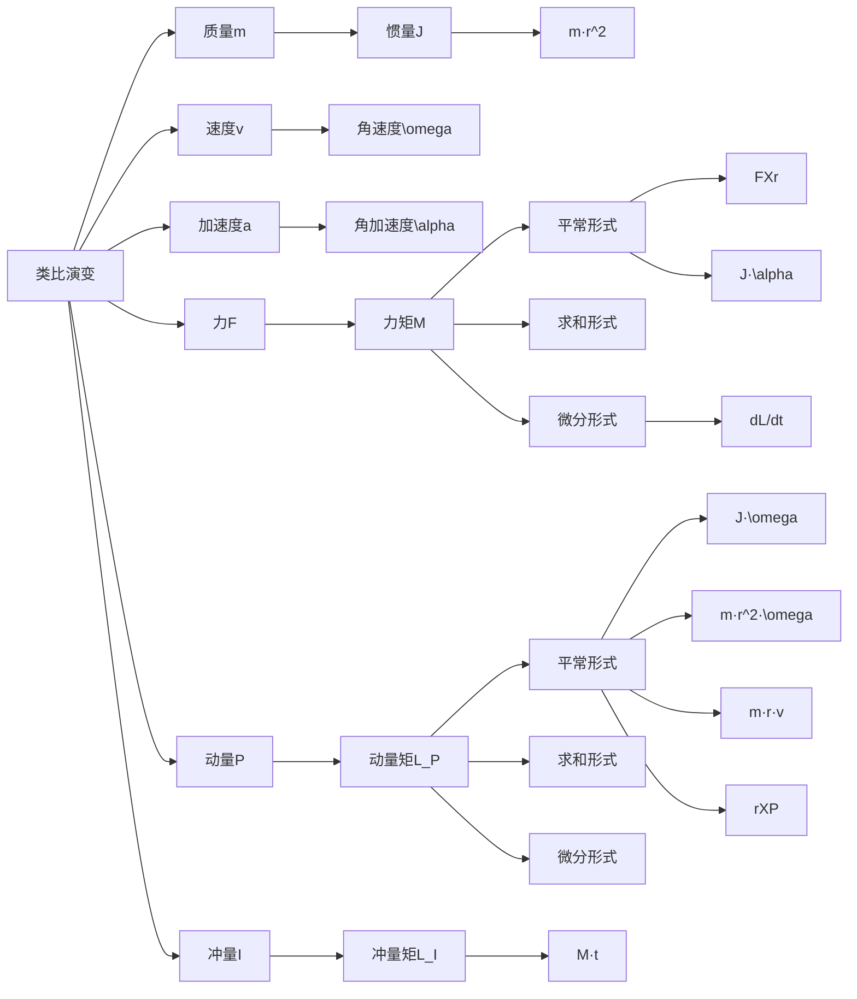
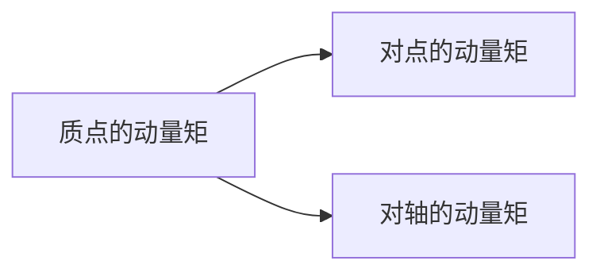
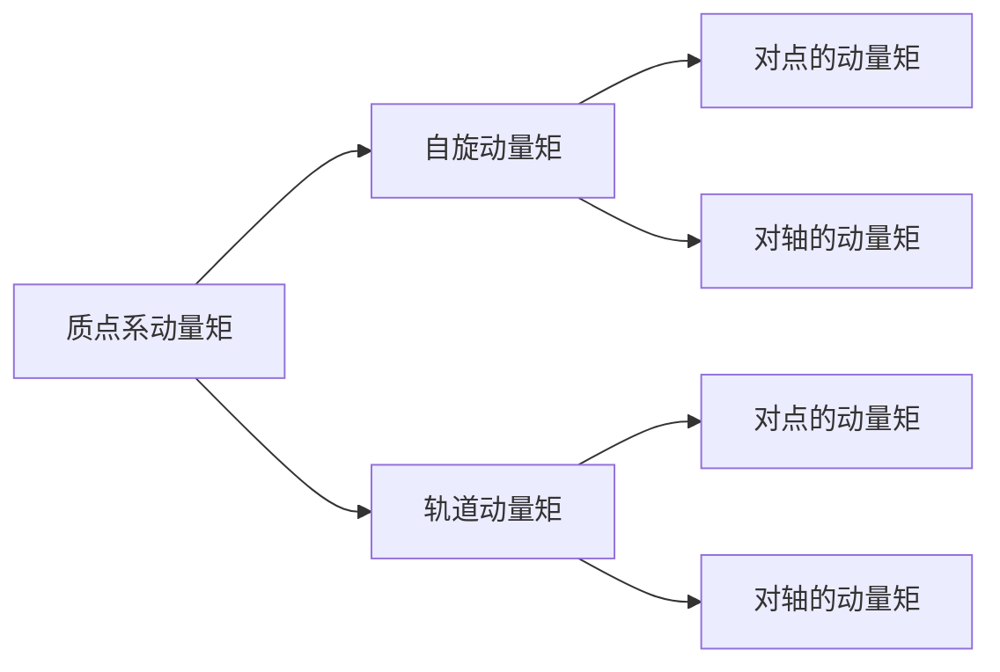

哈尔滨工业大学理论力学教研室 编

高等教育出版社 “十二五”普通高等教育本科国家级规划教材 iCourse·教材

数字课程网站网址：http://abook.hep.com.cn/1248791 http://abook.hep.edu.cn/1248791 数字课程账号 使用说明详见书内数字课程说明页


---

- 理论力学(I) LILUN LIXUE 第 8 版

哈尔滨工业大学理论力学教研室 编

高等教育出版社·北京


---

- 图书在版编目(CIP)数据

理论力学. I / 哈尔滨工业大学理论力学教研室编 .---8 版.--北京：高等教育出版社,2016.9

iCourse·教材

ISBN 978-7-04-045992-0

I. ①理... II. ①哈... III. ①理论力学-高等学校- 教材 IV. ①031

中国版本图书馆 CIP 数据核字(2016)第 170814 号内容简介


策划编辑 黄 强 责任编辑 黄强 封面设计 李小璐 版式设计 童 丹

插图绘制 杜晓丹 责任校对 刘春萍 责任印制 刘思涵出版发行 高等教育出版社 网 址 http://www.hep.edu.cn 社 址 北京市西城区德外大街 4 号 http://www.hep.com.cn 邮政编码 100120 网上订购 http://www.hepmall.com.cn 印刷 河北鹏盛贤印刷有限公司 http://www.hepmall.com 开本 ${787}\mathrm{\;{mm}} \times  {960}\mathrm{\;{mm}}1/{16}$ http://www.hepmall.cn 印张 28 版次 1961 年 4 月 第 1 版字数 510 千字 2016年 9 月 第 8 版购书热线 010-58581118 印次 2016 年 9 月第 1 次印刷

咨询电话 400-810-0598 定价 44.30 元

本书如有缺页、倒页、脱页等质量问题,请到所购图书销售部门联系调换

版权所有 侵权必究

物 料 号 45992-00


本书第 1 版至第 7 版受到广大教师和学生的欢迎。第 8 版仍保持前 7 版理论严谨、逻辑清晰、由浅入深、宜于教学的风格体系, 对部分内容进行了修改和修正,适当增加了综合性例题,并增删了一定数量的习题。

本书第 8 版共分 I ,II 两册。《理论力学》(I) 内容包括静力学(含静力学公理和物体的受力分析、平面力系、空间力系、摩擦),运动学 (含点的运动学、刚体的简单运动、点的合成运动、刚体的平面运动),动力学 (含质点动力学的基本方程、动量定理、动量矩定理、动能定理、达朗贝尔原理、虚位移原理)。一般中等学时的专业只用第 I 册即可。《理论力学》(II) 为专题部分, 内容包括分析力学基础、非惯性系中的质点动力学、碰撞、机械振动基础、刚体定点运动、自由刚体运动、刚体运动的合成。 陀螺仪近似理论、变质量动力学, 各专业可根据需要来选取。

本书可作为高等学校工科机械、土建、水利、航空、航天等专业理论力学课程的教材,也可作为高职高专、成人高校相应专业的自学和函授教材, 亦可供有关工程技术人员参考。

本书配有丰富的数字课程资源, 其中既有供教师教学使用的资源, 也有供学生学习使用的资源, 用户可登录易课程网 ( http://abook.hep.com.cn/1248791)使用。与本书配套的有《理论力学学习辅导》、《理论力学思考题集》、《理论力学解题指导及习题集》(第 3 版)、《理论力学电子教案》、《理论力学网络课程》、《理论力学习题解答》、《理论力学网上作业与查询系统》等。


---

- 与本书配套的数字课程资源使用说明

与本书配套的数字课程资源发布在高等教育出版社易课程网站,请登录网站后开始课程学习。

## 一、网站登录

1. 访问 http://abook.hep.com.cn/1248791, 点击“注册”。在注册页面输入用户名、密码及常用的邮箱进行注册。已注册的用户直接输入用户名和密码登录即可进入“我的课程”界面。

2. 点击“我的课程”页面右上方“绑定课程”, 按网站提示输入教材封底防伪标签上的数字,点击“确定”完成课程绑定。

3. 在 “正在学习” 列表中选择已绑定的课程, 点击 “进入课程” 即可浏览或下载与本书配套的课程资源。刚绑定的课程请在“申请学习”列表中选择相应课程并点击“进入课程”。

账号自登录之日起一年内有效,过期作废。

## 二、资源使用

与本书配套的数字课程资源内容覆盖了教学大纲、课程介绍、电子课件、动画、教材图片、自检自测、习题详解、视频等,以上资源可以登录网站观看或下载。 为便于教与学,有的资源以二维码链接的形式在书中出现,扫描后即可观看。

## 三、版本修改
### 第8版序

本书自 1961 年出版以来,先后再版 7 次,曾获首届国家优秀教材奖和国家级教学成果奖。第 7 版被评为 “十二五” 普通高等教育本科国家级规划教材、 2011 年度普通高等教育精品教材。

本书第 8 版的修订工作遵循继承传统、突出特色、完善内容、精益求精的指导思想, 在内容上作了如下修改:

1. 对虚位移原理和分析力学部分的内容进行了一定的修改。修正了虚位移的定义, 使其适用于非定常约束的情况; 以势能变分为例, 从数学上阐述了变分的概念与计算公式, 并将虚位移与质点系位形的变分联系起来, 加深学生对虚位移概念的理解与掌握; 修改了第二类拉格朗日方程一节中个别定理的推导并增加了部分拓展应用例题。

2. 增加了“两体问题”和“潮汐现象”的分析,在 “碰撞” 一章中增加了用于碰撞过程的拉格朗日方程,在“变质量动力学”一章中引入了近程火箭的外弹道微分方程式。

3. 对全书其他部分内容进行了个别修正,适当增加了综合性例题,并增删了一定数量的习题。

4. 增加了数字资源的二维码链接, 读者通过扫描书上的二维码即可链接相关数字资源。

全书分为两册,第 I 册为基础部分,内容包括静力学(含静力学公理和物体的受力分析、平面力系、空间力系、摩擦),运动学(含点的运动学、刚体的简单运动、点的合成运动、刚体的平面运动),动力学 (含质点动力学的基本方程、动量定理、动量矩定理、动能定理、达朗贝尔原理、虚位移原理)。一般中等学时的专业只用第 I 册即可。第 II 册为专题部分,内容包括分析力学基础、非惯性系中的质点动力学、碰撞、机械振动基础、刚体定点运动、自由刚体运动、刚体运动的合成 - 陀螺仪近似理论、变质量动力学,各专业可根据需要来选取。全书配有思考题和习题。

本书是与爱课程网上理论力学资源共享课配套的教材,具体网址为

http://www.icourses.cn/coursestatic/course_2919.html

本书可作为高等学校工科机械、土建、水利、航空、航天等专业理论力学课程的教材,也可作为高职高专、成人高校相应专业的自学和函授教材,亦可供有关工程技术人员参考。

本书第 8 版由王铎教授主编,并由孙毅教授和程靳教授具体主持编写与修订工作。第 I 册由程燕平教授(第一、二、三、四章),孙毅教授(第五、六、七、八、 十四章),程靳教授和张莉教授(第九、十、十二、十三章)执笔。第II 册由孙毅教授(第一、三、四章),程靳教授和张莉教授(第二、五、六章)执笔,全书由孙毅教授统稿。

本书第 8 版由北京理工大学梅凤翔教授、北京航空航天大学谢传锋教授和浙江大学庄表中教授审阅,特此致谢。

本书第 8 版的修订过程中,先后得到梅凤翔、庄表中、王琪、支希哲等各位教授的支持并提出宝贵意见,在此表示衷心的感谢。

本书虽经多次修订,但限于我们的水平和条件,缺点和错误在所难免,请大家多提宝贵意见,使本书不断提高和完善。

哈尔滨工业大学理论力学教研室

2016 年 6 月

### 第7版序

本书初版于 1961 年出版。通过 40 余年的不断修改、完善,逐步形成了具有自己风格和特点的教学体系,先后再版 6 次,曾获得首届国家优秀教材奖和国家级教学成果奖。

第 7 版保持和发扬了前 6 版的体系和风格,坚持理论严谨、逻辑清晰、由浅入深、易教易学的原则,并根据教育部力学基础课程教学指导分委员会最新制订的“理论力学课程教学基本要求(A 类)”,在内容上作了如下修改：

1. 在静力学部分适当深化了力学建模的基本概念与解题方法, 在运动学部分对一些公式的推导进行了修改,以便于学生掌握相关公式和物理概念。

2. 对习题部分作了较大的改动,使习题量更充足、题型更丰富,以便于教学使用。

全书仍分为两册,第 I 册为基础部分,内容包括静力学(含静力学公理、物体的受力分析、平面力系、空间力系、摩擦等)、运动学(含点的运动学、刚体的简单运动、点的合成运动、刚体的平面运动等)、动力学(含质点动力学的基本方程、动量定理、动量矩定理、动能定理、达朗贝尔原理、虚位移原理等),一般中等学时的专业只用第 I 册即可; 第 II 册为专题部分, 内容包括分析力学基础、非惯性系中的质点动力学、碰撞、机械振动、刚体定点运动、自由刚体运动、刚体运动的合成·陀螺仪近似理论、变质量动力学等。各专业可根据需要来选取。全书配有思考题和习题。

本书运用多种媒体形式进行一体化设计,在易课程网上为本教材建立了专门的网页,既有供教师使用的教学资源,也有供学生使用的资源。资源类型包括电子教案、动画、视频、典型例题、习题详解等,极大丰富了内容的呈现形式,拓展了教材内容。

本版由王铎教授主编,并由孙毅教授和程靳教授具体主持编写与修订工作。 第 I 册由程靳教授(第一、二、三、十、十一、十二章),孙毅教授(第五、六、七、八章),程燕平教授(第十三、十四章),张莉教授(第四、九章)执笔；第II册由孙毅教授(第一、四章),程靳教授(第二、五、六章),程燕平教授(第三章),刘墩教授 (航天器轨道动力学基础)执笔。全书由孙毅教授和程靳教授统稿。

本版由清华大学贾书惠教授审阅,特此致谢。

在本书第 7 版的修订过程中,先后得到贾书惠、谢传锋、景荣春、董正筑、王琪、武清玺、支希哲、李晓阳、刘又文、屈本宁等各位教授的支持及其提出的宝贵意见,在此表示衷心的感谢。

本书虽经多次修订,但限于我们的水平和条件,缺点和错误在所难免,请大家多提宝贵意见,使本书不断提高和完善。

哈尔滨工业大学理论力学教研室

2009 年 3 月

### 第6版序

本书从 1961 年出版以来,已经修订多次,这次是第六版。前五版受到了广大教师和学生的欢迎,曾获国家优秀教材奖。

为适应 21 世纪的需要,本书对第五版进行了修订。通过多年的教学实践, 本书的体系和风格已经比较成熟,大多数使用者希望保留和发扬这一风格。本版仍保留前五版的风格,坚持理论严谨、逻辑清晰、由浅入深的原则,适当提高起点,增加部分新内容。本版分为两册。第 I 册为基础部分,包含了理论力学的基本内容,包括：静力学、运动学、动力学三大基本定理、达朗贝尔原理、虚位移原理等,一般中等学时的专业只用第 I 册即可。第 II 册为专题部分,内容包括：非惯性系动力学、碰撞、分析力学基础 (含第一类拉格朗日方程) 、机械振动基础、定点运动及变质量动力学。不同专业可选用不同的专题。

本书适用于高等工科院校四年制机械、土建、交通、水利、动力、航空航天等专业,也可供其他专业选用,或作为自学、函授教材。

本版由王铎教授和程靳教授主编,经教材审定小组讨论,第 I 册由王宏钰教授(第一,二,三,四,五章),程靳教授(第六,七,八,九章),赵经文教授(第十,十一,十二,十三章),程燕平副教授(第十四,十五章)执笔；第II册由程靳教授(第一,五,六章),程燕平副教授(第二章),孙毅教授(第三章)执笔,第四章由程靳教授与程燕平副教授共同执笔；全书由程靳教授和程燕平副教授统稿。

本版由清华大学贾书惠教授审阅,并提出了很多宝贵意见,特此致谢。

本书虽经多次修订,但限于我们的水平和条件,缺点和错误仍在所难免,衷心希望大家提出批评和指正,使本书不断提高和完善。

哈尔滨工业大学理论力学教研室

2002 年 5 月

### 第5版序

本书为第五版。初版于 1961 年出版, 1962 年和 1965 年经过修订,出版了第二版上、下册和第三版上册,第三版下册因故未能正式出版。1981 年出版的第四版上、下册对以前的版本作了较大的调整,在各章末增加了小结、思考题和习题,更有利于教师的讲授,也便于学生自学。本书第四版在国内得到了广泛的选用,荣获国家优秀教材奖。本书第四版出版十余年来,也收到了很多教师和读者的宝贵意见和建议,对此我们深表感谢。

为适应我国科学技术和生产建设的发展,适应学生水平的普遍提高,我们根据近年来的教学实践和兄弟院校的意见,对本书第四版作了适当的修订。修订后的第五版符合国家教委新颁布的“高等学校工科本科理论力学课程教学基本要求”,适用于四年制机械、土建、水利、航空和动力等专业,可供企业管理、化工、电器等其他专业选用,亦可作为自学和函授教材。

本版保持了第四版的体系和风格,继承了前一版便于教师讲授和学生自学的优点,在下列几方面作了一些修改：减少了与数学、物理等课程简单重复的内容；删去了图解静力学一章；减少了几何法求解问题的篇幅,适当加强了便于计算机应用的解析方法和综合分析问题的训练; 合并了部分章节, 精炼了文字叙述；减少了部分简单习题,扩展了习题的类型,适当增加了综合练习题；附录中给出了几个有关静力学内容的微机计算程序。

本版采用了 GB 3100~3102一93《量和单位》中规定的有关通用符号。

本修订版由王铎教授和赵经文教授任主编,经教材修订小组讨论,由王宏钰教授(静力学)、程靳教授(运动学)、赵经文教授(动力学)和陈明副教授、程燕平副教授(习题)等执笔,并由赵经文教授统稿,最后由王铎教授定稿完成。

本版由清华大学贾书惠教授和华东船舶工业学院董雷强副教授审阅,他们对本书提出了很多宝贵意见,特此致谢。

本书虽经多次修订,但由于水平和条件所限,还会有不少缺点和错误,诚恳欢迎读者批评指正。衷心希望大家对本书提出修改意见和建议,使之能不断地提高和改进。

哈尔滨工业大学理论力学教研室

1996 年 10 月

### 第4版序

本书初版于 1961 年出版。1962 年和 1965 年经过修订,出版了第二版上、 下册和第三版上册,第三版下册因故未能正式出版。

为了适应社会主义现代化建设的需要,我们根据多年来的教学实践并按照高等学校工科力学教材编审委员会理论力学编审小组 1980 年审订的高等工业学校《理论力学教学大纲》(草案)(四年制机械、土建、水利、航空等类专业试用)的要求,对本书在前三版的基础上进行了修订,作为第四版出版。本版对以前各版的章节作了适当的调整,对各章的内容、例题作了增删和修订；为便于自学,在各章末增加了小结、思考题和习题,并在书末附有习题答案。

本版采用国际单位制。

本版基本内容课内为 120 学时。附有“ $*$ ”号的章节,不是 120 学时内的基本内容,可根据专业需要选取。绪论的内容不必在第一次课上全部讲授,例如关于理论力学的研究方法可在课程结束时加以总结。

本版的修订由王铎同志主编,修订方案经过教材修订小组讨论,由王宏钰 (第一章至第八章)、洪敏谦(绪论和第九章至第二十章)、邹经湘(第二十一章至第二十四章)、杨英烈(静力学习题)、于永德(运动学和动力学习题)同志执笔, 并由洪敏谦同志统稿,最后由王铎同志校阅。

本版上册插图部分底图由冯年寿同志重新绘制。

本版由北京航空学院黄克累和张大源同志审阅,并提出了很好的意见,特此致谢。

本书虽经多次修订,但限于我们的水平,还会有不少缺点和错误,衷心希望读者批评指正。

哈尔滨工业大学理论力学教研室

1981 年 6 月

### 第3版序

为了适应当前教学改革的形势,我们对本书第二版作了较全面的修订。在修订中,注意了贯彻“理论联系实际”的方针和“少而精”的原则。

修订时,注意了工科院校的特点,删去了不适合一般专业需要的部分,精简了次要内容,合并了一些章节；在内容叙述和定理推证方面力求物理概念清晰； 各章问题尽量从工程实际引出,并增加了联系实际的例子。

本修订版在修订前,经过教研室全体同志讨论,然后分工执笔修改,最后由王铎同志统一校订。本版全部插图都系重新绘制。

本修订版由北京航空学院黄克累同志审阅,并提出了很多宝贵的意见。

由于我们对教学改革精神领会不够,并受政治和业务水平所限,错误和缺点在所难免,衷心地希望大家批评指正。

哈尔滨工业大学理论力学教研室

1965 年 8 月

### 第2版序

本书的第一版出版后,我们听取了兄弟院校教师和读者的意见,对它进行了修改。

在本版中,我们对全书的内容和文句作了必要的增删和修改,也订正了第一版中的印刷错误。

本版的修改工作是由洪敏谦同志执笔和完成的。修改的内容曾由教研室部分教师参加讨论。改写的章节中的第二十章 §7 和第二十九章 §10 分别由陈长庚和谈开孚同志执笔。最后,由王铎同志对全书进行了校阅。

为了提高出版质量,本版中的部分附图是由屠良尧等同志重新绘制的。

本书虽经修改,但由于水平所限,缺点和错误仍在所难免,衷心地希望大家提出批评和指正。

哈尔滨工业大学理论力学教研室

1962 年 3 月

### 第1版序

本书是根据 1959 年我教研室所编理论力学讲义经过局部修改而出版的。 几年来, 特别是在贯彻党的教育方针以后, 在党的领导下, 学习先进经验, 并结合我们的教学实践,总结了点滴体会,先后编写了一些讲义,供校内同学参考。由于讲义本来只反映本校的局部情况,加以出版时间仓促,没有来得及根据兄弟院校的教学经验多加修改。

本书的篇幅只大体适合于机械、动力、电机、土建等类各专业理论力学课程的要求。对变质量力学、物体在中心力场中的运动、回转仪理论和振动理论等专题只作了简略的叙述。因此有必要结合学校和专业的特点,增删部分内容,指定相应的参考资料。

总之,本书无论在体系、篇幅、内容、教学方法等各个方面都不够成熟,必须随着教育改革的不断深入发展,吸取兄弟教研室的宝贵经验,大力加以修改,热烈地希望兄弟院校的教师和同学提出批评指正。

本书是在党的直接领导和关怀下,由教研室同志集体编写的,参加的主要成员有童秉纲、钟宏九、黄文虎、谈开孚、叶谋仁等。

最后,衷心地感谢兄弟院校的理论力学教研室,他们为了促使本书提高质量,早日出版,对本书提出了许多宝贵的修改意见,主动地为本书提供了他们所编讲义的个别章节及例题,并承清华大学理论力学教研组有关同志对全书进行了校阅和订正。

哈尔滨工业大学理论力学教研室

1961 年 4 月于哈尔滨


## 主要符号表
#### 1. 运动
| 符号    | 含义    |
| ----- | ----- |
| $v$   | 速度    |
| $v_a$ | 绝对速度  |
| $v_r$ | 相对速度  |
| $v_e$ | 牵连速度  |
| $v_c$ | 质心速度  |
| $a$   | 加速度   |
| $a_n$ | 法向加速度 |
| $a_t$ | 切向加速度 |
| $a_n$ | 绝对加速度 |
| $a_r$ | 相对加速度 |
| $a_e$ | 牵连加速度 |
| $a_c$ | 科氏加速度 |


### 2. 力学

| 符号                         | 含义                       |
| -------------------------- | ------------------------ |
| $A$                        | 面积，自由振动振幅                |
| $e$                        | 恢复因数                     |
| $f$                        | 动摩擦因数                    |
| $f_s$                      | 静摩擦因数                    |
| $F$                        | 力                        |
| $\mathbf{F}_R'$            | 主矢                       |
| $\mathbf{F}_s$             | 静摩擦力                     |
| $\mathbf{F}_N$             | 法向约束力                    |
| $\mathbf{F}_{\text{le}}$   | 牵连惯性力                    |
| $\mathbf{F}_{\text{IC}}$   | 科氏惯性力                    |
| $F_1$                      | 惯性力                      |
| $g$                        | 重力加速度                    |
| $h$                        | 高度                       |
| $i$                        | $x$ 轴的基矢量                |
| $I$                        | 冲量                       |
| $j_y$                      | $y$ 轴的基矢量                |
| $J_z$                      | 刚体对 $z$ 轴的转动惯量           |
| $J_{xy}$                   | 刚体对 $x, y$ 轴的惯性积         |
| $J_c$                      | 刚体对质心的转动惯量               |
| $k$                        | 弹簧刚度系数                   |
| $k$                        | $z$ 轴的基矢量                |
| $l$                        | 长度                       |
| $L$                        | 拉格朗日函数                   |
| $\mathbf{L}_0$             | 刚体对点 $O$ 的动量矩            |
| $\mathbf{L}_c$             | 刚体对质心的动量矩                |
| $m$                        | 质量                       |
| $M_z$                      | 对 $z$ 轴的矩                |
| $M$                        | 力偶矩，主矩                   |
| $\mathbf{M}_o(\mathbf{F})$ | 力 $\mathbf{F}$ 对点 $O$ 的矩 |
| $M_1$                      | 惯性力的主矩                   |
| $n$                        | 质点数目                     |
| $O$                        | 参考坐标系的原点                 |
| $p$                        | 动量                       |
| $P$                        | 重量，功率                    |
| $q$                        | 载荷集度，广义坐标                |
| $Q$                        | 广义力                      |
| $r$                        | 半径，矢径的模                  |
| $\mathbf{r}$               | 矢径                       |
| $\mathbf{r}_o$             | 点 $O$ 的矢径                |
| $\mathbf{r}_c$             | 质心的矢径                    |
| $R$                        | 半径                       |
| $S$                        | 弧坐标，频率比                  |
| $t$                        | 时间                       |
| $T$                        | 动能                       |


### 3. 能量和势能
| 符号 | 含义 |
|------|------|
| $V$ | 势能，体积 |
| $\Lambda$ | 对数减缩 |
| $W$ | 力的功 |
| $\rho$ | 密度，曲率半径 |

### 4. 坐标和角度
| 符号          | 含义        |
| ----------- | --------- |
| $x, y, z$   | 直角坐标      |
| $\varphi$   | 角度坐标      |
| $\alpha$    | 角加速度      |
| $\varphi_f$ | 摩擦角       |
| $\beta$     | 角度坐标      |
| $\psi$      | 角度坐标      |
| $\delta$    | 滚阻系数，阻尼系数 |
| $\omega_0$  | 固有角频率     |
| $\delta$    | 变分符号      |
| $\omega$    | 角速度       |
| $\zeta$     | 阻尼比       |
| $\omega_a$  | 绝对角速度     |
| $\eta$      | 减缩因数      |
| $\omega_r$  | 相对角速度     |
| $\lambda$   | 本征值       |
| $\omega_e$  | 牵连角速度     |

## 目 录

### 静力学

引言 1

第一章 静力学公理和物体的受力分析 3

$§1 - 1$ 静力学公理 3

$§1 - 2$ 约束和约束力 5

$§1 - 3$ 物体的受力分析和受力图 11

$§1 - 4$ 力学模型与力学简图 16

思考题 19

习题 21

第二章 平面力系 25

$§2 - 1$ 平面汇交力系 25

$§2 - 2$ 平面力对点之矩,平面力偶 30

$§2 - 3$ 平面任意力系的简化 38

$§2 - 4$ 平面任意力系的平衡条件和平衡方程 43

$§2 - 5$ 物体系的平衡. 静定和超静定问题 47

$§2 - 6$ 平面简单桁架的内力计算 56

思考题 60

习题 63

第三章 空间力系 77

$§3 - 1$ 空间汇交力系 77

$§3 - 2$ 力对点的矩和力对轴的矩 79

$§3 - 3$ 空间力偶 82

$§3 - 4$ 空间任意力系的简化 86

$§3 - 5$ 空间任意力系的平衡方程 90

$§3 - 6$ 物体的重心 97

思考题 104

习题 105

第四章 摩擦 112

$§4 - 1$ 滑动摩擦 112

$§4 - 2$ 摩擦角和自锁现象 114

$§4 - 3$ 考虑摩擦时物体的平衡问题 117

$§4 - 4$ 滚动摩阻的概念 125

思考题 128

习题 131

### 运动学

引言 139

第五章 点的运动学 140

$§5 - 1$ 矢量法 140

$§5 - 2$ 直角坐标法 141

$§5 - 3$ 自然法 146

* $§5 - 4$ 点的速度和加速度在柱坐标和极坐标中的投影 153

* $§5 - 5$ 点的速度和加速度在球坐标中的投影 155

思考题 157

习题 158

第六章 刚体的简单运动 163

$§6 - 1$ 刚体的平行移动 163

$§6 - 2$ 刚体绕定轴的转动 164

$§6 - 3$ 转动刚体内各点的速度和加速度 165

$§6 - 4$ 轮系的传动比 168

$§6 - 5$ 以矢量表示角速度和角加速度,以矢积表示点的

速度和加速度 170

思考题 173

习题 174

第七章 点的合成运动 179

$§7 - 1$ 相对运动 $\cdot$ 牵连运动 $\cdot$ 绝对运动 179

$§7 - 2$ 点的速度合成定理 183

$§7 - 3$ 牵连运动是平移时点的加速度合成定理 188

$§7 - 4$ 牵连运动是定轴转动时点的

加速度合成定理·科氏加速度 190

思考题 197

习题 199

第八章 刚体的平面运动 208

$§8 - 1$ 刚体平面运动的概述和运动分解 208

$§8 - 2$ 求平面图形内各点速度的基点法 211

$§8 - 3$ 求平面图形内各点速度的瞬心法 216

$§8 - 4$ 用基点法求平面图形内各点的加速度 221

$§8 - 5$ 运动学综合应用举例 226

思考题 234

习题 237

### 动力学

引言 247

第九章 质点动力学的基本方程 248

$§9 - 1$ 动力学的基本定律 248

$§9 - 2$ 质点的运动微分方程 250

思考题 255

习题 256

第十章 动量定理 260

$§{10} - 1$ 动量与冲量 260

$§{10} - 2$ 动量定理 262

$§{10} - 3$ 质心运动定理 266

思考题 270

习题 271

第十一章 动量矩定理 276

$§{11} - 1$ 质点和质点系的动量矩 276

$§{11} - 2$ 动量矩定理 277

$§{11} - 3$ 刚体绕定轴的转动微分方程 281

$§{11} - 4$ 刚体对轴的转动惯量 284

$§{11} - 5$ 质点系相对于质心的动量矩定理 290

$§{11} - 6$ 刚体的平面运动微分方程 294

思考题 298

习题 300

第十二章 动能定理 310

$§{12} - 1$ 力的功 310

$§{12} - 2$ 质点和质点系的动能 315

$§{12} - 3$ 动能定理 317

$§{12} - 4$ 功率 $\cdot$ 功率方程 $\cdot$ 机械效率 324

$§{12} - 5$ 势力场 · 势能 · 机械能守恒定律 327

$§{12} - 6$ 普遍定理的综合应用举例 334

思考题 340

习题 342

综合问题习题 347

第十三章 达朗贝尔原理 355

$§{13} - 1$ 惯性力 - 质点的达朗贝尔原理 355

$§{13} - 2$ 质点系的达朗贝尔原理 356

$§{13} - 3$ 刚体惯性力系的简化 358

$§{13} - 4$ 绕定轴转动刚体的轴承动约束力 365

思考题 368

习题 369

第十四章 虚位移原理 375

$§{14} - 1$ 约束 · 虚位移 · 虚功 375

$§{14} - 2$ 虚位移原理 379

思考题 385

习题 387

参考文献 391

习题答案 392

索引 411

Synopsis 415

Contents 416

主编简介 420


## 引言

静力学是研究物体在力系作用下平衡规律的科学。

在静力学中所指的物体通常都是刚体, 所谓刚体是指在力的作用下, 其内部任意两点之间的距离始终保持不变的物体, 这是一个理想化的力学模型。在力的作用下, 称变形不能忽略不计的物体为变形体。

力,是物体间相互的机械作用,这种作用效果使物体的机械运动状态发生变化。

力对物体的作用效果由三个要素一力的大小、方向、作用点来确定, 习惯称之为力的三要素。故力应以矢量表示,本书中用黑斜体字母 $F$ 表示力矢量, 而用普通字母 $F$ 表示力的大小。在国际单位制中,力的单位是 $\mathrm{N}$ 或 $\mathrm{{kN}}$ 。

力系,是指作用于物体上的一群力。

如果一个力系作用于物体的效果与另一个力系作用于该物体的效果相同, 称这两个力系互为等效力系。

不受外力作用的物体可称其为受零力系作用。一个力系如果与零力系等效, 称该力系为平衡力系。

在静力学中, 主要研究以下三个问题:

 1. 物体的受力分析

分析某个物体共受几个力作用, 以及每个力的作用位置和方向。

2. 力系的等效替换 (或简化)

将作用在物体上的一个力系用与它等效的另一个力系来替换, 称为力系的等效替换。用一个简单力系等效替换一个复杂力系,称为力系的简化。某力系与一个力等效, 则称此力为该力系的合力, 而该力系的各力为此力的分力。

研究力系等效替换并不限于分析静力学问题,也是为动力学提供基础。

3. 建立各种力系的平衡条件

研究作用在物体上的各种力系所需满足的平衡条件。

物体的受力分析、力系的平衡条件在解决工程实际问题中有着非常重要的意义, 是设计各种结构与机构静力计算的基础, 静力学的概念和知识在工程中有着广泛的应用。

# 静力学
【中学回顾】
1. **牛顿第一定律（惯性定律）**：
    
    - **适用性**：适用于所有**惯性参照系**。惯性参照系是指没有加速度的参照系，或者加速度可以忽略不计的参照系。在非惯性参照系中，需要引入额外的力（如惯性力）来解释物体的运动。
2. **牛顿第二定律（加速度定律）**：
    
    - **适用性**：严格来说，牛顿第二定律**只适用于惯性参照系**。在非惯性参照系中，物体会表现出“**伪力**”或“**惯性力**”，这些力不是由物体间的相互作用产生的，而是由参照系的加速度引起的。因此，在非惯性参照系中，牛顿第二定律需要修改以包含这些额外的力。
3. **牛顿第三定律（作用与反作用定律）**：
    
    - **适用性**：牛顿第三定律适用于**所有参照系**，无论是惯性的还是非惯性的。这个定律说明，对于任何两个相互作用的物体，它们之间的力总是大小相等、方向相反。这一定律在任何参照系中观察都是成立的，因为它描述的是作用力和反作用力之间的关系，这种关系与参照系的选择无关。


## 第一章 静力学公理和物体的受力分析

本章阐述静力学五条公理, 得出两条推理。介绍工程中常见的约束类型, 及其约束力分析, 同时介绍了力学模型与力学建模的概念。

静力学公理是研究静力学问题的基础, 物体的受力分析是解决力学问题的重要环节。

### $§1 - 1$ 静力学公理
公理是人们在生活和生产实践中长期积累的经验总结, 又经过实践反复检验,被确认是符合客观实际的最普遍、最一般的规律。

#### 公理 1 力的平行四边形法则
>内容：作用在物体上同一点的两个力, 可以合成为一个合力, 合力的作用点也在该点, 合力的大小和方向, 由这两个力为边构成的平行四边形的对角线确定, 如图 1-1 所示。或者说, 合力矢等于这两个力矢的几何和, 即

$$
{\mathbf{F}}_{\mathrm{R}} = {\mathbf{F}}_{1} + {\mathbf{F}}_{2}
$$


图 1-1


这条公理是复杂力系简化的基础。

#### 公理 2 二力平衡条件

作用在同一刚体上的两个力,使刚体保持平衡的必要和充分条件是:这两个力的大小相等,方向相反,且作用在同一直线上。

这条公理表明了作用于刚体上最简单力系平衡时所必须满足的条件。

#### 公理 3 加减平衡力系原理

在任一原有力系上加上或减去任意的平衡力系, 与原力系对刚体的作用效果等效。

这条公理是研究力系等效替换的重要依据。

根据上述公理可以导出下列两条推理:

###### 推理 1 力的可传性
>内容：作用于刚体上某点的力,可以沿着它的作用线移到刚体内任意一点,并不改变该力对刚体的作用。

证明: 在刚体上的点 $A$ 作用力 $F$ ,如图 1-2a 所示。根据加减平衡力系原理,

可在力的作用线上任取一点 $B$ ,并加上两个相互平衡的力 ${\mathbf{F}}_{1}$ 和 ${\mathbf{F}}_{2}$ ,使 $\mathbf{F} = {\mathbf{F}}_{2} =$ $- {F}_{1}$ ,如图 1-2b 所示。由于力 $F$ 和 ${F}_{1}$ 也是一个平衡力系,故可除去,这样只剩下一个力 ${\mathbf{F}}_{2}$ ,如图 1-2c 所示,即原来的力 $\mathbf{F}$ 沿其作用线移到了点 $B$ 。


<center>图 1-2</center>


由此可见, 对于刚体来说, 力的作用点已由作用线所代替。因此, 作用于刚体上的力的三要素是：力的大小、方向和作用线。

作用于刚体上的力可以沿着其作用线移动,称这种矢量为滑动矢量。

###### 推理 2 三力平衡汇交定理

刚体在三个力作用下平衡,若其中两个力的作用线交于一点,则第三个力的作用线必通过此汇交点,且三个力位于同一平面内。

证明: 如图 1-3 所示,在刚体的 $A,B,C$ 三点上,分别作用三个力 ${\mathbf{F}}_{1},{\mathbf{F}}_{2},{\mathbf{F}}_{3}$ ,且刚体平衡,其中 ${\mathbf{F}}_{1},{\mathbf{F}}_{2}$ 两力的作用线交于点 $O$ ,根据力的可传性, 把力 ${\mathbf{F}}_{1},{\mathbf{F}}_{2}$ 移到汇交点 $O$ ,再根据力的平行四边形公理,得合力 ${\mathbf{F}}_{12}$ 。由二力平衡公理,力 ${\mathbf{F}}_{3},{\mathbf{F}}_{12}$ 平衡。则力 ${\mathbf{F}}_{3},{\mathbf{F}}_{12}$ 必共线,即力 ${\mathbf{F}}_{3}$ 必通过汇交点 $O$ , 且力 ${\mathbf{F}}_{3}$ 必位于力 ${\mathbf{F}}_{1},{\mathbf{F}}_{2}$ 所在的平面内,三力共面。 推理 2 得证。


<center>图 1-3</center>


#### 公理 4 作用和反作用定律

作用力和反作用力总是同时存在,两力的大小相等、方向相反,沿着同一条直线,分别作用在两个相互作用的物体上。

作用和反作用定律与二力平衡条件的描述有相同之处, 两力均是等值、反向、共线, 但区别是, 作用和反作用力作用在相互作用的两个物体上, 二力平衡公理中的二力作用于同一个刚体上。

#### 公理 5 刚化原理

变形体在某一力系作用下处于平衡,如将此变形体刚化为刚体,其平衡状态保持不变。

这个公理提供了把变形体看作为刚体模型的条件。如图 1-4 所示,绳索在等值、反向、共线的两个拉力作用下处于平衡,如将绳索刚化成刚体,其平衡状态保持不变。反之就不一定成立, 如刚体在两个等值反向的压力作用下平衡, 若将它换成绳索就不能平衡了。


由此可见, 刚体的平衡条件是变形体平衡的必要条件, 而非充分条件。在刚体静力学的基础上, 考虑变形体的特性, 可进一步研究变形体的平衡问题。

静力学全部理论都可以由上述五个公理推证而得到, 这既能保证理论体系的完整和严密性, 又可以培养读者的逻辑思维能力。

### $§1 - 2$ 约束和约束力

有些物体,例如,飞行的飞机、炮弹和火箭等,它们在空间的位移不受任何限制。称位移不受限制的物体为自由体。相反,有些物体在空间的位移却要受到一定的限制,如机车受铁轨的限制,只能沿轨道运动；电机转子受轴承的限制,只能绕轴线转动; 重物由钢索吊住, 不能下落等。位移受到限制的物体称为非自由体。称对非自由体的某些位移起限制作用的周围物体为约束。例如, 铁轨对于机车,轴承对于电机转子,钢索对于重物等,都是约束。

从力学角度来看, 约束对物体的作用, 实际上就是力, 称这种力为约束力, 因此, 约束力的方向必与该约束所能够阻碍的位移方向相反。应用这个准则, 可以确定约束力的方向或作用线的位置。至于约束力的大小则是未知的。在静力学问题中, 约束力和物体受的其他已知力 (称主动力) 组成平衡力系, 因此可用平衡条件求出未知的约束力。当主动力改变时, 约束力一般也发生改变, 因此约束力是被动的,这也是将约束力之外的力称为主动力的原因。

下面介绍几种在工程中常见的约束类型和确定约束力方向的方法。

#### 1. 具有光滑接触表面的约束

例如,支持物体的固定面 (图 1-5a,b) 、 啮合齿轮的齿面 (图 1-6) 、机床中的导轨等,当摩擦忽略不计时,都属于这类约束。

这类约束不能限制物体沿约束表面切线的位移, 只能阻碍物体沿接触表面法线并向约束内部的位移。因此, 光滑支承面对物体的约束力, 作用在接触点处, 方向沿接触表面的公法线, 并指向被约束的物体。这种约束力称为法向约束力,通常用 ${\mathbf{F}}_{\mathrm{N}}$ 表示,如图 1-5 中的 ${\mathbf{F}}_{\mathrm{N}A},{\mathbf{F}}_{\mathrm{N}C}$ 和图 1-6 中的 ${\mathbf{F}}_{\mathrm{N}B}$ 等。


图 1-5


图 1-6


#### 2. 由柔软的绳索、链条或胶带等构成的约束

细绳吊住重物,如图 1-7a 所示。由于柔软的绳索本身只能承受拉力, 所以它给物体的约束力也只可能是拉力 (图 1-7b)。因此,绳索对物体的约束力,作用在接触点,方向沿着绳索背离物体。通常用 $\mathbf{F}$ 或 ${\mathbf{F}}_{\mathrm{T}}$ 表示这类约束力。

链条或胶带也都只能承受拉力。当它们绕在轮子上, 对轮子的约束力沿轮缘的切线方向 (图 1-8)。

一般通称这类约束为柔索约束。


图 1-7


<center>图 1-8</center>


#### 3. 光滑铰链约束

这类约束有向心轴承、圆柱形铰链和固定铰链支座等。

##### (1)向心轴承 (径向轴承)

图 1-9a,b 所示为轴承装置,可画成如图 1-9c 所示的简图。轴可在孔内任意转动,也可沿孔的中心线移动；但是,轴承阻碍着轴沿径向向外的位移。当轴和轴承在某点 $A$ 光滑接触时,轴承对轴的约束力 ${\mathbf{F}}_{A}$ 作用在接触点 $A$ ,且沿公法线指向轴心 (图 1-9a)。


<center>图 1-9</center>


但是, 随着轴所受的主动力不同, 轴和孔的接触点的位置也随之不同。所以, 当主动力尚未确定时, 约束力的方向预先不能确定。然而, 无论约束力朝向何方,它的作用线必垂直于轴线并通过轴心。这样一个方向不能预先确定的约束力,通常可用通过轴心的两个大小未知的正交分力 ${\mathbf{F}}_{Ax},{\mathbf{F}}_{Ay}$ 来表示,如图 1-9b 或 $\mathrm{c}$ 所示, ${\mathbf{F}}_{Ax},{\mathbf{F}}_{Ay}$ 的指向暂可任意假定。

在平面问题中,此类约束一般用图 1-9d 所示的符号表示。

##### (2)圆柱铰链和固定铰链支座

图 1-10a 所示为一拱形桥示意图,它是由两个拱形构件通过圆柱铰链 $C$ 以及固定铰链支座 $A$ 和 $B$ 连接而成。圆柱铰链是由销钉 $C$ 将两个钻有同样大小孔的构件连接在一起而成的 (图 1-10b),其简图如图 1-10a 的铰链 $C$ 所示。如果铰链连接中有一个固定在地面或机架上作为支座, 则称这种约束为固定铰链支座,简称固定铰支,如图 1-10b 中所示的支座 $B$ ,其简图如图 1-10a 所示的固定铰链支座 $A$ 和 $B$ 。

在分析铰链 $C$ 处的约束力时,通常把销钉 $C$ 固连在其中任意一个构件上, 如构件 II 上, 则构件 I, II 互为约束。显然, 当忽略摩擦时, 构件 II 上的销钉与构件 1 的结合,实际上是轴与光滑孔的配合问题。因此,它与轴承具有同样的约束性质, 即约束力的作用线不能预先定出, 但约束力垂直轴线并通过铰链中心, 故也可用两个未知的正交分力 ${\mathbf{F}}_{Cx},{\mathbf{F}}_{Cy}$ 和 ${\mathbf{F}}_{Cx}^{\prime },{\mathbf{F}}_{Cy}^{\prime }$ 来表示,如图 1-10c 所示。其中


<center>图 1-10</center>


${\mathbf{F}}_{Cx}$ 和 ${\mathbf{F}}_{Cx}^{\prime },{\mathbf{F}}_{Cy}$ 和 ${\mathbf{F}}_{Cy}^{\prime }$ ,互为作用力与反作用力。

同理,把销钉固连在 $A,B$ 支座上,则固定铰支 $A,B$ 对构件 $\mathrm{I},\mathrm{{II}}$ 的约束力分别为 ${\mathbf{F}}_{Ax},{\mathbf{F}}_{Ay}$ 与 ${\mathbf{F}}_{Bx},{\mathbf{F}}_{By}$ ,如图 1-10c 所示。

当需要分析销钉 $C$ 的受力时,才把销钉分离出来单独研究。这时,销钉 $C$ 将同时受到构件 $\mathrm{I},\mathrm{{II}}$ 上的孔对它的反作用力。其中 ${\mathbf{F}}_{C1x}$ 与 ${\mathbf{F}}_{C1x}^{\prime },{\mathbf{F}}_{C1y}$ 与 ${\mathbf{F}}_{C1y}^{\prime }$ ,为构件 I 与销钉 $C$ 的作用与反作用力; ${\mathbf{F}}_{C2x}$ 与 ${\mathbf{F}}^{\prime }{}_{C2x},{\mathbf{F}}_{C2y}$ 与 ${\mathbf{F}}_{C2y}^{\prime }$ ,为构件 II 与销钉 $C$ 的作用与反作用力。销钉 $C$ 所受到的约束力如图 1-10d 所示。

当将销钉 $C$ 与构件 II 固连为一体时, ${\mathbf{F}}_{C2x}$ 与 ${\mathbf{F}}_{C2x}^{\prime },{\mathbf{F}}_{C2y}$ 与 ${\mathbf{F}}_{C2y}^{\prime }$ 为作用在同一刚体上的成对的平衡力,可以消去不画。此时,力的下角不必再区分为 ${C1}$ 和 ${C2}$ ,铰链 $C$ 处的约束力仍如图 1-10c 所示。

请读者思考,若将销钉 $C$ 与构件 $\mathrm{I}$ 固连为一体时,铰链 $C$ 处的约束力将如何表达?

上述三种约束 (向心轴承、铰链和固定铰链支座), 它们的具体结构虽然不同,但是构成约束的性质是相同的,一般通称为铰链约束,通常用图 1-9d 所示的符号表示。此类约束的特点是只限制两物体径向的相对移动, 而不限制两物体绕铰链中心的相对转动与沿轴向的位移。此类约束的约束力一般用两个正交分力来表示,如图 1-9d 所示。

#### 4. 其他约束

##### (1)滚动支座

在桥梁、屋架等结构中经常采用滚动支座约束。这种支座是在固定铰链支座与光滑支承面之间,装有几个辊轴而构成,又称为辊轴支座,如图 1-11a 所示,其简图如图 1-11b 所示。它可以沿支承面移动,允许由于温度变化而引起结构跨度的自由伸长或缩短。显然, 滚动支座的约束性质与光滑面约束相同, 其约束力必垂直于支承面,且通过铰链中心。通常用 ${\mathbf{F}}_{\mathrm{N}}$ 表示其法向约束力,如图 1-11c 所示。


<div style="display: grid; place-items: center;">
    
</div>

<center>图 1-11</center> 


##### (2)球铰链

通过圆球和球壳将两个构件连接在一起的约束称为球铰链, 如图 1-12a所示。它使构件的球心不能有任何位移, 但构件可绕球心任意转动。若忽略摩擦, 其约束力应是通过接触点与球心, 但方向不能预先确定的一个空间法向约束力,一般用三个正交分力 ${\mathbf{F}}_{x},{\mathbf{F}}_{y},{\mathbf{F}}_{z}$ 表示,其简图及约束力如图 1-12b 所示。


图 1-12


##### (3)止推轴承

止推轴承与径向轴承不同, 它除了能限制轴的径向位移以外, 还能限制轴沿轴向的位移。因此, 它比径向轴承多一个沿轴向的约束力, 即其约束力有三个正交分量 ${\mathbf{F}}_{Ax},{\mathbf{F}}_{Ay},{\mathbf{F}}_{Az}$ 。止推轴承的简图及其约束力如图 1-13 所示。


<center>图 1-13</center>


以上只介绍了几种常见的约束, 在工程中, 约束的类型远不止这些, 有的约束比较复杂, 分析时需要加以简化或抽象, 在以后的某些章节中, 再作介绍。


##### (4)固定端

固定端约束在同一个点限制三个自由度的，其画法如图5a，以及约束反力如下图所示。


写出数学符号描述为：即在该点处不能产生x、y方向的位移，不能产生转动，dv/dx表示固定端处梁的转角为0，即不能发生转动。


### $§1 - 3$ 物体的受力分析和受力图

在工程实际中, 为了求出未知的约束力, 需要根据已知力, 应用平衡条件求解。为此, 首先要确定构件受了几个力, 每个力的作用位置和力的作用方向, 这种分析过程称为物体的受力分析。

作用在物体上的力可分为两类：一类是主动力,例如,物体的重力、风力、气体压力等,一般是已知的；另一类是约束对于物体的约束力,为未知的被动力。


为了清晰地表示物体的受力情况, 我们把需要研究的物体 (称为受力体) 从周围的物体 (称为施力体) 中分离出来, 单独画出它的受力简图, 这个步骤叫做取研究对象或取分离体。然后, 把施力物体对研究对象的作用力 (包括主动力和约束力)全部画出来。这种表示物体受力的简明图形, 称为受力图。画物体受力图是解决静力学问题的一个重要步骤。

例 1-1 屋架如图 1-14a 所示。 $A$ 处为固定铰链支座, $B$ 处为滚动支座,搁在光滑的水平面上。2. 知屋架自重 $P$ ,在屋架的 ${AC}$ 边上承受了垂直于它的均布的风力 $q\left( {q\text{以 N/m 计}}\right)$ 。 要求画出屋架的受力图。


图 1-14


解：(1)取屋架为研究对象,除去约束并画出其简图。

(2)画主动力。有屋架的重力 $P$ 和均布的风力 $q$ 。

(3)画约束力。因 $A$ 处为固定铰支,其约束力用两个未知的正交分力 ${F}_{Ax}$ 和 ${F}_{Ay}$ 表示。 $B$ 处为滚动支座,约束力垂直向上,用 ${\mathbf{F}}_{\mathrm{N}B}$ 表示。

例 1-2 如图 1-15a 所示,水平梁 ${AB}$ 用斜杆 ${CD}$ 支撑, $A,C,D$ 三处均为光滑铰链连接。 均质梁重 ${P}_{1}$ ,其上放置一重为 ${P}_{2}$ 的电动机。不计杆 ${CD}$ 的自重,分别画出杆 ${CD}$ 和梁 ${AB}$ (包括电动机)的受力图。

解：(1) 先分析斜杆 ${CD}$ 的受力。由于斜杆的自重不计,根据光滑铰链的特性, $C,D$ 处的约束力分别通过铰链 $C,D$ 的中心,方向暂不确定。考虑到杆 ${CD}$ 只在 ${\mathbf{F}}_{C},{\mathbf{F}}_{D}$ 二力作用下平衡,根据二力平衡公理,这两个力必定沿同一直线,且等值、反向。由此可确定 ${\mathbf{F}}_{c}$ 和 ${\mathbf{F}}_{D}$ 的作用线应沿铰链中心 $C$ 与 $D$ 的连线,由经验判断,此处杆 ${CD}$ 受压力,其受力图如图 1-15b 所示。一般情况下, ${\mathbf{F}}_{C}$ 与 ${\mathbf{F}}_{D}$ 的指向不能预先判定,可先任意假设杆受拉力或压力。若根据平


图 1-15


衡方程求得的力为正值, 说明原假设力的指向正确; 若为负值, 则说明实际杆受力与原假设指向相反。

只在两个力作用下平衡的构件, 被称为二力构件。由于静力学中所指物体都是刚体, 其形状对计算结果没有影响, 因此不论其形状如何, 一般均简称二力杆。它所受的两个力必定沿两力作用点的连线, 且等值、反向。二力杆在工程实际中经常遇到, 有时也把它作为一种约束,如图 1-15b 所示。

(2)取梁 ${AB}$ (包括电动机) 为研究对象。它受有 ${P}_{1},{P}_{2}$ 两个主动力的作用。梁在铰链 $D$ 处受有二力杆 ${CD}$ 给它的反作用力 ${F}_{D}^{\prime }$ 的作用。梁在 $A$ 处受固定铰支给它的约束力的作用, 由于方向未知,可用两个未定的正交分力 ${\mathbf{F}}_{Ax}$ 和 ${\mathbf{F}}_{Ay}$ 表示。

梁 ${AB}$ 的受力图如图 1-15c 所示。

例 1-3 如图 1-16a 所示的三铰拱桥,由左、右两拱铰接而成。不计自重及摩擦,在拱 ${AC}$ 上作用有载荷 $F$ 。试分别画出拱 ${AC}$ 和 ${CB}$ 的受力图。

解：(1) 先分析拱 ${BC}$ 的受力。由于拱 ${BC}$ 自重不计,且只在 $B,C$ 两处受到铰链约束,因此拱 ${BC}$ 为二力构件。在铰链中心 $B,C$ 处分别受 ${\mathbf{F}}_{B},{\mathbf{F}}_{C}$ 两力的作用,这两个力的方向如图 1-16b 所示。

(2)取拱 ${AC}$ 为研究对象。由于自重不计,因此主动力只有载荷 $F$ 。拱 ${AC}$ 在铰链 $C$ 处受有拱 ${BC}$ 给它的反作用力 ${F}_{C}^{\prime }$ 的作用,拱在 $A$ 处受有固定铰支给它的约束力 ${F}_{A}$ 的作用,由于方向未定,可用两个未知的正交分力 ${\mathbf{F}}_{Ax}$ 和 ${\mathbf{F}}_{Ay}$ 代替。

拱 ${AC}$ 的受力图如图 1-16c 所示。


图 1-16


再进一步分析可知,由于拱 ${AC}$ 在 $F,{F}_{C}^{\prime }$ 及 ${F}_{A}$ 三个力作用下平衡,故可根据三力平衡汇交定理,确定铰链 $A$ 处约束力 ${\mathbf{F}}_{A}$ 的方向。点 $D$ 为力 $\mathbf{F}$ 和 ${\mathbf{F}}_{C}^{\prime }$ 作用线的交点,当拱 ${AC}$ 平衡时, 约束力 ${\mathbf{F}}_{A}$ 的作用线必通过点 $D$ (图 1-16d); 至于 ${\mathbf{F}}_{A}$ 的指向,暂且假定如图,以后由平衡条件确定。

请读者考虑：若左右两拱都计入自重时,各受力图有何不同？

例 1-4 图 1-17a 所示为一折叠梯子的示意图,梯子的 ${AB},{AC}$ 两部分在点 $A$ 铰接,在 $D$ , $E$ 两点用水平绳相连。梯子放在光滑水平地板上,自重忽略不计,点 $H$ 处站立一人,其重为 $\mathbf{P}$ 。要求分别画出绳子,以及梯子左、右两部分和梯子的整体受力图。

解：(1) 绳子为柔索约束,其受力图如图 1-17b 所示。

(2)先画梯子左边部分 ${AB}$ 的受力图。其在 $B$ 处受到光滑地板对它的法向约束力作用, 以 ${\mathbf{F}}_{\mathrm{N}B}$ 表示。在 $D$ 处受到绳子对它的拉力作用,以 ${\mathbf{F}}_{D}^{\prime }$ 表示。在 $H$ 处受到主动力人重 $\mathbf{P}$ 的作用。在铰链 $A$ 处,可画为正交两分力,以 ${F}_{Ax},{F}_{Ay}$ 表示。梯子左侧的受力图如图 1-17c 所示。

(3)画梯子右边部分 ${AC}$ 的受力图。其在 $C$ 处受到光滑地板对它的法向约束力作用,以 ${\mathbf{F}}_{NC}$ 表示。在 $E$ 处受到绳子对它的拉力作用,以 ${\mathbf{F}}_{E}^{\prime }$ 表示。在铰链 $A$ 处,受到梯子左边部分对它的反作用力作用,以 ${\mathbf{F}}_{Ax}^{\prime },{\mathbf{F}}_{Ay}^{\prime }$ 表示。右边梯子的受力图如图 1-17d 所示。

(4)画梯子整体的受力图。在画系统(梯子)的整体受力图时, ${AB}$ 与 ${AC}$ 两部分在 $A$ 处相互有力作用,在点 $D$ 与点 $E$ 绳子对其也有力作用,这些力是存在的,成对地作用在系统内。 系统内各物体之间相互作用的力称为内力, 内力是成对出现的, 对系统的作用效应相互抵消,


图 1-17


因此在受力图上一般不画出。在受力图上只画出系统以外的物体对系统的作用力, 称这种力为外力。这里,人重 $P$ 和地板约束力 ${\mathbf{F}}_{NB},{\mathbf{F}}_{NC}$ 是作用于系统上的外力,整个系统 (梯子) 的受力图如图 1-17e所示。

当然,内力与外力不是绝对的,例如,当把梯子两部分拆开时, $A$ 处的作用力和绳子的拉力即为外力, 但取整体时, 这些力又为内力。所以, 内力与外力的区分只有相对某一确定的研究对象才有意义。

例 1-5 图 1-18a 所示的平面构架,由杆 ${AB},{DE}$ 与 ${DB}$ 铰接而成。 $A$ 为滚动支座, $E$ 为固定铰链。钢丝绳一端拴在 $K$ 处,另一端绕过定滑轮 I 和动滑轮 II 后拴在销钉 $B$ 上。物重为 $\mathbf{P}$ ,各杆及滑轮的自重不计。

(1)分别画出各杆、各滑轮、销钉 $B$ 以及整个系统的受力图；

(2)画出销钉 $B$ 与滑轮 $\mathrm{I}$ 一起的受力图；

(3)画出杆 ${AB}$ ,滑轮 I ,II,钢丝绳和重物作为一个系统时的受力图。

解：(1) 画杆 ${BD}$ 的受力图,取杆 ${BD}$ 为研究对象( $B$ 处为没有销钉的孔)。由于杆 ${BD}$ 为二力杆,故在铰链中心 $D,B$ 处分别受 ${\mathbf{F}}_{DB},{\mathbf{F}}_{BD}$ 两力的作用,其中 ${\mathbf{F}}_{BD}$ 为销钉给孔 $B$ 的约束力, 其受力图如图 1-18b 所示。

(2)画杆 ${AB}$ 的受力图,取杆 ${AB}$ 为研究对象 ( $B$ 处仍为没有销钉的孔)。 $A$ 处受有滚动支座的约束力 ${\mathbf{F}}_{A}$ 的作用, $C$ 处为铰链约束,其约束力用两个正交分力 ${\mathbf{F}}_{Cx},{\mathbf{F}}_{Cy}$ 表示, $B$ 处受有销钉给孔 $B$ 的约束力,亦用两个正交分力 ${\mathbf{F}}_{Bx},{\mathbf{F}}_{By}$ 表示,方向假设如图。杆 ${AB}$ 的受力图如图 1-18c 所示。


图 1-18


(3)画杆 ${DE}$ 的受力图,取杆 ${DE}$ 为研究对象。其上共有 $D,K,C,E$ 四处受力, $D$ 处受二力杆给它的约束力 ${F}_{DB}^{\prime }$ 作用, $K$ 处受钢绳的拉力 ${F}_{K}$ 作用,铰链 $C$ 处受到 ${AB}$ 杆在 $C$ 处对杆 ${DE}$ 的反作用力 ${\mathbf{F}}_{Cx}^{\prime },{\mathbf{F}}_{Cy}^{\prime }$ 作用, $E$ 处为固定铰链,其约束力用两个正交分力 ${\mathbf{F}}_{Ex},{\mathbf{F}}_{Ey}$ 表示,杆 ${DE}$ 的受力图如图 1-18d 所示。

(4)画轮I的受力图,取轮I为研究对象( $B$ 处为没有销钉的孔)。在绳和轮的离开处断开, 其上受有两段绳的拉力 ${F}_{1}^{\prime }$ 和 ${F}_{K}^{\prime }$ 作用,还有销钉 $B$ 对孔 $B$ 的约束力 ${F}_{B|x},{F}_{B|y}$ 作用,其受力图如图 1-18e 所示。亦可根据三力平衡汇交定理,确定铰链 $B$ 处约束力的方向,如图中虚线所示。

(5) 画轮 II 的受力图,取轮 II 为研究对象。其上受三段绳的拉力 ${\mathbf{F}}_{1},{\mathbf{F}}_{H}$ 与 ${\mathbf{F}}_{2}$ 作用。轮 II 的受力图如图 1-18f 所示。

( 6 )画销钉 $B$ 的受力图,单独取销钉 $B$ 为研究对象。它与杆 ${DB},{AB}$ ,轮 I 与钢丝绳四个物体连接,因此这四个物体对销钉都有力作用。二力杆 ${DB}$ 对它的反作用力为 ${\mathbf{F}}_{BD}^{\prime }$ ,杆 ${AB}$ 对它的反作用力为 ${\mathbf{F}}_{Bx}^{\prime },{\mathbf{F}}_{By}^{\prime }$ ,轮 I 给销钉 $B$ 的反作用力为 ${\mathbf{F}}_{B1x}^{\prime },{\mathbf{F}}_{B1y}^{\prime }$ ,还受到钢丝绳对销钉 $B$ 的拉力 ${\mathbf{F}}_{B}^{\prime }$ 的作用。销钉 $B$ 的受力图如图 1-18g 所示。

(7) 画整个系统的受力图,取整体为研究对象。把整个系统刚化为刚体,其上铰链 $B,C$ , $D$ 处与钢丝绳各处的作用力均为内力,故可不画。系统的外力除主动力 $\mathbf{P}$ 外,还有约束力 ${\mathbf{F}}_{A}$ 与 ${\mathbf{F}}_{Fx},{\mathbf{F}}_{Ey}$ 作用,整体受力图如图 1-18h 所示。

(8) 画销钉 $B$ 与滑轮 $\mathrm{I}$ 一起的受力图,取销钉 $B$ 与滑轮 $\mathrm{I}$ 一起为研究对象。销钉 $B$ 与滑轮 1 之间的力为内力,不用画出。其上除受三绳拉力 ${\mathbf{F}}_{B}^{\prime },{\mathbf{F}}_{1}^{\prime }$ 和 ${\mathbf{F}}_{k}^{\prime }$ 外,还受到二力杆 ${BD}$ 与杆 ${AB}$ 在 $B$ 处对它的力 ${\mathbf{F}}_{BD}^{\prime }$ 和 ${\mathbf{F}}_{Bx}^{\prime },{\mathbf{F}}_{By}^{\prime }$ 的作用。其受力图如图 1-18i 所示。

(9) 画杆 ${AB}$ ,滑轮 I ,II,钢丝绳和重物为一个系统时的受力图；取杆 ${AB}$ ,滑轮 I,II,钢丝绳和重物为一体为研究对象。把此系统刚化为一个刚体,这样,销钉 $B$ 与杆 ${AB}$ ,滑轮 $\mathrm{I}$ , II ,钢丝绳之间的力,都是内力,可不画。系统上的外力有主动力 $\mathbf{P}$ ,约束力 ${\mathbf{F}}_{A},{\mathbf{F}}_{BD}^{\prime }$ 与 ${\mathbf{F}}_{Cx}$ , ${\mathbf{F}}_{{C}_{2}}$ 外,还有 $K$ 处的钢丝绳拉力 ${\mathbf{F}}_{K}^{\prime }$ 。其受力图如图 1-18j 所示。

正确地画出物体的受力图,是分析、解决力学问题的基础,应该给以足够的重视。画受力图时必须注意以下几点:

(1)必须明确研究对象,画出其分 (隔) 离体图。根据求解需要,可以取单个物体为研究对象, 也可以取由几个物体组成的系统 (有的称之为子系统) 为研究对象。一般情况下, 不要在一系统的简图上画某一物体或某子系统的受力图。

(2)正确确定研究对象受力的数目。主动力、约束力均是物体受力,均应画在受力图上。所取研究对象 (分离体) 和其他物体接触处, 一般均存在约束力, 要根据约束特性来确定, 严格按约束性质来画, 不能主观臆测。

(3)注意作用、反作用力的画法,作用力的方向一旦假定,图上的反作用力一定与之反向。

(4)注意二力构件(杆)的判断,是二力构件(杆)最好按二力构件(杆)画受力图。

(5)物体与物体未拆开 (分离) 处相互作用的力称为内力,内力一律不画在受力图上。

(6)受力分析过程不要用文字写出,按要求画出受力图即可。

### $§1 - 4$ 力学模型与力学简图

在理论力学教材的所有例题与习题中, 给出的基本上都是称之为力学模型的计算模型, 把力学模型用简单图形表示出来, 称之为力学简图。对任何实际的力学问题进行分析、计算时, 都要将实际的力学问题抽象为力学模型, 这是分析、 计算过程中关键的一环,这一环节的正确与否,直接影响计算过程和计算结果。

在建立力学模型时,要抓住关键、本质的方面,忽略次要的方面。例如,在图 1-5 中的圆柱,它在受力时肯定会变形,但我们忽略它的变形,把它看成是刚体。它的几何形状不可能是严格数学意义上的圆,但我们把它看成是圆形。它是三维的物体,我们把它简化为平面问题。圆柱的重心不会恰好在图中的圆心, 但我们将圆柱材料看成是均匀的,几何形状是圆形,因此其重心在圆心。 $A,C$ 处的约束也不会绝对光滑,但我们忽略摩擦; $A,C$ 处实际上是面接触,但我们简化为平面问题中的点接触,如此才能用集中力 ${\mathbf{F}}_{\mathrm{N}A},{\mathbf{F}}_{\mathrm{N}C}$ 表示约束力,等等。可见, 将一个实际问题简化为力学模型,要在多方面进行抽象化处理。

下面再举其他一些例子。

简支梁的力学模型

图 1-19 是一种常见的力学模型,一般称之为简支梁。那么,什么样的实际力学问题可以用此力学模型来表示呢?

图 1-19 所示力学模型, 可以是由一实际单跨水泥桥梁简化而来, 如图 1-20 所示。水泥桥板直接放在桥墩上。固定铰支座并不是如图 1-10 所示, 由销钉与穿孔的底座构成。滚动铰支座,也不是如图 1-11a 所示,在底座和基础之间垫上滚子构成。但由于桥板直接放在桥墩上, 由于接触处的摩擦, 可以限制桥板产生很大的水平位移, 所以就相当于有一固定铰支座。又由于物体的弹性, 桥板可以自由热胀冷缩,所以就相当于垫有滚子。因此,一实际单跨水泥桥梁可以简化为图 1-19 所示的力学模型。


图 1-19


图 1-20


类似的实际问题还有独木桥,两端直接放在河岸上；平房上的木梁,两端直接放在砖墙或泥墙上。由于同样的原因,均可用图 1-19 所示的力学模型表示。

平面桁架的力学模型

工程中,房屋建筑、桥梁、起重机、油田井架、电视塔等结构物常用桁架结构。


图 1-21


桁架是一种由直杆在两端用铰链连接且几何形状不变的结构, 桁架中各杆件的连接点被称为节点。若桁架中各杆件轴线均在同一平面内 (几何平面), 且载荷也位于此平面内的桁架被称为平面桁架。平面桁架就是一种简化后的力学模型。实际中的许多结构均可简化为平面桁架。

图 1-21a 所示, 为一木屋架示意图, 经简化后,其力学模型如图 1-21d 所示,为一平面桁架。此屋架两端直接放在墙上, 两端并不是由如图 1-10 和图 1-11 所示的固定铰支座和滚动铰支座构成,但如上所述,两端可用如图所示固定铰支座与滚动铰支座表示。

此屋架中的五根竖直杆可为铁条或木头,其他主要部分为木头。局部①处为螺栓连接,如图 1-21b 所示,局部②处用螺帽加箍钉连接,如图 1-21c 所示。 其各连接处并不是图 1-10 所示的圆柱铰链连接方式, 但可以简化为圆柱铰链连接。原因是：由于这种约束,主要限制杆件的线位移,而不是角位移。如同一直细铁条,细铁条短,其轴线为直线；细铁条长,则自然会弯曲。因为,杆比较细长, 杆件绕连接处 (点) 有些微转动, 这种连接 (约束) 限制不了杆件的转动, 所以可简化为铰链连接。

实际上,这些连接处还可以是铆接、焊接等,如图 1-22a,b 所示。如果全是木质结构, 这些连接处还可以是榫卯连接 (图略)。


图 1-22


所以, 铰链连接, 可以是图 1-10 所示的连接方式, 但实际上, 螺栓连接、铆接、焊接、榫卯连接等均可看作为铰链连接。

桁架, 各杆件的连接点被称为节点。实际中的桁架, 各杆件均有自重, 其载荷也不作用在节点上, 这样计算起来非常复杂。为了满足工程要求且简化计算, 通常用力系等效替换的方法, 把所有载荷均等效到节点上, 如图 1-21d 所示。

图 1-21d 所示就是图 1-21a 所示实际屋架简化好的力学模型,计算图 1-21a 所示实际屋架,就是通过计算图 1-21d 所示的力学模型来完成。

## 人体中的力学模型

对人体,在力学研究中,一般把骨骼抽象为刚体,关节处抽象为铰链,肌肉可看作为柔索,即可建立人体的力学模型。举一例。

如图 1-23a 所示为人的胳膊呈 90° 手握一重物,其重心位于点 ${C}_{1}$ ,小臂重心位于点 ${C}_{2}$ ,重量均为已知。小臂骨可抽象为一直杆,骨关节 $B$ 处可抽象为一铰链,肌肉 ${CD}$ 可看为一柔索 (或拉杆),则抽象出的力学模型如图 1-23b 所示。给出载荷和尺寸就可计算肌肉 ${CD}$ 与骨关节 $B$ 处受力。


图 1-23


由实际力学问题简化到力学模型, 一般说来, 是个比较复杂的问题, 有时需要专门的知识或经验。本教材只是给出几个例子, 以说明在实际的力学计算中, 由实际力学问题到简化好的力学模型, 是个非常重要的环节。在本教材和多数理论力学教材中, 给出的都是简化好的力学模型。

### 思 考 题

1-1 说明下列式子与文字的意义和区别:

(1) ${\mathbf{F}}_{1} = {\mathbf{F}}_{2}$ ; (2) ${F}_{1} = {F}_{2}$ ;

1-2 试区别 ${F}_{\mathrm{R}} = {F}_{1} + {F}_{2}$ 和 ${F}_{\mathrm{R}} = {F}_{1} + {F}_{2}$ 两个等式代表的意义。

1-3 什么叫二力构件? 二力构件与构件的形状有关吗? 凡两端用铰链连接的杆都是二力杆吗? 凡不计自重的刚性杆都是二力杆吗?

1-4 图 1-24~图 1-29 中各物体的受力图是否有错误？如何改正？


图 1-24 图 1-25


图 1-26 图 1-27


图 1-28 图 1-29

1-5 刚体上点 $A$ 受力 $F$ 作用,如图 1-30 所示,问能否在点 $B$ 加一个力使刚体平衡? 为什么?

1-6 如图 1-31 所示结构,若力 $F$ 作用在点 $B$ ,系统能否平衡? 若力 $F$ 仍作用在点 $B$ ,但可任意改变力 $\mathbf{F}$ 的方向, $\mathbf{F}$ 作用在什么方向上结构能平衡?


图 1-30


1-7 图 1-32 中力 $\mathbf{F}$ 作用于三铰拱的铰链 $C$ 处的销钉上,所有物体重量不计。 习题 21

(1)试分别画出左、右两拱及销钉 $C$ 的受力图；

(2)若销钉 $C$ 属于 ${AC}$ ,分别画出左、右两拱的受力图；

(3) 若销钉 $C$ 属于 ${BC}$ ,分别画出左、右两拱的受力图。


图 1-32


### 习 题

1-1 画出下列各图中各构件的受力图。未画重力的构件自重不计, 所有接触处均为光滑接触。


(a) (b)

(c) (d)


(e) (f)


题 1-1 图


1-2 画出下列每个标注字符的物体 (不包含销钉、支座、基础) 的受力图,系统整体受力图。未画重力的物体重量均不计, 所有接触处均为光滑接触。


1-3 画出下列每个标注字符的物体 (不包含销钉、支座、基础) 的受力图,各题的整体受力图和销钉 $A$ (销钉 $A$ 穿透各构件) 的受力图。未画重力的物体的重量均不计,所有接触处均为光滑接触。


(a) (d) (b)


题 1-3 图


## 第二章 平面力系
### §2-1 平面汇交力系
### §2-2 平面力偶系(特殊平行力系)
### §2-3 平面任意力系的简化


#### 章节小结

- 模型求解逻辑
	1. 取研究对象
	2. 选取分析点
	3. 平面力系简化-->汇交力系+平行力系
		注：如有分布载荷则把分布载荷点化后处理
	4. 列力系平衡方程


### §2-4 平面任意力系的平衡条件和平衡方程
### §2-5 物体系的平衡·静定和超静定问题
### §2-6 平面简单桁架的内力计算

#### （1）知识引入背景

	引言:前面我们研究了超静定问题，以及平面汇交力系的一些性质，接下来我们来研究最接近平面力系的实际物理模型——桁架，之所以这么说是因为他大部分情况不考虑力矩的问题，且细长的杆与表示力的线条很接近。


>**集合之父康托尔**：从集合的视角来看，桁架作为一个二力杆结构系而存在，元素即为单个的二力杆构件


- **为什么要学本小节？**
	好问题，首先我们来想一个简单的问题，为了支撑一个物体，你选择用一个粗大的圆柱还是选择一根杆+一个托盘的方案？傻子都知道选后者，因为耗材少，容易摆放。那么这只是一个最简单的支撑问题，复杂的问题往往都是很多根杆相互作用的，那么他们怎么作用效果最好就变成了一个问题。本章节就是为了解决这个问题出现的。

```ad-note
title:桁架零件的优缺点
1. **高效率的材料利用**：
    
    - 桁架结构中的每个杆件都主要承受轴向力（拉伸或压缩），这意味着材料可以被高效利用，因为杆件只在其轴向上受力，避免了不必要的弯矩和剪力。
2. **结构稳定性**：
    
    - 桁架结构通过合理的设计可以形成稳定的三角形单元，三角形是最基本的稳定几何形状，这使得桁架在受到外力时能够均匀分散应力，增强整体稳定性。
3. **轻量化设计**：
    
    - 由于桁架结构的高效材料利用，可以实现轻量化设计，这对于需要减轻自重的结构（如桥梁、屋顶等）尤其重要。
4. **经济性**：
    
    - 桁架结构通常使用标准化的构件，这有助于降低制造和施工成本，因为标准化的构件可以大规模生产，并且施工过程相对简单。
5. **可预测的受力性能**：
    
    - 桁架结构的受力性能相对容易预测和计算，这使得工程师可以精确地设计结构以满足特定的承载需求。
6. **适应性强**：
    
    - 桁架结构可以根据需要设计成不同的形状和尺寸，以适应不同的建筑和工程需求。
7. **施工便利性**：
    
    - 桁架结构的构件可以在工厂预制，然后在现场快速组装，这有助于缩短施工周期。
8. **维护简便**：
    
    - 由于桁架结构的开放性，检查和维护相对容易，可以及时发现并更换损坏的构件。
9. **美观性**：
    
    - 桁架结构可以创造出独特的视觉效果，特别是在大型建筑和桥梁中，桁架结构的几何形状和排列可以成为设计的一部分。
10. **抗震性能**：
    
    - 桁架结构由于其轻质和高强度的特性，在地震多发地区可以提供较好的抗震性能。

```


#### （2）理想桁架模型


#### （3）常用计算方法

##### 1）节点法
	引言：节点法基于系统隔离的物理思想去求解的，即把整个桁架看成是一个系统，那么外力对该系统有作用入口，这个入口就是外力作用在桁架上的具体某一点。联系前面任意力系简化+平面力系平衡条件以及平衡方程两大知识点就可以求解作用在该桁架上的所有力的代数关系，或者说是矢量关系。
	
- **例题1**：


- **思考**：
	1. 知识关联：类比KCL定律，你是否以及发现—— 一个节点上力的矢量和为0，有没有觉得很巧妙？你把整个系统泛化成一个“点”你发现整个系统对此也成立!!电学分析与力学分析在此刻达到了**简谐**与**统一**!!


##### 2）截面法
	


	引言


##### 3）0杆法


### 思考题
### 习题


## 第三章 空间力系
### §3-1 空间汇交力系
### §3-2 力对点的矩和力对轴的矩
### §3-3 空间力偶
### §3-4 空间任意力系的简化
### §3-5 空间任意力系的平衡方程


合力为0和合力矢为0在物理学中是两个不同的概念，它们分别描述了力的不同性质。

1. 合力为0：
这通常指的是在某个方向上，所有力的代数和为0。这意味着在该方向上，正向的力和负向的力相互抵消，没有净力作用在物体上。
例如，如果一个物体在水平方向上受到两个大小相等、方向相反的力的作用，那么在水平方向上的合力为0。
2. 合力矢为0：
合力矢为0指的是在所有方向上，所有力的矢量和为0。这意味着在任何方向上，正向的力和负向的力都相互抵消，物体上没有净力作用。
例如，如果一个物体在水平方向上受到两个大小相等、方向相反的力的作用，同时在垂直方向上也受到两个大小相等、方向相反的力的作用，那么在所有方向上的合力矢为0。

总结来说，合力为0只考虑某个特定方向上的力的代数和，而合力矢为0考虑的是所有方向上的力的矢量和。合力矢为0意味着物体在任何方向上都没有净力作用，而合力为0只意味着在某个特定方向上没有净力作用。

### §3-6 物体的重心(质心)


- **圆形**
	- **面积**：$A = \pi r^2$
	- **重心**：圆的重心位于圆心。

- **矩形**
	- **面积**：$A = l \times w$
	- **重心**：矩形的重心位于矩形的中心，即对角线的交点。

- **三角形**
	- **面积**：$A = \frac{1}{2} \times \text{底} \times \text{高}$
	- **重心**：三角形的重心是三条中线的交点。

 - **正方形**
	- **面积**：$A = s^2$
	- **重心**：正方形的重心位于正方形的中心，即对角线的交点。

-  **等边三角形**
	- **面积**：$A = \frac{\sqrt{3}}{4} s^2$
	- **重心**：等边三角形的重心位于三条中线的交点。

-  **正多边形**
	- **面积**：$A = \frac{1}{4} n s^2 \cot(\frac{\pi}{n})$
	- **重心**：正多边形的重心位于多边形的中心。

-  **球体**
	- **表面积**：$A = 4\pi r^2$
	- **体积**：$V = \frac{4}{3}\pi r^3$
	- **重心**：球体的重心位于球心。

-  **圆柱体**
	- **侧面积**：$A = 2\pi r h$
	- **体积**：$V = \pi r^2 h$
	- **重心**：圆柱体的重心位于圆柱体的中心轴线上，距离底面 $\frac{h}{2}$ 的位置。

-  **圆锥体**
	- **侧面积**：$A = \pi r l$
	- **体积**：$V = \frac{1}{3} \pi r^2 h$
	- **重心**：圆锥体的重心位于从顶点到底面圆心的 $\frac{h}{4}$ 处。

-  **半圆**
	- **面积**：$A = \frac{1}{2} \pi r^2$
	- **重心**：半圆的重心位于半圆底边中点向下 $\frac{4r}{3\pi}$ 的位置。


### 思考题
### 习题

## 第四章 摩擦
### §4-1 滑动摩擦
### §4-2 摩擦角和自锁现象
### §4-3 考虑摩擦时物体的平衡问题
### §4-4 滚动摩阻的概念
### 思考题
### 习题


# 运动学

## 第五章 点的运动学
### §5-1 矢量法
### §5-2 直角坐标法
### §5-3 自然法
### §5-4 点的速度和加速度在柱坐标和极坐标中的投影
### §5-5 点的速度和加速度在球坐标中的投影
### 思考题
### 习题

## 第六章 刚体的简单运动
### §6-1 刚体的平行移动
### §6-2 刚体绕定轴的转动
### §6-3 转动刚体内各点的速度和加速度
### §6-4 轮系的传动比
### §6-5 以矢量表示角速度和角加速度，以矢积表示点的速度和加速度
### 思考题
### 习题

## 第七章 点的合成运动
### §7-1 相对运动·牵连运动·绝对运动
### §7-2 点的速度合成定理
### §7-3 牵连运动是平移时点的加速度合成定理
### §7-4 牵连运动是定轴转动时点的加速度合成定理·科氏加速度
### 思考题
### 习题

## 第八章 刚体的平面运动
### §8-1 刚体平面运动的概述和运动分解
### §8-2 求平面图形内各点速度的基点法
### §8-3 求平面图形内各点速度的瞬心法
### §8-4 用基点法求平面图形内各点的加速度
### §8-5 运动学综合应用举例
### 思考题


# 动力学

## 引言


## 第九章 质点动力学的基本介绍
### §9-1 动力学的基本定律
### §9-2 质点的运动微分方程
### 思考题
### 习题

## 第十章 动量定理
### §10-1 动量与冲量
### §10-2 动量定理
### §10-3 质心运动定理


### 习题

### 犯错


### 思考


## 第十一章 动量矩定理

质点系的动量及动量定理,描述了质点系质心的运动状态及其变化规律。 本章阐述的质点系的动量矩及动量矩定理则在一定程度上描述了质点系相对于定点或质心的运动状态及其变化规律。


【物理量展示】

| $J_z$                      | 刚体对 $z$ 轴的转动惯量           |
| -------------------------- | ------------------------ |
| $J_{xy}$                   | 刚体对 $x, y$ 轴的惯性积         |
| $J_c$                      | 刚体对质心的转动惯量               |
| $\mathbf{L}_0$             | 刚体对点 $O$ 的动量矩            |
| $\mathbf{L}_c$             | 刚体对质心的动量矩                |
| $m$                        | 质量                       |
| $M_z$                      | 对 $z$ 轴的矩                |
| $M$                        | 力偶矩，主矩                   |
| $\mathbf{M}_o(\mathbf{F})$ | 力 $\mathbf{F}$ 对点 $O$ 的矩 |
>说明：$M_{to who}(whoto)$的通篇表示方式

<center>表11-1：本章用到的物理量</center>


【物理量演变】


<center>图11-0：物理量递推表</center>

【公式总结】
1. **质点的动量矩（角动量）**:
$$\vec{L} = \vec{r} \times \vec{p}$$
2. **质点的动量矩定理**:
$$\frac{d\vec{L}}{dt} = \vec{M}$$
3. **质点系的动量矩**:
$$\vec{L}_{\text{总}} = \sum_{i} \vec{r}_i \times \vec{p}_i$$
4. **质点系的动量矩定理**:
$$\frac{ d\vec{L}_{\text{总}}}{dt} = \vec{M}_{\text{总}}$$
5. **刚体绕定轴的转动微分方程**:
$$I\frac{d^2\theta}{dt^2} = M$$
6. **刚体对轴的转动惯量**:

- 简单形状物体的转动惯量 $I$

- 回转半径 $k = \sqrt{\frac{I}{m}}$

- 平行轴定理 $I = I_c + md^2$

7. **质点系相对于质心的动量矩定理**:
$$\vec{L}_c = \vec{R} \times \vec{P}$$
$$\frac{d\vec{L}_c}{dt} = \vec{M}_c$$
8. **刚体的平面运动微分方程**:
$$I\frac{d\vec{\omega}}{dt} = \vec{M}$$

  

### $§11 - 0$ 物体的转动惯量


### $§11 - 1$ 质点和质点系的动量矩
>引言：力作用在实际的物体上除了会引起平动运动状态的改变还会引起旋动状态的改变，但是旋动状态分为自选和绕旋，相同的力作用在不同的物体上引起的旋动效果不一样，要想定量的研究这个效果，就离不开对动量矩的研究。


```ad-note
title:动量矩的组成
一个质点系的总动量矩包括质点系绕任意点的动量矩，它由两部分组成：质点系绕该点的自选动量矩（也称为自旋动量矩）和质点系质心绕该点的动量矩（也称为轨道动量矩）。这两部分动量矩的和构成了质点系相对于该点的总动量矩。


1. **自旋动量矩** ($\vec{L}_{\text{spin}}$)：这是由于质点系内部各质点的相对运动而产生的动量矩，可以表示为：
$$\vec{L}_{\text{spin}} = \sum_{i} \vec{r}_i' \times \vec{p}_i$$
其中，$\vec{r}_i'$ 是质点相对于质心的位置矢量，$\vec{p}_i$ 是质点的动量。
2. **轨道动量矩** ($\vec{L}_{\text{orbital}}$)：这是由于整个质点系的质心绕外部点的运动而产生的动量矩，可以表示为：
$$\vec{L}_{\text{orbital}} = \vec{R} \times \vec{P}$$
其中，$\vec{R}$ 是质心相对于外部点的位置矢量，$\vec{P}$ 是质点系的总动量。
3. **总动量矩** ($\vec{L}_{\text{total}}$)：质点系的总动量矩是自旋动量矩和轨道动量矩的矢量和：
$$\vec{L}_{\text{total}} = \vec{L}_{\text{spin}} + \vec{L}_{\text{orbital}}$$


```
#### 1. 质点的动量矩(角动量)



<div style="display: grid; place-items: center; height: 500px;" ></div>

<center>图 11-1</center>

##### 1. 定义
- 点对点的动量矩
>条件：设质点 $Q$ 某瞬时的动量为 ${mv}$ ,质点相对点 $O$ 的位置用矢径 $\mathbf{r}$ 表示,如图 11-1 所示。

>定义：质点 $Q$ 的动量对于点 $O$ 的矩,定义为质点对于点 $O$ 的动量矩，即为下式。而质点对于点 $O$ 的动量矩是<label class="ob-comment" title="" style=""> 矢量 <input type="checkbox"> <span style=""> Comment </span></label>,如图 11-1 所示。

$$
{\mathbf{M}}_{o}\left( {m\mathbf{v}}\right)  = \mathbf{r} \times  m\mathbf{v} \tag{11-1}
$$
>读作：质点 $Q$ 的动量对于点 $O$ 的动量矩


- 点对轴的动量矩
>条件：设质点 $Q$ 某瞬时的动量为 ${mv}$ ,质点相对点 $O$ 的位置用矢径 $\mathbf{r}$ 表示,如图 11-1 所示。


>定义：质点$Q$动量 ${mv}$ 在 ${oxy}$ 平面内的投影 ${\left( mv\right) }_{xy}$ 对于点 $O$ 的矩,定义为质点动量$Q$对于 $z$ 轴的矩,简称对于 $z$ 轴的动量矩。对轴的动量矩是<label class="ob-comment" title="" style=""> 代数量(我更愿意称之为弱矢量) <input type="checkbox"> <span style=""> Comment </span></label>

由图 11-1 可见质点对点 $O$ 的动量矩与对 $z$ 轴的动量矩和力对点与对轴的矩相似,有质点对点 0 的动量矩矢在 $z$ 轴上的投影,等于对 $z$ 轴的动量矩,即

$$
{\left\lbrack  {\mathbf{M}}_{0}\left( mv\right) \right\rbrack  }_{z} = {M}_{z}\left( {mv}\right)  \tag{11-2}
$$

>注意：在国际单位制中动量矩的单位为 $\mathrm{{kg}} \cdot  {\mathrm{m}}^{2}/\mathrm{s}$ 。


- 总结：影响动量矩的因素
	1. 绕旋点/绕旋轴的选取——影响$\vec{r}$
	2. 质点的质量——影响${m}$
	3. 质点的速度——影响$\vec{v}$


```ad-note
title:思考:为什么一个是代数量，一个是矢量
质点对轴的动量矩是代数量，对点的动量矩是矢量，这是因为它们的定义和计算方式不同。

1. **质点对轴的动量矩**：
- 定义：质点对某轴的动量矩（也称为角动量）是质点的动量与质点到该轴的垂直距离的乘积。
- 计算公式：$L = r \cdot p$，其中 $L$ 是动量矩，$r$ 是质点到轴的垂直距离，$p$ 是质点的动量。
- 由于 $r$ 和 $p$ 都是标量（在对轴的计算中，我们只关心大小，不关心方向），所以它们的乘积 $L$ 也是一个标量，即代数量。

2. **质点对点的动量矩**：
- 定义：质点对某点的动量矩（也称为角动量）是质点的动量与质点到该点的位矢的叉积。
- 计算公式：$\mathbf{L} = \mathbf{r} \times \mathbf{p}$，其中 $\mathbf{L}$ 是动量矩，$\mathbf{r}$ 是质点到点的位矢，$\mathbf{p}$ 是质点的动量。
- 由于 $\mathbf{r}$ 和 $\mathbf{p}$ 都是矢量，它们的叉积 $\mathbf{L}$ 也是一个矢量。


>总结:根本就在于在定义质点对轴的动量矩时，我们进行了一步将动量分解到垂直于轴的平面上以及在过该点垂直于轴平面内该点到轴的距离这么两步定性化的描述。这其实就是代替定量矢量计算的过程，导致对轴的动量距只有一个正负的说法，正代表于轴的方向向量平行，负代表与轴的方向向量相反，这在某种意义上也是一种弱矢量

```

##### 2. 定理


#### 2. 质点系的动量矩

##### 1. 定义



>**注意**：实际物体作为质点系的计算中要包含着自选、轨道动量矩两者，质点通常不考虑自选动量矩而是轨道动量矩。


---

【自旋动量矩】
- 质点系对点的动量矩
>定义：质点系对某点 $O$ 的动量矩等于质点系内各质点对同一点 $O$ 的动量矩的矢量和,或称为质点系动量对点 $O$ 的主矩,即

$$
{\mathbf{L}}_{o} = \sum {\mathbf{M}}_{o}\left( {{m}_{i}{\mathbf{v}}_{i}}\right)  \tag{11-3}
$$


- 质点系对轴的动量矩
>定义：质点系对某轴 $z$ 的动量矩等于各质点对同一 $z$ 轴动量矩的代数和,即

$$
{L}_{z} = \sum {M}_{z}\left( {{m}_{i}{v}_{i}}\right)  \tag{11-4}
$$

<center>利用式(11-2), 得</center>

$$
{\left\lbrack  {\mathbf{L}}_{0}\right\rbrack  }_{z} = {L}_{z} \tag{11-5}
$$

即质点系对某点 $O$ 的动量矩矢在通过该点的 $z$ 轴上的投影等于质点系对于该轴的动量矩。


【绕旋动量矩】


【易错思考】如果你把车子和滚轮堪称绕旋转轴$O$的一个质点系的话，那么该系统的总动量矩是由滚轮的自选动量矩和车子的绕旋动量矩组成的（在瞬时的尺度内，车子可以看出绕轴$O$做绕旋）

<div style="display: grid; place-items: center;">
    
</div>


##### 2. 定理

【质点系动量矩质心定理】刚体平移时, 可将其看作全部质量集中于质心的一个质点来计算其动量矩。

<div style="display: grid; place-items: center; " ></div>

<center>图 11-2：刚体绕定轴转动</center>


<center>绕z轴转动的刚体如图 11-2 所示,它对转轴的动量矩如下</center>

$$
{L}_{z} = \sum {M}_{z}\left( {{m}_{i}{v}_{i}}\right)  = \sum {m}_{i}{v}_{i}{r}_{i}= \sum {m}_{i}\omega {r}_{i}{r}_{i} = \omega \sum {m}_{i}{r}_{i}^{2}
$$


令 $\sum {m}_{i}{r}_{i}^{2} = {J}_{z}$ ,称为刚体对于 $z$ 轴的转动惯量。于是得

$$
{L}_{z} = {J}_{z}\omega  \tag{11-6}
$$

即绕定轴转动刚体对其转轴的动量矩等于刚体对转轴的转动惯量与转动角速度的乘积。

### $§11 - 2$ 动量矩(角动量)定理 

#### 1. 质点的动量矩定理
##### 1. 定义


>条件：设质点对定点 $O$ 的动量矩为 ${\mathbf{M}}_{0}\left( {mv}\right)$ ,作用力 $\mathbf{F}$ 对同一点的矩为 ${\mathbf{M}}_{0}\left( \mathbf{F}\right)$ ,如图 11-3 所示。

>定义：: 质点对某定点的动量矩对时间的一阶导数, 等于作用力对同一点的矩，即角动量的改变因素是力矩

- 动量矩定理的一般化证明

【思考】我们前面学过了动量定理，即动量对时间取一阶导数得到的是物理量力的定义式，那么动量矩对时间进行一阶导，会得到什么呢？

【尝试】将动量矩对时间取一次导数,得到下左式，对其进行代换，运用微分外积运算性质得到右式

$$
\frac{\mathrm{d}}{\mathrm{d}t}{\mathbf{M}}_{O}\left( {m\mathbf{v}}\right)  = \frac{\mathrm{d}}{\mathrm{d}t}\left( {\mathbf{\vec{r_{(t)}}} \times  m\mathbf{v}}\right)  = \frac{\mathrm{d}\mathbf{\vec{r_{(t)}}}}{\mathrm{d}t} \times  m\mathbf{v} + \mathbf{\vec{r_{(t)}}} \times  \frac{\mathrm{d}}{\mathrm{d}t}\left( {m\mathbf{v}}\right)
$$

<center>分析：</center>
【分析】 $\frac{\mathrm{d}}{\mathrm{d}t}\left( {m\vec{v}}\right)  = \vec{F}$ ,且 $O$ 为定点,有 $\frac{\mathrm{d}\vec{r}}{\mathrm{\;d}t} =\vec{v}$  ,$\vec{v} \times  {mv} = 0,\vec{r} \times  \vec{F} = {M}_{0}\left( F\right)$ 

【化简】
$$
\frac{\mathrm{d}}{\mathrm{d}t}{M}_{0}\left( {mv}\right)  = {M}_{0}\left( F\right) \;\left( {{11} - 7}\right) 
$$

【发现】动量矩对时间的一阶导，居然是力矩，而式(11-7)即动量矩定理

【总结】动量矩定理就是动量定理在描述旋动状态下的表达，下表展现了其对比

| 特性 | 动量定理 | 动量矩定理 |
|------|----------|------------|
| **定义** | 描述质点系动量的变化规律 | 描述质点系动量矩的变化规律 |
| **公式** | $\frac{d\vec{P}}{dt} = \vec{F}_{\text{外}}$ | $\frac{d\vec{L}}{dt} = \vec{M}_{\text{外}}$ |
| **物理量** | 动量 $\vec{P}$ | 动量矩 $\vec{L}$ |
| **外力** | 外力 $\vec{F}_{\text{外}}$ | 外力矩 $\vec{M}_{\text{外}}$ |
| **应用对象** | 质点、质点系 | 质点、质点系（常用于刚体） |
| **应用实例** | 直线运动、碰撞问题 | 刚体转动、天体运动 |
| **守恒条件** | 外力为零时，动量守恒 | 外力矩为零时，动量矩守恒 |
| **数学形式** | 矢量形式 | 矢量形式（对点）或标量形式（对轴） |
| **相关概念** | 质量、速度 | 转动惯量、角速度、角加速度 |


- 动量矩定理的正交化证明
取式 (11-7) 在直角坐标轴上的投影式, 并将对点的动量矩与对轴的动量矩的关系式(11-2)代入, 得

$$
\frac{\mathrm{d}}{\mathrm{d}t}{M}_{x}\left( {m\mathbf{v}}\right)  = {M}_{x}\left( \mathbf{F}\right) ,\;\frac{\mathrm{d}}{\mathrm{d}t}{M}_{y}\left( {m\mathbf{v}}\right)  = {M}_{y}\left( \mathbf{F}\right) ,\;\frac{\mathrm{d}}{\mathrm{d}t}{M}_{z}\left( {m\mathbf{v}}\right)  = {M}_{z}\left( \mathbf{F}\right)  \tag{11-8}
$$


#### 2. 质点系的动量矩定理
##### 1. 定义
>条件：设质点系内有 $n$ 个质点,作用于每个质点的力分为内力 ${\mathbf{F}}_{i}^{\left( \mathrm{i}\right) }$ 和外力 ${\mathbf{F}}_{i}^{\left( \mathrm{e}\right) }$ 。<label class="ob-comment" title="" style="">  根据质点的动量矩定理 <input type="checkbox"> <span style=""></span></label>有

【从单个质点开始分析，依据定理展开定义式】
$$
\frac{\mathrm{d}}{\mathrm{d}t}{\mathbf{M}}_{0}\left( {{m}_{i}{\mathbf{v}}_{i}}\right)  = {\mathbf{M}}_{0}\left( {\mathbf{F}}_{i}^{\left( \mathrm{i}\right) }\right)  + {\mathbf{M}}_{0}\left( {\mathbf{F}}_{i}^{\left( \mathrm{e}\right) }\right)
$$
【从单个扩展到整体范围，用求和号完成扩展】
<center>这样的方程共有 n 个,相加后得</center>

$$
\sum \frac{\mathrm{d}}{\mathrm{d}t}{\mathbf{M}}_{O}\left( {{m}_{i}{\mathbf{v}}_{i}}\right)  = \sum {\mathbf{M}}_{O}\left( {\mathbf{F}}_{i}^{\left( \mathrm{i}\right) }\right)  + \sum {\mathbf{M}}_{O}\left( {\mathbf{F}}_{i}^{\left( \mathrm{e}\right) }\right)
$$
【分析展开项，联想质点系统内力矩代数和0】
<center>由于内力总是大小相等、方向相反地成对出现, 因此上式右端的第一项</center>

$$
\sum {\mathbf{M}}_{o}\left( {\mathbf{F}}_{i}^{\left( i\right) }\right)  = \mathbf{0}
$$
【带入条件，进行求和与微分的换位运算】
$$
\sum \frac{\mathrm{d}}{\mathrm{d}t}{\mathbf{M}}_{O}\left( {{m}_{i}{\mathbf{v}}_{i}}\right)  = \frac{\mathrm{d}}{\mathrm{d}t}\sum {\mathbf{M}}_{O}\left( {{m}_{i}{\mathbf{v}}_{i}}\right)  = \frac{\mathrm{d}}{\mathrm{d}t}{\mathbf{L}}_{O}
$$
【整理公式，观察结果】

$$
\frac{\mathrm{d}}{\mathrm{d}t}{\mathbf{L}}_{O} = \sum {\mathbf{M}}_{O}\left( {\mathbf{F}}_{i}^{\left( \mathrm{e}\right) }\right)  \tag{11-9}
$$

【推导结论分析】式(11-9)为质点系动量矩定理: 质点系对于某定点 $O$ 的动量矩对时间的导数, 等于作用于质点系的外力对于同一点的矩的矢量和(外力对点 $O$ 的主矩)。

【推导结论扩展】应用时, 常取投影式

$$
\frac{\mathrm{d}}{\mathrm{d}t}{L}_{x} = \sum {M}_{x}\left( {\mathbf{F}}_{i}^{\left( \mathrm{e}\right) }\right) ,\;\frac{\mathrm{d}}{\mathrm{d}t}{L}_{y} = \sum {M}_{y}\left( {\mathbf{F}}_{i}^{\left( \mathrm{e}\right) }\right) ,\;\frac{\mathrm{d}}{\mathrm{d}t}{L}_{z} = \sum {M}_{z}\left( {\mathbf{F}}_{i}^{\left( \mathrm{e}\right) }\right)\tag{11-10}
$$


>局限性：必须指出, 上述动量矩定理的表达形式<label class="ob-comment" title="" style=""> 只适用于对固定点或固定轴 <input type="checkbox"> <span style=""> Comment </span></label>。对于一般的动点或动轴,其动量矩定理具有较复杂的表达式。

##### 2. 定理

##### 3. 例题


【例 11-1】 高炉运送矿石用的卷扬机如图11-4 所示。已知鼓轮的半径为 $R$ ,转动惯量为 $J$ ,作用在鼓轮上的力偶矩为 $M$ 。小车和矿石总质量为 $m$ ,轨道的倾角为 ${\theta }_{0}$ 设绳的质量和各处摩擦均忽略不计,求小车的加速度 $a$ 。


<div style="display: grid; place-items: center;">
    
</div>

<center>图 11-4</center>


解: 
【整体转动视角下的解题思路】将小车和鼓轮看成一体的，那么小车的平动被瞬时的看为了绕旋运动，鼓轮的运动是自选运动，则整个质点系都在做旋转运动，这样就可以通过：将质点系看成绕$O$轴的运动-->求解系统各组分对该轴的动量矩-->分析力矩-->写动量矩定理-->观察代换变量

- 【定义质点系与质点】取小车与鼓轮组成质点系, 视小车为质点。 <label class="ob-comment" title="" style=""> 以顺时针为正 <input type="checkbox"> <span style=""> Comment </span></label>。此质点系对轴 $O$ 的动量矩为

$$
{L}_{0} = {J\omega } + {mvR}
$$


- 【总受力分析】作用于质点系的外力除力偶 $M$ 、重力 ${\mathbf{P}}_{1}$ 和 ${\mathbf{P}}_{2}$ 外,尚有轴承 $O$ 的约束力 ${\mathbf{F}}_{x},{\mathbf{F}}_{y}$ 和轨道对小车的约束力 ${\mathbf{F}}_{\mathrm{N}}$ 。其中 ${\mathbf{P}}_{1},{\mathbf{F}}_{x},{\mathbf{F}}_{y}$ 对轴 $O$ 力矩为零。系统外力对轴 $O$ 的矩为

$$
{M}^{\left( \mathrm{e}\right) } = M - {mg}\sin \theta  \cdot  R
$$


>思考：分析合外力矩的思路主要有两种，一种是直接对分力合外力矩进行单个单个分析，还有一种是分析合外力分力的平衡状态，在此基础上在分析力矩状态


- 【列关系方程】由质点系对轴 $O$ 的动量矩定理,有


$$
\frac{\mathrm{d}}{\mathrm{d}t}\left( {{J\omega } + {mvR}}\right)  = M - {mg}\sin \theta  \cdot  R
$$
- 【转换未知量】：这步是最巧妙的，观察到变量 $\omega  = \frac{v}{R},\frac{\mathrm{d}v}{\mathrm{\;d}t} = a$ ,于是解得

$$
a = \frac{{MR} - {mg}{R}^{2}\sin \theta }{J + m{R}^{2}}
$$


【分立转动视角下的解题思路】利用$\sum M_i=J\alpha$-->滚轮的角加速度$\alpha$-->利用$a=r\times \alpha$-->小车的加速度$a$

- 【定义质点系与质点】只取晒鼓作为质点系，其他看成外力，取$O$点作为质点，以顺时针为正

<div style="display: grid; place-items: center;">
    
</div>

<center>图 11-4</center>
- 【进行力矩分析】


>犯错：手写推导时忽略了惯性力的存在；错把$\alpha$手写成$a$导致运算出问题


点评：<label class="ob-comment" title="" style=""> 这是一道通过绳索柔性约束联系物体A平动以及物体B旋动的习题，分析思路有整体旋转思路和单独旋转思路，前者思路对物理水平的要求较高<input type="checkbox"> <span style=""> Comment </span></label>


【例 11-2】 如图11-5所示的水轮机转轮, 每两叶片间的水流皆相同。在图面内的进口水的速度为 ${v}_{1}$ ,出口速度为 ${v}_{2},{\theta }_{1}$ 和 ${\theta }_{2}$ 分别为 ${v}_{1}$ 和 ${v}_{2}$ 与切线方向的夹角。如总的体积流量为 ${q}_{V}$ ,求水流对转轮的转动力矩。


<center>图 11-5</center>


解: 取两叶片间的水为研究的质点系,经过 $\mathrm{d}t$ 时间,此部分水由图11-5b中的 ${ABCD}$ 位置移到 ${abcd}$ 。设流动是稳定的,则其对转轴 $O$ 的动量矩改变为

$$
\mathrm{d}{L}_{O} = {L}_{abcd} - {L}_{ABCD} = {L}_{CDcd} - {L}_{ABab}
$$

如转轮有 $n$ 个叶片,水的密度为 $\rho$ ,则有

$$
{L}_{CDcd} = \frac{1}{n}{q}_{v}\rho \mathrm{d}t{v}_{2}{r}_{2}\cos {\theta }_{2}
$$

$$
{L}_{ABab} = \frac{1}{n}{q}_{V}\rho \mathrm{d}t{v}_{1}{r}_{1}\cos {\theta }_{1}
$$

由此得

$$
\mathrm{d}{L}_{0} = \frac{1}{n}{q}_{v}\rho \mathrm{d}t\left( {{v}_{2}{r}_{2}\cos {\theta }_{2} - {v}_{1}{r}_{1}\cos {\theta }_{1}}\right)
$$

转轮有 $n$ 个叶片,由动量矩定理,水流所受到对轴 $O$ 的总力矩为

$$
{M}_{0}\left( \mathbf{F}\right)  = n\frac{\mathrm{d}{L}_{0}}{\mathrm{\;d}t} = {q}_{V}\rho \left( {{v}_{2}{r}_{2}\cos {\theta }_{2} - {v}_{1}{r}_{1}\cos {\theta }_{1}}\right)
$$

转轮所受的转动力矩 $M$ 与 ${M}_{0}\left( \mathbf{F}\right)$ 等值反向。

3. 动量矩守恒定律

由式(11-9)可知,质点系的内力不能改变质点系的动量矩。

如果作用于质点系的外力对于某定点 $O$ 的主矩恒等于零,则由式 (11-9) 知, 质点系对该点的动量矩保持不变, 即

$$
{L}_{0} = \text{恒矢量}
$$

如果作用于质点系的外力对于某定轴的主矩恒等于零,则由式 (11-10) 知, 质点系对该轴的动量矩保持不变。例如 $\sum {M}_{z}\left( {\mathbf{F}}_{i}^{\left( \mathrm{e}\right) }\right)  = 0$ ,则

$$
{L}_{z} = \text{恒量}
$$

当外力对于某定点 (或某定轴) 的主矩等于零时,质点系对于该点 (或该轴) 的动量矩保持不变。这就是质点系动量矩守恒定律。

质点在运动中受到恒指向某定点 $O$ 的力 $F$ 作用,称该质点在有心力作用下运动,如行星绕太阳运动、人造卫星绕地球运动等。如图 11-6 所示,力 $\mathbf{F}$ 对于点 $O$ 的矩恒等于零,于是质点对于点 $O$ 的动量矩守恒,即

$$
{\mathbf{M}}_{0}\left( {mv}\right)  = \mathbf{r} \times  {mv} = \text{恒矢量}
$$


图 11-6


由上式可知:

(1)矢量积 $\mathbf{r} \times  \mathbf{m}\mathbf{v}$ 方向不变,即矢径 $\mathbf{r}$ 和速度 $\mathbf{v}$ 位于一固定平面,因此,质点在有心力作用下运动的轨迹是平面曲线。

(2)由 $r \times  {mv} = r \times  m\frac{\mathrm{d}r}{\mathrm{\;d}t} =$ 恒矢量,可得 $r \times  \frac{\mathrm{d}r}{\mathrm{\;d}t} =$ 恒矢量。由图 11-6 可见, $r \times  \mathrm{d}r$ 的大小为图中灰色三角形面积 $\mathrm{d}A$ 的两倍,因而有

$$
\frac{\mathrm{d}A}{\mathrm{\;d}t} = \text{ 常量 }
$$

$A$ 是质点矢径 $\mathbf{r}$ 所扫过的面积, $\frac{\mathrm{d}A}{\mathrm{\;d}t}$ 称为面积速度。上式表明,仅在有心力作用下运动的质点,其面积速度守恒。上述结论称为面积速度定理。

由此定理可知, 当人造卫星绕地球运动时, 离地心近时速度大, 离地心远时速度小。

例 11-3 图11-7a中,小球 $A,B$ 以细绳相连,质量皆为 $m$ ,其余构件质量不计。忽略摩擦,系统绕铅垂轴 $z$ 自由转动,初始时系统的角速度为 ${\omega }_{0}$ 。当细绳拉断后,求各杆与铅垂线成 $\theta$ 角时系统的角速度 $\omega$ (图 11-7b)。

解: 此系统所受的重力和轴承的约束力对于转轴的矩都等于零, 因此系统对于转轴的动量矩守恒。

当 $\theta  = 0$ 时,动量矩

$$
{L}_{z1} = {2ma}{\omega }_{0}a = {2m}{a}^{2}{\omega }_{0}
$$

当 $\theta  \neq  0$ 时,动量矩

$$
{L}_{z2} = {2m}{\left( a + l\sin \theta \right) }^{2}\omega
$$


图 11-7


由 ${L}_{z1} = {L}_{z2}$ ,得

$$
\omega  = \frac{{a}^{2}}{{\left( a + l\sin \theta \right) }^{2}}{\omega }_{0}
$$

### $§11 - 3$ 刚体绕定轴的转动微分方程

设定轴转动刚体上作用有主动力 ${\mathbf{F}}_{1},{\mathbf{F}}_{2},\cdots ,{\mathbf{F}}_{n}$ 和轴承约束力 ${\mathbf{F}}_{\mathrm{N}1},{\mathbf{F}}_{\mathrm{N}2}$ ,如图 11-8 所示,这些力都是外力。刚体对于 $z$ 轴的转动惯量为 ${J}_{z}$ ,角速度为 $\omega$ ,对于 $z$ 轴的动量矩为 ${J}_{z}\omega$ 。


图 11-8


如果不计轴承中的摩擦,轴承约束力对于 $z$ 轴的力矩等于零,根据质点系对于 $z$ 轴的动量矩定理有

$$
\frac{\mathrm{d}}{\mathrm{d}t}\left( {{J}_{z}\omega }\right)  = \sum {M}_{z}\left( {\mathbf{F}}_{i}\right)
$$

或

$$
{J}_{z}\frac{\mathrm{d}\omega }{\mathrm{d}t} = \sum {M}_{z}\left( {\mathbf{F}}_{i}\right)  \tag{11-11}
$$

上式也可写成

$$
{J}_{z}\alpha  = \sum {M}_{z}\left( {\mathbf{F}}_{i}\right)
$$

$\left( {{11} - {11}^{\prime }}\right)$ 或

$$
{J}_{z}\frac{{\mathrm{d}}^{2}\varphi }{\mathrm{d}{t}^{2}} = \sum {M}_{z}\left( {\mathbf{F}}_{i}\right)
$$

$\left( {{11} - {11}^{\prime \prime }}\right)$

以上各式均称为刚体绕定轴转动微分方程。

由式 $\left( {{11} - {11}^{\prime }}\right)$ 可见,刚体绕定轴转动时,其主动力对转轴的矩使刚体转动状态发生变化。力矩大,转动角加速度大; 如力矩相同,刚体转动惯量大,则角加速度小, 反之, 角加速度大。可见, 刚体转动惯量的大小表现了刚体转动状态改变的难易程度, 即转动惯量是刚体转动惯性的度量。

刚体的转动微分方程 ${J}_{z}\alpha  = \sum {M}_{z}\left( \mathbf{F}\right)$ 与质点的运动微分方程 ${ma} = \sum \mathbf{F}$ 有相似的形式,因而,其求解方法也是相似的。

例 11-4 如图11-9所示,已知滑轮半径为 $R$ ,转动惯量为 $J$ ,带动滑轮的胶带拉力为 ${\mathbf{F}}_{1}$ 和 ${\mathbf{F}}_{2}$ 。求滑轮的角加速度 $\alpha$ 。


图 11-9


解: 根据刚体绕定轴的转动微分方程有

$$
{J\alpha } = \left( {{F}_{1} - {F}_{2}}\right) R
$$

于是得

$$
\alpha  = \frac{\left( {{F}_{1} - {F}_{2}}\right) R}{J}
$$

由上式可见, 只有当定滑轮为匀速转动 (包括静止) 或虽非匀速转动, 但可忽略滑轮的转动惯量时, 跨过定滑轮的胶带拉力才是相等的。

例 11-5 图11-10中物理摆 (或称为复摆) 的质量为 $m,C$ 为其质心,摆对悬挂点的转动惯量为 ${J}_{0}$ 。求微小摆动的周期。


图 11-10


解: 设 $\varphi$ 角以逆时针方向为正。当 $\varphi$ 角为正时,重力对点 $O$ 之矩为负。由此, 摆的转动微分方程为

$$
{J}_{0}\frac{{\mathrm{d}}^{2}\varphi }{\mathrm{d}{t}^{2}} =  - {mga}\sin \varphi
$$

---

动画例 11-5

---

刚体作微小摆动,有 $\sin \varphi  \approx  \varphi$ ,于是转动微分方程可写为

$$
{J}_{o}\frac{{\mathrm{d}}^{2}\varphi }{\mathrm{d}{t}^{2}} =  - {mga\varphi }
$$

或

$$
\frac{{\mathrm{d}}^{2}\varphi }{\mathrm{d}{t}^{2}} + \frac{mga}{{J}_{0}}\varphi  = 0
$$

此方程的通解为

$$
\varphi  = {\varphi }_{0}\sin \left( {\sqrt{\frac{mga}{{J}_{0}}}t + \theta }\right)
$$

${\varphi }_{0}$ 称为角振幅, $\theta$ 是初相位,它们都由运动初始条件确定。

摆动周期为

$$
\tau  = {2\pi }\sqrt{\frac{{J}_{0}}{mga}}
$$

工程中可用上式,通过测定零件(如曲柄、连杆等)的摆动周期,以计算其转动惯量。

例 11-6 飞轮对轴 $O$ 的转动惯量为 ${J}_{O}$ ,以角速度 ${\omega }_{0}$ 绕轴 $O$ 转动,如图 11-11所示。制动时,闸块给轮以正压力 ${\mathbf{F}}_{\mathrm{N}}$ 。已知闸块与轮之间的动摩擦因数为 $f$ ,轮的半径为 $R$ ,轴承的摩擦忽略不计。求制动所需的时间 $t$ 。


图 11-11


解: 以轮为研究对象。作用于轮上的力除 ${\mathbf{F}}_{\mathrm{N}}$ 外,还有摩擦力 $\mathbf{F}$ 和重力、轴承约束力。取逆时针方向为正,刚体的转动微分方程为

$$
{J}_{o}\frac{\mathrm{d}\omega }{\mathrm{d}t} = {FR} = f{F}_{\mathrm{N}}R
$$

将上式积分, 并根据已知条件确定积分上下限, 有

$$
{\int }_{-{\omega }_{0}}^{0}{J}_{0}\mathrm{\;d}\omega  = {\int }_{0}^{t}f{F}_{\mathrm{N}}R\mathrm{\;d}t
$$

由此解得

$$
t = \frac{{J}_{O}{\omega }_{0}}{f{F}_{\mathrm{N}}R}
$$

例 11-7 传动轴系如图11-12a所示。设轴 $\mathrm{I}$ 和 $\mathrm{{II}}$ 的转动惯量分别为 ${J}_{1}$ 和 ${J}_{2}$ ,传动比 ${i}_{12} = \frac{{R}_{2}}{{R}_{1}},{R}_{1}$ 和 ${R}_{2}$ 分别为轮 $\mathrm{I}$ 和 $\mathrm{{II}}$ 的半径。今在轴 $\mathrm{I}$ 上作用主动力矩 ${M}_{1}$ ,轴 $\mathrm{{II}}$ 上有阻力矩 ${M}_{2}$ ,转向如图所示。设各处摩擦忽略不计,求轴 I 的角加速度。

解: 轴 I 与轴 II 为两个转动刚体, 应分别取为两个研究对象, 受力情况如图 11-12b 所示。


图 11-12


两轴对轴心的转动微分方程分别为

$$
{J}_{1}{\alpha }_{1} = {M}_{1} - {F}_{1}^{\prime }{R}_{1},\;{J}_{2}{\alpha }_{2} = {F}_{1}{R}_{2} - {M}_{2}
$$

因 ${F}_{1}^{\prime } = {F}_{1},\frac{{\alpha }_{1}}{{\alpha }_{2}} = {i}_{12} = \frac{{R}_{2}}{{R}_{1}}$ ,于是得

$$
{\alpha }_{1} = \frac{{M}_{1} - \frac{{M}_{2}}{{i}_{12}}}{{J}_{1} + \frac{{J}_{2}}{{i}_{12}^{2}}}
$$

### $§11 - 4$ 刚体对轴的转动惯量

刚体的转动惯量是刚体转动时惯性的度量,刚体对任意轴 $z$ 的转动惯量定义为

$$
{J}_{z} = \sum {m}_{i}{r}_{i}^{2} \tag{11-12}
$$

由上式可见, 转动惯量的大小不仅与质量大小有关, 而且与质量的分布情况有关。在国际单位制中其单位为 $\mathrm{{kg}} \cdot  {\mathrm{m}}^{2}$ 。

工程中, 常常根据工作需要来选定转动惯量的大小。例如, 往复式活塞发动机、冲床和剪床等机器常在转轴上安装一个大飞轮,并使飞轮的质量大部分分布在轮缘,如图 11-13 所示。这样的飞轮转动惯量大,机器受到冲击时,角加速度小, 可以保持比较平稳的运转状态。又如, 仪表中的某些零件必须具有较高的灵敏度, 因此这些零件的转动惯量必须尽可能地小, 为此, 这些零件用轻金属制成, 并且尽量减小体积。

##### 1. 简单形状物体转动惯量

(1)均质细直杆 (图 11-14) 对于 $z$ 轴的转动惯量

设杆长为 $l$ ,单位长度的质量为 ${\rho }_{l}$ ,取杆上一微段 $\mathrm{d}x$ ,其质量 $m = {\rho }_{l}\mathrm{\;d}x$ ,则此杆对于 $z$ 轴的转动惯量为

$$
{J}_{z} = {\int }_{0}^{l}\left( {{\rho }_{l}\mathrm{\;d}x \cdot  {x}^{2}}\right)  = {\rho }_{l} \cdot  \frac{{l}^{3}}{3}
$$


图 11-13


图 11-14


杆的质量 $m = {\rho }_{t}l$ ,于是

$$
{J}_{z} = \frac{1}{3}m{l}^{2} \tag{11-13}
$$

(2)均质薄圆环 (图 11-15) 对于中心轴的转动惯量

设圆环质量为 $m$ ,质量 ${m}_{i}$ 到中心轴的距离都等于半径 $R$ ,所以圆环对于中心轴 $z$ 的转动惯量为

$$
{J}_{z} = \sum {m}_{i}{R}^{2} = {R}^{2}\sum {m}_{i} = m{R}^{2} \tag{11-14}
$$

(3)均质圆板(图 11-16)对于中心轴的转动惯量

设圆板的半径为 $R$ ,质量为 $m$ 。将圆板分为无数同心的薄圆环,任一圆环的半径为 ${r}_{i}$ ,宽度为 $\mathrm{d}{r}_{i}$ ,则薄圆环的质量为

$$
{m}_{i} = {2\pi }{r}_{i}\mathrm{\;d}{r}_{i} \cdot  {\rho }_{A}
$$


图 11-15


图 11-16


式中 ${\rho }_{A} = \frac{m}{\pi {R}^{2}}$ ,是均质圆板单位面积的质量。因此圆板对于中心轴的转动惯量为

$$
{J}_{O} = {\int }_{0}^{R}{2\pi r}{\rho }_{A}\mathrm{\;d}r \cdot  {r}^{2} = {2\pi }{\rho }_{A}\frac{{R}^{4}}{4}
$$

或

$$
{J}_{o} = \frac{1}{2}m{R}^{2} \tag{11-15}
$$

##### 2. 回转半径 (或惯性半径)

回转半径 (或惯性半径) 定义为

$$
{\rho }_{z} = \sqrt{\frac{{J}_{z}}{m}} \tag{11-16}
$$

对于几何形状相同的均质物体,其回转半径的公式是相同的,例如,细直杆 ${\rho }_{z} =$ $\frac{\sqrt{3}}{3}l$ ,均质圆环 ${\rho }_{z} = R$ ,均质圆板 ${\rho }_{z} = \frac{\sqrt{2}}{2}R$ 。

由式 (11-16), 有

$$
{J}_{z} = m{\rho }_{z}^{2} \tag{11-17}
$$

即物体的转动惯量等于该物体的质量与回转半径平方的乘积。

在机械工程手册中, 列出了简单几何形状或几何形状已标准化的零件的回转半径,以供工程技术人员查阅。

##### 3. 平行轴定理

定理 刚体对于任一轴的转动惯量, 等于刚体对于通过质心、并与该轴平行的轴的转动惯量,加上刚体的质量与两轴间距离平方的乘积,即

$$
{J}_{z} = {J}_{{z}_{C}} + m{d}^{2} \tag{11-18}
$$


图 11-17


证明: 如图 11-17 所示,设点 $C$ 为刚体的质心,刚体对于通过质心的 ${z}_{c}$ 轴的转动惯量为 ${J}_{{z}_{C}}$ ,刚体对于平行于该轴的另一轴 $z$ 的转动惯量为 ${J}_{z}$ ,两轴间距离为 $d$ 。由图可见

$$
{J}_{z} = \sum {m}_{i}\left( {{x}_{i}^{2} + {y}_{i}^{2}}\right)
$$

$$
{J}_{{z}_{C}} = \sum {m}_{i}\left\lbrack  {{x}_{i}^{2} + {\left( {y}_{i} - d\right) }^{2}}\right\rbrack   = \sum {m}_{i}\left( {{x}_{i}^{2} + {y}_{i}^{2}}\right)  + \sum {m}_{i}{d}^{2} - {2d}\sum {m}_{i}{y}_{i}
$$

由质心坐标公式 ${y}_{C}\sum {m}_{i} = \sum {m}_{i}{y}_{i}$ ,又由于 ${y}_{C} = d$ ,于是有

$$
{J}_{{z}_{C}} = {J}_{z} - m{d}^{2}
$$

定理证毕。

由平行轴定理可知,刚体对于诸平行轴,以通过质心的轴的转动惯量为最小。

例 11-8 质量为 $m$ ,长为 $l$ 的均质细直杆如图 11-18 所示,求此杆对于垂直于杆轴且通过质心 $C$ 的轴 ${z}_{C}$ 的转动惯量。


图 11-18


解: 由式 (11-13) 知,均质细直杆对于通过杆端点 $A$ 且与杆垂直的 $z$ 轴的转动惯量为

$$
{J}_{z} = \frac{1}{3}m{l}^{2}
$$

应用平行轴定理,此杆对于 ${z}_{c}$ 轴的转动惯量为

$$
{J}_{{z}_{C}} = {J}_{z} - m{\left( \frac{l}{2}\right) }^{2} = \frac{1}{12}m{l}^{2} \tag{11-19}
$$

例 11-9 钟摆简化如图11-19所示。已知均质细杆和均质圆盘的质量分别为 ${m}_{1}$ 和 ${m}_{2}$ , 杆长为 $l$ ,圆盘直径为 $d$ 。求摆对于通过悬挂点 $O$ 的水平轴的转动惯量。

解: 摆对于水平轴 $O$ 的转动惯量

$$
{J}_{O} = {J}_{O\text{ 杆 }} + {J}_{O\text{ 酞 }}
$$

式中

$$
{J}_{OH} = \frac{1}{3}{m}_{1}{l}^{2}
$$


图 11-19


设 ${J}_{c}$ 为圆盘对于中心 $C$ 的转动惯量,则

$$
{J}_{O\text{ 盘 }} = {J}_{C} + {m}_{2}{\left( l + \frac{d}{2}\right) }^{2}
$$

$$
= \frac{1}{2}{m}_{2}{\left( \frac{d}{2}\right) }^{2} + {m}_{2}{\left( l + \frac{d}{2}\right) }^{2}
$$

$$
= {m}_{2}\left( {\frac{3}{8}{d}^{2} + {l}^{2} + {ld}}\right)
$$

于是得

$$
{J}_{O} = \frac{1}{3}{m}_{1}{l}^{2} + {m}_{2}\left( {\frac{3}{8}{d}^{2} + {l}^{2} + {ld}}\right)
$$

工程中,对于几何形状复杂的物体,常用实验方法测定其转动惯量。

例如,欲求曲柄对于轴 $O$ 的转动惯量,可将曲柄在轴 $O$ 悬挂起来,并使其作微幅摆动,如图 11-20 所示。由例 11-5 有

$$
\tau  = {2\pi }\sqrt{\frac{J}{mgl}}
$$

其中 ${mg}$ 为曲柄重量, $l$ 为重心 $C$ 到轴心 $O$ 的距离。测定 ${mg},l$ 和摆动周期 $\tau$ ,则曲柄对于轴 $O$ 的转动惯量可按照下式计算

$$
J = \frac{{\tau }^{2}{mgl}}{4{\pi }^{2}}
$$

又如,欲求圆轮对于中心轴的转动惯量,可用单轴扭振 (图 11-21a)、三线悬挂扭振 (图 11-21b) 等方法测定扭振周期, 根据周期与转动惯量之间的关系计算转动惯量。


图 11-21


图 11-20

表 11-1 列出一些常见均质物体的转动惯量和惯性半径,供应用。


表 11-1 均质物体的转动惯量

<table><tr><td>物体的 形状</td><td>简化</td><td>转动惯量</td><td>惯性半径</td><td>体积</td></tr><tr><td>细直杆</td><td>  </td><td>${J}_{{z}_{C}} = \frac{m}{12}{l}^{2}$ ${J}_{z} = \frac{m}{3}{l}^{2}$</td><td>${\rho }_{{z}_{C}} = \frac{l}{2\sqrt{3}}$ ${\rho }_{z} = \frac{l}{\sqrt{3}}$</td><td/></tr><tr><td>薄壁 圆筒</td><td>  </td><td>${J}_{z} = m{R}^{2}$</td><td>${\rho }_{z} = R$</td><td>${2\pi Rlh}$</td></tr><tr><td>圆柱</td><td>  </td><td>${J}_{z} = \frac{1}{2}m{R}^{2}$ ${J}_{x} = {J}_{y}$ $= \frac{m}{12}\left( {3{R}^{2} + {l}^{2}}\right)$</td><td>${\rho }_{z} = \frac{R}{\sqrt{2}}$ ${\rho }_{x} = {\rho }_{y} =$ $\sqrt{\frac{1}{12}\left( {3{R}^{2} + {l}^{2}}\right) }$</td><td>$\pi {R}^{2}l$</td></tr><tr><td>空心 圆柱</td><td>  </td><td>${J}_{z} = \frac{m}{2}\left( {{R}^{2} + {r}^{2}}\right)$</td><td>${\rho }_{z} = \sqrt{\frac{1}{2}\left( {{R}^{2} + {r}^{2}}\right) }$</td><td>${\pi l}\left( {{R}^{2} - {r}^{2}}\right)$</td></tr><tr><td>薄壁 空心球</td><td>  </td><td>${J}_{z} = \frac{2}{3}m{R}^{2}$</td><td>${\rho }_{z} = \sqrt{\frac{2}{3}}R$</td><td>$\frac{3}{2}{\pi Rh}$</td></tr><tr><td>实心球</td><td>  </td><td>${J}_{z} = \frac{2}{5}m{R}^{2}$</td><td>${\rho }_{z} = \sqrt{\frac{2}{5}}R$</td><td>$\frac{4}{3}\pi {R}^{3}$</td></tr></table>

续表

<table><tr><td>物体的 形状</td><td>简化</td><td>转动惯量</td><td>惯性半径</td><td>体 积</td></tr><tr><td>圆锥体</td><td>  </td><td>${J}_{z} = \frac{3}{10}m{r}^{2}$ ${J}_{x} = {J}_{y} =$ $\frac{3}{80}m\left( {4{r}^{2} + {l}^{2}}\right)$</td><td>${\rho }_{z} = \sqrt{\frac{3}{10}}r$ ${\rho }_{x} = {\rho }_{y} =$ $\sqrt{\frac{3}{80}\left( {4{r}^{2} + {l}^{2}}\right) }$</td><td>$\frac{\pi }{3}{r}^{2}l$</td></tr><tr><td>圆环</td><td>  </td><td>${J}_{2} =$ $m\left( {{R}^{2} + \frac{3}{4}{r}^{2}}\right)$</td><td>${\rho }_{z} = \sqrt{{R}^{2} + \frac{3}{4}{r}^{2}}$</td><td>$2{\pi }^{2}{r}^{2}R$</td></tr><tr><td>椭圆形 薄板</td><td>  </td><td>${J}_{z} = \frac{m}{4}\left( {{a}^{2} + {b}^{2}}\right)$ ${J}_{y} = \frac{m}{4}{a}^{2}$ ${J}_{x} = \frac{m}{4}{b}^{2}$</td><td>${\rho }_{z} = \frac{1}{2}\sqrt{{a}^{2} + {b}^{2}}$ ${\rho }_{y} = \frac{a}{2}$ ${\rho }_{x} = \frac{b}{2}$</td><td>${\pi abh}$</td></tr><tr><td>长方体</td><td>  </td><td>${J}_{z} = \frac{m}{12}\left( {{a}^{2} + {b}^{2}}\right)$ ${J}_{y} = \frac{m}{12}\left( {{a}^{2} + {c}^{2}}\right)$ ${J}_{x} = \frac{m}{12}\left( {{b}^{2} + {c}^{2}}\right)$</td><td>${\rho }_{z} = \sqrt{\frac{1}{12}\left( {{a}^{2} + {b}^{2}}\right) }$ ${\rho }_{3} = \sqrt{\frac{1}{12}\left( {{a}^{2} + {c}^{2}}\right) }$ ${\rho }_{x} = \sqrt{\frac{1}{12}\left( {{b}^{2} + {c}^{2}}\right) }$</td><td>${abc}$</td></tr><tr><td>矩形 薄板</td><td>  </td><td>${J}_{z} = \frac{m}{12}\left( {{a}^{2} + {b}^{2}}\right)$ ${J}_{y} = \frac{m}{12}{a}^{2}$ ${J}_{x} = \frac{m}{12}{b}^{2}$</td><td>${\rho }_{z} = \sqrt{\frac{1}{12}\left( {{a}^{2} + {b}^{2}}\right) }$ ${\rho }_{y} = {0.289a}$ ${\rho }_{x} = {0.289b}$</td><td>${abh}$</td></tr></table>


### $§11 - 5$ 质点系相对于质心的动量矩定理

前面阐述的动量矩定理只适用于惯性参考系中的固定点或固定轴, 对于一般的动点或动轴, 动量矩定理具有较复杂的形式。然而, 相对于质点系的质心或通过质心的动轴,动量矩定理仍保持其简单的形式。

##### 1. 对质心的动量矩


图 11-22


以质心 $C$ 为原点,取一平移参考系 $C{x}^{\prime }{y}^{\prime }{z}^{\prime }$ , 如图 11-22 所示。在此平移参考系内,任一质点 ${m}_{i}$ 的相对矢径为 ${\mathbf{r}}_{i}^{\prime }$ 、相对速度为 ${\mathbf{v}}_{i\mathrm{r}}$ 、绝对速度为 ${v}_{i}$ 。由于质点系对某一点的动量矩一般总是指它在绝对运动中对该点的动量矩, 因此质点系对质心的动量矩为

$$
{\mathbf{L}}_{c} = \sum {\mathbf{M}}_{c}\left( {{m}_{i}{\mathbf{v}}_{i}}\right)  = \sum \left( {{\mathbf{r}}_{i}^{\prime } \times  {m}_{i}{\mathbf{v}}_{i}}\right)  \tag{11-20}
$$

以点 ${m}_{i}$ 为动点,以平移坐标系 $C{x}^{\prime }{y}^{\prime }{z}^{\prime }$ 为动系,则有 ${v}_{i} = {v}_{C} + {v}_{i\mathrm{r}}$ 。将其代入式(11-20),有 练习同一 $4{V}_{c},{4\pi }{k}_{B}T$ 这一项中不同 ${r}_{2}$ 必须不同 ${v}_{i}$ ,(11-21)这表明, 以质点的相对速度或以其绝对速度计算质点系对于质心的动量矩, 其结果是相等的。即质点系相对于质心的动量矩也等于质点系内各质点相对于质心平移参考系的动量对质心 $C$ 的矩的矢量和。


在证明式 (11-21) 时应用了质心的特殊性质, 因此式 (11-21) 仅对质心成立。这表明了质心在动力学中的特殊地位。

对一般的点,欲求质点系对该点的动量矩,通常用质点系中各质点在绝对运动中的动量对该点取矩再求矢量和。这是由于对一般的点, 质点系在绝对运动中和在以该点为基点的平移坐标系的相对运动中计算的对该点的动量矩是不等的。

质点 ${m}_{i}$ 对固定点 $O$ 的矢径为 ${r}_{i}$ 、绝对速度为 ${v}_{i}$ ,则质点系对定点 $O$ 的动量矩为

$$
{\mathbf{L}}_{0} = \sum {\mathbf{M}}_{0}\left( {{m}_{i}{\mathbf{v}}_{i}}\right)  = \sum \left( {{\mathbf{r}}_{i} \times  {m}_{i}{\mathbf{v}}_{i}}\right)
$$

由图 11-22 可见

于是

$$
{\mathbf{L}}_{o} = \sum \left\lbrack  {\left( {{\mathbf{r}}_{c} + {\mathbf{r}}_{i}^{\prime }}\right)  \times  {m}_{i}{\mathbf{v}}_{i}}\right\rbrack
$$


根据点的速度合成定理, 有

$$
{\mathbf{v}}_{i} = {\mathbf{v}}_{C} + {\mathbf{v}}_{i\tau }
$$

由质点系动量计算式 (10-1) 和式 (10-3), 有

$$
\sum \left( {{m}_{i}{v}_{i}}\right)  = m{v}_{c}
$$

其中 $m$ 为质点系总质量, ${v}_{c}$ 为其质心 $C$ 的速度。将上两式代入,则质点系对于定点 $O$ 的动量矩可写为

$$
{\mathbf{L}}_{0} = {\mathbf{r}}_{C} \times  m{\mathbf{v}}_{C} + \sum \left( {{\mathbf{r}}_{i}^{\prime } \times  {m}_{i}{\mathbf{v}}_{C}}\right)  + \sum \left( {{\mathbf{r}}_{i}^{\prime } \times  {m}_{i}{\mathbf{v}}_{i\mathrm{r}}}\right)
$$

上式最后一项就是 ${\mathbf{L}}_{c}$ ,而由质心坐标公式有

$$
\sum \left( {{m}_{i}{\mathbf{r}}_{i}^{\prime }}\right)  = m{\mathbf{r}}_{C}^{\prime }
$$

其中 ${r}_{C}^{\prime }$ 为质心 $C$ 对于动系 $C{x}^{\prime }{y}^{\prime }{z}^{\prime }$ 的矢径。此处 $C$ 为此动系的原点,显然 ${r}_{C}^{\prime } =$ 0,即 $\sum {m}_{i}{\mathbf{r}}_{i}^{\prime } = \mathbf{0}$ ,于是上式中间一项为零,而 女小的加工线质心的

$$
{\mathbf{L}}_{o} = {\mathbf{r}}_{c} \times  m{\mathbf{v}}_{c} + {\mathbf{L}}_{c} \tag{11-22}
$$

式 (11-22) 表明质点系对任一点 $O$ 的动量矩,等于质点系随质心平移时对点 $O$ 的动量矩 $\left( {{\mathbf{r}}_{c} \times  m{\mathbf{v}}_{c}}\right)$ 加上质点系相对于质心的动量矩 $\left( {\mathbf{L}}_{c}\right)$ 。

例 11-10 图11-23 所示均质圆盘,质量为 $m$ 、半径为 $R$ ,沿地面纯滚动,角速度为 $\omega$ 。求圆盘对图中 $A,C,P$ 三点的动量矩。


图 11-23


解: 点 $C$ 为质心,在以点 $C$ 为基点的平移坐标系中计算 ${L}_{C}$ 是方便的。

$$
{L}_{c} = {J}_{c}\omega  = \frac{m{R}^{2}}{2}\omega
$$

点 $P$ 是速度瞬心,各点速度分布如同绕点 $P$ 作定轴转动一样, 因此

$$
{L}_{P} = {J}_{P}\omega  = \frac{3}{2}m{R}^{2}\omega
$$

也可以利用式 (11-22) 求对点 $P$ 的动量矩,即

$$
{L}_{P} = m{v}_{C} \cdot  R + {L}_{C} = {m\omega }{R}^{2} + \frac{m{R}^{2}}{2}\omega  = \frac{3}{2}m{R}^{2}\omega
$$

两种算法所得结果相同。

对点 $A$ 的动量矩,若利用各点在绝对运动中的动量对点 $A$ 取矩,计算起来很复杂。通常对任意点(非质心) 利用式(11-22)计算动量矩较方便。利用式(11-22)有

$$
{L}_{A} = m{v}_{C} \cdot  \frac{\sqrt{2}}{2}R + {L}_{C} = \frac{\sqrt{2} + 1}{2}m{R}^{2}\omega
$$

相对于一般位于确定理

${L}_{0} = {V}_{A} \times  m{V}_{A} + \sum \left( {{r}_{i}^{2} + {m}_{i}{v}_{i}}\right)  + \sum \left( {{r}_{i} + {m}_{i}{v}_{i}}\right)  = {V}_{A} \times  m{V}_{A} + {L}_{A}$

在以点 $A$ 为基点的平移坐标系中,利用相对运动的动量对点 $A$ 取矩,可得相对运动的动量矩为

$$
{L}_{A}^{\prime } = {J}_{A}\omega  = \left( {{J}_{C} + m{R}^{2}}\right) \omega  = \frac{3}{2}m{R}^{2}\omega
$$

可见 ${L}_{A} \neq  {L}_{A}^{\prime }$ 。这表明用绝对运动的动量和相对运动中的动量对点 $A$ 的动量矩是不同的。

如果过点 $A$ 作一与质心速度 ${v}_{c}$ 平行的直线,则圆盘对该直线上所有点的动量矩是相同的。

##### 2. 相对于质心的动量矩定理

质点系对于定点 $O$ 的动量矩定理可写成

$$
\frac{\mathrm{d}{\mathbf{L}}_{o}}{\mathrm{\;d}t} = \frac{\mathrm{d}}{\mathrm{d}t}\left( {{\mathbf{r}}_{c} \times  m{\mathbf{v}}_{c} + {\mathbf{L}}_{c}}\right)  = \sum \left( {{\mathbf{r}}_{i} \times  {\mathbf{F}}_{i}^{\left( \mathrm{e}\right) }}\right)
$$

展开上式括弧,注意右端项中 ${\mathbf{r}}_{i} = {\mathbf{r}}_{C} + {\mathbf{r}}_{i}^{\prime }$ ,于是上式化为

$$
\frac{\mathrm{d}{\mathbf{r}}_{c}}{\mathrm{\;d}t} \times  m{\mathbf{v}}_{c} + {\mathbf{r}}_{c} \times  \frac{\mathrm{d}}{\mathrm{d}t}\left( {m{\mathbf{v}}_{c}}\right)  + \frac{\mathrm{d}{\mathbf{L}}_{c}}{\mathrm{\;d}t} = \sum \left( {{\mathbf{r}}_{c} \times  {\mathbf{F}}_{i}^{\left( e\right) }}\right)  + \sum \left( {{\mathbf{r}}_{i}^{\prime } \times  {\mathbf{F}}_{i}^{\left( e\right) }}\right)
$$

因为

$$
\frac{\mathrm{d}{\mathbf{r}}_{c}}{\mathrm{\;d}t} = {\mathbf{v}}_{c},\;\frac{\mathrm{d}{\mathbf{v}}_{c}}{\mathrm{\;d}t} = {\mathbf{a}}_{c}
$$

$$
{\mathbf{v}}_{c} \times  {\mathbf{v}}_{c} = \mathbf{0},\;m{\mathbf{a}}_{c} = \sum {\mathbf{F}}_{i}^{\left( \mathrm{e}\right) }
$$

于是上式成为

$$
\frac{\mathrm{d}{\mathbf{L}}_{c}}{\mathrm{\;d}t} = \sum \left( {{\mathbf{r}}_{i}^{\prime } \times  {\mathbf{F}}_{i}^{\left( \mathrm{e}\right) }}\right)
$$

上式右端是外力对于质心的主矩, 于是得

$$
\frac{\mathrm{d}{\mathbf{L}}_{c}}{\mathrm{\;d}t} = \sum {\mathbf{M}}_{c}\left( {\mathbf{F}}_{i}^{\left( \mathrm{e}\right) }\right)  \tag{11-23}
$$

即质点系相对于质心的动量矩对时间的导数,等于作用于质点系的外力对质心的主矩。这个结论称为质点系对于质心的动量矩定理。该定理在形式上与质点系对于固定点的动量矩定理完全一样, 因此与对定点的动量矩定理有关的陈述也适用于对质心的动量矩定理。例如,将式 (11-23) 投影到以质心 $C$ 为基点的平移坐标系的任意轴如 $z$ 轴上,有

$$
\frac{\mathrm{d}{L}_{Cz}}{\mathrm{\;d}t} = \sum {M}_{Cz}\left( {\mathbf{F}}_{i}^{\left( e\right) }\right)
$$

即质点系相对于质心轴的动量矩对时间的导数, 等于作用于质点系的外力对该轴的主矩。显然, 当外力对质心 (或质心轴) 的主矩为零时, 质点系对质心 (或该质心轴)的动量矩保持不变。这也称为质点系相对质心的动量矩守恒定律。

例 11-11 两体问题。两物体 (看作质点) $A,B$ ,在它们之间的万有引力作用下运动。两质点的质心为 $C$ ,如图 11-24 所示。设 $\overrightarrow{AB} = \mathbf{r}$ ,则

$$
\overrightarrow{CB} = \frac{{m}_{1}}{{m}_{1} + {m}_{2}}\mathbf{r}
$$


图 11-24


其中 ${m}_{1}$ 为质点 $A$ 的质量, ${m}_{2}$ 为质点 $B$ 的质量。图中 $F,{F}^{\prime }$ 为 $A$ , $B$ 之间的万有引力。以质心 $C$ 为基点的平移坐标系是惯性系, 因此在这一参考系中可以应用动力学第二定律

$$
\mathbf{F} = \frac{{m}_{1}{m}_{2}}{{m}_{1} + {m}_{2}}\ddot{\mathbf{r}} \tag{a}
$$

引入

$$
\mu  = \frac{{m}_{1}{m}_{2}}{{m}_{1} + {m}_{2}} \tag{b}
$$

称之为折合质量。式 (a) 可写为

$$
F = {\mu r} \tag{c}
$$

由于 $r = \overrightarrow{AB}$ ,因此式 (c) 表明: 在以 $A$ 为基点的平移坐标系中 (注意,这是非惯性系!) 质点 $B$ (质量为 ${m}_{2}$ ) 的运动,如同质量为 $\frac{{m}_{1}{m}_{2}}{{m}_{1} + {m}_{2}}$ 的质点在万有引力 $F$ 作用下按牛顿定律运动。

设 $\overrightarrow{CA} = {r}_{1},\overrightarrow{CB} = {r}_{2}$ 。 ${r}_{1}$ 与 ${r}_{2}$ 方向相反,且 ${r}_{1}/{r}_{2} = {m}_{2}/{m}_{1}$ 。取以点 $C$ 为基点的平移坐标系 (这是一个惯性系) 为定系,点 $B$ 为动点,动系沿 ${CB}$ 直线绕点 $C$ 转动,于是有

$$
{a}_{B} = {a}_{\mathrm{e}}^{\mathrm{t}} + {a}_{\mathrm{e}}^{\mathrm{n}} + {a}_{\mathrm{r}} + {a}_{\mathrm{C}}
$$

将其投影到 ${r}_{2}$ (即 $\overrightarrow{CB}$ ) 方向,有

$$
{a}_{{r}_{2}} = {a}_{\mathrm{r}} - {a}_{\mathrm{e}}^{\mathrm{n}} = \frac{{m}_{1}}{{m}_{1} + {m}_{2}}\left( {\ddot{r} - r{\dot{\theta }}^{2}}\right)  \tag{d}
$$

利用式 (b) 定义的折合质量,质量为 ${m}_{2}$ 的质点 $B$ 的径向运动微分方程为

$$
- F = {m}_{2}{a}_{{r}_{2}} = \mu \left( {\ddot{r} - r{\dot{\theta }}^{2}}\right)  \tag{e}
$$

其中 $F = f{m}_{1}{m}_{2}/{r}^{2}$ 为万有引力,式 (e) 可写为

$$
\ddot{r} - r{\dot{\theta }}^{2} =  - \frac{f\left( {{m}_{1} + {m}_{2}}\right) }{{r}^{2}} \tag{f}
$$

另外,质点 $A,B$ 组成的质点系在运动中对质心 $C$ 的动量矩守恒

$$
{L}_{C} = \left( {{m}_{1}{r}_{1}^{2} + {m}_{2}{r}_{2}^{2}}\right) \omega  = \mu {r}^{2}\omega  \tag{g}
$$

式 ( $\mathrm{g}$ ) 亦可用微分形式表示为

$$
\mu {r}^{2}\dot{\theta } = {L}_{C0} \tag{b}
$$

其中, ${L}_{{c}_{0}}$ 为系统初始时对质心的动量矩,它由初始条件确定。

容易看出,由于 $A,B,C$ 共线,且 ${r}_{1}/{r}_{2} = {m}_{2}/{m}_{1}$ 为常量,因此 $A,B$ 两质点的运动,是以质心 $C$ 为相似中心,沿几何相似的轨道运动。

### §11 - 6 刚体的平面运动微分方程

平面运动刚体的位置, 可由基点的位置与刚体绕基点的转角确定。取质心 $C$ 为基点,如图 11-25 所示,它的坐标为 ${x}_{C},{y}_{C}$ 。设 $D$ 为刚体上的任一点, ${CD}$ 与 $x$ 轴的夹角为 $\varphi$ ,则刚体的位置可由 ${x}_{c},{y}_{c}$ 和 $\varphi$ 确定。刚体的运动分解为随质心的平移和绕质心的转动两部分。


图 11-25


图 11-25 中 $C{x}^{\prime }{y}^{\prime }$ 为固连于质心 $C$ 的平移参考系, 平面运动刚体相对于此动系的运动就是绕质心 $C$ 的转动,则刚体对质心的动量矩为

$$
{L}_{c} = {J}_{c}\omega  \tag{11-24}
$$

其中 ${J}_{C}$ 为刚体对通过质心 $C$ 且与运动平面垂直的轴的转动惯量, $\omega$ 为其角速度。

设在刚体上作用的外力可向质心所在的运动平面简化为一平面力系 ${F}_{1}$ , ${\mathbf{F}}_{2},{\mathbf{F}}_{3},\cdots ,{\mathbf{F}}_{n}$ ,则应用质心运动定理和相对于质心的动量矩定理,得

$$
m{\mathbf{a}}_{c} = \sum {\mathbf{F}}^{\left( \mathrm{e}\right) },\;\frac{\mathrm{d}}{\mathrm{d}t}\left( {{J}_{c}\omega }\right)  = {J}_{c}\alpha  = \sum {\mathbf{M}}_{c}\left( {\mathbf{F}}^{\left( \mathrm{e}\right) }\right)  \tag{11-25}
$$

其中 $m$ 为刚体质量, ${a}_{c}$ 为质心加速度, $\alpha  = \frac{\mathrm{d}\omega }{\mathrm{d}t}$ 为刚体角加速度。上式也可写成

$$
m\frac{{\mathrm{d}}^{2}{\mathbf{r}}_{c}}{\mathrm{\;d}{t}^{2}} = \sum {\mathbf{F}}^{\left( \mathrm{e}\right) },\;{J}_{c}\frac{{\mathrm{d}}^{2}\varphi }{\mathrm{d}{t}^{2}} = \sum {\mathbf{M}}_{c}\left( {\mathbf{F}}^{\left( \mathrm{e}\right) }\right)  \tag{11-26}
$$

以上两式称为刚体的平面运动微分方程。

应用时常利用它们在笛卡儿直角坐标系或自然轴系上的投影式

$$
\left. \begin{array}{l} m{a}_{Cx} = \sum {F}_{x} \\  m{a}_{Cy} = \sum {F}_{y} \\  {J}_{C}\alpha  = \sum {M}_{E}\left( {F}^{\left( e\right) }\right)  \end{array}\right\}   \tag{11-27}
$$

$$
\left. \begin{array}{l} m{a}_{C}^{\mathrm{t}} = \sum {F}_{\mathrm{t}} \\  m{a}_{C}^{\mathrm{n}} = \sum {F}_{\mathrm{n}} \\  {J}_{C}\alpha  = \sum {M}_{C}\left( {F}^{\left( \mathrm{e}\right) }\right)  \end{array}\right\}   \tag{11-28}
$$

式(11-27)(或式(11-28))也称为刚体平面运动微分方程,它是三个独立的方程,可求三个未知量。如果 ${a}_{c} = \alpha  = 0$ ,则式 (11-27) 退化为平面任意力系的平衡方程。

要注意,点 $C$ 必须是质心。对一般的动点,式(11-25)~ 式(11-28)一般不成立。这再一次表明了质心在动力学中的重要性和特殊地位。

例 11-12 半径为 $r$ 、质量为 $m$ 的均质圆轮沿水平直线滚动,如图 11-26 所示。设轮的惯性半径为 ${\rho }_{c}$ ,作用于圆轮的力偶矩为 $M$ 。求轮心的加速度。如果圆轮对地面的静摩擦因数为 ${f}_{\mathrm{s}}$ ,问力偶矩 $M$ 必须符合什么条件方不致使圆轮滑动?


图 11-26


解: 根据刚体的平面运动微分方程可列出如下三个方程:

$$
m{a}_{{C}_{3}} = F
$$

$$
m{a}_{{c}_{y}} = {F}_{\mathrm{N}} - {mg}
$$

$$
m{\rho }_{C}^{2}\alpha  = M - {Fr}
$$

式中 $M$ 和 $\alpha$ 均以顺时针转向为正。因 ${a}_{Cy} = 0$ ,故 ${a}_{Cx} = {a}_{C}$ 。

根据圆轮滚而不滑的条件,有 ${a}_{C} = {r\alpha }$ 。以此式与上列三方程联立求解,得

$$
F = m{a}_{C},\;{F}_{\mathrm{N}} = {mg}
$$

$$
{a}_{C} = \frac{Mr}{m\left( {{\rho }_{C}^{2} + {r}^{2}}\right) },\;M = \frac{F\left( {{r}^{2} + {\rho }_{C}^{2}}\right) }{r}
$$

欲使圆轮滚动而不滑动,必须有 $F \leq  {f}_{\mathrm{s}}{F}_{\mathrm{N}}$ ,或 $F \leq  {f}_{\mathrm{s}}{mg}$ 。于是得圆轮只滚不滑的条件为

$$
M \leq  {f}_{\mathrm{s}}{mg}\frac{{r}^{2} + {\rho }_{C}^{2}}{r}
$$

例 11-13 均质圆轮半径为 $r$ ,质量为 $m$ ,受到轻微扰动后,在半径为 $R$ 的圆弧上往复滚动,如图 11-27 所示。设表面足够粗糙,使圆轮在滚动时无滑动。求质心 $C$ 的运动规律。


图 11-27


解: 圆轮在曲面上作平面运动,受到的外力有重力 ${mg}$ ,圆弧表面的法向约束力 ${\mathbf{F}}_{\mathrm{N}}$ 和摩擦力 $F$ 。

设 $\theta$ 角以逆时针方向为正,取切线轴的正向如图,并设圆轮以顺时针转动为正,则图示瞬

时刚体平面运动微分方程在自然轴上的投影式为

$$
m{a}_{C}^{1} = F - {mg}\sin \theta  \tag{a}
$$

$$
m\frac{{v}_{C}^{2}}{R - r} = {F}_{\mathrm{N}} - {mg}\cos \theta  \tag{b}
$$

$$
{J}_{C}\alpha  =  - {Fr} \tag{c}
$$

由运动学知, 当圆轮只滚不滑时, 角加速度的大小为

$$
\alpha  = \frac{{a}_{c}^{\mathrm{t}}}{r} \tag{d}
$$

取 $s$ 为质心的弧坐标,由图 11-27 有

$$
s = \left( {R - r}\right) \theta
$$

注意到 ${a}_{c}^{\mathrm{t}} = \frac{{\mathrm{d}}^{2}s}{\mathrm{\;d}{t}^{2}},{J}_{c} = \frac{1}{2}m{r}^{2}$ ,当 $\theta$ 很小时, $\sin \theta  \approx  \theta$ ,联立式 (a),(c),(d) 求得

$$
\frac{3}{2}\frac{{\mathrm{d}}^{2}s}{\mathrm{\;d}{t}^{2}} + \frac{g}{R - r}s = 0
$$

令 ${\omega }_{0}^{2} = \frac{2g}{3\left( {R - r}\right) }$ ,则上式成为

$$
\frac{{\mathrm{d}}^{2}s}{\mathrm{\;d}{t}^{2}} + {\omega }_{0}^{2}s = 0
$$

此方程的解为

$$
s = {s}_{0}\sin \left( {{\omega }_{0}t + \beta }\right)
$$

式中 ${s}_{0}$ 和 $\beta$ 为两个常数,由运动初始条件确定。如 $t = 0$ 时, $s = 0$ ,初速度为 ${v}_{0}$ ,于是

$$
0 = {s}_{0}\sin \beta ,\;{v}_{0} = {s}_{0}{\omega }_{0}\cos \beta
$$

解得

$$
\tan \beta  = 0,\;\beta  = {0}^{ \circ  },\;{s}_{0} = \frac{{v}_{0}}{{\omega }_{0}} = {v}_{0}\sqrt{\frac{3\left( {R - r}\right) }{2g}}
$$

最后得质心沿轨迹的运动方程

$$
s = {v}_{0}\sqrt{\frac{3\left( {R - r}\right) }{2g}}\sin \left( {\sqrt{\frac{2}{3}}\frac{g}{R - r}t}\right)
$$

由式 (b) 可求得圆轮在滚动时对地面的压力 ${F}_{\mathrm{N}}^{\prime }$

$$
{F}_{\mathrm{N}}^{\prime } = {F}_{\mathrm{N}} = m\frac{{v}_{C}^{2}}{R - r} + {mg}\cos \theta
$$

式中右端第一项为附加动压力, 其中

$$
{v}_{C} = \frac{\mathrm{d}s}{\mathrm{\;d}t} = {v}_{0}\cos \left( {\sqrt{\frac{2}{3}\frac{g}{R - r}}t}\right)
$$

例 11-14 图11-28a 所示均质圆环半径为 $r$ ,质量为 $m$ ,其上焊接均质刚杆 ${OA}$ ,杆长为 $r$ , 质量也为 $m$ 。用手扶住圆环,使其在 ${OA}$ 水平位置静止。试求刚放开手瞬时,圆环的角加速度 $\alpha$ 、水平地面的摩擦力大小 ${F}_{\mathrm{s}}$ 及法向约束力大小 ${F}_{\mathrm{N}}$ 。设圆环与地面之间为纯滚动。


图 11-28


解: 整体质心在点 $C$ ,其受力图为图 ${11} - {28}\mathrm{a}$ 所示。由于它作平面运动,因此建立如下平面运动微分方程

$$
{2m}{a}_{Cx} = {F}_{S} \tag{a}
$$

$$
{2m}{a}_{{C}_{y}} = {2mg} - {F}_{\mathrm{N}} \tag{b}
$$

$$
{J}_{C}\alpha  = {F}_{\mathrm{N}} \cdot  \frac{r}{4} - {F}_{\mathrm{s}}r \tag{c}
$$

要注意,上面的方程是针对质心 $C$ 建立的。对圆心 $O$ 则不能建立上述方程,因为它不是质心。式 (c) 中的 ${J}_{c}$ 可利用组合法及平行轴定理求得,即

$$
{J}_{C} = \frac{m{r}^{2}}{12} + m{\left( \frac{r}{4}\right) }^{2} + m{r}^{2} + m{\left( \frac{r}{4}\right) }^{2} = \frac{29}{24}m{r}^{2}
$$

式 (a),(b),(c) 共三个方程,未知量为 ${a}_{Cs},{a}_{Cy},\alpha ,{F}_{n}$ 共五个,必须补充方程。在动力学中经常补充的是运动学关系。由于圆环作纯滚动,因此运动学量 ${a}_{Cx},{a}_{Cy},\alpha$ 中只有一个是独立的,应补充它们之间的关系。由求加速度的基点法,有

$$
{\mathbf{a}}_{c} = {\mathbf{a}}_{o} + {\mathbf{a}}_{co}^{\mathrm{i}} + {\mathbf{a}}_{co}^{\mathrm{n}}
$$

其中 ${a}_{0}$ 方向水平,大小为 ${r\alpha };{a}_{CO}^{1}$ 方向铅垂,大小为 $\frac{r}{4}\alpha ;{a}_{CO}^{n} = 0$ (因为初瞬时 $\omega  = 0$ )。其矢量图为图 11-28b 所示。将此矢量方程投影到水平及铅垂两个方向上, 有

$$
{a}_{Cx} = {a}_{O} = {r\alpha } \tag{d}
$$

$$
{a}_{Cy} = {a}_{CO}^{1} = \frac{r}{4}\alpha  \tag{e}
$$

式 (a) ~ 式 (e) 共五个方程, 未知量也是五个, 解得

$$
\alpha  = \frac{3}{20}\frac{g}{r}\text{(顺时针),}{F}_{n} = \frac{3}{10}{mg},{F}_{N} = \frac{77}{40}{mg}
$$

例 11-15 设例 8-14 中的平面机构处于水平面内,圆盘 $C$ 为均质圆盘,质量为 $m$ ,杆 ${BC}$ 为均质杆,质量亦为 $m$ ,杆 ${O}_{1}A$ 及 ${OB}$ 的质量忽略不计,机构的几何尺寸同图 8-29,圆盘 $C$ 仍沿 ${SN}$ 平面纯滚动,杆 ${O}_{1}A$ 与圆盘 $C$ 光滑接触。最初系统处于静止状态。现于杆 ${O}_{1}A$ 上施加一顺时针转向、矩为 $M$ 的力偶。求施加力偶的瞬时,杆 ${O}_{1}A$ ,杆 ${BC}$ ,杆 ${OB}$ 及圆盘 $C$ 的角加速度 ${\alpha }_{{O}_{1}},{\alpha }_{BC},{\alpha }_{OB},{\alpha }_{C}$ ,以及圆盘与 ${SN}$ 平面接触点 $E$ 处摩擦力大小。

解: 根据例 8-14 的计算结果, 初始瞬时有

$$
\omega  = {\omega }_{OB} = {\omega }_{BC} = 0,\;{a}_{a} = {a}_{B} = {2\alpha R},\;{\alpha }_{OB} = \alpha ,\;{\alpha }_{C} = {2\alpha }
$$

参照图 8-30c,沿 ${a}_{B}^{n}$ 方向投影,有 ${a}_{B}^{n} =  - {a}_{BC}^{1} = 0$ ,则 ${\alpha }_{BC} = 0$

所以杆 ${BC}$ 质心加速度为 $a = {2\alpha R}$ 。

由于杆 ${OB}$ 质量不计,铰链 $B$ 的水平约束力为零,分析杆 ${BC}$ ,受力如图 11-29a所示。


图 11-29


由质心运动定理有

$$
{F}_{Cx}^{\prime } = m \cdot  {2\alpha R}
$$

分析杆 ${O}_{1}A$ ,受力如图 11-29b 所示。由杆平衡有

$$
M - {F}_{D}^{\prime } \cdot  \sqrt{3}R = 0
$$

解得

$$
{F}_{D}^{\prime } = \frac{M}{\sqrt{3}R}
$$

分析圆盘,受力如图 11-29c 所示。

由平面运动刚体的运动微分方程有

$$
{F}_{sE} \cdot  R = \frac{1}{2}m{R}^{2} \cdot  {\alpha }_{C},\;m{a}_{C} =  - {F}_{Cx} - {F}_{sE} + {F}_{D}\cos {30}^{ \circ  }
$$

解得 $\alpha  = \frac{M}{{10m}{R}^{2}}$ 。

所以

$$
{\alpha }_{{O}_{1}A} = \alpha  = \frac{M}{{10m}{R}^{2}},\;{\alpha }_{C} = {2\alpha } = \frac{M}{{5m}{R}^{2}},\;{\alpha }_{BC} = 0,\;{\alpha }_{OB} = \alpha  = \frac{M}{{10m}{R}^{2}},\;{F}_{E} = \frac{M}{10R}
$$

### 思 考 题

11-1 试计算第十章思考题10-2题中图 a,b,d,e 所示各物体对其转轴的动量矩。

11-2 某质点对于某定点 $O$ 的动量矩矢量表达式为

$$
{\mathbf{L}}_{0} = 6{t}^{2}\mathbf{i} + \left( {8{t}^{3} + 5}\right) \mathbf{j} - \left( {t - 7}\right) \mathbf{k}
$$

式中 $t$ 为时间, $i,j,k$ 为沿固定直角坐标轴的单位矢量。求此质点上作用力对点 $O$ 的力矩。

11-3 如图11-30所示传动系统中 ${J}_{1},{J}_{2}$ 为轮 I 、轮 II 的转动惯量,轮 I 的角加速度 ${\alpha }_{1} =$ $\frac{{M}_{1}}{{J}_{1} + {J}_{2}}$ ,对不对?

11-4 图11-31 所示两个完全相同均质轮,图 a 中绳的一端挂一重物,重量等于 $P$ ,图 b 中绳的一端受拉力 $F$ ,且 $F = P$ ,问两轮的角加速度是否相同? 绳中的拉力是否相同? 为什么?


图 11-30


图 11-31


11-5 有两不同物体,一为均质细杆,其质量为 $m$ ,长为 $l$ ; 另一为质量 $m$ 的小球,固结于长为 $l$ 的轻杆的杆端 (杆重忽略不计)。两者均铰接于固定水平面上 (如图 11-32 所示), 并在同一微小倾斜位置释放。问哪一个先到达水平位置? 为什么?


图 11-32


11-6 无重细绳跨过不计轴承摩擦、不计质量的滑轮。两猴质量相同,初始静止在此细绳上,离地面高度相同。若两猴同时开始向上爬, 且相对绳的速度大小可以相同也可以不相同, 问站在地面看, 两猴的速度如何? 在任一瞬时, 两猴离地面的高度如何? 若两猴开始一个向上爬, 同时另一个向下爬, 且相对绳的速度大小可以相同也可以不相同, 问站在地面看, 两猴的速度如何? 在任一瞬时, 两猴离地面的高度如何?

11-7 在运动学中, 刚体的平面运动可分解为随基点的平移与绕基点的转动, 此处的基点可以是任选的。在动力学中, 研究刚体平面运动时, 却把基点选在质心上, 刚体的平面运动分解为随质心的平移与绕质心的转动, 此处的基点不能是任选的, 为什么?

11-8 某质点系对空间任一固定点的动量矩都完全相同, 且不等于零。这种运动情况可能吗?

11-9 质量为 $m$ 的均质圆盘,平放在光滑的水平面上,其受力情况如图 11-33 所示,其中 ${F}^{\prime } = F$ 。设开始时,圆盘静止,图中 $r = \frac{R}{2}$ 。试说明各圆盘将如何运动。


图 11-33


11-10 一半径为 $R$ 的均质圆轮在水平面上只滚动而不滑动。如不计滚动摩阻,试问在下列两种情况下, 轮心的加速度是否相等? 接触面的摩擦力是否相同?

(1)在轮上作用一顺时针转向的力偶,力偶矩为 $M$ ;


图 11-34


(2)在轮心作用一水平向右的力 $F,F = \frac{M}{R}$ 。

11-11 如图11-34所示,在铅垂面内,杆 ${OA}$ 可绕轴 $O$ 自由转动,均质圆盘可绕其质心轴 $A$ 自由转动。 如杆 ${OA}$ 水平时系统为静止,问自由释放后圆盘作什么运动?

### 习 题

11-1 质量为 $m$ 的点在平面 ${Oxy}$ 内运动,其运动方程为

$$
x = a\cos {\omega t},\;y = b\sin {2\omega t}
$$

其中 $a,b$ 和 $\omega$ 为常量。求质点对原点 $O$ 的动量矩。

11-2 无重杆 ${OA}$ 以角速度 ${\omega }_{0}$ 绕轴 $O$ 转动,质量 $m = {25}\mathrm{\;{kg}}$ 、半径 $R = {200}\mathrm{\;{mm}}$ 的均质圆盘以三种方式安装于杆 ${OA}$ 的点 $A$ ,如图所示。在图 a 中,圆盘与杆 ${OA}$ 焊接在一起; 在图 b 中, 圆盘与杆 ${OA}$ 在点 $A$ 铰接,且相对杆 ${OA}$ 以角速度 ${\omega }_{\mathrm{r}}$ 逆时针向转动; 在图 $\mathrm{c}$ 中,圆盘相对杆 ${OA}$ 以角速度 ${\omega }_{\mathrm{r}}$ 顺时针转向转动。已知 ${\omega }_{0} = {\omega }_{\mathrm{r}} = 4\mathrm{{rad}}/\mathrm{s}$ ,计算在此三种情况下,圆盘对轴 $O$ 的动量矩。


题 11-2 图


11-3 (1) 计算图 $\mathrm{a},\mathrm{b}$ 所示的系统对点 $O$ 的动量矩。其中均质滑轮半径为 $r$ ,质量为 $m$ ; 物块 $A,B$ 质量均为 ${m}_{1}$ ; 速度为 $v$ ,绳质量不计。(2) 计算图 $\mathrm{c}$ 所示的系统对 ${AB}$ 轴的动量矩。 其中小球 $C,D$ 质量均为 $m$ ,用质量为 ${m}_{1}$ 的均质杆连接,杆与铅垂轴 ${AB}$ 固结,且 ${DO} = {OC}$ ,交角为 $\theta$ ,轴以匀角速度 $\omega$ 转动。


题 11-3 图


11-4 小球 $A$ 的质量为 $m$ ,连接在长为 $l$ 的杆 ${AB}$ 上,并被放在盛有液体的容器内,如图所示。杆以初角速 ${\omega }_{0}$ 绕铅垂轴 ${O}_{1}{O}_{2}$ 转动,液体的阻力与小球质量和角速度的乘积 ${m\omega }$ 成正比,即 $F = {km\omega }$ ,其中 $k$ 是比例常数。问经过多少时间,角速度减为初角速度的一半?

11-5 一半径为 $R$ ,质量为 ${m}_{1}$ 的均质圆盘,可绕通过其中心的铅垂轴无摩擦地转动,另一质量为 $m$ 的人由点 $B$ 按规律 $s = \frac{1}{2}a{t}^{2}$ 沿距 $O$ 轴半径为 $r$ 的圆周行走,如图所示。开始时, 圆盘与人均静止, 求圆盘的角速度和角加速度。


题 11-4 图


题 11-5 图


11-6 如图所示,为求半径 $R = {0.5}\mathrm{\;m}$ 的飞轮对于通过其重心轴 $A$ 的转动惯量,在飞轮上绕以细绳,绳的末端系一质量为 ${m}_{1} = 8\mathrm{\;{kg}}$ 的重锤,重锤自高度 $h = 2\mathrm{\;m}$ 处落下,测得落下时间 ${t}_{\mathrm{i}} = {16}\mathrm{\;s}$ 。为消去轴承摩擦的影响,再用质量为 ${m}_{2} = 4\mathrm{\;{kg}}$ 的重锤作第二次试验,此重锤自同一高度落下的时间为 ${t}_{2} = {25}\mathrm{\;s}$ 。假定摩擦力矩为一常数,且与重锤的重量无关,求飞轮的转动惯量和轴承的摩擦力矩。

11-7 为求刚体对于通过重心 $G$ 的轴 ${AB}$ 的转动惯量,用两杆 ${AD},{BE}$ 与刚体牢固连接, 并借两杆将刚体活动地挂在水平轴 ${DE}$ 上,如图所示。轴 ${AB}$ 平行于 ${DE}$ ,然后使刚体绕轴 ${DE}$ 作微小摆动,求出振动周期 $\tau$ 。如果刚体的质量为 $m$ ,轴 ${AB}$ 与 ${DE}$ 间的距离为 $h$ ,杆 ${AD}$ 和 ${BE}$ 的质量忽略不计。求刚体对轴 ${AB}$ 的转动惯量。


题 11-6 图


题 11-7 图

11-8 图示 $A$ 为离合器,开始时轮 2 静止,轮 1 具有角速度 ${\omega }_{0}$ 。当离合器接合后,依靠摩擦使轮 2 启动。已知轮 1 和 2 的转动惯量分别为 ${J}_{1}$ 和 ${J}_{2}$ 。求: (1) 当离合器接合后,两轮共同转动的角速度; (2) 若经过 $t$ 秒两轮的转速相同,求离合器应有多大的摩擦力矩。


题 11-8 图


11-9 图示通风机的转动部分以初角速度 ${\omega }_{0}$ 绕中心轴转动,空气的阻力矩与角速度成正比,即 $M = {k\omega }$ ,其中 $k$ 为常数。如转动部分对其轴的转动惯量为 $J$ ,问经过多少时间其转动角速度减少为初角速度的一半? 又在此时间内共转过多少转?

11-10 图示离心式空气压缩机的转速 $n = {8600}\mathrm{r}/\mathrm{{min}}$ ,体积流量 ${q}_{V} = {370}{\mathrm{\;m}}^{3}/\mathrm{{min}}$ ,第一级叶轮气道进口直径 ${D}_{1} = {0.355}\mathrm{\;m}$ ,出口直径 ${D}_{2} = {0.6}\mathrm{\;m}$ 。气流进口绝对速度 ${v}_{1} = {109}\mathrm{\;m}/\mathrm{s}$ ,与切线成角 ${\theta }_{1} = {90}^{ \circ  }$ ; 气流出口绝对速度 ${v}_{2} = {183}\mathrm{\;m}/\mathrm{s}$ ,与切线成角 ${\theta }_{2} = {21}^{ \circ  }{30}^{\prime }$ 。设空气密度 $\rho  =$ ${1.16}\mathrm{\;{kg}}/{\mathrm{m}}^{3}$ ,试求这一级叶轮的转矩。


题 11-9 图


题 11-10 图


11-11 如图所示,均质圆柱体的质量为 $4\mathrm{\;{kg}}$ ,半径为 ${0.5}\mathrm{\;m}$ ,置于两光滑的斜面上。设有与圆柱轴线垂直,且沿圆柱面的切线方向的力 $F = {20}\mathrm{\;N}$ 作用,求圆柱的角加速度及斜面的约束力。

11-12 均质圆柱的半径为 $r$ ,质量为 $m$ ,今将该圆柱放在图示位置。设在 $A$ 和 $B$ 处的动摩擦因数为 $f$ 。若给圆柱以初角速度 ${\omega }_{0}$ ,导出到圆柱停止所需时间的表达式。


题 11-11 图


题 11-12 图


11-13 一刚性均质杆重为 ${200}\mathrm{\;N}$ 。 $A$ 处为光滑面约束, $B$ 处为光滑铰链支座,如图所示。 当杆位于水平位置时, $C$ 处的弹簧拉伸了 ${76}\mathrm{\;{mm}}$ ,弹簧刚度系数为 ${8750}\mathrm{\;N}/{\mathrm{m}}_{0}$ 求当约束 $A$ 突然移去时,支座 $B$ 处的约束力。


题 11-13 图


11-14 图示长均衡飞轮的质量为 ${20}\mathrm{\;{kg}}$ ,对于通过其质心 $C$ 轴的回转半径 $\rho  = {65}\mathrm{\;{mm}}$ 。假如 ${100}\mathrm{\;N}$ 的力作用于手动闸上,若此瞬时飞轮有一逆针向的 $5\mathrm{{rad}}/\mathrm{s}$ 的角速度,而闸块和飞轮之间的动摩擦因数 $f = {0.4}$ 。求此瞬时铰链 $B$ 作用在飞轮上的水平约束力和铅垂约束力。


题 11-14 图


11-15 图示直升机的机厢对 $z$ 轴的转动惯量 $J = {15680}\mathrm{\;{kg}} \cdot  {\mathrm{m}}^{2}$ ,主叶桨对 $z$ 轴的转动惯量 ${J}^{\prime } = {980}\mathrm{\;{kg}} \cdot  {\mathrm{m}}^{2}$ ,已知 $z$ 轴铅垂,主叶桨水平,尾桨的旋转平面铅垂且通过 $z$ 轴, $l = {5.5}\mathrm{\;m},C$ 为机厢的重心。

(1)试求主叶桨相对于机厢的转速由 ${n}_{0} = {200}\mathrm{r}/\mathrm{{min}}$ (此时机厢没有旋转) 增至 ${n}_{1} =$ ${250}\mathrm{r}/\mathrm{{min}}$ 时,机厢的转速 (大小和转向);

(2)如上述匀加速过程共经 $5\mathrm{\;s}$ ,若使机厢保持不转动,则可通过开动尾桨来实现,问加在尾部的力应当多大?

11-16 电动绞车提升一质量为 $m$ 的物体 $A$ ,在其主动轴上有不变的力矩 $M$ 。已知主动轴与从动轴和连同安装在这两轴上的齿轮,以及其他附属零件的转动惯量分别为 ${J}_{1}$ 和 ${J}_{2}$ ,传动比 ${z}_{2} : {z}_{1} = k$ ; 绳索缠绕在鼓轮上,鼓轮的半径为 $R$ 。如图所示,设轴承的摩擦以及绳索的质量均略去不计,求物体 $A$ 的加速度。


题 11-15 图


题 11-16 图


11-17 图示系统在铅垂平面内绕 $A$ 轴转动,四个小圆盘 (可视为质点) 的质量均为 $m$ 。 (1)若不计各杆的质量；(2)若四根均质杆的质量均为 $m$ 。试分别写出系统的运动微分方程。


题 11-17 图


11-18 两个半径为 $r = {75}\mathrm{\;{mm}}$ 的均质圆盘 $A,B$ ,质量均为 $4\mathrm{\;{kg}}$ ,它们与小电动机 $D$ 安装在质量为 $6\mathrm{\;{kg}}$ 的矩形平台上,该平台可绕中心铅垂轴 $z$ 旋转,如图所示。小电动机的正常转速为 ${180}\mathrm{r}/{\mathrm{{min}}}_{0}$ 若电动机从系统静止开始运转,假定系统的润滑状态是良好的, 并略去电动机的质量。试求下列三种情况下电动机达到正常运转后, 系统各部件的转速:

(1)胶带平行布置；

(2)胶带拆去；

(3)胶带绕成 $\infty$ 形。


题 11-18 图


11-19 四连杆机构如图所示,已知 ${OA} = {0.06}\mathrm{\;m},{AB} = {0.18}\mathrm{\;m},{DB} = {BE} = {0.153}\mathrm{\;m}$ ,杆 ${DE}$ 为均质细杆,质量 $m = {10}\mathrm{\;{kg}}$ ,杆 ${OA}$ 及 ${AB}$ 的质量可忽略不计,并略去一切摩擦。若 ${OA}$ 以角速度 $\omega  = {6\pi }\mathrm{{rad}}/\mathrm{s}$ 匀速转动,求图示位置连杆 ${AB}$ 及铰链 $D$ 的约束力。

11-20 均质圆柱体的半径为 $r$ ,重为 $P$ ,放在粗糙的水平面上。设其质心 $C$ 的初速度为 ${v}_{0}$ ,方向水平向右; 同时有图示方向的转动,其初角速度为 ${\omega }_{0}$ ,且 ${\omega }_{0}r < {v}_{0}$ 。如圆柱体与平面的动摩擦因数为 $f$ ,问: (1) 经过多少时间,圆柱体才能只滚不滑地向前运动,并求该瞬时圆柱体中心的速度；( 2 )圆柱体的中心移动多少距离时,开始作纯滚动。


题 11-19 图


题 11-20 图


11-21 如图所示,有一轮子,轴的直径为 ${50}\mathrm{\;{mm}}$ ,无初速地沿倾角 $\theta  = {20}^{ \circ  }$ 的轨道只滚不滑, $5\mathrm{\;s}$ 内轮心滚过的距离为 $s = 3\mathrm{\;m}$ 。求轮子对轮心的惯性半径。

11-22 均质圆柱体的质量为 $m$ ,半径为 $r$ ,放在倾角为 ${60}^{ \circ  }$ 的斜面上,一细绳缠绕在圆柱体上,其一端固定于点 $A$ ,此绳和 $A$ 相连部分与斜面平行,如图所示。如圆柱体与斜面间的动摩擦因数为 $f = \frac{1}{3}$ ,求圆柱体质心的加速度。


题 11-21 图


题 11-22 图


11-23 如图所示,一火箭装备两台发动机 $A$ 与 $B$ 。为了校正火箭的航向,需加大发动机 $A$ 的推力。火箭的质量为 ${10}^{5}\mathrm{\;{kg}}$ ,可视为 ${60}\mathrm{\;m}$ 长的均质杆。在未增加推力时,各发动机的推力均为 $2 \times  {10}^{3}\mathrm{{kN}}$ 。现要求火箭在 $1\mathrm{\;s}$ 内转 ${1}^{ \circ  }$ ,求发动机 $A$ 所需增加的推力。

11-24 图示两小球 $A$ 和 $B$ ,质量分别为 ${m}_{A} = 2\mathrm{\;{kg}},{m}_{B} = 1\mathrm{\;{kg}}$ ,用 ${AB} = l = {0.6}\mathrm{\;m}$ 的杆连接。 在初瞬时,杆在水平位置, $B$ 不动,而 $A$ 的速度 ${v}_{A} = {0.6\pi }\mathrm{m}/\mathrm{s}$ ,方向铅垂向上,如图所示。杆的质量和小球的尺寸忽略不计。求：(1) 两小球在重力作用下的运动；(2) 在 $t = 2\mathrm{\;s}$ 时,两小球相对于定坐标系 ${Axy}$ 的位置; (3) $t = 2\mathrm{\;s}$ 时杆轴线方向的内力。


题 11-23 图


题 11-24 图


11-25 图示均质杆 ${AB}$ 长为 $l$ ,放在铅垂平面内,杆的一端 $A$ 靠在光滑的铅垂墙上,另一端 $B$ 放在光滑的水平地板上,并与水平面成 ${\varphi }_{0}$ 角。此后,杆由静止状态倒下。求: (1) 杆在任意位置时的角加速度和角速度; (2) 当杆脱离墙时, 此杆与水平面所夹的角。

11-26 均质杆 ${AB}$ 长为 $l$ ,重为 $P$ ,一端与可在倾角 $\theta  = {30}^{ \circ  }$ 的斜槽中滑动的滑块铰连,而另一端用细绳相系。在图示位置,杆 ${AB}$ 水平且处于静止状态,夹角 $\beta  = {60}^{ \circ  }$ ,假设不计滑块质

量及各处摩擦,试求当突然剪断细绳瞬时滑槽的约束力以及杆 ${AB}$ 的角加速度。


题 11-25 图


题 11-26 图


11-27 均质圆柱 $A$ 和飞轮 $B$ 的质量均为 $m$ ,外半径均为 $r$ ,中间用直杆以铰链连接,如图所示。令它们沿斜面无滑动地滚下。假若斜面与水平面的夹角为 $\theta$ ,飞轮 $B$ 可视为质量集中于外缘的薄圆环,杆 ${AB}$ 的质量可以忽略。求杆 ${AB}$ 的加速度 $a$ 及其内力。

11-28 均质圆柱体 $A$ 和 $B$ 的质量均为 $m$ ,半径均为 $r$ ,一绳缠在绕固定轴 $O$ 转动的圆柱 $A$ 上,绳的另一端绕在圆柱 $B$ 上,直线绳段铅垂,如图所示。摩擦不计。求: (1) 圆柱体 $B$ 下落时质心的加速度; (2) 若在圆柱体 $A$ 上作用一逆时针转向,矩为 $M$ 的力偶,试问在什么条件下圆柱体 $B$ 的质心加速度将向上。


题 11-28 图


题 11-27 图


11-29 板重为 ${P}_{1}$ ,受水平力 $F$ 的作用,沿水平面运动,板与平面间的动摩擦因数为 $f$ 。 在板上放一重 ${P}_{2}$ 的均质实心圆柱,如图所示,此圆柱对板只滚不滑,求板的加速度。

11-30 图示齿轮 $A$ 和鼓轮是一整体,放在齿条 $B$ 上,齿条则放在光滑水平面上; 鼓轮上绕有不可伸长的软绳,绳的另一端水平地系在点 $D$ 。已知齿轮、鼓轮的半径分别为 $R = {1.0}\mathrm{\;m}$ , $r = {0.6}\mathrm{\;m}$ ,总质量 ${m}_{A} = {200}\mathrm{\;{kg}}$ ,对质心 $C$ 的回转半径 $\rho  = {0.8}\mathrm{\;m}$ ,齿条质量 ${m}_{B} = {100}\mathrm{\;{kg}}$ 。如果当系统处于静止时,在齿条上作用一个水平力 $F = {1500}\mathrm{\;N}$ ,试求: (1) 绳子的拉力; (2) 鼓轮的运动方向及在开始 $5\mathrm{\;s}$ 内转过的转角。


题 11-29 图


题 11-30 图


11-31 长 $l$ ,质量为 $m$ 的匀质杆 ${AB},{BD}$ 用铰链 $B$ 连接,并用铰链 $A$ 固定,位于图示平衡位置。今在 $D$ 端作用一水平力 $\mathbf{F}$ ,求此瞬时两杆的角加速度。

11-32 长为 $l$ 重为 $\mathbf{P}$ 的均质杆 ${AB}$ ,在 $A$ 和 $D$ 处用销钉连在圆盘上,如图所示。设圆盘在铅垂面内以等角速度 ${\omega }_{0}$ 顺时针转动,当杆 ${AB}$ 位于水平位置瞬时,销钉 $D$ 突然被抽掉,因而杆 ${AB}$ 可绕点 $A$ 自由转动。试求销钉 $D$ 被抽掉瞬时,杆 ${AB}$ 的角加速度和销钉 $A$ 处的约束力。


题 11-31 图


题 11-32 图


11-33 重物 $A$ 质量为 ${m}_{1}$ ,系在绳子上,绳子跨过固定滑轮 $D$ ,并绕在鼓轮 $B$ 上,如图所示。由于重物下降,带动了轮 $C$ ,使它沿水平轨道只滚不滑。设鼓轮半径为 $r$ ,轮 $C$ 的半径为 $R$ ,两者固连在一起,总质量为 ${m}_{2}$ ,对于其水平轴 $O$ 的回转半径为 $\rho$ ,滑轮 $D$ 质量为 ${m}_{3}$ ,半径为 ${r}_{1}$ 。求重物 $A$ 的加速度。


题 11-33 图


11-34 图示平面机构处于水平面内,均质杆 ${OA}$ 质量为 $m$ ,长为 $r$ ,可绕固定铰支座 $O$ 作定轴转动,并通过铰链 $A$ 带动长为 $2\sqrt{2}r$ 、质量也为 $m$ 的均质杆 ${AB}$ 沿套筒 $D$ 滑动。初始系统处于静止, ${OA} \bot  {OD}$ ,且 ${OA} = {OD} = r$ ,摩擦不计,若在杆 ${OA}$ 上施加矩为 $M$ 逆时针方向的力偶, 试求施加力偶瞬时,杆 ${AB}$ 的角加速度和套筒 $D$ 处的约束力。


题 11-34 [图


## 第十二章 动能定理
### §12-1 力的功
### §12-2 质点和质点系的动能
	引言：该章节纠正以前你对动能的认知，经过此章学习后你要意识到：一、对于一个质点来讲其动能由平动动能和旋动动能两部分组成。二、对于质点系来讲，动能同样由平动动能和旋动动能两部分组成，区别在于这个旋动动能由自旋动能和绕旋动能两部分组成。


### §12-3 动能定理
### §12-4 功率·功率方程·机械效率
### §12-5 势力场·势能·机械能守恒定律
### §12-6 普遍定理的综合应用举例
### 思考题
### 习题

## 综合问题习题

## 第十三章 达朗贝尔原理
### §13-1 惯性力·质点的达朗贝尔原理
### §13-2 质点系的达朗贝尔原理
### §13-3 刚体惯性力系的简化
### §13-4 绕定轴转动刚体的轴承动约束力
### 思考题
### 习题

## 第十四章 虚位移原理
### §14-1 约束·虚位移·虚功
### §14-2 虚位移原理
### 思考题
### 习题


