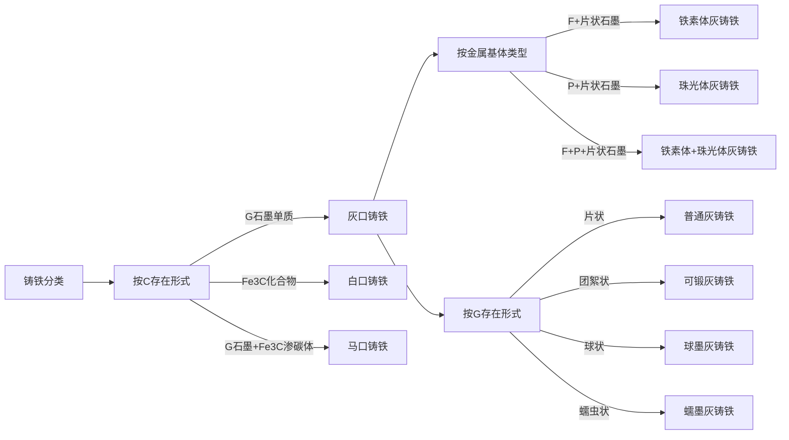
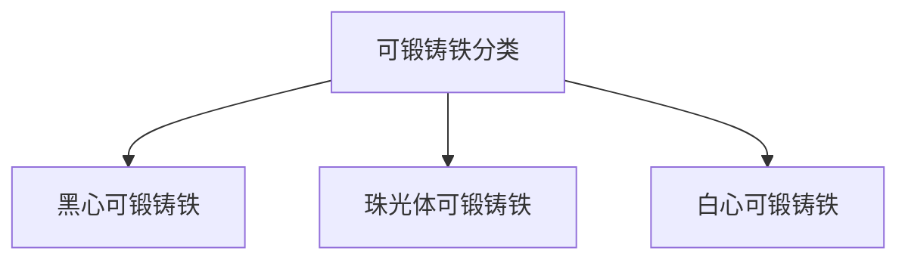
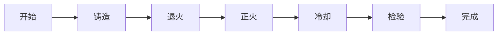
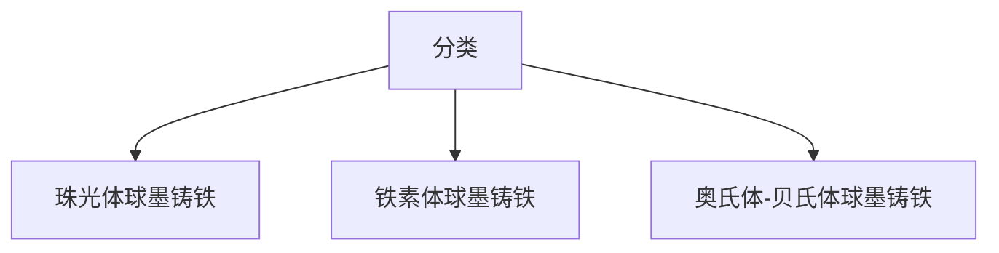
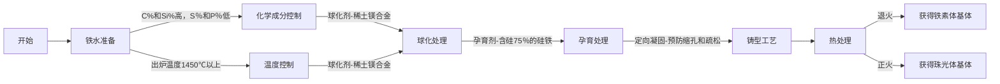
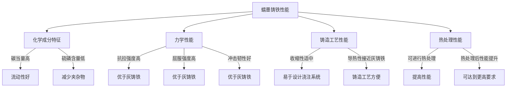
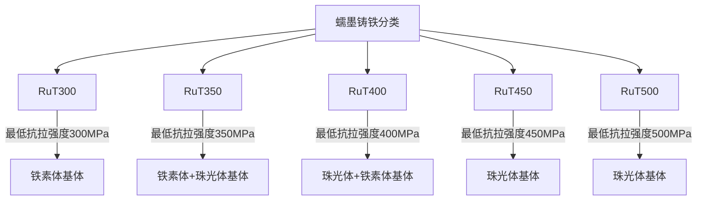
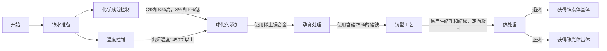

# 第0章 铸造简介
**定义**:    将液态金属浇注到铸型中，待其冷却凝固，以获得一定形状、尺寸和性能的毛坯或零件的成形方法，称为铸造。


## 1. 工艺特点

**优点**：
1. 液态成形，适合形状复杂，尤其是有复杂内腔的毛坯或零件的生产。
2. 适应性广。适应铸铁，碳钢，有色金属等材料；铸件大小，形状和重量几乎不受限制,壁厚0.3mm到1m ；批量不限。
3. 成本较低。

**缺点**：
1. 铸态组织粗大，缺陷多，废品率高。
2. 工人劳动强度大，生产环境恶劣。
3. 铸件机械性能不如锻件。
## 2. 工艺分类

### 沙型铸造

### 特种铸造

# 第一章 制造工艺基础

**概述**：

## 1. 液态合金的充型

### （1）概念

### （2）影响因素


```ad-note
title:影响流动性的因素
1. 
```
#### 1）合金流动性

#### 2）浇筑条件
#### 3）铸型填充条件
### （3）小节总结

## 2. 凝固与收缩

    浇入铸型中的金属液在冷凝过程中，其液态收缩和凝固收缩若得不到补充，铸件将产生缩孔或缩松缺陷。

|  |  |
| ----------------------------------------------------------- | ----------------------------------------------------------- |


### （1）铸件凝固


**凝固种类**


**种类比较**

| 种类  | **a）逐层凝固** | **b）糊状凝固** | **c）中间凝固** |
| --- | ---------- | ---------- | ---------- |
|     |            |            |            |
|     |            |            |            |
|     |            |            |            |
|     |            |            |            |


```ad-note
title:注意
    **铸件质量与其凝固方式密切相关。逐层凝固时，合金的充型能力强，便于防止缩孔和缩松；糊状凝固时，难以获得结晶紧实的铸件。**
```


### （2）铸件收缩

**概念**：

1. **收缩**：合金从浇注、凝固直至冷却到室温，其体积或尺寸缩减的现象，称为收缩。
2. **收缩率**：   
	液态收缩和凝固收缩表现为体积收缩，用体**收缩率**表示。
	固态收缩表现在铸件尺寸上缩减，用**线收缩率**表示。

**过程**:


						常见铁碳合金的体积收缩率


### （3）缩孔和疏松


---

	前面充型、凝固、收缩描述的是一个整的大的过程，而接下来我们研究在这个大的过程中的一些细节问题

---

## 3. 内应力、变形、裂纹

	

#### （1）内应力的形成


#### （2）铸件的变形与防止


#### （3）铸件的裂纹与防止

## 4. 气孔

**简介**：

**分类**：

#### （1）析出性气孔
#### （2）侵入性气孔
#### （3）反应性气孔

**定义**


| 种类     |     |
| ------ | --- |
| **图示** |     |
| **定义** |     |

# 第二章 常用合金件的生产
## 1. 铸铁件生产

**简介**：铸铁是**碳质量分数大于2.11%(亚共晶合金含C最低线)、小于6.69%(Fe3C线)并常含有较多的硅、锰、硫、磷等元素的铁碳合金**。用于制造机床的床身、床头箱，发动机的汽缸体、机器的底座等，是工程上最常用的金属材料之一。

```ad-note
title:分类


| 类别   | C的存在形式          | 特点及用途                                 | **组织图示**                                                    |
| ---- | --------------- | ------------------------------------- | ----------------------------------------------------------- |
| 白口铸铁 | 渗碳体 (Fe₃C)      | 性能硬而脆，难以切削加工。主要用作炼钢原料，高耐磨零件（如轧辊、犁铧等）。 |  |
| 灰口铸铁 | 石墨 (G)          | 铸造性能最好，应用最广泛的铸铁材料。                    |  |
| 麻口铸铁 | 石墨+渗碳体 (G+Fe₃C) | 脆性大，很少使用。                             |  |

| 种类           | 特性                                                                                                                                     | 组织图示                                                                         |
| ------------ | -------------------------------------------------------------------------------------------------------------------------------------- | ---------------------------------------------------------------------------- |
| 铁素体灰铸铁       | - **金属基体**：主要由铁素体组成，铁素体是一种软而韧性好的固溶体。<br>- **性能特点**：具有较好的韧性和塑性，但强度和硬度相对较低。<br>- **应用**：适用于制造承受冲击负荷较小、需要一定韧性的零件，如汽车发动机缸体、机床床身等。          |  |
| 珠光体灰铸铁       | - **金属基体**：由珠光体组成，珠光体是一种由铁素体和渗碳体组成的层状结构，具有较高的强度和硬度。<br>- **性能特点**：强度和硬度较高，但塑性和韧性相对较差。<br>- **应用**：适用于制造承受较高负荷、需要较高强度和硬度的零件，如齿轮、轴承座等。   |  |
| (铁素体+珠光体)灰铸铁 | - **金属基体**：包含铁素体和珠光体的混合组织。<br>- **性能特点**：结合了铁素体和珠光体的优点，具有较好的综合机械性能，即一定的强度和硬度，同时保持较好的韧性。<br>- **应用**：适用于制造承受中等负荷、需要平衡强度和韧性的零件，如曲轴、凸轮轴等。 |  |

				按照金属基体类型划分


|         种类          |                                                                                 特性                                                                                 |                                     组织图示                                     |
| :-----------------: | :----------------------------------------------------------------------------------------------------------------------------------------------------------------: | :--------------------------------------------------------------------------: |
|      **普通灰铸铁**      |                 - **基体**：主要由铁素体和珠光体组成，**石墨呈片状分布。**<br>- **性能特点**：具有较低的强度和韧性，但拥有良好的铸造性能、减震性能和耐磨性。<br>- **应用**：广泛用于制造机床床身、汽缸、箱体等结构件，以及一些不需要承受高负荷的零件。                 |                   |
| **可锻铸铁**(普通铸铁Plus版) |            - **基体**：经过退火处理后，**石墨呈团絮状**，基体组织为铁素体和珠光体的混合。<br>- **性能特点**：具有比普通灰铸铁更高的韧性和塑性，但强度相对较低。<br>- **应用**：适用于制造形状复杂、能承受强动载荷的零件，如汽车、拖拉机后桥壳、转向器壳和管子接头等。            |                   |
|   **球墨铸铁**(五角星战士)   | - **基体**：**石墨呈球状分布**，基体组织可以是铁素体或珠光体，取决于热处理方式。<br>- **性能特点**：具有很高的强度和韧性，接近于碳钢，同时具有良好的耐磨性和疲劳强度。<br>- **应用**：适用于制造承受高负荷、需要高强度和韧性的零件，如汽车、拖拉机、内燃机等的曲轴、凸轮轴，以及通用机械的中压阀门等。 |                   |
|      **蠕墨铸铁**       |                - **基体**：**石墨呈蠕虫状**，基体组织为铁素体和珠光体的混合。<br>- **性能特点**：具有较高的强度，壁厚敏感性较小，铸造性能良好，但韧性略低于球墨铸铁。<br>- **应用**：适用于制造承受中等负荷、需要平衡强度和韧性的零件，如曲轴、凸轮轴等。                |  |

					按石墨存在形态划分
**发现**：
1. 麻口铸铁是介于白口铸铁与灰口铸铁之间的一种材料


**因为按照石墨形式划分的灰铸铁应用的比较广，我们研究接下来了解他们

### （1）普通铸铁

#### 1）类型分类

```ad-note
title:分类


>**注意**：某一类组织可能可以被归类为上述两者中的任意之一，某组织可能既能被归类为**珠光体灰铸铁**也能被归类为**普通灰铸铁**。

#### 2）性能特征

- **显微组织**：金属基体（F铁素体+P珠光体）+片状石墨

- **石墨的影响**：由于**石墨片对钢基体产生的割裂作用**，破坏了钢基体的连续性、完整性，减少了钢基体的有效面积。

1. **机械性能**：

	- 抗拉强度低于钢、而塑性和韧性近于零，属于脆性材料。
	- **抗压强度与钢相近**，因此普通灰铸铁广泛用于作承受压力载荷的零件和结构，如机座、机床床身、轴承等。
	     
2. **工艺性能**：铸造性好、切削加工性好，锻造性差、焊接性差。

3. **其他优良性能**：优良的减震性，耐磨性好，缺口敏感性小。  —— **石墨所赋予**
	
				    
				     床身、底座
				     
	 
	     
						活塞环


#### 2）影响因素


   - **石墨化**：铸铁中碳原子析出并形成石墨的过程称为石墨化。
	   - 
	   - **与铸铁关系**：铸铁组织的类型取决于石墨化的程度。
	   
	   - **来源途径**：
	   
		   1. 从液体和奥氏体($\gamma-Fe+Fe_3C$)中析出
		   2. 可以通过渗碳体分解来获得。
		   
		   - **普通灰铸铁**和**球墨铸铁**中的石墨主要是从液体中析出
		   - **可锻铸铁**中的石墨则完全由白口铸铁经长时间退火，由渗碳体分解而得到。
		   
	   - **影响因素**：化学成分和冷却速度。
		   1. **化学成分**：
			   - 
			   1. **白口铸铁**：这条曲线显示，随着铸铁壁厚的增加，**碳和硅的总含量（Wc+Si）逐渐降低**。
			   2. **麻口铸铁**：这条曲线位于白口铸铁曲线的下方，**表明麻口铸铁的碳和硅含量比白口铸铁高**。    
			   3. **珠光体灰铸铁**：这条曲线显示，随着壁厚的增加，碳和硅的含量也降低，但下降的速率比白口铸铁慢。    
			   4. **珠光体+铁素体灰铸铁**：这条曲线位于珠光体灰铸铁曲线的下方，表明这种铸铁的碳和硅含量比珠光体灰铸铁低。
			   5. **铁素体灰铸铁**：这条曲线显示，随着壁厚的增加，碳和硅的含量逐渐降低，且在所有类型中含量最低。       

		2. **冷却速度**：
				
					
```ad-note
title:总结
1. C和Si强烈促进石墨化
2. Mn可与S反应抵消一部分S的有害作用，增大铸铁的强度。但过多会阻碍石墨化
3. S强烈阻碍石墨化并引起热脆性（< 0.15% )
4. P微弱促进石墨化但引起冷脆性(< 0.3% )
5. 壁厚较大的铸铁部分冷却速度较慢，因此更容易形成含有更多珠光体或铁素体的组织。
6. 越薄的铸铁部分石墨来不及析出，存在形态变成化合物的Fe3C
7. 石墨化有一个中间阶段，类似于过冷奥氏体的冷却转变那样有一个不稳定阶段

```
				


#### 4）孕育处理

- **定义**：经过孕育处理在浇注的铸铁，而普通灰铸铁是直接浇注如铸型形成，**相比后者，前者的强度，温度耐性上升**

- **方法**：
1. 熔炼出含碳（2.7％～3.3％）、硅（1％～2％）的均低的铁水
2. 向出炉铁水中加入**孕育剂（含硅量为75%的硅铁）**，经过孕育处理后再浇注，得到孕育铸铁。

- **作用**：
	1. 孕育铸铁的强度提高（250MPa以上）。
	2. 孕育铸铁对冷却速度不敏感。
	


#### 5）生产牌号

- **定义**：HT+三位数字，数字表示最低抗拉强度

| 类   别      | 牌号          | 用  途  举  例                                                          |
| ---------- | ----------- | ------------------------------------------------------------------- |
| 铁素体灰铸铁     | HTl00       | 低载荷和不重要零件，如盖、外罩、手轮、支架等                                              |
| 铁素体—珠光体灰铸铁 | HT150       | 承受中等应力的零件，如底座、床身、工作台、阀体、管路附件及一般工作条件要求的零件                            |
| 珠光体灰铸铁     | HT200/HT250 | 承受较大应力和较重要的零件，如汽缸体、齿轮、机座、床身、活塞、齿轮箱、油缸等                              |
| 孕育铸铁       | HT300/HT350 | 床身导轨，车床、冲床等受力较大的床身、机座、主轴箱、卡盘、齿轮等，高压油缸、泵体、阀体、衬套、凸轮，大型发动机的曲轴、汽缸体、汽缸盖等 |

							常见灰铸铁特性

#### 6）生产特点

### （2）可锻铸铁

**定义**：可锻铸铁是一种通过热处理过程改善其性能的铸铁材料，**它具有比普通铸铁更好的塑性和韧性**。可锻铸铁的主要特点是在适当的热处理后，其内部的石墨形态从片状转变为团絮状，这种变化显著提高了材料的机械性能。

#### 1）化学成分

#### 2）性能特征


#### 3）类型分类





| **类型**      | 化学成分范围                                                   | 特点                        | 应用领域                                               |
| ------- | -------------------------------------------------------- | ------------------------- | -------------------------------------------------- |
| **黑心可锻铸铁**  | wC=2.2%～2.8%，wSi=1.0%～1.8%，wMn=0.3%～0.8%，wS≤0.2%，wP≤0.1% | 强度不高，但具有良好的塑性和韧性。         | 适用于制造承受冲击和震动的零件，如汽车后桥、弹簧支架、低压阀门、管接头、工具扳手等。         |
| **珠光体可锻铸铁** | wC=2.2%～2.8%，wSi=1.0%～1.8%，wMn=0.3%～0.8%，wS≤0.2%，wP≤0.1% | 具有较高的强度、硬度和耐磨性。           | 常用于制造形状复杂、承受冲击载荷的薄壁件，如汽车凸轮轴、齿轮箱、凸轮轴、曲轴、连杆、活塞环等。    |
| **白心可锻铸铁**  | 较少应用，具体成分未详细列出                                           | 由于可锻化退火时间长而较少应用，强度及耐磨性较差。 | 适于铸造厚度在15mm以下的薄壁铸件和焊接后不需进行热处理的铸件。在机械制造工业上很少应用这类铸铁。 |


							区别对比图


#### 4）生产牌号

铁素体可锻铸铁以“KT”表示，珠光体可锻铸铁以“KTZ”表示。黑心可锻铸铁“KTH”表示。其后的两组数字表示最低抗拉强度和延伸率。

如：KT350-10、KTZ600-3

#### 5）生产特点




	先将铸铁（C2.4%-2.8%Si0.4%-1.4%）浇注成白口铸铁，然后进行高温石墨化退火，使渗碳体分解得到团絮状石墨。

| 生产步骤 | 特点                                 |
| ---- | ---------------------------------- |
| **铸造**   | 将熔融的铁水倒入模具中，形成所需的铸件形状。             |
| **退火**   | 将铸件加热到一定温度并保持一段时间，然后缓慢冷却，以改变石墨的形态。 |
| **正火**   | 将退火后的铸件再次加热到一定温度并快速冷却，以提高硬度和强度。    |
| **冷却**   | 控制冷却速度，以确保铸件达到所需的微观结构和性能。          |
| **检验**   | 对铸件进行质量检验，确保其符合设计要求和标准。            |
| **完成**   | 铸件经过检验合格后，即可用于进一步的加工或直接使用。         |

### （3）球墨铸铁

- **定义**：球墨铸铁是在**铁水浇铸前加入球化剂**（如稀土镁合金）**和孕育剂**（如硅铁或硅钙合金），使得凝固后得到的铸铁中石墨呈球状。
				


- **对比**：

|特性|球墨铸铁|可锻铸铁|
|---|---|---|
|**定义**|球墨铸铁是通过在浇铸前往铁液中加入球化剂和孕育剂，使得石墨呈球状分布的铸铁。|可锻铸铁是将白口铸铁经过石墨化退火处理，使石墨呈团絮状分布的铸铁。|
|**化学成分**|通常含有较高的碳(C)和硅(Si)含量，较低的锰(Mn)含量，对硫(S)和磷(P)的限制较严。|化学成分通常为 wC=2.2%～2.8%，wSi=1.0%～1.8%，wMn=0.3%～0.8%，wS≤0.2%，wP≤0.1%。|
|**机械性能**|具有很高的强度和韧性，抗拉强度高于可锻铸铁，甚至超过碳钢。|具有比灰铸铁更高的强度和塑性，但通常低于球墨铸铁。|
|**生产过程**|需要进行球化处理和孕育处理，以形成球状石墨。|需要经过石墨化退火过程，以改变石墨的形态。|
|**应用领域**|适用于制造受力复杂、承受载荷大的零件，如曲轴、连杆、凸轮轴、齿轮等。|适用于制造形状复杂、工作中承受冲击、振动、扭转载荷的薄壁零件，如汽车、拖拉机后桥壳、转向器壳和管子接头等。|

#### 1）化学成分

球墨铸铁的化学成分通常包括含碳量3.0～4.0%，含硅量1.8～3.2%，以及适量的稀土、镁等球化元素。

    常量元素：wC=3.6%～3.9%，wSi=2.0%～2.8%，保证足够的石墨球化。

    微量元素：wMn=0.6%～0.8%，wS<0.04%，wP≤0.1%, wMg=0.03%～0.05%，提高冲击韧性。

#### 2）性能特征

- **特点**：球墨铸铁通过球化和孕育处理，有效提高了铸铁的机械性能，尤其是塑性和韧性，从而得到比碳钢更高的强度。它能够承受较大的轧制负荷，**并且其综合性能接近于钢和合金钢**。


#### 3）类型分类





#### 4）生产牌号
 用“QT”标明，其后两组数值表示最低抗拉强度和延伸率。
QT420-10、QT600-2、QT800-2

#### 5）生产特点

**1. 生产步骤**

```ad-note


**2. 生产特点**

| 生产步骤 | 特点                                            |
| ---- | --------------------------------------------- |
| 铁水准备 | - 化学成分：C%和Si%高，S％和P％低<br>- 出炉温度：1450℃以上       |
| 球化处理 | - 使用稀土镁合金作为球化剂                                |
| 孕育处理 | - 使用含硅75％的硅铁作为孕育剂                             |
| 铸型工艺 | - 易产生缩孔和缩松<br>- 采用定向凝固技术                      |
| 热处理  | - 包括退火和正火两种类型<br>- 退火可获得铁素体基体<br>- 正火可获得珠光体基体 |

### （4）蠕墨铸铁

**定义**：在一定成分的铁水中加入适量的蠕化剂和孕育剂而炼成的，其方法与程序与球墨铸铁基本相同。

**特点**：蠕墨铸铁的石墨具有介于片状和球状之间的中间形态，其石墨片的长厚比较小，端部较钝，呈蠕虫状。
				

#### 1）化学成分

| 成分      | 范围        |
| ------- | --------- |
| **碳 (C%)**  | 3.4%~3.6% |
| **硅 (Si%)** | 2.4%~3.0% |
| **锰 (Mn%)** | 0.4%~0.6% |
| **硫 (S%)**  | <0.06%    |
| **磷 (P%)**  | <0.07%    |
蠕墨铸铁的碳当量高，这有助于提高其流动性。在碳当量相同的情况下，蠕墨铸铁和灰铸铁的流动性相似。此外，蠕墨铸铁的收缩性介于灰铸铁和球墨铸铁之间

#### 2）性能特征
   
   蠕墨铸铁的导热性、耐热疲劳性高于球墨铸铁，适用于**加大温度梯度**下工作的零件。
   
```ad-note



#### 3）类型分类
```ad-note



#### 4）生产方法

```ad-note




#### 5）生产牌号
蠕墨铸铁以“RuT”表示，其后的数字表示最低抗拉强度。
如： RuT300、RuT420

<table border="1">
  <tr>
    <th>牌号</th>
    <th>最低抗拉强度(MPa)</th>
    <th>典型应用</th>
  </tr>
  <tr>
    <td>RuT300</td>
    <td>300</td>
    <td>排气歧管、涡轮增压器壳体、离合器零部件、大型船用和固定式发动机缸盖等。</td>
  </tr>
  <tr>
    <td>RuT350</td>
    <td>350</td>
    <td>机床底座、托架和联轴器、离合器零部件、大型船用和固定式柴油机缸体和缸盖、铸锭模等。</td>
  </tr>
  <tr>
    <td>RuT400</td>
    <td>400</td>
    <td>材料强度、刚性和热传导综合性能好；较好的耐磨性。</td>
  </tr>
  <tr>
    <td>RuT450</td>
    <td>450</td>
    <td>比RuT400有更高的强度、刚性和耐磨性，不过切削性能稍差。</td>
  </tr>
  <tr>
    <td>RuT500</td>
    <td>500</td>
    <td>强度高，塑韧性低。耐磨性最好，切削性差。</td>
  </tr>
</table>
#### 5）生产特点

<table border="1">
  <tr>
    <th>生产步骤</th>
    <th>特点</th>
  </tr>
  <tr>
    <td>铁水准备</td>
    <td>化学成分控制：C%和Si%高，S％和P％低。温度控制：出炉铁水温度高，1450℃以上。</td>
  </tr>
  <tr>
    <td>球化处理</td>
    <td>使用稀土镁合金作为球化剂，以促进石墨的球化。</td>
  </tr>
  <tr>
    <td>孕育处理</td>
    <td>使用含硅75％的硅铁作为孕育剂，以细化晶粒和改善机械性能。</td>
  </tr>
  <tr>
    <td>铸型工艺</td>
    <td>易产生缩孔和缩松，采用定向凝固技术以减少缺陷。</td>
  </tr>
  <tr>
    <td>热处理</td>
    <td>包括退火和正火两种类型。退火可获得铁素体基体，正火可获得珠光体基体，以提高铸件的机械性能。</td>
  </tr>
</table>


## 2. 铸钢件生产
### （1）铸钢件的类别和性能
### （2）铸钢的生产


## 3. 铜铝合金铸件生产


---

	引言:前面我们介绍了主要的铸铁类型，那么按照循序渐进的原则，我们知道了某一个具体的制造产物的特征，下面我们继续深入了解其制造方法——铸造，以其中的砂型铸造为例
# 第三章 砂型铸造

## 1 . 造型方法的选择


#### （1）手工造型

**定义**

##### 1）方法特点
##### 2）适用范围
##### 3）类型分类

##### 4）起模方法

#### （2）机器造型

**定义**

##### 1）方法特点
填砂、紧砂、起模、合箱等工序的繁重劳动，由机器完成，效率高铸件质量好加工余量小，劳动条件好。

##### 2）适用范围


##### 3）类型分类

按紧砂方法分：震压式造型机，微震压实造型机、高压造型机、射压造机等，

机器造芯有吹芯机或射芯机等。

###### 震压式造型机
###### 微振压实造型机

###### 高压造型机

###### 射压造型机


##### 4）起模方法
除抛砂机外，造型机上都有起模机构：顶箱、落模、反转落箱等。

## 2. 浇注位置和分型面选择

**定义**

**意义**
### （1）浇注位置选择原则
#### 1）工面放置原则

#### 2）平面放置原则

#### 3）薄壁放置原则

#### 4）圆周放置原则

### （2）分型面选择原则

#### 1）最简面放置原则

#### 2）工艺最简化原则

#### 3）下箱大占用原则
## 3. 工艺参数的选择

## 4. 综合分析举例