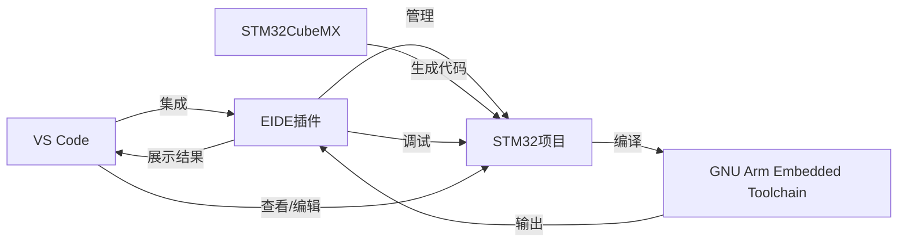

# 三种方法的优缺点
全文导图
1. Cubemx+VScode扩展开发()
2. Keil5+VScode扩展开发(EIDE)
3. PyOCD+VScode扩展开发

### 1. 基于ST官方VSCode扩展的开发环境

**优点：**

- **官方支持：** 由ST官方提供，集成度高，与STM32CubeMX和STM32CubeCLT等工具兼容性好。
- **功能强大：** 支持图形化配置MCU，一键生成项目代码，提升开发效率。
- **易于使用：** 相对于其他环境，搭建过程简单，适合初学者快速上手。
- **插件丰富：** VSCode插件生态丰富，可以扩展许多有用的功能。

**缺点：**

- **依赖特定工具：** 需要STM32CubeMX和STM32CubeCLT等ST官方工具，对于喜欢使用其他工具的开发者可能不太友好。
- **系统要求：** 需要Windows系统，对于Linux或Mac用户可能需要寻找替代方案。

**关系：**
-  **VS Code**：作为核心编辑器和IDE，集成了其他插件。
-  **STM32CubeMX**：用于MCU的图形化配置和代码生成，生成的代码可以直接在VS Code中编辑和维护。
-  **STM32CubeCLT**：提供STM32CubeIDE和STM32CubeMX的命令行工具，包括编译工具链（如GCC）、调试工具（ST-Link）等。
-  **ST-MCU-FINDER-PC**：用于查找和选择STM32系列MCU，辅助CubeMX配置。
- **STM32 VS Code Extension**：作为VS Code的扩展，集成了STM32CubeMX和STM32CubeCLT的功能，使得在VS Code中可以直接进行MCU配置、代码生成、编译、下载和调试。


### 2. 基于EIDE扩展的VSCODE开发环境

**优点：**

- **用户体验好：** 国内开发者开发的插件，用户体验针对国内用户优化。
- **功能全面：** 支持编译、烧录、调试等一体化开发流程。
- **灵活性高：** 支持多种烧录器和调试器，适应不同开发者的需求。

**缺点：**

- **文档和社区支持：** 相比ST官方扩展，可能文档和社区支持不够完善。
- **更新频率：** 由于是第三方开发，更新频率和稳定性可能不如官方插件。

**关系：**
- **VS Code**：作为编辑器和IDE，集成了EIDE插件。
- **EIDE插件**：提供了项目管理、编译、烧录和调试等功能，它内部可能集成或调用了其他工具链和调试器。
- **GNU Arm Embedded Toolchain**：用于编译代码，EIDE插件可能会直接调用该工具链进行编译。
- **烧录器（如JLink或ST-Link）**：用于将编译后的固件烧录到MCU中，EIDE插件提供了烧录器的配置和管理界面。
### 3. 基于VSCode和PyOCD的开发环境

**优点：**

- **跨平台支持：** 支持Windows、Linux和MacOS，适应不同操作系统。
- **开源免费：** PyOCD是开源工具，免费使用，没有版权问题。
- **灵活性：** 可以自由选择编译器和调试器，适合有特定需求的开发者。

**缺点：**

- **配置复杂：** 对于初学者来说，配置环境可能比较复杂，需要一定的学习成本。
- **依赖Python：** 需要Python环境，对于不喜欢使用Python的开发者可能不太方便。

**关系：**
- **VS Code**：作为编辑器和IDE，需要安装额外的插件来支持C/C++开发和调试。
- **Arm GNU Toolchain**：用于编译STM32代码，VS Code通过Makefile或C/C++插件调用该工具链进行编译。
- **Make for Windows**：在Windows上提供make命令，用于执行Makefile，与Arm GNU Toolchain协同工作。
- **Python**：作为PyOCD的运行环境，PyOCD依赖Python。
- **PyOCD**：用于固件下载和GDB调试，它可以通过GDB与VS Code的Cortex-Debug插件集成，实现调试功能。


### 4. 方案抉择

**目的**
- 简单、轻量、易上手
- 使用到的工具尽可能少

>最终选择了EIDE方案，但是仍然下载了CubeMX用于创建STM32工程。他们之间的相互作用如下

```ad-note



#  搭建基于ST官方VSCode扩展的STM32开发环境
[原文链接](https://shequ.stmicroelectronics.cn/thread-643922-1-1.html)
本文将介绍如何在Windows系统上搭建基于ST官方VSCode扩展的STM32开发环境，相对基于VSCode+PyOCD的开发环境，基于ST官方VSCode扩展的开发环境搭建更容易一些，功能也更强大。本文部分章节以STM32H7S7L8HxH MCU为例，但全文介绍的方法适用于大部分STM32 MCU，对于其他型号的STM32 MCU，仅少量步骤调整即可。

本文将介绍如何在Windows系统上搭建基于VSCode的STM32开发环境，具体包括如下软件：

- **VS Code**，用于编辑源代码文件，以及集成其他插件作为集成开发环境（IDE）；
- **STM32CubeMX**，用于修改配置，以及生成代码；
- **STM32CubeCLT**，STM32Cube命令行工具；
- **ST-MCU-FINDER-PC**，ST MCU查找工具；

此前，我也搭建过基于VSCode+PyOCD的开发环境，相比使用ST官方VSCode扩展的方式，需要下载更多软件，搭建过程更复杂。感兴趣的可以去看看，文章链接： [https://blog.csdn.net/xusiwei1236/article/details/140412638](https://blog.csdn.net/xusiwei1236/article/details/140412638)

相对来说，基于ST官方VSCode扩展的开发环境搭建更容易一些，功能也更强大一些。

本文部分章节以STM32H7S7L8HxH MCU为例，但全文介绍的方法适用于大部分STM32 MCU，对于其他型号的STM32 MCU，仅少量步骤调整即可。

## 一、安装软件

### 1.1 安装VSCode

VSCode是一个强大且开放的代码编辑器，支持众多编程语言（C、C++、Java、Python等等），以及各种插件。VSCode的插件生态非常丰富，这也是目前VSCode非常受大家欢迎的一个重要原因。

下载页面： [https://code.visualstudio.com/Download](https://code.visualstudio.com/Download)

VSCode可以直接下载，不需要注册。安装没啥难度，不再赘述。

### 1.2 安装STM32CubeMX

STM32CubeMX 实现了图形化方式配置STM32 MCU的引脚功能、时钟速率、中间件等等功能，并且可以一键生成整个项目的代码。STM32CubeMX 的这些功能，极大的提升了开发效率，对于产品项目的原型开发，以及DIY爱好者进行电子制作非常有吸引力。

下载页面： [https://www.st.com.cn/zh/development-tools/stm32cubemx.html](https://www.st.com.cn/zh/development-tools/stm32cubemx.html)

ST官网需要注册之后，才能下载。安装没啥难度，不再赘述。

### 1.3 安装STM32CubeCLT

STM32CubeCLT官方的介绍是：

> Toolset for third-party integrated development environment (IDE) providers, allowing the use of STMicroelectronics proprietary tools within their own IDE frameworks.
> 
> 面向第三方集成开发环境（IDE）提供商的工具集，允许在其自己的IDE框架中使用STMicroelectronics的专有工具。

下载页面： [https://www.st.com.cn/zh/development-tools/stm32cubeclt.html](https://www.st.com.cn/zh/development-tools/stm32cubeclt.html)

ST官网需要注册之后，才能下载。安装没啥难度，不再赘述。

这里补充说明一下，本人安装之后发现，STM32CubeCLT安装目录内包含了一下软件：

- CMake，跨平台构建工具，用于支持STM32CubeMX生成CMake项目的编译构建；
- Ninja，一种轻量级的构建工具，用于支持STM32CubeMX生成CMake项目的编译构建；
- GNU ARM交叉编译工具链（arm-none-eabi-gcc），用于将C/C++源代码编译为STM32平台的二进制代码；
- STLink USB驱动，用于支持ST-Link调试器，安装之后系统才可以正常识别ST-Link；
- STLink-gdb-server，用于支持通过ST-Link调试STM32 MCU；
- STM32 Programmer CLI，命令行界面的STM32下载工具，用于将固件下载到STM32 MCU的内部flash中；

其中，前三个工具（CMake、Ninja、arm-none-eabi-gcc）用于支持编译，中间两个（STLink USB驱动，STLink-gdb-server）用于支持调试，最后一个（STM32_Programmer_CLI）用于支持下载。

### 1.4 安装ST-MCU-FINDER-PC

ST-MCU-FINDER-PC是 用于个人电脑的STM32和STM8产品查找工具。

下载页面：[https://www.st.com.cn/zh/development-tools/st-mcu-finder-pc.html](https://www.st.com.cn/zh/development-tools/st-mcu-finder-pc.html)

ST官网需要注册之后，才能下载。安装没啥难度，不再赘述。

## 二、安装插件

安装完以上软件后，还需要安装一些VSCode插件，具体有：

- STM32 VS Code Extension

### 2.1 安装 STM32 VS Code Extension

VSCode需要安装的插件STM32 VS Code Extension，直接在插件栏搜索即可找到，安装即可。

需要注意的是，这个插件本身依赖另外几个插件，如下图所示：  这几个插件的作用分别为：

- **C/C++ Extension Pack**，用于支持C/C++语法高亮、代码提示；
- **Arm Assembly**，用于支持ARM汇编的语法高亮、代码提示；
- **LinkerScript**，用于支持链接脚本的语法高亮、代码提示；
- **GNU Linker Map files**，用于支持生成的.map文件的代码高亮；
- **Hex Editor**，用于支持以十六进制显示并编辑二进制文件；
- **Cortex-Debug**，用于支持Arm Cortex-M内核MCU的调试；

完成以上软件和插件的安装，基于ST官方VSCode扩展的STM32开发环境已经搭建完成了！

## 三、创建项目

接下来，我们创建一个简单的点灯程序，验证一下刚刚搭建的开发环境是可以正常使用的。

### 3.1 创建STM32CubeMX项目

1. 首先打开STM32CubeMX，通过菜单File→New Project打开新建项目窗口，在弹出的界面中选择“Board Selector”标签页： 
	
						图3-1-1：软件开始界面
	
						图3-1-2：MCU选择界面
    - 在Commercial Part Number栏中输入H7S7，并回车；
    - 在MCUs/MPUs List下方选中Board列有STM32H7S78-DK的一行；
    - 点击右上角Start Project按钮；
    - 弹出MPU设置的话框，选择Yes；
3. 然后STM32CubeMX进入配置界面，切换到Clock Configuration标签页，将To CPU Clocks修改为600并回车，CubeMX软件将会自动计算其他参数： 
4. 按Ctrol+S保存，选择适当的位置保存ioc文件。

这样CubeMX项目就创建好了。

### 3.2 查阅原理图

STM32H7S78-DK开发板原理图，下载链接为： [st.com.cn/resource/en/schematic_pack/mb1736-h7s7l8-d01-schematic.pdf](https://www.st.com.cn/resource/en/schematic_pack/mb1736-h7s7l8-d01-schematic.pdf)

打开原理图后，可以在Sheet 15: Peripherals页面找到如下LED部分：  图中，可以看到四个LED的控制引脚分别为：

- GREEN： PO1
- ORANGE： PO5
- RED： PM2
- BLUE： PM3

另外，查阅用户手册，可以知道这几个LED位于开发板正面的屏幕的左下角： 

### 3.3 修改引脚功能

找到以上LED引脚后，在STM32CubeMX软件的Pinout View中，可以通过搜索框，找到以上几个引脚，并通过下拉菜单将其设置为GPIO_Output功能： 

四个LED控制引脚设置完成后，通过左侧的Categories->System Core->GPIO也可以看到：  图中，左侧System Core下方有三列复选框Boot、Application、ExtMemLoader，用于为相应的子项目（Boot、Appli、ExtMemLoader）生成外设初始化代码。

为了后续编写代码时，方便区分哪个Pin控制了哪个LED，可以为以上几个Pin设置User Label（用户标签）。设置User Label后，例如给PO1设置User Label为LD1，生成的代码中将会生成相应的宏定义，编写代码时更方便。

对于以上四个LED控制引脚，需要将Pin Context Assignment修改为Boot，User Label修改为和板子丝印对应的： LD1、LD2、LD3、LD4，如下图： 

Pin Context Assignment修改为Boot是因为——为了简单起见，我们暂时只生成一个Boot子项目（虽然bootflash不大，但是点灯的代码也够用了）。

### 3.4 生成CMake项目

CubeMX中完成引脚功能修改后，切换到Project Manager标签页，Project设置部分，取消Appli Project复选框，Toolchain/IDE选择CMake，如下图： 

接着，切换到Code Generator设置，选中Generate peripheral initialization as a pair of ‘.c/.h’ per peripheral，如下图：  此时，点击CubeMX界面右上角位置的“GENERATE CODE”，将开始生成代码到项目目录内，并显示进度： 

生成完成后，将会弹出对话框提示： 

点击Open Folder打开目录，可以看到生成的文件和目录如下图： 

到这里，使用CubeMX创建项目完成了。

## 四、编辑/编译/下载/调试

接下来就要使用VS Code和STM32 VS Code Extension插件，进行开发体验了。通常我们开发过程中，需要不断重复的几个动作是： 编辑代码、编译构建、下载固件、断点调试。

### 4.1 导入项目

打开VSCode，侧边栏点击STM32 VS Code Extension插件图标，可以看到插件的项目管理（Project Manager）菜单：  选择Import CMake project菜单，在弹出的文件目录浏览对话框中，选择刚刚CubeMX生成的目录，如下图：  此时，点击“选择文件夹”，VSCode中将会弹出确认导入的对话框：  此时，点击Import project，VSCode右下角弹出确认对话框： 

选择Open in this window，在当前VS Code窗口中打开项目。

此时，弹出配置预设选择对话框，选择Debug即可： 

选择配置预设类型之后，可以看到输出栏有如下输出： 

这些输出表示，已经根据CMake文件（CMakeLists.txt）生成了Ninja构建构建规则文件（build.ninja），具体位于build/Debug子目录。

导入完成后，项目目录内会生成.vscode目录，里面会有一些配置文件。

### 4.2 修改设置

默认情况下，导入的VS Code代码之后，打开C代码会有一些红线： 

例如，这里的 "main.h" 显示红线。

这个问题是VS Code的C/C++插件的智能提示（IntelliSense）没有成功找到main.h。

这个问题不只是会显示红线，而且会影响VS Code的代码提示。因此，如果不解决这个问题，使用VS Code编写代码的效率会大打折扣！

打开 c_cpp_properties.json （或者图形化修改C/C++配置），将其内容修改为：

```json
{
    "version": 4,
    "configurations": [
        {
            "name": "STM32",
            "configurationProvider": "ms-vscode.cmake-tools",
            "intelliSenseMode": "windows-gcc-arm",
            "compilerPath": "D:/ST/STM32CubeCLT_1.16.0/GNU-tools-for-STM32/bin/arm-none-eabi-gcc.exe",
            "includePath": [
                "${workspaceFolder}/Boot/Core/Inc",
                "${workspaceFolder}/Drivers/STM32H7RSxx_HAL_Driver/Inc",
                "${workspaceFolder}/Drivers/STM32H7RSxx_HAL_Driver/Inc/Legacy",
                "${workspaceFolder}/Drivers/CMSIS/Device/ST/STM32H7RSxx/Include",
                "${workspaceFolder}/Drivers/CMSIS/Include"
            ]
        }
    ]
}
```

其中，compilerPath 使用STM32CubeCLT安装目录下的arm-none-eabi-gcc，includePath 列表内容需要 参考 Boot\mx-generated.cmake 文件中的 target_include_directories 的内容。

### 4.3 修改代码

打开Boot\Core\Src\main.c文件，文件开头Private includes下方修改为：  找到其中的main函数中的while循环，将其修改为：  以上两处代码修改，实现了控制四个LED的闪烁。

### 4.4 编译代码

完成以上代码修改后，点击VS Code的CMake Tools插件图标，在项目大纲中点击“生成”按钮，将会开始编译构建： 

生成完成后，可以在输出视图看到生成了elf文件，以及RAM和Flash占用情况： 

### 4.5 下载固件

编译完成后，就可以准备下载固件了。

还是在VS Code的CMake Tools插件菜单，找到 固定的命令-> 运行任务 右侧的运行命令图标，点击该图标： 

将会弹出”选择要运行的任务“对话框，选择CubeProg: Flash Boot即可开始下载固件： 

下载完成，可以在输出区域看到下载过程耗时： 

### 4.6 设置调试

默认导入的项目已经创建了调试配置文件，位于.vscode/launch.json，但生成的是外置存储启动的调试设置，不适用于我们现在的Boot项目。

因此需要手动添加一个调试设置，接下来描述如何添加调试设置。

首先在VSCode中打开 .vscode/launch.json 文件，点击右下角的”添加配置“按钮，将会生成配置选择列表： 

选择Cortex Debug: ST-LINK，将会生成新的配置代码段： 

接着，将这个配置代码段修改为：

```json
{
            "cwd": "${workspaceFolder}",
            "executable": "${command:STM32VSCodeExtension.bootFlashBootTarget}",
            "name": "Debug Boot Project with ST-Link",
            "device": "STM32H7S7L8HxH", //MCU used
            "svdFile": "${config:STM32VSCodeExtension.cubeCLT.path}/STMicroelectronics_CMSIS_SVD/STM32H7S.svd",
            "serverpath": "${config:STM32VSCodeExtension.cubeCLT.path}/STLink-gdb-server/bin/ST-LINK_gdbserver",
            "stm32cubeprogrammer":"${config:STM32VSCodeExtension.cubeCLT.path}/STM32CubeProgrammer/bin",
            "stlinkPath": "${config:STM32VSCodeExtension.cubeCLT.path}/STLink-gdb-server/bin/ST-LINK_gdbserver",   
            "armToolchainPath": "${config:STM32VSCodeExtension.cubeCLT.path}/GNU-tools-for-STM32/bin",
            "gdbPath":"${config:STM32VSCodeExtension.cubeCLT.path}/GNU-tools-for-STM32/bin/arm-none-eabi-gdb",
            "v1": false,               //Change it depending on ST Link version
            "serverArgs": [
                "-m","1",
            ],
            "request": "launch",
            "type": "cortex-debug",
            "runToEntryPoint": "main",
            "showDevDebugOutput": "none",
            "servertype": "stlink"
        },
```

### 4.7 断点调试

打开main.c文件， 在循环内添加断点： 

切换到VS Code的调试标签，确认调试配置是刚刚添加的，如果不是可以通过下拉菜单选择；然后点击”开始调试“即可启动调试： 

稍等片刻，可以看到已经成功启动调试了： 

按下F5，可以跳转到刚刚打下的断点处：  通过顶部的几个悬浮按钮，就可以进行断点调试的常用操作了。

## 五、参考链接

1. STM32 公众号推文《全新STM32 VS Code扩展V2.1.0发布》： [https://mp.weixin.qq.com/s/rP4aHoTdbVL5ZaArqYosdA](https://mp.weixin.qq.com/s/rP4aHoTdbVL5ZaArqYosdA)
2. ST官网文章《使用面向VS Code的STM32扩展简化您的开发过程》： [https://www.st.com.cn/content/st_com/zh/campaigns/stm32-vs-code-extension-z11.html](https://www.st.com.cn/content/st_com/zh/campaigns/stm32-vs-code-extension-z11.html)
3. STM32CubeMX下载页面： [https://www.st.com.cn/zh/development-tools/stm32cubemx.html](https://www.st.com.cn/zh/development-tools/stm32cubemx.html)
4. STM32CubeCLT下载页面： [https://www.st.com.cn/zh/development-tools/stm32cubeclt.html](https://www.st.com.cn/zh/development-tools/stm32cubeclt.html)
5. ST-MCU-FINDER-PC下载页面：[https://www.st.com.cn/zh/development-tools/st-mcu-finder-pc.html](https://www.st.com.cn/zh/development-tools/st-mcu-finder-pc.html)
6. VSCode下载页面： [https://code.visualstudio.com/Download](https://code.visualstudio.com/Download)


# 搭建基于EIDE扩展的VSCODE下的STM32开发环境

==**请注意本文撰写时间(2022-1-6)，目前EIDE插件一直在跟新中，其内容可能会于本文有所出入，请以官方手册为主**==

EIDE（全称Embedded IDE）是国内的一个大佬开发的vscode插件，本人用下来体验非常好，因此在这里分享给大家，这是这个插件的[官方论坛](https://discuss.em-ide.com/t/embedded-ide)和[官方手册](https://docs.em-ide.com/#/)  
本篇文章只会提一些基本的使用，而且也只是针对基于有CUBEMX的STM32，如果想要开发其他单片机详细的还是得参考手册

_本篇文章是给有基础的人看的，vscode的基本使用在这里不会详细展开，一些地方会讲的比较粗略，如果有不懂的概念请自行查找资料_

如果你不喜欢vscode而是喜欢JetBrain家的Clion，也可以参考大佬的[这篇文章](https://zhewana.cn/2021/c69c321f18aa/)

那么我们正式开始

## 一、安装GNU Arm Embedded Toolchain

**链接**：[armDeveloper](https://developer.arm.com/downloads/-/gnu-rm)

**目的**：根据自身平台下载对应的工具链
	1. Windows：[**gcc-arm-none-eabi-10.3-2021.10-win32.exe**](https://developer.arm.com/-/media/Files/downloads/gnu-rm/10.3-2021.10/gcc-arm-none-eabi-10.3-2021.10-win32.exe?rev=29bb46cfa0434fbda93abb33c1d480e6&hash=3C58D05EA5D32EF127B9E4D13B3244D26188713C)
	2. Linux：[**gcc-arm-none-eabi-10.3-2021.10-x86_64-linux.tar.bz2**](https://developer.arm.com/-/media/Files/downloads/gnu-rm/10.3-20[**gcc-arm-none-eabi-10.3-2021.10-aarch64-linux.tar.bz2**](https://developer.arm.com/-/media/Files/downloads/gnu-rm/10.3-2021.10/gcc-arm-none-eabi-10.3-2021.10-aarch64-linux.tar.bz2?rev=b748c39178c043b4915b04645d7774d8&hash=572217C8AFE83F1010753EA3E3A7EC2307DADD58)21.10/gcc-arm-none-eabi-10.3-2021.10-x86_64-linux.tar.bz2?rev=78196d3461ba4c9089a67b5f33edf82a&hash=D484B37FF37D6FC3597EBE2877FB666A41D5253B)
			[**gcc-arm-none-eabi-10.3-2021.10-aarch64-linux.tar.bz2**](https://developer.arm.com/-/media/Files/downloads/gnu-rm/10.3-2021.10/gcc-arm-none-eabi-10.3-2021.10-aarch64-linux.tar.bz2?rev=b748c39178c043b4915b04645d7774d8&hash=572217C8AFE83F1010753EA3E3A7EC2307DADD58)
	3. Mac：[**gcc-arm-none-eabi-10.3-2021.10-mac.pkg**](https://developer.arm.com/-/media/Files/downloads/gnu-rm/10.3-2021.10/gcc-arm-none-eabi-10.3-2021.10-mac.pkg?rev=b382d51ec8d34c3fa421cf57ce97f146&hash=E3B897C8DA0E3E56C151F397C004104F00AE2EB8)
	

**操作**：


## 二、安装vscode

这也是有手就行

注意点是安装的时候记得把下面几个选项打开  
[](https://img2020.cnblogs.com/blog/2702372/202201/2702372-20220106152721430-1125632006.png)  
确保自己的对着文件夹空白处的右击菜单里面有`通过code打开`这个选项就行

## 三、安装EIDE插件和一些辅助性插件

打开vscode，在左边的Extensions栏（或者按Ctrl+Shift+X）里面可以搜索你想要的插件并安装  
搜索EIDE，找到我们的主角，然后Install即可

[](https://img2020.cnblogs.com/blog/2702372/202201/2702372-20220106153935430-996767463.png)  
我这里是因为已经安装过了所以没有Install的按钮

其他的一些插件：

- C/C++
- C++ Intellisense
- Visual Studio IntelliCode
- Cortex-Debug _在debug的时候会用到_
- Git Graph _和vscode自带的git支持一起用会很方便_
- LinkerScript _提供链接脚本语法高亮_
- BracketPair Colorizer2 _彩虹括号，用了都说好_
- 一些主题配色和图标什么的，可以网上看看推荐，我是喜欢默认黑
- background-cover _给你的vscode配上背景图片，可以把你的老婆当背景什么的_

## 四、EIDE插件的初始配置以及了解项目结构

### 4.1 插件配置

#### 4.1.1 配置工具链

如果EIDE插件安装成功的话vscode会在左侧栏多出一个选项：  
[](https://img2020.cnblogs.com/blog/2702372/202201/2702372-20220106155650507-630278585.png)  


点进去会发现一共有上下两栏
					
						图4-1-1：EIDE扩展界面

我们选择下面的OPERATIONS，然后点击Set ToolChain Path，在弹出的选项中选择：](https://img2020.cnblogs.com/blog/2702372/202201/2702372-20220106155916327-780597507.png)  

接着选择offline，然后选择你的armgcc工具链安装路径即可，设置成功之后你再次打开这个选项菜单他就会和上面一样打勾


>>>
	图4-1-1：配置好8bit compiler-Keil5以及GCC Family compiler的Toolchain菜单
#### 4.1.2 配置烧录器


					图4-2-1-1：Setup Utility Tools条目一览

**集成工具条目解读**

**buit-in：**
 **编译器和工具链**
	- **GNU Arm Embedded Toolchain (stable)**: 提供用于ARM架构的编译工具。
	- **RISC-V GCC Toolchain**: 提供用于RISC-V架构的编译工具。
	- **Small Device C Compiler (SDCC) (latest version)**: 专为小型嵌入式系统设计的C编译器。
	-  **Arm C Compiler V5.06u7 (ARMCC) (Cracked)**: ARM公司提供的商业C编译器的破解版本，使用非法且不安全。

 **调试和编程工具**
	- **JLink (v6.90)**: SEGGER公司的调试器，用于ARM和其他核心的调试和编程。
	- **OpenOCD Programmer (v0.12.0-rc2)**: 开源的调试和编程工具，支持多种微控制器架构。
	- **STM32 Cube Programmer CLI**: STM32微控制器的编程和调试工具。
	- **STM32 Flasher For STM8**: STM8系列微控制器的闪存编程工具。

 **代码分析和检查工具**
	- **Cppcheck (Code Inspection)**: 用于C/C++代码的静态分析，帮助识别代码中的错误和不良编程实践。

**在线安装**

>此处我们选择按照Jlink包即可，因为Jlink支持对公版ARM内核的核心调试，选择后耐心等待插件安装，待下载完成后会自动唤起安装界面。优点在于比较傻瓜，缺点在于直接安装在C盘


**离线安装**


					图4-2-1-2：Jlink路径属性项

**链接：**[SEGGER - The Embedded Experts - Downloads - J-Link / J-Trace](https://www.segger.com/downloads/jlink/)

我这里是用的Jlink做烧录器，如果要用其他的烧录器自己想办法去~  
点击`Open plug-in Settings`，进入插件配置页，找到Jlink，填入JLink的安装路径即可


### 4.2 了解项目结构

下文摘自[官方文档](https://docs.em-ide.com/#/zh-cn/prepare_work?id=%e4%ba%86%e8%a7%a3%e9%a1%b9%e7%9b%ae%e7%bb%93%e6%9e%84)

**项目文件**：

- `.eide` eide项目文件夹，存放eide项目信息，日志等文件
- `.vscode`vscode配置文件目录
- `build`编译默认输出目录，可以在项目的设置中修改
- `pack`芯片支持包的安装位置 _本篇教程不会涉及_
- `*.code-workspace`vscode工作区文件，这对于eide项目是必须的

**用户文件**：  
即项目文件以外的文件或文件夹

## 五、正式开始搭建工程

### 5.1 EIDE新建工程

打开vscode，进入左边EIDE一栏

选择下面OPERATIONS栏里的`New Project`，接着选择`Empty Project`，32是cortex内核的所以选择`Cortex-M Project`

然后会让你选择文件夹，选择你平时放代码的文件夹即可，之后在右下角弹出来的窗口中确认，vscode就会自动进入该工作区

因为我们通过STM32CUBEMX生成代码所以这里把自动生成的src文件夹删除

### 5.2 用STM32CUBEMX生成代码

这个大家都会，我就不赘述了

==需要注意的是Toolchain/IDE选项务必选择Makefile==

这个时候你的项目大概是长这样的：  
[](https://img2020.cnblogs.com/blog/2702372/202201/2702372-20220106162351192-1974649723.png)

### 5.3 配置EIDE项目

进入vscode的左边EIDE一栏，在上面的EIDE PROJECTS里面可以找到我们的项目了  
我们展开它，发现有很多需要配置，我们一步步来  
[](https://img2020.cnblogs.com/blog/2702372/202201/2702372-20220106162507570-637593995.png)

#### 5.3.1 源文件目录设置

鼠标停留在Project Resources一栏，会有一个文件夹以及绿色加号的图标，我们点击它可以新建源文件目录，有虚拟文件夹和普通文件夹两个选项，意思看它下面的注释就能理解了

我们打开Makefile文件，找到`C_SOURCES`那一栏，对照着把文件夹补齐（我习惯是用普通文件夹的）  
然后根目录下的.s文件也是要加进去的，我的习惯是建一个虚拟文件夹放进去（在右键菜单里面可以添加文件）

这个时候你的配置大概是这样：  
[](https://img2020.cnblogs.com/blog/2702372/202201/2702372-20220106163420766-690309244.png)

#### 5.3.2 设置编译器选项

在那个Builder Configurations那一栏选择arm-gcc工具链

然后展开的选项里面：  
`CPU Type`：你单片机什么内核就选什么  
`Linker Script File Path`：选择根目录下的.ld文件  
`Builder Options`：照着makefile里面改就行，不过32的话我试下来不改也没大事

设置完成大概是这样：  
[](https://img2020.cnblogs.com/blog/2702372/202201/2702372-20220106163851433-1889673296.png)

#### 5.3.3 设置烧录器

选择你的烧录器，我这里是用的Jlink，如果用其他的烧录器就选其他的，也可以选择Openocd，但是这里不对Openocd做介绍，如有需要自行了解

展开来的选项里面`CPU Name`：选择你的单片机型号

设置完成就这样：  
[](https://img2020.cnblogs.com/blog/2702372/202201/2702372-20220106164126919-1473255226.png)

#### 5.3.4 项目属性

`Include Directories`：头文件包含目录，照着makefile中的`C_INCLUDES`添加即可  
`Library Directorise`：库目录  
`Proprocessor Definitions`：预定义，也是跟着makefile来

完毕之后是这样  
[](https://img2020.cnblogs.com/blog/2702372/202201/2702372-20220106165232967-1677953501.png)

#### 5.3.5 项目设置

基本不需要动

---

到此为止，项目已经搭建完成

## 六、编译和烧录！

打开项目里面随便一个文件，右上角的Build按键即编译，然后一个向下的箭头即烧录  
如果出错了就根据报错找找原因，也翻翻上面有没有遗漏的步骤

## 七、调试

_gdb是不能调试keil编译的工程的，所以如果你eide插件调用的是keil进行的编译那就没法用下面这个方式调试_

这里会需要vscode的另外一个插件——Cortex-Debug  
[](https://img2020.cnblogs.com/blog/2702372/202201/2702372-20220116135304835-1434509670.png)  
这个插件支持不少的debug方式，主流的是用openocd，但是我自己是在用jlink，所以这里用的是JlinkGDBServer的调试方式。如果你是其他的link的话可以参考其他的文章，比如[这个](https://discuss.em-ide.com/blog/67-cortex-debug)

### 7.1 设置gdb路径

在vscode的设置中搜索`arm toolchain path`然后应该能看到这一个选项  
[](https://img2020.cnblogs.com/blog/2702372/202201/2702372-20220116141524415-982412641.png)  
点击`Edit in settings.json`然后像这样添加一行指定你的路径即可  
[](https://img2020.cnblogs.com/blog/2702372/202201/2702372-20220116141617851-2048346648.png)

### 7.2 设置你的jlinkGDBserver路径

在vscode的设置中搜索jlink，应该能看到这一个选项：  
[](https://img2020.cnblogs.com/blog/2702372/202201/2702372-20220116141112976-205703657.png)  
点击`Edit in settings.json`然后添加向我这样的一样就行  
[](https://img2020.cnblogs.com/blog/2702372/202201/2702372-20220116141247211-1061554459.png)

### 7.3. 设置launch.json

我们打开`.vscode`文件夹，可以看到类似下面的配置：  
[](https://img2020.cnblogs.com/blog/2702372/202201/2702372-20220116144530564-1901953247.png)

下面介绍一下上面几个参数的含义

- `cwd`:current working directory
- `type`:调试器类型，这里我们要调试单片机就必须得是cortex-debug
- `name`:这个任务的名字，可以自己取
- `servertype`:根据你用的进行选择，这里我用的是jlink，如果是openocd的改成openocd即可
- `interface`:你的调试接线方式
- `executable`:二进制文件
- `device`:你的设备
- `svdFile`:system view description，这个可有可无，是用来在debug时看寄存器值的，想要有的话可以去st官网找，不过其他的单片机就可能不会公开svd文件了

上面大部分的内容都是插件自动帮你填好的，有缺的可以自己添添补补

### 7.4 正式开始调试！

按`F5`就可以开始调试了，或者点开左边栏的RunAndDebug栏然后开始也一样  
总的界面就大概像下面这样  
[](https://img2020.cnblogs.com/blog/2702372/202201/2702372-20220116152031300-1080877619.png)  
左边可以看变量、寄存器值等，打断点之类的也是一切正常

## 八、打包一个模板并根据模板来生成新工程

前面一通操作不得不说还是要点时间的，而eide十分贴心的做了一个打包模板的功能，我们可以直接打包一份模板，以后可以基于这个模板新建工程，就不会有这么多准备工作去做了！

### 8.1 生成模板

实际操作就是在左边栏进入eide的界面，右击你的项目，点击export eide project template，他就会在根目录下生成一个ept文件  
[](https://img2020.cnblogs.com/blog/2702372/202201/2702372-20220116152700502-289816962.png)

### 8.2 根据模板创建工程

在eide创建工程的时候选择Local Template，然后选择你刚生成的那个ept文件即可  
其他操作看着指示来就行


# 搭建VSCode+PyOCD的STM32开发环境

本文将介绍如何在Windows系统上搭建基于VSCode和PyOCD的开发环境，具体包括如下[软件](https://marketing.csdn.net/p/3127db09a98e0723b83b2914d9256174?pId=2782?utm_source=glcblog&spm=1001.2101.3001.7020)：

- STM32CubeMX，用于修改配置，以及生成代码；
- VSCode，用于编辑源代码文件；
- Arm GNU Toolchain，用于源代码编译为目标文件；
- Make for Windows，用于根据Makefile调用编译命令；
- Python，PyOCD依赖Python，需要先安装；
- PyOCD，用于固件下载，以及gdb调试；

标题为了简短只写了VSCode和PyOCD，实际上需要使用以上六个软件。

本文部分章节以STM32U083RC为例，由于PyOCD可以支持的MCU类型非常多；因此该方法不仅仅只适用于这一款MCU，而是适用于所有STM32的MCU（凡是PyOCD命令能够找到支持包的CMU均可以支持）。由于VSCode和PyOCD等软件都是跨平台的，因此本文介绍的方法同样适用于Linux系统和MacOS系统，仅需少量步骤调整。

### 一、安装软件

接下来介绍如何安装上述六个软件，如果部分软件你已经安装了，则可以跳过相关介绍。

#### 1.1 安装STM32CubeMX

下载页面： [https://www.st.com.cn/zh/development-tools/stm32cubemx.html](https://www.st.com.cn/zh/development-tools/stm32cubemx.html)

ST官网需要注册之后，才能下载。

#### 1.2 安装VSCode

下载页面： [https://code.visualstudio.com/Download](https://code.visualstudio.com/Download)

VSCode可以直接下载，不需要注册。

#### 1.3 安装Arm GNU Toolchain

**Arm GNU Toolchain 10.3-2021.10版本**下载页面：[https://developer.arm.com/downloads/-/gnu-rm](https://developer.arm.com/downloads/-/gnu-rm)

最新的版（13.3）下载页面： [https://developer.arm.com/downloads/-/arm-gnu-toolchain-downloads](https://developer.arm.com/downloads/-/arm-gnu-toolchain-downloads)

10.3 或者 13.3 都可以，实测发现10.3生成的代码体积稍微小一点点，都可以运行。

下载exe或者zip解压都可以，需要注意的是：

- exe安装过程中需要勾选添加到PATH环境变量；
- zip解压后，需要手动将arm-none-eabi-gcc.exe所在目录添加到PATH环境变量；

安装完成后，打开新的cmd窗口，执行如下命令：

```bash
arm-none-eabi-gcc --version
```

命令输出类似如下版本信息，即表示PATH环境变量配置成功：


#### 1.4 安装Make for Windows

Make for Windows下载页面：[https://gnuwin32.sourceforge.net/packages/make.htm](https://gnuwin32.sourceforge.net/packages/make.htm)

安装完成后，需要手动将make.exe所在目录，添加到PATH环境变量。

类似的，添加成功后，新打开cmd窗口，可以执行如下命令：

```bash
make --version
```

命令输出类似如下版本信息，即表示PATH环境变量配置成功：


#### 1.5 安装Python

Python下载页面： [https://www.python.org/downloads/](https://www.python.org/downloads/)

安装过程中记得勾选：Add Python to environment variables


安装完成后，可以执行如下命令测试是否正常加入环境变量：


成功输出版本信息，即表示PATH环境变量配置成功。

设置[pip](https://edu.csdn.net/cloud/sd_summit?utm_source=glcblog&spm=1001.2101.3001.7020)镜像站：

```bash
pip config set global.index-url https://mirrors.ustc.edu.cn/pypi/web/simple
pip config set global.trusted-host mirrors.ustc.edu.cn
pip config set global.timeout 120
```

#### 1.6 安装PyOCD

打开cmd窗口，执行如下命令，安装PyOCD：

```bash
pip install pyocd
```

安装过程输出如下：


安装完成后，执行pyocd命令：


输出了PyOCD具体使用方法，即表示安装成功。

### 二、安装插件

#### 2.1 VSCode插件

VSCode需要安装的插件：

- **C/C++ Extension Pack**，用于支持C/C++语法高亮、代码提示；
- **Cortex-Debug**，用于支持Arm Cortex-M内核MCU的调试；
- **Makefile Tools**，用于支持Makefile语法高亮、执行构建；

在VSCode的插件栏搜索即可安装，没啥难度。

#### 2.2 PyOCD支持包

PyOCD需要安装STM32U0xx支持包，才能进行STM32U083调试，具体过程如下。

首先，搜索STM32U08RC：


接着，安装STM32U0xx支持包：


安装成功后，将开发板通过USB线与PC连接，运行pyocd list命令：


如果没有问题，则可以显示设备。

### 三、创建项目

#### 3.1 创建STM32CubeMX项目

1. 打开STM32CubeMX之后，通过菜单File→New Project开始创建项目，在弹出的界面中：


- 在Commercial Part Number栏中输入STM32U083RC；
- 在MCUs/MPUs List下方选中STM32U083RCTx；
- 点击右上角Start Project按钮；

1. 默认使用的是内部16MHz HSI作为时钟源，可以不用修改：


#### 3.2 查阅原理图

NUCLEO-U083RC开发板原理图下载链接：[https://www.st.com.cn/resource/en/schematic_pack/mb1932-u083rc-b01-schematic.pdf](https://www.st.com.cn/resource/en/schematic_pack/mb1932-u083rc-b01-schematic.pdf)

查阅开发板原理图文件，找到LED的部分：


可以看到，PA5可以控制LED的亮灭。

#### 3.3 修改引脚功能

1. 在Pinout View中找到PA5，并将其功能设置为GPIO_Output，如下图所示：


1. 按Ctrl+S保存，选中合适的文件夹路径进行保存，例如我选中的E:\DIY\STM32U083\LedBlink。

#### 3.4 生成Makefile项目

1. 切换到Project Manager标签页，选择Toolchain/IDE选择 Makefile，如下图所示：


1. Code Generator部分，选中Generate peripheral initialization as a pair of ‘.c/.h’ per peripheral，如下图：


1. 点击右上角的Gnerate Code开始生成代码，生成完成后弹窗如下：


1. 点击Open Folder打开目录，可以看到生成的文件内容如下：


### 四、编辑/编译/下载/调试

#### 4.1 修改代码

修改main.c代码，将在开头的USER CODE BEGIN Includes代码段改为：


将main[函数](https://marketing.csdn.net/p/3127db09a98e0723b83b2914d9256174?pId=2782?utm_source=glcblog&spm=1001.2101.3001.7020)的循环修改为：


#### 4.2 编译代码

VSCode打开文件夹之后，点击Makefile插件的“生成文件”按钮，开始执行make命令：


命令执行的最后，可以看到RAM和Flash占用数据的输出：


#### 4.3 下载固件

使用如下命令，将编译的固件下载到开发板上：

```bash
pyocd flash -t STM32U083RCTx -f 1000000 build\LedBlink.bin
```

命令执行过程中会输出进度条：


执行完成后，会输出下载速度。

#### 4.4 调试设置

如下图所示，依次点击调试按钮，创建luanch.json，Cortex Debug：


则会创建一个新的lunch.json文件：


修改executable、serverType，并添加targetId属性：


保存，到这里调试配置就设置完成了。

#### 4.5 断点调试

打开main.c，在循环中打下断点：


此时，按F5键，或者点击Debug标签页上的调试按钮：


就可以开始调试了。

默认的断点是main函数：


直接F5继续，则可以运行到刚刚打下的断点处：


好了，一切正常，可以顺利的进行开发了。

### 五、参考链接

1. STM32CubeMX下载页面： [https://www.st.com.cn/zh/development-tools/stm32cubemx.html](https://www.st.com.cn/zh/development-tools/stm32cubemx.html)
2. VSCode下载页面： [https://code.visualstudio.com/Download](https://code.visualstudio.com/Download)
3. Arm GNU Toolchain 10.3下载页面： [https://developer.arm.com/downloads/-/gnu-rm](https://developer.arm.com/downloads/-/gnu-rm)
4. Arm GNU Toolchian 最新13.3下载页面： [https://developer.arm.com/downloads/-/arm-gnu-toolchain-downloads](https://developer.arm.com/downloads/-/arm-gnu-toolchain-downloads)
5. Make for Windows下载页面：[https://gnuwin32.sourceforge.net/packages/make.htm](https://gnuwin32.sourceforge.net/packages/make.htm)
6. Python下载页面： [https://www.python.org/downloads/](https://www.python.org/downloads/)
7. PyOCD主页：[https://pyocd.io/](https://pyocd.io/)
8. NUCELO-U083RC开发板介绍页面： [https://www.st.com.cn/zh/evaluation-tools/nucleo-u083rc.html](https://www.st.com.cn/zh/evaluation-tools/nucleo-u083rc.html)
9. NUCELO-U083RC开发板原理图： [https://www.st.com.cn/resource/en/schematic_pack/mb1932-u083rc-b01-schematic.pdf](https://www.st.com.cn/resource/en/schematic_pack/mb1932-u083rc-b01-schematic.pdf)
