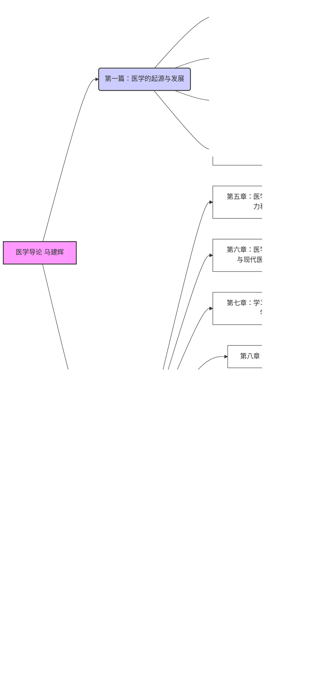

**解释：**

*   **篇与篇的关系：**
    *   [[医学导论]] 分为两篇：
        *   第一篇 **医学的起源与发展** 讲述医学发展的历史和不同医学体系的形成。
        *   第二篇 **医学教育与医学学习** 侧重于医学教育、医学生培养以及医学实践的各个方面。
*   **章与章的关系：**
    *   在每一篇中，各章节按照逻辑顺序展开，例如：
        *   第一篇中，从古代医学开始，逐步过渡到近代医学、现代医学，最后探讨中医学的形成与发展。
        *   第二篇中，从医学生应具备的知识、能力和素质开始，到具体的医学教育教学、学习理论，再到卫生人员、病人、医患关系，最后落脚到临床实践、疾病预防和卫生国情。


# 第一篇 医学的起源与发展
## 第一章 古代医学
### 第一节 原始医学
### 第二节 古代东方医学
#### 一、中国古代医学
#### 二、古埃及医学
#### 三、古印度医学
#### 四、古巴比伦和亚述的医学
### 第三节 古代西方医学
#### 一、古希腊的医学
#### 二、古罗马的医学

## 第二章 近代医学
### 第一节 近代医学的发展
#### 一、15-16世纪的医学
#### 二、17世纪的医学
#### 三、18世纪的医学
#### 四、19世纪的医学
### 第二节 近代医学的特点与启示
#### 一、近代医学发展的奠基石
#### 二、近代医学发展的动力
#### 三、近代医学发展的桥梁

## 第三章 现代医学
### 第一节 现代医学的形成与发展
#### 一、药物学与治疗学的飞跃
#### 二、分子生物学的发展
#### 三、免疫学的发展
#### 四、医学遗传学的发展
#### 五、器官移植与人造器官
#### 六、医学模式的转变
#### 七、传染病的新动态
#### 八、医学影像学的发展
### 第二节 现代医学的特点
#### 一、医学分科专门化
#### 二、医学发展国际化
#### 三、医学技术逐渐现代化
#### 四、医学学科交叉渗透产生新学科
### 第三节 现代医学发展的启示
#### 一、临床必须与预防相结合
#### 二、技术的转移与综合是医学技术发展的主要动力
#### 三、既要重视延长寿命又要重视生命质量
### 第四节 21世纪医学的发展趋势
#### 一、分子生物学将成为新世纪医学发展的龙头
#### 二、再生医学将促进21世纪的医疗革命
#### 三、医学与众多学科融合发展为疾病诊断与治疗带来新突破
#### 四、预防医学发展将促进卫生革命
#### 五、老年医学将成为新世纪的重要医学课题
#### 六、全科医学
#### 七、系统生物学与系统生物医学
#### 八、微创外科
#### 九、循证医学
#### 十、转化医学
#### 十一、精准医学
#### 十二、医学整合

## 第四章 中医学的形成与发展
### 第一节 中医学的基本理论
#### 一、阴阳五行学说
#### 二、藏象学说
#### 三、经络学说
#### 四、病因病机
#### 五、诊法与辨证
#### 六、治则与治法
#### 七、养生与预防
### 第二节 中医学各专科的形成和发展
#### 一、中医诊断学
#### 二、中医内科
#### 三、中医外科
#### 四、中医骨伤科学
#### 五、中医妇产科
#### 六、儿科
#### 七、五官科
#### 八、针灸科
#### 九、药物学
#### 十、方剂学
### 第三节 中西医结合与中医学的发展
#### 一、中医学外传国外
#### 二、西洋医学传入中国
#### 三、中医药的发展和中西医结合
#### 四、中华人民共和国成立后中医药的科学研究取得突出的成果
#### 五、中医现代化

## 第二篇 医学教育与医学学习
### 第五章 医学生的知识、能力和素质*

#### 第一节 医学生的知识结构
##### 一、人文社会科学知识

- 医学研究和服务的对象是具有社会性的人和人群。
- 医生不但要了解疾病，还要了解人，了解人与社会的关系。
- 影响人类疾病或者健康的因素不仅涉及自然科学领域，也与人文和社会科学等领域紧密联系。
- 人文社会科学知识是医学生知识结构的重要组成部分，也是适应医学模式从“生物医学模式”向“生物-心理-社会医学模式”转变的需要。
- 广博的人文社会科学知识有利于医学生综合素质的提高，有利于医学生对专业知识和技能的掌握，有利于医学生创新精神的培养，有利于医学社会化的需要。


##### 二、自然科学知识


1.  **自然科学是医学的基础：** 医学与物理、化学和生命科学等自然科学存在深度交叉与融合。
2.  **自然科学方法论对医学至关重要：** 自然科学的实验、观察和逻辑推理的研究方法有助于医学生培养良好的科学实验、临床观察和临床逻辑思维能力。
3.  **数学与医学的交叉融合是趋势：** 数学在临床医学、诊断学、临床流行病学中作用重要；在 5G、医疗大数据等技术快速发展的大背景下，医学与数学，甚至计算机科学、物理学、信息论及数据科学的交叉融合已成为趋势，实现精准医疗。

自然科学是研究自然界的物质形态、结构、性质和运动规律的科学。自然科学以整个自然界为研究对象，借助科学实验、数学方法、系统科学法等揭示自然界发生的现象以及自然现象背后的规律，为在社会实践中合理利用自然界的规律开辟各种可能的途径。自然科学最重要的两个支柱是观察和逻辑推理，通过对自然的观察和逻辑推理可以引导出大自然中的规律。自然科学包括物理学、化学、生命科学、天文学、地球科学等基础科学和医学、农学、气象学、材料学等应用科学。几乎整个自然科学学科都和医学直接或间接地发生联系，比如医学与物理、化学和生命科学存在深度交叉与融合。扎实的自然科学知识有助于为医学生专业基本理论、基本知识的学习和基本技能的掌握奠定坚实的基础，同时自然科学实验、观察和逻辑推理的研究方法也有助于医学生培养良好的科学实验、临床观察和临床逻辑思维能力。

数学虽然不属于自然科学范畴，但数学作为最古老而又最活跃的科学之一，为其他学科提供了观念方法及应用工具，在许多重大前沿领域的创新发展中起着至关重要的作用。数学在现代医学中的应用日益广泛和深入，如对临床医学、诊断学、临床流行病学具有重要作用。在 5G、医疗大数据等技术快速发展的大背景下，医学与数学，甚至计算机科学、物理学、信息论及数据科学的交叉融合已成为趋势。这种融合不仅可重构人体内部组织器官、定位组织及血管相对位置，生成各种解剖信息的定量描述，而且可预测各种疾病的发生与演化，刻画疾病的发生机制，帮助医生制定精准个性化医疗方案，更好服务于病人。

##### 三、医学专业知识


1.  **基础医学知识：** 了解人体正常结构和功能，各种因素对机体的影响和疾病的发生、发展与转归规律。
2.  **临床医学知识：** 在基础医学知识基础上诊治病人，阐述生命各阶段各种常见病、多发病的发病原因、发病机制、临床表现、诊断及防治原则等。
3.  **预防医学与公共卫生知识：** 以人类群体为研究对象，研究疾病发生与分布规律及影响健康的环境、社会及行为心理因素，制订预防措施和对策。
4.  **全科医学和康复医学知识：** 服务生命全周期、健康全过程。

##### 四、交叉学科知识


1.  **交叉学科知识：** 关注人工智能、大数据科学、生物信息学、数学、管理学等，成长为具备“医学+X”多学科背景的复合型创新拔尖人才。
2.  **科学方法知识与创新能力：** 通过文献检索、科研方法设计、早期科研训练项目、循证医学、临床试验设计等，提升学生创新热情，挖掘创新潜能，开拓创新思路。
3.  **信息技术应用能力：** 能够利用现代信息技术研究医学问题及获取医学新知识与相关信息，为医学实践和医学研究服务。


#### 第二节 医学生的能力结构
##### 一、发现问题和提出问题的能力

发现问题和提出问题是推动医学科学和临床实践发展的关键步骤，有助于深入了解已知问题的
根本原因，探索新的治疗方法和改进医疗实践。提出问题实际上是创造性思维的培养，体现创新意识和创新能力。发现问题和提出问题的能力是医学生能力结构的关键组成之一，对于医学生的临床和学术发展至关重要。医学生应善于从病人症状、体征或临床现象中识别存在的需探究的异常或疑点，形成临床问题或学术问题。医学生要勤于思考，勇于质疑，敢于以批判的眼光观察问题，激发提出新问题的灵感。小组讨论、合作探究、多向信息交流均可促进医学生提出问题能力的培养。

##### 二、分析问题和解决问题的能力

掌握知识的目的是解决实际问题。这些实际问题包括常规问题和新问题。常规问题一般是指已
经基本认识的，且已有了具体解决该问题的原则和方法的问题。临床上的疾病诊治问题大多属这一类的问题。新问题是过去实践中尚未遇到过的问题。分析问题就是分析问题构成的要素、问题的性质、解决问题的具体方法和手段、对实践操作结果的预计和评估等。分析问题的能力实质上是融合多种专业知识经过转化形成的一种能力。相对于分析能力而言，解决问题的能力是一种再造性活动能力，是经过反复练习，熟练掌握的一种技能。

由于医学的特殊性，医生经常面对的是没有唯一结论的临床问题，需要通过全面、系统、正确地采集病史，并结合体格及精神检查、实验室检查结果等内容，得出较为合理的结论。这需要医生具有很强的临床思维和分析问题、解决问题的能力，具体体现在各类常见病、多发病的诊断和处理能力，合适的临床技术选择、经济的治疗手段运用，采用循证医学（evidence-based medicine）的方法对临床问题进行查证、用证的初步能力。

##### 三、实践能力

实践能力包括实验操作技能和临床操作技能，是医学生必须具备的基本功。医学重要特征之一
是实践性强，要求医学生具有较强的动手能力和缜密的临床思维能力。医学生要充分利用早期社会实践、临床见习、毕业实习等机会，通过早期接触临床、多临床、反复临床，掌握病史采集、体格检查和病史书写的能力，能够依据病史和体格检查中的发现，形成初步判断，并进行鉴别诊断，提出合理的治疗原则；重视诊疗思维训练，能够选择并安全地实施各种常见的临床基本操作。

##### 四、自主学习和终身学习能力

自主学习能力强调以学生为中心的教育理念，突出学生的主体地位。自主学习者能够对自己的
学习作出选择和决策、有效地自我管理和自我调控。学习的自立性、自为性和自律性是学习自主性的三个方面的体现。自主学习一般包括自我制定学习目标、自我选择学习策略和方法、自我确定学习时间和进度、自我选择学习材料、自我监控学习过程、自我评价学习效果等。

在有限的教育时间内，学校不可能将所有新知识传授给学生。而随着医学研究的深入，医学知识的不断更新，要求医学生要具备利用各种教育资源主动获取知识的能力，使学生在学习中处于主体地位，培养学生自主学习能力，为终身学习提供保障。

##### 五、创新能力

创新能力是认识与实践能力的总和，表现为在扎实和广博的基础知识、深厚的专业知识基础上的丰富的想象力和发散性思维。创新能力需要认知领域的知识、智能因素和非认知领域的动机、情感、意志、性格等因素的有机结合，共同作用，才能有效发挥。

要充分注意医学生学习过程中创新精神、创新思维的培养。创新思维是指在探索未知领域时，充分发挥认知的能动作用，突破固有的逻辑通道，不断以新颖方式和多维的思维转化来寻求获得新成果的思维活动，即敏锐地发现问题的能力、提出解决方案的能力及综合评价的能力。因此，在学习过程中，学生不能只是被动地接受知识，而是要独立思考，敢于提出新问题，培养批判性思维，探索未知。此外，积极参加社会实践活动有利于创新精神和创新思维的培养。

##### 六、批判性思维能力

批判性思维（critical thinking）是一种有目的的、自我调整的判断过程，这种判断建立在对特定情境运用一定标准，采用循证、科学方法进行分析、评价、推理、解释和说明的基础之上。批判性思维是创新思维的基础和前提。由于医学问题的复杂性和不确定性，决定了对医学生批判性思维培养的重要性。医学生应能够在职业活动中表现出分析批判的精神，有根据地怀疑和对事物进行研究的态度；运用科学思维去识别不同来源获得的相关信息，阐明和解决临床问题；理解医疗决定中应考虑问题的复杂性和不确定性；收集并评价各种资料，从而解决实际问题。加强批判性思维能力的培养，将有利于在我国传统文化和教育思想的基础上，培养出具备更高素质的医学人才。

##### 七、交流能力

人是生活在群体中的，在社会生活中人际关系良好、社交广泛可以使工作顺利开展。医生是与人打交道的职业，应具有与病人及其家属进行有效交流的能力。了解病人的身心状态，才能作出正确的诊断和处理，解除病人的疾苦。另外，医学生还要具有与医生、护士及其他医疗卫生从业人员进行交流和协调的能力。提高交流能力能更好地与国内外同行进行广泛的沟通，开阔视野，拓展空间，了解最新的国际医学学术动态，走在医学的前列。

##### 八、团队协作能力

团队协作能力是团队精神的核心和具体体现。团队精神是大局意识、协作精神和服务精神的集
中体现。所谓团队协作能力，是指建立在团队的基础之上，发挥团队精神、互补互助以达到团队最大工作效率的能力。由于医学专业的分科很细，而医生在诊疗疾病时又要将人作为一个整体来全面考虑，所以在医学领域，团队协作能力显得尤为重要。

##### 九、信息管理能力

医学领域每年产生海量的医学文献和资料，一名合格的医学从业人员必须掌握现代信息技术，具备从数据库和数据源中检索、收集、组织和分析有关卫生和生物医学信息的能力。

医生应善于从临床医学数据库中检索特定病人的信息；运用信息技术帮助诊断、治疗和预防，以及对健康状况进行调查和监控；在解决医疗问题和决策中合理使用信息技术并了解其局限性；保存医疗工作记录，以便进行分析和改进。

##### 十、组织和管理能力

医疗卫生工作是在人际关系中运行的，组织和管理能力是医学生一种重要的职业能力。医生既
要在医疗工作中做好病人服务和管理，协调与病人和服务人群之间的关系，也要参与医疗卫生服务的管理工作，做好医疗团队、科室、医院管理。从事预防保健和社区医学工作的医学工作者，也必须承担一定的卫生服务系统的组织管理任务，医学生要具备在需要时进行领导的能力，成为所服务对象和团队成员的良师益友，要取得他们的信赖，获得他们的支持，影响他们的行为，通过设定目标、作出决策、分配资源以达到团队或组织的目标。

#### 第三节 医学生的素质
##### 一、思想道德素质
##### 二、文化素质
##### 三、专业素质
##### 四、身心素质

### 第六章 医学教育教学概论与现代医学教育思想*
#### 第一节 我国医学教育体系
##### 一、医学教育体系的层次结构

医学教育系统的结构相当复杂。既有宏观结构体系，又有微观结构体系；既有纵向结构体系，又有横向结构体系。这些宏微渗透、纵横交错的结构，使医学教育体系形成一个多维的立体网络结构体系。医学教育体系的宏观结构是医学教育体系的总体构成及其规律，属于这一范畴的主要结构有：

1. **层次结构** 包括研究生教育、高等本科医学教育、高等专科医学教育与高等医学职业教育、中等医学教育、初等医学教育等。已建立了以“5+3”（5 年临床医学本科教育+3 年住院医师规范化培训或 3 年临床医学硕士专业学位研究生教育）为主体、“3+2”（3 年临床医学专科教育+2 年助理全科医生培训）为补充的临床医学人才培养体系。

2. **专业结构** 包括基础医学类、临床医学类、口腔医学类、公共卫生与预防医学类、中医学类、中西医结合类、药学类、中药学类、法医学类、医学技术类、护理学类。

3. **学位结构** 医学学位分为学士、硕士、博士三种。硕士、博士又分为医学科学学位和医学专业学位两种类型。前者侧重于学术理论水平和实验研究能力，以培养从事基础理论或应用基础理论研究人员为目标。后者侧重于从事某一特定职业实际工作的能力，以培养高级应用型人才为目标。

4. **类型结构** 主要包括院校医学教育、毕业后医学教育、继续医学教育。还包括成人医学教育、远程医学教育（广播电视教育、函授教育、网络教育）等。

5. **管理体制结构** 包括中央直属、部门直属、地方所属、社会或个人集资举办医学教育等。

医学教育的微观结构是各级各类医学院校的内部构成及其规律，属于这一范畴的主要结构有：课程结构、人员及其组成结构、组织结构等。医学教育系统就是由上述一系列纵横交错、宏观微观互相渗透的子系统，按照一定的规律所组成的立体网络结构体系。

##### 二、医学教育体系的专业结构*

**（一）本科医学教育专业结构**

中华人民共和国成立以来，我国普通高等学校本科专业目录几经调整和修订，在一定程度上拓宽了专业口径，增强了学生的适应性。全国普通高等学校设置的医药本科专业，1955 年有 5 种，1963 年有 10 种。1978 年至 1986 年，已有 50 余种。1987 年调整为 9 类，47 种正式专业，10 种试办专业。1993 年调整为 9 类，37 种专业。1998 年调整为 8 大类，16 个专业（不含分布到其他科类中的专业）。2012 年 9 月颁布《普通高等学校本科专业目录（2012 年）》，医学门类下设专业类 11 个，44 种专业；2023 年 4 月在《普通高等学校本科专业目录（2012 年）》基础上，增补近年来批准增设、列入目录的新专业。2024 年 3 月，教育部公布了《普通高等学校本科专业目录（2024 年）》，医学门类下设专业类 11 个，62 种专业。2024 年目录分为基本专业和特设专业，并确定了国家控制布点专业。特设专业和国家控制布点专业分别在专业代码后加“T”和“K”表示，以示区分。具体的本科高等医学教育专业结构见表 6-1。

<center><b>表 6-1 本科高等医学教育专业结构</b></center>

| 序号  | 门类、专业类     | 专业代码     | 专业名称     | 学位授予门类 | 修业年限  | 增设年度                  |
| --- | ---------- | -------- | -------- | ------ | ----- | --------------------- |
| 629 | 基础医学类      | 100101K  | 基础医学     | 医学     | 五年    |                       |
| 630 | 基础医学类      | 100102TK | 生物医学     | 理学     | 四年    | 2012                  |
| 631 | 基础医学类      | 100103T  | 生物医学科学   | 理学     | 四年    | 2015                  |
| 632 | 临床医学类      | 100201K  | 临床医学     | 医学     | 五年    |                       |
| 633 | 临床医学类      | 100202TK | 麻醉学      | 医学     | 五年    |                       |
| 634 | 临床医学类      | 100203TK | 医学影像学    | 医学     | 五年    |                       |
| 635 | 临床医学类      | 100204TK | 眼视光医学    | 医学     | 五年    |                       |
| 636 | 临床医学类      | 100205TK | 精神医学     | 医学     | 五年    |                       |
| 637 | 临床医学类      | 100206TK | 放射医学     | 医学     | 五年    |                       |
| 638 | 临床医学类      | 100207TK | 儿科学      | 医学     | 五年    | 2015                  |
| 639 | 口腔医学类      | 100301K  | 口腔医学     | 医学     | 五年    |                       |
| 640 | 公共卫生与预防医学类 | 100401K  | 预防医学     | 医学     | 五年    |                       |
| 641 | 公共卫生与预防医学类 | 100402   | 食品卫生与营养学 | 理学     | 四年    |                       |
| 642 | 公共卫生与预防医学类 | 100403TK | 妇幼保健医学   | 医学     | 五年    |                       |
| 643 | 公共卫生与预防医学类 | 100404TK | 卫生监督     | 医学     | 五年    |                       |
| 644 | 公共卫生与预防医学类 | 100405TK | 全球健康学    | 理学     | 四年    |                       |
| 645 | 公共卫生与预防医学类 | 100406T  | 运动与公共健康  | 理学     | 四年    | 2020                  |
| 646 | 中医学类       | 100501K  | 中医学      | 医学     | 五年    |                       |
| 647 | 中医学类       | 100502K  | 针灸推拿学    | 医学     | 五年    |                       |
| 648 | 中医学类       | 100503K  | 藏医学      | 医学     | 五年    |                       |
| 649 | 中医学类       | 100504K  | 蒙医学      | 医学     | 五年    |                       |
| 650 | 中医学类       | 100505K  | 维医学      | 医学     | 五年    |                       |
| 651 | 中医学类       | 100506K  | 壮医学      | 医学     | 五年    |                       |
| 652 | 中医学类       | 100507K  | 哈医学      | 医学     | 五年    |                       |
| 653 | 中医学类       | 100508TK | 傣医学      | 医学     | 五年    | 2012                  |
| 654 | 中医学类       | 100509TK | 回医学      | 医学     | 五年    | 2015                  |
| 655 | 中医学类       | 100510TK | 中医康复学    | 医学     | 五年    | 2016                  |
| 656 | 中医学类       | 100511TK | 中医养生学    | 医学     | 五年    | 2016                  |
| 657 | 中医学类       | 100512TK | 中医儿科学    | 医学     | 五年    | 2016                  |
| 658 | 中医学类       | 100513TK | 中医骨伤科学   | 医学     | 五年    | 2018                  |
| 659 | 中西医结合类     | 100601K  | 中西医临床医学  | 医学     | 五年    |                       |
| 660 | 药学类        | 100701   | 药学       | 理学     | 四年    |                       |
| 661 | 药学类        | 100702   | 药物制剂     | 理学     | 四年    |                       |
| 662 | 药学类        | 100703TK | 临床药学     | 理学     | 五年，四年 |                       |
| 663 | 药学类        | 100704T  | 药事管理     | 理学     | 四年    |                       |
| 664 | 药学类        | 100705T  | 药物分析     | 理学     | 四年    |                       |
| 665 | 药学类        | 100706T  | 药物化学     | 理学     | 四年    |                       |
| 666 | 药学类        | 100707T  | 海洋药学     | 理学     | 四年    |                       |
| 667 | 药学类        | 100708T  | 化妆品科学与技术 | 理学     | 四年    | 2018                  |
| 668 | 中药学类       | 100801   | 中药学      | 理学     | 四年    |                       |
| 669 | 中药学类       | 100802   | 中药资源与开发  | 理学     | 四年    |                       |
| 670 | 中药学类       | 100803T  | 藏药学      | 理学     | 五年，四年 |                       |
| 671 | 中药学类       | 100804T  | 蒙药学      | 理学     | 四年    |                       |
| 672 | 中药学类       | 100805T  | 中药制药     | 工学，理学  | 四年    |                       |
| 673 | 中药学类       | 100806T  | 中草药栽培与鉴定 | 理学     | 四年    |                       |
| 674 | 法医学类       | 100901K  | 法医学      | 医学     | 五年    |                       |
| 675 | 医学技术类      | 101001   | 医学检验技术   | 理学     | 四年    |                       |
| 676 | 医学技术类      | 101002   | 医学实验技术   | 理学     | 四年    |                       |
| 677 | 医学技术类      | 101003   | 医学影像技术   | 理学     | 四年    |                       |
| 678 | 医学技术类      | 101004   | 眼视光学     | 理学     | 四年    |                       |
| 679 | 医学技术类      | 101005   | 康复治疗学    | 理学     | 四年    |                       |
| 680 | 医学技术类      | 101006   | 口腔医学技术   | 理学     | 四年    |                       |
| 681 | 医学技术类      | 101007   | 卫生检验与检疫  | 理学     | 四年    |                       |
| 682 | 医学技术类      | 101008T  | 听力与言语康复学 | 理学     | 五年，四年 |                       |
| 683 | 医学技术类      | 101009T  | 康复物理治疗   | 理学     | 四年    | 2016                  |
| 684 | 医学技术类      | 101010T  | 康复作业治疗   | 理学     | 四年    | 2016                  |
| 685 | 医学技术类      | 101011T  | 智能医学工程   | 工学     | 四年    | 2017                  |
| 686 | 医学技术类      | 101012T  | 生物医药数据科学 | 理学     | 四年    | 2020                  |
| 687 | 医学技术类      | 101013T  | 智能影像工程   | 工学     | 四年    | 2020                  |
| 688 | 医学技术类      | 101014TK | 医工学      | 工学     | 四年    | 2022                  |
| 689 | 护理学类       | 101101K  | 护理学      | 理学     | 四年    | 2024 年起调整为国控          |
| 690 | 护理学类       | 101102TK | 助产学      | 理学     | 四年    | 2016 年增设，2024 年起调整为国控 |

**（二）研究生医学教育学科专业结构**

2011 年国务院学位委员会颁布《学位授予和人才培养学科目录》，2018 年进行修订。在此基础上，2022 年编制而成《研究生教育学科专业目录（2022 年）》。该目录分为学科门类、一级学科和专业学位类别，是国家进行学位授权审核与学科专业管理、学位授予单位开展学位授予与人才培养工作的基本依据，适用于硕士博士学位授予、招生培养，学科专业建设和教育统计、就业指导服务等工作。《研究生教育学科专业目录（2022 年）》医学学科门类及一级学科如下。

| 学科代码 | 学科名称       | 学位类型  |
| ---- | ---------- | ----- |
| 10   | 医学         |       |
| 1001 | 基础医学       | 医学、理学 |
| 1002 | 临床医学       | 医学    |
| 1003 | 口腔医学       | 医学    |
| 1004 | 公共卫生与预防医学  | 医学、理学 |
| 1005 | 中医学        | 医学    |
| 1006 | 中西医结合      | 医学    |
| 1007 | 药学         | 医学、理学 |
| 1008 | 中药学        | 医学、理学 |
| 1009 | 特种医学       | 医学    |
| 1011 | 护理学        | 医学、理学 |
| 1012 | 法医学        | 医学    |
| 1051 | 临床医学（专业学位） | 专业学位  |
| 1052 | 口腔医学（专业学位） | 专业学位  |
| 1053 | 公共卫生（专业学位） | 专业学位  |
| 1054 | 护理（专业学位）*  | 专业学位  |
| 1055 | 药学（专业学位）   | 专业学位  |
| 1056 | 中药（专业学位）*  | 专业学位  |
| 1057 | 中医（专业学位）   | 专业学位  |
| 1058 | 医学技术（专业学位） | 专业学位  |
| 1059 | 针灸（专业学位）*  | 专业学位  |

>**注意**：目录中**学科门类代码为两位阿拉伯数字**，**一级学科和专业学位类别代码为四位阿拉伯数字**，**其中代码第三位从“5”开始的为专业学位类别**。专业学位类别按其名称授予学位。名称后加`*`的仅可授硕士专业学位，其他可授硕士、博士专业学位。

**（三） 高职高专医学教育专业结构**

现行的高职高专医药卫生大类分为临床医学类、护理类、药学类、医学技术类、卫生管理类等
类别。

##### 三、医学教育体系的类型结构
#### 第二节 医学教育教学过程
##### 一、医学教育教学过程的概念
##### 二、医学教育教学过程的主要任务
##### 三、医学教育教学过程的特点
#### 第三节 医学教学管理
##### 一、医学课程
##### 二、医学生学业成绩的考核
#### 第四节 医学教育的改革与发展
#### 第五节 现代医学教育思想的形成及其主要内容
##### 一、教育思想的概念
##### 二、教育思想的形成
##### 三、当代教育思想的形成
##### 四、医学模式及其观念对现代医学教育思想形成的影响
##### 五、现代医学教育思想的主要内容

### 第七章 学习的理论与医学学习*
#### 第一节 学习的理论概述
##### 一、学习的内涵

学习是一项十分复杂的心理活动。广义的学习是指人和动物在生活过程中，通过反复练习和训
练，凭借经验而产生的行为或行为潜能的相对持久的变化。==狭义的学习专指学校学生的学习，是人类学习中的一种特殊形式，是在教师的指导下，有目的、有计划、有组织、有系统地进行的，在较短时间内接受文化科学知识，并以此来充实和发展自己的过程==。尽管人们对学习概念的理解不完全一致，但对学习的本质有着以下共同的认识。

1. **学习意味着行为或行为潜能的变化** 学习以行为或行为潜能的变化为标志，学习的变化有时可以通过操作观察到，如会驾驶飞机、会游泳、会操作计算机等；有时未必能够立即付诸于行动，如对现代艺术的鉴赏或对东方哲学的领悟，这种习得的态度和价值观，是一种心灵和思维深处的变化，是一种改变行为潜能的变化。需要注意的是，学习必然会引起行为的变化，但是不能简单地认为凡是行为的变化都意味着学习的存在，其他因素也会导致行为的变化。有机体的行为变化不仅可以由学习引起，也可以由本能、疲劳、适应和成熟等引起。

2. **学习是一种后天习得行为** 如动物中的幼鸟试飞、狮子滚绣球、小白鼠走迷津等习得行为，人类对语言知识的掌握、心智技能的获得、人际关系的建立、态度和品德的养成等均属于习得行为。行为或行为潜能的改变是学习发生的基本标志，这与通过遗传而获得种族经验（如鸭子会游水、婴儿会吸吮等）的本能行为相区别。

3. **学习主要通过经验或实践而获得** 个体在与环境相互作用的过程中，通过感知、体验、练习和操作等活动，获得习惯、知识、技能、态度等，并以观念的形式储存于大脑，这些主观经验即学习所得，通过反复实践或经验，不断调整、充实和完善，并支配个体不断产生新的经验。

4. **学习导致的变化相对持久** 药物、疲劳、疾病、损伤等因素均能引起行为或行为潜能的变化，如学生过度疲劳会降低学习效率，驾驶员饮酒易发生交通事故，病人的轻度脑震荡会出现短暂意识障碍等。这些变化都非常短暂，一旦原因消除，行为表现就恢复从前。学习则不同，习得的知识、技能、态度等几乎终生不忘，即使发生遗忘或被新的知识和技能所影响也不会完全消失，保持的时间比较持久。

##### 二、行为主义学习理论*

行为主义学习理论在 20 世纪初产生于美国，又称为联结派学习理论，是当今学习理论的主要流派之一。该理论继承了英国的**联想主义心理学**系统的理论，受洛克的经验论影响，更==重视环境和经验的作用，强调学习中的各种要素==，而行为主义学习理论主要有如下观点

1. 学习是可测量和可观察的
2. 学习复杂的行为是渐进地且一步步发生的
3. 学习为刺激影响反应所致。

该理论发展过程中的代表人物及其主要理论有**巴甫洛夫的经典性条件反射理论与华生的行为主义、桑代克的联结说、斯金纳的操作性条件反射理论、班杜拉的社会学习理论**等。

**（一） 巴甫洛夫的经典性条件反射理论与华生的行为主义**

1901 年，沙皇俄国诺贝尔奖获得者巴甫洛夫用狗作为实验对象，提出了广为人知的条件反射理
论。巴甫洛夫还发现了条件反射的保持与消退。在动物建立条件反射后继续让铃声与无条件刺激（食物）同时呈现，狗的条件反射行为（唾液分泌）会持续地保持下去。但当多次伴随条件刺激物（铃声）的出现而没有相应的食物时，则狗的唾液分泌量会随着实验次数的增加而自行减少，这便是反应的消退。

华生将学习定义为以一种刺激代替另一种刺激建立条件作用的过程。他认为个体的行为大多是
后天经过经典条件反射而习得的，也可以通过学习来更改、增强或消除已习得的行为。刺激与反应联结的形成遵循频因律和近因律。**频因律是指某种行为练习得越多，习惯形成也就越快，练习的次数在习惯形成中起着重要作用**；**近因律是指当反应频繁发生时，如果某一刺激与所引发的各种反应存在时间差异，若再遇到该刺激时，最近的反应比较早的反应更容易得到加强，也就是说有效的反应总是最后一个反应**。

```ad-note
title:近因律举例

假设你正在学习一项新的技能，比如弹钢琴。你练习了一段时间，但总是弹错一个特定的音符。

1. **较早的反应**：一开始，你可能会尝试多种不同的指法来弹奏这个音符，但都不太成功。
2. **最近的反应**：经过多次尝试，你偶然发现了一个正确的指法，并且成功地弹对了那个音符。
3. **近因律的应用**：根据近因律，因为这个正确的指法是你最近一次尝试，所以它更容易被大脑记住和加强。下次你再遇到这个音符时，你更有可能直接使用这个正确的指法，而不是再去尝试其他错误的指法。

总而言之，华生行为主义的近因律强调了**时间上的接近性**对学习和行为的影响。最近的、有效的反应更容易被记住和重复，从而形成习惯。
```

**（二） 桑代克的联结说**

美国心理学家桑代克被誉为现代教育心理学的奠基人，他根据著名的“饿猫迷笼实验”得出联结
理论。他的实验发现动物通过尝试错误而偶然获得成功，从而得出学习是情境刺激（S）与反应（R）之间形成联结的过程，即学习是联结的形成和巩固。他经过不断实验研究及理论补充最终形成联结说的基本观点：==心理是人的联结系统，人面临一种特定情境中的刺激所作出相应反应，这种刺激与反应即构成了联结==。他还提出学习需要遵循的三条重要学习原则，将对动物行为的研究推广到人类学习上。

1. **准备律** 指学习者在学习开始时的预备定势。学习者准备以某种方式反应且能实现此反应
则会满意，学习就有效；有准备而不让其行动，则会烦恼；无准备而强制活动也会感到烦恼。

2. **练习律** 指反应重复的次数越多，刺激-反应之间的联结便越牢固。练习律是由使用律和失
用律构成的，它们是练习律的两个方面。一个已形成的联结，若加以应用，多次练习，这种联结的力量便会增强，即使用律；若不予使用，不再练习，这种联结的力量便会减弱，即失用律。

3. **效果律** 指在情境与反应间的一种可以改变的联结，既可因导致满意的结果而加强，也可因
导致烦恼的结果而减弱。例如，要是猫逃出迷笼后得到的是惩罚而不是奖励的话，那么猫就不会努力逃出迷笼了。但桑代克后期的实验发现，满意或奖励的促进作用积极而显著，烦扰或惩罚的制止作用则不甚明确，两者的效果是不对称的。

**（三） 斯金纳的操作性条件反射理论**

美国行为主义心理学家斯金纳用白鼠作为实验对象，设计了“斯金纳箱”，从中得出了操作性条件反射建立的规律：如果一个操作发生后，接着给予一个强化刺激，那么其强度就增加。斯金纳发现，进一步激发有机体采取某种行为的程序或过程称为强化，凡是能增强有机体反应行为的事件或刺激叫作强化物。斯金纳按照强化实施以后学习者的行为反应，将强化分为正强化和负强化两种方式。==正强化是指学习者受到强化刺激以后，加大了某种学习行为发生的概率，如由于教师表扬学生做出的正确行为，从而使学生能在以后经常保持这种行为。负强化是指对学习者消除某种讨厌刺激以后，学习者的某种正确行为发生的概率增加，如教师取消全程监控的方式以后，学习者良好的学习习惯能够保持==。斯金纳在对动物研究的基础上，把有关成果推广运用到人类的学习活动中，主张在操作性条件反射和积极强化原理的基础上设计程序化教学。程序化教学要求教师在教学时，==必须把教科书的内容编成按程序分为小单元的教材，然后按先浅后深、先易后难、先简后繁的顺序，分层次排列起来，并借助机器设备或以书本形式把教材提供给学生==。学完第一小单元，就按程序学习第二小单元，依次按程序前进。

>**思考**：在编写 STA 新手教程时，可以参考这个观点。

**（四） 班杜拉的社会学习理论**

20 世纪 40 年代，教育心理学家们开始致力于探索儿童如何获得社会行为，这些行为包括合作、竞争、攻击、伦理道德和其他社会反应。面对这一系列问题，美国心理学家班杜拉提出了一套综合且广为接受的模仿理论。这一理论最初被称为社会学习理论，后来又称为社会认知理论。社会学习理论是阐明人怎样在环境中学习，从而形成和发展他的个性的理论。班杜拉认为儿童通过观察他们生活中重要人物的行为而学得社会行为，这些观察以心理表象或其他符号表征的形式储存于大脑，来帮助他们模仿行为。班杜拉认为社会学习分为直接学习和观察学习两种形式。==直接学习是个体对刺激作出反应并受到强化而完成的学习过程。观察学习是指个体通过观察榜样在处理刺激时的反应及其受到的强化而完成学习的过程==。班杜拉对观察学习进行了大量研究，观察学习一般经过注意、保持、动作复现、动机这四个过程。观察学习起始于学习者对示范者行动的注意。观察学习的第二个过程是对示范行为的保持过程。观察学习的第三个过程是把记忆中的符号和表象转换成适当的行为，即再现以前所观察到的示范行为。能够再现示范行为之后，观察学习者（或模仿者）是否能够经常表现出示范行为要受到行为结果因素的影响。社会学习理论接受很多行为主义的理论，但更注意线索对行为和内在心理过程的作用，强调思想对行为和行为对思想的作用。该理论被认为是行为主义与认知主义之间的纽带，且对于认知-行为治疗方面作出巨大贡献。

##### 三、认知主义学习理论


##### 四、建构主义和人本主义学习理论

##### 五、认知神经科学与学习

#### 第二节 大学学习与医学学习的特点

##### 一、大学学习的特点

##### 二、医学学习的特点

##### 三、医学学习应遵循的原则*

学习的原则是学习规律的反映，是医学生在学习过程中应当遵循的基本法则，要求医学生必须遵循，并加以灵活应用。

**（一）学习的目标性原则**

医学生必须把服务于我国社会主义卫生事业及其发展作为根本的学习目的。应按照医学教育目标的要求，结合个人的实际情况，明确医学学习的总目标及各个分阶段目标，设置具体详细的要求和量化指标，制订学习计划，组织学习任务，使整个学习过程始终有良好的导向并能有序地进行。医学生在制订学习目标时，要注意做到以下几点：

1.  **明确性和具体性**：目标设定不能过于宽泛，目标设定不能完全主观。

2.  **可衡量性**：目标可包括一组明确的数据，而且这组数据要具备渐进性，作为定期追踪和衡量是否达成目标的依据。

3.  **可达成性**：指目标要能在目前的状况下得以实现，同时目标必须要有挑战性。

4.  **时限性**：指目标是有时间限制的，要根据学习任务的权重、事情的轻重缓急，拟定出完成各个阶段目标的时间要求，定期检查任务的完成进度，随时根据异常情况变化及时地调整计划，实现学习目标。

**（二）理论与实践相结合的原则**

理论来源于实践，同时又指导实践。医学是人类长期同自然界和疾病作斗争的过程中产生和发展起来的，其理论最初来自人类对自然界和疾病的浅显认识。伴随自然科学技术的发展和医学长期的探索实践，人类不断揭示自身的生命奥秘和发现影响健康的各类因素，对疾病的病因、发病机制、病理表现以及疾病的诊断、治疗和预防等方面的了解不断深入，医学逐渐形成了自身的科学理论体系。医学实践的意义在很大程度上是加深对医学理论的理解和应用，并不断积累实践经验以丰富医学理论。医学科学的特殊性决定了医学生在学习的过程中必须将理论知识与医学实践相结合。在学习医学理论时，要结合医学实验、实习等加深对理论知识的理解，并使用形象、直观的电子类教材、医学图谱类书籍、人体标本和模型等教具，方能取得较好的学习效果。在进行医学实验、实习的学习时，在注重培养医学实践技能的同时，要将医学实践中的各种感知自觉地与医学理论知识进行比较、分析和总结，以发挥医学实践的多种功效。

**（三）循序渐进的原则**

医学知识和技能的学习是一项日积月累、逐步深入的认知过程，特别强调学习中的循序渐进，而且前期课程的学习对后续课程的学习具有重要影响。如果正常人体形态、机能课程学习不好，在学习异常人体形态、机能课程时会遇到很大的困难；如果基础医学知识掌握不牢，就会影响未来临床医学相关课程的学习。正是由于医学科学具有特殊的认知规律，要求医学生在学习时必须重视每一门课程和教学环节的学习，尤其要重视基础课程的学习。既要发挥兴趣、爱好对学习的积极作用，又不能完全受兴趣、爱好等非智力因素的制约，而放松甚至放弃对不感兴趣、不喜爱的知识的学习，会出现偏科现象。同时也不能存在“过去未学好，后来再居上”的想法，否则将会不断增加和积累后续课程的学习难度。医学学习的循序渐进原则还要求医学生科学、合理地制订自己的学习计划，学习计划要切合自己的实际，不能好高骛远，要脚踏实地，有计划、有步骤地努力实现自己的学习目标。

**（四）整体性原则**

医学生要学会运用整体与部分的这种辩证关系来把握学校开设的课程。医学生需要牢固树立医学的整体观，了解自己所学课程与整个学科体系间的关系，从整体上构建起符合素质教育要求的知识体系的框架。同时，医学生需要自觉地消除课程之间、学科之间和专业之间的严格界限，将基础课程的学习与临床或专业的学习融为一体，相互融合、渗透。

#### 第三节 医学学习的策略与方法*
##### 一、医学知识的记忆技巧

**（一）影响记忆力的重要因素**

所谓记忆，就是指对经历过的事物能够记住，并能在以后再现（或回忆），或在其重新呈现时能再认识的过程，包括识记、保持、再现或再认三个方面。个体记忆力的高低受到多种因素的影响，除先天智力因素外，更重要的是与自身其他的能力和心理素质有关。下列因素较为重要。

1.  **自信与决心**：记忆时最重要的就是要有能够记忆的自信心和决心。如果缺少了这种自信，脑细胞活动将会受到抑制，记忆便会迟钝。学习者在记忆活动中，首先要树立“我一定要记住，也一定能够记住”的信念，要相信自己的记忆能力，时常暗示自己“我的记忆力不比别人差”“我能记住”，不断鼓励和坚定自己的信心，逐渐使自己由害怕记忆到喜欢记忆，由怀疑自己的记忆力到相信自己的记忆力。

2.  **兴趣与意图**：兴趣和意图是记忆的先决条件。人们对自己感兴趣的现象或事物总能快速而准确地阐述其本质和外在表现，并能记忆长久。这是因为兴趣能够调动大脑活动的“积极性”，并保持耐久。意图使记忆有明确的目的，可以集中注意力，并通过语词信号向自己提出“记住它”的要求，从而使记忆者的神经活动过程灵敏度高、效率高。为了提高记忆力，学习者必须明确记忆的目的，确定“记什么”“记多久”“记到什么程度”“记住用来干什么”等问题，避免盲目、随意地学习记忆。

3.  **留心与注意**：留心与注意是指人的感知或思维等心理活动指向并集中于某一事物，记忆时表现为全神贯注、聚精会神、专心致志。记忆力与注意力密切相关，只有注意力集中，才能记得快、记得牢。研究发现：对一些事物如果“视而不见，听而不闻”或“熟视无睹”，不仅不能记住，甚至不能觉察到其存在。古人曰“心一松散，万事不可收拾；心一疏忽，万事不入耳目”，讲的就是学习记忆时要集中注意力。

4.  **感知与思考**：感知能力是记忆力的前提。不善于运用感官或感觉迟钝的人，通过感官所获得的东西大多是模糊、笼统、肤浅和分散的，在大脑中留下的“印痕”很不深刻。研究发现，在人的记忆中，通过视觉记忆的占 85% 左右，通过听觉记忆的占 11% 左右，通过味觉、嗅觉和触觉记忆的占 4% 左右。绝大多数知识的记忆是通过多种感官的配合而进行的。记忆以思维为条件，对接触的新知识或新经验，如不通过思考过程给予咀嚼消化，就很难变成记忆并保持下来。记忆的过程实际上就是苦思、巧思、多思和精思的过程，“学而不思则罔，思而不学则殆”讲的就是这个道理。

5.  **知识与环境**：知识是记忆的基础，记忆力与知识的丰富程度呈正相关。提高记忆力，必须不断地积累知识和经验，通过“学习迁移”与其他相同、相近、相反的知识和经验发生联系，从而达到记忆的目的。社会环境、自然环境的好坏与记忆的效率直接相关，古人读书特别讲究环境的安静，因为安静的环境能够使学习者的注意力更加集中。在喧闹的环境中学习时要学会“抗干扰”，增强对记忆环境的适应性，变“闹”为“静”。

**（二）医学知识的记忆方法**

学习记忆的方法有许多种，采取何种记忆方法要根据记忆的材料而定，不同的人也有自己的记忆习惯和记忆方法。以下六种记忆法，可供医学生学习记忆医学知识时灵活选用。

1.  **理解记忆法**：就是在积极思考和进行思维加工的基础上深刻理解记忆材料的记忆方法。对医学中的科学概念、生理或病理生理机制、化学物质的反应过程、药物的作用机制等复杂的、抽象的、记忆难度较大的科学理论知识，宜采取理解记忆法。在记忆此类材料时，应该先理解其基本含义，借助已有的知识经验，通过思维进行分析综合，把握材料各部分的特点和内在的逻辑联系，使之纳入已有的知识结构。理解的程度越高，知识的记忆就越全面、牢固、精确和迅速有效。如果对此类材料进行机械性记忆、死记硬背，既不能准确地掌握和应用该理论知识，也会很快遗忘。

2.  **归纳记忆法**：就是对学习材料进行提炼、概括，抓住关键进行记忆，包括概括记忆法（指用几个字或几句短语对一段内容、一个章节的内容进行高度概括）、提纲记忆法（指通过分析、总结，把学习材料归纳成提纲的形式进行记忆）两种基本记忆形式。概括记忆法包括主题概括、内容概括、简称概括、顺序概括、数字概括、字头概括、图表概括等记忆技巧。

    *   **主题概括**：就是把内容的主题提炼出来，概括地记住全部内容，如在段落前冠上小标题或归纳成更加简练的几句话等。

    *   **内容概括**：就是对看似零散的内容，通过选取关键性的字句进行记忆，达到化多为少、浓缩记忆的目的。如记忆某种疾病的治疗方案时，可以将其概括为：① 一般治疗（包括注意休息、营养等）；② 对因治疗（如感染性疾病进行抗感染等）；③ 对症治疗（如退热、镇咳、镇痛、祛痰、利尿、升或降血压等）；④ 手术治疗；⑤ 中医治疗等。这一治疗原则基本上可以适用几乎所有的疾病治疗方案。

    *   **简称概括**：就是用一个字或词语将较长的词语、名称、概念进行高度简化。如将急性炎症的临床表现归纳、概括为红、肿、热、痛，将慢性支气管炎的临床表现概括为咳、痰、喘。

    *   **顺序概括**：就是把许多有关联的事物按时间、空间或内在联系的顺序排列好。如将眼球的结构归纳、概括为一孔（瞳孔）、二体（晶状体、玻璃体）、三层膜（外、中、内膜）。

    *   **数字概括**：就是用数字来概括识记材料。如糖尿病病人典型的临床表现可概括为“三多一少”（即多饮、多尿、多食、体重减少）。

    *   **字头概括**：就是对并列的几条识记材料提取字头进行概括记忆，一般还配合韵语法将识记对象编成顺口溜或有意义的语句。如把十二对脑神经编成一段顺口溜：一嗅二视三动眼，四滑五叉六外展，七面八听九舌咽，十迷以后副舌下。”又如人体必需的八种氨基酸可以用韵语法编成一句话“借一两本淡色书来”，分别代表缬氨酸、异氨酸、异亮氨酸、苯丙氨酸、蛋氨酸（甲硫氨酸）、色氨酸、苏氨酸、赖氨酸。

    *   **图表概括**：就是用表格、示意图或箭头等符号将复杂、难记的内容直观化、形象化。

3.  **多器官联合记忆法**：就是指眼、耳、手、口、脑多种器官并用。研究表明：多器官并用记忆的效果远比单器官记忆的效果好，不会记忆的学习者要么“默记”（眼、脑并用），要么“背诵记忆”（口、脑并用），很少眼、耳、手、口、脑五种器官并用。在所有记忆中，手的作用最大，“好记性不如烂笔头”讲的就是手的记忆作用。这是因为手的感觉包括了指尖的压迫感觉、运动感觉，以及手指与手指之间的运动感受。所以在记忆时，可采取抄写法（或用手指在空中画写）、眉批法等来帮助记忆。在医学学习记忆时，医学生可通过自己整理笔记、全抄或摘抄学习材料，以发挥手的记忆功效。除手的应用外，还要发挥口的记忆作用，“嘴比眼睛更会记忆”。因为在记忆时念出声可不断增加了舌头与喉咙的感觉，连耳朵也能听到自己念出的声音。医学生在记忆时，可以先动眼、动脑、动手将记忆的对象进行归纳、概括，然后在安静的环境中自己朗读读书笔记，或脱稿像教师讲课一样进行复述，或讲给别人听，或反复背诵，反复几遍后就会迅速、长久地记住所学习的知识。

4.  **形象记忆法**：就是把抽象的记忆材料形象化。医学中的许多知识具有形象的代名词，如脐周围静脉网曲张，临床上将之描述为“海蛇头”现象；体表的小动脉末梢扩张，形成“蜘蛛状”血管痣；将肝硬化腹水的形成机制形象地描述为“肝哭泣”；腹腔内有大量腹水时称作“青蛙腹”；将肝炎的传染比喻为“株连九族”；将人体的免疫细胞称作“人体卫队”，其中巨噬细胞、T 淋巴细胞、B 淋巴细胞为“情报系统成员”，浆细胞为“导弹”的制造者和发射者，自然杀伤细胞、单核细胞、中性粒细胞则为“职业杀手”等。通过应用通俗、易懂的形象比喻，可以记住许多医学知识，如各种心脏杂音、某些病理学改变（如槟榔肝等）、某些临床体征（如扑翼样震颤等）、某些治疗方法（如冠状动脉“搭桥”术等）。

5.  **自测记忆法**：就是通过测试记忆效果来加强记忆。知识的测试过程实质上是思考、判断、信息表达的过程，通过做习题、试题可以检验和巩固记忆。医学生在记忆医学知识时，可以多做各种考试题或自己编制测试题，以达到加深理解和永久记忆的目的。

6.  **比较记忆法**：就是将所要记忆的内容通过对比的方法加以记忆。在一些医学学科中，有的知识点十分相似，区别小并且较为分散，特别容易产生混淆。医学生在学习时，可以使用比较法对它们进行分类，找出相似点和不同点，然后再进行记忆。举例来说，如在学习生理学的影响三大物质代谢激素时，可以将甲状腺激素、胰岛素还有生长激素等内容进行分类别比较，找出三大激素之间的共同点和不同点，再运用表格的形式列出这些要点，进行总结和分析。通过比较和总结，可以把部分知识点之间的关系变得清晰化、简单化，有利于加深理解和记忆力。

##### 二、医学思维的训练策略

**（一）批判性思维及其训练**

1.  **批判性思维的含义**：美国哲学家恩尼斯提出，批判性思维是指对做什么和相信什么作出合理决策的能力。美国尼德勒认为，批判性思维是一系列特殊思维技能的总和，包括识别中心论题或问题，比较异同点，确定哪些信息是相关的，形成适当的疑问，区别事实、观点和合理的判断，核查一致性，识别字里行间的假设，识别原型和套话，识别偏见、情感因素、宣传以及语义倾向性，识别不同的价值系统和意识形态，识别材料的适当性，预测可能的后果。**20 世纪 90 年代美国哲学协会把批判性思维定义为：通过观察、体验、思考、交流收集和产生的信息，经过积极地分析、综合、评价和应用的智力活动**。概括起来，批判性思维就是对接触的事或物的性质、价值、精确性和真实性等方面作出个人的判断，包括批判精神和智力技能两个组成部分。

2.  **批判精神的培养**

    *   **(1) 不唯书**：书本知识是一种系统化、理论化的知识和经验积累，是人类最伟大的发明。有了书本知识，使得后人能够一开始就站在前人的“肩膀”之上，不断继承、探索和创新，不断发展和充实书本知识。书籍作为一种知识和经验的载体，在人们认识自然、改造自然的过程中起到了重要作用。但是，如果在思维过程中一切照搬照套书本上的理论，迷信书本，就会影响人们的识别判断能力。有时，书本并不能完全反映客观现实，加上著书者对客观现实认识的有限性和自身能力的局限性，会出现片面的、错误的描述或结论。另外，书本知识反映着一定时期人们的认识水平，与科技发展的现状并不完全相适应，许多书本知识是过时、陈旧的。培养不唯书的批判精神，必须首先摆脱书本知识对自己思维的束缚，要批判性地继承书本知识，敢于向书本知识提出疑问，并善于用实践去检验书本知识的对与错，做到“爱书”而不“尽信书”。

    *   **(2) 不迷信权威**：权威是指在某一知识领域具有较高造诣和重大贡献的人。在思维领域，不少人习惯于引证权威的观点，一旦发现与权威相违背的观点或理论，便会不假思索地认为其必错无疑。培养不迷信权威的批判精神，必须克服思维的权威定势，要充分认识到权威在时间、地点、经验、认知、研究领域和学术水平等方面具有相对性，要相信自己的才能和判断，敢于向权威“挑战”，善于与权威交流、沟通和合作。要有“青出于蓝而胜于蓝”的精神品质，既要虚心向权威学习，又对权威“服”而不“盲从”。

    *   **(3) 不照搬经验**：在思维过程中，不少人一切凭自己的经验或照搬他人的经验去认识、思考和解决问题。这种思维方式夸大、“泛化”了经验的作用，常会束缚思维的广度和深度。==从思维的角度来看，经验具有很大的时空狭隘性和主体狭隘性，任何经验都有其相适应的时空范围，超出了这个范围，也许会变成无效==；==另外，经验随着其拥有主体的知识、经验的增长而不断完善，因而经验自身也具有相对性和发展性==。所以，培养批判性思维必须主动地摆脱经验的束缚，不要过分依赖经验，而是具体情况具体分析，实事求是，辩证地发挥经验对于思维的积极作用，并不断丰富和完善自己的经验。

    *   **(4) 不盲目从众**：思维上的“从众定势”，可使个人有一种归属感和安全感，也是一种比较保险的处世态度。“从众”思维有利于惯常思维，有利于群体一致的行动，但不利于个人独立思考和判断，盲目“从众”者将永远不会脱颖而出。培养批判性思维，必须克服思维的“从众”定势，既要认识到群体的作用，又不能盲目从众。要培养自己的独创和首创精神，经常提出与众不同的观点，善于从与众人相反的方面思考问题，将会使思维更加广阔。

    *   **(5) 不狂妄自大**：批判性思维是一种自主性思维，强调自主思考、自主判断。但现实中不少人在思维和解决问题的过程中却表现出过分自信、自我，这不仅会造成对思维有益的外界信息自然流失和浪费，也会使自己更加孤立。培养批判精神，必须克服思维的自我定势，需要充分认识到群体力量的无限性，既要高度的自信，又不能目中无人。

3.  **医学批判性思维技能的训练策略**：对现有的知识、技术、信息进行批判性评价，是解决医学问题所必须具备的能力。关于医学毕业生的批判性思维最基本要求标准，国际医学教育专门委员会认为应该能够做到以下几点：在职业活动中表现出有分析批判的精神、有根据的怀疑、创造精神和对事物进行研究的态度；懂得根据从不同信息源获得的信息在确定疾病的病因、治疗和预防中进行科学思维的重要性和局限性；应用个人判断来分析和评论问题，主动寻求信息而不是等待别人提供信息；根据从不同来源获得的相关信息，运用科学思维去识别、阐明和解决病人的问题；理解在作出医疗决定时应考虑到问题的复杂性、不确定性和概率；提出假设、收集并评价各种资料从而解决问题。医学生要达到以上最低要求标准，应在学习的全过程有意识地进行批判性思维训练，可采取以下策略。

    *   **(1) 设问**：从某种角度上讲，医学就是一门问题解决型的学科。医学思维的导向就是发现与健康相关的各类问题，分析问题产生的原因，探寻解决问题的有效途径和具体办法。医学生在学习过程中，要经常向自己或向他人发出“是什么”（what）、“为什么”（why）、“怎么办”（how）等疑问。通过设问，向大脑发出必须思考的对象、范围和任务，使思维的方向更明确，提高思维的针对性和有效性。

    *   **(2) 反思**：批判性思维强调举一反三、深思熟虑，也就是思维必须全面、广阔。由于医学学科的特殊性，“反思”对于医学生和医学工作者而言至关重要。尤其是在临床诊治过程中，临床医生必须结合病人的临床表现、医学检验结果以及各种相关信息进行反复推敲，才能作出科学、准确的判断。医学生在学习过程中，要学会“反思”训练，遇到任何新的知识，都要善于将其“泛化”，用已掌握的知识对其进行科学解释和说明，并善于从正反方面或与其相近、相似、相关方面进行关联分析，使思维更加宽泛广阔，提高思维能力的准确性。

    *   **(3) 求异**：对于训练批判性思维能力具有较好效果。医学生在学习过程中要学会求异思维，变换思维方向，上升到新的思维层次进行深入的批判活动，如可经常向自己提出“能否用另外一种方法代替这种方法？”等命题，供自己进行深入思考。并通过比较分析，权衡多种方法的优缺点，既对原方法进行了重新审视，又有可能进行创新发现。

**（二）创造性思维及其训练**

创造性思维是人类的高级思维形式，与一般思维的区别在于其具有新颖性、独创性和突破性。一般思维主要指逻辑思维，即在某个范围内按照已知的知识规律进行判断和推理，并从中得出结论。创造性思维除有逻辑思维的某些内容外，还加入了某些看来不合逻辑的思维和直观、猜疑和想象。一般思维的特点和培养方法在许多教材中已有详述，在此不予重复。以下主要阐述医学生创造性思维能力的自我培养方法。

1.  **创造性思维的特征**：创造性思维主要由基础型思维、方法型思维、辅导型思维和核心型思维构成。基础型思维包括直观思维和逻辑思维，方法型思维主要包括求同思维、求异思维、扩散思维、集中思维、连接思维、分解思维和联想思维，辅导型思维包括立体思维、逆向思维、水平思维、转换思维、回转思维、交叉思维和相对思维等，核心型思维包括想象和灵感。创造性思维一般具有以下显著特征。

    *   **(1) 想象、幻想、联想和类比**：想象是在已知事实和观念的基础上，借助大脑的加工、改造而形成超前于经验事实的新事实和新意念。想象是创造性思维的重要特征，没有想象就不会有创造。如牛顿从苹果落地这个常见的现象中展开了广阔的想象，发现了“万有引力定律”。幻想是思维摆脱现实的束缚去塑造未知的事物。如爱因斯坦断然否定传统的“以太说”，提出了“光速不因光源的运动而变”的一条基本假设，建立了轰动世界的“相对论”。联想是根据事物之间的某些方面的相似，由此及彼地推测其在其他方面也可能相似的一种思维技巧。如魏格纳从世界地图上发现大西洋两岸轮廓线有惊人的相似性，进而提出了“大陆漂移说”。类比是把陌生、未知的对象和熟悉、已知的对象相比，获得新知的思维方式。如勒内克把儿童在长木棍的一端倾听另一端大头针的敲击声与医生用耳听诊病人进行类比，发明了听诊器。

    *   **(2) 多维、发散和聚合**：多维是指思维从点到面、从面到体、点面并存、多路互补，具有立体性。如医学模式是生物、心理、社会、环境因素的统一，诊断、治疗和预防疾病时要全方位地思考，不能片面地“头痛医头、脚痛医脚”。发散是指思维的方向在纵向上具有高度的流畅性，在横向上具有高度的变通性，包括侧向、逆向、转向等。如从研究异丙嗪的镇静作用到发现氯丙嗪用于治疗精神病；从研究长期食用粗制棉籽油导致不孕现象到棉酚作为男用避孕药等。聚合是根据已有的知识经验，向着一个方向去思考，得出一个认为是最好的结论。如从研究溶菌酵素抗菌到研究磺胺类药物抗菌，最后到发现青霉素抗菌。

    *   **(3) 好奇、质疑和冒险**：好奇使创新人才能够获取创新的机遇，是创造性思维的第一步。如班廷对摘除胰脏的狗的尿招来了满地的苍蝇产生了好奇，最终发现了胰岛素；凯库勒对梦中所见的“蛇咬自己的尾巴”好奇，发现了苯结构式。质疑是一种批判性思维，是不迷信权威和书本的思想素质。如哈维对盖伦学说中关于“人体血液只能做直线运动”的观点产生了怀疑，经过研究得出了“心脏的血液从动脉流向全身，再通过静脉返回心脏”的结论。冒险是一种创新精神，是创新人才较显著的特征之一。如诺贝尔冒着生命的危险积极从事火药的发明，终于取得成功。医学中许多的创新都是通过医学工作者冒着极大的风险实现的。

2.  **医学创造性思维及其训练**：创造性思维以扩散思维、联想思维、想象思维、直觉思维最为常见，而医学创造性思维中以立体思维和联想思维的训练最为重要。

    *   **(1) 立体思维**：是指从各个不同的角度思考问题的思维方法。该思维具有流畅性、广阔性、灵活性和独特性等特点，在所有创造性思维中最为多见、最为重要，主要在列举法中具体应用。列举法包括缺点列举法和特性列举法。缺点列举法，即专门找缺点、挑毛病，最终解决问题。特性列举法，即将事物的特性全部列举出来，针对各特性列举若干设想。一般按名词特性（如材料、制造方法、操作方式等）、形容词特性（如产品或事物的性质、状态等）、动词特性（如产品、方法的用途、功能等）进行列举。在进行立体思维时，可多问以下五个“能否”以拓宽创造思路：① 能否发挥其他用途？如某种药物除治疗某种（类）疾病外，有没有预防疾病和卫生保健的作用？和其他药物联合使用还能发挥别的作用吗？② 能否改变颜色、味道、形状、大小等取得所期望的效果？如为了降低或控制药物的苦味，可采用加糖浆制成合剂，或制成胶囊等。为了防止“润喉片”滑入气管，可以制成“耳环”形状等。③ 能否增加一些成分？如在牙膏中渗入不同成分的药物制成药物牙膏，可以收到治疗不同疾病的功效。④ 能否用其他方法替代？如可用“血管栓塞法”替代手术治疗某些肿瘤疾病。⑤ 能否改进现有程序和方法？如为了减少外科手术对组织的直接创伤，可采用“激光手术刀”“X 刀”和“γ刀”进行治疗等。

    *   **(2) 联想思维**：是指一种在创新过程中运用概念的语义、属性的衍生、意义的相似性进行思维的方法，即“由此及彼”。联想思维包括五种基本类型。① 相似联想：性质上或形式上相似的事物之间所形成的联想。如从敲击啤酒桶判断桶内啤酒有无产生联想，发现了医学诊断学中的“叩诊法”。② 接近联想：时间或空间上接近的事物之间形成的联想。如从研究用农药杀灭害虫，联想到用生物学方法抑制害虫繁殖，进而联想到人体的药物避孕。③ 对比联想：具有相反特征或相互对立的事物之间形成的联想。如从酒精有害健康联想到酒精也会有益健康（如医学上的“酒精消毒法”）；一些毒物也会成为药物等。④ 因果联想：从某种现象联想到它们之间的因果关系。如广东地区鼻咽癌患病率较高，进而发现与人们习惯吸“水烟”具有一定的关联；吃了某种食物（或药物）后产生过敏症状，进而联想为食物或药物过敏。医学中的职业病、地方病、心身疾病等的病因学研究一般都采用因果联想思维方法。⑤ 强制联想：把看起来无关联的事物强制地相互联系。如“安慰剂”对疾病本无作用，但通过暗示疗法可以治疗许多心理疾病；音乐与疾病治疗本无关联，但强制联系后发现了“音乐疗法”；另外，医学中的许多药物“合剂”、药物的不同颜色、形状和剂型的变化等都可采用强制联想进行研制创新。

联想思维以记忆为前提条件，但不是单纯的回忆，而是通过想象力在两个不同的表象之间建立联系，进而分析这种“联系”的科学性和合理性。联想思维普遍存在于各个体，但思维的广度、深度、速度与层次存在差异。培养联想思维必须牢记以下基本原则：丰富的知识和经验是进行联想思维的前提，如果知识贫乏、经验缺乏，则无法进行有效的联想；创新欲望是进行联想思维的推动力，没有创新意识，不可能进行积极的联想，也会错过许多重要的发现和发明机会；对任何现象都要好奇、感兴趣，并追根求源，找准产生该现象的原因和相同、相似的特征、规律；深信任何事物和现象之间都是普遍联系的，善于比较分析；经常性地训练联想思维，无论是学习、工作还是生活方面，即使是浅显的联想也会使思维更加灵敏。


##### 三、医学的学习方法

### 第八章 卫生人员*
#### 第一节 卫生人员的分类与准入*

##### 一、卫生人员的分类


##### 二、卫生人员的准入
#### 第二节 临床医生
##### 一、临床医生的使命与职责
##### 二、临床医生的权利与岗位要求
##### 三、执业医师的准入
#### 第三节 药剂人员
##### 一、药剂师的工作内容
##### 二、执业药师的准入
##### 三、执业药师的职责
#### 第四节 护理人员
##### 一、护理人员的产生和社会地位
##### 二、护理模式转变对护理人员的素质要求
##### 三、护士的准入
#### 第五节 医学影像及检验人员
##### 一、医学影像及检验人员的特点
##### 二、医学影像及检验人员的准入
#### 第六节 公共卫生人员
##### 一、卫生防疫人员
##### 二、卫生执法监督人员
#### 第七节 全科医生与基层卫生人员
##### 一、全科医生
##### 二、社区卫生人员
##### 三、乡村医生
#### 第八节 卫生管理人员
#### 第九节 健康管理师

### 第九章 病人*
#### 第一节 病人角色
##### 一、病人概念与病人角色
##### 二、疾病行为
##### 三、求医行为
##### 四、遵医行为
#### 第二节 病人的权利与义务
##### 一、病人权利
##### 二、病人义务
#### 第三节 病人心理变化
##### 一、认知变化
##### 二、情感变化
##### 三、意志行为变化
##### 四、人格变化
#### 第四节 病人需要与期望
##### 一、病人需要
##### 二、病人期望
#### 第五节 以病人为中心
##### 一、以病人为中心的意义
##### 二、以病人为中心的内涵

### 第十章 医学人际关系与沟通
#### 第一节 沟通概述
##### 一、沟通的概念与类型
##### 二、沟通的基本要素与模式
##### 三、沟通的特点与基本原则
#### 第二节 医学人际关系
##### 一、人际关系的内涵
##### 二、医学人际关系的概述
#### 第三节 医患沟通
##### 一、概述
##### 二、医患沟通的方式

### 第十一章 健康与疾病*
#### 第一节 生命
##### 一、生命的定义
##### 二、生命的进化
##### 三、生命的标准
##### 四、生命的价值
#### 第二节 健康
##### 一、健康的定义
##### 二、健康的标准
##### 三、亚健康状态
##### 四、大健康
#### 第三节 疾病
##### 一、疾病的定义
##### 二、疾病的原因
##### 三、疾病的自然进程
##### 四、疾病过程的共同规律
##### 五、疾病发生的一般机制
##### 六、疾病的分类
##### 七、疾病谱变化
##### 八、疾病的价值与意义
#### 第四节 衰老
##### 一、衰老的定义
##### 二、衰老的机制
#### 第五节 死亡
##### 一、死亡的定义
##### 二、脑死亡
##### 三、临终关怀

### 第十二章 临床诊断与治疗*
#### 第一节 临床诊断
##### 一、临床诊断的基本原则及思维过程
##### 二、临床诊断中常用的思维方法
##### 三、临床诊断方法、技术及其评价
#### 第二节 临床治疗
##### 一、临床治疗的基本原则及思维过程
##### 二、临床治疗方法、技术及其评价
#### 第三节 循证医学
##### 一、循证医学的定义
##### 二、循证医学的历史
##### 三、循证医学的基本过程和研究方法
##### 四、循证医学的价值
##### 五、循证医学的局限性
#### 第四节 病历的记录与管理
##### 一、病历记录的基本要求
##### 二、病历的保存与管理
#### 第五节 临床实践中的法律问题
##### 一、卫生法律与法规
##### 二、卫生法中的法律责任
##### 三、医疗行为中的告知义务
##### 四、医疗损害及其分类
##### 五、医疗损害和纠纷的现场处置
##### 六、医疗损害鉴定及法律处理程序
##### 七、减少医疗损害和纠纷的措施

### 第十三章 疾病预防与卫生保健*
#### 第一节 疾病预防概论
##### 一、疾病预防与预防医学
##### 二、预防医学的基本任务
##### 三、疾病预防的主要特点
#### 第二节 疾病预防的宏观策略
##### 一、“预防为主”的卫生与健康工作方针
##### 二、医学模式与疾病预防模式的转变
##### 三、社会大卫生观念
#### 第三节 疾病预防的主要措施
##### 一、个体预防和群体预防
##### 二、三级预防
##### 三、公共卫生监测
##### 四、突发公共卫生事件的应对
#### 第四节 卫生保健
##### 一、卫生保健的主要形式
##### 二、卫生保健的全球战略
##### 三、初级卫生保健

### 第十四章 疾病的康复*
#### 第一节 康复医学概述
##### 一、康复
##### 二、康复医学
##### 三、康复医学的工作方式
##### 四、残疾
##### 五、社区康复
#### 第二节 康复医学的发展与作用
##### 一、康复与康复医学的形成与发展
##### 二、康复医学发展的基础
##### 三、康复医学的作用
#### 第三节 康复医学评定与康复治疗技术
##### 一、康复医学评定
##### 二、康复治疗技术

### 第十五章 中国卫生国情
#### 第一节 卫生与健康工作方针
##### 一、卫生工作方针的形成和发展
##### 二、新时代卫生与健康工作方针
#### 第二节 卫生资源与卫生健康服务
##### 一、卫生资源
##### 二、卫生健康服务
#### 第三节 党的十八大以来我国卫生健康事业发展成就
#### 第四节 医药卫生体制改革
##### 一、概述
##### 二、医改进展
##### 三、“十四五”期间医改任务
#### 第五节 健康中国建设
##### 一、概述
##### 二、健康中国战略
##### 三、健康中国行动

### 附录 诺贝尔与诺贝尔生理学或医学奖
### 推荐阅读
### 中英文名词对照索引