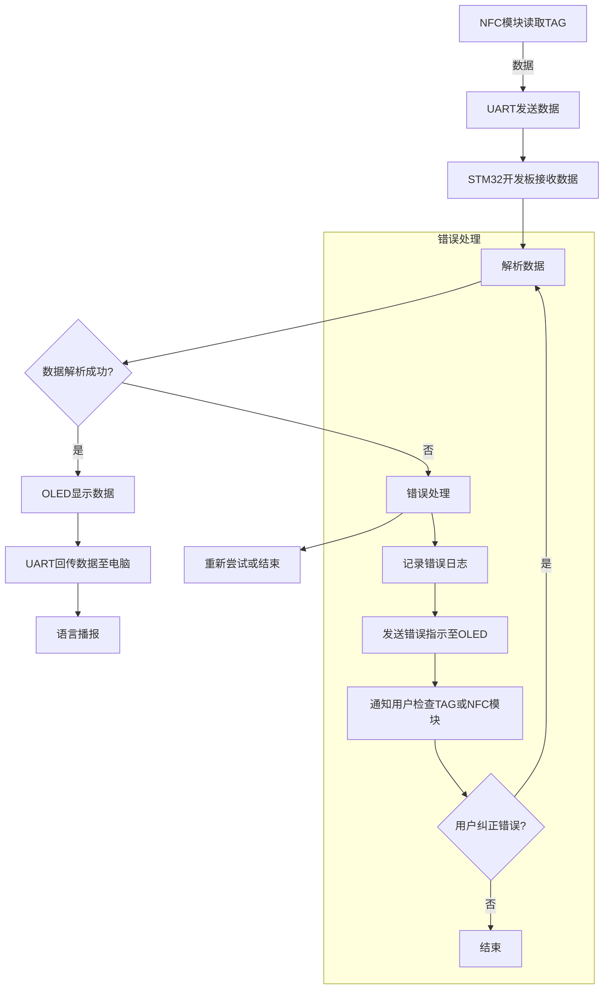

# 1. 需求分析


# 2. 逻辑分区


# 3. 最小系统


# 4. 模块电路

## 4.1. NFC 模块


- 买NFC卡买错成ID卡而非IC卡：买东西前确认买的对象是否正确

- NFC卡的加密分区密钥错误导致无法读IC型NFC卡：
					
							图：目标ID型NFC扇区信息
	**问题描述**：造成IC型NFC卡靠近线圈时没有反应
	**问题分析**：由于给芯片设置的NFC密钥都是默认密钥A：FFFFFFFFFFFF，密钥B：FFFFFFFFFFFF。与上述目标分区的密钥不匹配导致无法读卡
	**方案尝试**：在上位机工具上设置密钥并且装载密钥
					图：重新写入读卡密钥的上位机
	**方案检验**：NFC模块能够识别该S50卡
## 4.2. OLED模块


## 4.3. Voice模块
- **硬件**：ASRPRO核心板材

- **接口**：


- **上手**：

- **下载**


## 4.4. Motor模块


## 4.5. 犯错汇总


- Keil5 Deubg功能异常，无法正常调试
	**问题描述**：error 65: access violation at 0x40021000 : no 'read' permission
	**问题分析**：实际上是keil5将旧版本文件转换后出现的错误。还需要进行一些配置，依然在 debug选项卡中，还需要改动两处。
	**方案尝试**：[keil 5的软件仿真遇到的问题：error 65: access violation at 0x40021000 : no 'read' permission的解决办法_keil5软件仿真时出现access violation at 0x40021000 : no 'r-CSDN博客](https://blog.csdn.net/he__yuan/article/details/81712267)
	**方案检验**：Debug功能正常
		
							图：调试功能正常
# 五、硬件连接


# 六、软件编写

## （1）任务目的


##  （2）任务分析

## （3）执行任务

### 1）编写逻辑

NFC模块读取到TAG后把数据通过UART转发给开发板，开发板解析到数据后在Oled上显示、回传数据至电脑、语言播报




### 2）移植驱动

- 已有的例程：
	1. STM32F103VE的OLED例程
	2. STM32F103C8的NFC例程

>**注意**：移植不是让你重新创建一个空项目把两者都移入进去，这样难度会起飞。按照难度最小原则，我们选择基于OLED例程移入NFC例程驱动


#### （1）移植NFC驱动

1. 认知目录
- **NFC例程文件目录**
					 
						 图：NFC例程目录
```ad-note
title:目录解释
1. **CMSIS**:
    
    - 这个文件夹包含了Cortex微控制器软件接口标准（CMSIS）的文件。CMSIS是ARM提供的一套标准，用于简化微控制器软件的开发，包括启动文件、核心外设访问函数、中断处理等。
2. **Inc** (Include):
    
    - 这个文件夹用于存放头文件（.h文件）。头文件中包含了函数声明、宏定义、数据类型定义等，供其他源文件引用。
3. **Src** (Source):
    
    - 这个文件夹包含了项目的源代码文件（.c文件）。这些文件包含了程序的具体实现，如函数定义、变量初始化等。
4. **Startup**:
    
    - 这个文件夹包含了启动文件，通常是汇编语言编写的。启动文件负责初始化微控制器的堆栈、数据段、BSS段等，并设置中断向量表，最后跳转到主函数（main函数）。
5. **User**:
    
    - 这个文件夹是用户自定义的，用于存放用户自己的源代码和头文件。在STM32CubeMX生成的项目中，用户代码通常会被放置在这个文件夹中，以便于管理和区分用户代码和库代码。
```


#### （2）移植OLED驱动


- **OLED例程文件目录**
	
						图：OLED例程目录

```ad-note
title:目录解释
1. **CORE**:
    
    - 这个文件夹包含了核心的源代码文件，通常是与STM32系列微控制器的核心外设相关的代码。这些文件可能包括系统初始化、中断服务例程（ISR）等。
2. **FWLib** (Firmware Library):
    
    - 这个文件夹包含了固件库（Standard Peripheral Library 或 HAL Library）的源文件和头文件。这些库提供了对STM32外设的抽象访问，简化了外设的配置和使用。
3. **HARDWARE**:
    
    - 这个文件夹用于存放与**硬件平台相关的代码**，如特定于某个开发板或硬件模块的驱动程序。这可能包括对传感器、显示器、通信接口等的驱动代码。
4. **SYSTEM**:
    
    - 这个文件夹包含了系统级别的代码，如时钟配置、电源管理、系统服务等。这些代码对于整个系统的运行至关重要。
5. **USER**:
    
    - 这个文件夹是为用户保留的，用于存放用户自己的应用程序代码。用户可以在这里添加自己的源文件和头文件，实现特定的功能和逻辑。

```

>**Ps**：我个人比较倾向这种按照功能划分外设代码的方式，而非上面那个根据文件类型划分外设代码的方式


2. 移植配置
	- 移植.c以及.h文件
		1. 移植在Usr\Src下的Card.c以及Usr\inc下的Card.h到OLED项目实体目录下的HARDWARE目录并新建一个NFC目录
	- 添加头文件路径
		1. 在Project Attributes下的Include Directories条目中把该NFC目录加入到项目头文件包含路径中
					
				     图：加入好项目路径的Include Directories


3. 编译检验
	 迁移过来并且添加了头文件路径后尝试编译，为下一步的下载步骤做准备
	
	
	
	
	
	**错误集锦**：
	- **报错1**：缺少main.h文件
	- **分析1**：通过查询NFC项目的Card.c文件发现引用了一个main.h文件，但是这个文件在OLED例程下没有创建，但是NFC例程下有
	- **解决1**：把NFC的这个main.h加入到Oled例程中的HARDWARE/NFC目录下（如果前面没有添加该NFC文件夹头文件路径的话此处得添加）
	- **检验1**：报错信息更改-->Error: L6218E: Undefined symbol Delay (referred from Card.o).
		
								图：报错信息更改
	- **分析2**：这是由于Card.c文件中调用了Delay函数，但是移植后的OLED例程中没有声明这个函数，返回NFC例程进行函数定位发现是在Main.c下声明的
			
							图：NFC例程Main.c声明Delay的地方
			
							图：OLED下没有声明实现Delay函数
	- **解决2**：在OLED例程main.c同样位置下补全声明代码
			
							图：OLED例程补全Delay函数后main.c
	- **检验2**：编译报错信息消失
			
								图：成功编译的终端输出信息

4. 下载验证
	点击下载按钮验证
		
								图：成功下载终端的输出信息


5. 逻辑修改

- **代码分析**
	1. Card.h：
	```c
/******************** (C) COPYRIGHT 2015 ********************

* 文件名          : CARD.h

* 作者            : 优灵科技开发团队

* 版本            : V3.1.0.0

* 日期            : 2015-5-10

* 描述            : 集合了模块对卡片的所有发送命令操作

                                        可以选择有用的调用，无用的删除

                                        还有命令的解析，将命令中的卡号和数据等存到Card结构体中

* 技术支持        : QQ: 3419865840

*********************************************************************************/

  

# ifndef _CARD_H

# define _CARD_H

  

/* 包含文件 -------------------------------------------------------------------*/

# include"main.h"

/* 外部类型 -------------------------------------------------------------------*/

typedef struct _CMD

{

    unsigned char ReceiveBuffer[32];

    unsigned char SendBuffer[32];

    unsigned char ReceivePoint;

    unsigned char Code;

}CMD;

  

typedef struct _CARD

{

    unsigned int Type;

    unsigned long UID;

    unsigned long Value;

    unsigned char KeyA[6];

    unsigned char KeyB[6];

    unsigned char BlockData[16];

}CARD;

  

/* 外部变量 -------------------------------------------------------------------*/

extern CARD Card;

extern CMD Cmd;

/* 外部函数 ------------------------------------------------------------------ */

void ReadCard(void);

void ReadBlock(unsigned char block);

void WriteBlock(unsigned char block, unsigned char *blockData);

void MakeCard(unsigned char block, unsigned long value);

void Inc(unsigned char block, unsigned long value);

void Dec(unsigned char block, unsigned long value);

void ClearCard(unsigned char block);

unsigned char CommandProcess(void);

  

#endif /* __Card_H */

  

/***************** (C) COPYRIGHT 2017 优灵科技***** END OF FILE ****************/
	```
	2. Card.c


- 实现接收信息显示至OLED
	1. 
	2. 


- 实现接收信息回传至PC端


# 六、自主设计

