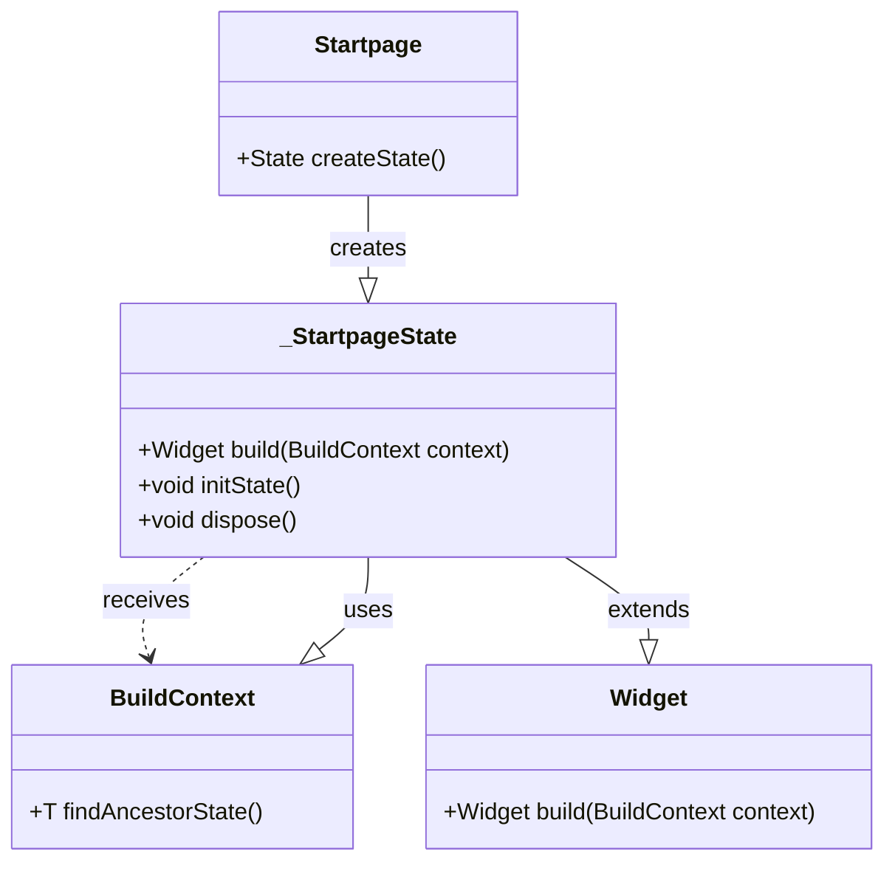

这段代码定义了一个名为 `Startpage` 的 Flutter 组件，它继承自 `StatefulWidget`。以下是对这段代码的详细解释：

### 代码分析


```dart
class Startpage extends StatefulWidget // 保证UI更新
{
  Startpage({super.key});

  @override
  State<Startpage> createState() => _StartpageState();
}
```

#### 1. 类定义

- `class Startpage extends StatefulWidget`：这一行代码定义了一个名为 `Startpage` 的类，它继承自 `StatefulWidget`。`StatefulWidget` 是 Flutter 中用于创建具有可变状态的组件的基类。当组件的状态发生变化时，Flutter 会自动重新构建该组件的 UI。
    

#### 2. 构造函数

- `Startpage({super.key})`：这是 `Startpage` 类的构造函数。它使用了 Dart 的命名参数语法，其中 `super.key` 表示调用父类 `StatefulWidget` 的构造函数，并传递 `key` 参数。`key` 是一个可选参数，用于唯一标识组件，这有助于 Flutter 框架优化渲染和组件树的管理。
    

#### 3. createState 方法

- `@override State<Startpage> createState() => _StartpageState();`：这一行代码覆盖了 `StatefulWidget` 的 `createState` 方法。`createState` 方法是 `StatefulWidget` 必须实现的，它返回一个 `State` 对象，该对象负责管理组件的状态和生命周期。
    
- 在这里，`createState` 返回了一个 `_StartpageState` 类的实例。`_StartpageState` 是 `Startpage` 组件的状态管理类，它将包含组件的 UI 构建逻辑和状态管理代码。
    

### 总结

这段代码定义了一个 `Startpage` 组件，它是一个有状态的组件（`StatefulWidget`）。当需要创建 `Startpage` 的实例时，Flutter 会调用 `createState` 方法来生成一个 `_StartpageState` 对象，这个对象负责管理 `Startpage` 的状态和生命周期。要查看或修改 `Startpage` 的具体行为和 UI，你需要在 `_StartpageState` 类中进行相应的实现。





##  `const Startpage({super.key});` 的作用

#### 1. `const` 关键字的作用

- **常量构造函数**：`const` 关键字用于声明一个常量构造函数。这意味着在编译时，Flutter 可以将这个组件实例化为一个编译时常量。使用常量构造函数可以减少内存占用和提高性能，因为相同的常量对象只会被创建一次，并且可以在多个地方共享。

#### 2. `{super.key}` 参数

- **继承父类的 key**：`super.key` 是 Flutter 中 `StatefulWidget` 和 `StatelessWidget` 构造函数的一个常见参数。`key` 是一个标识符，用于唯一标识小部件树中的 widget。通过传递 `super.key`，你可以确保子类正确地继承了父类的 `key` 属性。
    
    - **用途**：
        - **唯一标识**：当有多个相同类型的 widget 时，`key` 可以帮助 Flutter 区分它们。
        - **状态管理**：在某些情况下，`key` 可以帮助保留或重置 widget 的状态。例如，当你想在列表中移动 widget 时，使用 `key` 可以确保 widget 的状态不会丢失。

#### 3. 总结

- **代码解释**：`const Startpage({super.key});` 定义了一个常量构造函数，并确保 `Startpage` 组件能够接收并传递 `key` 参数给其父类 `StatefulWidget`。这不仅提高了性能，还增强了代码的灵活性和可维护性。

### 示例代码片段


`class Startpage extends StatefulWidget {   const Startpage({super.key}); // 常量构造函数，继承父类的 key   @override   State<Startpage> createState() => _NavaigateComponent(); }`

### 使用场景举例

- **优化性能**：如果你在一个页面中有多个 `Startpage` 实例，使用 `const` 可以确保这些实例是相同的常量对象，从而减少不必要的重建。
- **状态管理**：如果你需要在不同的上下文中使用 `Startpage`，并且希望它能够正确地保留或重置状态，传递 `key` 是非常有用的。

### 非常简明的总结

- `const Startpage({super.key});` 确保 `Startpage` 是一个编译时常量，并且能够接收并传递 `key` 参数给父类，有助于优化性能和管理状态。


##  `Widget build(BuildContext context)` 的作用

#### 1. **`build` 方法的作用**

- **定义 UI 结构**：`build` 方法是每个 Flutter `Widget` 类中的核心方法，用于定义该 Widget 的 UI 结构。它返回一个 `Widget` 或者由多个 `Widget` 组成的树，描述了如何在屏幕上渲染这个 Widget。
- **响应式设计**：Flutter 是基于响应式框架的，`build` 方法会在状态变化时被调用，以确保 UI 能够及时更新。例如，当用户交互、数据变化或屏幕尺寸改变时，`build` 方法会被重新执行，从而刷新界面。

#### 2. **`BuildContext` 参数**

- **上下文信息**：`BuildContext` 是一个指向当前 widget 在 widget 树中位置的引用。通过 `BuildContext`，你可以访问父级 widget、主题、媒体查询等信息。
- **常用操作**：
    - **导航**：使用 `Navigator.of(context)` 进行页面跳转。
    - **获取主题**：使用 `Theme.of(context)` 获取当前主题样式。
    - **获取屏幕尺寸**：使用 `MediaQuery.of(context)` 获取屏幕尺寸和设备信息。

#### 3. **具体代码片段解释**

dart

`Widget build(BuildContext context) {   // 在这里定义和返回具体的 UI 结构 }`

- **`Widget` 返回值**：`build` 方法必须返回一个 `Widget` 或者由多个 `Widget` 组成的树。这可以是简单的文本、按钮，也可以是复杂的布局结构。
- **`context` 参数**：通过 `context` 可以访问当前 widget 的上下文信息，帮助你构建更灵活和动态的 UI。

#### 4. **结合你的代码示例**

假设你在 `MultiTabPage.dart` 文件中有如下代码：

dart

`class MultiTabPage extends StatelessWidget {   @override   Widget build(BuildContext context) {     // 在这里定义和返回具体的 UI 结构     return Column(       children: [         Text('This is a multi-tab page'),         // 其他子组件       ],     );   } }`

在这个例子中：

- `build` 方法定义了 `MultiTabPage` 的 UI 结构。
- 它返回了一个 `Column`，其中包含一个 `Text` 组件和其他可能的子组件。
- `context` 参数允许你在 `build` 方法内部访问上下文信息，例如进行导航或获取主题样式。

#### 5. **总结**

- **`Widget build(BuildContext context)`** 是每个 Flutter `Widget` 类的核心方法，用于定义该 Widget 的 UI 结构。
- **`BuildContext`** 提供了当前 widget 的上下文信息，帮助你构建更灵活和动态的 UI。
- **`build` 方法会在状态变化时被调用**，确保 UI 能够及时更新。

希望这能帮助你理解 `Widget build(BuildContext context)` 的作用。如果你有更多具体问题，欢迎继续提问！‘


# Widget参数介绍

## Scaffold 组件


```dart
(new) Scaffold Scaffold({  
Key? key,  
PreferredSizeWidget? appBar,  
Widget? body,  
Widget? floatingActionButton,  
FloatingActionButtonLocation? floatingActionButtonLocation,  
FloatingActionButtonAnimator? floatingActionButtonAnimator,  
List<Widget>? persistentFooterButtons,  
AlignmentDirectional persistentFooterAlignment = AlignmentDirectional.centerEnd,  
Widget? drawer,  
void Function(bool)? onDrawerChanged,  
Widget? endDrawer,  
void Function(bool)? onEndDrawerChanged,  
Widget? bottomNavigationBar,  
Widget? bottomSheet,  
Color? backgroundColor,  
bool? resizeToAvoidBottomInset,  
bool primary = true,  
DragStartBehavior drawerDragStartBehavior = DragStartBehavior.start,  
bool extendBody = false,  
bool extendBodyBehindAppBar = false,  
Color? drawerScrimColor,  
double? drawerEdgeDragWidth,  
bool drawerEnableOpenDragGesture = true,  
bool endDrawerEnableOpenDragGesture = true,  
String? restorationId,  
})
```


1. **key**：
    
    - 用于控制框架来识别 widget 的唯一标识。
        
2. **appBar**：
    
    - 顶部的应用栏，通常包含标题、返回按钮、动作按钮等。
        
3. **body**：
    
    - 应用的主体内容。
        
4. **floatingActionButton**：
    
    - 浮动操作按钮，通常用于触发应用中的主要操作。
        
5. **floatingActionButtonLocation**：
    
    - 指定浮动操作按钮的位置。
        
6. **floatingActionButtonAnimator**：
    
    - 用于自定义浮动操作按钮的动画效果。
        
7. **persistentFooterButtons**：
    
    - 底部的持久按钮，通常用于显示固定的操作按钮。
        
8. **persistentFooterAlignment**：
    
    - 指定底部持久按钮的对齐方式。
        
9. **drawer**：
    
    - 抽屉导航，通常用于显示侧边菜单。
        
10. **onDrawerChanged**：
    
    - 当抽屉导航的状态改变时调用的回调函数。
        
11. **endDrawer**：
    
    - 右侧的抽屉导航。
        
12. **onEndDrawerChanged**：
    
    - 当右侧抽屉导航的状态改变时调用的回调函数。
        
13. **bottomNavigationBar**：
    
    - 底部导航栏，用于在不同的视图或页面之间切换。
        
14. **bottomSheet**：
    
    - 底部弹出层，用于显示临时信息或操作。
        
15. **backgroundColor**：
    
    - 应用的背景颜色。
        
16. **resizeToAvoidBottomInset**：
    
    - 是否调整大小以避免底部插入（如键盘）。
        
17. **primary**：
    
    - 是否是主要的 `Scaffold`，通常设置为 `true`。
        
18. **drawerDragStartBehavior**：
    
    - 抽屉导航开始拖动时的行为。
        
19. **extendBody**：
    
    - 是否将主体内容扩展到 `AppBar` 后面。
        
20. **extendBodyBehindAppBar**：
    
    - 是否将主体内容扩展到 `AppBar` 后面。
        
21. **drawerScrimColor**：
    
    - 抽屉导航的遮罩颜色。
        
22. **drawerEdgeDragWidth**：
    
    - 抽屉导航边缘拖动的宽度。
        
23. **drawerEnableOpenDragGesture**：
    
    - 是否启用抽屉导航的打开拖动手势。
        
24. **endDrawerEnableOpenDragGesture**：
    
    - 是否启用右侧抽屉导航的打开拖动手势。
        
25. **restorationId**：
    
    - 用于保存和恢复状态的标识符。


## TabBar
```dart
TabBar TabBar({  
Key? key,  
required List<Widget> tabs,  
TabController? controller,  
bool isScrollable = false,  
EdgeInsetsGeometry? padding,  
Color? indicatorColor,  
bool automaticIndicatorColorAdjustment = true,  
double indicatorWeight = 2.0,  
EdgeInsetsGeometry indicatorPadding = EdgeInsets.zero,  
Decoration? indicator,  
TabBarIndicatorSize? indicatorSize,  
Color? dividerColor,  
double? dividerHeight,  
Color? labelColor,  
TextStyle? labelStyle,  
EdgeInsetsGeometry? labelPadding,  
Color? unselectedLabelColor,  
TextStyle? unselectedLabelStyle,  
DragStartBehavior dragStartBehavior = DragStartBehavior.start,  
WidgetStateProperty<Color?>? overlayColor,  
MouseCursor? mouseCursor,  
bool? enableFeedback,  
void Function(int)? onTap,  
ScrollPhysics? physics,  
InteractiveInkFeatureFactory? splashFactory,  
BorderRadius? splashBorderRadius,  
TabAlignment? tabAlignment,  
TextScaler? textScaler,  
TabIndicatorAnimation? indicatorAnimation,  
})
```


1. **key**：
    
    - 用于控制框架来识别 widget 的唯一标识。
        
2. **tabs**：
    
    - 必填参数，是一个 `Widget` 列表，定义了标签页的标题或图标。
        
3. **controller**：
    
    - `TabController` 对象，用于控制标签页的索引和行为。
        
4. **isScrollable**：
    
    - 布尔值，当为 `true` 时，标签页可以横向滚动。
        
5. **padding**：
    
    - 标签页的内边距。
        
6. **indicatorColor**：
    
    - 标签指示器的颜色。
        
7. **automaticIndicatorColorAdjustment**：
    
    - 布尔值，当为 `true` 时，指示器颜色会自动调整以适应标签文本颜色。
        
8. **indicatorWeight**：
    
    - 标签指示器的厚度。
        
9. **indicatorPadding**：
    
    - 标签指示器的内边距。
        
10. **indicator**：
    
    - 自定义标签指示器的装饰。
        
11. **indicatorSize**：
    
    - 标签指示器的大小。
        
12. **dividerColor**：
    
    - 分隔线的颜色，用于在可滚动的标签页之间显示分隔线。
        
13. **dividerHeight**：
    
    - 分隔线的高度。
        
14. **labelColor**：
    
    - 标签文本的颜色。
        
15. **labelStyle**：
    
    - 标签文本的样式。
        
16. **labelPadding**：
    
    - 标签文本的内边距。
        
17. **unselectedLabelColor**：
    
    - 未选中标签文本的颜色。
        
18. **unselectedLabelStyle**：
    
    - 未选中标签文本的样式。
        
19. **dragStartBehavior**：
    
    - 拖动开始时的行为。
        
20. **overlayColor**：
    
    - 标签页指示器的覆盖颜色。
        
21. **mouseCursor**：
    
    - 鼠标悬停在标签上时的光标样式。
        
22. **enableFeedback**：
    
    - 布尔值，当为 `true` 时，点击标签会有触觉反馈。
        
23. **onTap**：
    
    - 当标签被点击时调用的回调函数。
        
24. **physics**：
    
    - 标签页滚动的物理属性。
        
25. **splashFactory**：
    
    - 用于自定义点击标签时的墨水效果。
        
26. **splashBorderRadius**：
    
    - 墨水效果的圆角半径。
        
27. **tabAlignment**：
    
    - 标签对齐方式。
        
28. **textScaler**：
    
    - 标签文本的缩放比例。
        
29. **indicatorAnimation**：
    
    - 标签指示器的动画效果。