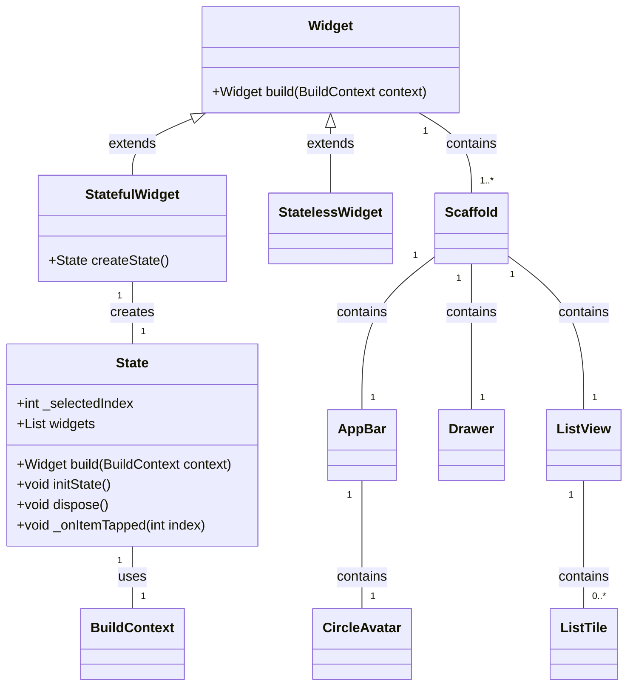

## Dart=CSS+Javascript

用户提到Dart给他们的感觉是集CSS和JavaScript于一体，既能做布局也能写逻辑。这个观点挺有意思的，我得好好琢磨一下怎么回答。

首先，我得理解用户的意图。他们可能是想了解Dart的特点，以及它在布局和逻辑处理上的能力。这让我想到Dart在Flutter框架中的应用，因为Flutter正是利用Dart来构建用户界面和处理业务逻辑的。

我先从布局方面入手。Dart在Flutter中通过Widget系统来实现布局，这和CSS在网页布局中的作用有点像。Widget是Flutter中构建UI的基本单元，它们可以组合成复杂的界面。我得想想怎么用一个简单的例子来说明这一点，比如一个包含文本和按钮的界面。这样用户就能直观地看到Dart是如何进行布局的。

然后是逻辑处理。Dart作为一门编程语言，自然可以处理各种逻辑，比如用户交互、数据处理等。我得想想怎么用一个具体的例子来展示Dart的逻辑处理能力，比如一个简单的计数器应用。这样用户就能看到Dart是如何在Flutter中处理用户交互的。

我还得考虑Dart和JavaScript的比较。用户提到Dart和JavaScript的相似性，这让我想到Dart的一些特性，比如它的语法和JavaScript有些相似，而且Dart也可以编译成JavaScript。我得想想怎么用这些信息来解释Dart和JavaScript的关系。

在思考过程中，我意识到我需要把Dart的特点和Flutter框架结合起来，因为Flutter是Dart的主要应用场景。我得想想怎么用Flutter的例子来展示Dart的能力，这样用户就能更好地理解Dart的用途。

我还得考虑Dart的其他用途，比如服务器端开发和命令行工具。虽然这些可能不是用户最关心的，但提一下可以让用户对Dart有更全面的了解。

在整理这些思路的时候，我突然想到，我可以用一个简单的例子来展示Dart在Flutter中的应用，比如一个包含文本和按钮的界面，以及一个简单的计数器应用。这样用户就能直观地看到Dart是如何在Flutter中进行布局和处理逻辑的。

现在，我觉得我已经有了一个比较清晰的思路，可以开始正式回复用户了。

您的感觉非常准确！Dart 确实是一种集成了多种语言特性的编程语言，它在很多方面结合了 CSS 和 JavaScript 的特点，使得开发者能够用它来同时处理布局和逻辑。以下是一些具体的方面，展示了 Dart 如何在这两方面发挥作用：

### 1. **布局（类似 CSS）**

Dart 本身并不直接处理布局，但在 Flutter 框架中，Dart 被用来构建用户界面，这与 CSS 在 Web 开发中的作用类似。Flutter 使用 Dart 来定义和管理 UI 组件（widgets），这些组件可以组合成复杂的用户界面。

#### 示例代码：

dart复制

```dart
import 'package:flutter/material.dart';

void main() {
  runApp(MyApp());
}

class MyApp extends StatelessWidget {
  @override
  Widget build(BuildContext context) {
    return MaterialApp(
      home: Scaffold(
        appBar: AppBar(
          title: Text('Dart 布局示例'),
        ),
        body: Center(
          child: Column(
            mainAxisAlignment: MainAxisAlignment.center,
            children: <Widget>[
              Text(
                'Hello, Dart!',
                style: TextStyle(fontSize: 24, color: Colors.blue),
              ),
              SizedBox(height: 20),
              ElevatedButton(
                onPressed: () {
                  print('按钮被点击了！');
                },
                child: Text('点击我'),
              ),
            ],
          ),
        ),
      ),
    );
  }
}
```

#### 解析：

- **布局组件**：`Column`、`Row`、`Center` 等组件类似于 CSS 中的布局工具，用于排列和定位 UI 元素。
    
- **样式化**：`TextStyle`、`ElevatedButton` 等组件可以用来设置样式，类似于 CSS 中的样式规则。
    

### 2. **逻辑处理（类似 JavaScript）**

Dart 也支持编写业务逻辑，类似于 JavaScript 在 Web 开发中的作用。Dart 是一种面向对象的编程语言，支持类、函数、异步编程等特性。

#### 示例代码：

dart复制

```dart
void main() {
  int counter = 0;

  void incrementCounter() {
    counter++;
    print('当前计数：$counter');
  }

  // 模拟异步操作
  Future<void> fetchData() async {
    await Future.delayed(Duration(seconds: 2));
    print('数据加载完成！');
  }

  incrementCounter(); // 输出：当前计数：1
  fetchData(); // 输出：数据加载完成！（延迟2秒后）
}
```

#### 解析：

- **函数和变量**：Dart 支持定义函数和变量，用于处理业务逻辑。
    
- **异步编程**：Dart 使用 `Future` 和 `async/await` 语法来处理异步操作，类似于 JavaScript 中的 `Promise` 和 `async/await`。
    

### 3. **Dart 的独特之处**

虽然 Dart 在某些方面类似于 CSS 和 JavaScript，但它也有一些独特的特点：

- **静态类型**：Dart 是静态类型语言，编译时会检查类型错误，这有助于提高代码的可维护性和性能。
    
- **AOT 编译**：Dart 支持 AOT（Ahead-Of-Time）编译，生成高效的本地代码，适用于高性能应用。
    
- **Flutter 框架**：Dart 是 Flutter 的主要编程语言，Flutter 是一个跨平台的 UI 框架，可以用来构建 iOS、Android、Web 和桌面应用。
    

### 4. **Dart 与 JavaScript 的比较**

- **语法**：Dart 的语法类似于 Java 和 C#，比 JavaScript 更严格，例如支持显式类型声明。
    
- **性能**：Dart 的 AOT 编译和 JIT 编译（Just-In-Time）使得它在性能上优于 JavaScript。
    
- **用途**：Dart 主要用于 Flutter 开发，而 JavaScript 主要用于 Web 开发。
    

### 总结

Dart 确实结合了 CSS 和 JavaScript 的一些特性，使得开发者可以用它来同时处理布局和逻辑。特别是在 Flutter 框架中，Dart 的这种特性使得它成为构建跨平台应用的理想选择。如果您对 Flutter 开发感兴趣，Dart 是一个非常值得学习的语言！


# 皆为Widget
每一个Widget都是由其他Widget的嵌套、并列复合而成的，就像一个线性空间一定存在着一组最小正交基，只要保证这组最小正交基，配上运算法则，就能够得到整个线性空间。而嵌套、并列与复合的运算法则配合


以下是使用Mermaid语法创建的图表，展示了一个典型的Flutter Widget的组成及其相互关系：




### 图表解释

- **Widget**：所有Flutter组件的基类，包含`build`方法。
    
- **StatefulWidget** 和 **StatelessWidget**：分别表示有状态和无状态的组件。
    
- **State**：管理StatefulWidget的状态，包含`build`、`initState`和`dispose`方法。
    
- **BuildContext**：上下文对象，用于访问当前组件树中的其他组件状态。
    
- **Scaffold**、**AppBar**、**Drawer**、**ListView**、**CircleAvatar**、**ListTile**：具体的Flutter组件，用于构建UI。
    

这个图表展示了Flutter组件的层次结构和它们之间的关系，以及如何通过这些组件构建一个完整的UI。

```dart
  

// 原生组件库

import 'package:flutter/material.dart';

// 自写组件库

import 'package:AISL_Maid/GUIPage/DisplayPages/Searchpage.dart';

import 'package:AISL_Maid/GUIPage/DisplayPages/Connectpage.dart';

import 'package:AISL_Maid/GUIPage/AuxililaryPage/MultiTabPage.dart';

  
  

// 图标

import 'package:phosphor_flutter/phosphor_flutter.dart';

  
  
  
  

/*初始页面及其衍生的页面*/

  

class Startpage extends StatefulWidget

{

  const Startpage({super.key});

  @override

  State<Startpage> createState() => _StartpageState();

}

  

class _StartpageState extends State<Startpage>

{

  

  int _selectedIndex=0;

  

  List<Widget> widgets=

  [

    Searchpage(),

    Connectpage()

  ];

  
  

  //利用点击函数进行页面的刷新

  void _onItemTapped(int index) {

    setState(() {

      _selectedIndex = index;

    });

  }

  

  @override

  Widget build(BuildContext context) {

    return Scaffold(

      appBar: AppBar(

        backgroundColor: Colors.lightBlue.shade50.withGreen(230),

        title: Text('SHOT MOON'),

        actions: [

          //设置原型的头像

          // IconButton(onPressed: ()=>print("nihao"), icon:),

          // CircleAvatar(

          //   backgroundImage: NetworkImage(r"C:\Users\程煜博\Desktop\VCG211492076912.jpg"),

          //   radius: 20.0, // 设置头像半径

          //

          // ),

  

          //设置复杂的现代化的头像

          InkWell(

            onTap: () {

              // 点击头像时执行的操作

              print('头像被点击了！');

            },

            borderRadius: BorderRadius.circular(100.0), // 圆形边界

            onHover: (bool value) {

  

            },

            child: const CircleAvatar(

              backgroundImage: AssetImage('picture/head.jpg'),

              radius: 20.0,

  

            ),

          )

        ],

      ),

  

      drawer: Drawer(//抽屉

          child: Column(

            children: [

              //drawer的元素的填充

              DrawerHeader(child: Icon(

                  Icons.ac_unit)

              ),

              ListTile(

                  leading: Icon(Icons.account_balance_sharp),

                  title: Text("Startpage"),

                  onTap: (){

                    //点击函数

                    Navigator.pushNamed(context, '/Startpage');

                    // Navigator.pop(context);

                    print("点击");

                  }

              ),

              ListTile(

                  leading: Icon(Icons.account_tree_outlined),

                  title: Text("Resource"),

                  onTap: (){

                    //点击函数

                    Navigator.pushNamed(context, '/tabview/Resourcepage');

                    // Navigator.of(context).pop();

                    print("点击");

                  }

              ),

              ListTile(

                  leading: Icon(

                    PhosphorIcons.gear(PhosphorIconsStyle.fill),

                    size: 32.0,

                  ),

                  title: Text("Setting"),

                  onTap: (){

                    Navigator.pushNamed(context, '/tabview/Settingpage');

                    // Navigator.pop(context);

                    print("点击");

                  }

              )

            ],

          )

      ),

  

      body: Row(

        children:[

          Column(

            children: [

              MediaQuery(

                data: MediaQuery.of(context as BuildContext).copyWith(textScaler: TextScaler.linear(1.0)),

                child: Container(

                    margin: EdgeInsets.only(top: 30,left: 10,bottom: 30,right: 10),

                    width: 60,

                    height: MediaQuery.of(context as BuildContext).size.height * 0.75,

                    decoration: BoxDecoration(

                      gradient: LinearGradient(

                        begin: Alignment.topLeft,

                        end: Alignment.bottomRight,

                        colors: [

                          Colors.blue.shade100,

                          Colors.pink.shade100,

                          Colors.white

                        ],

                      ),

                      // borderRadius: BorderRadius.circular(20.0), // 圆角

                      borderRadius: BorderRadius.only(

                          topLeft: Radius.circular(20),

                          topRight:Radius.circular(20),

                          bottomLeft:Radius.circular(10),

                          bottomRight: Radius.circular(10)

                      ),

                      // 圆角

                      boxShadow: [

                        BoxShadow(

                          color: Colors.black.withOpacity(0.2),

                          spreadRadius: 5,

                          blurRadius: 7,

                          offset: Offset(0, 3), // 阴影偏移

                        ),

                      ],

                      // color: Colors.lightBlueAccent,

                    ),

  

                    child: Align(

                      alignment: Alignment.center,

                      child: ListView(

                        children: [

                          Padding(padding: EdgeInsets.only(top: 10)),

                          Tooltip(

                            message: "搜索",

                            preferBelow: false, // 不优先在下方显示

                            child: IconButton(

                              icon: Icon(

                                PhosphorIcons.cat(),

                                size: 32.0,

                              ),

                              onPressed: () {

                                _onItemTapped(0);

                              },

                            ),

                          ),

  

                          ListTile(

                            title: Text('AI',textAlign: TextAlign.center,style: TextStyle(

  

                            ),),

                            onTap: () {//点击事件

                              _onItemTapped(1);

                            },

                          ),

                          ListTile(

                            title: Text('书桌',textAlign: TextAlign.center),

                            onTap: () {

                              _onItemTapped(2);

                              print('Item 2 tapped');

                            },

                          ),

                          // Add more items as needed

                        ],

                      ),

                    )

                ),

              ),

            ],

          ),

          Expanded(child: Center(

              child: widgets.elementAt(_selectedIndex))

          ),

        ],

      ),

    );

  }

}
```


# 读方法注释

一定要会读方法


```
(new) AppBar AppBar({  
Key? key,  
Widget? leading,  
bool automaticallyImplyLeading = true,  
Widget? title,  
List<Widget>? actions,  
Widget? flexibleSpace,  
PreferredSizeWidget? bottom,  
double? elevation,  
double? scrolledUnderElevation,  
bool Function(ScrollNotification) notificationPredicate = defaultScrollNotificationPredicate,  
Color? shadowColor,  
Color? surfaceTintColor,  
ShapeBorder? shape,  
Color? backgroundColor,  
Color? foregroundColor,  
IconThemeData? iconTheme,  
IconThemeData? actionsIconTheme,  
bool primary = true,  
bool? centerTitle,  
bool excludeHeaderSemantics = false,  
double? titleSpacing,  
double toolbarOpacity = 1.0,  
double bottomOpacity = 1.0,  
double? toolbarHeight,  
double? leadingWidth,  
TextStyle? toolbarTextStyle,  
TextStyle? titleTextStyle,  
SystemUiOverlayStyle? systemOverlayStyle,  
bool forceMaterialTransparency = false,  
Clip? clipBehavior,  
})

_package:flutter/src/material/app_bar.dart_
```

这段说明是 Flutter 框架中 `AppBar` 组件的构造函数参数列表，它定义了 `AppBar` 组件的各种可配置属性。`AppBar` 是 Flutter 中的一个 Widget，用于实现应用中的顶部导航栏。下面是各个参数的简要说明：

- `key`：用于控制框架来识别 widget 的唯一标识。
    
- `leading`：在导航栏左侧显示的 widget，通常是一个图标按钮，如返回按钮。
    
- `automaticallyImplyLeading`：当 `true` 时，如果 `leading` 没有设置，Material 会自动根据平台添加一个返回按钮。
    
- `title`：导航栏标题，通常是一个 `Text` 或 `Widget`。
    
- `actions`：在导航栏右侧显示的操作按钮列表。
    
- `flexibleSpace`：一个 `FlexibleSpaceBar` widget，用于实现滑动时变化的标题栏。
    
- `bottom`：导航栏底部的小部件，通常是一个 `TabBar`。
    
- `elevation`：阴影高度，用于实现阴影效果。
    
- `scrolledUnderElevation`：当内容滚动到 AppBar 下面时的阴影高度。
    
- `notificationPredicate`：一个函数，用于决定这个 AppBar 是否应该响应滚动通知。
    
- `shadowColor`：阴影颜色。
    
- `surfaceTintColor`：表面颜色，用于改变 AppBar 的颜色。
    
- `shape`：定义 AppBar 形状的 `ShapeBorder`。
    
- `backgroundColor`：背景颜色。
    
- `foregroundColor`：前景颜色，通常用于文本和图标。
    
- `iconTheme`：图标主题，用于定义图标的颜色和大小。
    
- `actionsIconTheme`：操作按钮的图标主题。
    
- `primary`：当 `true` 时，表示 AppBar 是 Scaffold 的主要部分。
    
- `centerTitle`：当 `true` 时，标题居中显示。
    
- `excludeHeaderSemantics`：当 `true` 时，AppBar 不会在 Semantics 中包含标题和操作按钮。
    
- `titleSpacing`：标题与领先按钮之间的间距。
    
- `toolbarOpacity`：工具栏的不透明度。
    
- `bottomOpacity`：底部小部件的不透明度。
    
- `toolbarHeight`：工具栏的高度。
    
- `leadingWidth`：领先按钮的宽度。
    
- `toolbarTextStyle`：工具栏文本样式。
    
- `titleTextStyle`：标题文本样式。
    
- `systemOverlayStyle`：系统覆盖层样式，用于定义状态栏和刘海的处理方式。
    
- `forceMaterialTransparency`：强制 Material 风格透明。
    
- `clipBehavior`：定义 AppBar 如何剪裁其子组件。
    

```ad-note
title:注意
- 重点关注widget项，这是你能插入其他库里或者你自己的widget组件的属性

```

# 空间怎归属
某个指针停留的位置穿透了几层的widget，他们的父子关系是怎样的都要考虑清楚


# 代码间交互
- 在A.dart中想要调用B.dart中写好的widget


# 文件的架构

创建一个科学合理的Flutter项目的目录架构，关键在于保持代码的组织性、可读性和可维护性。以下是一个推荐的Flutter项目[目录结构](https://so.csdn.net/so/search?q=%E7%9B%AE%E5%BD%95%E7%BB%93%E6%9E%84&spm=1001.2101.3001.7020)，它遵循了良好的编程实践，并便于团队协作：

```bash
my_app/
├── android/             # Android相关的原生代码和配置文件
│   └── ...
├── ios/                 # iOS相关的原生代码和配置文件
│   └── ...
├── lib/                 # 主要的Dart代码存放目录
│   ├── assets/          # 静态资源，如图片、字体等
│   ├── constants/       # 项目常量定义
│   ├── models/          # 数据模型定义
│   ├── pages/           # 页面组件，每个页面一个文件夹
│   │   ├── home/
│   │   │   ├── home_page.dart
│   │   │   └── ...
│   │   ├── about/
│   │   │   └── about_page.dart
│   │   └── ...
│   ├── providers/       # 状态管理，如Provider或Riverpod的实现
│   ├── repositories/    # 数据仓库层，负责数据获取逻辑
│   ├── services/        # 网络服务、本地存储等服务类
│   ├── utils/           # 工具类和帮助函数
│   ├── widgets/         # 可复用UI组件
│   │   ├── buttons/
│   │   ├── cards/
│   │   └── ...
│   ├── app.dart         # 应用程序入口文件
│   └── main.dart        # 主函数入口
├── test/                # 单元测试和 widget 测试文件
│   └── ...
├── pubspec.yaml         # 项目配置文件，包含依赖、版本信息等
├── analysis_options.yaml # 分析器配置文件，定制代码规范检查
└── .gitignore            # Git忽略文件列表
```

[android](https://so.csdn.net/so/search?q=android&spm=1001.2101.3001.7020)/ 和 ios/ 目录下存放特定于平台的原生代码和资源配置，如AndroidManifest.xml或Info.plist。

lib/ 目录是项目的核心Dart代码所在目录，应当按照功能模块和职责划分进一步细分为多个子目录。

assets/ 目录放置项目中使用的静态资源，如图片、音频、字体文件等。

constants/ 目录集中定义项目中使用的常量，如字符串常量、颜色代码、API端点等。也可取名为 config目录。

models/ 目录是数据模型定义，用于描述数据结构。

pages/ 目录是每个主要页面或屏幕一个文件夹，便于管理和组织页面逻辑。

providers/ 目录是状态管理层，根据所选的状态管理库（如Provider、Riverpod等）来组织代码。

repositories/ 或 http/ 目录负责数据访问逻辑，包括网络请求和数据库操作。

services/ 目录负责封装底层服务，如网络服务、本地存储服务等。

utils/ 目录是通用工具类和辅助函数，提高代码复用。

widgets/ 目录中是可复用的UI组件，根据组件类型进一步细分。

main.dart 文件是应用程序的入口文件，是程序启动时执行的。app.dart 文件可以作为应用级别的widget配置。

test/ 目录是存放单元测试和Widget测试，确保代码质量。

pubspec.yaml 文件是项目元数据和依赖项配置文件。

.gitignore 文件定义哪些文件或目录不应被Git版本控制系统跟踪。

遵循这样的结构，可以使得项目结构清晰，易于扩展和维护，同时也方便团队成员快速定位和理解代码。当然，根据实际项目需求，此结构可以适当调整。遵循以上规则能达到事半功倍的效果。