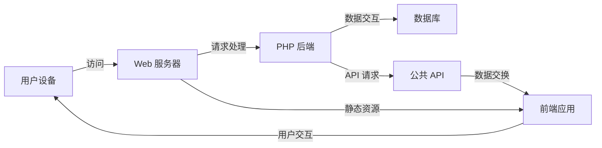

>**前言**：

|     |     |
| --- | --- |
|     |     |
|     |     |

|     |
| --- |
<center>表：本教程你可以学到的内容</center>

|     |     |
| --- | --- |
|     |     |

|     |
| --- |
<center>表：本教程的技术关键点</center>

# 1. 框架了解

## 1.1 框架简介
Flarum 是一款现代、简洁且高扩展性的开源论坛软件。它旨在提供快速、简单且美观的用户体验，同时具备强大的可定制性和扩展性。Flarum 的设计理念包括：

- **快速、简单**：Flarum 不臃肿、不复杂，基于 PHP 构建，部署简便。前端采用高性能的 Mithril.js 框架，确保快速响应。
    
    [flarum.org.cn](https://flarum.org.cn/?utm_source=chatgpt.com)
    
- **美观、响应式**：Flarum 提供精美的用户界面，开箱即用，支持跨平台访问，界面风格使用 LESS，方便更换主题。
    
    [flarum.org.cn](https://flarum.org.cn/?utm_source=chatgpt.com)
    
- **强大、可扩展**：Flarum 拥有强大的扩展 API，允许用户定制、扩展和集成，以满足不同社区的需求。
    
    [flarum.org.cn](https://flarum.org.cn/?utm_source=chatgpt.com)
    
- **免费、开源**：Flarum 遵循 MIT 许可证发布，完全免费且开源，鼓励社区共同参与改进。

| 特性     | Flarum                | 传统 BBS 论坛               |
| ------ | --------------------- | ----------------------- |
| 界面设计   | ✅ 现代、简约、美观            | ❌ 相对老旧、界面复杂             |
| 移动端适配  | ✅ 响应式设计，自动适配不同屏幕      | ❌ 大多未针对移动端优化            |
| 社交互动   | ✅ 点赞、@提及、站内通知等丰富的互动功能 | ❌ 互动形式相对单一              |
| 实时性    | ✅ 内容更新近乎实时，无需刷新页面     | ❌ 实时性相对较弱               |
| 可扩展性   | ✅ 模块化设计，支持插件扩展功能      | ❌ 可扩展性相对有限              |
| 用户权限管理 | ✅ 细粒度的用户组权限设置         | ✅ 通常也有比较完善的权限管理         |
| 功能丰富程度 | ❌ 相对较新，功能还在不断完善中      | ✅ 经过多年发展,功能非常丰富         |
| 用户习惯   | ❌ 现代化的界面和交互方式可能需要用户适应 | ✅ 很多用户已经习惯了传统 BBS 的使用方式 |


## 1.2 框架架构
Flarum 采用三层架构设计：

1. **后端（Backend）**：使用面向对象的 PHP 编写，基于 Laravel 框架构建，负责处理业务逻辑和数据管理。
    
    [bookstack.cn](https://www.bookstack.cn/read/flarum-doc/extend-introduction.md?utm_source=chatgpt.com)
    
2. **API 层（API Layer）**：提供遵循 JSON:API 规范的公共 API，使前端与后端分离，支持灵活的数据交互。
    
    [bookstack.cn](https://www.bookstack.cn/read/flarum-doc/extend-introduction.md?utm_source=chatgpt.com)
    
3. **前端（Frontend）**：基于 Mithril.js 框架开发的单页应用（SPA），提供流畅的用户交互体验。




<center>表1：Flarum交互框架</center>

## 1.3 框架原理
Flarum 的核心原理包括以下方面：

- **领域层（Domain Layer）**：负责管理论坛的数据结构和业务逻辑，例如讨论、帖子、用户和群组等。
    
    [bookstack.cn](https://www.bookstack.cn/read/flarum-doc/extend-introduction.md?utm_source=chatgpt.com)
    
- **接口层（API Layer）**：提供符合 JSON:API 规范的接口，使前端和后端能够通过标准化的方式进行数据交互。
    
    [bookstack.cn](https://www.bookstack.cn/read/flarum-doc/extend-introduction.md?utm_source=chatgpt.com)
    
- **客户端（Client）**：提供用户界面，包括公共的论坛部分和管理员控制面板，前端使用 Mithril.js 实现单页应用，确保流畅的用户体验。
    
    [bookstack.c](https://www.bookstack.cn/read/flarum-doc/extend-introduction.md?utm_source=chatgpt.com)

#  2. 环境部署
## 2.1. 前提了解

> 注意：Flarum 使用 [Composer](https://getcomposer.org/) 管理依存关系和扩展。这意味着 **Flarum 没法在没有 SSH（命令行）连接的主机上安装**。我们未来会保证 Flarum 能用其他的方法安装，使之可被所有人使用。与此同时，如果现在你希望运行 Flarum，你需要寻找允许 SSH 连接的主机。


- 开发平台系统环境：Windows 11 家庭中文版 24H2 26100.3194
- 开发平台硬件环境：Intel(R) Core(TM) i7-14650HX   2.20 GHz/RTX 3060 Laptop

| 服务       | 版本         | 本次是否使用 | 技术类型   |
| -------- | ---------- | ------ | ------ |
| Flarum   | 1.8.0      | 是      | 论坛框架   |
| PHP      | 8.0.26     | 是      | 后端     |
| Composer | 2.8.6      | 是      | PHP包控制 |
| SSH      |            | 是      | 命令控制   |
| NodeJS   | 22.14.0LTS | 是      | 前端     |
|          |            |        |        |
| MySQL    | 5.7.44     | 是      | 数据库    |
| MariaDB  |            | 否      | 数据库    |
|          |            |        |        |
| Nginx    | 1.24.0     | 是      | 反代服务   |
| Apache   |            | 否      | 反代服务   |
| Lighttpd |            | 否      | 反代服务   |


## 2.2. 环境准备


### 2.2.1. 安装PHP

前面我们提到Flarum的后端架构是基于 PHP 的 Laravel 框架编写，为此我们先需要准备相应的PHP环境，待环境部署完成后才能够进行下一步的动作


1. **下载 PHP 8.0.26**：
    
    - 访问 [PHP 旧版官方下载页面](https://windows.php.net/downloads/releases/archives/)
    - 按下Ctrl+F进行网页内容检索，输入`php-8.0.26`，出现下图
	    
    - 在 "PHP 8.0 (8.0.26)" 部分，选择适合您系统的版本：一般选`php-8.0.26-Win32-vs16-x64.zip`版本，五个8.0.26文件的命名区别如下

		- **php-8.0.26-Win32-vs16-x64.zip** 和 **php-8.0.26-Win32-vs16-x86.zip**:
		    - 这些是 Windows 版本的 PHP 二进制文件，`x64` 和 `x86` 分别表示 64 位和 32 位系统架构。您需要根据自己的操作系统架构选择合适的版本：
		        - `x64` 适用于 64 位系统。
		        - `x86` 适用于 32 位系统。
		- **php-8.0.26-nts-Win32-vs16-x64.zip** 和 **php-8.0.26-nts-Win32-vs16-x86.zip**:
		    - `nts` 表示 Non-Thread Safe，即非线程安全版本，适用于使用 FastCGI 或 CGI 的服务器（例如 IIS）。如果您使用 Apache 服务器并启用了多线程，应该选择线程安全（`ts`）版本；如果使用 FastCGI，推荐使用 Non-Thread Safe（`nts`）版本。
		- **php-8.0.26-src.zip**:
		    - 这是 PHP 的源码包，通常用于编译 PHP，适合需要根据需求定制 PHP 的开发者。
		    - 点击相应版本的 "Zip" 下载链接，例如 `PHP8.0.26 tar.gz`
	
	
2. **解压缩文件**：
	
    - 将下载的 ZIP 文件解压到您希望安装 PHP 的目录，此处我是 `D:\Environment\PHP`。
	
	
3. **配置环境变量**：
    
    - 右键点击“此电脑”或“计算机”，选择“属性”。
    - 点击“高级系统设置”。
    - 在“系统属性”窗口中，点击“环境变量”按钮。
    - 在“系统变量”区域，找到并选中“Path”变量，点击“编辑”。
    - 在编辑窗口中，点击“新建”，添加 PHP 的安装目录路径，此处我是 `D:\Environment\PHP\php-8.0.26`。
    - 点击“确定”保存更改。
	- 然后重启计算机

4. **验证安装**：
    
    - 打开命令提示符：按下 `Win + R` 键，输入 `cmd`，然后回车。
    - 在命令提示符中，输入 `php -v`，如果显示 PHP 版本信息，说明安装成功。

**注意事项**：

- 确保您的系统已安装 Visual C++ Redistributable，因为 PHP 需要它来运行。
- 如果计划将 PHP 与 Apache 一起使用，确保下载与您的 Apache 版本兼容的 PHP 版本。
- 根据需要，您可以进一步配置 PHP，例如设置时区、启用其他扩展等。

### 2.2.2. 安装SSH
由于Windows默认自带SSH，此步骤略

### 2.2.3. 安装MySQL

 1. **下载 MySQL 安装程序**
	1. 访问 MySQL 官方下载页面：[MySQL :: Download MySQL Installer](https://dev.mysql.com/downloads/windows/installer/5.7.html)
	2. 选择 **MySQL Installer for Windows**，并下载适合您的系统架构的安装包
		1. 点击 373.3M 右侧的 Download 按钮
		
		2. 点击下方的 No thanks ,just start my download 按钮
		
		

---


 2. **运行 MySQL 安装程序**
	1. 双击下载的 `.msi` 文件，启动安装向导。
	    
	2. **选择安装类型**：
	    
	    - 在安装向导中，您会看到几个安装选项：
	        - **Server Only**：仅安装 MySQL Server。
	        - **Client Only**：仅安装 MySQL 客户端。
	        - **Full**：包含所有 MySQL 相关工具。
	        - **Custom**：自定义安装组件。
	    
		    对于大多数用户，选择 **Server Only** 即可。
		- 在 Installation 界面继续点击下一步
		    
	3. 点击 **Next**。
		
	    
---


3. **检查系统要求**
	
	安装程序会自动检查系统是否满足 MySQL 的最低要求。如果一切正常，点击 **Next**。

---


 4. **选择配置类型**

	1. **选择 MySQL Server 配置类型**：
		    
	    - **Development Computer**：适用于开发环境。
	    - **Server Computer**：适用于生产环境。
	    - **Dedicated Machine**：适用于专用服务器。
	    
	    对于大多数用户，选择 **Development Computer**。
	    
	2. 配置端口号（默认情况下为 `3306`）并设置 MySQL 的服务器配置。您可以保留默认配置，点击 **Next**。
	    
---


 5. **设置 MySQL 根用户密码**

	1. **设置 root 用户密码**（这个密码后面得用，得记住了！）
		
	    - 在此步骤中，您将需要设置 MySQL `root` 用户的密码。确保记住密码，因为您将用它来登录到 MySQL。
	2. 您还可以选择启用 **TCP/IP 网络访问** 和 **MySQL 的加密连接**，根据需要勾选这些选项。
	    
	3. 点击 **Next**。


---

6. **配置 MySQL 服务**

	1.  **选择 MySQL 服务设置**：
	    
	    - **Configure MySQL Server as a Windows Service**：这意味着 MySQL 将作为 Windows 服务运行，并且可以随 Windows 启动。
	    - **Start MySQL Server at System Startup**：启用时，MySQL 服务将在计算机启动时自动启动。
	    
	    选择 **Start MySQL Server at System Startup** 和 **Configure MySQL Server as a Windows Service**（这对于大多数用户是推荐的配置），然后点击 **Next**。
    


7. **完成安装并启动 MySQL**

	2. **开始安装**： 安装程序将开始安装 MySQL Server 和所选的其他工具。
	    
	3. **确认应用设置**，点击 **Execute**
		
	4. **安装完成后**，点击 **Finish**。
		
---


 8. **验证 MySQL 安装**

	1. 按下 **Win** 键，并输入`MySQL 5.7 Command Line Client`回车
		
		
		
	2. 输入在安装过程中设置的用户密码。
		
	3. 如果您成功登录，您将看到 MySQL 提示符：
		
	    
		这意味着 MySQL 已成功安装并正在运行。


---

10. **为Flarum创建数据库**
	1. 打开并MySQL终端并登入MySQL，输入前面安装 MySQL 时所设置的 MySQL 密码
		
	2. 创建一个名为 `flarum` 的数据库，使用 `utf8mb4` 字符集和 `utf8mb4_unicode_ci` 校对规则，输入如下命令（注意，这个数据库后面得用）
		
		`create database Flarum character set utf8mb4 collate utf8mb4_unicode_ci;`
		
		
		<center>图：粘贴到终端上的完整命令</center>
		
	3. 选中已经创建的表，验证是否成功创建，输入如下命令
		
		`USE flarum;`
		
		
		<center>图：成功创建数据库后执行上述命令的输出结果</center>
---


 11. **配置环境变量（可选）**
	1. 为了方便在命令行中使用 MySQL，您可以将 MySQL 的 `bin` 目录添加到系统环境变量中：
	
		1. 找到 MySQL 安装目录，例如：`C:\Program Files\MySQL\MySQL Server 8.0\bin`。
		2. 右键点击 **此电脑**，选择 **属性**，然后选择 **高级系统设置**。
		3. 在 **系统属性** 窗口中，点击 **环境变量**。
		4. 在 **系统变量** 部分，找到并选择 **Path**，然后点击 **编辑**。
		5. 在弹出的窗口中，点击 **新建**，然后将 `bin` 目录路径粘贴到其中。
		6. 点击 **确定**，然后关闭所有窗口。
		
		通过这种方式，您可以在任何位置通过命令行访问 MySQL。


### 2.2.4. 安装Composer

Flarum 重度依赖 Composer 提供的依赖管理机制。这里也简单地梳理一下 Composer 是什么东西。

过去 PHP 刀耕火种年代，并不存在依赖管理的机制。开发者在使用第三方包，常常都是直接复制粘贴，没有统一标准，人们常常都在重复造轮子，搞得十分混乱，进一步来说也制约着 PHP 社区的发展壮大。

后来在社区的驱动下，有了 [Composer](https://getcomposer.org/)，借鉴了 [NPM](https://www.npmjs.com/) 与 [Gem Bundler](http://gembundler.com/)，设计了 PHP 语言下的依赖加载机制。Composer 本身也是一个 PHP 脚本，可以直接在官网下载安装，在命令行运行。

使用 Composer 管理依赖的项目，会有一个依赖描述文件 `composer.json`。在 composer 安装后，会生成一个锁定依赖版本的 `composer.lock`，以及保存 Composer 配置的依赖包的 `vendor` 目录。

在项目入口的 PHP，需引入 Composer 根据依赖生成的自动加载配置文件 `vendor/autoload.php`，这一文件根据 [PSR-4](https://www.php-fig.org/psr/psr-4/) 约定的自动加载标准，使用 PHP 提供的 `spl_autoload_register` 函数注册自动加载器，处理一系列的依赖加载的问题。引入这个配置文件后，在使用类或函数时，PHP 会自动把需要的依赖加载进来。

Flarum 脚手架在 `site.php` 引入了 Composer 的 `vendor/autoload.php`，接下来所有的逻辑与扩展，均通过 Composer 提供的自动加载器加载。


1. **下载 Composer 安装程序**
	
	- 访问官方 Composer 网站：https://getcomposer.org/download/
	- 点击 **"Windows Installer"** 下载 `Composer-Setup.exe` 安装程序（默认下载最新版本即可）

| [Latest 1.x](https://getcomposer.org/download/latest-1.x/composer.phar "Get the latest composer 1.x stable release") ([sha256](https://getcomposer.org/download/latest-1.x/composer.phar.sha256 "Get the latest composer 1.x stable release's SHA256 sum") / [sha256sum](https://getcomposer.org/download/latest-1.x/composer.phar.sha256sum "Get the latest composer 1.x stable release's SHA256 sum in sha256sum format"))                                                                                                                                                                                 |     |
| ------------------------------------------------------------------------------------------------------------------------------------------------------------------------------------------------------------------------------------------------------------------------------------------------------------------------------------------------------------------------------------------------------------------------------------------------------------------------------------------------------------------------------------------------------------------------------------------------------------ | --- |
| [Latest 2.x](https://getcomposer.org/download/latest-2.x/composer.phar "Get the latest composer 2.x stable release") ([sha256](https://getcomposer.org/download/latest-2.x/composer.phar.sha256 "Get the latest composer 2.x stable release's SHA256 sum") / [sha256sum](https://getcomposer.org/download/latest-2.x/composer.phar.sha256sum "Get the latest composer 2.x stable release's SHA256 sum in sha256sum format") / [asc](https://getcomposer.org/download/latest-2.x/composer.phar.asc "Get the latest composer 2.x release's PGP signature"))                                                    | 正式版 |
| [Latest 2.2.x LTS](https://getcomposer.org/download/latest-2.2.x/composer.phar "Get the latest composer 2.2.x LTS stable release") ([sha256](https://getcomposer.org/download/latest-2.2.x/composer.phar.sha256 "Get the latest composer 2.2.x stable release's SHA256 sum") / [sha256sum](https://getcomposer.org/download/latest-2.2.x/composer.phar.sha256sum "Get the latest composer 2.2.x stable release's SHA256 sum in sha256sum format") / [asc](https://getcomposer.org/download/latest-2.2.x/composer.phar.asc "Get the latest composer 2.2.x release's PGP signature")) for PHP 5.3 to 7.1 users | 正式版 |
| [Latest Stable](https://getcomposer.org/download/latest-stable/composer.phar "Get the latest composer stable release") ([sha256](https://getcomposer.org/download/latest-stable/composer.phar.sha256 "Get the latest composer stable release's SHA256 sum") / [sha256sum](https://getcomposer.org/download/latest-stable/composer.phar.sha256sum "Get the latest composer stable release's SHA256 sum in sha256sum format") / [asc](https://getcomposer.org/download/latest-stable/composer.phar.asc "Get the latest composer stable release's PGP signature")) for PHP 7.2+ users                           | 正式版 |
| [Latest Preview (alpha/beta/RC)](https://getcomposer.org/download/latest-preview/composer.phar "Get the latest composer preview release") ([sha256](https://getcomposer.org/download/latest-preview/composer.phar.sha256 "Get the latest composer preview release's SHA256 sum") / [sha256sum](https://getcomposer.org/download/latest-preview/composer.phar.sha256sum "Get the latest composer preview release's SHA256 sum in sha256sum format") / [asc](https://getcomposer.org/download/latest-preview/composer.phar.asc "Get the latest composer preview release's PGP signature"))                     | 预览版 |
| [Latest Snapshot](https://getcomposer.org/composer.phar "Get the latest composer snapshot") ([sha256](https://getcomposer.org/composer.phar.sha256 "Get the latest composer snapshot's SHA256 sum") / [sha256sum](https://getcomposer.org/composer.phar.sha256sum "Get the latest composer snapshot's SHA256 sum in sha256sum format"))                                                                                                                                                                                                                                                                      |     |
<center>表：Composer PHP版本对应表</center>


2. **运行安装程序**
	
	1. **双击** 下载的 `Composer-Setup.exe` 文件。
	2. **选择 PHP 解释器**：
	    - 安装程序会提示您选择 PHP 可执行文件（`php.exe`）。
	    - 点击 **"浏览 (Browse)"**，然后选择 PHP 安装目录下的 `php.exe` 文件（例如 `C:\php\php.exe`）。
	3. **选择代理设置（可跳过）**：
	    - 如果您不使用代理，直接点击 **"Next"** 继续。
	4. **确认安装**：
	    - 点击 **"Install"** 开始安装。
	5. **安装完成**：
	    - 安装完成后，勾选 **"Add Composer to PATH"**（将 Composer 添加到系统环境变量）。
	    - 点击 **"Finish"** 结束安装。


3. **验证 Composer 是否安装成功**
	
	6. 打开 **命令提示符 (cmd)** 或 **PowerShell**。
	7. 输入以下命令检查 Composer 是否成功安装：
	    
	    `composer -V`
	    
	8. 如果安装成功，您会看到类似以下的输出：
		
	    `Composer version 2.x.x 202X-XX-XX`
    


【问题集锦】
 
- 问题描述：**命令行提示 `composer` 不是内部或外部命令**
- 问题分析：
	- 可能是环境变量未正确添加。
- 方案尝试：
	- 打开 **"此电脑" → "属性" → "高级系统设置" → "环境变量"**。
	- 在 **"系统变量"** 部分，找到 `Path`，点击 **"编辑"**，然后添加 Composer 安装路径（通常是 `C:\ProgramData\ComposerSetup\bin`）。
- 方案检验：
	 -  重新打开命令提示符，再次运行 `composer -V` 进行检查。


---


### 2.2.5. 安装Flarum


| Flarum Version | PHP Version       | Public Path | Type   | Archive                                                                                                                                                   |
| -------------- | ----------------- | ----------- | ------ | --------------------------------------------------------------------------------------------------------------------------------------------------------- |
| 1.x            | 8.3 (recommended) | No          | ZIP    | [flarum-v1.x-no-public-dir-php8.3.zip](https://github.com/flarum/installation-packages/raw/main/packages/v1.x/flarum-v1.x-no-public-dir-php8.3.zip)       |
| 1.x            | 8.3 (recommended) | Yes         | TAR.GZ | [flarum-v1.x-php8.3.tar.gz](https://github.com/flarum/installation-packages/raw/main/packages/v1.x/flarum-v1.x-php8.3.tar.gz)                             |
| 1.x            | 8.3 (recommended) | No          | TAR.GZ | [flarum-v1.x-no-public-dir-php8.3.tar.gz](https://github.com/flarum/installation-packages/raw/main/packages/v1.x/flarum-v1.x-no-public-dir-php8.3.tar.gz) |
| 1.x            | 8.3 (recommended) | Yes         | ZIP    | [flarum-v1.x-php8.3.zip](https://github.com/flarum/installation-packages/raw/main/packages/v1.x/flarum-v1.x-php8.3.zip)                                   |
| 1.x            | 8.2 (recommended) | No          | TAR.GZ | [flarum-v1.x-no-public-dir-php8.2.tar.gz](https://github.com/flarum/installation-packages/raw/main/packages/v1.x/flarum-v1.x-no-public-dir-php8.2.tar.gz) |
| 1.x            | 8.2 (recommended) | Yes         | TAR.GZ | [flarum-v1.x-php8.2.tar.gz](https://github.com/flarum/installation-packages/raw/main/packages/v1.x/flarum-v1.x-php8.2.tar.gz)                             |
| 1.x            | 8.2 (recommended) | No          | ZIP    | [flarum-v1.x-no-public-dir-php8.2.zip](https://github.com/flarum/installation-packages/raw/main/packages/v1.x/flarum-v1.x-no-public-dir-php8.2.zip)       |
| 1.x            | 8.2 (recommended) | Yes         | ZIP    | [flarum-v1.x-php8.2.zip](https://github.com/flarum/installation-packages/raw/main/packages/v1.x/flarum-v1.x-php8.2.zip)                                   |
| 1.x            | 8.1               | No          | TAR.GZ | [flarum-v1.x-no-public-dir-php8.1.tar.gz](https://github.com/flarum/installation-packages/raw/main/packages/v1.x/flarum-v1.x-no-public-dir-php8.1.tar.gz) |
| 1.x            | 8.1               | Yes         | TAR.GZ | [flarum-v1.x-php8.1.tar.gz](https://github.com/flarum/installation-packages/raw/main/packages/v1.x/flarum-v1.x-php8.1.tar.gz)                             |
| 1.x            | 8.1               | No          | ZIP    | [flarum-v1.x-no-public-dir-php8.1.zip](https://github.com/flarum/installation-packages/raw/main/packages/v1.x/flarum-v1.x-no-public-dir-php8.1.zip)       |
| 1.x            | 8.1               | Yes         | ZIP    | [flarum-v1.x-php8.1.zip](https://github.com/flarum/installation-packages/raw/main/packages/v1.x/flarum-v1.x-php8.1.zip)                                   |
| 1.x            | 8.0 (end of life) | No          | TAR.GZ | [flarum-v1.x-no-public-dir-php8.0.tar.gz](https://github.com/flarum/installation-packages/raw/main/packages/v1.x/flarum-v1.x-no-public-dir-php8.0.tar.gz) |
| 1.x            | 8.0 (end of life) | Yes         | TAR.GZ | [flarum-v1.x-php8.0.tar.gz](https://github.com/flarum/installation-packages/raw/main/packages/v1.x/flarum-v1.x-php8.0.tar.gz)                             |
| 1.x            | 8.0 (end of life) | No          | ZIP    | [flarum-v1.x-no-public-dir-php8.0.zip](https://github.com/flarum/installation-packages/raw/main/packages/v1.x/flarum-v1.x-no-public-dir-php8.0.zip)       |
| 1.x            | 8.0 (end of life) | Yes         | ZIP    | [flarum-v1.x-php8.0.zip](https://github.com/flarum/installation-packages/raw/main/packages/v1.x/flarum-v1.x-php8.0.zip)                                   |
| 1.x            | 7.4 (end of life) | No          | TAR.GZ | [flarum-v1.x-no-public-dir-php7.4.tar.gz](https://github.com/flarum/installation-packages/raw/main/packages/v1.x/flarum-v1.x-no-public-dir-php7.4.tar.gz) |
| 1.x            | 7.4 (end of life) | Yes         | TAR.GZ | [flarum-v1.x-php7.4.tar.gz](https://github.com/flarum/installation-packages/raw/main/packages/v1.x/flarum-v1.x-php7.4.tar.gz)                             |
| 1.x            | 7.4 (end of life) | No          | ZIP    | [flarum-v1.x-no-public-dir-php7.4.zip](https://github.com/flarum/installation-packages/raw/main/packages/v1.x/flarum-v1.x-no-public-dir-php7.4.zip)       |
| 1.x            | 7.4 (end of life) | Yes         | ZIP    | [flarum-v1.x-php7.4.zip](https://github.com/flarum/installation-packages/raw/main/packages/v1.x/flarum-v1.x-php7.4.zip)                                   |
| 1.x            | 7.3 (end of life) | No          | TAR.GZ | [flarum-v1.x-no-public-dir-php7.3.tar.gz](https://github.com/flarum/installation-packages/raw/main/packages/v1.x/flarum-v1.x-no-public-dir-php7.3.tar.gz) |
| 1.x            | 7.3 (end of life) | Yes         | TAR.GZ | [flarum-v1.x-php7.3.tar.gz](https://github.com/flarum/installation-packages/raw/main/packages/v1.x/flarum-v1.x-php7.3.tar.gz)                             |
| 1.x            | 7.3 (end of life) | No          | ZIP    | [flarum-v1.x-no-public-dir-php7.3.zip](https://github.com/flarum/installation-packages/raw/main/packages/v1.x/flarum-v1.x-no-public-dir-php7.3.zip)       |
| 1.x            | 7.3 (end of life) | Yes         | ZIP    | [flarum-v1.x-php7.3.zip](https://github.com/flarum/installation-packages/raw/main/packages/v1.x/flarum-v1.x-php7.3.zip)                                   |

<center>表：版本-生命周期支持表</center>


1. **配置 `php.ini` 文件**：
	
    1. 在 PHP 安装目录中，找到 `php.ini-development` 文件，将其复制并重命名为 `php.ini`。(**如果有这个文件则跳过这一步**)
    2.  在 PHP 安装目录中新建一个`extension`文件夹
    3. 使用文本编辑器打开 `php.ini` 文件，进行以下修改：
        - 设置扩展目录：打开文件，按下Ctrl+F，输入 `;extension_dir = "./"`，去掉前面的分号，并修改为 `extension_dir = "D:\Environment\PHP\php-8.0.26\extension"`
        - 启用所需的扩展：打开文件，按下Ctrl+F，输入 `;extension=mbstring`，去掉前面的分号以启用 MySQLi 扩展—— `fileinfo，mbstring，openssL，gd,pdo_mysql`
		
		
		 **必须启用的扩展说明**
			1. `pdo_mysql` —— 用于 MySQL 数据库连接（Flarum 默认使用 MySQL）。
			2. `mbstring` —— 处理多字节字符串（用于 UTF-8 字符处理）。
			3. `json` —— 处理 JSON 数据（Flarum 依赖 JSON 交互）——**这个扩展默认启用**
			4. `openssl` —— 进行安全的加密和解密（用于 HTTPS 连接和加密功能）。
			5. `gd` 或 `imagick` —— 用于处理图像（如头像上传）。
			6. `dom` 和 `xml` —— 用于解析 HTML 和 XML（Flarum 依赖它们处理 Markdown 和 BBCode）。—**这个扩展默认启用**
			7. `fileinfo` —— 用于 MIME 类型检测（更好的文件上传体验）。
			8. `curl`
		 **推荐启用的扩展说明**
			9. `exif` —— 处理图像的 EXIF 元数据（避免图片上传后旋转问题）。
			10. `zip` —— 用于处理 ZIP 文件（可能用于插件安装）。


2. **安装Flarum**
	1. 4. 境
		确保您的系统中已经安装了 PHP 以及 Composer，且已启用必要的 PHP 扩展（如 `pdo_mysql`、`mbstring`、`json`、`openssl` 等）。
	
	1. 5. Flarum 安装目录
		选择一个您希望安装 Flarum 的目录。通过命令行进入该目录，执行以下操作：
		
		`cd path/to/your/directory`
		
	3. 6. Flarum 1.8.0
		在目标目录中，运行以下 Composer 命令来安装 Flarum 1.8.0：
		
		`composer create-project flarum/flarum . "1.8.0"`
		
		- `flarum/flarum` 是 Flarum 官方的 Composer 包。
		- `.` 表示当前目录。
		- `"1.8.0"` 指定安装版本为 Flarum 1.8.0。
		
		
	<center>图：执行命令后的终端输出</center>


【报错集锦】
- 问题描述：终端报错输出如下信息
```bash
Your requirements could not be resolved to an installable set of packages.

  Problem 1
    - Root composer.json requires flarum/core ^1.8 -> satisfiable by flarum/core[v1.8.0, ..., v1.8.9].
    - flarum/core[v1.8.0, ..., v1.8.9] require intervention/image 2.5.* || ^2.6.1 -> satisfiable by intervention/image[2.5.0, ..., 2.7.2].
    - intervention/image[2.5.0, ..., 2.7.2] require ext-fileinfo * -> it is missing from your system. Install or enable PHP's fileinfo extension.

To enable extensions, verify that they are enabled in your .ini files:
    - D:\Environment\PHP\php-8.0.26\php.ini
You can also run `php --ini` in a terminal to see which files are used by PHP in CLI mode.
Alternatively, you can run Composer with `--ignore-platform-req=ext-fileinfo` to temporarily ignore these required extensions.
PS C:\Users\lenovo\Documents\Vscode\PHP\Flarum1.8.0> composer create-project flarum/flarum . "1.8.0"
```
- 问题分析：PHP安装目录下的`php.inf`文件中的`;extension=fileinfo` 行前面的分号没有注释掉
- 方案尝试：将`;extension=fileinfo`前的分号注释掉，变成`extension=fileinfo
- 方案验证：报错更改为下方信息
```bash
PS C:\Users\lenovo\Documents\Vscode\PHP\Flarum1.8.0> composer create-project flarum/flarum . "1.8.0"
Creating a "flarum/flarum" project at "./"

In CreateProjectCommand.php line 369:

  Project directory "C:\Users\lenovo\Documents\Vscode\PHP\Flarum1.8.0\." is not empty.


create-project [-s|--stability STABILITY] [--prefer-source] [--prefer-dist] [--prefer-install PREFER-INSTALL] [--repository REPOSITORY] [--repository-url REPOSITORY-URL] [--add-repository] [--dev] [--no-dev] [--no-custom-installers] [--no-scripts] [--no-progress] [--no-secure-http] [--keep-vcs] [--remove-vcs] [--no-install] [--no-audit] [--audit-format AUDIT-FORMAT] [--ignore-platform-req IGNORE-PLATFORM-REQ] [--ignore-platform-reqs] [--ask] [--] [<package> [<directory> [<version>]]]
```
- 问题分析：命令执行的目标目录不为空
- 方案尝试：删除掉上次执行命令的残余文件，再次执行命令`composer create-project flarum/flarum . "1.8.0"`
- 方案验证：终端能够正常安装所有包，问题得到解决
```bash
  - Downloading guzzlehttp/guzzle (7.9.2)
  - Downloading filp/whoops (2.17.0)
  - Downloading franzl/whoops-middleware (2.0.0)
  - Downloading flarum/core (v1.8.9)
  - Downloading flarum/flags (v1.8.2)
  - Downloading flarum/approval (v1.8.2)
  - Downloading flarum/bbcode (v1.8.0)
  - Downloading flarum/emoji (v1.8.1)
  - Downloading flarum/lang-english (v1.8.0)
  - Downloading flarum/likes (v1.8.1)
  - Downloading flarum/lock (v1.8.2)
  - Downloading flarum/markdown (v1.8.1)
  - Downloading flarum/mentions (v1.8.5)
  - Downloading flarum/nicknames (v1.8.2)
  - Downloading pusher/pusher-php-server (2.6.4)
  - Downloading flarum/pusher (v1.8.1)
  - Downloading flarum/statistics (v1.8.1)
  - Downloading flarum/sticky (v1.8.2)
  - Downloading flarum/subscriptions (v1.8.1)
  - Downloading flarum/suspend (v1.8.4)
  - Downloading flarum/tags (v1.8.3)
  48/135 [=========>------------------]  35%

```


---


- 问题描述：安装完成后终端输出如下
```bash
Package swiftmailer/swiftmailer is abandoned, you should avoid using it. Use symfony/mailer instead.
```
- 问题分析：`swiftmailer/swiftmailer` 库已经不再维护，并且建议用户迁移到 `symfony/mailer` 库。这个警告通常出现在安装 Flarum 或其他依赖于 SwiftMailer 的项目时。
- 方案尝试：
	- **更新 Flarum 的依赖**
		如果您正在安装或使用 Flarum，确保使用的是支持 `symfony/mailer` 的最新版本。Flarum 1.8.x 版本应该已经不再使用 `swiftmailer/swiftmailer`，但如果您使用的是较老的版本，可以尝试更新依赖：
        
        `composer update`
        
	    这将更新所有 Flarum 的依赖，包括迁移到 `symfony/mailer`。
	    
	- **手动安装 `symfony/mailer`** 如果项目仍然使用 `swiftmailer/swiftmailer`，您可以尝试将 `symfony/mailer` 作为替代项安装：
    
	    `composer require symfony/mailer`
- 方案验证：终端输出信息如下
```bash
Generating autoload files
76 packages you are using are looking for funding.
Use the `composer fund` command to find out more!
No security vulnerability advisories found.
```


## 2.3. 初始化Flarum

1. 进入Flarum安装目录（C:\Users\lenovo\Documents\Vscode\PHP\Flarum1.8.0）
	
2. 在此目录按住 Shift+右键 打开 PowerShell 窗口，输入如下命令
	
	`php -S 127.0.0.1:8888`
	
	
	
3. 在浏览器地址栏输入并打开`127.0.0.1:8888`
	
4. 填写相关内容
	1. MySQL Database：为你前面创建名为 Flarum 数据库
	2. MySQL Username：默认为root
	3. MySQL Password：为你安装MySQL时候设置的 root 用户的密码
	4. AdminUsername：网站管理员账户名，这个起个能记住的就行
	5. AdminEmail：用你有的邮箱账户
	6. AdminPassword：网站管理员账户名密码，起个能记住的就行
	7. ConfirmPassword：把你之前输入的密码重复输一边

5. 点击 Install Flarum 
	
<center>图：点击 Install Flarum 稍等片刻后的样子</center>


至此，框架的初始化已经完成，下面我们来部署开发用的工具


【报错集锦】
- 问题描述：网站log报错产生如下信息
```bash
[2025-03-08 02:42:37] flarum.ERROR: PDOException: SQLSTATE[HY000] [1045] Access denied for user 'root'@'localhost' (using password: NO) in C:\Users\lenovo\Documents\Vscode\PHP\Flarum1.8.0\vendor\doctrine\dbal\lib\Doctrine\DBAL\Driver\PDOConnection.php:40
Stack trace:
#0 C:\Users\lenovo\Documents\Vscode\PHP\Flarum1.8.0\vendor\doctrine\dbal\lib\Doctrine\DBAL\Driver\PDOConnection.php(40): PDO->__construct()
#1 C:\Users\lenovo\Documents\Vscode\PHP\Flarum1.8.0\vendor\illuminate\database\Connectors\Connector.php(67): Doctrine\DBAL\Driver\PDOConnection->__construct()
#2 C:\Users\lenovo\Documents\Vscode\PHP\Flarum1.8.0\vendor\illuminate\database\Connectors\Connector.php(46): Illuminate\Database\Connectors\Connector->createPdoConnection()
#3 C:\Users\lenovo\Documents\Vscode\PHP\Flarum1.8.0\vendor\illuminate\database\Connectors\MySqlConnector.php(24): Illuminate\Database\Connectors\Connector->createConnection()
#4 C:\Users\lenovo\Documents\Vscode\PHP\Flarum1.8.0\vendor\illuminate\database\Connectors\ConnectionFactory.php(184): Illuminate\Database\Connectors\MySqlConnector->connect()
#5 [internal function]: Illuminate\Database\Connectors\ConnectionFactory->Illuminate\Database\Connectors\{closure}()
#6 C:\Users\lenovo\Documents\Vscode\PHP\Flarum1.8.0\vendor\illuminate\database\Connection.php(1064): call_user_func()
#7 C:\Users\lenovo\Documents\Vscode\PHP\Flarum1.8.0\vendor\illuminate\database\Connection.php(1014): Illuminate\Database\Connection->getPdo()
#8 C:\Users\lenovo\Documents\Vscode\PHP\Flarum1.8.0\vendor\illuminate\database\Connection.php(994): Illuminate\Database\Connection->getDoctrineConnection()
#9 C:\Users\lenovo\Documents\Vscode\PHP\Flarum1.8.0\vendor\flarum\core\src\Database\Migrator.php(69): Illuminate\Database\Connection->getDoctrineSchemaManager()
#10 [internal function]: Flarum\Database\Migrator->__construct()
#11 C:\Users\lenovo\Documents\Vscode\PHP\Flarum1.8.0\vendor\illuminate\container\Container.php(917): ReflectionClass->newInstanceArgs()
#12 C:\Users\lenovo\Documents\Vscode\PHP\Flarum1.8.0\vendor\illuminate\container\Container.php(758): Illuminate\Container\Container->build()
#13 C:\Users\lenovo\Documents\Vscode\PHP\Flarum1.8.0\vendor\illuminate\container\Container.php(694): Illuminate\Container\Container->resolve()
#14 C:\Users\lenovo\Documents\Vscode\PHP\Flarum1.8.0\vendor\illuminate\container\Container.php(1027): Illuminate\Container\Container->make()
#15 C:\Users\lenovo\Documents\Vscode\PHP\Flarum1.8.0\vendor\illuminate\container\Container.php(947): Illuminate\Container\Container->resolveClass()
#16 C:\Users\lenovo\Documents\Vscode\PHP\Flarum1.8.0\vendor\illuminate\container\Container.php(908): Illuminate\Container\Container->resolveDependencies()
#17 C:\Users\lenovo\Documents\Vscode\PHP\Flarum1.8.0\vendor\illuminate\container\Container.php(292): Illuminate\Container\Container->build()
#18 C:\Users\lenovo\Documents\Vscode\PHP\Flarum1.8.0\vendor\illuminate\container\Container.php(873): Illuminate\Container\Container->Illuminate\Container\{closure}()
#19 C:\Users\lenovo\Documents\Vscode\PHP\Flarum1.8.0\vendor\illuminate\container\Container.php(758): Illuminate\Container\Container->build()
#20 C:\Users\lenovo\Documents\Vscode\PHP\Flarum1.8.0\vendor\illuminate\container\Container.php(694): Illuminate\Container\Container->resolve()
#21 C:\Users\lenovo\Documents\Vscode\PHP\Flarum1.8.0\vendor\flarum\core\src\Extension\ExtensionServiceProvider.php(31): Illuminate\Container\Container->make()
#22 [internal function]: Flarum\Extension\ExtensionServiceProvider->Flarum\Extension\{closure}()
#23 C:\Users\lenovo\Documents\Vscode\PHP\Flarum1.8.0\vendor\flarum\core\src\Foundation\Application.php(329): call_user_func()
#24 C:\Users\lenovo\Documents\Vscode\PHP\Flarum1.8.0\vendor\flarum\core\src\Foundation\Application.php(270): Flarum\Foundation\Application->fireAppCallbacks()
#25 C:\Users\lenovo\Documents\Vscode\PHP\Flarum1.8.0\vendor\flarum\core\src\Foundation\InstalledSite.php(151): Flarum\Foundation\Application->boot()
#26 C:\Users\lenovo\Documents\Vscode\PHP\Flarum1.8.0\vendor\flarum\core\src\Foundation\InstalledSite.php(82): Flarum\Foundation\InstalledSite->bootLaravel()
#27 C:\Users\lenovo\Documents\Vscode\PHP\Flarum1.8.0\vendor\flarum\core\src\Http\Server.php(59): Flarum\Foundation\InstalledSite->bootApp()
#28 C:\Users\lenovo\Documents\Vscode\PHP\Flarum1.8.0\vendor\flarum\core\src\Http\Server.php(36): Flarum\Http\Server->safelyBootAndGetHandler()
#29 C:\Users\lenovo\Documents\Vscode\PHP\Flarum1.8.0\public\index.php(26): Flarum\Http\Server->listen()
#30 {main}
```
- 问题分析：尝试连接数据库时，MySQL拒绝了对`root`用户的访问，因为未提供密码。这通常是因为数据库连接配置不正确所致。一般此问题与根目录下创建的`config.php`中填写的内容错误有关
- 方案尝试：删掉错误的`config.php`或者把他修改正确，此处我采用前者方案，在网站图形化的初始化配置中去配置SQL
- 方案验证：浏览器输入`127.0.0.1:8888`，可以看到网站正常运行
	


【参考资料】
- [Installation | Flarum Documentation](https://docs.flarum.org/install/)
- [Flarum 二次开发项目配置指南 - gq's blog](https://zgq.me/posts/flarum-dev-guide/)
- [社区插件开发 - 生成空白插件（一） - Flarum 中文社区](https://discuss.flarum.org.cn/d/4049)


# 3. 正式开发
## 3.1 安装配置 npm

NPM（Node Package Manager）是一个用于管理和共享JavaScript代码包的工具。它是Node.js生态系统的一部分，广泛用于构建JavaScript应用程序和库。


| 功能        | 解释                                                                                                                                      |
| --------- | --------------------------------------------------------------------------------------------------------------------------------------- |
| **代码包管理** | NPM允许开发者在项目中安装、更新、卸载和管理各种JavaScript代码包。开发者可以使用NPM从互联网上下载和安装数以万计的开源代码包，这些代码包包含了各种功能、库、框架和工具，可以帮助加快开发速度并提高代码质量。                           |
| **依赖管理**  | 在大型JavaScript项目中，通常会依赖于其他的代码包。NPM允许开发者在项目中声明和管理这些依赖关系，以确保项目的正确构建和运行。通过一个名为"package.json"的文件，开发者可以列出项目所需的依赖包及其版本要求，NPM会根据这些信息自动安装和更新依赖包。 |
| **脚本管理**  | NPM允许开发者在"package.json"文件中定义一系列自定义脚本命令。这些脚本可以用于自动化常见的开发任务，如编译代码、运行测试、打包应用等。通过NPM提供的命令行接口（CLI），开发者可以方便地运行这些脚本命令，提高开发效率。                  |
| **公共代码**  | NPM提供了一个公共的代码库，称为NPM Registry。开发者可以将自己编写的代码包发布到NPM Registry上，供其他人使用和共享。这使得JavaScript社区能够更好地合作和协作，通过共享代码包，加速开发过程，避免重复造轮子。                |
| **版本管理**  | PM使用语义化版本控制（Semantic Versioning）来管理代码包的版本。通过指定不同的版本要求，开发者可以在项目中使用特定版本的代码包，并根据需要进行更新。NPM还提供了一些命令和工具，使得版本切换、依赖冲突解决和版本发布变得更加方便和可控。         |
<center>表：npm 的功能及其解释</center>


1. **下载Node.js**
	NPM是Node.js的一部分，因此首先需要[安装Node.js](https://so.csdn.net/so/search?q=%E5%AE%89%E8%A3%85Node.js&spm=1001.2101.3001.7020)。访问Node.js官方网站（[https://nodejs.org/](https://nodejs.org/)），下载适用于Windows的Node.js安装程序，点击下载Node.js即可
	
	
	
	这里我们下载长期维护版本，下载后或获得 node-v22.14.0-x64.msi 文件。
	
	
	
2. **安装程序运行**
	双击下载的Node.js安装程序，打开安装向导。按照向导的指示进行安装。在安装过程中，你可以选择安装Node.js和NPM，同时也可以选择其他选项和默认设置。
	
	
	
3. **验证安装**
	安装完成后，打开命令提示符（Command Prompt）或PowerShell，输入以下命令验证Node.js和NPM是否成功安装
	
	  `node -v`
	  `npm -v`
	
	如果安装成功，你将会看到Node.js和NPM的版本号。
	
	
	
4. **配置NPM镜像（可选）**
	由于NPM默认使用的是国外的镜像源，可以通过以下命令将镜像源切换为国内镜像，提高下载速度：
	
	  `npm config set registry https://registry.npm.taobao.org/`
	
	这将把NPM的镜像源设置为淘宝镜像。
	
	
5. **开启 yarn 服务**
	以管理员身份打开命令提示符输入以下命令
	
	`corepack enable`
	
	接着输入以下命令
	
	`yarn`
	
	输入yes回车
	
	
	
	输入 `yarn -v`查看 yarn 的版本
	
	


【参考教程】
- [[Node]yarn介绍、安装与常用命令 2024最新出炉！-CSDN博客](https://blog.csdn.net/qq_41604569/article/details/135667317)

## 3.2 安装配置Flarum Cli

Flarum CLI（命令行接口）是一个旨在简化Flarum扩展开发流程的工具。它通过自动化一些重复性任务，帮助开发者更高效地进行扩展开发。 该CLI基于`create-flarum-extension`项目官方化而来

主要功能包括：

- **扩展生成**：快速创建Flarum扩展的基础结构，减少手动设置的繁琐。
- **代码生成**：自动生成所需的代码文件，如JS组件、后端模型、序列化器等。
- **基础设施更新**：保持扩展的基础设施模块（如TypeScript配置、依赖项等）最新。
- **扩展更新**：轻松更新扩展以兼容Flarum的最新版本。

通过使用Flarum CLI，开发者可以专注于业务逻辑的实现，而将繁琐的配置和更新任务交给工具处理，从而提升开发效率。


| Version | Node.js | Flarum | PHP    |
| ------- | ------- | ------ | ------ |
| 3.x     | >= 18.x | >= 2.0 | >= 8.0 |
| 1.x-2.x | >= 12.x | >= 1.0 | >= 7.2 |
<center>表：Frarum Cli 版本匹配关系</center>

由于本次开发的 Frarum 版本为 1.8.9 故选择 2.X 版本的Cli工具，而该Cli工具一共有两种方法，一个是 npm 安装法，二是源代码解压安装方法，这里我选择方法一，但同时对方案二进行介绍


【方案一】（推荐）
	在终端中输入`npm install -g @flarum/cli@^2.0.0`


【方案二】
1. 打开GitHub下载页面 [flarum/cli: A CLI helper for developing Flarum extensions.](https://github.com/flarum/cli)
	
	
	
2. 点击 3.x 切换到 2.x 后在点击 Code，在下拉列表中点击 Download ZIP 
	
	![[Pasted image 20250308133923.png]]
	
3. 下载SourceCode(Zip) 
	
	
	
4. 解压Zip到一个文件夹（此处我是 D:\Environment\Cli\FlarumCLI ）
	
	
	
5. 添加 Cli 到环境变量
	1. 按 Win 键输入 编辑系统环境变量 ，打开该变量
		
		
	2.  在打开的窗口中点击环境变量
		
	3. 点击系统变量下方的 新建 按钮
		
		
		
	4. 输入相应参数
		 
		
		变量名：随便，我起的名字仅供参考
		变量值：点击浏览目录，然后找到你之前解压的CLI文件夹下的bin文件即可
		
	5. 保存退出，要连着点三个确定才能保证完全退出
		
	6. 重启，新建终端，输入`run`，终端输出如下
		
		
		
	


【命令汇总】

**Initialisation**

- `flarum-cli init [PATH]`: Generates a blank extension skeleton, including all recommended infrastructure.

**Infrastructure**: See the [infrastructure](https://github.com/flarum/cli#infrastructure-modules) section for more information.

- `flarum-cli infra [MODULE] [PATH]`: Adds (or updates) infrastructure for some part of extension infrastructure. You can see all available modules by running `fl-dev infra --help`.

**Audit**: These commands help you make sure your extension is up-to-date.

- `flarum-cli audit infra [--monorepo] [--fix]` Check that infrastructure files are up-to-date for all enabled modules.

**Backend/Frontend Boilerplate Generation**: These commands generate boilerplate code for different parts of an extension.

- `flarum-cli make model [className] [PATH] [-n|--no-interaction]`: Generates a backend model, the corresponding table migration, policy, API resource, routes, frontend equivalent, and related extenders.
- `flarum-cli make notification [className] [PATH] [-n|--no-interaction]`: Generates a backend notification blueprint, the corresponding backend extender, and the frontend equivalent.
- `flarum-cli make post-type [className] [PATH] [-n|--no-interaction]`: Generates a post type, the corresponding extenders, and the frontend equivalent.

**Localized text generation**: This command generates a locale key-value pair for a given string.

- `flarum-cli make locale [key] [value] [PATH] [-n|--no-interaction]`

**Backend Boilerplate Generation**: Generates different types of backend classes and/or extenders, ready to be used.

- `flarum-cli make backend model [className] [PATH] [-n|--no-interaction]`
- `flarum-cli make backend controller [className] [PATH] [-n|--no-interaction]`
- `flarum-cli make backend api-resource [PATH] [-n|--no-interaction]`
- `flarum-cli make backend command [className] [PATH] [-n|--no-interaction]`
- `flarum-cli make backend event-listener [PATH] [-n|--no-interaction]`
- `flarum-cli make backend handler [className] [PATH] [-n|--no-interaction]`
- `flarum-cli make backend integration-test [className] [PATH] [-n|--no-interaction]`
- `flarum-cli make backend job [className] [PATH] [-n|--no-interaction]`
- `flarum-cli make backend migration [name] [PATH] [-n|--no-interaction]`
- `flarum-cli make backend policy [PATH] [-n|--no-interaction]`
- `flarum-cli make backend repository [PATH] [-n|--no-interaction]`
- `flarum-cli make backend route [PATH] [-n|--no-interaction]`
- `flarum-cli make backend service-provider [className] [PATH] [-n|--no-interaction]`
- `flarum-cli make backend validator [className] [PATH] [-n|--no-interaction]`
- `flarum-cli make backend filter [className] [PATH] [-n|--no-interaction]`
- `flarum-cli make backend notification-blueprint [className] [PATH] [-n|--no-interaction]`
- `flarum-cli make backend notification-driver [className] [PATH] [-n|--no-interaction]`
- `flarum-cli make backend post-type [className] [PATH] [-n|--no-interaction]`
- `flarum-cli make backend mail-driver [className] [PATH] [-n|--no-interaction]`

**Frontend Boilerplate Generation**: Generate frontend components/classes, ready to be used.

- `flarum-cli make frontend component [frontend] [className] [PATH] [-n|--no-interaction]`
- `flarum-cli make frontend modal [frontend] [className] [PATH] [-n|--no-interaction]`
- `flarum-cli make frontend model [className] [PATH] [-n|--no-interaction]`
- `flarum-cli make frontend forum-page [className] [routeName] [routePath] [PATH] [-n|--no-interaction]`
- `flarum-cli make frontend gambit [PATH] [-n|--no-interaction]`
- `flarum-cli make frontend notification [className] [PATH] [-n|--no-interaction]`
- `flarum-cli make frontend post-type [className] [PATH] [-n|--no-interaction]`

**Code Updates**: These commands help update extensions for newer versions of Flarum.

- `flarum-cli update js-imports [PATH]`: Adds admin/forum/common namespaces to all JS imports from flarum core.

_And of course, you can always use the help command to see a list of all available commands with their descriptions:_

- `flarum-cli help [COMMAND]`

All commands can use a `--no-interaction` flag to proceed with default values for prompts when possible.


【报错集锦】
- 问题描述：执行`npm install -g @flarum/cli@^3.0.0`后终端产生如下报错信息
```
npm : 无法加载文件 D:\Environment\NodeJS\V22.14.0\npm.ps1，因为在此系统上禁止运行脚本。有关详细信息，
请参阅 https:/go.microsoft.com/fwlink/?LinkID=135170 中的 about_Execution_Policies。
```
- 问题分析：这个错误是因为 Windows PowerShell 默认的执行策略限制了脚本的运行
- 方案尝试：
	-  方法1 - 以管理员身份修改 PowerShell 执行策略（推荐）
		
		1. 以管理员身份运行 PowerShell
		2. 执行以下命令：
		
		```powershell
		Set-ExecutionPolicy RemoteSigned
		```
		
		3. 当提示确认时，输入 “Y” 确认
	
	-  方法2 - 仅为当前用户修改执行策略
		
		```powershell
		Set-ExecutionPolicy RemoteSigned -Scope CurrentUser
		```
	
	- 方法3 - 临时绕过执行策略
		
		如果你不想永久修改执行策略，可以在运行 npm 命令时使用以下格式：
		
		```powershell
		powershell -ExecutionPolicy Bypass -Command "npm install -g wrangler"
		```
- 方案验证：执行命令能够正常执行
	
	


---

- 问题描述：执行`npm install -g @flarum/cli@^2.0.0`命令后终端报错，报错信息如下
	
	

- 问题分析：由于目标仓库缺失 SSL 证书导致 npm install 请求被 npm 安全策略拦截
- 方案尝试：输入`npm config set strict-ssl false`禁用 npm 的 SSL 验证，在输入`npm install -g @flarum/cli@^2.0.0`
- 方案验证：目标包被正确添加
	
	


【参考链接】
- [Flarum Extension Generator by FriendsOfFlarum - Flarum Community](https://discuss.flarum.org/d/11333-flarum-extension-generator-by-friendsofflarum)
- [社区插件开发 - 生成空白插件（一） - Flarum 中文社区](https://discuss.flarum.org.cn/d/4049)
-  [Flarum 安装和使用教程 - 米开朗基杨 - 博客园](https://www.cnblogs.com/ryanyangcs/p/18246113)
- [Flarum CLI](https://flarum.org/docs/extend/main-concepts/extend/cli)
- [flarum/cli: A CLI helper for developing Flarum extensions.](https://github.com/flarum/cli)
- [docs.flarum.org](https://docs.flarum.org/zh/extend/cli/?utm_source=chatgpt.com)
## 3.3 安装配置Vsocde插件

安装Vscode本次不在赘述，有需要的可以参考这篇教程，我们直接进入插件安装配置以及项目创建的流程


### 3.3.1 安装配置PHP插件


### 3.3.2 安装配置JS插件


## 3.4. 创建测试项目

### 3.4.1. 前端模板

#### （1）创建模板


#### （2）测试模板
### 3.4.2. 后端模板

#### （1）创建模板


#### （2）测试模板

### 3.4.3. 扩展模板

#### （1）创建模板
可以在这个帖子中，看到更具体的讨论：[Create Flarum Extension by FriendsOfFlarum](https://discuss.flarum.org/d/11333-flarum-extension-generator-by-friendsofflarum)

1. 在 `Flarum` 目录下新建 一个 `packages` 目录，并且在该目录下新建 `test` 目录
	
	
2. 为了不影响刚刚启动的 `php -S 127.0.0.1:8888` 服务，我们可以用 VSCode 多开终端，在新的终端中运行：
	
	`composer config repositories.0 path "packages/*"`

3. 在创建的 `test` 目录下以此输入以下指令
	
` flarum-cli init`
	

	
终端弹出`run git init ?` 输入Yes回车后弹出Package命名弹窗输入你的命名，命名原则参考下表（**注意这是斜杠与后面的反斜杠不一样**）
	

	
	

| 命名原则（小写包名） | - **包名格式**：Flarum插件的package命名遵循`供应商/包名`的格式，其中供应商名可以是你独一无二的名字，或者直接沿用GitHub的用户名，而包名最好加上`flarum-`前缀，以指明此包是专门给Flarum用的。<br>    <br>- **命名规范**：命名应遵循Composer的命名规范，避免使用特殊字符和空格，尽量简洁明了，同时要确保包名在Composer仓库中是唯一的。                      |
| ---------- | ----------------------------------------------------------------------------------------------------------------------------------------------------------------------------------------------------------------------------- |
| 命名示范       | - **示例一**：假设你的供应商名是`acme`，你开发了一个名为`hello-world`的Flarum插件，那么按照命名原则，该插件的package名应为`acme/flarum-hello-world`。<br>    <br>- **示例二**：如果你的GitHub用户名是`swader`，你开发了一个名为`blockchain`的Flarum插件，那么package名可以是`swader/flarum-blockchain`。 |
| 注意事项       | - **唯一性**：确保你的供应商名和包名组合在Composer仓库中是唯一的，以避免与其他插件产生冲突。<br>    <br>- **描述性**：包名应具有一定的描述性，能够让人从名字中大致了解插件的功能                                                                                                                      |

终端弹出`Package description`，这里输入你写这个插件的目的以及解决的问题


终端弹出`Package namespace`，输入 Package namespace 具体内容。命名规则参考下表


>**注意**：注意该斜杠是反斜杠

| 命名原则 | - **Vendor**：即供应商名，可以是你的名字、公司名或 GitHub 用户名等，用于标识插件的开发者。<br>    <br>- **ExtensionName**：即插件的名称，通常以 `Flarum` 开头，或者直接描述插件的功能，且每个单词首字母大写（PascalCase）。                                    |
| ---- | ------------------------------------------------------------------------------------------------------------------------------------------------------------------------------------ |
| 命名示范 | - **示例一**：如果你的供应商名是 `Acme`，插件名是 `HelloWorld`，那么命名空间就是 `Acme\FlarumHelloWorld`。<br>    <br>- **示例二**：如果你的 GitHub 用户名是 `swader`，插件名是 `Blockchain`，那么命名空间可以是 `Swader\FlarumBlockchain`。 |
| 注意事项 | - **唯一性**：确保命名空间在 PHP 中是唯一的，以避免与其他插件或库产生命名冲突。<br>    <br>- **描述性**：命名空间应具有一定的描述性，能够让人从名字中大致了解插件的来源和功能。<br>    <br>- **一致性**：保持命名的一致性，特别是在开发多个插件或相关项目时，方便管理和维护。                       |

接下来这三项看着内容填就行


接下来的内容按照途中所示去执行就行


执行完后，你的工程项目文件夹，类似下图的文件结构


【参考链接】
-  [Flarum 二次开发项目配置指南](https://zgq.ink/posts/flarum-dev-guide)


---


#### （2）测试模板

上一步操作中，成功生成了插件模板，这时候他已经具备运行的基础文件，但是还需要做一点简单的改动，让他可以在 Flarum 后台中进行启用。

在项目根目录的 `composer.json` 文件中，为 `require` 字段在末尾先添加内容为`"esjian/test":"*"`的键值对


再到该 JSON 文件的头部添加如下内容
```
    "repositories": [

        {

            "type": "path",

            "url": "./packages/dev-test", // 这里得根据你插件模板所在位置填写路径，不能直接抄

            "options": {

                "symlink": true

            }

        }

    ],
```


项目根目录中运行终端，执行如下命令，注意不要少了`*@dev`

` composer require esjian/test *@dev`


浏览器输入`127.0.0.1:8888`，在管理员的后台控制面板中，便出现了刚刚生成的插件：


不过，当你点击开关，准备开启插件的时候，出现了一个报错：`An error occurred while trying to load this page.`


不要慌，我们可以去 `storage/logs` 文件夹中，查看报错的具体信息：

`[2023-01-13 15:48:15] flarum.ERROR: InvalidArgumentException: File not found at path: flarum-ext-template\flarum\packages\flarum-ext-hamzone-tools/js/dist/admin.js......`

很明显，缺少了前端所需的 `dist` 文件，只需前往 `packages/dev-test`（此处不能直接照抄，得根据实际情况进入相应文件夹） 中的 `js` 文件夹分别执行：

`yarn install`

`yarn build`

再次访问后台界面，即可开启插件，并获得默认输出：`[hamzone/flarum-ext-hamzone-tools] Hello, admin!`


至此，已经成功通过本地开发环境，运行了第一个 Flarum 插件——当然如果你插件写的是有问题的，那么就算做了上述操作`An error occurred while trying to load this page.`依旧会存在就像下图那样终端存在明显的报错，且右侧文件都提示你具体的报错位置时候你肯定无法正常运行插件


而这个时候你能做的就是在`flarum 1.8.0`的目录下打开终端输入如下命令（或者手动删除掉 vendor 下出问题的文件夹也行，这里是`esjian/test`），这个时候IDE的两个报错提示就会消失

```
composer uninstall esjian/test *@dev # 此处不能直接抄，esjian/test 可能得修改
```


【报错集锦】
- 问题描述：运行 `yarn install` 后终端弹出如下报错
```bash
error Error: https://registry.npm.taobao.org/yarn: tunneling socket could not be established, cause=getaddrinfo ENOTFOUND 7897
    at ClientRequest.onError (C:\Users\lenovo\AppData\Local\node\corepack\v1\yarn\1.22.22\lib\cli.js:152896:17)
    at Object.onceWrapper (node:events:633:26)
    at ClientRequest.emit (node:events:518:28)
    at emitErrorEvent (node:_http_client:104:11)
    at Socket.socketErrorListener (node:_http_client:518:5)
    at Socket.emit (node:events:518:28)
    at emitErrorNT (node:internal/streams/destroy:170:8)
    at emitErrorCloseNT (node:internal/streams/destroy:129:3)
    at process.processTicksAndRejections (node:internal/process/task_queues:90:21)
info Visit https://yarnpkg.com/en/docs/cli/install for documentation about this command.
```
- 问题分析：由于 yarn 的流量是绕过系统设置的流量代理的，故就算系统设置了科学工具也无法代理科学流量造成超时，为此我们需要手动进行设置

- 方案尝试：终端输入如下命令，配合`Clash Verge`科学工具使用
```bash
yarn config set proxy http://127.0.0.1:7897
yarn config set https-proxy http://127.0.0.1:7897
```

- 方案检验：终端报错信息更改，更改如下
```bash
error Error: certificate has expired
    at TLSSocket.onConnectSecure (node:_tls_wrap:1679:34)
    at TLSSocket.emit (node:events:518:28)
    at TLSSocket._finishInit (node:_tls_wrap:1078:8)
    at ssl.onhandshakedone (node:_tls_wrap:864:12)
```
- 问题分析：`error Error: certificate has expired`，这通常是由于 Yarn 在尝试连接到 npm 注册表时遇到了 SSL 证书问题
- 方案尝试：禁用 yarn 的 SSL 校验，终端输入如下命令
```bash
yarn config set strict-ssl false
```
- 方案检验：问题成功解决，终端输出如下
	


## 3.5. 管理迭代项目


# 4. 网站上线
## 4.1. 反代配置


	-  **步骤 4：简单配置 Flarum**
		安装完成后，您需要进行一些基本配置：
		
		1. 创建数据库（可以使用 MySQL 或 MariaDB）并配置权限。
		2. 编辑 `config.php` 文件，配置数据库连接信息：
		
```json
return [
    'debug'        => true,
    'database'     => [
        'host'     => 'localhost',
        'user'     => 'your_database_user',
        'password' => 'your_database_password',
        'dbname'   => 'your_database_name',
    ],
    'url'           => 'http://your-site-url.com',
    'paths'         => [
        'api' => 'api',
        'admin' => 'admin',
    ],
];

```
	    
	- **步骤 5：运行安装向导**
		通过浏览器访问您的 Flarum 安装目录，例如：
		
		`http://your-site-url.com`
		
		根据安装向导完成 Flarum 的安装过程，配置管理员账户、数据库等信息。
		
	-  **步骤 6：更新/安装扩展（可选）**
		用 Composer 安装 Flarum 扩展（例如主题、功能扩展等）：
		
		`composer require flarum/extension-name`
		


### 2.3.1.Apache

Flarum 附带了一个 Apache 的 .htaccess 文件 —— 记得正确地上传它。如果你在使用共享空间，确保你的空间提供商开启了 `mod_rewrite`。你也可能需要将下述加入到你的 Apache 配置中：

```bash
<Directory "/path/to/your/forum">
	AllowOverride All
</Directory>
```

### 2.3.2. Nginx

1. 下载 Nginx

	1. 访问 Nginx 官方下载页面：[nginx: download](https://nginx.org/en/download.html)
	2. 下载 **Windows 版本** 的 Nginx（`nginx/Windows-1.24.0`）
		

---

2. 解压文件

	1. 将下载的 `.zip` 文件解压到您选择的目录。例如，解压到 `C:\nginx`。
	2. 解压完成后，目录中应该包含一些 Nginx 文件和文件夹（例如 `conf`、`logs`、`html` 等）。


---

3. 启动 Nginx

	1. 打开命令提示符窗口，进入 Nginx 的安装目录（`D:\Environment\Nginx\nginx-1.24.0`）。
	2. 点击目录中的 nginx.exe ，会弹出一个命令行窗口，执行完命令后就会关闭，此时任务管理器中会多出一个 nginx 程序
		
	3. 如果一切配置正确，Nginx 应该启动并开始监听端口 `80`。您可以通过在浏览器中输入 `http://localhost` 或`127.0.0.1`来检查 Nginx 是否运行正常。
		


---

5. 设置 Nginx 随 Windows 启动（可选）

	如果您希望 Nginx 在 Windows 启动时自动启动，可以使用 **Task Scheduler** 设置任务，或者将 Nginx 添加到启动项中：

	1. 打开“任务计划程序”。
	2. 创建一个新的任务，设置任务名称并选择“在登录时运行”。
	3. 设置触发条件为“在登录时”，并选择要运行的程序为 Nginx 安装目录中的 `nginx.exe`。


---
6. 为 Nginx 添加 Flarum代理配置
	1. 打开 Nginx 安装目录下的 nginx.conf 文件(通常在`nginx-1.24.0\conf`目录下)，用`#`注释掉下面内容
	```
        location / {
            root   html;
            index  index.html index.htm;
        }
	```
	
	2. 在http块下方的server块中添加`include <Flarum目录>/.nginx.conf;` 条目，此处我是`include C:/Users/lenovo/Documents/Vscode/PHP/Flarum1.8.0/.nginx.conf;`
	
	3. 点击 Nginx 安装目录中的 nginx.exe ，会弹出一个命令行窗口，执行完命令后就会关闭，此时任务管理器中会多出一个 nginx 程序
		


【报错集锦】
- 问题描述：启动Nginx闪退，log 文件内容如下
```bash
2025/03/08 01:00:57 [emerg] 28152#41156: "location" directive is not allowed here in C:/Users/lenovo/Documents/Vscode/PHP/Flarum1.8.0/.nginx.conf:2
```
- 问题分析：


