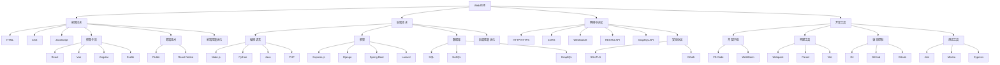

```ad-note

```mermaid
graph TD
    A[Web 技术] --> B[前端技术]
    A --> C[后端技术]
    A --> D[网络与协议]
    A --> E[开发工具]

    B --> B1[HTML]
    B --> B2[CSS]
    B --> B3[JavaScript]
    B --> B4[框架与库]
    B4 --> B41[React]
    B4 --> B42[Vue]
    B4 --> B43[Angular]
    B4 --> B44[Svelte]
    B --> B5[跨端技术]
    B5 --> B51[Flutter]
    B5 --> B52[React Native]
    B --> B6[前端性能优化]

    C --> C1[编程语言]
    C1 --> C11[Node.js]
    C1 --> C12[Python]
    C1 --> C13[Java]
    C1 --> C14[PHP]
    C --> C2[框架]
    C2 --> C21[Express.js]
    C2 --> C22[Django]
    C2 --> C23[Spring Boot]
    C2 --> C24[Laravel]
    C --> C3[数据库]
    C3 --> C31[SQL]
    C3 --> C32[NoSQL]
    C3 --> C33[GraphQL]
    C --> C4[后端性能优化]

    D --> D1[HTTP/HTTPS]
    D --> D2[CORS]
    D --> D3[WebSocket]
    D --> D4[RESTful API]
    D --> D5[GraphQL API]
    D --> D6[安全协议]
    D6 --> D61[SSL/TLS]
    D6 --> D62[OAuth]

    E --> E1[开发环境]
    E1 --> E11[VS Code]
    E1 --> E12[WebStorm]
    E --> E2[构建工具]
    E2 --> E21[Webpack]
    E2 --> E22[Parcel]
    E2 --> E23[Vite]
    E --> E3[版本控制]
    E3 --> E31[Git]
    E3 --> E32[GitHub]
    E3 --> E33[GitLab]
    E --> E4[测试工具]
    E4 --> E41[Jest]
    E4 --> E42[Mocha]
    E4 --> E43[Cypress]

```


