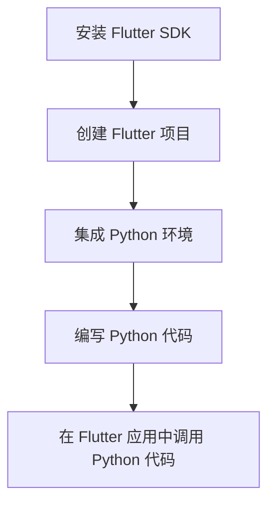

## Flutter 嵌入 [Python](https://edu.51cto.com/lesson/544399.html?utm_platform=pc&utm_medium=51cto&utm_source=shequ&utm_content=bk_article_keyword#Python) 

作为一名经验丰富的开发者，我很高兴能帮助刚入行的小白实现“Flutter 嵌入 Python 代码”。在这篇文章中，我将详细介绍整个流程，并提供必要的代码示例和注释，以确保你能够顺利实现这一目标。

### 流程概览

首先，让我们来看一下实现 Flutter 嵌入 Python 代码的整体流程。以下是你需要遵循的步骤：

|步骤|描述|
|---|---|
|1|安装 Flutter SDK|
|2|创建一个新的 Flutter 项目|
|3|集成 Python 环境|
|4|编写 Python 代码|
|5|在 Flutter 应用中调用 Python 代码|

### 详细步骤

#### 步骤 1：安装 Flutter SDK

首先，你需要在你的开发环境中安装 Flutter SDK。你可以从 [Flutter 官网]( 下载并安装。

#### 步骤 2：创建一个新的 Flutter 项目

接下来，创建一个新的 Flutter 项目。打开终端或命令提示符，运行以下命令：

```bash
flutter create flutter_py_integration
cd flutter_py_integration
```

#### 步骤 3：集成 Python 环境

为了在 Flutter 应用中运行 Python 代码，你需要使用一个名为 `pybind11` 的库。首先，在你的 Flutter 项目中添加 `pybind11` 依赖：

```yaml
# pubspec.yaml 文件
dependencies:
  flutter:
    sdk: flutter
  pybind11: ^2.7.0
```

然后，运行以下命令安装依赖：

```bash
flutter pub get
```

#### 步骤 4：编写 Python 代码

在你的 Flutter 项目中创建一个名为 `python` 的文件夹，并在其中创建一个名为 `example.py` 的 Python 文件。在这个文件中，编写你想要在 Flutter 应用中使用的 Python 代码。例如：

```python
# example.py 文件
def greet(name):
    return f"Hello, {name}!"
```

#### 步骤 5：在 Flutter 应用中调用 Python 代码

现在，你可以在 Flutter 应用中调用 Python 代码了。首先，在你的 Dart 文件中导入 `pybind11` 库：

```dart
import 'package:pybind11/pybind11.dart';
```

然后，使用 `Pybind11` [类](https://edu.51cto.com/lesson/974498.html?utm_platform=pc&utm_medium=51cto&utm_source=shequ&utm_content=bk_article_keyword#%E7%B1%BB)加载你的 Python 代码：

```dart
void main() {
  runApp(MyApp());
}

class MyApp extends StatelessWidget {
  @override
  Widget build(BuildContext context) {
    return MaterialApp(
      home: Scaffold(
        body: Center(
          child: ElevatedButton(
            onPressed: () {
              Pybind11.init();
              var result = Pybind11.call('example.greet', 'World');
              print(result);
            },
            child: Text('Greet'),
          ),
        ),
      ),
    );
  }
}
```

### 类图

以下是 Flutter 应用和 Python 代码之间的类图：


### 流程图

以下是实现 Flutter 嵌入 Python 代码的流程图：



### 结尾

通过以上步骤，你应该能够顺利实现 Flutter 嵌入 Python 代码。这个过程可能看起来有些复杂，但随着你逐渐熟悉这些工具和库，你会发现它变得越来越简单。祝你在 Flutter 和 Python 的世界中探索愉快！