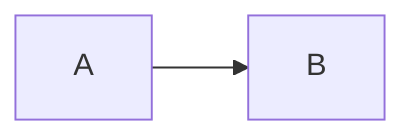

## Mermaid 由三部分组成[​](https://mermaid.nodejs.cn/intro/getting-started.html#mermaid-is-composed-of-three-parts)

1. 部署
    
2. 语法
    
3. 配置
    

本节讨论部署 Mermaid 的不同方法。

如果你是初学者：

- 查看 [图语法](https://mermaid.nodejs.cn/intro/syntax-reference.html) 页面
    
- 查看 [教程](https://mermaid.nodejs.cn/ecosystem/tutorials.html) 页面
    

## Mermaid 的使用方法[​](https://mermaid.nodejs.cn/intro/getting-started.html#ways-to-use-mermaid)

1. [使用 Mermaid 实时编辑器](https://mermaid.nodejs.cn/intro/getting-started.html#using-the-mermaid-live-editor)
    
2. [使用 Mermaid 图表编辑器](https://mermaid.nodejs.cn/intro/getting-started.html#using-the-mermaid-chart-editor)
    
3. [使用 Mermaid 插件和集成](https://mermaid.nodejs.cn/intro/getting-started.html#using-mermaid-plugins)
    
4. [调用 Mermaid JavaScript API](https://mermaid.nodejs.cn/intro/getting-started.html#calling-the-mermaid-javascript-api)
    
5. [添加 Mermaid 作为依赖](https://mermaid.nodejs.cn/intro/getting-started.html#adding-mermaid-as-a-dependency)
    

要了解更多信息，请访问 [用法](https://mermaid.nodejs.cn/config/usage.html) 页面。

## 1. 使用 Mermaid 实时编辑器[​](https://mermaid.nodejs.cn/intro/getting-started.html#using-the-mermaid-live-editor)

可在 [Mermaid 在线编辑器](https://mermaid.live/) 网站上获取。

### 特性[​](https://mermaid.nodejs.cn/intro/getting-started.html#features)

  

#### • 图表代码[​](https://mermaid.nodejs.cn/intro/getting-started.html#-diagram-code)

在 `Code` 面板中，编写或编辑 Mermaid 代码，并立即在图表面板中 `Preview` 渲染结果。

以下是 Mermaid 代码及其渲染结果的示例：

##### 代码:

mermaid

```
graph TD
    A[Enter Chart Definition] --> B(Preview)
    B --> C{decide}
    C --> D[Keep]
    C --> E[Edit Definition]
    E --> B
    D --> F[Save Image and Code]
    F --> B
```

Ctrl + Enter|Run ▶

  

#### • 配置[​](https://mermaid.nodejs.cn/intro/getting-started.html#-configurations)

`Configuration` 面板中提供了配置选项。这些选项将应用于 `Preview` 面板中的图表。

要了解更多信息，请访问 [配置参考](https://mermaid.nodejs.cn/config/setup/README.html) 页面


  

#### • 编辑历史记录[​](https://mermaid.nodejs.cn/intro/getting-started.html#-editing-history)

你的代码将自动保存并显示在 `History` 部分的 `Timeline` 选项卡中。每分钟都会保存编辑内容，并且只能查看最后 30 条编辑内容。

或者，你可以通过单击 `History` 部分中的 `Save` 图标来手动保存代码。

信息

历史记录仅存储在浏览器存储中。

  

#### • 保存图表[​](https://mermaid.nodejs.cn/intro/getting-started.html#-saving-a-diagram)

有多种方法可以保存 `Actions` 部分的图表：

- 导出 PNG
    
- 导出 SVG
    
- 导出为 Markdown
    


  

#### • 编辑图表[​](https://mermaid.nodejs.cn/intro/getting-started.html#-editing-your-diagrams)

要编辑图表，你可以将现有 Mermaid 图表代码复制粘贴到 `Live Editor` 的 `Code` 部分。

或者：

- 从头开始创建一个新图表
    
- 使用 `Sample Diagrams` 部分的示例图
    

  

#### • 从 Gists 加载[​](https://mermaid.nodejs.cn/intro/getting-started.html#-loading-from-gists)

你创建的 Gist 应该有一个 `code.mmd` 文件和一个可选的 `config.json`，类似于此 [example](https://gist.github.com/sidharthv96/6268a23e673a533dcb198f241fd7012a)。

信息

要了解 Gists，请访问 [Creating gists](https://docs.github.com/en/get-started/writing-on-github/editing-and-sharing-content-with-gists/creating-gists) 上的 GitHub 文档页面。

创建 Gist 后，将 Gist URL 复制粘贴到 `Actions` 部分的相应字段中，然后单击 `Load Gist` 按钮。

以下是将 Gist 加载到编辑器中的示例：

[https://mermaid.live/edit?gist=https://gist.github.com/sidharthv96/6268a23e673a533dcb198f241fd7012a](https://mermaid.live/edit?gist=https://gist.github.com/sidharthv96/6268a23e673a533dcb198f241fd7012a)

并且，这是上面示例的图表视图：

[https://mermaid.live/view?gist=https://gist.github.com/sidharthv96/6268a23e673a533dcb198f241fd7012a](https://mermaid.live/view?gist=https://gist.github.com/sidharthv96/6268a23e673a533dcb198f241fd7012a)

## 2. 使用 Mermaid 图表编辑器[​](https://mermaid.nodejs.cn/intro/getting-started.html#using-the-mermaid-chart-editor)

可在 [Mermaid 图表](https://www.mermaidchart.com/) 网站上获取。

Mermaid Chart 是一个基于 Web 的图表编辑器，允许你在浏览器中创建和编辑图表。它是由 Mermaid 背后的团队构建的。

特点包括：

- 人工智能绘图
    
- 协作和多用户编辑
    
- 贮存
    
- 和更多
    

要了解更多信息，请访问文档生态系统部分中的 [Mermaid 图表页面](https://mermaid.nodejs.cn/ecosystem/mermaid-chart.html)。

或者去 [Mermaid 图表网站](https://www.mermaidchart.com/app/sign-up) 注册一个免费账户。

## 3. 使用 Mermaid 插件[​](https://mermaid.nodejs.cn/intro/getting-started.html#using-mermaid-plugins)

### Mermaid 插件[​](https://mermaid.nodejs.cn/intro/getting-started.html#mermaid-plugins)

你可以使用插件从流行的应用中生成 Mermaid 图。

有关 Mermaid 插件和集成的列表，请访问 [集成页面](https://mermaid.nodejs.cn/ecosystem/integrations-community.html)。

### Mermaid 图表插件[​](https://mermaid.nodejs.cn/intro/getting-started.html#mermaid-chart-plugins)

Mermaid 图表插件可用于：

- [ChatGPT](https://docs.mermaidchart.com/plugins/mermaid-chart-gpt)
    
- [JetBrains IDE](https://docs.mermaidchart.com/plugins/jetbrains-ide)
    
- [微软 PowerPoint](https://docs.mermaidchart.com/plugins/microsoft-powerpoint)
    
- [微软 Word](https://docs.mermaidchart.com/plugins/microsoft-word)
    
- [Visual Studio Code](https://docs.mermaidchart.com/plugins/visual-studio-code)
    

要了解更多信息，请访问 [Mermaid 图表插件](https://www.mermaidchart.com/plugins) 页面。

### 原生 Mermaid 支持[​](https://mermaid.nodejs.cn/intro/getting-started.html#native-mermaid-support)

对于支持 markdown 的应用（例如 [GitHub](https://docs.github.com/en/get-started/writing-on-github/working-with-advanced-formatting/creating-diagrams) 和 [GitLab](https://handbook.gitlab.com/handbook/tools-and-tips/mermaid/)），你可以通过制作 `mermaid` 代码块来添加 Mermaid 图。

markdown

````
The following code-block will be rendered as a Mermaid diagram:


````

## 4. 调用 Mermaid JavaScript API[​](https://mermaid.nodejs.cn/intro/getting-started.html#calling-the-mermaid-javascript-api)

此方法可用于任何常见的 Web 服务器，例如 `Apache`、`IIS`、`Nginx` 和 `Node Express`。

你还需要像 `Notepad++` 这样的文本编辑工具来生成 `html` 文件。然后由 Web 浏览器部署，即 `Firefox`、`Chrome`、`Safari`。

信息

不支持 Internet Explorer。

该 API 的工作原理是从源 `mermaid.js` 提取渲染指令，以便在页面上渲染图表。

### Mermaid API 的要求[​](https://mermaid.nodejs.cn/intro/getting-started.html#requirements-for-the-mermaid-api)

在写入 `html` 文件时，我们在 `html code` 内部给了 `web browser` 两条指令：

A。 我们要创建的图表的 Mermaid 代码。

b. 通过 `mermaid.esm.mjs` 或 `mermaid.esm.min.mjs` 导入 Mermaid 库，以及 `mermaid.initialize()` 调用，它决定图表的外观并启动渲染过程。

#### 示例[​](https://mermaid.nodejs.cn/intro/getting-started.html#examples)

- 这是 `<pre class="mermaid">` 内嵌入 Mermaid 图定义的示例：
    

html

```
<body>
  Here is a mermaid diagram:
  <pre class="mermaid">
        graph TD
        A[Client] --> B[Load Balancer]
        B --> C[Server01]
        B --> D[Server02]
  </pre>
</body>
```

信息

每个 Mermaid 图表/图形/图表定义都应该有单独的 `<pre>` 标签。

- 这是 Mermaid 导入和 `mermaid.initialize()` 调用的示例。
    

信息

`mermaid.initialize()` 调用获取 `<pre class="mermaid">` 标签中包含的所有定义并将它们渲染为图表。

html

```
<body>
  <script type="module">
    import mermaid from 'https://cdn.jsdelivr.net/npm/mermaid@11/dist/mermaid.esm.min.mjs';
    mermaid.initialize({ startOnLoad: true });
  </script>
</body>
```

信息

Mermaid 中的渲染由 `mermaid.initialize()` 调用初始化。但是，执行相反的操作可让你控制何时开始使用 `mermaid.initialize()` 在网页内查找 `<pre>` 标签。当你认为在执行 `mermaid.esm.min.mjs` 文件时可能并非所有 `<pre>` 标签都已加载时，这很有用。

`startOnLoad` 是 `mermaid.initialize()` 可以定义的参数之一

|参数|描述|类型|值|
|---|---|---|---|
|startOnLoad|加载时切换渲染|布尔值|真假|

在此示例中，通过 `CDN` 调用 `mermaidAPI`：

html

```
<html>
  <body>
    Here is one mermaid diagram:
    <pre class="mermaid">
            graph TD
            A[Client] --> B[Load Balancer]
            B --> C[Server1]
            B --> D[Server2]
    </pre>

    And here is another:
    <pre class="mermaid">
            graph TD
            A[Client] -->|tcp_123| B
            B(Load Balancer)
            B -->|tcp_456| C[Server1]
            B -->|tcp_456| D[Server2]
    </pre>

    <script type="module">
      import mermaid from 'https://cdn.jsdelivr.net/npm/mermaid@11/dist/mermaid.esm.min.mjs';
      mermaid.initialize({ startOnLoad: true });
    </script>
  </body>
</html>
```

在此示例中，`mermaid.js` 在 `src` 中作为单独的 JavaScript 文件引用：

html

```
<html lang="en">
  <head>
    <meta charset="utf-8" />
  </head>
  <body>
    <pre class="mermaid">
            graph LR
            A --- B
            B-->C[fa:fa-ban forbidden]
            B-->D(fa:fa-spinner);
    </pre>
    <pre class="mermaid">
            graph TD
            A[Client] --> B[Load Balancer]
            B --> C[Server1]
            B --> D[Server2]
    </pre>
    <script type="module">
      import mermaid from 'The/Path/In/Your/Package/mermaid.esm.mjs';
      mermaid.initialize({ startOnLoad: true });
    </script>
  </body>
</html>
```

## 5. 添加 Mermaid 作为依赖[​](https://mermaid.nodejs.cn/intro/getting-started.html#adding-mermaid-as-a-dependency)

以下是将 Mermaid 添加为依赖的步骤：

1. 安装 `node v16`
    

信息

要了解有关下载和安装 `Node.js` 和 `npm` 的更多信息，请访问 [npm Docs website](https://npm.nodejs.cn/downloading-and-installing-node-js-and-npm)。

1. 通过以下命令使用 `npm` 安装 `yarn`：
    
    `npm install -g yarn`
    
2. Yarn 安装后，输入以下命令：
    
    `yarn add mermaid`
    
3. 要将 Mermaid 添加为开发依赖，请输入以下命令：
    
    `yarn add --dev mermaid`
    

## 结束语[​](https://mermaid.nodejs.cn/intro/getting-started.html#closing-note)

信息

Mermaid 创建者 Knut Sveidqvist 的评论：- 在 Mermaid 的早期版本中，`<script>` 标签是在网页的 `<head>` 部分调用的。如今，我们可以将其放在 `<body>` 中，如上所示。文档的较旧部分经常反映以前的方式，这种方式仍然有效。