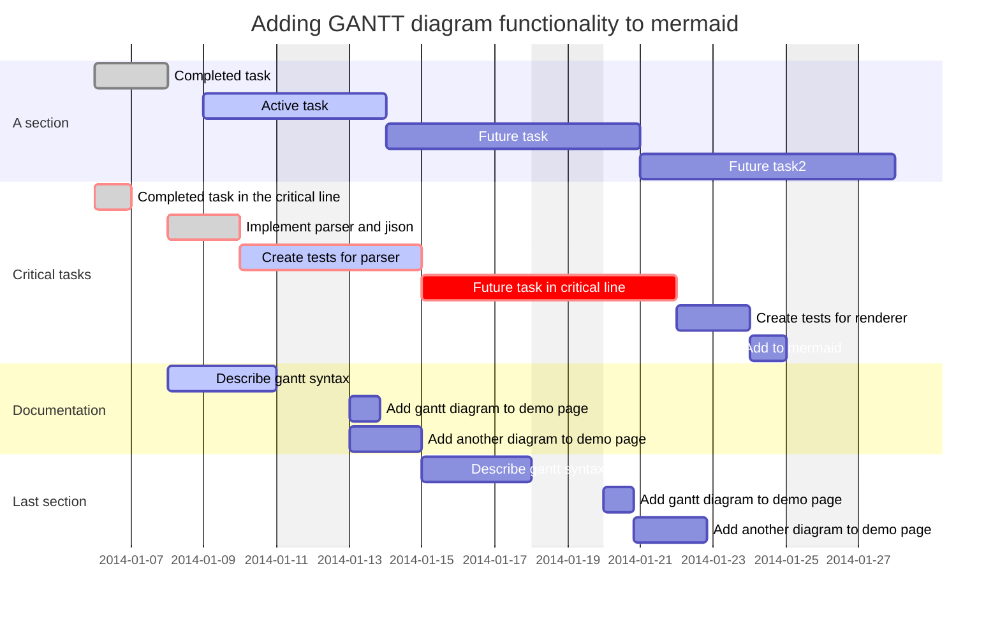

[mermaid](https://so.csdn.net/so/search?q=mermaid&spm=1001.2101.3001.7020)是一个基于Javascript的图表绘制工具，类似[markdown](https://so.csdn.net/so/search?q=markdown&spm=1001.2101.3001.7020)用文本语法，用于描述文档图形(流程图、 时序图、甘特图)，开发者可以通过一段mermaid文本来生成SVG或者PNG形式的图形。如果熟悉Markdown，则学习Mermaid的语法不会有任何问题。mermaid官方文档见[mermaid](https://mermaid-js.github.io/mermaid)，mermaid官方仓库见[mermaid-js](https://github.com/mermaid-js/mermaid)。

#### 文章目录

- [1 使用和部署mermaid](https://blog.csdn.net/LuohenYJ/article/details/117165523#1_mermaid_4)
- - [1.1 部署](https://blog.csdn.net/LuohenYJ/article/details/117165523#11__6)
    - - [1.1.1 使用mermaid网页版编辑器](https://blog.csdn.net/LuohenYJ/article/details/117165523#111_mermaid_13)
        - [1.1.2 使用mermaid插件](https://blog.csdn.net/LuohenYJ/article/details/117165523#112_mermaid_28)
        - [1.1.3 调用mermaid的Javascript API。](https://blog.csdn.net/LuohenYJ/article/details/117165523#113_mermaidJavascript_API_31)
        - [1.1.4 将mermaid部署为依赖项](https://blog.csdn.net/LuohenYJ/article/details/117165523#114_mermaid_118)
        - [1.1.5 markdown内嵌](https://blog.csdn.net/LuohenYJ/article/details/117165523#115_markdown_127)
    - [1.2 基础配置](https://blog.csdn.net/LuohenYJ/article/details/117165523#12__141)
    - - [1.2.1 绘图类型](https://blog.csdn.net/LuohenYJ/article/details/117165523#121__142)
        - [1.2.2 configuration配置](https://blog.csdn.net/LuohenYJ/article/details/117165523#122_configuration_158)
- [2 绘图语法](https://blog.csdn.net/LuohenYJ/article/details/117165523#2__199)
- - [2.1 流程图Flowcharts](https://blog.csdn.net/LuohenYJ/article/details/117165523#21_Flowcharts_200)
    - [2.2 时序图Sequence diagrams](https://blog.csdn.net/LuohenYJ/article/details/117165523#22_Sequence_diagrams_744)
    - [2.3 状态图State diagrams](https://blog.csdn.net/LuohenYJ/article/details/117165523#23_State_diagrams_1097)
    - [2.4 用户历程图User Journey Diagram](https://blog.csdn.net/LuohenYJ/article/details/117165523#24_User_Journey_Diagram_1365)
    - [2.5 甘特图Gantt diagrams](https://blog.csdn.net/LuohenYJ/article/details/117165523#25_Gantt_diagrams_1396)

## 1 使用和部署mermaid

### 1.1 部署

mermaid有四种使用方式：

1. 使用mermaid网页版编辑器。
2. 在您熟悉的程序中使用mermaid插件。
3. 调用mermaid的Javascript API。
4. 将mermaid部署为依赖项。

#### 1.1.1 使用mermaid网页版编辑器

mermaid的网页版编辑器地址如下：[mermaid-live-editor](https://mermaid-js.github.io/mermaid-live-editor)。打开该网页后界面如下图所示：


网页中各个部件的作用如下所示：

- Diagram presets: 预设待绘画的图表形式；
- Code: 编辑mermaid的绘图代码；
- Preview: 预览生成的图片；
- Mermaid Configuration：Mermaid的配置设置；
- Editing history：编辑历史；
- Links：相关链接；
- Actions：图片导出选项；

#### 1.1.2 使用mermaid插件

使用插件，您可以从流行的应用程序中生成mermaid图，就像使用实时编辑器一样。mermaid插件使用见[mermaid插件列表](https://mermaid-js.github.io/mermaid/#/./integrations)和[mermaid插件用法](https://mermaid-js.github.io/mermaid/#/usage)。

#### 1.1.3 调用mermaid的Javascript API。

此方法可以与任何常见的Web服务器一起使用。Apache，IIS，nginx，node express，您可以自由选择。您还需要一个文本编辑工具（如Notepad ++）来生成html文件。然后，通过网络浏览器（例如Firefox，Chrome，Safari和Internet Explorer）进行部署。该API通过从源中提取渲染指令mermaid.js以渲染页面中的图表来工作。

在编写html文件时，我们在html代码中给web浏览器三条指令：

1. 通过mermaid.js或mermaid.min.js获取通过mermaid的渲染模块。具体为对外部CDN的引用或作为单独文件的mermaid.js的引用：

```
<body>
  <script src="https://cdn.jsdelivr.net/npm/mermaid/dist/mermaid.min.js"></script>
</body>
```

2. 我们要创建的图表的mermaid代码。**每个mermaid.图表/图形/图表定义都必须具有单独的div标签**

```
<body>
  Here is a mermaid diagram:
  <div class="mermaid">
    graph TD
    A[Client] --> B[Load Balancer]
    B --> C[Server01]
    B --> D[Server02]
  </div>
</body>
```

1. 调用mermaid.initialize()以指示图的外观，或启动呈现过程。

```
<body>
  <script>mermaid.initialize({startOnLoad:true});</script>
</body>
```

调用实例例代码如下（创建html文件，输入以下代码）

- 通过CDN调用mermaidAPI

```
<html>

<body>
    <script src="https://cdn.jsdelivr.net/npm/mermaid/dist/mermaid.min.js"></script>
    <script>mermaid.initialize({ startOnLoad: true });</script>

    Here is one mermaid diagram:
    <div class="mermaid">
        graph TD
        A[Client] --> B[Load Balancer]
        B --> C[Server1]
        B --> D[Server2]
    </div>

    And here is another:
    <div class="mermaid">
        graph TD
        A[Client] -->|tcp_123| B(Load Balancer)
        B -->|tcp_456| C[Server1]
        B -->|tcp_456| D[Server2]
    </div>
</body>

</html>
```

- 将mermaid.js作为单独的JavaScript文件进行引用

```
<html lang="en">

<head>
    <meta charset="utf-8">
</head>

<body>
    <div class="mermaid">
        graph LR
        A --- B
        B-->C[fa:fa-ban forbidden]
        B-->D(fa:fa-spinner);
    </div>
    <div class="mermaid">
        graph TD
        A[Client] --> B[Load Balancer]
        B --> C[Server1]
        B --> D[Server2]
    </div>
    <script src="The\Path\In\Your\Package\mermaid.js"></script>
    <script>mermaid.initialize({ startOnLoad: true });</script>
</body>

</html>
```

#### 1.1.4 将mermaid部署为依赖项

具体步骤如下：

2. 安装node v10或12，其中将包含npm；
3. 使用NPM下载yarn，并输入命令npm install -g yarn；
4. 在yarn安装完成后，输入命令yarn add mermaid；
5. 将mermaid添加为dev依赖项；

#### 1.1.5 markdown内嵌

某些markdown编译器会内嵌mermaid，只要输入以下语法就可以直接渲染mermaid图。


如下图所示，如果下面markdown展现为图表示支持该markdown编译器支持mermaid，否则不支持。

### 1.2 基础配置

#### 1.2.1 绘图类型

mermaid提供如下绘图类型。其中名字加粗的绘图类型在本文会提及到使用用法，其他绘图类型可以参看文档链接。

|绘图类型|文档链接|
|---|---|
|**流程图Flowcharts**|[flowchart](https://mermaid-js.github.io/mermaid/#/flowchart)|
|**时序图Sequence diagrams**|[sequenceDiagram](https://mermaid-js.github.io/mermaid/#/sequenceDiagram)|
|类图Class diagrams|[classDiagram](https://mermaid-js.github.io/mermaid/#/classDiagram)|
|**状态图State diagrams**|[stateDiagram](https://mermaid-js.github.io/mermaid/#/stateDiagram)|
|实体关系图Entity Relationship Diagrams|[entityRelationshipDiagram](https://mermaid-js.github.io/mermaid/#/entityRelationshipDiagram)|
|**用户历程图User Journey Diagram**|[user-journey](https://mermaid-js.github.io/mermaid/#/user-journey)|
|**甘特图Gantt diagrams**|[gantt](https://mermaid-js.github.io/mermaid/#/gantt)|
|饼图Pie chart diagrams|[pie](https://mermaid-js.github.io/mermaid/#/pie)|
|需求图Requirement Diagram|[requirementDiagram](https://mermaid-js.github.io/mermaid/#/requirementDiagram)|

#### 1.2.2 configuration配置

mermaid的configuration配置很多，具体见[mermaidAPI](https://mermaid-js.github.io/mermaid/#/Setup)。

**主题设置**

对于主题设置，主要有’default’, ‘forest’, ‘dark’, ‘neutral’, 'null’等选项。通过mermaid配置文件修改即可。在mermaid在线编辑器种修改方式如下：


此外我们也可以直接在代码中修改主题配置，如下所示。

```
%%{init: {'theme':'forest'}}%%
  graph TD
    a --> b
```

关于自定义主题见[theming](https://mermaid-js.github.io/mermaid/#/theming)

**注释**

可以在流程图中输入注释，解析器将忽略它们。注释必须自己一行，并且必须以%%（双百分号）开头。 注释开始到下一个换行符之后的所有文本都将被视为注释，包括任何绘图语法。

```
graph LR
%% this is a comment A -- text --> B{node}
   A -- text --> B -- text2 --> C
```

## 2 绘图语法

### 2.1 流程图Flowcharts

所有流程图均由节点，几何形状和边缘，箭头或线条组成。mermaid代码定义了制作这些节点和边缘并进行交互的方式。它还可以适应不同的箭头类型，多向箭头以及与子图之间的链接。值得注意的是：不要将“end”作为流程图节点键入。将所有或任何一个字母大写，以防止流程图中断，即“End”或“END”。流程图各种部件如下介绍。

**节点node(默认)**

```
graph LR
    id
```

**带有文本的节点**

也可以在框中设置与id不同的文本。如果多次执行此操作，则将使用为节点找到的最后一个文本。此外，如果稍后为节点定义边，则可以忽略文本定义。渲染时将使用前面定义的n那个。

```
graph LR
    id1[This is the text in the box]
```

**图形graph**

该语句声明了流程图的方向。这声明了图的方向是从上到下（TD或TB）。

```
graph TD
    Start --> Stop
```

以下语句声明了图的方向是从左到右（LR）。

```
graph LR
    Start --> Stop
```

**流程图方向**  
以下语句声明可能的流程图方向为：

- TB - top to bottom 从上到下
- TD - top-down/ same as top to bottom 自顶向下/类似从上至下
- BT - bottom to top 从下到上
- RL - right to left 从右到左
- LR - left to right 从左到右

**节点形状**

6. 具有圆边的节点

```
graph LR
    id1(This is the text in the box)
```

7. 体育场形状的节点

```
graph LR
    id1([This is the text in the box])
```

8. 子程序形状的节点

```
graph LR
    id1[[This is the text in the box]]
```

9. 圆柱状的节点

```
graph LR
    id1[(Database)]
```

10. 圆形式的节点

```
graph LR
    id1((This is the text in the circle))
```

11. 不对称形状的节点

```
graph LR
    id1>This is the text in the box]
```

12. 菱形节点

```
graph LR
    id1{This is the text in the box}
```

13. 六角形节点

```
graph LR
    id1{{This is the text in the box}}
```

14. 平行四边形节点

```
graph TD
    id1[/This is the text in the box/]
```

15. 平行四边形节点

```
graph TD
    id1[/This is the text in the box/]
```

16. 梯形节点

```
graph TD
    A[/Christmas\]
```

17. 梯形节点

```
graph TD
    B[\Go shopping/]
```

**节点之间的链接**

18. 带箭头的链接

```
graph LR
    A-->B
```

19. 开放链接

```
graph LR
    A --- B
```

20. 链接上的文本

```
graph LR
    A-- This is the text! ---B
```

或者

```
graph LR
    A---|This is the text|B
```

21. 带箭头和文本的链接

```
graph LR
    A-->|text|B
```

或者

```
graph LR
    A-- text -->B
```

**点链接**

```
graph LR;
   A-.->B;
```

**带文本的点链接**

```
graph LR
   A-. text .-> B
```

**粗链接**

```
graph LR
   A ==> B
```

**带文本的粗链接**

```
graph LR
   A == text ==> B
```

**多链接**  
可以按照以下方式在同一行中声明许多链接：

```
graph LR
   A -- text --> B -- text2 --> C
```

也可以根据以下情况在同一行中声明多个节点链接（&表示和）：

```
graph LR
   a --> b & c--> d
```

然后，您可以以一种非常有表现力的方式描述依赖关系。 像下面的单线：

```
graph TB
    A & B--> C & D
```

如果使用基本语法描述相同的图，则将花费四行。 一言以蔽之，这可能会使图表变得过分沉重，难以阅读。

**测试版本：新箭头类型**

使用flowchart而不是graph时，根据下文支持新类型的箭头(某些编译器可能不支持)：

```
flowchart LR
    A --o B
    B --x C
```

**测试版本：多向箭头**

使用flowchart而不是graph时，有可能使用多向箭头。

```
flowchart LR
    A o--o B
    B <--> C
    C x--x D
```

**概括**

对于点链接或粗链接，要添加的字符等于符号或点，如下表所概括：

|长度|1|2|3|
|---|---|---|---|
|正常|—|----|-----|
|带箭头|–>|—>|---->|
|粗链接|===|====|=====|
|粗链接带箭头|==>|===>|====>|
|点链接|-.-|-…-|-…-|
|点链接带箭头|-.->|-…->|-…->|

**特殊字符**

可以将文本放在引号中，以呈现更麻烦的字符。 如下例所示：

```
graph LR
    id1["This is the (text) in the box"]
```

**子图Subgraphs**

基础语法见

```
subgraph title
    graph definition
end
```

下面的示例：

```
graph TB
    c1-->a2
    subgraph one
    a1-->a2
    end
    subgraph two
    b1-->b2
    end
    subgraph three
    c1-->c2
    end
```

您还可以为子图设置一个显式 ID。

```
graph TB
    c1-->a2
    subgraph ide1 [one]
    a1-->a2
    end
```

使用graphtype流程图，也可以如下图所示在子图之间设置边线。

```
flowchart TB
    c1-->a2
    subgraph one
    a1-->a2
    end
    subgraph two
    b1-->b2
    end
    subgraph three
    c1-->c2
    end
    one --> two
    three --> two
    two --> c2
```

**fontawesome的支持**  
可以从字体中添加图标。图标通过语法fa:#icon class name#.访问。

```
graph TD
    B["fa:fa-twitter for peace"]
    B-->C[fa:fa-ban forbidden]
    B-->D(fa:fa-spinner);
    B-->E(A fa:fa-camera-retro perhaps?);
```

### 2.2 [时序图](https://so.csdn.net/so/search?q=%E6%97%B6%E5%BA%8F%E5%9B%BE&spm=1001.2101.3001.7020)Sequence diagrams

时序图是一种交互图，它显示了进程如何相互操作以及以什么顺序进行操作。mermaid基础时序图语法如下所示：

```
sequenceDiagram
    Alice->>John: Hello John, how are you?
    John-->>Alice: Great!
    Alice-)John: See you later!
```

AliceJohnHello John, how are you?Great!See you later!AliceJohn

以下介绍基础语法。

**参与者**  
可以像在此页上的第一个示例中那样隐式定义参与者。参与者或演员在图表源文本中按出现顺序进行渲染。有时，您可能想以不同的顺序向参与者显示与第一条消息中的参与者不同的顺序。通过执行以下操作可以指定参与者的出现顺序：

```
sequenceDiagram
    participant John
    participant Alice
    Alice->>John: Hello John, how are you?
    John-->>Alice: Great!
```

JohnAliceHello John, how are you?Great!JohnAlice

**别名**  
参与者可以具有方便的标识符和描述性标签。

```
sequenceDiagram
    participant A as Alice
    participant J as John
    A->>J: Hello John, how are you?
    J->>A: Great!
```

AliceJohnHello John, how are you?Great!AliceJohn

**消息**  
消息可以是实线或虚线显示的两种。基础语法如下所示：

```
[Actor][Arrow][Actor]:Message text
```

当前支持六种类型的箭头：

|类型|描述|
|---|---|
|->|实线无箭头|
|–>|虚线无箭头|
|->>|实线带箭头|
|–>>|虚线带箭头|
|-x|实线末端带有叉号|
|–x|虚线末端带有叉字|
|-)|实线末端带有空心箭头|
|–)|虚线末端带有空心箭头|

**激活方式**  
可以激活和停用参与者。激活和停用声明如下：

```
sequenceDiagram
    Alice->>John: Hello John, how are you?
    activate John
    John-->>Alice: Great!
    deactivate John
```

AliceJohnHello John, how are you?Great!AliceJohn

通过在消息箭头后面添加+/-后缀，还有一种快捷方式表示法：

```
sequenceDiagram
    Alice->>+John: Hello John, how are you?
    John-->>-Alice: Great!
```

AliceJohnHello John, how are you?Great!AliceJohn

对于同一参与者可以堆叠激活：

```
sequenceDiagram
    Alice->>+John: Hello John, how are you?
    Alice->>+John: John, can you hear me?
    John-->>-Alice: Hi Alice, I can hear you!
    John-->>-Alice: I feel great!
```

AliceJohnHello John, how are you?John, can you hear me?Hi Alice, I can hear you!I feel great!AliceJohn

**注解**  
可以在时序图中添加注解。添加的语法为Note [ right of | left of | over ] [Actor]

```
sequenceDiagram
    participant John
    Note right of John: Text in note
```

JohnText in noteJohn

也可以创建跨越两个参与者的注解：

```
sequenceDiagram
    Alice->John: Hello John, how are you?
    Note over Alice,John: A typical interaction
```

AliceJohnHello John, how are you?A typical interactionAliceJohn

**循环**  
可以在时序图中表达循环。语法如下：

```
loop Loop text
... statements ...
end
```

例子如下：

```
sequenceDiagram
    Alice->John: Hello John, how are you?
    loop Every minute
        John-->Alice: Great!
    end
```

AliceJohnHello John, how are you?Great!loop[Every minute]AliceJohn

**替代**  
可以在顺序图中表达替代路径。语法如下：

```
alt Describing text
... statements ...
else
... statements ...
end
```

或是否有可选的序列（如果没有其他序列）。

```
opt Describing text
... statements ...
end
```

请参见下面的示例：

```
sequenceDiagram
    Alice->>Bob: Hello Bob, how are you?
    alt is sick
        Bob->>Alice: Not so good :(
    else is well
        Bob->>Alice: Feeling fresh like a daisy
    end
    opt Extra response
        Bob->>Alice: Thanks for asking
    end
```

AliceBobHello Bob, how are you?Not so good :(Feeling fresh like a daisyalt[is sick][is well]Thanks for askingopt[Extra response]AliceBob

**平行**  
可以显示并行发生的动作。语法如下：

```
par [Action 1]
... statements ...
and [Action 2]
... statements ...
and [Action N]
... statements ...
end
```

请参见下面的示例：

```
sequenceDiagram
    par Alice to Bob
        Alice->>Bob: Hello guys!
    and Alice to John
        Alice->>John: Hello guys!
    end
    Bob-->>Alice: Hi Alice!
    John-->>Alice: Hi Alice!
```

AliceBobJohnHello guys!Hello guys!par[Alice to Bob][Alice to John]Hi Alice!Hi Alice!AliceBobJohn

也可以嵌套并行块。

```
sequenceDiagram
    par Alice to Bob
        Alice->>Bob: Go help John
    and Alice to John
        Alice->>John: I want this done today
        par John to Charlie
            John->>Charlie: Can we do this today?
        and John to Diana
            John->>Diana: Can you help us today?
        end
    end
```

AliceBobJohnCharlieDianaGo help JohnI want this done todayCan we do this today?Can you help us today?par[John to Charlie][John to Diana]par[Alice to Bob][Alice to John]AliceBobJohnCharlieDiana

**背景高亮**  
通过提供彩色背景可以高亮背景。颜色是使用rgb和rgba语法定义的。如下所示：

```
rect rgb(0, 255, 0)
... content ...
end
```

```
rect rgba(0, 0, 255, .1)
... content ...
end
```

请参阅以下示例：

```
sequenceDiagram
    participant Alice
    participant John

    rect rgb(191, 223, 255)
    note right of Alice: Alice calls John.
    Alice->>+John: Hello John, how are you?
    rect rgb(200, 150, 255)
    Alice->>+John: John, can you hear me?
    John-->>-Alice: Hi Alice, I can hear you!
    end
    John-->>-Alice: I feel great!
    end
    Alice ->>+ John: Did you want to go to the game tonight?
    John -->>- Alice: Yeah! See you there.
```

AliceJohnAlice calls John.Hello John, how are you?John, can you hear me?Hi Alice, I can hear you!I feel great!Did you want to go to the game tonight?Yeah! See you there.AliceJohn

### 2.3 状态图State diagrams

状态图是计算机科学和相关领域中用来描述系统行为的一种图。状态图要求所描述的系统由有限个状态组成；有时，情况确实如此，而有时这是一种合理的抽象。  
mermaid可以渲染状态图。该语法尝试与plantUml中使用的语法兼容，因为这将使用户更容易在mermaid和plantUml之间共享图。PlantUML是一个开源项目，支持绘制UML图。

具体语法如下：

```
stateDiagram-v2
    [*] --> Still
    Still --> [*]

    Still --> Moving
    Moving --> Still
    Moving --> Crash
    Crash --> [*]
```

如上图所示，在状态图中，根据系统状态以及系统状态如何通过转换更改为另一个状态来描述系统。上面的示例图显示了三个状态：静止，移动和崩溃。您从静止状态开始。在“静止”中，您可以将状态更改为“移动中”。在“移动”中，您可以将状态更改回“静止”或“崩溃”。从“静止”到“崩溃”没有过渡。具体介绍见[UML之状态图（State Diagram）](https://blog.csdn.net/lxd8731247769/article/details/48533091)

**状态**  
可以通过多种方式声明状态。最简单的方法是将状态ID定义为描述。

```
stateDiagram-v2
    s1
```

另一种方法是使用state关键字，其说明如下：

```
stateDiagram-v2
    state "This is a state description" as s2
```

用描述定义状态的另一种方法是定义状态id，后跟冒号和描述：

```
stateDiagram-v2
    s2 : This is a state description
```

**过渡**  
过渡是一种状态进入另一种状态时的路径/边缘。使用文本箭头“->”表示。当您定义两个状态之间的转换并且尚未定义状态时，将使用转换中的ID来定义未定义状态。您以后可以在以这种方式定义的状态中添加描述。

```
stateDiagram-v2
    s1 --> s2
```

可以向过渡添加文本。描述它代表什么。

```
stateDiagram-v2
    s1 --> s2: A transition
```

**开始和结束**  
有两种特殊状态指示图的开始和停止。这些是用[*]语法编写的，转换到它的方向将其定义为开始或停止状态。

```
stateDiagram-v2
    [*] --> s1
    s1 --> [*]
```

**复合状态**  
在现实世界中使用状态图时，您通常会遇到多维图，因为一个状态可以具有多个内部状态。这些在本术语中称为复合状态。为了定义一个复合状态，您需要使用state关键字，后跟一个ID和{}之间的复合状态的主体。请参见下面的示例：

```
stateDiagram-v2
    [*] --> First
    state First {
        [*] --> second
        second --> [*]
    }
```

您可以在多个层中执行此操作：

```
stateDiagram-v2
    [*] --> First

    state First {
        [*] --> Second

        state Second {
            [*] --> second
            second --> Third

            state Third {
                [*] --> third
                third --> [*]
            }
        }
    }
```

您还可以在复合状态之间定义过渡：

```
stateDiagram-v2
    [*] --> First
    First --> Second
    First --> Third

    state First {
        [*] --> fir
        fir --> [*]
    }
    state Second {
        [*] --> sec
        sec --> [*]
    }
    state Third {
        [*] --> thi
        thi --> [*]
    }
```

**fork**  
可以使用<< fork >> << join >>在图中指定一个fork。

```
   stateDiagram-v2
    state fork_state <<fork>>
      [*] --> fork_state
      fork_state --> State2
      fork_state --> State3

      state join_state <<join>>
      State2 --> join_state
      State3 --> join_state
      join_state --> State4
      State4 --> [*]
```

**注解**  
有时，没有什么比说注解更好的了。状态图中也是如此。在这里，您可以选择将注解放在节点的右侧或左侧。

```
stateDiagram-v2
    State1: The state with a note
    note right of State1
        Important information! You can write
        notes.
    end note
    State1 --> State2
    note left of State2 : This is the note to the left.
```

### 2.4 用户历程图User Journey Diagram

用户历程高度详细地描述了不同用户在系统，应用程序或网站内为完成特定任务所采取的步骤。该技术显示了当前（按原样）的用户工作流程，并揭示了将来的工作流程需要改进的地方。这个图mermaid提供的api不多，主要例子如下：

```
journey
    title My working day
    section Go to work
      %% 任务语法为Task name: <score>: <comma separated list of actors>
      %% Make tea：参与者
      %% 5：分数评价，一般0到5，分数越高越好
      %% Me：参与者
      Make tea: 5: Me
      Go upstairs: 3: Me
      Do work: 1: Me, Cat
    section Go home
      Go downstairs: 5: Me
      Sit down: 5: Me
```

CatMeMy working day

### 2.5 甘特图Gantt diagrams

甘特图是一种条形图，它说明了一个项目进度表以及完成任何一个项目所需的时间。甘特图说明了项目的终端元素和摘要元素的开始日期和结束日期之间的天数。

甘特图会将每个计划的任务记录为一个从左到右延伸的连续条形图。x轴代表时间，y轴记录不同的任务以及完成任务的顺序。重要的是要记住，当“排除”特定于某个任务的日期，日期或日期集合时，甘特图将通过向右延长相等的天数来适应这些变化，而不是通过在内部形成间隙来适应这些变化。但是，如果排除的日期介于设置为连续开始的两个任务之间，则排除的日期将以图形方式跳过并留空，并且以下任务将在排除日期结束后开始。甘特图有助于跟踪项目完成前所需的时间，但也可以用于以图形方式表示“非工作日”，只需稍作调整。Mermaid可以将甘特图呈现为SVG，PNG或可以粘贴到文档中的MarkDown链接。

```
gantt
    title A Gantt Diagram
    dateFormat  YYYY-MM-DD
    section Section
    A task           :a1, 2014-01-01, 30d
    Another task     :after a1  , 20d
    section Another
    Task in sec      :2014-01-12  , 12d
    another task      : 24d
```

Mon 06Mon 13Mon 20Mon 27Mon 03Mon 10Mon 17A taskAnother taskTask in secanother taskSectionAnotherA Gantt Diagram

具体语法如下所示：

```
gantt
    %% 设定时间格式
    dateFormat  YYYY-MM-DD
    %% 标题
    title       Adding GANTT diagram functionality to mermaid
    %% excludes`接受YYYY-MM-DD格式的特定日期、一周中的几天（“星期日”）或“周末”，但不接受“工作日”一词
    excludes    weekends
    %% (`excludes` accepts specific dates in YYYY-MM-DD format, days of the week ("sunday") or "weekends", but not the word "weekdays".)

    section A section
    Completed task            :done,    des1, 2014-01-06,2014-01-08
    Active task               :active,  des2, 2014-01-09, 3d
    Future task               :         des3, after des2, 5d
    Future task2              :         des4, after des3, 5d

    section Critical tasks
    Completed task in the critical line :crit, done, 2014-01-06,24h
    Implement parser and jison          :crit, done, after des1, 2d
    Create tests for parser             :crit, active, 3d
    Future task in critical line        :crit, 5d
    Create tests for renderer           :2d
    Add to mermaid                      :1d

    section Documentation
    Describe gantt syntax               :active, a1, after des1, 3d
    Add gantt diagram to demo page      :after a1  , 20h
    Add another diagram to demo page    :doc1, after a1  , 48h

    section Last section
    Describe gantt syntax               :after doc1, 3d
    Add gantt diagram to demo page      :20h
    Add another diagram to demo page    :48h
```



**基础语法**

基础语法如下，task表示任务，state表示状态。name表示任务别名，name可有可无。start time和end time表示开始结束时间，或者直接设定执行时间time。对于时间的设置具体看上面的语法。

```
task: state, name，start time, end time

or

task: state, name，time
```

对于state值，主要有以下几种状态。

- done 完成
- active 活跃
- crit 关键
- 为空 未来任务

对于状态值，可以两两组合，比如crit, active表示关键的活跃任务。如果是done,active只会表示为active。因为不可能出现某个任务既完成又活跃的情况。

**输入日期格式**  
默认输入日期格式为YYYY-MM-DD。您可以定义您的自定义dateFormat。

```
dateFormat YYYY-MM-DD
```

支持以下格式选项：

```
Input       Example             Description:
YYYY        2014                4 digit year
YY          14                  2 digit year
Q           1..4                Quarter of year. Sets month to first month in quarter.
M MM        1..12               Month number
MMM MMMM    January..Dec        Month name in locale set by moment.locale()
D DD        1..31               Day of month
Do          1st..31st           Day of month with ordinal
DDD DDDD    1..365              Day of year
X           1410715640.579      Unix timestamp
x           1410715640579       Unix ms timestamp
H HH        0..23               24 hour time
h hh        1..12               12 hour time used with a A.
a A         am pm               Post or ante meridiem
m mm        0..59               Minutes
s ss        0..59               Seconds
S           0..9                Tenths of a second
SS          0..99               Hundreds of a second
SSS         0..999              Thousandths of a second
Z ZZ        +12:00              Offset from UTC as +-HH:mm, +-HHmm, or Z
```