### 简单流程图

**定义一个简单流程图：**

```rust
graph LR
  A[开始] --> B[流程1]
  B --> C[流程2]
  C --> D[结束]
```

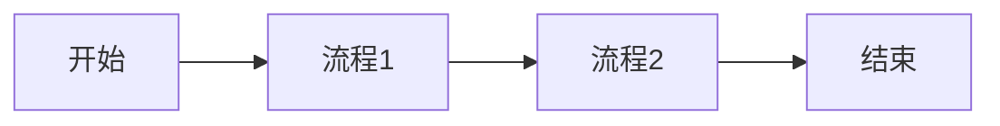
1. `graph`：定义流程图，表示图表的类型。可以是`graph`、`pie`、`classDiagram`、`stateDiagram`等。
2. `LR`：定义图表的布局，可以是`LR`、`RL`、`TB`、`BT`。
3. 用`[ ]`中括号来定义节点和它们的标签。
4. `-->`：连接两个节点，表示它们的流程顺序。
5. //`：使用`//`可以在节点间添加注释信息。

```rust
graph TD
    A[开始]-->B(步骤1)
    B---->C(步骤2)
    B--描述文本-->D(步骤3)
    C==>E(步骤4)
    D==>E
    E--选项1-->F(步骤5)
    E-.选项2.->G(步骤6)
    G==>H(步骤7)
    G-.选项3.->I(步骤8)
    I-.确定.->H
    
    subgraph 一组节点
        B
        C
        D
    end
```

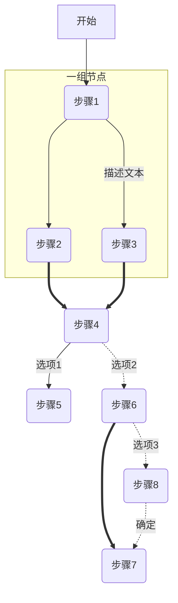

这个流程图是一个从 A（开始）到 H（结束）的流程，其中包括以下箭头和括号的定义：

6. `-->`：定义一个简单的向右箭头，表示从节点 A 到节点 B。
7. `---->`：定义一个直线箭头，表示从节点 B 到节点 C。
8. `-- 描述文本 -->`：定义一个带描述文本的双向箭头，表示从节点 B 到节点 D。
9. `==>` ：定义一个粗箭头，表示从节点 C 到节点 E。
10. `-.->`：定义一个带有点的线箭头，表示从节点 E 到节点 G。
11. `-. 选项3 .->`：定义一个带有描述的线箭头，表示从节点 G 到节点 I，并使用花括号来表示选项描述。
12. `-. 确定 .->`：定义一个带有描述的直线箭头，表示从节点 I 到节点 H，并使用括号来表示箭头的标签。

```rust
graph TD
    A[开始] -->|初始化| B(设置参数)
    B --> C{条件}
    C -->|是| D[步骤1]
    C -->|否| E[步骤2]
    B --> F(调整参数)
    E --> F
    D --> G((输出结果))
    F --> G
    G -->|完成| H[结束]
```

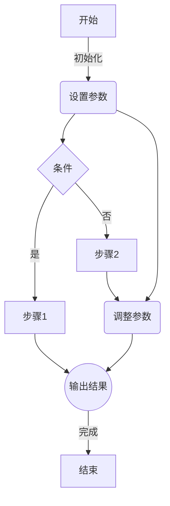
在这个示例中，我们定义了以下几种形状：

13. `A[开始]`：定义一个圆角矩形节点，表示流程的开始。
14. `B(设置参数)`：定义一个菱形节点，表示决策点。
15. `C{条件}`：定义一个菱形节点，表示具有条件的决策点，并使用花括号来表示节点的形状。
16. `D[步骤1]` 和 `E[步骤2]`：定义一个矩形节点，表示流程中的步骤。
17. `F(调整参数)`：定义一个矩形节点，表示一个调整参数的步骤。
18. `G((输出结果))`：定义一个圆形节点，表示流程中的结束点。
19. `-->`：定义一个简单的向右箭头，表示单向箭头。
20. `-->|描述文本|`：定义一个带有标签的箭头，表示从一个节点到另一个节点，同时附带关于箭头的描述信息。

### 复杂流程图

**定义一个步骤比较多的流程图：**

```less
graph LR
  A[开始]-->B[流程1]
  B-->C[判断条件]
  C-->|条件成立|D[流程2]
  D-->E[判断条件]
  E--> |条件成立| F[流程3]
  F-->|否则|G[流程4]
  E-->|条件不成立|G[流程4]
  G-->H[结束]
```

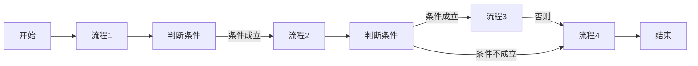

21. `graph LR`：定义流程图的类型和布局。
22. `-->`：定义节点间的流程顺序。
23. `|文本|`：表示条件分支的判断条件和文本。
24. `==>`：定义流程，表示在两个节点间连接一个带箭头的圆圈，圆圈中可以填写任何文本信息。
25. `--文本-->`：定义带有文本的流程，用于表示带有文本标签的流程。
26. `点击事件：点击A-->B：执行的函数`：定义点击事件，表示点击A节点时触发B节点的函数执行。

### 子图

**定义一个包含子图的流程图：**

```less
flowchart LR
  subgraph A
  物品-->B[计算1]
  B-->C(判断1)
  C-->|条件1| D[输出结果1]
  C-->|条件2| E[计算2]
  E-->D
  end

  subgraph B
  客户-->F[计算3]
  F-->G(判断2)
  G-->|条件3|H[输出结果2]
  G-->|条件4|I[计算4]
  I-->H
  end

  A-->B
  F-->C
```

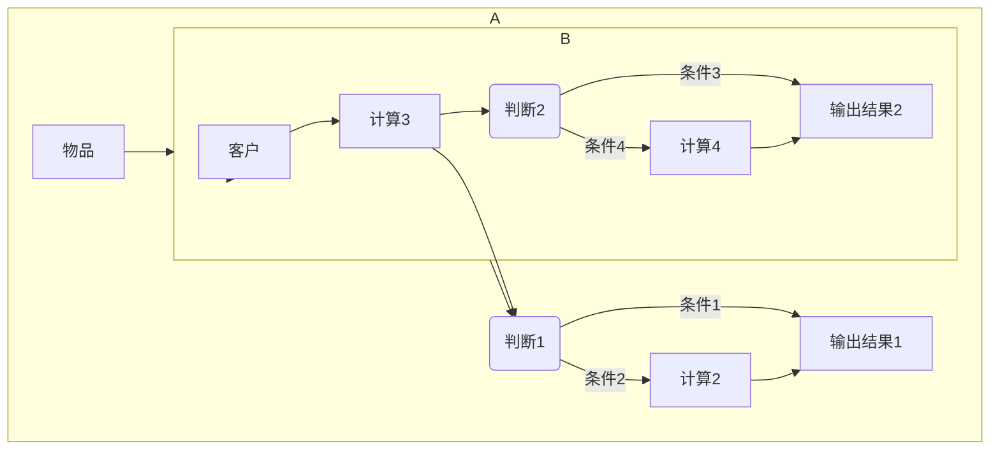
1. `subgraph`：定义一个子图，可以用来分组和组织节点。
2. `end`：标记子图的结束位置。
3. 可以在子图中使用标准的流程图语法定义节点、流程和条件分支。
4. 子图中的节点可以连接到主流程图中的其他节点。

### 类图

**定义一个简单的类图：**

```css
classDiagram
  class Animal {
    +name: String
    +eat()
  }
```

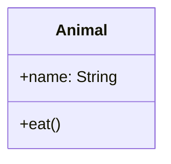
1. `classDiagram`：定义一个类图。
2. `class`：定义一个类。
3. `+` 或 `-`：表示类的公共或私有成员。
4. `:`：定义成员的类型。
5. `()`：定义一个方法。

### 状态图

**定义一个三种状态之间变化的状态图：**

```vbnet
stateDiagram-v2
  [*] --> Off
  Off --> Starting : Power on
  Starting --> On : Start success
  On --> Off : Power off
  On --> Suspended : Sleep
  Suspended --> Off : Power off
  On --> Starting : Restart
```

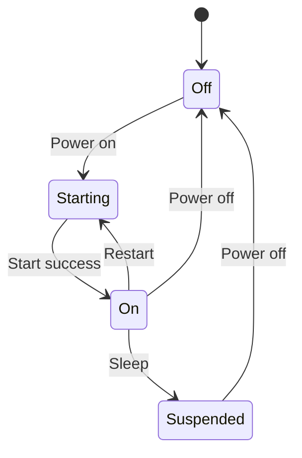
1. `stateDiagram-v2`：定义状态图。
2. `[*]`：表示默认起始状态。
3. `-->`：表示状态变化。
4. 使用 `:` 标记每个状态的名称。
5. 可以使用`---`定义状态的展示文字。
6. `:` 表示状态名称的展示文字。
7. `extend` 可以用于表示某个状态的 `do` 动作。
8. `note` 可以用于添加注释，例如在某个状态上添加状态详情信息等。

### 时序图

**定义一个简单的时序图：**

```less
sequenceDiagram
  participant A
  participant B
  A ->> B : 请求数据
  B -->> A : 返回数据
```

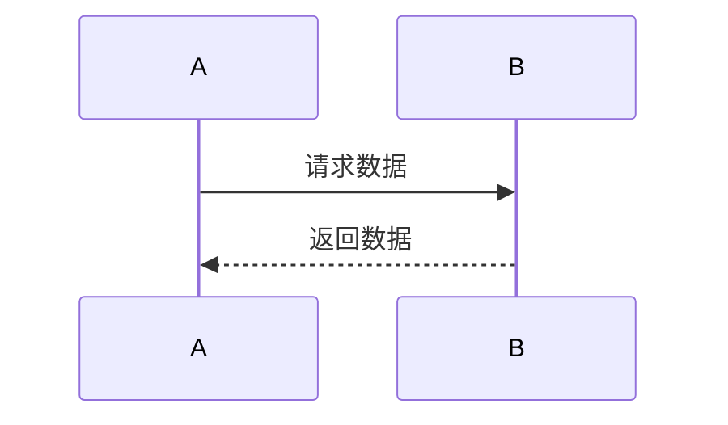
BABA请求数据返回数据

9. `sequenceDiagram`：定义时序图。
10. `participant`：定义参与者的角色，可以在后面的流程步骤中使用它们。
11. `->>`：表示请求操作。
12. `-->>`：表示返回操作。
13. `alt` 和 `else` 可以用于表示可选的分支。

### 甘特图

**定义一个简单的甘特图：**

```x86asm
gantt
  title 项目计划
  dateFormat  YYYY-MM-DD
  section 研发
  设计 :a1, 2018-01-01, 30d
  开发 :a2, 2018-01-03, 60d
  测试 :a3, after a2, 20d
  section 上线
  发布 :b1, after a3, 2d
  测试 :b2, after b1, 5d
```

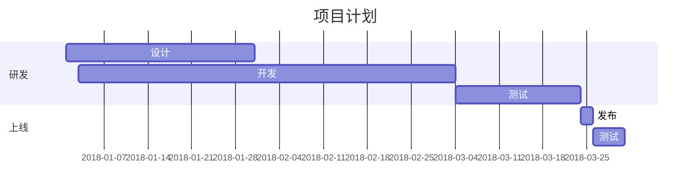
1. `gantt`：定义甘特图。
2. `title`：设置标题。
3. `dateFormat`：定义日期格式。
4. `section`：定义项目的不同阶段，可以在不同的阶段中设置相应的任务。
5. 使用 `:` 分隔任务名称和 ID。
6. 使用 `,` 分隔任务 ID、开始日期和持续天数。
7. `after`：定义某个任务在另一个任务之后开始。
8. 根据起始时间和持续时间，可以计算出任务的结束时间。

### 树状图

**定义一个简单的树状图：**

```css
graph TD
  A[开始] --> B[分类1]
  B --> C[子分类1]
  B --> D[子分类2]
  C --> E[项目1]
  C --> F[项目2]
  D --> G[项目3]
  D --> H[项目4]
```

9. `graph TD`：定义树状图。
10. 使用`-->`连接父级和子级节点。
11. 树状图中的每个节点都代表一个分类或项目。
12. 树形结构可以包含任意数量的子树。

### 矩形图

**定义一个简单的矩形图：**

```scss
graph TD
  subgraph 系统
    A(用户) -- 输入 --> B(系统)
    B -- 处理 --> C{结果正确?}
    C -- 是 --> D(输出结果)
    C -- 否 --> E(返回错误信息)
  end
```

13. `graph TD`：定义矩形图。
14. 使用`--`连接节点。
15. 使用`()`定义节点类型。
16. 使用`{}`定义判断条件。
17. 使用`subgraph`和`end`来定义一个子集。

### 异步流程图

**定义一个简单的异步流程图：**

```less
sequenceDiagram
  A->B: 请求A
  B->>C: 请求B
  B->>D: 请求C
  C-->>B: 返回C
  D-->>B: 返回D
  B-->>A: 返回B
```

DCBADCBA请求A请求B请求C返回C返回D返回B

18. `sequenceDiagram`：定义异步流程图。
19. `->>`：表示异步请求。
20. `-->>`：表示异步返回。
21. 使用 `:` 分隔消息名称和消息 ID。

### 流程图

**定义一个简单的流程图：**

```less
flowchart TD
  A[开始] -->|条件1| B[流程1]
  B -->|条件2| C[流程2]
  C -->|条件3| D[流程3]
  D -->|条件4| E[结束]
```

22. `flowchart TD`：定义流程图。
23. 使用 `-->|文本|` 标记带有文本的流程，表示条件分支操作。
24. 使用细长菱形表示条件判断。

### 状态转换图

**定义一个简单的状态转换图：**

```lua
stateDiagram
  [*] --> 状态1
  状态1 --> 状态2 : 事件1
  状态1 --> 状态3 : 事件2
  状态2 --> 状态3 : 事件3
  状态3 --> 状态1 : 事件4
  state 状态1 {
    [*] --> 子状态1
    子状态1 --> 子状态2 : 子事件1
    subgraph 子状态组
      子状态2 --> 子状态3 : 子事件2
    end
    子状态3 --> 子状态1 : 子事件3
  }
```

25. `stateDiagram`：定义状态转换图。
26. `[*]`：表示默认起始状态。
27. `-->`：表示状态转换，用于表示状态之间的关系。
28. `state`：可以用于定义一个新的状态域。
29. `subgraph` 和 `end`：可以用来定义一个子状态组。
30. 使用 `,` 分隔状态名称和状态 ID。
31. 使用 `:` 分隔状态 ID 和展示名称。
32. 使用 `--->` 定义箭头的方向。

### 强调样式

**定义一个具有强调样式的流程图：**

```less
graph TD
  A[开始] -->|条件1| B[流程1]
  B -->|条件2| C[流程2]
  C -->|条件3| D[流程3]
  D -->|条件4| E[结束]
  style A fill:#BEE7E9,stroke:#333,stroke-width:4px
  style B fill:#BEE7E9,stroke:#333,stroke-width:4px
  style D fill:#BEE7E9,stroke:#333,stroke-width:4px
```

33. `style`：用于修改节点样式。
34. `fill`：填充颜色。
35. `stroke`：边框颜色。
36. `stroke-width`：边框宽度。

### 字体样式

**定义一个具有自定义字体样式的流程图：**

```less
graph TD
  A[开始] -->|条件1| B[流程1]
  B -->|条件2| C[流程2]
  C -->|条件3| D[流程3]
  D -->|条件4| E[结束]
  style A font-size:14px,fill:#BEE7E9,stroke:#333,stroke-width:4px
  style B font-size:14px,fill:#BEE79,stroke:#333,stroke-width:4px
```

37. `font-size`：定义节点的字体大小。
38. `fill`：定义填充颜色。
39. `stroke`：定义边框颜色。
40. `stroke-width`：定义边框宽度。

### 样式继承

**定义一个具有样式继承的流程图：**

```less
graph TD
  A[开始] -->|条件1| B[流程1]
  B -->|条件2| C[流程2]
  C -->|条件3| D[流程3]
  D -->|条件4| E[结束]
  style B extends A,fill:#BEE7E9,stroke:#333,stroke-width:4px
  style C extends B,fill:#E5D7D7
  style D extends B,fill:#E5D7D7
```

41. `extends`：用于定义节点的继承关系，使得一些节点可以继承其他节点的样式。
42. `fill`：定义填充颜色。
43. `stroke`：定义边框颜色。
44. `stroke-width`：定义边框宽度。

### 自定义节点类型

**定义一个自定义节点类型的流程图：**

```javascript
classDiagram
  class MyNode{
    -name : String
    -level : Integer
    +getName() : String
  }
```

45. `classDiagram`：定义一个类图。
46. `class`：定义一个新的类或类型。
47. `-`：定义一个私有属性。
48. `+`：定义一个公共方法。
49. 使用 `:` 分隔属性和类型。
50. 使用 `()` 分隔方法名称和参数。

### 点击事件

**定义一个节点点击事件的流程图：**

```lua
graph TD
  A[开始] -->|条件1| B[流程1]
  B -->|条件2| C[流程2]
  click C "alert('This is C node')" "点击C节点"
  C -->|条件3| D[流程3]
  D -->|条件4| E[结束]
```

51. `click`：定义节点的点击事件。
52. `"alert(...)"`：执行的 JavaScript 代码。
53. `"点击C节点"`：节点鼠标悬停标签。

非常感谢您的支持，以下是 Mermaid 的其他语法：

### 容器

**定义一个具有容器的流程图：**

```css
graph TB
  subgraph A
  B
  end
```

54. `subgraph`：定义一个容器。
55. `end`：标记容器的结束位置。
56. 容器可以用来分组和组织节点，使它们易于管理。

### Git 图

**定义一个 Git 图：**

```x86asm
gantt
  title Git 进化史
  dateFormat YYYY-MM-DD
  section 远古时代
  创建 Git :a1, 2005-04-12, 15d
  section 现代化时代
  GitHub 购买 Git :a2, 2018-06-04, 1d
  section 近期时 
  Microsoft 收购 GitHub :a3, 2018-06-04, 1d
```

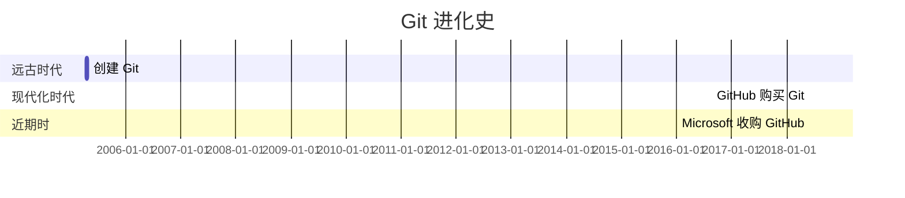

57. `title`：定义 Git 图的标题。
58. `dateFormat`：定义日期格式。
59. `section`：定义不同时间段。
60. 使用 `:` 分隔任务名称和 ID。
61. 使用 `,` 分隔任务 ID、开始日期和持续天数。

### 用户定义样式

**定义具有用户定义样式文件的流程图：**

```less
flowchart TD
  A[项目] -->|使用存储过程| B((数据库))
  B -->|更新数据表| C{数据表}
  C -->|检查结果| D[是否满足要求]
  style A fill:#BEE7E9,stroke:#333,stroke-width:4px
  style B fill:#BEE7E9,stroke:#333,stroke-width:4px,stroke-dasharray: 5, 5
  style C fill:#BEE7E9,stroke:#333,stroke-width:4px,stroke-dasharray: 5, 5
  style D fill:#BEE7E9,stroke:#333,stroke-width:4px,stroke-dasharray: 5, 5,font-size:14px
```

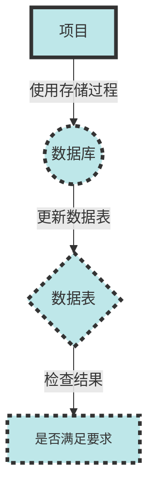

62. `style`：用于定义节点的样式。
63. `fill`：表示填充颜色。
64. `stroke`：指定边框颜色。
65. `stroke-width`：指定边框宽度。
66. `stroke-dasharray`：用于定义边框样式，该样式使用一组数字表示边框的线长度和间隔。
67. `font-size`：用于定义节点标签的字体大小。

### 数字属性

**定义具有数字属性的流程图：**

```dart
graph TD
  A[顶部] ==>|50| B[中部]
  B <==>|25| C[底部]
```

68. `==> |数字|`：定义一个带数字属性的箭头。
69. `<==>`：定义双向箭头。
70. 使用数字属性来定义箭头长度。

### 饼图

**定义一个饼图表：**

```bash
pie title 人员构成
  "工程师" : 43
  "销售" : 20
  "市场" : 17
  "其他" : 5
  "管理" : 15
```

43%20%17%15%5%人员构成工程师销售市场管理其他

71. `pie`：定义饼图。
72. `title`：定义饼图的标题。
73. 使用冒号分隔项目名称和数量。