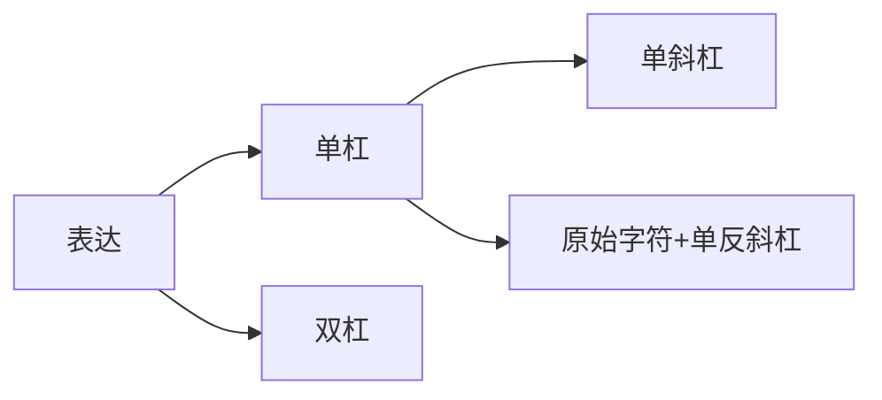

## 1. 读取文件路径


在介绍路径的读取前，我们先介绍**路径过渡的表示**——表示上下路径的过渡时有以下三种方式：



```python
# 使用原始字符串

df = pd.read_excel(r'.\Input\data.xlsx') # 等价于Input\data.xlsx


# 使用双反斜杠(前者转义符)
df = pd.read_excel('.\\Input\\data.xlsx') # 不可等价

# 使用正斜杠
df = pd.read_excel('./Input/data.xlsx') # 不可等价
```


1. **斜杠（`/`）**：在Unix-like系统中，斜杠可以用于表示路径，并且可以与点号和双点号结合使用。
    
    ```python
    # 当前->下一级->文件
    open('/file.txt', 'r')
    # 当前->上一级->下一级->文件
    open('/../file.txt', 'r') 
    ```
    
2. **反斜杠（`\`）**：在Windows系统中，反斜杠通常用作路径分隔符。
    
    ```python
    # 当前->下一级
    open('\\file.txt' )
    # 当前->上一级->下一级->文件
    open('\\..\\file.txt')
    ```
    

>**建议**：为了记忆方便以及系统符号统一问题，全部使用斜杠作为过渡符

### 1.1 使用绝对路径

绝对路径指的是从根目录开始到目标文件的完整路径。在Windows系统中，通常以盘符（如C:\）开头；在Unix/Linux系统中，以根目录（/）开头。


```python
# Windows系统
file_path = r'C:\Users\Username\Documents\example.txt' # 以原始字符串方式
file_path = 'C:\\Users\\Username\\Documents\\example.txt' # 以双斜杠方式
# Unix/Linux系统
file_path = '/home/username/Documents/example.txt'
```


>**注意**：单个的`\`表示转义字符

### 1.2 使用相对路径

相对路径指的是从当前工作目录开始到目标文件的路径。使用相对路径可以避免硬编码绝对路径，提高代码的可移植性。


在代码中表示相对路径时，可以使用以下几种语法：

1. **点号（`.`）**：表示当前目录。
        
    ```python
    # 三种表达表示从当前目录出发
    # 当前->文件
    open('./file.txt', 'r') 
    open('/file.txt', 'r')  
    open('file.txt', 'r')   
    ```
    
2. **双点号（`..`）**：表示上级目录。
    
    ```python
    # 当前->上级->文件
    open('../file.txt', 'r')
    ```
    


>**总结**：从左到右慢慢解读，Windows平台只要不出现盘符都是从当前这一级相对目录起算


在Python中，推荐使用正斜杠（`/`）作为路径分隔符，因为这样可以确保代码在不同操作系统中的兼容性。Python的`os`模块提供了`os.path.join`函数，可以自动为你处理不同操作系统中的路径分隔符问题：


---

>**举例**：

```python
import os

# 假设当前运行文件的工作目录为 'C:\Users\Username\Documents'
file_path = 'example.txt'(或file_path = './example.txt')
# 实际读取目录为C:\Users\Username\Documents\example.txt
```

>**发现**：`file_path = 'example.txt'(或file_path = './example.txt')`是等价的，或者说`.\`可以换成空字符，但是最好推荐后者写法，为了记忆的统一。因为`../`表示当前运行文件的上级目录，而这个就没有等价表达式了

>**思考**：类比相对速度绝对速度的概念——项目目录+相对目录=绝对目录

>**注意**：在现代编译器中相对路径的起算路径是你的项目文件夹本身作为起点，而不是从当前执行的代码作为起点，具体举例如下


---

- **例子1**：某项目实际文件夹目录如下


目录文件树
```text
project
	DataAnalysisDemo/
	│
	├── APIcode/
	│   ├── Input/
	│   │   └── data.xlsx
	│   ├── OutPut/
	│   ├── explain.md
	│   └── main.py
	WebDisplayDemo/
		├── templates/
	    │   └── explain.md
	    └── Web_Background.py
```


对于`main.py`来讲，相对路径的起算位置点是`project`，那么分析以下路径导入是否正确

```python
df=pd.read_excel('Input/data.xlsx') # 报错路径无法识别
```


```python
df=pd.read_excel('DataAnalysisDemo\Input\data.xlsx') # 路径可以识别
```


### 1.3 使用os.path模块

`os.path`模块提供了许多用于处理文件路径的函数，如`os.path.join`、`os.path.abspath`等。

```python
import os

# 拼接路径
file_path = os.path.join('Documents', 'example.txt')

# 获取绝对路径
absolute_path = os.path.abspath(file_path)
```

## 2. 常见路径问题解析

在处理文件路径时，可能会遇到以下问题：

### 2.1 路径分隔符不一致

在Windows和Unix/Linux系统中，路径分隔符不同。Windows使用反斜杠（\），而Unix/Linux使用正斜杠（/）。

```python
import os

# Windows系统
file_path = os.path.join('Documents', 'example.txt')

# Unix/Linux系统
file_path = os.path.join('Documents', 'example.txt')
```

### 2.2 路径中的空格

文件路径中可能包含空格，这可能会导致路径解析错误。为了避免这种情况，可以使用`os.path.join`函数或原始字符串（使用`r''`）。

```python
import os

# 正确的方式
file_path = os.path.join('Documents', 'example file.txt')

# 错误的方式
file_path = 'Documents\\example file.txt'
```

### 2.3 路径不存在

在尝试读取文件之前，需要检查路径是否存在。可以使用`os.path.exists`函数进行判断。

```python
import os

file_path = 'Documents\example.txt'

if os.path.exists(file_path):
    # 文件存在，可以进行读取等操作
    pass
else:
    # 文件不存在，处理错误或提示用户
    pass
```

## 3. 总结

正确处理文件路径对于Python编程至关重要。通过使用绝对路径、相对路径和`os.path`模块，可以有效地读取和处理文件路径。同时，了解并解决常见的路径问题，可以避免在文件操作中遇到不必要的麻烦。