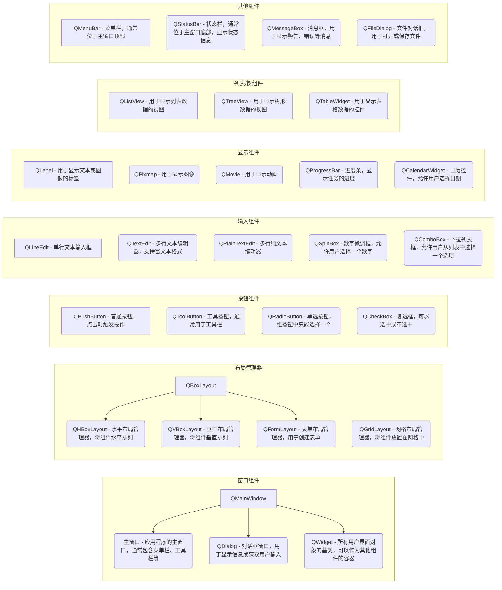
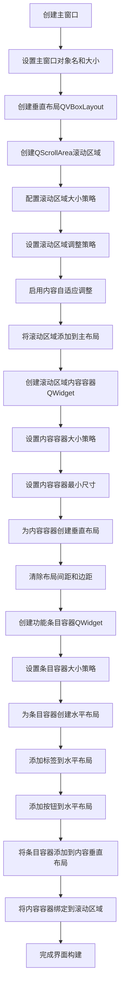
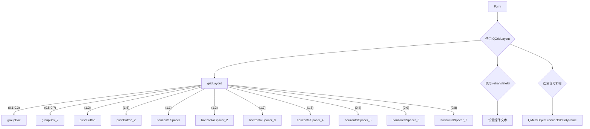

- # 1. 本库回忆
- # 1.1. Qt组件树




- # 1.2. 创建子组件放入父容器，启用布局管理

1.  **创建子组件**: 实例化需要添加的子组件，例如 `QLabel`。
    ```python
    label = QLabel()
    ```
    这里，`QLabel` 是子组件，`self.scrollAreaWidgetContents` 是父容器。

2.  **设置子组件属性**:  设置子组件的各种属性，例如文本、大小、显示内容等。
    ```python
    pixmap = QPixmap(image_path)
    label.setPixmap(pixmap.scaled(150, 150, Qt.KeepAspectRatio, Qt.SmoothTransformation))
    label.setFixedSize(150, 150)
    ```

3.  **为父容器设置布局**: 获取父容器的布局管理器。如果父容器没有布局管理器，则调用`setLayout`方法创建一个。
    ```python
    # 为父组件调用setLayout方法配置布局
    if not self.scrollAreaWidgetContents.layout():
        from PySide6.QtWidgets import QVBoxLayout
        self.scrollAreaWidgetContents.setLayout(QVBoxLayout())

	# 将layout实例化
    layout = self.scrollAreaWidgetContents.layout()
    ```
    这里，如果 `self.scrollAreaWidgetContents` 没有布局，则创建一个 `QVBoxLayout` 垂直布局。

4.  **将子组件添加到布局**: 使用布局管理器的 `addWidget()` 方法将子组件添加到父容器的布局中。
    ```python
    # 方法一
    layout.addWidget(label)
    # 方法二
    label = QLabel(self.scrollAreaWidgetContents)
    ```
    布局管理器会自动管理子组件的位置和大小。


- # 2. 本库重点

- # 2.1. show()和exec()方法对比

**1. `show()`**

*   **非阻塞：** 调用 `show()` 后，对话框会显示出来，但主程序不会停止执行，而是会继续往下运行。
*   **非模态：** 通过 `show()` 打开的对话框是非模态的。这意味着用户可以同时与主窗口以及多个通过 `show()` 打开的对话框进行交互。
*   **生命周期管理：**
    *   **需要手动管理生命周期。** 推荐使用 `self.dialog = QDialog()` 或其他变量来持有对对话框对象的引用，以防止对象被垃圾回收，导致窗口一闪而过。
    *   如果使用 `self.dialog = QDialog()` 持有引用，窗口关闭时，如果设置了 `Qt.WA_DeleteOnClose` 属性，对象会被销毁；否则，对象仍然存在，但窗口已经关闭。

**案例：**

```python
from PySide6.QtWidgets import QApplication, QWidget, QPushButton, QDialog, QVBoxLayout
import sys

class MyDialog(QDialog):
    def __init__(self):
        super().__init__()
        self.setWindowTitle("My Dialog")
        layout = QVBoxLayout(self)
        label = QLabel("This is a non-modal dialog")
        layout.addWidget(label)

class MainWindow(QWidget):
    def __init__(self):
        super().__init__()
        self.setWindowTitle("Main Window")
        layout = QVBoxLayout(self)
        button = QPushButton("Open Dialog")
        layout.addWidget(button)
        button.clicked.connect(self.open_dialog)
        self.dialog = None  #  持有对话框的引用

    def open_dialog(self):
        self.dialog = MyDialog()
        self.dialog.show()
        print("Dialog opened, but main window is still responsive.")

if __name__ == "__main__":
    app = QApplication(sys.argv)
    window = MainWindow()
    window.show()
    sys.exit(app.exec())
```

在这个例子中，点击 "Open Dialog" 按钮会打开一个非模态对话框。主窗口仍然可以操作，并且可以在打开多个对话框。`self.dialog = MyDialog()` 用于持有对话框的引用，确保对话框不会被立即销毁。

**2. `exec()`**

*   **阻塞：** 调用 `exec()` 后，主程序会暂停执行，直到对话框被关闭后，才会继续执行后面的代码。
*   **模态：** 通过 `exec()` 打开的对话框是模态的。这意味着用户只能与该对话框进行交互，而不能操作主窗口。
*   **生命周期管理：**
    *   **自动管理生命周期。** 不需要使用 `self.dialog` 或其他变量来持有对对话框对象的引用。
    *   对话框关闭后，会自动销毁。

**案例：**

```python
from PySide6.QtWidgets import QApplication, QWidget, QPushButton, QDialog, QVBoxLayout, QLabel, QDialogButtonBox
import sys

class MyDialog(QDialog):
    def __init__(self):
        super().__init__()
        self.setWindowTitle("My Modal Dialog")
        layout = QVBoxLayout(self)
        label = QLabel("This is a modal dialog")
        layout.addWidget(label)
        buttons = QDialogButtonBox(QDialogButtonBox.Ok | QDialogButtonBox.Cancel)
        buttons.accepted.connect(self.accept)
        buttons.rejected.connect(self.reject)
        layout.addWidget(buttons)

class MainWindow(QWidget):
    def __init__(self):
        super().__init__()
        self.setWindowTitle("Main Window")
        layout = QVBoxLayout(self)
        button = QPushButton("Open Modal Dialog")
        layout.addWidget(button)
        button.clicked.connect(self.open_dialog)

    def open_dialog(self):
        dialog = MyDialog()
        result = dialog.exec()
        if result == QDialog.Accepted:
            print("Dialog accepted")
        else:
            print("Dialog rejected")
        print("Main window is responsive again after dialog is closed.")

if __name__ == "__main__":
    app = QApplication(sys.argv)
    window = MainWindow()
    window.show()
    sys.exit(app.exec())
```

在这个例子中，点击 "Open Modal Dialog" 按钮会打开一个模态对话框。在对话框关闭之前，主窗口无法操作。`dialog.exec()` 会阻塞主程序，直到对话框被接受或拒绝。对话框对象在 `exec()` 方法返回后自动销毁，无需手动管理。


**3. 适用场景**

*   **`show()`：** 适用于需要同时显示多个窗口、窗口为非模态、允许用户同时操作主窗口和多个弹窗的场景。
*   **`exec()`：** 适用于只允许显示一个弹窗、需要用户先处理弹窗再返回主窗口的场景（例如“保存/取消”对话框）。

**总结**

*   **`show()`：** 非模态、非阻塞、需手动管理生命周期（推荐用 `self.dialog` 持有）。
*   **`exec()`：** 模态、阻塞、自动管理生命周期。

您的观察是正确的：`exec()` 方法不依赖于使用 `self` 属性进行生命周期管理，因为它会自动阻塞并管理窗口对象，关闭后自动销毁。

```ad-note
title:exce()和excel_()的对比
在 PySide6 库中，`exec()` 和 `exec_()` 方法的功能本质上是相同的，都是用于启动 Qt 应用程序的事件循环。但它们之间存在一些历史和命名上的差异：

1. **`exec_()` 的存在原因**  
   在 Python 2.7 中，`exec` 是一个关键字（用于执行动态代码），不能作为方法名或函数名使用。为避免与 Python 关键字冲突，PySide 和 PyQt 等 Qt 绑定库将原本的 `exec()` 方法重命名为 `exec_()`，以符合 Python 的命名规范 。

2. **`exec()` 的回归**  
   随着 Python 3.0 的发布，`exec` 不再是保留关键字（尽管 `exec()` 仍可用于内置函数），因此 PySide6 和 PyQt6 开始支持直接使用 `exec()` 方法，以更贴近 Qt 原生 C++ API 的命名方式 。

3. **当前推荐用法**  
   在 PySide6 中，`exec_()` 方法已被标记为**过时**（deprecated），官方推荐使用 `exec()` 作为标准方法。两者功能完全相同，但 `exec()` 更简洁且符合现代 Python 实践 。

## 示例代码对比
	```python
	# 使用 exec()（推荐）
	from PySide6.QtWidgets import QApplication, QLabel
	
	app = QApplication([])
	label = QLabel("Hello, PySide6!")
	label.show()
	app.exec()
	
	# 使用 exec_()（兼容旧代码）
	app.exec_()
	```

## 总结
- **功能一致性**：`exec()` 和 `exec_()` 的功能完全一致，均用于启动事件循环 。
- **命名演变**：`exec_()` 是 Python 2.7 兼容性的产物，而 `exec()` 是 Python 3 中的推荐写法 。
- **未来建议**：在 PySide6 项目中应优先使用 `exec()`，避免依赖已过时的 `exec_()` 。
```


- # 2.2. `setWidget()` **方法** 和 **`addWidget()` 方法** 对比

在 PySide 中，`setWidget()` 和 `addWidget()` 是两个功能截然不同的方法，分别用于 **容器控件** 和 **布局管理器**，其核心区别如下：

---

- ## 2.2.1. **`setWidget()` 方法**
 **用途**  
用于将控件设置为 **特定容器控件** 的子控件（即内容控件），通常用于 `QDockWidget`、`QScrollArea` 等容器类控件。  
 **示例**  
```python
dock = QDockWidget()
text_edit = QTextEdit()
dock.setWidget(text_edit)  # 将 QTextEdit 设置为 QDockWidget 的内容控件 
```
 **关键特性**  
- **一对一关系**：一个容器控件只能设置一个内容控件（如 `QScrollArea.setWidget()`）。
- **覆盖式设置**：多次调用会覆盖之前的控件。
- **容器专用**：仅适用于特定容器控件（如 `QDockWidget`、`QScrollArea`）。

 **典型应用场景**  
- 在 `QScrollArea` 中设置可滚动的内容区域：
  ```python
  scroll_area = QScrollArea()
  content_widget = QWidget()
  scroll_area.setWidget(content_widget)  # 设置滚动区域的内容控件 
  ```

---

- ## 2.2.2. **`addWidget()` 方法**
 **用途**  
用于将控件或子布局 **添加到布局管理器**（如 `QVBoxLayout`、`QHBoxLayout`、`QGridLayout`）中，实现控件的自动排列。  
 **示例**  
```python
layout = QVBoxLayout()
button1 = QPushButton("Button 1")
button2 = QPushButton("Button 2")
layout.addWidget(button1)  # 将按钮添加到垂直布局中 
layout.addWidget(button2)
```
 **关键特性**  
- **一对多关系**：一个布局可以添加多个控件或子布局。
- **顺序排列**：控件按添加顺序排列（如 `QVBoxLayout` 从上到下）。
- **布局专属**：属于 `QLayout` 及其子类（如 `QVBoxLayout`）的方法。

 **典型应用场景**  
- 动态生成条目列表：
  ```python
  for name in backup_folders:
      item_widget = QWidget()
      layout = QHBoxLayout(item_widget)
      layout.addWidget(QLabel(name))  # 添加标签到水平布局中 
      layout.addWidget(QPushButton("查看"))
      content_layout.addWidget(item_widget)  # 将条目添加到垂直布局中
  ```

---

- ## 2.2.3. **核心区别总结**

| 特性                | `setWidget()`                          | `addWidget()`                          |
|---------------------|----------------------------------------|----------------------------------------|
| **所属对象**        | 容器控件（如 `QDockWidget`、`QScrollArea`） | 布局管理器（如 `QVBoxLayout`、`QHBoxLayout`） |
| **功能**            | 设置容器的内容控件                     | 向布局中添加控件或子布局               |
| **控件数量**        | 一次只能设置一个控件                   | 可添加多个控件                         |
| **排列方式**        | 不涉及控件排列                         | 自动按布局规则排列控件                 |
| **是否覆盖**        | 是（多次调用会覆盖之前的控件）         | 否（多次调用会追加控件）               |
| **是否影响布局**    | 否                                     | 是（布局会触发布局更新）               |

---

- ## 2.2.4. **实际应用对比**

 **场景：在 `QScrollArea` 中显示动态条目列表**
- **错误用法（混淆 `setWidget`）**：
  ```python
  scroll_area = QScrollArea()
  content_widget = QWidget()
  scroll_area.setWidget(content_widget)  # 设置内容容器

  # 错误：直接调用 scroll_area.addWidget() 会报错
  scroll_area.addWidget(QPushButton("错误"))  # ❌ 会抛出 AttributeError
  ```

- **正确用法（`setWidget` + `addWidget` 结合）**：
  ```python
  scroll_area = QScrollArea()
  content_widget = QWidget()
  content_layout = QVBoxLayout(content_widget)

  for i in range(5):
      content_layout.addWidget(QPushButton(f"按钮 {i+1}"))  # 使用布局的 addWidget

  scroll_area.setWidget(content_widget)  # 将内容容器设置为滚动区域的内容控件 
  ```

---

- ## 2.2.5. **注意事项**
- **避免混用**：`setWidget()` 和 `addWidget()` 分属不同对象，不可混用（如 `QScrollArea.addWidget()` 会报错）。
- **布局优先级**：若控件已加入布局，不应再手动调用 `setGeometry()`，否则布局失效 。
- **动态更新**：修改控件后调用 `update()` 或 `adjustSize()` 触发布局更新 [[文件]]。

通过合理使用 `setWidget()` 和 `addWidget()`，可以高效构建复杂且响应式的界面。

- # 3. 本库犯错

- # 3.1. Qobject Name 重名

- # 3.2. 虚拟环境错误安装包 

安装Pyside6 包时得使用虚拟环境的包安装命令，比如conda install Pyside6 ，而不要直接使用 Pip install，因为无论你是否是用虚拟环境内的Python解释器，其都会直接安装到 c 盘，但是使用 conda 命令就不会

- # 3.3. 混用 .show()方法及 .exec() 方法


`.show()` 方法用于非模态（non-modal）对话框，而 [QMessageBox](vscode-file://vscode-app/e:/Microsoft%20VS%20Code/resources/app/out/vs/code/electron-sandbox/workbench/workbench.html) 默认是模态（modal）对话框。  
如果你用 `.show()`，窗口会显示但不会阻塞后续代码执行，且在某些情况下（比如没有事件循环或主窗口），窗口可能直接卡死或无法响应。

而 `.exec()` 会启动一个本地事件循环，阻塞当前函数直到用户关闭对话框，适合用于提示、警告等需要用户确认的场景。

**总结：**

- `.exec()`：模态，阻塞，适合提示/警告。
- `.show()`：非模态，不阻塞，容易卡死或无响应。

**建议：**  
对于提示类对话框，优先用 `.exec()`。如果一定要用 `.show()`，确保主事件循环已启动，并且对话框对象不会被提前销毁。


# 1 前言

### 1.1 开发框架的选择

GUI程序的开发方式太多了，这里肯定就是Python语言了，至于为什么，就不多描述了；

那么基于Python开发GUI程序的话，也是有多种框架的，常见的有`TKinter、PyQt、PySide、wxPython、Kivy、PyGTK`；

针对这6个常见的框架怎么选择，这里简单的对比一下：

**Tkinter**

- 优点：
    - 是Python的标准GUI库，无需额外安装。
    - 简单易用，适合初学者和快速开发。
    - 跨平台支持，并且在大多数操作系统上都有良好的兼容性。
    - 提供了基本的GUI组件和功能，如按钮、标签、文本框等。
- 缺点：
    - 界面风格相对较简单，可能不适合创建复杂和精美的界面。
    - 可选的GUI组件和样式较少，功能相对较少。

**PyQt**

- 优点：
    - 提供了大量的GUI组件和功能，可用于构建复杂和精美的界面。
    - 跨平台支持，并且在多个操作系统上提供一致的用户体验。
    - 具有良好的文档、示例和社区支持。
- 缺点：
    - 使用GPL或商业许可证，可能需要注意许可证要求。
    - 学习曲线相对较陡峭，对于初学者来说可能需要更多时间来掌握。

**PySide**

- 优点：
    - 提供了与PyQt类似的功能和GUI组件。
    - 使用LGPL许可证，可以更灵活地使用。
    - 跨平台支持，对多个操作系统提供一致的用户体验。
- 缺点：
    - 文档相对较少，相比PyQt来说，社区支持可能相对较少。

**wxPython**

- 优点：
    - 提供了丰富的GUI组件和功能，适用于创建各种类型的应用程序。
    - 跨平台支持，并且在多个操作系统上都有良好的兼容性。
    - 有活跃的社区支持和文档资源。
- 缺点：
    - 学习曲线较陡峭，相对于其他GUI包来说，可能需要更多时间来学习和掌握。

**Kivy**

- 优点：
    - 开源框架，用于创建创新的用户界面，如多点触控应用程序。
    - 跨平台支持，并且适用于移动应用程序等。
    - 提供丰富的GUI组件和功能，支持多点触控和动画效果。
- 缺点：
    - 学习曲线相对较陡峭，需要一定的时间来熟悉框架的工作原理。

**PyGTK**

- 优点：
    - 使用GTK+库，提供了丰富的GUI组件和功能，尤其在Linux和Unix系统上广泛使用。
    - 跨平台支持，并且在多个操作系统上都有良好的兼容性。
    - 提供了良好的文档和社区支持。
- 缺点：
    - 学习曲线较陡峭，对于初学者来说可能需要更多时间来掌握。

> 后面三种的话，就是学习起来会比较麻烦，我们还是专注NLP，不专注GUI程序开发，所以不选择；
> 
> Tkinter的话，就是太简单了，很多东西不能实现，所以不选择；
> 
> 而PyQt和PySide都是基于Qt框架开发的，PyQt和PySide具有相似的API和功能，学习难度也都差不多；**另外PySide使用 LGPL 许可证，可以免费商业使用。但是PyQt使用GPL或商业许可证，商业许可证是付费的；**而且Qt打算着力培养PySide，所以PySide是更有前途的，所以选择Pyside作为GUI程序开发的框架；

- PySide版本选择

PySide现在主要的就是`PySide2`和`PySide6`两个版本，`PySide6`是基于`PySide2`向后兼容的，而且PySide6相比`PySide2`有更多的新特性和改进，包括对`Qt 6`的支持、更好的性能和稳定性，也提供了更多的API和工具，使得开发者可以更轻松的创建高质量的[GUI应用程序](https://so.csdn.net/so/search?q=GUI%E5%BA%94%E7%94%A8%E7%A8%8B%E5%BA%8F&spm=1001.2101.3001.7020)，所以我们选择`PySide6`。


# 2 PySide6的安装与使用

### 2.1 安装

这里用的**python**是**3.8**的版本，`pyside6`要求**3.6**以上的版本，所以这里大家要注意选择，建议新建一个python虚拟环境，包的依赖和版本管理更清晰；

直接`pip`安装即可,`-i`及后面都是镜像源，下载速度更快，这里用的是清华的镜像源，清华的镜像源完整而且下载速度快，所以是个不错的选择；

```python
pip install PySide6 -i https://pypi.tuna.tsinghua.edu.cn/simple
```

### 2.2 写一个简单的窗体

- 代码

新建一个项目，写入下面的代码，运行这个脚本即可；  
每行代码的含义也都注明了；

```python
# -*- coding: utf-8 -*-
# @Time    : 2023/9/25 20:14
# @Author  : MinChess
# @File    : main.py
# @Software: PyCharm

# 这一行导入了 QApplication、QWidget 和 QLabel 类，它们是 PySide6 中用于创建应用程序和窗口组件的类。
from PySide6.QtWidgets import QApplication, QWidget,QLabel

# 创建了一个 QApplication 实例，用于管理整个应用程序的事件循环和资源分配。
app = QApplication()

# 创建一个空白的 QWidget 对象，它代表着我们的窗体。
window = QWidget()
# 设置窗体的标题为 "Simple Window"。
window.setWindowTitle("Simple Window")
# 将窗体的大小固定为宽度为 400 像素、高度为 300 像素。
window.setFixedSize(400, 300)

# 创建一个 QLabel 对象，并将其作为子组件添加到窗体上。同时，设置标签的显示文本为 "Hello PySide6!"。
label = QLabel("Hello PySide6!", window)
# 创建一个 QLabel 对象，并将其作为子组件添加到窗体上。同时，设置标签的显示文本为 "Hello PySide6!"。
label.move(150, 125)

# 显示窗体
window.show()

# 启动应用程序的事件循环，等待事件的触发和处理，使窗体保持可响应状态。
app.exec()

```

- 显示效果


> 如上，就大功告成啦！

# 3 界面设计工具——Qt Designer

### 3.1 简介

首先，说一说上面的开发，窗体所有内容都可以用python来写，包括窗体、布局、组件等，但是如果说全部的这些布局的内容都用python来手敲，会不会太繁杂了，所以要想办法解决这个问题；

Qt Designer就随之而出；

> Qt Designer 是一个**可视化的界面设计工具**，它允许通过拖放和设置属性的方式，轻松创建应用程序的[用户界面](https://edu.csdn.net/cloud/pm_summit?utm_source=blogglc)。类似于搭积木一样，可以在设计师中选择和放置各种小部件（例如按钮、文本框、图像等），然后调整它们的位置和大小。
> 
> Qt Designer 提供了一个直观的图形用户界面，可以在其中**对界面进行布局**，并**设置小部件的外观和行为属性**。可以通过编辑器轻松**调整字体、颜色、对齐方式等属性**，以及连接信号和槽来处理用户交互。
> 
> 设计完成后，Qt Designer 会生成一个特定格式的界面文件（通常是 `.ui` 文件），其中包含了界面的结构、布局和属性信息。可以使用 PySide6 中的 `QUiLoader` 类将该界面文件加载到应用程序中，使界面在运行时动态显示和交互。
> 
> 使用 Qt Designer，无需手动编写复杂的界面代码，而是可以通过直观的操作来创建界面。这，您可以更快速地实现所需的界面，并且能够更好地分离界面设计和应用程序逻辑，使开发工作更加高效、简洁和易于维护。

这里记录简单的使用，不过多讲解，后续可能会专门出一篇关于Qt Designer的博客来记录更多使用技巧和方法；

### 3.2 安装

安装方式有很多，可以直接下载安装包安装，也可以使用其他办法安装；

如果安装了PySide的话，它会自动安装到PySide的包的目录下：

`D:\Coding_env\Python_env\nlp\Lib\site-packages\PySide6`

也就是你python安装的目录下的`\Lib\site-packages\PySide6`文件夹内:


### 3.3 使用教程

- 新建一个窗体

这里选择一个空白的窗体即可；

> 1. 空白模板（Widget）：这是最基本的模板，它创建一个空白的窗体，您可以自由地在其中添加需要的小部件并进行布局。
> 2. 主窗体模板（Main Window）：这个模板创建一个具有标准菜单栏和工具栏的主窗体。它还包含一个中心部件，您可以在其中设计应用程序的主要界面。
> 3. 对话框模板（Dialog with Buttons Bottom）：这个模板创建了一个对话框窗体，包含了预设的按钮（如确定和取消按钮）并将它们置于窗体底部。这种模板适用于需要与用户进行简单交互的对话框。
> 
> 其余两个也是对话框模板，可以点击看看


- 添加组件

这里反正就是布局、按钮、文本域等组件的添加，具体的这里不过多讲解；

这里用到的就两个组件，一个叫做Push Button，另一个是Text Browser；

**你不太会的话，就直接把这些组件往画布上拖，就可以了，注意在右侧的属性编辑器中编辑每个组件的objectName即可；**

不会也没关系，往下走；


- 保存ui文件

点击文件菜单栏，选择保存，即可得到一个ui文件；

打开它，你会发现其实就是xml编写的内容；

到这里Qt Designer的任务就已经完成了，后面就来看看PySide怎么使用ui文件了；

如果你还是不太会使用Qt Designer的话，先手动新建一个文本文件，然后改后缀为ui，然后把下面的代码复制进去；

（先把流程走通嘛，Qt Designer后续再学呗）

```xml
<?xml version="1.0" encoding="UTF-8"?>
<ui version="4.0">
 <class>Form</class>
 <widget class="QWidget" name="Form">
  <property name="geometry">
   <rect>
    <x>0</x>
    <y>0</y>
    <width>336</width>
    <height>313</height>
   </rect>
  </property>
  <property name="windowTitle">
   <string>Form</string>
  </property>
  <layout class="QGridLayout" name="gridLayout_3">
   <item row="0" column="0" colspan="4">
    <widget class="QTextBrowser" name="textBrowser">
     <property name="font">
      <font>
       <pointsize>12</pointsize>
      </font>
     </property>
    </widget>
   </item>
   <item row="1" column="0">
    <widget class="QPushButton" name="bt_1">
     <property name="font">
      <font>
       <pointsize>16</pointsize>
       <bold>true</bold>
      </font>
     </property>
     <property name="text">
      <string>1</string>
     </property>
    </widget>
   </item>
   <item row="1" column="1">
    <widget class="QPushButton" name="bt_2">
     <property name="font">
      <font>
       <pointsize>16</pointsize>
       <bold>true</bold>
      </font>
     </property>
     <property name="text">
      <string>2</string>
     </property>
    </widget>
   </item>
   <item row="1" column="2">
    <widget class="QPushButton" name="bt_3">
     <property name="font">
      <font>
       <pointsize>16</pointsize>
       <bold>true</bold>
      </font>
     </property>
     <property name="text">
      <string>3</string>
     </property>
    </widget>
   </item>
   <item row="1" column="3">
    <widget class="QPushButton" name="bt_add">
     <property name="font">
      <font>
       <pointsize>16</pointsize>
       <bold>true</bold>
      </font>
     </property>
     <property name="text">
      <string>+</string>
     </property>
    </widget>
   </item>
   <item row="2" column="0">
    <widget class="QPushButton" name="bt_4">
     <property name="font">
      <font>
       <pointsize>16</pointsize>
       <bold>true</bold>
      </font>
     </property>
     <property name="text">
      <string>4</string>
     </property>
    </widget>
   </item>
   <item row="2" column="1">
    <widget class="QPushButton" name="bt_5">
     <property name="font">
      <font>
       <pointsize>16</pointsize>
       <bold>true</bold>
      </font>
     </property>
     <property name="text">
      <string>5</string>
     </property>
    </widget>
   </item>
   <item row="2" column="2">
    <widget class="QPushButton" name="bt_6">
     <property name="font">
      <font>
       <pointsize>16</pointsize>
       <bold>true</bold>
      </font>
     </property>
     <property name="text">
      <string>6</string>
     </property>
    </widget>
   </item>
   <item row="2" column="3">
    <widget class="QPushButton" name="bt_minus">
     <property name="font">
      <font>
       <pointsize>16</pointsize>
       <bold>true</bold>
      </font>
     </property>
     <property name="text">
      <string>-</string>
     </property>
    </widget>
   </item>
   <item row="3" column="0">
    <widget class="QPushButton" name="bt_7">
     <property name="font">
      <font>
       <pointsize>16</pointsize>
       <bold>true</bold>
      </font>
     </property>
     <property name="text">
      <string>7</string>
     </property>
    </widget>
   </item>
   <item row="3" column="1">
    <widget class="QPushButton" name="bt_8">
     <property name="font">
      <font>
       <pointsize>16</pointsize>
       <bold>true</bold>
      </font>
     </property>
     <property name="text">
      <string>8</string>
     </property>
    </widget>
   </item>
   <item row="3" column="2">
    <widget class="QPushButton" name="bt_9">
     <property name="font">
      <font>
       <pointsize>16</pointsize>
       <bold>true</bold>
      </font>
     </property>
     <property name="text">
      <string>9</string>
     </property>
    </widget>
   </item>
   <item row="3" column="3">
    <widget class="QPushButton" name="bt_multiply">
     <property name="font">
      <font>
       <pointsize>16</pointsize>
       <bold>true</bold>
      </font>
     </property>
     <property name="text">
      <string>×</string>
     </property>
    </widget>
   </item>
   <item row="4" column="0">
    <widget class="QPushButton" name="bt_CE">
     <property name="font">
      <font>
       <pointsize>16</pointsize>
       <bold>true</bold>
      </font>
     </property>
     <property name="text">
      <string>CE</string>
     </property>
    </widget>
   </item>
   <item row="4" column="1">
    <widget class="QPushButton" name="bt_0">
     <property name="font">
      <font>
       <pointsize>16</pointsize>
       <bold>true</bold>
      </font>
     </property>
     <property name="text">
      <string>0</string>
     </property>
    </widget>
   </item>
   <item row="4" column="2">
    <widget class="QPushButton" name="bt_equal">
     <property name="font">
      <font>
       <pointsize>16</pointsize>
       <bold>true</bold>
      </font>
     </property>
     <property name="text">
      <string>=</string>
     </property>
    </widget>
   </item>
   <item row="4" column="3">
    <widget class="QPushButton" name="bt_divide">
     <property name="font">
      <font>
       <pointsize>16</pointsize>
       <bold>true</bold>
      </font>
     </property>
     <property name="text">
      <string>➗</string>
     </property>
    </widget>
   </item>
  </layout>
 </widget>
 <resources/>
 <connections/>
</ui>
```

### 3.4 PySide引入ui文件

> ui文件有两种使用方法，一种是直接引用进来，但是复杂的程序可能会有兼容性的问题，而且打包也不是很友好；
> 
> 另一种是将ui转换为py文件后使用，这种方式的适配更友好；
> 
> 这里我们两种方法都演示一下；

#### 3.4.1 直接使用

- **先引入进来并运行看看情况**

详细引入的方法见代码注释；

```python
# -*- coding: utf-8 -*-
# @Time    : 2023/9/25 22:03
# @Author  : MinChess
# @File    : main.py
# @Software: PyCharm
import sys
from PySide6.QtCore import QFile, QIODevice
from PySide6.QtUiTools import QUiLoader
from PySide6.QtWidgets import QApplication

app = QApplication([])

# 加载UI文件
ui_file = QFile("main.ui")
if not ui_file.open(QIODevice.ReadOnly):
    print("无法打开UI文件")
    sys.exit(-1)

# 创建UI加载器
loader = QUiLoader()

# 加载UI文件并实例化为窗口对象
window = loader.load(ui_file)

# 关闭UI文件
ui_file.close()

# 显示窗口
window.show()

# 运行应用程序
app.exec()
```

运行结果：


OK,没问题！

- 上面的代码还是太简单了，我们定义一个类作为主窗口，重构下代码

```python
# -*- coding: utf-8 -*-
# @Time    : 2023/9/25 22:03
# @Author  : MinChess
# @File    : main.py
# @Software: PyCharm
import sys
from PySide6.QtCore import QFile, QIODevice, Slot
from PySide6.QtUiTools import QUiLoader
from PySide6.QtWidgets import QApplication, QMainWindow, QMessageBox, QPushButton


# 定义主窗口类
class MainWindow(QMainWindow):
    def __init__(self):
        super().__init__()

        # 加载UI文件
        loader = QUiLoader()
        ui_file = QFile("main.ui")
        if not ui_file.open(QIODevice.ReadOnly):
            print("无法打开UI文件")
            sys.exit(-1)

        # 加载UI文件并实例化为窗口对象
        self.window = loader.load(ui_file)

        # 关闭UI文件
        ui_file.close()


if __name__ == "__main__":
    # 创建一个QApplication对象，它是PySide6应用程序的核心，负责处理事件和管理应用程序的生命周期。
    app = QApplication([])
    # 创建一个MainWindow对象，即主窗口类的实例。
    main_window = MainWindow()
    # 调用主窗口对象的show()方法，将主窗口显示在屏幕上。
    main_window.window.show()
    # 启动应用程序的事件循环，使得应用程序能够响应用户的输入和系统事件，保持运行状态。
    app.exec()
```

> 为了使用信号和槽的机制，这里要定义一个主窗口类，但是定义主窗口类的作用远不只有这个作用；

- 为按钮绑定函数

```python
# -*- coding: utf-8 -*-
# @Time    : 2023/9/25 22:03
# @Author  : MinChess
# @File    : main.py
# @Software: PyCharm
import sys
from PySide6.QtCore import QFile, QIODevice, Slot
from PySide6.QtUiTools import QUiLoader
from PySide6.QtWidgets import QApplication, QMainWindow, QMessageBox, QPushButton


# 定义主窗口类
class MainWindow(QMainWindow):
    def __init__(self):
        super().__init__()

        # 加载UI文件
        loader = QUiLoader()
        ui_file = QFile("main.ui")
        if not ui_file.open(QIODevice.ReadOnly):
            print("无法打开UI文件")
            sys.exit(-1)

        # 加载UI文件并实例化为窗口对象
        self.window = loader.load(ui_file)

        # 关闭UI文件
        ui_file.close()

        # 获取UI文件中的小部件对象
        self.button = self.window.findChild(QPushButton, "bt_1")

        # 连接信号和槽，实
        self.button.clicked.connect(self.bt_1_click)

    # 按钮点击事件处理函数
    @Slot()
    def bt_1_click(self):
        print("1")


if __name__ == "__main__":
    app = QApplication([])
    main_window = MainWindow()
    main_window.window.show()
    app.exec()
```

主要的代码就这几行，其实还是很容易看懂的；

```python
    # 获取UI文件中的小部件对象
    self.button = self.window.findChild(QPushButton, "bt_1")

    # 连接信号和槽
    self.button.clicked.connect(self.bt_1_click)

# 按钮点击事件处理函数
@Slot()
def bt_1_click(self):
    print("1")
```

- 运行后，点击`1`按钮看效果

如下，点击后成果输出了；

那么说明这个流程已经打通了，接下来就是看怎么完善这个插槽函数，以及进一步复杂的逻辑了；


- **完善代码**

这里直接附上最终代码，不一步一步讲解了；

其实这个代码非常的冗余，也是因为制作ui文件的时候，对象名有问题；

_这里都是简单的逻辑，复杂的还需要进一步优化，这里只是简单的先实现这个程序，也就到这个程度为止；_

```python
# -*- coding: utf-8 -*-
# @Time    : 2023/9/25 22:03
# @Author  : MinChess
# @File    : main.py
# @Software: PyCharm
import sys
from PySide6.QtCore import QFile, QIODevice, Slot
from PySide6.QtUiTools import QUiLoader
from PySide6.QtWidgets import QApplication, QMainWindow, QMessageBox, QPushButton, QTextBrowser


# 定义主窗口类
class MainWindow(QMainWindow):
    def __init__(self):
        super().__init__()

        # 加载UI文件
        loader = QUiLoader()
        ui_file = QFile("main.ui")
        if not ui_file.open(QIODevice.ReadOnly):
            print("无法打开UI文件")
            sys.exit(-1)

        # 加载UI文件并实例化为窗口对象
        self.window = loader.load(ui_file)

        # 关闭UI文件
        ui_file.close()

        # 获取UI文件中的小部件对象
        self.textbrowser = self.window.findChild(QTextBrowser, "textBrowser")
        self.bt_1 = self.window.findChild(QPushButton, "bt_1")
        self.bt_2 = self.window.findChild(QPushButton, "bt_2")
        self.bt_3 = self.window.findChild(QPushButton, "bt_3")
        self.bt_4 = self.window.findChild(QPushButton, "bt_4")
        self.bt_5 = self.window.findChild(QPushButton, "bt_5")
        self.bt_6 = self.window.findChild(QPushButton, "bt_6")
        self.bt_7 = self.window.findChild(QPushButton, "bt_7")
        self.bt_8 = self.window.findChild(QPushButton, "bt_8")
        self.bt_9 = self.window.findChild(QPushButton, "bt_9")
        self.bt_0 = self.window.findChild(QPushButton, "bt_0")
        self.bt_add = self.window.findChild(QPushButton, "bt_add")
        self.bt_divide = self.window.findChild(QPushButton, "bt_divide")
        self.bt_CE = self.window.findChild(QPushButton, "bt_CE")
        self.bt_minus = self.window.findChild(QPushButton, "bt_minus")
        self.bt_multiply = self.window.findChild(QPushButton, "bt_multiply")
        self.bt_equal = self.window.findChild(QPushButton, "bt_equal")

        # 连接信号和槽
        self.bt_1.clicked.connect(self.bt_click)
        self.bt_2.clicked.connect(self.bt_click)
        self.bt_3.clicked.connect(self.bt_click)
        self.bt_4.clicked.connect(self.bt_click)
        self.bt_5.clicked.connect(self.bt_click)
        self.bt_6.clicked.connect(self.bt_click)
        self.bt_7.clicked.connect(self.bt_click)
        self.bt_8.clicked.connect(self.bt_click)
        self.bt_9.clicked.connect(self.bt_click)
        self.bt_0.clicked.connect(self.bt_click)
        self.bt_add.clicked.connect(self.bt_add_click)
        self.bt_equal.clicked.connect(self.bt_equal_click)
        self.bt_divide.clicked.connect(self.bt_divide_click)
        self.bt_CE.clicked.connect(self.bt_CE_click)
        self.bt_multiply.clicked.connect(self.bt_multiply_click)
        self.bt_minus.clicked.connect(self.bt_minus_click)

    # 加号函数
    @Slot()
    def bt_add_click(self):
        self.textbrowser.insertPlainText('+')

    # 减号函数
    @Slot()
    def bt_minus_click(self):
        self.textbrowser.insertPlainText('-')

    # 乘号函数
    @Slot()
    def bt_multiply_click(self):
        self.textbrowser.insertPlainText('*')

    # 除号函数
    @Slot()
    def bt_divide_click(self):
        self.textbrowser.insertPlainText('/')

    # 等号函数
    @Slot()
    def bt_equal_click(self):
        result = eval(self.textbrowser.toPlainText())
        self.textbrowser.insertPlainText('=')
        self.textbrowser.append(str(result))

    # 清空函数
    @Slot()
    def bt_CE_click(self):
        self.textbrowser.clear()

    # 点击数字按钮，获取当前按钮的值
    @Slot()
    def bt_click(self):
        button = self.sender()
        self.textbrowser.insertPlainText(button.text())


if __name__ == "__main__":
    # 创建一个QApplication对象，它是PySide6应用程序的核心，负责处理事件和管理应用程序的生命周期。
    app = QApplication([])
    # 创建一个MainWindow对象，即主窗口类的实例。
    main_window = MainWindow()
    # 调用主窗口对象的show()方法，将主窗口显示在屏幕上。
    main_window.window.show()
    # 启动应用程序的事件循环，使得应用程序能够响应用户的输入和系统事件，保持运行状态。
    app.exec()
```

运行效果也是完全ok的：


#### 3.4.2 将ui文件转为py文件使用

- 将ui文件转为py文件

pyside6自带将ui文件转换为py文件的工具，在ui文件下所在目录下运行下面的命令就可以完成转换了；

`main.ui`是待转换的文件；

`main_ui.py`是转换后的文件；

```python
pyside6-uic main.ui -o main_ui.py
```

这里也可以指定存放的目录

```python
pyside6-uic mainwindow.ui -o ./output/mainwindow.py
```

可以使用`-w`或`--wrapper`选项来指定主类的名称：

```python
pyside6-uic input.ui -o output.py -w Ui_MainWindow
```

- 引入py文件

主要的代码就几行：

`from main_ui import Ui_Form`引入转换后的ui文件；

`self.ui = Ui_Form()`初始化一个对象；

`self.ui.setupUi(self)`使用setupUi()方法创建和设置UI界面；

`self.textbrowser = self.ui.xxx`直接获取对象；

```python
# -*- coding: utf-8 -*-
# @Time    : 2023/9/25 22:29
# @Author  : MinChess
# @File    : demo.py
# @Software: PyCharm
from PySide6.QtWidgets import QApplication, QMainWindow, QWidget, QTextBrowser, QPushButton
from main_ui import Ui_Form


class MyMainWindow(QWidget):
    def __init__(self):
        super().__init__()

        # 初始化 UI
        self.ui = Ui_Form()
        self.ui.setupUi(self)

        # 获取UI文件中的小部件对象
        self.textbrowser = self.ui.textBrowser
        self.bt_1 = self.ui.bt_1
        self.bt_2 = self.ui.bt_2
        self.bt_3 = self.ui.bt_3
        self.bt_4 = self.ui.bt_4
        self.bt_5 = self.ui.bt_5
        self.bt_6 = self.ui.bt_6
        self.bt_7 = self.ui.bt_7
        self.bt_8 = self.ui.bt_8
        self.bt_9 = self.ui.bt_9
        self.bt_0 = self.ui.bt_0
        self.bt_add = self.ui.bt_add
        self.bt_divide = self.ui.bt_divide
        self.bt_CE = self.ui.bt_CE
        self.bt_minus = self.ui.bt_minus
        self.bt_multiply = self.ui.bt_multiply
        self.bt_equal = self.ui.bt_equal

        # 连接信号和槽
        self.bt_1.clicked.connect(self.bt_click)
        self.bt_2.clicked.connect(self.bt_click)
        self.bt_3.clicked.connect(self.bt_click)
        self.bt_4.clicked.connect(self.bt_click)
        self.bt_5.clicked.connect(self.bt_click)
        self.bt_6.clicked.connect(self.bt_click)
        self.bt_7.clicked.connect(self.bt_click)
        self.bt_8.clicked.connect(self.bt_click)
        self.bt_9.clicked.connect(self.bt_click)
        self.bt_0.clicked.connect(self.bt_click)
        self.bt_add.clicked.connect(self.bt_add_click)
        self.bt_equal.clicked.connect(self.bt_equal_click)
        self.bt_divide.clicked.connect(self.bt_divide_click)
        self.bt_CE.clicked.connect(self.bt_CE_click)
        self.bt_multiply.clicked.connect(self.bt_multiply_click)
        self.bt_minus.clicked.connect(self.bt_minus_click)

    # 加号函数
    def bt_add_click(self):
        self.textbrowser.insertPlainText('+')

    # 减号函数
    def bt_minus_click(self):
        self.textbrowser.insertPlainText('-')

    # 乘号函数
    def bt_multiply_click(self):
        self.textbrowser.insertPlainText('*')

    # 除号函数
    def bt_divide_click(self):
        self.textbrowser.insertPlainText('/')

    # 等号函数
    def bt_equal_click(self):
        result = eval(self.textbrowser.toPlainText())
        self.textbrowser.insertPlainText('=')
        self.textbrowser.append(str(result))

    # 清空函数
    def bt_CE_click(self):
        self.textbrowser.clear()

    # 点击数字按钮，获取当前按钮的值
    def bt_click(self):
        button = self.sender()
        self.textbrowser.insertPlainText(button.text())


if __name__ == '__main__':
    app = QApplication([])
    mainWindow = MyMainWindow()
    mainWindow.show()
    app.exec()
```


# 4. 基本组件介绍


- # 4. 本节犯错


# 1. 容器组件 (Container Components)

>**引言**：容器组件是构建图形用户界面的基础，它们用于**承载和组织所有可见的 UI 组件**。在 PySide6 中，最常用的顶级容器是 `QMainWindow`、`QWidget` 和 `QDialog`。

*   **QWindow**: 相对底层，通常不直接用于创建复杂的应用程序窗口，更多地被 `QWidget` 等封装。
*   **QWidget**: 是所有用户界面对象的基类。它既可以作为独立的顶级窗口（没有菜单栏、工具栏等预设结构），也可以嵌入到其他窗口部件中，是最通用的窗口或控件基类。如果不确定窗口的具体类型或需要将其嵌入其他窗口，通常基于 `QWidget` 创建。
*   **QDialog**: 设计用于创建对话框窗口。对话框通常用于显示临时信息、获取用户特定输入或提供选项。它们可以是模态的（阻止与应用程序其他部分的交互）或非模态的。
*   **QMainWindow**: 设计用于创建应用程序的主窗口。它内置了对菜单栏、工具栏、状态栏和可停靠部件（Dock Widgets）的支持，提供了一个经典的应用程序框架。

选择哪个基类取决于窗口的用途：
*   顶级对话框：一般基于 `QDialog` 创建。
*   应用程序主窗口：一般基于 `QMainWindow` 创建。
*   通用窗口或可嵌入控件：一般基于 `QWidget` 创建。

## 1.1 QMainWindow

桌面软件主窗口一般由**标题栏，菜单栏，工具栏，工作区和状态栏**组成。


工作区通常由各种各样的锚接控件（Dock Widgets）和中心控件（Central Widget）组成，例如 Pycharm 的主窗口：


可以看到 Pycharm 的主窗口工作区默认有三个锚接控件（文件浏览器、Debug 窗口）和一个中心控件（代码编辑器）。`QMainWindow` 提供了构建这种经典主窗口所需的组件和布局管理，简化了开发过程。

### 1.1.1 标题栏设置

可以设置窗口的标题和图标。

```python
import sys
from PySide6 import QtWidgets
from PySide6.QtGui import QPixmap, QIcon # QIcon is generally preferred for window icons
from PySide6.QtWidgets import QMainWindow
# Assume res.qrc is compiled and imported if using resource paths like ":/icon/ic_start"
# import res

class MyWindow(QMainWindow):
    def __init__(self):
        super().__init__()
        # 设置标题
        self.setWindowTitle("QMainWindow示例")
        # 设置图标 (Using QIcon is better practice)
        # self.setWindowIcon(QPixmap(":/icon/ic_start")) # Original
        self.setWindowIcon(QIcon("path/to/your/icon.png")) # Example with file path or use resource path

if __name__ == "__main__":
    app = QtWidgets.QApplication(sys.argv)
    widget = MyWindow()
    widget.resize(800, 600)
    widget.show()
    sys.exit(app.exec())
```

> **提示**
> 代码中的 `QPixmap(":/icon/ic_start")` 或 `QIcon(":/icon/ic_start")` 引用了 Qt 资源系统中的资源。需要先定义 `.qrc` 文件，然后使用 `pyside6-rcc` 工具将其编译成 Python 文件（例如 `res.py`），最后在主程序中 `import res` 来使用这些资源。

### 1.1.2 菜单栏 (QMenuBar) 设置

`QMainWindow` 默认提供一个菜单栏，可以通过 `self.menuBar()` 方法访问。

#### 4.1 菜单栏基本设置

向默认菜单栏添加菜单和动作 (QAction)。

```python
import sys
from PySide6 import QtWidgets
from PySide6.QtGui import QPixmap, QAction, QIcon # Added QIcon
from PySide6.QtWidgets import QMainWindow
# import res # Assuming resource file is compiled and imported

class MyWindow(QMainWindow):
    def __init__(self):
        super().__init__()
        self.setWindowTitle("QMainWindow MenuBar")
        self.setWindowIcon(QIcon("path/to/your/icon.png")) # Example icon
        self.resize(800, 600)
        # 菜单栏设置
        self.setupMenuBar()

    def setupMenuBar(self):
        # 添加 "文件" 菜单项
        # Using text directly is common, icons in menus are optional
        # fileMenu = self.menuBar().addMenu(QPixmap(":/icon/ic_start"),"文件") # Original shows icon only
        fileMenu = self.menuBar().addMenu("文件") # More common: shows text

        # 文件菜单项下的动作列表
        # Using QIcon for actions is standard practice
        newAct = QAction(QIcon("path/to/new_icon.png"), "新建", self)
        fileMenu.addAction(newAct)

        saveAct = QAction(QIcon("path/to/save_icon.png"), "保存", self)
        fileMenu.addAction(saveAct)

        fileMenu.addSeparator() # Add a separator line

        exitAct = QAction(QIcon("path/to/exit_icon.png"), "退出", self)
        fileMenu.addAction(exitAct)

        # 自定义快捷键
        exitAct.setShortcut('Ctrl+Q')
        # 状态栏提示 (will show when hovering over the action)
        exitAct.setStatusTip('退出应用程序')
        # 连接信号到槽：点击 "退出" 动作时关闭窗口
        exitAct.triggered.connect(self.close) # self.close is an inherited slot

if __name__ == "__main__":
    app = QtWidgets.QApplication(sys.argv)
    widget = MyWindow()
    widget.show()
    sys.exit(app.exec())

```

效果 (类似原始图片，但具体图标和显示取决于代码):


> **注意**
> 创建 `QAction` 时，**必须传入父对象 `self`** (或其他 QObject)，否则 `QAction` 可能不会被正确管理，甚至在某些情况下不显示。

#### 4.2 自定义菜单栏

可以通过 `QMainWindow` 的 `setMenuWidget()` 方法使用自定义的 `QWidget` 作为菜单栏，实现更灵活的布局和样式。

```python
import sys
from PySide6 import QtWidgets
from PySide6.QtWidgets import QMainWindow, QWidget, QHBoxLayout, QPushButton # Using QHBoxLayout for simplicity

class MyWindow(QMainWindow):
    def __init__(self):
        super().__init__()
        self.setWindowTitle("Custom MenuBar")
        self.resize(800, 600)
        self.setupCustomMenuBar()

    def setupCustomMenuBar(self):
        # Create a QWidget to act as the menu bar
        menuBarWidget = QWidget()
        # Use a layout to arrange buttons (QHBoxLayout for horizontal)
        layout = QHBoxLayout()
        layout.setContentsMargins(0, 0, 0, 0) # Remove margins
        layout.setSpacing(1) # Set spacing between buttons

        fileBtn = QPushButton("文件")
        layout.addWidget(fileBtn)
        editBtn = QPushButton("编辑")
        layout.addWidget(editBtn)
        helpBtn = QPushButton("帮助")
        layout.addWidget(helpBtn)

        layout.addStretch() # Add stretch to push buttons to the left

        menuBarWidget.setLayout(layout)

        # Set this custom widget as the menu bar
        self.setMenuWidget(menuBarWidget)

        # You would typically connect button clicks to show menus (e.g., using QMenu.exec_)
        # fileBtn.clicked.connect(self.showFileMenu) # Example

if __name__ == "__main__":
    app = QtWidgets.QApplication(sys.argv)
    widget = MyWindow()
    widget.show()
    sys.exit(app.exec())
```

这种方式可以实现类似有道词典等应用的非标准菜单栏样式：


### 1.1.3 状态栏设置 (QStatusBar)

状态栏通常位于主窗口底部，用于显示临时状态消息、持久信息或放置一些小的控件。`QMainWindow` 默认创建了一个 `QStatusBar`，可以通过 `self.statusBar()` 获取。

状态栏可以显示三种类型的消息：

*   **临时消息 (Temporary Messages)**: 通常用于短暂提示，如解释菜单项或工具提示。可以使用 `showMessage(message, timeout)` 显示，`timeout` 单位是毫秒，超时后消息自动消失。如果不设置 `timeout`，消息会一直显示，直到被新的临时消息覆盖或手动清除 (`clearMessage()`)。
*   **正常消息 (Normal Messages)**: 通过 `addWidget()` 添加的 `QWidget`（如 `QLabel`）。这些控件会占据状态栏的一部分，可能会被临时消息暂时覆盖。
*   **永久消息 (Permanent Messages)**: 通过 `addPermanentWidget()` 添加的 `QWidget`。这些控件通常显示在状态栏的最右侧，不会被临时消息覆盖，用于显示重要状态（如编辑器模式、连接状态等）。

#### 5.1 显示临时消息

```python
# 显示一条临时消息，不会自动消失，直至被覆盖或清除
self.statusBar().showMessage("临时消息：操作完成")

# 显示一条临时消息，3秒后自动消失
self.statusBar().showMessage("临时消息：正在保存...", 3000)
```

**注意**: 连续调用 `showMessage` 时，后调用的会覆盖先前的临时消息。

#### 5.2 显示正常消息

使用 `addWidget()` 添加普通控件。

```python
# 添加一个 QLabel 作为正常消息
normalMessageLabel = QLabel("正常消息: 行 1, 列 1")
normalMessageLabel.setObjectName('normalMessageLabel') # Set object name for later retrieval
self.statusBar().addWidget(normalMessageLabel)

# 添加一个 QPushButton 作为正常消息区域的控件
normalButton = QPushButton("状态按钮")
normalButton.setObjectName('normalBtn')
self.statusBar().addWidget(normalButton)
```


使用 `removeWidget()` 移除正常消息控件：

```python
# Find the widget (e.g., by object name) and remove it
label_to_remove = self.statusBar().findChild(QLabel, 'normalMessageLabel')
if label_to_remove:
    self.statusBar().removeWidget(label_to_remove)

button_to_remove = self.statusBar().findChild(QPushButton, 'normalBtn')
if button_to_remove:
    self.statusBar().removeWidget(button_to_remove)
```

#### 5.3 显示永久消息

使用 `addPermanentWidget()` 添加永久控件。

```python
# 添加一个 QLabel 作为永久消息
permanentMessageLabel = QLabel("永久消息: 就绪")
permanentMessageLabel.setObjectName('permanentMessageLabel')
self.statusBar().addPermanentWidget(permanentMessageLabel)

# 添加一个 QPushButton 作为永久消息区域的控件
permanentButton = QPushButton("永久按钮")
permanentButton.setObjectName('permanentBtn')
self.statusBar().addPermanentWidget(permanentButton)
```

永久消息控件同样使用 `removeWidget()` 移除。

#### 5.4 状态栏 Demo

```python
import sys
from PySide6 import QtWidgets
from PySide6.QtWidgets import QMainWindow, QWidget, QGridLayout, QPushButton, QLabel
# import res # If using resources

class MyWindow(QMainWindow):
    def __init__(self):
        super().__init__()
        self.setWindowTitle("StatusBar Demo")
        self.resize(800, 150) # Adjusted size for demo

        centerWidget = QWidget()
        mainLayout = QGridLayout()

        showTemMessageBtn = QPushButton("显示一般临时消息")
        showTemMessageBtn.clicked.connect(self.showTempMessage)
        mainLayout.addWidget(showTemMessageBtn, 0, 0)

        showTemMessageBtn2 = QPushButton("显示定时消失临时消息")
        showTemMessageBtn2.clicked.connect(self.showTimingTemMessage)
        mainLayout.addWidget(showTemMessageBtn2, 0, 1)

        showNormalMessageBtn = QPushButton("添加正常消息")
        showNormalMessageBtn.clicked.connect(self.showNormalMessage)
        mainLayout.addWidget(showNormalMessageBtn, 1, 0)

        shoPermanentBtn = QPushButton("添加永久消息")
        shoPermanentBtn.clicked.connect(self.showPermanentMessage)
        mainLayout.addWidget(shoPermanentBtn, 1, 1)

        clearNormalMessage = QPushButton("移除正常消息")
        clearNormalMessage.clicked.connect(self.removeNormalMessage)
        mainLayout.addWidget(clearNormalMessage, 2, 0)

        clearPermanentMessage = QPushButton("移除永久消息")
        clearPermanentMessage.clicked.connect(self.removePermanentMessage)
        mainLayout.addWidget(clearPermanentMessage, 2, 1)

        centerWidget.setLayout(mainLayout)
        self.setCentralWidget(centerWidget)

        # Initialize status bar message
        self.statusBar().showMessage("状态栏准备就绪", 5000)

    def removeNormalMessage(self):
        # Remove the first QLabel and QPushButton found (simple example)
        label = self.statusBar().findChild(QLabel, 'normalMessage')
        if label: self.statusBar().removeWidget(label)
        btn = self.statusBar().findChild(QPushButton, 'normalBtn')
        if btn: self.statusBar().removeWidget(btn)
        print("Attempted to remove normal messages.")


    def removePermanentMessage(self):
        label = self.statusBar().findChild(QLabel, 'permanentMessage')
        if label: self.statusBar().removeWidget(label)
        btn = self.statusBar().findChild(QPushButton, 'permanentBtn')
        if btn: self.statusBar().removeWidget(btn)
        print("Attempted to remove permanent messages.")


    def showTempMessage(self):
        self.statusBar().showMessage("这是一条临时消息 (不消失)")
        print("Displayed non-timed temporary message.")

    def showTimingTemMessage(self):
        self.statusBar().showMessage("这是一条临时消息 (1秒后消失)", 1000)
        print("Displayed timed temporary message.")

    def showNormalMessage(self):
        # Avoid adding duplicates if already exists
        if not self.statusBar().findChild(QLabel, 'normalMessage'):
            normalMessage = QLabel("正常消息")
            normalMessage.setObjectName('normalMessage')
            self.statusBar().addWidget(normalMessage)
            print("Added normal message label.")
        if not self.statusBar().findChild(QPushButton, 'normalBtn'):
            btn = QPushButton("正常按钮")
            btn.setObjectName('normalBtn')
            self.statusBar().addWidget(btn)
            print("Added normal message button.")

    def showPermanentMessage(self):
         if not self.statusBar().findChild(QLabel, 'permanentMessage'):
            permanentMessage = QLabel("永久消息")
            permanentMessage.setObjectName('permanentMessage')
            self.statusBar().addPermanentWidget(permanentMessage)
            print("Added permanent message label.")
         if not self.statusBar().findChild(QPushButton, 'permanentBtn'):
            permanentBtn = QPushButton("永久按钮")
            permanentBtn.setObjectName('permanentBtn')
            self.statusBar().addPermanentWidget(permanentBtn)
            print("Added permanent message button.")


if __name__ == "__main__":
    app = QtWidgets.QApplication(sys.argv)
    widget = MyWindow()
    widget.show()
    sys.exit(app.exec())
```

### 1.1.4 可拖放停靠部件 (QDockWidget)

`QDockWidget` 提供可以停靠在主窗口中央控件四周（上、下、左、右）的窗口部件。用户可以拖动它们改变停靠位置，或者将它们浮动为独立的顶级窗口。


使用 `addDockWidget(area, dockWidget)` 将 `QDockWidget` 添加到主窗口，并指定初始停靠区域 (`Qt.DockWidgetArea`)。使用 `setAllowedAreas()` 可以限制 `QDockWidget` 允许停靠的区域。

```python
import sys
from PySide6 import QtWidgets
from PySide6.QtCore import Qt # Import Qt namespace for DockWidgetArea constants
from PySide6.QtWidgets import QMainWindow, QDockWidget, QTextEdit # Added QTextEdit for content

class MyWindow(QMainWindow):
    def __init__(self):
        super().__init__()
        self.setWindowTitle("DockWidget Demo")
        self.resize(800, 600)

        # Create a central widget (optional but common)
        centralTextEdit = QTextEdit("Central Widget Area")
        self.setCentralWidget(centralTextEdit)

        # Create a Dock Widget
        dockWidget = QDockWidget("可停靠窗口 1", self)
        dockWidget.setObjectName("myDockWidget1") # Good practice to set object name

        # Add some content to the dock widget
        dockContent = QTextEdit("这是停靠窗口的内容")
        dockWidget.setWidget(dockContent) # Set the content widget for the dock

        # Set allowed docking areas (e.g., left and right)
        dockWidget.setAllowedAreas(Qt.LeftDockWidgetArea | Qt.RightDockWidgetArea)

        # Add the dock widget to the main window, initially on the left
        self.addDockWidget(Qt.LeftDockWidgetArea, dockWidget)

        # Add another dock widget (example)
        dockWidget2 = QDockWidget("可停靠窗口 2", self)
        dockWidget2.setObjectName("myDockWidget2")
        dockWidget2.setWidget(QLabel("另一个停靠窗口"))
        dockWidget2.setAllowedAreas(Qt.AllDockWidgetAreas) # Allow docking anywhere
        self.addDockWidget(Qt.RightDockWidgetArea, dockWidget2)


if __name__ == "__main__":
    app = QtWidgets.QApplication(sys.argv)
    widget = MyWindow()
    widget.show()
    sys.exit(app.exec())
```

效果 (用户可以拖动停靠窗口):


## 1.2 QWidget

`QWidget` 是所有用户界面对象的基类，是最基本的窗口部件。它可以作为一个独立的顶级窗口，也可以作为子控件嵌入到其他布局或窗口中。

### 1.2.1 基本用法

创建一个简单的 `QWidget` 窗口：

```python
import sys
from PySide6.QtWidgets import QApplication, QWidget

# 创建一个 QApplication 对象
app = QApplication(sys.argv) # Use sys.argv is standard

# 创建一个 QWidget 对象，它是一个基本的窗口部件
widget = QWidget()

# 设置窗口的位置和大小 (x, y, width, height)
widget.setGeometry(200, 200, 300, 200)

# 设置窗口标题
widget.setWindowTitle('这是一个QWidget窗口')

# 显示窗口
widget.show()

# 进入应用程序的主事件循环
sys.exit(app.exec()) # Use sys.exit for proper exit codes
```


### 1.2.2 QWidget 常用属性和方法

`QWidget` 提供了大量属性和方法来控制其外观和行为。许多属性可以通过直接赋值或调用对应的 `set`/`get` 方法来操作。

*   **geometry**: (`QRect`) 获取或设置控件相对于其父控件的位置和大小 (`x`, `y`, `width`, `height`)。
    ```python
    # 设置
    widget.setGeometry(100, 100, 300, 200)
    # 获取
    current_geometry = widget.geometry()
    print(f"Geometry: x={current_geometry.x()}, y={current_geometry.y()}, w={current_geometry.width()}, h={current_geometry.height()}")
    ```
*   **windowTitle**: (`str`) 获取或设置窗口标题。
    ```python
    widget.setWindowTitle("新标题")
    title = widget.windowTitle()
    ```
*   **windowIcon**: (`QIcon`) 获取或设置窗口图标。
    ```python
    from PySide6.QtGui import QIcon
    widget.setWindowIcon(QIcon("path/to/icon.png"))
    icon = widget.windowIcon()
    ```
*   **visible**: (`bool`) 获取或设置控件是否可见。`show()` 使其可见，`hide()` 使其不可见。
    ```python
    widget.setVisible(True) # Same as widget.show()
    is_visible = widget.isVisible()
    ```
*   **enabled**: (`bool`) 获取或设置控件是否启用。禁用状态下通常变灰且不响应用户输入。
    ```python
    widget.setEnabled(False) # Disable the widget
    is_enabled = widget.isEnabled()
    ```
*   **size**: (`QSize`) 获取控件的大小 (`width`, `height`)。
    ```python
    current_size = widget.size()
    print(f"Size: w={current_size.width()}, h={current_size.height()}")
    ```
*   **pos**: (`QPoint`) 获取控件相对于其父控件的位置 (`x`, `y`)。
    ```python
    current_pos = widget.pos()
    print(f"Position: x={current_pos.x()}, y={current_pos.y()}")
    ```
*   **width() / height() / x() / y()**: (`int`) 单独获取宽度、高度、x坐标、y坐标。
    ```python
    w = widget.width()
    h = widget.height()
    x_pos = widget.x()
    y_pos = widget.y()
    ```
*   **minimumSize / maximumSize**: (`QSize`) 获取或设置控件的最小/最大尺寸。
    ```python
    widget.setMinimumSize(100, 80)
    widget.setMaximumSize(800, 600)
    min_s = widget.minimumSize()
    max_s = widget.maximumSize()
    ```
*   **minimumWidth / minimumHeight / maximumWidth / maximumHeight**: (`int`) 单独获取或设置最小/最大宽度/高度。
    ```python
    widget.setMinimumWidth(150)
    widget.setMaximumHeight(500)
    min_w = widget.minimumWidth()
    max_h = widget.maximumHeight()
    ```
*   **sizePolicy**: (`QSizePolicy`) 获取或设置控件在布局中的尺寸策略（如何缩放和占据空间）。
    ```python
    from PySide6.QtWidgets import QSizePolicy
    policy = widget.sizePolicy()
    policy.setHorizontalPolicy(QSizePolicy.Expanding) # Example: Allow horizontal expansion
    widget.setSizePolicy(policy)
    ```
*   **font**: (`QFont`) 获取或设置控件使用的字体。
    ```python
    from PySide6.QtGui import QFont
    current_font = widget.font()
    new_font = QFont("Arial", 12, QFont.Bold)
    widget.setFont(new_font)
    ```
*   **styleSheet**: (`str`) 获取或设置控件的样式表 (类似 CSS)。
    ```python
    widget.setStyleSheet("background-color: lightblue; border: 1px solid black;")
    sheet = widget.styleSheet()
    ```
*   **toolTip**: (`str`) 获取或设置鼠标悬停时显示的工具提示文本。
    ```python
    widget.setToolTip("这是一个QWidget控件")
    tip = widget.toolTip()
    ```
*   **statusTip**: (`str`) 获取或设置鼠标悬停时在状态栏显示的提示文本 (主要用于 `QAction` 或与 `QMainWindow` 配合)。
    ```python
    widget.setStatusTip("QWidget状态提示")
    tip = widget.statusTip()
    ```
*   **acceptDrops**: (`bool`) 获取或设置控件是否接受拖放操作。需要重写相关事件处理函数 (`dragEnterEvent`, `dropEvent` 等) 才能实际处理拖放。
    ```python
    widget.setAcceptDrops(True)
    accepts = widget.acceptDrops()
    ```
*   **autoFillBackground**: (`bool`) 获取或设置是否自动使用窗口部件的调色板背景色填充背景。通常与设置调色板 (`setPalette`) 结合使用。
    ```python
    widget.setAutoFillBackground(True)
    # Need to set palette as well for visible effect
    # from PySide6.QtGui import QPalette, QColor
    # palette = widget.palette()
    # palette.setColor(QPalette.Window, QColor('yellow'))
    # widget.setPalette(palette)
    fills = widget.autoFillBackground()
    ```
*   **childrenRect**: (`QRect`) 获取包围所有子控件的边界矩形。
    ```python
    rect = widget.childrenRect()
    ```
*   **isMaximized() / isMinimized() / isFullScreen()**: (`bool`, 只读) 检查窗口是否处于最大化/最小化/全屏状态。

    ```python
    is_max = widget.isMaximized()
    is_min = widget.isMinimized()
    ```

*   **contextMenuPolicy**: (`Qt.ContextMenuPolicy`) 控制如何处理右键菜单事件。
    *   `Qt.DefaultContextMenu`: 默认行为 (通常无菜单)。
    *   `Qt.NoContextMenu`: 忽略右键事件。
    *   `Qt.PreventContextMenu`: 阻止默认菜单，允许自定义。
    *   `Qt.ActionsContextMenu`: 显示添加到控件的 `QAction` 列表作为菜单。
    *   `Qt.CustomContextMenu`: 发射 `customContextMenuRequested(QPoint)` 信号，需要连接槽函数来创建和显示菜单。

    ```python
    from PySide6.QtCore import Qt
    widget.setContextMenuPolicy(Qt.CustomContextMenu)
    # widget.customContextMenuRequested.connect(self.showContextMenu) # Need to define showContextMenu slot
    policy = widget.contextMenuPolicy()
    ```

*   **windowOpacity**: (`float`) 获取或设置窗口的透明度 (0.0 完全透明 到 1.0 完全不透明)。

    ```python
    widget.setWindowOpacity(0.8) # 80% opaque
    opacity = widget.windowOpacity()
    ```

*   **cursor**: (`QCursor`) 获取或设置鼠标悬停在控件上时的光标形状。

    ```python
    from PySide6.QtGui import QCursor
    from PySide6.QtCore import Qt
    widget.setCursor(Qt.PointingHandCursor) # Set to hand cursor
    current_cursor = widget.cursor()
    ```

*   **focus**: (`bool`, 只读) 检查控件当前是否拥有键盘焦点。

    ```python
    has_focus = widget.hasFocus()
    ```

*   **focusPolicy**: (`Qt.FocusPolicy`) 获取或设置控件如何接收键盘焦点 (例如 `Qt.NoFocus`, `Qt.TabFocus`, `Qt.ClickFocus`, `Qt.StrongFocus`)。

    ```python
    widget.setFocusPolicy(Qt.StrongFocus) # Can get focus by tab and click
    policy = widget.focusPolicy()
    ```

*   **updatesEnabled**: (`bool`) 获取或设置是否允许控件接收绘制事件 (`paintEvent`)。禁用更新可以临时阻止控件重绘，用于批量修改后一次性刷新。

    ```python
    widget.setUpdatesEnabled(False) # Disable updates
    # ... perform many changes ...
    widget.setUpdatesEnabled(True) # Re-enable updates, triggers repaint if needed
    updates_on = widget.updatesEnabled()
    ```

*   **whatsThis**: (`str`) 获取或设置 "What's This?" 帮助文本。用户可以通过特定方式（如 Shift+F1）激活 "What's This?" 模式并点击控件来查看此文本。

    ```python
    widget.setWhatsThis("点击此按钮执行操作。")
    help_text = widget.whatsThis()
    ```

*   **windowFilePath**: (`str`) 获取或设置与窗口关联的文件路径。设置后，窗口标题栏可能会根据系统设置显示文件图标或代理图标，并影响某些原生文件操作。

    ```python
    widget.setWindowFilePath("/path/to/document.txt")
    path = widget.windowFilePath()
    ```

## 1.3. Scroll Area

- # 2. 本节重点

- # 2.1. 创建使用 Scroll Area

以下是创建滚动区域窗口的步骤提炼及Mermaid流程图：



---

- ## 2.1.**关键步骤说明**
1. **主窗口初始化**  
   ```python
   Form.setObjectName(u"Form")  
   Form.resize(712, 370)  # 设置窗口大小
   ```

2. **主布局创建**  
   ```python
   self.verticalLayout = QVBoxLayout(Form)  # 主垂直布局
   ```

3. **滚动区域配置**  
   ```python
   self.scrollArea = QScrollArea(Form)
   self.scrollArea.setSizePolicy(QSizePolicy.Minimum, QSizePolicy.Expanding)
   self.scrollArea.setSizeAdjustPolicy(QAbstractScrollArea.AdjustIgnored)
   self.scrollArea.setWidgetResizable(True)  # 内容自适应
   ```

4. **内容容器创建**  
   ```python
   self.scrollAreaWidgetContents = QWidget()  
   self.scrollAreaWidgetContents.setMinimumSize(QSize(200, 200))
   ```

5. **内容布局管理**  
   ```python
   self.verticalLayout_2 = QVBoxLayout(self.scrollAreaWidgetContents)
   self.verticalLayout_2.setSpacing(0)  # 清除间距
   self.verticalLayout_2.setContentsMargins(-1, 0, -1, 0)  # 清除边距
   ```

6. **动态条目添加**  
   ```python
   self.widget = QWidget(self.scrollAreaWidgetContents)  
   self.horizontalLayout = QHBoxLayout(self.widget)
   self.horizontalLayout.addWidget(QLabel("TextLabel"))  # 标签
   self.horizontalLayout.addWidget(QPushButton("Button"))  # 按钮
   self.verticalLayout_2.addWidget(self.widget)  # 添加到内容布局
   ```

7. **绑定内容到滚动区域**  
   ```python
   self.scrollArea.setWidget(self.scrollAreaWidgetContents)  # 关键步骤
   ```

---

- # 2.2. **注意事项**

- **必须调用 `setWidget()`**：否则滚动区域内容为空白 [[引用文件]]。
- **布局策略配合**：`setWidgetResizable(True)` + 内容容器 `Expanding` 策略实现自适应 [[引用web_search:8]]。
- **紧凑排列**：通过 `setSpacing(0)` 和 `setContentsMargins(0,0,0,0)` 实现 [[引用web_search:9]]。

通过以上步骤，可高效构建可滚动的动态界面。

- # 3. 本节犯错

漏掉 setWidget 导致窗口白屏现象的发生


<center><b>图：注释掉 setWidget 方法后的白屏界面</b></center>


<center><b>
图：取消注释 setWidget 方法后的正常界面</b></center>


---

在 PySide 中，`QScrollArea` 是一个非常实用的组件，用于显示超出可视区域的内容，并提供滚动条供用户浏览。它通常用于展示大量数据、动态生成的控件或较长的文本内容。以下是关于 `QScrollArea` 的详细用法介绍，包括基本结构、示例代码、注意事项和高级技巧。

---

### 1.3.1. 基本结构

`QScrollArea` 的核心是它所包含的 **内容小部件（Content Widget）**。你可以将任意 QWidget（如 QVBoxLayout、QHBoxLayout、QGroupBox 等）设置为 Scroll Area 的内容，当内容超出可视区域时，会自动显示滚动条。

### 1.3.2. 常用组件和方法

| 组件/方法                                               | 说明                             |
| --------------------------------------------------- | ------------------------------ |
| `QScrollArea`                                       | 提供滚动区域                         |
| `setWidget(QWidget*)`                               | 设置 Scroll Area 的内容小部件          |
| `setWidgetResizable(bool)`                          | 控制内容小部件是否随 Scroll Area 大小变化而调整 |
| `setHorizontalScrollBarPolicy(Qt::ScrollBarPolicy)` | 设置水平滚动条策略                      |
| `setVerticalScrollBarPolicy(Qt::ScrollBarPolicy)`   | 设置垂直滚动条策略                      |

---

### 1.3.4. 示例代码：基本使用

以下是一个完整的示例，展示如何在 PySide6 中使用 `QScrollArea` 显示多个按钮：

```python
import sys
from PySide6.QtWidgets import (
    QApplication, QMainWindow, QScrollArea, QWidget, QVBoxLayout, QPushButton
)
from PySide6.QtCore import Qt

class ScrollAreaExample(QMainWindow):
    def __init__(self):
        super().__init__()
        self.setWindowTitle("QScrollArea 示例")
        self.resize(300, 200)

        # 创建 Scroll Area
        scroll_area = QScrollArea()
        scroll_area.setWidgetResizable(True)  # 内容小部件随 Scroll Area 大小变化

        # 创建内容小部件和布局
        content_widget = QWidget()
        layout = QVBoxLayout(content_widget)

        # 添加多个按钮
        for i in range(20):
            button = QPushButton(f"按钮 {i+1}")
            layout.addWidget(button)

        # 设置 Scroll Area 的内容
        scroll_area.setWidget(content_widget)

        # 将 Scroll Area 设置为主窗口的中心部件
        self.setCentralWidget(scroll_area)

if __name__ == "__main__":
    app = QApplication(sys.argv)
    window = ScrollAreaExample()
    window.show()
    sys.exit(app.exec())
```

---

- # 注意事项

1. **内容小部件必须有布局**  
   如果内容小部件没有设置布局（如 QVBoxLayout、QHBoxLayout），则控件可能不会正确显示。

2. **设置 `setWidgetResizable(True)` 可自动调整内容大小**  
   否则内容小部件大小固定，可能无法触发滚动条。

3. **滚动条策略控制显示行为**  
   - `Qt.ScrollBarAsNeeded`：仅在需要时显示（默认）
   - `Qt.ScrollBarAlwaysOn`：始终显示
   - `Qt.ScrollBarAlwaysOff`：始终隐藏

   ```python
   scroll_area.setHorizontalScrollBarPolicy(Qt.ScrollBarAsNeeded)
   scroll_area.setVerticalScrollBarPolicy(Qt.ScrollBarAsNeeded)
   ```

4. **内容小部件的大小策略**  
   有时需要设置内容小部件的最小尺寸或最大尺寸，以确保滚动条正确显示：

   ```python
   content_widget.setMinimumSize(400, 600)
   ```

5. **布局嵌套问题**  
   如果 Scroll Area 被嵌套在其他布局中，确保其父布局正确分配空间，否则 Scroll Area 可能无法正确显示内容。

---

### 1.3.5. 高级用法

- # 1. 动态添加内容

你可以通过连接信号或定时器，动态向 Scroll Area 中添加控件：

```python
def add_button(self):
    button = QPushButton("新按钮")
    self.layout.addWidget(button)
```

- # 2. 滚动到指定位置

使用 `QScrollBar` 控制滚动条位置：

```python
scroll_area.verticalScrollBar().setValue(100)  # 滚动到垂直位置 100
```

- # 3. 自定义滚动条样式

可以通过样式表（QSS）自定义滚动条外观：

```python
scroll_area.setStyleSheet("""
    QScrollBar:vertical {
        width: 12px;
        margin: 0px 0px 0px 0px;
    }
    QScrollBar::handle:vertical {
        background: #cccccc;
        min-height: 20px;
    }
""")
```

---

- # 总结

| 项目    | 说明                                                                |
| ----- | ----------------------------------------------------------------- |
| 核心组件  | `QScrollArea`                                                     |
| 内容载体  | 任意 QWidget（需设置布局）                                                 |
| 滚动条策略 | `setHorizontalScrollBarPolicy()` / `setVerticalScrollBarPolicy()` |
| 内容调整  | `setWidgetResizable(True)`                                        |
| 布局管理  | 必须设置内容小部件的布局                                                      |
| 样式定制  | 支持 QSS 自定义滚动条样式                                                   |

---

- # 小贴士

- 如果 Scroll Area 不显示滚动条，==请检查内容小部件的大小是否超过 Scroll Area==。


<center><b>
图：scrollArea 几何尺寸</b></center>


<center><b>
图：scrollAreaWidgetContents 几何尺寸</b></center>


<center><b>
图：QtDesigner 的预览效果
</b></center>

- 如果内容小部件布局混乱，检查布局是否正确嵌套。
- 滚动条策略影响用户体验，根据需求选择合适的策略。

---

通过上述方式，你可以灵活地在 PySide 应用中使用 `QScrollArea` 来展示大量内容，并提升界面交互体验。

# 2. 布局管理器 (Layout Managers)

- # 1. 本节回忆

- # 1. 1. 使用 layout  组件进行父子组件缩放管理的步骤

![[2.工学类/计算机/7.编程语言/面向对象/Python/进阶学习/第三方库/12.GUI设计/Pyside/相关绘图.md#^group=ZCIA8kdbQsq5E8T4LrGka]]

```python

layout = QVBoxLayout(Qwidget1) # 创建 layout 组件，使其成为Qwidget1的子组件

Qwidget2_1 = Qwidget(Qwidget1)# 创建 Qwidget2_1 组件，使其成为Qwidget1的子组件
Qwidget2_2 = Qwidget(Qwidget1)# 创建 Qwidget2_2 组件，使其成为Qwidget1的子组件

layout.addWidget(Qwidget2_1) # 将 Qwidget2_1 放入 layout 进行缩放管理
layout.addWidget(Qwidget2_2) # 将 Qwidget2_2 放入 layout 进行缩放管理

```

>**总结**：先创建子layout组件-->创建子widget组件-->将子widget组件放入layout组件进行管理。

Layout 组件不算是一层 DOM 层，该层 Layout 组件与该层下的其他组件是平级关系（更像是一层说明 DOM ）下面结合具体案例说明

```python
# -*- coding: utf-8 -*-
from PySide6.QtCore import (QCoreApplication, QDate, QDateTime, QLocale,
    QMetaObject, QObject, QPoint, QRect,
    QSize, QTime, QUrl, Qt)
from PySide6.QtGui import (QBrush, QColor, QConicalGradient, QCursor,
    QFont, QFontDatabase, QGradient, QIcon,
    QImage, QKeySequence, QLinearGradient, QPainter,
    QPalette, QPixmap, QRadialGradient, QTransform)
from PySide6.QtWidgets import (QApplication, QSizePolicy, QVBoxLayout, QWidget)

class Ui_Form(object):
    def setupUi(self, Form):
        if not Form.objectName():
            Form.setObjectName(u"Form")
        Form.resize(546, 424)
        self.verticalLayoutWidget = QWidget(Form)
        self.verticalLayoutWidget.setObjectName(u"verticalLayoutWidget")
        self.verticalLayoutWidget.setGeometry(QRect(180, 120, 160, 80))
        self.verticalLayout_2 = QVBoxLayout(self.verticalLayoutWidget) # 这一行只是为verticalLayoutWidget 组件创建了一个布局但是没有应用
        self.verticalLayout_2.setObjectName(u"verticalLayout_2")
        self.verticalLayout_2.setContentsMargins(0, 0, 0, 0)

        self.retranslateUi(Form)
        
        QMetaObject.connectSlotsByName(Form)
    # setupUi
    def retranslateUi(self, Form):
        Form.setWindowTitle(QCoreApplication.translate("Form", u"Form", None))
    # retranslateUi
```

若只是创建 `layout` 类似下面 `self.verticalLayout_2 = QVBoxLayout(self.verticalLayoutWidget) ` 而不将 `layout` 应用到父 `widget` 的效果如下


---

```python
# -*- coding: utf-8 -*-

from PySide6.QtCore import (QCoreApplication, QDate, QDateTime, QLocale,
    QMetaObject, QObject, QPoint, QRect,
    QSize, QTime, QUrl, Qt)
from PySide6.QtGui import (QBrush, QColor, QConicalGradient, QCursor,
    QFont, QFontDatabase, QGradient, QIcon,
    QImage, QKeySequence, QLinearGradient, QPainter,
    QPalette, QPixmap, QRadialGradient, QTransform)
from PySide6.QtWidgets import (QApplication, QHBoxLayout, QPushButton, QSizePolicy,
    QVBoxLayout, QWidget)

class Ui_Form(object):
    def setupUi(self, Form):
        if not Form.objectName():
            Form.setObjectName(u"Form")
        Form.resize(546, 424)
        self.horizontalLayout = QHBoxLayout(Form) # 在父widget下创建布局
        self.horizontalLayout.setObjectName(u"horizontalLayout")
        
        self.verticalLayout_2 = QVBoxLayout()
        self.verticalLayout_2.setObjectName(u"verticalLayout_2")
        
        self.pushButton = QPushButton(Form)
        self.pushButton.setObjectName(u"pushButton")

        self.verticalLayout_2.addWidget(self.pushButton) # 将按钮放入布局管理器中


        self.horizontalLayout.addLayout(self.verticalLayout_2) # 将子布局管理器放入父布局管理器


        self.retranslateUi(Form)

        QMetaObject.connectSlotsByName(Form)
    # setupUi

    def retranslateUi(self, Form):
        Form.setWindowTitle(QCoreApplication.translate("Form", u"Form", None))
        self.pushButton.setText(QCoreApplication.translate("Form", u"PushButton", None))
    # retranslateUi


```


```python
# -*- coding: utf-8 -*-

from PySide6.QtCore import (QCoreApplication, QDate, QDateTime, QLocale,
    QMetaObject, QObject, QPoint, QRect,
    QSize, QTime, QUrl, Qt)
from PySide6.QtGui import (QBrush, QColor, QConicalGradient, QCursor,
    QFont, QFontDatabase, QGradient, QIcon,
    QImage, QKeySequence, QLinearGradient, QPainter,
    QPalette, QPixmap, QRadialGradient, QTransform)
from PySide6.QtWidgets import (QApplication, QGroupBox, QHBoxLayout, QPushButton,
    QSizePolicy, QVBoxLayout, QWidget)

class Ui_Form(object):
    def setupUi(self, Form):
        if not Form.objectName():
            Form.setObjectName(u"Form")
        Form.resize(426, 246)
        self.horizontalLayout = QHBoxLayout(Form) # 窗口 Widget 进行布局创建 一级子集
        self.horizontalLayout.setObjectName(u"horizontalLayout")
        self.groupBox_2 = QGroupBox(Form) # 窗口 widget 
        self.groupBox_2.setObjectName(u"groupBox_2")
        self.verticalLayout_2 = QVBoxLayout(self.groupBox_2)
        self.verticalLayout_2.setObjectName(u"verticalLayout_2")
        self.pushButton_2 = QPushButton(self.groupBox_2)
        self.pushButton_2.setObjectName(u"pushButton_2")

        self.verticalLayout_2.addWidget(self.pushButton_2)


        self.horizontalLayout.addWidget(self.groupBox_2)

        self.groupBox = QGroupBox(Form)
        self.groupBox.setObjectName(u"groupBox")
        self.verticalLayout_3 = QVBoxLayout(self.groupBox)
        self.verticalLayout_3.setObjectName(u"verticalLayout_3")
        self.pushButton_4 = QPushButton(self.groupBox)
        self.pushButton_4.setObjectName(u"pushButton_4")

        self.verticalLayout_3.addWidget(self.pushButton_4)


        self.horizontalLayout.addWidget(self.groupBox)


        self.retranslateUi(Form)

        QMetaObject.connectSlotsByName(Form)
    # setupUi

    def retranslateUi(self, Form):
        Form.setWindowTitle(QCoreApplication.translate("Form", u"Form", None))
        self.groupBox_2.setTitle(QCoreApplication.translate("Form", u"GroupBox", None))
        self.pushButton_2.setText(QCoreApplication.translate("Form", u"PushButton", None))
        self.groupBox.setTitle(QCoreApplication.translate("Form", u"GroupBox", None))
        self.pushButton_4.setText(QCoreApplication.translate("Form", u"PushButton", None))
    # retranslateUi


```


一级容器组件-二级布局管理器-三级容器组件

一级布局管理器-二级布局管理器-三级布局管理器

- # 2. 本节重点


- # 3. 本节犯错

QVBoxLayout 设定的父 Widget 不是容器组件而是布局管理器，如果想要实现父布局管理器下接子布局管理器，需要调用 `addChildLayout` 方法添加子Layout

```python
self.settings_window = QWidget()
self.settings_window.setWindowTitle("设置")
self.settings_window.resize(400, 300)

# 
main_layout = QVBoxLayout(self.settings_window)
#label = QLabel("设置")
#layout.addWidget(label)
sub_left_layout = QVBoxLayout(main_layout) # 设定父组件为容器管理器，错误的用法
sub_right_layout = QVBoxLayout(main_layout) 

# 设定主窗口的布局
self.settings_window.setLayout(main_layout)
# 显示窗口
self.settings_window.show()
```

<center><b>码1：错误的写法</b></center>

```python
self.settings_window = QWidget()
self.settings_window.setWindowTitle("设置")
self.settings_window.resize(400, 300)

main_layout = QVBoxLayout(self.settings_window)
# 创建子布局
sub_left_layout = QVBoxLayout()
sub_right_layout = QVBoxLayout()
# 在主布局中设定子布局
main_layout.addChildLayout(sub_left_layout)
main_layout.addChildLayout(sub_right_layout)
# 设定主窗口的布局
self.settings_window.setLayout(main_layout)
# 显示窗口
self.settings_window.show()
```

<center><b>
码2：正确的写法</b></center>

---


- # 4. 本节思考

- # 4.1. 如何理解布局组件与普通组件的关系？

好的，下面我用费曼学习法来解释布局组件和普通组件之间的关系，目标是让你能够清晰、透彻地理解它们：

**1. 确定核心概念：**

*   **普通组件（Widget）：** 比如按钮（QPushButton）、标签（QLabel）、文本框（QLineEdit）等，它们是用户界面上可见的、可交互的基本元素，负责显示信息或接收用户输入。
*   **布局组件（Layout）：** 比如 QHBoxLayout、QVBoxLayout、QGridLayout 等，它们是不可见的容器，负责管理和排列普通组件的大小和位置。

**2. 简化概念：**

想象一下，你要在一个房间里摆放家具。

*   **普通组件就像家具：** 比如沙发、桌子、椅子等，它们是实际存在的物品，有形状、大小和功能。
*   **布局组件就像房间的设计方案：** 它决定了家具如何摆放，比如沙发靠墙放，桌子放在中间，椅子放在桌子旁边。布局组件本身你看不到，但它决定了整个房间的布局。

**3. 类比解释：**

*   **没有布局组件，家具会怎样？** 如果没有房间设计方案，你只能随意地把家具堆放在房间里，可能会很拥挤、杂乱，而且每次移动家具都要手动调整其他家具的位置。
*   **没有普通组件，布局组件有什么用？** 如果只有房间设计方案，没有实际的家具，那房间还是空的，没有任何实际内容。

**4. 深入理解：**

*   **布局组件管理普通组件：** 布局组件负责管理普通组件的大小、位置、间距和对齐方式。当窗口大小改变时，布局组件会自动调整普通组件的大小和位置，保持界面美观。
*   **普通组件依赖布局组件：** 普通组件需要添加到布局组件中才能显示出来，并被布局组件管理。
*   **嵌套布局：** 就像房间里可以有多个区域（客厅、卧室、厨房），每个区域有自己的设计方案一样，布局组件可以嵌套使用，构建复杂的界面结构。

**5. 举例说明：**

*   **简单界面：** 如果你只想在窗口中添加一个按钮，你可以直接把按钮添加到窗口中，不需要使用布局组件。但这只适用于非常简单的界面。
*   **复杂界面：** 如果你想在窗口中添加多个按钮，并让它们水平排列，你可以使用 QHBoxLayout 布局组件，然后把所有按钮添加到 QHBoxLayout 中。这样，按钮就会自动水平排列，而且当窗口大小改变时，按钮的大小和位置也会自动调整。

**6. 检验理解：**

*   **问题：** 如果我想让一个按钮占据窗口的 2/3 宽度，另一个按钮占据 1/3 宽度，应该怎么做？
*   **答案：** 使用 QHBoxLayout 布局组件，并设置按钮的伸缩因子（stretch factor）。

**总结：**

*   普通组件是用户界面上可见的、可交互的基本元素。
*   布局组件是不可见的容器，负责管理和排列普通组件的大小和位置。
*   布局组件就像房间的设计方案，普通组件就像家具。
*   布局组件管理普通组件，普通组件依赖布局组件。
*   通过布局嵌套，可以构建复杂的界面结构。

希望这个费曼学习法的解释能够帮助你更好地理解布局组件和普通组件之间的关系。记住，**布局组件是管理者，普通组件是被管理者**。

---

- # 4.2. 如何理解布局组件与其所管理组件 DOM 视图上的平级？


<center><b>图：带有布局组件的复合组件示例</b></center>

你观察到的是一个非常关键且容易引起混淆的点，尤其是在使用 Qt Designer 或其他可视化 UI 设计工具时。你的观察是正确的，从 DOM（Document Object Model）树或者对象树的角度来看，**布局组件和普通组件确实是平行的关系，而不是嵌套的父子关系**。

为了更清晰地解释这一点，我们区分以下两个概念：

1.  **对象树（Object Tree）/ DOM 树：** 这是 Qt 内部管理对象之间父子关系的树状结构。父对象负责管理子对象的生命周期，当父对象被销毁时，其所有子对象也会被自动销毁。
2.  **布局管理（Layout Management）：** 这是 Qt 提供的一种自动排列和调整窗口部件大小和位置的机制。布局管理器负责根据一定的策略（如水平、垂直、网格）来排列其包含的窗口部件。

**解释：**

*   **对象树关系：** 当你使用 `layout->addWidget(widget)` 将一个窗口部件添加到布局中时，并没有改变 `widget` 的父对象。`widget` 的父对象仍然是创建它的那个对象（通常是窗口）。布局管理器只是接管了 `widget` 的大小和位置管理，但并没有成为 `widget` 的父对象。
*   **布局管理关系：** 布局管理器维护一个它所管理的窗口部件列表，并根据一定的策略来排列这些窗口部件。这种关系是一种管理关系，而不是对象树的父子关系。

**举例说明：**

假设有以下代码：

```python
from PyQt5.QtWidgets import (QApplication, QWidget, QPushButton,
                             QHBoxLayout)
import sys

app = QApplication(sys.argv)
window = QWidget()
layout = QHBoxLayout()

button1 = QPushButton("Button 1")
button2 = QPushButton("Button 2")

layout.addWidget(button1)
layout.addWidget(button2)

window.setLayout(layout) # 指明 Layout 的父组件
window.show()
app.exec_()
```

在这个例子中：

*   `window` 是 `button1` 和 `button2` 的父对象（通过构造函数隐式指定）。
*   `layout` 管理 `button1` 和 `button2` 的大小和位置，但 `layout` 并不是 `button1` 和 `button2` 的父对象。

**验证方法：**

1.  **查看对象树：** 可以通过 Qt 提供的调试工具或代码来查看对象树的结构，确认布局管理器不是窗口部件的父对象。
2.  **手动销毁对象：** 如果手动销毁窗口部件，而没有先从布局中移除它，可能会导致程序崩溃，因为布局管理器仍然持有指向该窗口部件的指针。

**为什么 Qt 这样设计？**

*   **灵活性：** 这种设计使得布局管理器可以灵活地管理窗口部件，而不需要改变窗口部件的父子关系。
*   **解耦：** 窗口部件和布局管理器之间解耦，使得可以更容易地更换布局管理器，而不需要修改窗口部件的代码。
*   **避免循环引用：** 如果布局管理器成为窗口部件的父对象，而窗口部件又包含布局管理器，可能会导致循环引用，增加内存管理的复杂性。

**总结：**

虽然布局管理器负责管理窗口部件的大小和位置，但它并不是窗口部件的父对象。窗口部件的父对象仍然是创建它的那个对象。这种设计使得 Qt 的布局管理系统更加灵活、可维护和可扩展。

理解这一点对于正确使用 Qt 的布局系统非常重要。在编写代码时，需要注意区分对象树关系和布局管理关系，避免出现内存管理和布局错误。


---
## 1. 组件间的基本关系


**1. 层次关系（Parent-Child Relationship）：**

*   **描述：** UI 组件之间最基本的关系是层次关系，即父子关系。一个组件可以包含其他组件，形成树状结构。
*   **作用：**
    *   **布局管理：** 父组件负责管理子组件的大小和位置。
    *   **事件传递：** 事件（如鼠标点击、键盘输入）通常从父组件传递到子组件。
    *   **生命周期管理：** 父组件的生命周期影响子组件，例如父组件被销毁时，子组件也会被销毁。
*   **示例：**
    *   一个窗口（`QMainWindow`）可以包含多个控件（`QPushButton`、`QLabel` 等）。
    *   一个布局（`QBoxLayout`）可以包含多个控件或其他布局。
*   **代码体现：**
    *   在 Qt 中，可以使用 `setParent()` 方法设置父对象。
    *   在 QML 中，可以通过在组件内部声明子组件来建立父子关系。

**2. 布局关系（Layout Management）：**

*   **描述：** 布局管理器（如 `QBoxLayout`、`QGridLayout`）负责自动排列和调整其包含的组件的大小和位置。
*   **作用：**
    *   **自动排列：** 根据布局策略（如水平、垂直、网格）自动排列组件。
    *   **自适应调整：** 当窗口大小改变时，自动调整组件的大小和位置，保持界面美观。
    *   **简化开发：** 减少手动计算和调整组件大小和位置的代码量。
*   **示例：**
    *   使用 `QHBoxLayout` 将多个按钮水平排列。
    *   使用 `QVBoxLayout` 将多个标签垂直排列。
    *   使用 `QGridLayout` 将多个文本框和标签按照网格形式排列。
*   **代码体现：**
    *   使用 `addWidget()` 方法将控件添加到布局中。
    *   使用 `addLayout()` 方法将子布局添加到主布局中。
    *   使用 `setLayout()` 方法将布局应用到窗口或控件上。

**3. 信号与槽机制（Signal and Slot）：**

*   **描述：** 信号与槽是 Qt 框架中用于对象间通信的机制。当一个对象的状态发生改变时，它会发出一个信号（signal），其他对象可以连接（connect）到这个信号，并在信号发出时执行相应的槽函数（slot）。
*   **作用：**
    *   **解耦：** 发送信号的对象不需要知道接收信号的对象是谁。
    *   **灵活性：** 可以在运行时动态地连接和断开信号与槽。
    *   **类型安全：** 信号和槽的参数类型必须匹配，否则会产生编译错误。
*   **示例：**
    *   当点击一个按钮（`QPushButton`）时，会发出 `clicked()` 信号。
    *   可以将一个文本框（`QLineEdit`）的 `textChanged()` 信号连接到一个标签（`QLabel`）的 `setText()` 槽函数，实现文本框内容改变时，标签内容自动更新。
*   **代码体现：**
    *   使用 `connect()` 方法将信号和槽函数连接起来。

**4. 属性绑定（Property Binding）：**

*   **描述：** 属性绑定是一种将一个对象的属性与另一个对象的属性关联起来的机制。当一个属性的值发生改变时，另一个属性的值会自动更新。
*   **作用：**
    *   **数据同步：** 保持不同对象之间的数据同步。
    *   **简化代码：** 减少手动更新属性值的代码量。
*   **示例：**
    *   将一个滑块（`QSlider`）的值绑定到一个进度条（`QProgressBar`）的值，实现滑块滑动时，进度条自动更新。
*   **代码体现：**
    *   在 QML 中，可以使用 `绑定表达式` 实现属性绑定。
    *   在 C++ 中，可以使用 `QProperty` 和 `QBinding` 类实现属性绑定。

**5. 数据模型与视图（Model-View）：**

*   **描述：** 数据模型（Model）负责存储和管理数据，视图（View）负责显示数据，控制器（Controller）负责处理用户输入和更新数据。
*   **作用：**
    *   **数据与界面分离：** 将数据和界面分离，提高代码的可维护性和可测试性。
    *   **数据共享：** 多个视图可以共享同一个数据模型。
    *   **数据驱动：** 界面的更新由数据模型的变化驱动。
*   **示例：**
    *   使用 `QStandardItemModel` 存储数据，使用 `QTableView` 显示数据。
    *   当数据模型中的数据发生改变时，`QTableView` 会自动更新。
*   **代码体现：**
    *   使用 `setModel()` 方法将数据模型设置给视图。
    *   使用 `dataChanged()` 信号通知视图数据发生了改变。

**总结：**

UI 组件之间的关系是多方面的，包括层次关系、布局关系、信号与槽机制、属性绑定和数据模型与视图。理解这些关系对于构建复杂的、可维护的 UI 应用程序至关重要。


---

## **2. `QBoxLayout`（基类）**
**功能**：  
`QBoxLayout` 是水平布局 (`QHBoxLayout`) 和垂直布局 (`QVBoxLayout`) 的基类，用于沿单一方向（水平或垂直）排列子控件。它通过管理子控件的尺寸和位置，确保界面在窗口大小变化时自动调整。

- #  **常用方法**：
| 方法                                                             | 说明                                                              |
| -------------------------------------------------------------- | --------------------------------------------------------------- |
| `addWidget(QWidget*, stretch=0, alignment=0)`                  | 将控件添加到布局中，`stretch` 控制拉伸比例，`alignment` 设置对齐方式（如 `Qt.AlignLeft`） |
| `addLayout(QLayout*, stretch=0)`                               | 添加嵌套布局，常用于组合多个布局                                                |
| `addSpacing(int size)`                                         | 添加固定大小的空白区域（像素单位）                                               |
| `addStretch(int stretch=1)`                                    | 添加可拉伸的空白区域，用于动态分配剩余空间                                           |
| `setSpacing(int)`                                              | 设置控件之间的间距（默认值由样式决定）                                             |
| `setContentsMargins(int left, int top, int right, int bottom)` | 设置布局与父控件边缘的间距                                                   |

- #  **示例**：
```python
layout = QVBoxLayout()
layout.addWidget(button1)
layout.addWidget(button2)
layout.addStretch()  # 拉伸空白区域，将按钮推到顶部
```


```ad-note
title:addWidget 与 addLayout 的对比
好的，我将从适用性、灵活性、复杂性、可维护性、性能和代码组织六个方面，详细对比 QBoxLayout 的 `addWidget` 和 `addLayout` 方法的适用情况：

**1. 适用性 (Applicability)**

*   **addWidget：**
    *   **场景：** 适用于直接将单个、独立的窗口部件（如按钮、标签、文本框等）添加到布局中。
    *   **典型应用：** 简单对话框、工具栏、状态栏等，其中元素数量较少且排列方式简单。
*   **addLayout：**
    *   **场景：** 适用于将一个完整的布局（包含多个窗口部件）添加到另一个布局中，实现布局的嵌套和组合。
    *   **典型应用：** 复杂的窗口界面、多面板设置界面、具有可折叠/展开区域的界面等，需要组织和管理多个控件组。

**2. 灵活性 (Flexibility)**

*   **addWidget：**
    *   **伸缩性**：可以通过 `stretch` 参数控制单个窗口部件在布局中占据的比例，但对整体布局的调整能力有限。
    *   **对齐方式**：可以通过 `alignment` 参数控制窗口部件在布局中的对齐方式。
*   **addLayout：**
    *   **整体调整**：可以对子布局进行整体的伸缩和对齐，从而更灵活地控制界面元素的排列。
    *   **动态调整**：可以动态地添加或移除子布局，实现界面的动态变化。

**3. 复杂性 (Complexity)**

*   **addWidget：**
    *   **简单布局**：适用于简单的线性布局，如水平或垂直排列几个按钮。
    *   **代码量少**：代码量较少，易于编写和理解。
*   **addLayout：**
    *   **复杂布局**：适用于构建复杂的、嵌套的布局结构。
    *   **代码量多**：代码量相对较多，需要仔细规划布局结构。

**4. 可维护性 (Maintainability)**

*   **addWidget：**
    *   **简单易懂**：代码结构简单，易于维护和修改。
    *   **不易扩展**：当界面需求发生变化时，可能需要修改大量的代码。
*   **addLayout：**
    *   **模块化**：将界面划分为多个独立的模块，每个模块由一个子布局管理，易于维护和修改。
    *   **易于扩展**：当需要添加新的功能模块时，只需要创建新的子布局，并将其添加到主布局中，无需修改原有代码。

**5. 性能 (Performance)**

*   **addWidget：**
    *   **简单高效**：对于简单的界面，性能通常较好。
    *   **大量元素**：当界面元素数量较多时，性能可能会下降。
*   **addLayout：**
    *   **布局优化**：通过合理的布局嵌套，可以减少界面元素的数量，从而提高性能。
    *   **复杂计算**：复杂的布局计算可能会导致性能下降。

**6. 代码组织 (Code Organization)**

*   **addWidget：**
    *   **扁平结构**：代码结构较为扁平，所有窗口部件都直接添加到主布局中。
    *   **不易管理**：当界面元素数量较多时，代码会变得冗长且难以管理。
*   **addLayout：**
    *   **层次结构**：代码结构清晰，具有层次感，易于组织和管理。
    *   **模块化设计**：可以将界面划分为多个独立的模块，每个模块由一个类或函数管理，提高代码的可重用性和可维护性。

**总结：**

| 特性       | `addWidget`                                                    | `addLayout`                                                        |
| ---------- | ------------------------------------------------------------ | ------------------------------------------------------------ |
| 适用性     | 简单界面元素、单个控件                                         | 复杂界面结构、控件分组                                         |
| 灵活性     | 有限，主要控制单个控件的伸缩和对齐                             | 较高，可以整体调整子布局，动态添加/移除子布局                       |
| 复杂性     | 简单布局，代码量少                                             | 复杂布局，代码量相对较多                                         |
| 可维护性   | 简单易懂，但不易扩展                                           | 模块化，易于扩展和维护                                           |
| 性能       | 简单高效，但大量元素可能导致性能下降                           | 通过布局优化提高性能，但复杂计算可能导致性能下降                       |
| 代码组织   | 扁平结构，不易管理                                             | 层次结构，易于组织和管理                                           |

选择 `addWidget` 还是 `addLayout` 取决于具体的界面需求和设计目标。对于简单的界面，`addWidget` 足够满足需求；对于复杂的界面，`addLayout` 能够提供更好的灵活性、可维护性和代码组织。
```

---

## **3. `QHBoxLayout`（水平布局）**
**功能**：  
将子控件从左到右依次水平排列。

**方法**：

| 方法                                                             | 说明                                                   |
| -------------------------------------------------------------- | ---------------------------------------------------- |
| `addWidget(QWidget*, stretch=0, alignment=0)`                  | 将控件按比例拉伸和对齐方式添加到布局中（如 `Qt.AlignLeft`），体现说明方法的严谨性与准确性 |
| `addLayout(QLayout*, stretch=0)`                               | 嵌套子布局以组合多个布局，遵循结构化方法实现复杂界面设计                         |
| `addSpacing(int size)`                                         | 添加固定像素的空白区域，确保布局的规范性与可操作性                            |
| `addStretch(int stretch=1)`                                    | 动态分配剩余空间，通过可伸缩空白实现灵活的布局调整                            |
| `setSpacing(int)`                                              | 统一设置控件间距，符合科学性与周密性的设计原则                              |
| `setContentsMargins(int left, int top, int right, int bottom)` | 定义布局与父控件的边缘间距，体现说明方法的完整性与细节控制                        |

- **动态拉伸**：使用 `addStretch()` 可让某些控件在窗口缩放时自动扩展，保持界面平衡 。
- **复杂嵌套**：通过 `addLayout()` 组合多个水平/垂直布局，构建多层级界面 。
- **精确控制**：`setContentsMargins()` 和 `setSpacing()` 用于微调布局细节，确保视觉一致性 。

**场景**：
- 工具栏中的按钮组
- 表单中标签与输入框的水平组合

**将 Widget 放入Layout 管理示例**：
```python
h_layout = QHBoxLayout()
h_layout.addWidget(label)
h_layout.addWidget(line_edit)
h_layout.addStretch()
```

**将子 Layout 放入父 Layout 管理示例**
```python
from PySide6.QtWidgets import QApplication, QWidget, QVBoxLayout, QHBoxLayout, QPushButton

# 创建主窗口
app = QApplication([])
window = QWidget()

# 创建主布局（垂直布局）
main_layout = QVBoxLayout()

# 创建子布局（水平布局）
sub_layout = QHBoxLayout()
sub_layout.addWidget(QPushButton("按钮1"))
sub_layout.addWidget(QPushButton("按钮2"))

# 将子布局添加到主布局中
main_layout.addLayout(sub_layout)  # 使用 addLayout 嵌套布局 [[8]]

# 设置主窗口布局
window.setLayout(main_layout)
window.show()
app.exec()
```
---

## **4. `QVBoxLayout`（垂直布局）**
**功能**：  
将子控件从上到下依次垂直排列。

 **场景**：
- 对话框中的控件列表
- 动态生成的条目列表（如日程列表）

 **示例**：
```python
v_layout = QVBoxLayout()
for i in range(5):
    v_layout.addWidget(QPushButton(f"Button {i+1}"))
```


 **紧凑排列技巧**：
- 清除默认间距和边距：
  ```python
  v_layout.setSpacing(0)
  v_layout.setContentsMargins(0, 0, 0, 0)
  ```
- 设置控件固定高度或最小尺寸策略：
  ```python
  widget.setFixedSize(width, height)
  widget.setSizePolicy(QSizePolicy.Minimum, QSizePolicy.Minimum)
  ```

---

## **5. `QGridLayout`（网格布局）**
**功能**：  
将子控件按行列网格排列，支持跨行和跨列。

 **常用方法**：
 
| 方法 | 说明 |
|------|------|
| `addWidget(widget, row, column, rowSpan=1, columnSpan=1)` | 将控件添加到指定行列，`rowSpan` 和 `columnSpan` 控制跨行/列数 |
| `setColumnStretch(column, stretch)` | 设置列的拉伸比例 |
| `setRowStretch(row, stretch)` | 设置行的拉伸比例 |

 **场景**：
- 计算器键盘
- 数据表格界面

 **示例**：
```python
grid = QGridLayout()
grid.addWidget(QPushButton("1"), 0, 0)
grid.addWidget(QPushButton("2"), 0, 1)
grid.addWidget(QPushButton("3"), 1, 0, 1, 2)  # 跨2列
```

---

## **6. `QFormLayout`（表单布局）**
**功能**：  
专门用于创建两列表单，通常第一列是标签 (`QLabel`)，第二列是输入控件（如 `QLineEdit`）。

 **常用方法**：
 
| 方法 | 说明 |
|------|------|
| `addRow(label, field)` | 添加一行，`label` 为标签，`field` 为输入控件 |
| `addRow(text, field)` | 直接通过字符串生成标签并添加 |
| `setLabelAlignment(alignment)` | 设置标签的对齐方式（如 `Qt.AlignRight`） |

 **使用场景**：
- 登录表单
- 配置对话框

 **示例**：
```python
form = QFormLayout()
form.addRow("Name:", QLineEdit())
form.addRow("Age:", QSpinBox())
```

---

## **7. `QStackedLayout`（堆叠布局）**
**功能**：  
在同一区域显示多个子控件（页面），但一次只显示一个，常用于切换视图。

 **常用方法**：
 
| 方法 | 说明 |
|------|------|
| `addWidget(QWidget*)` | 添加一个页面 |
| `setCurrentIndex(int index)` | 切换到指定索引的页面 |
| `setCurrentWidget(QWidget*)` | 切换到指定的页面控件 |

 **使用场景**：
- 向导界面
- 标签页内容区

 **示例**：
```python
stacked = QStackedLayout()
page1 = QWidget()
page2 = QWidget()
stacked.addWidget(page1)
stacked.addWidget(page2)
stacked.setCurrentIndex(0)  # 显示第一个页面
```

---

- ## **布局管理器通用原则**
1. **避免手动定位**：  
   使用布局后，子控件的 `setGeometry()` 会被布局覆盖，应优先通过布局调整位置。

2. **尺寸策略配合**：  
   控件的 `sizePolicy`（如 `Minimum`, `Expanding`）会影响布局行为。例如，`QTextEdit` 默认会扩展，需通过 `setFixedSize()` 或 `setSizePolicy()` 调整。

3. **嵌套布局**：  
   可通过 `addLayout()` 嵌套多个布局，实现复杂结构：
   ```python
   main_layout = QVBoxLayout()
   main_layout.addLayout(h_layout)
   main_layout.addLayout(v_layout)
   ```

4. **动态更新**：  
   添加/移除控件后需调用 `update()` 或 `adjustSize()` 触发布局重新计算。

5. **清除布局**：  
   删除布局中的控件时，需先调用 `takeAt(0)` 或清空布局：
   ```python
   while layout.count():
       item = layout.takeAt(0)
       if item.widget():
           item.widget().deleteLater()
   ```

---

- ## **实际应用案例分析**
结合用户提供的代码文件：
- **日程列表 (`ScheduleList` 方法)**：  
  使用 `QVBoxLayout` 动态添加 `QTextEdit` 控件，并通过 `setFixedSize(350, 75)` 固定高度，实现紧凑垂直排列。  
  ```python
  schedule_list_layout = QVBoxLayout()
  for i in range(len(date)):
      layout_widget.shown_text.setFixedSize(350, 75)
      schedule_list_layout.addWidget(layout_widget.shown_text)
  ```

- **表单管理 (`NormWidget` 方法)**：  
  手动设置控件位置（未使用布局），导致布局不够灵活。建议改用 `QFormLayout`：
  ```python
  form = QFormLayout()
  form.addRow("Task ID:", num_edit)
  form.addRow(renew_norm_btn, set_state)
  ```

- **滚动区域 (`QScrollArea`)**：  
  将 `QVBoxLayout` 放入 `QScrollArea` 时，需启用 `setWidgetResizable(True)` 以适应内容大小：
  ```python
  scroll_area.setWidgetResizable(True)
  ```

---

- ## **总结**
| 布局类                           | 适用场景   | 关键优势        |
| ----------------------------- | ------ | ----------- |
| `QHBoxLayout` / `QVBoxLayout` | 简单线性排列 | 易于实现垂直/水平布局 |
| `QGridLayout`                 | 网格化界面  | 精确控制行列分布    |
| `QFormLayout`                 | 表单输入   | 自动对齐标签与控件   |
| `QStackedLayout`              | 多页面切换  | 简化视图切换逻辑    |

通过合理选择布局类并配合尺寸策略、间距控制，可以构建高效、响应式的 GUI 界面。

---

# 3. 弹簧组件(Spacer Widgets)

- # 1. 本节回忆

- # 1.1. QSpacerItem 的使用步骤

使用 `QSpacerItem` 的步骤可以归纳如下：

1. 创建 `QSpacerItem` 实例：
    
    使用 QtWidgets.QSpacerItem 类创建一个 Spacer 对象。在创建时，需要指定 Spacer 的尺寸提示 (size hint) 和尺寸策略 (size policy)。
    
    - 尺寸提示 (`w`, `h`)：Spacer 的建议宽度和高度。在代码中，所有水平 Spacer 的尺寸提示都是 `(40, 20)`。
    - 尺寸策略 (`QSizePolicy.Policy.Horizontal`, `QSizePolicy.Policy.Vertical`)：决定 Spacer 如何在布局中伸缩。在代码中，所有水平 Spacer 的水平策略都是 `QSizePolicy.Policy.Expanding`，这意味着它们会尽可能地扩展以填充可用空间；垂直策略是 `QSizePolicy.Policy.Minimum`，表示在垂直方向上只占用最小空间。
    
    例如，代码中的这一行：
    
    ```python
    self.horizontalSpacer_4 = QSpacerItem(40, 20, QSizePolicy.Policy.Expanding, QSizePolicy.Policy.Minimum)
    ```
    
    创建了一个名为 `self.horizontalSpacer_4` 的水平 Spacer，尺寸提示为 40x20，水平方向可伸缩，垂直方向最小。
    
2. 将 `QSpacerItem` 添加到布局中：
    
    创建 Spacer 实例后，需要将其添加到所使用的布局管理器中。在这段代码中，使用的是 QGridLayout，所以使用 gridLayout.addItem() 方法。
    
    `gridLayout.addItem(item, row, column, rowSpan, columnSpan)` 方法用于将一个布局项 (item)，包括 Spacer，添加到网格布局的指定位置。
    
    - `item`: 要添加的 Spacer 对象。
    - `row`, `column`: Spacer 在网格中的起始行和列。
    - `rowSpan`, `columnSpan`: Spacer 跨越的行数和列数。
    
    例如，代码中的这一行：
    
    ```python
    self.gridLayout.addItem(self.horizontalSpacer_4, 1, 5, 1, 1)
    ```
    
    将之前创建的 `self.horizontalSpacer_4` 添加到了 `self.gridLayout` 的第 1 行第 5 列，占据 1 行 1 列的空间。

**总结来说，使用 `QSpacerItem` 的基本步骤是：**

1. 调用 `QtWidgets.QSpacerItem()` 构造函数创建 Spacer 对象，并指定其尺寸提示和尺寸策略。
2. 调用布局管理器的 `addItem()` 方法，将创建好的 Spacer 对象添加到布局中，并指定其位置和跨度（如果使用 `QGridLayout`）。

Spacer 的主要作用是填充布局中的空白空间，特别是当您希望某些控件靠边对齐或者在它们之间创建可伸缩的间隔时。通过设置 `QSizePolicy.Policy.Expanding`，Spacer 会自动调整大小以填充剩余空间。

- # 1.2. 使两个不同大小的组件完成居中


<center><b>图：需要完成居中的组件</b></center>


<center><b>
图：完成弹簧摆放后的居中效果</b></center>

```python
# -*- coding: utf-8 -*-

from PySide6.QtCore import (QCoreApplication, QDate, QDateTime, QLocale,
    QMetaObject, QObject, QPoint, QRect,
    QSize, QTime, QUrl, Qt)
from PySide6.QtGui import (QBrush, QColor, QConicalGradient, QCursor,
    QFont, QFontDatabase, QGradient, QIcon,
    QImage, QKeySequence, QLinearGradient, QPainter,
    QPalette, QPixmap, QRadialGradient, QTransform)
from PySide6.QtWidgets import (QApplication, QGridLayout, QGroupBox, QPushButton,
    QSizePolicy, QSpacerItem, QWidget)

class Ui_Form(object):
    def setupUi(self, Form):
        if not Form.objectName():
            Form.setObjectName(u"Form")
        Form.resize(878, 498)
		
		# 创建 Form 的子widget gridLayout 组件
        self.gridLayout = QGridLayout(Form)
        self.gridLayout.setObjectName(u"gridLayout")
        # 创建 Form 的子widget QgroupBox 组件
        self.groupBox = QGroupBox(Form)
        self.groupBox.setObjectName(u"groupBox")
		# 将 QgroupBox 组件加入到 gridLayout 中
        self.gridLayout.addWidget(self.groupBox, 0, 1, 1, 3)
		# 创建 QspacerItem 组件
        self.horizontalSpacer_4 = QSpacerItem(40, 20, QSizePolicy.Policy.Expanding, QSizePolicy.Policy.Minimum)
		# 使用 addItem 方法将组件加入到 gridLayout 中
        self.gridLayout.addItem(self.horizontalSpacer_4, 1, 5, 1, 1)

        self.horizontalSpacer_3 = QSpacerItem(40, 20, QSizePolicy.Policy.Expanding, QSizePolicy.Policy.Minimum)

        self.gridLayout.addItem(self.horizontalSpacer_3, 1, 7, 1, 1)

        self.horizontalSpacer_2 = QSpacerItem(40, 20, QSizePolicy.Policy.Expanding, QSizePolicy.Policy.Minimum)

        self.gridLayout.addItem(self.horizontalSpacer_2, 1, 3, 1, 1)

        self.pushButton = QPushButton(Form)
        self.pushButton.setObjectName(u"pushButton")

        self.gridLayout.addWidget(self.pushButton, 1, 2, 1, 1)

        self.horizontalSpacer_6 = QSpacerItem(40, 20, QSizePolicy.Policy.Expanding, QSizePolicy.Policy.Minimum)

        self.gridLayout.addItem(self.horizontalSpacer_6, 0, 0, 1, 1)
		
        self.groupBox_2 = QGroupBox(Form)
        self.groupBox_2.setObjectName(u"groupBox_2")
		
        self.gridLayout.addWidget(self.groupBox_2, 0, 5, 1, 3)
		
        self.horizontalSpacer = QSpacerItem(40, 20, QSizePolicy.Policy.Expanding, QSizePolicy.Policy.Minimum)
		
        self.gridLayout.addItem(self.horizontalSpacer, 1, 1, 1, 1)
		
        self.pushButton_2 = QPushButton(Form)
        self.pushButton_2.setObjectName(u"pushButton_2")

        self.gridLayout.addWidget(self.pushButton_2, 1, 6, 1, 1)

        self.horizontalSpacer_5 = QSpacerItem(40, 20, QSizePolicy.Policy.Expanding, QSizePolicy.Policy.Minimum)

        self.gridLayout.addItem(self.horizontalSpacer_5, 0, 4, 1, 1)

        self.horizontalSpacer_7 = QSpacerItem(40, 20, QSizePolicy.Policy.Expanding, QSizePolicy.Policy.Minimum)

        self.gridLayout.addItem(self.horizontalSpacer_7, 0, 8, 1, 1)


        self.retranslateUi(Form)

        QMetaObject.connectSlotsByName(Form)
    # setupUi

    def retranslateUi(self, Form):
        Form.setWindowTitle(QCoreApplication.translate("Form", u"Form", None))
        self.groupBox.setTitle(QCoreApplication.translate("Form", u"GroupBox", None))
        self.pushButton.setText(QCoreApplication.translate("Form", u"PushButton", None))
        self.groupBox_2.setTitle(QCoreApplication.translate("Form", u"GroupBox", None))
        self.pushButton_2.setText(QCoreApplication.translate("Form", u"PushButton", None))
    # retranslateUi
```



<center><b>
图：代码 Mermaid 图 
</b></center>


# 5. 常用组件 (Widgets)

除了容器和布局，PySide6 提供了丰富的预定义控件（Widgets）用于构建用户界面。

## 5.1 文本显示与输入 (Text Display & Input)

*   **QLabel**: 用于显示静态文本或图像。可以设置对齐方式、换行、富文本格式（通过 HTML 子集）。
*   **QLineEdit**: 单行文本输入框。适用于输入用户名、密码（可设置回显模式 `EchoMode`）、搜索词等。
*   **QTextEdit**: 多行富文本编辑器。支持复杂的文本格式（字体、颜色、列表、图片等）、HTML 和 Markdown。适用于需要格式化文本输入的场景。
*   **QPlainTextEdit**: 多行纯文本编辑器。相比 `QTextEdit` 更轻量，性能更好，适用于显示和编辑大量纯文本，如代码编辑器或日志查看器。

## 5.2 按钮 (Buttons)

- # 1. 

- # 2. 本节重点

在 PySide6 中，按钮的 `click` 事件通常通过 **信号与槽机制** 实现绑定。以下是常见的实现方式及注意事项：


---

- ### 1. **基础绑定方式**
通过 `QPushButton.clicked` 信号直接连接到无参数的函数：
```python
button = QPushButton("Click Me")
button.clicked.connect(self.on_button_clicked)

def on_button_clicked(self):
    print("Button clicked")
```
这种方式适用于无需传递参数的场景 。

---

- ### 2. **带参数的绑定方式**
若需传递参数，需借助 **Lambda 表达式** 或 `functools.partial`：
- #### ✅ 使用 Lambda（推荐）
```python
button.clicked.connect(lambda: self.on_button_clicked("param"))
```
Lambda 会捕获当前作用域的变量，但需注意 **闭包陷阱**（见下文）。

- #### ✅ 使用 functools.partial
```python
from functools import partial
button.clicked.connect(partial(self.on_button_clicked, "param"))
```
`partial` 更安全，避免了 Lambda 的变量捕获问题 。

---

- ### 3. **常见误用：循环中绑定事件**
在动态生成按钮时，若直接使用循环变量会导致所有按钮传递相同的参数（最后一次循环的值）：
```python
for name in ["A", "B", "C"]:
    button = QPushButton(name)
    button.clicked.connect(lambda: print(name))  # ❌ 所有按钮输出 "C"
```
**原因**：Lambda 在定义时不捕获当前值，而是在调用时读取变量 `name` 的最终值 。

- #### ✅ 解决方案：绑定当前值
使用 **默认参数绑定** 或 **闭包**：
```python
# 方法1：Lambda + 默认参数（推荐）
for name in ["A", "B", "C"]:
    button = QPushButton(name)
    button.clicked.connect(lambda _, n=name: print(n))  # ✅ 输出 A/B/C

# 方法2：闭包
for name in ["A", "B", "C"]:
    button = QPushButton(name)
    def make_handler(n):
        def handler():
            print(n)
        return handler
    button.clicked.connect(make_handler(name))
```

> **总结**：也就是说 pyqt6控件处于循环当中如果去访问被循环变量的访问到的依然是当轮循环时目标变量所存储的值。

---

- ### 4. **事件过滤器（高级用法）**
若需统一处理多个控件的事件，可使用 `eventFilter`：
```python
class MyWindow(QWidget):
    def __init__(self):
        super().__init__()
        self.button = QPushButton("Click Me")
        self.button.installEventFilter(self)

    def eventFilter(self, obj, event):
        if obj == self.button and event.type() == QEvent.MouseButtonPress:
            print("Button clicked via event filter")
            return True  # 阻止默认处理
        return super().eventFilter(obj, event)
```
事件过滤器适用于复杂交互逻辑 。

---

- ### 5. **信号与槽的装饰器写法**
使用 `@Slot()` 装饰器明确声明槽函数（需从 `PySide6.QtCore` 导入）：
```python
from PySide6.QtCore import Slot

@Slot()
def on_button_clicked(self):
    print("Button clicked with @Slot decorator")
```
这种方式更清晰，适合大型项目 。

---

- ### ✅ 总结
| 场景 | 方法 | 注意事项 |
|------|------|----------|
| 无参数 | `button.clicked.connect(func)` | 直接绑定函数名（无括号） |
| 带参数 | Lambda 或 `functools.partial` | Lambda 需绑定当前值（默认参数） |
| 循环绑定 | 避免闭包陷阱 | 使用默认参数或闭包绑定变量 |
| 统一处理 | 事件过滤器 | 可拦截多种事件类型 |
| 代码规范 | `@Slot` 装饰器 | 提升可读性和维护性 |

通过以上方法，可有效避免 `click` 事件中的参数传递错误，并实现灵活的交互逻辑 。


- # 3. 本节犯错

- # 3.1. click 事件函数括号误用造成初始化时就执行


- # 3.2. 属性明与类名不匹配


<center><b>
图：按钮组件AI内容过度造成的以外组件搭配BUG</b></center>


*   **QPushButton**: 标准的命令按钮，用户点击时触发一个动作（通过 `clicked` 信号）。
*   **QToolButton**: 通常用于工具栏，可以只显示图标、只显示文本或图文并茂。可以设置 `popupMode` 来显示关联菜单。
*   **QRadioButton**: 单选按钮。通常多个 `QRadioButton` 放在一个容器（如 `QGroupBox`）或添加到 `QButtonGroup` 中，以实现互斥选择（一组中只能选一个）。
*   **QCheckBox**: 复选框。允许用户选择一个或多个独立的选项。有三种状态：选中 (`Checked`)、未选中 (`Unchecked`)，以及可选的半选中 (`PartiallyChecked`) 状态（通过 `setTristate(True)` 启用）。

以下是几种常见按钮控件的用法及特点：

---

### **1. QPushButton**
- **用途**：标准的命令按钮，用于触发特定操作（如提交、确认等），通常以文字为主，可选图标 。  
- **特点**：  
  - 支持设置文字、图标、图片，适合独立窗口或复杂界面中的操作按钮（如对话框中的“确定”“取消”）。  
  - 默认样式较大，适合需要突出显示的操作 。  
- **示例**：  
  ```python
  button = QPushButton("提交")
  button.clicked.connect(lambda: print("提交成功"))
  ```

---

### **2. QToolButton**
- **用途**：专为工具栏设计的按钮，通常以图标为主，适用于空间受限的场景（如工具栏、工具箱）。  
- **特点**：  
  - 支持仅显示图标、仅显示文字或图文并茂，布局更紧凑 。  
  - 可设置 `popupMode` 属性，关联下拉菜单（如文件工具栏中的“新建”按钮包含多个子选项）。  
- **示例**：  
  ```python
  tool_button = QToolButton()
  tool_button.setText("文件")
  tool_button.setPopupMode(QToolButton.MenuButtonPopup)
  tool_button.clicked.connect(lambda: print("打开文件"))
  ```

---

### **3. QRadioButton**
- **用途**：单选按钮，用于从多个选项中选择一个（互斥选择）。  
- **特点**：  
  - 通常与 `QButtonGroup` 或容器（如 `QGroupBox`）配合使用，确保同一组内仅能选择一个选项 。  
  - 适用于设置选项（如性别选择、难度等级）。  
- **示例**：  
  ```python
  from PySide6.QtWidgets import QButtonGroup

  group = QButtonGroup()
  radio1 = QRadioButton("选项A")
  radio2 = QRadioButton("选项B")
  group.addButton(radio1)
  group.addButton(radio2)
  radio1.setChecked(True)  # 默认选中
  ```

---

### **4. QCheckBox**
- **用途**：复选框，允许用户选择一个或多个独立选项，支持三态（选中、未选中、半选）。  
- **特点**：  
  - 默认两种状态（`Checked`/`Unchecked`），可通过 `setTristate(True)` 启用半选状态（用于表示部分选中）。  
  - 适用于多选场景（如功能开关、权限设置）。  
- **示例**：  
  ```python
  checkbox = QCheckBox("启用功能")
  checkbox.stateChanged.connect(lambda state: print("状态:", state))
  # 三态示例
  checkbox.setTristate(True)
  ```

---

### **总结对比**
| 控件          | 主要用途               | 特殊功能                     | 适用场景                   |
|---------------|------------------------|------------------------------|----------------------------|
| QPushButton   | 触发命令               | 支持图标和复杂样式           | 对话框、独立操作按钮       |
| QToolButton   | 工具栏快速访问         | 弹出菜单、紧凑布局           | 工具栏、工具箱             |
| QRadioButton  | 单选互斥               | 与 `QButtonGroup` 配合       | 单一选项选择               |
| QCheckBox     | 多选或三态选择         | 支持半选状态                 | 多功能开关、权限配置       |

通过合理选择控件，可以提升界面交互的直观性和效率。


## 5.3 选择组件 (Selection Widgets)

*   **QComboBox**: 下拉列表框。允许用户从预设的选项列表中选择一项。可以设置为可编辑 (`setEditable(True)`)，允许用户输入不在列表中的值。
*   **QListWidget**: 列表框控件。显示一个项目列表，用户可以选择一项或多项。基于项 (`QListWidgetItem`)，易于使用。
*   **QTreeWidget**: 树形控件。以层级结构显示数据，用户可以展开/折叠节点，并选择一项或多项。基于项 (`QTreeWidgetItem`)。
*   **QTableWidget**: 表格控件。以行和列的二维表格形式显示数据。用户可以编辑单元格、选择行/列/单元格。基于项 (`QTableWidgetItem`)。
    *(注意: `QListWidget`, `QTreeWidget`, `QTableWidget` 是方便使用的基于项的视图。对于更大数据集或更复杂的需求，应使用对应的模型/视图类：`QListView`, `QTreeView`, `QTableView` 配合数据模型 `QAbstractItemModel`)*
*   **QSlider**: 滑动条。允许用户通过拖动滑块在一个范围内选择一个值。可以是水平或垂直的。
*   **QSpinBox**: 数字微调框。允许用户通过点击上下箭头或直接输入来选择一个整数值。可以设置范围、步长。`QDoubleSpinBox` 用于浮点数。
*   **QDial**: 刻度盘控件。类似 `QSlider`，但外观是圆形刻度盘。
*   **QDateEdit**, **QTimeEdit**, **QDateTimeEdit**: 日期、时间、日期时间选择控件。提供方便的界面（如下拉日历）来选择日期和时间。


## 5.4 容器组件 (Container Widgets - for grouping within a window)


这些控件用于在窗口内部组织和分组其他控件：

*   **QGroupBox**: 分组框。提供一个带标题和边框的容器，用于将相关的控件组合在一起，视觉上进行区分。
*   **QTabWidget**: 选项卡控件。允许将内容分成多个页面（选项卡），用户通过点击选项卡标签来切换显示不同的页面。
*   **QScrollArea**: 滚动区域。为其子控件提供滚动条（当子控件的大小超出 `QScrollArea` 的可视区域时）。可以将一个大的 `QWidget` (包含许多控件) 放入 `QScrollArea` 中使其可滚动。
*   **QFrame**: 框架控件。可以作为其他控件的容器，并提供多种边框样式（如凸起、凹陷、线条等）和背景。常用于创建视觉分隔或自定义控件的基础。
*   **QToolBox**: 工具箱控件。类似 `QTabWidget`，但以垂直堆叠的抽屉形式显示页面，一次只展开一个抽屉。

## 5.5 对话框 (Dialogs)

对话框是用于与用户进行特定交互的临时窗口。PySide6 提供了多种标准对话框：

*   **QMessageBox**: 消息框。用于显示信息、警告、错误消息，或提出简单问题（如 Yes/No/Cancel）。提供多种标准图标和按钮组合。
*   **QFileDialog**: 文件对话框。用于让用户选择要打开的文件/目录，或指定要保存的文件名。
*   **QColorDialog**: 颜色选择对话框。提供标准的颜色选择界面，让用户选择一个颜色。
*   **QFontDialog**: 字体选择对话框。提供标准的字体选择界面，让用户选择字体、字号、样式等。
*   **QInputDialog**: 输入对话框。提供简单的对话框，用于获取用户输入的特定类型数据（如文本、整数、浮点数、列表选项）。
*   **QProgressDialog**: 进度对话框。显示一个操作的进度，通常包含进度条、描述文本和取消按钮。可以设置为模态。


### 1. QMessageBox 

`QMessageBox` 用于显示信息、警告、错误消息，或提出简单问题（如 Yes/No/Cancel）。它提供多种标准图标和按钮组合。

**用法示例：**

```python
from PySide6.QtWidgets import QMessageBox

# 信息提示框
QMessageBox.information(None, "信息", "这是一个信息提示框！")

# 警告提示框
QMessageBox.warning(None, "警告", "这是一个警告提示框！")

# 错误提示框
QMessageBox.critical(None, "错误", "这是一个错误提示框！")

# 提问对话框
reply = QMessageBox.question(None, "提问", "你喜欢Pyside6吗？",
                             QMessageBox.Yes | QMessageBox.No, QMessageBox.No)
if reply == QMessageBox.Yes:
    print("当然喜欢！")
else:
    print("再考虑一下...")
```

**常用方法：**

*   `QMessageBox.information(parent, title, text, buttons=QMessageBox.Ok)`: 显示信息提示框。

*   `QMessageBox.warning(parent, title, text, buttons=QMessageBox.Ok)`: 显示警告提示框。

*   `QMessageBox.critical(parent, title, text, buttons=QMessageBox.Ok)`: 显示错误提示框。

*   `QMessageBox.question(parent, title, text, buttons, defaultButton)`: 显示提问对话框，返回用户的选择。

*   `setText(text)`: 设置消息框中显示的文本。

*   `setWindowTitle(title)`: 设置消息框的标题。

*   `setIcon(icon)`: 设置消息框的图标，可以使用标准图标，如 `QMessageBox.Information`、`QMessageBox.Warning`、`QMessageBox.Critical`、`QMessageBox.Question`。

*   `setStandardButtons(buttons)`: 设置消息框的按钮，可以使用标准按钮，如 `QMessageBox.Ok`、`QMessageBox.Cancel`、`QMessageBox.Yes`、`QMessageBox.No`。

>**注意**：parent 参数一定得是一个 Qwidget 对象，否则会报错如下

```bash
'PySide6.QtWidgets.QMessageBox.information' called with wrong argument types:  
PySide6.QtWidgets.QMessageBox.information(Ui_Form, str, str)
```

### 2. QFileDialog

`QFileDialog` 用于让用户选择要打开的文件/目录，或指定要保存的文件名。

**用法示例：**

```python
from PySide6.QtWidgets import QFileDialog

# 打开文件对话框
file_path, _ = QFileDialog.getOpenFileName(None, "打开文件", ".", "所有文件 (*);;文本文件 (*.txt)")
if file_path:
    print("选择的文件路径：", file_path)

# 保存文件对话框
file_path, _ = QFileDialog.getSaveFileName(None, "保存文件", ".", "所有文件 (*);;文本文件 (*.txt)")
if file_path:
    print("保存的文件路径：", file_path)

# 选择目录对话框
dir_path = QFileDialog.getExistingDirectory(None, "选择目录", ".")
if dir_path:
    print("选择的目录路径：", dir_path)
```

**常用方法：**

*   `getOpenFileName(parent, caption, dir, filter)`: 显示打开文件对话框，返回选择的文件路径和过滤器。
*   `getSaveFileName(parent, caption, dir, filter)`: 显示保存文件对话框，返回选择的文件路径和过滤器。
*   `getExistingDirectory(parent, caption, dir)`: 显示选择目录对话框，返回选择的目录路径。
*   `setFileMode(mode)`: 设置文件对话框的文件模式，如 `QFileDialog.AnyFile`、`QFileDialog.ExistingFile`、`QFileDialog.DirectoryOnly`。
*   `setNameFilter(filter)`: 设置文件对话框的名称过滤器，如 "所有文件 (*);;文本文件 (\*.txt)"。
*   `setViewMode(mode)`: 设置文件对话框的视图模式，如 `QFileDialog.Detail`、`QFileDialog.List`。

### 3. QColorDialog 

`QColorDialog` 提供标准的颜色选择界面，让用户选择一个颜色。

**用法示例：**

```python
from PySide6.QtWidgets import QColorDialog
from PySide6.QtGui import QColor

# 显示颜色选择对话框
color = QColorDialog.getColor(QColor(255, 0, 0), None, "选择颜色")
if color.isValid():
    print("选择的颜色：", color.name())
```

**常用方法：**

*   `getColor(initial, parent, caption, options)`: 显示颜色选择对话框，返回选择的颜色。
*   `setCurrentColor(color)`: 设置颜色选择对话框的初始颜色。
*   `setOptions(options)`: 设置颜色选择对话框的选项，如 `QColorDialog.ShowAlphaChannel`。

### 4. QFontDialog

`QFontDialog` 提供标准的字体选择界面，让用户选择字体、字号、样式等。

**用法示例：**

```python
from PySide6.QtWidgets import QFontDialog
from PySide6.QtGui import QFont

# 显示字体选择对话框
font, ok = QFontDialog.getFont(QFont("Arial", 12), None, "选择字体")
if ok:
    print("选择的字体：", font.family(), font.pointSize())
```

**常用方法：**

*   `getFont(initial, parent, caption, options)`: 显示字体选择对话框，返回选择的字体和是否选择。
*   `setCurrentFont(font)`: 设置字体选择对话框的初始字体。
*   `setOptions(options)`: 设置字体选择对话框的选项，如 `QFontDialog.NoUserFonts`。

### 5. QInputDialog 

`QInputDialog` 提供简单的对话框，用于获取用户输入的特定类型数据（如文本、整数、浮点数、列表选项）。

**用法示例：**

```python
from PySide6.QtWidgets import QInputDialog

# 获取文本输入
text, ok = QInputDialog.getText(None, "文本输入", "请输入姓名：")
if ok:
    print("输入的姓名：", text)

# 获取整数输入
num, ok = QInputDialog.getInt(None, "整数输入", "请输入年龄：", 18, 0, 150, 1)
if ok:
    print("输入的年龄：", num)

# 获取浮点数输入
value, ok = QInputDialog.getDouble(None, "浮点数输入", "请输入身高：", 1.75, 0.0, 3.0, 2)
if ok:
    print("输入的身高：", value)

# 获取列表选项
items = ["选项1", "选项2", "选项3"]
item, ok = QInputDialog.getItem(None, "列表选择", "请选择一个选项：", items, 0, False)
if ok:
    print("选择的选项：", item)
```

**常用方法：**

*   `getText(parent, title, label, mode, text)`: 显示文本输入对话框，返回输入的文本和是否输入。
*   `getInt(parent, title, label, value, min, max, step)`: 显示整数输入对话框，返回输入的整数和是否输入。
*   `getDouble(parent, title, label, value, min, max, decimals)`: 显示浮点数输入对话框，返回输入的浮点数和是否输入。
*   `getItem(parent, title, label, items, current, editable)`: 显示列表选择对话框，返回选择的选项和是否选择。

### 6. QProgressDialog 

`QProgressDialog` 显示一个操作的进度，通常包含进度条、描述文本和取消按钮。可以设置为模态。

**用法示例：**

```python
from PySide6.QtWidgets import QProgressDialog
from PySide6.QtCore import Qt

# 创建进度对话框
progress = QProgressDialog("正在处理...", "取消", 0, 100, None)
progress.setWindowTitle("进度")
progress.setWindowModality(Qt.WindowModal)  # 设置为模态对话框
progress.show()

# 模拟耗时操作
for i in range(101):
    progress.setValue(i)
    # 检查是否点击了取消按钮
    if progress.wasCanceled():
        break
    # 模拟处理过程
    # time.sleep(0.1)

# 关闭进度对话框
progress.close()
```

**常用方法：**

*   `QProgressDialog(labelText, cancelButtonText, minimum, maximum, parent)`: 创建进度对话框。
*   `setLabelText(text)`: 设置进度对话框中显示的文本。
*   `setCancelButtonText(text)`: 设置取消按钮的文本。
*   `setRange(minimum, maximum)`: 设置进度条的范围。
*   `setValue(value)`: 设置进度条的当前值。
*   `wasCanceled()`: 检查是否点击了取消按钮。
*   `setWindowModality(modality)`: 设置窗口模态，如 `Qt.WindowModal`。

希望这些补充说明和示例能够帮助您更好地理解和使用这些组件。

## 5.6 其他常用组件

*   **QProgressBar**: 进度条。用于可视化地显示一个耗时操作的进度。可以设置范围、当前值，以及文本显示格式。
*   **QCalendarWidget**: 日历控件。提供一个完整的月历视图，允许用户选择一个日期。


# 4. 混合布局管理


# 4. 信号与槽 (Signals and Slots)

- # 1. 本节重点

- ## 1.1. 利用信号槽机制实现线程通信

1. **定义信号**  
   在 `Worker` 类中继承自 `QObject`，并定义信号（如 `done = Signal(str)` 和 `done2 = Signal()`）。

2. **实例化 Worker**  
   在主界面类（如 `Ui_Form.setupUi`）中实例化 `Worker`，如 `self.worker = Worker()`。

3. **连接信号与槽函数**  
   使用 `connect` 方法将信号与槽函数绑定，例如：  

```python
self.worker.done.connect(self.worker.show)
self.worker.done2.connect(self.worker.tables_updated_filed)
```

4. **在子线程中发射信号**  
    在耗时操作（如数据提交、Excel处理等）结束后，在子线程中调用 `self.worker.done.emit("tables_updated")` 或 `self.worker.done2.emit()`。
    
5. **主线程自动调用槽函数**  
    信号发射后，Qt 框架会自动将槽函数（如 `show` 或 `tables_updated_filed`）切换到主线程执行，实现线程安全的 UI 更新或弹窗提示。
	


```python
import sys
import time
from PySide6.QtCore import QObject, QThread, Signal
from PySide6.QtWidgets import (
    QApplication,
    QLabel,
    QPushButton,
    QVBoxLayout,
    QWidget,
)


class Worker(QObject):
    """
    工作线程，模拟耗时操作，并通过信号通知主线程。
    """

    done = Signal(str)  # 携带字符串信息的信号
    done2 = Signal()  # 不携带信息的信号
    finished = Signal() # 任务完成信号

    def __init__(self):
        super().__init__()

    def do_work(self):
        """
        模拟耗时操作。
        """
        time.sleep(2)  # 模拟耗时 2 秒
        self.done.emit("Tables Updated!")  # 发送信号，携带信息
        time.sleep(1)
        self.done2.emit()  # 发送信号，不携带信息
        self.finished.emit() # 发送任务完成信号


class MainWidget(QWidget):
    """
    主窗口，包含一个标签和一个按钮。
    点击按钮启动工作线程，工作线程发送信号，更新标签文本。
    """

    def __init__(self):
        super().__init__()

        self.label = QLabel("Ready")
        self.button = QPushButton("Start Work")

        layout = QVBoxLayout(self)
        layout.addWidget(self.label)
        layout.addWidget(self.button)

        # 创建工作线程和 Worker 对象
        self.thread = QThread()
        self.worker = Worker()

        # 将 Worker 对象移动到工作线程
        self.worker.moveToThread(self.thread)

        # 连接信号和槽
        self.button.clicked.connect(self.start_work)
        self.worker.done.connect(self.show_message)  # 连接 done 信号
        self.worker.done2.connect(self.tables_updated_filed)  # 连接 done2 信号
        self.thread.started.connect(self.worker.do_work)  # 线程启动时执行 do_work
        self.worker.finished.connect(self.thread.quit)
        self.worker.finished.connect(self.worker.deleteLater)
        self.thread.finished.connect(self.thread.deleteLater)

    def start_work(self):
        """
        启动工作线程。
        """
        self.label.setText("Working...")
        self.button.setEnabled(False)
        self.thread.start()

    def show_message(self, message):
        """
        槽函数，显示来自 Worker 的消息。
        """
        self.label.setText(message)

    def tables_updated_filed(self):
        """
        槽函数，执行其他 UI 更新操作。
        """
        self.label.setText("Other UI Updated!")
        self.button.setEnabled(True)
        self.thread.quit()
        self.thread.wait()


if __name__ == "__main__":
    app = QApplication(sys.argv)
    main_widget = MainWidget()
    main_widget.show()
    sys.exit(app.exec())
```

**关键改进和解释：**

*   **精简的 `Worker` 类：**  `do_work` 方法模拟耗时操作后，分别发射 `done` 和 `done2` 信号。
*   **`MainWidget` 类：**
    *   **连接信号与槽：**
        *   `self.worker.done.connect(self.show_message)`：连接 `done` 信号到 `show_message` 槽函数。
        *   `self.worker.done2.connect(self.tables_updated_filed)`：连接 `done2` 信号到 `tables_updated_filed` 槽函数。
    *   **`show_message(self, message)` 槽函数：** 接收 `done` 信号携带的消息，并更新标签文本。
    *   **`tables_updated_filed(self)` 槽函数：**  接收 `done2` 信号，执行其他的 UI 更新操作（这里只是简单地更新标签文本）。
*   **明确的 UI 更新：**  `show_message` 和 `tables_updated_filed` 槽函数都在主线程中执行，安全地更新 UI。
*   **启动和停止线程：** 确保线程在任务完成后正确退出。

**运行流程：**

1.  点击 "Start Work" 按钮。
2.  `start_work()` 启动工作线程。
3.  `do_work()` 在子线程中执行，模拟耗时操作。
4.  `do_work()` 发射 `done` 信号，携带 "Tables Updated!" 消息。
5.  `show_message` 槽函数在主线程中被调用，标签文本更新为 "Tables Updated!"。
6.  `do_work()` 发射 `done2` 信号。
7.  `tables_updated_filed` 槽函数在主线程中被调用，标签文本更新为 "Other UI Updated!"。
8.  线程结束，按钮重新启用。

这个案例更清晰地展示了：

*   如何在 `Worker` 类中定义和发射信号。
*   如何在主界面类中连接信号和槽函数。
*   Qt 框架如何自动将槽函数切换到主线程执行，实现线程安全的 UI 更新。


- # 3. 本节犯错

click 槽函数一般不传参，若传参会导致 ui 初始化时候就被触发一次

```python
self.back_up_item_button_dom5.clicked.connect(delete_backup(self,name_dom4))
```


---


信号与槽是 Qt (PySide/PyQt) 的核心机制，用于对象间的通信。它是观察者模式的一种实现。

*   **信号 (Signal)**: 当一个对象的状态发生改变或某个事件发生时，该对象可以发射 (emit) 一个信号。信号是一个声明，表示某事发生了，但不关心谁会接收它。
*   **槽 (Slot)**: 是一个普通的 Python 函数或方法，用于响应特定的信号。当一个信号被发射时，所有连接到该信号的槽函数都会被调用。
*   **连接 (Connect)**: 使用 `signal.connect(slot)` 方法将一个信号连接到一个槽。一个信号可以连接到多个槽，一个槽也可以响应多个信号。

**关键特性:**

*   **类型安全**: 连接时会检查信号和槽的参数类型是否兼容（在 C++ Qt 中更严格，Python 中相对灵活）。
*   **松耦合**: 发射信号的对象不需要知道哪些槽会接收它，反之亦然。这使得组件可以独立开发和复用。
*   **自定义信号**: 可以使用 `Signal()` 类在自己的 `QObject` 子类中定义新的信号。
    ```python
    from PySide6.QtCore import Signal, QObject
    class MyObject(QObject):
        my_signal = Signal(int, str) # Define a signal that carries an int and a str
        def do_something(self):
            # ... work ...
            self.my_signal.emit(10, "Data") # Emit the signal
    ```
*   **Lambda 函数**: 可以直接将 lambda 函数作为槽连接到信号，用于简单的响应。
    ```python
    button.clicked.connect(lambda: print("Button clicked!"))
    ```
*   **信号参数**: 信号可以携带参数，这些参数会传递给连接的槽函数。槽函数的参数签名必须能够接收信号传递的参数（或更少，如果不需要所有参数）。
    ```python
    spinbox.valueChanged.connect(self.handle_value_change) # valueChanged carries an int
    # def handle_value_change(self, value): print(f"New value: {value}")
    ```
*   **断开连接**: 使用 `signal.disconnect(slot)` 可以断开特定的连接。如果不带参数调用 `disconnect()`, 会断开该信号的所有连接。

# 5. 样式表 (Style Sheets)

Qt Style Sheets 提供了一种强大的机制，可以使用类似 CSS 的语法来自定义 `QWidget` 及其子类的外观。

*   **基本语法**: 规则由选择器 (selector) 和声明块 (declaration block) 组成。声明块包含一个或多个 `property: value;` 对。
    ```css
    QPushButton {
        background-color: blue;
        color: white;
        border-radius: 5px;
    }
    ```
*   **应用样式**: 可以通过 `widget.setStyleSheet(style_string)` 对单个控件应用样式，或通过 `QApplication.instance().setStyleSheet(style_string)` 对整个应用程序应用全局样式。
*   **选择器**: 用于指定样式规则应用于哪些控件。
    *   **类型选择器**: `QPushButton` (所有 QPushButton 实例)
    *   **类选择器**: `.MyCustomButton` (所有 `setProperty("class", "MyCustomButton")` 的控件)
    *   **ID 选择器**: `#myButton` ( `objectName` 为 "myButton" 的控件)
    *   **属性选择器**: `QPushButton[flat="true"]` (所有 `flat` 属性为 `true` 的 QPushButton)
    *   **后代选择器**: `QGroupBox QLineEdit` (QGroupBox 内的所有 QLineEdit)
    *   **子选择器**: `QMenuBar > QMenu` (QMenuBar 的直接子元素 QMenu)
*   **常用属性**: `color`, `background-color`, `border`, `border-radius`, `font`, `padding`, `margin`, `image`, `background-image`, `min-width`, `max-height` 等。
*   **伪状态 (Pseudo-States)**: 可以根据控件的状态应用不同的样式，如 `:hover` (鼠标悬停), `:pressed` (按下), `:disabled` (禁用), `:checked` (选中), `:focus` (获得焦点) 等。
    ```css
    QPushButton:hover {
        background-color: lightblue;
    }
    QPushButton:pressed {
        background-color: darkblue;
    }
    ```

# 6. 事件处理 (Event Handling)

事件处理是 GUI 编程的核心。当用户与界面交互（点击鼠标、按键）或系统状态改变（窗口大小调整、重绘请求）时，Qt 会创建事件对象 (`QEvent` 的子类) 并将其发送给相应的控件。

*   **事件对象**: 包含了事件的详细信息（如鼠标位置 `event.pos()`，按下的键 `event.key()`）。
*   **事件处理函数**: `QWidget` 子类可以重写特定的事件处理函数（如 `mousePressEvent(event)`, `keyPressEvent(event)`, `paintEvent(event)`, `resizeEvent(event)` 等）来响应事件。在处理函数中，通常需要调用 `event.accept()` 表示事件已被处理，或 `event.ignore()` 将事件传递给父控件处理。
*   **事件循环**: `QApplication.exec()` 启动主事件循环，负责接收来自窗口系统的事件，并将它们分派给相应的窗口和控件。
*   **事件过滤器 (Event Filters)**: 一个 `QObject` 可以通过 `installEventFilter(filterObj)` 安装到另一个 `QObject` 上。`filterObj` 必须实现 `eventFilter(watched, event)` 方法。这允许在一个对象中拦截和处理发送给另一个对象的事件，常用于在不子类化控件的情况下修改其行为。
*   **自定义事件 (Custom Events)**: 可以创建 `QEvent` 的子类来表示应用程序特定的事件。使用 `QApplication.postEvent(receiver, event)` (异步，放入事件队列) 或 `QApplication.sendEvent(receiver, event)` (同步，立即处理) 来将自定义事件发送给目标 `QObject`。接收者需要重写 `customEvent(event)` 方法来处理这些事件。这对于跨线程通信或解耦复杂交互很有用。

# 7. 绘图 (Painting)

PySide6 提供了强大的 2D 绘图系统，允许在窗口部件或其他绘图设备上绘制自定义图形、文本和图像。

*   **QPainter**: 是执行绘图操作的核心类。所有的绘图都需要在一个 `QPainter` 对象上进行。`QPainter` 提供了绘制各种形状（点、线、矩形、椭圆、多边形）、文本和图像的方法。它还管理绘图状态，如画笔 (`QPen` - 用于线条和轮廓) 和画刷 (`QBrush` - 用于填充区域)。
*   **绘图设备 (Paint Devices)**: `QPainter` 可以在多种绘图设备上进行绘制。常见的设备包括：
    *   `QWidget`: 最常见的，直接在窗口部件上绘制。绘图代码通常放在 `paintEvent(event)` 处理函数中。
    *   `QPixmap`: 离屏位图图像。适合需要频繁重绘或作为缓存的图像。
    *   `QImage`: 独立于硬件的图像表示，可以直接访问和修改像素数据。适合图像处理。
    *   `QPicture`: 记录 `QPainter` 命令的设备，可以稍后在其他设备上“回放”这些命令。
*   **绘图上下文**: 绘图操作通常在控件的 `paintEvent(event)` 方法中进行。你需要在此方法内创建一个 `QPainter` 实例，并将其与当前控件 (`self`) 关联：
    ```python
    from PySide6.QtGui import QPainter, QPen, QBrush, QColor
    from PySide6.QtCore import Qt

    def paintEvent(self, event):
        painter = QPainter(self) # Start painting on this widget
        # --- Set up painter properties ---
        pen = QPen(Qt.blue, 2, Qt.SolidLine) # Blue pen, 2px width
        painter.setPen(pen)
        brush = QBrush(Qt.yellow, Qt.DiagCrossPattern) # Yellow diagonal cross pattern fill
        painter.setBrush(brush)

        # --- Perform drawing operations ---
        painter.drawRect(10, 10, 100, 80) # Draw a rectangle
        painter.drawEllipse(120, 10, 80, 80) # Draw an ellipse
        painter.drawText(20, 120, "Hello, PySide!") # Draw text

        # Painter is automatically destroyed when it goes out of scope (or use painter.end())
    ```
*   **常用绘图方法**:
    *   `drawPoint(x, y)` / `drawPoints(points)`
    *   `drawLine(x1, y1, x2, y2)` / `drawLines(lines)`
    *   `drawRect(x, y, width, height)` / `drawRect(QRect)`
    *   `drawEllipse(x, y, width, height)` / `drawEllipse(QRect)`
    *   `drawPolygon(polygon)` / `drawPolyline(polyline)`
    *   `drawPath(QPainterPath)`: 绘制复杂的形状路径。
    *   `drawText(x, y, text)` / `drawText(QRect, flags, text)`
    *   `drawPixmap(x, y, pixmap)` / `drawPixmap(QRect, pixmap)`
    *   `drawImage(x, y, image)` / `drawImage(QRect, image)`
*   **坐标系统**: `QPainter` 使用逻辑坐标系统。默认情况下，原点 (0,0) 在绘图设备的左上角，X 轴向右增长，Y 轴向下增长。可以使用 `translate()`, `scale()`, `rotate()` 等方法来变换坐标系统。

# 8. 多线程 (Multithreading)


- # 1. 本节重点

- ## 1.1. 利用 Signal() 实现子线程与主线程通信

**1. 继承 `Signal()` 类**

在 PySide6 中，`Signal` 类用于定义自定义信号。要使用信号，首先需要在自定义的 `QObject` 子类中声明信号。

```python
from PySide6.QtCore import QObject, Signal

class MyObject(QObject):
    # 定义一个信号，可以传递一个字符串参数
    my_signal = Signal(str)

    def __init__(self):
        super().__init__()
```

在这个例子中，`MyObject` 继承自 `QObject`，并使用 `Signal(str)` 定义了一个名为 `my_signal` 的信号。`Signal(str)` 表示这个信号可以携带一个字符串类型的参数。

**2. 为继承好的 `Signal()` 类连接槽函数**

定义好信号后，需要将其连接到一个槽函数，以便在信号发射时执行相应的操作。连接信号和槽函数使用 `signal.connect(slot)` 方法。

```python
from PySide6.QtWidgets import QApplication, QWidget, QPushButton, QVBoxLayout, QLabel
import sys
from PySide6.QtCore import QObject, Signal, Slot

class MyObject(QObject):
    # 定义一个信号，可以传递一个字符串参数
    my_signal = Signal(str)

    def __init__(self):
        super().__init__()

class MyWidget(QWidget):
    def __init__(self):
        super().__init__()

        self.my_object = MyObject()
        self.label = QLabel("初始文本")
        self.button = QPushButton("点击发射信号")

        layout = QVBoxLayout(self)
        layout.addWidget(self.label)
        layout.addWidget(self.button)

        # 连接信号和槽函数
        self.my_object.my_signal.connect(self.update_label)
        self.button.clicked.connect(self.emit_signal)

    @Slot(str)
    def update_label(self, text):
        """
        槽函数，用于更新标签文本。
        """
        self.label.setText(text)

    def emit_signal(self):
        """
        发射信号。
        """
        self.my_object.my_signal.emit("新文本")

if __name__ == "__main__":
    app = QApplication(sys.argv)
    widget = MyWidget()
    widget.show()
    sys.exit(app.exec())
```

在这个例子中：

*   `MyWidget` 类创建了一个 `MyObject` 实例 (`self.my_object`)。
*   `self.my_object.my_signal.connect(self.update_label)` 将 `my_signal` 信号连接到 `update_label` 槽函数。
*   `self.button.clicked.connect(self.emit_signal)` 将按钮的 `clicked` 信号连接到 `emit_signal` 方法，用于发射自定义信号。
*   `update_label(self, text)` 是一个槽函数，用于更新标签的文本。
*   `emit_signal(self)` 方法用于发射 `my_signal` 信号，并传递一个字符串参数 "新文本"。

**3. 调用 `Signal()` 类的 `emit()` 方法**

当需要发射信号时，调用 `signal.emit(args)` 方法。`emit()` 方法会触发所有连接到该信号的槽函数。

在上面的例子中，`emit_signal(self)` 方法调用 `self.my_object.my_signal.emit("新文本")` 来发射 `my_signal` 信号，并传递一个字符串参数 "新文本"。

**完整案例**

```python
from PySide6.QtWidgets import QApplication, QWidget, QPushButton, QVBoxLayout, QLabel
import sys
from PySide6.QtCore import QObject, Signal, Slot

class MyObject(QObject):
    # 定义一个信号，可以传递一个字符串参数
    my_signal = Signal(str)

    def __init__(self):
        super().__init__()

class MyWidget(QWidget):
    def __init__(self):
        super().__init__()

        self.my_object = MyObject()
        self.label = QLabel("初始文本")
        self.button = QPushButton("点击发射信号")

        layout = QVBoxLayout(self)
        layout.addWidget(self.label)
        layout.addWidget(self.button)

        # 连接信号和槽函数
        self.my_object.my_signal.connect(self.update_label)
        self.button.clicked.connect(self.emit_signal)

    @Slot(str)
    def update_label(self, text):
        """
        槽函数，用于更新标签文本。
        """
        self.label.setText(text)

    def emit_signal(self):
        """
        发射信号。
        """
        self.my_object.my_signal.emit("新文本")

if __name__ == "__main__":
    app = QApplication(sys.argv)
    widget = MyWidget()
    widget.show()
    sys.exit(app.exec())
```

在这个案例中，点击按钮会发射 `my_signal` 信号，`update_label` 槽函数会被调用，标签文本会更新为 "新文本"。

**总结**

1.  **定义信号：** 在自定义的 `QObject` 子类中使用 `Signal()` 定义信号。
2.  **连接信号和槽函数：** 使用 `signal.connect(slot)` 方法将信号连接到槽函数。
3.  **发射信号：** 使用 `signal.emit(args)` 方法发射信号，触发连接的槽函数。

通过这种方式，可以实现对象之间的松耦合通信，提高代码的可维护性和可扩展性。


- # 4. 本节犯错

- # 4.1. 错误使用非官方 Thread 模块


- # 4.2. 子线程中创建 UI 事件

- 【问题描述】在子线程中使用了 UI 创建消息弹窗，弹窗销毁时引发下述报错。


```bash
Backend qtagg is interactive backend. Turning interactive mode on.  
QObject::setParent: Cannot set parent, new parent is in a different thread  
QObject::setParent: Cannot set parent, new parent is in a different thread
```


- 【问题分析】
	这个报错的原因是：你在 PyQt/PySide 应用中，将一个 QObject（比如 QWidget、QDialog、QMessageBox 等）对象的 parent 设置成了另一个线程中的对象。Qt 的对象树（parent-child 关系）要求 parent 和 child 必须在同一个线程中，否则会出现 `QObject::setParent: Cannot set parent, new parent is in a different thread` 的警告或错误。
	
	常见场景：
	- 在子线程中创建了 Qt 对象，并试图将其 parent 设为主线程的窗口对象。
	- 在多线程环境下直接操作 UI 元素（UI 只能在主线程操作）。
	
	解决方法：
	- 所有 UI 相关的对象和操作都应在主线程（GUI 线程）中完成。
	- 如果需要在子线程处理数据，处理完后通过信号（signal/slot）通知主线程更新 UI。
	
	参考：
	- https://doc.qt.io/qt-5/threads-qobject.html

- 【方案尝试】使用 `Signal()` 对象以及信号与槽机制通知主线程执行 UI 操作

```python
import sys
import time
from PySide6.QtCore import QObject, QThread, Signal
from PySide6.QtWidgets import (
    QApplication,
    QLabel,
    QPushButton,
    QVBoxLayout,
    QWidget,
)


class Worker(QObject):
    """
    一个工作线程，模拟耗时操作，并通过信号通知主线程更新 UI。
    """

    # 定义一个信号，用于通知主线程更新文本
    update_text = Signal(str)
    # 定义一个信号，用于通知主线程任务完成
    task_finished = Signal()

    def __init__(self):
        super().__init__()

    def do_work(self):
        """
        模拟耗时操作。
        """
        for i in range(5):
            time.sleep(1)  # 模拟耗时 1 秒
            text = f"Working... {i + 1}/5"
            self.update_text.emit(text)  # 发送信号，携带文本信息

        self.task_finished.emit()  # 发送任务完成信号


class MainWidget(QWidget):
    """
    主窗口，包含一个标签和一个按钮。
    点击按钮启动工作线程，工作线程更新标签文本。
    """

    def __init__(self):
        super().__init__()

        self.label = QLabel("Ready")
        self.button = QPushButton("Start Work")

        layout = QVBoxLayout(self)
        layout.addWidget(self.label)
        layout.addWidget(self.button)

        # 创建工作线程和 Worker 对象
        self.thread = QThread()
        self.worker = Worker()

        # 将 Worker 对象移动到工作线程
        self.worker.moveToThread(self.thread)

        # 连接信号和槽
        self.button.clicked.connect(self.start_work)
        self.worker.update_text.connect(self.update_label)
        self.worker.task_finished.connect(self.task_finished)
	
		# 被动式信号槽事件
        self.thread.started.connect(self.worker.do_work)  # 线程启动时执行 do_work
        self.thread.finished.connect(self.thread.deleteLater)
        self.worker.finished.connect(self.worker.deleteLater)

        # 启动线程
        # self.thread.start()

    def start_work(self):
        """
        启动工作线程。
        """
        self.label.setText("Starting...")
        self.button.setEnabled(False)  # 禁用按钮，防止重复点击
        self.thread.start()

    def update_label(self, text):
        """
        更新标签文本。
        这个槽函数在主线程中执行。
        """
        self.label.setText(text)

    def task_finished(self):
        """
        任务完成后的处理。
        这个槽函数在主线程中执行。
        """
        self.label.setText("Finished!")
        self.button.setEnabled(True)  # 重新启用按钮
        self.thread.quit()
        self.thread.wait()


if __name__ == "__main__":
    app = QApplication(sys.argv)
    main_widget = MainWidget()
    main_widget.show()
    sys.exit(app.exec())
```

**代码解释：**

1.  **`Worker` 类：**
    *   继承自 `QObject`，用于在单独的线程中执行耗时操作。
    *   定义了两个信号：
        *   `update_text = Signal(str)`：用于向主线程发送文本信息，更新标签。
        *   `task_finished = Signal()`：用于通知主线程任务已完成。
    *   `do_work()` 方法：模拟耗时操作，每隔 1 秒发送一次 `update_text` 信号，循环 5 次后发送 `task_finished` 信号。
2.  **`MainWidget` 类：**
    *   主窗口，包含一个标签 (`QLabel`) 和一个按钮 (`QPushButton`)。
    *   创建 `QThread` 对象 (`self.thread`) 和 `Worker` 对象 (`self.worker`)。
    *   使用 `self.worker.moveToThread(self.thread)` 将 `Worker` 对象移动到工作线程。
    *   **连接信号和槽：**
        *   `self.button.clicked.connect(self.start_work)`：按钮点击时启动工作。
        *   `self.worker.update_text.connect(self.update_label)`：`Worker` 发送 `update_text` 信号时，调用 `update_label` 槽函数。
        *   `self.worker.task_finished.connect(self.task_finished)`：`Worker` 发送 `task_finished` 信号时，调用 `task_finished` 槽函数。
        *   `self.thread.started.connect(self.worker.do_work)`：线程启动时，执行 `Worker` 的 `do_work` 方法。
    *   `start_work()` 方法：启动工作线程，禁用按钮。
    *   `update_label(self, text)` 方法：**槽函数**，在主线程中执行，用于更新标签文本。
    *   `task_finished(self)` 方法：**槽函数**，在主线程中执行，任务完成后更新标签，重新启用按钮。

**运行流程：**

1.  点击 "Start Work" 按钮。
2.  `start_work()` 方法被调用，启动工作线程 (`self.thread.start()`)。
3.  线程启动后，`self.thread.started` 信号被触发，连接的 `self.worker.do_work` 方法在工作线程中执行。
4.  `do_work()` 方法模拟耗时操作，并定期发送 `update_text` 信号，携带文本信息。
5.  `update_text` 信号被主线程接收，连接的 `self.update_label` 槽函数在主线程中执行，更新标签文本。
6.  `do_work()` 方法执行完成后，发送 `task_finished` 信号。
7.  `task_finished` 信号被主线程接收，连接的 `self.task_finished` 槽函数在主线程中执行，更新标签，重新启用按钮。

**关键点：**

*   **`Signal` 对象：** 用于定义信号，可以携带数据。
*   **`moveToThread()` 方法：** 将 `QObject` 对象移动到指定的线程。
*   **信号与槽机制：** 用于线程间的通信，保证 UI 操作在主线程中执行。
*   **槽函数：** 必须在主线程中执行，才能安全地更新 UI。


GUI 应用程序的主线程（事件循环所在的线程）负责处理用户交互和界面更新。任何耗时的操作（如网络请求、文件读写、复杂计算）如果直接在主线程中执行，都会导致界面冻结（无响应）。因此，需要使用多线程将这些耗时任务移到后台线程执行。

*   **QThread**: 是 Qt 提供的线程管理类。推荐的做法是创建一个 `QObject` 的子类（称为 Worker 对象），将耗时任务实现在这个 Worker 类的方法中。然后，创建一个 `QThread` 实例，并将 Worker 对象通过 `moveToThread(thread)` 方法移动到该线程。最后启动线程 (`thread.start()`)。**不推荐直接子类化 `QThread` 并重写 `run()` 方法**，因为这会使信号槽机制的使用变得复杂。


    ```python
    from PySide6.QtCore import QObject, Signal, Slot, QThread
    import time

    # 1. Create Worker class
    class Worker(QObject):
        progress = Signal(int)
        finished = Signal()

        @Slot() # Decorator indicates this is a slot
        def do_work(self):
            for i in range(101):
                time.sleep(0.05) # Simulate work
                self.progress.emit(i)
            self.finished.emit()

    # In your main GUI class:
    def setup_thread(self):
        self.thread = QThread()       # Create a QThread instance
        self.worker = Worker()        # Create a Worker instance
        self.worker.moveToThread(self.thread) # Move worker to the thread

        # Connect signals and slots
        # Trigger worker's task when thread starts
        self.thread.started.connect(self.worker.do_work)
        # Clean up when worker finishes
        self.worker.finished.connect(self.thread.quit)
        self.worker.finished.connect(self.worker.deleteLater) # Schedule worker for deletion
        self.thread.finished.connect(self.thread.deleteLater) # Schedule thread for deletion
        # Connect worker signals to GUI slots (e.g., update progress bar)
        self.worker.progress.connect(self.update_progress_bar) # Assume self.update_progress_bar exists

        # Start the thread
        self.thread.start()
    ```

*   **信号与槽**: 是在线程之间进行安全通信的首选方式。从工作线程发射信号，连接到主线程中的槽，可以安全地更新 GUI 控件。反之，从主线程发射信号连接到工作线程的槽，可以触发后台任务或传递数据。Qt 会自动处理跨线程的信号槽连接（使用排队连接 `QueuedConnection`）。
*   **避免 UI 阻塞**: 核心原则是将所有耗时操作放入工作线程，主线程只负责快速的 UI 更新和事件处理。通过信号将工作线程的结果或进度传递回主线程进行显示。


## 8.1.  **多线程基础**

*   1.1 什么是线程？
*   1.2 进程与线程的区别
*   1.3 为什么使用多线程？
	*   提高程序响应速度
	*   充分利用多核 CPU 资源
*   1.4 多线程的优缺点

## 8.2.  **PySide6 中的多线程**

*   2.1 `QThread` 类
	*   `QThread` 的作用
	*   创建 `QThread` 子类
	*   重写 `run()` 方法
*   2.2 使用 `moveToThread()` 方法
	*   将 `QObject` 移动到线程
	*   线程和对象的生命周期管理
*   2.3 线程和信号/槽
	*   在线程间安全地传递数据
	*   使用 `pyqtSignal` 在线程间通信
## 8.3.  **线程同步**

*   3.1 竞态条件和数据竞争
*   3.2 互斥锁 (`QMutex`)
	*   `lock()` 和 `unlock()` 方法
	*   `QMutexLocker` 自动锁定和解锁
*   3.3 读写锁 (`QReadWriteLock`)
	*   允许多个线程同时读取
	*   保证写入时的独占性
*   3.4 条件变量 (`QWaitCondition`)
	*   `wait()` 和 `wakeAll()` 方法
	*   线程间的等待和唤醒
*   3.5 信号量 (`QSemaphore`)
	*   控制对资源的并发访问数量
## 8.4.  **线程池**

*   4.1 `QThreadPool` 类
	*   管理和复用线程
	*   减少线程创建和销毁的开销
*   4.2 使用 `start()` 方法提交任务
*   4.3 获取线程池的可用线程数量
## 8.5.  **避免在多线程中使用 GUI 对象**

*   5.1 GUI 对象不是线程安全的
*   5.2 正确地在线程间传递数据
*   5.3 使用信号/槽机制更新 GUI

## 8.6.  **最佳实践和注意事项**

*   7.1 避免死锁
*   7.2 线程优先级
*   7.3 线程安全的数据结构
*   7.4 调试多线程程序

## 8.7.  **示例**

*   6.1 后台任务处理
*   6.2 并行计算
*   6.3 下载文件

# 9. 高级特性 (Advanced Features)

PySide6 提供了许多高级功能来构建复杂的应用程序。

*   **模型/视图 (Model/View)**: 是一种强大的架构，用于将数据（模型）与其表示（视图）分离。
    *   **模型 (Model)**: 封装数据源和数据结构 (`QAbstractItemModel` 的子类)。
    *   **视图 (View)**: 显示模型中的数据 (`QListView`, `QTreeView`, `QTableView` 等)。
    *   **委托 (Delegate)**: 控制如何在视图中渲染和编辑数据项 (`QStyledItemDelegate` 或 `QItemDelegate`)。
    这种架构非常适合处理大量或动态变化的数据，提供了高度的灵活性和可扩展性。相比基于项的视图 (`QListWidget` 等)，模型/视图更复杂但性能更好，功能更强。
*   **动画 (Animation)**: Qt 动画框架 (`QtCore.QPropertyAnimation`) 允许为 `QObject` 的属性创建平滑的过渡效果。可以对控件的位置、大小、颜色、透明度等属性进行动画处理，提升用户体验。
    ```python
    from PySide6.QtCore import QPropertyAnimation, QEasingCurve, QRect
    # Animate button geometry
    self.animation = QPropertyAnimation(self.my_button, b"geometry") # Animate the 'geometry' property
    self.animation.setDuration(1000) # 1 second duration
    self.animation.setStartValue(QRect(10, 10, 100, 30))
    self.animation.setEndValue(QRect(50, 50, 150, 40))
    self.animation.setEasingCurve(QEasingCurve.InOutQuad) # Smooth easing
    self.animation.start()
    ```
*   **OpenGL**: PySide6 提供了与 OpenGL 集成的模块 (`QtOpenGLWidgets` 和 `QtOpenGL`)，允许在 Qt 应用程序中嵌入高性能的 2D 和 3D 图形渲染。可以使用 `QOpenGLWidget` 作为绘制 OpenGL 内容的窗口部件。
*   **WebEngine**: `QtWebEngineWidgets` 模块提供了基于 Chromium 的现代 Web 浏览器引擎。可以使用 `QWebEngineView` 在应用程序中嵌入和显示 Web 内容，并与之交互（执行 JavaScript、处理信号等）。

## 10. 生命周期

```python
    self.settings_window = QWidget()
    self.settings_window.setWindowTitle("设置")
    self.settings_window.resize(400, 300)

  
    # 将此布局与父widget关联
    main_layout = QHBoxLayout(self.settings_window)
    # 创建子Group Box 布局组件
    self.manual_group_box = QGroupBox(self.settings_window)
    self.manual_group_box.setTitle("手动导入设置")
    self.img_group_box = QGroupBox(self.settings_window)
    self.img_group_box.setTitle("照片导入设置")
```

```python
    self.settings_window = QWidget()
    self.settings_window.setWindowTitle("设置")
    self.settings_window.resize(400, 300)

  
    # 将此布局与父widget关联
    main_layout = QHBoxLayout(self.settings_window)
    # 创建子Group Box 布局组件
    self.manual_group_box = QGroupBox(self.settings_window)
    self.manual_group_box.setTitle("手动导入设置")
    self.img_group_box = QGroupBox(self.settings_window)
    self.img_group_box.setTitle("照片导入设置")
```


# 11. 最佳实践 (Best Practices)

编写高质量、可维护的 PySide6 应用程序需要遵循一些最佳实践。

*   **代码组织**:
    *   **类分离**: 将 UI 定义（通常由 Qt Designer 生成或手动编写）、业务逻辑和数据处理分离到不同的类或模块中。
    *   **使用布局**: 始终使用布局管理器，避免绝对定位，以确保界面在不同屏幕尺寸和分辨率下能正确缩放。
    *   **资源管理**: 使用 Qt 资源系统 (`.qrc` 文件) 管理图标、图像和其他静态文件，将它们编译到应用程序中。
    *   **模块化**: 将大型应用程序分解为更小的、可重用的组件或模块。
*   **异常处理**: 在可能发生错误的地方（如文件操作、网络请求、数据转换）使用 `try...except` 块来捕获和处理异常，防止应用程序崩溃，并向用户提供有意义的错误信息（例如通过 `QMessageBox`）。
*   **性能优化**:
    *   **避免 UI 阻塞**: 将耗时操作移至工作线程。
    *   **延迟加载**: 对于不立即需要的资源或组件，考虑延迟加载。
    *   **模型/视图**: 对大量数据使用模型/视图架构，而不是基于项的控件。
    *   **绘图优化**: 在 `paintEvent` 中只绘制需要更新的区域；使用 `QPixmap` 作为绘图缓存。
    *   **样式表效率**: 复杂的样式表或频繁更改样式表可能会影响性能，谨慎使用。
*   **国际化 (i18n)**:
    *   **使用 `tr()`**: 将所有用户可见的字符串包裹在 `self.tr("Text")` (在 `QObject` 子类中) 或 `QCoreApplication.translate("Context", "Text")` 中。这标记了需要翻译的字符串。
    *   **Qt Linguist**: 使用 Qt Linguist 工具链 (`pyside6-lupdate`, `linguist`, `pyside6-lrelease`) 来提取、翻译和编译翻译文件 (`.ts` -> `.qm`)。
    *   **加载翻译**: 在应用程序启动时，使用 `QTranslator` 加载适合用户语言环境的 `.qm` 文件。

遵循这些实践有助于创建健壮、用户友好且易于维护的 PySide6 应用程序。