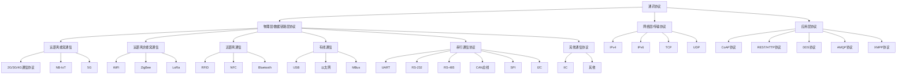

```ad-note

```mermaid


graph TD
    A[通讯协议] --> B[物理层/数据链路层协议]
    A --> C[网络层/传输协议]
    A --> D[应用层协议]

    B --> E[远距离蜂窝通信]
    B --> F[远距离非蜂窝通信]
    B --> G[近距离通信]
    B --> H[有线通信]
    B --> I[串行通信协议]
    B --> J[其他通信协议]

    E --> E1[2G/3G/4G通信协议]
    E --> E2[NB-IoT]
    E --> E3[5G]
    
    F --> F1[WiFi]
    F --> F2[ZigBee]
    F --> F3[LoRa]

    G --> G1[RFID]
    G --> G2[NFC]
    G --> G3[Bluetooth]

    H --> H1[USB]
    H --> H2[以太网]
    H --> H3[MBus]

    I --> I1[UART]
    I --> I2[RS-232]
    I --> I3[RS-485]
    I --> I4[CAN总线]
    I --> I5[SPI]
    I --> I6[I2C]
    
    J --> J1[IIC]
    J --> J2[其他]

    C --> K[IPv4]
    C --> L[IPv6]
    C --> M[TCP]
    C --> N[UDP]

    D --> O[CoAP协议]
    D --> P[REST/HTTP协议]
    D --> Q[DDS协议]
    D --> R[AMQP协议]
    D --> S[XMPP协议]

```


