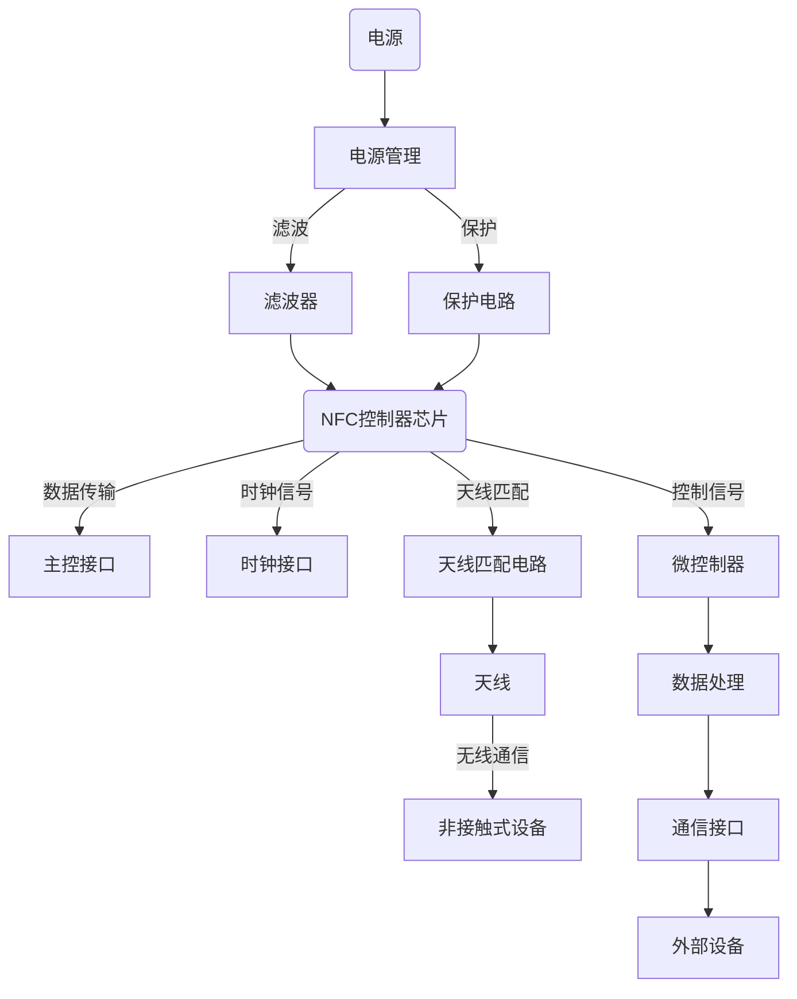

## 3. NFC硬件设计

整个局部模块电路的设计思想我们采用获知目的+中心与周围的设计思想去一步一步实现


### 1. 知设备参数

- 确定目标产品类型，例如POS机或通用NFC读卡器。
- 确定合理的近场通信距离需求，通常小于10cm。
- 设计有效的读卡器天线尺寸与形状。
- 考虑NFC设备的机械结构，例如是否有金属屏蔽。
- 确定读写标签的类型，如ISO15693, ISO14443, ISO18092，Felica等。
- 确定工作模式，如Reader模式、Card Emulation模式、P2P模式。
- 考虑其他需求，如标签能量传输功能、多卡操作等。




					系统架构

### 2. 选设备芯片

#### 1. 选型目的

#### 2. 选型因素

NFC硬件设计通常采用NFC控制器芯片，该芯片一般包括以下四个部分：

- **电源部分**：为NFC芯片提供稳定的电源。
- **主控接口**：连接NFC芯片与主控制器的接口，用于数据传输和控制信号的交换。
- **时钟接口**：为NFC芯片提供时钟信号，确保数据同步。
- **天线匹配电路**：确保天线与NFC芯片之间的阻抗匹配，提高信号传输效率。

#### 3. 条件分析


本次设计采用STR3911B芯片，因为已有成功设计案例


#### 4. 熟悉芯片

##### 芯片说明

ST25R3911B 是高度集成的NFC发起设备 / HF读卡器IC，包括模拟前端（analog front end，AFE）和一个高度集成的数据帧系统，可用于ISO 18092（NFCIP-1）发起设备，ISO 18092（NFCIP-1）
主动目标设备，ISO 14443A和B读卡器（包括高比特率）以及FeliCa™读卡器。其他标准和自定义协议（如MIFARE™ Classic）可使用AFE，在外部微控制器（Stream和Transparent模式）中实现。
ST25R3911B 完全适用于需要最佳RF性能，灵活性以及低功耗能力的NFC系统。
由于采用了自动天线调谐（AAT）技术，该器件 对于直接驱动天线的应用是最优的。ST25R3911B 在HF读卡器IC领域是独一无二的，因为它具有两个差分低阻抗（1 Ohm）天线驱动器。
ST25R3911B包含多种功能，使其非常适合于低功耗应用。它包含一个低功耗电容传感器，可用来检测卡片是否存在，而无需开启读卡器磁场。也可通过对天线LC谐振腔上的信号进行幅度或相位测量，并将其与存储参考值进行比较，来检测卡片是否存在。它还包含了一个低功耗RC振荡器和唤醒定时器，可用来在定义时间周期后唤醒系统，以及使用一种或多种低功耗检测技术（电容，相位或幅度）来检查标签是否存在。
ST25R3911B 经过设计，可在宽泛的（2.4 V至5.5 V）电源供电范围内工作；外设接口IO引脚支持的电源供电范围为1.65 V至5.5 V。


##### 芯片参数

• ISO 18092（NFCIP-1）Active P2P  
• ISO14443A、ISO14443B和FeliCa™  
• 支持 VHBR（3.4 Mbit/s PICC到PCD成帧，6.8  
Mbit/s AFE和PCD到PICC成帧）  
• 电容式唤醒  
• 自动天线调谐系统，可支持天线LC谐振腔调谐  
• 自动调制指数调整  
• 可自动选择的AM和PM（I/Q）解调器通道  
• DPO（Dynamic Power Output，动态功率输  
出）  
• 差分输出可达1.4 W  
• 用户可选择和自动增益控制  
• Transparent和Stream模式，实现了MIFARE™  
Classic兼容或其他自定义协议兼容  
• 单端模式下，可驱动两个天线  
• 振荡器输入，使用13.56MHz或27.12MHz晶振，  
可快速启动  
• 6 Mbit/s SPI，具有96字节的FIFO  
• 宽泛的供电电压范围：2.4 V 至5.5 V  
• 宽泛的温度范围：-40 °C至125 °C  
• QFN32，5 mm x 5 mm封装


##### 功能简介


						图0：芯片功能框图

### 3.1 绘图——设外围电路

熟悉芯片完成后，根据你要实现的功能，去找手册实现该功能的示范电路。对于同一功能可能有不同的示范电路

**目的**：
	1. 读取NFC标签，并且通过SPI把读取到的信息传递给单片机

**分析**：
	1. 观察手册，我们发现了新知识，单端天线和差分天线，搜索[对比](https://kimi.moonshot.cn/share/cssqer2kg1ad67co8fe0)发现。虽然后者比前者有很多优势，但是由于我们的[参考电路](https://oshwhub.com/abatei/nfc-du-ka-qi-st25r3911b)是以单端天线实现的，所以我们对于该NFC功能选择单端天线的实现模式
	2. 

**联系**：同样，可以利用”**目的+分析+整到散**“的电路设计思想去设计整个电路


						图1：单端天线电路
#### 1. 电源电路


##### 1. 主电源电路


###### **设计目的**
	按照主要目的+辅助目的的结构划分，然后按照主要目的实现+次要目的的实现步骤去实现

- **电源管理**：为NFC外设和天线提供稳定的电压，滤除电源中的噪声，并保护NFC外设和天线免受过压、欠压和反向电流的影响。
- **抗干扰措施**：NFC读卡器容易受到外部噪声源的干扰，如电磁干扰（EMI）和射频干扰（RFI）。抗干扰措施包括使用金属屏蔽罩减少来自外部噪声源的干扰。

###### 前置知识


###### **条件分析**
- 我们对于该芯片，我们选取的是单端天线硬件电路模式
- 电源取自单片机的LDO元件，上面已经接入3.3V
- 该芯片拥有两路电源输入口，即VDD_IO与VDD，后者是给芯片内部的天线微电路模块进行供电的，前者则是为芯片内部的其他逻辑微电路模块进行供电的
###### **实现步骤**
1. 分析官方示例电路
	
	 **要点：**
		 1. VDD_IO与MCU共地，VDD不与VDD_IO共一路
		 
1. 寻找参考已有电路
	 
	 **要点：**
		1. C21起着去耦的作用
		2. FB3
		3. C23，C22起着去耦合的作用，一大一小并联的解释[[4.种类和ESR#三、为什么大电容上还并联小电容？]]
3.  


##### 2. 分电源电路


#### 2. 通信电路


##### 设计目的

- 实现与单片机间的四线SPI通信
- 根据[SPI知识](SPI总线协议#**3.3 SPI总线的极性和相位**)，令空闲状态下的总线处于低电平，接收脉冲上升沿的脉冲为1，即CPOL=0，CPHA=0的总线工作模式
##### 条件分析

- 通信类型：该芯片仅支持硬件SPI通讯，故选用SPI通讯
- 主端条件：主端没有设置振铃电阻，以防止[过冲现象](过冲现象.md)的发生
- 连接端子：使用间距2.54mm的排针进行连接

##### 实现步骤

1. **分析官方样例**
	
	**要点**
		1. MCU_CLK可选：这个是给MCU提供时钟信号的，当外部MCU有时钟信号时这个脚可以不用连
		2. IRQ可选：根据手册知识，IRQ引脚可以作为一个外部中断发生，配合MCU_CLK引脚使用，参考手册章节1.2.12利用外部微控制器进行通信
		
2. **分析已有电路**
	
	**要点**：
		1. 使用了IRQ引脚，该IRQ引脚在此是为了稳定SPI通信存在，作用详见[链接](https://kimi.moonshot.cn/share/csss61i34pedatlnhls0)
		2. 


```ad-note
title:思考
1. 虽然标准SPI是规定了只能用四根线，但是标准只是一个指导，此处就使用了芯片自己的特性增加了一个特殊线缆来提升SPI通讯的质量
```

3. **复刻电路图**
		
	
	
							图：NFC板的连接端子
	
	
	
						图：最小系统板的连接端子
	
	
						图：PCB上的端子网络情况
```ad-note
title:问题
**描述**：由于最小系统图画图的时候，是直接从原理图上编辑电气网络图元关系，导致最小系统板的原理图上没有网络关系。进而导致无法确定NFC板的连接端子的网络标签号名和顺序
**解决**：嘉立创不支持从PCB更新网络端口，但是可以在PCB绘制好后从点击原理图更新值PCB，然后截屏该窗口进行修改。


									**不要点确认！**
```

#### 3. 振荡电路


##### 设计目的


##### 条件分析

-


##### 实现步骤


#### 4. 天线电路


**设计目的**：
1. 设计符合NFC标准的天线电路，使其能够读取电子标签中所存储的信息


**前置知识**：
1. [NFC天线研究与设计 - 中国知网 (cnki.net)](https://kns.cnki.net/KCMS/detail/detail.aspx?dbcode=CMFD&filename=1012334815.nh)
2. [NFC天线影响因素的仿真分析 - 豆丁网 (docin.com)](https://www.docin.com/p-1742855171.html)
3. [新型13.56 MHz NFC天线的研究与设计-祝宇鸿董尚文李红阳-中文期刊【掌桥科研】 (zhangqiaokeyan.com)](https://www.zhangqiaokeyan.com/academic-journal-cn_journal-jilin-university-information-science-edition_thesis/020127715512.html)


**条件分析**：
	**电路解读**
		
	**要点**：
		1. 此电路的**天线**非我们说的射频天线，此天线理论上不对外辐射电磁波，参考第一篇前置知识中**3.1 电磁场基础章节**
		2. **接收电路**：视Rx、VMD为阻抗无穷大的电压测量点；Rx读取上拉电阻R3的电平变化；C4为去耦电容
		3. 


##### 1. 天线设计


**设计目的**：
1. 求解出特定频率下


**前置知识**
1. [NFC天线研究与设计 - 中国知网 (cnki.net)](https://kns.cnki.net/KCMS/detail/detail.aspx?dbcode=CMFD&filename=1012334815.nh)
2. [NFC天线影响因素的仿真分析 - 豆丁网 (docin.com)](https://www.docin.com/p-1742855171.html)
3. [新型13.56 MHz NFC天线的研究与设计-祝宇鸿董尚文李红阳-中文期刊【掌桥科研】 (zhangqiaokeyan.com)](https://www.zhangqiaokeyan.com/academic-journal-cn_journal-jilin-university-information-science-edition_thesis/020127715512.html)


**条件分析**
	
	


**设计参数**：
NFC天线是读卡器与非接触式设备之间进行无线通信的关键组件，设计时需要考虑以下因素：

- **频率**：NFC工作在13.56MHz频率，因此天线应谐振在该频率。
- **尺寸和形状**：天线尺寸应足够小以适应读卡器的外形，但又足够大以提供足够的信号强度。形状可以是圆形、方形或其他形状，具体取决于读卡器的设计。
- **材料**：天线通常由铜或铝等导电材料制成。


**实现步骤**
	**参考工具**：
		[NFC Inductance | RF Design | eDesignSuite | STMicroelectronics](https://eds.st.com/antenna/#/)
	**工具样式**：
			
	**参数解读**：
			
	**参数取值**
			1. 相对介电常数：根据PCB板材的类型确定，对于FR4基材，一般取值4.4~4.6
			2. 线圈匝数：一般取绕圈3圈。产生磁强一定范围内与其正相关
			3. 天线长度：初期根据小车底盘设定即可
			4. 天线宽度：初期根据小车地盘尺寸设定即可
			5. 导体宽度：根据论文，
			6. 导体间距：根据论文，
			7. 导体厚度：根据论文，
			8. 基板厚度：根据论文，
	**结果用途**
			1.  分段模式：
			2. 分段数量：
			3. 等效电感：
			4. 频率：该线圈感应的交变电流的最佳频率，或者说磁场变化、电场变化频率能使得能量的传递最大化的那个极大值点

>Ps:以上参数求解建立在电路回路0阻抗；导线为覆铜；


****


##### 2. 接收电路

**设计目的**
1. 设计子电路系统能够读取NFC线圈的交变电流造成的交变电压的变化

**前置知识**
1. MCU引脚知识(从手册中查得)
	1. **RF01 和 RF02 (RF Output 1 and RF Output 2)**：
	    - 这些是射频输出引脚，用于驱动外部天线。在ST25R3911B中，这些引脚可以配置为单端或差分模式来驱动天线。差分模式可以提供更好的电磁兼容性（EMC）和信号完整性。
	2. **RFI1 和 RFI2 (RF Input 1 and RF Input 2)**：
	    - 这些是射频输入引脚，用于接收来自外部天线的射频信号。RFI1和RFI2引脚可以接收并处理来自天线的射频信号，这些信号随后被处理以提取出有用的数据。
		
		
		
		
	1. **TRIM1_X (Tuning and Matching 1)**：
	    - 这些引脚用于连接调谐电容，以调整天线的谐振频率。通过改变电容值，可以优化天线的性能，以匹配特定的射频应用和工作环境。
	2. **TRIM2_X (Tuning and Matching 2)**：    
	    - 与TRIM1_X类似，TRIM2_X引脚也用于连接调谐电容，但可能用于不同的调谐目的或作为备份。
	3. **TRIM引脚作用**
		- **自动天线调谐（Automatic Antenna Tuning, AAT）**：ST25R3911B具有自动天线调谐功能，可以自动调整天线的谐振频率以适应不同的操作条件和环境变化。
	    - **手动天线调谐**：在某些应用中，可能需要手动调整天线的谐振频率以适应特定的要求或优化性能。
	    - **天线匹配**：这些引脚也用于实现天线与读卡器IC之间的最佳匹配，以确保最大功率传输和接收。
2. **电路分析**
	
	**发送信号**
		1. 回路
	
	**接收信号**


**条件分析**
	1.**手册样例**
		
	2.**参考教程**
		
		


##### 3. 匹配电路

**前置知识**
>1. 实际天线不完美，是由感抗和容抗的。对于一个回路根据汤姆逊定理$f=\frac{1}{2\pi\sqrt{LC}}$，这个$L$和$C$的来源除开你在电路上放置的电容电感，还有天线自己的。故得加入此电路对$L$和$C$两个变量进行调节，以配合起振频率


**设计目的**
为了使天线在13.56MHz工作，可以在天线外部并联或串联一个电容，与电感组成LC谐振电路，调整串联/并联电容的大小使得谐振频率为工作频率13.56MHz。匹配电路的设计和调试包括：

- **调整匹配电容**：调整匹配电路中的电容值，可以调整天线的工作频率。
- **调整串联/并联电阻值**：调整天线的Q值，影响带宽和能量损耗。


##### 4. 微调电路

##### 5. EMI电路


#### 5. 靠近检测

	引言：此前没有想到过有此电路，本人通过解读解释不了的引脚利用解读出了我的空白外部电路的认知


##### 前提知识

- 单极板电容器模型的电容变化
- 容式传感器的感应原理

##### 设计目的

- NFC卡片靠近时候自动唤起读卡功能

##### 条件分析


##### 实现步骤
1. 分析官方样例：由于官方手册中没有写此步，暂时跳过
2. 分析已有电路：
	
	
						图：原理图上的感应电路
	
						
					 图：红色为靠近感应极板
	1
		**要点：**
			1. R19，R18与开放电容极板CSO_out,CSI_out构成RC振荡电路
			2. C26，C27作为隔离电容器使用
3. 复刻电路
		1. 设计CS感应电容片(上图红色竖条部分)
		2. 确定C26，C27的电容计算
		3. 确定R18，R19的电容计算


#### 5. 辅助电路

##### 1. LNA放大


## 3.2 PCB——设电路


### 4. 电路设计与原理

NFC读卡器的电路设计涉及以下主要组件：

- **天线接口**：天线与RFID芯片之间的连接。
- **射频前端**：负责调制和解调射频信号。
- **微控制器**：控制读卡器的操作和处理数据。
- **电源**：为读卡器供电。


电路原理如下：

1. 天线接收来自非接触式设备的射频信号。
2. 射频前端将信号解调为数字数据。
3. 微控制器处理数据并执行必要的操作（例如，读取或写入数据）。
4. 射频前端将微控制器的数据调制为射频信号。
5. 天线将射频信号发送回非接触式设备。

### 5. 电源管理与抗干扰措施
