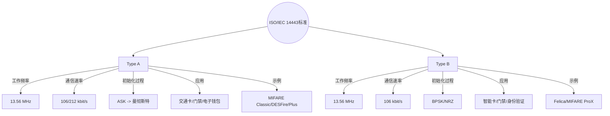

# 一、标准
	引言：最近在玩NFC卡片，结果发现这块的内容极其不成体系，故写下此文章整理相关的知识，先从这类技术基于的行业技术标准出发了解，在到现实基于这些标准实现的具体产物这样的话认知逻辑比较清晰


						图：各自各样卡的OSI信息

## （1）ISO/IEC 14443 标准
### 1）ISO/IEC 14443 Type A
- **工作频率**：13.56 MHz
- **通信速率**：106 kbit/s（初始化）和212 kbit/s（数据传输）
- **初始化过程**：使用ASK调制，随后切换到曼彻斯特编码
- **应用**：主要用于公共交通卡、门禁卡、电子钱包等
- **示例**：MIFARE Classic、MIFARE DESFire、MIFARE Plus等

### 2）ISO/IEC 14443 Type B
- **工作频率**：13.56 MHz
- **通信速率**：106 kbit/s
- **初始化过程**：使用BPSK或NRZ编码
- **应用**：主要用于智能卡、门禁系统、身份验证等
- **示例**：Felica、MIFARE ProX等


- **协议区分对比**
```ad-note



## （2）ISO/IEC 18092 标准


## （3）ISO/IEC 15693 标准


## （4）NFCIP-1 标准


## （5）MIFARE 标准


# 二、协议

## （1）NDEF协议

### 1、NEDF概述

`NFC Data Exchange Format`，实现一个`NFC`设备间通信的数据格式，通过二进制封装消息的数据格式。

### 2、NDEF组成和NDEF记录

`NDEF`由一系列的`Record`组成

 

**NDEF Record记录**

 

(从左往右，7代表第0位)

第一个字节是一些标志位，具体规则可以看后续[**Record第一个字节的规范含义**]介绍

第二个字节是`TYPE LENGTH`，表示`Type`的长度

第三个字节是`PAYLOAD LENGTH` 表示 `payload`的长度，如果`SR`为0，则`PAYLOAD` 长度占`4`个字节否则占`1`个字节

紧跟着的就是ID 长度

再后面就是可变长度内容了

**Record第一个字节的规范含义**


如果`SR`为1的话，说明是**短记录**，`Payload length`占`1byte`,否则占`4byte`

后三位`TNF`的类型，具体含义如下


## （2）RTD协议

### 1、RTD概述

`NFC Record Type Definition` **NFC**记录类型的定义

常见的几种类型如下，`Android`开发通过代码也能够查看到所有具体的类型

- `RTD_TEXT(T)` 记录描述文本信息
    
- `RTD_URI(U)` 存储网络地址，邮件或者电话号码
    
- `RTD_SMART_POSTER(Sp)` 综合`URL`，电话号码或者短信编入`NFC`论坛标签及如何在设备间传递这些信息
    

### 2、RTD-TEXT

 如果判断出`TYPE`是`TEXT`类型的，后续内容就按照以下格式解析


我们可以看到，**第一个表中第一个字节是状态码**，**具体规则**看第二个表，如果**第7位(最高位)是1，说明是UTF16编码，然后0到5位是语言编码的长度，第6位是固定为0**。

### 2、RTD-URI

 

如果`Type`是`URI`类型，后面第一个字节解析如下图(`URI`前缀)，截取协议中部分，总共有`255`种


### 3、RTD-Smart Poster

综合`URL`，电话号码或者短信等数据


## （3）RTD_TEXT、RTD_URI解析实例

### 1、RTD_TEXT记录解析实例

 

第一个字节`D1`，根据之前的规则可以计算出来，包括他的`TNF TYPE`

第`4`个字节`54`，这属于`RTD`的一个定义 ，代表`T` ，为文本记录类型

第`5`个字节为`03`，语言码长度 ，长度为`2`，说明后面`2`个字节内容为编码格式，不同`TYPE`这里都不一样

### 2、RTD_URI记录解析实例

 

标签：


# 三、格式


**Table 1.** Supported tag technologies

| Class            | Description                                                                               |
| ---------------- | ----------------------------------------------------------------------------------------- |
| `TagTechnology`  | The interface that all tag technology classes must implement.                             |
| `NfcA`           | Provides access to NFC-A (ISO 14443-3A) properties and I/O operations.                    |
| `NfcB`           | Provides access to NFC-B (ISO 14443-3B) properties and I/O operations.                    |
| `NfcF`           | Provides access to NFC-F (JIS 6319-4) properties and I/O operations.                      |
| `NfcV`           | Provides access to NFC-V (ISO 15693) properties and I/O operations.                       |
| `IsoDep`         | Provides access to ISO-DEP (ISO 14443-4) properties and I/O operations.                   |
| `Ndef`           | Provides access to NDEF data and operations on NFC tags that have been formatted as NDEF. |
| `NdefFormatable` | Provides a format operations for tags that may be NDEF formattable.                       |


**Table 2.** [Optional](https://marketing.csdn.net/p/3127db09a98e0723b83b2914d9256174?pId=2782&utm_source=glcblog&spm=1001.2101.3001.7020) supported tag technologies

| Class              | Description                                                                                                 |
| ------------------ | ----------------------------------------------------------------------------------------------------------- |
| `MifareClassic`    | Provides access to MIFARE Classic properties and I/O operations, if this Android device supports MIFARE.    |
| `MifareUltralight` | Provides access to MIFARE Ultralight properties and I/O operations, if this Android device supports MIFARE. |


 这个表的意思也就说不同的芯片（解决方案、采用不同的标准实现的）卡中数据格式是不一样的，比如之前我们提到的MIFARE Classic数据格式就是NfcA，MIFARE DESFire数据格式是IsoDep，我们使用的二代身份证用的就是NfcB,Felica用的就是NfcF,德州仪器的VicinityCard卡用的是NfcV,而Android分享文件就是实用的Ndef格式传输数据。

 
 Table2中其实是对table1的补充，可选的


# 四、卡型

>**注意**：此处介绍的基于ISO/IEC 14443技术协议的卡

## （1）按照组织分

### 1）NFC Forum 定义的TAG类型

主要为四种，如下图所示


- `Type 1` 是基于`ISO 14443 A`标准，可以配置成可读可写、只读，内存大概为`96 bi`t,可以扩展到`2kb`,传输速率是`106kb/s`，可以用来存网址或其他小量数据。
- `Type 2` 也是基于`ISO 14443 A`标准，和`Type 1` 一样，容量大概为`48 bit`，可以扩展到`2kb`,传输速率也是`106kb/s`。
- `Type 3` 基于`Sony FeliCa` 体系，容量为`2kb`，传输速率为`212kb/s`，这类标签适合复杂应用，成本比较高。
- `Type 4` 此类标签被定义为与`ISO 14443 A 、B`标准兼容，制造时被预先设定为可读、可重写，或者只读，内存可达`32kb`传输速率介于`106kb/s`到`424kb/s`之间


### 2）NXP特定的TAG类型

`Mifare Classical Tag` 基于`ISO 14443A`标准

- 可读可写，可配置成只读
- 可变内存 `192/768/3584 bytes`
- 传输速率 `106kb/s`
- 支持数据冲突保护
- 市场上有兼容的产品，如`NXP MIFARE Classic 1K`、`MIFARE Classic 4K`和`Classic Mini`


## （2）按照标准分


### （1）Type A型卡

- **MIFARE Classic**: 由NXP Semiconductors开发，有1K、4K和Mini三种容量，广泛应用于门禁、公共交通和电子钱包。
- **MIFARE DESFire**: 提供更高的安全性，支持多应用，可配置不同安全级别的卡。
- **MIFARE Plus**: 在MIFARE Classic的基础上增加了加密功能，提供更高的安全性。
- **SLE 4442**: 由Infineon提供，具有256字节的EEPROM，适用于需要较少存储空间的应用。
- **SLE 66R31**: 具有更大的存储容量和更高的数据传输速率，适用于复杂的应用场景。


#### 1）NFC Tag

##### 1. Tag 1 Type
1. **标准基础**：遵循NFC Forum Type 1 Tag规范，该规范基于ISO/IEC 14443 Type A。
2. **存储结构**：具有固定的存储结构，通常包括制造时写入的UID（唯一标识符）和三个可配置的区域：NVB（非易失性存储区）、UID和RFU（保留供将来使用）。
3. **容量**：存储容量通常较小，具体取决于标签的型号，但一般用于存储少量数据，如URL、文本或名片信息。
4. **兼容性**：与大多数NFC设备兼容，包括智能手机、平板电脑和其他支持NFC的设备。
5. **应用**：常用于简单的数据存储和交换，如广告、信息传递和简单的访问控制。
6. **示例产品**：MIFARE Classic是Type 1 Tag的一个例子，它有1K、4K和Mini三种容量。

###### MiFARE Classic 
1. **技术标准**：
    - MIFARE Classic 卡片遵循 ISO/IEC 14443 Type A 标准，工作在 13.56 MHz 的高频（HF）波段。**此为IC卡**
2. **存储容量**：
    - MIFARE Classic 系列卡片有三种不同的存储容量：
        - MIFARE Classic 1K：1024 字节（1 KB）的存储空间，分为 16 个扇区，每个扇区 4 个块，每个块 16 字节。
        - MIFARE Classic 4K（也称为 MIFARE S70）：4096 字节（4 KB）的存储空间，分为 40 个扇区，每个扇区 4 个块。
        - MIFARE Classic Mini：256 字节的存储空间，分为 8 个扇区，每个扇区 4 个块。
3. **数据结构**：
    - 每个扇区由 4 个块组成，其中 3 个块用于数据存储，最后一个块用于控制信息和访问条件。
    - 每个块可以独立设置访问权限，包括读写保护。
4. **安全性**：
    - MIFARE Classic 卡片使用加密技术来保护数据，每个扇区可以设置独立的密钥。
    - 然而，MIFARE Classic 卡片的安全性在近年来受到了一些批评，因为它们的加密方法被认为容易受到攻击。
5. **应用领域**：
    - 公共交通：如公交卡、地铁卡。
    - 门禁系统：用于控制对建筑物或特定区域的访问。
    - 电子钱包：用于小额支付和电子票证。
    - 身份识别：用于员工卡、学生卡等。
6. **兼容性**：
    - MIFARE Classic 卡片与大多数支持 ISO/IEC 14443 Type A 标准的读卡器兼容。
7. **产品特点**：
    - 耐用性：卡片设计耐用，可以承受日常使用的磨损。
    - 可靠性：非接触式通信减少了机械磨损，提高了卡片的可靠性。


####### Mini系列
- **存储容量**：256字节，分为8个扇区，每个扇区4个块，但因为最后一块用于存储控制信息，所以实际可用的存储空间更少。
- **尺寸**：通常较小，适合用于钥匙扣或小型设备。
- **应用**：适用于简单应用，如门禁系统、考勤系统、小型电子钱包等。
- **特点**：成本较低，适合对存储需求不高的应用


####### S50(M1)系列
- **存储容量**：1024字节，分为16个扇区，每个扇区4个块。
- **应用**：广泛应用于门禁控制、公共交通卡、校园卡、电子钱包等。
- **特点**：适中的存储容量，适合大多数非接触式智能卡应用。S50是MIFARE Classic系列中最常用的型号之一。
- **安全性**：每个扇区可以独立设置访问权限，但整体安全性相对较低，容易受到某些安全攻击。

1. 存储结构
	a) M1 卡分为 16 个扇区，每个扇区由 4 块（块 0、块 1、块 2、块 3）组成，1块为16个字节（我们也 将 16 个扇区的 64 个块按绝对地址编号为 0~63，存贮结构如下图所示：
	
					图：S50卡存储结构
	b) 第 0 扇区的块 0（即绝对地址 0 块），它用于存放厂商代码，已经固化，不可更改。 
	
	c) 每个扇区的**块 0、块 1、块 2 为数据块**，可用于存贮数据(**扇区0的0块作为数据块不可写**)
	
	d) 每个扇区的块 3（**块3实际为一个扇区的第4块数据**） 为控制块，包括了密码 A、存取控制、密码 B。具体结构如下：
	
		**思考**：单个十六进位数需要四个二进位表示&一个字节拥有8个位-->一个字节能够表示两个十六进位数
	
	e) 每个扇区的密码和存取控制都是独立的，可以根据实际需要设定各自的密码及存取控制。 存取控制为 4 个字节，共 32 位，扇区中的每个块（包括数据块和控制块）的存取条 件是由密码和存取控制共同决定的，在存取控制中每个块都有相应的三个控制位,定义 如下：
	
			
					图：某ID型NFC 的扇区数据


2. 工作原理
	**电路组成**：卡片的电气部分只由一个天线和 ASIC 组成。
		**天线**：卡片的天线是只有几组绕线的线圈，很适于封装到 IS0 卡片中。
		**ASIC**：卡片的 ASIC 由一个高速（ 106KB 波特率）的 RF 接口，一个控制单元和一个8K 位 EEPROM 组成。 
	
	**工作原理**：读写器向 M1 卡发一组固定频率的电磁波，卡片内有一个 LC 串联谐振电路， 其频率与读写器发射的频率相同，在电磁波的激励下， LC 谐振电路产生共振，从而使电容内有 了电荷，在这个电容的另一端，接有一个单向导通的电子泵，将电容内的电荷送到另一个电容内 储存，当所积累的电荷达到 2V


3. 通讯过程
	
					图：通讯过程图
- **名词解释**
	a) 复位应答（ Answer to request） M1 射频卡的通讯协议和**通讯波特率是定义好的**，当有卡片进入读写器的操作范围 时，读写器以特定的协议与它通讯，从而确定该卡是否为 M1 射频卡，即验证卡片的 卡型。
	
	b) 防冲突机制 (Anticollision Loop) 当有多张卡进入读写器操作范围时，防冲突机制会从其中选择一张进行操作，未选中的则处于空闲模式等待下一次选卡，该过程会返回被选卡的序列号。 
	
	c) 选择卡片 (Select Tag) 选择被选中的卡的序列号，并同时返回卡的容量代码。 d) 三次相互验证(3 Pass Authentication) 选定要处理的卡片之后，读写器就确定要访问的扇区号，并对该扇区密码进行密 码校验，在三次相互认证之后就可以通过加密流进行通讯。（在选择另一扇区时，则必须进行另一扇区密码校验。）
	
	e) 对数据块的操作 
		 读 (Read)：读一个块；
		 写 (Write）：写一个块；
		 加（ Increment）：对数值块进行加值； 
		 减（ Decrement）：对数值块进行减值； 
		 存储（ Restore）：将块中的内容存到数据寄存器中； 
		 传输（ Transfer）：将数据寄存器中的内容写入块中； 
		 中止（ Halt）：将卡置于暂停工作状态；


>**注意**：S50一个扇区四个块，一个块16个字节，这要求NFC缓冲接收变量也是16个字节的整形数组变量


4. 卡片读取

>**注意**：MiFARE系列的卡存在扇区加密，无法直接读取TAG

- 相关链接
	[S50资料参考]((https://10448674.s21i.faiusr.com/61/ABUIABA9GAAgkemlyAUopLy36gc.pdf)

####### S70系列
- **存储容量**：4096字节，分为40个扇区，每个扇区4个块。
- **应用**：适用于需要更多存储空间的应用，如大型门禁系统、复杂的电子钱包系统、健康保险卡等。
- **特点**：提供更大的存储空间，适合需要存储大量数据的应用。与S50相比，S70的存储容量是其四倍。
- **安全性**：与S50相同，每个扇区可以独立设置访问权限，但同样存在安全性问题。


##### 2. Tag 2 Type
1. **标准基础**：遵循NFC Forum Type 2 Tag规范，同样基于ISO/IEC 14443 Type A。
2. **存储结构**：具有更灵活的存储结构，支持多个应用区域，每个区域可以独立配置和加密。
3. **容量**：存储容量较大，可以存储更多的数据，适用于更复杂的应用。
4. **兼容性**：与NFC设备兼容，但可能需要特定的软件来支持其全部功能。
5. **应用**：适用于需要存储更多数据或多个应用的场景，如电子票务、门禁控制和支付系统。
6. **示例产品**：MIFARE DESFire是Type 2 Tag的一个例子，它支持多应用，具有更高的安全性和灵活性。


###### MIFARE UltraLight
1. **技术标准**：
    - MiFare UltraLight卡片遵循ISO/IEC 14443 Type A标准，工作在13.56 MHz的高频（HF）波段。
2. **存储容量**：
    - MiFare UltraLight的存储容量为512bit，分成16个Page，每个Page包含4个字节。
3. **数据结构**：
    - MiFare UltraLight的Page3是一次性烧录(One Time Programmable, OTP)页，用于限定应用的数据存储。
    - Page4到Page15是可读写的用户数据区，出厂时其内容初始化为0。
4. **安全性**：
    - MiFare UltraLight AES提供基于AES身份验证的数据访问保护，支持128位密钥长度和可选命令计数器，以限制身份验证失败尝试次数。
    - 支持面向消息完整性保护的CMAC保护和可选的AES认证保护。
    - 有EAL 3+通用标准认证。
5. **应用领域**：
    - 适合一次性、不需要回收的低成本电子票证、景区门票等场合的解决方案。
6. **兼容性**：
    - MiFare UltraLight卡片与大多数支持ISO/IEC 14443 Type A标准的读卡器兼容。
7. **产品特点**：
    - 耐用性：卡片设计耐用，可以承受日常使用的磨损。
    - 可靠性：非接触式通信减少了机械磨损，提高了卡片的可靠性。
    - 灵活性：适合限定应用，如票据和密钥卡，提供了一种更安全的便捷方式来发行单程和多用途交通票、活动票、通行证和积分卡。
    - 可扩展性：MiFare UltraLight卡片有多种型号，以满足不同应用的需求。


					图：UltraLight系列的内存扇区图
Page0和Page1以及Page2的第1个字节是卡片的7字节序列号及其校验字节，其中BCC0=0x88⊕SN0⊕SN1⊕SN2，BCC1=SN3⊕SN4⊕SN5⊕SN6，SN0是制造商代码，由于Mifare UltraLight是NXP公司出品，因而SN0固定为04H。Page2的第2个字节Internal作为内部数据保留。以上共10个字节出厂时固化在存储区内，用户无法更改。

Page3是一次性烧录(One Time Programmable,OTP)页,该页的内容在卡片出厂时全部被写为“0”，用户使用时只能把某一位的内容写为“1”，而永远也不能把“1”写为0，也就是说，新写入的4字节内容与卡内原来的内容进行异或，异或后的结果存储在卡片中。

Page4-Page15是可读写的用户数据区，出厂时其内容初始化为0，用户可以任意读写。

Page2的第3和第4个字节用于将存储区锁定为只读。如下图所示，L4-L15的某一位设置为1，则对应序号的Page内容锁定为只读，每一个Page都可以单独设置。Lotp用于锁定Page3为只读。“螳螂捕蝉，黄雀在后”，Lotp-L15可以锁定别人，这些位本身又被三个BL位锁定，BL15-10用于锁定L15-L10，BL9-4用于锁定L9-L4，BLotp用于锁定Lotp。所有的这16个锁定位也具有OTP特性，通俗的讲就是这些“锁”没有“钥匙”，一旦锁死就再也改不回来了，所以锁定时一定要小心。


---
1. **MiFare Ultralight AES系列**：
    
    - **存储容量**：提供512字节的存储空间，分为16个Page，每个Page包含4个字节。
    - **尺寸**：卡片尺寸灵活，可以定制，适合用于钥匙扣、腕带或其他小型设备。
    - **应用**：适用于限定应用中的安全非接触式IC，如公共交通、事件票务和忠诚度应用。
    - **特点**：具有128位AES认证，用于数据和计数器保护，以及CMAC通过射频接口提供的数据完整性保护。
2. **MiFare Ultralight C系列**：
    
    - **存储容量**：提供512字节的存储空间，分为16个Page，每个Page包含4个字节。
    - **尺寸**：卡片尺寸灵活，可以定制，适合用于钥匙扣、腕带或其他小型设备。
    - **应用**：适用于限定应用中的非接触式IC，支持3DES加密，如公共交通、事件票务和忠诚度应用。
    - **特点**：具有112位3DES加密，提供防克隆支持和32位用户可编程OTP区域。
3. **MiFare Ultralight EV1系列**：
    
    - **存储容量**：提供80字节或164字节的存储空间，用户空间分别为48字节或128字节。
    - **尺寸**：卡片尺寸灵活，可以定制，适合用于钥匙扣、腕带或其他小型设备。
    - **应用**：适用于限定的智能纸质票和卡，如公共交通、事件票务。
    - **特点**：具有3个独立的单向递增计数器和基于ECC的原厂签名验证功能。
4. **MiFare Ultralight Nano系列**：
    
    - **存储容量**：提供40字节的用户存储空间。
    - **尺寸**：卡片尺寸灵活，可以定制，适合用于智能纸质票务。
    - **应用**：适用于单次使用的智能纸质票务，如公共交通单程票、活动票务。
    - **特点**：符合ISO/IEC 14443A和NFC Forum Type 2 Tag标准，支持ECC支持的NXP原始签名。


###### MIFARE DESFire
1. **技术标准**：
    - MIFARE DESFire 卡片遵循 ISO/IEC 14443 Type A 标准，工作在 13.56 MHz 的高频（HF）波段，与 MIFARE Classic 兼容。
2. **存储容量**：
    - MIFARE DESFire 系列卡片提供多种存储容量，以满足不同应用的需求：
        - DESFire Light：2K字节到8K字节的存储空间。
        - DESFire EV1：8K字节到64K字节的存储空间。
        - DESFire EV2：提供高达2MB的存储空间。
3. **数据结构**：
    - DESFire 卡片支持多应用（Multi-application），允许在一张卡片上存储和运行多个独立的应用。
    - 每个应用可以独立配置和加密，提供更高的灵活性和安全性。
4. **安全性**：
    - MIFARE DESFire 卡片提供高级加密技术，包括 AES 和 DES/Triple DES 加密算法。
    - 支持更高级的认证机制，如公钥基础设施（PKI）和动态认证。
    - DESFire 卡片的安全性比 MIFARE Classic 更高，更难以受到攻击。
5. **应用领域**：
    - 公共交通：用于公交卡、地铁卡，支持多应用，可以集成多种服务。
    - 门禁系统：用于控制对建筑物或特定区域的访问，提供高级安全特性。
    - 电子钱包：用于小额支付和电子票证，支持在线和离线交易。
    - 身份识别：用于员工卡、学生卡等，支持高级安全认证。
    - 医疗健康：用于存储医疗记录和健康信息，确保数据安全。
6. **兼容性**：
    - MIFARE DESFire 卡片与大多数支持 ISO/IEC 14443 Type A 标准的读卡器兼容。
    - 由于其高级特性，可能需要特定的读卡器或软件来支持其全部功能。
7. **产品特点**：
    - 耐用性：卡片设计耐用，可以承受日常使用的磨损。
    - 可靠性：非接触式通信减少了机械磨损，提高了卡片的可靠性。
    - 灵活性：支持多应用和动态认证，适应各种复杂应用场景。
    - 可扩展性：提供从轻量级到高性能的多种型号，以满足不同应用的需求。****


---

1. **MIFARE DESFire Light系列**
	- **存储容量**：提供从2K字节到8K字节的存储空间，分为多个扇区，每个扇区包含16个块，每个块128字节。
	- **尺寸**：卡片尺寸灵活，可以定制，适合用于钥匙扣、腕带或其他小型设备。
	- **应用**：适用于门禁系统、考勤系统、小型电子钱包、事件票务等，支持多应用功能，允许在一张卡片上运行多个独立应用。
	- **特点**：具有较高的性价比，适合对存储需求适中且需要多应用支持的应用场景。
2. **MIFARE DESFire EV1系列**
	- **存储容量**：提供从8K字节到64K字节的存储空间，分为多个扇区，每个扇区包含16个块，每个块128字节。
	- **尺寸**：标准卡片尺寸，也可以根据需求定制，适合各种应用场景。
	- **应用**：适用于需要较大存储空间和高安全性的应用，如企业门禁、城市交通卡、健康保险卡、电子钱包等。
	- **特点**：提供更大的存储空间和高级安全特性，适合需要存储大量数据和运行复杂应用的场景。
3. **MIFARE DESFire EV2系列**
	- **存储容量**：提供高达2MB的存储空间，分为多个扇区，每个扇区包含16个块，每个块128字节。
	- **尺寸**：标准卡片尺寸，也可以根据需求定制，适合各种应用场景。
	- **应用**：适用于需要极大量存储空间和最高级别安全性的应用，如国家身份识别、大型企业应用、高端电子钱包等。
	- **特点**：具有最大的存储容量和最高级的安全特性，适合需要处理大量数据和对安全性要求极高的应用场景。


```ad-note
title:三者比较
## 共同点
- **安全性**：所有DESFire系列卡片都提供高级加密技术，包括AES和DES/Triple DES，以及更高级的认证机制。
- **兼容性**：与大多数支持ISO/IEC 14443 Type A标准的读卡器兼容。
- **耐用性**：卡片设计耐用，可以承受日常使用的磨损。
- **可靠性**：非接触式通信减少了机械磨损，提高了卡片的可靠性。

## 差异点

```


### （2）Type B型卡
#### 1）NFC Tag


##### 1. Tag 3 Type


## （3）按有无IC分


### 1）IC卡


#### 1. UID卡

#### 2. CUID卡


#### 3. FUID卡

#### 4. UFUID卡


#### 5. GTU/GDM卡

#### 6. M1授权卡

### 2）ID卡
#### 1. 5200/5577卡

#### 2. 8211/8268卡


#### 3. TK4100卡

