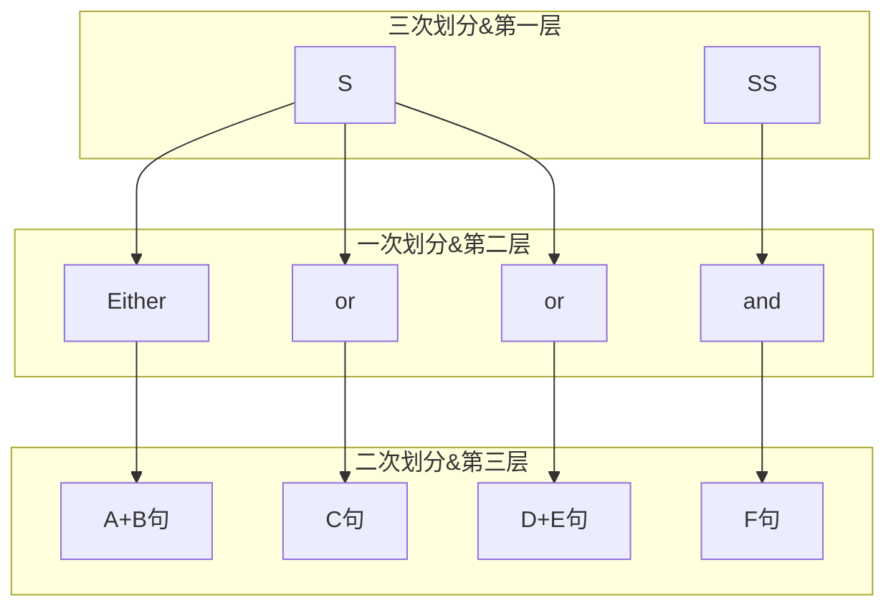

---
tags:
  - 英语
aliases: 
cssclasses:
---
>**引言**：不知道你们会不会和我一样以前在阅读长难句时候经常读到后面忘记前面，借助在Flutter开发以及在前端开发的DOM树观点，我认为长难句也可以划分为树状连接的不同层级。这样的话可以把长难句的翻译图像化起来。而长难句互译的关键在于对英语基础语法知识的匮乏，而市面上大部分语法书我认为都过于冗杂，所以特别做了此片文章进行整理，顺便捡起一些碎片进行利用。
## 1.回顾
语言核心素养包括听、说、读、写，对于中文来讲而写的对象就是字、词、句，而对于英文来讲主要是词、语、句。本次回顾我们不分析词，因为这个比较熟悉，我们来回顾一下后两者的概念以及分类。

### 1.0. 字类

英文的字类很简单，就是二十六个字母。

### 1.1. 词类
>**引言**：在传统语法体系中，英语单词被分为十类：名词、代词、数词、动词、形容词、副词、介词、连词、冠词、感叹词。

然后又根据是否能或单独能单独充当句子成分，将这些词类归类为两大类---实词和虚词。

名词（n)、代词(pro.)、数词(num.)、动词(v)、形容词(adj.)、副词(adv.)这六类词可以并且必须充当句子成分，为实词。

介词、连词、冠词和感叹词这四类不作或不能单独作成分，属于虚词。由此可知词类的划分与其在句子中的作用之间有密切的关系。

#### 1.1.1. 按照传统语法体系进行划分
##### （1）名词（Noun）

名词是表示人、事物、地点、状态或概念的词。  
**特点：**

- 可以作为主语或宾语。
    
- 可以被冠词、形容词修饰。
    
- 有单复数形式变化（可数名词）或不可数形式（不可数名词）。
    
- 有些名词有所有格形式，表示所属关系。
    

**分类：**

- **普通名词**：表示一类人或事物（如：book、city、apple）。
    
- **专有名词**：表示特定的人、地点、机构等（如：China、New York、Apple Inc.）。
    
- **可数名词**：有单复数形式（如：book/books）。
    
- **不可数名词**：没有复数形式，不能用数字直接修饰（如：water、advice）。
    

**例句：**

- The **book** is on the table.（书在桌子上。）
    
- **New York** is a big city.（纽约是一个大城市。）
    

---

##### （2）代词（Pronoun）

代词是代替名词或名词短语的词，用于避免重复。  
**分类：**

- **人称代词**：表示“我”“你”“他”等（如：I, you, he, she, it, we, they）。
    
- **物主代词**：表示所属关系（如：my, yours, his, hers, its, ours, theirs）。
    
- **反身代词**：表示“自己”（如：myself, yourself, himself, herself, itself, ourselves, themselves）。
    
- **指示代词**：用于指代特定事物（如：this, that, these, those）。
    
- **疑问代词**：用于提问（如：who, whom, whose, what, which）。
    
- **不定代词**：表示不确定的人或事物（如：some, any, none, all, each, both）。
    

**例句：**

- **He** is my friend.（他是我的朋友。）
    
- Is **this** your book?（这是你的书吗？）
    

---

##### （3）数词（Numeral）

数词是表示数量或顺序的词。  
**分类：**

- **基数词**：表示数量（如：one, two, three, hundred, thousand）。
    
- **序数词**：表示顺序（如：first, second, third, hundredth）。
    

**用法：**

- 基数词用于表示数量，序数词用于表示顺序。
    
- 数词可以修饰名词，但顺序有规则（如：three books, the first day）。
    

**例句：**

- I have **three** apples.（我有三个苹果。）
    
- Today is **Monday**.（今天是星期一。）
    

---

##### （4）动词（Verb）

动词是表示动作、状态或存在的词。  
**分类：**

- **实义动词**：表示具体的动作或状态（如：run, eat, be, have）。
    
- **助动词**：用于构成时态、语态或语气（如：be, do, have, will, shall）。
    
- **情态动词**：表示能力、许可、可能性等（如：can, may, must, should）。
    

**特点：**

- 动词有多种时态变化（一般现在时、一般过去时、现在进行时等）。
    
- 有些动词有被动语态形式。
    
- 动词可以带宾语或不带宾语（及物动词和不及物动词）。
    

**例句：**

- She **reads** a book every day.（她每天读一本书。）
    
- I **can** speak English.（我会说英语。）
    

---

##### （5）形容词（Adjective）

形容词是修饰名词或代词，表示性质、状态或特征的词。  
**特点：**

- 通常放在名词前（如：a beautiful girl）。
    
- 可以放在系动词后（如：The girl is beautiful）。
    
- 有比较级和最高级形式（如：big, bigger, biggest）。
    

**分类：**

- **品质形容词**：表示性质（如：good, bad, beautiful）。
    
- **数量形容词**：表示数量（如：many, few, several）。
    
- **关系形容词**：表示所属或关系（如：my, his, Chinese）。
    

**例句：**

- She is a **kind** girl.（她是一个善良的女孩。）
    
- The book is **interesting**.（这本书很有趣。）
    

---

##### （6）副词（Adverb）

副词是修饰动词、形容词、其他副词或整个句子的词，表示程度、方式、时间、地点等。  
**特点：**

- 副词通常以“-ly”结尾（如：quickly, beautifully），但也有例外（如：very, well）。
    
- 副词的位置灵活，可以放在句首、句中或句末。
    

**分类：**

- **方式副词**：表示动作的方式（如：quickly, slowly）。
    
- **程度副词**：表示程度（如：very, extremely）。
    
- **时间副词**：表示时间（如：now, then, always）。
    
- **地点副词**：表示地点（如：here, there）。
    

**例句：**

- She sings **beautifully**.（她唱得非常动听。）
    
- **Suddenly**, it started to rain.（突然，开始下雨了。）
    

---

##### （7）介词（Preposition）

介词是表示名词或代词与其他词之间关系的词。  
**特点：**

- 介词后通常接名词、代词或名词短语，构成介词短语。
    
- 介词短语可以表示时间、地点、原因、方式等。
    

**常见介词：**

- 时间：at, on, in
    
- 地点：at, in, on
    
- 方向：to, from, towards
    
- 其他：with, by, about, for
    

**例句：**

- She is **in** the classroom.（她在教室里。）
    
- He arrived **on** Monday.（他周一到达。）
    

---

##### （8）连词（Conjunction）

连词是连接词、短语或句子的词。  
**分类：**

- **并列连词**：连接并列的词、短语或句子（如：and, but, or, so）。
    
- **从属连词**：引导从句（如：because, if, when, although）。
    

**特点：**

- 连词用于表示逻辑关系（如因果、转折、并列、条件）。
    

**例句：**

- She likes apples **and** oranges.（她喜欢苹果和橙子。）
    
- I will go **if** it doesn't rain.（如果不下雨，我就去。）
    

---

##### （9）冠词（Article）

冠词是放在名词前，表示名词的特指或泛指的词。  
**分类：**

- **不定冠词**：a/an，用于泛指（如：a book, an apple）。
    
- **定冠词**：the，用于特指（如：the book, the city）。
    
- **零冠词**：某些情况下不使用冠词（如：at school, go to bed）。
    

**用法：**

- 冠词的使用取决于名词的单复数、特指或泛指。
    

**例句：**

- I have **a** book.（我有一本书。）
    
- **The** book is on the table.（这本书在桌子上。）
    

---

##### （10）感叹词（Interjection）

感叹词是表示强烈情感或反应的词，通常独立于句子之外。  
**特点：**

- 感叹词后通常用感叹号或逗号。
    
- 感叹词可以独立使用，也可以与句子结合。
    

**常见感叹词：**

- Oh, Ah, Wow, Alas, Hooray, Ugh
    

**例句：**

- **Wow**! That's amazing!（哇！那太神奇了！）
    
- **Oh**, I forgot my keys.（哦，我忘记带钥匙了。）

#### **1.1.2. 按照是否作为句子成分划分**


##### **（1）实词（Lexical Words）**

- **定义**：可以单独充当句子成分。
    
- **分类**：
    
    - 名词（n.）
        
    - 代词（pro.）
        
    - 数词（num.）
        
    - 动词（v.）
        
    - 形容词（adj.）
        
    - 副词（adv.）
        
- **特点**：实词是句子的核心部分，必须在句子中承担具体的功能。
    

##### **（2）虚词（Functional Words）**

- **定义**：不能单独充当句子成分，主要起语法功能作用。
    
- **分类**：
    
    - 介词（prep.）
        
    - 连词（conj.）
        
    - 冠词（art.）
        
    - 感叹词（int.）
        
- **特点**：虚词主要用来连接、修饰或表示语气等，不独立承担句子成分。
    

---

#### **1.1.3. 按照在从句中所起功能划分**
>**引言**：所有引导各种从句的词项合起来统称为**从属关联词**(Subordinating Connectives)。也就是说**一个从句必须由关联词引导**。**关联词并不是英语的传统词类之一，而是一个统称**。

从属关联词核心作用主要分为从属作用、关系作用、连接作用。其可以是从属连词、关系代词、关系副词、连接代词/副词（疑问代/副词引导从句时的称谓）、特殊关系代词等。

##### **（1）特殊疑问词（Special Interrogative Words）**

###### **1）特殊疑问代词（Special Interrogative Pronouns）**

- **定义**：用于引导特殊疑问句，必须在句子中充当语法成分（主语、宾语、表语、定语等），句子使用倒装语序。
    
- **例子**：
    
    - **what**：What did you see in the picture?（你在图片中看到了什么？）
        
    - **which**：Which do you like best?（你最喜欢哪一个？）
        
    - **whose**：Whose pen is this?（这是谁的钢笔？）
        
    - **who**：Who sings best in your class?（你们班谁唱得最好？）
        
    - **whom**：With whom do you want to go?（你想和谁一起去？）
        

###### **2）特殊疑问副词（Special Interrogative Adverbs）**

- **定义**：用于引导特殊疑问句，必须在句子中充当状语成分，句子使用陈述语序。
    
- **例子**：
    
    - **when**：When did you come back?（你什么时候回来的？）
        
    - **where**：Where did you find the wallet?（你在哪里找到钱包的？）
        
    - **why**：Why did you hate learning English?（你为什么讨厌学英语？）
        
    - **how**：How did you come here?（你是怎么来的？）
        

---

##### **（2）引导名词性从句的连接词（Connectives for Noun Clauses）**

###### **1）连接代词（Conjunctive Pronouns）**

- **定义**：在从句中充当语法成分（主语、宾语、表语、定语等），从句使用陈述语序。
    
- **例子**：
    
    - **what**：I don't know what she likes.（我不知道她喜欢什么。）
        
    - **which**：I don't know which she wants.（我不知道她想要哪一个。）
        
    - **whose**：I don't know whose book this is.（我不知道这是谁的书。）
        
    - **who**：I want to know who has taken away my book.（我想知道谁拿走了我的书。）
        
    - **whom**：I don't know with whom I will go there.（我不知道我会和谁一起去那里。）
        

###### **2）连接副词（Conjunctive Adverbs）**

- **定义**：在从句中充当状语成分，从句使用陈述语序。
    
- **例子**：
    
    - **when**：When we will leave for Beijing is not decided.（我们什么时候去北京还没有决定。）
        
    - **where**：Where I live is none of your business.（我住在哪里与你无关。）
        
    - **why**：Why he dislikes English is not clear to me.（他为什么不喜欢英语我不清楚。）
        
    - **how**：How they came to Beijing remained unknown.（他们是怎么来北京的仍然不清楚。）
        

###### **3）其他连接词（Other Connectives）**

- **that**：He thinks that he can finish the work in five days.（他认为他可以在五天内完成工作。）
    
- **if**：We don't know if he is willing to help us.（我们不知道他是否愿意帮助我们。）
    
- **whether**：The question is whether he can get one million dollars in ten days.（问题是他在十天内能否赚到一百万美元。）
    

---

##### **（3）引导定语从句的连接词（Connectives for Relative Clauses）**

###### **1）关系代词（Relative Pronouns）**

- **that**：This is the pen that I lost yesterday.（这就是我昨天丢的钢笔。）
    
- **who**：This is the girl who I saw in the park.（这就是我在公园里看到的那个女孩。）
    
- **which**：I like the book which you gave me.（我喜欢你给我的那本书。）
    
- **whose**：The student whose book is missing is very upset.（书丢了的那个学生非常沮丧。）
    
- **whom**：I met the man whom you told me about.（我遇到了你告诉我的那个人。）
    

###### **2）关系副词（Relative Adverbs）**

- **when**：May 1, 2010 is the day when he was born.（2010年5月1日是他出生的日子。）
    
- **where**：The house where I lived three years ago is missing.（我三年前住的房子不见了。）
    
- **why**：This is the reason why she refused to lend me money.（这就是她拒绝借钱给我的原因。）
    

---

##### **（4）引导状语从句的连接词（Subordinating Conjunctions）**

###### **1）时间状语从句（Time Clauses）**

- **when**：I was taken to Beijing when I was five years old.（我五岁时被带到北京。）
    
- **while**：While he was reading, the phone rang.（他正在读书时，电话响了。）
    
- **as**：As he grew older, he became wiser.（随着年龄的增长，他变得更聪明了。）
    
- **since**：I have lived here since 2000.（自2000年以来，我一直住在这里。）
    
- **as soon as**：As soon as I finish my homework, I will go out.（我一完成作业就出去。）
    

###### **2）地点状语从句（Place Clauses）**

- **where**：People all like living where there are many trees and much fresh air.（人们都喜欢住在有许多树和新鲜空气的地方。）
    
- **wherever**：You can sit wherever you like.（你可以坐在任何你喜欢的地方。）
    
- **everywhere**：He looked everywhere where he could find his keys.（他到处找他的钥匙。）
    

###### **3）条件状语从句（Condition Clauses）**

- **if**：If time permits, we will go for a picnic tomorrow.（如果时间允许，我们明天去野餐。）
    
- **unless**：You will fail unless you work harder.（除非你更努力，否则你会失败。）
    
- **on the condition that**：I will help you on the condition that you do the same for me.（我会帮你，条件是你也要帮我。）
    

###### **4）原因状语从句（Cause Clauses）**

- **because**：Tom did not go to school because he was ill.（汤姆没有去上学，因为他生病了。）
    
- **as**：As it was raining, we stayed at home.（因为下雨，我们待在家里。）
    
- **since**：Since you are here, I will tell you the truth.（既然你在这里，我就告诉你真相。）
    

###### **5）目的状语从句（Purpose Clauses）**

- **so that**：He got up early so that he could catch the first bus.（他早早起床以便赶上第一班公交车。）
    
- **in order that**：She studied hard in order that she could pass the exam.（她努力学习以便通过考试。）
    

###### **6）结果状语从句（Result Clauses）**

- **so...that**：She is so kind that everybody here likes her.（她是如此善良，以至于这里的每个人都喜欢她。）
    
- **such...that**：He is such a talented musician that he can play many instruments.（他是一个如此有才华的音乐家，以至于他会演奏许多乐器。）
    

###### **7）比较状语从句（Comparison Clauses）**

- **as...as**：Tom is as tall as Mike.（汤姆和迈克一样高。）
    
- **than**：Mary sings better than any other girl in her class.（玛丽比班上其他女孩唱得都好。）
    

###### **8）让步状语从句（Concession Clauses）**

- **as**：Child as he is, he knows a lot.（尽管他还是个孩子，但他知道很多。）
    
- **though**：Though the radio is very old, it works so well.（尽管收音机很旧，但它工作得很好。）
    
- **although**：Although it was raining, we still went out.（尽管下雨，我们还是出去了。）
    
- **even if**：Even if it rains, we will still go to the park.（即使下雨，我们还是会去公园。）
    
- **even though**：Even though he is tired, he keeps working.（即使他很累，他仍然继续工作。）
    

###### **9）方式状语从句（Manner Clauses）**

- **as**：He talked as if he had known the truth.（他说话的语气就好像他知道真相一样。）
    
- **as if**：She behaved as if she had been to America.（她的行为就好像她去过美国一样。）
    
- **as though**：He acted as though nothing had happened.（他表现得好像什么都没发生一样。）


【参考连接】
- [连词分类：连词、从属连词、连接副词、连接代词、关系副词、关系代词之间的关系是怎样的 - 柯帕斯英语网 (cpsenglish.com)](https://www.cpsenglish.com/question/23123)
- 

### 1.2. 语类
英语的句的成分组成大体可以分为以下。但是**注意**，一个完整句子不一定要具备以下所有元素，选择其中的几样就可以组成一种类型的句子。
#### 1.2.1. **主语（Subject）**

- **定义**：主语是句子所描述的对象或执行动作的人、事物或概念。
- **位置**：通常位于句子的开头。
- **例子**：
    - _He_ runs quickly.（他跑得很快。）
    - _The book_ is on the table.（书在桌子上。）
        

#### 1.2.2. **谓语（Predicate）**

- **定义**：谓语是句子的核心部分，说明主语的动作、状态或特征。谓语通常由动词或动词短语构成。
- **位置**：通常紧随主语之后。
- **例子**：
    - She _sings_ beautifully.（她唱得很好。）
    - The flowers _are blooming_.（花正在盛开。）
        

#### 1.2.3. **宾语（Object）**

- **定义**：宾语是谓语动作的承受者或动作的对象。宾语可以分为直接宾语和间接宾语。
- **位置**：通常位于谓语之后。
- **例子**：
    - I bought _a book_.（我买了一本书。）（直接宾语）
    - She gave _me_ _a gift_.（她给了我一份礼物。）（间接宾语：me；直接宾语：a gift）
        


#### 1.2.4. **表语（Complement）**

- **定义**：表语用于补充说明主语的状态、特征或身份，通常与系动词（如 be, become, seem 等）连用。
- **位置**：位于系动词之后。
- **例子**：
    - He _is_ a teacher.（他是一名教师。）
    - The sky _seems_ clear.（天空看起来很晴朗。）
        

#### 1.2.5. **定语（Attributive）**

- **定义**：定语用于修饰名词或代词，说明其性质、状态或特征。
- **位置**：可以位于名词之前（前置定语）或之后（后置定语）。
- **例子**：
    - _The red_ car is fast.（那辆红色的车很快。）（前置定语）
    - The car _that is red_ is fast.（那辆红色的车很快。）（后置定语）
        

#### 1.2.6. **状语（Adverbial）**

- **定义**：状语用于修饰动词、形容词、副词或整个句子，说明动作或状态的时间、地点、原因、方式、程度等。
- **位置**：可以位于句子的开头、中间或结尾。
- **例子**：
    - _Quickly_, he ran to the store.（他很快地跑到了商店。）（方式状语）
    - He ran _to the store_.（他跑到了商店。）（地点状语）
    - He ran _because he was late_.（因为他迟到了，所以他跑了。）（原因状语）
        


#### 1.2.7. 补语（Complement）

- **定义**：补语用于补充说明句子中某个成分（通常是主语或宾语）的状态、特征或身份，使句子的意义更加完整。补语可以是名词、形容词、介词短语或动词不定式等。**一般补语我们通常指的是宾语补足语**
- **位置**：补语的位置通常取决于它所补充说明的成分：
    - **主语补语**：通常位于系动词（如 be, become, seem, look 等）之后。
    - **宾语补语**：通常位于宾语之后，与宾语一起构成复合宾语。
- **例子**：
	1. **主语补语**（通常与表语位置同样）：
	    - _He_ is _a teacher_.（他是一名教师。）
	        - **位置**：位于系动词“is”之后。
	        - **说明**：补语“a teacher”补充说明主语“he”的身份。 
	    - _The flowers_ look _beautiful_.（花看起来很漂亮。）
	        - **位置**：位于系动词“look”之后。
	        - **说明**：补语“beautiful”补充说明主语“the flowers”的状态。
	2. **宾语补语**：
	    - _I_ consider _him_ _a good friend_.（我认为他是一个好朋友。）
	        - **位置**：位于宾语“him”之后。
	        - **说明**：补语“a good friend”补充说明宾语“him”的身份。 
	    - _They_ painted _the wall_ _white_.（他们把墙漆成了白色。）
	        - **位置**：位于宾语“the wall”之后。
	        - **说明**：补语“white”补充说明宾语“the wall”的状态。 
- **类型**：
	1. **名词**：
	    - _He_ is _the best candidate_.（他是最佳候选人。）
	2. **形容词**：
	    - _The flowers_ look _beautiful_.（花看起来很漂亮。）
	3. **介词短语**：
	    - _He_ is _in the room_.（他在房间里。）
	4. **动词不定式**：
	    - _I_ consider _him_ _to be honest_.（我认为他是诚实的。）
- **注意**：
	- 补语是句子中不可或缺的部分，用于使句子的意义更加完整。
	- 补语与定语不同，定语主要用于修饰名词或代词，而补语用于补充说明主语或宾语的状态、特征或身份。
	- 补语的位置通常固定在系动词或宾语之后，不能随意移动。

#### 1.2.8. **同位语（Appositive）**
- **定义**：同位语用于对名词或代词进行补充说明，通常与被说明的词并列。
- **位置**：通常紧随被说明的词之后。
- **例子**：
    - My friend, _Tom_, is coming to the party.（我的朋友，汤姆，要来参加派对。）
        

#### 1.2.9. **插入语（Parenthesis）**

- **定义**：插入语是对句子的补充说明，通常与句子的其他部分用逗号、括号或破折号隔开。
- **位置**：可以位于句子的任何位置。
- **例子**：
    - The book, _which I bought yesterday_, is very interesting.（这本书，我昨天买的，非常有趣。）

## 1.3. 句类


### 1.3.1 简单句
>**引言**：前面我们介绍了构成句的基本单位——“语”，下面我们来看看依靠这几种单位的组合而成的不同语句类型，而这种从最小单位向上组合的学习思路是借鉴**原子论**论述的，有兴趣的读者可以自行了解了解


```ad-note
title:快速回忆
## 误区辨析
### 句类

```


#### 1. **主语 + 谓语（S + V）**

- **结构**：主语 + 不及物动词
    
- **说明**：这种结构的句子中，谓语动词是不及物动词，不需要宾语。
    
- **例子**：
    
    - _He_ runs.（他跑。）
        
    - _The sun_ rises.（太阳升起。）
        
    - _They_ sleep.（他们睡觉。）
        

#### 2. **主语 + 谓语 + 宾语（S + V + O）**

- **结构**：主语 + 及物动词 + 宾语
    
- **说明**：这种结构的句子中，谓语动词是及物动词，需要宾语来完成句子的意义。
    
- **例子**：
    
    - _I_ read _a book_.（我读了一本书。）
        
    - _She_ bought _a gift_.（她买了一件礼物。）
        
    - _They_ watched _a movie_.（他们看了一部电影。）
        

#### 3. **主语 + 谓语 + 间接宾语 + 直接宾语（S + V + IO + DO）**

- **结构**：主语 + 及物动词 + 间接宾语 + 直接宾语
    
- **说明**：这种结构的句子中，谓语动词有两个宾语，间接宾语通常是人，直接宾语通常是物。
    
- **例子**：
    
    - _He_ gave _me_ _a pen_.（他给了我一支笔。）
        
    - _She_ sent _her friend_ _a letter_.（她给她的朋友寄了一封信。）
        
    - _They_ showed _us_ _the way_.（他们给我们指了路。）
        

#### 4. **主语 + 谓语 + 宾语 + 宾语补语（S + V + O + OC）**

- **结构**：主语 + 及物动词 + 宾语 + 宾语补语
    
- **说明**：这种结构的句子中，宾语补语用于补充说明宾语的状态或特征。
    
- **例子**：
    
    - _I_ consider _him_ _a good friend_.（我认为他是一个好朋友。）
        
    - _They_ painted _the wall_ _white_.（他们把墙漆成了白色。）
        
    - _She_ made _me_ _happy_.（她让我很高兴。）
        

#### 5. **主语 + 系动词 + 表语（S + V + C）**

- **结构**：主语 + 系动词 + 表语
    
- **说明**：这种结构的句子中，系动词（如 be, become, seem, look 等）后面跟表语，用于补充说明主语的状态、特征或身份。
    
- **例子**：
    
    - _He_ is _a teacher_.（他是一名教师。）
        
    - _The sky_ looks _clear_.（天空看起来很晴朗。）
        
    - _The flowers_ smell _sweet_.（花闻起来很香。）
        

#### 6. **主语 + 谓语 + 状语（S + V + Adv）**

- **结构**：主语 + 谓语 + 状语
    
- **说明**：这种结构的句子中，状语用于修饰动词、形容词、副词或整个句子，说明动作或状态的时间、地点、原因、方式等。
    
- **例子**：
    
    - _He_ runs _quickly_.（他跑得很快。）
        
    - _The meeting_ starts _at 3 o'clock_.（会议在3点开始。）
        
    - _She_ sings _in the room_.（她在房间里唱歌。）
        

#### 7. **主语 + 谓语 + 宾语 + 状语（S + V + O + Adv）**

- **结构**：主语 + 谓语 + 宾语 + 状语
    
- **说明**：这种结构的句子中，宾语和状语同时存在，宾语是动作的承受者，状语说明动作的方式、时间、地点等。
    
- **例子**：
    
    - _I_ read _a book_ _in the library_.（我在图书馆读了一本书。）
        
    - _He_ bought _a gift_ _for his mother_.（他为他的母亲买了一件礼物。）
        
    - _They_ watched _a movie_ _last night_.（他们昨晚看了一部电影。）
        

#### 8. **主语 + 谓语 + 宾语 + 宾语补语 + 状语（S + V + O + OC + Adv）**

- **结构**：主语 + 谓语 + 宾语 + 宾语补语 + 状语
    
- **说明**：这种结构的句子中，宾语补语用于补充说明宾语的状态或特征，状语说明动作的方式、时间、地点等。
    
- **例子**：
    
    - _I_ consider _him_ _a good friend_ _in my heart_.（我在心里认为他是一个好朋友。）
        
    - _They_ painted _the wall_ _white_ _yesterday_.（他们昨天把墙漆成了白色。）
        
    - _She_ made _me_ _happy_ _at the party_.（她在派对上让我很高兴。）
        

#### 9. **主语 + 系动词 + 表语 + 状语（S + V + C + Adv）**

- **结构**：主语 + 系动词 + 表语 + 状语
    
- **说明**：这种结构的句子中，表语用于补充说明主语的状态或特征，状语说明动作的时间、地点等。
    
- **例子**：
    
    - _He_ is _a teacher_ _in this school_.（他是这所学校的一名教师。）
        
    - _The sky_ looks _clear_ _today_.（天空今天看起来很晴朗。）
        
    - _The flowers_ smell _sweet_ _in the garden_.（花园里的花闻起来很香。）


### 复杂句


### 疑问句


### 反问句


## 规则

### 判主句

 1. 根据逗号划分句段，为第一次划分结果标段(A,B,C...)
	
	>**注意**：如果是起到并列连词的逗号不考虑，起着句段划分作用的逗号一般随后会跟着连接词。
	
	<center><b>图：需要被排除考虑的情形</b></center>
	
	
 2. 对第一步划分的结果进行句内再划分，依照句内的连接词进行二次划分

 3. 根据短语和句意进行在划分，完成第三次划分

### 判从句

### 析主句

### 析从句


## 案例
An app bar consists of a toolbar and potentially other widgets, such as a [TabBar](https://api.flutter.dev/flutter/material/TabBar-class.html) and a [FlexibleSpaceBar](https://api.flutter.dev/flutter/material/FlexibleSpaceBar-class.html). 


【人机翻译】

【翻译步骤】
	1. 找一级句：加粗部分语句
	2. 翻译核心句：
	3. 找二级句：
	4. 加译二级句：
	5. 找三级句：
	6. 加译三级句：
【成分划分】
1. **主句**：
    - **主语**：An app bar
    - **谓语**：consists of
    - **宾语**：a toolbar and potentially other widgets
    - **宾语补足语**：such as a [TabBar](https://api.flutter.dev/flutter/material/TabBar-class.html) and a [FlexibleSpaceBar](https://api.flutter.dev/flutter/material/FlexibleSpaceBar-class.html)


【难点分析】

【疑难解答】

【本句小节】


---


**App bars typically expose one or more common [actions](https://api.flutter.dev/flutter/material/AppBar/actions.html)** <label class="ob-comment" title="" style=""> with IconButton <input type="checkbox"> <span style=""> 二级句</span></label> <label class="ob-comment" title="" style=""> which are optionally followed by a PopupMenuButton <input type="checkbox"> <span style=""> 三级句 </span></label> **for less common operations** (sometimes called the "overflow menu").


【人机翻译】
	应用栏通常会通过**IconButton** 暴露一个或多个常见的**操作**，这些操作可能后面会跟一个**PopupMenuButton**，用于不那么常见的操作（有时被称为“溢出菜单”）

【翻译步骤】
	1. 找一级句：加粗部分语句
	2. 翻译核心句：
	3. 找二级句：
	4. 加译二级句：
	5. 找三级句：
	6. 加译三级句：


【成分划分】
2. **主句**（通过句号分隔，可以视为两个独立的句子，但语义上紧密相关）：
    - **主语**：App bars
    - **谓语**：typically expose
    - **宾语**：one or more common [actions](https://api.flutter.dev/flutter/material/AppBar/actions.html)
    - **方式状语**：with [IconButton](https://api.flutter.dev/flutter/material/IconButton-class.html)s
	    - **定语从句**（修饰“[IconButton](https://api.flutter.dev/flutter/material/IconButton-class.html)s”）：which are optionally followed by a [PopupMenuButton](https://api.flutter.dev/flutter/material/PopupMenuButton-class.html) for less common operations (sometimes called the "overflow menu").
	        - **关系代词**：“which”（指代前面的“[IconButton](https://api.flutter.dev/flutter/material/IconButton-class.html)s”）
	        - **谓语**：“are optionally followed by”（可选地被……跟随）
	        - **宾语**：“a [PopupMenuButton](https://api.flutter.dev/flutter/material/PopupMenuButton-class.html)”（一个 [PopupMenuButton](https://api.flutter.dev/flutter/material/PopupMenuButton-class.html)）
    - **目的状语**：“for less common operations (sometimes called the "overflow menu")”（用于不那么常见的操作，有时被称为“溢出菜单”）
【难点分析】


【疑难解答】


【本句小节】


---
The standardization technical **elements**(要素) of standards at **different levels**(各级) in China are also analyzed, and  the development trend of gears related technologies is analyzed.

**【人机翻译】**
	中国的各级标准的标准化技术要素也**得到了分析**，并且对齿轮相关技术的发展趋势进行了分析。

**【翻译步骤】**
1. 找主句：
	1. ... **elements**(要素) ... are .... analyzed(主句1)
	2. ... development trend ... is analyzed(主句2)
	- 两个主句为并列关系，依靠连接词进行连接
2. 找从句：
	1. 主句1无从句修辞
	2. gears (that) related technologies 

**【成分划分】**
1. **主句1**：(主+谓句型)
    - **主语**：The standardization technical elements of standards at different levels in China  
        （中国的各级标准的标准化技术要素）
    - **谓语**：are also analyzed  
        （也得到了分析）
2. **主句2**：(主+系+表句型)
    - **主语**：The development trend of gears related technologies  
        （齿轮相关技术的发展趋势）
    - **谓语**：is analyzed  
        （也得到了分析）


- **并列句**：这句话由两个独立的主句通过连词“and”连接而成，表示两个并列的动作。
    - 第一个主句描述了“中国的各级标准的标准化技术要素”的分析。
    - 第二个主句描述了“齿轮相关技术的发展趋势”的分析。
- **定语从句**：句子中没有定语从句，但“at different levels in China”和“related technologies”分别作为后置定语修饰“standards”和“gears”，明确了分析的对象和范围。


**【难点分析】**
3. 主句1存在`of`、`at`、`in`三个后置定语前译情况，给主句1的主语翻译造成了一定的困难
4. 主句2存在后置定语与前置定语同时翻译的情况，给主句2的主语翻译造成了一定的困难

**【疑难解答】**
- **Q1**：`The standardization technical elements of standards`的standardization为何能够做修饰词连用？
- **A1**：在英语中，名词修饰名词是一种常见的语法现象，**尤其是在专业术语和复合名词中**。这种用法可以用来**强调某一特定领域或属性**。在这个短语中，“standardization”作为名词修饰“technical elements”，表示这些技术要素是与标准化相关的。这种结构在技术文档和专业领域中非常常见，例如“market economy”（市场经济）、“data analysis”（数据分析）等。通过这种用法，可以更简洁地表达复杂的概念，避免冗长的定语从句。

- Q：`, and`可以把`,`去掉改成单独的`and`么？这和前面加一个`,`有什么表达上的区别？
- A：[比起后者，前者更正式、更清晰，适用于书面语和复杂句子](https://kimi.moonshot.cn/share/cum7kpj67ti40d1143f0)

- Q：
- A：

- Q：
- A：

- Q：
- A：

【本句小节】
	在本句的翻译中我们同样可以窥见后置定语翻译的思想，主句的主语部分通常会发生倒置翻译的现象`The standardization technical elements(标准化要素) of standards(各级标准的) at different levels in China(中国的) are also analyzed(得到了分析)`——中国的各级标准的标准化技术要素也得到了分析。
	归纳起来，要进行从后往前翻的关键词主要有`of`及`方位介词`


---
In response to several new changes in China's  standardization work in the new era, new requirements for the standardization work in the gear industry are pro⁃  posed from both opportunities and challenges.

**【人机翻译】**
	针对新时代我国标准化工作的一些新变化，从机遇和挑战两方面对齿轮行业的标准化工作提出了新的要求。

**【翻译步骤】**

**【成分划分】**

**【难点分析】**

**【疑难解答】**

**【本句小节】**

---
Either the device is searched(A) **and**(但) the binding fails(B), **or** it is always(始终) being linked(C), **or** the binding is successful(D) **and** it prompts binding after a while(E), **and**(最终) the router needs to be restarted to bind successfully(F)?


 - **【人机翻译】**
	**要么**设备被搜索但绑定失败，**要么**设备始终处于连接状态，**要么**绑定成功后提示重新绑定，**最终**需要重启路由器才能成功绑定。


 - **【翻译步骤】**
1. **找主句：**
    - 主句1：... the device is searched and the binding fails ...
    - 主句2：... it is always being linked ...
    - 主句3：... the binding is successful and it prompts binding after a while ...
    - 主句4：... the router needs to be restarted to bind successfully
    - 四个主句为选择关系，依靠连接词“or”和“and”进行连接
        
2. **找从句：**
    - 主句1、2、3、4均无从句修辞

- **【成分划分】**
1. **主句1**：(主+谓+宾句型)
    - **主语**：the device（设备）
    - **谓语**：is searched（被搜索）
    - **宾语**：the binding（绑定）
    - **宾补**：fails（失败）
        
2. **主句2**：(主+系+表句型)
    - **主语**：it（它）
    - **系动词**：is
    - **表语**：always being linked（始终处于连接状态）
3. **主句3**：(主+系+表句型)
    - **主语**：the binding（绑定）
    - **系动词**：is
    - **表语**：successful（成功的）
    - **宾语**：it（它）
    - **谓语**：prompts（提示）
    - **宾语**：binding（绑定）
    - **时间状语**：after a while（过一会儿）
        
4. **主句4**：(主+谓+宾句型)
    - **主语**：the router（路由器）
    - **谓语**：needs to be restarted（需要重启）
    - **宾语**：to bind successfully（成功绑定）


- **【难点分析】**
	1. 存在多个连接连接词结构时，难以明确那几个句子算作一个整句，如上图所示，A+B句算一个整句，C句算一个整句，D+E句算一个整句。有些人可能会把F句误划分为D+E句中，而关键在于对`,`所起到的句段划分作用的理解

 - **【疑难解答】**
	- **Q1**：如何翻译“Either...or...or...and...”这种复杂的连接词结构？
	- **A1**：在中文中，可以使用“要么……要么……要么……最终……”来表达这种选择关系和并列关系。
	    
	- **Q2**：如何翻译“the binding is successful and it prompts binding after a while”这种并列句？
	- **A2**：可以翻译为“绑定成功后提示重新绑定”，将两个动作合并为一个完整的句子，表达其先后顺序。
	    

 - **【本句总结】**
	在本句翻译中关键在于对句子的层级划分，**第一步**是识别`,`，我们看到一共有三个`，`号，四个句，这是第一次划分；**第二步**对第一次划分出来的句子句内的连接词进行划分，识别`either`与第二个`or`句内的连接词，划分的识别结果；**第三步**根据语法结构，`either...or...or`与`and`划分为两块。最终划分结果如下表所示。**总结步骤如下**
	 1. 根据逗号划分句段，为第一次划分结果标段(A,B,C...)
	 2. 对第一步划分的结果进行句内再划分，依照句内的连接词进行划分
	 3. 根据短语和句意进行第三次划分，划分出第一层级的划分




---
**It hasn't been maintained（A）** ==so== **it is currently not something anyone would use（B）**==,== ==but== **maybe there will be more interest in the initiative now（C）** ==and== **the owner will bring in some maintainers who will actually do what is needed to make it happen（D）**.

- **【人机翻译】**
- **【翻译步骤】**
- **【成分划分】**
	- 从整体上划分：整个句段为A+B+C+D一共四句组成，依照so，but，and三个连接词所辨析;其中A、B构成因果句对，而C、D构成并列句对，而(A+B)、(C+D)构成转折大句对，根据逗号所辨析
	- 从局部上划分：
		- A：
		- B：
		- C：
		- D：
- **【难点分析】**
- **【疑难解答】**
- **【本句小节】**


---
I've been using the Arduino extension with VSCode for years, I haven't touched the original Arduino IDE (1.x) for ages, and on occasion I'll use Arduino IDE 2.x when something quick and dirty is needed.

- **【人机翻译】**
- **【翻译步骤】**
- **【成分划分】**
- **【难点分析】**
- **【疑难解答】**
- **【本句小节】**


---
- **【人机翻译】**
- **【翻译步骤】**
- **【成分划分】**
- **【难点分析】**
- **【疑难解答】**
- **【本句小节】**