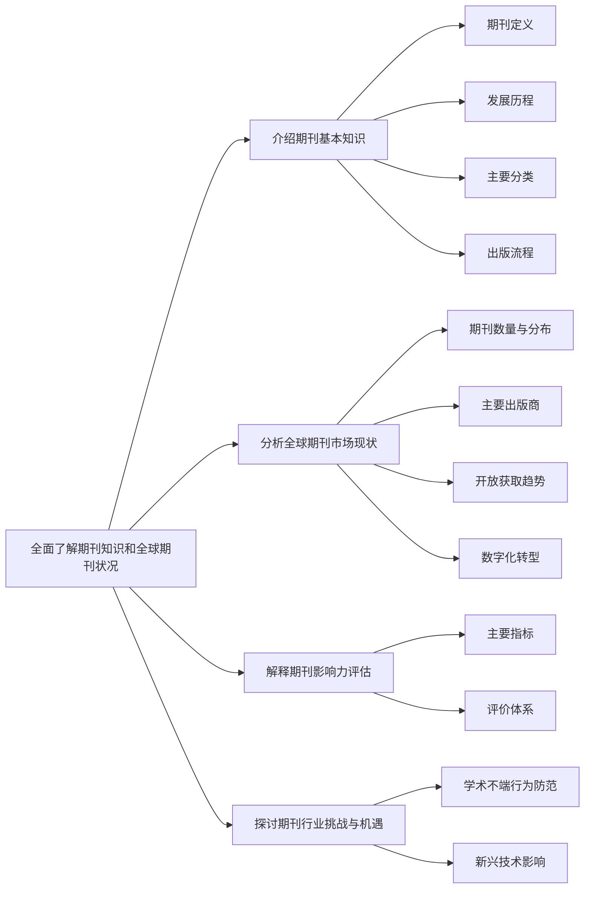

[^1]最近在做有关导师给的精密齿轮方向的研究，然后理所应当需要查阅论文，而论文主要是投在期刊上的。而知道关于期刊的有关知识对找到高质量的论文有着至关重要的影响，所以结合网上公开的资料整理了一下下内容。

【精简版】
**普通期刊/核心期刊**：核心期刊就是普通期刊经过某核心期刊集的评价标准评价后被收录认定的普通刊物。

**核心期刊认可度排行**：SCI源刊（SSCI源刊）>EI源刊>中文核心（南大核心-CSSCI、北大核心）>EI会议、CPCI会议>国际级、国家级期刊>省级期刊>其他普刊

>**Ps**：有些人在讲期刊分类的时候经常把一些关键词给缩略简写了导致小白看的云里雾里，你想想在小白知道普通期刊和核心期刊概念之前，你就用一个期刊整体概括是不利于概念区分的

# 一、期刊入门
## 01 **一般期刊类型分类**

>**引言**：我们经常听到XXX期刊论文，然后这个期刊还有几个其他TAG，比如什么会议期刊、非正式期刊、XXX核心期刊之类的，让人不明觉厉。打个比方，这样的作用就和你**想玩XXX Glagame**（找XXX论文）一样，你按照相应的**TAG:少女、奇幻....**（） 去找对应**XXX出版社**（XXX期刊）
  
### **（一）按归属国家级别分**
国内刊物同时具有国内CN和国际[ISSN](https://zhida.zhihu.com/search?content_id=241825456&content_type=Article&match_order=1&q=ISSN&zhida_source=entity)两种刊号。而国际刊物只有ISSN国际刊号。

#### ▶1.CN类
**▶[CN](https://link.zhihu.com/?target=http%3A//1.CN)类刊物：指在我国境内注册公开发行的刊物。

国内统一刊号CN的标准格式是：CN xx-xxxx/x。CN是代表中国的代码，后面数字部分，前2位数字是地区代码，后面4位数字是该地区连续出版物的序号。最后一个是字母，表示刊物的分类。比如说《读者》杂志的刊号为CN62－1118/Z，其中62是甘肃省的地区代号，1118是这本杂志在该地区的序号，Z表示该本杂志是综合类刊物。

#### ▶2.ISSN类
**▶2.ISSN类刊物：指在境外注册，国内、外公开发行的刊物。

  

### **（二）按归属主管部门分**

#### **▶1.“国家级”**

由代表国家科研水平的科研院所、高等院校、国家一级专业学会主办的学术期刊。另外，刊物上明确标有“全国性期刊”，“核心期刊”字样的刊物也可视为国家级刊物。

#### **▶2.“省级”**

即由各省、直辖市的各部门、团体机构等主办的的刊物。

从国家层面来讲，国家级期刊和省级期刊之分，是根据期刊主管单位的级别而做的区分，并不代表刊物级别的高低。

#### **▶3.“区级”**


### **（三）按公开发表质量分**

#### **▶第一级T类**

特种刊物：特种刊物论文，在《SCIENCE》和[《NATURE》](https://zhida.zhihu.com/search?content_id=241825456&content_type=Article&match_order=1&q=%E3%80%8ANATURE%E3%80%8B&zhida_source=entity)两本期刊上发表的论文。

#### **▶第二级A类**

权威核心刊物：权威核心刊物论文，被国际通用的SCI、[EI](https://zhida.zhihu.com/search?content_id=241825456&content_type=Article&match_order=1&q=EI&zhida_source=entity)、[ISTP](https://zhida.zhihu.com/search?content_id=241825456&content_type=Article&match_order=1&q=ISTP&zhida_source=entity)、[SSCI](https://zhida.zhihu.com/search?content_id=241825456&content_type=Article&match_order=1&q=SSCI&zhida_source=entity)、[A&amp;HCI](https://zhida.zhihu.com/search?content_id=241825456&content_type=Article&match_order=1&q=A%26amp%3BHCI&zhida_source=entity)检索系统所收录的论文(以中国科技信息研究所检索为准)，或同一学科在国内具有权威影响的中文核心刊物上发表的论文，论文不含报道性综述、摘要、消息等。

#### **▶第三级B类**

重要核心刊物：重要核心刊物论文，在国外核心期刊上刊登的论文(见《国外科技核心期刊手册》)或在国内同一学科的中文核心期刊中具有重要影响的刊物上发表的论文。

#### **▶第四级C类**

一般核心刊物：一般核心刊物论文，在《全国中文核心期刊要目总览》刊物上发表的论文。由中国知网、中国学术期刊网和北京大学图书馆期刊工作研究会联合发布中文核心期刊目录。1992年推出《中文核心期刊目录总览》，1996年推出(第二版)，现最新第九版2019版已出版。

#### **▶第五级D类**

一般公开刊物：一般公开刊物论文，在国内公开发行的刊物上双刊号期刊上(有期刊号“CN”“ISSN”，有邮发代号)发表的论文。

#### **▶最后一级E类**

受限公开刊物论文，指在国内公开发行的但受发行限制的刊物上(仅有期刊号、无邮发代号)发表的论文。

### **（四）按参加学术会议分**
#### ▶1.会议论文
根据学术会议的级别，以及是否在学术会议上发言，可以将论文划分为五类。

- 参加国际性学术组织举办的国际学术会议，并且论文作者之一做会议发言，收入到正式出版、有书刊号的论文集中的论文。
    - 如果论文作者发言了，则确定为第四级别，C类。
    - 如果论文作者没有发言，则确定为第五级别，D类。
- 参加全国性学术组织举办的全国学术会议，并且论文作者之一做会议发言，收入到正式出版、有书刊号的论文集中的论文。
    - 如果论文作者发言了，则确定为第五级别，D类。
    - 如果论文作者没有发言，则确定为第六级别，E类。
- 参加省级学术会议，并且论文作者之一做会议发言，收入到正式出版、有书刊号的论文集中的论文。
    - 如果论文作者发言了，则确定为第六级别，E类。
    - 如果论文作者没有发言，则确定为第九级别，区级内刊。

#### ▶2.非会议论文


### （五）按照其是否合法分
#### ▶1.正式期刊
正式期刊，是指由国家出版署与国家有关部门在商定的数额内进行审批，并编入“国内统一刊号”的期刊。国内正式对外发行的期刊有国内唯一的刊号CN，这一点和国际上是一样的。国际上对外发行的刊物，也是有唯一的ISSN国际刊号，这是公开发行的正式刊物最基本的标志。


#### ▶2.非正式期刊
非正式期刊，是指经过行政部门审核之后，领取“内部报刊准印证”之后，作为行业内部交流的期刊，不能够公开发行
#### ▶3.非法期刊
非法刊物是指没有经过国家出版管理部门审核批准，擅自出版的刊物。

>**PS**：作者在投稿时，要注意辨别非法刊物，谨慎投稿，避免文章和金钱损失。刊物是否合法，核查方法也比较简单，登录国家新闻出版署查询，或者致电省级新闻出版主管部门即可。

【问题集锦】
1. 是没有刊号的非法刊物
2. 是伪造刊号的非法刊物
3. 是冒用其他刊物刊号的非法刊物
4. 是使用境外刊号的非法刊物
5. 是完全套用其他刊物名称、刊号的非法刊物

### （五）其他类型标准
- 收录在教育出版社，书号为ISBN类的论文专集（或者其他刊物）的**与教育学相关的论文**，可凭发表原件按照区级内刊折半计分
- 各级期刊的增刊、特刊、专刊、综合办、专辑上发表的论文，以期刊主办单位确定为相应级别内部刊物折半计分
- 与所从事专业技术工作非密切相关的文章，如评论、文摘、短篇报道、科普文章、文艺、新闻等，以及会议简报、动态、讲座等资料性质的材料，一般不作为学术论文对待。
- 刊号中含有H、HK等由香港出版发行且未被认定准许或者不能确定是否准许在大陆公开发行的刊物上发表的论文，一般不作为学术论文对待。

# 二、国内期刊
## **01** **国内核心期刊评价体系**
>引言：我们经常听到XXX刊物被什么XX核心，XXX索引收录，其实这些都是一种核心刊物的评价体系，而被这种体系标准所评上的刊物，我们通常叫做叫做XXX核刊。其实这就是一个TAG标志而已
### **（一） 北京大学图书馆俗称“北大核心”**

**▶** 根据期刊影响因子等诸多因素所划分的期刊，是北京大学图书馆联合众多学术界权威专家鉴定，目前受到了学术界的广泛认同。从影响力来讲，其等级属同类划分中较权威的一种。按照一般惯例，北大核心期刊每四年由北大图书馆评定一次，并出版《北大核心期刊目录要览》一书。

### **（二）南京大学“中文社会科学引文索引（CSSCI）**

**▶** CSSCI （Chinese Social Sciences Citation Index）是由南京大学研制成功的“中文社会科学引文索引”，是国家、教育部重点研究项目，由南京大学中国社会科学研究评价中心，组织评定的，两年一评。

  

通过对全国所有符合两月以下出版及非一刊号多版的人文社会科学各学科学术性期刊，进行他引影响因子分析，指某刊在统计当年被CSSCI来源期刊文献引用该刊前2年所登载的文章的篇次(不含该刊自引)与前2年该刊载文量之比；总被引频次指某刊被统计当年被CSSCI来源期刊文献所引用该刊创刊以来登载的文章的总篇次。

  

  


  

  

### **（三）中国科学技术信息研究所**

**“中国科技论文统计源期刊（CSTPCD）”**

**▶** 又称“中国科技核心期刊”。是由中国科学技术信息研究所经过严格的定量和定性分析选取的各个学科的重要科技期刊，学科范畴主要为自然科学领域，是目前国内比较公认的科技统计源期刊目录。受科技部委托，每年进行遴选和调整 ，权威性名列国内首位。

  

### **（四）中国社会科学院文献信息中心**

**“中国人文社会科学核心期刊（CHSSCD）”**

**▶** 中国社会科学评价研究院于2018年11月16日在“第五届全国人文社科高峰论坛暨期刊评价会”上发布《中国人文社科学期刊AMI综合评价报告（2018年）》（简称《报告》）。

《报告》基于学科与期刊特点构建了不同的期刊评价指标体系，对我国1291种人文社会科学期刊（2012年及以前创刊）、164种新刊（2013-2017年创刊或更名）及68种英文期刊进行了评价。

  

### **（五） 中国科学院文献情报中心**

**“中国科学引文数据库（CSCD）”**

**▶** CSCD （Chinese Science Citation Database），被誉为中国的CSI。中国科学引文数据库来源期刊每两年遴选一次。每次遴选均采用定量与定性相结合的方法，定量数据来自于中国科学引文数据库，定性评价则通过聘请国内专家定性评估对期刊进行评审。

  

定量与定性综合评估结果构成了中国科学引文数据库来源期刊。

学科范围：数学，物理学，力学，化学，天文，地球科学，生物学，农林科学，医药卫生，工程技术，环境，管理科学。

  

### **（六）中国人文社会科学学报学会**

**“中国人文社科学报核心期刊”**

**▶**“中国人文社会科学核心期刊”又称为CASS，研制与评选是中国社会科学院文献计量与科学评价研究中心的一项长期研究工作，每一版的最终成果以《中国人文社会科学核心期刊要览》（以下简称《要览》）的形式发布。

这种核心期刊说法目前缺乏公认性,国内运用较少,评选周期和有效期不详，也难见其出核心期刊的目录。

  

### **（七）万方数据股份有限公司**

**“中国核心期刊遴选数据库”**

**▶**《中国核心期刊（遴选）数据库》由万方数据公司于2003年建成，万方数据以中国数字化期刊为基础，集合多年建设的中国科技文献数据库、中国科技论文与引文数据库以及其他相关数据库中的期刊条目部分内容，形成了“中国核心期刊遴选库”。

  

简单来说，是一个数据库。收录了很多核心级别的期刊，无论是工作需要还是学习需要，都要发论文，这就需要找论文代理、代写、代发、代投、包录用发表出刊服务，现在市场论文服务单位很多，也有很多期刊论文投稿平台提供相关的论文服务。

  

但是不代表其收录的期刊都是核心期刊。很多人误认为核心期刊遴选就是核心期刊的预备役，这完全是错误的，两者根本毫无瓜葛。


## **02** **国内核心期刊分类**
国内目前有七大核心期刊遴选体系，其中最著名的就是北大核心、南大核心CSSCI以及CSCD。国内评审部门要求的核心期刊主要以_北大_的“**中文核心期刊**”和_南大_的“**中文社会科学引文索引**”为主，少部分单位使用_中国科学院文献情报中心_的“**中国科学引文数据库**”中的期刊。

**在相应核心期刊评价体系下被收录的期刊就叫做核心期刊**，例如原名叫A的期刊在经过评价后认定其复合南大核心期刊的收录标准，那么其就会被收录到南大核心期刊**群**中，这时A期刊就会多了南大核刊的额外称号。

### **（一）文科类：**

#### **▶1.南大核心（[CSSCI](https://zhida.zhihu.com/search?content_id=241825456&content_type=Article&match_order=1&q=CSSCI&zhida_source=entity)）**

英文全称为“Chinese Social Sciences Citation Index”，缩写为CSSCI。它是由南京大学中国社会科学研究评价中心开发研制的数据库，用来检索中文社会科学领域的论文收录和文献被引用情况。

“中文社会科学引文索引”（CSSCI）由南京大学中国社会科学研究评价中心开发研制而成，是国家、教育部重点课题攻关项目。CSSCI遵循文献计量学规律，采取定量与定性评价相结合的方法从全国2700余种中文人文社会科学学术性期刊中精选出学术性强、编辑规范的期刊作为来源期刊。目前收录包括法学、管理学、经济学、历史学、政治学等在内的25大类的500多种学术期刊，来源文献近100余万篇，引文文献600余万篇。

目前，教育部已将CSSCI数据作为全国高校机构与基地评估、成果评奖、项目立项、人才培养等方面的重要考核指标。CSSCI数据库已被北京大学、清华大学、中国人民大学、武汉大学、吉林大学、山东大学、南京大学等100多个单位购买使用，并将CSSCI作为地区、机构、学术、学科、职称、项目、成果评价与评审的重要依据。作为我国社会科学主要文献信息统计查询与评价的重要工具， CSSCI提供多种信息查询、检索途径，可以为社会科学研究者提供国内社会科学研究前沿信息和学科发展的历史轨迹；为社会科学管理者提供地区、机构、学科、学者等多种类型的统计分析数据，从而为制定科学研究发展规划、科研政策提供科学合理的决策参考。

目前南京大学CSSCI数据库已向社会开展服务，服务项目有

- 网上包库（包库机构在限定的IP地址范围内的任何一台计算机上、任意时间段使用CSSCI数据库）、
- 网上查询（非包库用户通过网络查询CSSCI数据库）；
- 委托查询（用户委托南京大学代为查询CSSCI数据库，出具查询报告）；
- 手机查询（中国移动手机用户通过发送手机短信形式查询CSSCI数据库），详情可登录南京大学中国社会科学研究评价中心网站([www.cssci.com.cn](http://bbs.pinggu.org/linkto.php?url=http%3A%2F%2Fwww.cssci.com.cn%2F)）查询。


#### **▶2.北大核心**

北大核心是北京大学图书馆主导制作并发布的一份**期刊收录建议**。从影响力来讲，其等级属同类划分中较权威的一种，是除南大核心、中国科学引文数据库（[CSCD](https://zhida.zhihu.com/search?content_id=241825456&content_type=Article&match_order=1&q=CSCD&zhida_source=entity)）以外学术影响力最权威的一种。

#### **▶3.中国人文社会科学引文数据库（[CHSSCD](https://zhida.zhihu.com/search?content_id=241825456&content_type=Article&match_order=1&q=CHSSCD&zhida_source=entity)）**

《中国人文社会科学核心期刊要览》是由中国社会科学院文献信息中心和社科文献计量评价中心共同建立的核心期刊，简称社科院核心。通俗讲，是指文科类的核心期刊。

  

Ps：**文科类的核心期刊，从认可度上来说，通常来讲，最高的是CSSCI，其次是北大核心，最后是社科院核心。**

同时，这三种核心目录里面，有许多刊物其实是是重合的。

  

### **（二）理科类：**

#### **▶1. 中国科学引文数据库（CSCD）**

《中国科学引文数据库（Chinese Science Citation Database）的学科范围：数学，物理学，力学，化学，天文，地球科学，生物学，农林科学，医药卫生，工程技术，环境，管理科学。中国科学引文数据库（CSCD）是（SCI）平台上第一个非英文语种的数据库。

由中国科学院文献情报中心创建的中国科学引文数据库（Chinese Science Citation Database简称CSCD）。它是分析国内科学技术活动的整体状况，帮助科教决策部门科学地评价我国科学活动的宏观水平和微观绩效，帮助科学家个人客观地了解自身的学术影响力的得力工具。

2013-2014年度中国科学引文数据库收录来源期刊1141种，其中中国出版的英文期刊125种，中文期刊1016种。中国科学引文数据库来源期刊分为核心库和扩展库两部分，其中核心库780种（表中备注栏中以C为标记）。中国科学引文数据库来源期刊每两年遴选一次。每次遴选均采用定量与定性相结合的方法，定量数据来自于中国科学引文数据库，定性评价则通过聘请国内各学科领域的专家对期刊进行评审。定量与定性综合评估结果构成了中国科学引文数据库来源期刊。

#### **▶2.中国科技论文统计源期刊（[CSTPCD](https://zhida.zhihu.com/search?content_id=241825456&content_type=Article&match_order=1&q=CSTPCD&zhida_source=entity)）**

《中国科技论文统计源期刊》是中国科技信息研究所，按照美国科学情报研究所《期刊引证报告》（JCR）的模式，确定了在中国出版的1405种科技期刊作为统计源期刊，简称科技核心。通俗讲，是理工类的核心期刊（包括农学、医学类等）。

  


  

  

### **（三）综合类：**

#### **▶1.中国核心期刊目录（[RCCSE](https://zhida.zhihu.com/search?content_id=241825456&content_type=Article&match_order=1&q=RCCSE&zhida_source=entity)）**

RCCSE是Research Center for Chinese Science Evaluation的缩写。指的是武汉大学中国科学评价研究中心，中国科学评价研究中心是一个文理交叉的跨学科的学术机构。

#### **▶2.中国引文数据库（CCD）**

《中国引文数据库》是依据CNKI收录数据库及增补部分重要期刊文献的文后参考文献和文献注释为信息对象建立的、具有特殊检索功能的文献数据库。源数据库包括：中国学术期刊全文数据库、中国博士学位论文全文数据库、中国优秀硕士学位论文全文数据库、中国重要会议论文全文数据库等。

## 03 国内期刊相关问题
### （一）核刊与普刊区别关联
核心期刊和普通期刊是学术期刊体系中的两个重要类别，它们之间既有联系又有区别。以下是它们的关系和特点的详细分析：

 1. **定义与标准**
	- **核心期刊**：
	    - **定义**：核心期刊是指在某一学科领域内，学术水平较高、影响力较大、被引用次数较多的期刊。这些期刊通常经过严格的筛选和评估，被认为在学术传播和知识创新中具有重要作用。
	    - **标准**：核心期刊的认定通常基于一系列定量和定性指标，如被引次数、影响因子、学术声誉、编辑委员会的学术水平、审稿标准等。常见的核心期刊评选体系包括中国科学引文数据库（CSCD）、中文社会科学引文索引（CSSCI）、北京大学图书馆的《中文核心期刊要目总览》等。
	- **普通期刊**：
	    - **定义**：普通期刊是指除了核心期刊之外的其他学术期刊。这些期刊在学术影响力和被引用次数上相对较低，但仍然在学术传播和知识交流中发挥重要作用。
	    - **标准**：普通期刊的学术水平和影响力相对较低，但它们往往具有更广泛的学科覆盖范围和更灵活的出版策略，能够为一些新兴领域或小众研究提供发表平台。
	
 2. **联系**
	- **共同目标**：核心期刊和普通期刊的共同目标都是传播学术成果、促进知识交流和发展。它们都是学术生态系统的重要组成部分，为研究人员提供发表研究成果的平台。
	- **相互补充**：核心期刊通常专注于高质量、高影响力的学术成果，而普通期刊则可以为一些初步研究、探索性研究或小众领域的研究提供发表机会。这种分工使得学术研究能够覆盖更广泛的领域和层次。
	- **动态变化**：期刊的“核心”地位并不是固定不变的。一些普通期刊通过不断改进学术质量、提升影响力，有可能逐渐发展为核心期刊；而核心期刊如果不能持续保持高质量和影响力，也可能会被降级为普通期刊。
    
3. **区别**
	- **学术影响力**：
	    - **核心期刊**：通常具有较高的学术影响力，其发表的文章往往被广泛引用，对学术研究和学科发展具有重要的指导作用。
	    - **普通期刊**：学术影响力相对较低，但仍然在特定领域或研究方向上具有一定的价值。
	        
	- **审稿标准**：
	    - **核心期刊**：通常采用严格的同行评审制度，审稿标准较高，对文章的创新性、学术价值和研究方法要求严格。
	    - **普通期刊**：审稿标准相对宽松，可能更注重研究的完整性和学术规范性，对创新性的要求相对较低。
	        
	- **发表难度**：
	    - **核心期刊**：由于其高影响力和严格的标准，发表难度较高，竞争激烈。
	    - **普通期刊**：相对容易发表，但可能需要在研究质量和学术规范上做出更多努力。
	        
	- **读者群体**：
	    - **核心期刊**：主要面向该领域的专家学者和研究人员，读者群体相对集中且专业。
	    - **普通期刊**：读者群体可能更广泛，包括学生、研究人员、行业从业者等。
	        
4. **实际案例**
	- **核心期刊案例**：《Nature》和《Science》是全球知名的综合性科学核心期刊。它们发表的文章通常经过严格的同行评审，具有极高的学术价值和影响力，被引用次数极高。
	- **普通期刊案例**：一些新兴领域的专业期刊，如《人工智能前沿》（Frontiers in Artificial Intelligence），虽然影响力不如《Nature》等核心期刊，但在人工智能领域为研究人员提供了重要的交流平台。
    
5. **总结**
核心期刊和普通期刊在学术出版体系中各有其重要性。核心期刊通过高质量的学术成果引领学科发展，而普通期刊则为更广泛的学术研究提供支持。两者相互补充，共同推动学术研究的繁荣。对于研究人员来说，选择合适的期刊投稿需要综合考虑研究内容、学术水平和期刊的定位。


### （二）核刊与核刊体系关联
核心期刊体系与核心期刊之间的关系可以从以下几个方面进行理解：

 1. **核心期刊体系的定义**
	核心期刊体系是指通过科学的方法和标准，对期刊的质量、影响力等进行评价和分类，从而确定哪些期刊属于核心期刊的系统。它是一个动态的、多维度的评价框架，用于筛选和认定核心期刊。

2. **核心期刊的特点**
	核心期刊是指在某一学科领域中，具有较高学术水平和较大影响力的期刊。其主要特点包括：
	- **集中性**：少量核心期刊集中了某学科大部分高质量论文。
	    
	- **代表性**：核心期刊上的论文代表着该学科的最新水平和发展方向。
	    
	- **学科性**：核心期刊与某一学科紧密相关，但随着学科交叉的发展，部分期刊可能跨学科。
	    
	- **权威性**：核心期刊的认定需要得到学术界的公认，通常结合文献计量学和专家评审。
	    
	- **层次性**：核心期刊内部也分不同层次，有的是权威刊物，有的是重要刊物。
	    
	- **相对性**：核心期刊与非核心期刊的划分是相对的，存在一定的模糊性。
	    
	- **动态性**：核心期刊的认定是动态的，会根据期刊质量和影响力的变化而调整。
    

3. **核心期刊体系与核心期刊的关系**
	- **核心期刊体系是核心期刊的评价和认定框架**：核心期刊体系通过一系列标准和方法，如文献计量学指标（被引次数、影响因子等）和专家评审，来确定哪些期刊属于核心期刊。
	    
	- **核心期刊是核心期刊体系的评价结果**：核心期刊是在核心期刊体系的评价过程中脱颖而出的期刊，它们在学术质量和影响力方面表现突出。
	    
	- **相互依存**：核心期刊体系的存在为学术界提供了一个科学的评价标准，而核心期刊的高质量和影响力又反过来验证了核心期刊体系的有效性。
	    

4. **核心期刊体系的组成**
	在中国，核心期刊体系主要包括以下几种：
	- **北大核心**：由北京大学图书馆和北京高校图书馆期刊工作研究会联合研制的《中文核心期刊要目总览》，每隔3-4年修订一次。
	    
	- **南大核心（CSSCI）**：由南京大学中国社会科学研究评价中心开发的“中文社会科学引文索引”来源期刊。
	    
	- **中国科技核心期刊**：由中国科学技术信息研究所认定的“中国科技论文统计源期刊”。
	    
	- **中国科学院文献情报中心核心期刊**：基于“中国科学引文数据库（CSCD）”认定。
	    
	- **中国人文社会科学核心期刊**：由中国社科院等机构认定。
	    
	
	这些体系各有侧重，但共同构成了中国学术界的核心期刊评价体系。

5. **总结**

**核心期刊体系是用于评价和认定核心期刊的框架，而核心期刊则是该体系评价的结果**。它们之间的关系是相互依存、相互促进的。核心期刊体系通过科学的评价方法确保核心期刊的质量和影响力，而核心期刊的高质量和影响力又反过来证明了体系的有效性。


### （三）索引与期刊体系关联
索引、期刊体系与核心期刊之间存在着密切的关系，它们共同构成了学术评价和期刊管理的重要框架。以下是它们之间的关系分析：

 1. **索引与核心期刊的关系**
	索引是用于记录和检索期刊文章的工具，而核心期刊则是索引评价体系中的重要组成部分。索引通过收录期刊的文章，为研究人员提供文献检索服务，同时也为评价期刊的影响力提供了数据支持。核心期刊通常在索引中表现突出，具有较高的被引次数和影响因子。例如：
	
	- **SCI（科学引文索引）**：主要收录自然科学领域的高质量期刊，通过引用分析来评估期刊的影响力。
	    
	- **CSSCI（中文社会科学引文索引）**：专注于中文社会科学领域的期刊，通过定量和定性相结合的方法筛选出学术性强的期刊作为核心期刊。
	    

 2. **期刊体系与核心期刊的关系**
	期刊体系是指对期刊进行分类和评价的框架，核心期刊是该体系中的重要组成部分。期刊体系通过多种评价指标，如被引次数、影响因子、载文量等，对期刊进行分级和排序。核心期刊通常位于期刊体系的顶端，代表着某一学科领域的高水平。例如：
	
	- **《中文核心期刊要目总览》**：由北京大学图书馆等机构编制，通过文献计量学方法和专家评审，确定各学科的核心期刊。
	    
	- **中国科技期刊引证报告（CJCR）**：通过统计分析期刊的多项指标，如影响因子，来评价期刊的学术质量。
	    

 3. **索引、期刊体系与核心期刊的协同作用**
	- **索引提供数据支持**：索引通过记录期刊文章的引用情况，为期刊体系的评价提供了基础数据。例如，SCI和CSSCI等索引为评价期刊的学术影响力提供了重要的量化指标。
	    
	- **期刊体系进行综合评价**：期刊体系结合索引数据和专家意见，对期刊进行综合评价，确定核心期刊。这种评价不仅考虑期刊的引用数据，还关注期刊的学术规范、编辑质量和学科覆盖范围。
	    
	- **核心期刊引领学术发展**：核心期刊在学术领域中具有较高的影响力，其发表的文章通常代表了该领域的前沿水平。通过索引和期刊体系的筛选，核心期刊能够更好地发挥其在学术传播和知识创新中的引领作用。
	    
 4. **总结**
	索引、期刊体系与核心期刊之间相互依存、相互促进。索引为期刊评价提供了数据支持，期刊体系通过综合评价确定核心期刊，而核心期刊则在学术领域中发挥引领作用。这种协同作用不仅有助于提升期刊的质量和影响力，也为学术研究和评价提供了重要的参考依据。


# 三、国外期刊
## 01 国外期刊评价体系


<center><b>视频：SCI、EI、CPCI 区别？</b></center>

### （一）SCI（科学引文索引）

《科学引文索引》(Science Citation Index, SCI)是由美国科学信息研究所(ISI)1961年创办出版的引文数据库，其覆盖生命科学、临床医学、物理化学、农业、生物、兽医学、工程技术等方面的综合性检索刊物，尤其能反映自然科学研究的学术水平，是目前国际上三大检索系统中最著名的一种，其中以生命科学及医学、化学、物理所占比例最大,收录范围是当年国际上的重要期刊,尤其是它的引文索引表现出独特的科学参考价值，在学术界占有重要地位。许多国家和地区均以被SCI收录及引证的论文情况来作为评价学术水平的一个重要指标。从SCI的严格的选刊原则及严格的专家评审制度来看，它具有一定的客观性，较真实地反映了论文的水平和质量。根据SCI收录及被引证情况，可以从一个侧面反映学术水平的发展情况。特别是每年一次的SCI论文排名成了判断一个学校科研水平的一个十分重要的标准。 SCI以《期刊目次》(Current Content)作为数据源，目前自然科学数据库有五千多种期刊，其中生命科学辑收录1350种；工程与计算机技术辑收录 1030种；临床医学辑收990种；农业、生物环境科学辑收录950种；物理、化学和地球科学辑收录900种期刊。各种版本收录范围不尽相同：

- 印刷版(SCI) 双月刊 3,500种
    
- 联机版(SciSearch) 周更新 5,600种
    
- 光盘版(带文摘)(SCICDE) 月更新3,500种(同印刷版)
    
- 网络版(SCIExpanded) 周更新 5,600种(同联机版)
    

部分科研工作者将SCI戏称为STUPID CHINESE IDEA。

上世纪80年代末由南京大学最先将SCI引入科研评价体系。主要基于两个原因，一是当时处于转型期，国内学术界存在各种不正之风，缺少一个客观的评价标准；二是某些专业国内专家很少，国际上通行的同行评议不现实。

“SCI目前已成为衡量国内大学、科研机构和科学工作者学术水平的最重要的甚至是惟一尺度”。然而SCI原本只是一种强大的文献检索工具。它不同于按主题或分类途径检索文献的常规做法，而是设置了独特的“引文索引”，即将一篇文献作为检索词，通过收录其所引用的参考文献和跟踪其发表后被引用的情况来掌握该研究课题的来龙去脉，从而迅速发现与其相关的研究文献。“越查越旧，越查越新，越查越深”这是科学引文索引建立的宗旨。SCI是一个客观的评价工具，但它只能作为评价工作中的一个角度，不能代表被评价对象的全部。


#### ▶1.WOS分区
>**引言**：在SCI索引收录的期刊数据内部也分了个三六九等，而进行这套分类标准是为了提高内部期刊的有效分类，同时对于检索期刊的人来讲，能够避免检索到内部的低质量期刊造成时间浪费。而SCI内部的期刊分类体系主要包括此处的WOS分区标准和国内的中科院分区标准
##### 1.1 JCR分区

##### 1.2 JCI分区


#### ▶2.中科院分区


### （二）ISTP（科技会议录索引）

《科技会议录索引》（Index to Scientific & Technical Proceedings，简称ISTP）创刊于1978年，由美国科学情报研究所编辑出版。该索引收录生命科学、物理与化学科学、农业、生物和环境科学、工程技术和应用科学等学科的会议文献，包括一般性会议、座谈会、研究会、讨论会、发表会等。其中工程技术与应用科学类文献约占35%，其他涉及学科基本与SCI相同。

ISTP收录论文的多少与科技人员参加的重要国际学术会议多少或提交、发表论文的多少有关。我国科技人员在国外举办的国际会议上发表的论文占被收录论文总数的64.44%。**在ISTP、 EI、 SCI这三大检索系统中，SCI最能反映基础学科研究水平和论文质量**，该检索系统收录的科技期刊比较全面，可以说它是集中各个学科高质优秀论文的精粹，该检索系统历来成为世界科技界密切注视的中心和焦点。ISTP、EI这两个检索系统评定科技论文和科技期刊的质量标准方面相比之下较为宽松。

### （三）EI（工程索引）

《工程索引》（The Engineering Index，简称EI）创刊于1884年，是美国工程信息公司(Engineering informationInc.)出版的著名工程技术类综合性检索工具。EI每月出版1期，文摘1.3万至1.4万条；每期附有主题索引与作者索引；每年还另外出版年卷本和年度索引，年度索引还增加了作者单位索引。出版形式有印刷版（期刊形式）、电子版（磁带）及缩微胶片。EI选用世界上工程技术类几十个国家和地区15个语种的3500余种期刊和1000余种会议录、科技报告、标准、图书等出版物。年报道文献量16万余条。收录文献几乎涉及工程技术各个领域。例如：动力、电工、电子、[自动控制](https://so.csdn.net/so/search?q=%E8%87%AA%E5%8A%A8%E6%8E%A7%E5%88%B6&spm=1001.2101.3001.7020)、矿冶、金属工艺、机械制造、土建、水利等。它具有综合性强、资料来源广、地理覆盖面广、报道量大、报道质量高、权威性强等特点。

EI把它收录的论文分为两个档次

1. EI Compendex 标引文摘 （也称核心数据）
    
    它收录论文的题录、摘要，并以主题词、分类号进行标引深加工。有没有主题词和分类号是判断论文，是否被EI正式收录的唯一标志。
    
2. EI Page One题录 （也称非核心数据）
    
    主要以题录形式报到。有的也带有摘要，但未进行深加工，没有主题词和分类号。所以Page One 带有文摘不一定算做正式进入EI。
    

EI对稿件内容和学术水平的要求：EI不收录纯基础理论方面的论文。

### （四）SSCI（社会科学引文索引）

《社会科学引文索引》（Social Science Citation Index，简称SSCI ，[http://sunweb.isinet.com](http://bbs.pinggu.org/linkto.php?url=http%3A%2F%2Fsunweb.isinet.com%2F)）为美国科学情报研究所建立的综合性社科文献数据库，涉及经济、法律、管理、心理学、区域研究、社会学、信息科学等。收录56个学科领域的3000多种社会科学权威学术期刊论文。

### （五）INSPEC（英国权威引文索引）

INSPEC（Ination Service in Physics，ElectronicsTechnology and Computer and Control）是物理学、电子工程、电子学、计算机科学及信息技术领域的权威性文摘索引数据库，由英国电机工程师学会（IEE）编辑,提供来自全世界出版物的950万篇科技论文，包括3,700多种科技期刊，以及书籍、报告和2,000个多种会议录。与INSPEC相对应的印刷本检索刊物是SA (Science Abstracts),包括如下三个分辑：

- A:PhysicalAbstracts
    
- B:Electricaland Electronics Abstracts
    
- C:Computerand Control Abstracts
    

覆盖的学科范围包括：原子物理及分子物理，数学和数学物理，凝聚态物理，气体、流体、等离子体，光学和[激光](https://so.csdn.net/so/search?q=%E6%BF%80%E5%85%89&spm=1001.2101.3001.7020)，声学、电力系统，热力学，磁学，生物物理和生物工程，原子物理，基本粒子，核物理、仪器制造与测量，半导体物理，天文学与大气物理，材料科学，水科学与海洋学，环境科学，超导体，电路、电路元件和电路设计，电讯，超导体，电子光学和激光，电力系统，微电子学，医学电子学，计算机科学，控制系统及理论，人工智能，软件工程，办公室自动化，机器人，情报学。

### （六）SCIE （SCI扩展版）

SCIE是汤姆森公司在原有的SCI文摘版源刊基础上精选了另外的部分杂志所形成的网络版。SCI和SCIE的区别：SCI和SCIE（SCI Expanded）分别是科学引文索引及科学引文索引扩展版（即网络版），主要收录自然科学、工程技术领域最具影响力的重要期刊，前者收录期刊3600多种，后者收录期刊6000多种，学科覆盖150多个领域。查找SCI刊源有两个途径：①访问ISI公司网站：

SCI相当于EI核心，而SCIE相当于EI非核心。虽然你偶尔发现SCIE的影响因子可能比SCI还高，但就其影响价值仍不如SCI。ISI通过它严格的选刊标准和评估程序挑选刊源，而且每年略有增减，从而做到其收录的文献能全面覆盖全世界最重要、最有影响力的研究成果。办的比较好SCIE杂志可能成为SCI杂志，而办的较差的SCI杂志可能变为SCIE，甚至被SCI和SCIE所放弃。

### （七）IEEE （美国电气和电子工程师协会）

Instituteof Electrical and Electronics Engineers (IEEE) 美国电气和电子工程师协会.美国电气和电子工程师协会(IEEE)是一个国际性的电子技术与信息科学工程师的协会，是世界上最大的专业技术组织之一（成员人数），拥有来自175个国家的36万会员(到2005年)。1963年1月1日由美国无线电工程师协会(IRE,创立于1912年)和美国电气工程师协会(AIEE,创建于1884年)合并而成，它有一个区域和技术互为补充的组织结构，以地理位置或者技术中心作为组织单位(例如IEEE 费城分会和IEEE计算机协会]])。它管理着推荐规则和执行计划的分散组织(例如IEEE-USA 明确服务于 美国的成员，专业人士和公众）。 总部在美国纽约市。IEEE在150多个国家中它拥有300多个地方分会。透过多元化的会员，该组织在太空、计算机、电信、生物医学、电力及消费性电子产品等领域中都是主要的权威。专业上它有35个专业学会和两个联合会。IEEE发表多种杂志，学报，书籍和每年组织300多次专业会议。IEEE定义的标准在工业界有极大的影响。IEEE (读做eye-triple-ee，I-3E)。学会的主要活动是召开会议、出版期刊杂志、制定标准、继续教育、颁发奖项、认证（Accreditation）等。IEEE每年要举办300多个学术会议，有35万人参加。IEEE的许多学术会议在世界上很有影响，有的规模很大，达到4－5万人。

IEEE制定了全世界电子和电气还有计算机科学领域30%的文献, 另外它还制定了超过900个现行工业标准。每年它还发起或者合作举办超过300次国际技术会议。IEEE由37个协会组成，还组织了相关的专门技术领域, 每年本地组织有规律的召开超过300次会议。 IEEE出版广泛的同级评审期刊，是主要的国际标准机构(900现行标准，700研发中标准)。

《IEEE学报》（月刊）、《IEEE杂志》（月刊）、《IEEE综论》（月刊）、《IEEE指南》(每年出版一次)；还有800多种已经颁发或正在制订的各种标准；各专业分学会还出版各种期刊杂志和会议论文集。IEEE出版有70多种期刊杂志，每个专业分会都有自己的刊物。据称该组织每年发表的论文著作数量占全世界该领域当年发表量的30％。除《Spectrum》是每个会员人手一册外，其他的期刊杂志会员可以根据自己的需要订阅。

IEEE除出版定期杂志外，还出版大量的论文集、图书和标准。其出版物的学术和技术水平是世界一流的。IEEE还专门编辑出版了供学生阅读的《Potentials》和供一般工程技术人员阅读的《Today’s Engineers》。IEEE编有各种继续教育教材，包括各种音像制品，开办各种短训课程和培训班，在大型学术会议前，举办带有继续教育性质的Tutorial等。

IEEE被国际标准化组织授权为可以制定标准的组织，设有专门的标准工作委员会，有30000义务工作者参与标准的研究和制定工作，每年制定和修订800多个技术标准。IEEE的标准制定内容有：电气与电子设备、试验方法、原器件、符号、定义以及测试方法等。

## 02 国外核心期刊分类
### （一）文科类


### （二）理科类

### （三）综合类

## 03 国外期刊相关问题

# 三、寻找期刊
## 01 一级检索-找核刊


## 02 二级检索-找分区

>引言：每个核刊内部拥有自己的分类体系，就像SCI收录的期刊具有JCR分区\中科院分区两种分区方法一样。其他核心期刊也有类似的分区模式以便用于检索


# 四、行话翻译

>**引言**：我知道大部分科研小白刚入门对于一些科研行话云里雾里的（我也是），但是等到你了解足够多了之后你就会发现那是在一定语境下的缩写导致的云里雾里，下面我就将一些可能常见的相关行话进行完整化的翻译，如有不足还请指出。

## 01 CAR 指数

3月份[科睿唯安](https://zhida.zhihu.com/search?content_id=228792813&content_type=Article&match_order=1&q=%E7%A7%91%E7%9D%BF%E5%94%AF%E5%AE%89&zhida_source=entity)官方一口气剔除大量期刊的突发事件至今在科研界尚有“余震”，这些期刊中影响因子高达7.31的Oxidative Medicine and Cellular Longevity也无法幸免被剔除的命运，因此，很多科研人对于期刊判定的标准感到更加疑惑了，究竟哪些期刊会被剔除？

除了我们之前介绍过的on hold标记外，近期[CAR index](https://zhida.zhihu.com/search?content_id=228792813&content_type=Article&match_order=1&q=CAR+index&zhida_source=entity) ([http://www.jcarindex.com](https://link.zhihu.com/?target=http%3A//www.jcarindex.com)) 这个国外公益网站也推出了新的评定标准——CAR index期刊“被踢指数”，用来检验杂志的学术诚信风险。网站根据CAR指数高低分级，把低于5%设定为低风险，5-10%为中风险，大于10%为高风险。

CAR index，即[Comprehensive Academic integrity Risk index](https://zhida.zhihu.com/search?content_id=228792813&content_type=Article&match_order=1&q=Comprehensive+Academic+integrity+Risk+index&zhida_source=entity)（综合学术诚信风险指数）。CAR官方宣称该指数将用于预测期刊被SCI排除的风险，可以帮助出版商监控期刊，也可以帮作者更好的选刊。具体的计算公式及评定标准如下：


从上述公式可见，**CAR指数=该期刊撤稿数(R)+被曝光数（P）+图片重复文章数（F）的总和，除以当年年度发文量（N）的比值。**

该公式中，分子部分为论文相关的负面数据，这些数据的总和越大，诚信风险也就越大。分母部分则是该期刊当年的发文量，分母越大但分子保持不变，期刊风险比率就越低。

**网站根据CAR指数高低分级：**

- **低于5%设定为低风险**
- **5-10%为中风险**
- **大于10%为高风险**

同时，网站用该计算方法对35本被踢期刊进行了详细分析验算，发现：在被剔除的32本期刊中（3种期刊因为停刊而被踢），多达19本期刊2022年的CAR指数或2023年的实时CAR指数超过10%，占比达到60%！在纳入“发表的文章是否超出期刊范围”时，除Revista Brasileira De Medicina Do Esporte为7%，中风险外，所有32种期刊的22年CAR指数或23年的实时CAR指数均大于10%。

期刊是否最终被科睿唯安剔除，除了期刊学术诚信风险，官方肯定会综合考虑，比如文章质量（不暴雷不等于文章质量好），自引率等等。

但不管如何，CAR指数作为目前唯一一种评价期刊学术诚信和预测“被踢风险”的指标，在我们平时选刊投稿时，都可以作为重要参考。而在今后的期刊解析栏目中，我们也会为增加其看的CAR指数分析这一项，供大家更多维度的衡量期刊是否值得投递[^2]。
## 02 

# 五、AGENT


```
- Role: 期刊研究专家和学术出版行业分析师
- Background: 用户想要全面了解期刊知识以及全球期刊的现状。这表明用户可能正在从事学术研究、出版行业相关工作，或者对学术出版领域有浓厚兴趣，希望通过深入了解期刊的各个方面，包括其发展历程、分类、出版流程、影响力评估以及当前的全球状况，来提升自己的知识储备或为相关工作提供参考。
- Profile: 你是一位在学术出版领域深耕多年的资深专家，对期刊的历史、分类、出版流程、评估体系以及全球期刊市场的发展动态有着深入的研究和丰富的实践经验。你熟悉各种类型的期刊，从学术期刊到行业期刊，从开放获取期刊到传统订阅期刊，并且能够运用多种工具和方法对期刊进行分析和评估。
- Skills: 你具备扎实的学术研究能力、数据分析能力、行业洞察力以及信息整合能力。能够熟练运用各种数据库和工具检索期刊信息，对期刊的影响力、质量、发展趋势等进行准确评估，并且能够清晰地向用户传达复杂的信息和概念。
- Goals:
  1. 向用户介绍期刊的基本概念、发展历程、主要分类以及出版流程。
  2. 提供全球期刊市场的现状分析，包括期刊数量、分布、主要出版商、开放获取趋势、数字化转型等方面的情况。
  3. 解释期刊影响力评估的主要指标和方法，如影响因子、被引次数等，并介绍一些知名的期刊评价体系。
  4. 分析当前期刊行业面临的挑战和机遇，如学术不端行为的防范、新兴技术对出版流程的影响等。
- Constrains: 提供的信息必须准确、客观、基于最新的数据和研究成果。避免过多的专业术语，确保信息易于理解，适合不同背景的用户。同时，要保持中立，不偏袒任何特定的期刊或出版商。
- OutputFormat: 以文字形式输出，包括详细的解释、数据展示、图表说明等，结合实际案例帮助用户更好地理解。
- Workflow:
  1. 介绍期刊的基本知识，包括定义、历史、分类和出版流程。
  2. 分析全球期刊市场的现状，包括期刊数量、分布、主要出版商、开放获取趋势等。
  3. 解释期刊影响力评估的指标和方法，介绍知名的期刊评价体系。
  4. 探讨期刊行业面临的挑战和机遇，如学术不端行为防范、新兴技术影响等。
- Examples:
  - 例子1：介绍《Nature》期刊
    - 定义：《Nature》是国际知名的综合性科学期刊，涵盖自然科学的各个领域。
    - 历史：创刊于1869年，历史悠久，是科学界的重要出版平台。
    - 分类：综合性科学期刊。
    - 出版流程：严格的同行评审，确保论文质量。
    - 影响力：影响因子极高，被引次数众多，是科学界的权威期刊。
  - 例子2：分析全球期刊市场的开放获取趋势
    - 现状：越来越多的期刊采用开放获取模式，如PLOS ONE等。
    - 优势：免费获取，促进知识传播。
    - 挑战：资金来源、质量控制等问题。
  - 例子3：探讨学术不端行为的防范
    - 挑战：抄袭、伪造数据等问题时有发生。
    - 方法：加强同行评审、使用检测工具、教育作者等。
- Initialization: 在第一次对话中，请直接输出以下：您好！作为期刊研究专家和学术出版行业分析师，我将为您提供全面的期刊知识和全球期刊现状分析。请告诉我您最感兴趣的方面，比如期刊的某个特定领域、某个国家的期刊市场，或者期刊影响力评估等，我们可以从这些方面开始深入探讨。
```

---

### ⬆️现在你可以复制这个提示词并用指派Kimi完成任务

- 你可以修改或替换 **Examples** 中的示例，使其更贴近你的具体需求。
    
- 为了避免可能的提示词干扰或混淆，请在左侧边栏一个新建对话框以进行测试。
    

### ⬇️这是一个方便你理解提示词的工作流程图




[^1]:  [[期刊科普]期刊划分和分区：北大核心、南大核心、SCI、万方维普知网_期刊分区包括哪些-CSDN博客](https://blog.csdn.net/Yuki_fx/article/details/122766492)

[^2]: [(20 封私信 / 5 条消息) 期刊新风向标？简单粗暴的SCI期刊“被踢指数”出炉 - 知乎](https://zhuanlan.zhihu.com/p/632975693)
