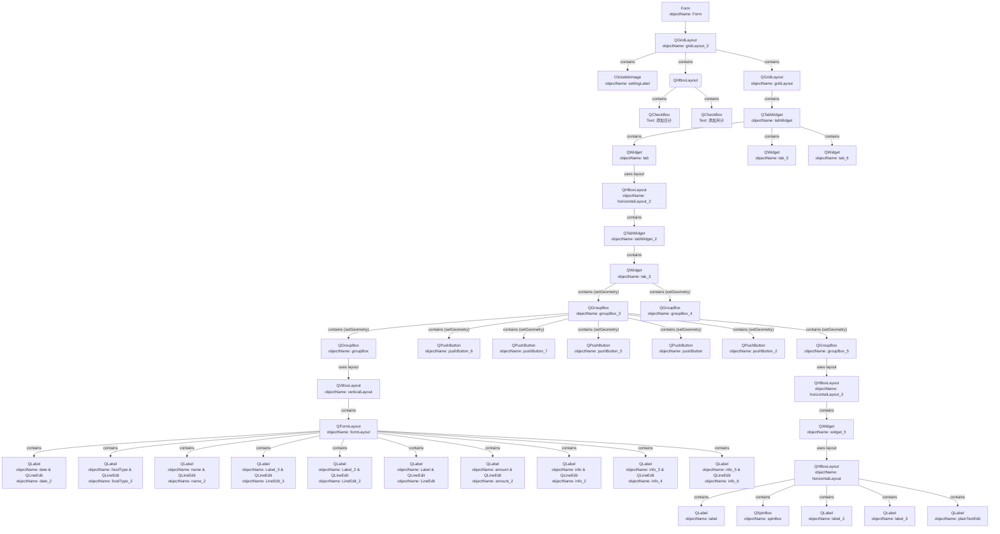

# 1. 项目前言
受到采油厂姐姐委托，去编写一个程序去解决采油厂食品出库入库的信息自动更新问题，这个过程在之前是由人手动去解决的，其有诸多的不足——传统方式主要有以下问题。

1. **重复性高**：需要根据出入库的信息来源去手动的更新`总表簿、分表簿`中不同类型表的入库信息。每入库一个菜品往往需要更新5-10个表，`重复性劳动强度过大`！
2. **错误率高**：重复性的出入库信息登记工作使人的注意力下降，导致经常发生表格的重新修正，这样一点无疑又增加了重复劳动的时间，`降低了劳动效率`。

故，本次项目的主要任务如前文所说，编写一套图形化的自动程序，去解决人工方式中存在的这两点不足。

# 2. 项目目的
编写一套图形化的自动程序，以解决人工方式在食品出入库信息更新时存在的以下不足，支持手动输入以及PDF输入信息两种方式，提高食品信息入出库的效率解放生产力。

<b>图：采购验收单</b>

<b>图：入库动作流</b>

<b>图：出库动作流</b>

# 3. 项目要求

## 3.1. 使用要求

### 3.1.1. V1.0 版本
1. **数据输入**：
    - 支持多种数据源：
        - Excel 表格文件（.xls, .xlsx）
        - PDF 文件（文本型和扫描型）
        - 文本信息（手动输入或复制粘贴）
    - 支持批量导入数据。
    - 能够自动识别和处理不同数据源中的关键信息。
2. **数据处理**：
    - 能够自动提取和匹配不同数据源中的 TAG 信息。
    - 支持自定义匹配规则，提高匹配准确率。
    - 能够自动更新总表簿、分表簿等表格数据。
    - 支持数据验证和清洗，确保数据质量。
3. **数据存储**：
    - 采用主备份 Excel 存储模式，提高数据安全性。
    - 支持数据备份和恢复。
4. **报表生成**：
    - 能够根据处理后的数据生成各种报表。
    - 支持自定义报表格式和导出功能。
5. **用户管理**：
    - 支持用户身份验证和权限管理（可选）。
6. **配置管理**：
    - 支持管理系统的配置信息，如数据源路径、匹配规则等。
7. **易用性**：
    - 操作简单直观，易于上手。
    - 提供详细的帮助文档和错误提示。
8. **性能**：
    - 数据处理速度快，能够满足日常使用需求。
9. **稳定性**：
    - 系统运行稳定可靠，不易崩溃。
10. **安全性**：
    - 数据存储安全，防止数据泄露。

### 3.1.2. V2.0版本
>**引言**：由于甲方资金比较困难，所以在上述要求上进行了精简，

## 3.2. 界面要求
1. **主界面**：
    - 简洁明了，功能模块划分清晰。
    - 提供数据导入、数据处理、报表生成等常用功能的快捷入口。
    - 显示系统状态信息，如数据源连接状态、数据处理进度等。
2. **数据导入界面**：
    - 支持选择数据源类型（Excel、PDF、文本）。
    - 支持选择文件或手动输入文本。
    - 提供数据预览功能，方便用户确认数据内容。
    - 支持自定义数据导入规则（可选）。
3. **数据处理界面**：
    - 显示数据处理进度和结果。
    - 提供手动调整匹配结果的功能。
    - 支持查看和编辑数据处理规则。
4. **报表生成界面**：
    - 支持选择报表类型和格式。
    - 提供报表预览功能。
    - 支持导出报表到 Excel、PDF 等格式。
5. **用户管理界面**（可选）：
    - 支持用户注册、登录、权限管理等功能。
6. **配置管理界面**：
    - 支持修改数据源路径、匹配规则等配置信息。
7. **通用要求**：
    - 界面美观大方，符合用户审美。
    - 操作流畅，响应迅速。
    - 提供友好的错误提示和帮助信息。
    - 支持自定义界面风格（可选）。
# 4. 架构规划
## 4.1. 业务架构
### 4.1.1 V1.0 版本

图：第一次业务架构图

### 4.1.2. V2.0版本

## 4.2. 技术架构

### 4.2.1. V1.0 版本

- # 1. 调研
- ## 1.1. ModernWMS

开源地址：[https://gitee.com/modernwms/ModernWMS](https://link.zhihu.com/?target=https%3A//gitee.com/modernwms/ModernWMS)

体验地址：[https://wmsonline.ikeyly.com](https://link.zhihu.com/?target=https%3A//wmsonline.ikeyly.com)

该库存管理系统是，我们从多年ERP系统研发中总结出来的一套针对小型物流仓储供应链流程。 在工作过程中我们很多的中小企业，由于IT预算有限，所以无法用上适合他们的系统，却又实实在在存在仓储管理方面的需求，以此我们开始了这个项目。 为了帮助一些有需要的用户。

- ## 1.2. GreaterWMS

开源地址：[https://github.com/GreaterWMS/GreaterWMS](https://link.zhihu.com/?target=https%3A//github.com/GreaterWMS/GreaterWMS)

GreaterWMS 是 AGPLv3 许可的基于 Python 的开源框架，可以快速创建多种类型的企业实际业务管理系统。

**特性**

- 后端基于 Python
- 前端基于 Vue.js
- 从货物流转出发，赋予货物的可追溯性
- 涵盖整个供应链流通环节
- 加快供应商，工厂，仓库，运输，客户之前的互相协调
- 开箱即用的对桌面和移动端以及扫描设备的快速响应
- 通过底层核心紧密集成，对每种构建模式，能够更快的响应企业业务领域

**功能列表**

**「全平台支持」**一套 web 代码，支持所有平台提供一个权威的代码源：响应式桌面/移动网站（SPA，SPA 客户端），移动应用（看起来原生）和多平台桌面应用（通过 Electron）。

**「最全的货物流转」**在 GreaterWMS 中，几乎每个货物的数量都是实时变化的，根据货物的变化，可以快速响应货物现在所处在的业务流程环节。

**「最佳实践默认集成」**GreaterWMS 还旨在鼓励开发人员，快速响应企业业务发展需要。要做到这一点，GreaterWMS 充满了开箱即用的强大功能。

**「应用扩展支持」**GreaterWMS 应用扩展是一种轻松地，后端底层是 Django 框架，可以轻松的创建属于自己的 app，使 GreaterWMS 成为最具扩展性和最强大的框架之一。

**「广泛的平台支持」**Google Chrome, Firefox, IE11/Edge, Safari, Opera, iOS, Android, Windows Phone, Blackberry, MacOS, Linux, Windows.

**「GreaterWMS 语言包」**GreaterWMS 配备了 11 种开箱即用的语言包。最重要的是，如果缺少语言包，则只需 5 分钟即可添加。

- ## 1.3. kopSoftWMS

开源地址：[https://github.com/lysilver/kopSoftWMS](https://link.zhihu.com/?target=https%3A//github.com/lysilver/kopSoftWMS)

在线演示：[http://wms.kopsoft.cn/Login/Index](https://link.zhihu.com/?target=http%3A//wms.kopsoft.cn/Login/Index)（user：guest，pwd：123456）

一款.NET开源免费的WMS仓库管理系统，KopSoftWms仓库管理系统。

**技术栈：**

基于微软.NET 6.0开发，支持 sqlserver、mysql 等主流数据库，ORM 采用国内开源 ORM 框架 SqlSugar ；

前端采用 bootstrap、adminlte、layer、bootstrap-datetimepicker、bootstrap-table、bootstrap-select等；

后端采用 [http://asp.net](https://link.zhihu.com/?target=http%3A//asp.net) mvc core、fluentValidation、nlog、Jil、DI、Ganss 、雪花算法、Xunit、npoi等；

- ## 1.4. SwebWMS

开源地址：[https://gitee.com/smobiler/SwebWMS](https://link.zhihu.com/?target=https%3A//gitee.com/smobiler/SwebWMS)

这是基于.Net FrameWork开发的，UI采用SWEBUI平台，SwebDesigner采用component组件的方式。系统整体界面简洁、大气，系统功能完善、报表统计完备，完全可以满足需求，简单进行二次开发，可直接使用于项目中。

**技术架构：**

1、跨平台：这是基于.Net Core开发的系统，可以部署在Docker, Windows, Linux, Mac。

2、数据库支持：MySQL、Sqlserver。

3、基于.Net4.5 +Autofac +SWEBUI+SwebDesigner。

**项目结构：**

**后台管理系统**

1、主页：常用功能快捷入口

2、资产：资产管理、资产模板、资产入库、资产出库、资产挑拨、资产盘点3、耗材：耗材管理、耗材入库、耗材出库、耗材挑拨、耗材盘点

4、订单：资产销售、资产采购、耗材销售、耗材采购5、主数据：资产分类、仓库管理、客户管理、供应商管理

6、资产分析统计：资产库库存分析、资产有效期分析、资产采购报表、供应商统计、资产销售单报表、客户统计

7、耗材分析统计：耗材库存分析、安全库存分析、采购报表分析、供应商统计、销售报表分析、客户统计8、设置：个人信息设置

**首页**

**资产管理**

**资产模板**

**资产入库**

- ## 1.5. [若依wms](https://zhida.zhihu.com/search?content_id=234383299&content_type=Article&match_order=1&q=%E8%8B%A5%E4%BE%9Dwms&zhida_source=entity)

开源地址：[https://gitee.com/zccbbg/wms-ruoyi](https://link.zhihu.com/?target=https%3A//gitee.com/zccbbg/wms-ruoyi)

若依wms是一套基于若依的wms仓库管理系统，支持lodop和网页打印入库单、出库单。包括仓库/库区/货架管理，出入库管理，客户/供应商/承运商，库存看板、库存记录等功能。毫无保留给个人及企业免费使用。

• 前端采用Vue、Element UI（ant design 正在开发中）。

• 后端采用Spring Boot、Spring Security、Redis & Jwt。

• 权限认证使用Jwt，支持多终端认证系统。

• 支持加载动态权限菜单，多方式轻松权限控制。

• 高效率开发，使用代码生成器可以一键生成前后端代码

**主要功能：**

- 首页：库存预警与到期提醒、基础数据报表展示

• 仓库/库区/货架：管理维护仓库基础数据

• 物料：管理维护物料基础数据

• 客户/供应商/承运商：管理维护联系人基础数据

• 入库：创建入库单后包括如下几个状态：未发货、在途（已发货未入库）、部分入库、作废、入库完成，入库类型包括：采购入库、外协入库、退货入库，入库单支持lodop和网页打印

• 出库：创建出库单后包括如下几个状态：未发货、部分发货、已发货、作废，入库类型包括：销售出库、外协出库、调拨出库，出库单支持lodop和网页打印

• 移库：创建移库单后包括如下几个状态：未操作、部分移动、操作完毕、作废

• 库存看板：查看当前物料库存数量

• 库存记录：查看当前物料库存操作记录

- ## 1.6. jeewms

开源地址：[https://gitee.com/erzhongxmu/JEEWMS](https://link.zhihu.com/?target=https%3A//gitee.com/erzhongxmu/JEEWMS)

测试系统地址 [http://119.91.141.42:8080/jeewms](https://link.zhihu.com/?target=https%3A//gitee.com/link%3Ftarget%3Dhttp%253A%252F%252F119.91.141.42%253A8080%252Fjeewms) 用户名：admin 密码：llg123

JeeWMS在经过多家公司上线运行后，为了降低物流仓储企业的信息化成本，决定全面开源  
此产品。针对有特殊信息化需求的企业，提供高性价比的实施服务。  
  
**产品特点：**

1、适用范围：第三方物流仓储企业，冷链仓库，工厂仓储，海外仓等。

2、技术特点：基于JAVA的WEB后台，基于UNI-APP开发的PDA系统。

3、功能特点：涵盖订单管理系统（OMS），仓储管理系统（WMS），计费管理系统（BMS），现场作业系统（RF），第三方接口模块

4、接口支持：已经对接：SAP ECC，SAP HANA 数据库，用友U8。

5，AGV模拟程序：加入了基于PLC的模拟程序，大家可以基于此思路研究AGV的调度。

**业务介绍：**

1、主要功能：计费配置、仓库配置、基础配置、计费管理、基础资料、仓库管理、月台管理、进货管理、出货管理、退货管理、库内管理、盘点管理、库存查询、PDA功能、分析报表、分析图表、域验证。

2、主要流程： 客户下单流程，收货流程，上架流程，移货作业、拣货流程：批量拣货，按单拣货、盘点流程、计费流程。

3、硬件对接：对接自主研发基于LORA物联网技术的电子货架标签模块，满足快速退货分拣，波次拣货；对接自动化立体库系统，对接AGV，RFID。

4、计费管理：通过在线SQL，动态完成费用的计算，满足3PL仓费用复杂多变的需求。

TH20180921-0013 (二维码自动识别)

- ## 1.7. deer-wms（立库版）

开源地址：[https://gitee.com/deerwms/deer-wms-2](https://link.zhihu.com/?target=https%3A//gitee.com/deerwms/deer-wms-2)

deer-wms（立库版）是由南京大鹿智造科技有限公司研发，此软件已经成功使用于某制造业原料库全自动无人仓库中。

deer-wms是基于自动化输送线、机械臂、点数机、提升机、堆垛机等自动化设备和现代化仓储精益管理思想开发出来的仓库管理系统。 通过对接工厂的EBS(erp中一种)、MES（生产执行系统）、deer-wcs（设备调度系统）等系统接口，实现仓储上下游的数据打通，也是实现完全自动化的基础。

**立库软件结构：**

**作业流程：**

**入库：**

**出库：**

**项目结构：**

- ## 1.8. rebuild

**开源地址：**[https://gitee.com/getrebuild/rebuild/](https://link.zhihu.com/?target=https%3A//gitee.com/getrebuild/rebuild/)

高度可配置化的企业管理系统！企业内部可免费使用！低代码/零代码快速搭建企业中台、CRM客户关系管理、WMS库存管理、TMS运输管理、SCM供应链管理，外贸管理，甚至是 ERP 企业资源计划！

**_REBUILD 通过创新的业务流程引擎帮助你快速搭建各类企业管理系统，全图形化配置无需了解技术。_**

REBUILD 侧重于业务需求实现，而非基础技术框架或项目启动模板，通过 REBUILD 可以真正实现零代码快速搭建！无需编程、无需编译代码，甚至无需了解任何技术。

- 【参考链接】
	- [MES 仓库管理：1个小时，简单做一个实用全自动库存管理 - 知乎 (zhihu.com)](https://zhuanlan.zhihu.com/p/677958903)
	- [OpenBoxes 智能仓储管理系统：基于 AWS 的一键式部署方案 | 亚马逊AWS官方博客 (amazon.com)](https://aws.amazon.com/cn/blogs/china/openboxes-intelligent-warehouse-management-system-aws-based-one-click-deployment-solution/)
	- [仓库管理系统：实现库存信息的实时更新与共享 (epoerp.cn)](http://www.epoerp.cn/Client/Article/539623)
	- [仓库库存实时更新如何管理 | 零代码企业数字化知识站 (jiandaoyun.com)](https://www.jiandaoyun.com/blog/article/1165790/)
	- [盘点8个 WMS 开源系统，yyds！ - 知乎 (zhihu.com)](https://zhuanlan.zhihu.com/p/658145559)

- # 2. 确定
>**引言**：在上述调查的开源项目中，基本上都是基于数据库驱动的项目，而本次工作甲方要求需要提取出表格，故此我认为直接基于表格数据库去构建这么一套针对性的食品库存更新系统比较合理。因为对数据库的任何操作最后都要落回到表格，在初步研究后第一版方案如下。

图：V1.0初步技术架构图

- ## 2.1. 技术选型

*   **编程语言**：Python（考虑到快速开发和易用性，以及现有的技术积累）
*   **GUI 框架**：PyQt5 库
*   **输入模块**：
	- **表格信息输入**：
	    - **技术**：pandas 库。
	    - **原因**：pandas 提供了强大的 DataFrame 数据结构，可以方便地读取、处理和转换各种格式的表格数据（如 Excel、CSV 等）。
	    - **参考章节**：虽然书中没有专门讲 pandas，但 pandas 是数据处理的基础，很多章节都会用到。
	- **PDF 信息输入**：
	    - **技术**：
	        - pdfminer.six 或 PyPDF2 (用于提取 PDF 文本)。
	        - OCR (光学字符识别) 技术，如 Tesseract OCR (如果 PDF 中包含扫描的图像)。
	    - **原因**：PDF 格式复杂，需要专门的库来提取文本内容。如果 PDF 是扫描件，则需要 OCR 技术将图像转换为文本。
	    - **参考章节**：书中没有直接涉及 PDF 处理，但 OCR 可以看作是一种图像识别任务，可以参考第 14 章“使用卷积神经网络进行深度计算机视觉”。
	- **文本信息输入**：
	    - **技术**：正则表达式 (用于提取特定模式的信息)。
	    - **原因**：文本信息可能包含各种格式的数据，需要使用正则表达式来提取关键信息。
	    - **参考章节**：书中没有专门讲正则表达式，但正则表达式是文本处理的基础，很多章节都会用到。
*   **处理模块**：
	 - **自然语言处理 (NLP)**
		- **技术**：
		    - 文本清洗 (去除停用词、标点符号等)。
		    - 分词 (将文本分割成单词或短语)。
		    - 词干提取或词形还原 (将单词转换为其基本形式)。
		    - 词嵌入 (将单词转换为向量表示，如 Word2Vec、GloVe 或 Transformer 模型的 Embedding 层)。
		- **原因**：文本信息通常需要进行预处理，才能用于机器学习模型。
		- **参考章节**：第 16 章“使用 RNN 和 Transformer 进行自然语言处理”。
	-  **关键词提取**
		- **技术**：使用关键词提取算法 (如 TF-IDF、TextRank 或 YAKE) 提取文本中的关键词。
		- **原因**：关键词可以代表文本的主要内容，可以用于匹配表格中的属性 TAG。
		- **应用**：
		    - 从文本信息中提取与食品出入库相关的关键词，如“入库”、“出库”、“数量”、“日期”等。
		    - 将提取的关键词与表格中的属性 TAG 进行匹配，确定文本信息对应的表格列。
		- **参考章节**：第 16 章“使用 RNN 和 Transformer 进行自然语言处理”。
	-  **语义相似度计算**：
		- **技术**：使用词嵌入 (如 Word2Vec、GloVe 或 Transformer 模型的 Embedding 层) 将文本转换为向量表示，然后计算向量之间的相似度 (如余弦相似度)。
		- **原因**：语义相似度可以衡量两个文本在语义上的相似程度，可以用于匹配表格中的属性 TAG。
		- **应用**：
		    - 计算文本信息中的关键词与表格属性 TAG 之间的语义相似度。
		    - 选择语义相似度最高的属性 TAG 作为文本信息对应的表格列。
		- **参考章节**：第 16 章“使用 RNN 和 Transformer 进行自然语言处理”。
	-  **规则引擎**
		- **技术**：使用规则引擎 (如 Drools 或 Easy Rules) 定义一系列规则，用于匹配文本信息和表格属性 TAG。
		- **原因**：规则引擎可以灵活地定义各种匹配规则，可以处理复杂的匹配逻辑。
		- **应用**：
		    - 定义各种规则，如“如果文本中包含‘入库’和‘数量’，则将该文本信息匹配到‘入库数量’列”。
		    - 根据规则引擎的匹配结果，确定文本信息对应的表格列。
	-  **机器学习模型**
		- **技术**：训练一个机器学习模型 (如分类模型或回归模型)，用于预测文本信息对应的表格列。
		- **原因**：机器学习模型可以自动学习文本信息和表格属性 TAG 之间的关系，可以提高匹配的准确率。
		- **应用**：
		    - 将文本信息和表格属性 TAG 作为模型的输入，将对应的表格列作为模型的输出。
		    - 使用训练好的模型预测新的文本信息对应的表格列。
		- **参考章节**：第 3 章“分类”、第 4 章“训练模型”、第 5 章“支持向量机”、第 6 章“决策树”和第 7 章“集成学习和随机森林”。
*   **存储模块**：
	- 主备份 Excel 存储模式：提高系统的冗余安全性
	*   **Excel 处理**：openpyxl 或 pandas（用于读取、写入和处理 Excel 表格数据）
-  **输出模块**

- ## 2.2 架构分层

*   **表现层（Presentation Layer）**：
    *   GUI 界面，负责用户交互和数据展示。
    *   使用 PyQt5 构建
*   **业务逻辑层（Business Logic Layer）**：
    *   实现出入库信息自动更新的核心逻辑。
    *   包括数据验证、表格处理、报表生成等功能。
    *   使用 Python 编写。
*   **数据访问层（Data Access Layer）**：
    *   负责与数据库或 Excel 文件进行交互。
    *   封装数据访问细节，提供统一的数据访问接口。
    *   使用 openpyxl、pandas 或数据库连接库（如 sqlite3、pymysql）实现。

- ## 2.3. 组件设计

*   **数据导入模块**：
    *   负责从 Excel 文件或其他数据源导入出入库信息。
    *   支持多种数据格式和校验规则。
*   **数据处理模块**：
    *   负责对导入的数据进行清洗、转换和计算。
    *   实现自动更新总表簿、分表簿的逻辑。
*   **报表生成模块**：
    *   负责根据处理后的数据生成各种报表。
    *   支持自定义报表格式和导出功能。
*   **用户管理模块**：
    *   负责用户身份验证和权限管理（如果需要支持多用户）。
*   **配置管理模块**：
    *   负责管理系统的配置信息，如数据库连接、文件路径等。

- ## 2.4. 非功能性需求考虑

*   **性能**：
    *   优化数据处理算法，提高表格更新速度。
    *   使用缓存技术，减少数据库或文件访问次数。
*   **可扩展性**：
    *   采用模块化设计，方便后续添加新功能。
    *   考虑使用消息队列，实现异步处理和解耦。
*   **安全性**：
    *   对用户输入进行验证，防止 SQL 注入等安全漏洞。
    *   对敏感数据进行加密存储。
*   **易用性**：
    *   提供友好的用户界面和操作提示。
    *   提供详细的帮助文档和错误提示。

- ## 2.5. 部署架构

*   **单机部署**：
    *   将所有组件部署在同一台计算机上。
    *   适用于用户数量较少、数据量较小的场景。
*   **分布式部署**：
    *   将数据库、业务逻辑层和 GUI 分别部署在不同的服务器上。
    *   适用于用户数量较多、数据量较大的场景。

## 4.3. 界面架构

### 4.3.1. V1.0 架构

### 4.3.2. V2.0 架构

