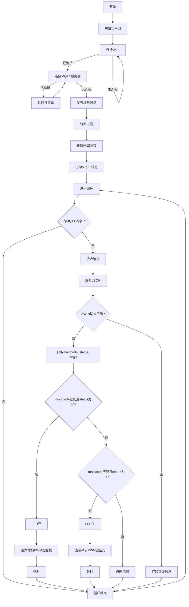
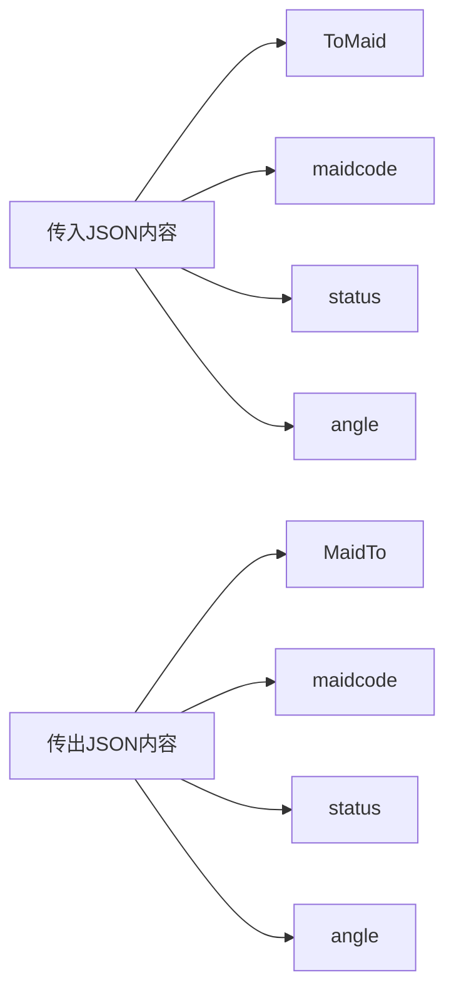

---
tags:
  - 综合项目
  - 项目历程模板
---
https://www.36kr.com/p/2230017692619906

# 1. 项目前言
本着以实际问题促进我的综合工程应用能力，一直在想一个能够联动机械、电气、计算机三大现代工科于一体的实际问题项目，并且能够赚点小外快。

>注意：在本次项目中你可以了解到以下内容

- 项目规划
- 低速LayOut设计
- PCB(A)制作
- 曲柄摆杆机构
- 材料&理论力学分析
- ESP系列开发
- Alot&RF控制

# 2. 项目目的

我们大学很多寝室晚上都可能忘记关灯，导致第二天被五点钟的等给亮醒的(比如我)。即使在床上想起来了这件事，我也不太想去关，因为往往那时候我都在补番呢！为了解决这么一个对我来说尤为致命的问题，故特地立项以解决。

【基本要求】
- 能够联网，接入MQTT服务，在手机上进行控制86面板进行灯的开关

【进阶要求】
- 设计AI开关功能：配合AI学习，感知用户的生活习惯。AI感知到用户夜晚进入房间时，自动下发开启命令使其受控开启


# 3. 项目要求


# 3. 项目调研

## 3.1 方案调查


| 链接    | 图片                                                                               | 优点                     | 缺点                       |
| ----- | -------------------------------------------------------------------------------- | ---------------------- | ------------------------ |
| 参考链接1 |  | 方案简单；开发简易；价钱实惠         | 完整性欠缺；断电无法工作；安装不便；适用范围小； |
| 参考链接2 |     | 适用简单；安装便捷；适用范围广；       | 价钱昂贵；不能联网；               |
| 参考链接3 |   | 结构简单；气动液压结构可以很方便的传递主动力 | 无法联网；控制方式单一；不够智能         |


- 【参考链接】
	- 参考链接1：[宿舍远程关灯神器 低成本 ESP8266 WIFI+舵机+blinker（无需改装电路）_esp8266关灯-CSDN博客](https://blog.csdn.net/weixin_53631107/article/details/136792642)
	- 参考链接2：[懒人开关神器 手指机器人 宿舍遥控关灯 免布线遥控开关 雏鹰智能 产品关键词:手指机器人开关;关灯机器人;懒人手指机器人;宿舍遥控开关;雏鹰遥控;雏鹰智能 (baidu.com)](https://b2b.baidu.com/land?id=662b5b34a1410c3ed9581bad50ab6d9b10)
	- 参考链接3：[大四女生发明“宿舍关灯神器”获国家专利|宿舍|关灯_新浪教育_新浪网 (sina.com.cn)](https://edu.sina.com.cn/l/2019-05-23/doc-ihvhiqay0469576.shtml)

## 3.2. 方案构建
>引言：下述三个方案，分别是复刻属性、改进属性、创新属性性质的，方案三为我独创（从开关开关为自旋运动受到启发），但是不确定性较大，实现难度方案一>方案二>方案三，下面我打算逐个逐个去实现


### 3.2.1. 摆杆方案

#### （1）硬件架构
##### 1）机械架构


【固定机构】
- 粘贴固定
<div style="display: grid; place-items: center;" ></div>


受到上图启发


- 夹持固定

<div style="display: grid; place-items: center;" ></div>


受到上图启发


【调整机构】
- 在固定方式上调整

- 移动动力机构调整


【动力机构】


【传动机构】
##### 2）电气架构

#### （2）软件架构


#### （3）系统逻辑


### 3.2.2. 气动方案


#### （1）硬件架构


#### （2）软件架构


#### （3）系统逻辑


### 3.2.3. 动量矩方案


#### （1）硬件架构

#### （2）软件架构

#### （3）系统逻辑


# 4. 项目推进

## 4.1. 硬件设计
>引言：在正式实施的过程中大家会遇上“先完成谁”这么一个问题，关于这个问题我一开始也没有头绪，所以我向AI进行了咨询
### 4.1.1 步骤分析
#### （1）需求分析

- **功能需求**：明确智能开关的基本功能，如远程控制、定时开关、场景模式等。
- **性能需求**：确定性能指标，如响应时间、耐用性、功耗等。
- **安全需求**：确保设计符合电气安全标准，避免短路、过载等风险。


#### （2）系统设计

- **模块化设计**：将系统分解为可管理的模块，如ESP01S最小系统、电池管理系统（BMS）、电机驱动系统等，便于逐步开发和测试。
- **接口设计**：定义各模块之间的接口，包括电气接口和机械接口，确保模块间能够正确连接和通信。

<div style="display: grid; place-items: center;" ></div>
<center>图：架构设计</center>

<div style="display: grid; place-items: center;" ></div>
<center>图：逻辑设计</center>

#### （3）优先级排序

- **核心功能优先**：先实现核心功能，如基本的开关控制和远程通信功能。
- **稳定性和安全性优先**：在开发初期，优先考虑系统的稳定性和安全性，特别是电气系统的电源管理和安全保护。

#### （4）开发顺序

- **机械系统**：
    - **灯座紧固机构**：首先设计和实现灯座紧固机构，确保灯具能够稳定安装。
    - **机械摆动机构**：接着设计机械摆动机构，实现开关的物理摆动功能。
- **电气系统**：
    - **ESP01S最小系统**：开发ESP01S最小系统，实现基本的通信功能。
    - **电池充放电管理**：设计电池管理系统，包括电池充放电管理，确保电源的稳定供应。
    - **BMS系统**：实现电池管理系统，监控电池状态，防止过充、过放和过热。
    - **电机驱动系统**：最后，开发电机驱动系统，控制机械摆动机构的动作。

#### （5）测试与验证

- **单元测试**：对每个模块进行单独测试，确保其功能正确。
- **集成测试**：将各模块集成后进行测试，验证模块间的接口和协同工作。
- **系统测试**：进行完整的系统测试，包括功能测试、性能测试和安全测试。

#### （6）迭代优化

- **收集反馈**：在测试过程中收集反馈，发现问题和不足。
- **优化设计**：根据反馈对设计进行优化，提升性能和用户体验。

#### （7）文档和维护

- **编写文档**：为系统编写详细的设计文档和用户手册。
- **维护更新**：在产品发布后，根据用户反馈进行维护和更新。


### 4.1.2 机械设计
#### （1）设计要求
- 基本要求：完成电机、PCBA、电池三者固定外壳的设计；完成电机直角曲柄摆动机构的设计


#### （2）器件选型
>引言：在明确设计要求后，依次单独考虑独立设计部分的器件选型

【驱动电机】：体积小、扭矩大、力效高、易控制
- SG90：易控制、易实现：根据转动的角速度减速量进行力反馈控制
- N20：体积小、扭矩大：能够很好的控制其体积
>考虑：优先考虑SG90因为能够实现基本全部功能

#### （3）结构设计
##### 1）思考路线
>引言：在明确元器件选取后，需要独立思考设计路线的选取，我认为先从重要的结构件开始，在往次要的结构件去过渡。
##### 2）固定结构

<center><b>图：第一版设计</b></center>

固定结构主要分为电机固定结构；PCBA固定结构；电池仓固定结构


<center>图：电机仓设计</center>


<center>图：PCBA&电池仓设计</center>


---
<center><b>第二版设计 2025.4.4.</b></center>

改进：第二版设计主要改进了电机仓和PCBA&电池仓的对接设计方案，在上一版本方案中，由于对接矩形突出部分宽度过小，导致其在拔插次数过多时发生了因强度不够断裂的情况。且上一版本整体外壳过于楞正，不太符合美学设计以及人机工程学，为此加入了一些圆角过渡设计


##### 3）摆臂结构


### 4.1.3 电气设计

#### （1）设计要求

- 基本要求：满足空间限制；利用现有零件；完成最小系统设计；完成SG90驱动电路设计；完成充放电电路设计；
	【供电电路要求】抗干扰；器件少；2A大电流
	【最小系统要求】
	【驱动电路要求】
	【充放电路要求】充电指示灯；外围器件少；器件价格便宜；支持充放一体

- 进阶要求：能够支持WIFI连接；增加红外IR功能

#### （2）器件选型
【MCU】
要求：

- ESP12F：IO多；体积大；成本高；资料多
- ESP01S：IO少；体积小；成本低；资料多
- ESP8265：IO多；体积小；成本小；资料少

>考虑：优先考虑ESP01S实现其次是ESP8265再是ESP12F(8265与01S同体积)

【驱动IC】由于SG90内部自带驱动IC，故不需考虑

【充电IC】
要求：由于体积有限，所以要求尽可能少的外围元件，且要求低静态功耗

选型：初步筛选，符合条件的有以下芯片
- TP5400：充放及升压一体芯片；升压到5V（超出ESP01S承受范围）
- IP3012A：充放管理芯片；SOT23-5封装；无电量指示；
- XB5306A：充放管理芯片；SOT23-6封装；无电量指示；

>考虑：TP5400本能实现更少的外围元件，但不巧的是是升压到5V而非3.3V，MCU仍然需要一枚LDO进行降压，增加了外围元件。考虑IP3012A为先，再是XB5306A


【电池】
要求：符合V2版本外壳下图所示的尺寸要求，即41.85mmx18mm要求，考虑体积冗余量，则要求投影尺寸小于40mmx18mm


 选型：在[厚度5MM 全系列电池 502030 523450智能玩具电子充电聚合物锂电池 ](https://detail.1688.com/offer/654927861502.html?tracelog=p4p&spm=a26352.13672862.offerlist.1.db4f1e62Xg5ZTN&clickid=e5bf0a214e194fce905dd4c35d304a56&sessionid=53b57eaa0063b3548d55fdb40e40e485&_p_isad=1)中选型，初步筛选，符合条件的有以下型号

| 电池型号   | 容量 (mAh) | 尺寸 (mm)   | 认证      | 循环次数 |
| ------ | -------- | --------- | ------- | ---- |
| 500930 | 100mAh   | `5*9*30`  | MSDS    | 300周 |
| 500935 | 130mAh   | `5*9*35`  | MSDS    | 300周 |
| 501015 | 50mAh    | `5*10*15` | MSDS    | 300周 |
| 501020 | 70mAh    | `5*10*20` | MSDS    | 300周 |
| 501025 | 100mAh   | `5*10*25` | MSDS    | 300周 |
| 501030 | 110mAh   | `5*10*30` | MSDS    | 300周 |
| 501040 | 180mAh   | `5*10*40` | MSDS    | 300周 |
| 501055 | 230mAh   | `5*10*55` | MSDS    | 300周 |
| 501220 | 90mAh    | `5*12*20` | MSDS    | 300周 |
| 501225 | 110mAh   | `5*12*25` | MSDS    | 300周 |
| 501230 | 150mAh   | `5*12*30` | MSDS    | 300周 |
| 501235 | 150mAh   | `5*12*35` | MSDS    | 300周 |
| 501240 | 200mAh   | `5*12*40` | MSDS    | 300周 |
| 501245 | 250mAh   | `5*12*45` | MSDS    | 300周 |
| 501430 | 180mAh   | `5*14*30` | MSDS    | 300周 |
| 501440 | 300mAh   | `5*14*40` | MSDS    | 300周 |
| 501535 | 230mAh   | `5*15*35` | MSDS    | 300周 |
| 501646 | 380mAh   | `5*16*46` | MSDS    | 300周 |
| 501730 | 180mAh   | `5*17*30` | MSDS    | 300周 |
| 501735 | 250mAh   | `5*17*35` | MSDS    | 300周 |
| 502020 | 150/180  | `5*20*20` | MSDS    | 300周 |
| 502025 | 200mAh   | `5*20*25` | MSDS    | 300周 |
| 502030 | 250mAh   | `5*20*30` | 3C MSDS | 300周 |
| 502035 | 300mAh   | `5*20*35` | MSDS    | 300周 |
| 502040 | 400mAh   | `5*20*40` | MSDS    | 300周 |
| 502050 | 500mAh   | `5*20*50` | MSDS    | 300周 |
| 502248 | 500mAh   | `5*22*48` | MSDS    | 300周 |
| 502530 | 300mAh   | `5*25*30` | MSDS    | 300周 |
>**考虑:** 在满足尺寸要求的情况下，选择容量越大的为佳，一来是工作时间边长，二来是较长的使用寿命。所以最终选择 501340 300Mah 这么一个型号


- 【相关资料】
	- [[2.工学类/自动类/嵌入式类/ARM/ESP/ESP/ESP01S]]/[ESP-01S_Ai-Thinker(安信可)_ESP-01S中文资料_PDF手册_价格-立创商城 (szlcsc.com)](https://item.szlcsc.com/516229.html)
	
	- [TP5400_TOPPOWER(南京拓微)_TP5400中文资料_PDF手册_价格-立创商城 (szlcsc.com)](https://item.szlcsc.com/24894.html)
	- [IP3012A_INJOINIC(英集芯)_IP3012A中文资料_PDF手册_价格-立创商城 (szlcsc.com)](https://item.szlcsc.com/635669.html)
	- [XB5306A_xysemi(赛芯微)_XB5306A中文资料_PDF手册_价格-立创商城 (szlcsc.com)](https://item.szlcsc.com/196509.html)


#### （3）原理图设计
##### 1）思考路线

【按照实现功能前后】
- 先依据选取的元件找参考电机驱动电路，解读参考电路后，根据需要迁移设计本次驱动电路<label class="ob-comment" title="" style=""> 原理图 <input type="checkbox"> <span style=""> Comment </span></label>，设计好了后(可选进行仿真)在面包板上进行分立元件搭建试验电路
- 先依据选取的元件找参考充电电路，解读参考电路后，根据需要迁移设计本次充电电路<label class="ob-comment" title="" style=""> 原理图 <input type="checkbox"> <span style=""> Comment </span></label>，设计好了后(可选进行仿真)在面包板上进行分立元件搭建试验电路
- 将两个分立电路进行合并，在同一块面包板上对该两个电路进行测试验证，验证无问题后进行PCB的设计
【按照实际设计前后】
- 先设计电源路径
<div style="display: grid; place-items: center;" ></div>
<center>图：电流路径</center>
- 在设计功能实现
- 在进行元件选型

##### 2）充放部分

1. 查阅分析充放IC手册示例电路
<div style="display: grid; place-items: center;" ></div>
<center>图：IP3012A手册参考充放电路原理图</center>
【解读】
- 充电：
	- IP3012一路电流分支从P+-->R1-->VDD-->VM-->P-
	- Battery一路电流分支从P+-->Battery-->GND--IP3012A-->VM--P-（IP3012通过VDD与VS检测Battery的电压控制GND-VM端的等效阻抗改变其充电电流）
- 放电
	- IP3012一路电流分支从Battery(+)-->R1-->VDD-->GND-->Battery(-)
	- 负载一路电流分支从Battery(+)-->P+-->P- --> VM -->IP3012A-->GND-->Battery(-)（IP3012通过VDD与VS检测Battery的电压控制GND-VM端的等效阻抗改变其放电电流）
- 总结：IP3012通过控制GND-VM的等效阻值以及通断来改变充放电流的


2. 嘉立创复刻+修改电路


<div style="display: grid; place-items: center;" ></div>
<center>图：第一版充放电路原理图</center>


【解读】主要充放电部分保持不变，增加一路充电(0603LED元件)指示灯电路，R7用于限流用
【犯错】无论是否充电，指示灯都能够亮起
【思考】充电不充电引起的电路状态是电流路径的改变，而电流路径的改变会引起电压下降的方向改变。有这个分析可以在记忆中联想到还需要增加一个二极管来防止电池在断开电源后继续向该LED供电。

>注意：在画完后自己先进行电路解读看看有没有明显的错误(原理错误、绘制错误等)，以免等到仿真再来返工

---


<div style="display: grid; place-items: center;" ></div>
<center>图：第二版充放电路原理图参考</center>
【解读】
- 充电：先判管型：PNP-->判放大类型：共射放大-->判偏置状态，$U_{eb}<0V$为反偏，$U_{ec}>0V$为正偏，PNP管导通，be脚间仅存在导通压降。


<center>图：第二版充放电路原理图</center>

【解读】充电时红灯亮起，不充电时红灯关闭
【问题】1N5406体积过大，改换1N55819，且该电路不支持充满灭掉指示灯；
【思考】存不存在一种方法使得能够达到充满绿灯亮，未充满红灯亮呢？或许我们可以用借用逻辑关系图进行模电设计的指导？下面我们在第三版电路中探索一下


---


<center>图：第三版充放电路原理图逻辑思考</center>


<center>图：第三版充放电路原理图</center>


<center>图7：第三版充放电路原理图</center>
【解读】该版本电路实现了充电启停，但是有一个缺点就是，得加入一个开关额外控制指示电路的通断，引入MOS管控制通断发现太麻烦了，故做出一定的妥协


【资料】
- [单节锂电池低电量指示电路 - 知乎 (zhihu.com)](https://zhuanlan.zhihu.com/p/565857871)
- [分立元件实现充电器充满变灯电路图](http://www.360doc.com/content/24/0103/22/34440103_1109766935.shtml)

##### 3）电源部分

【0603LED参数】


【1N5406参数】


【2N5401参数】


##### 4）整体预览

##### 5）后续改进

#### （4）电路仿真
>引言：仿真可以帮我们快速的验证电路原理图设计是否有问题，如果有设计问题可以及时去解决。试想一下，当你打板完成后你才发现原理设计错误导致PCBA无法正常工作，这个时候再去返工，在财力物力人力上都是一笔巨大的消耗。
##### 1）指示灯电路
###### 1. V1版本仿真


###### 2. V2版本仿真


<center>图7：第三版充放电路原理图</center>


#### （5）PCB设计
##### 1）设计要求
1. 确定板框尺寸：在Solidworks中查看固定结构可容纳空间为32.40x19.80mm，由于单层PCB尺寸较薄，即使不测量深度也有空余空间

2. 确定元件布局：
- 分析功能模块：MCU部分/充电管理部分/供电部分
- 摆放功能模块：


【参考连接】
- [15个PCB布局技巧，图文+案例，通俗易懂，带你轻松搞定PCB布局 - 知乎 (zhihu.com)](https://zhuanlan.zhihu.com/p/595140834)
- [PCB这样布局秘籍！附：PCB设计指南：安规、布局布线、EMC、热设计、工艺-电子工程专辑 (eet-china.com)](https://www.eet-china.com/mp/a54717.html)
3. 确定元件布线：
4. 修缮PCB设计：
5. 检查设计缺陷：


## 4.2. 程序设计
>注意：此步骤本应该在硬件设计完成后进行，但是由于PCBA制作出现了点问题，故提前开发。且需要知道的是，在本章节中前端与后端的开发通常是并列进行的

<div style="display: grid; place-items: center;" ></div>
<center>图4-1-1-2-2：逻辑设计</center>


### 4.2.1. 底层代码
#### （1）设计要求
【基本功能】实现受控用户开关指令动作点击，并且返回动作消息；受控于AI完成AI指令响应并返回响应结果。

【用户人群】人类用户/AI
- 对于面向用户设计：通过ESP8266模块接入WIFI网络，并与MQTT服务器建立连接，在Home Assistant构建MQTT灯光开关控制实例，通过发布灯光的开/关状态和命令主题，来控制继电器吸合/释放，实现对灯光的开/关控制。

<center>图4-1-2-1-2：MQTT与Homeassitant的交互</center>

---


- 对于面向AI设计：Home Assistant 从 2024.6 版本开始，正式支持与 AI 代理的集成，允许通过大型语言模型（LLM）如 Google Gemini 和 OpenAI ChatGPT 来控制智能家居设备。这些 AI 代理可以通过 Home Assistant 的 Assist API 与设备交互，支持语音控制和自动化脚本中的决策逻辑


#### （2）技术评判


【参考链接】
- [基于树莓派的智能家居中控系统：集成Flask、HTML、JavaScript与MQTT协议的文心一言AI接入（代码示例）_树莓派智能家居中控-CSDN博客](https://blog.csdn.net/qq_40431685/article/details/140879002)
- [【智能家居HA】ESP8266通过MQTT接入Home Assistant-CSDN博客](https://blog.csdn.net/qq_44086628/article/details/145169745)
- [ESP8266通过MQTT接入Home Assistant实践_esp8266 honeass-CSDN博客](https://blog.csdn.net/qq_31400983/article/details/128967768)
#### （3）程序拓补
##### 1）流程图

1. 【实现ESP01S与EMQX的基本交互】



<center>图4-1-2-1-3-1-1：ESP01S代码流程图</center>


2. 实现接受 AI 控制方案


##### 2）消息体
>引言：之所以要做这么一步是因为我需要给每一个开关姬构建一个JSON类标准，声明一套用于控制它的消息，有些人可能会说直接一个键名state，然后配上off或则on不就好了吗？是的，一个Switchmaid可以，如果有多个呢？我想要控制转不同的角度呢——为此制定一个结构合理的JSON结构是有必要的





<center>图2：MQTT与Homeassitant的交互</center>


##### 3）主程序
【参考链接】
- [ESP8266通过MQTT接入Home Assistant实践_esp8266 honeass-CSDN博客](https://blog.csdn.net/qq_31400983/article/details/128967768)
- [基于HomeAssitant的MQTT协议，设计插座、通断器，传感器方案，要求完全兼容HomeAssitant的MQTT协议_智能插座用到的mqtt服务-CSDN博客](https://blog.csdn.net/qq_41126242/article/details/144214680)


>初版代码


```c++
#include <ESP8266WiFi.h>

#include <PubSubClient.h> // 引入

#include <ArduinoJson.h> // 引入ArduinoJson库,解析JSON用

  

WiFiClient espClient;

PubSubClient client(espClient);

  
  

// GPIO Pin Configuration

#define PWM_Pin 0 // corresonding GPIO 0 as the PWM_PIN

  

// Maid Property

String maidcode="01"; //swithing maid code number

  

// WiFi

const char *ssid = "TP-LINK_39A2"; // Enter your WiFi name

const char *password = "nie88888888";  // Enter WiFi password

  

// MQTT Server

const char *mqtt_broker = ""; //MQTT服务器的IPV4地址，不需要加http前缀

const int mqtt_port = 1883;                //MQTT服务器的IPV4地址开放端口

  
  

// MQTT User

// 用于改写的String类

String mqtt_username_str = "swithingmaid" + maidcode;

String mqtt_password_str = "swithingmaid" + maidcode;

String topic_str = "swithing_maid_" + maidcode + "_state";

// 实际传入函数的字符串指针变量

const char *mqtt_username = mqtt_username_str.c_str();  //调用.c_str()方法把字符串变为字符串指针

const char *mqtt_password = mqtt_password_str.c_str();

const char *topic = topic_str.c_str();

  
  
  

  

long int currentMillis=0;

long int period_ms=0;

long int Task_curentMillis=0;

bool ledState =false;

  
  

void callback(char *topic, byte *payload, unsigned int length);         // 回调函数，用于Loop消息函数的回调处理

  
  
  

void setup() {  

    //setup阶段做一些前提准备

    Serial.begin(115200); // Set software serial baud to 115200;

    delay(1000);          // Delay for stability

  

    // Connecting to a WiFi network

    WiFi.begin(ssid, password);

    while (WiFi.status() != WL_CONNECTED) {

        delay(500);

        Serial.println("Connecting to WiFi...");

    }

    Serial.println("Connected to the WiFi network");

  

    // Connecting to an MQTT broker

    client.setServer(mqtt_broker, mqtt_port);  // 设置IPV4地址及端口并尝试连接目标MQTT Server

    while (!client.connected())

    {

        String client_id = "ESP01S";

        client_id += String(WiFi.macAddress());

        Serial.printf("The client %s connects to the public MQTT broker\n", client_id.c_str()); //client_id.c_str()

  

        if (client.connect("ESP01S", mqtt_username, mqtt_password)) {

            Serial.println("Public EMQX MQTT Server connected");

            client.publish(topic, "swithing maid is ready"); //发布主题

            client.subscribe(topic);             //订阅主题

            client.setCallback(callback);        //设置对订阅主题新消息的回调处理函数

  

            // 打印调试信息

            Serial.print("MQTT Username: ");

            Serial.println(mqtt_username);

            Serial.print("MQTT Password: ");

            Serial.println(mqtt_password);

            Serial.print("MQTT Topic: ");

            Serial.println(topic);

        } else {

            Serial.print("Failed with state ");

            Serial.print(client.state());

            delay(2000);

        }

    }

  

}

  
  

void loop()

{

    client.loop();// 周期性处理 MQTT 客户端的网络通信和消息维护，如果有消息则会调用一次回调函数

    delay(100); // Delay for a short period in each loop iteration

}

  
  

//The parameters of the callback function are passed in automatically

void callback(char *topic, byte *payload, unsigned int length)

{

    // Notice the message is received by maid

    Serial.print("Message arrived\n");    

  

    // Start Receive the message

    String message;                  //message用于所订阅接收目标主题的状态消息

    for (int i = 0; i < length; i++)

    {

        message += (char) payload[i]; // Convert *byte to string

    }

    Serial.println("Message is"+message);  

  

    // Analysis the received message

    StaticJsonDocument<200> jsonDoc;   // 创建200字节大小的jsonDoc对象，用于存储解析后的JSON数据

    deserializeJson(jsonDoc, message); // 解析这个message字符串，并将结果存储在 jsonDoc

  

    // Judge if jsonDoc has the correct format data like standard json data,then process the mission  

    // used json data content sample

    //

    // {

    //  "maidcode":"01",

    //  "status":"on",

    //  "angle":0

    // }

  

    if (jsonDoc.is<JsonObject>())

    {

        JsonObject jsonObj = jsonDoc.as<JsonObject>();

        const char* recieved_maid_code = jsonObj["maidcode"];

        const char* recieved_maid_status=jsonObj["status"];

        const char* recieved_maid_rotate_angle=jsonObj["angle"];

  
  

        if (strcmp(recieved_maid_code, maidcode.c_str()) == 0 &&strcmp(recieved_maid_status, "on")==0 ) // Notice：strcmp匹配完全相同才返回0

        {

           Serial.print("on");

           for(int dutyCycle = 0; dutyCycle < 1023; dutyCycle++)

           {

            analogWrite(PWM_Pin, 200);

            delay(1);

           }

        } else if (strcmp(recieved_maid_code, maidcode.c_str()) == 0 && strcmp(recieved_maid_status, "off")==0)

        {

           Serial.print("off");

           for(int dutyCycle = 0; dutyCycle < 1023; dutyCycle++)

           {

            analogWrite(PWM_Pin, 128);

            delay(1);

           }

        }

    }

}
```

>问题一修正代码

```cpp
#include <ESP8266WiFi.h>

#include <PubSubClient.h>  // 引入

#include <ArduinoJson.h>   // 引入ArduinoJson库,解析JSON用

  

WiFiClient espClient;

PubSubClient client(espClient);

  
  

// GPIO Pin Configuration

#define PWM_Pin 0  // corresonding GPIO 0 as the PWM_PIN

  

// Maid Property

String maidcode = "01";  //swithing maid code number

  

// WiFi

const char *ssid = "zte-谢2";          // Enter your WiFi name

const char *password = "xie88888888";  // Enter WiFi password

  

// MQTT Server

const char *mqtt_broker = "47.94.167.240";  //MQTT服务器的IPV4地址，不需要加http前缀

const int mqtt_port = 1883;                 //MQTT服务器的IPV4地址开放端口

  
  

// MQTT User

// 用于改写的String类

String mqtt_username_str = "swithingmaid" + maidcode;

String mqtt_password_str = "swithingmaid" + maidcode;

String topic_str = "switching_maid_" + maidcode + "_state";

// 实际传入函数的字符串指针变量

const char *mqtt_username = mqtt_username_str.c_str();  //调用.c_str()方法把字符串变为字符串指针

const char *mqtt_password = mqtt_password_str.c_str();

const char *topic = topic_str.c_str();

  
  
  
  
  

long int currentMillis = 0;

long int period_ms = 0;

long int Task_curentMillis = 0;

bool ledState = false;

  
  

void callback(char *topic, byte *payload, unsigned int length);  // 回调函数，用于Loop消息函数的回调处理

float angle_to_passedvalue(char angle);

  

void setup() {

  // setup阶段做一些前提准备

  Serial.begin(115200);  // Set software serial baud to 115200;

  delay(1000);           // Delay for stability

  

  // 摆臂复位

  analogWrite(PWM_Pin, angle_to_passedvalue(90));

  

  // Connecting to a WiFi network

  WiFi.begin(ssid, password);

  while (WiFi.status() != WL_CONNECTED) {

    delay(500);

    Serial.println("Connecting to WiFi...");

  }

  Serial.println("Connected to the WiFi network");

  

  // Connecting to an MQTT broker

  client.setServer(mqtt_broker, mqtt_port);  // 设置IPV4地址及端口并尝试连接目标MQTT Server

  while (!client.connected()) {

    String client_id = "ESP01S";

    client_id += String(WiFi.macAddress());

    Serial.printf("The client %s connects to the public MQTT broker\n", client_id.c_str());  //client_id.c_str()

  

    if (client.connect("ESP01S", mqtt_username, mqtt_password)) {

      Serial.println("Public EMQX MQTT Server connected");

  

      client.publish(topic, "swithing maid is ready");  //发布主题

      client.subscribe(topic);                          //订阅主题

      client.setCallback(callback);                     //设置对订阅主题新消息的回调处理函数

  

      // 打印调试信息

      Serial.print("MQTT Username: ");

      Serial.println(mqtt_username);

      Serial.print("MQTT Password: ");

      Serial.println(mqtt_password);

      Serial.print("MQTT Topic: ");

      Serial.println(topic);

  

    } else {

      Serial.print("Failed with state ");

      Serial.print(client.state());

      delay(2000);

    }

  }

}

  
  

void loop() {

  client.loop();  // 周期性处理 MQTT 客户端的网络通信和消息维护，如果有消息则会调用一次回调函数

  delay(100);     // Delay for a short period in each loop iteration

}

  
  

//The parameters of the callback function are passed in automatically

void callback(char *topic, byte *payload, unsigned int length) {

  

  // Notice the message is received by maid

  Serial.print("Message arrived\n");

  

  // Start Receive the message

  String message;  //message用于所订阅接收目标主题的状态消息

  for (int i = 0; i < length; i++) {

    message += (char)payload[i];  // Convert *byte to string

  }

  Serial.println("Message is" + message);

  

  // Analysis the received message

  StaticJsonDocument<200> jsonDoc;    // 创建200字节大小的jsonDoc对象，用于存储解析后的JSON数据

  deserializeJson(jsonDoc, message);  // 解析这个message字符串，并将结果存储在 jsonDoc

  

  // Judge if jsonDoc has the correct format data like standard json data,then process the mission

  // used json data content sample

  //

  // {

  //  "maidcode":"01",

  //  "status":"on",

  //  "angle":0

  // }

  

  if (jsonDoc.is<JsonObject>())  // 判断转换后的消息是否符合Json类格式

  {

    JsonObject jsonObj = jsonDoc.as<JsonObject>();

    const char *recieved_maid_code = jsonObj["maidcode"];

    const char *recieved_maid_status = jsonObj["status"];

    const char *recieved_maid_rotate_angle = jsonObj["angle"];

  
  

    if (strcmp(recieved_maid_code, maidcode.c_str()) == 0 && strcmp(recieved_maid_status, "on") == 0)  // Notice：strcmp匹配完全相同才返回0

    {

      Serial.print("on");

      analogWrite(PWM_Pin, angle_to_passedvalue(180));  // UNO 的 analogWrite() 使用 8-bit 分辨率（0-255），非 10-bit（0-1023）

      delay(1000);                                      // 延时的单位为ms,计算参考图

      analogWrite(PWM_Pin, angle_to_passedvalue(90));

  
  

    } else if (strcmp(recieved_maid_code, maidcode.c_str()) == 0 && strcmp(recieved_maid_status, "off") == 0) {

      Serial.print("off");

      analogWrite(PWM_Pin, angle_to_passedvalue(0));

      delay(1000);

      analogWrite(PWM_Pin,angle_to_passedvalue(90));

    }

  }

}

  
  

/*

  

*/

  

float angle_to_passedvalue(char angle) {

  return (51.0 / 20.0) * (1.0 / 18.0 * angle + 2.5); //Notice：若为(51/20)*(1/18*angle+2.5)则会发生整型运算截断现象造成计算错误，这是一个大坑

}
```

>问题二修正代码

```cpp
#include <ESP8266WiFi.h>

#include <PubSubClient.h>  // 引入

#include <ArduinoJson.h>   // 引入ArduinoJson库,解析JSON用

#include <Servo.h>

WiFiClient espClient;

PubSubClient client(espClient);

  
  

// GPIO Pin Configuration

#define PWM_Pin 0  // corresonding GPIO 0 as the PWM_PIN

  

// Maid Property

String maidcode = "01";  //swithing maid code number

  

// WiFi

const char *ssid = "zte-谢2";          // Enter your WiFi name

const char *password = "xie88888888";  // Enter WiFi password

  

// MQTT Server

const char *mqtt_broker = "47.94.167.240";  //MQTT服务器的IPV4地址，不需要加http前缀

const int mqtt_port = 1883;                 //MQTT服务器的IPV4地址开放端口

  
  

// MQTT User

// 用于改写的String类

String mqtt_username_str = "swithingmaid" + maidcode;

String mqtt_password_str = "swithingmaid" + maidcode;

String topic_str = "switching_maid_" + maidcode + "_state";

// 实际传入函数的字符串指针变量

const char *mqtt_username = mqtt_username_str.c_str();  //调用.c_str()方法把字符串变为字符串指针

const char *mqtt_password = mqtt_password_str.c_str();

const char *topic = topic_str.c_str();

  
  
  
  
  

long int currentMillis = 0;

long int period_ms = 0;

long int Task_curentMillis = 0;

bool ledState = false;

  

Servo myServo;

  

void callback(char *topic, byte *payload, unsigned int length);  // 回调函数，用于Loop消息函数的回调处理

  

//弃用代码

//float angle_to_passedvalue(char angle);

  
  
  
  
  

void setup() {

  // 设定串口波特率

  Serial.begin(115200);  // Set software serial baud to 115200;

  delay(1000);           // Delay for stability

  

  // 设定PWM引脚，重置引脚位

  myServo.attach(PWM_Pin);

  delay(1000);

  myServo.write(90);

  

  // Connecting to a WiFi network

  WiFi.begin(ssid, password);

  while (WiFi.status() != WL_CONNECTED) {

    delay(500);

    Serial.println("Connecting to WiFi...");

  }

  Serial.println("Connected to the WiFi network");

  

  // Connecting to an MQTT broker

  client.setServer(mqtt_broker, mqtt_port);  // 设置IPV4地址及端口并尝试连接目标MQTT Server

  while (!client.connected())

   {

    String client_id = "ESP01S";

    client_id += String(WiFi.macAddress());

    Serial.printf("The client %s connects to the public MQTT broker\n", client_id.c_str());  //client_id.c_str()

  

    if (client.connect("ESP01S", mqtt_username, mqtt_password)) {

      Serial.println("Public EMQX MQTT Server connected");

  

      client.publish(topic, "swithing maid is ready");  //发布主题

      client.subscribe(topic);                          //订阅主题

      client.setCallback(callback);                     //设置对订阅主题新消息的回调处理函数

  

      // 打印调试信息

      Serial.print("MQTT Username: ");

      Serial.println(mqtt_username);

      Serial.print("MQTT Password: ");

      Serial.println(mqtt_password);

      Serial.print("MQTT Topic: ");

      Serial.println(topic);

  

    } else {

      Serial.print("Failed with state ");

      Serial.print(client.state());

      delay(2000);

    }

  }

  
  
  
  

}

  
  

void loop() {

  client.loop();  // 周期性处理 MQTT 客户端的网络通信和消息维护，如果有消息则会调用一次回调函数

  delay(100);     // Delay for a short period in each loop iteration

}

  
  

//The parameters of the callback function are passed in automatically

void callback(char *topic, byte *payload, unsigned int length) {

  

  // Notice the message is received by maid

  Serial.print("Message arrived\n");

  

  // Start Receive the message

  String message;  //message用于所订阅接收目标主题的状态消息

  for (int i = 0; i < length; i++) {

    message += (char)payload[i];  // Convert *byte to string

  }

  Serial.println("Message is" + message);

  

  // Analysis the received message

  StaticJsonDocument<200> jsonDoc;    // 创建200字节大小的jsonDoc对象，用于存储解析后的JSON数据

  deserializeJson(jsonDoc, message);  // 解析这个message字符串，并将结果存储在 jsonDoc

  

  // Judge if jsonDoc has the correct format data like standard json data,then process the mission

  // used json data content sample

  //

  // {

  //  "maidcode":"01",

  //  "status":"on",

  //  "angle":0

  // }

  

  if (jsonDoc.is<JsonObject>())  // 判断转换后的消息是否符合Json类格式

  {

    JsonObject jsonObj = jsonDoc.as<JsonObject>();

    const char *recieved_maid_code = jsonObj["maidcode"];

    const char *recieved_maid_status = jsonObj["status"];

    const char *recieved_maid_rotate_angle = jsonObj["angle"];

  
  

    if (strcmp(recieved_maid_code, maidcode.c_str()) == 0 && strcmp(recieved_maid_status, "on") == 0)  // Notice：strcmp匹配完全相同才返回0

    {

      Serial.print("on");

  

      //弃用代码

      //analogWrite(PWM_Pin, angle_to_passedvalue(180));  // UNO 的 analogWrite() 使用 8-bit 分辨率（0-255），非 10-bit（0-1023）

      //delay(1000);                                      // 延时的单位为ms,计算参考图

      //analogWrite(PWM_Pin, angle_to_passedvalue(90));

      myServo.write(180);

      delay(1000);

      myServo.write(90);

  
  
  

    } else if (strcmp(recieved_maid_code, maidcode.c_str()) == 0 && strcmp(recieved_maid_status, "off") == 0) {

      Serial.print("off");

      //弃用代码

      //analogWrite(PWM_Pin, angle_to_passedvalue(0));

      //delay(1000);

      //analogWrite(PWM_Pin,angle_to_passedvalue(90));

      myServo.write(0);

      delay(1000);

      myServo.write(90);

  

    }

  }

}

  
  

// 弃用代码

// float angle_to_passedvalue(char angle) {

//   return (51.0 / 20.0) * (1.0 / 18.0 * angle + 2.5); //Notice：若为(51/20)*(1/18*angle+2.5)则会发生整型运算截断现象造成计算错误，这是一个大坑

// }
```


【问题集锦】

- **问题描述**：将开关动作部分代码改成如下后，电机始终无动作
```cpp
        if (strcmp(recieved_maid_code, maidcode.c_str()) == 0 &&strcmp(recieved_maid_status, "on")==0 ) // Notice：strcmp匹配完全相同才返回0

        {

           Serial.print("on");

           analogWrite(PWM_Pin,90/180*0.125*256-1); // UNO 的 analogWrite() 使用 8-bit 分辨率（0-255），非 10-bit（0-1023）

           delay(1000);              // 延时的单位为ms

           analogWrite(PWM_Pin,180/180*0.125*256-1);

  
  

        } else if (strcmp(recieved_maid_code, maidcode.c_str()) == 0 && strcmp(recieved_maid_status, "off")==0)

        {

           Serial.print("off");

           analogWrite(PWM_Pin, 0);

           delay(1000);

           analogWrite(PWM_Pin, 127);

  

        }
```
- **问题分析**：误认为电机满偏为100%占空比，但是实则不是，参考下方手册，我们需要根据传入的角度正确得到需要传入analogWrite函数的数值，为此我们需要计算角度-占空比-传参数值间的线性变换函数(本次使用的是180°舵机)


- **方案尝试**:计算出正确的$f(x)=y$(x为角值，y为传入函数的函数值)进行代码修正

>计算过程


>Ps:应为180°对应12.5%，此处犯了一个抄写错误，下图为修正后的计算过程


再修正：

>代码实现


```cpp
    if (strcmp(recieved_maid_code, maidcode.c_str()) == 0 && strcmp(recieved_maid_status, "on") == 0)  // Notice：strcmp匹配完全相同才返回0

    {

      Serial.print("on");

      analogWrite(PWM_Pin, angle_to_passedvalue(180));  // UNO 的 analogWrite() 使用 8-bit 分辨率（0-255），非 10-bit（0-1023）

      delay(1000);                                      // 延时的单位为ms,计算参考图

      analogWrite(PWM_Pin, angle_to_passedvalue(90));

  
  

    } else if (strcmp(recieved_maid_code, maidcode.c_str()) == 0 && strcmp(recieved_maid_status, "off") == 0) {

      Serial.print("off");

      analogWrite(PWM_Pin, angle_to_passedvalue(0));

      delay(1000);

      analogWrite(PWM_Pin,angle_to_passedvalue(90));

    }

float angle_to_passedvalue(char angle) {

  return (51.0 / 20.0) * (1.0 / 18.0 * angle + 2.5); //Notice：若为(51/20)*(1/18*angle+2.5)则会发生整型运算截断现象造成计算错误，这是一个大坑

}
```


- **方案检验**:待机角度为90°占空比约为8.0%，这里因为示波器分辨率极限问题，视为测量精度引起的系统误差


---
- 问题描述：电机占空比正确但是仍然无法执行动作
- 问题分析：因为在前面的实现中，除了考虑到占空比因素外还有一个周期因素没有考虑，默认analogyWrite函数周期是1ms，但是电机控制要求20ms的周期。因此我们需要在保证占空比正确的同时调整周期
- 方案尝试：主要有三个方案，一、调用Servo库；二、修改analogyWrite使用的时钟频率；三、手动添加delay函数延长周期。在这里我选择方案一，以下是修改的代码行。
```cpp
    if (strcmp(recieved_maid_code, maidcode.c_str()) == 0 && strcmp(recieved_maid_status, "on") == 0)  // Notice：strcmp匹配完全相同才返回0

    {

      Serial.print("on");

  

      //弃用代码

      //analogWrite(PWM_Pin, angle_to_passedvalue(180));  // UNO 的 analogWrite() 使用 8-bit 分辨率（0-255），非 10-bit（0-1023）

      //delay(1000);                                      // 延时的单位为ms,计算参考图

      //analogWrite(PWM_Pin, angle_to_passedvalue(90));

      myServo.write(180);

      delay(1000);

      myServo.write(90);

  
  
  

    } else if (strcmp(recieved_maid_code, maidcode.c_str()) == 0 && strcmp(recieved_maid_status, "off") == 0) {

      Serial.print("off");

      //弃用代码

      //analogWrite(PWM_Pin, angle_to_passedvalue(0));

      //delay(1000);

      //analogWrite(PWM_Pin,angle_to_passedvalue(90));

      myServo.write(0);

      delay(1000);

      myServo.write(90);

  

    }
```

- 方案验证：舵机能够正常进行动作，问题解决


---


【参考链接】
- [SG90舵机 | 立创开发板技术文档中心 (lckfb.com)](https://wiki.lckfb.com/zh-hans/gd32e230c8t6/module/control/sg90-steering-engine.html)
- [单片机——SG90舵机工作原理-CSDN博客](https://blog.csdn.net/qq_41873236/article/details/116353829)
- [arduino配置pwm输出频率 - CSDN文库](https://wenku.csdn.net/answer/976e7babee1d4c7e91adb3852f1cc2fc)
- 

##### 4）后续改进
【改进方向】
- [x] 支持客户端修改正反转角度——在实现自动计算偏转角度前使得客户端可以根据实际需要修改手动偏转角度


- [ ] 增加状态匹配——使得面板指示的开启与关闭状态与实际的开启关闭状态对应，避免面板上指示的是关闭，但是实际执行下去的效果确是开启的状况发生
- [ ] 增加自适应动作角度算法——避免因为写死角度造成适配性差，不够灵活的问题
- [ ] 增加图形化配网界面——降低用户配网难度
- [ ] 增加对AI控制的支持——使得AI能够操控该物理设备


【问题集锦】
- 问题描述：第一个改进新增代码行无法完成对JSON对象整数值的解析


```cpp
    const int recieved_maid_rotate_angle = jsonObj["angle"].as<int>();

    Serial.println(recieved_maid_rotate_angle);
```

- 问题分析：在PC端使用MQTTX客户端发送相同的JSON消息，发现能够解析，推测是HomeAssitant自动化逻辑中的JSON消息格式有问题，初步断定为因为存在注释造成该问题
- 方案尝试：在HomeAssitant的自动化逻辑中删掉JSON的注释，从下第一图改为下第二图


- 方案验证：数值解析正常


#### （2）后端开发
>引言：云服务是作为连接用户与硬件的中转站，也是连接AI与硬件的中转站。前面完成了底层代码的初步编写，下面我们来完善云端服务的部署以及配置


<center>图4-1-2-2-1：云上服务角色作用</center>
【前置知识】
- [docker-networking - docker理解容器之间的通信 - 个人文章 - SegmentFault 思否](https://segmentfault.com/a/1190000044971124#item-2-2)

【相关笔记】
- 
##### 1）部署要求
【平台环境】
- 系统环境：
- 硬件环境：


【任务目标】
- 部署服务：部署EMQX服务以及HomeAssitant服务
- 配置服务：配置EMQX与HomeAssitant，使得HomeAssitant能够与EMQX进行通信

##### 2）技术评判
##### 3）执行部署
1. 部署服务阶段：
	- 研究方案：
	- 分析方案：对于云上服务的部署有Docker方案和非Dokcer方案，对于本人来讲，Docker方案要远远胜于非Docker方案——理由主要有：容器之间互相隔离，安全可靠；容器部署方案简便迅速，方便与运维面板进行管理交互。
	- 执行方案：

【参考教程】
- 


【问题集锦】
- 


2. 配置服务阶段：
	- 研究方案：
	- 分析方案：
	- 执行方案：

【参考教程】
- [搭建EMQX MQTT服务器并接入Home Assistant和.NET程序-CSDN博客](https://blog.csdn.net/farway000/article/details/142548023)


【问题集锦】


【问题集锦】
- 问题描述：只能通过外部socket ip+端口的方式访问EMQX的1883端口，无法通过docker内部网络socket ip+端口的通信方式访问EMQX的1883端口。
- 问题分析：理论上来讲处于同一网段，拥有自己IPV4地址的EMQX Server与HomeAssitant Server是能够直接通信的。按照这个思路分析，排查范围缩小到检查二者是否在同一网段，下面我们来检验。


<center>图4-1-2-2-2-1：宝塔面板中EMQX Docker网络状态</center>


<center>图4-1-2-2-2-2：宝塔面板中HomeAssitant Docker网络状态</center>

- 方案尝试：将两个容器的网络名调整至一致


<center>图4-1-2-2-2-1：调整后的宝塔面板中EMQX Docker网络状态</center>


<center>图4-1-2-2-2-2：调整后的宝塔面板中HomeAssitant Docker网络状态</center>


- 方案检验：使用Docker内部的网络地址成功进行内部Socket通信，避免了外部Socket通信造成安全问题


<center>图4-1-2-2-2-3：HomeAssitant中的链接配置</center>


<center>图4-1-2-2-2-4：HomeAssitant连接成功EMQX图</center>


##### 4）配置组件
###### 1.MQTT 
【任务目标】暂无
【任务流程】暂无

###### 2.HomeAssitant
【任务目标】配置HA使得能够通过HA上的按钮控制开关姬的动作
【任务流程】
- 添加MQTT集成
- 添加按钮辅助元素
- 添加自动化逻辑
- 测试自动化逻辑

#### （3）前端开发

【前置知识】
【相关笔记】
##### 1）设计要求


##### 2）技术评判

 
## 4.3. 硬件仿真
### 4.3.1 机械仿真


## 4.4. 整体验证
### 4.4.1. 原型机验证
#### （1）搭建
【SG90线序】
- **红色 (VCC)**：供电正极，一般连接 **4.8V-6V** 电源。
- **棕色 (GND)**：接地线，连接 **电源地**。
- **黄色 (PWM信号线)**：控制信号输入，接 **微控制器的PWM输出引脚**。

#### （2）测试


#### （3）改进


### 4.4.2. 二代机验证
#### （1）搭建


#### （2）测试


#### （3）改进

# 五、项目完善


# 六、项目总结

