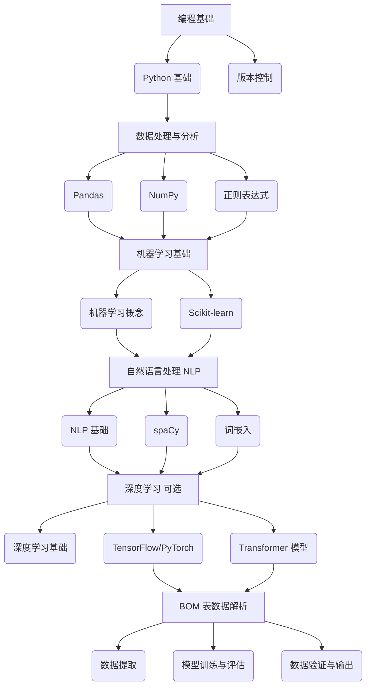

# BOM 处理模块
## 数据解析功能
为了达到你提出的技术路线，以下是一个最短学习树，它将帮助你系统地学习相关技术，并最终实现基于机器学习的 BOM 表数据解析功能。

**Level 0: 编程基础**

*   **Python 基础**
    *   语法、数据类型、控制流、函数、模块、面向对象编程
    *   学习资源：
        *   《Python Crash Course》
        *   《Automate the Boring Stuff with Python》
        *   在线课程：Codecademy, Coursera, edX
*   **版本控制**
    *   Git 基础：版本控制、分支管理、协作
    *   学习资源：
        *   《Pro Git》
        *   GitHub 官方教程

**Level 1: 数据处理与分析**

*   **Pandas**
    *   数据结构 (Series, DataFrame)、数据读取与写入、数据清洗、数据转换、数据聚合
    *   学习资源：
        *   Pandas 官方文档
        *   《Python for Data Analysis》
        *   在线课程：DataCamp, Udemy
*   **NumPy**
    *   数组操作、数值计算、线性代数
    *   学习资源：
        *   NumPy 官方文档
        *   《Python Data Science Handbook》
        *   在线课程：DataCamp, Udemy
*   **正则表达式**
    *   语法、匹配、替换、分组
    *   学习资源：
        *   《Mastering Regular Expressions》
        *   在线教程：RegexOne, Regular-Expressions.info

**Level 2: 机器学习基础**

*   **机器学习概念**
    *   监督学习、无监督学习、半监督学习、强化学习
    *   分类、回归、聚类、降维
    *   模型评估、过拟合、欠拟合
    *   学习资源：
        *   《Hands-On Machine Learning with Scikit-Learn, Keras & TensorFlow》-->[[Hands-On Machine Learning with Scikit-Learn, Keras & TensorFlow]]
        *   《The Elements of Statistical Learning》-->[[The Elements of Statistical Learning]]
        *   在线课程：Coursera (Machine Learning by Andrew Ng), edX
*   **Scikit-learn**
    *   常用模型 (线性回归、逻辑回归、决策树、随机森林、SVM、K 近邻)
    *   模型选择、交叉验证、网格搜索
    *   特征工程、特征选择
    *   学习资源：
        *   Scikit-learn 官方文档
        *   《Python Machine Learning》
        *   在线课程：DataCamp, Udemy

**Level 3: 自然语言处理 (NLP)**

*   **NLP 基础**
    *   文本预处理、分词、词干提取/词形还原、停用词去除
    *   词袋模型、TF-IDF、词嵌入
    *   学习资源：
        *   《Speech and Language Processing》
        *   《Natural Language Processing with Python》
        *   在线课程：Coursera, edX
*   **spaCy**
    *   文本处理流程、命名实体识别、依存句法分析
    *   学习资源：
        *   spaCy 官方文档
        *   在线教程：spaCy 101
*   **词嵌入**
    *   Word2Vec, GloVe, FastText
    *   学习资源：
        *   原始论文
        *   在线教程：TensorFlow 官方教程, PyTorch 官方教程

**Level 4: 深度学习 (可选)**

*   **深度学习基础**
    *   神经网络、反向传播、梯度下降
    *   卷积神经网络 (CNN)、循环神经网络 (RNN)、Transformer
    *   学习资源：
        *   《Deep Learning》
        *   在线课程：Coursera (Deep Learning Specialization by Andrew Ng), fast.ai
*   **TensorFlow/PyTorch**
    *   张量操作、模型构建、训练循环
    *   学习资源：
        *   TensorFlow 官方文档, PyTorch 官方文档
        *   在线教程：TensorFlow 官方教程, PyTorch 官方教程
*   **Transformer 模型**
    *   BERT, RoBERTa, DistilBERT
    *   学习资源：
        *   原始论文
        *   Hugging Face Transformers 官方文档
        *   在线教程：Hugging Face 官方教程

**Level 5: BOM 表数据解析**

*   **数据提取**
    *   Excel/CSV 文件解析：openpyxl, xlrd, csv
    *   PDF 文件解析：PyPDF2, pdfminer.six
    *   图像识别 (OCR)：Tesseract OCR
*   **模型训练与评估**
    *   命名实体识别 (NER)：CRF, RNN, Transformer
    *   文本分类：朴素贝叶斯, SVM, Transformer
    *   回归模型：线性回归, 决策树, 随机森林
*   **数据验证与输出**
    *   规则引擎、数据库存储

**学习树图示**

**学习建议**

*   **理论与实践相结合**：学习理论知识的同时，进行实际项目练习，巩固所学知识。
*   **分解任务**：将大型任务分解为小型任务，逐步完成。
*   **持续学习**：机器学习领域发展迅速，需要不断学习新的技术和方法。
*   **参与社区**：加入相关的技术社区，与其他开发者交流学习经验。

通过以上学习树，你可以系统地学习相关技术，并最终实现基于机器学习的 BOM 表数据解析功能。