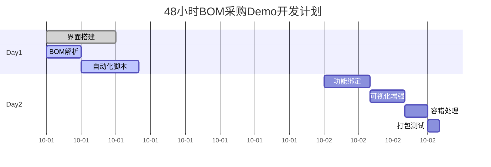
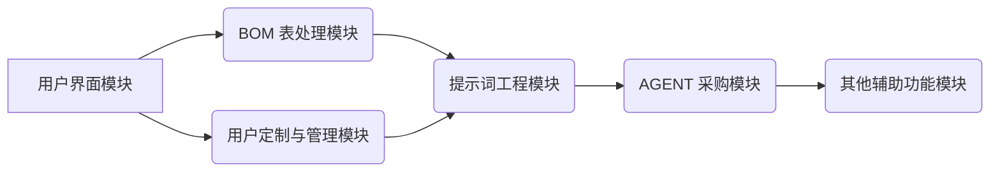
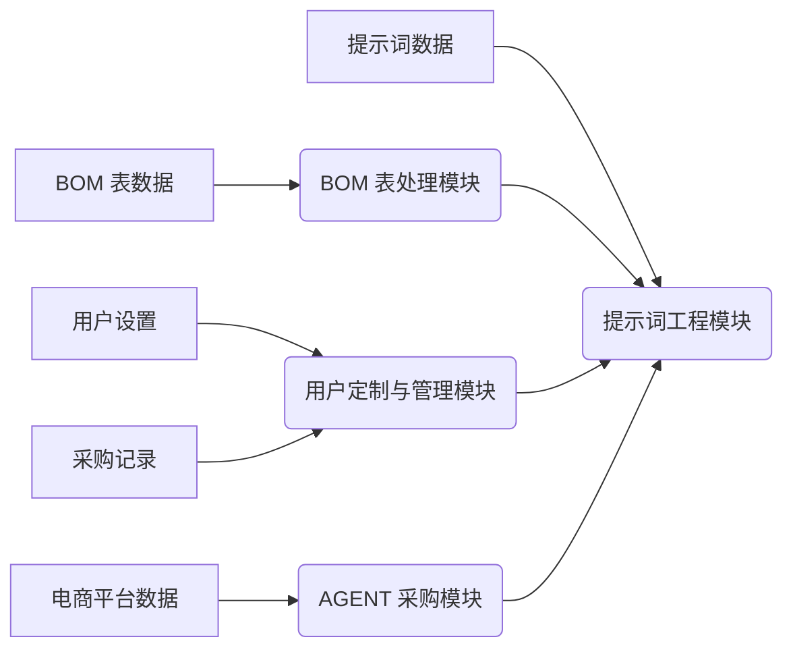
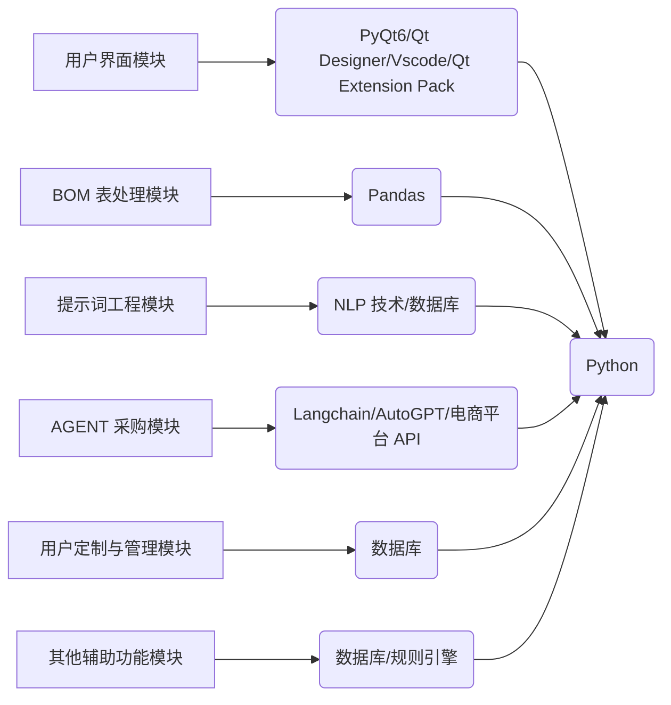
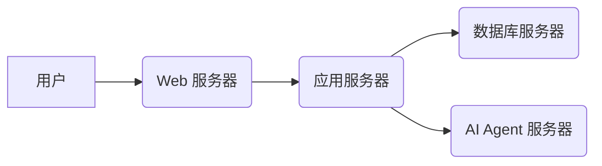

# 1. 项目前言
做电气设计时，按照[[4.流程]]做完成后，会有一步BOM物料表的采购过程。目前这个过程是比较麻烦的，因为需要根据 BOM 表格的信息进行目标元件的采购。且由于淘宝平台上不同商家对于同一个元件的价钱是不一样的，并且有包邮和不包邮的说法，所以需要反复的比对，比对完后再添加到购物车。目前我认为这样人工采购非常抵低效。需要构建一套方案实现BOM的自动化采购，将这一部分的重复劳动解放出来


# 2. 项目目的
项目目的是构建一套方案，以实现 PCB 设计中 BOM（物料清单）的自动化采购。当前人工采购 BOM 表格中的元件效率低下，因为需要手动比对淘宝上不同商家的价格和运费，然后逐个添加到购物车。自动化采购方案旨在解放这部分重复劳动，提高采购效率。


# 3. 项目要求
## 3.1. 功能要求
1. **数据抓取与整合**：
    
    - **元件信息抓取**：自动从淘宝、Digi-Key、Mouser 等电商平台抓取目标元件的详细信息，包括价格、库存、规格参数、商家信誉等。
    - **数据清洗与标准化**：对抓取到的数据进行清洗，去除无效信息，并将不同平台的数据进行标准化处理，方便后续比对。
    - **BOM 表导入与解析**：支持多种 BOM 表格式（如 CSV、Excel 等）的导入，并能准确解析 BOM 表中的元件信息。
2. **智能比价与推荐**：
    
    - **价格比较**：对同一元件在不同平台、不同商家的价格进行实时比较，考虑运费、税费等因素。
    - **最优方案推荐**：根据用户设定的优先级（如价格最低、交货时间最短、商家信誉最高等），推荐最优的采购方案。
    - **替代元件推荐**：当目标元件缺货或价格过高时，能自动推荐性能相近的替代元件。
3. **自动化采购流程**：
    
    - **自动添加购物车**：根据用户选择的采购方案，自动将元件添加到指定电商平台的购物车。
    - **订单管理**：支持订单的自动生成、跟踪和管理，包括订单状态更新、物流信息查询等。
    - **支付集成**：集成支付宝、微信支付等常用支付方式，方便用户完成支付。
4. **用户定制与管理**：
    
    - **个性化设置**：允许用户自定义采购规则、价格阈值、商家黑名单等。
    - **元件库管理**：提供元件库管理功能，方便用户维护和更新常用元件信息。
    - **采购记录**：记录用户的采购历史，方便用户查询和分析。
5. **其他辅助功能**：
    
    - **库存管理**：结合现有库存信息，避免重复采购。
    - **风险提示**：对潜在的采购风险进行提示，如元件停产、商家信誉不佳等。
    - **合规性检查**：检查采购的元件是否符合相关的环保、安全等合规性要求。


## 3.2. 软件要求

1. **用户体验（UX）方面：**
    
    - **直观易用**：界面布局清晰，功能模块划分合理，用户无需过多学习即可快速上手。
    - **操作流畅**：响应速度快，避免卡顿，保证用户操作的流畅性。
    - **引导性强**：对于初次使用的用户，提供必要的操作引导和提示，降低学习成本。
    - **可访问性**：考虑到不同用户的需求，提供必要的辅助功能，如字体大小调整、颜色主题切换等。
    - **反馈及时**：对于用户的操作，及时给出反馈，如加载状态、成功提示、错误提示等。
2. **信息呈现方面：**
    
    - **可视化数据**：采用图表、图形等方式，将复杂的数据信息进行可视化呈现，方便用户快速理解。例如，用柱状图展示不同商家的价格对比，用折线图展示价格趋势等。
    - **信息层级清晰**：合理组织信息层级，突出重点信息，避免信息过载。
    - **可定制化视图**：允许用户根据自己的需求，定制化显示内容和排序方式。
    - **数据筛选与搜索**：提供强大的数据筛选和搜索功能，方便用户快速找到目标元件。
3. **操作效率方面：**
    
    - **批量操作**：支持批量导入 BOM 表、批量添加购物车等操作，提高操作效率。
    - **快捷键支持**：提供常用的快捷键，方便用户进行快速操作。
    - **记忆功能**：记录用户的常用设置和操作习惯，减少重复操作。
    - **自动化流程**：尽可能地自动化采购流程，减少人工干预。
4. **视觉设计（UI）方面：**
    
    - **风格统一**：整体视觉风格保持统一，避免出现风格不一致的情况。
    - **色彩搭配合理**：选择合适的色彩搭配，突出重点信息，避免视觉疲劳。
    - **图标清晰易懂**：采用清晰易懂的图标，方便用户识别和操作。
    - **排版规范**：采用规范的排版方式，保证文字的可读性和美观性。
    - **响应式设计**：保证在不同设备上的显示效果和操作体验。


# 4. 技术调研
## 4.1. 一次调研
### 4.1.1. 技术路径

- ### 【**可行性分析**】

1. **数据抓取与整合**
    
    - **电商平台接口** ：  
        淘宝、Digi-Key、Mouser等平台可能提供API（如淘宝开放平台、Digi-Key API），但需处理权限申请和接口限制
    
        - 淘宝反爬机制严格，需结合代理IP池、验证码识别（如OCR或第三方服务）
            
        - 国际平台（如Digi-Key）数据结构化程度高，可通过API直接获取标准化数据
            
    - **数据清洗** ：  
        使用自然语言处理（NLP）技术标准化元件参数（如电阻值、封装类型），结合规则引擎处理非结构化数据
        
2. **智能比价与推荐**
    
    - **动态成本计算** ：  
        综合价格、运费、税费（如关税/增值税），需与物流API（如菜鸟网络）和税务规则库集成
    - **替代元件推荐** ：  
        基于元件参数相似度匹配（如使用余弦相似度或机器学习模型），需维护元件参数数据库或接入第三方元件库（如Octopart）
        
    
3. **自动化采购流程**
    
    - **购物车操作** ：  
        通过浏览器自动化工具（如Selenium）模拟用户操作，或与电商平台API对接（需权限）
    - **支付集成** ：  
        支付宝/微信支付需对接其开放平台SDK，需处理安全加密和用户授权
    
4. **风险与合规性**
    
    - **元件合规性检查** ：  
        需集成环保标准数据库（如RoHS、REACH），通过API或本地规则库实现
    - **商家信誉评估** ：  
        结合历史交易数据、用户评价评分（需爬取或通过平台API获取）
---


- #### 【 **技术选型建议**】

| **模块**    | **技术方案**                                  | **依据**                    |
| --------- | ----------------------------------------- | ------------------------- |
| **数据抓取**  | Scrapy + Puppeteer（动态渲染） + 代理池            | 处理复杂反爬（如淘宝），结合结构化数据解析<br> |
| **数据清洗**  | Pandas + 正则表达式 + NLP（spaCy）               | 标准化非结构化参数                 |
| **比价引擎**  | 动态规划算法（综合成本优化） + 机器学习模型（价格趋势预测）           | 结合实时数据与历史规律<br>           |
| **替代推荐**  | 向量相似度匹配（FAISS库） + 第三方元件数据库（如Octopart API） | 高效检索相似元件                  |
| **自动化操作** | Selenium + 浏览器扩展（如Tampermonkey）或电商平台API   | 兼容无API平台<br>              |
| **支付集成**  | 支付宝/微信支付SDK + 沙箱环境测试                      | 确保交易安全                    |
| **前端框架**  | React + Ant Design + ECharts（可视化）         | 满足复杂交互与数据可视化              |
| **后端框架**  | Python（Django/Flask） + Celery（异步任务）       | 处理高并发与分布式任务               |
| **数据库**   | PostgreSQL（结构化数据） + MongoDB（非结构化BOM表）     | 支持多格式数据存储[[3.1]]          |

### 4.1.2. 技术评价

| **维度**    | **评分（1-5）** | **说明**                                |
| --------- | ----------- | ------------------------------------- |
| **技术可行性** | 4           | 核心功能可通过现有技术实现，但需处理电商平台接口限制<br>        |
| **开发成本**  | 3           | 需投入爬虫、NLP、支付集成等专项开发，周期约6-8个月。         |
| **用户价值**  | 5           | 显著提升采购效率（预估节省70%人工时间），降低出错率           |
| **风险**    | 3           | 依赖第三方平台政策变化（如API权限收紧），需设计降级方案（如人工审核）。 |

---

**推荐优先级** ：

1. **核心功能** ：数据抓取、比价、自动化采购（购物车+支付）[[3.1]]。
2. **增值功能** ：替代元件推荐、库存管理、合规性检查[[3.1]]
3. **体验优化** ：可视化界面、批量操作、快捷键[[3.2]]。

---

**下一步建议** ：

- 启动最小可行产品（MVP）开发，优先实现淘宝/Digi-Key的比价与购物车自动化。
- 申请电商平台API权限，同步搭建代理池与数据清洗模块。
- 设计用户反馈机制，迭代优化推荐算法与界面交互。


### 4.1.3. 架构设计

#### （1）业务架构
1. **用户界面 (UI) 模块**：
    - **目标**：提供直观、易用的用户界面，实现与用户的交互，展示数据，接收用户指令。
    - **职责**：
        - **数据呈现**：以表格、图表等形式可视化地展示 BOM 表信息、比价结果、采购方案等。
        - **用户交互**：提供用户输入、操作的界面，如文件上传、参数设置、方案选择等。
        - **状态反馈**：及时反馈系统状态，如加载中、成功、失败等提示。
        - **界面逻辑**：处理界面相关的逻辑，如数据验证、格式转换、界面跳转等。
    - **技术实现**：
        - 根据 [项目历程](obsidian://open?file=7.%E9%A1%B9%E7%9B%AE%E7%B1%BB%2F%E8%87%AA%E5%88%9B%E7%B1%BB%2F%E8%AE%A1%E7%AE%97%E6%9C%BA%2FBOM%E5%A7%AC%2F%E9%A1%B9%E7%9B%AE%E5%8E%86%E7%A8%8B.md) 5.2 节，可考虑 PyQt6 + Qt Designer，或者 Vscode + Qt Extension Pack 结合 Fluent Design 风格的 Widget 组件库。
        - 使用 Matplotlib、ECharts 等库进行数据可视化。
2. **BOM 表处理模块**：
    - **目标**：负责 BOM 表的导入、解析、清洗和标准化，为后续的比价和采购提供准确的数据基础。
    - **职责**：
        - **格式兼容**：支持多种 BOM 表格式（CSV、Excel 等）的导入。
        - **数据解析**：准确解析 BOM 表中的元件信息，如型号、数量、参数等。
        - **数据清洗**：去除无效信息，处理数据格式不一致的问题。
        - **库存比对**：比对仓库数据库中现存的零件，防止重复购买造成浪费
    - **技术实现**：
        - 使用 Pandas 库进行数据处理。
        - 使用正则表达式进行数据清洗和标准化。
3. **电商平台数据抓取模块**：
    - **目标**：自动从淘宝、Digi-Key、Mouser 等电商平台抓取目标元件的详细信息，为比价提供数据来源。
    - **职责**：
        - **信息抓取**：抓取元件的价格、库存、规格参数、商家信誉等信息。
        - **反爬处理**：应对电商平台的反爬机制，保证数据抓取的稳定性。
        - **数据解析**：解析抓取到的网页数据，提取所需信息。
    - **技术实现**：
        - 根据 [项目历程](obsidian://open?file=7.%E9%A1%B9%E7%9B%AE%E7%B1%BB%2F%E8%87%AA%E5%88%9B%E7%B1%BB%2F%E8%AE%A1%E7%AE%97%E6%9C%BA%2FBOM%E5%A7%AC%2F%E9%A1%B9%E7%9B%AE%E5%8E%86%E7%A8%8B.md) 4.1 节，可考虑 Scrapy + Puppeteer + 代理池，或 Browser-use。
        - 使用 XPath/CSS 选择器提取数据。
4. **智能比价与推荐模块**：
    - **目标**：对同一元件在不同平台、不同商家的价格进行实时比较，并根据用户设定的优先级推荐最优采购方案。
    - **职责**：
        - **价格比较**：综合考虑价格、运费、税费等因素，进行实时比价。
        - **方案推荐**：根据用户设定的优先级（价格最低、交货时间最短、商家信誉最高等），推荐最优的采购方案。
        - **替代推荐**：当目标元件缺货或价格过高时，推荐性能相近的替代元件。
    - **技术实现**：
        - 使用动态规划算法进行综合成本优化。
        - 使用机器学习模型进行价格趋势预测。
        - 使用向量相似度匹配算法和第三方元件数据库进行替代元件推荐。
5. **自动化采购流程模块**：
    - **目标**：根据用户选择的采购方案，自动完成添加购物车、订单管理、支付等流程。
    - **职责**：
        - **自动加购**：自动将元件添加到指定电商平台的购物车。
        - **订单管理**：自动生成、跟踪和管理订单，包括订单状态更新、物流信息查询等。
        - **支付集成**：集成支付宝、微信支付等常用支付方式，完成支付。
    - **技术实现**：
        - 使用 Selenium 或电商平台 API 实现自动加购。
        - 集成支付宝/微信支付 SDK 实现支付功能。
6. **用户定制与管理模块**：
    - **目标**：提供用户个性化设置、元件库管理、采购记录查询等功能。
    - **职责**：
        - **个性化设置**：允许用户自定义采购规则、价格阈值、商家黑名单等。
        - **元件库管理**：提供元件库管理功能，方便用户维护和更新常用元件信息。
        - **采购记录**：记录用户的采购历史，方便用户查询和分析。
7. **其他辅助功能模块**：
    - **目标**：提供库存管理、风险提示、合规性检查等辅助功能，提高采购效率和质量。
    - **职责**：
        - **库存管理**：结合现有库存信息，避免重复采购。
        - **风险提示**：对潜在的采购风险进行提示，如元件停产、商家信誉不佳等。
        - **合规性检查**：检查采购的元件是否符合相关的环保、安全等合规性要求。

#### （2）应用架构


#### （3）数据架构


#### （4）部署架构


#### （5）部署架构


### 4.1.4. 实施路线

#### 长期路线

1. **MVP 阶段**：
    - **UI 模块**：实现基本的 BOM 表导入、数据显示和结果展示功能。
    - **BOM 表处理模块**：能够正确解析和处理 BOM 表数据。
    - **电商平台数据抓取模块**：能够从淘宝抓取元件价格信息。
    - **智能比价与推荐模块**：能够对淘宝上的元件进行简单比价，并推荐价格最低的方案。
    - **自动化采购流程模块**：能够模拟添加到淘宝购物车。
2. **迭代阶段**：
    - **UI 模块**：优化用户体验，增加个性化设置功能。
    - **BOM 表处理模块**：支持更多 BOM 表格式，提高数据清洗和标准化能力。
    - **电商平台数据抓取模块**：支持 Digi-Key、Mouser 等更多平台，提高数据抓取的稳定性和效率。
    - **智能比价与推荐模块**：实现更复杂的比价策略，如考虑运费、税费、商家信誉等因素，并提供替代元件推荐。
3. **完善阶段**：
    - **自动化采购流程模块**：实现自动支付和订单管理功能。
    - **用户定制与管理模块**：完善元件库管理和采购记录查询功能。
    - **其他辅助功能模块**：实现库存管理、风险提示、合规性检查等功能。

#### 快速路线



### 4.1.5. 预期收益

*   **效率提升** ：采购耗时从平均4小时/单缩短至15分钟（预估）
*   **成本节约** ：通过比价算法降低采购成本约12%-18%
*   **错误率下降** ：人工操作错误（如型号选错）减少90%以上

## 4.2. 二次调研


### **4.1.1. 技术路径**

#### （1）**数据抓取与清洗**

- **动态页面解析**  
    利用Browser-use的智能元素检测功能，自动识别电商平台（如淘宝）商品页面的动态加载内容

    。通过XPath/CSS选择器提取价格、库存等关键字段，支持JavaScript渲染页面的数据抓取
    
- **反爬策略突破**  
    结合代理IP池轮换（需额外部署）与Browser-use的浏览器指纹伪装功能，模拟人类操作行为（如随机点击、滚动），规避淘宝反爬机制

- **标准化处理**  
    通过正则表达式规则库（如"10kΩ±5%"→"10kΩ 5%误差"）清洗参数，利用spaCy进行命名实体识别（NER）统一参数命名
    

#### （2）**智能比价与采购**

- **成本计算模型**  
    嵌入运费计算API（如菜鸟裹裹）和税率规则库，构建动态成本公式：  
    `总成本 = 商品价 × (1+税率) + 运费 - 优惠券`，支持多平台横向对比
    
- **自动化采购流程**  
    使用Browser-use的`browser.page.click("加入购物车按钮")`等API，实现批量商品添加
    。通过预设商家信誉阈值（如评分≥4.8），自动过滤低信誉卖家
    

#### （3）**支付与订单管理**

- **支付流程自动化**  
    集成支付宝SDK，在Browser-use的沙箱环境中模拟支付流程。通过OCR识别支付二维码，结合用户预存的支付密码（加密存储）完成自动支付
    
- **订单跟踪系统**  
    使用Browser-use的定时任务功能，每小时自动登录电商平台抓取物流状态更新，通过WebSocket推送至用户界面
    
---

### **4.1.2. 技术评价**

| **功能**    | **Browser-use实现方式**  | **优势说明**             |
| --------- | -------------------- | -------------------- |
| **多平台兼容** | 智能适配Chrome/Firefox内核 | 统一操作淘宝/Digi-Key等不同站点 |
| **可视化调试** | 内置元素高亮与操作录屏          | 降低脚本调试难度             |
| **上下文记忆** | 自动保存会话Cookie与操作历史    | 免重复登录，提升效率           |
| **异常处理**  | 自动识别验证码弹窗并触发第三方打码服务  | 解决突发人机验证             |

---


### 4.1.3. 架构设计

### 4.1.3. 架构设计

#### （1）业务架构


#### （2）应用架构


<center><b>图：第二方案横向应用架构设计</b></center>

1.  **用户界面 (UI) 模块**：
    *   **目标**：提供直观、易用的用户界面，实现与用户的交互，展示数据，接收用户指令。
    *   **职责**：
        *   **数据呈现**：以表格、图表等形式可视化地展示 BOM 表信息、比价结果、采购方案等。
        *   **用户交互**：提供用户输入、操作的界面，如文件上传、参数设置、方案选择等。
        *   **状态反馈**：及时反馈系统状态，如加载中、成功、失败等提示。
        *   **界面逻辑**：处理界面相关的逻辑，如数据验证、格式转换、界面跳转等。
    *   **技术实现**：
        *   根据 [[7.项目类/自创类/计算机/BOM姬/项目历程]] 5.2 节，可考虑 PyQt6 + Qt Designer，或者 Vscode + Qt Extension Pack 结合 Fluent Design 风格的 Widget 组件库。
        *   使用 Matplotlib、ECharts 等库进行数据可视化。
2.  **BOM 表处理模块**：
    *   **目标**：负责 BOM 表的导入、解析、清洗和标准化，为后续的比价和采购提供准确的数据基础。
    *   **职责**：
        *   **格式兼容**：支持多种 BOM 表格式（CSV、Excel 等）的导入。
        *   **数据解析**：准确解析 BOM 表中的元件信息，如型号、数量、参数等。
        *   **数据清洗**：去除无效信息，处理数据格式不一致的问题。
        *   **库存比对**：比对零件库中现存的零件，防止重复购买
    *   **技术实现**：
        *   使用 Pandas 库进行数据处理。
        *   使用正则表达式进行数据清洗和标准化。
3.  **提示词工程模块**：
    *   **目标**：优化用于驱动 AGENT 采购模块的提示词，提高采购效率和准确性。
    *   **职责**：
        *   **提示词生成**：根据 BOM 表信息、用户偏好等，自动生成高质量的提示词。
        *   **提示词优化**：通过 A/B 测试、用户反馈等方式，不断优化提示词效果。
        *   **提示词管理**：对提示词进行分类、存储和版本控制，方便管理和维护。
        *   **提示词流化**：将提示词流程图化，即 Mermaid 化  
    *   **技术实现**：
        *   使用自然语言处理 (NLP) 技术进行提示词生成和优化。
        *   使用数据库或配置文件存储和管理提示词。
4.  **AGENT 采购模块**：
    *   **目标**：利用 AI Agent 自动完成元件比价、方案选择、下单支付等采购流程。
    *   **职责**：
        *   **价格比较**：综合考虑价格、运费、税费等因素，进行实时比价。
        *   **方案推荐**：根据用户设定的优先级（价格最低、交货时间最短、商家信誉最高等），推荐最优的采购方案。
        *   **自动下单**：自动将元件添加到指定电商平台的购物车，并完成下单支付。
        *   **异常处理**：处理采购过程中出现的异常情况，如缺货、价格变动等。
    *   **技术实现**：
        *   使用 AI Agent 技术，如 Langchain、AutoGPT 等。
        *   集成电商平台 API，实现自动下单和支付功能。
5.  **用户定制与管理模块**：
    *   **目标**：提供用户个性化设置、元件库管理、采购记录查询等功能。
    *   **职责**：
        *   **个性化设置**：允许用户自定义采购规则、价格阈值、商家黑名单等。
        *   **元件库管理**：提供元件库管理功能，方便用户维护和更新常用元件信息。
        *   **采购记录**：记录用户的采购历史，方便用户查询和分析。
6.  **其他辅助功能模块**：
    *   **目标**：提供库存管理、风险提示、合规性检查等辅助功能，提高采购效率和质量。
    *   **职责**：
        *   **库存管理**：结合现有库存信息，避免重复采购。
        *   **风险提示**：对潜在的采购风险进行提示，如元件停产、商家信誉不佳等。
        *   **合规性检查**：检查采购的元件是否符合相关的环保、安全等合规性要求。



#### （3）数据架构

数据架构图如下所示：



#### （4）技术架构

技术架构图如下所示：



#### （5）部署架构

部署架构图如下所示：




### **4.1.4. 实施路线**
#### （1）长期路线


#### （2）快速路线


### **五、预期收益**

- **效率提升** ：采购耗时从平均4小时/单缩短至15分钟（预估）
- **成本节约** ：通过比价算法降低采购成本约12%-18%
- **错误率下降** ：人工操作错误（如型号选错）减少90%以上[[3.1]]


# 5. 项目推进


### 5.2. 快速开发
#### **5.2.1. 开发策略**

1. **功能聚焦**  
    仅保留核心路径：`BOM导入 → 淘宝比价 → 自动加购`，其他功能（支付、合规检查等）以模拟数据展示。
    
2. **技术选型**
    
    - **GUI框架** ：PyQt6 + Qt Designer（拖拽式界面设计）
    - **自动化工具** ：Browser-use（预置电商模板）
    - **数据展示** ：Pandas表格 + Matplotlib折线图


#### **5.2.2. 分阶段开发计划**

##### （1）**核心功能实现**

**1. 界面搭建（6小时）**

```python
# 使用Qt Designer生成UI文件（bom_tool.ui）
# 包含以下控件：
# - 文件选择按钮（QFileDialog）
# - 表格控件（QTableWidget）显示BOM数据
# - 比价结果显示区（QTextEdit）
# - "开始比价"按钮
```

**2. BOM解析（3小时）**
```python
import pandas as pd

def load_bom(file_path):
    df = pd.read_excel(file_path)  # 支持Excel/CSV
    return df.to_dict('records')   # 转为元件列表
```
**3. 自动化脚本（5小时）**

```python
class MainWindow(QMainWindow):
    def __init__(self):
        super().__init__()
        uic.loadUi("bom_tool.ui", self)
        self.compare_btn.clicked.connect(self.run_comparison)
        
    def run_comparison(self):
        file_path = QFileDialog.getOpenFileName()[0]
        bom = load_bom(file_path)
        for part in bom:
            prices = compare_prices(part['型号'])
            self.result_text.append(f"{part['型号']} 最低价：{min(prices)}")
```

##### （2）**集成与优化**
**1. 功能绑定（4小时）**
```python
class MainWindow(QMainWindow):
    def __init__(self):
        super().__init__()
        uic.loadUi("bom_tool.ui", self)
        self.compare_btn.clicked.connect(self.run_comparison)
        
    def run_comparison(self):
        file_path = QFileDialog.getOpenFileName()[0]
        bom = load_bom(file_path)
        for part in bom:
            prices = compare_prices(part['型号'])
            self.result_text.append(f"{part['型号']} 最低价：{min(prices)}")

```
**2. 可视化增强（3小时）**
```python
import matplotlib.pyplot as plt
from PyQt6.QtWidgets import QVBoxLayout

def plot_prices(parts):
    fig, ax = plt.subplots()
    for part in parts:
        ax.plot(compare_prices(part), label=part)
    ax.legend()
    return fig

```
**3. 容错处理（2小时）**
```python
# 添加超时重试
@retry(tries=3, delay=2)
def safe_compare_prices(part):
    return compare_prices(part)

```

#### 5.2.3. 计划推进
##### （1）开发准备

###### 1）**MiniConda**
- ## 1.Miniconda简介

   Miniconda是一个更小的Anaconda发行版（Anaconda是一个包含大量预装[数据科学](https://so.csdn.net/so/search?q=%E6%95%B0%E6%8D%AE%E7%A7%91%E5%AD%A6&spm=1001.2101.3001.7020)和机器学习库的[Python发行版](https://so.csdn.net/so/search?q=Python%E5%8F%91%E8%A1%8C%E7%89%88&spm=1001.2101.3001.7020)），它只包含conda包管理器和Python以及其必要的库。Miniconda的目的是提供一个更轻量级的选项来安装和运行conda环境，同时保持Anaconda的核心功能。Miniconda可以安装在任何操作系统上，并且可以用于创建轻量级的Python环境，适合那些需要定制环境，不需要Anaconda完整发行版中所有组件的用户。使用Miniconda，用户可以轻松地安装、更新和管理Python包，以及创建隔离的Python环境。

- ## 2.使用背景

在进行项目开发中，一个项目中可能需要不同的Python的版本，而在系统内直接安装不同的Python版本会产生环境冲突、路径指向和管理复杂三个主要问题。 

使用Miniconda主要是通过创建虚拟环境的方式，一方面，避免本地多版本Python产生的管理复杂性和不稳定性。另一方面，为Python项目开发中实现环境隔离和依赖管理，确保不同项目能够使用特定版本的Python和库，避免版本冲突和依赖问题。

- ## 3.安装教程

- ### 1）下载地址

- #### a.通过清华镜像源下载（较快）

[Index of /anaconda/miniconda/ | 清华大学开源软件镜像站 | Tsinghua Open Source Mirror](https://mirrors.tuna.tsinghua.edu.cn/anaconda/miniconda/ "Index of /anaconda/miniconda/ | 清华大学开源软件镜像站 | Tsinghua Open Source Mirror")  


可以通过下滑选择latest最新版（笔者下载了[Miniconda3-latest-Windows-x86_64.exe](https://mirrors.tuna.tsinghua.edu.cn/anaconda/miniconda/Miniconda3-latest-Windows-x86_64.exe "Miniconda3-latest-Windows-x86_64.exe") ），也以点击Date选择对应系统需要的长期支持的Python版本。文件名中包含 `py39` 表示这些 Miniconda 版本预安装了 Python 3.9 （选择 Miniconda 安装包时的 Python 版本并不是未来进行Python开发时决定性的因素，即一个默认版本）。


- #### b.通过Miniconda官网下载

[Index of / (anaconda.com)](https://repo.anaconda.com/miniconda/ "Index of / (anaconda.com)")

同样根据需要选择对应的下载文件


- ### 2）安装包操作

这里选择的是latest版本的安装包，所以是py312。

这里根据个人需要选择安装路径。
 
  这里勾上将miniconda自动添加到环境变量中。
 

>**注意1:** 笔者在这一步卡住了，用任务管理器结束进程清空安装到一半的文件夹后，在重新安装的时候取消勾选`Register Miniconda3 as my default Python3.12` 就好了

>**注意2:** 如果你这一步忘记勾选添加环境变量，参考[windows系统miniconda配置环境变量 - 知乎](https://zhuanlan.zhihu.com/p/897327014)添加好系统环境变量，要不然后面执行包安装命令的时候你会因为没有使用 conda 激活环境导致包安装的位置错误 

取消两个勾选，Finish完成安装。 

 

- ### 3） 查看Miniconda

在菜单栏中直接打开或搜索Anaconda Prompt（注意：未来管理miniconda中虚拟环境均在此处，并非在命令指示符或PowerShell）


点击Anaconda Prompt看到以下信息则表示Miniconda安装成功。 


- ## 4.使用Miniconda（可跳）

>这一步纯粹是我写出来复习 Miniconda 用的，你们这一步可以跳过

以创建一个名为myenv的python版本为3.8的miniconda虚拟环境为示例介绍Miniconda的使用。

- ### 1）创建

```python
conda create -n myenv python=3.8
```

  输入创建代码后在Proceed（[y]/n）?处输入y，显示如图所示代码则表示myenv创建成功。（-n <虚拟环境名称>，n表示name。）


- ### 2）激活


```python
conda activate myenv # 有些 conda 环境没有名字只有路径，在把 myenv 替换成路径就能激活
```

激活并进入myenv虚拟环境，此时左侧base应变为虚拟环境名myenv。


- ### 3）安装

```csharp
pip install numpy#或conda install numpypip install -r requirements.txt pip list
```

以numpy包为例，使用pip install numpy。如果项目中已经准备好requirements.txt文件则使用第三行代码安装依赖文件中的所有项。下载完成后可以使用pip list查看此虚拟环境中pip安装的所有项。

> pip和conda install的区别：

**Conda只能在conda环境中安装包，但是可以安装各种语言、各种类型的包。**

**Pip可以在任何环境中安装包，但是只能安装Python包。**

- ### 4）关闭

```undefined
conda deactivate
```

安装完毕后退出myenv虚拟环境，此时右端（myenv）变回（base）。

- ### 5）查看

```bash
conda env list
```

   如果需要查看创建的所有虚拟环境，可使用以上代码获得如下图显示的Miniconda虚拟环境。（此处env表示environment） 

- ### 6）删除

```csharp
conda env remove -n myenv
```

使用完毕此虚拟环境后，用以上代码删除创建的myenv虚拟环境。即完成一个基础且完整的Miniconda使用流程。


- 【参考链接】
	- [Miniconda 安装及使用for windows（保姆级教程）-CSDN博客](https://blog.csdn.net/ming12131342/article/details/140233867)


###### **2）QtCreator**

- ## 1. QT简介

Qt是一个跨平台C++[图形用户界面](https://so.csdn.net/so/search?q=%E5%9B%BE%E5%BD%A2%E7%94%A8%E6%88%B7%E7%95%8C%E9%9D%A2&spm=1001.2101.3001.7020)（GUI）工具包，它由Qt公司（前身为Trolltech）开发和维护。自1995年发布以来，Qt因其强大的功能和跨平台能力，成为了许多软件开发者的首选工具。无论是在桌面应用程序、移动应用程序，还是嵌入式系统中，Qt都能提供一致的开发体验和高质量的用户界面。

**主要特点**

1. **跨平台支持**：Qt支持多个操作系统，包括Windows、macOS、Linux、iOS和Android。这使得开发者可以编写一次代码，并在多个平台上运行，极大地提高了开发效率。
    
2. **丰富的组件库**：Qt提供了丰富的预定义组件，如按钮、文本框、菜单、工具栏等，这些组件都经过精心设计，可以帮助开发者快速构建用户界面。此外，Qt还支持自定义组件，满足各种特定需求。
    
3. **强大的图形能力**：Qt内置了强大的2D和3D图形处理能力，支持OpenGL，能够创建复杂的图形界面和动画效果，适用于游戏开发、图形编辑软件等对图形性能有高要求的应用。
    
4. **信号与槽机制**：Qt独特的信号与槽机制提供了一种松耦合的事件处理方式，使得对象之间的通信更加灵活和高效，是Qt最具特色的功能之一。
    
5. **文档和社区支持**：Qt拥有详尽的文档和一个活跃的开发者社区。无论是新手还是有经验的开发者，都能在官方文档、论坛和各种教程中找到所需的帮助和资源。
    

**应用领域**

Qt广泛应用于各个领域，包括但不限于：

- **桌面应用程序**：如文本编辑器、媒体播放器、图形设计工具等。
- **移动应用程序**：支持iOS和Android平台的开发。
- **嵌入式系统**：用于家电、汽车、工业控制等领域的嵌入式设备开发。
- **游戏开发**：借助Qt的图形能力和跨平台特性，许多小型游戏开发者也选择使用Qt。

总的来说，Qt作为一个功能强大且灵活的[工具包](https://so.csdn.net/so/search?q=%E5%B7%A5%E5%85%B7%E5%8C%85&spm=1001.2101.3001.7020)，不仅简化了跨平台应用程序的开发过程，还提供了高质量的用户界面和丰富的功能组件。


---

- ## 2. 下载QT


**官方网站：**

[Qt | 软件开发全周期的各阶段工具](https://www.qt.io/zh-cn/ "Qt | 软件开发全周期的各阶段工具")

1. 页面右上角可以切换语言，点击Download try进入下载页面。


2. 点击**选择开源版**


3. 点击后会进入开源版的社区许可页面，不用管这个，向下拉找到下载按钮。


4. 选择对应的版本并下载，这里下载Windows版本，QT5.14.2之后的版本不再提供离线安装包，改为下载在线安装器。（小白的话别选离线的！）


5. 等待下载完成即可，然后点击打开。（程序是在后台下载的，这步不开科学环境可能会很慢）


6. 首先就是登录qt账户，如果没有可以自行注册一个。然后选择个人用户，之后点击下一步进行安装。


7. 这里选择没有，然后继续进行下一步


8. 选择合适的文件夹安装，路径不能包含中文字符、空格等特殊符号。然后选择第一个Custom Installation。


9. 选择CMake License Agreement


10. 继续点击下一步


11. 等待组件下载安装完成


大概需要10G的安装空间，安装完成后实际占用5G.

12. 安装完成，这里根据需求选择向导。可以选择 launch qt creator，因为接下来要配置软件。


---

- ## 3. 检查配置环境（可跳）

>这一步是C++开发环境的配置，也是为了复习用的。与此次配置 Python 没有太大关系，你们可以直接跳过

1. 安装完成后，打开编辑系统环境变量。


2. 选中系统变量中的Path，然后点击编辑。


3. 检查是否有这三个环境，如果没有根据自己的安装目录进行添加


---

- ## 4. 创建QT项目（可跳）

>这一步是C++开发环境的配置，也是为了复习用的。与此次配置 Python 没有太大关系，你们可以直接跳过


1. 点击创建项目


2. 均选择第一个，然后点选择


3. 输入项目名称、选择项目路径、点击下一步，项目名称和项目路径不能包含中文符号、空格等特殊字符。


4. 选择构建工具

- qmake是Qt提供的构建工具，用于简化 Qt 项目的构建过程。
- CMake 是一个跨平台的开源构建工具，用于管理和构建 C++ 程序的软件项目。与 qmake 类似，CMake 的目标是简化跨平台软件项目的构建过程。
- Qbs，全称：Qt Build Suite，是由Qt官方提供的一个跨平台构建工具，用于构建和管理Qt和非Qt项目。它是Qt Creator集成开发环境（IDE）的一部分，但也可以独立使用。


5. 选择基础类, 这里选择QWidget


6. 接下来下一步到选择构建套件

- 使用QtCreator编写时，选择**MinGW**对应的版本
- 使用Microsoft Visual Studio编写Qt程序则选择**MSVC**的对应版本


7. 点击下一步，点击完成，然后等待构建.  
此时Qt Creator会开始构建项目，右下角可以看见进度条。​​​​​​​


8. 点击右下角的绿色运行按钮，如果弹出这个框，则证明运行成功。


到此QT的下载安装以及基本环境配置就全部完成了。


- ## 5. Python GUI 开发配置


---

- ### 1. 环境：

> Product: Qt Creator 14.0.1  
> Based on: Qt 6.7.2 ([MSVC](https://so.csdn.net/so/search?q=MSVC&spm=1001.2101.3001.7020) 2019, x86_64)  
> Built on: Aug  6 2024 00:17:40  
> From revision: b567160861

---

- ####  1.1 打开QtCreator配置选项


依次点击下图所示选项


- #### 1.2 在你的qt creator里面添加你的python版本

在你的项目的，【构建】里面，右键，打开【管理构建套件】


这里面，找到python选项，


选取使用在Vscode 中使用 Miniconda 创建好的环境中的 Python 解释器（一般在 .conda 目录下）


在 Name 栏目把名字改成 Miniconda 创建时使用的版本，然后点击右下角的应用


此时你返回 Kit 条目配置界面，你会发现多了一项条目


- #### 1.3 创建运行一个 Python GUI 项目

点击如图所示按钮


选择创建的项目类型


然后返回你的 Vscode 创建一个空项目，我创建的空项目目录和默认文件如下（在这里我已经配置好了Miniconda的虚拟python开发环境）


在项目导航栏中建立一个你用于存放 QtCreator项目的目录（我这里是上面图中的 app 目录），然后复制其文件路径


完成后 QtDesigner 的创建界面如下


选择PySide6点击下一步


勾选之前添加的 Python 解释器，然后取消勾选使用虚拟环境


关于 Git 的选择，这里选择 None ，因为我们在 Vscode 中进行项目控制，点击下一步，项目初始化如下


点击上横幅中的两个 install ，等待终端出现如下标志


在项目中随便新建一个`untitled.ui`文件


点击该文件，就会自动进入Qt Designer 界面


点击该按钮可以退出出图形编辑模式


编辑好后在`Vsocde`的终端输入如下命令（Qt Creator 似乎没有设计一个按钮把 ui 文件转换为 Python 代码）

```
pyuic5 -o main.py untitled.ui # 注意你执行命令时候所在的文件夹
```


在 Qt Designer 中打开 `main.py` 在末尾处加入

```python
if __name__ == "__main__":
    import sys
    app = QtWidgets.QApplication(sys.argv)
    MainWindow = QtWidgets.QMainWindow()
    ui = Ui_MainWindow()
    ui.setupUi(MainWindow)
    MainWindow.show()
    sys.exit(app.exec_())
```


点击左下角的运行，查看效果若如下，QtDesigner 的基本使用到此结束


- 【参考链接】
	- [【2025版】最新Qt下载安装及配置教程（非常详细）零基础入门到精通，收藏这篇就够了_qt安装-CSDN博客](https://blog.csdn.net/logic1001/article/details/146321792)
	- [【Qt+Python项目构建】- 01-首次配置 Qt Creator 14.01 for Python_qt python-CSDN博客](https://blog.csdn.net/yellow_hill/article/details/142606451)
	- [Python Qt GUI设计：将UI文件转换为Python文件的三种妙招（基础篇—2） - 知乎](https://zhuanlan.zhihu.com/p/683813394)
	- ['pyuic5' 不是内部或外部命令，也不是可运行的程序 或批处理文件 - 知乎](https://zhuanlan.zhihu.com/p/461450612)


- 【问题集锦】
	- 【问题描述】执行`pyuic5 -o main.py untitled.ui`后终端报错如下
		```
		'pyuic5' 不是内部或外部命令，也不是可运行的程序 或批处理文件
		```
	- 【问题分析】在 Qt Creator 的命令行中没有识别出你配置的虚拟环境中的 Python，Qt Creator 默认终端使用的是配置在系统环境中的 Python ，
	- 【方案尝试】
		- ['pyuic5' 不是内部或外部命令，也不是可运行的程序 或批处理文件 - 知乎](https://zhuanlan.zhihu.com/p/461450612)

###### 3）Vscode

- #### 1.安装Qt Extension Pack 扩展


- #### 2.配置 Qt Extension Pack 扩展

ctrl+shift+p，输入Qt:scanf for kit 后回车


ctrl+shift+p，输入Qt:Open Qt Settings 回车，找到 Qt-core 项，然后把 Qt 安装的根目录复制进去（注意，路径符需要从`\`换成`/`）


ctrl+shift+p，输入Qt:Open Widget Designer 后选择当前被发现的 Qt 工具链


等待片刻后出现如下所示界面


随便创建一个窗口后保存窗口 ui 文件到你之前在vscode中创建的 app/appv1目录下，此时这个目录下文件应该有下图所示的这些文件


- #### 3. 在 Vscode 中完成 GUI 开发Python

依次点击如下图所示按钮，进入Qt Widget Designer


在该窗口中编辑控件，完成后按下 `ctrl+s` 保存


编辑完成后依次点击 Form-View Python Code 预览 Python 源代码

|  | <br> |
| -------------------------------------------------------------------------------------------- | ------------------------------------------------------------------------------------------------ |

点击左上角的复制按钮，把代码粘贴到 Vscode 中的main.py 中


在代码末端加入如下代码，要不然程序找不到运行入口点

```python
if __name__ == "__main__":
    import sys
    app = QtWidgets.QApplication(sys.argv)
    MainWindow = QtWidgets.QMainWindow()
    ui = Ui_MainWindow()
    ui.setupUi(MainWindow)
    MainWindow.show()
    sys.exit(app.exec_())
```

点击左上角的运行查看效果，若出现如下述右图所示的窗口，则本小节教程到此结束。

| <br> | <br> |
| ------------------------------------------------------------------------------------------------ | ------------------------------------------------------------------------------------------------ |

相比在 Qt Designer 中开发的方式，我更倾向于后者插件式开发，因为比较方便。Vsocde 也可以一样可以在终端执行下述命令去把 ui 文件转换为 Python 代码，然后在末尾补上上文所述述代码。

```bash
pyuic5 -o main.py untitled.ui # 注意你执行命令时候所在的文件夹
                             # main.py untitled.ui 可能得根据实际你的情况更改
```

- #### 4. 使用 Fluent Design 风格的 Widget 组件库开发（可跳）

- ##### 4.1. 简介

这是一个使用 [PyQt](https://so.csdn.net/so/search?q=PyQt&spm=1001.2101.3001.7020)/PySide 编写的 Fluent Design 风格的组件库，支持亮暗主题无缝切换和自定义主题色，搭配 QtDesigner 可以快速开发美观的界面。 [Github仓库地址](https://github.com/zhiyiYo/PyQt-Fluent-Widgets) ，演示视频可以在[哔哩哔哩](https://www.bilibili.com/video/BV12c411L73q/?vd_source=4219ed42e06f6bcb499deb3cd1148762#reply269126789)上观看。


 
| 下拉框                                                                              | 颜色对话框                                                                            | 消息框                                                                              |
| -------------------------------------------------------------------------------- | -------------------------------------------------------------------------------- | -------------------------------------------------------------------------------- |
|  |  |  |
| 侧边导航                                                                             | 开关按钮                                                                             | 工具提示                                                                             |
|  |  |  |
<center><b>表：widget 控件一览</b></center>


- ##### 4.2. 安装

>由于笔者的 Python 版本是 3.12 对 PyQt5/Qt6 适配不好，所以用 PySide6 库了（需要科学环境+PiP 安装代理设置好）

轻量版 (`AcrylicLabel` 不可用):

```
pip install PySide6-Fluent-Widgets -i https://pypi.org/simple/
```

完整版：

```
pip install "PySide6-Fluent-Widgets[full]" -i https://pypi.org/simple/
```

如果项目中使用的是 PySide2、PySide6 或者 PyQt6，可以在 [PySide2](https://github.com/zhiyiYo/PyQt-Fluent-Widgets/tree/PySide2)、[PySide6](https://github.com/zhiyiYo/PyQt-Fluent-Widgets/tree/PySide6) 和 [PyQt6](https://github.com/zhiyiYo/PyQt-Fluent-Widgets/tree/PyQt6) 分支下载对应的代码。

> **注意:** 请勿同时安装 PyQt-[Fluent](https://so.csdn.net/so/search?q=Fluent&spm=1001.2101.3001.7020)-Widgets、PyQt6-Fluent-Widgets、PySide2-Fluent-Widgets 和 PySide6-Fluent-Widgets，因为他们的包名都是 `qfluentwidgets`。

>**提示:** 其他 GUI库对应的安装命令在[安装 | QFluentWidgets](https://qfluentwidgets.com/zh/pages/install)中找


- ##### 4.3. 运行（可跳）

安装完 pyqt-fluent-widgets 包并且下载好仓库源代码之后，可以切换到 `examples` 目录下运行示例代码，比如封面对应的示例代码：

```
cd examples/settings
python demo.py
```

如果遇到 `ImportError: cannot import name 'XXX' from 'qfluentwidgets'`，这表明安装的包版本过低。可以按照上面的安装指令将 pypi 源替换为 [https://pypi.org/simple](https://pypi.org/simple) 并重新安装.

建议在使用之前阅读一下在线帮助文档，里面介绍了使用这个组件库的正确姿势：[文档地址](https://pyqt-fluent-widgets.readthedocs.io/zh_CN/latest)

- ##### 4.4. 搭配QtDesigner

在 Qt Designer 中，有两种使用 PyQt-Fluent-Widgets 的方式。


- 第一种方法是在控件中提升类
	- 右击一个小部件，选择右击菜单上的提升为, 是把原生部件替换成自定义小部件，在这个例子中是 `qfluentwidgets.PushButton`  
    


- 弹出的对话框上需要填写自定义的组件名。头文件是组件库的包名 `qfluentwidgets`，提升的类名称为 `PushButton`。  


- 完成提升后不会在设计师中看到任何变化，保存 ui 文件后编译为 py 代码，可以发现 `import` 的是 `PushButton`


- 第二种方法是使用插件。（**这个打包了FluentWidgets的Qt Designer是收费的，没钱用方法一**）
    运行 `python ./tools/designer.py` 来启动设计师软件（必须使用脚本启动）  
    一切无误的情况下能在侧边栏 Widget Box 中看到 PyQt-Fluent-Widgets 的组件。


- 【参考链接】
	- [vscode qt 最新开发环境配置， 基于最新插件 Qt All Extensions Pack_vscode配置qt开发环境-CSDN博客](https://blog.csdn.net/qq_51355375/article/details/142623120)
	- [Pyqt5+PyQt-Fluent-Widgets+Pycharm环境安装 - 知乎](https://zhuanlan.zhihu.com/p/641791925)
	- [告别原始 UI 样式，拥抱 Fluent Design 风格 PyQt/PySide 组件库_python fluent design-CSDN博客](https://blog.csdn.net/zhiyiYo/article/details/131328168)


##### （2）Browser-use  研究

使用 [GitDiagram](https://gitdiagram.com/) 对项目结构进行初步分析，对项目整体架构的


1. 首先，让我们拉取项目到本地

```bash
git clone https://github.com/browser-use/web-ui.git # 拉取项目 
cd web-ui # 进到这个项目里`
```
2. 安装依赖项：

```bash
pip install browser-use
```

3. 安装 Playwright

```bash
playwright install
```

4. 安装项目依赖

```
pip install -r requirements.txt
```

5. 配置环境变量

基于 `.env.example` 复制一个 `.env` 文件，并在 `.env` 文件中修改以下信息

```bash
# 路径 Chrome 浏览器路径（检查下自己的路径），例如 
# Mac OS "/Applications/Google Chrome.app/Contents/MacOS/Google Chrome" 
# Windows "C:\Program Files\Google\Chrome\Application\chrome.exe" 
CHROME_PATH="/Applications/Google Chrome.app/Contents/MacOS/Google Chrome" 

# 浏览器的用户数据路径，例如 
# Mac OS "/Users/<YourUsername>/Library/Application Support/Google/Chrome" 
# Windows "C:\Users\<YourUsername>\AppData\Local\Google\Chrome\User Data" 
CHROME_USER_DATA="/Users/<YourUsername>/Library/Application Support/Google/Chrome" 

# 还有一些大模型的 API Key 也要改 ...
```

6. 启动运行

执行如下命令启动


```
python webui.py --ip 127.0.0.1 --port 7788
```

启动成功如下所示：


浏览器访问 `http://127.0.0.1:7788/`，看到如下界面就成功了


##### （3）开始编码


### 5.3. 长期开发
##### 5.3.1. BOM表处理模块


<center><b>图：BOM表模块应用功能</b></center>


<center><b>图：BOM表数据格式</b></center>


###### （1）数据导入功能
- 目的：初期阶段仅支持`xlsx`文件，后续可能引入对`pdf`或者是一般`png`的支持

###### （2）数据解析功能
- 目的：准确解析 BOM 表中的元件信息，如型号、数量、参数，为后续构建采购提示词提供基础


- # **1. 技术选型**

*   **编程语言**：Python
*   **数据处理库**：Pandas
*   **机器学习库**：Scikit-learn, TensorFlow, PyTorch
*   **自然语言处理 (NLP) 库**：spaCy, NLTK
*   **Excel/CSV 文件解析**：openpyxl, xlrd, csv
*   **PDF 文件解析**：PyPDF2, pdfminer.six
*   **图像识别 (OCR)**：Tesseract OCR
*   **数据库**：PostgreSQL, MongoDB

- # **2. 实现流程**

1.  **文件格式识别**

    *   与之前的流程相同，确定 BOM 表的文件类型。
2.  **数据提取**

    *   与之前的流程相同，使用 Pandas, PyPDF2, pdfminer.six, Tesseract OCR 等提取数据。
3.  **数据预处理**

    *   **文本清洗**：
        *   去除特殊字符、HTML 标签等。
        *   转换为小写。
        *   去除停用词（如 "的", "是", "在" 等）。
    *   **分词**：
        *   将文本分割成单词或短语。
    *   **词干提取/词形还原**：
        *   将单词转换为其基本形式（例如，"running" 转换为 "run"）。
    *   **向量化**：
        *   将文本转换为数值向量，以便机器学习模型可以处理。常用的方法包括：
            *   **词袋模型 (Bag of Words)**：统计每个单词在文本中出现的次数。
            *   **TF-IDF (Term Frequency-Inverse Document Frequency)**：考虑单词在整个文档集合中的重要性。
            *   **词嵌入 (Word Embeddings)**：使用预训练的词向量（如 Word2Vec, GloVe, FastText）或训练自定义的词向量。

            ```python
            from sklearn.feature_extraction.text import TfidfVectorizer
            
            # 创建 TF-IDF 向量化器
            vectorizer = TfidfVectorizer()
            
            # 将文本数据转换为 TF-IDF 向量
            tfidf_matrix = vectorizer.fit_transform(text_data)
            ```
4.  **特征工程**

    *   **目的**：创建用于训练机器学习模型的特征。
    *   **方法**：
        *   **文本特征**：TF-IDF 向量、词嵌入向量。
        *   **数值特征**：数量、价格等。
        *   **类别特征**：元件类型、封装类型等。
        *   **组合特征**：将多个特征组合在一起，例如将元件类型和封装类型组合成一个新的特征。
5.  **模型训练**

    *   **目的**：训练机器学习模型，用于识别和提取 BOM 表中的关键信息。
    *   **模型选择**：
        *   **命名实体识别 (NER)**：
            *   **条件随机场 (CRF)**：适用于序列标注任务，可以识别文本中的实体（如型号、参数）。
            *   **循环神经网络 (RNN)**：特别是 LSTM 和 GRU，适用于处理序列数据。
            *   **Transformer 模型**：如 BERT, RoBERTa, DistilBERT，可以提供更强大的文本表示能力。
        *   **文本分类**：
            *   **朴素贝叶斯 (Naive Bayes)**：简单快速，适用于文本分类任务。
            *   **支持向量机 (SVM)**：适用于高维数据，可以处理复杂的文本分类问题。
            *   **Transformer 模型**：如 BERT, RoBERTa, DistilBERT，可以用于文本分类任务。
        *   **回归模型**：
            *   **线性回归 (Linear Regression)**：适用于预测数值型数据。
            *   **决策树 (Decision Tree)**：适用于处理非线性关系。
            *   **随机森林 (Random Forest)**：集成学习方法，可以提高预测准确率。
    *   **训练数据准备**：
        *   需要准备带有标签的训练数据，例如：

            ```json
            [
                {"text": "10kΩ 电阻，5% 误差", "entities": [{"start": 0, "end": 5, "label": "电阻值"}, {"start": 8, "end": 11, "label": "误差"}]},
                {"text": "型号：LM358，数量：100", "entities": [{"start": 3, "end": 8, "label": "型号"}, {"start": 12, "end": 15, "label": "数量"}]}
            ]
            ```
    *   **训练过程**：
        *   将训练数据分为训练集和验证集。
        *   使用训练集训练模型，并使用验证集评估模型性能。
        *   调整模型参数，直到模型在验证集上达到满意的性能。

            ```python
            from sklearn.model_selection import train_test_split
            from sklearn.linear_model import LogisticRegression
            
            # 划分训练集和测试集
            X_train, X_test, y_train, y_test = train_test_split(tfidf_matrix, labels, test_size=0.2)
            
            # 创建 Logistic 回归模型
            model = LogisticRegression()
            
            # 训练模型
            model.fit(X_train, y_train)
            
            # 评估模型
            accuracy = model.score(X_test, y_test)
            print(f"Accuracy: {accuracy}")
            ```
6.  **信息提取**

    *   **目的**：使用训练好的机器学习模型，从 BOM 表中提取关键元件信息。
    *   **方法**：
        *   将 BOM 表中的文本数据进行预处理和特征工程。
        *   使用训练好的模型预测文本中的实体或类别。
        *   根据预测结果提取关键信息（型号、数量、参数等）。
7.  **数据验证**

    *   **目的**：验证提取的数据是否准确和完整。
    *   **方法**：
        *   检查关键字段是否为空。
        *   对数量、参数等进行范围检查。
        *   与已知的元件库进行比对，验证型号的有效性。
        *   使用规则引擎或人工审核，纠正模型预测错误。
8.  **数据输出**

    *   **目的**：将提取的结构化数据输出为后续模块可用的格式。
    *   **方法**：
        *   保存为 CSV 或 Excel 文件。
        *   存储到数据库（如 PostgreSQL 或 MongoDB）。
        *   传递给后续的提示词工程模块。

- # **3. 代码示例**

以下是一个简化的示例，展示如何使用 spaCy 和机器学习模型进行命名实体识别：

```python
import spacy
import pandas as pd
from sklearn.model_selection import train_test_split
from sklearn.feature_extraction.text import TfidfVectorizer
from sklearn.linear_model import LogisticRegression
from sklearn.metrics import accuracy_score

# 加载 spaCy 模型
nlp = spacy.load("zh_core_web_sm")

# 准备训练数据
train_data = [
    ("10kΩ 电阻，5% 误差", {"entities": [(0, 5, "RESISTANCE"), (8, 11, "ERROR")]}),
    ("型号：LM358，数量：100", {"entities": [(3, 8, "MODEL"), (12, 15, "QUANTITY")]})
]

# 提取文本和标签
texts, annotations = zip(*train_data)
labels = []
for doc in nlp.pipe(texts):
    entities = [ent.label_ for ent in doc.ents]
    labels.append(entities)

# 向量化文本数据
vectorizer = TfidfVectorizer()
X = vectorizer.fit_transform(texts)

# 训练分类模型
X_train, X_test, y_train, y_test = train_test_split(X, labels, test_size=0.2)
model = LogisticRegression()
model.fit(X_train, y_train)

# 评估模型
y_pred = model.predict(X_test)
accuracy = accuracy_score(y_test, y_pred)
print(f"Accuracy: {accuracy}")

# 使用模型进行预测
test_text = "2.2kΩ 电阻"
doc = nlp(test_text)
entities = []
for ent in doc.ents:
    entities.append((ent.text, ent.label_))
print(entities)
```

- # **4. 注意事项**

*   **训练数据质量**：机器学习模型的性能高度依赖于训练数据的质量和数量。需要准备充足且带有准确标签的训练数据。
*   **模型选择与调参**：不同的机器学习模型适用于不同的任务。需要根据实际情况选择合适的模型，并进行参数调整以达到最佳性能。
*   **模型解释性**：机器学习模型可能难以解释其预测结果。需要使用模型解释性技术（如 LIME, SHAP）来理解模型的决策过程。
*   **模型部署与维护**：机器学习模型的部署和维护需要一定的技术支持。需要考虑模型的版本管理、性能监控和持续训练。

通过以上流程和技术选型，可以实现对 BOM 表中元件信息的智能解析，提高数据提取的准确性和效率。

###### （3）库存比对功能


###### （4）数据标记功能
- 目的：清洗掉导入文件中异常的数据行，防止生成错误采购条目，初期不考虑实现


# 6. 技术变更

- # 变更一

方案2.0.对比方案1.0最主要就是UI开发框架的更换。因为经过油田仓库管理系统一项目之后，我认为为 PySide 无法直接在调试模式获取 DOM 视图的缺点非常影响开发效率，且现有 AI 工具几乎无法直接生成基于 PySide 的预览视图（比如Qwen）。因此我将开发语言换成了JSX，即 React，在保留了网页开发简易性的同时也能够在后期凭借 React Native 迅速的转化成多平台应用。

<center><b>表：重构 UI 演示</b></center>

|                                                BOM上传                                                 |                                                BOM解析                                                 |                                                BOM比价                                                 |                                                BOM采购                                                 |
| :--------------------------------------------------------------------------------------------------: | :--------------------------------------------------------------------------------------------------: | :--------------------------------------------------------------------------------------------------: | :--------------------------------------------------------------------------------------------------: |
| <br> | <br> | <br> | <br> |
|                                                                                                      |                                                                                                      |                                                                                                      |                                                                                                      |

- # 变更二

由于 MCP 协议的盛行，导致原先我对开源项目 browser-use 的技术方向产生了怀疑，因为 browser-use 像是一个半 MCP 项目，没有完成全 MCP 化。


### 5.2.1. 架构更改
#### （1）业务架构
1. **用户界面 (UI) 模块**：
    - **目标**：提供直观、易用的用户界面，实现与用户的交互，展示数据，接收用户指令。
    - **职责**：
        - **数据呈现**：以表格、图表等形式可视化地展示 BOM 表信息、比价结果、采购方案等。
        - **用户交互**：提供用户输入、操作的界面，如文件上传、参数设置、方案选择等。
        - **状态反馈**：及时反馈系统状态，如加载中、成功、失败等提示。
        - **界面逻辑**：处理界面相关的逻辑，如数据验证、格式转换、界面跳转等。
    - **技术实现**：
        - 根据 [项目历程](obsidian://open?file=7.%E9%A1%B9%E7%9B%AE%E7%B1%BB%2F%E8%87%AA%E5%88%9B%E7%B1%BB%2F%E8%AE%A1%E7%AE%97%E6%9C%BA%2FBOM%E5%A7%AC%2F%E9%A1%B9%E7%9B%AE%E5%8E%86%E7%A8%8B.md) 5.2 节，可考虑 PyQt6 + Qt Designer，或者 Vscode + Qt Extension Pack 结合 Fluent Design 风格的 Widget 组件库。
        - 使用 Matplotlib、ECharts 等库进行数据可视化。
2. **BOM 表处理模块**：
    - **目标**：负责 BOM 表的导入、解析、清洗和标准化，为后续的比价和采购提供准确的数据基础。
    - **职责**：
        - **格式兼容**：支持多种 BOM 表格式（CSV、Excel 等）的导入。
        - **数据解析**：准确解析 BOM 表中的元件信息，如型号、数量、参数等。
        - **数据清洗**：去除无效信息，处理数据格式不一致的问题。
        - **库存比对**：比对仓库数据库中现存的零件，防止重复购买造成浪费
    - **技术实现**：
        - 使用 Pandas 库进行数据处理。
        - 使用正则表达式进行数据清洗和标准化。
3. **电商平台数据抓取模块**：
    - **目标**：自动从淘宝、Digi-Key、Mouser 等电商平台抓取目标元件的详细信息，为比价提供数据来源。
    - **职责**：
        - **信息抓取**：抓取元件的价格、库存、规格参数、商家信誉等信息。
        - **反爬处理**：应对电商平台的反爬机制，保证数据抓取的稳定性。
        - **数据解析**：解析抓取到的网页数据，提取所需信息。
    - **技术实现**：
        - 根据 [项目历程](obsidian://open?file=7.%E9%A1%B9%E7%9B%AE%E7%B1%BB%2F%E8%87%AA%E5%88%9B%E7%B1%BB%2F%E8%AE%A1%E7%AE%97%E6%9C%BA%2FBOM%E5%A7%AC%2F%E9%A1%B9%E7%9B%AE%E5%8E%86%E7%A8%8B.md) 4.1 节，可考虑 Scrapy + Puppeteer + 代理池，或 Browser-use。
        - 使用 XPath/CSS 选择器提取数据。
4. **智能比价与推荐模块**：
    - **目标**：对同一元件在不同平台、不同商家的价格进行实时比较，并根据用户设定的优先级推荐最优采购方案。
    - **职责**：
        - **价格比较**：综合考虑价格、运费、税费等因素，进行实时比价。
        - **方案推荐**：根据用户设定的优先级（价格最低、交货时间最短、商家信誉最高等），推荐最优的采购方案。
        - **替代推荐**：当目标元件缺货或价格过高时，推荐性能相近的替代元件。
    - **技术实现**：
        - 使用动态规划算法进行综合成本优化。
        - 使用机器学习模型进行价格趋势预测。
        - 使用向量相似度匹配算法和第三方元件数据库进行替代元件推荐。
5. **自动化采购流程模块**：
    - **目标**：根据用户选择的采购方案，自动完成添加购物车、订单管理、支付等流程。
    - **职责**：
        - **自动加购**：自动将元件添加到指定电商平台的购物车。
        - **订单管理**：自动生成、跟踪和管理订单，包括订单状态更新、物流信息查询等。
        - **支付集成**：集成支付宝、微信支付等常用支付方式，完成支付。
    - **技术实现**：
        - 使用 Selenium 或电商平台 API 实现自动加购。
        - 集成支付宝/微信支付 SDK 实现支付功能。
6. **用户定制与管理模块**：
    - **目标**：提供用户个性化设置、元件库管理、采购记录查询等功能。
    - **职责**：
        - **个性化设置**：允许用户自定义采购规则、价格阈值、商家黑名单等。
        - **元件库管理**：提供元件库管理功能，方便用户维护和更新常用元件信息。
        - **采购记录**：记录用户的采购历史，方便用户查询和分析。
7. **其他辅助功能模块**：
    - **目标**：提供库存管理、风险提示、合规性检查等辅助功能，提高采购效率和质量。
    - **职责**：
        - **库存管理**：结合现有库存信息，避免重复采购。
        - **风险提示**：对潜在的采购风险进行提示，如元件停产、商家信誉不佳等。
        - **合规性检查**：检查采购的元件是否符合相关的环保、安全等合规性要求。

#### （2）应用架构


#### （3）数据架构


#### （4）部署架构


#### （5）部署架构
# 7. 推进变更


# 6. 项目完善


# 7. 项目总结


