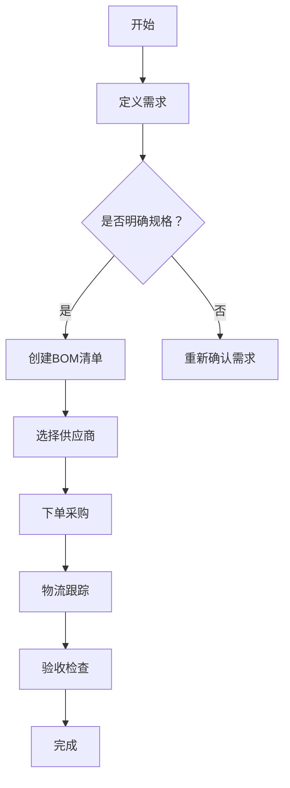

# 准备阶段
## 导入BOM表

## BOM表重整

在前面提取出BOM表重整理的基础上，重新根据嘉立创的器件分类对元器件特征列的元件进行按照如下所示的分类。

### **1. 电容（Capacitors）**

|Comment|Designator|Footprint|
|---|---|---|
|10uF|C1|C0603|
|100nF|C2|C0603|
|100nF|C3, C4|C0603|

---

### **2. 连接器（Connectors）**

|Comment|Designator|Footprint|
|---|---|---|
|1.5mm间距3P弯脚贴|CN1|CONN-SMD_HX15001-3AWB|
|typec|USB1|USB-C-SMD_KH-TYPE-C-16P|
|Battery|U5|CONN-SMD_2.0-2PWT|

---

### **3. LED与光学元件（Optical Components）**

|Comment|Designator|Footprint|
|---|---|---|
|YLED0603R|LED1|LED0603-FD|
|红外38K接收管-侧放|OPTO1|OPTO-TH_3P-BD5.9-P2.54|

---

### **4. 电阻（Resistors）**

|Comment|Designator|Footprint|
|---|---|---|
|500mΩ|R1|R0603|
|330Ω|R2|R0603|
|2kΩ|R3|R0603|
|1mΩ|R5|R0603|
|1.58MCQ/用1.6MCQ代替|R7|R1206|

---

### **5. 集成电路（Integrated Circuits）**

|Comment|Designator|Footprint|
|---|---|---|
|2.4GHz|U1|WIFIM-SMD_ESP-07|
|CH340K|U8|ESOP-10_L4.9-W3.9-P1.00-LS6.2-BL-EP|
|SGM8198XN5G/TR|U11|SOT-23-5|

---

### **6. 显示屏（Displays）**

|Comment|Designator|Footprint|
|---|---|---|
|HS91L02W2C01|OLED1|OLED-TH_L38.0-W12.0_HS91L02W2C01|

---

### **7. 稳压器（Voltage Regulators）**

|Comment|Designator|Footprint|
|---|---|---|
|AMS1117-3.3|U9|SOT-223|

---

### **8. 其他（Others）**

|Comment|Designator|Footprint|
|---|---|---|
|LTH7S|U4|SOT-23-5_L3.0-W1.7-P0.95-LS2.8-BR|

## 重整结果确认

## BOM表采购

![[UI功能]]

### **1. 准备BOM清单**

- **明确需求** ：根据设计要求建立初始BOM清单，包含元件名称、规格、数量、版本等信息，并确保准确性以避免采购错误
- **使用模板优化** ：可下载淘宝上的BOM物料清单Excel模板（如“BOM物料投产跟踪表”），便于跟踪采购进度和库存管理
---

### **2. 选择供应商**

- **搜索匹配供应商** ：在淘宝搜索所需元器件时，优先选择评价高、支持“淘供销”服务的供应商，确保供应链稳定
- **核对参数** ：确认供应商提供的元件规格与BOM清单一致，如封装类型、耐压值等关键参数
---

### **3. 创建采购订单**

- **生成采购单** ：登录淘宝/店小秘等工具，进入“采购—采购订单”页面，选择对应SKU或变种商品，填写采购数量并保存
    。
- **批量操作** ：若采购多型号元件，可使用“一键下单”功能快速生成订单，减少重复操作
---

### **4. 下单与支付**

- **在线下单** ：通过“淘供销”通道提交订单，系统会自动关联采购单与供应商后台，确保信息同步
- **支付注意事项** ：选择正确的支付账户（如区分个人或企业账户），并核对订单金额与物流方式
---

### **5. 物流与收货检查**

- **跟踪物流** ：通过淘宝订单页面或第三方工具（如妙手ERP）实时跟踪物流状态，确保按时到货
- **验收检查** ：收到货物后，核对实物与BOM清单是否一致，检查元件外观、批次号及测试报告（如适用）

---

### **6. 质量控制**

- **功能测试** ：对关键元器件进行基本功能测试（如电阻测量、芯片引脚测试），排除运输损坏或参数不符的情况
- **记录异常** ：若发现问题，及时联系供应商退换货，并更新BOM清单中的供应商评估记录

---

### **7. 维护与优化**

- **更新BOM表** ：记录实际采购的元件型号、供应商信息及价格，完善BOM表的可追溯性
- **优化采购策略** ：定期分析供应商交货速度、价格波动等数据，选择更可靠的长期合作方
---

### **注意事项**

- **规避风险** ：小额试单验证供应商可靠性后再大批量采购，尤其针对小众或定制化元件
- **备用方案** ：为关键元件预留替代供应商，避免供应链中断

通过以上流程，个人电子工程师可在淘宝高效完成BOM物料采购，同时降低采购风险并提升效率。